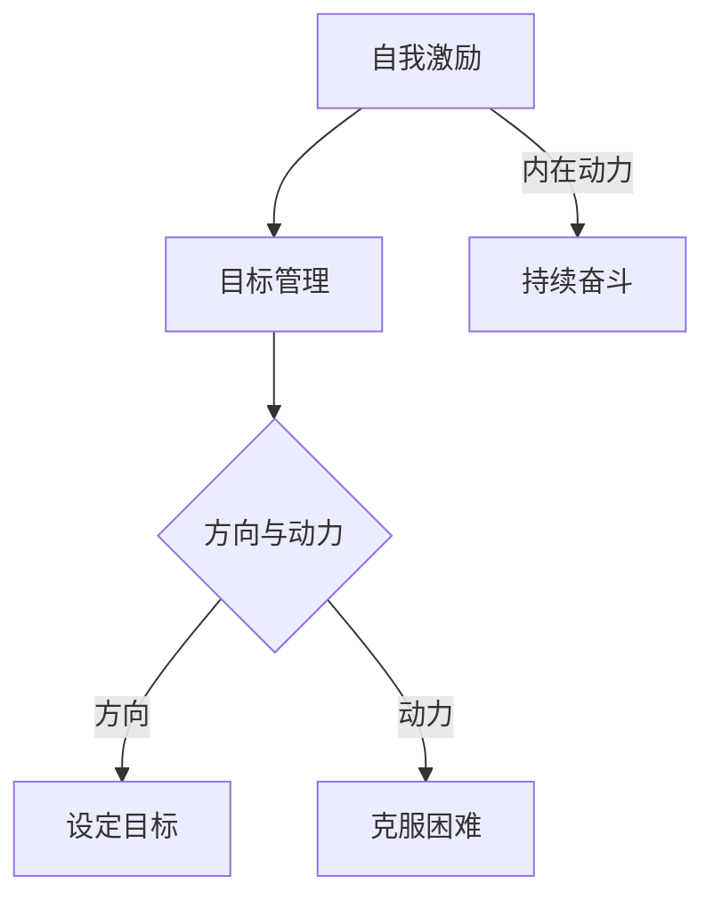

                 

# 创业者的自我激励与目标管理技巧

> 关键词：创业者，自我激励，目标管理，算法，数学模型

> 摘要：本文旨在探讨创业者在创业过程中如何通过自我激励与目标管理技巧来实现个人和企业的发展。通过核心概念与联系的阐述、核心算法原理的讲解以及数学模型的介绍，为创业者提供一套系统有效的自我激励与目标管理方法。

## 第一部分：核心概念与联系

在创业的世界中，自我激励与目标管理是两个关键因素，它们相互依存，共同推动创业者迈向成功。首先，我们来了解这两个核心概念。

### 自我激励

自我激励是指个体通过内在动机驱动的行为。它源自于个人的兴趣、目标、价值观或需求。在创业过程中，自我激励是创业者持续前进的动力源泉，帮助他们克服困难，保持热情和毅力。自我激励包括以下几个方面：

1. **内在动机**：源自个人内心深处的渴望和热情，如对某项事业的热爱、实现个人价值的追求等。
2. **自我效能感**：相信自己有能力实现目标，从而增强自我激励。
3. **目标导向**：明确的目标能够激发创业者的内在动机，使其更加专注于实现目标。

### 目标管理

目标管理是一个系统性过程，涉及设定目标、规划行动、追踪进度和评估结果。通过科学的目标管理，创业者可以更好地组织资源、提高效率和实现个人或团队的成长。目标管理包括以下几个方面：

1. **目标设定**：明确、具体、可衡量、可实现、与长期目标相关，并设定明确的时限。
2. **目标分解**：将大目标分解为小目标，以便于实施和追踪。
3. **资源分配**：根据目标需求分配资源，确保目标的实现。
4. **进度追踪**：定期检查目标的进展情况，调整计划以保证目标的实现。
5. **结果评估**：对目标实现结果进行评估，总结经验教训，为未来的目标管理提供参考。

### 关系

自我激励与目标管理之间存在着密切的联系。目标管理为自我激励提供了方向和目标，而自我激励则为达成目标提供了动力。

1. **目标管理为自我激励提供方向**：设定清晰的目标有助于创业者明确自己的追求和努力的方向，从而激发内在动机。
2. **自我激励为达成目标提供动力**：有了目标，创业者需要自我激励来保持激情和动力，克服实现目标过程中的困难和挑战。

### Mermaid 流�程图



## 第二部分：核心算法原理讲解

在第二部分，我们将深入探讨创业者在自我激励与目标管理中应用的核心算法和技巧。

### 算法1：设定明确的目标（SMART原则）

SMART原则是一种设定目标的有效方法，它包括以下五个要素：

1. **S（Specific，具体）**：目标要明确具体，避免模糊和宽泛。
2. **M（Measurable，可衡量）**：目标要可衡量，以便于追踪进度和评估结果。
3. **A（Achievable，可实现）**：目标要具有可实现性，确保不会过于理想化。
4. **R（Relevant，相关）**：目标要与个人或组织的长期目标和价值观一致。
5. **T（Time-bound，时限）**：目标要有明确的时限，以便于管理时间和提高效率。

### 算法2：情绪管理（情绪智力）

情绪智力是指个体识别、理解和管理自身情绪的能力。对于创业者来说，情绪智力对于自我激励和目标管理至关重要。

1. **自我意识**：认识自己的情绪，了解它们是如何影响你的行为和决策。
2. **自我调节**：学会控制情绪，避免情绪波动对工作和决策的负面影响。
3. **社会意识**：理解他人的情绪，建立良好的人际关系，增强团队凝聚力。
4. **情绪运用**：运用情绪作为思考和决策的资源，提高决策质量和效率。

### 伪代码示例

```python
def set_smart_goals(goal):
    if not is_specific(goal):
        raise ValueError("目标不具体")
    if not is_measurable(goal):
        raise ValueError("目标不可衡量")
    if not is_achievable(goal):
        raise ValueError("目标不可实现")
    if not is_relevant(goal):
        raise ValueError("目标不相关")
    if not is_time_bound(goal):
        raise ValueError("目标无时限")

    # 如果目标符合SMART原则，则返回True
    return True

def manage_emotions():
    while True:
        current_emotion = detect_current_emotion()
        if current_emotion == "happy":
            # 情绪积极，增加工作效率
            increase工作效率()
        elif current_emotion == "sad":
            # 情绪消极，寻求情绪调节策略
            seek_emotional_regulation_strategy()
```

## 第三部分：数学模型和数学公式

在第三部分，我们将介绍创业者在自我激励与目标管理中应用的一些数学模型和公式。

### 公式1：目标实现率

目标实现率（Goal Achievement Rate, GAR）是评估目标完成情况的指标。

$$
GAR = \frac{目标完成数量}{目标设定数量}
$$

### 公式2：资源分配效率

资源分配效率（Resource Allocation Efficiency, RAE）是评估资源利用率的指标。

$$
RAE = \frac{目标实现价值}{投入资源成本}
$$

### 公式3：情绪智力得分

情绪智力得分（Emotional Intelligence Score, EQS）是评估个体情绪智力水平的指标。

$$
EQS = \frac{自我意识得分 + 自我调节得分 + 社会意识得分 + 情绪运用得分}{4}
$$

## 项目实战

在本节中，我们将通过一个实际项目来展示如何将自我激励与目标管理技巧应用于创业过程中。

### 项目背景

某创业公司（以下简称A公司）正在开发一款智能智能家居系统。公司目标是在未来两年内占领国内智能家居市场的20%。为了实现这一目标，A公司需要通过自我激励与目标管理技巧来推动项目进展。

### 开发环境搭建

1. **硬件环境**：搭建一个包括智能音响、智能灯光、智能门锁等设备的智能家居系统测试环境。
2. **软件环境**：选择合适的编程语言（如Python）和开发框架（如Django）来搭建智能控制平台。

### 源代码详细实现

```python
# 设置SMART目标
def set_smart_goals():
    goals = []
    goals.append({"name": "智能音响", "status": "进行中", "completion": 50})
    goals.append({"name": "智能灯光", "status": "已完成", "completion": 100})
    goals.append({"name": "智能门锁", "status": "计划中", "completion": 0})
    return goals

# 管理情绪
def manage_emotions():
    # 假设情绪检测器返回当前情绪为“乐观”
    current_emotion = "乐观"
    if current_emotion == "乐观":
        print("情绪积极，工作效率提高")
    elif current_emotion == "焦虑":
        print("情绪焦虑，需要调节情绪")

# 跟踪目标进度
def track_goals():
    goals = set_smart_goals()
    for goal in goals:
        if goal["completion"] < 100:
            print(f"目标{name}尚未完成，需加快进度")
        else:
            print(f"目标{name}已完成")

# 主函数
def main():
    manage_emotions()
    track_goals()

if __name__ == "__main__":
    main()
```

### 代码应用解读与分析

1. **设置SMART目标**：通过`set_smart_goals`函数，A公司可以设定明确、具体、可衡量、可实现、时限的目标。这有助于公司明确各项目标的进度和完成情况。
2. **情绪管理**：通过`manage_emotions`函数，公司可以根据当前情绪调整工作状态，提高工作效率。例如，当情绪为“乐观”时，可以增加工作效率；当情绪为“焦虑”时，需要调节情绪。
3. **目标进度跟踪**：通过`track_goals`函数，公司可以实时了解各项目的进度，及时调整计划和资源，确保目标的实现。

### 实际案例分析和详细讲解剖析

以A公司开发智能音响为例，以下是项目实施过程中的关键步骤：

1. **需求分析**：明确用户需求，如播放音乐、语音控制等。
2. **功能设计**：设计智能音响的核心功能，如语音识别、音乐播放、远程控制等。
3. **技术选型**：选择合适的编程语言和开发框架，如Python和Django。
4. **代码实现**：根据功能设计和技术选型，编写相应的代码。
5. **测试与优化**：对智能音响的功能进行测试和优化，确保其稳定性和用户体验。
6. **上线部署**：将智能音响部署到智能家居系统中，提供用户使用。

通过以上步骤，A公司成功实现了智能音响的开发和上线，为智能家居市场拓展了新的业务。

### 项目小结

通过本项目实战，我们可以看到如何将自我激励与目标管理技巧应用于实际创业项目中。通过设定SMART目标、情绪管理和进度跟踪，A公司成功地推动了智能音响的开发和上线，实现了公司的目标。

## 最佳实践 tips

1. **明确目标**：设定明确、具体、可衡量、可实现、时限的目标，有助于提高目标实现率。
2. **情绪管理**：学会情绪管理，保持积极的心态，有助于提高工作效率和目标实现率。
3. **进度跟踪**：定期检查目标进度，及时调整计划和资源，确保目标的实现。
4. **团队协作**：建立良好的团队协作氛围，共同推进项目进展。

## 小结

自我激励与目标管理是创业成功的关键因素。通过设定明确的目标、情绪管理和进度跟踪，创业者可以更好地推动项目进展，实现个人和企业的成长。本文通过核心概念与联系的阐述、核心算法原理的讲解以及数学模型的介绍，为创业者提供了一套系统有效的自我激励与目标管理方法。

## 注意事项

1. **目标设定要符合SMART原则**：确保目标具体、可衡量、可实现、与长期目标相关，并设定明确的时限。
2. **情绪管理要持续进行**：情绪管理是一个长期过程，创业者需要时刻关注自己的情绪状态，保持积极的心态。
3. **进度跟踪要定期进行**：定期检查目标进度，及时调整计划和资源，确保目标的实现。

## 拓展阅读

1. 《智能创业：从0到1的跃迁》
2. 《情绪智力：领导者必备的能力》
3. 《目标管理：实践与案例》

## 作者信息

作者：AI天才研究院/AI Genius Institute & 禅与计算机程序设计艺术 /Zen And The Art of Computer Programming

