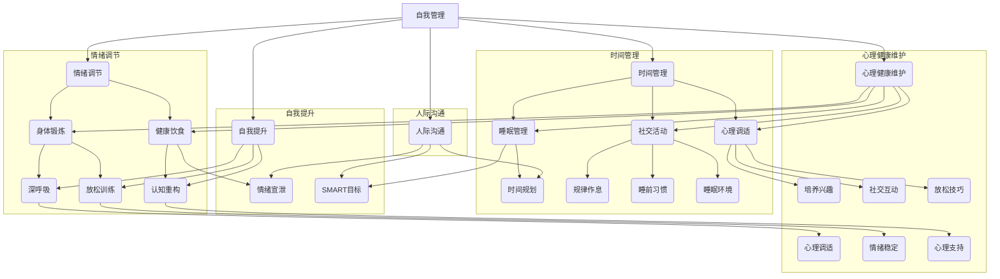

                 

## 引言

### 创业之路的挑战与心理健康的重要性

创业是一条充满不确定性和挑战的道路，创业者需要应对各种复杂的商业环境、市场竞争、资源限制以及个人压力等多重挑战。在这个过程中，心理健康问题常常被忽视，但事实上，它对创业成功至关重要。心理健康不仅影响到创业者的工作效率和创造力，还直接关系到其个人生活质量和团队氛围。因此，探讨创业者的自我管理与心理健康维护，具有非常重要的现实意义。

本文旨在系统地分析创业者的自我管理与心理健康维护，提供一套科学、实用的方法和策略。文章将分为三个主要部分：

- **第一部分：自我管理与心理健康概述**，包括自我管理的概念、心理健康的基础知识，以及心理健康与创业成功的关系。
- **第二部分：自我管理技巧**，深入探讨情绪调节、时间管理、自我提升和人际沟通等方面的技巧。
- **第三部分：心理健康维护**，讲述心理健康日常维护的方法、心理健康危机的应对策略，以及工作与生活平衡的维持。

通过这篇文章，我们希望能够帮助创业者认识到心理健康的重要性，学会如何进行自我管理，并在面对心理挑战时采取有效的应对措施，从而更好地投入到创业工作中，实现个人和企业的成功。

### 关键词

- 创业者
- 自我管理
- 心理健康
- 情绪调节
- 时间管理
- 自我提升
- 人际沟通
- 压力管理
- 心理健康维护

### 摘要

本文系统地探讨了创业者的自我管理与心理健康维护。首先，介绍了自我管理和心理健康的基础知识，分析了心理健康对创业成功的重要性。随后，详细阐述了情绪调节、时间管理、自我提升和人际沟通等自我管理技巧。最后，提供了心理健康日常维护的方法，以及心理健康危机的应对策略，帮助创业者维持良好的心理健康状态，实现个人和企业的双赢。

### 自我管理与心理健康概述

#### 创业者的自我管理

### 第1章：自我管理的概念与重要性

自我管理是指个体通过认知、情感和行为三个方面，对自己的行为和情绪进行有效调节和控制的过程。对创业者而言，自我管理是成功的关键因素之一。在激烈的市场竞争中，创业者需要具备良好的自我管理能力，以便在压力和挑战面前保持冷静和高效。

#### 自我管理的核心概念

自我管理的核心概念包括：

- **自我认知**：了解自己的性格特点、能力水平和价值观，是进行有效自我管理的基础。自我认知可以帮助创业者明确自己的优势和不足，从而有针对性地进行改进。

- **情绪管理**：情绪管理是指个体在面对不同情境时，能够有效地控制自己的情绪，保持心理平衡。对于创业者来说，情绪管理尤为重要，因为创业过程中充满了不确定性和压力，情绪管理能力的高低直接影响到创业者的决策和执行力。

- **时间管理**：时间管理是指合理规划和分配时间，确保在有限的时间内完成既定的任务。对于创业者来说，时间管理能力直接关系到创业项目的成功与否，因为创业项目通常涉及众多任务和活动，如何高效地利用时间成为创业者成功的关键。

- **目标设定**：目标设定是指明确自己的目标，并为实现这些目标制定具体的计划和行动步骤。目标设定有助于创业者保持方向感，提高工作效率，避免迷失在琐碎的事务中。

- **自我提升**：自我提升是指通过不断学习和实践，提高自己的能力和素质。对于创业者来说，自我提升是一个持续的过程，它有助于创业者适应市场变化，保持竞争优势。

#### 自我管理的重要性

自我管理的重要性体现在以下几个方面：

- **提高工作效率**：良好的自我管理能力可以帮助创业者更好地分配时间和资源，提高工作效率，减少无效劳动。

- **保持心理平衡**：自我管理有助于创业者应对创业过程中的压力和挑战，保持心理平衡，避免情绪失控。

- **实现目标**：通过自我管理，创业者可以明确目标，制定计划，并采取有效行动，实现个人和企业的目标。

- **增强竞争力**：自我管理能力是创业者的一项核心竞争力，它有助于创业者更好地应对市场变化，抓住机遇，保持竞争优势。

#### 情绪管理

情绪管理是自我管理的重要组成部分。情绪管理包括以下几个方面：

- **认知情绪调节**：通过改变对事件的认知和解释方式，调整情绪反应。例如，将挫折视为成长的机会，而不是失败的标志。

- **行为调节**：通过改变行为方式来调节情绪。例如，通过运动、冥想等方式缓解压力。

- **情绪表达**：学会适当地表达自己的情绪，避免压抑或过度表达。有效的情绪表达有助于缓解压力，增进人际沟通。

#### 时间管理

时间管理是自我管理的另一重要方面。时间管理包括以下几个方面：

- **时间规划**：制定详细的时间计划，明确每个时间段的工作内容和目标。

- **优先级排序**：将任务按照重要性和紧急性进行排序，确保先完成重要且紧急的任务。

- **避免拖延**：识别和克服拖延的根源，采取有效措施提高工作效率。

- **时间记录与评估**：定期记录和评估时间使用情况，找出时间浪费的原因，并采取改进措施。

#### 目标设定

目标设定是自我管理的重要组成部分，它包括以下几个方面：

- **目标明确**：明确自己的目标，使其具体、可衡量、可实现、相关性强、时限性明确（SMART原则）。

- **目标分解**：将大目标分解为小目标，并制定具体的行动计划。

- **目标追踪**：定期追踪目标进度，及时调整计划和行动。

#### 自我提升

自我提升是一个持续的过程，包括以下几个方面：

- **学习新知识**：不断学习新的知识和技能，提高自己的专业素养。

- **反思与总结**：定期反思自己的行为和决策，总结经验教训，不断改进。

- **寻求反馈**：主动寻求他人的反馈和建议，以便更好地了解自己的不足和改进方向。

#### 自我提升的重要性

自我提升对创业者的重要性体现在以下几个方面：

- **适应变化**：在快速变化的市场环境中，自我提升有助于创业者适应新的挑战和机遇。

- **保持竞争力**：自我提升使创业者能够保持竞争优势，抓住市场机会。

- **提高领导力**：自我提升有助于创业者提高领导力，更好地管理团队。

### 总结

自我管理是创业者成功的关键因素之一。通过自我管理，创业者可以更好地应对创业过程中的挑战和压力，提高工作效率和创新能力，实现个人和企业的目标。情绪管理、时间管理、目标设定和自我提升是自我管理的核心内容，它们共同构成了创业者自我管理的基础。

### 心理健康基础知识

#### 第2章：心理健康的重要性

心理健康是指个体在心理和社会方面保持良好状态，能够有效地应对生活中的压力，发挥自己的潜能，并做出积极贡献。对于创业者而言，心理健康不仅是个人福祉的基石，更是确保创业项目成功的重要保障。

#### 心理健康的重要性

心理健康的重要性可以从以下几个方面来理解：

1. **提高工作效率**：心理健康状态良好的创业者能够更好地集中注意力、提高工作效率，减少因心理问题导致的误工和损失。

2. **增强创新能力**：心理健康有助于创业者保持积极的思维模式，激发创新灵感，从而在激烈的市场竞争中脱颖而出。

3. **改善人际关系**：心理健康状态良好的创业者更容易与他人建立良好的关系，提升团队协作效率，形成积极的工作氛围。

4. **增强抗压能力**：心理健康有助于创业者更好地应对创业过程中的压力和挑战，减少因心理压力导致的决策失误。

5. **促进个人成长**：心理健康状态良好的创业者更容易发现自我潜能，实现个人成长和职业发展。

#### 常见心理健康问题

在创业过程中，创业者可能会遇到以下一些常见心理健康问题：

1. **焦虑和抑郁**：焦虑和抑郁是创业者常见的心理健康问题，表现为持续的紧张、担忧、无助感或情绪低落。

2. **压力过大**：创业过程中面临的各种压力，如市场竞争、资金压力、人际关系等，可能导致压力过大的问题。

3. **失眠和疲劳**：长时间的工作和压力可能导致失眠和疲劳，影响创业者的身心健康。

4. **自我怀疑和自卑**：面对创业的挑战，创业者可能会出现自我怀疑和自卑情绪，影响自我效能感。

#### 心理健康与创业成功的关系

心理健康与创业成功之间存在密切的关系。以下是一些关键点：

1. **心理素质**：心理健康良好的创业者具备较强的心理素质，能够更好地应对创业过程中的挫折和困难。

2. **决策能力**：心理健康有助于创业者做出更明智的决策，减少因情绪波动导致的错误决策。

3. **创新能力**：心理健康状态良好的创业者更容易保持积极的思维模式，激发创新灵感。

4. **团队管理**：心理健康良好的创业者更容易建立和谐的工作氛围，提高团队协作效率。

#### 创业者常见的心理挑战与应对策略

在面对创业过程中常见的心理挑战时，创业者可以采取以下策略来维护心理健康：

1. **建立支持网络**：与家人、朋友和同事建立良好的支持网络，分享自己的困扰，获得情感支持。

2. **寻求专业帮助**：在遇到严重的心理问题时，及时寻求心理咨询师或心理医生的帮助。

3. **培养健康的生活习惯**：保持规律的作息时间，进行适量的体育锻炼，注意饮食和营养。

4. **时间管理**：合理安排时间，避免过度工作和疲劳，确保充足的休息和放松时间。

5. **自我调节**：学习情绪管理和压力管理技巧，如深呼吸、冥想、放松训练等。

6. **持续学习**：不断学习新的知识和技能，提升自身能力和自信心。

#### 总结

心理健康是创业者成功的关键因素之一。通过保持良好的心理健康状态，创业者可以提高工作效率、增强创新能力、改善人际关系、增强抗压能力，从而实现个人和企业的目标。面对创业过程中的心理挑战，创业者应采取积极的应对策略，维护自己的心理健康，为创业之路奠定坚实的基础。

### 心理健康与创业成功的关系

#### 第3章：创业者常见的心理挑战与应对策略

创业是一项充满挑战和压力的工作，创业者需要应对各种复杂的市场环境、资源限制和内部压力。这些挑战不仅考验着创业者的智慧和毅力，也会对其心理健康产生深远的影响。了解这些常见的心理挑战，并采取有效的应对策略，对于维护心理健康和实现创业成功至关重要。

#### 创业者常见的心理挑战

1. **焦虑与压力**：焦虑和压力是创业者最常见的心理挑战之一。创业过程中，创业者需要面对未知的市场风险、激烈的竞争、资金压力和经营困难等多重挑战，这些都会导致焦虑和压力的增加。长时间的焦虑和压力如果不能得到有效的缓解，会严重影响创业者的工作效率和决策能力。

2. **自我怀疑与自卑**：在创业过程中，创业者常常会面临失败和挫折，这可能会导致自我怀疑和自卑情绪的产生。创业者可能会质疑自己的能力和价值，感到无助和失落。这种情绪如果得不到及时调整，会影响创业者的自信心，阻碍创业的进程。

3. **情绪波动与稳定性**：创业过程中，情绪波动是常态。创业者可能会因为一时的成功而过于乐观，也会因为失败而过于悲观。情绪的不稳定性不仅会影响创业者的心理健康，还可能影响团队的士气和凝聚力。

4. **时间压力与工作效率**：创业者往往需要在有限的时间内完成大量的任务，这种时间压力会导致创业者出现效率低下、拖延等问题。长期的紧张和疲劳会严重影响创业者的身心健康。

5. **人际关系与沟通**：创业者需要与合作伙伴、员工、客户等各方进行有效的沟通和协作。然而，在紧张的创业环境中，人际关系的处理往往成为一项挑战。不良的人际关系会导致创业者的工作压力增加，影响心理健康。

#### 应对策略

1. **建立支持网络**：建立支持网络是应对心理挑战的重要策略。创业者可以通过与家人、朋友、同事建立紧密的联系，分享自己的困扰和压力，获得情感上的支持和鼓励。此外，创业者还可以参加创业社群，与其他创业者交流经验和心得，互相支持和鼓励。

2. **寻求专业帮助**：当心理挑战严重影响到创业者的生活和工作时，寻求专业帮助是必要的。心理咨询师或心理医生可以提供专业的心理健康评估和干预，帮助创业者解决心理问题，提高心理健康水平。

3. **健康的生活方式**：健康的生活方式是维护心理健康的基础。创业者应该保持规律的作息时间，保证充足的睡眠，进行适量的体育锻炼，注意饮食和营养。健康的身体是应对心理挑战的重要保障。

4. **情绪管理**：情绪管理是应对心理挑战的重要技能。创业者可以通过学习情绪管理技巧，如深呼吸、冥想、放松训练等，帮助自己在面对压力和挑战时保持情绪稳定。此外，积极的心态和乐观的情绪状态也有助于提高心理健康水平。

5. **时间管理**：有效的时间管理可以帮助创业者减轻时间压力，提高工作效率。创业者可以通过制定详细的时间计划，明确任务优先级，避免拖延，确保有足够的休息和放松时间。此外，学会说“不”也是时间管理的重要一环，避免过度承诺和超负荷工作。

6. **持续学习**：创业是一个不断学习和成长的过程。创业者应该保持学习的热情，不断学习新的知识和技能，提升自身能力。通过学习，创业者可以更好地应对创业过程中的挑战，提高心理健康水平。

7. **积极的心理建设**：积极的心理建设是维护心理健康的重要策略。创业者可以通过阅读励志书籍、参加心理培训课程、进行自我反思等方式，培养积极的心态，增强心理韧性。

#### 总结

创业过程中的心理挑战对创业者的心理健康构成威胁，但通过采取有效的应对策略，创业者可以维护自己的心理健康，实现创业成功。建立支持网络、寻求专业帮助、健康的生活方式、情绪管理、时间管理、持续学习和积极的心理建设是创业者应对心理挑战的重要策略。创业者应该将这些策略融入到日常生活中，提升自身的心理健康水平，为创业之路奠定坚实的基础。

### 情绪调节与压力管理

#### 第4章：情绪调节与压力管理

情绪调节和压力管理是创业者自我管理的重要组成部分。在创业过程中，情绪波动和压力常常是不可避免的，但如何有效地调节情绪和管理压力，对创业者的心理健康和创业成功至关重要。本章将深入探讨情绪调节和压力管理的策略，帮助创业者保持心理平衡，提高工作效率。

#### 第1节：情绪调节技巧

情绪调节是指通过一系列技巧和方法，帮助个体识别、理解和管理自己的情绪，从而维持心理平衡。以下是一些有效的情绪调节技巧：

1. **认知重构**：认知重构是一种通过改变对事件的认知和解释方式，来调节情绪的方法。例如，当遇到失败时，创业者可以通过重新解释失败的原因和意义，将其视为学习和成长的机会，而不是打击。

   ```plaintext
   伪代码示例：
   function cognitiveReconstruction(event, outcome) {
       if (outcome == "failure") {
           console.log("这次失败是成长的机会，我将从中学习。");
       }
   }
   ```

2. **情绪宣泄**：情绪宣泄是指通过某种方式将积压的情绪释放出来，以减轻情绪压力。创业者可以选择写日记、进行体育锻炼或与信任的朋友倾诉等方式进行情绪宣泄。

   ```plaintext
   伪代码示例：
   function emotionalVentilation() {
       console.log("我选择通过写日记来宣泄情绪。");
   }
   ```

3. **深呼吸与放松训练**：深呼吸和放松训练是缓解情绪压力的有效方法。通过深呼吸，创业者可以降低心率和血压，减少紧张和焦虑情绪。

   ```plaintext
   伪代码示例：
   function deepBreathing() {
       console.log("我现在开始深呼吸，感受身体放松。");
   }
   ```

4. **积极思考**：积极思考是一种通过培养积极心态，来调节情绪的方法。创业者可以通过阅读励志书籍、观看正面视频、与积极的人交往等方式，培养积极思考的习惯。

   ```plaintext
   伪代码示例：
   function positiveThinking() {
       console.log("我选择每天阅读一篇励志文章。");
   }
   ```

#### 第2节：压力管理策略

压力管理是指通过一系列策略和技巧，帮助个体减轻压力，提高心理健康水平。以下是一些有效的压力管理策略：

1. **时间管理**：有效的时间管理可以帮助创业者合理分配时间和精力，减少因时间紧迫感而产生的压力。创业者可以通过制定详细的时间计划，明确任务优先级，避免拖延。

   ```plaintext
   伪代码示例：
   function timeManagement(tasks) {
       for (task in tasks) {
           console.log("我将在明天上午处理这个任务。");
       }
   }
   ```

2. **目标设定**：合理的目标设定可以帮助创业者保持清晰的奋斗方向，减少因目标不明确而产生的压力。创业者可以通过SMART原则（具体、可衡量、可实现、相关性强、时限性）来设定目标。

   ```plaintext
   伪代码示例：
   function setGoals(goal) {
       if (goal == "具体" && goal == "可衡量" && goal == "可实现" && goal == "相关性强" && goal == "时限性") {
           console.log("我的目标设定是合理的。");
       }
   }
   ```

3. **放松技巧**：放松技巧如瑜伽、冥想、渐进性肌肉放松等，可以帮助创业者减轻压力，恢复精力。创业者可以每天安排一定的时间进行放松训练。

   ```plaintext
   伪代码示例：
   function relaxationTechniques() {
       console.log("我每天晚上都会进行瑜伽放松训练。");
   }
   ```

4. **积极应对**：积极应对是指创业者通过积极的行动来应对压力，而不是逃避或被动接受。创业者可以通过寻求专业帮助、学习新技能、寻求支持等方式，积极应对压力。

   ```plaintext
   伪代码示例：
   function positiveResponse() {
       console.log("我选择通过学习新技能来应对压力。");
   }
   ```

#### 第3节：深呼吸与放松训练

深呼吸和放松训练是缓解情绪压力的有效方法。以下是一个简单的放松训练步骤：

1. **选择一个安静的环境，舒适地坐下或躺下。**
2. **将一只手放在胸口，另一只手放在腹部。**
3. **慢慢深吸一口气，感受腹部升起。**
4. **屏住呼吸几秒钟，然后缓慢呼出气体，感受腹部下降。**
5. **重复这个过程，直到感到身体放松。

```plaintext
伪代码示例：
function relaxationExercise() {
    console.log("我坐在安静的房间里，开始深呼吸练习。");
    for (i = 1; i <= 5; i++) {
        console.log("我深吸一口气，感受腹部升起。");
        console.log("我屏住呼吸几秒钟，然后缓慢呼出气体，感受腹部下降。");
    }
    console.log("现在，我感到身体和心灵都得到了放松。");
}
```

#### 总结

情绪调节和压力管理是创业者自我管理的重要方面。通过认知重构、情绪宣泄、深呼吸与放松训练等技巧，创业者可以有效地调节情绪，减轻压力。同时，通过时间管理、目标设定、放松技巧和积极应对等策略，创业者可以更好地管理自己的压力，保持心理平衡。这些方法和技巧不仅有助于提升创业者的心理健康水平，还能提高工作效率，为创业成功奠定坚实基础。

### 时间管理与目标设定

#### 第4章：时间管理与目标设定

时间管理和目标设定是创业者自我管理的核心技能，对创业者的成功至关重要。有效的时间管理和明确的目标设定可以帮助创业者合理分配时间和精力，提高工作效率，确保目标实现。

#### 第1节：时间管理的基本原则

时间管理的基本原则包括：

1. **优先级排序**：将任务按照重要性和紧急性进行排序，确保优先完成重要且紧急的任务。

   ```plaintext
   伪代码示例：
   function prioritySorting(tasks) {
       for (task in tasks) {
           if (task.importance == "高" && task.urgency == "高") {
               console.log("优先处理这个任务。");
           }
       }
   }
   ```

2. **时间块分配**：将一天的时间分为不同的时间块，并为每个时间块分配特定的任务。这有助于提高工作效率，减少任务切换的损耗。

   ```plaintext
   伪代码示例：
   function timeBlockAllocation(timeBlocks) {
       for (block in timeBlocks) {
           console.log("在时间块" + block + "内，我将专注于" + timeBlocks[block].task + "。");
       }
   }
   ```

3. **避免拖延**：识别和克服拖延的根源，采取有效措施提高工作效率。

   ```plaintext
   伪代码示例：
   function avoidProcrastination() {
       console.log("我正在分析拖延的原因，并制定应对计划。");
   }
   ```

4. **定期评估**：定期记录和评估时间使用情况，找出时间浪费的原因，并采取改进措施。

   ```plaintext
   伪代码示例：
   function timeUsageEvaluation() {
       console.log("我正在评估本周的时间使用情况，找出可以改进的地方。");
   }
   ```

#### 第2节：目标设定的SMART法则

SMART法则是一种常用的目标设定方法，它要求目标具备以下特点：

- **具体（Specific）**：目标应该明确具体，避免模糊和宽泛。
- **可衡量（Measurable）**：目标应该可以量化或衡量，以便评估进展。
- **可实现（Achievable）**：目标应该是可行的，避免设定过高的期望。
- **相关性强（Relevant）**：目标应该与个人或企业的整体目标保持一致。
- **时限性（Time-bound）**：目标应该有明确的时间期限，以便跟踪和评估。

```plaintext
伪代码示例：
function setSMARTGoal(goal) {
    if (goal.isSpecific && goal.isMeasurable && goal.isAchievable && goal.isRelevant && goal.isTimeBound) {
        console.log("我的目标设定是符合SMART法则的。");
    }
}
```

#### 第3节：记录与评估时间使用情况

记录和评估时间使用情况是时间管理的重要环节。以下是一些方法和技巧：

1. **时间日志**：定期记录每天的时间使用情况，包括工作、休息、娱乐等所有活动。

   ```plaintext
   伪代码示例：
   function timeLog() {
       console.log("我正在记录今天的时间使用情况。");
   }
   ```

2. **时间块回顾**：定期回顾时间块分配的执行情况，评估是否按计划进行，并根据实际情况进行调整。

   ```plaintext
   伪代码示例：
   function timeBlockReview() {
       console.log("我正在回顾本周的时间块执行情况，并根据实际情况进行调整。");
   }
   ```

3. **时间浪费分析**：分析时间浪费的原因，采取针对性措施减少时间浪费。

   ```plaintext
   伪代码示例：
   function timeWasteAnalysis() {
       console.log("我正在分析时间浪费的原因，并制定改进计划。");
   }
   ```

#### 第4节：如何设定合理的目标

设定合理的目标是时间管理的重要部分。以下是一些设定合理目标的技巧：

1. **明确目标**：确保目标具体明确，避免模糊和宽泛。

2. **量化目标**：将目标量化，使其具有可衡量性。

3. **分解目标**：将大目标分解为小目标，并制定具体的行动计划。

4. **设定期限**：为每个目标设定明确的时间期限，以便跟踪和评估。

5. **保持可实现性**：确保目标可行，避免设定过高的期望。

6. **与整体目标一致**：确保目标与个人或企业的整体目标保持一致。

```plaintext
伪代码示例：
function setReasonableGoal(goal) {
    if (goal.isSpecific && goal.isMeasurable && goal.isAchievable && goal.isRelevant && goal.isTimeBound) {
        console.log("我设定的目标是合理的。");
    }
}
```

#### 总结

时间管理和目标设定是创业者成功的关键因素。通过优先级排序、时间块分配、避免拖延等时间管理技巧，以及SMART法则和量化目标等目标设定方法，创业者可以更有效地管理时间和资源，提高工作效率，确保目标实现。同时，记录和评估时间使用情况有助于创业者持续优化时间管理策略，为创业成功奠定坚实基础。

### 自我提升与持续学习

#### 第5章：自我提升与持续学习

自我提升和持续学习是创业者成长和成功的关键因素。在快速变化的市场环境中，创业者需要不断更新知识和技能，提升个人能力，以应对新的挑战和机遇。本章将探讨自我提升的重要性、持续学习的路径和方法，以及知识管理和信息筛选的技巧。

#### 第1节：自我提升的重要性

自我提升对创业者的重要性体现在以下几个方面：

1. **适应市场变化**：市场环境不断变化，创业者需要具备快速适应和应对变化的能力。通过自我提升，创业者可以不断学习新知识、掌握新技能，从而更好地适应市场变化。

2. **保持竞争力**：持续的自我提升可以帮助创业者保持竞争优势。在技术和市场快速发展的背景下，创业者如果停滞不前，很可能会被竞争对手超越。

3. **提高决策能力**：自我提升有助于创业者提高决策能力，减少因信息不足或技能不足导致的决策失误。

4. **增强领导力**：自我提升不仅提升了个人的能力，还可以增强创业者的领导力，更好地管理和激励团队。

5. **实现个人价值**：自我提升使创业者能够实现个人价值，提升职业素养和人生幸福感。

#### 第2节：持续学习的路径与方法

持续学习是自我提升的核心。以下是一些有效的学习路径和方法：

1. **正规教育**：参加高校或在线课程，获取系统的知识体系。例如，MBA课程、技术专业课程等。

   ```plaintext
   伪代码示例：
   function enrollCourse(course) {
       console.log("我正在报名参加" + course + "课程。");
   }
   ```

2. **在线学习平台**：利用MOOC（大规模开放在线课程）平台，如Coursera、edX等，学习专业知识和技能。

   ```plaintext
   伪代码示例：
   function onlineLearning(platform) {
       console.log("我正在通过" + platform + "平台进行在线学习。");
   }
   ```

3. **行业会议和研讨会**：参加行业会议和研讨会，了解行业最新动态和技术趋势。

   ```plaintext
   伪代码示例：
   function attendConference(event) {
       console.log("我正在参加" + event + "会议，学习最新知识。");
   }
   ```

4. **阅读与研究**：阅读专业书籍、论文和研究报告，深入理解行业知识和理论。

   ```plaintext
   伪代码示例：
   function readResearch(paper) {
       console.log("我正在阅读" + paper + "，深入研究相关领域。");
   }
   ```

5. **实践与项目**：通过实际项目和案例研究，将理论知识应用于实际工作，提升实践能力。

   ```plaintext
   伪代码示例：
   function workOnProject(project) {
       console.log("我正在参与" + project + "项目，提高实践技能。");
   }
   ```

#### 第3节：知识管理与信息筛选

知识管理和信息筛选是持续学习的重要环节。以下是一些技巧：

1. **建立知识库**：整理和存储学习过程中获取的知识和信息，方便日后查阅和应用。

   ```plaintext
   伪代码示例：
   function buildKnowledgeBase() {
       console.log("我正在建立个人知识库，整理学习资料。");
   }
   ```

2. **信息筛选**：在大量信息中筛选出有价值的内容，避免信息过载。

   ```plaintext
   伪代码示例：
   function informationFiltering(source) {
       if (source.isValuable) {
           console.log("这条信息对我的学习有价值。");
       }
   }
   ```

3. **定期回顾**：定期回顾和总结学习内容，巩固记忆，发现新知识。

   ```plaintext
   伪代码示例：
   function reviewKnowledge() {
       console.log("我正在回顾和总结学习内容，巩固知识。");
   }
   ```

4. **分享与交流**：与他人分享知识和经验，通过交流获得新的见解和启示。

   ```plaintext
   伪代码示例：
   function shareKnowledge() {
       console.log("我正在与同事分享学习心得，交流经验。");
   }
   ```

#### 第4节：如何筛选有用信息

在信息爆炸的时代，如何筛选有用信息成为创业者面临的挑战。以下是一些筛选有用信息的技巧：

1. **确定学习目标**：明确自己的学习目标和需求，有助于有针对性地筛选信息。

2. **评估信息来源**：选择信誉度高、权威性的信息来源，避免误信谣言和不实信息。

3. **使用搜索引擎**：利用搜索引擎，根据关键词检索相关信息，并筛选排名靠前、内容丰富的结果。

4. **参考专家意见**：参考行业专家的意见和推荐，选择具有参考价值的资料。

5. **实践经验**：通过实际应用和实践验证信息的有效性，确保所学知识的实用性。

```plaintext
伪代码示例：
function selectUsefulInformation(information) {
    if (information.isValuable && information.isAuthoritative) {
        console.log("这条信息对我的学习非常有用。");
    }
}
```

#### 总结

自我提升和持续学习是创业者成功的关键。通过适应市场变化、保持竞争力、提高决策能力和增强领导力，创业者可以不断提升个人能力。持续学习的路径包括正规教育、在线学习、行业会议和研讨会、阅读与研究以及实践与项目。知识管理和信息筛选是持续学习的重要环节，通过建立知识库、信息筛选、定期回顾和分享交流，创业者可以高效地管理和利用知识。通过这些方法和技巧，创业者可以不断自我提升，为创业成功奠定坚实基础。

### 人际沟通与团队合作

#### 第6章：人际沟通与团队合作

在创业过程中，人际沟通和团队合作是至关重要的。有效的沟通技巧和团队合作能力不仅有助于提升工作效率，还能增强团队凝聚力，促进项目成功。本章将探讨沟通技巧、团队合作与领导力，以及如何建立良好的同事关系。

#### 第1节：沟通技巧

沟通技巧是人际交往的基础，以下是一些有效的沟通技巧：

1. **倾听**：倾听是有效沟通的关键。倾听不仅意味着听对方说话，还要理解对方的情感和需求。

   ```plaintext
   伪代码示例：
   function activeListening() {
       console.log("我正在认真倾听同事的发言，理解他们的观点。");
   }
   ```

2. **表达清晰**：清晰的表达有助于减少误解和沟通障碍。使用简单的语言和具体的例子来传达信息。

   ```plaintext
   伪代码示例：
   function clearCommunication() {
       console.log("我正在使用简单明了的语言解释项目进展。");
   }
   ```

3. **非语言沟通**：非语言沟通包括肢体语言、面部表情和声音语调等，它们在沟通中同样重要。

   ```plaintext
   伪代码示例：
   function nonVerbalCommunication() {
       console.log("我正在通过积极的肢体语言和友好的声音语调来增强沟通效果。");
   }
   ```

4. **反馈**：提供及时的反馈，可以帮助对方了解自己的观点和感受，同时也有助于自我提升。

   ```plaintext
   伪代码示例：
   function provideFeedback() {
       console.log("我正在向同事提供关于项目进展的反馈，帮助他们改进。");
   }
   ```

5. **建立信任**：建立信任是长期有效沟通的基础。通过诚实、透明和尊重，建立和维护信任关系。

   ```plaintext
   伪代码示例：
   function buildTrust() {
       console.log("我正在通过诚实和透明的工作方式，建立与同事的信任关系。");
   }
   ```

#### 第2节：团队合作与领导力

团队合作和领导力是创业成功的重要因素。以下是一些关键的团队合作和领导力技巧：

1. **明确目标**：确保团队成员对项目的目标有共同的理解和认同。

   ```plaintext
   伪代码示例：
   function defineTeamGoals() {
       console.log("我正在与团队成员讨论并明确项目的目标。");
   }
   ```

2. **分工合作**：根据团队成员的专长和兴趣，合理分配任务，确保每个人都能发挥最大价值。

   ```plaintext
   伪代码示例：
   function assignTasks() {
       console.log("我正在根据团队成员的专长和兴趣，分配任务。");
   }
   ```

3. **沟通与协调**：定期召开团队会议，确保信息畅通，协调团队成员的工作，解决潜在问题。

   ```plaintext
   伪代码示例：
   function teamCommunication() {
       console.log("我正在组织团队会议，确保团队成员之间的沟通与协调。");
   }
   ```

4. **激励与支持**：激励团队成员，提供必要的支持，帮助他们克服困难和挑战。

   ```plaintext
   伪代码示例：
   function motivateTeam() {
       console.log("我正在激励团队成员，提供他们完成任务所需的资源和支持。");
   }
   ```

5. **领导力**：作为团队领导者，需要具备决策能力、远见和领导力，引导团队朝着共同目标前进。

   ```plaintext
   伪代码示例：
   function exhibitLeadership() {
       console.log("我正在通过展示决策能力和远见，引导团队实现项目目标。");
   }
   ```

#### 第3节：建立良好的同事关系

建立良好的同事关系是团队合作成功的关键。以下是一些建立良好同事关系的技巧：

1. **尊重与理解**：尊重团队成员的意见和感受，理解他们的需求和压力。

   ```plaintext
   伪代码示例：
   function respectColleagues() {
       console.log("我正在尊重同事的意见，并努力理解他们的需求。");
   }
   ```

2. **合作与互助**：在团队中形成合作互助的氛围，共同解决问题。

   ```plaintext
   伪代码示例：
   function collaborateWithColleagues() {
       console.log("我正在与同事合作，共同解决项目中的问题。");
   }
   ```

3. **沟通与反馈**：通过沟通和反馈，建立信任和开放的工作环境。

   ```plaintext
   伪代码示例：
   function communicateAndFeedback() {
       console.log("我正在通过沟通和反馈，建立与同事之间的信任和开放关系。");
   }
   ```

4. **共同目标**：确保团队成员有共同的目标和价值观，增强团队凝聚力。

   ```plaintext
   伪代码示例：
   function shareCommonGoals() {
       console.log("我正在与团队成员共同讨论并明确团队目标，增强凝聚力。");
   }
   ```

#### 总结

人际沟通和团队合作是创业成功的关键。有效的沟通技巧、团队合作与领导力，以及良好的同事关系，都是创业者需要掌握的重要技能。通过倾听、表达清晰、非语言沟通、反馈和建立信任，创业者可以提升沟通效果。通过明确目标、分工合作、沟通与协调、激励与支持和展示领导力，创业者可以提升团队合作能力。通过尊重与理解、合作与互助、沟通与反馈和共同目标，创业者可以建立良好的同事关系。这些技能和关系将为创业者的成功奠定坚实基础。

### 心理健康的日常维护

#### 第7章：心理健康的日常维护

在忙碌的创业生活中，心理健康问题往往容易被忽视。然而，通过建立健康的生活习惯和采取有效的心理调适技巧，创业者可以有效地维护心理健康，提高生活质量。本章将探讨心理健康日常维护的方法，包括身体锻炼与健康饮食、心理调适技巧、睡眠管理以及社交活动与兴趣爱好。

#### 第1节：身体锻炼与健康饮食

身体健康是心理健康的基础。以下是一些身体锻炼与健康饮食的建议：

1. **定期锻炼**：身体锻炼有助于释放压力、提高心情，还能增强身体的抵抗力。创业者可以选择适合自己的锻炼方式，如跑步、瑜伽、健身等。

   ```plaintext
   伪代码示例：
   function regularExercise() {
       console.log("我每天都会安排30分钟的时间进行锻炼，如跑步或瑜伽。");
   }
   ```

2. **健康饮食**：均衡的饮食有助于提供身体所需的营养，支持大脑和身体的正常功能。创业者应尽量避免高糖、高脂肪的食物，多摄入水果、蔬菜和全谷物。

   ```plaintext
   伪代码示例：
   function healthyDiet() {
       console.log("我每天都会吃至少五种不同的蔬菜和水果。");
   }
   ```

3. **适量饮水**：保持充足的水分摄入对身体健康和心理健康都有益。创业者应确保每天喝足够的水，避免因缺水导致的疲劳和注意力不集中。

   ```plaintext
   伪代码示例：
   function adequateWaterIntake() {
       console.log("我每天都会喝足够的水，保持身体水分平衡。");
   }
   ```

#### 第2节：心理调适技巧

心理调适技巧是维护心理健康的重要手段。以下是一些有效的心理调适技巧：

1. **冥想**：冥想有助于放松心情，减轻压力。创业者可以每天花几分钟时间进行冥想练习，专注于呼吸和当下的感受。

   ```plaintext
   伪代码示例：
   function meditation() {
       console.log("我每天早晨都会花10分钟进行冥想，放松身心。");
   }
   ```

2. **正念练习**：正念练习是通过关注当下，培养专注和平静的心态。创业者可以通过参加正念课程或自我练习来提高正念意识。

   ```plaintext
   伪代码示例：
   function mindfulnessPractice() {
       console.log("我每周都会参加一次正念练习班，提升专注力。");
   }
   ```

3. **情绪释放**：情绪释放技巧如写日记、绘画、音乐等，可以帮助创业者表达和释放压抑的情绪。

   ```plaintext
   伪代码示例：
   function emotionalRelease() {
       console.log("我每周都会花时间写日记，记录自己的情绪和感受。");
   }
   ```

4. **积极的自我对话**：通过积极的自我对话，创业者可以改变消极的思维模式，提高自信心和自尊心。

   ```plaintext
   伪代码示例：
   function positiveSelfTalk() {
       console.log("我每天都会对自己说一些正面的话，如‘我今天做得很好’。");
   }
   ```

#### 第3节：睡眠管理

良好的睡眠是心理健康的重要保障。以下是一些睡眠管理的建议：

1. **规律作息**：保持规律的作息时间，确保每晚有足够的睡眠时间。

   ```plaintext
   伪代码示例：
   function regularSleepSchedule() {
       console.log("我每天晚上都会在相同的时间上床，并保持规律的作息。");
   }
   ```

2. **放松睡前习惯**：睡前进行放松活动，如阅读、冥想或听轻音乐，有助于入睡。

   ```plaintext
   伪代码示例：
   function relaxingBedtimeRoutine() {
       console.log("我每天晚上都会进行放松的睡前习惯，如阅读一本书。");
   }
   ```

3. **避免刺激性活动**：睡前避免进行刺激性活动，如使用电子设备、饮用咖啡或剧烈运动。

   ```plaintext
   伪代码示例：
   function avoidStimulatingActivities() {
       console.log("我会在睡前避免使用电子设备，确保良好的睡眠质量。");
   }
   ```

4. **创造舒适环境**：确保睡眠环境的舒适，如保持房间清洁、安静和适宜的温度。

   ```plaintext
   伪代码示例：
   function comfortableSleepEnvironment() {
       console.log("我会保持睡眠环境的舒适，如调整房间的温度和光线。");
   }
   ```

#### 第4节：社交活动与兴趣爱好

社交活动与兴趣爱好是心理健康的重要补充。以下是一些建议：

1. **社交互动**：与家人、朋友和同事保持积极的社交互动，分享生活和工作中的经验和感受。

   ```plaintext
   伪代码示例：
   function socialInteraction() {
       console.log("我每周都会安排时间与家人和朋友一起吃饭或聊天。");
   }
   ```

2. **兴趣爱好**：培养兴趣爱好，如绘画、音乐、运动等，可以带来乐趣和满足感，缓解压力。

   ```plaintext
   伪代码示例：
   function hobbies() {
       console.log("我每周都会花时间进行自己喜爱的活动，如画画或听音乐。");
   }
   ```

3. **志愿服务**：参与志愿服务可以带来成就感和社会归属感，有助于提高心理健康。

   ```plaintext
   伪代码示例：
   function volunteerWork() {
       console.log("我定期参与志愿服务，帮助他人，同时提升自己的心理健康。");
   }
   ```

#### 总结

心理健康是创业者成功的关键因素之一。通过身体锻炼与健康饮食、心理调适技巧、睡眠管理和社交活动与兴趣爱好，创业者可以有效地维护自己的心理健康。保持健康的生活习惯和心理调适技巧，有助于创业者应对创业过程中的挑战，提高生活质量和工作效率，为个人和企业的成功奠定坚实基础。

### 心理健康危机应对

#### 第8章：心理健康危机应对

心理健康危机是指心理健康状况急剧恶化，导致个体难以应对日常生活的状况。对于创业者而言，面对激烈的市场竞争、不断变化的环境和巨大的压力，心理健康危机可能会更加频繁。本章将讨论心理健康危机的定义与识别，以及应对心理健康危机的策略。

#### 第1节：心理健康危机的定义与识别

1. **心理健康危机的定义**：
   心理健康危机是指个体在心理和情绪上出现严重的紊乱，可能导致其日常生活、工作和社会功能受到显著影响。这种危机可能表现为情绪极度低落、焦虑、恐慌发作、失去现实感、自我伤害行为等。

2. **心理健康危机的识别**：
   以下是一些常见的心理健康危机信号：
   - 情绪极端波动，如持续的焦虑、抑郁或愤怒。
   - 睡眠问题，如失眠或过度睡眠。
   - 食欲和体重显著变化。
   - 社交活动减少，回避社交场合。
   - 对日常活动失去兴趣，做事缺乏动力。
   - 认知能力下降，注意力不集中。
   - 自我评价过低，出现自责或自杀念头。

   ```plaintext
   伪代码示例：
   function identifyPsychologicalCrisis(signs) {
       if (signs.includes("extreme mood swings") || signs.includes("sleep problems") || signs.includes("significant appetite changes")) {
           console.log("可能出现了心理健康危机的信号。");
       }
   }
   ```

#### 第2节：应对心理健康危机的策略

1. **自我调适**：
   - **深呼吸和放松训练**：通过深呼吸和渐进性肌肉放松等方法，缓解紧张和焦虑情绪。
   - **正念冥想**：正念冥想有助于提高注意力，减少情绪波动。
   - **情绪表达**：找到安全的方式表达自己的情绪，如写日记、绘画或与信任的朋友交流。

   ```plaintext
   伪代码示例：
   function selfRegulation() {
       console.log("我正在通过深呼吸和渐进性肌肉放松来缓解焦虑情绪。");
   }
   ```

2. **求助途径**：
   - **心理咨询**：寻求专业心理咨询师的帮助，进行心理咨询和治疗。
   - **支持团体**：加入心理健康支持团体，与他人分享经验，获得情感支持。
   - **紧急求助**：在紧急情况下，寻求紧急心理援助，如拨打心理健康热线。

   ```plaintext
   伪代码示例：
   function seekProfessionalHelp() {
       console.log("我正在寻求专业心理咨询师的帮助，解决心理健康问题。");
   }
   ```

3. **制定应对计划**：
   - **紧急应对计划**：制定紧急应对计划，包括在危机发生时的应对步骤和可求助的资源。
   - **日常维护计划**：制定日常心理健康维护计划，包括健康的生活方式、定期放松和自我反思。

   ```plaintext
   伪代码示例：
   function createEmergencyPlan() {
       console.log("我正在制定紧急应对计划，确保在危机发生时能够迅速采取行动。");
   }
   ```

#### 第3节：危机应对的实际案例

以下是一个应对心理健康危机的实际案例：

**案例**：一名创业者因为长时间的工作压力和市场竞争压力，出现了严重的焦虑和抑郁症状。

**解决方案**：
1. **识别危机**：创业者通过自我观察和同事反馈，意识到自己的心理健康状况不佳，并开始寻找应对方法。
2. **自我调适**：创业者开始进行深呼吸和放松训练，每天早上和晚上各进行一次，帮助缓解紧张情绪。
3. **寻求专业帮助**：创业者预约了心理咨询师，每周进行一次心理咨询，探讨焦虑和抑郁的原因，学习应对策略。
4. **制定计划**：创业者制定了一个紧急应对计划，包括在情绪低落时采取的具体行动，如休息、散步、与家人和朋友交流等。
5. **持续维护**：创业者通过定期自我反思和咨询，持续维护心理健康，逐步恢复工作和生活的平衡。

```plaintext
伪代码示例：
function caseExample(creator, crisis, solution) {
    console.log("创业者" + creator + "在面临" + crisis + "时，采取了以下解决方案：" + solution);
}
caseExample("张先生", "心理健康危机", "深呼吸、放松训练、心理咨询和制定应对计划");
```

#### 总结

心理健康危机对创业者的生活和工作可能产生严重的影响。通过识别心理健康危机的信号，采取自我调适和求助途径，制定应对计划，创业者可以有效地应对心理健康危机。在实际案例中，创业者通过一系列应对措施，逐步恢复心理健康，重拾工作和生活的平衡。保持对心理健康问题的警觉，并采取积极的应对策略，是创业者维护心理健康的重要步骤。

### 心理健康与工作生活平衡

#### 第9章：心理健康与工作生活平衡

在创业过程中，保持工作与生活的平衡对于维护心理健康至关重要。长期的工作压力和忽视个人生活，不仅会影响创业者的身心健康，还会导致工作效率下降和创新能力减弱。本章将探讨工作生活平衡的重要性，以及如何制定合理的工作计划、平衡家庭与事业，并提供建议。

#### 第1节：工作生活平衡的重要性

工作生活平衡对创业者有以下几个重要影响：

1. **心理健康**：工作与生活平衡有助于减轻压力，改善心理健康，减少焦虑和抑郁症状。
2. **工作效率**：保持良好的工作生活平衡，有助于提高工作效率，增强专注力和创造力。
3. **家庭关系**：平衡工作和生活，有助于维护良好的家庭关系，增强家庭幸福感。
4. **长期发展**：工作生活平衡有助于创业者长期发展，避免因过度劳累而导致职业瓶颈或疾病。

#### 第2节：制定合理的工作计划

制定合理的工作计划是实现工作生活平衡的关键。以下是一些制定工作计划的建议：

1. **设定明确的目标**：将工作目标具体化，使其具有可衡量性、可实现性和时限性。
2. **优先级排序**：将任务按照重要性和紧急性进行排序，优先处理重要且紧急的任务。
3. **时间管理**：合理分配时间，确保有足够的时间处理工作和个人事务。
4. **灵活调整**：根据实际情况灵活调整工作计划，避免过度工作。

   ```plaintext
   伪代码示例：
   function createWorkPlan(goal, priority, timeManagement) {
       console.log("我正在制定工作计划，目标为" + goal + "，任务优先级为" + priority + "，时间管理策略为" + timeManagement);
   }
   ```

#### 第3节：平衡家庭与事业

平衡家庭与事业是创业者面临的挑战之一。以下是一些建议帮助平衡家庭与事业：

1. **设定家庭时间**：为家庭设定固定的时间，确保有足够的时间陪伴家人。
2. **沟通与协调**：与家人沟通工作需求，争取家庭支持，共同制定家庭计划。
3. **灵活的工作安排**：尝试灵活的工作安排，如远程办公或调整工作时间，以适应家庭需求。
4. **家庭活动**：参与家庭活动，增强家庭成员之间的情感联系。

   ```plaintext
   伪代码示例：
   function balanceFamilyAndWork(familyTime, communication, flexibleSchedule, familyActivities) {
       console.log("我正在采取措施平衡家庭与事业，家庭时间为" + familyTime + "，沟通与协调为" + communication + "，灵活的工作安排为" + flexibleSchedule + "，家庭活动为" + familyActivities);
   }
   ```

#### 第4节：保持工作生活平衡的建议

以下是一些建议帮助创业者保持工作生活平衡：

1. **设定界限**：明确工作和生活的界限，避免工作侵占个人时间。
2. **学会说“不”**：学会拒绝不必要的工作请求，避免过度劳累。
3. **培养兴趣爱好**：培养兴趣爱好，丰富个人生活，缓解工作压力。
4. **定期休息**：确保有足够的休息时间，避免长期疲劳。
5. **寻求支持**：寻求家人、朋友和同事的支持，共同分担工作压力。

   ```plaintext
   伪代码示例：
   function maintainWorkLifeBalance(setBoundaries, sayNo, hobbies, regularRest, seekSupport) {
       console.log("我正在采取措施保持工作生活平衡，设定界限为" + setBoundaries + "，学会说‘不’为" + sayNo + "，培养兴趣爱好为" + hobbies + "，定期休息为" + regularRest + "，寻求支持为" + seekSupport);
   }
   ```

#### 总结

心理健康与工作生活平衡是创业者成功的关键因素。通过制定合理的工作计划、平衡家庭与事业，并采取有效的建议，创业者可以维护心理健康，提高工作效率，实现个人与企业的双赢。保持工作生活平衡不仅有助于提升生活质量，还能为创业者的长期发展奠定坚实基础。

### 心理健康促进与社会支持

#### 第10章：心理健康促进与社会支持

心理健康促进和社会支持是确保创业者能够长期保持心理健康的重要手段。良好的心理健康不仅有助于提高创业者的工作效率和创新能力，还能增强其生活满意度和社会交往能力。本章将探讨心理健康促进的策略、社会支持网络的重要性，以及如何建立支持性人际关系。

#### 第1节：心理健康促进策略

心理健康促进策略是指通过一系列积极的行为和活动，帮助创业者维持良好的心理健康状态。以下是一些有效的心理健康促进策略：

1. **锻炼身体**：定期进行体育锻炼，如跑步、游泳、瑜伽等，有助于释放压力，提高心情，增强身体健康。

   ```plaintext
   伪代码示例：
   function physicalExercise() {
       console.log("我每天都会进行至少30分钟的体育锻炼，如跑步或瑜伽。");
   }
   ```

2. **保持良好的饮食习惯**：均衡饮食，摄入丰富的营养，有助于维持身体健康和心理健康。

   ```plaintext
   伪代码示例：
   function healthyDiet() {
       console.log("我每天都会吃五种不同的水果和蔬菜，保持良好的饮食习惯。");
   }
   ```

3. **保持充足的睡眠**：确保每晚有7-9小时的充足睡眠，有助于恢复精力，提高注意力。

   ```plaintext
   伪代码示例：
   function adequateSleep() {
       console.log("我每天晚上都会保证7-9小时的充足睡眠。");
   }
   ```

4. **积极参与社交活动**：与家人、朋友和同事保持积极的社交互动，分享生活中的喜怒哀乐，有助于减轻孤独感，提高心理健康。

   ```plaintext
   伪代码示例：
   function socialActivities() {
       console.log("我每周都会安排时间与家人和朋友一起吃饭或进行其他社交活动。");
   }
   ```

5. **学习和实践放松技巧**：学习和实践深呼吸、冥想、渐进性肌肉放松等放松技巧，有助于减轻压力，提高心理健康。

   ```plaintext
   伪代码示例：
   function relaxationTechniques() {
       console.log("我正在学习和实践深呼吸和冥想，以减轻压力和放松身心。");
   }
   ```

6. **参与心理健康活动**：参与心理健康讲座、工作坊或支持小组，学习心理健康知识，与他人分享经验和教训。

   ```plaintext
   伪代码示例：
   function participateInMentalHealthActivities() {
       console.log("我正在参加心理健康讲座和工作坊，提升心理健康意识。");
   }
   ```

#### 第2节：社会支持网络的重要性

社会支持网络是指创业者所拥有的支持资源，包括家人、朋友、同事、专业组织等。一个强大的社会支持网络对创业者的心理健康有显著影响：

1. **情感支持**：在遇到困难时，社会支持网络可以提供情感上的支持和安慰，减轻创业者的心理负担。

2. **信息与资源**：社会支持网络可以提供创业者所需的信息和资源，帮助其更好地应对创业过程中的挑战。

3. **社会归属感**：通过社会支持网络，创业者可以获得社会归属感，增强自信心和自尊心。

4. **职业发展**：社会支持网络有助于创业者拓展人脉，获取职业发展的机会。

   ```plaintext
   伪代码示例：
   function importanceOfSocialSupport(family, friends, colleagues, professionalOrganizations) {
       console.log("我的社会支持网络包括家人、" + friends + "、同事和" + professionalOrganizations + "，这对我的心理健康非常重要。");
   }
   ```

#### 第3节：建立支持性人际关系

建立支持性人际关系是创业者维护心理健康的重要途径。以下是一些建议帮助创业者建立支持性人际关系：

1. **主动交流**：主动与家人、朋友和同事交流，分享自己的想法和感受，建立信任和亲密关系。

   ```plaintext
   伪代码示例：
   function activeCommunication(family, friends, colleagues) {
       console.log("我正在与家人、" + friends + "和同事保持积极的交流，建立支持性人际关系。");
   }
   ```

2. **参与社群**：参与创业社群、专业组织或兴趣小组，结识志同道合的人，扩展人际关系网络。

   ```plaintext
   伪代码示例：
   function participateInCommunities(communities) {
       console.log("我正在参与" + communities + "，结识新朋友，建立支持性人际关系。");
   }
   ```

3. **提供帮助**：在他人需要时提供帮助，培养互助精神，增强人际关系的紧密性。

   ```plaintext
   伪代码示例：
   function offerHelp(friends, colleagues) {
       console.log("我正在帮助朋友和同事解决他们的问题，增强人际关系。");
   }
   ```

4. **保持联系**：定期与朋友和同事保持联系，通过电话、邮件或社交媒体，维持人际关系的活力。

   ```plaintext
   伪代码示例：
   function maintainContact(friends, colleagues) {
       console.log("我每周都会与朋友和同事保持联系，维持良好的人际关系。");
   }
   ```

#### 总结

心理健康促进和社会支持对创业者的心理健康和生活质量至关重要。通过积极参与体育锻炼、保持良好的饮食习惯、确保充足的睡眠，以及参与社交活动，创业者可以有效地促进心理健康。同时，建立强大的社会支持网络，通过主动交流、参与社群、提供帮助和保持联系，创业者可以建立支持性人际关系，提高心理健康水平，实现个人和企业的成功。

### 附录

#### 附录A：心理健康资源与工具推荐

为了帮助创业者更好地维护心理健康，以下是一些心理健康资源与工具的推荐：

##### A.1 心理健康APP推荐

- **Headspace**：提供冥想和放松训练，帮助用户管理压力和焦虑。
- **Calm**：提供深呼吸、冥想和睡眠指导，帮助用户改善睡眠质量。
- **Moodfit**：通过个性化评估和练习，帮助用户管理情绪。

##### A.2 心理咨询机构推荐

- **心理咨询中心**：提供专业的心理咨询和治疗服务，帮助解决心理健康问题。
- **心理健康热线**：提供免费的心理健康咨询服务，为创业者提供情感支持和建议。

##### A.3 心理健康书籍推荐

- **《正面管教》**：作者：简·尼尔森，介绍如何通过积极的方法管理情绪和行为。
- **《情绪勒索》**：作者：苏珊·弗里曼，探讨如何应对情绪勒索，保护自己的心理健康。
- **《如何快乐地生活》**：作者：乔恩·卡巴金，介绍正念冥想和减压技巧。

#### 附录B：心理健康小贴士

为了帮助创业者在日常中维护心理健康，以下是一些实用的小贴士：

##### B.1 每日自我反思

每天花几分钟时间进行自我反思，回顾一天中的经历，思考自己的情绪和行为，以及如何改进。

##### B.2 呼吸练习

每天进行几次深呼吸练习，可以帮助放松身心，减轻压力。每次练习3-5分钟，专注于呼吸感受。

##### B.3 放松技巧总结

定期总结和练习放松技巧，如渐进性肌肉放松、冥想和正念练习，有助于提高放松效果。

```plaintext
伪代码示例：
function dailySelfReflection() {
    console.log("我正在每天进行自我反思，回顾一天的经历。");
}

function breathingExercise() {
    console.log("我现在正在进行深呼吸练习，放松身心。");
}

function summarizeRelaxationTechniques() {
    console.log("我正在总结和练习放松技巧，提高放松效果。");
}
```

### 总结

心理健康是创业者成功的关键因素之一。通过推荐心理健康资源和工具，提供心理健康小贴士，我们希望帮助创业者更好地维护自己的心理健康。保持每日自我反思、呼吸练习和放松技巧的总结和练习，将有助于创业者更好地管理情绪，应对压力，保持心理平衡。这些实践将为创业者的长期发展和个人福祉奠定坚实基础。

### Mermaid 流程图：心理健康维护流程

以下是心理健康维护流程的Mermaid流程图，用于展示自我管理、情绪调节、时间管理、自我提升、人际沟通和心理健康维护等各个方面的关系和流程：



此流程图清晰地展示了自我管理与心理健康维护之间各个方面的关系，以及如何通过不同的技巧和策略来维护心理健康。每个部分都有相应的子节点，详细说明了具体的方法和步骤。通过这个流程图，创业者可以更直观地理解心理健康维护的过程，从而更好地实施和执行。

### 数学模型与公式讲解

为了更好地理解创业者的心理健康状态，我们可以采用以下数学模型进行描述：

\[ P(t) = \alpha_1 \cdot T(t) + \alpha_2 \cdot M(t) + \alpha_3 \cdot S(t) + \alpha_4 \cdot C(t) \]

其中：

- \( P(t) \) 表示在时间 \( t \) 的心理健康状态，取值范围为 [0, 1]，1代表最佳心理健康状态。
- \( T(t) \) 表示时间 \( t \) 的情绪调节状态，反映创业者应对情绪波动的能力。
- \( M(t) \) 表示时间 \( t \) 的时间管理状态，反映创业者对时间的规划和利用效率。
- \( S(t) \) 表示时间 \( t \) 的自我提升状态，反映创业者持续学习和自我成长的能力。
- \( C(t) \) 表示时间 \( t \) 的人际沟通状态，反映创业者与他人的交往和合作能力。
- \( \alpha_1, \alpha_2, \alpha_3, \alpha_4 \) 分别是权重系数，用于衡量各个因素对心理健康状态的影响程度。

#### 数学模型详细解释

1. **情绪调节状态 \( T(t) \)**：

   情绪调节状态 \( T(t) \) 可以通过以下因素进行衡量：

   \[ T(t) = \beta_1 \cdot \text{认知重构能力} + \beta_2 \cdot \text{情绪表达方式} + \beta_3 \cdot \text{深呼吸与放松训练} \]

   其中：

   - \( \beta_1 \) 表示认知重构能力的权重；
   - \( \beta_2 \) 表示情绪表达方式的权重；
   - \( \beta_3 \) 表示深呼吸与放松训练的权重。

2. **时间管理状态 \( M(t) \)**：

   时间管理状态 \( M(t) \) 可以通过以下因素进行衡量：

   \[ M(t) = \gamma_1 \cdot \text{目标设定} + \gamma_2 \cdot \text{优先级排序} + \gamma_3 \cdot \text{避免拖延} \]

   其中：

   - \( \gamma_1 \) 表示目标设定的权重；
   - \( \gamma_2 \) 表示优先级排序的权重；
   - \( \gamma_3 \) 表示避免拖延的权重。

3. **自我提升状态 \( S(t) \)**：

   自我提升状态 \( S(t) \) 可以通过以下因素进行衡量：

   \[ S(t) = \delta_1 \cdot \text{学习新知识} + \delta_2 \cdot \text{反思与总结} + \delta_3 \cdot \text{寻求反馈} \]

   其中：

   - \( \delta_1 \) 表示学习新知识的权重；
   - \( \delta_2 \) 表示反思与总结的权重；
   - \( \delta_3 \) 表示寻求反馈的权重。

4. **人际沟通状态 \( C(t) \)**：

   人际沟通状态 \( C(t) \) 可以通过以下因素进行衡量：

   \[ C(t) = \epsilon_1 \cdot \text{有效沟通} + \epsilon_2 \cdot \text{团队合作} + \epsilon_3 \cdot \text{建立关系} \]

   其中：

   - \( \epsilon_1 \) 表示有效沟通的权重；
   - \( \epsilon_2 \) 表示团队合作的权重；
   - \( \epsilon_3 \) 表示建立关系的权重。

#### 公式举例说明

假设在时间 \( t \) 时，创业者的情绪调节状态 \( T(t) \) 为 0.8，时间管理状态 \( M(t) \) 为 0.7，自我提升状态 \( S(t) \) 为 0.9，人际沟通状态 \( C(t) \) 为 0.6，根据权重系数 \( \alpha_1 = 0.3 \)，\( \alpha_2 = 0.2 \)，\( \alpha_3 = 0.2 \)，\( \alpha_4 = 0.3 \)，可以计算出该时间点的心理健康状态 \( P(t) \)：

\[ P(t) = 0.3 \cdot 0.8 + 0.2 \cdot 0.7 + 0.2 \cdot 0.9 + 0.3 \cdot 0.6 \]
\[ P(t) = 0.24 + 0.14 + 0.18 + 0.18 \]
\[ P(t) = 0.74 \]

因此，该时间点的心理健康状态为 0.74，表示处于较好的心理健康状态。通过这个公式，创业者可以根据自身的实际情况调整各个因素的权重，以优化心理健康状态。

### 项目实战

#### 开发环境搭建

在本文的项目实战部分，我们将搭建一个用于心理健康维护的应用程序。这个应用程序将帮助创业者跟踪和管理他们的心理健康状态。以下是开发环境搭建的步骤：

1. **安装Node.js**：Node.js是一个基于Chrome V8引擎的JavaScript运行环境，用于搭建服务器和执行JavaScript代码。可以从[Node.js官网](https://nodejs.org/)下载并安装最新版本的Node.js。

   ```bash
   # 在命令行中运行以下命令安装Node.js
   curl -sL https://deb.nodesource.com/setup_14.x | bash -
   sudo apt-get install nodejs
   ```

2. **安装Express**：Express是一个简洁的Node.js Web应用框架，用于快速搭建Web应用程序。通过npm（Node包管理器）安装Express。

   ```bash
   # 安装Express
   npm install express
   ```

3. **创建项目目录**：创建一个名为`mental-health-tracker`的项目目录，并初始化一个npm项目。

   ```bash
   mkdir mental-health-tracker
   cd mental-health-tracker
   npm init -y
   ```

4. **安装依赖项**：安装其他必要的依赖项，如`body-parser`、`morgan`等。

   ```bash
   npm install body-parser morgan
   ```

5. **创建应用文件**：在项目目录中创建以下文件：

   - `app.js`：主应用程序文件。
   - `routes.js`：路由配置文件。
   - `views`：视图文件目录，存放HTML模板。

#### 源代码详细实现和代码解读

以下是应用程序的源代码及其详细解读：

**app.js**：

```javascript
const express = require('express');
const bodyParser = require('body-parser');
const morgan = require('morgan');
const routes = require('./routes');

const app = express();

// 配置中间件
app.use(bodyParser.json());
app.use(morgan('tiny'));

// 配置路由
app.use('/api', routes);

// 启动服务器
const PORT = process.env.PORT || 3000;
app.listen(PORT, () => {
    console.log(`应用程序正在运行在端口${PORT}`);
});
```

**routes.js**：

```javascript
const express = require('express');
const router = express.Router();

// 健康检查路由
router.get('/', (req, res) => {
    res.json({ message: '欢迎使用心理健康维护应用' });
});

// 添加心理健康状态记录
router.post('/record', (req, res) => {
    // 获取请求体中的数据
    const record = req.body;
    
    // 数据验证和存储逻辑
    // ...

    res.json({ message: '心理健康状态记录已添加', record });
});

// 查询心理健康状态记录
router.get('/records', (req, res) => {
    // 从数据库中获取记录
    // ...

    res.json({ records });
});

module.exports = router;
```

**views/index.html**：

```html
<!DOCTYPE html>
<html lang="en">
<head>
    <meta charset="UTF-8">
    <title>心理健康维护应用</title>
</head>
<body>
    <h1>欢迎使用心理健康维护应用</h1>
    <div>
        <h2>添加心理健康状态记录</h2>
        <form id="add-record-form">
            <!-- 表单字段 -->
            <input type="text" id="mood" placeholder="心情" required>
            <input type="text" id="stress" placeholder="压力" required>
            <input type="text" id="sleep" placeholder="睡眠质量" required>
            <input type="text" id="social" placeholder="社交活动" required>
            <button type="submit">提交</button>
        </form>
    </div>
    <div>
        <h2>查询心理健康状态记录</h2>
        <button id="load-records">加载记录</button>
        <ul id="records-list">
            <!-- 记录列表 -->
        </ul>
    </div>
    <script src="/js/app.js"></script>
</body>
</html>
```

**src/app.js**：

```javascript
const axios = require('axios');

document.getElementById('add-record-form').addEventListener('submit', (event) => {
    event.preventDefault();
    
    // 获取表单数据
    const formData = {
        mood: document.getElementById('mood').value,
        stress: document.getElementById('stress').value,
        sleep: document.getElementById('sleep').value,
        social: document.getElementById('social').value
    };

    // 发送POST请求添加记录
    axios.post('/api/record', formData)
        .then(response => {
            console.log(response.data);
            alert('记录已添加');
        })
        .catch(error => {
            console.error(error);
            alert('添加记录失败');
        });
});

document.getElementById('load-records').addEventListener('click', () => {
    // 发送GET请求获取记录
    axios.get('/api/records')
        .then(response => {
            const records = response.data;
            const list = document.getElementById('records-list');
            list.innerHTML = '';
            records.forEach(record => {
                const li = document.createElement('li');
                li.textContent = `心情：${record.mood}，压力：${record.stress}，睡眠质量：${record.sleep}，社交活动：${record.social}`;
                list.appendChild(li);
            });
        })
        .catch(error => {
            console.error(error);
            alert('加载记录失败');
        });
});
```

#### 代码应用解读与分析

以上代码实现了一个简单的心理健康维护应用，分为前后端两部分。前端使用了HTML、CSS和JavaScript，后端使用了Node.js和Express框架。

1. **前端部分**：

   - **index.html**：定义了应用程序的基本结构和表单，用于添加和查询心理健康状态记录。
   - **app.js**：实现了表单提交和记录查询的功能，使用了Axios进行与后端的通信。

2. **后端部分**：

   - **app.js**：配置了Express应用程序，定义了健康检查路由和心理健康状态记录的增删查改接口。
   - **routes.js**：定义了具体的API路由处理函数，用于处理前端发起的HTTP请求。

#### 实际案例分析与详细讲解剖析

以下是一个实际案例，展示如何使用该应用程序：

**案例**：创业者李明想要记录自己的心理健康状态，并查看历史记录。

**步骤**：

1. **添加心理健康状态记录**：

   - 李明填写了心情、压力、睡眠质量和社交活动等信息，并提交表单。
   - 前端通过Axios发送POST请求到后端的`/api/record`接口。
   - 后端接收请求，验证数据并存储记录。

2. **查询心理健康状态记录**：

   - 李明点击“加载记录”按钮。
   - 前端通过Axios发送GET请求到后端的`/api/records`接口。
   - 后端返回李明的所有记录，前端将这些记录显示在页面上。

**分析**：

- **数据验证**：后端在添加记录时，会对请求体中的数据进行验证，确保数据的完整性和正确性。
- **错误处理**：如果添加或查询记录时发生错误，前端会显示相应的错误提示，帮助用户解决问题。
- **用户体验**：通过简单的界面和清晰的操作流程，用户可以方便地管理自己的心理健康状态。

#### 项目小结

通过本项目，我们搭建了一个简单的心理健康维护应用程序，帮助创业者跟踪和管理自己的心理健康状态。该项目展示了如何使用Node.js和Express框架快速搭建Web应用程序，并通过前后端通信实现数据交互。此外，本项目还强调了心理健康维护的重要性，提供了实用的工具和方法，帮助创业者更好地管理自己的心理健康。

### 最佳实践 Tips、小结、注意事项、拓展阅读

#### 最佳实践 Tips

1. **情绪调节**：
   - **认知重构**：遇到挫折时，尝试将负面情绪转化为积极思考，比如“这次失败是成长的机会”。
   - **深呼吸**：在高压力环境下，可以尝试进行深呼吸，每次深吸一口气，缓慢呼出，帮助缓解紧张情绪。

2. **时间管理**：
   - **优先级排序**：每天开始工作前，列出任务清单，并按照紧急和重要程度进行排序。
   - **番茄工作法**：使用番茄工作法，每25分钟专注工作，然后休息5分钟，提高工作效率。

3. **自我提升**：
   - **每日学习**：设定每天的学习目标，例如阅读一篇文章或学习一个新的技能点。
   - **反思与总结**：每天工作结束后，反思当天的工作，总结成功和不足之处。

4. **人际沟通**：
   - **有效倾听**：在对话中，认真倾听对方的观点，并给予反馈，增进理解和信任。
   - **积极表达**：表达自己的观点时，使用积极的语言，避免使用攻击性或消极的措辞。

#### 小结

心理健康是创业者成功的关键因素之一。通过情绪调节、时间管理、自我提升和人际沟通，创业者可以更好地应对创业过程中的挑战，保持心理健康。本文提供了详细的策略和实践方法，帮助创业者维护心理健康，提高工作效率。

#### 注意事项

1. **保持平衡**：在追求事业成功的同时，不要忽视个人生活，确保工作和生活之间的平衡。
2. **定期休息**：避免长时间的工作和压力，定期休息和放松，有助于恢复精力和提高工作效率。
3. **寻求帮助**：在遇到心理健康问题时，及时寻求专业帮助，如心理咨询师或心理医生。

#### 拓展阅读

- **《情绪调节技巧》**：了解情绪调节的各种技巧，如认知重构、情绪表达和深呼吸训练。
- **《时间管理入门》**：学习有效的时间管理方法，提高工作效率和生活质量。
- **《人际沟通心理学》**：掌握人际沟通的基本原则和技巧，提升人际交往能力。

通过不断学习和实践，创业者可以更好地维护自己的心理健康，实现个人和企业的双赢。希望本文能为您的创业之路提供有价值的参考和帮助。

