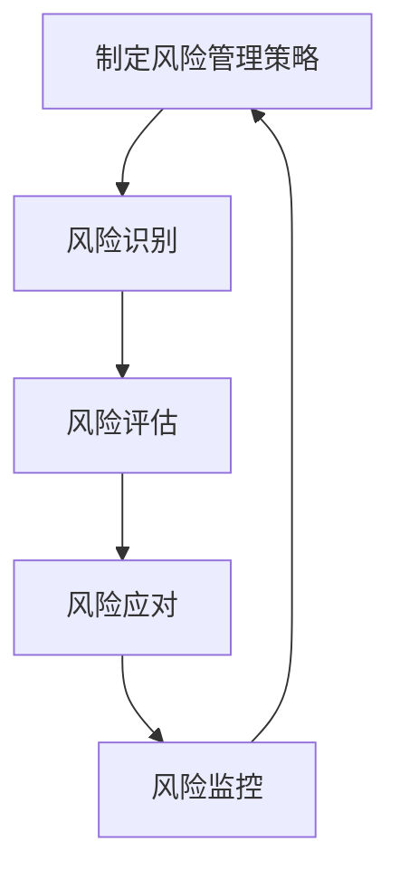

                 

### 文章标题：创业者的风险管理与危机公关能力培养

#### 关键词：
- 风险管理
- 危机公关
- 创业者
- 应对策略
- 能力培养

#### 摘要：
本文旨在探讨创业者在面对风险和危机时的管理与应对策略。文章首先介绍了风险管理的理论基础，包括风险识别与分析、风险应对策略。接着，深入探讨了危机公关的基本概念、应对流程和传播策略。通过案例分析，展示了风险管理与危机公关的实际应用。最后，提出了创业环境下的风险管理策略和危机公关能力的培养方法，为创业者提供了实用的指导。

---

### 《创业者的风险管理与危机公关能力培养》目录大纲

#### 第一部分：风险管理的理论基础

##### 第1章：风险管理概述
- **1.1 风险管理的重要性**
- **1.2 风险管理的定义和原则**
- **1.3 风险管理的流程**

##### 第2章：风险识别与分析
- **2.1 风险识别的方法**
- **2.2 风险分析的工具与技术**
- **2.3 风险评估与度量**

##### 第3章：风险应对策略
- **3.1 风险规避与转移**
- **3.2 风险减少与接受**
- **3.3 风险组合与优化**

#### 第二部分：危机公关的实务操作

##### 第4章：危机公关的基本概念
- **4.1 危机公关的定义**
- **4.2 危机公关的目标**
- **4.3 危机公关的原则**

##### 第5章：危机公关的应对流程
- **5.1 危机预警**
- **5.2 危机应对策略**
- **5.3 危机公关方案的制定与执行**

##### 第6章：危机公关的传播策略
- **6.1 媒体关系管理**
- **6.2 公众舆论引导**
- **6.3 社交媒体应对**

#### 第三部分：风险管理与危机公关的实际应用

##### 第7章：案例分析
- **7.1 国内外创业者的风险管理案例分析**
- **7.2 国内企业危机公关案例分析**
- **7.3 成功的风险管理与危机公关实例**

##### 第8章：创业环境下的风险管理策略
- **8.1 创业初期的风险管理**
- **8.2 创业中期的风险管理**
- **8.3 创业晚期的风险管理**

##### 第9章：危机公关能力培养
- **9.1 危机公关能力的培养方法**
- **9.2 风险管理与危机公关人才的选拔与培养**
- **9.3 创业者自我提升的策略**

#### 附录

##### 附录A：常用风险管理工具与资源
- **A.1 风险管理工具介绍**
- **A.2 风险管理资源推荐**

##### 附录B：危机公关手册
- **B.1 危机公关手册内容**
- **B.2 危机公关手册模板**

---

### 第一部分：风险管理的理论基础

#### 第1章：风险管理概述

##### 1.1 风险管理的重要性

在创业过程中，风险管理扮演着至关重要的角色。创业者不仅要面对市场的不确定性、技术变革的挑战，还需要应对内部的运营风险和外部环境的变化。风险管理有助于企业识别潜在的风险，制定应对策略，从而降低风险对企业的负面影响。良好的风险管理可以提高企业的抗风险能力，确保企业的持续稳定发展。

风险管理的重要性体现在以下几个方面：

1. **保护企业资产**：通过识别和评估潜在的风险，企业可以采取相应的措施，保护其资产不受损失。
2. **提高决策质量**：风险管理有助于企业全面了解潜在的风险，从而做出更加明智的决策。
3. **增强企业竞争力**：有效的风险管理可以提高企业的抗风险能力，增强其在市场中的竞争力。
4. **提升企业信誉**：良好的风险管理可以增强投资者、合作伙伴和客户的信任，提高企业的信誉。

##### 1.2 风险管理的定义和原则

风险管理是指通过识别、评估、监控和应对风险，以最大化企业价值的活动。风险管理过程通常包括以下步骤：

1. **风险识别**：识别企业可能面临的各种风险，包括市场风险、运营风险、财务风险等。
2. **风险评估**：对识别出的风险进行定量和定性分析，评估其对企业的潜在影响。
3. **风险应对**：制定并实施应对策略，以减轻或消除风险的影响。
4. **风险监控**：持续监控风险的变化，及时调整应对策略。

风险管理的原则包括：

1. **全面性**：风险管理应覆盖企业的各个层面和领域。
2. **预防为主**：在风险发生前采取预防措施，以减少风险的发生概率和影响。
3. **动态性**：风险是动态变化的，风险管理应具备灵活性，以适应不断变化的环境。
4. **系统性**：风险管理应与企业整体战略相结合，形成系统化的管理框架。

##### 1.3 风险管理的流程

风险管理的流程可以概括为以下步骤：

1. **制定风险管理策略**：明确风险管理的目标和原则，制定相应的策略和措施。
2. **风险识别**：通过调查、访谈、数据分析等方法，识别企业面临的各种风险。
3. **风险评估**：对识别出的风险进行定性或定量评估，确定其严重程度和发生概率。
4. **风险应对**：根据风险评估的结果，制定并实施应对策略，包括规避、转移、减少和接受风险等。
5. **风险监控**：持续监控风险的变化，评估应对措施的有效性，及时调整风险管理策略。

风险管理流程的图示如下：

---

在本章节中，我们概述了风险管理的理论基础，包括风险管理的重要性、定义和原则，以及风险管理的流程。接下来，我们将深入探讨风险识别与分析的方法、工具与技术，以及风险评估与度量的具体内容。

#### 第2章：风险识别与分析

##### 2.1 风险识别的方法

风险识别是风险管理过程的第一步，旨在识别企业可能面临的各种风险。有效的风险识别可以为企业提供全面的风险视角，为后续的风险评估和应对奠定基础。以下是一些常用的风险识别方法：

1. **头脑风暴**：通过集体讨论，收集团队成员对风险的看法和意见，识别潜在的风险。
2. **访谈**：与企业管理层、员工、客户、供应商等进行访谈，获取他们对风险的认识和经验。
3. **现场观察**：通过实地考察，观察企业运营过程中的潜在风险。
4. **文件审查**：审查企业的财务报告、合同、规章制度等文件，识别潜在的风险。
5. **历史数据分析**：分析企业历史数据，识别过去发生的风险事件及其原因。
6. **专家咨询**：咨询行业专家、顾问等，获取他们对风险的专业见解。

在实际应用中，企业可以结合多种风险识别方法，以获取更全面的风险信息。

##### 2.2 风险分析的工具与技术

风险分析是风险管理的核心环节，旨在评估风险对企业的影响程度和发生概率。以下是一些常用的风险分析工具和技术：

1. **风险矩阵**：通过将风险的发生概率和影响程度进行量化，构建风险矩阵，直观地展示风险的重要性和优先级。
2. **蒙特卡洛模拟**：通过模拟大量随机试验，预测风险的发生概率和影响程度。
3. **故障树分析（FTA）**：分析系统故障的原因和影响，识别关键故障模式和风险。
4. **敏感性分析**：分析风险因素对企业财务指标的影响程度，确定关键风险因素。
5. **决策树分析**：通过分析不同决策路径的收益和风险，帮助决策者做出最优决策。

在实际应用中，企业可以根据风险的特点和需求，选择合适的分析工具和技术。

##### 2.3 风险评估与度量

风险评估是对风险的概率和影响程度进行量化和评估的过程。有效的风险评估可以帮助企业确定风险的优先级，为制定应对策略提供依据。以下是一些常用的风险评估与度量方法：

1. **定性评估**：通过专家评估、打分等方法，对风险的影响程度和发生概率进行定性评估。
2. **定量评估**：通过数学模型、公式等方法，对风险的概率和影响程度进行量化评估。
3. **综合评估**：将定性评估和定量评估相结合，综合评估风险的重要性和优先级。

在实际应用中，企业可以根据风险的特点和需求，选择合适的评估方法。

风险度量的公式如下：

$$
风险度 = 风险发生概率 \times 风险影响程度
$$

例如，假设某企业面临的风险发生概率为20%，风险影响程度为50%，则该风险的风险度量为10。

---

在本章节中，我们详细介绍了风险识别与分析的方法、工具与技术，以及风险评估与度量的具体内容。接下来，我们将探讨风险应对策略，包括风险规避、风险转移、风险减少和风险接受等。

#### 第3章：风险应对策略

##### 3.1 风险规避与转移

风险规避和风险转移是风险应对策略中的两种主要方法。它们各有优缺点，适用于不同的风险场景。

1. **风险规避**：风险规避是指通过避免与风险相关联的行为或决策，来消除风险的影响。风险规避的优点是简单有效，能够彻底消除风险。然而，风险规避也可能导致企业失去市场机会，限制企业的发展。以下是一些常用的风险规避方法：

   - **退出市场**：在面临严重风险时，企业可以选择退出相关市场，以避免风险。
   - **调整业务策略**：企业可以通过调整业务策略，降低风险。例如，减少高风险项目的投入，增加低风险项目的投入。
   - **技术更新**：通过引入新技术，企业可以提高产品的可靠性，降低技术风险。

2. **风险转移**：风险转移是指将风险转移给其他方，通常通过购买保险或签订合同来实现。风险转移的优点是能够将风险的责任和影响转嫁给其他方，减轻企业的风险负担。然而，风险转移也可能导致企业支付额外的保险费用或违约金。以下是一些常用的风险转移方法：

   - **购买保险**：企业可以购买各种类型的保险，以覆盖不同类型的风险。例如，财产保险、责任保险、意外伤害保险等。
   - **签订合同**：通过签订合同，企业可以将部分风险转嫁给合同对方。例如，在合同中规定违约责任和赔偿条款。

##### 3.2 风险减少与接受

除了风险规避和风险转移，企业还可以采取风险减少和风险接受两种策略来应对风险。

1. **风险减少**：风险减少是指通过采取一系列措施，降低风险的发生概率或影响程度。以下是一些常用的风险减少方法：

   - **风险预防**：通过采取预防措施，降低风险的发生概率。例如，安装安全系统、定期维护设备、加强员工培训等。
   - **风险缓解**：在风险发生时，采取缓解措施减轻风险的影响。例如，建立应急响应机制、制定应急预案、储备应急物资等。
   - **风险监控**：通过实时监控风险因素，及时发现风险并采取应对措施。例如，使用风险监测工具、建立风险预警系统等。

2. **风险接受**：风险接受是指企业承认风险的存在，并采取适当的措施应对。以下是一些常用的风险接受方法：

   - **风险容忍**：企业可以设定风险容忍度，对低于容忍度的风险接受并采取措施应对。例如，对某些业务风险设定容忍度，对超过容忍度的风险采取规避或转移策略。
   - **风险承担**：在某些情况下，企业可能无法规避或转移风险，只能选择承担风险。例如，在创业初期，企业可能面临较大的市场风险，但为了抓住市场机会，企业选择承担这些风险。

##### 3.3 风险组合与优化

在实际运营中，企业通常会面临多种类型的风险。为了提高风险管理效果，企业可以采取风险组合与优化的策略。

1. **风险组合**：风险组合是指将多种类型的风险进行组合，以实现风险的分散。以下是一些常用的风险组合方法：

   - **多元化投资**：通过投资不同行业或不同地区的项目，降低单一行业或地区风险的影响。
   - **业务多元化**：企业可以通过多元化业务，降低单一业务的风险。
   - **供应链管理**：通过优化供应链管理，降低供应链风险。

2. **风险优化**：风险优化是指通过调整风险组合，实现风险与收益的平衡。以下是一些常用的风险优化方法：

   - **风险评估与排序**：对识别出的风险进行评估和排序，优先处理高风险。
   - **风险平衡**：通过调整风险组合，实现高风险与低风险的平衡。
   - **风险分散**：通过投资多样化，降低整体风险。

---

在本章节中，我们详细介绍了风险规避、风险转移、风险减少和风险接受等风险应对策略。接下来，我们将探讨危机公关的基本概念、目标和原则。

#### 第4章：危机公关的基本概念

##### 4.1 危机公关的定义

危机公关是指在危机事件发生时，企业或组织通过一系列公关策略和手段，对危机进行应对和管理，以减轻或消除危机对企业或组织的影响。危机公关的目标是维护企业形象、恢复公众信任、减少损失，并防止危机蔓延。

危机公关的定义包括以下几个方面：

1. **危机**：危机是指企业或组织面临的一种紧急且严重的问题，可能导致声誉受损、业务中断、经济损失等。
2. **公关**：公关是指企业或组织通过传播、沟通等手段，与公众建立良好关系，提高品牌知名度、美誉度和影响力。

因此，危机公关可以理解为在企业或组织面临危机时，通过公关手段进行应对和管理，以减轻或消除危机的影响。

##### 4.2 危机公关的目标

危机公关的目标主要包括以下几个方面：

1. **维护企业形象**：在危机事件中，企业或组织的形象受到严重损害，危机公关的首要目标是通过有效的传播和沟通，维护企业形象。
2. **恢复公众信任**：危机事件可能导致公众对企业的信任度降低，危机公关的目标是通过有效的沟通和传播，恢复公众的信任。
3. **减少损失**：危机公关的目标是通过及时的应对和有效的传播，减少危机对企业或组织的经济损失。
4. **防止危机蔓延**：危机公关的目标是通过有效的传播和沟通，防止危机对企业或组织声誉和业务的进一步影响。

##### 4.3 危机公关的原则

危机公关的成功与否，很大程度上取决于其遵循的原则。以下是一些关键的危机公关原则：

1. **迅速反应**：在危机事件发生后，企业或组织应迅速反应，及时采取措施，防止危机扩大。
2. **透明沟通**：在危机公关中，企业或组织应保持透明沟通，向公众及时提供危机事件的信息，以赢得公众的理解和支持。
3. **正面引导**：危机公关应注重正面引导，通过传播正面信息，缓解危机带来的负面影响。
4. **危机管理**：危机公关不仅是应对危机，更是危机管理。企业或组织应建立完善的危机管理体系，确保在危机发生时能够迅速应对。
5. **公众利益**：危机公关应关注公众利益，以公众利益为出发点，制定危机应对策略。

在实际操作中，企业或组织应结合自身情况，灵活运用这些原则，制定针对性的危机公关策略。

---

在本章节中，我们介绍了危机公关的基本概念、目标和原则。接下来，我们将深入探讨危机公关的应对流程，包括危机预警、危机应对策略和危机公关方案的制定与执行。

#### 第5章：危机公关的应对流程

##### 5.1 危机预警

危机预警是危机公关的重要环节，旨在提前发现潜在危机，制定应对策略，以降低危机对企业的影响。危机预警主要包括以下几个方面：

1. **信息收集**：企业应建立完善的信息收集系统，通过多种渠道收集与企业相关的信息，如媒体报告、客户反馈、市场动态等。
2. **风险识别**：通过对收集到的信息进行分析，识别潜在的危机风险，如产品质量问题、负面舆论、财务危机等。
3. **风险评估**：对识别出的风险进行评估，确定其严重程度和发生概率，为制定应对策略提供依据。
4. **预警信号**：建立预警信号系统，对可能引发危机的信号进行监测和识别，如负面新闻、负面评论、客户投诉等。

通过危机预警，企业可以提前了解潜在危机，制定相应的应对策略，降低危机对企业的影响。

##### 5.2 危机应对策略

危机应对策略是危机公关的核心，旨在在危机事件发生时，迅速、有效地应对危机，减轻或消除危机对企业的影响。以下是一些常用的危机应对策略：

1. **危机隔离**：在危机事件发生时，企业应立即采取措施，将危机隔离，避免危机对企业其他部门或业务的影响。
2. **正面回应**：企业应积极回应危机，通过公开声明、新闻发布会等方式，向公众传达危机真相，赢得公众的理解和支持。
3. **舆论引导**：通过媒体沟通、社交媒体运营等方式，引导舆论方向，缓解危机带来的负面影响。
4. **客户沟通**：与客户进行沟通，了解客户的担忧和需求，及时解决问题，恢复客户信任。
5. **内部协调**：在企业内部建立危机应对协调机制，确保各部门协同作战，迅速应对危机。

危机应对策略应具备灵活性，根据危机的具体情况，及时调整应对策略。

##### 5.3 危机公关方案的制定与执行

危机公关方案的制定与执行是危机公关的关键环节，确保危机应对措施的有效实施。以下是一些关键步骤：

1. **制定危机公关方案**：根据危机的类型、严重程度和影响范围，制定针对性的危机公关方案，包括危机应对策略、沟通计划、媒体策略等。
2. **明确责任分工**：在危机公关方案中，明确各相关部门和人员的职责，确保在危机发生时，各部门能够迅速响应，协同作战。
3. **演练与培训**：定期进行危机演练和培训，提高企业员工应对危机的能力，确保危机公关方案的执行。
4. **执行与监督**：在危机公关方案实施过程中，进行实时监控和评估，确保各项措施得到有效执行，及时调整方案，应对危机的变化。
5. **反馈与总结**：在危机处理结束后，对危机公关方案进行反馈和总结，分析危机应对过程中的优点和不足，为今后的危机应对提供借鉴。

通过制定和执行危机公关方案，企业可以确保在危机发生时，能够迅速、有效地应对，降低危机对企业的影响。

---

在本章节中，我们详细介绍了危机公关的应对流程，包括危机预警、危机应对策略和危机公关方案的制定与执行。接下来，我们将探讨危机公关的传播策略，包括媒体关系管理、公众舆论引导和社交媒体应对。

#### 第6章：危机公关的传播策略

##### 6.1 媒体关系管理

媒体关系管理是危机公关的重要组成部分，旨在建立和维护与媒体的良好关系，确保企业信息能够及时、准确地传达给公众。以下是一些关键步骤：

1. **建立媒体数据库**：建立详细的媒体数据库，包括媒体类型、媒体联系人、报道领域等信息，以便在危机发生时快速联系媒体。
2. **发布新闻稿**：在危机事件发生后，及时发布新闻稿，向媒体传达危机真相和企业的应对措施，确保信息的准确性和及时性。
3. **媒体沟通**：与媒体保持定期沟通，了解媒体对企业的报道需求，及时回应媒体的问题和关切。
4. **危机媒体应对**：在危机发生时，建立危机媒体应对小组，制定应对策略，确保媒体沟通的及时性和有效性。
5. **媒体反馈**：收集媒体对企业的报道反馈，分析报道效果，及时调整媒体关系管理策略。

通过有效的媒体关系管理，企业可以确保在危机事件中，信息能够迅速传达给公众，降低危机带来的负面影响。

##### 6.2 公众舆论引导

公众舆论引导是危机公关的核心任务之一，旨在引导公众对危机事件的看法和态度，缓解危机带来的负面影响。以下是一些关键步骤：

1. **舆论监测**：建立舆论监测系统，实时监测网络、媒体等渠道的舆论动态，了解公众对危机事件的看法和态度。
2. **舆论分析**：对舆论监测结果进行分析，识别舆论热点和舆论趋势，为舆论引导提供依据。
3. **正面引导**：通过发布正面信息、回应公众关切等方式，引导公众对危机事件的看法，缓解危机带来的负面影响。
4. **舆论回应**：及时回应公众的疑问和关切，通过公开声明、社交媒体等方式，传达企业的态度和应对措施，增强公众对企业的信任。
5. **舆论反转**：在必要时，通过有效的舆论引导和回应，实现舆论反转，将公众的关注点转移到企业的积极方面。

通过有效的公众舆论引导，企业可以缓解危机带来的负面影响，重建公众信任。

##### 6.3 社交媒体应对

随着社交媒体的普及，社交媒体应对成为危机公关的重要组成部分。以下是一些关键步骤：

1. **社交媒体监测**：建立社交媒体监测系统，实时监测社交媒体上的舆论动态，了解公众对危机事件的看法和态度。
2. **社交媒体回应**：在危机事件发生后，及时回应社交媒体上的负面评论和质疑，传达企业的态度和应对措施。
3. **内容策划**：策划和发布积极向上的内容，引导社交媒体上的舆论方向，缓解危机带来的负面影响。
4. **用户互动**：与社交媒体用户进行互动，了解用户关切，回应用户疑问，增强用户对企业的信任。
5. **舆论引导**：通过社交媒体上的舆论引导，将公众的关注点转移到企业的积极方面，缓解危机带来的负面影响。

通过有效的社交媒体应对，企业可以迅速、有效地应对危机，重建公众信任。

---

在本章节中，我们详细介绍了危机公关的传播策略，包括媒体关系管理、公众舆论引导和社交媒体应对。接下来，我们将通过案例分析，展示风险管理与危机公关的实际应用。

#### 第7章：案例分析

##### 7.1 国内外创业者的风险管理案例分析

在本节中，我们将分析国内外一些成功创业者的风险管理案例，探讨他们如何应对风险，实现企业的稳定发展。

1. **马云与阿里巴巴**：马云在创办阿里巴巴时，面临巨大的市场风险、竞争风险和技术风险。为了应对这些风险，马云采取了以下策略：
   - **市场风险**：通过持续创新，推出符合市场需求的电商产品，如淘宝、天猫等，确保企业在市场上的竞争力。
   - **竞争风险**：通过收购和并购其他电商平台，扩大市场份额，增强企业的竞争优势。
   - **技术风险**：投入大量资金和人力进行技术研发，保持技术领先地位。

2. **马斯克与特斯拉**：埃隆·马斯克在创办特斯拉时，面临技术风险、市场风险和资金风险。为了应对这些风险，马斯克采取了以下策略：
   - **技术风险**：持续进行技术研发，推出具有创新性的电动汽车，如Model S、Model 3等，提高企业的技术竞争力。
   - **市场风险**：通过制定灵活的营销策略，提高品牌知名度，扩大市场份额。
   - **资金风险**：通过融资、发行股票等方式，确保企业有足够的资金支持技术研发和市场扩张。

3. **张一鸣与字节跳动**：张一鸣在创办字节跳动时，面临市场风险、技术风险和人才风险。为了应对这些风险，张一鸣采取了以下策略：
   - **市场风险**：通过持续创新，推出符合市场需求的短视频应用，如抖音、TikTok等，确保企业在市场上的竞争力。
   - **技术风险**：投入大量资金和人力进行技术研发，保持技术领先地位。
   - **人才风险**：通过建立良好的企业文化，吸引和留住优秀人才，为企业的持续发展提供人才支持。

通过这些案例，我们可以看到，成功的创业者都具备较强的风险管理能力，能够有效地识别、评估和应对风险，实现企业的稳定发展。

##### 7.2 国内企业危机公关案例分析

在本节中，我们将分析一些国内企业在危机公关方面的成功案例，探讨他们如何应对危机，维护企业形象。

1. **华为**：在面临美国制裁的危机时，华为采取了以下策略：
   - **迅速回应**：在危机发生后，华为立即发布声明，澄清事实，回应质疑，表达坚定的立场。
   - **媒体沟通**：与国内外媒体保持密切沟通，传达危机真相和华为的应对措施，赢得媒体的理解和支持。
   - **公众引导**：通过社交媒体、官网等渠道，引导公众对危机事件的看法，缓解危机带来的负面影响。

2. **拼多多**：在面临舆论危机时，拼多多采取了以下策略：
   - **正面回应**：在危机发生后，拼多多迅速发布声明，回应公众关切，承诺加强产品质量监管，提升用户体验。
   - **舆论引导**：通过发布正面信息，如慈善捐赠、公益行动等，引导舆论方向，缓解危机带来的负面影响。
   - **客户沟通**：与客户进行沟通，了解客户的担忧和需求，及时解决问题，恢复客户信任。

通过这些案例，我们可以看到，成功的危机公关需要迅速回应、积极沟通和有效引导，以维护企业形象，恢复公众信任。

##### 7.3 成功的风险管理与危机公关实例

在本节中，我们将结合实际案例，探讨成功的企业如何实现风险管理与危机公关。

1. **谷歌**：谷歌在风险管理方面采取了以下策略：
   - **全面的风险识别**：通过定期进行风险识别和评估，识别企业可能面临的各种风险，包括市场风险、技术风险、财务风险等。
   - **动态的风险监控**：建立动态的风险监控体系，实时监控风险变化，及时调整风险管理策略。
   - **有效的风险应对**：根据风险评估结果，制定相应的风险应对策略，如风险规避、风险转移、风险减少等。

在危机公关方面，谷歌采取了以下策略：
   - **透明的沟通**：在危机事件发生后，谷歌保持透明沟通，向公众及时提供危机事件的最新进展和企业的应对措施。
   - **积极的舆论引导**：通过发布正面信息，如企业社会责任报告、公益活动等，引导舆论方向，缓解危机带来的负面影响。
   - **有效的客户沟通**：与客户进行沟通，了解客户的担忧和需求，及时解决问题，恢复客户信任。

2. **苹果**：苹果在风险管理方面采取了以下策略：
   - **创新的风险管理**：通过持续创新，推出具有竞争力的产品，降低市场风险。
   - **全球化的风险管理**：通过全球化布局，降低单一市场风险，实现风险的分散。
   - **有效的风险控制**：通过严格的内部控制和监管，确保企业风险在可控范围内。

在危机公关方面，苹果采取了以下策略：
   - **迅速的危机应对**：在危机事件发生后，苹果迅速采取行动，回应公众关切，表达危机应对措施。
   - **专业的危机团队**：建立专业的危机公关团队，确保危机应对的专业性和高效性。
   - **积极的舆论引导**：通过发布正面信息，如产品创新、用户满意度调查等，引导舆论方向，缓解危机带来的负面影响。

通过这些案例，我们可以看到，成功的企业在风险管理方面注重全面的风险识别、动态的风险监控和有效的风险应对；在危机公关方面注重透明的沟通、积极的舆论引导和有效的客户沟通。

---

在本章节中，我们通过案例分析，展示了风险管理与危机公关在实际应用中的重要性。接下来，我们将探讨创业环境下的风险管理策略。

#### 第8章：创业环境下的风险管理策略

##### 8.1 创业初期的风险管理

创业初期，企业面临的风险较为多样化，主要包括市场风险、资金风险、人才风险、法律风险等。以下是一些关键的风险管理策略：

1. **市场风险**：在创业初期，企业应通过市场调研，了解市场需求和竞争状况，制定合适的市场策略。同时，可以通过多元化产品线和业务模式，降低市场风险。

2. **资金风险**：创业初期，企业应制定详细的资金计划，确保资金链的稳定性。可以通过寻找天使投资、风险投资等渠道，筹集创业资金。同时，建立严格的财务管理制度，确保资金使用的高效和透明。

3. **人才风险**：创业初期，企业应重视人才招聘和培养。可以通过制定有吸引力的薪酬和福利政策，吸引优秀人才。同时，建立完善的人才培养体系，提升员工的综合素质。

4. **法律风险**：创业初期，企业应遵守相关法律法规，确保业务合规。可以通过咨询专业律师，了解相关法律法规，制定合规的业务流程。

##### 8.2 创业中期的风险管理

创业中期，企业面临的风险主要包括市场扩展风险、技术创新风险、管理风险等。以下是一些关键的风险管理策略：

1. **市场扩展风险**：在创业中期，企业应通过市场分析和预测，合理规划市场扩展策略。可以通过开拓新市场、推出新产品等方式，降低市场扩展风险。

2. **技术创新风险**：创业中期，企业应持续进行技术创新，保持竞争力。可以通过建立研发团队、与高校和科研机构合作等方式，提升技术创新能力。

3. **管理风险**：创业中期，企业应加强内部管理，提升运营效率。可以通过制定完善的规章制度、加强员工培训等方式，降低管理风险。

##### 8.3 创业晚期的风险管理

创业晚期，企业面临的风险主要包括市场竞争风险、财务风险、上市风险等。以下是一些关键的风险管理策略：

1. **市场竞争风险**：在创业晚期，企业应关注市场动态，及时调整营销策略。可以通过差异化竞争、提高品牌知名度等方式，增强市场竞争能力。

2. **财务风险**：创业晚期，企业应保持财务稳定，确保资金充足。可以通过优化财务结构、提高资金使用效率等方式，降低财务风险。

3. **上市风险**：创业晚期，企业可能面临上市风险。可以通过选择合适的上市时机、优化公司治理结构等方式，降低上市风险。

通过以上风险管理策略，创业者可以更好地应对创业过程中的各种风险，实现企业的持续稳定发展。

---

在本章节中，我们探讨了创业环境下的风险管理策略，包括创业初期、创业中期和创业晚期的具体风险管理方法。接下来，我们将讨论危机公关能力的培养。

#### 第9章：危机公关能力培养

##### 9.1 危机公关能力的培养方法

危机公关能力的培养是创业者必备的重要素质。以下是一些培养危机公关能力的具体方法：

1. **持续学习**：创业者应不断学习危机公关的理论和实践知识，了解最新的危机公关趋势和策略。可以通过阅读相关书籍、参加培训课程等方式，提升危机公关能力。

2. **实战演练**：通过模拟危机场景，进行实战演练，提升应对危机的实战能力。创业者可以组建危机应对团队，模拟不同类型的危机场景，进行演练和总结。

3. **案例分析**：通过分析成功的危机公关案例，学习优秀企业的危机应对策略，吸取经验教训。创业者可以研究国内外知名企业的危机公关案例，了解其应对危机的方法和成效。

4. **培训与指导**：参加危机公关培训和接受专业指导，提升危机公关的专业素养。创业者可以寻求专业的危机公关顾问或咨询公司，获取专业的建议和指导。

##### 9.2 风险管理与危机公关人才的选拔与培养

选拔和培养具备风险管理与危机公关能力的人才，是创业者成功应对危机的重要保障。以下是一些关键步骤：

1. **明确岗位要求**：在招聘风险管理与危机公关人才时，明确岗位要求，如专业知识、实战经验、沟通能力等。

2. **筛选简历**：在筛选简历时，注重候选人的综合素质和危机应对经验，选择具备相关能力和经验的人才。

3. **面试评估**：在面试过程中，通过提问和模拟危机场景，评估候选人的危机应对能力和沟通技巧。

4. **系统培训**：新入职的风险管理与危机公关人员，应接受系统的培训，包括危机公关理论、实战技巧、法律法规等。

5. **实战演练**：通过实战演练，提升员工的危机应对能力。可以定期组织模拟危机演练，让员工熟悉应对流程和策略。

6. **反馈与改进**：在危机应对过程中，及时收集员工的表现和反馈，进行评估和改进，提升危机公关团队的整体能力。

##### 9.3 创业者自我提升的策略

创业者应重视自我提升，增强危机公关能力。以下是一些具体策略：

1. **关注行业动态**：关注行业动态和热点事件，了解行业发展趋势，为危机应对提供参考。

2. **加强沟通能力**：提升沟通能力，包括口头表达、书面表达和演讲能力，确保在危机应对过程中能够准确、清晰地传达信息。

3. **培养敏锐的洞察力**：培养敏锐的洞察力，及时发现危机隐患，提前制定应对策略。

4. **树立正确的价值观**：树立正确的价值观，关注企业社会责任，提升企业形象。

5. **建立危机应对团队**：组建专业的危机应对团队，明确团队成员的职责和分工，确保在危机发生时能够迅速响应。

通过以上策略，创业者可以提升自身的危机公关能力，更好地应对创业过程中的各种挑战。

---

在本章节中，我们详细探讨了危机公关能力的培养方法，包括创业者自我提升的策略和风险管理与危机公关人才的选拔与培养。接下来，我们将介绍常用风险管理工具与资源。

#### 附录A：常用风险管理工具与资源

##### A.1 风险管理工具介绍

在风险管理过程中，使用合适的工具可以大大提高工作效率和效果。以下是一些常用的风险管理工具：

1. **风险矩阵**：风险矩阵是一种用于评估和显示风险发生概率和影响程度的工具。通过将风险的发生概率和影响程度进行量化，风险矩阵可以帮助企业确定风险的优先级，制定相应的应对策略。

2. **蒙特卡洛模拟**：蒙特卡洛模拟是一种通过模拟大量随机试验，预测风险的概率和影响程度的方法。它可以帮助企业了解风险的潜在影响，为决策提供依据。

3. **故障树分析（FTA）**：故障树分析是一种用于分析系统故障原因和影响的方法。通过构建故障树，企业可以识别关键故障模式和风险，制定针对性的应对措施。

4. **敏感性分析**：敏感性分析是一种通过分析不同风险因素对企业财务指标的影响程度的方法。它可以帮助企业确定关键风险因素，为制定应对策略提供依据。

5. **决策树分析**：决策树分析是一种用于分析不同决策路径的收益和风险的方法。通过构建决策树，企业可以评估不同决策路径的优劣，为决策提供依据。

##### A.2 风险管理资源推荐

以下是一些风险管理领域的优质资源和书籍，供创业者参考：

1. **《风险管理》（Risk Management）**：作者：James R. Vertuno。本书详细介绍了风险管理的理论和实践，包括风险识别、评估、应对和监控等方面。

2. **《危机公关实战手册》（Crisis Management and Communication）**：作者：Jennifer D. Cisney。本书提供了丰富的危机公关实战案例，帮助读者了解危机公关的策略和技巧。

3. **《风险管理工具箱》（The Risk Management Tool Kit）**：作者：John L. Davenport。本书介绍了一系列风险管理工具和技术，包括风险矩阵、蒙特卡洛模拟、故障树分析等。

4. **《风险治理：战略、工具和方法》（Risk Governance: Strategy, Tools and Methods）**：作者：Dr. Ulrich Heuberger。本书探讨了风险治理的理论和实践，为企业提供了一套完整的风险管理框架。

5. **《危机管理手册》（Crisis Management Handbook）**：作者：Dr. Ulrich Heuberger。本书提供了全面的危机管理策略和操作流程，帮助企业有效地应对危机。

通过阅读这些书籍和利用这些工具，创业者可以提升风险管理能力，为企业的稳定发展提供保障。

---

在本附录中，我们介绍了常用风险管理工具和资源，包括风险矩阵、蒙特卡洛模拟、故障树分析等，以及推荐了一些优质书籍。这些工具和资源有助于创业者提升风险管理能力。

#### 附录B：危机公关手册

##### B.1 危机公关手册内容

危机公关手册是企业应对危机时的重要参考资料，包括以下主要内容：

1. **危机类型和应对策略**：介绍各种可能的危机类型，如产品质量问题、财务危机、安全事故等，以及相应的应对策略。

2. **危机预警和监测**：介绍如何建立危机预警系统，监测潜在的危机信号，确保在危机发生前能够及时发现并采取应对措施。

3. **危机应对流程**：详细描述危机应对的流程，包括危机识别、评估、应对策略制定、危机处理和恢复等步骤。

4. **沟通策略和渠道**：介绍如何与内部员工、外部合作伙伴、媒体和公众进行沟通，确保信息的准确传递和有效引导。

5. **媒体应对技巧**：提供媒体应对的技巧和策略，包括如何回应媒体提问、发布声明、安排新闻发布会等。

6. **舆论引导和社交媒体应对**：介绍如何引导舆论方向，应对社交媒体上的负面评论和质疑，维护企业形象。

7. **危机预案和演练**：介绍如何制定危机预案，组织危机演练，确保在危机发生时能够迅速、有效地应对。

##### B.2 危机公关手册模板

以下是一个危机公关手册的模板，供企业参考：

**危机公关手册**

**一、危机类型和应对策略**

1. 产品质量问题
   - 应对策略：立即召回问题产品，进行质量检测，向消费者道歉，提供赔偿或补救措施。

2. 财务危机
   - 应对策略：披露财务危机的真相，与投资者、供应商和合作伙伴沟通，制定财务重组计划。

3. 安全事故
   - 应对策略：立即采取措施确保人员安全，向相关部门报告，配合调查，公开事故原因和处理措施。

**二、危机预警和监测**

1. 建立危机预警系统
   - 实时监测媒体、网络、客户反馈等渠道，及时发现危机信号。

2. 确定危机信号指标
   - 如负面评论、媒体报道、客户投诉等，制定相应的预警级别。

**三、危机应对流程**

1. 危机识别
   - 收集信息，分析危机类型和影响程度。

2. 危机评估
   - 评估危机的可能性、影响范围和严重程度。

3. 制定应对策略
   - 根据危机类型和评估结果，制定相应的应对策略。

4. 危机处理
   - 实施应对策略，进行危机处理。

5. 危机恢复
   - 评估危机处理效果，制定恢复计划。

**四、沟通策略和渠道**

1. 与内部员工沟通
   - 及时传达危机信息，确保员工了解危机应对措施。

2. 与外部合作伙伴沟通
   - 保持透明沟通，确保合作伙伴了解危机情况和应对措施。

3. 媒体沟通
   - 发布新闻稿，安排新闻发布会，回应媒体提问。

4. 公众沟通
   - 通过社交媒体、官网等渠道，发布信息，回应公众关切。

**五、媒体应对技巧**

1. 确保信息准确
   - 提前准备声明，确保信息准确一致。

2. 回应媒体提问
   - 提供事实依据，避免虚假信息。

3. 避免负面报道
   - 与媒体建立良好关系，争取正面报道。

**六、舆论引导和社交媒体应对**

1. 引导舆论方向
   - 发布正面信息，缓解危机带来的负面影响。

2. 应对社交媒体负面评论
   - 及时回应，提供解决方案，缓解公众情绪。

3. 监测社交媒体舆论
   - 实时监测社交媒体上的舆论动态，及时调整应对策略。

**七、危机预案和演练**

1. 制定危机预案
   - 根据不同危机类型，制定相应的预案。

2. 组织危机演练
   - 定期进行危机演练，提高应对能力。

通过以上内容，企业可以制定一套完整的危机公关手册，为危机应对提供指导。

---

在本附录中，我们提供了危机公关手册的内容和模板，帮助企业建立和完善危机应对体系。通过遵循手册中的指导，企业可以在危机发生时，迅速、有效地应对，降低危机带来的负面影响。

