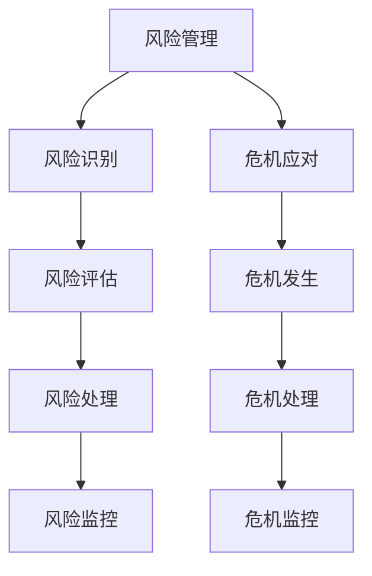

                 

## 文章标题：创业者的风险管理与危机应对能力培养

关键词：风险管理、危机应对、创业者、能力培养、行业案例分析

摘要：本文旨在探讨创业者在面临风险和危机时，如何进行有效的风险管理和危机应对。文章首先介绍了风险管理与危机应对的基本概念，然后通过具体行业和场景的案例分析，总结了创业者的风险管理与危机应对策略，最后提出了创业者风险管理与危机应对能力培养的方法和建议。

---

### 目录大纲

#### 第一部分：风险管理与危机应对基础知识

1. **第1章：风险管理与危机应对概述**
   1.1 风险管理的概念与重要性
   1.2 危机应对的定义与分类
   1.3 风险管理与危机应对的关系

2. **第2章：风险识别与评估**
   2.1 风险识别方法
   2.2 风险评估工具与技术
   2.3 风险矩阵与风险优先级排序

3. **第3章：危机应对策略**
   3.1 应急计划制定
   3.2 应急响应流程
   3.3 恢复计划与持续改进

#### 第二部分：具体行业与场景的风险管理与危机应对

4. **第4章：创业公司的风险管理与危机应对**
   4.1 创业公司常见风险分析
   4.2 创业公司的危机应对案例分析
   4.3 创业公司的风险管理策略

5. **第5章：科技企业的风险管理与危机应对**
   5.1 科技企业特有风险分析
   5.2 科技企业的危机应对策略
   5.3 科技企业的风险管理实践

6. **第6章：金融领域的风险管理与危机应对**
   6.1 金融领域风险识别与评估
   6.2 金融领域危机应对案例分析
   6.3 金融领域风险管理策略

7. **第7章：人力资源领域的风险管理与危机应对**
   7.1 人力资源风险识别与评估
   7.2 人力资源危机应对案例分析
   7.3 人力资源风险管理策略

#### 第三部分：创业者的风险管理与危机应对能力培养

8. **第8章：创业者的风险管理与危机应对能力培养**
   8.1 风险管理能力的培养
   8.2 危机应对能力的培养
   8.3 实战演练与案例分析

#### 附录

9. **附录A：风险管理与危机应对工具与资源**
   9.1 常用风险管理工具介绍
   9.2 危机应对资源清单
   9.3 风险管理在线课程与书籍推荐

10. **附录B：常见危机应对案例分析**
    10.1 公司破产危机应对案例分析
    10.2 市场竞争危机应对案例分析
    10.3 自然灾害危机应对案例分析

---

## 第一部分：风险管理与危机应对基础知识

### 第1章：风险管理与危机应对概述

#### 1.1 风险管理的概念与重要性

风险管理是一种系统化、结构化的方法，旨在识别、评估、处理和监控组织面临的各种风险，从而确保组织目标的有效实现。它不仅包括应对风险的发生，还包括预防风险的发生。

- **风险管理的基本概念**：

  - 风险：指组织面临的不确定性，可能导致不利结果。

  - 风险识别：识别组织面临的各种风险。

  - 风险评估：评估风险的可能性和影响。

  - 风险处理：选择并实施应对风险的最佳策略。

  - 风险监控：持续监控风险状态，确保风险管理策略的有效性。

- **风险管理的重要性**：

  - 降低风险损失：通过有效的风险管理，可以降低风险带来的损失。

  - 确保组织持续运营：有效管理风险，确保组织在面对不确定性时能够持续运营。

  - 提高组织竞争力：在竞争激烈的市场环境中，有效的风险管理可以提高组织的竞争力。

#### 1.2 危机应对的定义与分类

危机应对是指在危机发生时，组织采取的一系列紧急措施，以减轻危机的影响，恢复正常运营。

- **危机的定义**：

  - 危机：指突然发生，可能对组织造成严重危害的事件。

- **危机的分类**：

  - 按性质分类：可以分为自然灾害、人为事故、市场危机等。

  - 按影响范围分类：可以分为局部危机和全局危机。

  - 按危机发生频率分类：可以分为常见危机和罕见危机。

#### 1.3 风险管理与危机应对的关系

风险管理是危机应对的基础，两者相辅相成。

- **风险管理对危机应对的作用**：

  - 提前识别和评估危机风险，为危机应对提供依据。

  - 制定危机应对策略，降低危机发生时的损失。

- **危机应对对风险管理的作用**：

  - 通过应对危机，验证风险管理策略的有效性。

  - 提高组织对危机的应对能力，为未来的风险管理提供经验。

---

**Mermaid 流程图**：

---

**举例说明**：

- **公司A**在开展新项目时，通过风险管理识别到市场变化风险，评估其可能对项目造成的影响，并制定了相应的应对策略。当市场发生重大变化时，公司A能够迅速响应，降低了损失。

- **公司B**在遭受自然灾害时，通过危机应对措施，迅速恢复了正常运营，减少了损失。

---

## 第二部分：具体行业与场景的风险管理与危机应对

### 第4章：创业公司的风险管理与危机应对

#### 4.1 创业公司常见风险分析

创业公司通常面临的风险包括：

- **市场风险**：市场需求变化、竞争加剧等。

- **财务风险**：资金短缺、资金流动性问题等。

- **运营风险**：供应链问题、人才流失等。

- **法律风险**：政策法规变化、知识产权纠纷等。

#### 4.2 创业公司的危机应对案例分析

**案例1：公司C的市场风险应对**

公司C是一家初创的在线教育公司，在市场拓展过程中，遭遇了市场竞争加剧的问题。公司C通过以下措施应对危机：

- **市场调研**：深入了解竞争对手的优势和劣势，调整自己的市场策略。

- **优化产品**：根据用户反馈，不断改进产品，提升用户体验。

- **营销策略**：加大市场推广力度，提高品牌知名度。

**案例2：公司D的财务风险应对**

公司D在创业初期，由于资金短缺，面临财务危机。公司D采取了以下措施应对危机：

- **融资**：积极寻找投资人，争取资金支持。

- **成本控制**：优化内部管理，降低运营成本。

- **现金流管理**：合理规划现金流，确保公司运营的可持续性。

#### 4.3 创业公司的风险管理策略

创业公司可以采取以下风险管理策略：

- **预防性风险管理**：在项目启动前，进行风险识别和评估，制定预防措施。

- **应对性风险管理**：在风险发生时，迅速采取应对措施，降低损失。

- **转移性风险管理**：通过购买保险等手段，将风险转移给第三方。

- **承受性风险管理**：对于无法避免的风险，采取接受和承受的态度。

---

## 第三部分：创业者的风险管理与危机应对能力培养

### 第8章：创业者的风险管理与危机应对能力培养

#### 8.1 风险管理能力的培养

- **培养风险管理意识**：创业者应认识到风险管理的重要性，将风险管理纳入公司战略规划。

- **学习风险管理知识**：创业者可以通过阅读相关书籍、参加培训课程等，提升自己的风险管理能力。

- **实践风险管理**：在实际创业过程中，创业者应不断实践风险管理，总结经验教训。

#### 8.2 危机应对能力的培养

- **培养危机意识**：创业者应时刻保持警惕，对潜在的危机有敏锐的洞察力。

- **学习危机应对策略**：创业者可以通过研究成功和失败的危机应对案例，学习有效的危机应对策略。

- **定期进行危机演练**：创业者应定期组织危机演练，提高应对危机的能力。

#### 8.3 实战演练与案例分析

- **实战演练**：创业者可以通过模拟实际场景，进行危机应对演练。

- **案例分析**：创业者可以分析成功和失败的危机应对案例，从中吸取经验和教训。

---

## 附录

### 附录A：风险管理与危机应对工具与资源

- **风险识别工具**：SWOT分析、PEST分析、风险矩阵等。

- **风险评估工具**：定量风险评估、定性风险评估等。

- **危机应对工具**：危机管理计划、应急预案等。

- **资源清单**：风险识别清单、风险评估清单、危机应对资源清单等。

### 附录B：常见危机应对案例分析

- **公司破产危机应对案例分析**：如何应对公司破产危机。

- **市场竞争危机应对案例分析**：如何应对市场竞争加剧的危机。

- **自然灾害危机应对案例分析**：如何应对自然灾害带来的危机。

---

**作者：AI天才研究院/AI Genius Institute & 禅与计算机程序设计艺术 /Zen And The Art of Computer Programming**

