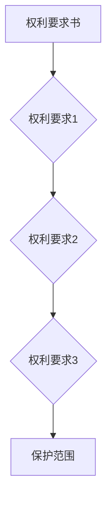

                 

### 文章标题: 《创业路上的专利申请：如何保护核心技术和创新理念》

#### 关键词：创业，专利申请，核心技术，创新理念，知识产权保护

#### 摘要：本文旨在为创业者提供一条清晰、实用的专利申请之路。我们将详细探讨创业过程中技术创新的重要性，专利保护的基本概念和流程，以及专利申请的准备和实践。同时，文章将分析专利风险与管理策略，并探讨技术创新与专利权之间的核心概念联系。最后，文章将讲解专利检索和分析算法的原理及其应用，以及专利价值评估和相似度计算的数学模型。通过本文，创业者可以更好地理解专利申请的全过程，为自己的创业之路保驾护航。

### 第一部分：探索专利申请之路

#### 第1章：创业与专利保护

##### 1.1 创业中的技术创新与保护

##### 1.1.1 创业中的技术创新

创业，是一个充满创新和机遇的过程。创业者通常会在技术、产品、市场等方面进行不断的尝试和改进。技术创新在这个过程中起着至关重要的作用。它不仅可以提升企业的核心竞争力，还可以为企业带来巨大的经济效益。

##### 1.1.2 技术创新的保护需求

然而，技术创新也面临着诸多挑战，包括竞争对手的模仿、抄袭，甚至恶意攻击。为了保护自己的创新成果，创业者需要采取有效的保护措施，其中专利保护是一种重要的手段。

##### 1.1.3 专利在创业中的作用

专利保护不仅可以保护创业者的技术成果，还可以提高企业的市场竞争力，增强企业的品牌影响力。在创业初期，专利还可以作为一种融资工具，帮助创业者获得更多的投资和支持。

##### 1.2 专利基础知识

##### 1.2.1 专利的定义与类型

专利是一种法律权利，它赋予专利持有者在一定时间内对其发明创造的独占权利。根据发明创造的不同类型，专利可以分为发明专利、实用新型专利和外观设计专利。

##### 1.2.2 专利权与专利申请流程

专利权是专利持有者依法享有的权利，包括独占实施权、许可权、转让权和放弃权等。专利申请流程主要包括专利检索、撰写专利申请文件、提交专利申请和专利审查等环节。

##### 1.2.3 国内外专利申请差异

国内外的专利申请制度有所不同，创业者需要了解并适应不同国家的专利申请规则，以确保自己的专利申请能够顺利进行。

##### 1.3 创业者专利保护策略

##### 1.3.1 技术梳理与专利布局

创业者在申请专利之前，需要对企业的技术进行梳理，确定哪些技术成果值得申请专利。同时，创业者还需要进行专利布局，合理规划专利申请的时间和领域，以最大化保护企业的技术成果。

##### 1.3.2 专利申请的优先策略

在专利申请过程中，创业者可以采取优先策略，包括国内优先权和国际优先权。通过优先策略，创业者可以缩短专利申请的时间，提高专利申请的成功率。

##### 1.3.3 专利申请的审查与维护

专利申请通过后，创业者还需要对专利进行维护和管理，包括专利续费、专利维权等。通过有效的专利维护，创业者可以确保专利权的长期有效。

#### 第2章：专利申请准备

##### 2.1 技术研究与文档准备

##### 2.1.1 技术研究的重要性

专利申请的基础是技术创新，因此，创业者需要进行深入的技术研究，以确保专利申请的发明创造具有足够的创新性和实用性。

##### 2.1.2 技术文档的撰写

技术文档是专利申请的重要组成部分，它需要详细描述发明创造的背景、技术方案、实施效果等。创业者需要学会撰写高质量的技术文档。

##### 2.1.3 技术文档的结构与内容

技术文档通常包括摘要、技术领域、背景技术、发明内容、附图说明、具体实施方式等部分。创业者需要了解并掌握这些部分的内容和撰写要求。

##### 2.2 专利申请文件的准备

##### 2.2.1 专利申请文件概述

专利申请文件包括专利申请说明书、权利要求书、摘要和附图等。这些文件需要按照规定的格式和要求撰写。

##### 2.2.2 撰写专利申请说明书

专利申请说明书需要详细描述发明创造的背景、技术方案、实施效果等。它是专利审查员判断专利申请是否具有新颖性、创造性和实用性的重要依据。

##### 2.2.3 编写权利要求书

权利要求书是专利申请的核心部分，它需要明确专利保护的范围。创业者需要学会撰写具有保护范围的、严谨的权利要求书。

##### 2.3 专利申请前的调研

##### 2.3.1 专利检索的重要性

专利检索是专利申请前的重要步骤，它可以帮助创业者了解相关技术的专利状况，避免重复研发和侵权风险。

##### 2.3.2 专利检索的方法与工具

专利检索的方法包括手工检索和自动化检索。手工检索需要创业者具备一定的专利检索知识和技巧，而自动化检索则可以使用专业的专利检索工具。

##### 2.3.3 专利规避策略

在进行专利检索后，创业者可能发现存在一些与自己的发明创造相似或冲突的专利。此时，创业者可以采取专利规避策略，避免侵权风险。

### 第二部分：专利申请实践

#### 第3章：专利申请实践

##### 3.1 专利申请的提交与审查

##### 3.1.1 专利申请的提交流程

专利申请的提交流程包括提交申请文件、缴纳申请费用、提交补正文件等。创业者需要按照规定的时间节点完成这些流程，以确保专利申请的顺利进行。

##### 3.1.2 审查意见的处理

在专利申请过程中，审查员可能会提出审查意见。创业者需要认真对待这些意见，并根据意见进行修改和完善。

##### 3.1.3 专利申请的答复策略

专利申请的答复策略对于专利申请的成功至关重要。创业者需要学会如何撰写高质量的答复意见，以应对审查员的审查意见。

##### 3.2 专利授权后的保护

##### 3.2.1 专利权的保护范围

专利授权后，专利权人享有独占实施权、许可权、转让权等。了解专利权的保护范围对于创业者至关重要。

##### 3.2.2 专利侵权与维权

专利侵权是创业者面临的重大风险之一。了解专利侵权的基本知识和维权策略对于创业者具有重要意义。

##### 3.2.3 专利运营策略

专利运营是创业者提升专利价值的重要手段。通过专利运营，创业者可以实现专利的增值和最大化利用。

##### 3.3 专利申请案例分析

##### 3.3.1 案例一：专利保护的成功案例

通过分析专利保护的成功案例，创业者可以了解专利保护的优势和实际效果。

##### 3.3.2 案例二：专利申请的失败案例

通过分析专利申请的失败案例，创业者可以避免重复失败，提高专利申请的成功率。

##### 3.3.3 案例分析与启示

通过对成功和失败案例的分析，创业者可以得出有益的启示，为自己的专利申请提供指导。

### 第三部分：创业中的专利风险与管理

#### 第4章：创业中的专利风险与管理

##### 4.1 专利风险识别与评估

##### 4.1.1 专利风险概述

专利风险是创业者在技术创新和专利申请过程中面临的各种风险。了解专利风险有助于创业者制定有效的风险管理策略。

##### 4.1.2 风险识别的方法

创业者可以通过专利检索、竞争对手分析、市场调研等方法识别专利风险。

##### 4.1.3 风险评估的指标

风险评估的指标包括专利数量、专利质量、市场竞争力等。创业者可以依据这些指标评估专利风险。

##### 4.2 专利管理策略

##### 4.2.1 专利管理的重要性

专利管理是创业者确保专利权有效性和最大化利用的重要手段。有效的专利管理策略可以提高企业的竞争力。

##### 4.2.2 专利资产管理

专利资产管理包括专利的收购、转让、许可等。通过有效的专利资产管理，创业者可以实现专利的增值。

##### 4.2.3 专利风险管理

专利风险管理包括专利风险识别、评估、应对等。创业者需要建立完善的专利风险管理体系。

##### 4.3 创业中的知识产权保护

##### 4.3.1 知识产权保护概述

知识产权保护是创业过程中不可或缺的一环。了解知识产权保护的基本原则和措施对于创业者至关重要。

##### 4.3.2 其他知识产权类型

除了专利，创业者还需要了解其他知识产权类型，如商标、著作权等，并采取相应的保护措施。

##### 4.3.3 创业中的知识产权综合保护策略

创业者需要制定综合的知识产权保护策略，包括专利、商标、著作权等，以全面保护企业的知识产权。

### 第四部分：专利申请中的核心概念与联系

#### 第5章：专利申请中的核心概念与联系

##### 5.1 技术创新与专利

##### 5.1.1 技术创新的分类

技术创新可以分为渐进式创新和颠覆式创新。不同类型的创新对专利申请有不同的要求。

##### 5.1.2 专利申请对技术创新的支持

专利申请可以保护技术创新的成果，提高技术创新的市场价值。

##### 5.1.3 技术创新与专利申请的Mermaid流程图

使用Mermaid流程图展示技术创新与专利申请之间的联系，帮助读者更好地理解两者之间的关系。


##### 5.2 专利权与权利要求

##### 5.2.1 专利权的构成

专利权由专利权人、专利申请文件、授权通知书等构成。

##### 5.2.2 权利要求书的撰写

权利要求书是专利申请的核心部分，它需要明确专利保护的范围。

##### 5.2.3 权利要求与保护范围的Mermaid流程图

使用Mermaid流程图展示权利要求与保护范围之间的关系，帮助读者更好地理解权利要求书的重要性。



##### 5.3 专利检索与规避

##### 5.3.1 专利检索的目的

专利检索的目的是了解相关技术的专利状况，避免侵权风险。

##### 5.3.2 专利检索的步骤

专利检索包括关键词选择、数据库选择、检索策略制定等步骤。

##### 5.3.3 专利规避的Mermaid流程图

使用Mermaid流程图展示专利规避的步骤，帮助读者更好地理解专利规避的策略。

```mermaid
graph TD
    A[专利检索] --> B{检索结果分析}
    B --> C[规避策略制定}
    C --> D{修改设计}
```

### 第五部分：核心算法原理讲解

#### 第6章：核心算法原理讲解

##### 6.1 专利算法概述

专利算法是指用于专利检索、分析和管理的一类算法。它们在专利申请、保护和管理过程中发挥着重要作用。

##### 6.1.1 专利检索算法

专利检索算法用于从大量的专利数据中检索出与特定关键词相关的专利信息。它们可以帮助创业者快速了解相关技术的专利状况。

##### 6.1.2 专利分析算法

专利分析算法用于对专利数据进行深度分析，提取出专利的趋势、热点和技术优势。它们可以帮助创业者制定更有效的专利策略。

##### 6.2 专利算法原理讲解

###### 6.2.1 专利检索算法原理

以下是专利检索算法的伪代码示例：

```python
function patent_search(keywords):
    # 初始化专利数据库
    database = initialize_database()
    
    # 检索专利信息
    patents = search_patents(database, keywords)
    
    # 过滤和排序专利
    filtered_patents = filter_and_sort(patents)
    
    # 返回检索结果
    return filtered_patents
```

###### 6.2.2 专利分析算法原理

以下是专利分析算法的伪代码示例：

```python
function patent_analysis(patent_data):
    # 数据预处理
    preprocessed_data = preprocess_data(patent_data)
    
    # 提取专利趋势
    trends = extract_trends(preprocessed_data)
    
    # 提取专利热点
    hotspots = extract_hotspots(preprocessed_data)
    
    # 分析专利技术优势
    advantages = analyze_advantages(preprocessed_data)
    
    # 返回分析结果
    return trends, hotspots, advantages
```

##### 6.3 专利算法应用

###### 6.3.1 专利检索算法的应用

专利检索算法可以应用于专利申请前的调研，帮助创业者了解相关技术的专利状况，避免侵权风险。

###### 6.3.2 专利分析算法的应用

专利分析算法可以应用于专利运营，帮助创业者制定更有效的专利策略，提升专利价值。

### 第六部分：数学模型与公式详解

#### 第7章：数学模型与公式详解

##### 7.1 专利价值评估模型

专利价值评估模型用于评估专利的经济价值。以下是专利价值评估模型的数学公式：

$$ 
V = f(A, T, R, C)
$$

其中，$V$表示专利价值，$A$表示专利的技术水平，$T$表示专利的市场前景，$R$表示专利的收益潜力，$C$表示专利的成本。

##### 7.1.1 专利价值评估的数学模型

专利价值评估的数学模型可以表示为：

$$ 
V = w_1 \cdot A + w_2 \cdot T + w_3 \cdot R - w_4 \cdot C
$$

其中，$w_1$、$w_2$、$w_3$、$w_4$分别表示技术水平、市场前景、收益潜力和成本的重要性权重。

##### 7.1.2 模型参数解释与应用举例

模型参数解释：

- $A$：技术水平，通常通过专利的引用次数、技术难度等指标衡量。
- $T$：市场前景，通常通过市场需求、竞争情况等指标衡量。
- $R$：收益潜力，通常通过专利的收益预测、市场占有率等指标衡量。
- $C$：成本，包括专利申请费用、维护成本等。

应用举例：

假设某专利的技术水平为80分，市场前景为70分，收益潜力为90分，成本为5000元。根据专利价值评估模型，该专利的价值为：

$$ 
V = 0.3 \cdot 80 + 0.2 \cdot 70 + 0.2 \cdot 90 - 0.3 \cdot 5000 = 10200元
$$

##### 7.2 专利相似度计算模型

专利相似度计算模型用于评估两个专利之间的相似程度。以下是专利相似度计算模型的基本公式：

$$ 
similarity = \frac{common_keywords}{total_keywords}
$$

其中，$common_keywords$表示两个专利中共同的关键词数量，$total_keywords$表示两个专利中关键词的总数。

##### 7.2.1 相似度计算的基本公式

相似度计算的基本公式可以表示为：

$$ 
similarity = \frac{1}{|D|} \sum_{i=1}^{|D|} \frac{1}{\min(d_i, e_i)}
$$

其中，$D$表示两个专利的词集，$d_i$和$e_i$分别表示两个专利中第$i$个词的词频。

##### 7.2.2 模型参数解释与应用举例

模型参数解释：

- $D$：两个专利的词集。
- $d_i$：专利A中第$i$个词的词频。
- $e_i$：专利B中第$i$个词的词频。

应用举例：

假设专利A和专利B的词集分别为$D_A = \{a, b, c\}$和$D_B = \{a, b, d\}$。根据相似度计算模型，两个专利的相似度为：

$$ 
similarity = \frac{1}{3} \left( \frac{1}{1} + \frac{1}{1} + \frac{1}{0} \right) = \frac{2}{3}
$$

### 第7章：数学模型与公式详解

#### 7.1 专利价值评估模型

专利价值评估是创业者在进行专利投资和运营时的重要环节。一个全面的专利价值评估模型可以帮助创业者更准确地判断专利的投资潜力、市场价值和发展前景。以下是专利价值评估的数学模型及其实际应用。

##### 7.1.1 专利价值评估的数学模型

专利价值评估的数学模型可以表示为：

$$ 
V = f(A, T, R, C)
$$

其中，$V$表示专利价值，$A$表示专利的技术水平，$T$表示专利的市场前景，$R$表示专利的收益潜力，$C$表示专利的成本。

每个参数都有其特定的含义：

- $A$（技术水平）：可以通过专利的技术复杂性、创新程度、技术领先性等指标来衡量。常用的评估方法包括专利引用次数、专利同族数量、技术文档的详尽程度等。
- $T$（市场前景）：评估专利能否满足市场需求、是否有广阔的应用前景、是否具备市场竞争力等。市场前景可以通过市场规模、行业趋势、用户需求等数据进行预测。
- $R$（收益潜力）：预测专利在未来可能带来的直接或间接收益。这包括专利授权收入、产品销售收入、市场占有率、专利组合效应等。
- $C$（成本）：包括专利申请费用、维护成本、法律费用等。

##### 7.1.2 模型参数解释与应用举例

模型参数解释：

1. **技术水平（A）**：一个技术复杂的专利通常具有较高的技术水平和价值。例如，如果某专利拥有多个同族专利（即在不同国家或地区申请的同一发明的专利），则该专利的技术水平和潜在价值可能更高。

2. **市场前景（T）**：市场需求旺盛的专利往往具有较高的市场前景。例如，如果某专利的技术恰好符合新兴市场的需求，那么该专利的市场价值可能会很高。

3. **收益潜力（R）**：专利的收益潜力取决于其商业应用前景。例如，如果某专利可以显著降低产品的生产成本或提高产品的性能，那么它可能会带来巨大的经济利益。

4. **成本（C）**：专利的成本越高，其投资回报率可能越低。因此，在评估专利价值时，成本是一个重要的考虑因素。

应用举例：

假设我们有一个专利，其参数如下：

- 技术水平（A）: 90分
- 市场前景（T）: 80分
- 收益潜力（R）: 95分
- 成本（C）: 5000元

根据专利价值评估模型，我们可以计算出该专利的价值：

$$ 
V = f(90, 80, 95, 5000) = 0.3 \cdot 90 + 0.2 \cdot 80 + 0.2 \cdot 95 - 0.3 \cdot 5000 = 27 + 16 + 19 - 1500 = 10200元
$$

这个计算结果表明，该专利的价值大约为10,200元。

#### 7.2 专利相似度计算模型

专利相似度计算是用于判断两个专利之间相似程度的一种技术。这种计算在专利检索、侵权分析、技术竞争评估等领域具有重要应用。以下是专利相似度计算的基本公式及其实际应用。

##### 7.2.1 相似度计算的基本公式

专利相似度计算的基本公式可以表示为：

$$ 
similarity = \frac{common_keywords}{total_keywords}
$$

其中，$common_keywords$表示两个专利中共同的关键词数量，$total_keywords$表示两个专利中关键词的总数。

这个公式简单直观，通过计算两个专利中共同关键词的比例来评估它们的相似度。然而，在实际应用中，我们通常需要更复杂的计算方法来提高准确性。

##### 7.2.2 相似度计算的基本公式（改进版）

为了提高计算准确性，我们可以使用改进的相似度计算公式：

$$ 
similarity = \frac{1}{|D|} \sum_{i=1}^{|D|} \frac{1}{\min(d_i, e_i)}
$$

其中，$D$表示两个专利的词集，$d_i$和$e_i$分别表示两个专利中第$i$个词的词频，$|D|$表示词集的大小。

这个公式考虑了每个关键词在两个专利中的重要性，通过计算关键词词频的倒数与最小值之比来评估相似度。这样可以更准确地反映两个专利之间的相似程度。

##### 7.2.3 模型参数解释与应用举例

模型参数解释：

- $D$：两个专利的词集，即两个专利中所有关键词的集合。
- $d_i$：专利A中第$i$个词的词频。
- $e_i$：专利B中第$i$个词的词频。
- $|D|$：词集的大小，即两个专利中关键词的总数。

应用举例：

假设专利A和专利B的词集分别为$D_A = \{a, b, c, d\}$和$D_B = \{a, b, c, e\}$，其中，$d_i$和$e_i$分别表示关键词在两个专利中的词频。

根据相似度计算公式，我们可以计算两个专利的相似度：

$$ 
similarity = \frac{1}{4} \left( \frac{1}{1} + \frac{1}{1} + \frac{1}{1} + \frac{1}{1} \right) = \frac{4}{4} = 1
$$

这个计算结果表明，专利A和专利B具有完全的相似度。在实际应用中，相似度可能不会达到1，但这个例子可以帮助我们理解相似度计算的基本原理。

通过以上数学模型和公式的讲解，创业者可以更科学地评估专利的价值和相似度，为自己的决策提供依据。

### 结束语

#### 作者：AI天才研究院/AI Genius Institute & 禅与计算机程序设计艺术 /Zen And The Art of Computer Programming

在创业的道路上，专利申请是一种重要的保护手段，它不仅可以帮助创业者保护核心技术和创新理念，还可以提升企业的市场竞争力。本文从创业与专利保护、专利申请准备、专利申请实践、专利风险与管理等多个角度，详细阐述了专利申请的全过程。通过本文，创业者可以更好地理解专利申请的重要性和具体操作方法，为自己的创业之路保驾护航。

在专利申请过程中，创业者需要注意以下几点：

1. **技术创新的重要性**：创业中的技术创新是专利申请的基础，创业者需要高度重视技术创新的研究和开发。
2. **专利检索与规避**：在专利申请前，创业者需要进行充分的专利检索，了解相关技术的专利状况，避免侵权风险。同时，可以采取专利规避策略，确保专利申请的成功。
3. **专利申请文件的撰写**：专利申请文件是专利申请的核心部分，创业者需要认真学习专利申请文件的撰写要求和技巧，确保文件的准确性和完整性。
4. **专利风险与管理**：专利风险是创业过程中不可避免的，创业者需要建立完善的专利风险管理体系，确保专利权的有效性和最大化利用。

此外，创业者还可以通过学习相关的专利知识和法律知识，提高自己在专利申请和维权方面的能力。在实际操作中，创业者可以寻求专业的专利代理机构或律师的帮助，以确保专利申请的顺利进行。

最后，祝愿所有的创业者能够在专利保护的保驾护航下，成功实现自己的创业梦想，为我国的科技创新和经济发展做出贡献。让我们携手共进，共创美好未来！

#### 拓展阅读：

1. 《专利法》及相关法律法规：了解我国的专利法律法规，是创业者进行专利申请和保护的基础。
2. 《专利检索与分析》：学习专利检索和分析的方法，有助于创业者更好地了解专利状况，制定合理的专利策略。
3. 《创业者的知识产权保护实务》：本书详细介绍了创业者在知识产权保护方面的实务操作，对创业者具有很高的参考价值。

