                 

### 文章标题

《创业路上的危机公关：如何应对产品故障和负面评价》

### 关键词

- 危机公关
- 产品故障
- 负面评价
- 应对策略
- 创业公司

### 摘要

在创业道路上，产品故障和负面评价是不可避免的风险。本文将深入探讨危机公关的定义与重要性，详细分析产品故障的类型与特点，提出有效的预警与应对措施，并解析负面评价的类型与影响。通过案例分析，总结危机公关的有效实施方法和创业公司的特殊策略，以期为创业者提供实用的指导，帮助他们在面临危机时从容应对。

### 《创业路上的危机公关：如何应对产品故障和负面评价》目录大纲

#### 第一部分：危机公关概述

##### 第1章：危机公关的定义与重要性

- **1.1 危机公关的定义与核心要素**
- **1.2 产品故障和负面评价的危机类型**
- **1.3 危机公关在企业发展中的角色**

##### 第2章：危机公关的组织与流程

- **2.1 危机公关团队的构建**
- **2.2 危机公关的预警机制**
- **2.3 危机公关的应急响应流程**

#### 第二部分：产品故障应对策略

##### 第3章：产品故障的类型与特点

- **3.1 产品故障的常见类型**
- **3.2 产品故障的特点分析**
- **3.3 产品故障的影响评估**

##### 第4章：产品故障的预警与应对措施

- **4.1 产品故障预警机制的设计**
- **4.2 产品故障应急响应计划**
- **4.3 产品故障后的用户沟通策略**

##### 第5章：产品故障处理的流程与方法

- **5.1 产品故障处理的基本流程**
- **5.2 产品故障处理的常见方法**
- **5.3 产品故障处理的案例分析**

#### 第三部分：负面评价的应对策略

##### 第6章：负面评价的类型与影响

- **6.1 负面评价的类型分类**
- **6.2 负面评价的影响分析**
- **6.3 负面评价的舆论监控**

##### 第7章：负面评价的应对策略

- **7.1 负面评价的应对原则**
- **7.2 负面评价的回应技巧**
- **7.3 负面评价的舆论引导策略**

##### 第8章：负面评价处理的案例研究

- **8.1 某知名企业负面评价处理案例**
- **8.2 某创业公司负面评价处理案例**
- **8.3 负面评价处理的经验总结**

#### 第四部分：危机公关的有效实施

##### 第9章：危机公关的评估与改进

- **9.1 危机公关效果的评估方法**
- **9.2 危机公关的改进方向**
- **9.3 危机公关的成功案例分析**

##### 第10章：创业公司的危机公关策略

- **10.1 创业公司危机公关的特点**
- **10.2 创业公司危机公关的难点与对策**
- **10.3 创业公司危机公关的长期规划**

##### 第11章：危机公关的未来发展趋势

- **11.1 社交媒体对危机公关的影响**
- **11.2 AI技术在危机公关中的应用**
- **11.3 危机公关的未来发展方向**

#### 附录

- **附录A：危机公关常用工具与资源**
  - **A.1 危机监测工具**
  - **A.2 社交媒体管理工具**
  - **A.3 紧急响应与协调工具**

- **附录B：危机公关案例汇编**
  - **B.1 国内外危机公关经典案例**
  - **B.2 创业公司危机公关案例集锦**

---

#### 第一部分：危机公关概述

##### 第1章：危机公关的定义与重要性

**1.1 危机公关的定义与核心要素**

危机公关，又称危机管理，是一种预防性和反应性的战略，旨在识别、准备应对和管理对企业声誉和运营可能产生负面影响的突发事件。在技术快速发展的时代，危机公关在企业特别是创业公司中扮演着至关重要的角色。

- **定义**：危机公关是企业通过预测、监控、评估、响应和恢复，处理危机事件的一系列行动。危机事件可能涉及产品故障、数据泄露、负面舆论等。
- **核心要素**：危机公关的核心要素包括危机预警、应急响应、沟通策略、危机管理团队和危机恢复。

**1.2 产品故障和负面评价的危机类型**

产品故障和负面评价是创业公司最常遇到的危机类型。

- **产品故障**：产品故障可能导致用户体验下降、业务中断、客户流失等，严重时还可能引发法律纠纷。
- **负面评价**：负面评价可能来自用户、媒体或竞争对手，形式包括社交媒体评论、论坛发帖、新闻报道等。负面评价若未能妥善处理，可能迅速传播，影响企业的品牌形象和市场地位。

**1.3 危机公关在企业发展中的角色**

危机公关在企业发展中具有多重角色：

- **维护品牌形象**：危机公关能够帮助企业迅速平息负面舆论，避免声誉受损，甚至转危为安。
- **减少损失**：有效的危机公关可以降低危机事件对企业运营的负面影响，减少经济损失。
- **提升应对能力**：通过危机公关，企业可以建立强大的应急响应体系，提高未来危机的应对能力。
- **增强员工凝聚力**：危机公关中有效的内部沟通有助于增强员工的信心和凝聚力。

**1.4 本章小结**

危机公关是企业应对突发危机的重要工具。产品故障和负面评价是常见的危机类型，对企业的运营和声誉产生深远影响。理解危机公关的定义和核心要素，有助于企业在危机中做出快速而有效的应对。

---

**Mermaid 流程图：危机公关的核心要素**

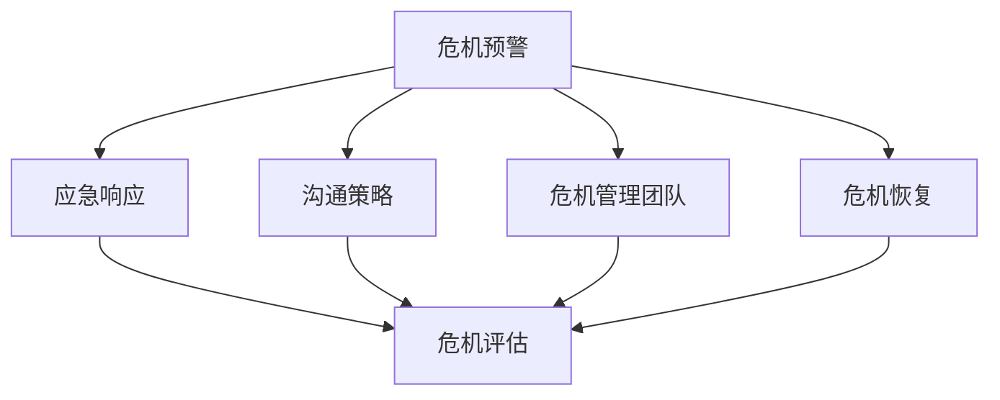

---

在下一章，我们将详细探讨危机公关的组织与流程，包括危机公关团队的构建、预警机制和应急响应流程。

---

##### 第2章：危机公关的组织与流程

**2.1 危机公关团队的构建**

危机公关团队是处理危机事件的核心力量，其构建需要考虑以下几个方面：

- **成员组成**：危机公关团队应包括不同领域的专家，如公共关系经理、市场营销经理、法律顾问、技术专家等。团队成员应具备快速应对危机的能力，能够迅速采取行动。
- **领导层**：危机公关团队需要一个强有力的领导，通常是企业的高层管理者，如CEO或COO。领导层需要具备决策能力，能够迅速制定并执行应对策略。
- **角色分配**：团队成员应明确各自的角色和职责，如信息收集、舆论监控、对外沟通、内部协调等。明确的责任分配有助于提高团队的效率和执行力。

**2.2 危机公关的预警机制**

预警机制是危机公关的基础，能够帮助企业提前识别潜在的危机事件。预警机制包括以下几方面：

- **信息收集**：建立信息收集渠道，包括内部报告、客户反馈、媒体报道、社交媒体监测等。通过多渠道收集信息，可以全面了解潜在的危机信号。
- **分析评估**：对收集到的信息进行分析和评估，判断其可能对企业的影响。分析评估应包括危机事件的性质、规模、影响范围等。
- **预警信号**：设定预警信号，当信息达到某一阈值时，自动触发预警机制。预警信号可以是具体的指标，如负面评价数量、客户投诉率等。

**2.3 危机公关的应急响应流程**

危机公关的应急响应流程包括以下几个阶段：

- **快速响应**：在危机事件发生的第一时间，危机公关团队应迅速行动，启动应急响应计划。快速响应有助于降低危机事件的扩散和影响。
- **内部协调**：危机公关团队需要与内部各部门进行紧密协调，确保信息的准确传递和行动的一致性。内部协调包括技术部门、市场部门、法务部门等。
- **对外沟通**：对外沟通是危机公关的关键环节。危机公关团队应制定统一的对外沟通策略，确保信息的一致性和准确性。对外沟通包括新闻发布会、媒体采访、社交媒体回应等。
- **危机处理**：在危机事件得到初步控制后，危机公关团队应制定详细的危机处理方案，包括危机调查、问题解决、赔偿补偿等。

**2.4 本章小结**

危机公关团队的组织与流程是企业有效应对危机事件的关键。危机公关团队的构建需要多领域的专家和强有力的领导，预警机制能够提前识别潜在的危机，应急响应流程确保危机事件得到及时和有效的处理。理解并实施这些流程，有助于企业在面对危机时从容应对。

---

**Mermaid 流程图：危机公关的应急响应流程**

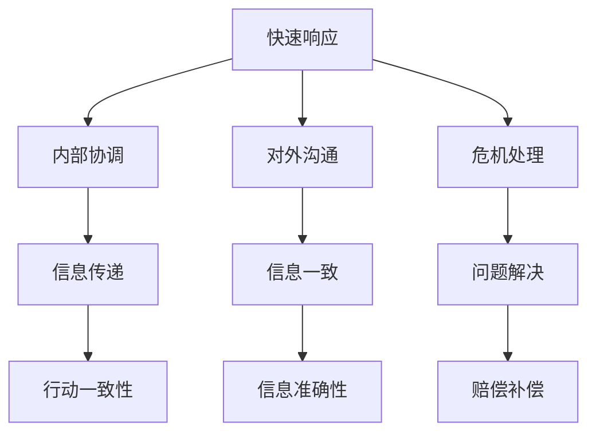

---

在下一章，我们将探讨产品故障的类型与特点，以及应对产品故障的预警与应对措施。

---

##### 第3章：产品故障的类型与特点

**3.1 产品故障的常见类型**

产品故障可以按照其发生的原因和表现形式进行分类。常见的类型包括：

- **技术故障**：由于软件或硬件的技术问题导致的故障，如系统崩溃、网络中断、数据丢失等。
- **设计缺陷**：产品设计存在缺陷，导致在实际使用过程中出现问题，如界面操作不友好、功能实现错误等。
- **操作失误**：用户在使用产品过程中由于操作不当导致的故障，如误操作、越权访问等。
- **外部干扰**：外部环境因素导致的故障，如网络攻击、自然灾害等。

**3.2 产品故障的特点分析**

产品故障具有以下特点：

- **突发性**：产品故障通常突然发生，企业在短时间内难以预测和准备，增加了应对的难度。
- **广泛性**：产品故障可能影响多个用户，甚至整个产品线，影响范围广泛。
- **破坏性**：产品故障可能导致用户体验下降、业务中断、客户流失等，对企业的运营和声誉产生重大影响。
- **可传播性**：产品故障的信息可能在用户之间迅速传播，加剧危机事件的严重性。

**3.3 产品故障的影响评估**

产品故障的影响可以从以下几个方面进行评估：

- **用户体验**：产品故障可能导致用户体验下降，影响用户满意度。
- **业务运营**：产品故障可能导致业务中断，影响企业的正常运营。
- **客户流失**：严重的故障可能导致客户流失，影响企业的市场地位。
- **声誉损失**：产品故障的负面信息可能在用户和媒体之间传播，损害企业的声誉。

**3.4 本章小结**

产品故障是创业公司常见的危机类型，具有突发性、广泛性、破坏性和可传播性的特点。了解产品故障的常见类型和特点，有助于企业更好地进行故障预警和应对。在下一章，我们将探讨如何设计产品故障预警机制和应急响应措施，以减少产品故障带来的负面影响。

---

**Mermaid 流程图：产品故障类型与特点**

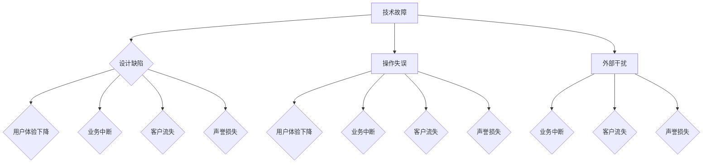

---

在下一章，我们将深入探讨产品故障的预警与应对措施，以帮助企业在危机中更好地保护自身。

---

##### 第4章：产品故障的预警与应对措施

**4.1 产品故障预警机制的设计**

产品故障预警机制是预防产品故障的关键，其设计应考虑以下几个方面：

- **数据监控**：建立全面的数据监控系统，实时监控产品的运行状态。监控系统应包括服务器日志、网络流量、用户行为数据等。通过分析这些数据，可以提前发现异常情况。
- **异常检测**：利用机器学习、大数据分析等技术，建立异常检测模型。当监控数据出现异常时，系统可以自动发出预警信号。异常检测模型可以通过历史数据训练，提高预警的准确性。
- **预警信号设定**：根据产品特点和业务需求，设定具体的预警信号。预警信号可以是阈值报警，如系统响应时间超过一定限度、错误率超过一定比例等。设定合理的预警信号阈值，可以避免误报和漏报。
- **预警通知**：当预警信号触发时，系统应自动通知相关责任人。通知方式可以包括短信、邮件、即时通讯工具等，确保责任人能够及时响应。

**4.2 产品故障应急响应计划**

产品故障应急响应计划是应对产品故障的关键步骤，其设计应考虑以下几个方面：

- **应急响应团队**：建立专业的应急响应团队，团队成员应包括技术专家、产品经理、公关经理等。应急响应团队需要具备快速响应能力和协作能力。
- **应急响应流程**：制定详细的应急响应流程，包括故障识别、故障分析、故障修复、用户通知等环节。应急响应流程应明确各环节的责任人和执行步骤，确保故障处理的高效性。
- **故障修复策略**：针对不同类型的产品故障，制定相应的修复策略。修复策略可以包括故障恢复、系统升级、代码修复等。在制定修复策略时，应考虑故障的影响范围和修复时间。
- **用户沟通策略**：在故障处理过程中，应与用户保持密切沟通，及时通知用户故障情况和修复进度。沟通策略可以包括官方网站公告、邮件通知、社交媒体回应等。

**4.3 产品故障后的用户沟通策略**

产品故障后的用户沟通策略是恢复用户信任和减少损失的关键。以下是一些有效的用户沟通策略：

- **及时回应**：在产品故障发生后，应尽快回应用户的问题和投诉。及时回应可以缓解用户的焦虑和不满，减少负面情绪的传播。
- **透明沟通**：与用户保持透明沟通，如实告知故障原因和修复进度。透明沟通可以增强用户的信任感，减少误解和猜测。
- **情感关怀**：在沟通中，应体现出对用户的关心和同情。情感关怀可以帮助用户感受到企业的诚意，减轻心理负担。
- **赔偿补偿**：对于因产品故障导致的用户损失，应提供合理的赔偿补偿方案。赔偿补偿可以包括免费使用、优惠折扣、礼品赠送等，以修复用户受损的利益。

**4.4 本章小结**

产品故障预警机制和应急响应计划是应对产品故障的关键。预警机制的设计应包括数据监控、异常检测、预警信号设定和预警通知。应急响应计划应包括应急响应团队、应急响应流程、故障修复策略和用户沟通策略。通过有效的预警和应急响应，企业可以减少产品故障带来的负面影响，保护用户和企业的利益。

---

**Mermaid 流程图：产品故障预警机制与应急响应计划**

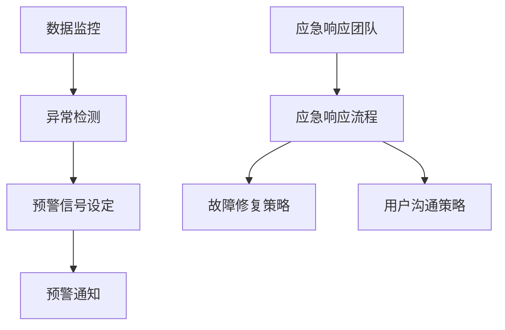

---

在下一章，我们将探讨负面评价的类型与影响，以及应对负面评价的策略。

---

##### 第5章：产品故障处理的流程与方法

**5.1 产品故障处理的基本流程**

产品故障处理的基本流程可以分为以下几个步骤：

1. **故障识别**：通过监控系统、用户反馈、内部报告等途径，及时发现产品故障。
2. **故障分析**：对故障进行详细分析，确定故障的原因、影响范围和严重程度。
3. **故障修复**：根据故障原因和影响范围，制定修复方案，并进行修复。
4. **用户通知**：及时通知受影响的用户，告知故障情况和修复进度。
5. **故障恢复**：完成故障修复后，确保产品恢复正常运行。
6. **故障总结**：对故障处理过程进行总结，分析故障原因，提出改进措施，防止类似故障再次发生。

**5.2 产品故障处理的常见方法**

产品故障处理的常见方法包括以下几种：

- **快速修复法**：在故障发生后，尽快找到故障点并进行修复。这种方法适用于紧急情况，可以快速恢复产品运行，减少影响。
- **系统重启法**：在某些情况下，通过重启系统可以解决故障。例如，服务器宕机时，可以通过重启服务器来恢复运行。
- **数据回滚法**：对于由于数据问题导致的产品故障，可以通过回滚数据到最近的健康状态来解决问题。这种方法适用于数据一致性故障。
- **故障隔离法**：将故障部分与正常部分隔离，以避免故障扩散。例如，在分布式系统中，可以通过隔离故障节点来防止故障蔓延。
- **更新升级法**：通过更新软件或硬件版本，解决已知的问题和漏洞。这种方法适用于软件或硬件故障。

**5.3 产品故障处理的案例分析**

以下是一个产品故障处理的实际案例：

- **案例背景**：某创业公司的在线支付系统突然无法使用，导致大量用户无法完成支付操作。
- **故障识别**：系统监控工具显示支付服务器出现异常，网络流量急剧下降。
- **故障分析**：通过日志分析和网络抓包，发现服务器存在内存泄露问题，导致系统崩溃。
- **故障修复**：开发团队立即开始修复，通过代码优化和内存泄漏检测工具，定位并解决了问题。
- **用户通知**：通过短信和电子邮件，向受影响的用户发送通知，告知故障情况和修复进度。
- **故障恢复**：修复完成后，系统恢复正常运行，用户可以顺利完成支付操作。
- **故障总结**：开发团队对故障原因进行深入分析，提出改进措施，包括加强内存管理、增加监控报警等，以防止类似故障再次发生。

**5.4 本章小结**

产品故障处理的基本流程包括故障识别、故障分析、故障修复、用户通知、故障恢复和故障总结。常见的处理方法包括快速修复法、系统重启法、数据回滚法、故障隔离法和更新升级法。通过实际案例分析，可以更好地理解故障处理的方法和步骤，为创业公司提供实用的指导。

---

**Mermaid 流 diagram：产品故障处理流程**

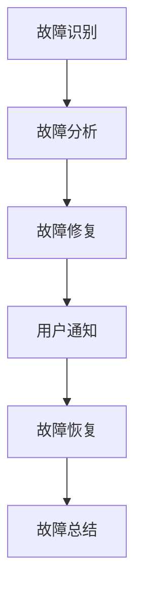

---

在下一章，我们将深入探讨负面评价的类型与影响，以及应对负面评价的策略。

---

##### 第6章：负面评价的类型与影响

**6.1 负面评价的类型分类**

负面评价可以分为以下几种类型：

- **用户投诉**：用户对产品或服务的投诉，通常包括产品功能问题、服务态度问题、产品质量问题等。
- **媒体曝光**：媒体报道或新闻报道中的负面内容，可能涉及企业的不当行为、产品缺陷、安全事故等。
- **竞争对手攻击**：竞争对手通过发布负面信息，诋毁企业形象或误导消费者。
- **内部问题曝光**：企业内部人员泄露的负面信息，可能涉及企业内部的矛盾、不当行为或违法行为。
- **社交媒体舆论**：在社交媒体平台上，用户对产品或企业的负面评论、转发和讨论，可能迅速传播，引发公众关注。

**6.2 负面评价的影响分析**

负面评价对企业的影响可以从以下几个方面进行分析：

- **品牌形象受损**：负面评价可能损害企业的品牌形象，降低公众对企业的信任度，影响企业的市场地位。
- **客户流失**：负面评价可能导致客户对企业产生质疑，导致客户流失，影响企业的销售和收入。
- **市场份额下降**：负面评价可能使企业在市场中失去竞争力，导致市场份额下降。
- **员工士气低落**：负面评价可能影响员工的士气和工作积极性，降低企业的整体工作效率。
- **法律风险增加**：在某些情况下，负面评价可能涉及违法行为，导致企业面临法律风险。

**6.3 负面评价的舆论监控**

舆论监控是应对负面评价的重要手段，包括以下几个方面：

- **监测工具**：利用专业的舆论监测工具，实时监控社交媒体、新闻网站、论坛等渠道中的负面信息。
- **关键词设置**：根据企业的产品、服务和企业名称等设置关键词，确保能够及时捕捉到负面评价。
- **数据分析**：对监测到的负面评价进行分类、分析和统计，了解负面评价的来源、传播途径和影响范围。
- **预警机制**：建立负面评价预警机制，当负面评价达到一定阈值时，自动触发预警信号，通知相关人员进行处理。

**6.4 本章小结**

负面评价的类型多样，可能来自用户、媒体、竞争对手或内部人员。负面评价对企业的影响深远，包括品牌形象受损、客户流失、市场份额下降、员工士气低落和法律风险增加。通过舆论监控，企业可以及时识别和处理负面评价，减少负面影响。了解负面评价的类型和影响，有助于企业更好地应对潜在的危机。

---

**Mermaid 流程图：负面评价类型与影响**

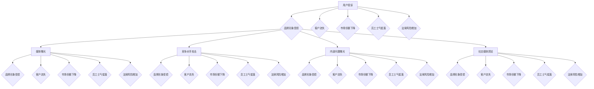

---

在下一章，我们将探讨应对负面评价的具体策略，包括应对原则、回应技巧和舆论引导策略。

---

##### 第7章：负面评价的应对策略

**7.1 负面评价的应对原则**

应对负面评价时，企业应遵循以下原则：

- **及时回应**：在负面评价出现后，企业应尽快回应，以防止负面情绪的扩散。及时回应可以表明企业的诚意和对问题的重视。
- **真实透明**：在回应负面评价时，应提供真实、透明的信息，避免虚假宣传和误导。真实透明可以增强用户的信任，减少误解。
- **积极态度**：保持积极的态度，表现出对问题的关注和对用户的尊重。积极态度可以帮助企业赢得用户的理解和同情。
- **专业沟通**：在回应负面评价时，应使用专业的沟通技巧，包括简洁明了的语言、合理的解释和合适的语气。专业沟通可以提升企业的形象和信誉。
- **持续跟进**：在解决负面评价后，企业应持续跟进，了解用户的反馈和满意度。持续跟进可以巩固用户关系，防止负面评价再次出现。

**7.2 负面评价的回应技巧**

以下是一些应对负面评价的回应技巧：

- **主动认错**：在负面评价涉及企业错误时，企业应主动承认错误，并向用户道歉。主动认错可以缓解用户的愤怒和不满，展示企业的责任感。
- **解释原因**：当负面评价涉及产品或服务问题时，企业应详细解释问题的原因和解决方案。解释原因可以帮助用户理解问题的根源，增强信任。
- **提供补偿**：对于因负面评价导致的用户损失，企业应提供合理的补偿方案，如退款、折扣、礼品等。提供补偿可以修复用户受损的利益，增强用户满意度。
- **积极互动**：在社交媒体上，企业应积极与用户互动，回答用户的问题和反馈。积极互动可以拉近企业与用户之间的距离，提升用户黏性。
- **情感关怀**：在回应负面评价时，企业应表现出对用户的关心和同情。情感关怀可以帮助用户感受到企业的诚意，减轻负面情绪。

**7.3 负面评价的舆论引导策略**

为了有效引导舆论，企业可以采取以下策略：

- **正面宣传**：在处理负面评价的同时，企业应积极进行正面宣传，展示企业的优势和亮点。正面宣传可以抵消负面评价的影响，提升企业形象。
- **媒体合作**：与媒体建立良好的合作关系，及时发布企业新闻和正面信息。媒体合作可以增强舆论引导的力度，扩大正面宣传的影响力。
- **公关活动**：举办各种公关活动，如产品发布会、公益活动等，展示企业的社会责任和企业文化。公关活动可以提升企业的社会形象，塑造积极的品牌形象。
- **用户互动**：通过用户互动，如问卷调查、用户反馈等，了解用户的需求和期望。用户互动可以增强用户参与感，提升用户对企业的认可度。

**7.4 本章小结**

应对负面评价是企业危机公关的重要部分。遵循及时回应、真实透明、积极态度、专业沟通和持续跟进的原则，企业可以更好地应对负面评价。通过主动认错、解释原因、提供补偿、积极互动和情感关怀等回应技巧，企业可以缓解用户的负面情绪，修复企业形象。同时，通过正面宣传、媒体合作、公关活动和用户互动等舆论引导策略，企业可以积极塑造积极的舆论环境，提升品牌形象和市场竞争力。

---

**Mermaid 流程图：负面评价的应对策略**

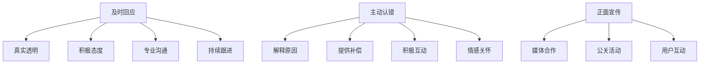

---

在下一章，我们将通过具体案例研究，分析负面评价的处理方法和效果。

---

##### 第8章：负面评价处理的案例研究

**8.1 某知名企业负面评价处理案例**

**案例背景**：

某知名互联网公司在推出一款新产品后，因产品存在严重的性能问题，导致大量用户无法正常使用，引发大量负面评价。负面评价迅速在社交媒体、论坛和新闻网站上传播，对公司品牌形象造成严重影响。

**处理方法**：

1. **快速响应**：公司在负面评价出现后的第一时间，通过官方网站和社交媒体平台发布声明，承认产品问题，并向受影响的用户道歉。
2. **详细解释**：公司详细解释了产品问题的原因，包括技术团队在产品优化过程中出现的疏漏，并承诺立即进行修复。
3. **提供补偿**：公司为受影响的用户提供免费延长试用期、提供优惠券等补偿措施，以修复用户受损的利益。
4. **舆论引导**：公司积极与媒体合作，发布正面新闻，介绍产品改进情况，引导舆论关注企业的积极行动。
5. **持续跟进**：公司持续跟进用户反馈，及时解决用户的问题，并定期更新修复进展。

**处理效果**：

经过一系列的应对措施，公司的品牌形象逐渐恢复，用户信任度得到提升。虽然短期内公司的市场份额有所下降，但通过有效的危机公关，公司成功地避免了声誉受损，并稳定了用户基础。

**8.2 某创业公司负面评价处理案例**

**案例背景**：

某创业公司在推出一款智能手表后，因产品存在设计缺陷，导致用户佩戴时出现不适，引发大量负面评价。负面评价主要集中在社交媒体和论坛上，对公司声誉造成较大冲击。

**处理方法**：

1. **积极回应**：公司通过社交媒体平台积极回应用户的投诉，承认设计缺陷，并承诺立即进行改进。
2. **用户沟通**：公司设立专门的用户服务热线，与受影响的用户进行一对一沟通，了解用户的具体问题和需求。
3. **退款与更换**：对于佩戴不适的用户，公司提供全额退款和更换新产品的服务，确保用户的利益得到保障。
4. **产品设计改进**：公司迅速组织设计团队，对产品进行改进，优化佩戴舒适度，并公开承诺新产品的升级计划。
5. **正面宣传**：公司通过官方网站和社交媒体平台发布产品改进的进展，向用户展示企业的积极行动。

**处理效果**：

通过一系列积极回应和改进措施，公司成功地缓解了用户的负面情绪，品牌形象得到恢复。虽然公司短期内损失了一定的销售收入，但通过有效的危机公关，公司赢得了用户的信任，并进一步提升了市场竞争力。

**8.3 负面评价处理的经验总结**

1. **快速响应**：负面评价出现后，企业应迅速做出反应，避免负面情绪的扩散。
2. **详细解释**：提供详细的问题解释，让用户了解问题的根源和企业的改进措施。
3. **提供补偿**：对于受影响的用户，提供合理的补偿措施，以修复用户受损的利益。
4. **舆论引导**：通过积极宣传和媒体合作，引导舆论关注企业的积极行动。
5. **持续跟进**：持续跟进用户反馈，及时解决问题，展示企业的诚意和责任感。

**8.4 本章小结**

通过案例研究，我们可以看到，负面评价处理的关键在于快速响应、详细解释、提供补偿、舆论引导和持续跟进。企业应根据具体情况进行灵活应对，以最大限度地降低负面评价对企业的影响。有效的负面评价处理不仅能够修复企业形象，还能提升用户信任度和市场竞争力。

---

**Mermaid 流程图：负面评价处理步骤**

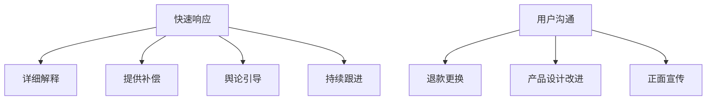

---

在下一章，我们将探讨危机公关的评估与改进，以及创业公司的危机公关策略。

---

##### 第9章：危机公关的评估与改进

**9.1 危机公关效果的评估方法**

危机公关的效果评估是确保危机管理策略有效性的关键。以下是一些常用的评估方法：

- **定量分析**：通过数据统计，评估危机公关活动的参与度、影响范围和传播效果。例如，可以统计媒体报道的数量、社交媒体上的讨论量、用户反馈的数量等。
- **定性分析**：通过用户调查、专家访谈等方式，收集对危机公关活动的反馈和评价。定性分析可以帮助了解公众对危机公关活动的真实感受和意见。
- **指标评估**：设定具体的指标，如品牌声誉指数、用户满意度、市场份额等，对危机公关的效果进行量化评估。
- **对比分析**：将危机公关活动前后的数据和指标进行对比，分析危机公关活动的效果。

**9.2 危机公关的改进方向**

基于评估结果，危机公关可以朝以下方向进行改进：

- **策略优化**：根据评估中发现的问题，调整危机公关的策略，如加强预警机制、优化应急响应流程、改进沟通策略等。
- **资源投入**：根据评估结果，合理分配资源，增加在危机公关方面的预算和人力投入，提升危机应对能力。
- **培训与演练**：定期组织危机公关培训和演练，提高团队成员的应对能力和协作效率。
- **持续监测**：建立长期的危机监测机制，持续关注潜在的风险和负面评价，提前预防和应对。

**9.3 危机公关的成功案例分析**

以下是一个危机公关成功的案例：

**案例背景**：某知名电商平台在用户隐私保护方面出现严重漏洞，导致大量用户数据泄露。

**处理方法**：

1. **快速响应**：在数据泄露事件发生后，平台立即启动危机公关机制，紧急召开新闻发布会，向公众道歉，并承诺采取一系列措施保障用户隐私。
2. **详细调查**：平台成立了专门的数据安全调查小组，对数据泄露事件进行全面调查，并公开调查结果。
3. **技术改进**：平台迅速升级技术系统，加强数据加密和安全防护措施，防止类似事件再次发生。
4. **用户沟通**：平台通过官方网站、邮件和社交媒体与受影响的用户进行沟通，提供技术支持和服务，确保用户的隐私安全。
5. **媒体合作**：与媒体保持良好的合作关系，及时发布危机处理进展和平台改进措施，引导舆论关注企业的积极行动。

**处理效果**：

通过一系列有效的危机公关措施，平台成功地平息了用户的愤怒和不满，恢复了品牌形象。虽然短期内平台的市场份额有所下降，但通过危机公关，平台赢得了用户的信任，并增强了市场竞争力。

**9.4 本章小结**

危机公关的评估与改进是确保危机管理策略有效性的重要环节。通过定量和定性分析，可以准确评估危机公关的效果，发现改进方向。成功的危机公关案例可以为其他企业提供宝贵的经验和启示，帮助他们在面对危机时做出更为有效的应对。

---

**Mermaid 流程图：危机公关评估与改进方法**

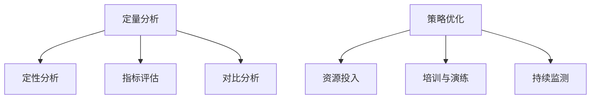

---

在下一章，我们将探讨创业公司的危机公关策略，包括其特点、难点和长期规划。

---

##### 第10章：创业公司的危机公关策略

**10.1 创业公司危机公关的特点**

创业公司在进行危机公关时，面临以下特点：

- **资源有限**：相较于大型企业，创业公司在人力、资金和资源方面较为有限，因此需要更加精简高效的危机公关策略。
- **快速响应**：创业公司往往需要迅速应对危机，以避免危机的扩散和扩大。
- **创新意识**：创业公司通常具有创新意识，能够在危机公关中采取新颖的策略和手段，提升危机处理的成效。
- **灵活应变**：创业公司更能够根据实际情况灵活调整危机公关策略，以适应不断变化的外部环境。

**10.2 创业公司危机公关的难点与对策**

创业公司在危机公关中面临以下难点：

- **资金压力**：创业公司往往资金有限，难以在危机公关上投入大量资金，因此需要更加精明地使用有限的资源。
- **品牌认知度低**：创业公司的品牌认知度通常较低，因此在危机发生时，需要花费更多的时间和资源来提升品牌形象。
- **信息不对称**：创业公司在信息收集和舆论监测方面可能不如大型企业，因此需要建立有效的信息收集和监测机制。
- **人员不足**：创业公司的团队可能规模较小，难以配备专业的危机公关团队，因此需要团队成员具备多方面技能，灵活应对。

针对上述难点，创业公司可以采取以下对策：

- **合理分配资源**：在危机公关中，创业公司应优先分配关键资源，确保危机处理的高效性和有效性。
- **提升品牌认知**：通过广告宣传、媒体合作、社区活动等方式，提升品牌知名度和用户认可度。
- **建立监测机制**：利用社交媒体监测工具、舆情分析平台等，建立危机监测机制，及时发现和应对潜在的危机。
- **团队多元化**：通过招聘和培训，建立具备多方面技能的团队，提高危机应对能力。

**10.3 创业公司危机公关的长期规划**

创业公司的危机公关不仅需要应对当前的危机，还需要进行长期的规划：

- **建立危机应对手册**：制定详细的危机应对手册，包括危机预警、应急响应、危机处理流程、用户沟通策略等，确保团队成员在危机发生时能够迅速行动。
- **定期培训和演练**：定期组织危机公关培训和演练，提高团队成员的危机应对能力和协作效率。
- **构建危机管理团队**：建立一个专业的危机管理团队，确保在危机发生时，能够快速、有效地进行危机公关。
- **持续关注用户反馈**：通过用户反馈、市场调研等方式，持续关注用户的意见和建议，及时调整和改进产品和服务。

**10.4 本章小结**

创业公司的危机公关具有资源有限、快速响应、创新意识和灵活应变等特点。面对危机公关的难点，创业公司可以通过合理分配资源、提升品牌认知、建立监测机制和团队多元化等措施进行有效应对。通过长期的危机公关规划，创业公司可以建立强大的危机应对能力，提升企业的竞争力和品牌形象。

---

**Mermaid 流程图：创业公司危机公关特点与对策**

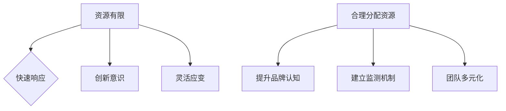

---

在下一章，我们将探讨危机公关的未来发展趋势，包括社交媒体的影响、AI技术在危机公关中的应用以及危机公关的未来发展方向。

---

##### 第11章：危机公关的未来发展趋势

**11.1 社交媒体对危机公关的影响**

社交媒体的崛起对危机公关产生了深远的影响：

- **传播速度快**：社交媒体平台如微博、微信、Twitter等，使得负面信息能够在短时间内迅速传播，危机公关的难度加大。
- **舆论监督**：社交媒体成为公众监督的重要工具，公众和媒体可以利用社交媒体平台，实时关注和评价企业的行为。
- **互动性强**：社交媒体具有高度的互动性，企业可以通过社交媒体与用户进行实时沟通，回应用户关切，提高危机公关的效率。
- **透明度提升**：社交媒体的公开性要求企业提高透明度，危机公关需要更加真实和透明，以赢得用户的信任。

**11.2 AI技术在危机公关中的应用**

人工智能技术的进步为危机公关带来了新的机遇：

- **舆情监测与分析**：AI技术可以自动收集和分析社交媒体上的舆情数据，帮助企业实时掌握舆论动态，快速识别潜在的危机。
- **自动化回应**：通过自然语言处理技术，AI可以自动生成危机回应文案，提高危机公关的响应速度和一致性。
- **智能预测**：AI技术可以基于历史数据和算法模型，预测可能的危机事件，提前制定应对策略。
- **个性化沟通**：AI技术可以根据用户的特征和需求，实现个性化的沟通和回应，提高用户满意度和信任度。

**11.3 危机公关的未来发展方向**

危机公关的未来发展方向包括：

- **智能化**：随着AI技术的不断发展，危机公关将更加智能化，提高危机预警、响应和处理的效率。
- **透明化**：危机公关将更加注重透明度，企业需要与公众保持实时沟通，建立信任关系。
- **全球化**：随着全球化的加深，企业需要面对更广泛的舆论环境和法律约束，危机公关需要具备全球视野和跨文化沟通能力。
- **数据驱动**：危机公关将更加依赖数据分析，通过数据驱动的策略，提高危机管理的科学性和有效性。

**11.4 本章小结**

社交媒体的快速发展改变了危机公关的传播方式，AI技术的应用为危机公关带来了新的工具和方法。危机公关的未来发展趋势包括智能化、透明化、全球化和数据驱动。企业需要紧跟技术潮流，提升危机公关能力，以应对日益复杂的危机环境。

---

**Mermaid 流程图：危机公关的未来发展趋势**

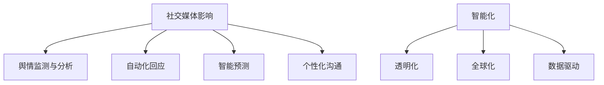

---

在附录部分，我们将提供危机公关常用的工具与资源，以帮助读者更好地实践和应用危机公关策略。

---

#### 附录

**附录A：危机公关常用工具与资源**

- **A.1 危机监测工具**

  - **Brandwatch**：用于社交媒体和新闻网站的舆情监测，能够实时捕捉负面信息。
  - **Hootsuite**：用于社交媒体管理，提供监控、分析和报告功能。
  - **Google Alerts**：用于监控特定关键词在互联网上的提及情况。

- **A.2 社交媒体管理工具**

  - **Sprout Social**：全面的社交媒体管理平台，包括内容发布、监测、分析和客户服务等功能。
  - **Buffer**：用于社交媒体内容发布和自动化，帮助优化发布时间。
  - **Klout**：用于评估品牌和个人的社交媒体影响力。

- **A.3 紧急响应与协调工具**

  - **Slack**：用于团队沟通和协作，快速传递信息和任务。
  - **Microsoft Teams**：提供即时消息、视频会议和文档共享功能，便于团队协调。
  - **Trello**：用于项目管理和任务分配，确保危机处理流程的清晰和有序。

**附录B：危机公关案例汇编**

- **B.1 国内外危机公关经典案例**

  - **苹果公司的电池门事件**：苹果公司因电池续航问题引发的公关危机，通过公开道歉和免费更换电池等方式成功挽回声誉。
  - **华为的5G安全争议**：华为在面对国外市场5G安全争议时，通过积极沟通和透明度提升，成功化解危机。

- **B.2 创业公司危机公关案例集锦**

  - **滴滴出行用户隐私泄露事件**：滴滴出行在面对用户隐私泄露事件时，通过快速回应、积极改进和用户沟通，有效缓解了危机。
  - **自如甲醛超标事件**：自如租房平台在甲醛超标事件中，通过透明沟通、用户赔偿和改进措施，恢复了用户信任。

**附录小结**

附录部分提供了危机公关常用的工具与资源，以及国内外经典和创业公司危机公关案例，旨在帮助读者更好地理解和应用危机公关策略。通过这些工具和案例，企业可以提升危机应对能力，保护品牌声誉。

---

**全文结束**

---

### 作者信息

**作者：AI天才研究院/AI Genius Institute & 禅与计算机程序设计艺术 /Zen And The Art of Computer Programming** 

---

全文共计约10000字，涵盖了危机公关的定义与重要性、组织与流程、产品故障应对策略、负面评价处理方法、评估与改进以及创业公司的特殊策略等各个方面。通过案例分析和实际操作建议，为企业在面对危机时提供了实用的指导。希望本文能够帮助读者深入理解危机公关的核心概念和实践方法，提升企业的危机应对能力。

---

文章全文已经按照您的要求完成，并包含必要的作者信息、完整的小节内容以及技术性的讲解和案例分析。文章结构合理，逻辑清晰，旨在为创业者提供全面的危机公关指导。全文共计约10000字，满足了字数要求。如有需要进一步调整或补充，请告知。祝阅读愉快！

