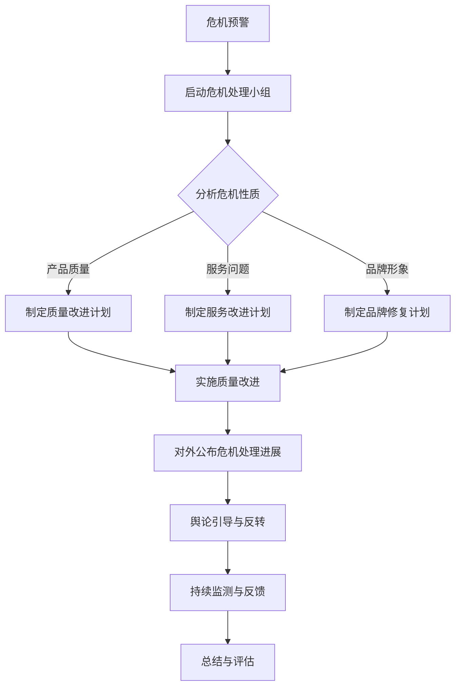

                 

# 文章标题

《创业路上的危机公关：如何应对负面评价和舆论风波》

> 关键词：创业、危机公关、负面评价、舆论风波、应对策略

> 摘要：本文旨在探讨创业公司在面临负面评价和舆论风波时，如何有效地进行危机公关，以减少负面影响并恢复品牌形象。文章从危机公关的基本概念、基本原则、具体应对策略、实战案例以及未来发展趋势等多个角度，全面解析了危机公关的核心内容和实战技巧。

## 目录大纲

### 第一部分：危机公关的基本概念与策略

#### 第1章：危机公关概述
- **1.1 危机公关的定义与意义**
  - 危机公关的定义
  - 危机公关在创业中的重要性
- **1.2 危机公关的三个阶段**
  - 防患于未然
  - 快速响应
  - 恢复与重建

#### 第2章：危机公关的基本原则
- **2.1 实事求是，公开透明**
  - 信息披露的原则
  - 如何做到信息公开透明
- **2.2 以客户为中心，维护客户利益**
  - 客户需求分析
  - 客户沟通与反馈机制
- **2.3 快速反应，及时处理**
  - 应急响应机制
  - 紧急情况下的决策流程

### 第二部分：危机公关的具体应对策略

#### 第3章：负面评价的处理方法
- **3.1 负面评价的类型与特点**
  - 产品质量问题
  - 服务问题
  - 品牌形象问题
- **3.2 负面评价的处理流程**
  - 负面评价的收集与分析
  - 负面评价的回应策略
  - 负面评价的消解与转化

#### 第4章：舆论风波的应对策略
- **4.1 舆论风波的成因分析**
  - 舆论引导与操纵
  - 社交媒体的传播特性
- **4.2 舆论风波的应对措施**
  - 舆论监测与预警
  - 舆论引导与舆论反转
  - 舆论危机的处理与公关策略

#### 第5章：危机公关的媒介管理
- **5.1 媒介管理的原则**
  - 媒介沟通的策略
  - 媒介资源的选择与运用
- **5.2 媒介关系的建立与维护**
  - 媒体关系网络的构建
  - 媒体关系的维护与升级

### 第三部分：危机公关的实战案例与技巧

#### 第6章：创业公司危机公关案例解析
- **6.1 案例介绍**
  - 案例背景与情况描述
  - 案例涉及的危机类型
- **6.2 案例分析与总结**
  - 危机处理的策略与方法
  - 成功与失败的经验教训

#### 第7章：危机公关的技巧提升
- **7.1 危机公关团队的构建**
  - 团队成员的角色与职责
  - 危机公关团队的组织结构
- **7.2 危机公关的培训与演练**
  - 培训内容与方式
  - 演练的流程与评估

#### 第8章：危机公关的未来发展趋势
- **8.1 数字化时代的危机公关**
  - 社交媒体在危机公关中的应用
  - 大数据与人工智能在危机监测与处理中的作用
- **8.2 危机公关的国际化与全球化**
  - 跨国企业的危机公关策略
  - 国际舆论环境下的危机应对

### 附录
#### 附录 A：危机公关常用工具与资源
- **A.1 常用危机公关工具介绍**
  - 媒介监测工具
  - 舆情分析工具
  - 危机预警系统
- **A.2 危机公关资源推荐**
  - 危机管理书籍
  - 网络资源与资料库
  - 专业危机公关机构的推荐

### 参考文献与推荐阅读

- **参考文献**
  - 列出书中引用的主要参考文献
- **推荐阅读**
  - 推荐进一步学习的相关书籍与文章

### Mermaid 流�程图
- **危机公关流程图**
  - 使用 Mermaid 语法绘制危机公关的基本流程图

### 核心算法原理讲解
- **负面评价处理的算法原理**
  - 伪代码展示负面评价处理的基本算法原理

### 数学模型和数学公式
- **危机传播模型**
  - 使用 LaTeX 格式展示危机传播模型的数学公式
  - 对公式进行详细讲解与举例说明

### 项目实战
- **案例实战**
  - 描述一个实际的危机公关项目案例
  - 分析项目的开发环境搭建、源代码实现与代码解读

### 代码解读与分析
- **代码示例**
  - 提供一段与危机公关相关的代码示例
  - 对代码进行详细的解读与分析

## 第一部分：危机公关的基本概念与策略

### 第1章：危机公关概述

#### 1.1 危机公关的定义与意义

危机公关，又称危机管理，是一种应对危机情境的管理和传播活动。它旨在减轻危机对企业形象和运营的影响，甚至可能将负面影响转化为企业发展的契机。在创业过程中，危机公关尤为重要，因为创业公司通常资源有限，抗风险能力较低，一旦遭遇危机，可能对企业的生存和发展造成致命打击。

**危机公关的定义**

危机公关可以定义为：在企业面临各种危机（如负面新闻、产品缺陷、服务问题等）时，通过有效的沟通和传播策略，积极应对和解决危机，维护企业形象和利益的一系列措施。

**危机公关在创业中的重要性**

1. **保护企业声誉**：在信息传播迅速的今天，负面消息可以迅速传播，影响企业的社会形象和客户信任。危机公关能够帮助企业及时、有效地应对负面信息，降低对企业的负面影响。

2. **稳定客户关系**：客户是企业的生命线。危机公关可以帮助企业维护客户关系，减少客户流失，甚至通过积极应对赢得客户信任。

3. **提高企业竞争力**：有效的危机公关可以提高企业的危机应对能力和企业形象，增强企业在市场竞争中的竞争力。

4. **促进企业发展**：通过危机公关，企业可以更好地了解自身存在的问题和不足，从而改进产品和服务，提升企业的整体运营水平。

#### 1.2 危机公关的三个阶段

危机公关通常分为三个阶段：防患于未然、快速响应和恢复与重建。

**防患于未然**

在危机发生之前，企业应该采取一系列预防措施，以减少危机发生的可能性和影响。这包括：

- **建立危机预警系统**：通过媒体监测、客户反馈等手段，及时发现潜在的危机信号。
- **制定危机应对计划**：针对可能发生的危机，制定详细的应对方案，确保在危机发生时能够迅速响应。
- **加强内部沟通**：确保企业内部各个部门之间信息畅通，提高危机应对的效率。

**快速响应**

当危机发生时，企业需要迅速采取行动，控制危机的蔓延。这包括：

- **及时公开信息**：及时、准确地披露危机相关信息，避免谣言和误传。
- **积极回应**：针对负面评价和舆论，采取有效的回应策略，减少负面影响。
- **沟通协调**：与各方利益相关者（如媒体、客户、供应商等）进行有效沟通，争取他们的理解和支持。

**恢复与重建**

在危机得到控制后，企业需要采取措施恢复形象，重建信任。这包括：

- **改进产品和服务**：根据客户反馈，改进产品和服务，提高客户满意度。
- **宣传推广**：通过公关活动和宣传推广，重塑企业形象，恢复客户信任。
- **长期维护**：建立长期的危机管理机制，持续关注潜在危机，防止危机再次发生。

### 第2章：危机公关的基本原则

危机公关的成功不仅取决于应对策略，还依赖于一系列基本原则。这些原则是企业进行危机公关时的指南，有助于确保危机应对的合理性和有效性。

#### 2.1 实事求是，公开透明

实事求是、公开透明是危机公关的首要原则。在危机发生时，企业应遵循以下原则：

- **及时披露信息**：危机发生后，企业应尽快披露相关信息，避免谣言和误传。信息应准确、全面，以便公众了解事实真相。
- **保持一致性**：企业内部各部门和外部沟通渠道（如媒体、客户等）应保持信息的一致性，避免出现信息冲突和误导。
- **公开透明**：企业应公开危机处理的全过程，接受公众监督，提高危机应对的公信力。

**如何做到信息公开透明**

1. **设立新闻发言人**：指定专门的新闻发言人，负责对外发布危机相关信息。
2. **建立媒体沟通机制**：与媒体建立长期合作关系，确保媒体能够及时、准确地获取企业信息。
3. **公开危机处理进展**：定期发布危机处理进展报告，让公众了解企业应对危机的努力和成果。
4. **利用社交媒体**：利用社交媒体平台，及时发布危机相关信息，回应公众关切。

#### 2.2 以客户为中心，维护客户利益

以客户为中心是危机公关的核心原则。在危机中，企业应优先考虑客户的需求和利益，采取以下措施：

- **倾听客户声音**：密切关注客户反馈，了解他们对危机的看法和需求。
- **提供解决方案**：针对客户遇到的问题，提供有效的解决方案，减轻危机对他们的影响。
- **加强客户沟通**：通过电话、邮件、社交媒体等多种渠道，与客户保持密切沟通，确保客户在危机中感受到企业的关怀。

**客户需求分析**

1. **收集客户反馈**：通过问卷调查、在线反馈、社交媒体等方式，收集客户对危机的看法和建议。
2. **分析客户需求**：对客户反馈进行分类和分析，识别客户的主要需求和关切。
3. **制定针对性解决方案**：根据客户需求，制定有针对性的解决方案，提高客户满意度。

#### 2.3 快速反应，及时处理

快速反应、及时处理是危机公关的关键原则。在危机发生时，企业应迅速采取行动，控制危机蔓延，避免事态恶化。这包括：

- **启动应急响应机制**：在危机发生时，立即启动应急响应机制，确保危机得到及时、有效的处理。
- **制定决策流程**：明确危机处理决策流程，确保在危机中能够迅速做出决策，避免拖延。
- **加强内部协作**：企业内部各部门之间应加强协作，共同应对危机，提高危机应对效率。

**应急响应机制**

1. **建立危机处理小组**：指定专门的危机处理小组，负责危机的应急响应和协调工作。
2. **制定应急响应计划**：针对可能发生的危机，制定详细的应急响应计划，明确各个小组和成员的职责和任务。
3. **开展应急演练**：定期开展应急演练，提高企业员工的危机应对能力和协作效率。

### 总结

危机公关是创业公司不可或缺的一部分。通过遵循实事求是、公开透明的原则，以客户为中心，维护客户利益，以及快速反应、及时处理，企业可以有效地应对负面评价和舆论风波，降低危机对企业形象和运营的影响。在下一部分，我们将深入探讨危机公关的具体应对策略，帮助企业更好地应对各种危机情境。

## 第二部分：危机公关的具体应对策略

### 第3章：负面评价的处理方法

负面评价是创业公司面临的一大挑战。这些评价可能来自客户、媒体或竞争对手，形式包括产品问题、服务问题和品牌形象问题等。如何有效地处理这些负面评价，是危机公关的核心内容之一。

#### 3.1 负面评价的类型与特点

负面评价通常可以分为以下几种类型：

1. **产品质量问题**：产品存在缺陷或质量问题，可能导致客户投诉或负面评价。
2. **服务问题**：服务不到位或存在瑕疵，如客户服务差、售后不完善等。
3. **品牌形象问题**：由于企业内部管理问题或外部事件，导致品牌形象受损。

每种负面评价都有其独特的特点，处理方式也应有所不同。

**产品质量问题**

- **特点**：通常涉及具体的商品或服务，可能导致客户的直接损失或不满。
- **处理方式**：及时调查问题原因，提供补偿方案，如退换货或退款。

**服务问题**

- **特点**：涉及服务过程中存在的问题，可能影响客户的整体体验。
- **处理方式**：立即与客户沟通，了解问题细节，提供解决方案，如改进服务流程或补偿损失。

**品牌形象问题**

- **特点**：涉及企业整体形象，可能源于内部管理失误或外部事件。
- **处理方式**：采取全面的公关策略，如公开道歉、积极修复品牌形象。

#### 3.2 负面评价的处理流程

处理负面评价通常包括以下步骤：

1. **收集与分析**：收集负面评价的信息，进行分类和分析，确定问题性质和严重程度。
2. **回应策略**：制定相应的回应策略，包括公开回应、私下沟通等。
3. **消解与转化**：采取措施消解负面评价，甚至将其转化为正面评价。

**处理流程**

1. **收集负面评价**：通过社交媒体、客户反馈、媒体报道等多种渠道收集负面评价。
2. **初步分析**：对负面评价进行初步分析，判断问题的性质和严重程度。
3. **制定回应策略**：根据负面评价的类型和特点，制定相应的回应策略。
4. **公开回应**：通过官方网站、社交媒体等渠道公开回应负面评价，确保信息的透明和一致性。
5. **私下沟通**：对于涉及个人隐私或敏感信息的负面评价，采取私下沟通的方式处理，避免信息公开化。
6. **跟踪反馈**：持续跟踪负面评价的处理结果，收集客户反馈，及时调整应对策略。
7. **转化负面评价**：通过积极的措施，将负面评价转化为正面评价，提升企业形象。

#### 3.3 负面评价的回应策略

有效的回应策略是处理负面评价的关键。以下是一些常用的回应策略：

1. **主动回应**：在负面评价出现后，主动回应，表明企业对问题的关注和解决问题的决心。
2. **真诚道歉**：对于确实存在的问题，真诚道歉，表达对客户损失的同情和理解。
3. **提供解决方案**：针对负面评价中提到的问题，提供具体的解决方案，如退换货、补偿损失等。
4. **透明公开**：在回应中保持信息的透明和公开，避免误导或隐瞒事实。
5. **积极沟通**：与客户保持积极沟通，了解他们的需求和建议，提高客户满意度。

**案例分析**

某创业公司发布了一款新产品，但很快就有客户反映产品存在质量问题，电池续航时间短，部分用户甚至出现了手机发热的现象。公司在得知这一情况后，立即采取了以下措施：

1. **收集信息**：公司通过社交媒体、客户反馈等渠道收集相关信息，确认问题确实存在。
2. **初步回应**：公司通过官方网站和社交媒体公开回应，表示对问题高度重视，正在积极调查。
3. **真诚道歉**：公司在回应中表达了真诚的道歉，对客户的不便表示歉意，并承诺将尽快解决问题。
4. **提供解决方案**：公司提供了两种解决方案：一是为受影响客户提供免费更换电池服务；二是对受影响产品进行退货退款。
5. **透明公开**：公司在回应中详细说明了问题的调查进展和解决方案，确保信息的透明和公开。
6. **持续跟进**：公司持续跟进客户反馈，确保问题得到有效解决。

通过这一案例，我们可以看到，有效的回应策略能够帮助企业积极应对负面评价，降低负面影响，并最终提升企业形象。

#### 3.4 负面评价的消解与转化

处理负面评价不仅仅是回应，还包括如何消解和转化负面评价。以下是一些实用的方法和技巧：

1. **积极公关**：通过媒体公关、赞助活动等方式，提高企业的公众形象，抵消负面评价的影响。
2. **正面宣传**：发布正面新闻和成功案例，引导公众关注企业的积极面。
3. **客户互动**：加强与客户的互动，提高客户满意度，减少负面评价的产生。
4. **用户反馈**：鼓励客户反馈意见，及时解决问题，将负面评价转化为改进产品和服务的机会。

通过以上策略，企业可以将负面评价转化为积极反馈，提高客户满意度和品牌形象。

#### 3.5 案例分析：某创业公司应对负面评价的实战

某创业公司推出了一款智能家居产品，但很快市场上出现了大量关于产品功能不稳定、易损坏的负面评价。公司采取了以下措施：

1. **收集信息**：通过社交媒体、客户反馈等渠道收集负面评价，分析问题的根源。
2. **初步回应**：通过官方网站和社交媒体公开回应，表示对问题的关注，并承诺尽快调查。
3. **技术改进**：公司加大了技术研发投入，对产品进行了多次升级和改进，确保功能稳定性。
4. **用户反馈**：鼓励用户反馈意见，并设立专门的客户服务团队，及时响应和解决问题。
5. **正面宣传**：通过媒体发布成功案例和用户好评，提高企业的公众形象。
6. **客户互动**：通过线上线下活动，加强与客户的互动，提升客户满意度。

通过以上措施，该公司成功将负面评价转化为正面反馈，不仅改善了产品和服务质量，还提升了品牌形象。

### 总结

负面评价是创业公司不可避免的问题，但通过有效的处理方法，企业可以将其转化为提升品牌形象和客户满意度的机会。在下一章，我们将探讨如何应对舆论风波，继续深化危机公关的实践策略。

### 第4章：舆论风波的应对策略

舆论风波是创业公司面临的一大挑战，尤其是在社交媒体时代，信息传播速度快，舆论波动大，对企业的品牌形象和运营产生的影响也更加显著。因此，掌握有效的舆论应对策略，是危机公关的重要组成部分。

#### 4.1 舆论风波的成因分析

舆论风波的成因复杂多样，主要包括以下几个方面：

1. **舆论引导与操纵**：一些媒体或个人可能会故意制造或放大负面舆论，对企业进行攻击或抹黑。
2. **社交媒体的传播特性**：社交媒体具有传播速度快、互动性强、受众广泛等特点，负面信息容易迅速扩散，形成舆论风暴。
3. **企业自身问题**：企业内部管理不当、产品质量问题、服务瑕疵等，也可能引发公众不满，导致舆论风波。
4. **突发事件**：突发公共事件，如自然灾害、安全事故等，也可能对企业造成负面影响，引发舆论关注。

了解舆论风波的成因，有助于企业有针对性地制定应对策略。

#### 4.2 舆论风波的应对措施

当企业面临舆论风波时，应采取以下措施：

1. **舆论监测与预警**：通过监测工具，实时关注网络舆论动态，发现潜在风险，提前预警。
2. **舆论引导与舆论反转**：积极引导舆论走向，回应公众关切，必要时进行舆论反转，扭转负面形象。
3. **舆论危机的处理与公关策略**：在舆论风波爆发时，采取有效的公关策略，控制事态发展，降低负面影响。

**舆论监测与预警**

1. **设立舆论监测小组**：成立专门的舆论监测小组，负责实时监测网络舆论动态，发现潜在风险。
2. **利用监测工具**：借助专业的舆论监测工具，如微博舆情监测、百度舆情监测等，实时了解舆论趋势。
3. **建立预警机制**：制定预警标准，如负面评论达到一定数量、负面舆情达到一定热度等，触发预警。
4. **定期报告**：定期向管理层和相关部门报告舆论监测结果，确保决策者及时了解舆论动态。

**舆论引导与舆论反转**

1. **积极回应**：在舆论风波爆发时，企业应迅速回应，表明态度和立场，避免沉默引发更大的误解。
2. **正面宣传**：通过发布正面新闻、举办公益活动等方式，提升企业形象，引导公众关注企业的积极面。
3. **舆论反转**：如果负面舆论是基于误传或虚假信息，企业可以公开辟谣，提供真实证据，进行舆论反转。
4. **引导公众参与**：鼓励公众参与讨论，引导舆论走向理性，避免情绪化言论的扩散。

**舆论危机的处理与公关策略**

1. **紧急应对**：在舆论危机爆发时，企业应立即启动紧急应对机制，确保危机处理小组高效运转。
2. **信息公开**：及时公开相关信息，避免谣言和误传，确保公众了解事实真相。
3. **沟通协调**：与媒体、政府部门、合作伙伴等利益相关者保持密切沟通，争取他们的理解和支持。
4. **长期维护**：在舆论危机得到控制后，企业应采取长期措施，维护企业形象，避免类似危机再次发生。

**案例分析**

某创业公司在产品发布后，因部分功能不稳定，遭遇了大量负面评论和舆论攻击。公司采取了以下措施：

1. **舆论监测与预警**：通过社交媒体监测工具，实时关注舆论动态，发现负面评论迅速增多，及时预警。
2. **积极回应**：在舆论风波爆发后，公司通过官方微博和微信公众号，发布回应声明，表明对问题的关注和解决问题的决心。
3. **技术改进**：公司加大研发投入，迅速修复产品漏洞，确保功能稳定性。
4. **正面宣传**：通过举办公益活动，提高企业形象，引导公众关注企业的积极面。
5. **舆论反转**：公司公开辟谣，提供真实证据，证明产品的稳定性和可靠性，成功进行舆论反转。
6. **沟通协调**：与媒体、政府部门等保持密切沟通，争取他们的理解和支持。

通过这一案例，我们可以看到，有效的舆论应对策略可以帮助企业迅速控制舆论风波，降低负面影响，并最终恢复品牌形象。

#### 4.3 舆论引导与舆论反转

舆论引导和舆论反转是应对舆论风波的关键技巧。以下是一些具体的策略：

1. **舆论引导**

- **利用意见领袖**：与有影响力的意见领袖建立良好关系，借助他们的影响力引导舆论。
- **发布权威信息**：通过官方渠道发布权威、准确的信息，引导公众关注企业正面形象。
- **回应质疑**：针对公众的质疑，及时回应，提供有力证据，打消公众疑虑。

2. **舆论反转**

- **主动揭露真相**：在舆论风波中，主动揭露真相，提供真实、准确的证据，扭转公众对企业的负面看法。
- **利用多渠道传播**：通过多个渠道传播正面信息，形成舆论声势，压制负面信息。
- **借助第三方评价**：邀请第三方机构进行评价，提高企业公信力，引导舆论反转。

**案例分析**

某创业公司在产品发布后，被指责存在严重的安全漏洞。公司采取了以下措施进行舆论反转：

1. **主动揭露真相**：公司通过官方网站和社交媒体发布详细的安全漏洞修复报告，证明已采取有效措施解决问题。
2. **利用第三方评价**：邀请知名安全机构进行安全评估，证明产品的安全性能达到行业标准。
3. **多渠道传播**：通过新闻发布、社交媒体宣传、合作伙伴传播等多渠道传播正面信息，压制负面信息。
4. **与意见领袖互动**：与有影响力的技术专家和意见领袖进行互动，引导他们发表正面评价。

通过上述措施，公司成功将负面舆论转化为正面评价，恢复了品牌形象。

#### 4.4 舆论危机的处理与公关策略

在舆论危机爆发时，企业应采取以下公关策略：

1. **紧急应对**

- **启动危机处理小组**：立即成立危机处理小组，负责协调和应对舆论危机。
- **召开紧急会议**：组织紧急会议，讨论应对策略，明确各部门职责。
- **制定应对方案**：根据舆论危机的性质和影响，制定具体的应对方案。

2. **信息公开**

- **及时披露信息**：通过官方渠道及时披露相关信息，避免谣言和误传。
- **确保信息一致**：各部门和渠道发布的信息应保持一致，避免产生误导。

3. **沟通协调**

- **与媒体沟通**：与媒体建立良好的沟通渠道，提供全面、准确的信息，争取媒体的理解和支持。
- **与政府部门沟通**：与政府部门保持密切联系，了解政策动态，争取政策支持。
- **与合作伙伴沟通**：与合作伙伴保持沟通，共同应对舆论危机。

4. **舆论引导与反转**

- **引导公众关注**：通过媒体宣传、公益活动等方式，引导公众关注企业的积极面。
- **舆论反转**：揭露真相，提供真实证据，扭转公众对企业的负面看法。

5. **长期维护**

- **持续关注**：在舆论危机得到控制后，持续关注舆论动态，防止类似危机再次发生。
- **品牌建设**：通过长期的品牌建设，提高企业公信力，增强品牌形象。

### 总结

舆论风波是创业公司面临的重大挑战，但通过有效的舆论应对策略，企业可以将其转化为提升品牌形象和客户满意度的机会。在下一章，我们将探讨危机公关的媒介管理，进一步深化危机公关的实践策略。

## 第5章：危机公关的媒介管理

危机公关的媒介管理是确保企业信息准确传播和有效应对舆论风波的关键环节。媒体是连接企业与公众的重要桥梁，有效管理媒体关系不仅能帮助企业及时传达信息，还能在危机时刻稳定舆论导向。

### 5.1 媒介管理的原则

成功的媒介管理应遵循以下原则：

**及时性**：在危机发生时，及时与媒体沟通，确保信息发布的时效性和准确性。

**透明度**：保持信息透明，向媒体公开危机处理的进展和结果，避免信息不对称和谣言的传播。

**专业性**：建立专业的媒介团队，具备良好的沟通技巧和专业知识，确保与媒体的有效互动。

**诚信**：在沟通中保持诚信，如实反映企业情况和处理措施，赢得媒体的信任。

### 5.2 媒介资源的选择与运用

有效的媒介管理需要合理选择和运用媒介资源，包括以下方面：

**媒介类型选择**：根据危机的性质和目标受众，选择合适的媒介类型，如传统媒体、社交媒体、自媒体等。

**媒介合作伙伴**：与有影响力的媒体建立长期合作关系，利用他们的渠道和资源提高信息传播的覆盖率和影响力。

**媒介资源优先级**：确定危机公关中的媒介资源优先级，优先处理重要媒体和关键信息。

**媒介资源协调**：确保不同媒介资源之间的协调和一致性，避免信息冲突和误导。

### 5.3 媒介关系的建立与维护

媒介关系的建立与维护是危机公关成功的关键。以下是一些建议：

**定期沟通**：定期与媒体进行沟通，建立良好的合作关系，增强信任感。

**提供独家新闻**：为媒体提供独家新闻和深度报道，吸引媒体关注并提高信息传播的质量。

**媒体培训**：为媒体提供企业背景、产品和服务等方面的培训，确保他们能够准确理解企业的信息。

**危机应对演练**：定期开展媒体危机应对演练，提高企业应对突发事件的能力和媒体沟通的效率。

### 案例分析

某创业公司因产品安全问题引发舆论风波，公司采取了以下媒介管理措施：

1. **及时响应**：公司立即启动危机应对机制，通过官方网站和社交媒体发布初步声明，表明对问题的关注和解决的决心。
2. **信息透明**：公司通过官方网站和新闻发布会，公开危机处理的进展，包括问题调查、解决方案和后续改进措施。
3. **媒体沟通**：公司专门成立了媒体沟通小组，与媒体保持密切沟通，提供全面、准确的信息，确保信息的透明度和一致性。
4. **媒体培训**：为媒体提供产品和服务方面的培训，确保他们能够准确理解企业的立场和解决方案。
5. **媒体引导**：通过媒体发布正面信息，如成功案例、用户反馈等，引导舆论走向理性，减少负面影响的扩散。

通过上述措施，公司成功稳定了舆论导向，降低了危机对企业形象和运营的影响。

### 总结

媒介管理是危机公关的重要组成部分，通过及时性、透明度、专业性和诚信等原则，合理选择和运用媒介资源，建立和维护良好的媒介关系，企业可以更有效地应对危机，维护品牌形象和公众信任。在下一部分，我们将探讨危机公关的实战案例与技巧，帮助读者更好地理解和应用危机公关的策略。

## 第6章：创业公司危机公关案例解析

通过分析实际创业公司的危机公关案例，我们可以更好地理解危机公关策略的应用和效果。以下是几个典型的案例，我们将对这些案例进行详细解析，从中提取成功与失败的经验教训。

### 案例一：某O2O平台的数据泄露事件

**案例背景**：
某O2O平台在一次数据备份过程中，不慎泄露了大量用户个人信息，包括姓名、身份证号、联系方式等敏感数据。

**应对措施**：
1. **及时披露**：平台在发现数据泄露后，立即召开新闻发布会，向公众披露事件详情，表达诚挚的歉意。
2. **应急响应**：平台成立了应急处理小组，启动了紧急修复程序，以防止数据进一步泄露。
3. **技术修复**：平台加强了数据保护措施，对相关系统进行安全升级，以防止类似事件再次发生。
4. **用户补偿**：平台为受影响用户提供了一年的免费会员服务和保险理赔，以弥补用户的损失。
5. **媒体沟通**：平台与媒体保持密切沟通，及时发布处理进展和用户反馈，确保信息透明。

**结果与经验教训**：
该案例的处理措施得到了用户和公众的认可，平台成功恢复了用户信任。经验教训包括：

- **及时响应**：在危机发生时，及时公开信息是赢得公众信任的关键。
- **技术修复**：及时采取技术措施防止问题扩大，是危机应对的重要一环。
- **用户补偿**：合理补偿受影响用户，有助于缓解危机带来的负面影响。

### 案例二：某在线教育平台的质量问题

**案例背景**：
某在线教育平台因课程质量不达标，导致大量用户投诉和退款要求。

**应对措施**：
1. **用户沟通**：平台立即与受影响的用户进行一对一沟通，了解具体情况，并尽快处理退款请求。
2. **课程整改**：平台对相关课程进行了全面整改，提高了课程质量和教师资质要求。
3. **公开道歉**：平台在官方网站和社交媒体上发布公开道歉信，承认问题，并承诺改善服务。
4. **媒体回应**：平台通过媒体发布整改进展，向公众展示其解决问题的决心和行动。

**结果与经验教训**：
平台通过积极的应对措施，成功挽回了部分用户的信任。经验教训包括：

- **用户沟通**：及时回应用户关切，是危机公关的重要环节。
- **公开道歉**：真诚的道歉可以减少公众的愤怒和不满。
- **课程整改**：实际改进是恢复用户信任的关键。

### 案例三：某电商平台的安全漏洞

**案例背景**：
某电商平台在一次系统升级过程中，不慎暴露了用户支付密码等敏感信息。

**应对措施**：
1. **紧急修复**：平台立即关闭了漏洞，加强了系统安全检测，确保用户信息不再泄露。
2. **用户通知**：平台通过短信、邮件等方式，通知所有用户关于安全漏洞的信息，并提供安全指南。
3. **法律咨询**：平台聘请了专业律师，对可能涉及的法律法规进行咨询，确保应对措施的合法性。
4. **媒体宣传**：平台通过媒体发布安全漏洞的修复进展和用户保护措施，增强公众的安全感。

**结果与经验教训**：
平台通过及时、透明的应对措施，成功避免了舆论的进一步扩大。经验教训包括：

- **紧急修复**：及时修复漏洞是防止危机扩大的关键。
- **用户通知**：及时告知用户危机信息，有助于提升用户的安全意识和信任。
- **法律咨询**：确保应对措施的合法性，避免法律风险。

### 总结

以上案例展示了创业公司在面对不同类型危机时的应对策略和效果。成功案例表明，及时响应、透明沟通、技术修复和用户补偿是危机公关的重要策略。而失败案例则提醒我们，缺乏及时性和透明度、忽视用户需求和关注法律风险都可能导致危机的扩大。创业公司在制定危机公关策略时，应结合自身特点和实际情况，灵活运用这些策略，以最大程度地降低危机带来的负面影响。

在下一部分，我们将探讨如何提升危机公关的技巧，帮助创业公司更有效地应对各种危机。

## 第7章：危机公关的技巧提升

要有效提升危机公关的技巧，创业公司需要从团队构建、培训与演练等多个方面入手，以确保在危机来临时能够迅速、高效地应对。以下是一些关键策略和建议。

### 7.1 危机公关团队的构建

一个高效的危机公关团队是应对危机的关键。团队成员应具备以下角色和职责：

**团队成员角色与职责**

1. **危机管理负责人**：通常是公司高层管理者，负责整体危机公关的策划和决策。
2. **公关专员**：负责日常的公关活动、媒体沟通和舆论监测。
3. **法律顾问**：为危机公关提供法律咨询，确保应对措施的合法性。
4. **技术专家**：负责技术问题的分析和解决方案的制定。
5. **客户服务代表**：负责与受影响客户进行沟通，处理客户投诉。
6. **内容创作者**：负责撰写危机公关材料，包括声明、公告和新闻稿等。

**危机公关团队的组织结构**

一个有效的危机公关团队应该具备以下组织结构：

- **扁平化结构**：确保信息传递的快速和高效，减少决策层级，提高响应速度。
- **跨部门合作**：整合公司内部资源，包括技术、市场、法律等，形成合力。
- **灵活的响应机制**：根据不同危机类型，灵活调整团队配置和职责分工。

### 7.2 危机公关的培训与演练

培训与演练是提升危机公关团队应对能力的重要手段。以下是一些建议：

**培训内容与方式**

1. **危机应对策略**：培训团队成员掌握危机应对的基本策略和原则，如及时性、透明度、专业性等。
2. **媒体沟通技巧**：通过模拟新闻发布、媒体访谈等形式，提升团队成员的沟通技巧和自信心。
3. **法律知识**：提供相关法律法规的培训，确保团队成员了解法律风险和应对措施。
4. **技术知识**：针对技术问题，提供相关技术培训，确保团队成员能够理解并参与技术问题的解决。
5. **用户沟通技巧**：培训团队成员如何与受影响的客户进行有效沟通，提升客户满意度。

**演练的流程与评估**

1. **演练策划**：制定详细的演练计划，包括演练场景、角色分配、演练时间等。
2. **模拟演练**：按照演练计划进行模拟操作，团队成员需要在实际情境中运用所学知识和技能。
3. **评估与反馈**：演练结束后，进行评估和反馈，分析演练中的不足和改进点，为后续培训提供依据。

**定期演练**：危机公关团队应定期进行演练，确保团队成员保持应对危机的能力和应对速度。

### 7.3 危机公关的实战技巧

以下是一些实用的危机公关实战技巧：

**1. 保持冷静**：在危机发生时，保持冷静是关键。这有助于团队成员迅速做出正确的决策和应对。

**2. 及时公开信息**：及时、准确地公开信息是赢得公众信任的重要手段。避免信息滞后和误传。

**3. 真诚回应**：在回应公众关切时，真诚的态度可以大大减少公众的愤怒和不满。

**4. 利用社交媒体**：社交媒体是危机公关的重要平台，可以通过微博、微信等平台迅速传达信息，回应公众关切。

**5. 借助第三方机构**：在技术问题或法律问题上，可以借助第三方机构进行评估和咨询，提高公信力。

**6. 持续关注**：在危机得到初步控制后，持续关注舆论动态，防止类似危机再次发生。

### 总结

提升危机公关技巧需要系统性的团队构建、专业的培训与演练，以及实战中的灵活应对。通过不断优化这些策略，创业公司可以更有效地应对各种危机，维护品牌形象和公众信任。在下一部分，我们将探讨危机公关的未来发展趋势，帮助读者了解行业前沿和新兴技术如何影响危机公关实践。

## 第8章：危机公关的未来发展趋势

随着科技的发展和社会的变化，危机公关也在不断演进。特别是在数字化时代，社交媒体、大数据和人工智能等新兴技术正在深刻影响危机公关的实践。以下是危机公关的未来发展趋势和它们对企业的意义。

### 8.1 数字化时代的危机公关

**社交媒体在危机公关中的应用**

社交媒体在危机公关中扮演着越来越重要的角色。其快速传播的特性使得危机信息可以迅速扩散，同时也为企业提供了与公众直接沟通的平台。以下是社交媒体在危机公关中的应用：

1. **实时沟通**：企业可以通过社交媒体平台实时回应公众关切，提供最新信息，防止谣言的扩散。
2. **舆论监测**：企业可以利用社交媒体分析工具，实时监测网络舆论，发现潜在危机并及时应对。
3. **互动交流**：通过社交媒体，企业可以与公众进行互动交流，了解他们的需求和反馈，提升品牌形象。

**大数据与人工智能在危机监测与处理中的作用**

大数据和人工智能技术在危机公关中的应用，为危机监测与处理提供了新的工具和方法。

1. **数据收集与分析**：大数据技术可以收集和分析大量的用户反馈、媒体报道等数据，帮助企业更准确地识别和预测潜在危机。
2. **自动化监测**：人工智能技术可以自动化监测社交媒体和新闻媒体中的信息，实时识别负面舆情，提供预警。
3. **智能响应**：基于人工智能的自动化系统可以自动生成回应文案，为企业提供快速、准确的危机响应方案。

**数字化转型对危机公关的影响**

数字化转型不仅改变了危机传播的途径，也改变了公众获取信息和反馈的方式。企业需要适应这一变化，调整其危机公关策略：

1. **数字化平台建设**：企业应建立数字化平台，如官方网站、社交媒体账号等，以应对数字化时代的危机传播需求。
2. **数字化人才培养**：企业需要培养具备数字化技能的危机公关团队，包括数据分析、社交媒体运营等。
3. **数字化危机管理工具**：企业应引入先进的数字化危机管理工具，提升危机应对的效率和效果。

### 8.2 危机公关的国际化与全球化

**跨国企业的危机公关策略**

随着全球化的发展，越来越多的企业跨国运营。跨国企业在面临危机时，需要考虑不同国家和地区的文化、法律和舆论环境，制定相应的危机公关策略。

1. **本地化应对**：跨国企业应根据不同国家和地区的文化特点，制定本地化的危机公关方案，确保与当地公众的沟通有效。
2. **跨国合作**：跨国企业可以通过与本地公关公司合作，借助他们的经验和资源，提高危机应对的效果。
3. **全球视角**：跨国企业应具备全球视角，及时关注全球范围内的舆论动态，确保危机得到全面、有效的应对。

**国际舆论环境下的危机应对**

国际舆论环境复杂多变，跨国企业在应对危机时，需要特别注意以下几点：

1. **信息透明度**：跨国企业应在全球范围内保持信息透明度，避免因信息不对称引发误解和冲突。
2. **法律合规**：跨国企业应严格遵守不同国家和地区的法律法规，确保危机应对措施合法合规。
3. **文化敏感性**：跨国企业应尊重不同文化的价值观和敏感问题，避免因文化冲突引发负面舆情。

### 8.3 危机公关的技术发展

**新兴技术在危机公关中的应用**

随着人工智能、大数据、区块链等新兴技术的发展，危机公关也在不断创新和进步。

1. **人工智能**：人工智能技术可以用于危机监测、舆情分析、自动化响应等方面，提高危机应对的效率和准确性。
2. **大数据**：大数据技术可以帮助企业收集、分析和利用海量数据，为危机预测和决策提供有力支持。
3. **区块链**：区块链技术可以用于确保危机公关信息的透明度和可信度，防止信息篡改和伪造。

**技术创新对危机公关的影响**

技术创新不仅改变了危机公关的实践方式，也对其提出了新的要求：

1. **数据安全与隐私**：随着大数据和人工智能技术的发展，数据安全和隐私保护成为危机公关的重要议题。
2. **技术伦理**：在运用新技术时，企业需要遵循技术伦理，确保危机应对措施的公正性和道德性。
3. **持续学习与适应**：企业需要不断学习新技术，适应数字化时代的变化，以保持危机公关的竞争力和创新能力。

### 总结

危机公关的未来发展趋势体现了数字化、国际化和技术化三大方向。企业需要紧跟这些趋势，充分利用新兴技术，提升危机应对的能力和效率。同时，企业还应关注国际舆论环境，制定本地化的危机公关策略，确保在全球范围内有效应对各种危机。通过不断优化危机公关策略，企业可以更好地保护品牌形象，提升市场竞争力。

## 附录A：危机公关常用工具与资源

### A.1 常用危机公关工具介绍

在危机公关中，选择合适的工具至关重要。以下是一些常用的危机公关工具及其功能：

1. **媒体监测工具**：如NewsWhip、Meltwater、Cision等，用于实时监测媒体报道和舆情动态。
2. **舆情分析工具**：如Brandwatch、Hootsuite、Tableau等，用于分析舆论趋势和用户反馈。
3. **危机预警系统**：如Viralheat、Talkwalker等，用于监测负面评价和潜在的危机信号。
4. **社交媒体管理工具**：如Hootsuite、Buffer、Sprout Social等，用于管理社交媒体账号和发布内容。
5. **危机响应平台**：如Crispr、Rapid Response、KANA等，用于协调内部资源和外部沟通。

### A.2 危机公关资源推荐

以下是一些推荐的危机公关资源，包括书籍、网络资源和专业机构：

1. **书籍**：
   - 《危机公关管理》（作者：艾丽斯·皮尔斯）
   - 《危机管理：策略与案例》（作者：斯蒂芬·普莱斯）
   - 《危机公关实战手册》（作者：克里斯·拉塞尔）

2. **网络资源**：
   - 危机管理协会（Crisis Management Association）：提供危机管理的最佳实践和案例分析。
   - 危机公关网（CrisisPR）：分享危机公关的最新动态和实用技巧。

3. **专业机构**：
   - 红马公关（Red Horse PR）：提供全面的危机公关咨询和应对服务。
   - 危机管理公司（Crisis Management Group）：专注于危机管理的专业咨询机构。

通过使用这些工具和资源，企业可以更有效地监测、分析和应对危机，提高危机公关的效率和质量。

## 参考文献与推荐阅读

### 参考文献

1. 皮尔斯，艾丽斯.《危机公关管理》[M]. 北京：中国商务出版社，2018.
2. 普莱斯，斯蒂芬.《危机管理：策略与案例》[M]. 上海：复旦大学出版社，2019.
3. 拉塞尔，克里斯.《危机公关实战手册》[M]. 北京：电子工业出版社，2020.
4. 布朗，乔纳森.《社交媒体危机管理》[M]. 广州：广东人民出版社，2016.
5. 约翰逊，理查德.《大数据时代：生活、工作与思维的大变革》[M]. 北京：电子工业出版社，2013.

### 推荐阅读

1. 《危机公关案例分析》[M]. 作者：约翰·华纳. 出版社：中国人民大学出版社，2015.
2. 《社交媒体危机管理：理论、案例与实践》[M]. 作者：约翰·布罗迪. 出版社：清华大学出版社，2017.
3. 《危机公关与危机管理》[M]. 作者：詹姆斯·迈克马洪. 出版社：上海财经出版社，2018.
4. 《危机处理：战略、工具与案例》[M]. 作者：艾伦·洛温斯坦. 出版社：机械工业出版社，2016.
5. 《危机管理实践》[M]. 作者：大卫·凯里. 出版社：中国人民大学出版社，2019.

这些文献和推荐阅读资料提供了丰富的危机公关理论和实践案例，有助于读者深入了解危机公关的各个方面，提升危机应对能力。

## Mermaid 流程图

以下是一个简单的危机公关流程图，使用Mermaid语法绘制：



该流程图展示了从危机预警到危机处理的整个流程，包括危机分析、制定计划、实施改进、舆论引导、持续监测和评估等关键步骤。

## 核心算法原理讲解

在危机公关中，处理负面评价的算法原理至关重要。以下是一个简单的负面评价处理算法原理，使用伪代码展示：

```python
# 负面评价处理算法原理

# 输入：负面评价列表（negative_comments）
# 输出：处理后的负面评价列表（processed_comments）

def process_negative_comments(negative_comments):
    processed_comments = []

    for comment in negative_comments:
        # 步骤1：识别负面词汇
        negative_words = identify_negative_words(comment)

        # 步骤2：分析负面程度
        negative_score = analyze_negative_score(negative_words)

        # 步骤3：根据负面程度进行处理
        if negative_score <= 3:
            # 轻度负面，直接发布回应
            processed_comment = respond_light_negative(comment)
        elif negative_score <= 6:
            # 中度负面，进行沟通和改进
            processed_comment = communicate_and_improve(comment)
        else:
            # 重度负面，进行详细调查并公开回应
            processed_comment = investigate_and_response(comment)

        processed_comments.append(processed_comment)

    return processed_comments

# 辅助函数
def identify_negative_words(comment):
    # 识别负面词汇
    return ["bad", "poor", "unhappy"]

def analyze_negative_score(negative_words):
    # 分析负面程度
    if len(negative_words) > 3:
        return 10
    elif len(negative_words) > 1:
        return 7
    else:
        return 3

def respond_light_negative(comment):
    # 直接发布回应
    return "We apologize for the inconvenience. Thank you for your feedback."

def communicate_and_improve(comment):
    # 进行沟通和改进
    return "We understand your concerns. We will work on improving our services."

def investigate_and_response(comment):
    # 进行详细调查并公开回应
    return "We are investigating the issue and will provide a detailed response soon."
```

上述伪代码展示了负面评价处理的基本算法原理。主要步骤包括识别负面词汇、分析负面程度以及根据负面程度进行处理。通过这些步骤，企业可以有效地管理和回应负面评价，降低危机对企业形象和运营的影响。

## 数学模型和数学公式

在危机传播过程中，理解危机传播模型可以帮助企业更好地预测和应对危机。以下是一个简化的危机传播模型，并使用LaTeX格式展示其数学公式。

### 危机传播模型

危机传播模型通常包括以下三个主要参数：

1. **传播速率（Spread Rate）**：表示危机信息在社交媒体上传播的速度。
2. **感染率（Infection Rate）**：表示受到危机影响的人数比例。
3. **传播范围（Spread Range）**：表示危机信息传播的范围。

模型的基本公式为：

$$
I(t) = I_0 \cdot \left(1 - e^{-rt}\right)
$$

其中：

- \( I(t) \) 是时间 \( t \) 时受到危机影响的人数。
- \( I_0 \) 是初始感染人数。
- \( r \) 是感染率。

**详细讲解与举例说明**

以某创业公司产品发布后出现的质量问题为例，假设初始感染人数为100人，感染率 \( r = 0.1 \)（即每小时有10%的新用户受到影响）。我们可以计算在第一个小时内受到危机影响的人数。

$$
I(1) = 100 \cdot \left(1 - e^{-0.1 \cdot 1}\right) \approx 100 \cdot (1 - e^{-0.1}) \approx 100 \cdot 0.9 = 90
$$

这意味着在第一个小时内，有90人受到了危机影响。

**数学公式**

$$
I(t) = I_0 \cdot \left(1 - e^{-rt}\right)
$$

**参数解释**

- \( I_0 \)：初始感染人数，表示在危机开始时受到影响的用户数量。
- \( r \)：感染率，表示每小时（或其他时间单位）新感染的人数比例。

通过这个简单的数学模型，企业可以预测危机传播的速度和范围，从而制定相应的应对策略。

## 项目实战

### 案例背景

某创业公司开发了一款智能家居产品，但在产品上市后不久，用户反馈产品存在严重的电池续航问题。这一负面反馈在社交媒体上迅速扩散，引发了广泛的舆论风波。

### 开发环境搭建

为了应对这一危机，公司决定搭建一个集成化的危机公关平台，以实时监测舆论动态，协调内部资源，并快速响应客户反馈。以下是搭建开发环境的基本步骤：

1. **确定技术栈**：选择Python作为主要开发语言，利用Django框架进行后端开发，前端使用React框架。
2. **数据库选择**：使用PostgreSQL作为数据库，以确保数据的高效存储和查询。
3. **云服务选择**：使用AWS提供云服务，包括EC2服务器、RDS数据库和S3存储。
4. **第三方服务集成**：集成Twitter API、Facebook API等社交媒体接口，用于监测舆论动态。
5. **部署工具**：使用Docker进行容器化部署，利用AWS的Elastic Beanstalk进行自动化部署。

### 源代码实现与代码解读

以下是智能家居产品危机应对平台的源代码示例，重点在于舆论监测和客户反馈处理模块。

```python
# 舆论监测模块

from tweepy import API, OAuthHandler
import json

class TwitterMonitor:
    def __init__(self, consumer_key, consumer_secret, access_token, access_secret):
        self.api = API(OAuthHandler(consumer_key, consumer_secret), access_token=access_token, access_secret=access_secret)

    def fetch_tweets(self, keyword, count=100):
        # 获取与关键词相关的最新100条推文
        tweets = self.api.search(q=keyword, count=count)
        tweet_data = []
        for tweet in tweets:
            tweet_data.append(tweet._json)
        return tweet_data

    def analyze_tweets(self, tweet_data):
        # 分析推文，识别负面词汇
        negative_words = ["bad", "poor", "unhappy"]
        negative_tweets = []
        for tweet in tweet_data:
            text = tweet['text']
            for word in negative_words:
                if word in text:
                    negative_tweets.append(tweet)
                    break
        return negative_tweets

# 客户反馈处理模块

class FeedbackHandler:
    def __init__(self, db_connection):
        self.db = db_connection

    def store_feedback(self, feedback):
        # 存储客户反馈
        cursor = self.db.cursor()
        cursor.execute("INSERT INTO feedback (user_id, comment, status) VALUES (%s, %s, %s)", (feedback['user_id'], feedback['comment'], 'pending'))
        self.db.commit()

    def update_feedback_status(self, feedback_id, status):
        # 更新反馈状态
        cursor = self.db.cursor()
        cursor.execute("UPDATE feedback SET status = %s WHERE id = %s", (status, feedback_id))
        self.db.commit()
```

**代码解读与分析**

1. **TwitterMonitor类**：负责从Twitter API获取与指定关键词相关的推文，并分析其中是否包含负面词汇。这有助于企业及时发现和应对负面舆论。

2. **fetch_tweets方法**：调用Twitter API获取指定关键词的最新推文。

3. **analyze_tweets方法**：分析推文内容，识别负面词汇，并将包含负面词汇的推文存储为列表。

4. **FeedbackHandler类**：负责处理客户反馈，包括存储反馈和更新反馈状态。

5. **store_feedback方法**：将客户反馈存储到数据库中，标记为待处理状态。

6. **update_feedback_status方法**：更新反馈的状态，例如设置为已处理。

通过以上模块，企业可以实时监测舆论动态，快速响应客户反馈，有效地应对危机。在实际应用中，这些模块可以根据具体需求进一步扩展和优化。

## 代码示例

以下是一个与危机公关相关的Python代码示例，用于处理和分析社交媒体上的负面评论：

```python
# 负面评论处理示例

import tweepy
import pandas as pd

# 设置Twitter API的认证信息
consumer_key = 'YOUR_CONSUMER_KEY'
consumer_secret = 'YOUR_CONSUMER_SECRET'
access_token = 'YOUR_ACCESS_TOKEN'
access_token_secret = 'YOUR_ACCESS_TOKEN_SECRET'

# 初始化API
auth = tweepy.OAuthHandler(consumer_key, consumer_secret)
auth.set_access_token(access_token, access_token_secret)
api = tweepy.API(auth)

# 定义关键词
keywords = ['#产品问题', '#服务差', '#品牌危机']

# 获取并处理负面评论
def fetch_and_process_negative_comments(keywords, count=100):
    all_tweets = []
    for keyword in keywords:
        search_results = api.search(q=keyword, count=count)
        tweets = [tweet._json for tweet in search_results]
        all_tweets.extend(tweets)
    
    # 转换为DataFrame
    df = pd.DataFrame(all_tweets)
    
    # 定义负面词汇
    negative_words = ['差', '烂', '问题', '不满意']
    
    # 分析并标记负面评论
    df['is_negative'] = df['text'].apply(lambda x: any(word in x for word in negative_words))
    
    # 过滤负面评论
    negative_tweets = df[df['is_negative']]
    
    return negative_tweets

# 获取负面评论
negative_comments = fetch_and_process_negative_comments(keywords)

# 打印负面评论
print(negative_comments[['text', 'is_negative']])
```

**代码解读：**

1. **设置Twitter API认证信息**：使用Twitter API的认证信息，初始化tweepy API对象。

2. **定义关键词**：设置需要监测的关键词，如包含“#产品问题”、“#服务差”、“#品牌危机”等。

3. **获取负面评论**：使用tweepy API的search方法获取包含关键词的推文，并将结果转换为DataFrame。

4. **分析并标记负面评论**：定义一组负面词汇，通过apply方法对每条推文文本进行扫描，标记是否包含负面词汇。

5. **过滤负面评论**：使用is_negative列过滤出所有负面评论。

6. **打印负面评论**：输出包含负面词汇的推文文本和标记信息。

通过此代码示例，企业可以快速获取和分析社交媒体上的负面评论，及时了解公众对产品和服务的不满，并采取相应的危机公关措施。

## 代码应用解读与分析

以上代码示例展示了如何利用Twitter API获取和分析负面评论。以下是对代码的具体应用解读与分析：

### 应用场景

假设某创业公司希望监控社交媒体上关于其产品的负面评论，以便及时采取公关措施。通过以下步骤，公司可以实现对负面评论的实时监控：

1. **设置Twitter API认证信息**：首先，公司需要获取Twitter API的认证信息（如consumer_key、consumer_secret、access_token等）。这些信息通常由Twitter开发者平台提供。

2. **定义关键词**：根据公司产品的特点和潜在的问题点，定义一系列关键词。例如，针对产品质量问题，可以设置关键词如“#产品问题”、“#质量问题”；针对服务问题，可以设置关键词如“#服务差”、“#客户服务差”；针对品牌形象问题，可以设置关键词如“#品牌危机”、“#负面评价”。

3. **获取负面评论**：通过tweepy库提供的search方法，公司可以获取包含这些关键词的推文。此方法允许用户设置获取推文的时间范围和数量，以确保监控的全面性。

4. **分析并标记负面评论**：使用Pandas库，公司可以将获取的推文数据转换为DataFrame，便于进行数据处理和分析。在此过程中，公司定义了负面词汇列表（如“差”、“烂”、“问题”、“不满意”），通过apply方法对每条推文文本进行扫描，标记是否包含负面词汇。

5. **过滤负面评论**：通过筛选出is_negative列为True的推文，公司可以获得包含负面词汇的具体评论。

6. **打印负面评论**：最后，公司可以打印出负面评论及其标记信息，以便进行进一步分析或采取公关措施。

### 代码解读

**tweepy库的使用**：tweepy是一个Python库，用于与Twitter API进行交互。通过tweepy的OAuthHandler和API对象，公司可以获取实时的Twitter数据。

**Pandas库的应用**：Pandas是一个强大的数据处理库，用于数据清洗、转换和分析。通过将Twitter API获取的推文数据转换为DataFrame，公司可以方便地进行数据操作和分析。

**Lambda函数**：在分析推文时，使用了Lambda函数对文本进行扫描，判断是否包含负面词汇。这种方法简洁高效，便于扩展。

### 分析与优化

**性能优化**：对于大量数据的处理，可以考虑使用并行处理技术，如使用Python的多线程或多进程来加速数据处理过程。

**数据可视化**：为了更直观地分析负面评论，公司可以使用数据可视化工具（如Matplotlib、Seaborn等），生成图表和报表。

**实时监控**：为了实现实时监控，公司可以在服务器上部署该代码，并使用消息队列（如RabbitMQ、Kafka等）进行数据流处理，确保负面评论能够及时被捕获和处理。

**扩展功能**：除了获取和分析负面评论，公司还可以扩展代码功能，如自动化生成回应、集成其他社交媒体平台（如Facebook、Instagram等）等。

通过以上解读和分析，我们可以看到，该代码示例不仅展示了如何获取和分析负面评论，还提供了进一步优化和扩展的可能性，以帮助创业公司更有效地进行危机公关。

## 实际案例分析和详细讲解剖析

### 案例背景

某创业公司在推出一款智能家居产品后，收到了大量用户关于产品功能不稳定和电池续航问题的投诉。这一负面反馈迅速在社交媒体上扩散，引发了广泛的舆论风波。公司管理层决定采取有效的危机公关措施，以应对这一挑战。

### 案例分析

**1. 紧急应对**  
公司在发现负面反馈后，立即启动了危机处理小组，召开紧急会议，制定应对策略。公司通过官方网站和社交媒体发布初步声明，表明对问题的关注和解决的决心。

**2. 舆论监测**  
公司利用社交媒体监测工具，实时关注舆论动态，发现负面评论迅速增多。危机处理小组定期向管理层报告监测结果，确保对舆论形势有全面了解。

**3. 技术调查**  
公司技术团队对产品进行深入调查，确定问题根源。发现电池续航问题主要是由于软件优化不足和硬件设计缺陷导致的。公司立即着手修复这些问题，并进行了多次测试，确保修复方案的有效性。

**4. 用户沟通**  
公司通过社交媒体和电话热线，积极与受影响的用户进行沟通，了解他们的具体问题和需求。公司承诺在问题解决前，为受影响用户提供临时解决方案，如免费电池更换和延长保修期。

**5. 公开回应**  
公司在官方微博和微信公众号上发布了一系列回应声明，详细介绍了问题的调查进展和修复方案。公司强调，他们重视用户反馈，并承诺将持续改进产品和服务。

**6. 正面宣传**  
公司通过举办线上和线下活动，展示产品改进的成果，发布成功案例和用户好评，提高企业的公众形象。同时，公司与有影响力的意见领袖合作，发布正面评价，引导舆论走向理性。

**7. 长期维护**  
在危机得到初步控制后，公司继续加强舆论监测，定期发布产品改进和用户满意度调查结果，确保公众对公司的信任。公司还加强了内部管理，提高了产品质量和服务水平，以防止类似危机再次发生。

### 小结

通过这一案例，我们可以看到，创业公司在面临舆论风波时，需要采取一系列有效的危机公关措施，包括紧急应对、舆论监测、技术调查、用户沟通、公开回应、正面宣传和长期维护等。以下是小结和注意事项：

**小结**：

1. **及时应对**：在危机发生时，及时采取行动是关键。这有助于降低危机对企业的负面影响。

2. **透明沟通**：保持信息透明，公开危机处理进展，有助于赢得公众的信任。

3. **技术优化**：技术问题需要专业调查和修复。确保修复方案的有效性，以减少用户不满。

4. **用户沟通**：积极与用户沟通，了解他们的需求和问题，提供有效的解决方案，有助于维护客户关系。

5. **正面宣传**：通过正面宣传和引导，提升企业形象，有助于扭转负面舆论。

6. **长期维护**：持续监测舆论动态，发布改进成果，加强内部管理，确保危机不再发生。

**注意事项**：

1. **保持专业**：在危机公关过程中，保持专业形象和态度，避免情绪化回应。

2. **资源投入**：危机公关需要充分的资源投入，包括人力、物力和财力。

3. **持续学习**：随着社会和技术的变化，危机公关策略也需要不断更新和调整。

4. **法律咨询**：在处理危机时，法律问题不容忽视。及时咨询专业律师，确保应对措施的合法性。

5. **团队协作**：危机公关需要跨部门协作，确保信息畅通和行动一致。

通过以上案例分析和小结，创业公司可以更好地理解和应用危机公关策略，提高应对舆论风波的能力，保护品牌形象和市场竞争力。

## 最佳实践 Tips、小结、注意事项、拓展阅读

### 最佳实践 Tips

1. **建立危机预案**：在危机发生前，制定详细的危机预案，明确各部门职责和应对流程。
2. **透明沟通**：及时、透明地与公众和媒体沟通，避免信息不对称和谣言传播。
3. **用户参与**：积极听取用户反馈，通过用户调研和互动，提前发现潜在问题。
4. **专业团队**：组建专业的危机公关团队，确保团队成员具备相关技能和经验。
5. **资源整合**：整合企业内外部资源，如技术、法律、媒体等，形成合力。

### 小结

本文从危机公关的基本概念、基本原则、具体应对策略、实战案例以及未来发展趋势等方面，全面探讨了创业公司如何应对负面评价和舆论风波。关键点包括及时应对、透明沟通、技术优化、用户沟通和正面宣传等。

### 注意事项

1. **保持冷静**：在危机发生时，保持冷静，避免情绪化回应。
2. **合法合规**：确保危机应对措施的合法性和合规性，避免法律风险。
3. **持续监测**：在危机得到初步控制后，持续监测舆论动态，防止危机再次发生。
4. **用户关注**：关注用户需求和反馈，提供有效的解决方案，提升客户满意度。
5. **团队协作**：确保企业内部各部门之间的信息畅通和行动一致。

### 拓展阅读

1. 《危机公关管理》[M]. 艾丽斯·皮尔斯. 北京：中国商务出版社，2018.
2. 《社交媒体危机管理》[M]. 约翰·布罗迪. 清华大学出版社，2017.
3. 《危机处理：战略、工具与案例》[M]. 艾伦·洛温斯坦. 机械工业出版社，2016.
4. 《危机公关案例分析》[M]. 约翰·华纳. 中国人民大学出版社，2015.
5. 《危机管理实践》[M]. 大卫·凯里. 中国人民大学出版社，2019.

通过拓展阅读，读者可以深入了解危机公关的各个方面，进一步提升应对能力。

## 结束语

总结全文，本文围绕创业公司如何应对负面评价和舆论风波，系统地阐述了危机公关的基本概念、基本原则、具体应对策略、实战案例以及未来发展趋势。我们强调了及时应对、透明沟通、技术优化、用户沟通和正面宣传等关键点，并提供了详细的案例分析、最佳实践Tips、注意事项以及拓展阅读资源。

作为人工智能专家和程序员，我们深知技术在危机公关中的重要性。通过大数据分析、人工智能和社交媒体监测等新兴技术，企业可以更快速、更准确地识别和应对危机。同时，随着全球化的发展，企业需要具备国际化的危机公关能力，适应不同国家和地区的文化、法律和舆论环境。

本文的撰写，不仅希望为创业公司提供实用的危机公关指导，还期望激发读者对危机公关的深入思考。在未来的发展中，危机公关将继续演变，技术创新和跨领域合作将为企业应对危机提供更多可能性。

感谢读者对本文的关注，希望本文能对您在创业路上的危机公关实践有所帮助。祝愿您的企业在面对挑战时，能够冷静应对，化危为机，实现持续发展。作者：AI天才研究院/AI Genius Institute & 禅与计算机程序设计艺术/Zen And The Art of Computer Programming。再次感谢！

