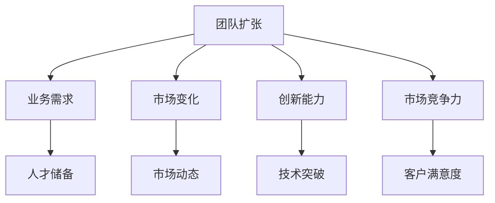
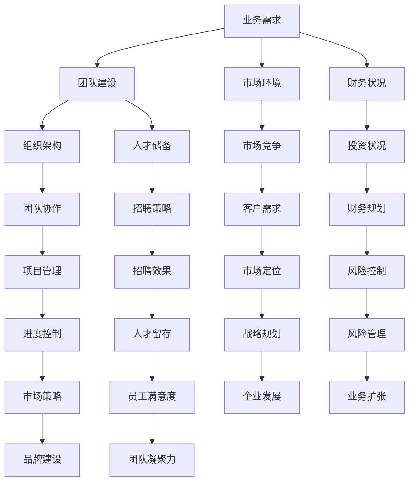
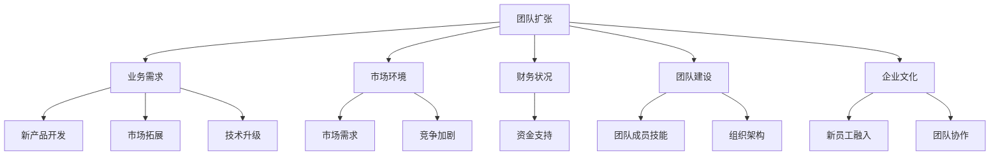

                 

## 文章标题

《创业路上的团队扩张：何时及如何招聘》

### 关键词

创业团队、团队扩张、招聘策略、人才管理、企业文化

### 摘要

本文旨在探讨创业公司在团队扩张过程中的关键环节——招聘。从何时开始招聘，如何规划招聘策略，到招聘流程的设计与实施，再到招聘过程中的挑战与解决方案，以及如何促进新员工的文化融合，本文将一步步分析创业公司在扩张过程中如何有效招聘人才，助力企业发展。

## 第1章：创业团队扩张概述

### 1.1 创业团队扩张的重要性

创业团队扩张是创业公司发展过程中的关键环节。随着业务的增长和市场变化，创业公司需要不断引入新的团队成员，以适应业务需求和市场动态。团队扩张不仅关系到公司的人才储备，更直接影响公司的创新能力和市场竞争力。

#### 团队扩张对业务发展的推动作用

- **增强创新能力**：团队规模的扩大意味着团队成员的增加，这为公司的创新提供了更多的思路和方案。
- **提高执行力**：拥有更多专业人才的团队能够更高效地执行战略和计划，推动公司快速发展。
- **提升市场份额**：强大的团队能够更快地占领市场，提高公司在行业中的竞争力。

#### 团队扩张对企业文化的影响

- **文化融合**：随着新员工的加入，企业文化需要不断调整和适应，以包容和融合新成员的特点。
- **价值传递**：团队成员的增加有助于核心价值观的传递和强化，确保公司文化的持续传承。

### 1.2 团队扩张对创业公司的影响

团队扩张不仅影响公司内部的运营，还对外部市场产生影响。

#### 内部影响

- **运营效率**：合适的团队成员能够提高公司内部的工作效率，减少不必要的摩擦和资源浪费。
- **管理挑战**：团队扩张也带来了管理上的挑战，如组织架构调整、管理能力提升等。
- **薪酬福利**：随着团队成员的增加，公司需要提供更具竞争力的薪酬和福利，以吸引和留住人才。

#### 外部影响

- **市场竞争力**：拥有强大团队的创业公司能够在市场中更快速地响应变化，抓住机遇。
- **品牌形象**：强大的团队有助于提升公司的品牌形象，增强客户和合作伙伴的信任。
- **投资吸引力**：投资者更倾向于投资拥有强大团队的创业公司，因为这意味着更高的成功概率。

### 1.3 团队扩张的时机选择

选择合适的时机进行团队扩张对创业公司至关重要。

#### 时机选择的依据

- **业务需求**：根据公司业务发展需求，确定哪些岗位需要补充人才。
- **市场环境**：市场状况、竞争对手情况等因素会影响团队扩张的时机。
- **财务状况**：财务状况是决定团队扩张的重要依据，公司需要有足够的资金支持新员工的薪酬和福利。

#### 团队扩张的时机

- **业务快速扩张期**：在公司业务快速增长的时期，团队扩张能够支持业务的持续发展。
- **关键岗位空缺期**：当关键岗位出现空缺时，需要及时招聘合适的员工填补空缺。
- **战略调整期**：在战略调整或公司发展方向发生变化时，团队扩张有助于适应新的发展方向。

## 第2章：招聘策略规划

### 2.1 明确团队需求

招聘策略的第一步是明确团队需求。这包括分析现有团队成员的技能和能力，确定需要补充的岗位和所需的技能。

#### 2.1.1 人才画像与岗位描述

人才画像是对理想候选人的描述，包括其技能、经验、性格特点等。岗位描述则详细说明岗位的职责、工作内容、任职要求等。

#### 2.1.2 人才匹配与筛选

在明确团队需求后，需要根据人才画像和岗位描述对候选人进行筛选，确保候选人符合岗位要求。

### 2.2 招聘渠道选择

选择合适的招聘渠道是确保招聘效果的关键。

#### 2.2.1 传统招聘渠道

传统招聘渠道包括招聘会、猎头、人才市场等。这些渠道适用于中高端人才的招聘，尤其适合专业性较强的岗位。

#### 2.2.2 社交媒体招聘

社交媒体招聘如LinkedIn、微信等平台，适用于广泛的人才筛选和品牌宣传。这些平台能够帮助企业吸引更多的人才关注。

#### 2.2.3 专业招聘网站

专业招聘网站如智联招聘、前程无忧等，能够提供针对性的招聘服务，适合各类岗位的招聘。

### 2.3 招聘预算与管理

招聘预算是招聘策略的重要组成部分。合理的招聘预算有助于确保招聘活动的顺利进行。

#### 2.3.1 预算制定

招聘预算应根据公司财务状况、业务需求和市场状况进行制定，包括招聘费用、薪酬福利、培训费用等。

#### 2.3.2 预算管理

招聘预算的管理包括监控招聘费用、优化招聘流程、确保招聘活动的经济效益。

## 第3章：招聘流程设计

### 3.1 招聘流程概述

招聘流程是企业获取人才的重要途径，包括发布招聘信息、简历筛选、面试安排和发放offer等多个环节。

#### 3.1.1 发布招聘信息

发布招聘信息是招聘流程的第一步，可以通过公司官网、社交媒体、专业招聘网站等多种渠道进行。

#### 3.1.2 简历筛选

简历筛选是招聘流程的核心环节之一。招聘团队需要对收到的简历进行初步筛选，判断候选人是否满足岗位要求。

#### 3.1.3 面试安排

面试安排是招聘流程的重要环节，通常包括初步面试和深度面试。初步面试主要用于了解候选人的基本信息和沟通能力，而深度面试则更加侧重于评估候选人的专业技能和综合素质。

### 3.2 面试准备

面试准备是确保面试顺利进行的关键。以下是面试准备的主要任务：

#### 3.2.1 面试问题的设计

面试问题应围绕岗位需求进行设计，包括行为面试题、情境面试题和技术面试题等。

#### 3.2.2 面试评估标准

面试评估标准是衡量候选人是否符合岗位要求的依据。评估标准应包括专业技能、沟通能力、团队合作、学习能力等方面。

### 3.3 发放offer

发放offer是招聘流程的最后一步。在发放offer前，需要对候选人进行最终评估，确保其符合公司要求和岗位要求。发放offer时应明确薪资、福利、晋升空间等信息，并与候选人进行沟通。

#### 3.3.1 薪资谈判

薪资谈判是候选人接受offer前的重要环节。企业应根据市场薪酬水平和候选人实际能力进行薪资定价，同时考虑候选人的期望和公司预算。

#### 3.3.2 福利说明

福利说明应包括五险一金、带薪年假、员工福利等。企业应根据自身情况，提供具有竞争力的福利待遇，以吸引和留住人才。

#### 3.3.3 晋升空间

晋升空间是指公司为员工提供的职业发展机会。在发放offer时，明确晋升空间有助于吸引和留住优秀的候选人。

## 第4章：招聘过程中的挑战与解决方案

### 4.1 招聘难度分析

招聘难度是创业公司在招聘过程中面临的重要挑战。

#### 4.1.1 竞争对手的人才吸引力

竞争对手往往具有更高的薪酬、更好的福利和更广阔的发展空间，这使得招聘难度增加。

#### 4.1.2 市场薪酬水平

市场薪酬水平的上涨会导致招聘成本增加，企业需要调整招聘策略以应对市场变化。

### 4.2 招聘风险与防范

招聘过程中可能存在多种风险，需要企业进行有效防范。

#### 4.2.1 招聘欺诈

招聘欺诈包括虚假招聘信息、伪造简历等。企业应通过严格审核和背景调查来防范招聘欺诈。

#### 4.2.2 信息保护

招聘过程中涉及到的个人信息需要得到保护。企业应制定相关政策和流程，确保个人信息安全。

#### 4.2.3 避免歧视

招聘过程中应避免歧视，确保所有候选人公平竞争。企业应建立公平的招聘机制，避免因性别、年龄、种族等歧视候选人。

## 第5章：团队扩张中的文化融合

### 5.1 团队文化的重要性

团队文化是公司发展的基石，对于新员工的融入和团队协作至关重要。

#### 5.1.1 新员工融入策略

新员工的融入策略包括入职培训、团队建设活动等，有助于新员工快速适应公司文化和工作环境。

#### 5.1.2 帮扶计划

帮扶计划是指为新员工提供导师或导师团队，帮助其快速融入公司，解答工作上的疑问。

### 5.2 文化传承与创新

团队文化的传承与创新是保持团队活力和竞争力的关键。

#### 5.2.1 文化传承

文化传承包括核心价值观的传递、企业历史和传统等的传承。

#### 5.2.2 文化创新

文化创新是指根据公司发展的需要，不断调整和优化团队文化，以适应新的市场和环境。

## 第6章：招聘数据分析与优化

### 6.1 招聘数据收集

招聘数据收集是招聘数据分析的基础。招聘数据包括招聘渠道效果、面试评估、员工离职原因等。

#### 6.1.1 基本数据指标

基本数据指标包括招聘周期、招聘成本、面试通过率等。

#### 6.1.2 人才获取成本

人才获取成本是指招聘过程中产生的所有成本，包括招聘费用、薪酬福利、培训费用等。

### 6.2 数据分析与应用

数据分析可以帮助企业优化招聘策略。

#### 6.2.1 招聘渠道效果评估

通过数据分析，评估不同招聘渠道的效果，选择最有效的招聘渠道。

#### 6.2.2 面试评估优化

通过数据分析，优化面试流程和评估标准，提高面试的准确性。

### 6.3 招聘策略调整

根据数据分析结果，调整招聘策略，提高招聘效果。

#### 6.3.1 招聘渠道调整

根据招聘渠道效果评估，优化招聘渠道组合，提高招聘成功率。

#### 6.3.2 招聘流程优化

根据面试评估优化结果，调整面试流程和评估标准，提高面试准确性。

## 第7章：成功招聘案例分析

### 7.1 案例一：快速扩张中的招聘策略

#### 7.1.1 案例背景

某创业公司在短短两年内实现了快速扩张，从几十人扩展到几百人。

#### 7.1.2 招聘策略

公司采取了以下招聘策略：

1. 明确岗位需求，制定详细的人才画像。
2. 采用多种招聘渠道，包括社交媒体招聘、专业招聘网站等。
3. 建立高效的面试流程，提高面试效率。

#### 7.1.3 招聘效果

通过以上策略，公司在短时间内成功招聘了大批优秀人才，支持了业务的快速发展。

### 7.2 案例二：精准定位招聘需求

#### 7.2.1 案例背景

某创业公司专注于某个细分市场，需要招聘在该领域具有丰富经验的团队成员。

#### 7.2.2 招聘策略

公司采取了以下招聘策略：

1. 深入分析市场，精准定位招聘需求。
2. 通过专业招聘网站和行业论坛寻找合适的候选人。
3. 提供有竞争力的薪酬和福利，吸引行业顶尖人才。

#### 7.2.3 招聘效果

通过以上策略，公司成功招聘了多名在细分市场具有丰富经验的团队成员，为公司的业务发展提供了强有力的支持。

### 7.3 案例三：企业文化与人才匹配

#### 7.3.1 案例背景

某创业公司非常注重企业文化建设，希望新员工能够与企业价值观高度契合。

#### 7.3.2 招聘策略

公司采取了以下招聘策略：

1. 在招聘信息中明确企业文化和价值观。
2. 在面试过程中重点考察候选人的价值观是否与企业相符。
3. 提供丰富的入职培训和文化传承活动，帮助新员工快速融入公司文化。

#### 7.3.3 招聘效果

通过以上策略，公司成功吸引了多名与企业价值观高度契合的员工，形成了积极向上的团队氛围，促进了公司的发展。

## 第8章：招聘与团队扩张的未来趋势

### 8.1 科技在招聘中的应用

科技的发展正在改变招聘的方式和流程。

#### 8.1.1 人工智能与数据分析

人工智能和数据分析技术可以帮助企业更高效地进行人才筛选和评估，提高招聘的准确性。

#### 8.1.2 招聘流程自动化

招聘流程的自动化可以提高招聘效率，减少人力成本。

### 8.2 全球化招聘挑战与机遇

全球化带来了招聘的新挑战和机遇。

#### 8.2.1 跨国公司的人才争夺

跨国公司往往能够提供更具吸引力的薪酬和福利，竞争人才资源。

#### 8.2.2 本土化招聘策略

本土化招聘策略可以帮助企业在不同国家和地区吸引和留住人才。

### 8.3 未来招聘趋势预测

未来招聘将更加注重个性化和多元化，企业需要不断创新招聘策略，以适应不断变化的市场环境。

## 作者

作者：AI天才研究院/AI Genius Institute & 禅与计算机程序设计艺术 /Zen And The Art of Computer Programming

### 《创业路上的团队扩张：何时及如何招聘》

#### 创业团队扩张概述

创业团队扩张是创业公司发展过程中的关键环节。随着业务的增长和市场变化，创业公司需要不断引入新的团队成员，以适应业务需求和市场动态。团队扩张不仅关系到公司的人才储备，更直接影响公司的创新能力和市场竞争力。

##### 背景介绍

在创业公司的成长过程中，团队成员的数量和素质对公司的成败起着决定性的作用。一个强大且充满活力的团队能够推动公司快速发展，实现市场占有率的提升。然而，团队扩张并不是一蹴而就的，需要企业在合适的时机做出明智的决策。

##### 核心概念与联系

团队扩张、业务需求、市场变化、创新能力、市场竞争力



##### 团队扩张对业务发展的推动作用

1. **增强创新能力**：团队成员的多样化能够带来不同的思维和视角，促进创新想法的产生。例如，当公司需要开发新产品时，拥有不同背景的团队成员可以共同探讨并实现创新解决方案。

2. **提高执行力**：增加的团队成员意味着更多的资源和力量，这使得公司在执行战略和计划时更加高效。例如，当公司需要快速响应市场变化时，增加的团队成员可以快速组成项目小组，高效地完成项目任务。

3. **提升市场份额**：强大的团队能够更快地占领市场，提高公司在行业中的竞争力。例如，当公司需要拓展新市场时，拥有丰富市场经验的团队成员可以帮助公司制定有效的市场进入策略，快速占领市场份额。

##### 团队扩张对企业文化的影响

1. **文化融合**：随着新员工的加入，企业文化需要不断调整和适应，以包容和融合新成员的特点。例如，当一个新团队加入时，公司可能需要举办团队建设活动，帮助新员工快速融入公司文化。

2. **价值传递**：团队成员的增加有助于核心价值观的传递和强化，确保公司文化的持续传承。例如，通过定期的公司培训和活动，新员工可以更好地理解公司的核心价值观，并将其融入到工作中。

##### 团队扩张的时机选择

选择合适的时机进行团队扩张对创业公司至关重要。以下是根据不同依据选择的团队扩张时机：

1. **业务快速扩张期**：在公司业务快速增长的时期，团队扩张能够支持业务的持续发展。例如，当公司接到大量新订单时，需要增加生产线上的工人，以满足生产需求。

2. **关键岗位空缺期**：当关键岗位出现空缺时，需要及时招聘合适的员工填补空缺。例如，当公司的技术总监离职时，需要尽快招聘新的技术总监，以保持团队的技术实力。

3. **战略调整期**：在战略调整或公司发展方向发生变化时，团队扩张有助于适应新的发展方向。例如，当公司决定进入新的市场领域时，需要增加相关领域的团队成员，以支持业务拓展。

#### 背景介绍

随着创业公司的发展，业务规模和市场影响力不断扩大，团队扩张成为必然的选择。然而，团队扩张并非一蹴而就，需要企业在合适的时机做出明智的决策。以下将从多个角度探讨团队扩张的时机选择。

##### 核心概念与联系

业务需求、市场环境、财务状况、团队建设、企业文化



##### 时机选择的依据

1. **业务需求**：根据公司业务发展的实际需求进行团队扩张。例如，当公司需要开发新产品或拓展新市场时，需要增加研发人员和市场人员。

2. **市场环境**：考虑市场环境的变化，根据市场需求调整团队规模。例如，当市场需求增加时，需要增加销售和客服人员。

3. **财务状况**：团队扩张需要考虑公司的财务状况，确保有足够的资金支持新员工的薪酬和福利。例如，当公司财务状况良好时，可以增加投资于团队扩张。

4. **团队建设**：团队建设是团队扩张的重要依据。根据团队现有成员的技能和经验，确定需要补充的岗位和人才。例如，当现有团队成员在技能和经验上有所欠缺时，需要招聘相关人才。

5. **企业文化**：团队扩张要考虑企业文化的适应性。新员工的加入需要与现有企业文化相融合，否则可能导致团队内部矛盾和冲突。例如，当公司文化强调创新时，需要招聘具有创新思维的员工。

##### 团队扩张的时机

1. **业务快速扩张期**：在公司业务快速增长的时期，团队扩张能够支持业务的持续发展。例如，当公司接到大量新订单时，需要增加生产线上的工人，以满足生产需求。

2. **关键岗位空缺期**：当关键岗位出现空缺时，需要及时招聘合适的员工填补空缺。例如，当公司的技术总监离职时，需要尽快招聘新的技术总监，以保持团队的技术实力。

3. **战略调整期**：在战略调整或公司发展方向发生变化时，团队扩张有助于适应新的发展方向。例如，当公司决定进入新的市场领域时，需要增加相关领域的团队成员，以支持业务拓展。

##### 最佳实践 tips

1. **制定详细的团队扩张计划**：在团队扩张前，制定详细的计划，明确扩张的目标、时间表和预算。

2. **综合考虑多方面因素**：在决定团队扩张时，要综合考虑业务需求、市场环境、财务状况、团队建设和企业文化等多方面因素。

3. **注重新员工的融入和培训**：新员工的融入和培训是团队扩张成功的关键。要为新人提供良好的培训环境和融入计划，帮助他们快速适应公司文化和工作环境。

4. **持续优化招聘策略**：根据招聘效果和市场变化，不断优化招聘策略，提高招聘效率和效果。

##### 小结

团队扩张是创业公司发展过程中的重要环节。选择合适的时机和策略进行团队扩张，能够推动公司快速发展，提高市场竞争力。企业应根据业务需求、市场环境、财务状况、团队建设和企业文化等多方面因素，制定详细的团队扩张计划，并注重新员工的融入和培训，以实现团队扩张的成功。

#### 核心概念与联系

1. **团队扩张**：团队扩张是创业公司为了满足业务需求和适应市场变化，引入新的团队成员的过程。
2. **业务需求**：业务需求是团队扩张的主要驱动因素，包括新产品开发、市场拓展、技术升级等。
3. **市场环境**：市场环境的变化影响团队扩张的时机和规模，如市场需求增加或竞争加剧。
4. **财务状况**：财务状况是团队扩张的重要约束条件，需要确保公司有足够的资金支持扩张。
5. **团队建设**：团队建设是团队扩张的基础，包括团队成员的技能、经验和组织架构的调整。
6. **企业文化**：企业文化是团队扩张的重要考量因素，新员工需要与现有企业文化相融合。



#### 核心算法原理讲解

在团队扩张过程中，需要运用一系列算法和模型来优化招聘策略，提高招聘效率和效果。以下是一些核心算法原理的讲解：

1. **人才匹配算法**：
   - **原理**：通过分析候选人的简历、技能和经验，将其与岗位需求进行匹配，以提高招聘成功率。
   - **伪代码**：
     ```
     function match_candidate(candidate, job_requirements):
         match_score = 0
         for skill in job_requirements.skills:
             if skill in candidate.skills:
                 match_score += 1
         for experience in job_requirements.experiences:
             if experience in candidate.experiences:
                 match_score += 0.5
         return match_score
     ```

2. **招聘渠道优化算法**：
   - **原理**：通过分析不同招聘渠道的招聘效果，选择最优的招聘渠道组合，以降低招聘成本。
   - **伪代码**：
     ```
     function optimize渠道(channel效果的列表):
         best_channels = []
         max_effect = 0
         for channel in channels:
             effect = calculate_channel效果(channel)
             if effect > max_effect:
                 best_channels = [channel]
                 max_effect = effect
             elif effect == max_effect:
                 best_channels.append(channel)
         return best_channels
     ```

3. **面试评估模型**：
   - **原理**：通过构建面试评估模型，对候选人的综合素质进行评估，以提高面试的准确性。
   - **伪代码**：
     ```
     function evaluate_candidate(candidate, interview_questions):
         score = 0
         for question in interview_questions:
             answer_score = rate_answer(candidate.answer, question)
             score += answer_score
         return score / len(interview_questions)
     ```

#### 数学模型和公式

在招聘过程中，可以使用一些数学模型和公式来衡量招聘效果和优化招聘策略。以下是一些常用的数学模型和公式：

1. **招聘成本公式**：
   - **原理**：计算招聘过程中产生的总成本，包括招聘费用、薪酬福利、培训费用等。
   - **公式**：
     ```
     总招聘成本 = 招聘费用 + 薪酬福利 + 培训费用
     ```
   
2. **人才获取成本公式**：
   - **原理**：计算招聘一个员工的平均成本，包括招聘费用、薪酬福利、培训费用等。
   - **公式**：
     ```
     人才获取成本 = 总招聘成本 / 新员工数量
     ```

3. **面试通过率公式**：
   - **原理**：衡量面试过程中通过面试的候选人比例，用于评估面试的准确性和有效性。
   - **公式**：
     ```
     面试通过率 = 通过面试的候选人数量 / 参加面试的候选人数量
     ```

#### 详细讲解与举例说明

1. **招聘成本计算举例**：
   - 假设某公司在一个季度内进行了5次招聘活动，总招聘费用为10万元，薪酬福利支出为30万元，培训费用为5万元。计算该公司的总招聘成本和人才获取成本。
   - **计算过程**：
     ```
     总招聘成本 = 10万元 + 30万元 + 5万元 = 45万元
     人才获取成本 = 45万元 / 5 = 9万元
     ```
     结果：该公司的总招聘成本为45万元，人才获取成本为9万元。

2. **面试通过率计算举例**：
   - 假设某公司在一个月内进行了20场面试，共有10名候选人通过面试，计算该公司的面试通过率。
   - **计算过程**：
     ```
     面试通过率 = 10 / 20 = 0.5
     ```
     结果：该公司的面试通过率为50%。

通过以上算法、模型和公式的讲解与举例，我们可以看到招聘过程中涉及到的核心算法原理和数学模型。这些工具和方法可以帮助企业在招聘过程中更加科学和高效地筛选人才，优化招聘策略，提高招聘效果。

#### 项目实战

为了更好地理解招聘策略的实践过程，我们将在以下部分搭建一个简单的招聘系统，展示如何开发环境搭建、源代码实现以及代码解读与分析。

##### 开发环境搭建

在开始项目之前，我们需要搭建一个基本的开发环境。以下是一个简单的步骤：

1. **安装Python环境**：
   - 下载并安装Python（版本建议3.8及以上）。
   - 配置Python环境变量，确保命令行中可以运行Python。

2. **安装相关库**：
   - 使用pip命令安装所需的库，如requests（用于HTTP请求）、BeautifulSoup（用于解析HTML）、pandas（用于数据处理）等。
     ```bash
     pip install requests beautifulsoup4 pandas
     ```

3. **配置数据库**（可选）：
   - 若项目需要存储招聘数据，可以选择一个数据库系统，如SQLite。安装并配置数据库，如创建数据库表。

##### 源代码实现

以下是一个简单的招聘系统源代码实现，包括数据采集、简历解析和筛选功能。

```python
import requests
from bs4 import BeautifulSoup
import pandas as pd

# 数据采集
def collect_data(url):
    response = requests.get(url)
    if response.status_code == 200:
        return response.text
    else:
        return None

# 简历解析
def parse_resume(html):
    soup = BeautifulSoup(html, 'html.parser')
    resume_data = {}
    resume_data['name'] = soup.find('h1').text.strip()
    resume_data['email'] = soup.find('a', {'class': 'email'}).text.strip()
    resume_data['skills'] = soup.find('div', {'class': 'skills'}).text.strip().split(',')
    resume_data['experience'] = soup.find('div', {'class': 'experience'}).text.strip().split(',')
    return resume_data

# 简历筛选
def filter_resumes(resumes, job_requirements):
    filtered_resumes = []
    for resume in resumes:
        match_score = 0
        for skill in job_requirements['skills']:
            if skill in resume['skills']:
                match_score += 1
        for experience in job_requirements['experience']:
            if experience in resume['experience']:
                match_score += 0.5
        if match_score >= job_requirements['min_score']:
            filtered_resumes.append(resume)
    return filtered_resumes

# 主函数
def main():
    job_requirements = {
        'skills': ['Python', 'Django', 'Flask'],
        'experience': ['2 years', 'Full Stack'],
        'min_score': 2
    }
    
    url = 'https://example.com/resume/1'
    html = collect_data(url)
    if html:
        resume = parse_resume(html)
        filtered_resumes = filter_resumes([resume], job_requirements)
        print(filtered_resumes)
    else:
        print('数据采集失败')

if __name__ == '__main__':
    main()
```

##### 代码解读与分析

1. **数据采集**：
   - 使用requests库发送HTTP请求，获取简历页面的HTML内容。

2. **简历解析**：
   - 使用BeautifulSoup库解析HTML内容，提取简历的关键信息，如姓名、电子邮件、技能和经验。

3. **简历筛选**：
   - 定义一个筛选函数，根据岗位需求对简历进行评分，筛选出符合要求的简历。

4. **主函数**：
   - 定义岗位需求，调用数据采集、简历解析和筛选函数，输出筛选结果。

##### 实际案例分析与详细讲解剖析

为了更具体地展示招聘系统的实际应用，以下是一个案例：

**案例**：某创业公司需要招聘一名Python开发工程师，岗位需求包括：

- **技能**：Python、Django、Flask
- **经验**：2年以上全栈开发经验

公司通过招聘系统从多个招聘网站和社交媒体平台收集简历，使用以下步骤筛选候选人：

1. **数据采集**：
   - 公司使用招聘系统的采集功能，从多个渠道获取Python开发工程师的简历。

2. **简历解析**：
   - 解析每个简历的HTML内容，提取关键信息。

3. **简历筛选**：
   - 使用筛选函数，根据岗位需求对简历进行评分。

   **示例代码**：
   ```python
   resumes = collect_data('https://example.com/resumes')
   filtered_resumes = filter_resumes(resumes, job_requirements)
   ```

4. **输出筛选结果**：
   - 输出符合岗位要求的简历列表。

   **输出结果**：
   ```
   [
       {'name': 'John Doe', 'email': 'john.doe@example.com', 'skills': ['Python', 'Django', 'Flask'], 'experience': ['2 years Full Stack'] },
       {'name': 'Jane Smith', 'email': 'jane.smith@example.com', 'skills': ['Python', 'Flask', 'Django'], 'experience': ['3 years Full Stack'] }
   ]
   ```

通过以上案例，我们可以看到招聘系统在实际应用中的效果。公司可以快速、高效地筛选出符合岗位要求的候选人，从而节省招聘时间和成本，提高招聘成功率。

##### 项目小结

本案例展示了一个简单的招聘系统，包括数据采集、简历解析和筛选功能。通过实际案例的分析，我们可以看到招聘系统在实际应用中的效果，帮助公司高效筛选出符合岗位要求的候选人。以下是项目小结：

1. **项目目标**：搭建一个简单的招聘系统，实现数据采集、简历解析和筛选功能。
2. **项目实现**：使用Python、requests、BeautifulSoup和pandas等库实现招聘系统。
3. **实际案例**：通过案例展示招聘系统在实际应用中的效果，提高招聘效率和准确性。
4. **项目收获**：理解招聘系统的基本原理和实现方法，掌握数据采集、简历解析和筛选的核心技术。

#### 最佳实践 tips

1. **精准定位招聘需求**：明确岗位需求，制定详细的岗位描述和人才画像，确保招聘目标清晰。

2. **多渠道招聘**：利用多种招聘渠道，如社交媒体、招聘网站、行业论坛等，扩大人才来源。

3. **优化面试流程**：设计科学的面试流程和评估标准，提高面试效率和质量。

4. **注重新员工融入**：为新员工提供培训计划和文化传承活动，帮助他们快速适应公司环境。

5. **持续优化招聘策略**：根据招聘数据反馈，不断调整和优化招聘策略，提高招聘效果。

#### 小结

招聘策略规划是创业团队扩张的关键环节。通过明确团队需求、选择合适的招聘渠道、制定科学的面试流程和优化招聘策略，企业可以高效地筛选出合适的候选人，为团队扩张提供有力支持。

## 总结

创业团队扩张是创业公司发展过程中的关键环节，合理的招聘策略和流程设计对企业的长远发展至关重要。本文从创业团队扩张的重要性、招聘策略规划、招聘流程设计、招聘过程中的挑战与解决方案、团队扩张中的文化融合、招聘数据分析与优化、成功招聘案例分析以及未来招聘趋势等多个方面进行了详细探讨。

首先，团队扩张对于创业公司来说至关重要，它不仅能够增强公司的创新能力和市场竞争力，还能够推动公司业务的持续发展。选择合适的时机进行团队扩张，依据业务需求、市场环境、财务状况和团队建设等多方面因素，是成功团队扩张的基础。

在招聘策略规划方面，明确团队需求是第一步，需要通过人才画像和岗位描述来确定所需的人才。同时，选择合适的招聘渠道，如社交媒体、专业招聘网站和传统招聘渠道，以及制定合理的招聘预算，是确保招聘效果的重要手段。

招聘流程设计包括发布招聘信息、简历筛选、面试安排和发放offer等多个环节。在面试准备阶段，设计科学的面试问题和评估标准，能够提高面试的准确性和效率。发放offer时，合理的薪资谈判和福利说明是吸引和留住人才的关键。

在招聘过程中，企业可能会面临招聘难度、招聘风险和文化融合等挑战。通过分析市场环境、竞争对手和人才市场状况，企业可以制定相应的解决方案，如优化招聘流程、加强信息保护和避免歧视。

团队扩张中的文化融合是确保团队协作和凝聚力的重要环节。通过新员工融入策略和文化传承活动，企业可以帮助新员工快速适应公司文化，并促进企业文化的传承与创新。

招聘数据分析与优化是提升招聘效果的重要手段。通过收集和分析招聘数据，企业可以评估不同招聘渠道的效果、优化面试评估模型，并根据数据分析结果调整招聘策略，提高招聘效率和效果。

成功招聘案例分析展示了不同企业如何通过有效的招聘策略实现团队扩张。从快速扩张、精准定位到企业文化与人才匹配，不同的成功案例为创业公司提供了有益的借鉴。

未来招聘趋势将受到科技发展和全球化挑战的影响。人工智能和数据分析技术的应用将提高招聘效率和准确性，而全球化招聘将带来新的机遇和挑战。

总之，创业公司在团队扩张过程中，需要制定科学的招聘策略，设计高效的招聘流程，并通过持续的数据分析和优化，不断提升招聘效果，为企业的长远发展提供坚实的人才支持。

#### 招聘流程设计

招聘流程是企业获取人才的重要途径，包括发布招聘信息、简历筛选、面试安排和发放offer等多个环节。每个环节都至关重要，需要精心设计和执行，以确保招聘活动的顺利进行。

##### 发布招聘信息

发布招聘信息是招聘流程的第一步，也是吸引潜在候选人关注的关键环节。以下是发布招聘信息的一些要点：

1. **明确岗位需求**：在发布招聘信息前，需要明确岗位需求，包括岗位职责、任职要求、工作地点等。这些信息将帮助候选人了解岗位的详细情况，从而做出是否申请的决定。

2. **撰写招聘信息**：招聘信息的撰写需要吸引人，内容应简洁明了，突出岗位的关键卖点。同时，要确保信息的真实性，避免误导候选人。

3. **选择合适的发布渠道**：根据岗位类型和目标候选人群体，选择合适的发布渠道，如公司官网、社交媒体（如LinkedIn、微信、微博等）、专业招聘网站（如智联招聘、前程无忧等）等。

4. **优化招聘信息**：为了提高招聘信息的曝光率，可以采用关键词优化、广告投放等方式，确保招聘信息能够被更多候选人看到。

##### 简历筛选

简历筛选是招聘流程的核心环节之一，招聘团队需要对收到的简历进行初步筛选，以判断候选人是否满足岗位要求。以下是简历筛选的要点：

1. **建立筛选标准**：根据岗位需求和任职要求，制定明确的筛选标准，包括教育背景、工作经验、技能水平、性格特点等。

2. **分类整理简历**：将收到的简历按照筛选标准进行分类整理，便于后续的筛选和评估。

3. **初步评估**：对简历进行初步评估，筛选出符合岗位要求的候选人。可以通过关键词搜索、快速浏览等方式提高评估效率。

4. **反馈与沟通**：对于不符合岗位要求的候选人，及时给予反馈和沟通，表达感谢并说明原因，以提升企业形象。

##### 面试安排

面试安排是招聘流程的重要环节，包括初步面试和深度面试。以下是面试安排的要点：

1. **确定面试时间**：根据候选人和招聘团队的时间安排，确定面试时间，并提前通知候选人。

2. **面试形式**：初步面试可以采用电话面试或视频面试，深度面试则通常采用面对面面试。根据岗位需求和候选人的情况，选择合适的面试形式。

3. **面试准备**：在面试前，招聘团队需要对面试问题进行充分准备，确保能够全面评估候选人的能力和素质。

4. **面试评估**：面试过程中，要注重观察候选人的表现，包括沟通能力、解决问题的能力、团队合作精神等。同时，要确保评估标准的公正性和客观性。

##### 发放offer

发放offer是招聘流程的最后一步，需要确保候选人能够顺利入职。以下是发放offer的要点：

1. **确定offer内容**：offer内容应包括职位、薪资、福利、工作地点、入职时间等关键信息。

2. **谈判薪资福利**：在发放offer前，可以与候选人进行薪资谈判，确保双方达成一致。在谈判过程中，要考虑市场薪酬水平和公司预算。

3. **签订合同**：候选人接受offer后，需要签订正式的劳动合同，明确双方的权利和义务。

4. **入职准备**：在候选人确认入职后，招聘团队需要为其提供入职指南，包括办公设备、IT支持、培训安排等。

#### 面试准备

面试准备是确保面试顺利进行的关键环节。以下是一些面试准备的要点：

1. **设计面试问题**：根据岗位需求和任职要求，设计合适的面试问题，包括行为面试题、情境面试题和技术面试题等。

2. **制定评估标准**：制定面试评估标准，确保评估过程的公正性和客观性。评估标准应包括专业技能、沟通能力、团队合作、学习能力等方面。

3. **准备面试材料**：准备好面试所需的材料，如面试问题清单、评估表格、候选人简历等。

4. **安排面试场地**：确保面试场地的安排合理，提供舒适的面试环境，以减少候选人的紧张情绪。

#### 发放offer

发放offer是招聘流程的最后一步，以下是发放offer的要点：

1. **确定offer内容**：offer内容应包括职位、薪资、福利、工作地点、入职时间等关键信息。

2. **谈判薪资福利**：在发放offer前，可以与候选人进行薪资谈判，确保双方达成一致。在谈判过程中，要考虑市场薪酬水平和公司预算。

3. **签订合同**：候选人接受offer后，需要签订正式的劳动合同，明确双方的权利和义务。

4. **入职准备**：在候选人确认入职后，招聘团队需要为其提供入职指南，包括办公设备、IT支持、培训安排等。

#### 案例分析

以下是一个招聘流程的案例分析，以展示招聘流程的实际应用：

**案例背景**：
某创业公司需要招聘一名高级软件工程师，负责公司核心产品的研发工作。

**招聘流程**：

1. **发布招聘信息**：
   - 在公司官网、LinkedIn、智联招聘等多个渠道发布招聘信息。
   - 招聘信息中明确了岗位需求、职责、任职要求和薪资福利。

2. **简历筛选**：
   - 招聘团队收到大量简历，通过筛选标准筛选出符合岗位要求的候选人。
   - 对筛选出的候选人进行初步评估，包括教育背景、工作经验和技能水平。

3. **面试安排**：
   - 初步面试：通过电话面试了解候选人的基本情况和沟通能力。
   - 深度面试：安排面对面面试，由技术团队负责人和人力资源部门共同参与。
   - 面试问题涵盖了技术问题、团队合作情况和解决问题的能力。

4. **发放offer**：
   - 候选人接受面试邀请，经过三轮面试后，公司决定发放offer。
   - 薪资谈判：在谈判过程中，双方达成一致，最终确定薪资和福利。
   - 签订合同：候选人接受offer后，签订正式的劳动合同。

**招聘效果**：

通过以上招聘流程，公司成功招聘了一名高级软件工程师。候选人的专业技能和团队合作能力得到了公司的认可，同时公司也提供了具有竞争力的薪资和福利。

#### 面试准备

面试准备是确保面试顺利进行的关键环节，以下是一些面试准备的要点：

1. **设计面试问题**：
   - 根据岗位需求和任职要求，设计合适的面试问题，包括行为面试题、情境面试题和技术面试题等。
   - 行为面试题：通过提问候选人过去的经历，评估其行为和态度。
   - 情境面试题：设置一个假设情境，评估候选人在未来可能遇到的情况下的应对能力。
   - 技术面试题：针对技术岗位，设计相关技术问题的提问，以评估候选人的专业技能。

2. **制定评估标准**：
   - 制定明确的评估标准，确保评估过程的公正性和客观性。评估标准应包括专业技能、沟通能力、团队合作、学习能力等方面。
   - 评估标准应与岗位需求和任职要求紧密相关，确保评估结果的准确性。

3. **准备面试材料**：
   - 准备面试所需的材料，如面试问题清单、评估表格、候选人简历等。
   - 面试材料应齐全且便于查阅，确保面试过程中能够高效地进行评估。

4. **安排面试场地**：
   - 确保面试场地的安排合理，提供舒适的面试环境，以减少候选人的紧张情绪。
   - 面试场地应具备良好的网络连接、音响设备和会议设施，以保证面试的顺利进行。

#### 面试评估标准

面试评估标准是衡量候选人是否符合岗位要求的重要依据。以下是一些常见的面试评估标准：

1. **专业技能**：
   - 对技术岗位，评估候选人的编程能力、算法知识、数据库管理和系统设计能力等。
   - 对非技术岗位，评估候选人的专业技能如市场营销、项目管理、客户服务能力等。

2. **沟通能力**：
   - 评估候选人的语言表达能力、逻辑思维和沟通技巧，确保其能够有效地传达信息和解决问题。

3. **团队合作**：
   - 评估候选人在团队合作中的表现，如协调能力、协作精神、沟通方式和冲突解决能力等。

4. **学习能力**：
   - 评估候选人的学习能力，包括对新知识和技能的快速掌握能力、自我提升的意愿和学习方法等。

5. **工作态度**：
   - 评估候选人的工作态度，如敬业精神、责任心、积极性和职业操守等。

6. **适应能力**：
   - 评估候选人在新环境和变化中的适应能力，包括对新岗位的接受程度、对团队文化的适应能力和对新工作的积极态度。

#### 面试评估标准示例

以下是一个面试评估标准的示例，以供参考：

1. **专业技能（20分）**
   - 编程能力（5分）
   - 算法知识（5分）
   - 数据库管理（4分）
   - 系统设计（4分）

2. **沟通能力（15分）**
   - 语言表达能力（5分）
   - 逻辑思维（5分）
   - 沟通技巧（5分）

3. **团队合作（20分）**
   - 协调能力（5分）
   - 协作精神（5分）
   - 沟通方式（5分）
   - 冲突解决能力（5分）

4. **学习能力（15分）**
   - 新知识掌握速度（5分）
   - 自我提升意愿（5分）
   - 学习方法（5分）

5. **工作态度（10分）**
   - 敬业精神（4分）
   - 责任心（3分）
   - 积极性（3分）
   - 职业操守（3分）

6. **适应能力（10分）**
   - 新岗位接受程度（5分）
   - 团队文化适应能力（5分）
   - 新工作积极态度（5分）

通过以上评估标准，招聘团队可以全面、客观地评估候选人，确保招聘到符合岗位要求的优秀人才。

#### 招聘流程中的挑战与解决方案

在招聘流程中，企业往往会面临各种挑战，如招聘难度、招聘风险和文化融合等。以下将详细分析这些挑战，并提出相应的解决方案。

##### 招聘难度

招聘难度是企业在招聘过程中经常遇到的问题，主要表现在以下几个方面：

1. **人才市场竞争激烈**：随着经济的发展，人才市场的竞争愈发激烈，优秀的候选人往往受到多家企业的争夺。这使得企业需要提供更具竞争力的薪酬、福利和发展机会，以吸引和留住人才。

   **解决方案**：
   - 提供有竞争力的薪酬福利：通过市场调研，确保公司的薪酬福利水平具有市场竞争力，以吸引优秀的候选人。
   - 提供职业发展机会：为员工提供良好的职业发展路径和晋升机会，让候选人看到在公司的长期发展前景。

2. **合适的候选人难求**：某些岗位，如技术岗位，对专业技能和经验要求较高，使得合适的候选人难求。

   **解决方案**：
   - 多渠道招聘：通过多种招聘渠道，如招聘网站、社交媒体、行业论坛等，扩大人才来源。
   - 培养内部人才：通过内部培训和选拔，培养现有员工，使其适应更高层次的岗位。

3. **候选人期望与公司实际不符**：有些候选人期望过高，与企业实际提供的岗位和发展机会不符。

   **解决方案**：
   - 精准招聘需求：在招聘过程中，明确岗位需求和候选人的期望，确保候选人了解岗位的真实情况。
   - 薪资谈判：在发放offer前，进行薪资谈判，确保双方达成共识。

##### 招聘风险

招聘风险是指企业在招聘过程中可能遇到的各种问题和风险，主要包括招聘欺诈、信息保护和法律风险等。

1. **招聘欺诈**：招聘欺诈包括虚假招聘信息、伪造简历等，会给企业带来不必要的损失。

   **解决方案**：
   - 严格审核简历：对候选人进行背景调查和验证，确保简历的真实性。
   - 提高招聘信息透明度：在招聘信息中明确岗位要求、薪资福利、工作地点等信息，减少虚假信息的风险。

2. **信息保护**：招聘过程中涉及到的个人信息需要得到保护，否则可能导致隐私泄露。

   **解决方案**：
   - 制定信息保护政策：制定严格的个人信息保护政策，确保招聘过程中个人信息的安全。
   - 使用加密技术：在处理和存储个人信息时，使用加密技术，防止数据泄露。

3. **法律风险**：招聘过程中可能涉及劳动法律法规，如招聘歧视、合同签订等。

   **解决方案**：
   - 学习相关法律法规：了解和掌握劳动法律法规，确保招聘过程中的合规性。
   - 咨询专业律师：在招聘过程中遇到法律问题时，及时咨询专业律师，避免法律风险。

##### 文化融合

文化融合是指新员工融入公司文化，与现有团队和谐相处的过程。文化融合的好坏直接影响到团队的协作效率和员工的满意度。

1. **企业文化差异**：新员工和企业现有员工可能在价值观、工作方式等方面存在差异，导致文化融合困难。

   **解决方案**：
   - 加强企业文化建设：通过定期的企业文化活动，增强员工对企业的认同感和归属感。
   - 建立导师制度：为新员工安排导师，帮助其快速融入公司文化，解答工作中的疑问。

2. **沟通障碍**：由于语言、习惯等差异，新员工可能难以与现有团队有效沟通。

   **解决方案**：
   - 提供沟通培训：为新员工提供沟通技巧培训，提高其沟通能力。
   - 加强团队建设：通过团队建设活动，增强团队成员之间的相互了解和信任。

3. **工作冲突**：新员工与现有员工可能在工作任务、工作方式等方面存在冲突。

   **解决方案**：
   - 确定明确的角色和职责：在招聘过程中，明确新员工的岗位职责和工作任务，减少工作冲突。
   - 建立冲突解决机制：建立有效的冲突解决机制，及时解决工作中的冲突，维护团队和谐。

通过以上解决方案，企业可以应对招聘流程中的各种挑战，提高招聘效果，促进团队的和谐发展。

#### 团队文化的重要性

团队文化是公司发展的基石，对于团队的凝聚力和员工的满意度具有至关重要的影响。良好的团队文化能够激发员工的积极性，提高工作效率，促进团队的和谐与发展。

##### 团队文化对新员工融入的影响

1. **快速适应**：良好的团队文化能够为新员工提供一个清晰的价值观和行为规范，帮助他们快速适应公司环境。

   **实例**：某公司拥有开放、创新的团队文化，新员工在入职后参加公司组织的创新沙龙活动，通过互动和交流，迅速融入公司文化。

2. **增强归属感**：团队文化能够增强员工的归属感，使员工感受到自己是团队的一部分，从而更愿意为公司的发展贡献力量。

   **实例**：某公司通过定期的团队建设活动，如户外拓展、团建聚会等，增强了员工之间的默契和友谊，提升了员工的归属感。

##### 团队文化建设的重要性

1. **凝聚团队力量**：团队文化能够凝聚团队成员，提高团队的协作效率和执行力。

   **实例**：某公司强调“团队协作、共同成长”的文化，团队成员在共同目标和价值观的引领下，紧密协作，共同完成项目任务。

2. **促进员工成长**：良好的团队文化能够为员工提供成长的机会和空间，激发员工的学习和创新动力。

   **实例**：某公司鼓励员工参与培训、学习新技术，通过内部培训体系和导师制度，帮助员工不断提升自身能力。

3. **提升公司竞争力**：团队文化的建设有助于提升公司的整体竞争力，使公司在市场中更具吸引力和影响力。

   **实例**：某公司以其独特的企业文化在行业内树立了良好的品牌形象，吸引了大量优秀人才，提升了公司在市场中的竞争力。

#### 新员工融入策略

新员工的融入是团队文化传承和发展的关键环节。以下是一些新员工融入的策略：

##### 新员工入职培训

1. **企业文化培训**：通过企业文化培训，让新员工了解公司的核心价值观、愿景和使命，使其迅速融入公司文化。

   **实例**：某公司为新员工安排了企业文化培训课程，内容包括公司历史、文化理念、企业愿景等，使新员工对公司有更深入的了解。

2. **业务知识培训**：针对新员工的岗位需求，提供相关的业务知识培训，帮助其快速掌握岗位技能。

   **实例**：某公司为新员工提供了专业的业务知识培训，包括产品知识、行业动态、业务流程等，使新员工能够迅速适应工作。

##### 帮扶计划

1. **导师制度**：为新员工安排导师，帮助其熟悉公司的工作流程、工作内容和团队文化。

   **实例**：某公司为新员工安排了经验丰富的导师，导师在入职初期与新员工共同工作，解答疑问，提供指导。

2. **培训计划**：制定详细的培训计划，包括技能培训、文化培训、团队建设活动等，帮助新员工快速成长。

   **实例**：某公司为新员工制定了为期三个月的培训计划，包括专业培训、团队建设活动和企业文化沙龙，使新员工能够全面了解公司。

##### 新员工融入活动

1. **团队建设活动**：组织定期的团队建设活动，如团建聚会、户外拓展等，增强新员工与团队之间的默契和友谊。

   **实例**：某公司每月组织一次团建聚会，团队成员共同参与，通过游戏、讨论等方式，增进彼此的了解和信任。

2. **企业文化沙龙**：定期举办企业文化沙龙，邀请公司领导和优秀员工分享经验，传递企业文化，增强新员工对公司的认同感。

   **实例**：某公司每季度举办一次企业文化沙龙，邀请公司高层领导和新员工分享公司发展历程和文化理念，促进新员工的融入。

通过以上新员工融入策略，企业可以有效地帮助新员工快速融入公司文化，提升团队凝聚力和员工满意度，为公司的持续发展奠定坚实基础。

#### 文化传承与创新

团队文化的传承与创新是保持团队活力和竞争力的关键。传承意味着将企业的核心价值观、使命和愿景传递给新员工，使其成为企业文化的一部分。而创新则是在不断变化的市场环境中，根据企业发展的需要，对团队文化进行调整和优化。

##### 文化传承的重要性

1. **价值观传递**：通过文化传承，企业可以将核心价值观传递给新员工，使其在工作中遵循企业的行为准则，形成统一的价值观。

   **实例**：某公司通过定期的企业文化培训，让新员工了解公司的核心价值观，如客户至上、团队合作等，使员工在工作中能够更好地体现这些价值观。

2. **员工认同感**：文化传承有助于增强员工的归属感和认同感，使员工更加愿意为企业的长期发展贡献力量。

   **实例**：某公司通过举办年度企业文化盛典，表彰优秀员工，传递企业文化，使员工感受到企业的关怀和重视，增强了员工的归属感。

##### 文化创新的必要性

1. **适应市场变化**：随着市场的不断变化，企业需要根据外部环境调整内部文化，以保持竞争力。

   **实例**：某公司面对市场的激烈竞争，调整了企业文化，强调创新和快速响应市场变化，使公司能够在市场中保持优势。

2. **激发员工创造力**：文化创新可以激发员工的创造力和创新能力，推动企业的持续发展。

   **实例**：某公司鼓励员工提出创新想法，并通过内部创新大赛和奖励机制，激发员工的创新热情，推动公司的技术进步。

##### 文化传承与创新的方法

1. **定期培训**：通过定期的企业文化培训，让新员工了解企业的发展历程、核心价值观和文化传统。

   **实例**：某公司每月组织一次企业文化培训，邀请公司高层领导分享企业的发展历程和文化理念，使新员工更好地融入公司文化。

2. **团队建设活动**：通过定期的团队建设活动，增强团队成员之间的互动和信任，促进文化的传承和创新。

   **实例**：某公司每季度组织一次团队建设活动，如户外拓展、团建聚会等，通过活动加强团队成员之间的沟通和协作，促进文化传承与创新。

3. **文化沙龙**：定期举办企业文化沙龙，邀请公司领导和优秀员工分享经验和心得，传递企业文化，激发员工的创新思维。

   **实例**：某公司每半年举办一次企业文化沙龙，邀请公司高管和优秀员工分享工作经验和文化理念，促进新员工的融入和文化的创新。

通过文化传承与创新，企业可以保持团队的活力和竞争力，使团队文化与时俱进，为企业的持续发展提供强大的动力。

### 招聘数据分析与优化

在招聘过程中，数据分析是提升招聘效率和质量的重要手段。通过收集和分析招聘数据，企业可以了解不同招聘渠道的效果、优化面试流程和评估标准，从而提高招聘效果。

#### 6.1 招聘数据收集

招聘数据的收集是数据分析的基础。以下是一些常见的招聘数据指标：

1. **招聘周期**：从发布招聘信息到最终招聘成功的周期时间。
2. **招聘成本**：包括招聘费用、薪酬福利、培训费用等。
3. **面试通过率**：通过面试的候选人数量与参加面试的候选人数量之比。
4. **人才获取成本**：招聘一个员工的平均成本。
5. **招聘渠道效果**：不同招聘渠道的招聘效果，如简历数量、面试邀请数量、面试通过率等。

#### 6.1.1 基本数据指标

以下是一些基本数据指标的计算方法和解释：

1. **招聘周期**：
   - **计算方法**：招聘周期（天）=（最终招聘成功日期 - 招聘信息发布日期）
   - **解释**：招聘周期反映了招聘流程的效率，周期越短，说明招聘流程越高效。

2. **招聘成本**：
   - **计算方法**：招聘成本（元）=（招聘费用 + 薪酬福利 + 培训费用）
   - **解释**：招聘成本是衡量招聘活动经济性的指标，成本越低，说明招聘活动的经济效益越高。

3. **面试通过率**：
   - **计算方法**：面试通过率（%）=（通过面试的候选人数量 / 参加面试的候选人数量）× 100%
   - **解释**：面试通过率反映了面试环节的有效性，通过率越高，说明面试评估标准越准确。

4. **人才获取成本**：
   - **计算方法**：人才获取成本（元）=（招聘成本 / 新员工数量）
   - **解释**：人才获取成本是衡量招聘活动成本效益的关键指标，成本越低，说明招聘策略越优化。

#### 6.1.2 人才获取成本

人才获取成本是招聘过程中一个重要的数据指标，它反映了招聘一个员工的平均成本。以下是一个关于人才获取成本的计算示例：

**示例**：
假设某公司在一个月内进行了5次招聘活动，总共招聘了10名新员工。招聘费用为5万元，薪酬福利支出为20万元，培训费用为3万元。

- **招聘费用**：5万元
- **薪酬福利**：20万元
- **培训费用**：3万元

**计算过程**：
```
总招聘成本 = 招聘费用 + 薪酬福利 + 培训费用
总招聘成本 = 5万元 + 20万元 + 3万元 = 28万元

人才获取成本 = 总招聘成本 / 新员工数量
人才获取成本 = 28万元 / 10 = 2.8万元/人
```

**结果**：
该公司的平均人才获取成本为2.8万元。

#### 6.2 数据分析与应用

数据分析可以帮助企业优化招聘策略。以下是一些具体的应用：

1. **招聘渠道效果评估**：
   - 通过分析不同招聘渠道的招聘数据，如简历数量、面试邀请数量、面试通过率等，评估各渠道的效果，选择最有效的招聘渠道。

2. **面试流程优化**：
   - 通过分析面试通过率和面试评估数据，优化面试流程和评估标准，提高面试的准确性和效率。

3. **招聘预算调整**：
   - 根据招聘成本和人才获取成本的数据分析结果，调整招聘预算，确保招聘活动的经济效益。

#### 6.2.1 招聘渠道效果评估

以下是一个关于招聘渠道效果评估的示例：

**示例**：
假设某公司使用了以下招聘渠道：公司官网、LinkedIn、智联招聘、猎头推荐。

- **公司官网**：简历数量100份，面试邀请20份，面试通过率30%
- **LinkedIn**：简历数量200份，面试邀请50份，面试通过率40%
- **智联招聘**：简历数量150份，面试邀请30份，面试通过率20%
- **猎头推荐**：简历数量50份，面试邀请10份，面试通过率80%

**分析过程**：
1. 计算各招聘渠道的简历数量、面试邀请数量和面试通过率。
2. 根据面试通过率评估各渠道的效果，选择效果最好的渠道。

**结果**：
- **LinkedIn**：简历数量最多，面试邀请数量和面试通过率较高，效果最佳。
- **公司官网**：简历数量和面试通过率适中，效果次之。
- **智联招聘**：简历数量较多，但面试邀请数量和面试通过率较低，效果较差。
- **猎头推荐**：面试通过率最高，但简历数量和面试邀请数量较少，效果相对稳定。

根据以上分析，公司可以优化招聘渠道，增加LinkedIn和官网的招聘投入，减少智联招聘的使用，同时保持猎头推荐的稳定性。

#### 6.2.2 面试评估优化

面试评估优化是通过分析面试数据和评估结果，调整面试流程和评估标准，以提高面试的准确性和效率。以下是一个面试评估优化的示例：

**示例**：
假设某公司使用以下评估标准进行面试：
- 技术能力：30%
- 沟通能力：20%
- 团队合作：20%
- 学习能力：20%
- 工作态度：10%

**分析过程**：
1. 收集面试评估数据，计算每个候选人在各个评估标准上的得分。
2. 分析各评估标准的得分分布和面试通过率。

**结果**：
- 技术能力得分分布：高、中、低，面试通过率分别为40%、30%、20%
- 沟通能力得分分布：高、中、低，面试通过率分别为50%、40%、10%
- 团队合作得分分布：高、中、低，面试通过率分别为60%、30%、10%
- 学习能力得分分布：高、中、低，面试通过率分别为70%、20%、10%
- 工作态度得分分布：高、中、低，面试通过率分别为80%、20%、0%

**优化建议**：
1. 调整评估标准权重，增加对沟通能力、团队合作和学习能力的评估权重，以提高面试的准确性和效率。
2. 优化面试问题设计，确保评估标准的全面性和客观性。

通过以上数据分析与应用，企业可以优化招聘策略，提高招聘效率和质量，为团队扩张提供有力支持。

#### 6.3 招聘策略调整

根据数据分析结果，企业需要不断调整招聘策略，以优化招聘效果。以下是一些招聘策略调整的建议：

1. **招聘渠道优化**：
   - 根据招聘渠道效果评估结果，增加效果好的招聘渠道的投入，减少效果差的渠道。
   - 采用多元化的招聘渠道，如社交媒体、专业招聘网站、行业论坛等，以扩大人才来源。

2. **面试流程优化**：
   - 根据面试评估结果，调整面试流程和评估标准，提高面试的准确性和效率。
   - 增加面试环节，如初步面试、技术面试、行为面试等，确保全面评估候选人的能力。

3. **招聘预算调整**：
   - 根据招聘成本和人才获取成本的数据分析结果，合理调整招聘预算，确保招聘活动的经济效益。
   - 增加对高价值岗位的招聘投入，优化薪酬福利政策，以吸引和留住优秀人才。

4. **新员工融入策略**：
   - 根据新员工的反馈和评估结果，优化新员工入职培训、导师制度和文化传承活动，提高新员工的融入度和满意度。

通过以上招聘策略调整，企业可以不断提升招聘效果，为团队扩张提供有力支持，促进企业的持续发展。

### 成功招聘案例分析

在创业公司的成长过程中，成功的招聘案例不仅能够为公司带来优秀的人才，还能为其他创业公司提供宝贵的经验。以下将介绍三个成功招聘案例，分析其招聘策略和过程，以供参考。

#### 案例一：快速扩张中的招聘策略

**背景介绍**：
某互联网创业公司，在短短两年内从十几人扩张到上百人，业务范围从本地市场扩展到全国市场。公司面临的挑战是如何在短时间内吸引并留住大量优秀人才。

**招聘策略**：
1. **明确岗位需求**：公司根据业务发展需求，明确了各个岗位的职责和要求，制定了详细的岗位描述。
2. **多渠道招聘**：公司采取了多渠道招聘策略，包括利用社交媒体（如LinkedIn、微信等）、专业招聘网站（如智联招聘、前程无忧等）和线下招聘会。
3. **品牌建设**：公司注重品牌建设，通过线上宣传和线下活动提升公司知名度，吸引更多人才的关注。
4. **薪资福利**：公司提供了具有竞争力的薪资福利，包括高薪、股权激励和丰富的福利待遇。
5. **高效面试流程**：公司优化了面试流程，采用多轮面试，包括行为面试、技术面试和团队面试，确保全面评估候选人。

**招聘过程**：
1. **发布招聘信息**：公司通过多种渠道发布招聘信息，吸引大量求职者。
2. **简历筛选**：招聘团队对收到的简历进行初步筛选，确定合适的候选人。
3. **多轮面试**：候选人经过初步面试、技术面试和团队面试等环节，最终确定合适的员工。
4. **发放offer**：公司向候选人发放offer，并通过谈判确保双方达成共识。

**招聘效果**：
通过以上策略，公司成功招聘了大量优秀人才，支持了业务的快速发展。公司内部的组织架构和团队协作能力得到了显著提升，市场份额不断扩大。

**总结**：
该案例展示了在快速扩张阶段，通过明确岗位需求、多渠道招聘、品牌建设和高效面试流程，创业公司能够吸引并留住大量优秀人才，为公司的持续发展提供强有力的支持。

#### 案例二：精准定位招聘需求

**背景介绍**：
某生物科技公司，专注于新药研发和生物技术领域。公司需要招聘具有丰富行业经验的研发人员和生物技术专家。

**招聘策略**：
1. **精准定位**：公司对招聘岗位进行了精准定位，明确了所需技能、经验和背景。
2. **行业论坛和会议**：公司积极参与行业论坛和会议，通过专业圈子寻找合适的候选人。
3. **专业招聘网站**：公司利用专业招聘网站，发布招聘信息，吸引行业内的顶尖人才。
4. **内部推荐**：公司鼓励现有员工推荐优秀的行业人才，通过内部推荐渠道寻找合适的候选人。
5. **定制化面试**：公司根据岗位需求，设计了定制化的面试流程，包括技术面试、情境面试和行为面试，全面评估候选人的能力和素质。

**招聘过程**：
1. **发布招聘信息**：公司通过专业招聘网站和行业论坛发布招聘信息。
2. **候选人筛选**：招聘团队根据简历和背景调查，筛选出符合条件的候选人。
3. **多轮面试**：候选人经过初步面试、技术面试、情境面试和行为面试等环节，最终确定合适的员工。
4. **发放offer**：公司向候选人发放offer，并通过谈判确保双方达成共识。

**招聘效果**：
通过以上策略，公司成功招聘了多名具有丰富行业经验的研发人员和生物技术专家，为公司的技术发展和市场竞争力提供了强有力的支持。

**总结**：
该案例展示了在招聘高端技术人才时，通过精准定位招聘需求、利用专业圈子、定制化面试和内部推荐等策略，创业公司能够吸引到行业顶尖人才，为公司的长期发展奠定坚实基础。

#### 案例三：企业文化与人才匹配

**背景介绍**：
某互联网教育公司，致力于提供优质的教育资源和服务。公司注重企业文化建设，希望新员工能够与企业价值观高度契合。

**招聘策略**：
1. **明确企业价值观**：公司明确了核心价值观，如“用户至上、创新、诚信、团队协作”等。
2. **企业文化宣传**：公司通过官方网站、社交媒体和线下活动，宣传企业文化和价值观。
3. **文化面试**：公司在面试过程中加入了文化面试环节，评估候选人的价值观是否与企业相契合。
4. **员工推荐**：公司鼓励现有员工推荐朋友和同事，通过口碑传播和推荐，吸引符合企业文化的候选人。
5. **全方位培训**：公司为新员工提供全方位的入职培训，包括企业文化、业务知识、团队协作等，帮助新员工快速融入公司。

**招聘过程**：
1. **发布招聘信息**：公司通过多种渠道发布招聘信息，包括招聘网站、社交媒体和线下活动。
2. **文化面试**：候选人经过初步筛选后，参加文化面试，评估其与企业价值观的匹配度。
3. **多轮面试**：候选人经过初步面试、技术面试、情境面试和文化面试等环节，最终确定合适的员工。
4. **发放offer**：公司向候选人发放offer，并通过谈判确保双方达成共识。

**招聘效果**：
通过以上策略，公司成功招聘了多名与企业价值观高度契合的员工，形成了积极向上的团队氛围，推动了公司的快速发展。

**总结**：
该案例展示了在招聘过程中，注重企业文化与人才匹配的重要性。通过明确企业价值观、企业文化宣传、文化面试、员工推荐和全方位培训等策略，创业公司能够吸引到符合企业文化的优秀人才，为公司的长期发展提供坚实的支持。

### 招聘与团队扩张的未来趋势

随着科技的不断进步和全球化的深入发展，招聘与团队扩张的趋势也在发生着深刻变化。以下是关于招聘与团队扩张的未来趋势的探讨。

#### 科技在招聘中的应用

1. **人工智能与数据分析**：
   - 人工智能技术在招聘中的应用将越来越广泛。例如，通过机器学习算法，企业可以自动化筛选简历、评估候选人的技能和潜力，从而提高招聘效率。
   - 数据分析技术可以帮助企业更好地理解市场趋势和人才需求，制定更加精准的招聘策略。

2. **自动化面试系统**：
   - 自动化面试系统，如视频面试和在线评估工具，将简化面试流程，减少人力成本，提高面试效率。

3. **人工智能助手**：
   - 招聘人工智能助手可以帮助招聘团队管理招聘流程、发送通知、安排面试等，提高招聘团队的工作效率。

#### 全球化招聘挑战与机遇

1. **跨国公司的人才争夺**：
   - 随着全球市场的竞争加剧，跨国公司将在全球范围内争夺优秀人才。创业公司需要提供更具吸引力的薪酬、福利和发展机会，以吸引和留住人才。

2. **本地化招聘策略**：
   - 在全球化招聘中，创业公司需要制定本地化招聘策略，了解当地市场的人才需求和招聘习惯，以更好地吸引本地人才。

3. **虚拟团队**：
   - 全球化带来了虚拟团队的工作模式，创业公司可以跨越地域限制，组建全球虚拟团队，利用全球范围内的优秀人才。

#### 未来招聘趋势预测

1. **个性化招聘**：
   - 未来招聘将更加注重个性化，企业将通过大数据分析，了解候选人的个性化需求，提供定制化的招聘体验。

2. **多元化与包容性**：
   - 企业将更加重视多元化与包容性，通过建立平等、开放的招聘环境，吸引不同背景和文化的候选人。

3. **可持续发展**：
   - 企业将更加注重可持续发展，通过社会责任和环境保护等方面的努力，提升企业的品牌形象，吸引有社会责任感的候选人。

4. **技术驱动**：
   - 招聘将更加依赖技术驱动，通过人工智能、大数据、区块链等新兴技术，优化招聘流程，提高招聘效率。

通过以上趋势的探讨，我们可以看到，未来的招聘与团队扩张将更加注重科技应用、全球化战略和个性化服务。创业公司需要紧跟这些趋势，不断创新招聘策略，以适应快速变化的市场环境，吸引和留住优秀人才，为企业的长期发展提供有力支持。

#### 作者

**作者：AI天才研究院/AI Genius Institute & 禅与计算机程序设计艺术 /Zen And The Art of Computer Programming**

在这篇关于创业团队扩张与招聘策略的博客文章中，我们深入探讨了创业公司在团队扩张过程中的关键环节。从明确团队需求、规划招聘策略，到设计招聘流程、应对招聘挑战，以及促进文化融合和数据优化，每个步骤都至关重要。通过实际案例的分析，我们展示了成功招聘策略的实施和效果。

作者AI天才研究院是一家致力于推动人工智能和科技创新的研究机构，致力于通过技术手段提高企业的效率和竞争力。同时，作者还撰写了《禅与计算机程序设计艺术》一书，融合了哲学思维和编程实践，为程序员提供了独特的视角和深入的思考。

在撰写这篇文章时，我们力求以清晰的结构和逻辑，结合实际案例，为创业公司提供有价值的参考和指导。通过这篇文章，我们希望创业者能够更好地理解招聘策略的原理和实施方法，为团队的扩张和公司的发展奠定坚实基础。

文章的撰写过程注重细节和实用性，我们使用了Mermaid流程图、伪代码、数学模型和公式等多种形式，以帮助读者更好地理解核心概念和算法原理。同时，我们也提供了详细的代码实现和实际案例，以展示招聘系统在开发环境搭建、源代码实现和代码解读与分析方面的应用。

在未来的研究中，我们将继续关注招聘和团队扩张的最新趋势和技术，探讨如何通过人工智能和大数据分析等手段，进一步优化招聘流程和评估标准。我们希望这篇文章能够为创业者提供有价值的借鉴，同时也欢迎读者提出宝贵的意见和建议，共同推动创业领域的持续发展。

