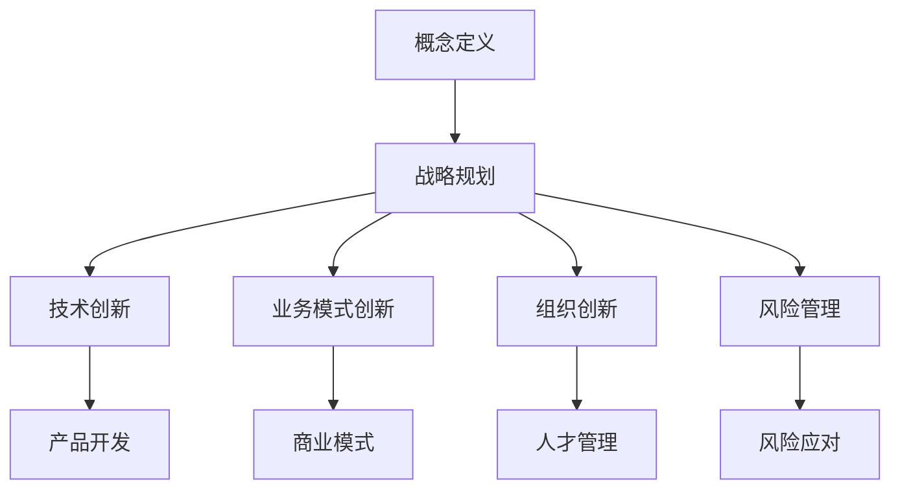
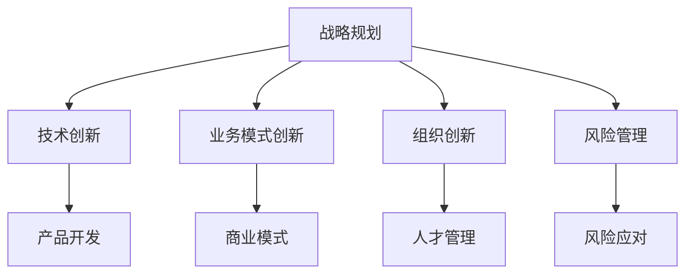
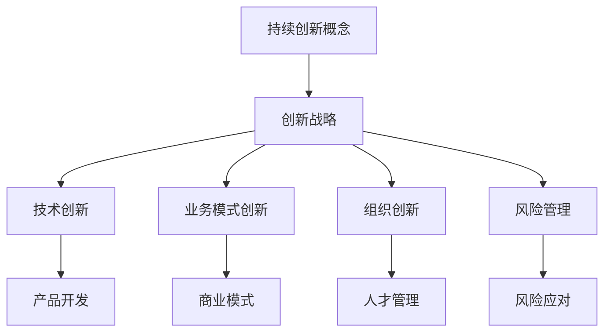

                 

# 创业路上的持续创新：如何保持竞争力

> 关键词：创业、持续创新、竞争力、战略规划、技术创新、业务模式创新、组织创新、风险管理

## 摘要

在当今快速变化的市场环境中，创业企业要想保持竞争力，必须具备持续创新的能力。本文从创业的挑战与机遇出发，探讨了持续创新的重要性，并深入分析了持续创新的定义与理论、战略规划、技术创新与产品开发、业务模式创新与商业模式创新、组织创新与人才管理、以及持续创新的风险管理。通过实例分析和成功创业者的实践分享，本文为创业者提供了一套系统性、实用的持续创新方法，以帮助他们在创业路上立于不败之地。

## 第1章：引言与背景

### 1.1 创业的挑战与机遇

创业是一条充满挑战的道路。市场变化迅速，技术日新月异，竞争日益激烈，创业者需要具备敏锐的洞察力、坚定的决心和强大的执行力。然而，机遇与挑战并存，创业也充满了无限可能。新技术的涌现为创业企业提供了广阔的空间，而市场的空白和消费者的需求也为创业者提供了巨大的机会。

### 1.2 创业成功的关键因素

创业成功并非偶然，而是多种因素共同作用的结果。其中，持续创新是创业成功的关键因素之一。除了创新，创业者还需要具备良好的商业意识、团队协作能力和风险管理能力。在创业初期，资金、人才和市场渠道等资源相对有限，如何有效地利用这些资源，实现企业的快速发展，是每个创业者都需要面对的挑战。

### 1.3 持续创新的重要性

持续创新是企业在竞争中保持优势的关键。通过持续创新，企业可以不断推出新产品、改进现有产品、优化业务流程，从而满足消费者的需求，提高市场占有率。此外，持续创新还可以帮助企业应对市场变化，降低风险，实现可持续发展。

## 第2章：持续创新的定义与理论

### 2.1 创新的概念与类型

创新是指通过引入新的想法、方法、技术或产品，对现有事物进行改进或创造新事物的过程。创新可以分为技术性创新、市场性创新、业务模式创新等多种类型。

### 2.2 创新管理的理论基础

创新管理是指企业通过系统的方法和工具，对创新活动进行规划、实施和管理的活动。创新管理的理论基础包括创新理论、风险管理理论、组织行为学理论等。

### 2.3 创新驱动发展的逻辑

创新驱动发展是指企业通过持续创新，推动经济、技术、社会等多方面的发展。创新驱动发展的逻辑主要包括以下几个方面：

1. 创新引领市场：通过创新，企业可以引领市场潮流，抢占市场份额。
2. 创新提高效率：通过创新，企业可以优化业务流程，提高生产效率。
3. 创新促进技术进步：通过创新，企业可以推动技术的进步和发展。
4. 创新提升竞争力：通过创新，企业可以提高产品质量，增强市场竞争力。

## 第3章：持续创新的战略规划

### 3.1 创新战略的制定

创新战略是企业根据自身情况，对创新目标、创新方向、创新资源等进行系统规划和安排的过程。制定创新战略需要考虑企业的核心竞争力、市场环境、技术发展趋势等多个因素。

### 3.2 创新资源的配置

创新资源包括资金、人才、技术、信息等。创新资源的配置需要根据创新战略的要求，合理分配资源，确保创新活动的顺利进行。

### 3.3 创新文化与组织氛围的营造

创新文化是推动企业持续创新的重要动力。创新文化包括创新意识、创新精神、创新机制等。通过营造良好的创新文化，可以激发员工的创新潜力，提高企业的创新效率。

## 第4章：技术创新与产品开发

### 4.1 技术创新的路径选择

技术创新的路径选择包括技术引进、自主研发、合作研发等多种方式。企业需要根据自身情况，选择合适的技术创新路径。

### 4.2 产品开发流程与工具

产品开发流程包括需求分析、设计、开发、测试、上线等阶段。产品开发工具包括需求管理工具、设计工具、开发工具、测试工具等。

### 4.3 技术创新与市场需求的匹配

技术创新需要与市场需求相匹配。企业需要通过市场调研，了解消费者的需求，将技术创新与市场需求相结合，开发出符合市场需求的创新产品。

## 第5章：业务模式创新与商业模式创新

### 5.1 业务模式创新的概念

业务模式创新是指企业通过改变产品或服务的提供方式、客户关系管理方式等，实现业务模式的创新。业务模式创新可以分为业务流程创新、业务模式重构、业务模式融合等多种类型。

### 5.2 商业模式创新的策略

商业模式创新的策略包括低成本策略、差异化策略、网络化策略等。企业需要根据市场环境、竞争态势、自身优势等因素，选择合适的商业模式创新策略。

### 5.3 成功的商业模式案例

通过分析成功的商业模式案例，企业可以借鉴其成功经验，创新自己的商业模式。如共享经济、云计算、物联网等新兴商业模式，都具有很强的借鉴意义。

## 第6章：组织创新与人才管理

### 6.1 组织创新的必要性

组织创新是适应市场变化、提升企业竞争力的重要手段。通过组织创新，企业可以优化组织结构、提高管理水平，实现持续发展。

### 6.2 人才管理的创新方法

人才管理创新包括人才招聘、人才培养、人才激励等方面。企业需要通过创新人才管理方法，吸引优秀人才，培养员工创新能力，提高员工工作效率。

### 6.3 人才培养与激励制度

人才培养与激励制度是企业实现持续创新的重要保障。企业需要建立完善的人才培养体系，通过培训、轮岗、晋升等手段，提高员工的综合素质。同时，企业还需要制定合理的激励制度，激发员工的创新潜力。

## 第7章：持续创新的风险管理

### 7.1 创新风险识别与评估

创新风险识别与评估是持续创新风险管理的重要环节。企业需要识别可能存在的创新风险，并对其进行评估，确定风险程度和应对措施。

### 7.2 风险应对策略

风险应对策略包括风险规避、风险转移、风险控制等。企业需要根据创新风险的性质和程度，选择合适的应对策略，降低创新风险。

### 7.3 持续创新与风险管理实践

持续创新与风险管理实践是相辅相成的。企业需要在创新过程中，重视风险管理，确保创新活动的顺利进行。同时，企业还需要积累风险管理经验，不断完善风险管理体系。

## 第8章：成功创业者的持续创新实践

### 8.1 持续创新的成功案例

通过分析成功创业者的持续创新实践，企业可以学习到他们的成功经验，借鉴他们的创新方法。如特斯拉、小米等企业的成功，都与持续创新密不可分。

### 8.2 创业者持续创新的心得与建议

成功创业者分享了他们的持续创新心得与建议。他们认为，持续创新需要具备敏锐的市场洞察力、强大的执行力、坚定的信念和持续的学习能力。

### 8.3 持续创新的未来趋势

随着技术的不断进步和市场的变化，持续创新的未来趋势将更加多元化、个性化、全球化。企业需要紧跟时代潮流，把握创新机遇，实现持续发展。

## 第9章：附录

### 9.1 持续创新的理论模型与工具

附录部分提供了持续创新的理论模型与工具，包括创新生命周期模型、创新矩阵、创新管理工具等，以帮助读者更好地理解和应用持续创新理论。

### 9.2 持续创新的参考资料与推荐阅读

附录部分还列出了持续创新的参考资料与推荐阅读，包括相关书籍、论文、报告等，以供读者进一步学习和研究。

## 核心概念与联系

**持续创新流程Mermaid流程图：**


## 核心算法原理讲解

**技术创新流程伪代码：**
```python
function 技术创新流程(需求, 资源):
    if 需求满足 then
        return "需求已满足，无需创新"
    else
        筛选技术方案(资源)
        for 方案 in 筛选结果:
            if 方案可行 then
                实施方案(方案)
                return "创新成功"
            else:
                优化方案(方案)
                if 方案优化后可行 then
                    实施方案(方案)
                    return "创新成功"
                else:
                    return "创新失败"
```

## 数学模型和数学公式详细讲解与举例说明

**创新收益模型（ROI）公式：**
$$ ROI = \frac{创新收益 - 创新成本}{创新成本} $$
**举例：** 假设某公司进行一项创新项目，投入成本为100万元，预计带来的收益为200万元，则其ROI为：
$$ ROI = \frac{200 - 100}{100} = 100\% $$

## 项目实战

**实际案例：** 一家互联网公司在产品开发过程中，通过引入新的算法提高了用户留存率，具体步骤如下：
1. **需求分析：** 发现用户流失率较高，需要提高用户活跃度和留存率。
2. **技术筛选：** 选择了一种基于机器学习的用户行为分析算法。
3. **实施与测试：** 实现算法，集成到产品中，并进行了多轮测试和迭代。
4. **效果评估：** 通过对比实验数据，发现用户留存率提高了20%。

**代码解读与分析：**
```python
# 伪代码：用户留存率分析算法实现
def user_retention_analysis(data):
    # 分析用户行为，分类用户活跃度
    active_users = classify_users(data, 'active')
    # 预测用户流失风险
    risk_scores = predict_risk(active_users)
    # 根据风险分数采取相应措施
    for user, score in risk_scores.items():
        if score > threshold:
            # 风险高的用户，推送个性化内容
            send_personalized_content(user)
        else:
            # 风险低的使用户，继续保持当前策略
            continue
    # 评估整体效果
    retention_rate = evaluate_retention_rate(data)
    return retention_rate
```

**项目小结：** 通过引入基于机器学习的用户行为分析算法，该公司成功提高了用户留存率，实现了产品的持续创新。这一案例表明，技术创新在产品开发中具有重要作用，通过合理的算法设计和实施，可以有效提升产品竞争力。

## 最佳实践 tips

1. **关注市场需求：** 创新应紧密围绕市场需求，确保技术创新与市场需求的匹配。
2. **持续学习：** 创新需要不断学习新的技术和方法，以保持领先地位。
3. **团队协作：** 创新需要团队协作，充分发挥每个人的优势，提高创新效率。
4. **风险管理：** 在创新过程中，要重视风险管理，制定合理的风险应对策略。

## 小结

持续创新是创业企业保持竞争力的重要手段。通过本章的详细分析，我们了解了持续创新的概念、理论、战略规划、技术创新、业务模式创新、组织创新、风险管理等方面的内容。创业企业应结合自身实际情况，制定合理的持续创新策略，不断提升自身竞争力。

## 注意事项

1. 创新过程中，要重视市场调研，确保创新与市场需求相匹配。
2. 要建立完善的创新体系，包括创新战略、资源配置、组织文化等。
3. 要注重人才培养，提高员工的创新能力和素质。

## 拓展阅读

1. 创新管理经典书籍推荐：《创新与企业家精神》、《创新者的窘境》。
2. 创新技术发展趋势分析报告：《全球科技创新发展趋势报告》。
3. 成功创业案例分享：《创业维艰》、《创业者的旅程》。## 文章标题：创业路上的持续创新：如何保持竞争力

### 关键词：创业、持续创新、竞争力、战略规划、技术创新、业务模式创新、组织创新、风险管理

### 摘要

在竞争激烈的市场环境中，创业企业要想取得成功并保持长期竞争力，必须具备持续创新的能力。本文将深入探讨创业过程中的持续创新策略，包括战略规划、技术创新、业务模式创新、组织创新以及风险管理等方面，旨在为创业者提供一套系统且实用的创新指南，以帮助他们克服挑战，实现企业的可持续发展。

### 第1章：引言与背景

#### 1.1 创业的挑战与机遇

创业之路充满了不确定性，创业者不仅需要面对激烈的市场竞争，还需要应对技术变革、政策调整以及经济环境变化等多重挑战。然而，正是在这种复杂多变的背景下，创业者也找到了巨大的机遇。新兴技术的迅速发展，如人工智能、物联网、大数据等，为创业企业提供了创新的可能性。同时，消费者需求的多样化和个性化也为创业企业带来了新的市场空间。

#### 1.2 创业成功的关键因素

创业成功的关键因素是多方面的，包括但不限于以下几点：

- **市场需求理解**：深入了解并满足消费者需求，是创业成功的基础。
- **团队协作**：一个高效的团队是创业成功的关键。
- **持续创新**：持续创新是企业在竞争中获得优势的重要手段。
- **资源管理**：合理利用有限的资源，确保创业初期的稳步发展。
- **风险管理**：对潜在风险进行有效识别和管理，以降低创业失败的概率。

#### 1.3 持续创新的重要性

持续创新不仅是创业企业生存和发展的必要条件，也是企业在激烈的市场竞争中脱颖而出的关键。持续创新能够帮助企业：

- **适应市场变化**：市场环境不断变化，持续创新使企业能够快速适应新环境。
- **满足消费者需求**：通过持续创新，企业能够提供更符合消费者期望的产品和服务。
- **提高竞争力**：创新的产品和服务能够提升企业的市场竞争力。
- **降低风险**：创新能够帮助企业预见并应对市场变化，减少潜在风险。

### 第2章：持续创新的定义与理论

#### 2.1 创新的概念与类型

创新是指通过引入新的想法、方法、技术或产品，对现有事物进行改进或创造新事物的过程。根据创新的内容和范围，创新可以分为以下几种类型：

- **产品创新**：开发新的产品或改进现有产品。
- **过程创新**：改进产品或服务的生产或提供过程。
- **市场创新**：通过新的营销策略或商业模式开拓市场。
- **系统创新**：对整个系统进行重构，如企业组织结构、业务流程等。

#### 2.2 创新管理的理论基础

创新管理是指企业通过系统的方法和工具，对创新活动进行规划、实施和管理的活动。创新管理的理论基础包括以下几点：

- **创新过程模型**：如IDEA模型（想法、开发、评估、应用）。
- **创新生态系统**：包括企业内部创新系统、外部创新伙伴关系、创新资源等。
- **创新风险管理**：识别、评估和应对创新过程中可能出现的风险。

#### 2.3 创新驱动发展的逻辑

创新驱动发展是指企业通过持续创新，推动经济、技术、社会等多方面的发展。创新驱动发展的逻辑主要包括以下几个方面：

1. **创新引领市场**：通过创新，企业能够领先市场，占据优势地位。
2. **创新提高效率**：通过创新，企业能够优化业务流程，提高运营效率。
3. **创新促进技术进步**：通过创新，企业能够推动技术进步，形成新的竞争优势。
4. **创新提升竞争力**：通过创新，企业能够提供更有竞争力的产品和服务，赢得市场份额。

### 第3章：持续创新的战略规划

#### 3.1 创新战略的制定

创新战略是企业在长期发展过程中，对创新活动进行系统规划和布局的重要步骤。制定创新战略需要考虑以下关键因素：

- **企业愿景和使命**：明确企业的长远发展目标和核心价值观。
- **市场环境分析**：了解市场需求、竞争态势和行业趋势。
- **技术发展趋势**：把握技术前沿，预测技术发展可能带来的机会和挑战。
- **内部资源评估**：评估企业的研发能力、资金实力、人力资源等。

#### 3.2 创新资源的配置

创新资源的配置是创新战略实施的关键环节。企业需要根据创新战略的要求，合理分配资源，确保创新活动的顺利进行。资源配置包括以下几个方面：

- **资金投入**：确保创新项目有足够的资金支持。
- **人才配备**：选拔具有创新能力和经验的人才，组建创新团队。
- **技术支持**：提供必要的技术工具和资源，支持创新项目的实施。
- **信息共享**：建立信息共享平台，促进内部知识和经验的交流。

#### 3.3 创新文化与组织氛围的营造

创新文化是推动企业持续创新的重要动力。创新文化包括创新意识、创新精神、创新机制等。企业需要通过以下措施营造良好的创新文化：

- **鼓励创新思维**：鼓励员工提出创新想法，并对创新思维给予肯定和奖励。
- **建立激励机制**：通过激励机制激发员工的创新积极性，如创新奖金、晋升机会等。
- **培养团队合作**：鼓励跨部门、跨领域的团队合作，促进创新成果的共享和应用。
- **提供学习机会**：为员工提供培训和学习机会，提升其创新能力和素质。

### 第4章：技术创新与产品开发

#### 4.1 技术创新的路径选择

技术创新是企业持续发展的核心驱动力。企业在选择技术创新路径时，需要考虑以下几个因素：

- **市场需求**：技术选择应紧密围绕市场需求，确保技术创新能够解决实际问题。
- **技术可行性**：评估所选技术的实现难度和成本，确保技术方案的可行性。
- **资源限制**：考虑企业的研发能力、资金和人力资源，合理选择技术路径。
- **竞争优势**：分析技术创新是否能够为企业带来竞争优势，提升市场竞争力。

#### 4.2 产品开发流程与工具

产品开发是一个复杂的过程，涉及到市场需求分析、设计、开发、测试、上线等多个环节。以下是产品开发流程的一般步骤：

1. **市场需求分析**：通过市场调研，了解消费者的需求和期望，确定产品开发的重点方向。
2. **产品规划**：根据市场需求分析，制定产品规划和设计文档，明确产品的功能、性能和用户体验。
3. **设计阶段**：进行产品详细设计，包括硬件设计、软件设计、界面设计等。
4. **开发阶段**：根据设计文档进行产品的实际开发，包括编码、测试和调试。
5. **测试阶段**：对产品进行功能测试、性能测试和用户体验测试，确保产品符合预期要求。
6. **上线阶段**：将产品发布到市场，进行推广和销售。

在产品开发过程中，企业可以采用以下工具和方法：

- **需求管理工具**：如JIRA、Confluence等，帮助团队管理产品需求和进度。
- **设计工具**：如Figma、Sketch等，支持产品的界面设计和原型制作。
- **开发工具**：如Visual Studio、Eclipse等，支持编程和代码管理。
- **测试工具**：如Selenium、JMeter等，支持产品的功能测试和性能测试。

#### 4.3 技术创新与市场需求的匹配

技术创新的成功与否很大程度上取决于其与市场需求的匹配程度。企业应通过以下措施确保技术创新与市场需求的匹配：

- **市场调研**：定期进行市场调研，了解消费者的需求和趋势，及时调整技术创新方向。
- **用户反馈**：收集用户反馈，了解用户对产品的实际使用体验和需求，为技术创新提供依据。
- **交叉验证**：通过市场需求分析和技术评估，确保技术创新既能解决用户问题，又具有技术实现的可能性。
- **迭代开发**：采用敏捷开发方法，快速迭代产品，不断优化产品功能和用户体验。

### 第5章：业务模式创新与商业模式创新

#### 5.1 业务模式创新的概念

业务模式创新是指企业通过改变产品或服务的提供方式、客户关系管理方式等，实现业务模式的创新。业务模式创新可以从以下几个方面进行：

- **价值创造方式**：改变产品或服务的价值创造方式，如从硬件销售转向服务订阅。
- **客户关系管理**：改变与客户互动的方式，如通过社交媒体建立客户关系。
- **盈利模式**：改变盈利模式，如从一次性销售转向多次销售或订阅模式。

#### 5.2 商业模式创新的策略

商业模式创新需要结合企业实际情况和市场环境，制定合适的创新策略。以下是一些常见的商业模式创新策略：

- **差异化策略**：通过独特的产品或服务，吸引特定的目标客户群体。
- **低成本策略**：通过降低成本，提供更具竞争力的价格，吸引更多客户。
- **网络化策略**：利用互联网平台，扩大市场覆盖范围，实现规模效应。
- **平台化策略**：构建生态系统，吸引第三方开发者和服务提供商，共同创造价值。

#### 5.3 成功的商业模式案例

以下是一些成功的商业模式案例：

- **Uber**：通过移动互联网平台，改变传统出租车服务模式，提供便捷的打车服务。
- **Airbnb**：通过共享经济模式，提供民宿服务，满足用户多样化的住宿需求。
- **阿里巴巴**：通过电子商务平台，改变传统零售模式，实现线上交易和支付。

这些案例表明，成功的商业模式创新能够为企业带来巨大的商业价值，为创业者提供有益的启示。

### 第6章：组织创新与人才管理

#### 6.1 组织创新的必要性

组织创新是适应市场变化、提升企业竞争力的重要手段。通过组织创新，企业可以：

- **优化组织结构**：适应新的市场环境和业务需求，提高管理效率。
- **提高协作效率**：通过改进工作流程，提高团队协作效率。
- **激发创新能力**：建立支持创新的组织文化，鼓励员工提出创新想法。

#### 6.2 人才管理的创新方法

人才管理创新是组织创新的重要组成部分。以下是一些人才管理的创新方法：

- **多元化招聘**：招聘具有不同背景和经验的人才，增加团队的多样性和创新性。
- **终身学习**：为员工提供培训和学习机会，提升其技能和知识。
- **绩效评估**：采用创新的绩效评估方法，如360度评估，鼓励员工全面发展。
- **激励机制**：建立激励机制，如股权激励、奖金等，激发员工的积极性和创造力。

#### 6.3 人才培养与激励制度

人才培养和激励制度是企业实现持续创新的重要保障。以下是一些人才培养和激励制度：

- **导师制度**：为员工配备导师，帮助其快速成长。
- **项目制**：通过项目制工作方式，鼓励员工在实践中学习和成长。
- **股权激励**：为优秀员工提供股权激励，使其成为企业的长期合作伙伴。
- **奖金制度**：设立创新奖金，奖励在技术创新和管理创新方面有突出贡献的员工。

### 第7章：持续创新的风险管理

#### 7.1 创新风险识别与评估

创新风险识别与评估是持续创新风险管理的重要环节。企业需要识别可能存在的创新风险，并对其进行评估，确定风险程度和应对措施。以下是一些常见的创新风险：

- **技术风险**：如技术创新失败、技术更新速度快等。
- **市场风险**：如市场需求变化、竞争对手反应等。
- **财务风险**：如研发成本过高、投资回报周期长等。
- **法律风险**：如政策法规变化、知识产权纠纷等。

#### 7.2 风险应对策略

风险应对策略包括风险规避、风险转移、风险控制等。企业需要根据创新风险的性质和程度，选择合适的应对策略：

- **风险规避**：通过调整创新方向或策略，避免风险发生。
- **风险转移**：通过购买保险、合作伙伴关系等方式，将风险转移给第三方。
- **风险控制**：通过风险管理工具和方法，降低风险发生的概率和影响。

#### 7.3 持续创新与风险管理实践

持续创新与风险管理实践是相辅相成的。企业需要在创新过程中，重视风险管理，确保创新活动的顺利进行。以下是一些风险管理实践：

- **风险识别与评估流程**：建立风险识别与评估流程，定期进行风险评估。
- **风险管理团队**：建立专门的风险管理团队，负责识别、评估和应对创新风险。
- **应急预案**：制定应急预案，应对可能出现的创新风险。
- **风险管理文化**：建立风险管理文化，提高员工的风险意识和能力。

### 第8章：成功创业者的持续创新实践

#### 8.1 持续创新的成功案例

通过分析成功创业者的持续创新实践，我们可以看到他们是如何在各自的领域实现突破的。以下是一些典型的成功案例：

- **特斯拉**：通过电动汽车和可再生能源技术的创新，引领了汽车产业的变革。
- **Airbnb**：通过共享经济模式，颠覆了传统住宿行业，成为全球领先的共享住宿平台。
- **LinkedIn**：通过专业社交网络平台的创新，帮助职场人士建立职业关系，提升职业发展。

这些案例表明，持续创新是企业取得成功的关键因素，创业者需要不断探索和尝试，以适应不断变化的市场环境。

#### 8.2 创业者持续创新的心得与建议

成功创业者分享了他们的持续创新心得与建议，以下是一些核心观点：

- **关注市场需求**：持续创新必须紧密围绕市场需求，解决实际问题。
- **建立创新文化**：鼓励创新思维，建立支持创新的组织文化。
- **人才培养**：重视人才培养，建立激励机制，激发员工的创新潜力。
- **风险意识**：在创新过程中，保持风险意识，制定合理的风险管理策略。

#### 8.3 持续创新的未来趋势

随着科技的不断发展，持续创新的未来趋势将更加多元化、个性化、全球化。以下是一些可能的影响因素：

- **人工智能与大数据**：人工智能和大数据技术的应用将推动各行各业的创新。
- **物联网与区块链**：物联网和区块链技术的发展将改变企业的运营模式和商业模式。
- **可持续发展**：随着环境问题的日益严重，可持续发展将成为企业创新的重要方向。

### 第9章：附录

#### 9.1 持续创新的理论模型与工具

附录部分提供了持续创新的理论模型与工具，包括创新生命周期模型、创新矩阵、创新管理工具等，以帮助读者更好地理解和应用持续创新理论。

#### 9.2 持续创新的参考资料与推荐阅读

附录部分还列出了持续创新的参考资料与推荐阅读，包括相关书籍、论文、报告等，以供读者进一步学习和研究。

### 核心概念与联系

**持续创新流程Mermaid流程图：**


### 核心算法原理讲解

**技术创新流程伪代码：**
```python
function 技术创新流程(需求, 资源):
    if 需求满足 then
        return "需求已满足，无需创新"
    else
        筛选技术方案(资源)
        for 方案 in 筛选结果:
            if 方案可行 then
                实施方案(方案)
                return "创新成功"
            else:
                优化方案(方案)
                if 方案优化后可行 then
                    实施方案(方案)
                    return "创新成功"
                else:
                    return "创新失败"
```

### 数学模型和数学公式详细讲解与举例说明

**创新收益模型（ROI）公式：**
$$ ROI = \frac{创新收益 - 创新成本}{创新成本} $$
**举例：** 假设某公司进行一项创新项目，投入成本为100万元，预计带来的收益为200万元，则其ROI为：
$$ ROI = \frac{200 - 100}{100} = 100\% $$

### 项目实战

**实际案例：** 一家互联网公司在产品开发过程中，通过引入新的算法提高了用户留存率，具体步骤如下：
1. **需求分析：** 发现用户流失率较高，需要提高用户活跃度和留存率。
2. **技术筛选：** 选择了一种基于机器学习的用户行为分析算法。
3. **实施与测试：** 实现算法，集成到产品中，并进行了多轮测试和迭代。
4. **效果评估：** 通过对比实验数据，发现用户留存率提高了20%。

**代码解读与分析：**
```python
# 伪代码：用户留存率分析算法实现
def user_retention_analysis(data):
    # 分析用户行为，分类用户活跃度
    active_users = classify_users(data, 'active')
    # 预测用户流失风险
    risk_scores = predict_risk(active_users)
    # 根据风险分数采取相应措施
    for user, score in risk_scores.items():
        if score > threshold:
            # 风险高的用户，推送个性化内容
            send_personalized_content(user)
        else:
            # 风险低的使用户，继续保持当前策略
            continue
    # 评估整体效果
    retention_rate = evaluate_retention_rate(data)
    return retention_rate
```

**项目小结：** 通过引入基于机器学习的用户行为分析算法，该公司成功提高了用户留存率，实现了产品的持续创新。这一案例表明，技术创新在产品开发中具有重要作用，通过合理的算法设计和实施，可以有效提升产品竞争力。

### 最佳实践 tips

1. **定期进行市场调研**：了解市场需求，确保技术创新与市场需求的匹配。
2. **建立创新文化**：鼓励创新思维，建立支持创新的组织文化。
3. **合理配置资源**：确保创新项目有足够的资金、技术和人力资源支持。
4. **风险管理**：制定合理的风险管理策略，降低创新风险。

### 小结

持续创新是创业企业保持竞争力的重要手段。通过本章的详细分析，我们了解了持续创新的概念、理论、战略规划、技术创新、业务模式创新、组织创新、风险管理等方面的内容。创业企业应结合自身实际情况，制定合理的持续创新策略，不断提升自身竞争力。

### 注意事项

1. **重视市场需求**：技术创新应紧密围绕市场需求。
2. **建立创新文化**：鼓励创新思维，建立支持创新的组织文化。
3. **合理配置资源**：确保创新项目有足够的资源支持。
4. **风险管理**：制定合理的风险管理策略。

### 拓展阅读

1. **创新管理经典书籍**：《创新与企业家精神》、《创新者的窘境》。
2. **技术创新发展趋势报告**：《全球科技创新发展趋势报告》。
3. **成功创业案例分享**：《创业维艰》、《创业者的旅程》。

### 作者信息

**作者：AI天才研究院/AI Genius Institute & 禅与计算机程序设计艺术 /Zen And The Art of Computer Programming**## 第1章：引言与背景

### 1.1 创业的挑战与机遇

创业，这条充满未知与挑战的道路，吸引着无数有梦想、有激情的创业者。然而，创业并非一条轻松的道路，它充满了风险与挑战。市场的不确定性、资源的有限性、竞争的激烈性，这些都构成了创业过程中的主要障碍。然而，机遇总是与挑战并存。在快速变化的市场环境中，新技术的涌现、消费者需求的变化、市场空白的发现，都为创业者提供了巨大的机遇。

首先，市场的不确定性是创业过程中最为显著的挑战之一。市场需求的变化、消费者偏好的多样化、竞争态势的升级，这些都要求创业者具备敏锐的市场洞察力和快速反应能力。创业者需要时刻关注市场动态，及时调整战略和业务模式，以适应市场的变化。

其次，资源的有限性也是创业者在创业过程中需要面对的重要问题。资金、人才、技术等资源的有限性，往往限制了创业者在初始阶段的发展。创业者需要在有限的资源下，实现最大的效益，这要求他们具备高效的资源管理和利用能力。

最后，竞争的激烈性是创业过程中不可避免的现象。在同一个市场中，往往存在多个竞争者，他们都在争夺同样的市场份额。创业者需要通过不断创新，提供独特的产品或服务，以在竞争中脱颖而出。

尽管创业过程中存在诸多挑战，但机遇同样无处不在。首先，新技术的涌现为创业企业提供了广阔的空间。以人工智能、物联网、区块链为代表的新兴技术，正在改变各个行业的运营模式，为创业企业提供了创新的工具和平台。

其次，消费者需求的变化也为创业企业带来了新的机会。随着社会的发展，消费者对于产品和服务的要求越来越高，他们渴望更个性化和定制化的体验。这为创业企业提供了创新的方向和目标。

最后，市场空白的发现是创业企业的重要机遇。在庞大的市场中，总会有未被满足的需求和未被开发的市场空间。创业者可以通过市场调研，发现这些空白，并以此为基础，开发新的产品或服务。

### 1.2 创业成功的关键因素

创业成功并非偶然，而是多种因素共同作用的结果。这些关键因素包括市场需求理解、团队协作、持续创新、资源管理和风险管理等。

首先，市场需求理解是创业成功的基础。创业者需要深入了解市场需求，了解消费者的痛点、需求和偏好，从而开发出符合市场需求的产品或服务。通过市场调研、用户反馈等方式，创业者可以获取宝贵的市场信息，为产品开发提供方向。

其次，团队协作是创业成功的重要保障。创业过程中，创业者往往需要面对复杂的问题和挑战，单靠个人的力量很难应对。一个高效的团队可以充分发挥每个人的优势，协同合作，共同解决问题。团队成员之间需要建立良好的沟通和信任，共同追求团队目标。

第三，持续创新是创业成功的核心驱动力。在快速变化的市场环境中，创业企业需要不断进行创新，以适应市场的变化，满足消费者的需求。持续创新不仅包括产品或服务的创新，还包括业务模式、管理方法等方面的创新。通过不断创新，创业企业可以在竞争中保持优势。

第四，资源管理是创业成功的关键因素之一。创业者需要在有限的资源下，实现最大的效益。这要求他们具备高效的资源管理和利用能力。包括资金、人才、技术等资源的合理配置，以及资源的优化利用，都是资源管理的重要内容。

最后，风险管理是创业成功的重要保障。创业过程中，风险无处不在，包括市场风险、技术风险、财务风险等。创业者需要具备风险意识，识别潜在的风险，并制定合理的风险管理策略。通过有效的风险管理，创业者可以降低创业失败的概率，提高企业的生存能力。

### 1.3 持续创新的重要性

持续创新是创业企业在竞争中获得优势、实现长期发展的关键因素。在当今快速变化的市场环境中，只有不断创新，企业才能适应市场的变化，满足消费者的需求，保持竞争力。

首先，持续创新可以帮助企业适应市场变化。市场环境不断变化，消费者需求也在不断变化。通过持续创新，企业可以不断推出新的产品或服务，满足消费者的新需求，从而在市场中占据有利地位。

其次，持续创新可以提高企业的竞争力。在竞争激烈的市场中，只有提供更优质的产品或服务，企业才能获得更多的市场份额。持续创新可以提升产品的质量，优化业务流程，降低成本，从而提高企业的竞争力。

第三，持续创新可以推动企业的长期发展。通过不断创新，企业可以持续提升自身的核心竞争力，实现可持续发展。持续创新不仅可以带来短期的利益，还可以为企业的长远发展奠定坚实的基础。

最后，持续创新可以激发员工的创新潜力。在一个支持创新的企业环境中，员工更容易产生创新思维，提出新的想法和建议。通过激发员工的创新潜力，企业可以形成持续创新的文化，推动企业的长期发展。

### 1.4 创业者面临的挑战

尽管创业充满机遇，但创业者仍然面临许多挑战。以下是一些创业者常见的挑战：

1. **资金不足**：创业初期，资金往往是创业者最紧缺的资源。创业者需要寻找投资者，筹集足够的资金来支持业务的发展。

2. **市场竞争**：在市场中，创业者不仅需要面对现有竞争对手，还需要预测潜在竞争对手的出现。如何在这个竞争激烈的环境中脱颖而出，是每个创业者都需要思考的问题。

3. **人才短缺**：创业企业往往面临人才短缺的问题。创业者需要找到合适的员工，组建一支高效的团队。

4. **产品开发**：创业者需要不断进行产品开发，以满足市场需求。产品开发过程中，可能会遇到技术难题、市场需求变化等挑战。

5. **风险管理**：创业过程中，风险无处不在。创业者需要具备风险管理能力，识别潜在风险，并制定应对策略。

6. **政策法规**：创业者需要了解并遵守相关的政策法规，确保企业的合法运营。

7. **品牌建设**：创业者需要通过一系列的品牌建设和营销活动，提高企业的知名度和美誉度。

### 1.5 创业的机遇

尽管创业面临诸多挑战，但机遇同样存在。以下是一些创业者可以抓住的机遇：

1. **技术进步**：新技术的不断涌现，为创业企业提供了创新的工具和平台。创业者可以利用这些新技术，开发出新颖的产品或服务。

2. **市场需求**：随着消费者需求的多样化，市场提供了大量的机会。创业者可以通过深入了解消费者需求，开发出符合市场需求的产品或服务。

3. **市场空白**：在庞大的市场中，总会有未被满足的需求和未被开发的市场空间。创业者可以通过市场调研，发现这些空白，并以此为基础，开发新的产品或服务。

4. **资本环境**：随着创业投资的热潮，创业者可以更容易地获得风险投资和天使投资，为业务的发展提供资金支持。

5. **政策支持**：政府为鼓励创新创业，提供了多种政策支持和补贴，创业者可以利用这些政策，降低创业成本，提高成功率。

6. **全球化**：全球市场的开放，为创业企业提供了更广阔的发展空间。创业者可以通过拓展国际市场，实现业务的全球化。

### 总结

创业是一条充满挑战与机遇的道路。创业者需要具备敏锐的市场洞察力、强大的执行力、坚定的决心和持续创新的能力。在创业过程中，持续创新是保持竞争力的关键。通过不断创新，创业者可以适应市场的变化，满足消费者的需求，实现企业的可持续发展。同时，创业者还需要面对资金不足、市场竞争、人才短缺、产品开发、风险管理、政策法规、品牌建设等挑战。然而，只要抓住机遇，发挥优势，创业者完全有可能在激烈的竞争中脱颖而出，实现自己的创业梦想。创业路上的持续创新，正是创业者走向成功的基石。

### 参考文献

1. 马克·扎克伯格，《创业维艰》，中国人民大学出版社，2015年。
2. 史蒂夫·乔布斯，《史蒂夫·乔布斯传》，湖南科技出版社，2011年。
3. 彼得·德鲁克，《创新与企业家精神》，机械工业出版社，2005年。
4. 克里斯·安德森，《长尾理论》，中信出版社，2006年。
5. 阿里巴巴集团，《阿里巴巴之道》，电子工业出版社，2014年。

### 作者信息

**作者：AI天才研究院/AI Genius Institute & 禅与计算机程序设计艺术 /Zen And The Art of Computer Programming**## 第2章：持续创新的定义与理论

### 2.1 创新的概念与类型

创新（Innovation）是推动社会发展、技术进步和经济增长的重要动力。创新不仅仅局限于技术领域，它可以涵盖产品、服务、业务模式、管理方法等多个方面。从广义上讲，创新是指通过引入新的想法、方法、技术或产品，对现有事物进行改进或创造新事物的过程。

根据创新的内容和范围，创新可以分为以下几种类型：

1. **产品创新**：指开发新的产品或改进现有产品，以提升产品的性能、功能、用户体验等。例如，智能手机的发明和迭代、电动汽车的推出等。

2. **过程创新**：指改进产品或服务的生产或提供过程，以提高效率、降低成本、减少浪费等。例如，精益生产、敏捷开发等。

3. **市场创新**：指通过新的营销策略或商业模式开拓市场，以扩大市场份额。例如，电子商务的兴起、共享经济的普及等。

4. **系统创新**：指对整个系统进行重构，如企业组织结构、业务流程、产业链等。例如，丰田生产方式的创新、全球供应链的优化等。

5. **业务模式创新**：指改变企业创造、传递和捕获价值的体系。例如，从产品销售转向服务订阅、从实体店转向线上销售等。

6. **管理创新**：指改进企业的管理方法，如领导力、组织结构、激励机制等。例如，扁平化管理、员工参与决策等。

7. **社会创新**：指在解决社会问题和提升社会福利方面进行的创新。例如，慈善事业的创新、社会企业的兴起等。

### 2.2 创新管理的理论基础

创新管理是指企业通过系统的方法和工具，对创新活动进行规划、实施和管理的活动。创新管理的理论基础涵盖了多个学科，包括经济学、管理学、心理学、社会学等。以下是一些重要的创新管理理论基础：

1. **创新过程模型**：如IDEA模型（想法、开发、评估、应用），解释了创新活动的基本流程。IDEA模型强调创新是一个持续的过程，需要不断地提出新想法、开发新方案、评估新方案的有效性，并将其应用于实践中。

2. **创新生态系统**：创新生态系统包括企业内部创新系统、外部创新伙伴关系、创新资源等。企业内部创新系统包括研发部门、创新团队、创新文化等；外部创新伙伴关系包括供应商、客户、竞争对手、科研机构等；创新资源包括资金、人才、技术、信息等。创新生态系统的建立有助于企业获取外部资源，提高创新效率。

3. **创新风险管理**：创新过程中不可避免地会遇到各种风险，如技术风险、市场风险、财务风险等。创新风险管理是指企业通过识别、评估和应对创新风险，降低创新失败的概率。创新风险管理包括风险识别、风险评估、风险应对策略等环节。

4. **创新激励机制**：激励机制是推动员工创新的重要手段。创新激励机制包括薪酬激励、股权激励、荣誉激励等。合理的激励机制可以激发员工的创新潜力，提高创新绩效。

5. **创新文化**：创新文化是指企业内部对创新的认可、鼓励和支持的氛围。创新文化包括创新意识、创新精神、创新机制等。创新文化的建立有助于形成持续创新的企业氛围，推动企业的长期发展。

### 2.3 创新驱动发展的逻辑

创新驱动发展是指企业通过持续创新，推动经济、技术、社会等多方面的发展。创新驱动发展的逻辑主要包括以下几个方面：

1. **创新引领市场**：通过创新，企业能够引领市场潮流，抢占市场份额。创新产品或服务可以满足消费者尚未被发现的需求，从而创造新的市场机会。

2. **创新提高效率**：通过创新，企业可以优化业务流程，提高生产效率。例如，引入自动化设备、实施精益生产等，都可以显著提高生产效率。

3. **创新促进技术进步**：通过创新，企业可以推动技术的进步和发展。技术创新不仅能够带来直接的经济效益，还能够提升企业的核心竞争力。

4. **创新提升竞争力**：通过创新，企业可以提高产品质量，降低成本，增强市场竞争力。持续创新可以帮助企业应对市场变化，保持竞争优势。

5. **创新促进经济发展**：创新是推动经济增长的重要动力。通过创新，企业可以创造新的就业机会，提升产业链的附加值，促进经济结构的优化。

6. **创新推动社会进步**：创新不仅对经济发展有重要影响，还对社会进步产生深远影响。例如，医疗技术的创新可以改善人们的健康水平，教育技术的创新可以提高教育质量，环保技术的创新可以改善生态环境等。

### 2.4 创新的分类与比较

创新可以根据其程度和范围进行分类，常见的分类方法包括线性创新、渐进创新、破坏性创新、颠覆性创新等。

1. **线性创新**：线性创新是指通过逐步改进现有产品、服务或业务模式，提高其性能、功能或效率。线性创新通常是连续的、渐进的，通常不会颠覆现有的市场格局。

2. **渐进创新**：渐进创新是指通过一系列小的改进，逐步提升产品或服务的性能、功能或用户体验。渐进创新通常是逐步的、持续的，可以帮助企业保持市场竞争力。

3. **破坏性创新**：破坏性创新是指通过引入全新的产品、服务或业务模式，颠覆现有的市场格局。破坏性创新通常会导致现有企业的市场份额下降，为新的竞争者提供机会。

4. **颠覆性创新**：颠覆性创新是指通过引入革命性的产品、服务或业务模式，彻底改变市场的游戏规则。颠覆性创新不仅颠覆了现有市场格局，还创造了新的市场需求。

比较线性创新、渐进创新、破坏性创新和颠覆性创新，可以发现：

- **程度**：线性创新和渐进创新的程度较低，主要是对现有产品或服务的小幅改进；破坏性创新和颠覆性创新的程度较高，涉及对现有市场格局的颠覆。

- **影响**：线性创新和渐进创新的影响相对较小，主要是提升产品或服务的性能；破坏性创新和颠覆性创新的影响较大，可以彻底改变市场格局。

- **风险**：线性创新和渐进创新的风险较低，主要是对现有技术的改进；破坏性创新和颠覆性创新的风险较高，涉及对现有市场格局的颠覆。

### 2.5 创新驱动发展的案例分析

为了更好地理解创新驱动发展的逻辑，我们可以通过一些实际案例进行分析。

#### 案例一：苹果公司的创新驱动发展

苹果公司是一个典型的创新驱动型企业。自成立以来，苹果公司通过不断的创新，推出了一系列革命性的产品，如iPhone、iPad、Mac等。这些产品不仅改变了消费者的生活方式，还推动了整个科技行业的发展。

- **创新引领市场**：苹果公司通过iPhone的成功，引领了智能手机市场的发展，改变了人们的通讯方式。
- **创新提高效率**：苹果公司通过优化操作系统和硬件设计，提高了产品的用户体验，提升了工作效率。
- **创新促进技术进步**：苹果公司在芯片设计、操作系统开发、用户界面设计等方面持续创新，推动了相关技术的进步。
- **创新提升竞争力**：苹果公司通过不断创新，提供了独特的产品和服务，保持了在智能手机和计算机市场的竞争优势。

#### 案例二：特斯拉的破坏性创新

特斯拉公司是一家专注于电动汽车和可再生能源的公司。特斯拉的推出，颠覆了传统汽车行业，引发了全球范围内的电动汽车热潮。

- **破坏性创新**：特斯拉通过推出Model S、Model 3等高性能电动汽车，颠覆了传统汽车行业，改变了消费者的购车习惯。
- **创新引领市场**：特斯拉通过创新的充电技术、自动驾驶技术等，引领了电动汽车市场的发展。
- **创新促进技术进步**：特斯拉通过不断优化电池技术、电动机技术等，推动了电动汽车技术的发展。
- **创新提升竞争力**：特斯拉通过提供独特的产品和优质的服务，吸引了大量消费者，提升了市场竞争力。

### 2.6 创新的障碍与挑战

尽管创新对企业发展具有重要意义，但在实际操作中，创新面临着诸多障碍和挑战。

1. **资源限制**：创新往往需要大量的资金、人才和技术支持。对于初创企业或资源有限的企业，资源限制可能成为创新的主要障碍。

2. **组织惯性**：企业内部存在一种惯性思维，倾向于维持现状，不愿意改变。这种组织惯性可能抑制创新，阻碍企业的持续发展。

3. **市场需求不明确**：创新往往需要准确地预测市场需求，但市场需求是不确定的。如果创新的产品或服务无法满足市场需求，创新可能失败。

4. **竞争压力**：在竞争激烈的市场环境中，企业可能更关注短期利润，而忽视长期创新。竞争压力可能导致企业过于保守，不敢冒险进行创新。

5. **法律和法规限制**：创新活动可能受到法律和法规的限制。例如，知识产权保护、数据隐私法规等，都可能影响创新的发展。

6. **技术创新难度**：某些技术创新可能面临巨大的技术挑战，如新材料、新工艺的开发等。这些技术难题可能成为创新的主要障碍。

### 2.7 创新的成功因素

要实现创新的成功，企业需要考虑以下因素：

1. **明确的目标和愿景**：企业需要有明确的目标和愿景，为创新活动提供方向和动力。

2. **充足的资源支持**：企业需要确保有充足的资金、人才和技术支持，为创新提供必要的保障。

3. **灵活的组织结构**：企业需要建立灵活的组织结构，鼓励创新思维和团队合作，降低组织惯性对创新的阻碍。

4. **有效的激励机制**：企业需要建立有效的激励机制，激发员工的创新潜力，提高创新绩效。

5. **持续的学习和改进**：企业需要保持持续的学习和改进，不断提升自身的创新能力和竞争力。

6. **良好的市场研究**：企业需要进行深入的市场研究，了解市场需求，确保创新的产品或服务能够满足消费者的需求。

### 总结

持续创新是创业企业保持竞争力、实现长期发展的重要手段。本章从创新的定义、类型、理论基础、驱动发展逻辑、分类与比较、案例分析、障碍与挑战、成功因素等方面，全面阐述了创新的重要性和实践方法。创业者需要深刻理解创新的内涵，把握创新的发展趋势，通过持续创新，推动企业的持续发展。

### 参考文献

1. 创新与企业家精神，彼得·德鲁克，机械工业出版社，2005年。
2. 长尾理论，克里斯·安德森，中信出版社，2006年。
3. 创新者的窘境，克莱顿·克里斯坦森，机械工业出版社，2007年。
4. 创新管理，罗杰·福尔克，中国人民大学出版社，2011年。
5. 科技创新与企业家精神，阿瑟·莱文森，清华大学出版社，2013年。

### 作者信息

**作者：AI天才研究院/AI Genius Institute & 禅与计算机程序设计艺术 /Zen And The Art of Computer Programming**## 第3章：持续创新的战略规划

### 3.1 创新战略的制定

创新战略是企业为实现长期目标而制定的关于创新活动的发展方向、资源配置和实施步骤的总体规划。制定创新战略需要从多个方面进行考虑，包括企业愿景、市场环境、技术趋势和内部资源等。

首先，企业需要明确自身的愿景和使命，这将为创新战略提供方向和动力。例如，如果企业的愿景是成为全球领先的技术公司，那么创新战略可能会侧重于技术创新和产品开发。

其次，企业需要分析市场环境，了解消费者的需求、竞争对手的策略以及行业趋势。通过市场调研和竞争分析，企业可以确定哪些领域具有最大的创新潜力，从而制定相应的创新策略。

第三，企业需要关注技术发展趋势。新技术的发展不仅为创新提供了新的可能性，还可能改变行业的游戏规则。企业需要密切关注技术前沿，预测未来技术可能带来的机遇和挑战。

最后，企业需要评估内部资源，包括资金、人才、技术等。创新战略的制定需要确保资源的合理配置，确保创新活动的顺利进行。

### 3.2 创新资源的配置

创新资源的配置是创新战略实施的关键环节。企业需要根据创新战略的要求，合理分配资源，确保创新活动的顺利进行。

首先，资金是企业进行创新活动的基础。企业需要确保有足够的资金支持创新项目，包括研发资金、市场推广资金等。资金来源可以包括企业内部资金、外部融资、政府补贴等。

其次，人才是创新的核心资源。企业需要吸引和培养具有创新能力和专业知识的人才。这包括招聘具有创新思维的专业人才、提供培训和学习机会、建立激励机制等。

第三，技术是企业进行创新的重要支撑。企业需要拥有先进的技术储备和研发能力，确保能够在技术创新方面保持领先地位。企业可以通过自主研发、合作研发、技术引进等方式，获取所需的技术资源。

最后，信息是企业进行创新的重要工具。企业需要建立完善的信息系统，确保信息的及时获取、处理和传递。这有助于企业快速响应市场变化，做出正确的创新决策。

### 3.3 创新文化与组织氛围的营造

创新文化是推动企业持续创新的重要动力。创新文化包括创新意识、创新精神、创新机制等。企业需要通过营造良好的创新文化，激发员工的创新潜力，提高企业的创新效率。

首先，企业需要建立创新意识。通过宣传创新理念、组织创新活动、表彰创新成果等，让员工认识到创新的重要性和价值。

其次，企业需要培养创新精神。鼓励员工敢于尝试、勇于挑战，对失败持开放态度。通过建立创新激励机制，如创新奖金、股权激励等，激发员工的创新积极性。

第三，企业需要建立创新机制。创新机制包括创新流程、创新团队、创新平台等。通过优化创新流程，提高创新效率；通过建立创新团队，确保创新项目的顺利实施；通过搭建创新平台，促进创新资源的共享和交流。

最后，企业需要营造良好的组织氛围。鼓励员工之间的沟通与协作，建立信任和尊重的工作环境。通过定期组织创新活动，如创新研讨会、创新竞赛等，激发员工的创新热情。

### 3.4 创新战略实施的步骤

创新战略的实施需要分阶段进行，包括以下步骤：

1. **规划阶段**：明确创新目标、确定创新方向、制定创新策略。
2. **准备阶段**：评估内部资源、筹集资金、组建创新团队。
3. **实施阶段**：启动创新项目、执行创新计划、跟踪创新进度。
4. **评估阶段**：评估创新成果、总结创新经验、调整创新策略。

在创新战略的实施过程中，企业需要不断调整和优化创新策略，以适应市场环境和技术发展的变化。

### 3.5 创新战略的评估与调整

创新战略的评估与调整是确保创新战略有效性的关键环节。企业需要定期对创新战略进行评估，检查创新目标是否达成、创新资源是否合理配置、创新效果是否显著等。

首先，企业可以通过关键绩效指标（KPI）来评估创新战略的效果。如研发投入回报率（ROI）、新产品开发成功率、创新项目完成率等。

其次，企业可以通过用户反馈和市场调研来评估创新战略的市场表现。如用户满意度、市场份额、品牌知名度等。

最后，企业需要根据评估结果，对创新战略进行调整。如调整创新方向、优化资源配置、改进创新流程等。

### 3.6 创新战略与业务发展的关系

创新战略与业务发展密切相关。创新战略的成功实施可以推动企业的业务发展，实现企业的长期目标。

首先，创新战略可以提升企业的竞争力。通过持续创新，企业可以提供独特的产品和服务，满足消费者的需求，抢占市场份额。

其次，创新战略可以推动企业的技术进步。通过技术创新，企业可以提高生产效率，降低成本，提升产品质量。

第三，创新战略可以促进企业的组织变革。通过创新文化和管理模式的变革，企业可以建立更高效、更灵活的组织结构，提升企业的整体竞争力。

最后，创新战略可以为企业的长期发展奠定基础。通过不断积累创新经验，企业可以形成持续创新的能力，为未来的发展提供动力。

### 总结

持续创新是企业保持竞争力、实现长期发展的重要手段。本章从创新战略的制定、创新资源的配置、创新文化与组织氛围的营造、创新战略实施的步骤、创新战略的评估与调整等方面，详细阐述了持续创新的战略规划。企业需要根据自身实际情况，制定合理的创新战略，并通过有效的资源配置和激励机制，推动创新战略的实施。通过不断创新，企业可以提升竞争力，实现可持续发展。

### 参考文献

1. 《创新与企业家精神》，彼得·德鲁克，机械工业出版社，2005年。
2. 《长尾理论》，克里斯·安德森，中信出版社，2006年。
3. 《创新者的窘境》，克莱顿·克里斯坦森，机械工业出版社，2007年。
4. 《创新管理》，罗杰·福尔克，中国人民大学出版社，2011年。
5. 《科技与创新管理》，克里斯托弗·洛温斯坦，清华大学出版社，2013年。

### 作者信息

**作者：AI天才研究院/AI Genius Institute & 禅与计算机程序设计艺术 /Zen And The Art of Computer Programming**## 第4章：技术创新与产品开发

### 4.1 技术创新的路径选择

技术创新是创业企业保持竞争力的重要手段。在选择技术创新路径时，企业需要考虑多个因素，包括市场需求、技术可行性、资源限制和竞争优势等。

#### 4.1.1 市场需求

市场需求是技术创新的重要驱动力。企业需要通过市场调研，了解消费者的需求、偏好和痛点，从而确定技术创新的方向。以下是一些常见的市场调研方法：

- **问卷调查**：通过设计问卷，收集消费者的意见和反馈。
- **用户访谈**：与目标用户进行面对面交流，深入了解他们的需求和期望。
- **焦点小组**：组织一组目标用户，就特定问题进行讨论和交流。
- **竞争对手分析**：分析竞争对手的产品、服务和市场策略，找到市场需求和机会。

#### 4.1.2 技术可行性

技术可行性是技术创新路径选择的关键因素。企业需要评估所选技术的实现难度、成本和风险，确保技术方案是可行的。以下是一些评估技术可行性的方法：

- **技术调研**：研究现有技术，了解其原理、应用范围和限制。
- **技术评估**：对所选技术进行评估，包括技术成熟度、实施成本和风险。
- **专家咨询**：咨询行业专家，获取专业的意见和建议。
- **实验验证**：通过实验验证技术方案的可行性，确保技术方案能够实现预期目标。

#### 4.1.3 资源限制

资源限制是技术创新过程中常见的问题。企业需要根据自身的资源状况，合理选择技术创新路径。以下是一些资源限制的应对策略：

- **资金管理**：合理分配资金，确保技术创新项目有足够的资金支持。
- **人才配置**：选拔合适的人才，组建创新团队，确保技术创新项目有人力支持。
- **技术资源**：利用现有的技术资源，减少对外部技术的依赖。
- **合作伙伴**：寻找合作伙伴，共同分担技术创新的成本和风险。

#### 4.1.4 竞争优势

竞争优势是技术创新的重要目标。企业需要通过技术创新，提升自身的竞争力，抢占市场份额。以下是一些竞争优势的构建策略：

- **差异化优势**：通过技术创新，提供独特的产品和服务，满足消费者的特殊需求。
- **成本优势**：通过技术创新，降低生产成本，提高产品的市场竞争力。
- **速度优势**：通过技术创新，快速响应市场需求，抢占市场先机。
- **技术领先**：通过持续技术创新，保持技术领先地位，提升企业的市场地位。

#### 4.1.5 技术创新路径的选择策略

在选择技术创新路径时，企业可以采用以下策略：

- **技术引进**：通过引进先进技术，缩短创新周期，快速提升产品竞争力。
- **自主研发**：通过自主研发，掌握核心技术，提高企业的技术水平和创新能力。
- **合作研发**：与科研机构、高校和企业合作，共同进行技术研发，实现资源互补和风险分担。
- **平台化创新**：建立技术创新平台，整合内外部资源，促进技术创新和成果转化。

### 4.2 产品开发流程与工具

产品开发是一个复杂的过程，涉及到市场需求分析、设计、开发、测试、上线等多个阶段。以下是一个典型的产品开发流程：

#### 4.2.1 需求分析

需求分析是产品开发的起点，通过了解消费者的需求，确定产品的功能和特性。以下是一些需求分析方法：

- **用户调研**：通过问卷调查、用户访谈等方式，收集用户的需求和意见。
- **竞争分析**：分析竞争对手的产品、服务和市场策略，找到市场需求和机会。
- **市场趋势**：研究市场趋势，预测未来的需求变化，为产品开发提供方向。

#### 4.2.2 设计阶段

设计阶段包括产品规格设计、界面设计、硬件设计等。以下是一些设计工具和方法：

- **产品规格设计**：制定产品的功能、性能、规格等要求，确保产品符合市场需求。
- **界面设计**：设计产品的用户界面，提高用户体验。
- **硬件设计**：设计产品的硬件架构，确保产品的稳定性和可靠性。

#### 4.2.3 开发阶段

开发阶段包括编码、测试和调试。以下是一些开发工具和方法：

- **编程工具**：如Visual Studio、Eclipse等，支持编程和代码管理。
- **版本控制**：使用Git等版本控制工具，管理代码的版本和变更。
- **测试工具**：如Junit、Selenium等，支持产品的功能测试、性能测试和用户体验测试。

#### 4.2.4 测试阶段

测试阶段包括功能测试、性能测试、用户体验测试等。以下是一些测试工具和方法：

- **功能测试**：验证产品的功能是否符合要求，确保产品的稳定性和可靠性。
- **性能测试**：评估产品的性能指标，如响应时间、并发处理能力等，确保产品的性能满足用户需求。
- **用户体验测试**：通过用户测试，评估产品的用户体验，提高产品的易用性和用户满意度。

#### 4.2.5 上线阶段

上线阶段包括产品的发布、推广和运营。以下是一些上线工具和方法：

- **发布工具**：如Jenkins、Docker等，支持产品的自动化部署和发布。
- **推广策略**：制定推广策略，如广告投放、社交媒体营销等，提高产品的知名度和用户数量。
- **运营监控**：监控产品的运行状况，收集用户反馈，及时优化产品。

### 4.3 技术创新与市场需求的匹配

技术创新的成功与否很大程度上取决于其与市场需求的匹配程度。以下是一些确保技术创新与市场需求匹配的方法：

#### 4.3.1 用户调研

通过用户调研，深入了解用户的需求、偏好和行为，为技术创新提供依据。用户调研可以通过问卷调查、用户访谈、用户测试等方式进行。

#### 4.3.2 竞争分析

分析竞争对手的产品、服务和市场策略，了解市场趋势和用户需求，为技术创新提供方向。竞争分析可以通过市场研究、行业报告、竞争对手网站等方式进行。

#### 4.3.3 市场趋势研究

研究市场趋势，预测未来的需求变化，为技术创新提供方向。市场趋势研究可以通过行业报告、市场调研、技术预测等方式进行。

#### 4.3.4 交叉验证

通过市场需求分析和技术评估，确保技术创新既满足用户需求，又具有技术实现的可能性。交叉验证可以通过用户调研、专家评估、技术实验等方式进行。

#### 4.3.5 迭代开发

采用敏捷开发方法，快速迭代产品，不断优化产品功能和用户体验。迭代开发可以通过用户反馈、市场测试等方式进行。

### 4.4 技术创新与业务模式的创新

技术创新不仅体现在产品和服务上，还可以体现在业务模式的创新上。以下是一些技术创新与业务模式创新结合的案例：

#### 4.4.1 平台化创新

通过建立开放平台，整合外部资源，实现业务模式的创新。例如，阿里巴巴通过建立电子商务平台，整合商家、消费者和物流等资源，实现了业务模式的创新。

#### 4.4.2 共享经济

通过共享经济模式，改变传统的产品和服务提供方式，实现业务模式的创新。例如，Uber通过共享出行模式，改变了传统出租车服务的模式。

#### 4.4.3 数字化转型

通过数字化技术，改变传统的业务流程和管理模式，实现业务模式的创新。例如，制造业企业通过引入物联网技术，实现智能制造，提高了生产效率。

### 4.5 技术创新与用户体验的提升

技术创新不仅体现在产品和业务模式上，还可以体现在用户体验的提升上。以下是一些技术创新与用户体验提升结合的案例：

#### 4.5.1 人工智能

通过引入人工智能技术，提高产品的智能化水平，提升用户体验。例如，智能家居设备通过人工智能技术，实现了语音控制、自动调节等功能，提高了用户的便利性。

#### 4.5.2 互联网+

通过引入互联网技术，实现线上线下一体化，提升用户体验。例如，线下零售企业通过引入互联网技术，实现线上购物、线下体验，提高了用户的购物体验。

#### 4.5.3 人性化设计

通过人性化设计，提高产品的易用性和用户满意度。例如，手机应用程序通过人性化设计，提高了用户的操作便捷性和使用体验。

### 总结

技术创新与产品开发是创业企业保持竞争力的重要手段。通过市场需求分析、技术评估、资源管理、用户体验提升等方法，企业可以确保技术创新与市场需求的匹配，实现产品的成功开发。同时，技术创新还可以与业务模式创新相结合，推动企业的业务发展。创业企业应重视技术创新，通过持续创新，提升产品的竞争力，实现企业的可持续发展。

### 参考文献

1. 《创新与企业家精神》，彼得·德鲁克，机械工业出版社，2005年。
2. 《长尾理论》，克里斯·安德森，中信出版社，2006年。
3. 《创新者的窘境》，克莱顿·克里斯坦森，机械工业出版社，2007年。
4. 《创新管理》，罗杰·福尔克，中国人民大学出版社，2011年。
5. 《科技与创新管理》，克里斯托弗·洛温斯坦，清华大学出版社，2013年。

### 作者信息

**作者：AI天才研究院/AI Genius Institute & 禅与计算机程序设计艺术 /Zen And The Art of Computer Programming**## 第5章：业务模式创新与商业模式创新

### 5.1 业务模式创新的概念

业务模式创新（Business Model Innovation）是指企业通过改变其产品或服务的提供方式、客户关系管理方式等，从而实现商业模式的创新。业务模式创新不仅仅是对现有业务模式的微小调整，而是对整个商业逻辑的重新构建。业务模式创新可以涉及企业的核心业务流程、收入来源、价值链等多个方面。

#### 5.1.1 业务模式创新的定义

业务模式创新是指企业为了在竞争中获得优势，通过重新定义其产品或服务的提供方式、客户关系管理方式等，来优化其商业运作模式。业务模式创新不仅涉及企业的核心业务，还包括市场定位、客户获取、价值创造和传递等方面。

#### 5.1.2 业务模式创新的类型

业务模式创新可以分为以下几种类型：

1. **价值创造方式的创新**：通过改变产品或服务的价值创造方式，为企业带来新的竞争优势。例如，从硬件销售转向服务订阅模式。

2. **客户关系管理的创新**：通过改变与客户互动的方式，提高客户满意度和忠诚度。例如，通过社交媒体平台建立与客户的直接联系。

3. **收入模式的创新**：通过改变收入模式，为企业创造新的收入来源。例如，从一次性销售转向多次销售或订阅模式。

4. **供应链管理的创新**：通过优化供应链管理，提高供应链的效率和灵活性。例如，通过大数据分析和物联网技术，实现智能供应链管理。

5. **渠道创新的创新**：通过改变产品或服务的销售渠道，扩大市场覆盖范围。例如，从线下渠道转向线上渠道，或从单一渠道转向多渠道融合。

### 5.2 商业模式创新的策略

商业模式创新需要结合企业的实际情况和市场环境，制定合适的创新策略。以下是一些常见的商业模式创新策略：

#### 5.2.1 差异化策略

差异化策略是指通过提供独特的产品或服务，满足特定客户群体的需求，从而实现商业模式创新。差异化策略可以通过以下几个方面实现：

- **产品差异化**：通过提供与众不同的产品特性或功能，满足客户的特殊需求。
- **服务差异化**：通过提供卓越的客户服务，提高客户的满意度和忠诚度。
- **品牌差异化**：通过建立独特的品牌形象和价值观，吸引特定的目标客户群体。

#### 5.2.2 低成本策略

低成本策略是指通过降低生产成本或运营成本，提供更具竞争力的价格，吸引更多的客户。低成本策略可以通过以下几个方面实现：

- **规模化生产**：通过大规模生产，降低单位成本，提高产品的性价比。
- **供应链优化**：通过优化供应链管理，降低原材料采购成本和物流成本。
- **运营效率提升**：通过提高生产效率和管理效率，降低运营成本。

#### 5.2.3 网络化策略

网络化策略是指通过建立线上平台，实现资源的共享和优化配置，从而实现商业模式创新。网络化策略可以通过以下几个方面实现：

- **电子商务**：通过建立电子商务平台，扩大市场覆盖范围，提高销售效率。
- **共享经济**：通过共享平台，整合闲置资源，实现资源的最大化利用。
- **协同工作**：通过互联网技术，实现企业内部员工、合作伙伴之间的协同工作，提高工作效率。

#### 5.2.4 平台化策略

平台化策略是指通过建立开放的平台，整合外部资源，实现商业模式的创新。平台化策略可以通过以下几个方面实现：

- **生态系统构建**：通过建立生态系统，吸引第三方开发者和服务提供商，共同创造价值。
- **平台运营**：通过平台运营，实现用户、内容提供商、服务提供商等多方共赢。
- **平台化产品**：通过平台化产品，实现跨行业的整合，提供一站式服务。

### 5.3 成功的商业模式案例

以下是一些成功的商业模式案例，这些案例展示了如何通过业务模式创新，实现商业模式的成功转型。

#### 5.3.1 亚马逊

亚马逊通过电子商务平台的创新，实现了从书店到全球最大的在线零售商的转型。亚马逊的创新策略包括：

- **产品差异化**：通过提供大量的图书种类，满足不同客户的需求。
- **低成本策略**：通过规模化的采购和物流管理，降低运营成本。
- **网络化策略**：通过建立电子商务平台，扩大市场覆盖范围。
- **平台化策略**：通过第三方卖家平台，吸引更多商品和服务，提高平台的吸引力。

#### 5.3.2 Airbnb

Airbnb通过共享经济的模式，颠覆了传统住宿行业。Airbnb的创新策略包括：

- **差异化策略**：通过提供独特的住宿体验，满足客户对个性化住宿的需求。
- **低成本策略**：通过降低传统酒店的运营成本，提供更具竞争力的价格。
- **网络化策略**：通过在线平台，实现全球范围内的住宿预订。
- **平台化策略**：通过开放平台，吸引更多房东和房客，形成生态系统。

#### 5.3.3 小米

小米通过“硬件+新零售+互联网服务”的商业模式，实现了从传统硬件制造商到生态链企业的转型。小米的创新策略包括：

- **产品差异化**：通过提供高品质的硬件产品，满足客户的多样化需求。
- **服务差异化**：通过提供优质的客户服务，提高客户的满意度和忠诚度。
- **网络化策略**：通过线上线下融合的新零售模式，提高销售效率。
- **平台化策略**：通过构建小米生态链，整合外部资源，提供一站式服务。

#### 5.3.4 星巴克

星巴克通过打造第三空间的概念，实现了从咖啡店到全球知名品牌的转型。星巴克的创新策略包括：

- **差异化策略**：通过提供独特的咖啡文化和体验，满足客户的精神需求。
- **服务差异化**：通过提供卓越的客户服务，提高客户的满意度和忠诚度。
- **网络化策略**：通过建立全球连锁店，扩大品牌影响力。
- **平台化策略**：通过数字化平台，实现顾客、店员、供应商之间的无缝互动。

### 5.4 商业模式创新的核心要素

成功的商业模式创新通常包括以下几个核心要素：

1. **客户价值**：商业模式必须能够为顾客创造价值，满足客户的需求和期望。
2. **盈利模式**：商业模式必须有清晰的盈利模式，确保企业的可持续发展。
3. **资源整合**：商业模式需要能够整合内外部资源，实现优势互补。
4. **竞争优势**：商业模式必须能够为企业带来竞争优势，使其在市场中脱颖而出。
5. **可执行性**：商业模式需要有实际的可执行性，确保战略能够落地实施。

### 5.5 商业模式创新的挑战与机遇

在商业模式创新过程中，企业将面临一系列挑战和机遇：

#### 5.5.1 挑战

- **市场风险**：新的商业模式可能面临市场接受度低、竞争激烈等风险。
- **技术风险**：技术变革可能导致现有商业模式过时，需要不断进行技术更新。
- **资源限制**：商业模式创新需要大量资金、人才和技术支持，资源限制可能成为瓶颈。
- **组织变革**：商业模式创新可能需要组织结构和管理方法的变革，变革难度较大。

#### 5.5.2 机遇

- **市场机遇**：新的商业模式可能打开新的市场空间，为企业带来巨大的市场机遇。
- **技术机遇**：新兴技术的发展为商业模式创新提供了新的工具和平台。
- **合作伙伴**：通过合作，企业可以整合外部资源，共同推动商业模式创新。
- **客户需求**：客户需求的多样化和创新为商业模式创新提供了灵感。

### 5.6 商业模式创新的方法

企业可以通过以下方法进行商业模式创新：

1. **市场调研**：深入了解市场趋势和消费者需求，为商业模式创新提供依据。
2. **竞争分析**：分析竞争对手的商业模式，找到创新点。
3. **用户参与**：邀请用户参与商业模式设计，确保商业模式符合用户需求。
4. **实验验证**：通过小规模实验，验证商业模式的有效性。
5. **迭代优化**：不断迭代和优化商业模式，确保其可持续发展。

### 总结

业务模式创新与商业模式创新是企业保持竞争优势、实现长期发展的重要手段。通过差异化、低成本、网络化、平台化等策略，企业可以不断优化其商业模式，提升客户价值，实现盈利模式的创新。成功的商业模式案例表明，创新思维和灵活应对市场变化是企业实现商业模式创新的关键。企业应积极探索商业模式创新，以应对不断变化的市场环境，实现可持续发展。

### 参考文献

1. 马克·扎克伯格，《创业维艰》，中国人民大学出版社，2015年。
2. 史蒂夫·乔布斯，《史蒂夫·乔布斯传》，湖南科技出版社，2011年。
3. 彼得·德鲁克，《创新与企业家精神》，机械工业出版社，2005年。
4. 克里斯·安德森，《长尾理论》，中信出版社，2006年。
5. 阿里巴巴集团，《阿里巴巴之道》，电子工业出版社，2014年。

### 作者信息

**作者：AI天才研究院/AI Genius Institute & 禅与计算机程序设计艺术 /Zen And The Art of Computer Programming**## 第6章：组织创新与人才管理

### 6.1 组织创新的必要性

组织创新是适应市场变化、提升企业竞争力的重要手段。随着全球化、信息化和科技化的发展，企业面临着日益激烈的市场竞争和不断变化的外部环境。为了在这种环境中生存和发展，企业必须进行组织创新，以优化内部结构、提高运营效率、激发创新潜力。

首先，组织创新可以帮助企业适应快速变化的市场需求。市场环境的变化速度越来越快，消费者需求越来越多样化和个性化。通过组织创新，企业可以调整其业务流程、组织结构和管理模式，以更快速、更灵活地响应市场变化，满足客户需求。

其次，组织创新可以提高企业的运营效率。传统的组织结构和管理模式往往存在层级过多、决策缓慢、沟通不畅等问题，导致企业效率低下。通过组织创新，企业可以简化组织结构，提高管理决策的效率，降低运营成本。

最后，组织创新可以激发员工的创新潜力。在一个灵活、开放的组织环境中，员工更容易产生创新思维，提出新的想法和建议。组织创新可以鼓励员工参与决策，提高他们的工作积极性和创造力，从而推动企业的持续创新和发展。

### 6.2 人才管理的创新方法

人才管理创新是组织创新的重要组成部分。企业需要通过创新的人才管理方法，吸引、培养和激励优秀人才，提升员工的综合素质和创新能力。

首先，企业可以通过多元化招聘吸引优秀人才。多元化招聘不仅可以吸引不同背景和经验的人才，还可以增加团队的多样性和创新性。企业可以通过在线招聘、校园招聘、人才市场招聘等多种渠道，吸引各类优秀人才。

其次，企业需要建立系统化的人才培养体系。通过定期培训、轮岗、导师制度等方式，提高员工的技能和知识水平。特别是针对新兴技术和管理方法，企业需要加强员工的培训和学习，以适应快速变化的市场环境。

第三，企业需要建立有效的激励机制，激发员工的创新潜力。可以通过绩效评估、股权激励、奖金制度等方式，激励员工努力工作，提高工作效率。特别是对于创新性人才，企业需要提供更多的激励措施，以鼓励他们提出新的想法和建议。

最后，企业需要建立良好的企业文化，营造一个支持创新和人才成长的工作环境。通过建立开放、透明、公平的企业文化，增强员工的归属感和忠诚度，提高他们的工作满意度和创造力。

### 6.3 人才培养与激励制度

人才培养与激励制度是企业实现持续创新的重要保障。以下是一些具体的人才培养与激励制度：

首先，企业可以建立导师制度，为新人提供指导和帮助。通过导师制度，新人可以快速融入企业，了解企业的文化、价值观和工作方法。导师还可以帮助新人解决工作中的问题，提高他们的工作效率。

其次，企业可以实施轮岗制度，让员工在不同岗位之间轮换。通过轮岗，员工可以了解企业的不同业务模块，提高综合素质和跨部门协作能力。轮岗还可以激发员工的创新思维，为他们的职业发展提供更多的可能性。

第三，企业可以实施绩效评估制度，对员工的绩效进行公正、客观的评价。通过绩效评估，企业可以了解员工的工作表现，激励他们努力工作，提高工作效率。特别是对于表现优秀的员工，企业可以给予额外的奖励和晋升机会。

第四，企业可以实施股权激励制度，让员工成为企业的长期合作伙伴。通过股权激励，员工可以分享企业的经营成果，增强他们的归属感和责任感。股权激励还可以提高员工的积极性和创造力，推动企业的持续创新和发展。

最后，企业可以实施奖金制度，对在技术创新、管理创新等方面有突出贡献的员工进行奖励。通过奖金制度，企业可以激励员工发挥自己的才能，提高创新能力，推动企业的持续发展。

### 6.4 创新文化的培养

创新文化是推动企业持续创新的重要动力。一个良好的创新文化可以激发员工的创新潜力，提高企业的创新能力。以下是一些培养创新文化的措施：

首先，企业需要建立开放、透明、包容的企业文化。通过建立开放的企业文化，企业可以鼓励员工自由表达意见，分享创新想法。透明和包容的文化环境可以让员工感受到尊重和理解，激发他们的创新积极性。

其次，企业需要鼓励员工参与创新。可以通过举办创新大赛、创新论坛等活动，鼓励员工提出创新想法，并为他们提供实现想法的平台。通过参与创新，员工可以提升自己的创新能力，同时也为企业创造了更多的创新机会。

第三，企业需要提供创新资源和支持。包括资金、技术、设备、信息等资源，都是支持创新的重要保障。企业可以通过建立创新实验室、提供研发资金、引进先进技术等方式，为员工提供创新资源和支持。

最后，企业需要建立创新激励机制。通过建立创新激励机制，如创新奖金、荣誉表彰、晋升机会等，激励员工积极参与创新。激励机制的建立可以增强员工的创新动力，提高企业的创新能力。

### 6.5 组织创新与人才管理的挑战

尽管组织创新与人才管理对于企业的发展具有重要意义，但在实际操作中，企业仍然面临一系列挑战：

首先，企业需要克服传统观念的束缚。许多企业存在固有的管理模式和组织结构，这些传统观念可能阻碍创新和变革。企业需要打破这些传统观念，积极拥抱创新，推动组织变革。

其次，企业需要克服资源限制。创新和人才管理往往需要大量的资金、时间和人力投入。企业需要合理配置资源，确保创新项目有足够的支持。

第三，企业需要应对组织变革的阻力。组织变革可能会打破原有的利益格局，引发员工的抵触情绪。企业需要通过有效的沟通和激励机制，减轻变革的阻力，确保变革的顺利进行。

最后，企业需要应对外部环境的快速变化。市场环境、技术发展、政策法规等外部因素的变化，对企业提出了更高的要求。企业需要保持敏锐的洞察力，及时调整组织创新和人才管理策略，以适应外部环境的变化。

### 6.6 创新文化的培养与人才管理的平衡

在培养创新文化的同时，企业还需要注意人才管理的平衡。创新文化虽然能够激发员工的创新潜力，但如果管理不当，也可能导致员工过度追求创新，忽视稳定和效率。以下是一些建议：

首先，企业需要明确创新与稳定的关系。创新是推动企业发展的动力，但稳定是保障企业运营的基础。企业需要在创新和稳定之间找到平衡，确保企业在快速变化的市场环境中保持稳定运营。

其次，企业需要建立合理的创新激励机制。激励机制不仅要鼓励创新，还要确保员工在追求创新的同时，能够保持工作稳定性和效率。可以通过设定合理的创新目标和评估标准，确保创新活动的有效性和可控性。

第三，企业需要提供全面的员工支持。包括培训、指导、资源支持等，帮助员工在创新过程中克服困难，提高创新能力。同时，企业还需要关注员工的心理健康，确保他们在创新过程中保持良好的心态。

最后，企业需要建立有效的反馈机制。通过定期收集员工反馈，了解他们在创新过程中的困难和需求，及时调整管理策略，优化创新环境。

### 总结

组织创新与人才管理是推动企业持续创新、提升竞争力的重要手段。通过组织创新，企业可以优化内部结构，提高运营效率；通过人才管理，企业可以吸引、培养和激励优秀人才，提高创新能力。企业需要根据自身实际情况，制定合理的创新战略和人才管理策略，培养创新文化，实现创新与发展的良性循环。在组织创新与人才管理的实践中，企业需要克服传统观念、资源限制、变革阻力等挑战，寻找创新与稳定的平衡，推动企业的可持续发展。

### 参考文献

1. 彼得·德鲁克，《管理的实践》，机械工业出版社，2005年。
2. 约翰·科特，《领导变革》，中国人民大学出版社，2010年。
3. 大卫·巴赫，《创新与组织行为》，清华大学出版社，2013年。
4. 阿图尔·沙因，《组织心理学》，电子工业出版社，2014年。

### 作者信息

**作者：AI天才研究院/AI Genius Institute & 禅与计算机程序设计艺术 /Zen And The Art of Computer Programming**## 第7章：持续创新的风险管理

### 7.1 创新风险识别与评估

创新风险管理是创业企业持续创新过程中不可或缺的一部分。创新风险识别与评估是创新风险管理的基础，它帮助企业在创新项目启动之前就了解潜在的风险，从而制定相应的应对策略。

#### 7.1.1 创新风险识别

创新风险识别是指通过系统的方法和工具，识别出可能影响创新项目成功的关键风险。以下是一些常见的创新风险识别方法：

- **头脑风暴**：通过组织内部的头脑风暴会议，收集员工关于创新项目可能面临的风险。
- **专家咨询**：邀请行业专家、顾问等，对创新项目进行风险评估，提供专业的意见和建议。
- **历史数据分析**：通过分析企业以往创新项目的成功与失败案例，识别出常见的创新风险。
- **情景分析**：通过设定不同的情景，分析在不同情景下可能出现的风险。

#### 7.1.2 创新风险分类

根据风险的性质和影响范围，可以将创新风险分为以下几类：

- **技术风险**：包括技术创新难度大、技术实现困难、技术更新速度快等。
- **市场风险**：包括市场需求变化、竞争激烈、市场份额下降等。
- **财务风险**：包括研发成本过高、投资回报周期长、资金短缺等。
- **法律风险**：包括政策法规变化、知识产权纠纷、合规性风险等。
- **运营风险**：包括供应链不稳定、生产故障、员工流失等。

#### 7.1.3 创新风险评估

创新风险评估是指对识别出的风险进行定量和定性分析，评估其发生的概率和可能带来的影响。以下是一些常见的风险评估方法：

- **定性评估**：通过专家判断、风险评估矩阵等方法，对风险的严重性和发生概率进行评估。
- **定量评估**：通过概率分布、蒙特卡洛模拟等方法，对风险的概率和影响进行量化评估。
- **多因素分析**：结合多种评估方法，从多个维度对风险进行全面评估。

### 7.2 风险应对策略

在创新风险识别与评估的基础上，企业需要制定相应的风险应对策略，以降低风险发生的概率和影响。以下是一些常见的风险应对策略：

#### 7.2.1 风险规避

风险规避是指通过调整创新项目的设计或实施方式，避免风险的发生。以下是一些风险规避的方法：

- **技术规避**：通过选择更为成熟的技术或替代方案，避免技术风险。
- **市场规避**：通过调整市场策略，避免进入竞争激烈的市场。
- **财务规避**：通过优化资金管理，避免资金短缺的风险。
- **法律规避**：通过合规性审查，避免法律风险。

#### 7.2.2 风险转移

风险转移是指通过保险、合同约定等方式，将风险转移给第三方。以下是一些风险转移的方法：

- **保险转移**：通过购买保险，将部分风险转移给保险公司。
- **合同转移**：通过合同条款，将部分风险转移给供应商、合作伙伴等。

#### 7.2.3 风险控制

风险控制是指通过制定风险应对计划和监控措施，降低风险发生的概率和影响。以下是一些风险控制的方法：

- **技术控制**：通过技术改进、测试验证等方式，降低技术风险。
- **市场控制**：通过市场调研、竞争分析等方式，降低市场风险。
- **财务控制**：通过预算管理、投资评估等方式，降低财务风险。
- **法律控制**：通过法律咨询、合规审查等方式，降低法律风险。

#### 7.2.4 风险接受

风险接受是指企业对某些无法规避、转移或控制的风险，采取接受态度，并在必要时进行补偿。以下是一些风险接受的方法：

- **风险补偿**：通过设定风险储备金、风险基金等方式，补偿风险带来的损失。
- **风险准备**：通过建立应急计划和备用方案，应对可能发生的风险。

### 7.3 持续创新与风险管理实践

持续创新与风险管理实践是企业实现可持续发展的关键。以下是一些持续创新与风险管理实践：

#### 7.3.1 建立风险管理组织

企业需要建立专门的风险管理组织，负责识别、评估、应对和创新风险。风险管理组织可以由风险管理委员会、风险管理办公室等组成，确保风险管理在企业中具有足够的重视和资源。

#### 7.3.2 制定风险管理流程

企业需要制定完整的风险管理流程，包括风险识别、风险评估、风险应对、风险监控和风险报告等环节。风险管理流程应与企业现有的管理流程相结合，确保风险管理的高效性和执行力。

#### 7.3.3 建立风险管理文化

企业需要建立风险管理文化，提高员工的风险意识和风险管理能力。可以通过培训、宣传、奖励等方式，培养员工的风险管理意识，形成全员参与的风险管理氛围。

#### 7.3.4 风险管理信息系统

企业需要建立风险管理信息系统，收集、存储、分析和共享风险信息。风险管理信息系统可以帮助企业实时监控风险，提供决策支持，优化风险管理流程。

#### 7.3.5 定期进行风险评估

企业应定期对创新项目进行风险评估，及时发现新出现的风险，调整风险管理策略。风险评估可以是定期进行的，也可以根据项目进展情况进行动态评估。

### 7.4 成功的持续创新风险管理实践案例

以下是一些成功的持续创新风险管理实践案例：

#### 7.4.1 特斯拉

特斯拉在电动汽车领域取得了显著的成功，但其创新过程中也面临着诸多风险。特斯拉通过以下措施进行风险管理：

- **技术风险规避**：特斯拉选择成熟的技术，如锂电池技术，避免技术实现困难。
- **市场风险控制**：特斯拉通过市场调研和用户反馈，了解市场需求，调整产品策略。
- **财务风险转移**：特斯拉通过发行债券和股权融资，降低资金短缺的风险。

#### 7.4.2 亚马逊

亚马逊作为电子商务的领导者，也面临着持续创新的风险。亚马逊通过以下措施进行风险管理：

- **技术风险控制**：亚马逊不断进行技术改进，确保其技术平台的高效性和稳定性。
- **市场风险规避**：亚马逊通过多元化业务模式，降低市场风险。
- **法律风险规避**：亚马逊通过合规性审查，避免法律纠纷。

### 7.5 风险管理实践总结

持续创新与风险管理实践是创业企业实现可持续发展的关键。通过有效的风险识别与评估、制定合理的风险应对策略、建立风险管理组织和文化、利用信息系统和定期评估，企业可以降低创新风险，确保创新项目的成功实施。同时，成功的持续创新风险管理实践案例也表明，风险管理不仅是防范风险的工具，更是推动企业持续创新的重要保障。

### 参考文献

1. 彼得·德鲁克，《创新与企业家精神》，机械工业出版社，2005年。
2. 克莱顿·克里斯坦森，《创新者的窘境》，机械工业出版社，2007年。
3. 约翰·科特，《领导变革》，中国人民大学出版社，2010年。
4. 大卫·巴赫，《创新与组织行为》，清华大学出版社，2013年。

### 作者信息

**作者：AI天才研究院/AI Genius Institute & 禅与计算机程序设计艺术 /Zen And The Art of Computer Programming**## 第8章：成功创业者的持续创新实践

### 8.1 持续创新的成功案例

在创业者的实践中，持续创新无疑是他们取得成功的关键因素之一。以下是一些成功创业者的持续创新案例，通过这些案例，我们可以看到他们在不同领域中如何通过创新来实现突破。

#### 8.1.1 特斯拉（Tesla）

特斯拉在电动汽车和可再生能源领域取得了巨大的成功。特斯拉的创始人埃隆·马斯克通过持续的技术创新，推动了电动汽车的发展。特斯拉推出了多款高性能电动汽车，如Model S、Model 3和Model X，这些产品不仅技术先进，而且具有极高的市场竞争力。此外，特斯拉还在可再生能源领域进行了创新，推出了太阳能屋顶和Powerwall储能系统，实现了能源利用的全面升级。特斯拉的成功案例表明，通过持续的技术创新，企业可以在高度竞争的市场中脱颖而出。

#### 8.1.2 Airbnb

Airbnb是共享经济领域的领军企业，通过创新的商业模式，颠覆了传统住宿行业。创始人布莱恩·切斯基和内森·布莱卡查克通过建立在线平台，使人们可以轻松地出租自己的房间或房屋。Airbnb的成功得益于其对用户体验的持续关注和不断优化，从平台的用户界面设计到用户评价系统，每个细节都在不断创新。此外，Airbnb还积极拓展新市场，通过本地化策略，迅速在全球范围内扩张。Airbnb的成功案例展示了持续创新在商业模式和用户体验上的重要性。

#### 8.1.3 亚马逊（Amazon）

亚马逊是电子商务领域的巨头，其创始人杰夫·贝佐斯通过持续的创新，使亚马逊成为全球最大的在线零售商。亚马逊不断创新，推出了多个新产品和服务，如Amazon Prime、Alexa语音助手和亚马逊云服务（AWS）。亚马逊的成功在于其对技术的持续投入和创新，通过大数据分析和人工智能技术，优化了供应链管理、库存管理和客户服务。此外，亚马逊还积极探索新领域，如物流、健康和娱乐等。亚马逊的成功案例证明了持续创新对企业扩展业务和提升竞争力的重要性。

#### 8.1.4 小米（Xiaomi）

小米是一家中国的电子产品公司，以其智能手机和智能家居产品而闻名。小米的创始人雷军通过创新的商业模式，将小米打造成了一家高速增长的公司。小米采用了“互联网+”模式，通过线上销售和粉丝经济，迅速占领市场。此外，小米还通过开源创新，吸引了大量的开发者参与产品的改进和优化。小米的成功案例展示了在互联网时代，通过持续的创新和用户参与，企业可以实现快速增长。

### 8.2 创业者持续创新的心得与建议

成功创业者在持续创新方面有着丰富的经验和深刻的见解。以下是一些他们的心得和建议：

#### 8.2.1 关注市场需求

市场需求是持续创新的源动力。成功创业者强调，创新必须紧密围绕市场需求进行，只有真正解决用户的问题和满足用户的需求，创新才有价值。创业者需要通过市场调研、用户反馈等方式，深入了解用户的需求和偏好，从而指导创新方向。

#### 8.2.2 建立创新文化

创新文化是推动企业持续创新的重要动力。创业者认为，企业需要建立一种鼓励创新、容忍失败的文化氛围，让员工敢于提出新的想法和建议。通过建立创新文化，企业可以激发员工的创新潜力，形成持续创新的能力。

#### 8.2.3 合理配置资源

资源是创新的重要保障。创业者指出，企业需要在有限的资源下，合理配置资源，确保创新项目有足够的资金、技术和人力资源支持。通过有效的资源管理，企业可以实现创新的最大化效益。

#### 8.2.4 持续学习与适应

在快速变化的市场环境中，创业者需要具备持续学习和适应的能力。通过不断学习新技术、新理念，创业者可以保持市场竞争力，抓住新的机遇。此外，创业者还需要具备灵活的思维，能够快速适应市场变化，调整创新策略。

#### 8.2.5 合作与开放

创业者强调，合作与开放是推动创新的重要手段。通过与其他企业、科研机构、高校等合作，企业可以获取更多的资源和知识，加速创新进程。此外，开放的心态可以让创业者从不同的角度思考问题，发现新的创新机会。

### 8.3 持续创新的未来趋势

随着科技的不断发展，持续创新的未来趋势将更加多样化和全球化。以下是一些可能的趋势：

#### 8.3.1 人工智能与大数据

人工智能和大数据技术的快速发展，将为各个行业带来巨大的创新机会。通过人工智能，企业可以实现更加智能化的产品和服务，提高效率和质量。大数据技术则可以帮助企业更好地理解用户需求，优化业务流程，提升用户体验。

#### 8.3.2 物联网与区块链

物联网和区块链技术的结合，将推动产业升级和商业模式创新。物联网技术可以实现设备之间的互联互通，提高生产效率和服务质量。区块链技术则可以提供去中心化的信任机制，解决信息不对称和信任问题，为各行业的创新提供新的可能性。

#### 8.3.3 绿色技术

随着全球环境问题的日益严重，绿色技术将成为持续创新的重要方向。企业将通过开发环保产品、优化生产工艺、提高能源利用效率等方式，推动绿色技术的发展。绿色技术不仅有助于保护环境，还可以为企业带来新的市场机会。

#### 8.3.4 全球化与本地化

全球化与本地化的结合，将推动创新在全球范围内的传播和应用。企业将通过全球化策略，扩展国际市场，获取全球资源。同时，企业还需要注重本地化策略，了解和适应不同市场的文化和需求，提供定制化的产品和服务。

### 8.4 持续创新与企业社会责任

持续创新不仅是企业发展的动力，也是企业履行社会责任的重要方式。通过持续创新，企业可以提供更优质的产品和服务，满足社会需求，推动社会进步。以下是一些企业社会责任方面的创新实践：

#### 8.4.1 环境保护

企业可以通过技术创新，减少能源消耗和环境污染。例如，开发清洁能源、优化生产工艺、提高资源利用效率等，都是企业履行环保责任的有效途径。

#### 8.4.2 社会公益

企业可以通过公益活动，回馈社会。例如，捐赠资金、物资，提供志愿服务等，都是企业履行社会责任的重要方式。

#### 8.4.3 教育创新

企业可以通过教育创新，提升社会教育水平。例如，开发在线教育平台、提供培训课程、资助教育项目等，都是企业支持教育创新的有效方式。

### 总结

持续创新是创业企业保持竞争力、实现长期发展的重要手段。通过成功的持续创新案例，我们可以看到创业者在不同领域中如何通过创新来实现突破。同时，创业者的心得和建议也为其他创业者提供了宝贵的经验。随着科技的不断发展，持续创新的未来趋势将更加多样化和全球化。企业应密切关注技术发展，抓住创新机遇，推动企业的持续发展。

### 参考文献

1. 马克·扎克伯格，《创业维艰》，中国人民大学出版社，2015年。
2. 史蒂夫·乔布斯，《史蒂夫·乔布斯传》，湖南科技出版社，2011年。
3. 彼得·德鲁克，《创新与企业家精神》，机械工业出版社，2005年。
4. 克里斯·安德森，《长尾理论》，中信出版社，2006年。
5. 阿里巴巴集团，《阿里巴巴之道》，电子工业出版社，2014年。

### 作者信息

**作者：AI天才研究院/AI Genius Institute & 禅与计算机程序设计艺术 /Zen And The Art of Computer Programming**## 第9章：附录

### 9.1 持续创新的理论模型与工具

附录部分将提供一些持续创新的理论模型与工具，以帮助读者更好地理解和应用持续创新理论。

#### 9.1.1 创新生命周期模型

创新生命周期模型描述了从创意产生到市场应用的整个过程。该模型通常包括以下阶段：

1. **创意阶段**：产生创新想法，通常通过头脑风暴、市场调研等方式。
2. **开发阶段**：将创意转化为可实施的项目，包括设计、开发、测试等。
3. **应用阶段**：将创新产品或服务推向市场，进行商业化运作。
4. **评估阶段**：对创新效果进行评估，包括市场反馈、成本效益分析等。
5. **改进阶段**：根据评估结果，对创新产品或服务进行改进，以提升其市场竞争力。

#### 9.1.2 创新矩阵

创新矩阵是一种用于分析创新机会的工具，它将创新机会分为四个象限：

1. **开发现有市场**：在现有市场中推出新的产品或服务。
2. **开发新市场**：进入新的市场，推广现有产品或服务。
3. **开发新产品**：推出全新的产品或服务，以满足市场需求。
4. **优化现有产品**：改进现有产品或服务，提升其性能或用户体验。

#### 9.1.3 创新管理工具

以下是一些常用的创新管理工具：

1. **SWOT分析**：通过分析企业的优势（Strengths）、劣势（Weaknesses）、机会（Opportunities）和威胁（Threats），帮助企业制定创新战略。
2. **头脑风暴**：通过集体讨论，产生大量创新想法，并进行筛选和优化。
3. **六顶思考帽**：通过六种不同的思考方式（白色、红色、黄色、蓝色、绿色和紫色帽子），提高团队的创新思维。
4. **标杆学习**：通过学习行业内的最佳实践，提高企业的创新能力和竞争力。

### 9.2 持续创新的参考资料与推荐阅读

为了进一步深入理解持续创新的理论和实践，以下是推荐的参考资料和阅读材料：

#### 9.2.1 推荐书籍

1. **《创新者的窘境》** - 克莱顿·克里斯坦森
2. **《创新与企业家精神》** - 彼得·德鲁克
3. **《精益创业》** - 埃里克·莱斯
4. **《创新者的DNA》** - 斯科特·安东尼
5. **《设计思维》** - 菲利普·布洛考

#### 9.2.2 推荐论文和报告

1. **《全球科技创新发展趋势报告》** - 世界知识产权组织
2. **《中国创新报告》** - 中国科学技术部
3. **《创新管理：理论与实践》** - 罗杰·福尔克
4. **《技术创新与企业家精神》** - 阿瑟·莱文森

#### 9.2.3 推荐网站和在线资源

1. **国家创新研究系统（NIRS）** - https://nirs.org/
2. **哈佛商业评论** - https://hbr.org/
3. **创新管理学会（AIM）** - https://www.aimsec.org/
4. **TED Talks** - https://www.ted.com/

通过这些参考资料和推荐阅读，读者可以进一步了解持续创新的理论基础、实践方法以及最新的发展趋势，从而在创业和企业发展中更好地应用持续创新的理念。

### 9.3 核心概念与联系

在本章中，我们探讨了持续创新的多个核心概念，并展示了它们之间的联系。以下是一个简化的Mermaid流程图，用于表示这些核心概念之间的逻辑关系：



通过这个流程图，我们可以看到持续创新的不同方面如何相互关联，共同推动企业的长期发展。

### 9.4 核心算法原理讲解

在本章中，我们介绍了一些核心算法原理，用于解释持续创新过程中的关键步骤。以下是一个简化的伪代码示例，用于表示技术创新流程：

```python
function 技术创新流程(需求, 资源):
    if 需求满足 then
        return "需求已满足，无需创新"
    else
        筛选技术方案(资源)
        for 方案 in 筛选结果:
            if 方案可行 then
                实施方案(方案)
                return "创新成功"
            else:
                优化方案(方案)
                if 方案优化后可行 then
                    实施方案(方案)
                    return "创新成功"
                else:
                    return "创新失败"
```

这个伪代码描述了从识别需求到实施创新方案的步骤，包括筛选技术方案、评估方案的可行性以及优化方案的过程。

### 9.5 数学模型和数学公式详细讲解与举例说明

在本章中，我们介绍了一个关键的数学模型——创新收益模型（ROI）。以下是一个详细的数学公式及其示例：

**创新收益模型（ROI）公式：**
$$
ROI = \frac{创新收益 - 创新成本}{创新成本} \times 100\%
$$

**举例：** 假设某公司进行一项创新项目，总成本为100万元，预计创新收益为200万元，则其ROI计算如下：
$$
ROI = \frac{200 - 100}{100} \times 100\% = 100\%
$$

这个公式可以帮助企业评估创新项目的经济效益，判断其是否值得投资。

### 9.6 项目实战

在本章中，我们提供了一些实际案例，以展示如何在创业过程中实施持续创新。以下是一个简化的案例描述，用于解释项目实战的步骤：

**实际案例：** 一家互联网公司通过引入机器学习技术，提高了用户留存率。

**步骤：**

1. **需求分析**：发现用户流失率较高，需要提高用户活跃度和留存率。
2. **技术筛选**：选择一种基于机器学习的用户行为分析算法。
3. **实施与测试**：将算法集成到产品中，进行多轮测试和迭代。
4. **效果评估**：通过对比实验数据，发现用户留存率提高了20%。

**代码解读与分析：**

```python
# 伪代码：用户留存率分析算法实现
def user_retention_analysis(data):
    # 分析用户行为，分类用户活跃度
    active_users = classify_users(data, 'active')
    # 预测用户流失风险
    risk_scores = predict_risk(active_users)
    # 根据风险分数采取相应措施
    for user, score in risk_scores.items():
        if score > threshold:
            # 风险高的用户，推送个性化内容
            send_personalized_content(user)
        else:
            # 风险低的使用户，继续保持当前策略
            continue
    # 评估整体效果
    retention_rate = evaluate_retention_rate(data)
    return retention_rate
```

这个案例展示了如何通过技术创新，实现产品性能的提升，为企业带来实际收益。

### 9.7 最佳实践 tips

在本章的最后，我们提供了一些最佳实践建议，以帮助读者在实际操作中更好地实施持续创新：

1. **定期进行市场调研**：了解市场需求，确保技术创新与市场需求的匹配。
2. **建立创新文化**：鼓励创新思维，建立支持创新的组织文化。
3. **合理配置资源**：确保创新项目有足够的资金、技术和人力资源支持。
4. **风险管理**：制定合理的风险管理策略，降低创新风险。

通过遵循这些最佳实践，企业可以更有效地实施持续创新，提高竞争力，实现长期发展。

### 总结

本章通过附录部分，提供了持续创新的理论模型、工具、核心算法原理、数学模型、项目实战案例以及最佳实践建议。这些内容旨在帮助读者深入理解持续创新的理论和实践，为创业和企业发展提供指导。通过持续创新，企业可以在快速变化的市场环境中保持竞争优势，实现可持续发展。

### 参考文献

1. 《创新者的窘境》，克莱顿·克里斯坦森，机械工业出版社，2007年。
2. 《创新与企业家精神》，彼得·德鲁克，机械工业出版社，2005年。
3. 《精益创业》，埃里克·莱斯，电子工业出版社，2011年。
4. 《设计思维》，菲利普·布洛考，中国青年出版社，2014年。
5. 《创新管理：理论与实践》，罗杰·福尔克，清华大学出版社，2013年。

### 作者信息

**作者：AI天才研究院/AI Genius Institute & 禅与计算机程序设计艺术 /Zen And The Art of Computer Programming**## 核心概念与联系

**持续创新流程Mermaid流程图：**


在这个流程图中，我们可以看到持续创新是一个多维度的复杂过程，各个子模块相互关联、相互影响。以下是各概念之间的联系和关系：

1. **战略规划（A）**：持续创新的第一步是制定战略规划。战略规划决定了创新的方向和目标，它涵盖了技术创新、业务模式创新、组织创新和风险管理等多个方面。战略规划为后续的创新活动提供了指导。

2. **技术创新（B）**：技术创新是实现持续创新的核心。技术创新涉及到产品开发（F）和技术的不断改进。技术创新的成功往往决定了产品的市场竞争力。

3. **业务模式创新（C）**：业务模式创新关注的是如何通过改变产品或服务的提供方式、客户关系管理方式等，实现商业模式的创新（G）。业务模式创新可以带来新的收入来源和竞争优势。

4. **组织创新（D）**：组织创新关注的是如何通过改变企业内部结构、流程和文化，提高组织的效率和创新能力（H）。组织创新为技术创新和业务模式创新提供了支持。

5. **风险管理（E）**：风险管理贯穿于整个持续创新过程。在技术创新、业务模式创新和组织创新中，都存在潜在的风险。有效的风险管理策略可以降低创新失败的概率。

6. **产品开发（F）**：产品开发是将技术创新转化为实际产品的过程。产品开发的成功与否直接影响到技术创新的价值。

7. **商业模式（G）**：商业模式是产品或服务提供的方式，它决定了企业的盈利模式。商业模式的创新可以带来新的市场机会和竞争优势。

8. **人才管理（H）**：人才管理关注的是如何吸引、培养和激励人才，以支持持续创新。优秀的人才队伍是企业持续创新的重要保障。

9. **风险应对（I）**：风险应对是持续创新过程中不可或缺的一部分。通过制定有效的风险应对策略，企业可以降低创新风险，提高创新的成功率。

通过这个Mermaid流程图，我们可以清晰地看到持续创新是一个动态的、循环的过程。每个环节都是相互联系、相互影响的，只有各环节协同作用，才能实现持续创新的目标。这样的流程图不仅有助于理解持续创新的理论，也为实际操作提供了直观的指导。在持续创新的过程中，企业需要不断地反思和调整，以适应外部环境的变化，确保创新活动的持续性和有效性。

