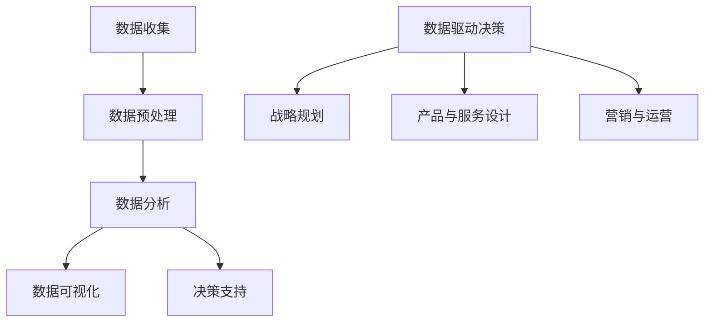

                 

# 《创业路上的数据分析：如何做出数据驱动的决策》

## 关键词
- 数据分析
- 数据驱动决策
- 数据可视化
- 统计学
- 数据预处理
- 数据挖掘
- 数据仓库
- 数据湖

## 摘要
在创业道路上，数据分析成为企业成功的关键因素。本文将深入探讨数据分析的基本概念、方法和应用，以及如何通过数据驱动决策来指导创业实践。我们将从数据分析的基础知识开始，逐步介绍数据处理、统计学基础、数据可视化、描述性数据分析、探索性数据分析、回归分析与预测、分类与聚类分析、协同过滤与推荐系统，以及数据分析工具与应用。最后，我们将讨论如何将数据分析应用于战略规划、产品与服务设计、营销与运营，并通过实际案例进行详细讲解。本文旨在为创业者提供一套完整的数据分析框架，帮助他们在竞争激烈的市场中做出明智的决策。

## 引言

创业是一场充满不确定性的冒险，而在这场冒险中，数据成为了企业的“新石油”。数据分析不仅可以帮助企业更好地理解市场趋势、客户需求和运营绩效，还能为企业提供决策的依据，提高决策的准确性和效率。在当今这个大数据时代，拥有强大的数据分析能力已经成为企业成功的关键。

### 数据分析的定义与重要性

数据分析是一种通过统计、数据挖掘和机器学习等技术，从大量数据中提取有价值信息的方法。它不仅可以帮助企业发现数据中的规律和趋势，还可以预测未来事件，为企业提供数据驱动的决策支持。

#### 数据分析的应用场景

数据分析在企业中的应用场景非常广泛，以下是一些典型的应用：

1. **市场营销**：通过分析客户数据，了解客户需求和行为，优化营销策略，提高客户满意度和忠诚度。
2. **运营管理**：通过分析生产、供应链和库存数据，优化运营流程，提高生产效率，降低成本。
3. **风险管理**：通过分析财务、信用和市场数据，识别潜在风险，制定风险控制策略。
4. **产品开发**：通过分析用户反馈和行为数据，了解用户需求，指导产品设计和开发。
5. **人力资源管理**：通过分析员工数据，优化招聘策略，提高员工绩效和满意度。

### 数据分析的基本流程

数据分析的基本流程通常包括以下步骤：

1. **数据收集**：从各种来源收集原始数据，包括内部数据和外部数据。
2. **数据预处理**：对原始数据进行清洗、转换和整合，使其适合进行分析。
3. **数据探索**：通过描述性统计和可视化技术，初步了解数据的分布和关系。
4. **数据分析**：运用统计学和机器学习等方法，深入分析数据，提取有价值的信息。
5. **数据可视化**：将分析结果以图表、报表等形式展示，帮助决策者理解数据。
6. **决策支持**：根据分析结果，制定和调整战略、政策和流程。

## 第一部分：数据分析基础知识

### 1.1 数据处理基础

#### 1.1.1 数据预处理

数据预处理是数据分析的重要步骤，它包括以下几个方面的内容：

- **数据清洗**：删除重复数据、填补缺失数据、处理异常值。
- **数据转换**：将数据转换为适合分析的形式，如将分类数据编码为数值。
- **数据集成**：将来自不同来源的数据整合在一起，形成一个统一的数据集。

#### 1.1.2 数据存储与管理

数据存储与管理是确保数据安全、可靠和高效使用的关键。以下是一些常见的数据存储与管理技术：

- **数据库**：用于存储和管理结构化数据，如关系型数据库（MySQL、Oracle）。
- **数据仓库**：用于存储大量历史数据，支持复杂的数据分析和报表生成。
- **数据湖**：用于存储大量非结构化数据，如文本、图像和视频。

#### 1.1.3 数据仓库与数据湖

数据仓库与数据湖是两种常见的数据存储技术，它们各有优缺点：

- **数据仓库**：适用于结构化数据的存储和管理，支持复杂查询和报表生成。
- **数据湖**：适用于非结构化数据的存储和管理，支持大数据分析。

### 1.2 统计学基础

统计学是数据分析的基础，它提供了许多工具和方法来分析和解释数据。以下是一些统计学的基础概念和方法：

#### 1.2.1 统计学基本概念

- **描述性统计**：用于描述数据的基本特征，如均值、方差、标准差。
- **推断性统计**：用于根据样本数据推断总体特征，如置信区间、假设检验。

#### 1.2.2 常用统计方法

- **频率与概率**：用于描述事件发生的频率和概率。
- **均值、方差与标准差**：用于描述数据的中心趋势和离散程度。
- **置信区间与假设检验**：用于评估模型的准确性和可靠性。

### 1.3 数据可视化

数据可视化是将数据分析结果以图表、报表等形式展示的过程。它不仅能够帮助决策者更好地理解数据，还能发现数据中的规律和趋势。以下是一些常见的数据可视化技术和工具：

#### 1.3.1 数据可视化基础

- **可视化原则**：清晰、简洁、易于理解。
- **常用可视化工具**：Excel、Tableau、Power BI。

#### 1.3.2 数据可视化案例

- **时间序列分析**：展示数据随时间的变化趋势。
- **地理空间分析**：展示数据在不同地理位置的分布情况。

## 第二部分：数据分析方法与应用

### 2.1 描述性数据分析

描述性数据分析是数据分析的基础，它主要用于描述数据的基本特征和关系。以下是一些常用的描述性数据分析方法：

#### 2.1.1 描述性数据分析方法

- **数据分布**：通过直方图、饼图等展示数据的分布情况。
- **相关性分析**：通过散点图、相关系数等分析变量之间的关系。

#### 2.1.2 描述性数据分析案例

- **市场调研数据分析**：通过描述性分析了解市场趋势和客户需求。
- **社交网络数据分析**：通过描述性分析了解社交网络的结构和用户行为。

### 2.2 探索性数据分析

探索性数据分析是一种非参数的统计分析方法，它主要用于发现数据中的规律和趋势。以下是一些探索性数据分析的方法：

#### 2.2.1 探索性数据分析方法

- **数据探索**：通过可视化技术探索数据的分布、关系和异常值。
- **数据可视化**：通过图表、报表等展示数据的特征和趋势。

#### 2.2.2 探索性数据分析案例

- **客户行为分析**：通过探索性数据分析了解客户的行为模式和偏好。
- **产品销售分析**：通过探索性数据分析了解产品的销售趋势和市场份额。

### 2.3 回归分析与预测

回归分析是一种用于研究变量之间关系的统计分析方法。它不仅可以用于描述变量之间的关系，还可以进行预测。以下是一些回归分析与预测的方法：

#### 2.3.1 线性回归

线性回归是一种最简单的回归分析方法，它主要用于研究两个变量之间的线性关系。

- **线性回归原理**：通过线性模型拟合数据，计算回归系数，评估模型效果。
- **线性回归案例**：预测销售额与广告投入的关系。

#### 2.3.2 多元回归

多元回归是一种用于研究多个变量之间关系的回归分析方法。

- **多元回归原理**：通过多元线性模型拟合数据，计算回归系数，评估模型效果。
- **多元回归案例**：预测房价与多个因素的关系。

#### 2.3.3 时间序列预测

时间序列预测是一种用于预测未来事件的方法，它主要用于研究时间序列数据的特征和趋势。

- **时间序列模型**：ARIMA、AR、MA、ARMA、SARMA、SARIMA等。
- **时间序列预测案例**：预测股票价格、销售额等。

### 2.4 分类与聚类分析

分类与聚类分析是数据分析中常用的两种方法，它们分别用于将数据分为不同的类别和将数据分为不同的簇。

#### 2.4.1 分类分析方法

- **决策树**：通过树形结构对数据进行分类。
- **随机森林**：通过多个决策树的集成进行分类。

#### 2.4.2 聚类分析方法

- **K-均值聚类**：通过计算距离最近的K个点作为聚类中心。
- **层次聚类**：通过自底向上或自顶向下的方法对数据进行聚类。

#### 2.4.3 分类与聚类分析案例

- **顾客细分分析**：通过聚类分析将顾客分为不同的群体。
- **市场细分分析**：通过分类分析将市场分为不同的部分。

### 2.5 协同过滤与推荐系统

协同过滤与推荐系统是一种基于用户行为和偏好进行数据挖掘的方法，它主要用于为用户提供个性化推荐。

#### 2.5.1 协同过滤原理

- **基于用户的协同过滤**：通过计算用户之间的相似度，为用户推荐相似用户喜欢的物品。
- **基于物品的协同过滤**：通过计算物品之间的相似度，为用户推荐相似物品。

#### 2.5.2 推荐系统案例

- **在线购物推荐**：为用户提供个性化商品推荐。
- **社交网络推荐**：为用户提供个性化内容推荐。

### 2.6 数据分析工具与应用

数据分析工具是进行数据分析的重要工具，它们提供了丰富的功能和接口，帮助用户高效地进行数据分析和可视化。

#### 2.6.1 常用数据分析工具

- **Python数据分析库**：如pandas、numpy、scikit-learn等。
- **R数据分析库**：如dplyr、ggplot2、caret等。

#### 2.6.2 数据分析工具应用案例

- **数据分析项目实战**：通过实际项目展示数据分析工具的使用。
- **数据分析工具选择与使用**：介绍如何选择和有效使用数据分析工具。

## 第三部分：数据驱动的决策

### 3.1 数据驱动决策概述

数据驱动决策是一种基于数据分析结果进行决策的方法，它通过数据来指导企业战略、运营和产品开发。

#### 3.1.1 数据驱动决策的定义与特点

- **定义**：数据驱动决策是基于数据分析和数据挖掘结果，制定和调整企业战略、政策和流程。
- **特点**：数据驱动决策具有客观性、准确性和高效性。

#### 3.1.2 数据驱动决策的应用场景

- **市场营销**：通过数据分析优化营销策略，提高营销效果。
- **运营管理**：通过数据分析优化运营流程，提高生产效率。
- **产品开发**：通过数据分析了解用户需求，指导产品设计和开发。

#### 3.1.3 数据驱动决策的优势与挑战

- **优势**：提高决策的准确性、效率和可重复性。
- **挑战**：数据质量和分析方法的影响、数据隐私和伦理问题。

### 3.2 数据驱动的战略规划

数据驱动的战略规划是企业通过数据分析和数据挖掘来制定和调整战略的方法。

#### 3.2.1 数据驱动战略的制定

- **目标设定**：根据企业愿景和战略，设定数据驱动的目标。
- **实施步骤**：通过数据收集、数据预处理、数据分析、数据可视化等步骤，制定数据驱动的战略。

#### 3.2.2 数据驱动战略案例分析

- **企业数字化转型**：通过数据分析优化企业业务流程，提高效率。
- **数据驱动市场营销策略**：通过数据分析优化营销策略，提高营销效果。

### 3.3 数据驱动的产品与服务设计

数据驱动的产品与服务设计是通过对用户行为和需求的分析，指导产品和服务的设计和开发。

#### 3.3.1 数据驱动产品设计与开发

- **用户行为数据收集**：通过数据收集工具收集用户行为数据。
- **用户需求分析**：通过数据分析了解用户需求，指导产品设计和开发。

#### 3.3.2 数据驱动服务设计

- **服务质量数据监控**：通过数据监控了解服务质量。
- **服务改进与优化**：通过数据分析优化服务流程，提高服务质量。

### 3.4 数据驱动的营销与运营

数据驱动的营销与运营是企业通过数据分析来优化营销策略和运营流程的方法。

#### 3.4.1 数据驱动营销策略

- **营销数据收集与分析**：通过数据收集和分析了解营销效果。
- **营销策略调整**：根据数据分析结果调整营销策略。

#### 3.4.2 数据驱动运营管理

- **运营数据收集与分析**：通过数据收集和分析了解运营效果。
- **运营流程优化**：根据数据分析结果优化运营流程。

## 结论

数据分析在创业中扮演着至关重要的角色。通过数据驱动的决策，企业可以更好地理解市场、客户和自身运营，从而制定更有效的战略和策略。本文系统地介绍了数据分析的基础知识、方法与应用，以及如何通过数据驱动的决策来指导创业实践。希望本文能为创业者提供一套实用的数据分析框架，帮助他们在竞争激烈的市场中脱颖而出。作者：AI天才研究院/AI Genius Institute & 禅与计算机程序设计艺术 /Zen And The Art of Computer Programming。

## 扩展阅读

- 《数据挖掘：实用工具与技术》
- 《Python数据分析》
- 《R数据分析》
- 《数据可视化》
- 《深度学习》
- 《机器学习》
- 《大数据技术基础》
- 《数据仓库与数据湖》

## 附录

### 1. Mermaid 流程图

以下是本文提到的数据驱动决策流程的Mermaid流程图：



### 2. 伪代码示例

以下是线性回归的伪代码示例：

```python
def linear_regression(x, y):
    # 计算回归系数
    theta = (x'x)^(-1)x'y
    # 计算预测值
    y_pred = x*theta
    return y_pred
```

### 3. LaTeX 公式

以下是本文中使用的LaTeX公式示例：

$$
1 + 1 = 2
$$

$$
x_1 < x_2
$$

### 4. 代码应用解读与分析

以下是数据分析项目实战的代码应用解读与分析：

```python
# 导入库
import pandas as pd
import numpy as np
from sklearn.model_selection import train_test_split
from sklearn.linear_model import LinearRegression
from sklearn.metrics import mean_squared_error

# 读取数据
data = pd.read_csv("sales_data.csv")

# 数据预处理
data = data.dropna()
data = data[data['sales'] > 0]

# 分割特征和标签
X = data[['advertising', 'price']]
y = data['sales']

# 划分训练集和测试集
X_train, X_test, y_train, y_test = train_test_split(X, y, test_size=0.2, random_state=42)

# 训练模型
model = LinearRegression()
model.fit(X_train, y_train)

# 预测测试集
y_pred = model.predict(X_test)

# 计算误差
mse = mean_squared_error(y_test, y_pred)
print("MSE:", mse)
```

### 5. 最佳实践 Tips

- **数据收集**：确保数据质量和完整性，避免数据缺失和异常值。
- **数据预处理**：进行数据清洗、转换和集成，使其适合分析。
- **数据分析**：选择合适的统计方法和模型，确保分析结果的准确性。
- **数据可视化**：选择合适的可视化工具和图表，使分析结果更容易理解。
- **决策支持**：根据分析结果，制定和调整战略、政策和流程。

### 6. 注意事项

- **数据隐私**：确保遵守数据隐私法规，保护用户隐私。
- **数据质量**：确保数据质量，避免错误和误导。
- **模型验证**：使用交叉验证等方法验证模型的准确性。

## 项目小结

本文系统地介绍了数据分析的基础知识、方法与应用，以及如何通过数据驱动的决策来指导创业实践。通过实际案例和代码应用，读者可以了解数据分析的实际应用和操作方法。希望本文能为创业者提供一套实用的数据分析框架，帮助他们在竞争激烈的市场中取得成功。作者：AI天才研究院/AI Genius Institute & 禅与计算机程序设计艺术 /Zen And The Art of Computer Programming。

