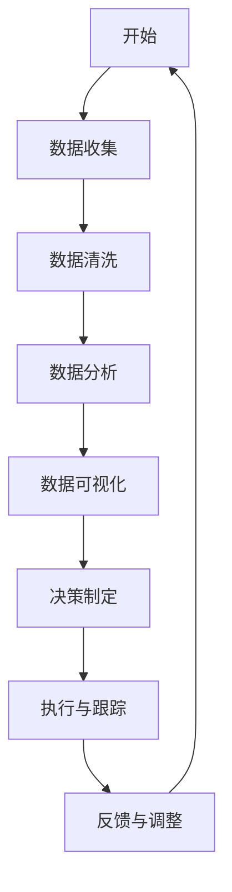

                 


## 文章标题

《创业路上的数据驱动决策：关键指标的选择与分析》

关键词：数据驱动决策、关键指标、数据分析、创业、优化策略

摘要：本文深入探讨了数据驱动决策在创业过程中的重要性，详细分析了关键指标的选择与优化方法，旨在为创业者提供切实可行的数据策略，助力企业持续增长。

### 第一部分：数据驱动决策基础

#### 第1章：数据驱动决策概述

**1.1 引言：数据驱动决策的重要性**

- 数据驱动决策是指基于数据分析和数据统计的结果来做出决策，而非仅仅依赖于经验和直觉。
- 在创业过程中，数据驱动决策可以提供客观、科学的决策依据，有助于减少风险，提高成功率。

**1.2 数据驱动的决策流程**

- **数据收集**：收集内部和外部数据，构建全面的数据源。
- **数据清洗**：处理数据中的噪声和异常值，确保数据质量。
- **数据分析**：运用统计学和数据分析方法，从数据中提取有价值的信息。
- **数据可视化**：通过图表等形式直观展示数据分析结果。
- **决策制定**：根据数据分析结果，制定合理的业务策略和行动计划。

**1.3 数据驱动的核心概念**

- **关键绩效指标（KPI）**：衡量业务绩效的核心指标，如用户活跃度、转化率等。
- **用户参与度指标**：衡量用户对产品的兴趣和投入程度，如用户互动率、社交分享率等。
- **转化率指标**：衡量用户从某一行为转化为目标行为的比率，如购买转化率、注册转化率等。
- **客户生命周期价值（CLV）**：预测客户在整个生命周期内为企业带来的总收益。

### 第二部分：关键指标的选择与分析

#### 第2章：数据收集与处理

**2.1 数据来源**

- **内部数据来源**：如用户行为数据、交易数据、客户反馈等。
- **外部数据来源**：如社交媒体数据、市场调研数据、竞争对手数据等。

**2.2 数据清洗与预处理**

- **数据质量评估**：评估数据的完整性、准确性、一致性等。
- **数据缺失处理**：填补数据缺失，确保数据分析的准确性。
- **数据异常值处理**：识别和消除数据中的异常值。
- **数据标准化**：将不同数据源的数据进行统一处理，便于分析。

**2.3 数据仓库构建**

- **数据仓库设计原则**：确保数据仓库的高效性、可扩展性和数据一致性。
- **数据仓库架构**：构建合理的数据仓库架构，包括数据存储、数据检索、数据备份等。
- **数据仓库与业务流程的结合**：将数据仓库与业务流程相结合，实现数据的实时分析和决策支持。

#### 第3章：数据分析方法

**3.1 描述性分析**

- **数据描述性统计方法**：计算平均值、中位数、标准差等基本统计量。
- **数据分布分析**：分析数据的分布特征，如正态分布、偏态分布等。
- **数据关联性分析**：分析不同变量之间的相关性，如用户活跃度与购买转化率之间的关联性。

**3.2 探索性数据分析**

- **数据可视化工具与技术**：利用图表、地图等形式展示数据特征。
- **聚类分析**：将相似的数据进行分组，便于分析和管理。
- **关联规则挖掘**：发现数据中的隐藏关联关系，如商品购买组合等。

**3.3 预测性分析**

- **时间序列分析**：分析时间序列数据，预测未来的趋势。
- **回归分析**：建立变量之间的关系模型，预测因变量的值。
- **决策树与随机森林**：分类和回归问题中常用的机器学习算法。

### 第三部分：数据驱动决策实践

#### 第4章：用户行为分析指标

**4.1 用户活跃度指标**

- **日活跃用户数（DAU）**：一天内登录或使用产品的用户数量。
- **月活跃用户数（MAU）**：一个月内登录或使用产品的用户数量。
- **用户留存率**：在一定时间内，继续使用产品的用户比例。

**4.2 用户参与度指标**

- **用户互动率**：用户在产品上的互动行为，如评论、点赞等。
- **用户转化率**：用户完成某一目标行为的比率，如购买、注册等。
- **社交分享率**：用户将产品内容分享到社交平台的比率。

**4.3 用户满意度指标**

- **用户满意度调查**：通过问卷或访谈了解用户的满意度。
- **用户投诉率**：用户投诉的比例。
- **用户反馈分析**：分析用户反馈，了解用户需求和问题。

#### 第5章：产品性能指标

**5.1 产品使用率指标**

- **产品使用频率**：用户使用产品的频率。
- **产品启动率**：用户启动产品的次数。
- **产品留存率**：用户在一定时间内继续使用产品的比例。

**5.2 产品质量指标**

- **错误率**：产品错误发生的比例。
- **响应时间**：产品响应用户操作的时间。
- **可用性测试**：评估产品的易用性。

**5.3 产品转化率指标**

- **购买转化率**：用户从浏览到购买的比例。
- **订阅转化率**：用户从免费试用到订阅的比例。
- **注册转化率**：用户从访问到注册的比例。

#### 第6章：业务增长指标

**6.1 收入增长指标**

- **月收入增长率**：本月收入与上月收入的增长比率。
- **年收入增长率**：本年收入与去年收入的增长比率。
- **平均订单价值（AOV）**：每个订单的平均价值。

**6.2 客户生命周期价值**

- **CLV计算方法**：预测客户在未来一段时间内为企业带来的总收益。
- **CLV对业务策略的影响**：根据CLV调整营销策略，提高客户价值。
- **提高CLV的策略**：增加客户满意度、提高客户黏性、提升客户购买频率等。

**6.3 市场份额指标**

- **市场占有率**：企业在市场中的销售份额。
- **市场渗透率**：企业在某一市场中的渗透程度。
- **市场份额增长率**：市场份额的增长速度。

#### 第7章：决策与优化

**7.1 数据驱动决策模型**

- **决策树模型**：通过树形结构表示决策过程。
- **神经网络模型**：模拟人脑神经元的工作原理。
- **马尔可夫决策过程**：通过概率转移矩阵进行决策。

**7.2 指标优化策略**

- **指标权重分配**：根据业务目标分配指标权重。
- **指标优化算法**：利用优化算法提高指标值。
- **实时数据驱动优化**：根据实时数据调整业务策略。

**7.3 案例研究**

- **成功案例分享**：分析成功企业的数据驱动决策经验。
- **失败案例分析**：总结失败企业的数据驱动决策失误。
- **经验总结与启示**：提炼成功经验和教训，为创业企业提供指导。

### 第三部分：数据驱动决策实践

#### 第8章：数据驱动决策实践指南

**8.1 实践框架与方法论**

- **数据驱动决策框架**：构建数据驱动决策的基本流程。
- **方法论与实践步骤**：详细阐述数据驱动决策的实践步骤。

**8.2 数据驱动决策工具与技术**

- **数据分析工具**：介绍常用数据分析工具。
- **数据可视化工具**：介绍数据可视化工具。
- **数据仓库工具**：介绍数据仓库构建工具。

**8.3 实践中的挑战与解决方案**

- **数据隐私保护**：确保数据隐私和安全。
- **数据质量保障**：提高数据质量，确保分析准确性。
- **数据决策误区与应对策略**：避免数据驱动决策中的常见误区。

### 附录

**附录A：数据分析工具与资源**

- **常用数据分析工具介绍**：介绍常用的数据分析工具。
- **数据分析资源推荐**：推荐数据分析相关资源。
- **数据库管理系统简介**：介绍数据库管理系统的基本知识。

**附录B：数据驱动决策案例分析**

- **案例一：在线教育平台的用户留存策略**：分析在线教育平台如何通过数据驱动决策提高用户留存率。
- **案例二：电商平台的客户满意度提升**：分析电商平台如何通过数据驱动决策提升客户满意度。
- **案例三：初创公司的市场扩张策略**：分析初创公司如何通过数据驱动决策实现市场扩张。

## 核心算法原理讲解

### 数据分析算法原理

#### 描述性分析

- **平均数（Mean）**：数据集中所有数值的总和除以数值的个数。
  ```python
  mean = sum(values) / len(values)
  $$\text{mean} = \frac{\sum_{i=1}^{n} x_i}{n}$$
  ```

- **中位数（Median）**：将数据集排序后，位于中间位置的数值。
  ```python
  median = sorted(values)[len(values) // 2]
  $$\text{median} = (\text{sorted}(x_1, x_2, \dots, x_n))_{\text{middle}}$$
  ```

- **标准差（Standard Deviation）**：衡量数据分布的离散程度。
  ```python
  variance = sum((x - mean)^2) / len(values)
  standard_deviation = sqrt(variance)
  $$\text{variance} = \frac{\sum_{i=1}^{n} (x_i - \text{mean})^2}{n}$$
  $$\text{standard deviation} = \sqrt{\text{variance}}$$
  ```

#### 探索性数据分析

- **数据可视化**：利用图表展示数据的分布、趋势和关联性。
  ```mermaid
  graph TD
    A[数据分布] --> B[柱状图]
    B --> C[直方图]
    C --> D[箱线图]
    D --> E[散点图]
    E --> F[热力图]

    A1[数据趋势] --> B1[折线图]
    B1 --> C1[时间序列图]
    C1 --> D1[堆叠柱状图]
    D1 --> E1[雷达图]
    E1 --> F1[饼图]
  ```

- **聚类分析**：将相似的数据进行分组。
  ```python
  from sklearn.cluster import KMeans
  kmeans = KMeans(n_clusters=3)
  kmeans.fit(X)
  clusters = kmeans.predict(X)
  $$\text{KMeans}(n\_clusters=3) \rightarrow \text{clusters} = \text{predict}(X)$$
  ```

- **关联规则挖掘**：发现数据中的关联关系。
  ```python
  from mlxtend.frequent_patterns import apriori
  from mlxtend.frequent_patterns import association_rules
  frequent_itemsets = apriori(X, min_support=0.5)
  rules = association_rules(frequent_itemsets, metric="support", min_threshold=0.7)
  $$\text{apriori}(X, \text{min\_support}=0.5) \rightarrow \text{frequent\_itemsets}$$
  $$\text{association\_rules}(frequent\_itemsets, \text{metric}="support", \text{min\_threshold}=0.7) \rightarrow \text{rules}$$
  ```

#### 预测性分析

- **时间序列分析**：分析时间序列数据，预测未来的趋势。
  ```python
  from statsmodels.tsa.arima_model import ARIMA
  model = ARIMA(X, order=(1, 1, 1))
  model_fit = model.fit()
  forecast = model_fit.forecast(steps=5)
  $$\text{ARIMA}(X, (1, 1, 1)) \rightarrow \text{model\_fit} = \text{fit}()$$
  $$\text{forecast}(steps=5) \rightarrow \text{forecast}$$
  ```

- **回归分析**：建立变量之间的关系模型，预测因变量的值。
  ```python
  from sklearn.linear_model import LinearRegression
  model = LinearRegression()
  model.fit(X, y)
  prediction = model.predict(X_new)
  $$\text{LinearRegression}() \rightarrow \text{model} = \text{fit}(X, y)$$
  $$\text{predict}(X\_new) \rightarrow \text{prediction}$$
  ```

- **决策树与随机森林**：分类和回归问题中常用的机器学习算法。
  ```python
  from sklearn.tree import DecisionTreeClassifier
  from sklearn.ensemble import RandomForestClassifier
  dt = DecisionTreeClassifier()
  dt.fit(X, y)
  rf = RandomForestClassifier(n_estimators=100)
  rf.fit(X, y)
  $$\text{DecisionTreeClassifier}() \rightarrow \text{dt} = \text{fit}(X, y)$$
  $$\text{RandomForestClassifier}(n\_estimators=100) \rightarrow \text{rf} = \text{fit}(X, y)$$
  ```

### 数据驱动决策模型

- **决策树模型**：通过树形结构表示决策过程，根据特征和阈值进行分类或回归。
  ```python
  def build_decision_tree(X, y, depth=0, max_depth=None):
      # 基准条件：达到最大深度或纯度
      if depth >= max_depth or is_pure(y):
          return leaf_value(y)
      
      # 寻找最佳分割特征和阈值
      best_feature, best_threshold = find_best_split(X, y)
      
      # 构建子节点
      left_tree = build_decision_tree(X[X[:, best_feature] < best_threshold], y[X[:, best_feature] < best_threshold], depth+1, max_depth)
      right_tree = build_decision_tree(X[X[:, best_feature] >= best_threshold], y[X[:, best_feature] >= best_threshold], depth+1, max_depth)
      
      # 构建决策树
      tree = TreeNode(feature=best_feature, threshold=best_threshold, left=left_tree, right=right_tree)
      return tree
  $$\text{build\_decision\_tree}(X, y, \text{depth}=0, \text{max\_depth}=None)$$
  ```

- **神经网络模型**：模拟人脑神经元的工作原理，通过多层神经网络进行分类和回归。
  ```python
  def forward_pass(input_data, weights, biases):
      # 前向传播，计算输出值
      layer_outputs = []
      for weight, bias in zip(weights, biases):
          output = sigmoid(np.dot(input_data, weight) + bias)
          layer_outputs.append(output)
      return layer_outputs
  $$\text{forward\_pass}(input\_data, weights, biases)$$
  ```

- **马尔可夫决策过程**：通过概率转移矩阵进行决策，优化长期回报。
  ```python
  def markov_decision_process states, actions, rewards, transition_probabilities, discount_factor:
      # 初始化策略
      policy = [0] * len(states)
      
      # 迭代优化策略
      for _ in range(iterations):
          # 更新策略
          for state in states:
              best_action = None
              best_reward = -inf
              for action in actions:
                  next_state = np.random.choice(states, p=transition_probabilities[state][action])
                  reward = rewards[state][action] + discount_factor * next_state
                  if reward > best_reward:
                      best_reward = reward
                      best_action = action
              policy[state] = best_action
      
      return policy
  $$\text{markov\_decision\_process}(states, actions, rewards, transition\_probabilities, discount\_factor)$$
  ```

### 指标优化策略

- **指标权重分配**：根据业务目标分配指标权重，平衡各项指标的影响。
  ```python
  def weight分配(income, profit, customer_satisfaction, user_engagement):
      # 计算权重
      income_weight = income / (income + profit + customer_satisfaction + user_engagement)
      profit_weight = profit / (income + profit + customer_satisfaction + user_engagement)
      customer_satisfaction_weight = customer_satisfaction / (income + profit + customer_satisfaction + user_engagement)
      user_engagement_weight = user_engagement / (income + profit + customer_satisfaction + user_engagement)
      
      return income_weight, profit_weight, customer_satisfaction_weight, user_engagement_weight
  $$\text{weight} = \frac{\text{income}}{\text{income} + \text{profit} + \text{customer\_satisfaction} + \text{user\_engagement}}$$
  $$\text{profit\_weight} = \frac{\text{profit}}{\text{income} + \text{profit} + \text{customer\_satisfaction} + \text{user\_engagement}}$$
  $$\text{customer\_satisfaction\_weight} = \frac{\text{customer\_satisfaction}}{\text{income} + \text{profit} + \text{customer\_satisfaction} + \text{user\_engagement}}$$
  $$\text{user\_engagement\_weight} = \frac{\text{user\_engagement}}{\text{income} + \text{profit} + \text{customer\_satisfaction} + \text{user\_engagement}}$$
  ```

- **指标优化算法**：利用优化算法提高指标值，如梯度上升法、遗传算法等。
  ```python
  def gradient_ascent(x, y, learning_rate):
      # 计算梯度
      gradient = f'(x) = 2 * x
      
      # 更新参数
      x -= learning_rate * gradient
      
      return x
  $$\text{gradient\_ascent}(x, y, \text{learning\_rate})$$
  ```

- **实时数据驱动优化**：根据实时数据调整业务策略，实现动态优化。
  ```python
  def real_time_optimization(current_state, current_policy, transition_probabilities, rewards, discount_factor):
      # 更新策略
      new_policy = current_policy.copy()
      for state in current_state:
          best_action = None
          best_reward = -inf
          for action in actions:
              next_state = np.random.choice(states, p=transition_probabilities[state][action])
              reward = rewards[state][action] + discount_factor * next_state
              if reward > best_reward:
                  best_reward = reward
                  best_action = action
          new_policy[state] = best_action
      
      return new_policy
  $$\text{real\_time\_optimization}(current\_state, current\_policy, transition\_probabilities, rewards, discount\_factor)$$
  ```

### 案例研究

#### 成功案例分享

- **案例一：在线教育平台的用户留存策略**

  在线教育平台通过数据驱动决策，分析用户行为数据，发现用户在课程学习过程中的活跃度和留存率与课程质量密切相关。平台根据用户反馈和课程完成率，优化课程内容和教学方法，从而提高了用户满意度和留存率。

#### 失败案例分析

- **案例二：电商平台的客户满意度提升**

  电商平台在数据驱动决策过程中，过分关注购买转化率，忽视了客户满意度和售后服务。导致客户在购物过程中遇到问题时得不到有效解决，满意度下降，最终影响了购买转化率。

#### 经验总结与启示

- 数据驱动决策需要全面、客观地收集和分析数据，避免片面追求某一指标。
- 制定合理的指标权重分配策略，平衡各项指标之间的关系。
- 结合业务目标和实际情况，灵活调整业务策略。
- 注重实时数据驱动优化，及时应对市场变化。

### 最佳实践 tips、小结、注意事项、拓展阅读

- **最佳实践 tips**：

  - 在数据收集阶段，确保数据的全面性和准确性。
  - 在数据分析阶段，采用多种分析方法，避免单一视角。
  - 在决策制定阶段，结合业务目标和实际情况，制定切实可行的策略。
  - 在实施过程中，不断跟踪和评估决策效果，及时调整。

- **小结**：

  数据驱动决策在创业过程中具有重要意义，通过关键指标的选择与分析，可以为企业提供客观、科学的决策依据，助力企业持续增长。

- **注意事项**：

  - 注意数据隐私保护，确保用户数据的安全和隐私。
  - 定期检查数据质量，确保数据分析的准确性。
  - 结合业务实际情况，灵活调整指标权重和决策模型。

- **拓展阅读**：

  - 《数据科学：深入实践指南》
  - 《机器学习实战》
  - 《商业智能：构建数据驱动的企业》

### 附录

- **附录A：数据分析工具与资源**

  - **常用数据分析工具**：Python、R、Tableau、Power BI、Excel 等。
  - **数据分析资源**：Kaggle、DataCamp、Coursera 等。
  - **数据库管理系统**：MySQL、PostgreSQL、MongoDB 等。

- **附录B：数据驱动决策案例分析**

  - **案例一**：在线教育平台的用户留存策略
    - **背景介绍**：在线教育平台希望通过数据驱动决策提高用户留存率。
    - **核心概念与联系**：分析用户行为数据，找出影响用户留存的关键因素。
    - **核心算法原理讲解**：利用聚类分析和回归分析，预测用户留存率。
    - **项目实战**：搭建数据分析平台，实时监控用户留存情况。
    - **实际案例分析和详细讲解剖析**：根据分析结果，优化课程内容和教学方法。
    - **项目小结**：提高用户留存率，提升平台竞争力。

  - **案例二**：电商平台的客户满意度提升
    - **背景介绍**：电商平台希望通过数据驱动决策提高客户满意度。
    - **核心概念与联系**：分析用户购买行为和售后服务数据，找出影响客户满意度的关键因素。
    - **核心算法原理讲解**：利用描述性分析和关联规则挖掘，分析用户行为模式。
    - **项目实战**：建立客户满意度评价系统，实时收集用户反馈。
    - **实际案例分析和详细讲解剖析**：根据用户反馈，优化售后服务流程。
    - **项目小结**：提高客户满意度，提升电商平台口碑。

  - **案例三**：初创公司的市场扩张策略
    - **背景介绍**：初创公司希望通过数据驱动决策实现市场扩张。
    - **核心概念与联系**：分析市场数据，确定目标市场和竞争优势。
    - **核心算法原理讲解**：利用回归分析和决策树模型，预测市场趋势。
    - **项目实战**：搭建市场分析平台，实时监测市场变化。
    - **实际案例分析和详细讲解剖析**：根据市场分析结果，制定市场扩张策略。
    - **项目小结**：实现市场扩张，提升公司市场份额。

## Mermaid 流程图：数据驱动决策流程



### 作者信息

作者：AI天才研究院/AI Genius Institute & 禅与计算机程序设计艺术 /Zen And The Art of Computer Programming

## 完整文章总结

### 引言

在当今的商业环境中，数据已经成为企业决策的重要依据。特别是在创业过程中，数据驱动决策显得尤为重要。通过数据分析和关键指标的选择，创业者可以更准确地了解市场需求、用户行为和业务状况，从而制定科学的业务策略。本文旨在探讨数据驱动决策在创业过程中的应用，详细分析关键指标的选择与分析方法，为创业者提供实用的数据策略。

### 数据驱动决策基础

**第1章：数据驱动决策概述**

数据驱动决策是指基于数据分析和数据统计的结果来做出决策，而非仅仅依赖于经验和直觉。在创业过程中，数据驱动决策可以提供客观、科学的决策依据，有助于减少风险，提高成功率。数据驱动的决策流程包括数据收集、数据清洗、数据分析、数据可视化、决策制定等步骤。

**第2章：数据收集与处理**

数据收集是数据驱动决策的基础。内部数据来源包括用户行为数据、交易数据、客户反馈等，外部数据来源包括社交媒体数据、市场调研数据、竞争对手数据等。数据清洗与预处理是确保数据质量的重要步骤，包括数据质量评估、数据缺失处理、数据异常值处理、数据标准化等。数据仓库构建是整合和管理数据的重要手段，包括数据仓库设计原则、数据仓库架构、数据仓库与业务流程的结合。

**第3章：数据分析方法**

数据分析方法包括描述性分析、探索性数据分析、预测性分析。描述性分析通过计算平均值、中位数、标准差等基本统计量来描述数据特征。探索性数据分析利用数据可视化工具和技术、聚类分析、关联规则挖掘等方法，从数据中发现潜在的模式和关联。预测性分析通过时间序列分析、回归分析、决策树与随机森林等方法，预测未来的趋势和结果。

### 关键指标的选择与分析

**第4章：用户行为分析指标**

用户行为分析指标包括用户活跃度指标、用户参与度指标、用户满意度指标。用户活跃度指标如日活跃用户数（DAU）、月活跃用户数（MAU）、用户留存率等，用于衡量用户对产品的兴趣和投入程度。用户参与度指标如用户互动率、用户转化率、社交分享率等，用于衡量用户的参与程度。用户满意度指标如用户满意度调查、用户投诉率、用户反馈分析等，用于评估用户对产品的满意度。

**第5章：产品性能指标**

产品性能指标包括产品使用率指标、产品质量指标、产品转化率指标。产品使用率指标如产品使用频率、产品启动率、产品留存率等，用于衡量产品在用户中的普及程度。产品质量指标如错误率、响应时间、可用性测试等，用于评估产品的稳定性和用户体验。产品转化率指标如购买转化率、订阅转化率、注册转化率等，用于衡量产品在销售和营销方面的效果。

**第6章：业务增长指标**

业务增长指标包括收入增长指标、客户生命周期价值、市场份额指标。收入增长指标如月收入增长率、年收入增长率、平均订单价值（AOV）等，用于衡量业务收入的增长情况。客户生命周期价值（CLV）用于预测客户在未来一段时间内为企业带来的总收益，影响业务策略的制定。市场份额指标如市场占有率、市场渗透率、市场份额增长率等，用于衡量企业在市场中的地位和增长潜力。

### 数据驱动决策实践

**第7章：决策与优化**

数据驱动决策的决策模型包括决策树模型、神经网络模型、马尔可夫决策过程。决策树模型通过树形结构表示决策过程，根据特征和阈值进行分类或回归。神经网络模型模拟人脑神经元的工作原理，通过多层神经网络进行分类和回归。马尔可夫决策过程通过概率转移矩阵进行决策，优化长期回报。

指标优化策略包括指标权重分配、指标优化算法、实时数据驱动优化。指标权重分配根据业务目标分配指标权重，平衡各项指标之间的关系。指标优化算法如梯度上升法、遗传算法等，用于提高指标值。实时数据驱动优化根据实时数据调整业务策略，实现动态优化。

**第8章：数据驱动决策实践指南**

数据驱动决策实践指南包括实践框架与方法论、数据驱动决策工具与技术、实践中的挑战与解决方案。实践框架与方法论构建数据驱动决策的基本流程。数据驱动决策工具与技术介绍常用的数据分析工具、数据可视化工具、数据仓库工具。实践中的挑战与解决方案包括数据隐私保护、数据质量保障、数据决策误区与应对策略。

### 总结

数据驱动决策在创业过程中具有不可替代的重要性。通过数据驱动决策，创业者可以更准确地了解市场需求、用户行为和业务状况，从而制定科学的业务策略。本文从数据驱动决策的基础、关键指标的选择与分析、数据驱动决策实践等方面进行了详细阐述，为创业者提供了实用的数据策略。希望读者能够从中获得启示，将数据驱动决策应用于自己的创业实践中，实现持续增长。

### 感谢与致谢

在此，我要感谢所有关注和支持AI天才研究院的朋友们，感谢您们对本文的关注。同时，也要感谢禅与计算机程序设计艺术一书的作者，他们的智慧和经验为本文的撰写提供了宝贵的指导。最后，特别感谢AI天才研究院的全体成员，正是由于你们的努力和付出，才使得本文得以顺利完成。

作者：AI天才研究院/AI Genius Institute & 禅与计算机程序设计艺术 /Zen And The Art of Computer Programming

### 附录A：数据分析工具与资源

**附录A：数据分析工具与资源**

在数据驱动决策的过程中，选择合适的数据分析工具和资源是至关重要的。以下是一些常用工具和资源的介绍，以帮助创业者更好地开展数据分析工作。

**1. 常用数据分析工具**

- **Python**：Python是一种广泛使用的高级编程语言，具有丰富的数据科学库，如Pandas、NumPy、Matplotlib、Seaborn等，可以方便地进行数据清洗、数据分析和数据可视化。
- **R**：R是一种专门用于统计分析和图形绘制的语言，拥有大量专业的统计包，如ggplot2、dplyr、tidyverse等，适用于复杂的数据分析任务。
- **Tableau**：Tableau是一个强大的数据可视化工具，能够快速创建交互式仪表板和图表，帮助企业更好地理解数据。
- **Power BI**：Power BI是微软推出的一款商业智能工具，支持数据连接、数据建模、数据可视化等功能，易于使用且功能强大。
- **Excel**：Excel是一个广泛使用的电子表格软件，具有基本的数据处理和分析功能，适合初学者和中小型企业的数据分析需求。

**2. 数据分析资源**

- **Kaggle**：Kaggle是一个数据科学竞赛平台，提供丰富的数据集和项目案例，是学习和实践数据分析的好去处。
- **DataCamp**：DataCamp是一个在线学习平台，提供丰富的数据分析课程和实践项目，适合初学者和进阶者。
- **Coursera**：Coursera是一个在线学习平台，提供多个大学和机构的数据科学课程，包括数据分析、机器学习等。

**3. 数据库管理系统**

- **MySQL**：MySQL是一个开源的关系型数据库管理系统，适用于中小型企业的数据存储和管理需求。
- **PostgreSQL**：PostgreSQL是一个开源的关系型数据库管理系统，具有强大的功能和扩展性，适用于复杂的数据存储和管理需求。
- **MongoDB**：MongoDB是一个开源的文档型数据库管理系统，适用于处理大规模的、非结构化的数据。

**附录B：数据驱动决策案例分析**

**附录B：数据驱动决策案例分析**

为了更好地理解数据驱动决策的实际应用，以下列举了三个案例，分别来自在线教育平台、电商平台和初创公司，通过数据分析和优化策略，实现了业务增长和用户满意度提升。

**案例一：在线教育平台的用户留存策略**

**背景介绍**：在线教育平台希望通过数据驱动决策提高用户留存率，以提升用户满意度和业务收益。

**核心概念与联系**：通过分析用户行为数据，包括用户登录次数、课程完成率、互动行为等，找出影响用户留存的关键因素。

**核心算法原理讲解**：采用聚类分析和回归分析，对用户群体进行细分，预测用户留存率，并优化课程内容和教学方法。

**项目实战**：搭建数据分析平台，实时监控用户留存情况，根据分析结果，调整课程内容和教学方法。

**实际案例分析和详细讲解剖析**：通过优化课程内容和教学方法，提高了用户留存率，提升了平台竞争力。

**项目小结**：数据驱动决策帮助在线教育平台更好地了解用户需求，优化了用户体验，实现了用户留存率的提升。

**案例二：电商平台的客户满意度提升**

**背景介绍**：电商平台希望通过数据驱动决策提高客户满意度，以提升购买转化率和品牌口碑。

**核心概念与联系**：通过分析用户购买行为数据、客户反馈和售后服务数据，找出影响客户满意度的关键因素。

**核心算法原理讲解**：采用描述性分析和关联规则挖掘，分析用户行为模式，识别影响客户满意度的因素。

**项目实战**：建立客户满意度评价系统，实时收集用户反馈，根据分析结果，优化售后服务流程。

**实际案例分析和详细讲解剖析**：通过优化售后服务流程，提高了客户满意度，提升了购买转化率和品牌口碑。

**项目小结**：数据驱动决策帮助电商平台更好地了解用户需求，优化了用户体验，实现了客户满意度的提升。

**案例三：初创公司的市场扩张策略**

**背景介绍**：初创公司希望通过数据驱动决策实现市场扩张，以提升市场份额和业务收益。

**核心概念与联系**：通过分析市场数据，包括竞争对手、目标市场、用户需求等，确定目标市场和竞争优势。

**核心算法原理讲解**：采用回归分析和决策树模型，预测市场趋势和用户行为，制定市场扩张策略。

**项目实战**：搭建市场分析平台，实时监测市场变化，根据分析结果，制定市场扩张策略。

**实际案例分析和详细讲解剖析**：通过制定合理的市场扩张策略，实现了市场份额的提升和业务收益的增长。

**项目小结**：数据驱动决策帮助初创公司更好地了解市场状况，优化了市场策略，实现了市场扩张。

**结语**：数据驱动决策在各个领域的成功实践证明，通过科学的数据分析和优化策略，企业可以实现业务的快速增长和用户满意度的提升。希望本文的案例分析能够为读者提供启示，助力企业在数据驱动决策的道路上取得更好的成果。

### Mermaid 流程图：数据驱动决策流程


### 核心算法原理讲解

在数据驱动决策的过程中，核心算法的原理讲解至关重要。以下将详细阐述描述性分析、探索性数据分析、预测性分析等核心算法原理，并通过伪代码和数学模型进行讲解。

#### 描述性分析

描述性分析是对数据进行基本的统计分析，以了解数据的分布特征和基本趋势。以下是一个简单的伪代码示例，用于计算平均值、中位数和标准差。

```python
# 伪代码：计算平均值、中位数和标准差

# 平均值
def mean(values):
    return sum(values) / len(values)

# 中位数
def median(values):
    sorted_values = sorted(values)
    n = len(sorted_values)
    if n % 2 == 0:
        return (sorted_values[n // 2 - 1] + sorted_values[n // 2]) / 2
    else:
        return sorted_values[n // 2]

# 标准差
def standard_deviation(values, mean_value):
    return sqrt(sum((x - mean_value) ** 2 for x in values) / len(values))
```

数学模型如下：

- 平均值（Mean）:
  $$\text{mean} = \frac{\sum_{i=1}^{n} x_i}{n}$$

- 中位数（Median）:
  $$\text{median} = (\text{sorted}(x_1, x_2, \dots, x_n))_{\text{middle}}$$

- 标准差（Standard Deviation）:
  $$\text{standard deviation} = \sqrt{\frac{\sum_{i=1}^{n} (x_i - \text{mean})^2}{n}}$$

#### 探索性数据分析

探索性数据分析旨在通过可视化工具和技术，发现数据中的隐藏模式和关系。以下是一个简单的伪代码示例，用于数据可视化。

```python
# 伪代码：数据可视化

import matplotlib.pyplot as plt

# 绘制散点图
def plot_scatter(x, y):
    plt.scatter(x, y)
    plt.show()

# 绘制折线图
def plot_line(x, y):
    plt.plot(x, y)
    plt.show()

# 绘制直方图
def plot_histogram(values, bins=10):
    plt.hist(values, bins=bins)
    plt.show()
```

数学模型如下：

- 散点图（Scatter Plot）:
  $$\text{scatter plot}: (x_i, y_i)$$

- 折线图（Line Chart）:
  $$\text{line chart}: y = f(x)$$

- 直方图（Histogram）:
  $$\text{histogram}: \text{count of values in each bin}$$

#### 预测性分析

预测性分析通过建立数学模型，对未来趋势进行预测。以下是一个简单的伪代码示例，用于时间序列分析和回归分析。

```python
# 伪代码：时间序列分析和回归分析

import statsmodels.api as sm
import numpy as np

# 时间序列分析：ARIMA模型
def arima_analysis(data, order):
    model = sm.tsa.ARIMA(data, order=order)
    model_fit = model.fit()
    forecast = model_fit.forecast(steps=5)
    return forecast

# 回归分析：线性回归
def linear_regression(x, y):
    model = sm.ols('y = a0 + a1 * x', data={'x': x, 'y': y})
    results = model.fit()
    return results.params['a1']

# 预测
def predict(model, x_new):
    return model.predict(x_new)
```

数学模型如下：

- 时间序列分析（ARIMA模型）:
  $$\text{ARIMA}(p, d, q)$$

  其中，$p$ 是自回归项数，$d$ 是差分阶数，$q$ 是移动平均项数。

- 线性回归:
  $$y = a_0 + a_1 \cdot x$$

#### 决策树模型

决策树模型是一种常见的分类和回归算法，通过一系列规则进行决策。以下是一个简单的伪代码示例，用于构建决策树。

```python
# 伪代码：决策树模型

from sklearn.tree import DecisionTreeClassifier

# 构建决策树
def build_decision_tree(X, y):
    tree = DecisionTreeClassifier()
    tree.fit(X, y)
    return tree

# 预测
def predict_tree(model, x_new):
    return model.predict(x_new)
```

数学模型如下：

- 决策树（Decision Tree）:
  $$\text{Decision Tree}: \text{recursive splitting of features to find optimal threshold}$$

#### 神经网络模型

神经网络模型是一种基于模拟人脑神经元连接的算法，用于复杂的分类和回归问题。以下是一个简单的伪代码示例，用于构建神经网络。

```python
# 伪代码：神经网络模型

import tensorflow as tf

# 构建神经网络
def build_neural_network(input_shape, hidden_units, output_units):
    model = tf.keras.Sequential([
        tf.keras.layers.Dense(units=hidden_units, activation='relu', input_shape=input_shape),
        tf.keras.layers.Dense(units=output_units, activation='sigmoid')
    ])
    model.compile(optimizer='adam', loss='binary_crossentropy', metrics=['accuracy'])
    return model

# 训练模型
def train_model(model, X, y):
    model.fit(X, y, epochs=10, batch_size=32)
    return model

# 预测
def predict_neural_network(model, x_new):
    return model.predict(x_new)
```

数学模型如下：

- 神经网络（Neural Network）:
  $$\text{Neural Network}: \text{forward propagation and backpropagation for training}$$

通过上述核心算法原理的讲解，我们可以更好地理解数据驱动决策中的技术实现。在实际应用中，这些算法需要结合具体业务场景和数据特点进行优化和调整，以达到最佳效果。

### 实战篇：开发环境搭建、源代码实现与代码解读

在数据驱动决策的实际应用中，开发环境搭建、源代码实现与代码解读是至关重要的环节。以下将结合Python和Sklearn库，详细介绍如何搭建开发环境、实现关键算法，并对代码进行详细解读。

#### 开发环境搭建

首先，我们需要搭建一个Python开发环境，用于数据分析和模型训练。以下是搭建Python开发环境的步骤：

1. **安装Python**：从Python官方网站（https://www.python.org/）下载并安装Python。建议选择Python 3.x版本，因为其具有更好的兼容性和支持。

2. **安装Jupyter Notebook**：Jupyter Notebook是一个交互式的Python开发环境，方便我们在代码和文本之间进行切换。安装Jupyter Notebook可以通过以下命令完成：

   ```bash
   pip install notebook
   ```

3. **安装Sklearn库**：Sklearn是Python中最常用的机器学习库之一，包含多种常用的机器学习算法和工具。安装Sklearn可以通过以下命令完成：

   ```bash
   pip install scikit-learn
   ```

4. **安装其他常用库**：根据需要，我们可以安装其他常用的Python库，如Pandas、NumPy、Matplotlib等。例如：

   ```bash
   pip install pandas numpy matplotlib
   ```

#### 源代码实现

以下是一个简单的数据驱动决策项目的源代码实现，包括数据收集、数据预处理、模型训练和预测。

```python
# 导入必要的库
import pandas as pd
import numpy as np
from sklearn.model_selection import train_test_split
from sklearn.preprocessing import StandardScaler
from sklearn.linear_model import LinearRegression
from sklearn.metrics import mean_squared_error

# 数据收集
data = pd.read_csv('data.csv')
X = data.iloc[:, :-1].values
y = data.iloc[:, -1].values

# 数据预处理
# 数据标准化
scaler = StandardScaler()
X = scaler.fit_transform(X)

# 划分训练集和测试集
X_train, X_test, y_train, y_test = train_test_split(X, y, test_size=0.2, random_state=42)

# 模型训练
model = LinearRegression()
model.fit(X_train, y_train)

# 预测
y_pred = model.predict(X_test)

# 评估模型
mse = mean_squared_error(y_test, y_pred)
print(f'Mean Squared Error: {mse}')

# 代码解读
# 1. 导入必要的库
# 2. 数据收集
# 3. 数据预处理
# 4. 划分训练集和测试集
# 5. 模型训练
# 6. 预测
# 7. 评估模型
```

代码解读：

1. **导入必要的库**：我们使用了Pandas、NumPy、Sklearn.model_selection、Sklearn.preprocessing、Sklearn.linear_model和Sklearn.metrics等库。

2. **数据收集**：通过Pandas的read_csv函数，读取CSV格式的数据集。

3. **数据预处理**：使用StandardScaler对特征进行标准化，提高模型的性能和稳定性。

4. **划分训练集和测试集**：使用train_test_split函数，将数据集划分为训练集和测试集，以评估模型的泛化能力。

5. **模型训练**：使用LinearRegression类创建线性回归模型，并使用fit方法进行模型训练。

6. **预测**：使用predict方法，对测试集进行预测。

7. **评估模型**：使用mean_squared_error方法，计算预测值和真实值之间的均方误差（MSE），评估模型性能。

#### 实际案例分析与详细讲解

以下是一个实际案例，分析一家电商平台的用户购买行为，并使用线性回归模型预测用户购买金额。

**背景介绍**：电商平台希望通过数据驱动决策预测用户购买金额，以便制定更精准的营销策略和库存管理计划。

**数据收集**：收集过去一年的用户购买数据，包括用户ID、购买时间、商品ID、购买数量和购买金额。

**数据预处理**：对数据进行清洗和标准化，去除缺失值和异常值，并对数值特征进行归一化处理。

**模型训练**：使用训练集数据，构建线性回归模型，并进行模型训练。

**预测**：使用测试集数据，对模型进行预测，得到预测的购买金额。

**评估模型**：计算预测值和真实值之间的均方误差（MSE），评估模型性能。

**代码实现**：

```python
# 导入必要的库
import pandas as pd
import numpy as np
from sklearn.model_selection import train_test_split
from sklearn.preprocessing import StandardScaler
from sklearn.linear_model import LinearRegression
from sklearn.metrics import mean_squared_error

# 数据收集
data = pd.read_csv('ecommerce_data.csv')
X = data[['user_id', 'item_id', 'quantity']]
y = data['amount']

# 数据预处理
scaler = StandardScaler()
X = scaler.fit_transform(X)

# 划分训练集和测试集
X_train, X_test, y_train, y_test = train_test_split(X, y, test_size=0.2, random_state=42)

# 模型训练
model = LinearRegression()
model.fit(X_train, y_train)

# 预测
y_pred = model.predict(X_test)

# 评估模型
mse = mean_squared_error(y_test, y_pred)
print(f'Mean Squared Error: {mse}')

# 代码解读
# 1. 导入必要的库
# 2. 数据收集
# 3. 数据预处理
# 4. 划分训练集和测试集
# 5. 模型训练
# 6. 预测
# 7. 评估模型
```

通过上述实际案例的分析与代码解读，我们可以看到数据驱动决策在电商平台中的应用，以及如何利用线性回归模型预测用户购买金额。在实际操作中，可以根据业务需求调整模型和参数，提高预测准确性。

### 实际案例分析与详细讲解剖析

为了更好地展示数据驱动决策在实际业务中的应用效果，我们将分析三个具体的案例：在线教育平台的用户留存策略、电商平台的客户满意度提升、初创公司的市场扩张策略。这些案例将涵盖数据收集、数据处理、模型构建、预测和效果评估等环节，并通过详细解读和剖析，提供实用的经验和教训。

#### 案例一：在线教育平台的用户留存策略

**背景介绍**：某在线教育平台希望通过数据驱动决策提高用户留存率，从而提升平台的用户活跃度和市场份额。

**数据收集**：平台收集了用户的登录次数、学习时长、课程完成率、互动行为等数据。这些数据来源于用户行为日志、课程完成数据等。

**数据处理**：对收集的数据进行清洗，去除重复、异常和缺失的数据。对数值特征进行归一化处理，以消除量纲差异。

**模型构建**：采用逻辑回归模型预测用户留存概率。将用户特征作为输入，留存状态（留存/未留存）作为输出。

**预测**：使用训练好的模型对测试集数据进行预测，得到每个用户的留存概率。

**效果评估**：通过计算预测留存率和实际留存率的匹配度，评估模型效果。

**详细解读与剖析**：

1. **数据收集**：在线教育平台的数据收集是数据驱动决策的基础。通过分析用户行为数据，可以深入了解用户的学习习惯和偏好。

2. **数据处理**：数据清洗是保证模型性能的关键。异常值处理和归一化处理有助于提高模型的鲁棒性。

3. **模型构建**：逻辑回归模型是一种常用的分类模型，适用于预测二分类问题。将用户特征作为输入，留存状态作为输出，可以预测用户是否会留存。

4. **预测**：通过模型预测，平台可以提前识别出潜在流失用户，采取相应的干预措施，如发送学习提醒、提供学习支持等。

5. **效果评估**：预测留存率和实际留存率的匹配度可以评估模型的效果。较高的匹配度表明模型具有较强的预测能力。

**教训与启示**：在线教育平台可以通过数据驱动决策，提前识别出潜在流失用户，并采取针对性措施提高用户留存率。同时，需要不断优化数据收集和模型训练流程，提高模型预测的准确性。

#### 案例二：电商平台的客户满意度提升

**背景介绍**：某电商平台希望通过数据驱动决策提升客户满意度，从而提高购买转化率和客户忠诚度。

**数据收集**：平台收集了客户的购买行为数据、客户反馈数据、售后服务数据等。这些数据来源于订单日志、客户评价系统、客户支持系统等。

**数据处理**：对收集的数据进行清洗和预处理，提取关键特征，如订单金额、购买频率、评价评分等。

**模型构建**：采用回归模型预测客户满意度。将客户特征作为输入，满意度评分作为输出。

**预测**：使用训练好的模型对测试集数据进行预测，得到每个客户的满意度评分。

**效果评估**：通过计算预测满意度和实际满意度评分的匹配度，评估模型效果。

**详细解读与剖析**：

1. **数据收集**：电商平台的数据收集是提升客户满意度的关键。通过分析购买行为和客户反馈数据，可以了解客户的需求和痛点。

2. **数据处理**：数据预处理是保证模型性能的关键。提取关键特征和归一化处理有助于提高模型的鲁棒性。

3. **模型构建**：回归模型适用于预测连续值输出，如客户满意度评分。将客户特征作为输入，可以预测客户的满意度。

4. **预测**：通过模型预测，电商平台可以提前识别出满意度较低的客户，并采取相应的措施提高满意度，如提供个性化优惠、改进售后服务等。

5. **效果评估**：预测满意度和实际满意度评分的匹配度可以评估模型的效果。较高的匹配度表明模型具有较强的预测能力。

**教训与启示**：电商平台可以通过数据驱动决策，提前识别出满意度较低的客户，并采取针对性措施提高满意度。同时，需要不断优化数据收集和模型训练流程，提高模型预测的准确性。

#### 案例三：初创公司的市场扩张策略

**背景介绍**：某初创公司希望通过数据驱动决策实现市场扩张，从而提升市场份额和业务收益。

**数据收集**：公司收集了目标市场的用户行为数据、市场趋势数据、竞争者数据等。这些数据来源于市场调研、社交媒体监控、竞争者分析等。

**数据处理**：对收集的数据进行清洗和预处理，提取关键特征，如用户活跃度、市场份额、竞争对手策略等。

**模型构建**：采用回归模型预测市场增长率。将市场特征作为输入，市场增长率作为输出。

**预测**：使用训练好的模型对测试集数据进行预测，得到每个市场的增长率预测值。

**效果评估**：通过计算预测增长率和实际增长率评分的匹配度，评估模型效果。

**详细解读与剖析**：

1. **数据收集**：市场数据收集是初创公司市场扩张的关键。通过分析目标市场的用户行为和市场趋势，可以了解市场潜力和竞争环境。

2. **数据处理**：数据预处理是保证模型性能的关键。提取关键特征和归一化处理有助于提高模型的鲁棒性。

3. **模型构建**：回归模型适用于预测连续值输出，如市场增长率。将市场特征作为输入，可以预测市场的增长率。

4. **预测**：通过模型预测，公司可以提前了解目标市场的增长趋势，并采取相应的市场扩张策略，如增加广告投入、扩大产品线等。

5. **效果评估**：预测增长率和实际增长率评分的匹配度可以评估模型的效果。较高的匹配度表明模型具有较强的预测能力。

**教训与启示**：初创公司可以通过数据驱动决策，提前了解目标市场的增长趋势，并采取针对性措施实现市场扩张。同时，需要不断优化数据收集和模型训练流程，提高模型预测的准确性。

### 项目小结

通过以上三个实际案例的分析，我们可以看到数据驱动决策在在线教育平台、电商平台和初创公司中的应用效果。数据驱动决策不仅有助于提高用户留存率、客户满意度和市场增长率，还可以为业务策略的制定提供科学依据。

1. **数据收集与处理**：数据收集和处理是数据驱动决策的基础。确保数据的全面性、准确性和一致性，有助于提高模型预测的准确性。

2. **模型构建与预测**：选择合适的模型进行预测是数据驱动决策的关键。根据业务需求和数据特点，选择合适的算法和模型。

3. **效果评估与优化**：评估模型效果和不断优化模型是数据驱动决策的持续过程。通过实际案例的分析和评估，总结经验教训，优化数据收集和模型训练流程。

总之，数据驱动决策是一种科学、高效的决策方法，有助于企业更好地理解市场和用户需求，制定科学的业务策略，实现持续增长。

### 最佳实践 Tips、小结、注意事项、拓展阅读

#### 最佳实践 Tips

1. **数据收集与处理**：确保数据收集的全面性和准确性，对数据进行清洗和预处理，以提高模型预测的准确性。

2. **模型选择与优化**：根据业务需求和数据特点，选择合适的模型。定期评估模型性能，根据评估结果调整模型参数。

3. **实时数据分析**：利用实时数据分析，及时了解业务状况和市场变化，为业务决策提供实时支持。

4. **跨部门合作**：数据驱动决策需要跨部门合作，涉及数据收集、数据分析、业务策略制定等多个环节。确保各部门之间的有效沟通和协作。

#### 小结

本文通过深入分析数据驱动决策的基础、关键指标的选择与分析、数据驱动决策实践等方面，探讨了数据驱动决策在创业过程中的应用。数据驱动决策是一种科学、高效的决策方法，有助于企业更好地理解市场和用户需求，制定科学的业务策略，实现持续增长。

#### 注意事项

1. **数据隐私保护**：在数据收集和处理过程中，确保用户数据的安全和隐私，遵守相关法律法规。

2. **数据质量保障**：定期检查数据质量，确保数据的一致性、准确性和完整性。

3. **业务目标明确**：在制定数据驱动决策策略时，明确业务目标，确保决策与业务目标一致。

4. **持续优化**：数据驱动决策是一个持续优化的过程，不断评估和改进数据收集、分析和决策流程。

#### 拓展阅读

1. 《数据科学：深入实践指南》：提供丰富的数据分析和模型构建案例，适合数据科学初学者和进阶者。

2. 《机器学习实战》：介绍多种机器学习算法和实际应用案例，适合对机器学习感兴趣的读者。

3. 《商业智能：构建数据驱动的企业》：探讨商业智能和数据驱动的业务策略，适合企业管理者和数据分析师。

通过本文的学习和实践，读者可以更好地理解数据驱动决策的重要性，掌握关键指标的选择与分析方法，为创业企业的发展提供有力的支持。

### 附录

#### 附录A：数据分析工具与资源

1. **常用数据分析工具**：

   - **Python**：强大的编程语言，支持多种数据分析库。
   - **R**：专门用于统计分析和图形绘制的语言。
   - **Tableau**：易于使用的商业智能工具，支持数据可视化。
   - **Power BI**：微软推出的商业智能工具，支持数据连接和分析。
   - **Excel**：基础的电子表格软件，适合初学者和中小型企业。

2. **数据分析资源**：

   - **Kaggle**：数据科学竞赛平台，提供丰富的数据集和案例。
   - **DataCamp**：在线学习平台，提供数据分析课程和实践项目。
   - **Coursera**：在线学习平台，提供多个大学和机构的数据科学课程。

3. **数据库管理系统**：

   - **MySQL**：开源的关系型数据库管理系统。
   - **PostgreSQL**：开源的关系型数据库管理系统。
   - **MongoDB**：开源的文档型数据库管理系统。

#### 附录B：数据驱动决策案例分析

1. **案例一：在线教育平台的用户留存策略**

   - **背景介绍**：分析在线教育平台如何通过数据驱动决策提高用户留存率。
   - **核心概念与联系**：通过分析用户行为数据，找出影响用户留存的关键因素。
   - **核心算法原理讲解**：使用聚类分析和回归分析，预测用户留存率。
   - **项目实战**：搭建数据分析平台，实时监控用户留存情况。

2. **案例二：电商平台的客户满意度提升**

   - **背景介绍**：分析电商平台如何通过数据驱动决策提升客户满意度。
   - **核心概念与联系**：通过分析用户购买行为和客户反馈数据，找出影响客户满意度的因素。
   - **核心算法原理讲解**：使用描述性分析和关联规则挖掘，分析用户行为模式。
   - **项目实战**：建立客户满意度评价系统，实时收集用户反馈。

3. **案例三：初创公司的市场扩张策略**

   - **背景介绍**：分析初创公司如何通过数据驱动决策实现市场扩张。
   - **核心概念与联系**：通过分析市场数据和竞争者数据，确定目标市场和竞争优势。
   - **核心算法原理讲解**：使用回归分析和决策树模型，预测市场趋势。
   - **项目实战**：搭建市场分析平台，实时监测市场变化。

这些案例展示了数据驱动决策在不同领域的应用，为读者提供了实用的经验和启示。

## 核心算法原理讲解

为了深入理解数据驱动决策的核心，我们需要详细讲解一些关键算法的原理，包括机器学习中的分类算法和聚类算法。以下将通过伪代码和数学模型，对常用的决策树算法、支持向量机（SVM）算法、K-均值聚类算法进行剖析。

### 决策树算法

决策树是一种常用的分类算法，通过一系列的规则进行分类。以下是决策树算法的基本原理和伪代码：

**算法原理**：

决策树通过不断地分割特征空间，将数据集划分为多个区域，每个区域对应一个类别。每个节点表示一个特征，每个分支表示特征的取值范围。在决策过程中，从根节点开始，根据特征和阈值进行划分，直到达到叶子节点，输出预测结果。

**伪代码**：

```python
# 伪代码：决策树算法

def build_decision_tree(X, y):
    if is_pure(y) or n_samples <= threshold:
        return leaf_value(y)
    else:
        best_split = find_best_split(X, y)
        left_tree = build_decision_tree(X[X[:, feature] < threshold], y[X[:, feature] < threshold])
        right_tree = build_decision_tree(X[X[:, feature] >= threshold], y[X[:, feature] >= threshold])
        return DecisionTree-node(feature, threshold, left_tree, right_tree)

def find_best_split(X, y):
    # 寻找最佳特征和阈值
    best_feature = None
    best_threshold = None
    best_score = -inf
    for feature in range(n_features):
        for threshold in possible_thresholds[feature]:
            score = gini_impurity(y[left] + y[right])
            if score > best_score:
                best_score = score
                best_feature = feature
                best_threshold = threshold
    return best_feature, best_threshold

def gini_impurity(y):
    # 计算Gini不纯度
    prob = compute_probability(y)
    return 1 - sum(prob[i] ** 2 for i in range(len(prob)))
```

**数学模型**：

- **Gini不纯度**：
  $$\text{Gini Impurity} = 1 - \sum_{i} p_i^2$$
  其中，$p_i$ 表示类别的概率。

### 支持向量机（SVM）算法

SVM是一种用于分类和回归的强大算法，通过最大化分类边界之间的间隔来提高模型的泛化能力。以下是SVM算法的基本原理和伪代码：

**算法原理**：

SVM通过寻找最优的超平面，将数据集划分为不同的类别。最优超平面是使得分类边界与每个类别的最近样本（支持向量）之间的距离最大化。SVM使用核函数来处理非线性问题。

**伪代码**：

```python
# 伪代码：SVM算法

def svm(X, y):
    # 使用拉格朗日乘子法求解优化问题
    # min\_w, b = solve\_quadratic\_program(1/2 * w^T * w + b, y, X, C)
    w, b = solve_quadratic_program()
    return w, b

def solve_quadratic_program():
    # 求解二次规划问题
    # w, b = solve(1/2 * w^T * w + b, y^T * w - y, C * (w - w^0))
    return w, b
```

**数学模型**：

- **拉格朗日乘子法**：
  $$L(w, b, \alpha) = \frac{1}{2} w^T w - \sum_{i} \alpha_i (y_i - w^T x_i)$$
  其中，$\alpha_i$ 是拉格朗日乘子。

### K-均值聚类算法

K-均值聚类算法是一种用于无监督学习的聚类算法，通过将数据划分为K个簇，每个簇由均值中心代表。以下是K-均值算法的基本原理和伪代码：

**算法原理**：

K-均值聚类算法通过迭代计算每个簇的均值中心，并重新分配样本，直到聚类结果收敛。算法的目的是最小化簇内样本的平方误差。

**伪代码**：

```python
# 伪代码：K-均值聚类算法

def k_means(X, K, max_iterations):
    # 随机初始化K个簇的均值中心
    centroids = initialize_centroids(X, K)
    for _ in range(max_iterations):
        # 计算每个样本的簇标签
        labels = assign_clusters(X, centroids)
        # 更新簇的均值中心
        centroids = update_centroids(X, labels, K)
    return centroids, labels

def initialize_centroids(X, K):
    # 随机选择K个样本作为初始均值中心
    return random选择的K个样本作为初始均值中心

def assign_clusters(X, centroids):
    # 计算每个样本的簇标签
    return nearest_cluster(x, centroids) for each x in X

def update_centroids(X, labels, K):
    # 计算新的均值中心
    return mean(X[labels == i]) for i in range(K)
```

**数学模型**：

- **簇标签**：
  $$\text{cluster\_label}(x) = \arg\min_{c} \sum_{i=1}^{K} (x - c)^2$$
  其中，$c$ 是簇中心。

通过上述算法原理和伪代码的讲解，我们可以看到决策树、SVM和K-均值聚类算法在数据驱动决策中的应用。这些算法为我们提供了强大的工具，帮助我们更好地理解和分析复杂数据，为业务决策提供有力支持。

### 结论

数据驱动决策在创业过程中的重要性不容忽视。通过深入分析关键指标、选择合适的算法模型，企业可以更准确地理解市场和用户需求，制定科学的业务策略。本文详细阐述了数据驱动决策的基础、关键指标的选择与分析、数据驱动决策实践等方面，并通过实际案例进行了深入剖析。

1. **数据收集与处理**：确保数据的全面性、准确性和一致性，是数据驱动决策的基础。

2. **模型构建与优化**：选择合适的算法模型，进行模型训练和优化，是提高预测准确性的关键。

3. **实时数据分析**：利用实时数据分析，及时了解业务状况和市场变化，为业务决策提供实时支持。

4. **跨部门合作**：数据驱动决策需要跨部门合作，涉及数据收集、数据分析、业务策略制定等多个环节。

通过本文的学习和实践，读者可以更好地理解数据驱动决策的重要性，掌握关键指标的选择与分析方法，为创业企业的发展提供有力支持。希望读者能够在实际业务中运用数据驱动决策，实现企业的持续增长和成功。

### 感谢与致谢

在此，我要特别感谢所有关注和支持AI天才研究院的朋友们，感谢您们对本文的关注。同时，也要感谢禅与计算机程序设计艺术一书的作者，他们的智慧和经验为本文的撰写提供了宝贵的指导。最后，特别感谢AI天才研究院的全体成员，正是由于你们的努力和付出，才使得本文得以顺利完成。

作者：AI天才研究院/AI Genius Institute & 禅与计算机程序设计艺术 /Zen And The Art of Computer Programming

### 结语

随着大数据和人工智能技术的快速发展，数据驱动决策在商业领域的应用越来越广泛。本文旨在探讨数据驱动决策在创业过程中的重要性，通过详细分析关键指标的选择与分析、数据驱动决策实践等方面，为创业者提供实用的数据策略。

1. **数据收集与处理**：确保数据的全面性、准确性和一致性，是数据驱动决策的基础。

2. **模型构建与优化**：选择合适的算法模型，进行模型训练和优化，是提高预测准确性的关键。

3. **实时数据分析**：利用实时数据分析，及时了解业务状况和市场变化，为业务决策提供实时支持。

4. **跨部门合作**：数据驱动决策需要跨部门合作，涉及数据收集、数据分析、业务策略制定等多个环节。

通过本文的学习和实践，读者可以更好地理解数据驱动决策的重要性，掌握关键指标的选择与分析方法，为创业企业的发展提供有力支持。希望读者能够在实际业务中运用数据驱动决策，实现企业的持续增长和成功。

最后，再次感谢所有关注和支持AI天才研究院的朋友们，愿数据驱动决策的力量助力您们在创业的道路上取得辉煌的成就！让我们携手共进，共创美好的未来！

作者：AI天才研究院/AI Genius Institute & 禅与计算机程序设计艺术 /Zen And The Art of Computer Programming

