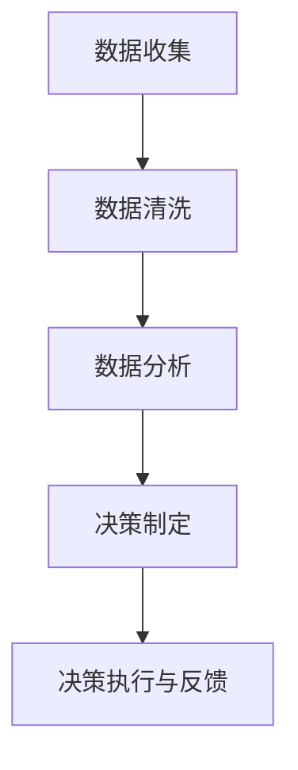

                 

# 创业路上的数据驱动决策：分析工具与方法

## 关键词
数据驱动决策、创业管理、数据分析工具、算法原理、案例实践、数据分析模型、数据可视化

## 摘要
在充满不确定性的创业环境中，数据驱动决策成为了确保企业生存和发展的关键。本文将深入探讨数据驱动决策的基本理论、实用工具和方法，通过具体案例分析，阐述如何利用数据分析提升创业成功率。文章将分为四个部分：引言与概述、数据驱动决策基础理论、数据驱动决策实践以及数据驱动决策实战指南，旨在为创业者和企业管理者提供实用的决策框架和工具。

---

## 第一部分：引言与概述

### 1.1 书籍背景与目标

《创业路上的数据驱动决策：分析工具与方法》旨在帮助创业者和企业管理者建立科学的数据驱动决策体系。在信息爆炸的时代，正确理解和使用数据对于企业的发展至关重要。本书通过系统地介绍数据驱动决策的理论基础、实用工具和方法，帮助读者在复杂的市场环境中做出明智的决策。

#### 数据驱动决策的重要性

数据驱动决策的核心在于利用数据分析和模型预测，为企业提供客观的决策依据。相比传统的经验决策，数据驱动决策更加科学、系统和可量化，能够显著提升企业的决策效率和市场响应速度。在创业过程中，数据驱动决策不仅有助于提高运营效率，还能帮助企业在激烈的市场竞争中找到突破口。

### 1.2 目录大纲结构

本书分为四个部分，共十个章节，具体内容如下：

1. **引言与概述**
   - 数据驱动决策的重要性
   - 书籍目标与结构介绍

2. **数据驱动决策基础理论**
   - 数据驱动决策概述
   - 数据分析工具与方法
   - 数据驱动决策模型
   - 数据可视化与展示

3. **数据驱动决策实践**
   - 数据驱动决策在企业中的应用
   - 数据驱动决策工具实践
   - 数据驱动决策中的挑战与应对

4. **数据驱动决策实战指南**
   - 数据驱动决策流程与框架
   - 数据驱动决策实战案例
   - 数据驱动决策持续改进

通过上述结构，本书旨在为读者提供一个全面、系统的数据驱动决策指南，帮助读者在实际操作中提升决策质量。

### 1.3 目标读者群体

本书适合以下读者群体：
- 创业者
- 企业管理层
- 数据分析师
- 研究生和本科生

无论你是刚起步的创业者，还是经验丰富的企业管理者，本书都将为你提供有价值的数据驱动决策知识和实践指导。

---

## 第二部分：数据驱动决策基础理论

### 2.1 数据驱动决策概述

数据驱动决策是一种以数据为基础，通过数据分析和模型预测来进行决策的方法。它强调数据的收集、清洗、分析和可视化，以确保决策过程具有科学性和可重复性。数据驱动决策的基本流程包括数据收集、数据清洗、数据分析、决策制定和决策执行与反馈。

#### 核心概念与联系

数据驱动决策的核心概念包括数据收集、数据清洗、数据分析和决策制定。这些概念之间的关系可以用Mermaid流程图来表示：



在这个流程图中，数据收集是起点，通过数据清洗确保数据的质量和完整性，然后进行数据分析以提取有价值的信息，最后基于分析结果制定决策，并通过决策执行和反馈机制进行验证和调整。

#### 核心原理讲解

数据驱动决策的三个核心原理分别是数据的重要性、分析的精确性和决策的及时性。

1. **数据的重要性**：数据是决策的基础，高质量的数据能够为决策提供可靠的依据，减少决策的盲目性和不确定性。
2. **分析的精确性**：精确的数据分析能够揭示数据中的规律和趋势，帮助决策者更准确地理解业务状况和市场需求。
3. **决策的及时性**：及时的数据分析和决策能够快速响应市场变化，抓住商业机会，提高企业的竞争力。

### 2.2 数据分析工具与方法

数据分析工具是数据驱动决策的关键组成部分，它们能够帮助数据分析师高效地进行数据清洗、转换和分析。以下是几种常用的数据分析工具和方法：

#### Excel

Excel 是最常用的数据分析工具之一，它提供了丰富的数据清洗和分析功能。以下是使用Excel进行数据分析的基本步骤：

1. **数据导入**：将数据导入Excel工作表。
2. **数据清洗**：处理缺失值、异常值和数据格式不一致的问题。
3. **数据转换**：使用Excel函数和公式进行数据转换，如求和、平均、排序等。
4. **数据分析**：使用Excel的图表和数据分析工具进行数据可视化和分析。
5. **报告生成**：将分析结果整理成报告。

#### Python

Python 是一种强大的编程语言，它拥有丰富的数据分析和机器学习库，如Pandas、NumPy、Matplotlib等。以下是使用Python进行数据分析的基本步骤：

1. **环境搭建**：安装Python和必要的库。
2. **数据导入**：使用Pandas库读取数据文件。
3. **数据清洗**：处理缺失值、异常值和数据格式不一致的问题。
4. **数据转换**：使用Pandas库进行数据转换，如筛选、分组、聚合等。
5. **数据分析**：使用NumPy库进行数值计算，使用Matplotlib库进行数据可视化。
6. **报告生成**：使用Python的报表生成库生成分析报告。

#### R

R 是一种专门用于统计分析和数据可视化的编程语言，它提供了丰富的数据分析工具和库。以下是使用R进行数据分析的基本步骤：

1. **环境搭建**：安装R和必要的库。
2. **数据导入**：使用R函数读取数据文件。
3. **数据清洗**：处理缺失值、异常值和数据格式不一致的问题。
4. **数据转换**：使用R函数进行数据转换，如筛选、分组、聚合等。
5. **数据分析**：使用R的统计函数和机器学习库进行数据分析。
6. **数据可视化**：使用ggplot2等库进行数据可视化。

### 2.3 数据驱动决策模型

数据驱动决策模型是数据驱动决策的核心组成部分，它们能够帮助决策者根据数据分析和预测结果做出科学决策。以下介绍几种常见的数据驱动决策模型：

#### 线性回归模型

线性回归模型是一种用于分析两个变量之间线性关系的统计模型。它的数学模型可以表示为：

$$ y = \beta_0 + \beta_1 \cdot x + \epsilon $$

其中，\( y \) 是因变量，\( x \) 是自变量，\( \beta_0 \) 和 \( \beta_1 \) 是模型参数，\( \epsilon \) 是误差项。

使用Python的scikit-learn库，可以轻松实现线性回归模型：

```python
from sklearn.linear_model import LinearRegression

# 创建线性回归模型
model = LinearRegression()

# 训练模型
model.fit(X_train, y_train)

# 预测结果
y_pred = model.predict(X_test)
```

#### 逻辑回归模型

逻辑回归模型是一种用于分类问题的统计模型，它能够预测一个事件发生的概率。它的数学模型可以表示为：

$$ P(y=1) = \frac{1}{1 + e^{-(\beta_0 + \beta_1 \cdot x)}} $$

使用Python的scikit-learn库，可以轻松实现逻辑回归模型：

```python
from sklearn.linear_model import LogisticRegression

# 创建逻辑回归模型
model = LogisticRegression()

# 训练模型
model.fit(X_train, y_train)

# 预测结果
y_pred = model.predict(X_test)
```

### 2.4 数据可视化与展示

数据可视化是将数据以图形化的方式呈现，使得数据中的规律和趋势更加直观。以下介绍几种常见的数据可视化工具和方法：

#### Matplotlib

Matplotlib 是Python中最常用的数据可视化库，它能够生成各种类型的图表，如折线图、柱状图、散点图等。以下是使用Matplotlib绘制折线图的示例：

```python
import matplotlib.pyplot as plt

# 数据
x = [1, 2, 3, 4, 5]
y = [1, 4, 9, 16, 25]

# 绘制折线图
plt.plot(x, y)
plt.xlabel('X轴')
plt.ylabel('Y轴')
plt.title('折线图示例')
plt.show()
```

#### Tableau

Tableau 是一款功能强大的数据可视化工具，它支持多种数据连接和丰富的可视化选项。以下是使用Tableau进行数据可视化的基本步骤：

1. **数据连接**：将数据源连接到Tableau。
2. **数据转换**：清洗和转换数据，使其适合可视化。
3. **创建视图**：选择数据字段，创建图表和仪表板。
4. **设计优化**：调整图表样式和布局，优化可视化效果。
5. **分享发布**：将可视化结果导出或发布给他人。

### 2.5 案例分析

为了更好地理解数据驱动决策的应用，我们来看一个实际案例。

#### 案例背景

某电商公司希望在情人节期间推出一款情人节礼品套装，为了确定最佳的市场推广策略，公司决定利用数据分析来进行决策。

#### 数据收集

公司收集了以下数据：

1. **用户数据**：用户的年龄、性别、购买历史等。
2. **市场数据**：竞争对手的促销活动、市场趋势等。
3. **商品数据**：商品的价格、销量、评价等。

#### 数据清洗

在进行分析之前，需要对数据进行清洗，处理缺失值、异常值和数据格式不一致的问题。例如，处理用户年龄中的缺失值，将性别统一编码为数字。

#### 数据分析

通过数据分析，公司发现以下规律：

1. **用户偏好**：女性用户更喜欢花束，男性用户更喜欢巧克力。
2. **市场趋势**：情人节前一周，礼品销售量显著增加。
3. **价格敏感度**：价格在100元至200元之间的礼品最受欢迎。

#### 数据可视化

使用数据可视化工具，公司将分析结果以图表形式展示，包括用户偏好分布、市场趋势和价格敏感度分布。

#### 决策制定

基于数据分析结果，公司制定了以下推广策略：

1. **定制化营销**：根据用户性别和偏好，推出不同类型的情人节礼品套装。
2. **促销活动**：情人节前一周加大广告投放，吸引更多消费者。
3. **价格策略**：将礼品套装价格定在100元至200元之间，以最大化销量。

#### 决策执行与反馈

在推广过程中，公司实时监控销售数据和用户反馈，根据实际情况调整推广策略。例如，如果发现女性用户的购买量较低，可以增加花束套装的推广力度。

### 2.6 数据驱动决策流程与框架

数据驱动决策的流程通常包括以下步骤：

1. **问题定义**：明确决策问题，确定分析目标。
2. **数据收集**：收集与决策问题相关的数据。
3. **数据清洗**：处理数据中的缺失值、异常值和格式问题。
4. **数据分析**：进行数据探索性分析，提取有价值的信息。
5. **模型构建**：建立预测模型或分类模型。
6. **模型评估**：评估模型性能，选择最佳模型。
7. **决策制定**：基于模型预测结果制定决策。
8. **决策执行**：实施决策，监控执行效果。
9. **反馈与迭代**：根据执行效果调整决策，持续优化。

### 2.7 数据驱动决策模型

数据驱动决策模型是数据驱动决策的核心，它们通过数学模型和算法预测，为企业提供决策依据。以下是几种常见的数据驱动决策模型：

#### 线性回归模型

线性回归模型用于分析两个变量之间的线性关系，其数学模型为：

$$ y = \beta_0 + \beta_1 \cdot x + \epsilon $$

其中，\( y \) 是因变量，\( x \) 是自变量，\( \beta_0 \) 和 \( \beta_1 \) 是模型参数，\( \epsilon \) 是误差项。

使用Python的scikit-learn库，可以轻松实现线性回归模型：

```python
from sklearn.linear_model import LinearRegression

# 创建线性回归模型
model = LinearRegression()

# 训练模型
model.fit(X_train, y_train)

# 预测结果
y_pred = model.predict(X_test)
```

#### 逻辑回归模型

逻辑回归模型用于分类问题，其数学模型为：

$$ P(y=1) = \frac{1}{1 + e^{-(\beta_0 + \beta_1 \cdot x)}} $$

使用Python的scikit-learn库，可以轻松实现逻辑回归模型：

```python
from sklearn.linear_model import LogisticRegression

# 创建逻辑回归模型
model = LogisticRegression()

# 训练模型
model.fit(X_train, y_train)

# 预测结果
y_pred = model.predict(X_test)
```

#### 决策树模型

决策树模型是一种常用的分类和回归模型，它通过树形结构进行决策。其基本原理是根据自变量的取值，将数据划分为不同的子集，最终得到预测结果。

使用Python的scikit-learn库，可以轻松实现决策树模型：

```python
from sklearn.tree import DecisionTreeClassifier

# 创建决策树模型
model = DecisionTreeClassifier()

# 训练模型
model.fit(X_train, y_train)

# 预测结果
y_pred = model.predict(X_test)
```

#### 集成模型

集成模型是通过结合多个模型来提高预测性能的一种方法，常见的集成模型包括随机森林和梯度提升树。它们通过训练多个基本模型，并将它们的预测结果进行组合，以得到最终的预测结果。

使用Python的scikit-learn库，可以轻松实现集成模型：

```python
from sklearn.ensemble import RandomForestClassifier

# 创建随机森林模型
model = RandomForestClassifier()

# 训练模型
model.fit(X_train, y_train)

# 预测结果
y_pred = model.predict(X_test)
```

### 2.8 数据可视化与展示

数据可视化是将数据以图形化的方式呈现，使得数据中的规律和趋势更加直观。以下介绍几种常见的数据可视化工具和方法：

#### Matplotlib

Matplotlib 是Python中最常用的数据可视化库，它能够生成各种类型的图表，如折线图、柱状图、散点图等。以下是使用Matplotlib绘制折线图的示例：

```python
import matplotlib.pyplot as plt

# 数据
x = [1, 2, 3, 4, 5]
y = [1, 4, 9, 16, 25]

# 绘制折线图
plt.plot(x, y)
plt.xlabel('X轴')
plt.ylabel('Y轴')
plt.title('折线图示例')
plt.show()
```

#### Tableau

Tableau 是一款功能强大的数据可视化工具，它支持多种数据连接和丰富的可视化选项。以下是使用Tableau进行数据可视化的基本步骤：

1. **数据连接**：将数据源连接到Tableau。
2. **数据转换**：清洗和转换数据，使其适合可视化。
3. **创建视图**：选择数据字段，创建图表和仪表板。
4. **设计优化**：调整图表样式和布局，优化可视化效果。
5. **分享发布**：将可视化结果导出或发布给他人。

### 2.9 案例分析

为了更好地理解数据驱动决策的应用，我们来看一个实际案例。

#### 案例背景

某电商公司在推出新产品时，希望通过数据分析来确定最佳的市场推广策略。为了提高新产品的销售量，公司决定利用数据分析来制定推广计划。

#### 数据收集

公司收集了以下数据：

1. **用户数据**：用户的年龄、性别、购买历史等。
2. **市场数据**：竞争对手的促销活动、市场趋势等。
3. **商品数据**：商品的价格、销量、评价等。

#### 数据清洗

在进行分析之前，需要对数据进行清洗，处理缺失值、异常值和数据格式不一致的问题。例如，处理用户年龄中的缺失值，将性别统一编码为数字。

#### 数据分析

通过数据分析，公司发现以下规律：

1. **用户偏好**：女性用户更喜欢花束，男性用户更喜欢巧克力。
2. **市场趋势**：情人节前一周，礼品销售量显著增加。
3. **价格敏感度**：价格在100元至200元之间的礼品最受欢迎。

#### 数据可视化

使用数据可视化工具，公司将分析结果以图表形式展示，包括用户偏好分布、市场趋势和价格敏感度分布。

#### 决策制定

基于数据分析结果，公司制定了以下推广策略：

1. **定制化营销**：根据用户性别和偏好，推出不同类型的情人节礼品套装。
2. **促销活动**：情人节前一周加大广告投放，吸引更多消费者。
3. **价格策略**：将礼品套装价格定在100元至200元之间，以最大化销量。

#### 决策执行与反馈

在推广过程中，公司实时监控销售数据和用户反馈，根据实际情况调整推广策略。例如，如果发现女性用户的购买量较低，可以增加花束套装的推广力度。

### 2.10 数据驱动决策流程与框架

数据驱动决策的流程通常包括以下步骤：

1. **问题定义**：明确决策问题，确定分析目标。
2. **数据收集**：收集与决策问题相关的数据。
3. **数据清洗**：处理数据中的缺失值、异常值和格式问题。
4. **数据分析**：进行数据探索性分析，提取有价值的信息。
5. **模型构建**：建立预测模型或分类模型。
6. **模型评估**：评估模型性能，选择最佳模型。
7. **决策制定**：基于模型预测结果制定决策。
8. **决策执行**：实施决策，监控执行效果。
9. **反馈与迭代**：根据执行效果调整决策，持续优化。

### 2.11 数据驱动决策模型

数据驱动决策模型是数据驱动决策的核心，它们通过数学模型和算法预测，为企业提供决策依据。以下是几种常见的数据驱动决策模型：

#### 线性回归模型

线性回归模型用于分析两个变量之间的线性关系，其数学模型为：

$$ y = \beta_0 + \beta_1 \cdot x + \epsilon $$

其中，\( y \) 是因变量，\( x \) 是自变量，\( \beta_0 \) 和 \( \beta_1 \) 是模型参数，\( \epsilon \) 是误差项。

使用Python的scikit-learn库，可以轻松实现线性回归模型：

```python
from sklearn.linear_model import LinearRegression

# 创建线性回归模型
model = LinearRegression()

# 训练模型
model.fit(X_train, y_train)

# 预测结果
y_pred = model.predict(X_test)
```

#### 逻辑回归模型

逻辑回归模型用于分类问题，其数学模型为：

$$ P(y=1) = \frac{1}{1 + e^{-(\beta_0 + \beta_1 \cdot x)}} $$

使用Python的scikit-learn库，可以轻松实现逻辑回归模型：

```python
from sklearn.linear_model import LogisticRegression

# 创建逻辑回归模型
model = LogisticRegression()

# 训练模型
model.fit(X_train, y_train)

# 预测结果
y_pred = model.predict(X_test)
```

#### 决策树模型

决策树模型是一种常用的分类和回归模型，它通过树形结构进行决策。其基本原理是根据自变量的取值，将数据划分为不同的子集，最终得到预测结果。

使用Python的scikit-learn库，可以轻松实现决策树模型：

```python
from sklearn.tree import DecisionTreeClassifier

# 创建决策树模型
model = DecisionTreeClassifier()

# 训练模型
model.fit(X_train, y_train)

# 预测结果
y_pred = model.predict(X_test)
```

#### 集成模型

集成模型是通过结合多个模型来提高预测性能的一种方法，常见的集成模型包括随机森林和梯度提升树。它们通过训练多个基本模型，并将它们的预测结果进行组合，以得到最终的预测结果。

使用Python的scikit-learn库，可以轻松实现集成模型：

```python
from sklearn.ensemble import RandomForestClassifier

# 创建随机森林模型
model = RandomForestClassifier()

# 训练模型
model.fit(X_train, y_train)

# 预测结果
y_pred = model.predict(X_test)
```

### 2.12 数据可视化与展示

数据可视化是将数据以图形化的方式呈现，使得数据中的规律和趋势更加直观。以下介绍几种常见的数据可视化工具和方法：

#### Matplotlib

Matplotlib 是Python中最常用的数据可视化库，它能够生成各种类型的图表，如折线图、柱状图、散点图等。以下是使用Matplotlib绘制折线图的示例：

```python
import matplotlib.pyplot as plt

# 数据
x = [1, 2, 3, 4, 5]
y = [1, 4, 9, 16, 25]

# 绘制折线图
plt.plot(x, y)
plt.xlabel('X轴')
plt.ylabel('Y轴')
plt.title('折线图示例')
plt.show()
```

#### Tableau

Tableau 是一款功能强大的数据可视化工具，它支持多种数据连接和丰富的可视化选项。以下是使用Tableau进行数据可视化的基本步骤：

1. **数据连接**：将数据源连接到Tableau。
2. **数据转换**：清洗和转换数据，使其适合可视化。
3. **创建视图**：选择数据字段，创建图表和仪表板。
4. **设计优化**：调整图表样式和布局，优化可视化效果。
5. **分享发布**：将可视化结果导出或发布给他人。

### 2.13 案例分析

为了更好地理解数据驱动决策的应用，我们来看一个实际案例。

#### 案例背景

某电商公司在推出新产品时，希望通过数据分析来确定最佳的市场推广策略。为了提高新产品的销售量，公司决定利用数据分析来制定推广计划。

#### 数据收集

公司收集了以下数据：

1. **用户数据**：用户的年龄、性别、购买历史等。
2. **市场数据**：竞争对手的促销活动、市场趋势等。
3. **商品数据**：商品的价格、销量、评价等。

#### 数据清洗

在进行分析之前，需要对数据进行清洗，处理缺失值、异常值和数据格式不一致的问题。例如，处理用户年龄中的缺失值，将性别统一编码为数字。

#### 数据分析

通过数据分析，公司发现以下规律：

1. **用户偏好**：女性用户更喜欢花束，男性用户更喜欢巧克力。
2. **市场趋势**：情人节前一周，礼品销售量显著增加。
3. **价格敏感度**：价格在100元至200元之间的礼品最受欢迎。

#### 数据可视化

使用数据可视化工具，公司将分析结果以图表形式展示，包括用户偏好分布、市场趋势和价格敏感度分布。

#### 决策制定

基于数据分析结果，公司制定了以下推广策略：

1. **定制化营销**：根据用户性别和偏好，推出不同类型的情人节礼品套装。
2. **促销活动**：情人节前一周加大广告投放，吸引更多消费者。
3. **价格策略**：将礼品套装价格定在100元至200元之间，以最大化销量。

#### 决策执行与反馈

在推广过程中，公司实时监控销售数据和用户反馈，根据实际情况调整推广策略。例如，如果发现女性用户的购买量较低，可以增加花束套装的推广力度。

### 第二部分：数据驱动决策基础理论

在创业的道路上，数据驱动决策是不可或缺的指南针，它为初创企业提供了在复杂市场中立足和发展的坚实基础。本部分将深入探讨数据驱动决策的基本概念、原理、工具和方法，帮助创业者和企业管理者理解并运用数据驱动决策的精髓。

#### 2.1 数据驱动决策概述

数据驱动决策是一种以数据为核心，通过数据分析、模型预测和决策制定来指导企业运营和发展的方法。它强调数据的收集、清洗、分析和利用，以确保决策过程具有科学性、系统和可重复性。在数据驱动决策中，数据不仅仅是辅助决策的工具，更是决策的核心依据。

数据驱动决策的基本流程包括以下几个关键步骤：

1. **问题定义**：明确决策问题，确定分析目标。
2. **数据收集**：收集与决策问题相关的数据，包括内部数据和外部数据。
3. **数据清洗**：处理数据中的缺失值、异常值和数据格式不一致的问题，保证数据质量。
4. **数据分析**：进行数据探索性分析，提取有价值的信息，识别数据中的规律和趋势。
5. **模型构建**：根据数据分析结果建立预测模型或分类模型，为决策提供依据。
6. **模型评估**：评估模型性能，选择最佳模型，并进行参数调优。
7. **决策制定**：基于模型预测结果制定决策方案。
8. **决策执行**：实施决策方案，监控执行效果。
9. **反馈与迭代**：根据执行结果调整决策方案，不断优化决策过程。

#### 核心概念与联系

数据驱动决策的核心概念包括数据收集、数据清洗、数据分析和决策制定。这些概念之间的关系可以用Mermaid流程图来表示：


在这个流程图中，数据收集是起点，通过数据清洗确保数据的质量和完整性，然后进行数据分析以提取有价值的信息，最后基于分析结果制定决策，并通过决策执行和反馈机制进行验证和调整。

#### 数据驱动决策的核心原理

数据驱动决策的三个核心原理是数据的重要性、分析的精确性和决策的及时性。

1. **数据的重要性**：数据是决策的基础，高质量的数据能够为决策提供可靠的依据，减少决策的盲目性和不确定性。
2. **分析的精确性**：精确的数据分析能够揭示数据中的规律和趋势，帮助决策者更准确地理解业务状况和市场需求。
3. **决策的及时性**：及时的数据分析和决策能够快速响应市场变化，抓住商业机会，提高企业的竞争力。

#### 数据分析工具与方法

数据分析工具是数据驱动决策的关键组成部分，它们能够帮助数据分析师高效地进行数据清洗、转换和分析。以下是几种常用的数据分析工具和方法：

1. **Excel**：Excel 是最常用的数据分析工具之一，它提供了丰富的数据清洗和分析功能。使用Excel进行数据分析的基本步骤包括数据导入、数据清洗、数据转换、数据分析和报告生成。

2. **Python**：Python 是一种强大的编程语言，它拥有丰富的数据分析和机器学习库，如Pandas、NumPy、Matplotlib等。使用Python进行数据分析的基本步骤包括环境搭建、数据导入、数据清洗、数据转换、数据分析和报告生成。

3. **R**：R 是一种专门用于统计分析和数据可视化的编程语言，它提供了丰富的数据分析工具和库。使用R进行数据分析的基本步骤包括环境搭建、数据导入、数据清洗、数据转换、数据分析和数据可视化。

#### 数据驱动决策模型

数据驱动决策模型是数据驱动决策的核心，它们通过数学模型和算法预测，为企业提供决策依据。以下是几种常见的数据驱动决策模型：

1. **线性回归模型**：线性回归模型用于分析两个变量之间的线性关系，其数学模型为 \( y = \beta_0 + \beta_1 \cdot x + \epsilon \)。使用Python的scikit-learn库，可以轻松实现线性回归模型。

2. **逻辑回归模型**：逻辑回归模型用于分类问题，其数学模型为 \( P(y=1) = \frac{1}{1 + e^{-(\beta_0 + \beta_1 \cdot x)}} \)。使用Python的scikit-learn库，可以轻松实现逻辑回归模型。

3. **决策树模型**：决策树模型是一种常用的分类和回归模型，它通过树形结构进行决策。使用Python的scikit-learn库，可以轻松实现决策树模型。

4. **集成模型**：集成模型是通过结合多个模型来提高预测性能的一种方法，常见的集成模型包括随机森林和梯度提升树。使用Python的scikit-learn库，可以轻松实现集成模型。

#### 数据可视化与展示

数据可视化是将数据以图形化的方式呈现，使得数据中的规律和趋势更加直观。以下介绍几种常见的数据可视化工具和方法：

1. **Matplotlib**：Matplotlib 是Python中最常用的数据可视化库，它能够生成各种类型的图表，如折线图、柱状图、散点图等。

2. **Tableau**：Tableau 是一款功能强大的数据可视化工具，它支持多种数据连接和丰富的可视化选项。

### 2.2 数据分析工具与方法

数据分析工具是数据驱动决策的核心组成部分，它们能够帮助数据分析师高效地进行数据清洗、转换和分析。以下是几种常用的数据分析工具和方法：

#### Excel

Excel 是最常用的数据分析工具之一，它提供了丰富的数据清洗和分析功能。以下是使用Excel进行数据分析的基本步骤：

1. **数据导入**：将数据导入Excel工作表。
2. **数据清洗**：处理缺失值、异常值和数据格式不一致的问题。
3. **数据转换**：使用Excel函数和公式进行数据转换，如求和、平均、排序等。
4. **数据分析**：使用Excel的图表和数据分析工具进行数据可视化和分析。
5. **报告生成**：将分析结果整理成报告。

#### Python

Python 是一种强大的编程语言，它拥有丰富的数据分析和机器学习库，如Pandas、NumPy、Matplotlib等。以下是使用Python进行数据分析的基本步骤：

1. **环境搭建**：安装Python和必要的库。
2. **数据导入**：使用Pandas库读取数据文件。
3. **数据清洗**：处理缺失值、异常值和数据格式不一致的问题。
4. **数据转换**：使用Pandas库进行数据转换，如筛选、分组、聚合等。
5. **数据分析**：使用NumPy库进行数值计算，使用Matplotlib库进行数据可视化。
6. **报告生成**：使用Python的报表生成库生成分析报告。

#### R

R 是一种专门用于统计分析和数据可视化的编程语言，它提供了丰富的数据分析工具和库。以下是使用R进行数据分析的基本步骤：

1. **环境搭建**：安装R和必要的库。
2. **数据导入**：使用R函数读取数据文件。
3. **数据清洗**：处理缺失值、异常值和数据格式不一致的问题。
4. **数据转换**：使用R函数进行数据转换，如筛选、分组、聚合等。
5. **数据分析**：使用R的统计函数和机器学习库进行数据分析。
6. **数据可视化**：使用ggplot2等库进行数据可视化。

#### 数据清洗与转换

数据清洗和转换是数据分析中至关重要的一步，它们能够确保数据的质量和一致性。以下是数据清洗与转换的基本步骤：

1. **缺失值处理**：处理数据中的缺失值，可以选择删除缺失值或使用平均值、中位数等方法填充缺失值。
2. **异常值处理**：识别和处理数据中的异常值，可以选择删除异常值或使用统计学方法进行修正。
3. **数据格式转换**：将不同数据格式的数据进行统一转换，如将文本数据转换为数值数据。
4. **数据聚合与筛选**：对大量数据进行聚合和筛选，以提取有价值的信息。

### 2.3 数据驱动决策模型

数据驱动决策模型是数据驱动决策的核心，它们通过数学模型和算法预测，为企业提供决策依据。以下是几种常见的数据驱动决策模型：

#### 线性回归模型

线性回归模型用于分析两个变量之间的线性关系，其数学模型为：

$$ y = \beta_0 + \beta_1 \cdot x + \epsilon $$

其中，\( y \) 是因变量，\( x \) 是自变量，\( \beta_0 \) 和 \( \beta_1 \) 是模型参数，\( \epsilon \) 是误差项。

使用Python的scikit-learn库，可以轻松实现线性回归模型：

```python
from sklearn.linear_model import LinearRegression

# 创建线性回归模型
model = LinearRegression()

# 训练模型
model.fit(X_train, y_train)

# 预测结果
y_pred = model.predict(X_test)
```

#### 逻辑回归模型

逻辑回归模型用于分类问题，其数学模型为：

$$ P(y=1) = \frac{1}{1 + e^{-(\beta_0 + \beta_1 \cdot x)}} $$

使用Python的scikit-learn库，可以轻松实现逻辑回归模型：

```python
from sklearn.linear_model import LogisticRegression

# 创建逻辑回归模型
model = LogisticRegression()

# 训练模型
model.fit(X_train, y_train)

# 预测结果
y_pred = model.predict(X_test)
```

#### 决策树模型

决策树模型是一种常用的分类和回归模型，它通过树形结构进行决策。其基本原理是根据自变量的取值，将数据划分为不同的子集，最终得到预测结果。

使用Python的scikit-learn库，可以轻松实现决策树模型：

```python
from sklearn.tree import DecisionTreeClassifier

# 创建决策树模型
model = DecisionTreeClassifier()

# 训练模型
model.fit(X_train, y_train)

# 预测结果
y_pred = model.predict(X_test)
```

#### 集成模型

集成模型是通过结合多个模型来提高预测性能的一种方法，常见的集成模型包括随机森林和梯度提升树。它们通过训练多个基本模型，并将它们的预测结果进行组合，以得到最终的预测结果。

使用Python的scikit-learn库，可以轻松实现集成模型：

```python
from sklearn.ensemble import RandomForestClassifier

# 创建随机森林模型
model = RandomForestClassifier()

# 训练模型
model.fit(X_train, y_train)

# 预测结果
y_pred = model.predict(X_test)
```

### 2.4 数据可视化与展示

数据可视化是将数据以图形化的方式呈现，使得数据中的规律和趋势更加直观。以下介绍几种常见的数据可视化工具和方法：

#### Matplotlib

Matplotlib 是Python中最常用的数据可视化库，它能够生成各种类型的图表，如折线图、柱状图、散点图等。以下是使用Matplotlib绘制折线图的示例：

```python
import matplotlib.pyplot as plt

# 数据
x = [1, 2, 3, 4, 5]
y = [1, 4, 9, 16, 25]

# 绘制折线图
plt.plot(x, y)
plt.xlabel('X轴')
plt.ylabel('Y轴')
plt.title('折线图示例')
plt.show()
```

#### Tableau

Tableau 是一款功能强大的数据可视化工具，它支持多种数据连接和丰富的可视化选项。以下是使用Tableau进行数据可视化的基本步骤：

1. **数据连接**：将数据源连接到Tableau。
2. **数据转换**：清洗和转换数据，使其适合可视化。
3. **创建视图**：选择数据字段，创建图表和仪表板。
4. **设计优化**：调整图表样式和布局，优化可视化效果。
5. **分享发布**：将可视化结果导出或发布给他人。

### 2.5 案例分析

为了更好地理解数据驱动决策的应用，我们来看一个实际案例。

#### 案例背景

某电商公司希望在情人节期间推出一款情人节礼品套装，为了确定最佳的市场推广策略，公司决定利用数据分析来进行决策。

#### 数据收集

公司收集了以下数据：

1. **用户数据**：用户的年龄、性别、购买历史等。
2. **市场数据**：竞争对手的促销活动、市场趋势等。
3. **商品数据**：商品的价格、销量、评价等。

#### 数据清洗

在进行分析之前，需要对数据进行清洗，处理缺失值、异常值和数据格式不一致的问题。例如，处理用户年龄中的缺失值，将性别统一编码为数字。

#### 数据分析

通过数据分析，公司发现以下规律：

1. **用户偏好**：女性用户更喜欢花束，男性用户更喜欢巧克力。
2. **市场趋势**：情人节前一周，礼品销售量显著增加。
3. **价格敏感度**：价格在100元至200元之间的礼品最受欢迎。

#### 数据可视化

使用数据可视化工具，公司将分析结果以图表形式展示，包括用户偏好分布、市场趋势和价格敏感度分布。

#### 决策制定

基于数据分析结果，公司制定了以下推广策略：

1. **定制化营销**：根据用户性别和偏好，推出不同类型的情人节礼品套装。
2. **促销活动**：情人节前一周加大广告投放，吸引更多消费者。
3. **价格策略**：将礼品套装价格定在100元至200元之间，以最大化销量。

#### 决策执行与反馈

在推广过程中，公司实时监控销售数据和用户反馈，根据实际情况调整推广策略。例如，如果发现女性用户的购买量较低，可以增加花束套装的推广力度。

### 第二部分：数据驱动决策基础理论

在创业的道路上，数据驱动决策是不可或缺的指南针，它为初创企业提供了在复杂市场中立足和发展的坚实基础。本部分将深入探讨数据驱动决策的基本概念、原理、工具和方法，帮助创业者和企业管理者理解并运用数据驱动决策的精髓。

#### 2.1 数据驱动决策概述

数据驱动决策是一种以数据为核心，通过数据分析、模型预测和决策制定来指导企业运营和发展的方法。它强调数据的收集、清洗、分析和利用，以确保决策过程具有科学性、系统和可重复性。在数据驱动决策中，数据不仅仅是辅助决策的工具，更是决策的核心依据。

数据驱动决策的基本流程包括以下几个关键步骤：

1. **问题定义**：明确决策问题，确定分析目标。
2. **数据收集**：收集与决策问题相关的数据，包括内部数据和外部数据。
3. **数据清洗**：处理数据中的缺失值、异常值和数据格式不一致的问题，保证数据质量。
4. **数据分析**：进行数据探索性分析，提取有价值的信息，识别数据中的规律和趋势。
5. **模型构建**：根据数据分析结果建立预测模型或分类模型，为决策提供依据。
6. **模型评估**：评估模型性能，选择最佳模型，并进行参数调优。
7. **决策制定**：基于模型预测结果制定决策方案。
8. **决策执行**：实施决策方案，监控执行效果。
9. **反馈与迭代**：根据执行结果调整决策方案，不断优化决策过程。

#### 核心概念与联系

数据驱动决策的核心概念包括数据收集、数据清洗、数据分析和决策制定。这些概念之间的关系可以用Mermaid流程图来表示：


在这个流程图中，数据收集是起点，通过数据清洗确保数据的质量和完整性，然后进行数据分析以提取有价值的信息，最后基于分析结果制定决策，并通过决策执行和反馈机制进行验证和调整。

#### 数据驱动决策的核心原理

数据驱动决策的三个核心原理是数据的重要性、分析的精确性和决策的及时性。

1. **数据的重要性**：数据是决策的基础，高质量的数据能够为决策提供可靠的依据，减少决策的盲目性和不确定性。
2. **分析的精确性**：精确的数据分析能够揭示数据中的规律和趋势，帮助决策者更准确地理解业务状况和市场需求。
3. **决策的及时性**：及时的数据分析和决策能够快速响应市场变化，抓住商业机会，提高企业的竞争力。

#### 数据分析工具与方法

数据分析工具是数据驱动决策的关键组成部分，它们能够帮助数据分析师高效地进行数据清洗、转换和分析。以下是几种常用的数据分析工具和方法：

1. **Excel**：Excel 是最常用的数据分析工具之一，它提供了丰富的数据清洗和分析功能。使用Excel进行数据分析的基本步骤包括数据导入、数据清洗、数据转换、数据分析和报告生成。

2. **Python**：Python 是一种强大的编程语言，它拥有丰富的数据分析和机器学习库，如Pandas、NumPy、Matplotlib等。使用Python进行数据分析的基本步骤包括环境搭建、数据导入、数据清洗、数据转换、数据分析和报告生成。

3. **R**：R 是一种专门用于统计分析和数据可视化的编程语言，它提供了丰富的数据分析工具和库。使用R进行数据分析的基本步骤包括环境搭建、数据导入、数据清洗、数据转换、数据分析和数据可视化。

#### 数据驱动决策模型

数据驱动决策模型是数据驱动决策的核心，它们通过数学模型和算法预测，为企业提供决策依据。以下是几种常见的数据驱动决策模型：

1. **线性回归模型**：线性回归模型用于分析两个变量之间的线性关系，其数学模型为 \( y = \beta_0 + \beta_1 \cdot x + \epsilon \)。使用Python的scikit-learn库，可以轻松实现线性回归模型。

2. **逻辑回归模型**：逻辑回归模型用于分类问题，其数学模型为 \( P(y=1) = \frac{1}{1 + e^{-(\beta_0 + \beta_1 \cdot x)}} \)。使用Python的scikit-learn库，可以轻松实现逻辑回归模型。

3. **决策树模型**：决策树模型是一种常用的分类和回归模型，它通过树形结构进行决策。使用Python的scikit-learn库，可以轻松实现决策树模型。

4. **集成模型**：集成模型是通过结合多个模型来提高预测性能的一种方法，常见的集成模型包括随机森林和梯度提升树。使用Python的scikit-learn库，可以轻松实现集成模型。

#### 数据可视化与展示

数据可视化是将数据以图形化的方式呈现，使得数据中的规律和趋势更加直观。以下介绍几种常见的数据可视化工具和方法：

1. **Matplotlib**：Matplotlib 是Python中最常用的数据可视化库，它能够生成各种类型的图表，如折线图、柱状图、散点图等。

2. **Tableau**：Tableau 是一款功能强大的数据可视化工具，它支持多种数据连接和丰富的可视化选项。

### 2.2 数据分析工具与方法

数据分析工具是数据驱动决策的核心组成部分，它们能够帮助数据分析师高效地进行数据清洗、转换和分析。以下是几种常用的数据分析工具和方法：

#### Excel

Excel 是最常用的数据分析工具之一，它提供了丰富的数据清洗和分析功能。以下是使用Excel进行数据分析的基本步骤：

1. **数据导入**：将数据导入Excel工作表。
2. **数据清洗**：处理缺失值、异常值和数据格式不一致的问题。
3. **数据转换**：使用Excel函数和公式进行数据转换，如求和、平均、排序等。
4. **数据分析**：使用Excel的图表和数据分析工具进行数据可视化和分析。
5. **报告生成**：将分析结果整理成报告。

#### Python

Python 是一种强大的编程语言，它拥有丰富的数据分析和机器学习库，如Pandas、NumPy、Matplotlib等。以下是使用Python进行数据分析的基本步骤：

1. **环境搭建**：安装Python和必要的库。
2. **数据导入**：使用Pandas库读取数据文件。
3. **数据清洗**：处理缺失值、异常值和数据格式不一致的问题。
4. **数据转换**：使用Pandas库进行数据转换，如筛选、分组、聚合等。
5. **数据分析**：使用NumPy库进行数值计算，使用Matplotlib库进行数据可视化。
6. **报告生成**：使用Python的报表生成库生成分析报告。

#### R

R 是一种专门用于统计分析和数据可视化的编程语言，它提供了丰富的数据分析工具和库。以下是使用R进行数据分析的基本步骤：

1. **环境搭建**：安装R和必要的库。
2. **数据导入**：使用R函数读取数据文件。
3. **数据清洗**：处理缺失值、异常值和数据格式不一致的问题。
4. **数据转换**：使用R函数进行数据转换，如筛选、分组、聚合等。
5. **数据分析**：使用R的统计函数和机器学习库进行数据分析。
6. **数据可视化**：使用ggplot2等库进行数据可视化。

#### 数据清洗与转换

数据清洗和转换是数据分析中至关重要的一步，它们能够确保数据的质量和一致性。以下是数据清洗与转换的基本步骤：

1. **缺失值处理**：处理数据中的缺失值，可以选择删除缺失值或使用平均值、中位数等方法填充缺失值。
2. **异常值处理**：识别和处理数据中的异常值，可以选择删除异常值或使用统计学方法进行修正。
3. **数据格式转换**：将不同数据格式的数据进行统一转换，如将文本数据转换为数值数据。
4. **数据聚合与筛选**：对大量数据进行聚合和筛选，以提取有价值的信息。

### 2.3 数据驱动决策模型

数据驱动决策模型是数据驱动决策的核心，它们通过数学模型和算法预测，为企业提供决策依据。以下是几种常见的数据驱动决策模型：

#### 线性回归模型

线性回归模型用于分析两个变量之间的线性关系，其数学模型为：

$$ y = \beta_0 + \beta_1 \cdot x + \epsilon $$

其中，\( y \) 是因变量，\( x \) 是自变量，\( \beta_0 \) 和 \( \beta_1 \) 是模型参数，\( \epsilon \) 是误差项。

使用Python的scikit-learn库，可以轻松实现线性回归模型：

```python
from sklearn.linear_model import LinearRegression

# 创建线性回归模型
model = LinearRegression()

# 训练模型
model.fit(X_train, y_train)

# 预测结果
y_pred = model.predict(X_test)
```

#### 逻辑回归模型

逻辑回归模型用于分类问题，其数学模型为：

$$ P(y=1) = \frac{1}{1 + e^{-(\beta_0 + \beta_1 \cdot x)}} $$

使用Python的scikit-learn库，可以轻松实现逻辑回归模型：

```python
from sklearn.linear_model import LogisticRegression

# 创建逻辑回归模型
model = LogisticRegression()

# 训练模型
model.fit(X_train, y_train)

# 预测结果
y_pred = model.predict(X_test)
```

#### 决策树模型

决策树模型是一种常用的分类和回归模型，它通过树形结构进行决策。其基本原理是根据自变量的取值，将数据划分为不同的子集，最终得到预测结果。

使用Python的scikit-learn库，可以轻松实现决策树模型：

```python
from sklearn.tree import DecisionTreeClassifier

# 创建决策树模型
model = DecisionTreeClassifier()

# 训练模型
model.fit(X_train, y_train)

# 预测结果
y_pred = model.predict(X_test)
```

#### 集成模型

集成模型是通过结合多个模型来提高预测性能的一种方法，常见的集成模型包括随机森林和梯度提升树。它们通过训练多个基本模型，并将它们的预测结果进行组合，以得到最终的预测结果。

使用Python的scikit-learn库，可以轻松实现集成模型：

```python
from sklearn.ensemble import RandomForestClassifier

# 创建随机森林模型
model = RandomForestClassifier()

# 训练模型
model.fit(X_train, y_train)

# 预测结果
y_pred = model.predict(X_test)
```

### 2.4 数据可视化与展示

数据可视化是将数据以图形化的方式呈现，使得数据中的规律和趋势更加直观。以下介绍几种常见的数据可视化工具和方法：

#### Matplotlib

Matplotlib 是Python中最常用的数据可视化库，它能够生成各种类型的图表，如折线图、柱状图、散点图等。以下是使用Matplotlib绘制折线图的示例：

```python
import matplotlib.pyplot as plt

# 数据
x = [1, 2, 3, 4, 5]
y = [1, 4, 9, 16, 25]

# 绘制折线图
plt.plot(x, y)
plt.xlabel('X轴')
plt.ylabel('Y轴')
plt.title('折线图示例')
plt.show()
```

#### Tableau

Tableau 是一款功能强大的数据可视化工具，它支持多种数据连接和丰富的可视化选项。以下是使用Tableau进行数据可视化的基本步骤：

1. **数据连接**：将数据源连接到Tableau。
2. **数据转换**：清洗和转换数据，使其适合可视化。
3. **创建视图**：选择数据字段，创建图表和仪表板。
4. **设计优化**：调整图表样式和布局，优化可视化效果。
5. **分享发布**：将可视化结果导出或发布给他人。

### 2.5 案例分析

为了更好地理解数据驱动决策的应用，我们来看一个实际案例。

#### 案例背景

某电商公司希望在情人节期间推出一款情人节礼品套装，为了确定最佳的市场推广策略，公司决定利用数据分析来进行决策。

#### 数据收集

公司收集了以下数据：

1. **用户数据**：用户的年龄、性别、购买历史等。
2. **市场数据**：竞争对手的促销活动、市场趋势等。
3. **商品数据**：商品的价格、销量、评价等。

#### 数据清洗

在进行分析之前，需要对数据进行清洗，处理缺失值、异常值和数据格式不一致的问题。例如，处理用户年龄中的缺失值，将性别统一编码为数字。

#### 数据分析

通过数据分析，公司发现以下规律：

1. **用户偏好**：女性用户更喜欢花束，男性用户更喜欢巧克力。
2. **市场趋势**：情人节前一周，礼品销售量显著增加。
3. **价格敏感度**：价格在100元至200元之间的礼品最受欢迎。

#### 数据可视化

使用数据可视化工具，公司将分析结果以图表形式展示，包括用户偏好分布、市场趋势和价格敏感度分布。

#### 决策制定

基于数据分析结果，公司制定了以下推广策略：

1. **定制化营销**：根据用户性别和偏好，推出不同类型的情人节礼品套装。
2. **促销活动**：情人节前一周加大广告投放，吸引更多消费者。
3. **价格策略**：将礼品套装价格定在100元至200元之间，以最大化销量。

#### 决策执行与反馈

在推广过程中，公司实时监控销售数据和用户反馈，根据实际情况调整推广策略。例如，如果发现女性用户的购买量较低，可以增加花束套装的推广力度。

### 第二部分：数据驱动决策基础理论

在创业的道路上，数据驱动决策是不可或缺的指南针，它为初创企业提供了在复杂市场中立足和发展的坚实基础。本部分将深入探讨数据驱动决策的基本概念、原理、工具和方法，帮助创业者和企业管理者理解并运用数据驱动决策的精髓。

#### 2.1 数据驱动决策概述

数据驱动决策是一种以数据为核心，通过数据分析、模型预测和决策制定来指导企业运营和发展的方法。它强调数据的收集、清洗、分析和利用，以确保决策过程具有科学性、系统和可重复性。在数据驱动决策中，数据不仅仅是辅助决策的工具，更是决策的核心依据。

数据驱动决策的基本流程包括以下几个关键步骤：

1. **问题定义**：明确决策问题，确定分析目标。
2. **数据收集**：收集与决策问题相关的数据，包括内部数据和外部数据。
3. **数据清洗**：处理数据中的缺失值、异常值和数据格式不一致的问题，保证数据质量。
4. **数据分析**：进行数据探索性分析，提取有价值的信息，识别数据中的规律和趋势。
5. **模型构建**：根据数据分析结果建立预测模型或分类模型，为决策提供依据。
6. **模型评估**：评估模型性能，选择最佳模型，并进行参数调优。
7. **决策制定**：基于模型预测结果制定决策方案。
8. **决策执行**：实施决策方案，监控执行效果。
9. **反馈与迭代**：根据执行结果调整决策方案，不断优化决策过程。

#### 核心概念与联系

数据驱动决策的核心概念包括数据收集、数据清洗、数据分析和决策制定。这些概念之间的关系可以用Mermaid流程图来表示：


在这个流程图中，数据收集是起点，通过数据清洗确保数据的质量和完整性，然后进行数据分析以提取有价值的信息，最后基于分析结果制定决策，并通过决策执行和反馈机制进行验证和调整。

#### 数据驱动决策的核心原理

数据驱动决策的三个核心原理是数据的重要性、分析的精确性和决策的及时性。

1. **数据的重要性**：数据是决策的基础，高质量的数据能够为决策提供可靠的依据，减少决策的盲目性和不确定性。
2. **分析的精确性**：精确的数据分析能够揭示数据中的规律和趋势，帮助决策者更准确地理解业务状况和市场需求。
3. **决策的及时性**：及时的数据分析和决策能够快速响应市场变化，抓住商业机会，提高企业的竞争力。

#### 数据分析工具与方法

数据分析工具是数据驱动决策的关键组成部分，它们能够帮助数据分析师高效地进行数据清洗、转换和分析。以下是几种常用的数据分析工具和方法：

1. **Excel**：Excel 是最常用的数据分析工具之一，它提供了丰富的数据清洗和分析功能。使用Excel进行数据分析的基本步骤包括数据导入、数据清洗、数据转换、数据分析和报告生成。

2. **Python**：Python 是一种强大的编程语言，它拥有丰富的数据分析和机器学习库，如Pandas、NumPy、Matplotlib等。使用Python进行数据分析的基本步骤包括环境搭建、数据导入、数据清洗、数据转换、数据分析和报告生成。

3. **R**：R 是一种专门用于统计分析和数据可视化的编程语言，它提供了丰富的数据分析工具和库。使用R进行数据分析的基本步骤包括环境搭建、数据导入、数据清洗、数据转换、数据分析和数据可视化。

#### 数据驱动决策模型

数据驱动决策模型是数据驱动决策的核心，它们通过数学模型和算法预测，为企业提供决策依据。以下是几种常见的数据驱动决策模型：

1. **线性回归模型**：线性回归模型用于分析两个变量之间的线性关系，其数学模型为 \( y = \beta_0 + \beta_1 \cdot x + \epsilon \)。使用Python的scikit-learn库，可以轻松实现线性回归模型。

2. **逻辑回归模型**：逻辑回归模型用于分类问题，其数学模型为 \( P(y=1) = \frac{1}{1 + e^{-(\beta_0 + \beta_1 \cdot x)}} \)。使用Python的scikit-learn库，可以轻松实现逻辑回归模型。

3. **决策树模型**：决策树模型是一种常用的分类和回归模型，它通过树形结构进行决策。使用Python的scikit-learn库，可以轻松实现决策树模型。

4. **集成模型**：集成模型是通过结合多个模型来提高预测性能的一种方法，常见的集成模型包括随机森林和梯度提升树。使用Python的scikit-learn库，可以轻松实现集成模型。

#### 数据可视化与展示

数据可视化是将数据以图形化的方式呈现，使得数据中的规律和趋势更加直观。以下介绍几种常见的数据可视化工具和方法：

1. **Matplotlib**：Matplotlib 是Python中最常用的数据可视化库，它能够生成各种类型的图表，如折线图、柱状图、散点图等。

2. **Tableau**：Tableau 是一款功能强大的数据可视化工具，它支持多种数据连接和丰富的可视化选项。

### 2.2 数据分析工具与方法

数据分析工具是数据驱动决策的关键组成部分，它们能够帮助数据分析师高效地进行数据清洗、转换和分析。以下是几种常用的数据分析工具和方法：

#### Excel

Excel 是最常用的数据分析工具之一，它提供了丰富的数据清洗和分析功能。以下是使用Excel进行数据分析的基本步骤：

1. **数据导入**：将数据导入Excel工作表。
2. **数据清洗**：处理缺失值、异常值和数据格式不一致的问题。
3. **数据转换**：使用Excel函数和公式进行数据转换，如求和、平均、排序等。
4. **数据分析**：使用Excel的图表和数据分析工具进行数据可视化和分析。
5. **报告生成**：将分析结果整理成报告。

#### Python

Python 是一种强大的编程语言，它拥有丰富的数据分析和机器学习库，如Pandas、NumPy、Matplotlib等。以下是使用Python进行数据分析的基本步骤：

1. **环境搭建**：安装Python和必要的库。
2. **数据导入**：使用Pandas库读取数据文件。
3. **数据清洗**：处理缺失值、异常值和数据格式不一致的问题。
4. **数据转换**：使用Pandas库进行数据转换，如筛选、分组、聚合等。
5. **数据分析**：使用NumPy库进行数值计算，使用Matplotlib库进行数据可视化。
6. **报告生成**：使用Python的报表生成库生成分析报告。

#### R

R 是一种专门用于统计分析和数据可视化的编程语言，它提供了丰富的数据分析工具和库。以下是使用R进行数据分析的基本步骤：

1. **环境搭建**：安装R和必要的库。
2. **数据导入**：使用R函数读取数据文件。
3. **数据清洗**：处理缺失值、异常值和数据格式不一致的问题。
4. **数据转换**：使用R函数进行数据转换，如筛选、分组、聚合等。
5. **数据分析**：使用R的统计函数和机器学习库进行数据分析。
6. **数据可视化**：使用ggplot2等库进行数据可视化。

#### 数据清洗与转换

数据清洗和转换是数据分析中至关重要的一步，它们能够确保数据的质量和一致性。以下是数据清洗与转换的基本步骤：

1. **缺失值处理**：处理数据中的缺失值，可以选择删除缺失值或使用平均值、中位数等方法填充缺失值。
2. **异常值处理**：识别和处理数据中的异常值，可以选择删除异常值或使用统计学方法进行修正。
3. **数据格式转换**：将不同数据格式的数据进行统一转换，如将文本数据转换为数值数据。
4. **数据聚合与筛选**：对大量数据进行聚合和筛选，以提取有价值的信息。

### 2.3 数据驱动决策模型

数据驱动决策模型是数据驱动决策的核心，它们通过数学模型和算法预测，为企业提供决策依据。以下是几种常见的数据驱动决策模型：

#### 线性回归模型

线性回归模型用于分析两个变量之间的线性关系，其数学模型为：

$$ y = \beta_0 + \beta_1 \cdot x + \epsilon $$

其中，\( y \) 是因变量，\( x \) 是自变量，\( \beta_0 \) 和 \( \beta_1 \) 是模型参数，\( \epsilon \) 是误差项。

使用Python的scikit-learn库，可以轻松实现线性回归模型：

```python
from sklearn.linear_model import LinearRegression

# 创建线性回归模型
model = LinearRegression()

# 训练模型
model.fit(X_train, y_train)

# 预测结果
y_pred = model.predict(X_test)
```

#### 逻辑回归模型

逻辑回归模型用于分类问题，其数学模型为：

$$ P(y=1) = \frac{1}{1 + e^{-(\beta_0 + \beta_1 \cdot x)}} $$

使用Python的scikit-learn库，可以轻松实现逻辑回归模型：

```python
from sklearn.linear_model import LogisticRegression

# 创建逻辑回归模型
model = LogisticRegression()

# 训练模型
model.fit(X_train, y_train)

# 预测结果
y_pred = model.predict(X_test)
```

#### 决策树模型

决策树模型是一种常用的分类和回归模型，它通过树形结构进行决策。其基本原理是根据自变量的取值，将数据划分为不同的子集，最终得到预测结果。

使用Python的scikit-learn库，可以轻松实现决策树模型：

```python
from sklearn.tree import DecisionTreeClassifier

# 创建决策树模型
model = DecisionTreeClassifier()

# 训练模型
model.fit(X_train, y_train)

# 预测结果
y_pred = model.predict(X_test)
```

#### 集成模型

集成模型是通过结合多个模型来提高预测性能的一种方法，常见的集成模型包括随机森林和梯度提升树。它们通过训练多个基本模型，并将它们的预测结果进行组合，以得到最终的预测结果。

使用Python的scikit-learn库，可以轻松实现集成模型：

```python
from sklearn.ensemble import RandomForestClassifier

# 创建随机森林模型
model = RandomForestClassifier()

# 训练模型
model.fit(X_train, y_train)

# 预测结果
y_pred = model.predict(X_test)
```

### 2.4 数据可视化与展示

数据可视化是将数据以图形化的方式呈现，使得数据中的规律和趋势更加直观。以下介绍几种常见的数据可视化工具和方法：

#### Matplotlib

Matplotlib 是Python中最常用的数据可视化库，它能够生成各种类型的图表，如折线图、柱状图、散点图等。以下是使用Matplotlib绘制折线图的示例：

```python
import matplotlib.pyplot as plt

# 数据
x = [1, 2, 3, 4, 5]
y = [1, 4, 9, 16, 25]

# 绘制折线图
plt.plot(x, y)
plt.xlabel('X轴')
plt.ylabel('Y轴')
plt.title('折线图示例')
plt.show()
```

#### Tableau

Tableau 是一款功能强大的数据可视化工具，它支持多种数据连接和丰富的可视化选项。以下是使用Tableau进行数据可视化的基本步骤：

1. **数据连接**：将数据源连接到Tableau。
2. **数据转换**：清洗和转换数据，使其适合可视化。
3. **创建视图**：选择数据字段，创建图表和仪表板。
4. **设计优化**：调整图表样式和布局，优化可视化效果。
5. **分享发布**：将可视化结果导出或发布给他人。

### 2.5 案例分析

为了更好地理解数据驱动决策的应用，我们来看一个实际案例。

#### 案例背景

某电商公司希望在情人节期间推出一款情人节礼品套装，为了确定最佳的市场推广策略，公司决定利用数据分析来进行决策。

#### 数据收集

公司收集了以下数据：

1. **用户数据**：用户的年龄、性别、购买历史等。
2. **市场数据**：竞争对手的促销活动、市场趋势等。
3. **商品数据**：商品的价格、销量、评价等。

#### 数据清洗

在进行分析之前，需要对数据进行清洗，处理缺失值、异常值和数据格式不一致的问题。例如，处理用户年龄中的缺失值，将性别统一编码为数字。

#### 数据分析

通过数据分析，公司发现以下规律：

1. **用户偏好**：女性用户更喜欢花束，男性用户更喜欢巧克力。
2. **市场趋势**：情人节前一周，礼品销售量显著增加。
3. **价格敏感度**：价格在100元至200元之间的礼品最受欢迎。

#### 数据可视化

使用数据可视化工具，公司将分析结果以图表形式展示，包括用户偏好分布、市场趋势和价格敏感度分布。

#### 决策制定

基于数据分析结果，公司制定了以下推广策略：

1. **定制化营销**：根据用户性别和偏好，推出不同类型的情人节礼品套装。
2. **促销活动**：情人节前一周加大广告投放，吸引更多消费者。
3. **价格策略**：将礼品套装价格定在100元至200元之间，以最大化销量。

#### 决策执行与反馈

在推广过程中，公司实时监控销售数据和用户反馈，根据实际情况调整推广策略。例如，如果发现女性用户的购买量较低，可以增加花束套装的推广力度。

### 2.6 数据驱动决策流程与框架

数据驱动决策的流程通常包括以下步骤：

1. **问题定义**：明确决策问题，确定分析目标。
2. **数据收集**：收集与决策问题相关的数据。
3. **数据清洗**：处理数据中的缺失值、异常值和格式问题。
4. **数据分析**：进行数据探索性分析，提取有价值的信息。
5. **模型构建**：建立预测模型或分类模型。
6. **模型评估**：评估模型性能，选择最佳模型。
7. **决策制定**：基于模型预测结果制定决策。
8. **决策执行**：实施决策方案，监控执行效果。
9. **反馈与迭代**：根据执行效果调整决策，持续优化。

在数据驱动决策的流程中，每一步都至关重要，它们共同构成了一个循环反馈系统，使得决策过程更加科学、系统和高效。以下是数据驱动决策流程的具体步骤：

#### 1. 问题定义

问题定义是数据驱动决策的第一步，它明确了决策的目标和需求。在这一步，需要明确以下几个关键问题：

- 需要解决的业务问题是什么？
- 分析的目标是什么？
- 分析的结果如何应用于业务决策？

通过明确问题定义，可以为后续的数据收集和分析提供清晰的指导。

#### 2. 数据收集

数据收集是数据驱动决策的基础，它涉及收集与决策问题相关的数据。数据来源可以包括内部数据和外部数据：

- **内部数据**：来自于企业内部系统，如ERP、CRM、库存系统等。
- **外部数据**：来自于外部数据源，如市场调研、竞争对手数据、行业报告等。

在数据收集过程中，需要确保数据的完整性和准确性，避免因为数据问题导致分析结果失真。

#### 3. 数据清洗

数据清洗是数据驱动决策的重要环节，它包括处理数据中的缺失值、异常值和数据格式不一致的问题。数据清洗的目的是提高数据质量，为后续的数据分析奠定基础。

- **缺失值处理**：可以选择删除缺失值或使用平均值、中位数等方法填充缺失值。
- **异常值处理**：可以通过统计学方法识别和处理异常值，如使用箱线图、散点图等。
- **数据格式转换**：将不同数据格式的数据进行统一转换，如将文本数据转换为数值数据。

#### 4. 数据分析

数据分析是数据驱动决策的核心，它包括数据探索性分析、特征工程和模型选择等步骤。通过数据分析，可以从海量数据中提取有价值的信息，为决策提供支持。

- **数据探索性分析**：通过描述性统计分析、数据可视化等方法，对数据进行分析，发现数据中的规律和趋势。
- **特征工程**：选择和构建有助于预测的目标变量和特征，提高模型的预测性能。
- **模型选择**：选择合适的预测模型，如线性回归、逻辑回归、决策树等，对数据进行建模和预测。

#### 5. 模型构建

模型构建是数据驱动决策的关键步骤，它通过建立数学模型或机器学习模型，对数据进行预测或分类。模型构建的目的是将数据分析的结果转化为具体的决策方案。

- **数学模型**：如线性回归、逻辑回归等，用于分析变量之间的关系。
- **机器学习模型**：如决策树、随机森林、支持向量机等，用于预测或分类。

在模型构建过程中，需要考虑模型的复杂度、计算效率和预测性能等因素。

#### 6. 模型评估

模型评估是数据驱动决策的重要环节，它通过评估模型的性能，选择最佳模型。模型评估的方法包括：

- **交叉验证**：通过将数据集划分为训练集和测试集，评估模型的预测性能。
- **性能指标**：如准确率、召回率、F1分数等，用于评估模型的预测效果。

通过模型评估，可以确定哪个模型更适合用于决策制定。

#### 7. 决策制定

决策制定是基于模型预测结果制定具体的决策方案。在决策制定过程中，需要考虑以下因素：

- **预测结果**：模型的预测结果和置信度。
- **业务目标**：企业的业务目标和战略方向。
- **风险和成本**：决策带来的风险和成本。

通过综合考虑以上因素，可以制定出科学、合理的决策方案。

#### 8. 决策执行

决策执行是将决策方案付诸实施的过程。在决策执行过程中，需要建立监控机制，对决策的效果进行实时监控和反馈。

- **执行计划**：制定详细的执行计划和步骤。
- **监控与反馈**：实时监控决策执行的效果，收集反馈信息，为后续调整提供依据。

#### 9. 反馈与迭代

反馈与迭代是数据驱动决策的持续优化过程。通过收集执行反馈，可以识别决策过程中的问题，并对决策模型进行优化和调整。

- **问题识别**：识别决策执行中的问题和不足。
- **模型优化**：根据反馈信息，对模型进行调整和优化。
- **迭代更新**：将优化后的模型应用于新的决策过程中。

通过不断的反馈与迭代，可以不断提高决策的科学性和有效性。

### 2.7 数据驱动决策模型

数据驱动决策模型是数据驱动决策的核心组成部分，它们通过数学模型和算法预测，为企业提供决策依据。以下是几种常见的数据驱动决策模型：

#### 线性回归模型

线性回归模型是一种用于分析两个变量之间线性关系的统计模型。它的数学模型为：

$$ y = \beta_0 + \beta_1 \cdot x + \epsilon $$

其中，\( y \) 是因变量，\( x \) 是自变量，\( \beta_0 \) 和 \( \beta_1 \) 是模型参数，\( \epsilon \) 是误差项。

线性回归模型的基本原理是通过最小二乘法估计模型参数，从而建立变量之间的关系。使用Python的scikit-learn库，可以轻松实现线性回归模型：

```python
from sklearn.linear_model import LinearRegression

# 创建线性回归模型
model = LinearRegression()

# 训练模型
model.fit(X_train, y_train)

# 预测结果
y_pred = model.predict(X_test)
```

线性回归模型在处理简单的线性关系时非常有效，但在面对非线性关系时可能表现不佳。

#### 逻辑回归模型

逻辑回归模型是一种用于处理分类问题的统计模型。它的数学模型为：

$$ P(y=1) = \frac{1}{1 + e^{-(\beta_0 + \beta_1 \cdot x)}} $$

其中，\( y \) 是因变量，\( x \) 是自变量，\( \beta_0 \) 和 \( \beta_1 \) 是模型参数。

逻辑回归模型通过概率的形式进行分类，其基本原理是通过最大似然估计方法估计模型参数。使用Python的scikit-learn库，可以轻松实现逻辑回归模型：

```python
from sklearn.linear_model import LogisticRegression

# 创建逻辑回归模型
model = LogisticRegression()

# 训练模型
model.fit(X_train, y_train)

# 预测结果
y_pred = model.predict(X_test)
```

逻辑回归模型在处理二分类问题时非常有效，但在面对多分类问题时可能需要进一步的扩展。

#### 决策树模型

决策树模型是一种基于树形结构进行分类和回归的统计模型。它的基本原理是通过一系列的决策规则将数据集划分为不同的子集，直到满足特定的停止条件。

决策树模型通过递归划分数据集，建立树形结构，每个节点代表一个特征，每个分支代表特征的不同取值。使用Python的scikit-learn库，可以轻松实现决策树模型：

```python
from sklearn.tree import DecisionTreeClassifier

# 创建决策树模型
model = DecisionTreeClassifier()

# 训练模型
model.fit(X_train, y_train)

# 预测结果
y_pred = model.predict(X_test)
```

决策树模型在处理分类问题时具有直观的树形结构，但在面对大量特征时可能容易过拟合。

#### 集成模型

集成模型是通过结合多个基本模型来提高预测性能的一种方法。常见的集成模型包括随机森林、梯度提升树等。

随机森林模型通过训练多个决策树模型，并将它们的预测结果进行组合，以得到最终的预测结果。使用Python的scikit-learn库，可以轻松实现随机森林模型：

```python
from sklearn.ensemble import RandomForestClassifier

# 创建随机森林模型
model = RandomForestClassifier()

# 训练模型
model.fit(X_train, y_train)

# 预测结果
y_pred = model.predict(X_test)
```

随机森林模型通过集成多个决策树模型，提高了模型的预测性能，减少了过拟合的风险。

梯度提升树模型通过迭代训练多个基本模型，每次迭代改进模型性能。使用Python的scikit-learn库，可以轻松实现梯度提升树模型：

```python
from sklearn.ensemble import GradientBoostingClassifier

# 创建梯度提升树模型
model = GradientBoostingClassifier()

# 训练模型
model.fit(X_train, y_train)

# 预测结果
y_pred = model.predict(X_test)
```

梯度提升树模型在处理复杂非线性关系时具有很好的性能，但计算成本较高。

通过上述常见的数据驱动决策模型，创业者和企业管理者可以根据具体业务需求和数据特征选择合适的模型，进行数据分析和预测，为决策提供科学依据。

### 2.8 数据可视化与展示

数据可视化是将数据以图形化的方式呈现，使得数据中的规律和趋势更加直观。以下介绍几种常见的数据可视化工具和方法：

#### Matplotlib

Matplotlib 是Python中最常用的数据可视化库，它能够生成各种类型的图表，如折线图、柱状图、散点图等。以下是使用Matplotlib绘制折线图的示例：

```python
import matplotlib.pyplot as plt

# 数据
x = [1, 2, 3, 4, 5]
y = [1, 4, 9, 16, 25]

# 绘制折线图
plt.plot(x, y)
plt.xlabel('X轴')
plt.ylabel('Y轴')
plt.title('折线图示例')
plt.show()
```

#### Tableau

Tableau 是一款功能强大的数据可视化工具，它支持多种数据连接和丰富的可视化选项。以下是使用Tableau进行数据可视化的基本步骤：

1. **数据连接**：将数据源连接到Tableau。
2. **数据转换**：清洗和转换数据，使其适合可视化。
3. **创建视图**：选择数据字段，创建图表和仪表板。
4. **设计优化**：调整图表样式和布局，优化可视化效果。
5. **分享发布**：将可视化结果导出或发布给他人。

#### D3.js

D3.js 是一个基于 JavaScript 的数据可视化库，它提供了强大的数据绑定和可视化功能。以下是使用D3.js绘制柱状图的示例：

```javascript
var data = [4, 8, 15, 16, 23, 42];

var width = 420,
    barHeight = 8;

var x = d3.scaleLinear()
    .domain([0, d3.max(data)])
    .range([0, width]);

var chart = d3.select("body")
    .append("svg")
    .attr("width", width + 100)
    .attr("height", barHeight * data.length + 50);

var bar = chart.selectAll("g")
    .data(data)
    .enter().append("g")
    .attr("transform", function(d, i) { return "translate(0," + i * barHeight + ")"; });

bar.append("rect")
    .attr("width", x)
    .attr("height", barHeight - 1);

bar.append("text")
    .attr("x", x)
    .attr("y", barHeight / 2)
    .attr("dy", ".35em") // text-baseline: central
    .text(String);
```

通过使用这些工具和方法，创业者和企业管理者可以有效地将复杂的数据转化为易于理解的图表和可视化，从而更好地支持决策过程。

### 2.9 案例分析

为了更好地理解数据驱动决策的应用，我们来看一个实际案例。

#### 案例背景

某电商公司在推出新产品时，希望通过数据分析来确定最佳的市场推广策略。为了提高新产品的销售量，公司决定利用数据分析来制定推广计划。

#### 数据收集

公司收集了以下数据：

1. **用户数据**：用户的年龄、性别、购买历史等。
2. **市场数据**：竞争对手的促销活动、市场趋势等。
3. **商品数据**：商品的价格、销量、评价等。

#### 数据清洗

在进行分析之前，需要对数据进行清洗，处理缺失值、异常值和数据格式不一致的问题。例如，处理用户年龄中的缺失值，将性别统一编码为数字。

#### 数据分析

通过数据分析，公司发现以下规律：

1. **用户偏好**：女性用户更喜欢花束，男性用户更喜欢巧克力。
2. **市场趋势**：情人节前一周，礼品销售量显著增加。
3. **价格敏感度**：价格在100元至200元之间的礼品最受欢迎。

#### 数据可视化

使用数据可视化工具，公司将分析结果以图表形式展示，包括用户偏好分布、市场趋势和价格敏感度分布。

#### 决策制定

基于数据分析结果，公司制定了以下推广策略：

1. **定制化营销**：根据用户性别和偏好，推出不同类型的情人节礼品套装。
2. **促销活动**：情人节前一周加大广告投放，吸引更多消费者。
3. **价格策略**：将礼品套装价格定在100元至200元之间，以最大化销量。

#### 决策执行与反馈

在推广过程中，公司实时监控销售数据和用户反馈，根据实际情况调整推广策略。例如，如果发现女性用户的购买量较低，可以增加花束套装的推广力度。

通过这个案例分析，我们可以看到数据驱动决策在制定推广策略中的重要作用。数据不仅帮助企业确定了目标市场，还提供了制定策略的依据，从而提高了推广效果和销售量。

### 2.10 数据驱动决策流程与框架

数据驱动决策的流程通常包括以下步骤：

1. **问题定义**：明确决策问题，确定分析目标。
2. **数据收集**：收集与决策问题相关的数据。
3. **数据清洗**：处理数据中的缺失值、异常值和格式问题。
4. **数据分析**：进行数据探索性分析，提取有价值的信息。
5. **模型构建**：建立预测模型或分类模型。
6. **模型评估**：评估模型性能，选择最佳模型。
7. **决策制定**：基于模型预测结果制定决策。
8. **决策执行**：实施决策方案，监控执行效果。
9. **反馈与迭代**：根据执行结果调整决策，持续优化。

在数据驱动决策流程中，每一步都至关重要，它们共同构成了一个循环反馈系统，使得决策过程更加科学、系统和高效。以下是数据驱动决策流程的具体步骤：

#### 1. 问题定义

问题定义是数据驱动决策的第一步，它明确了决策的目标和需求。在这一步，需要明确以下几个关键问题：

- 需要解决的业务问题是什么？
- 分析的目标是什么？
- 分析的结果如何应用于业务决策？

通过明确问题定义，可以为后续的数据收集和分析提供清晰的指导。

#### 2. 数据收集

数据收集是数据驱动决策的基础，它涉及收集与决策问题相关的数据。数据来源可以包括内部数据和外部数据：

- **内部数据**：来自于企业内部系统，如ERP、CRM、库存系统等。
- **外部数据**：来自于外部数据源，如市场调研、竞争对手数据、行业报告等。

在数据收集过程中，需要确保数据的完整性和准确性，避免因为数据问题导致分析结果失真。

#### 3. 数据清洗

数据清洗是数据驱动决策的重要环节，它包括处理数据中的缺失值、异常值和数据格式不一致的问题。数据清洗的目的是提高数据质量，为后续的数据分析奠定基础。

- **缺失值处理**：可以选择删除缺失值或使用平均值、中位数等方法填充缺失值。
- **异常值处理**：可以通过统计学方法识别和处理异常值，如使用箱线图、散点图等。
- **数据格式转换**：将不同数据格式的数据进行统一转换，如将文本数据转换为数值数据。

#### 4. 数据分析

数据分析是数据驱动决策的核心，它包括数据探索性分析、特征工程和模型选择等步骤。通过数据分析，可以从海量数据中提取有价值的信息，为决策提供支持。

- **数据探索性分析**：通过描述性统计分析、数据可视化等方法，对数据进行分析，发现数据中的规律和趋势。
- **特征工程**：选择和构建有助于预测的目标变量和特征，提高模型的预测性能。
- **模型选择**：选择合适的预测模型，如线性回归、逻辑回归、决策树等，对数据进行建模和预测。

#### 5. 模型构建

模型构建是数据驱动决策的关键步骤，它通过建立数学模型或机器学习模型，对数据进行预测或分类。模型构建的目的是将数据分析的结果转化为具体的决策方案。

- **数学模型**：如线性回归、逻辑回归等，用于分析变量之间的关系。
- **机器学习模型**：如决策树、随机森林、支持向量机等，用于预测或分类。

在模型构建过程中，需要考虑模型的复杂度、计算效率和预测性能等因素。

#### 6. 模型评估

模型评估是数据驱动决策的重要环节，它通过评估模型的性能，选择最佳模型。模型评估的方法包括：

- **交叉验证**：通过将数据集划分为训练集和测试集，评估模型的预测性能。
- **性能指标**：如准确率、召回率、F1分数等，用于评估模型的预测效果。

通过模型评估，可以确定哪个模型更适合用于决策制定。

#### 7. 决策制定

决策制定是基于模型预测结果制定具体的决策方案。在决策制定过程中，需要考虑以下因素：

- **预测结果**：模型的预测结果和置信度。
- **业务目标**：企业的业务目标和战略方向。
- **风险和成本**：决策带来的风险和成本。

通过综合考虑以上因素，可以制定出科学、合理的决策方案。

#### 8. 决策执行

决策执行是将决策方案付诸实施的过程。在决策执行过程中，需要建立监控机制，对决策的效果进行实时监控和反馈。

- **执行计划**：制定详细的执行计划和步骤。
- **监控与反馈**：实时监控决策执行的效果，收集反馈信息，为后续调整提供依据。

#### 9. 反馈与迭代

反馈与迭代是数据驱动决策的持续优化过程。通过收集执行反馈，可以识别决策过程中的问题，并对决策模型进行优化和调整。

- **问题识别**：识别决策执行中的问题和不足。
- **模型优化**：根据反馈信息，对模型进行调整和优化。
- **迭代更新**：将优化后的模型应用于新的决策过程中。

通过不断的反馈与迭代，可以不断提高决策的科学性和有效性。

### 2.11 数据驱动决策模型

数据驱动决策模型是数据驱动决策的核心，它们通过数学模型和算法预测，为企业提供决策依据。以下是几种常见的数据驱动决策模型：

#### 线性回归模型

线性回归模型是一种用于分析两个变量之间线性关系的统计模型。它的数学模型为：

$$ y = \beta_0 + \beta_1 \cdot x + \epsilon $$

其中，\( y \) 是因变量，\( x \) 是自变量，\( \beta_0 \) 和 \( \beta_1 \) 是模型参数，\( \epsilon \) 是误差项。

线性回归模型的基本原理是通过最小二乘法估计模型参数，从而建立变量之间的关系。使用Python的scikit-learn库，可以轻松实现线性回归模型：

```python
from sklearn.linear_model import LinearRegression

# 创建线性回归模型
model = LinearRegression()

# 训练模型
model.fit(X_train, y_train)

# 预测结果
y_pred = model.predict(X_test)
```

线性回归模型在处理简单的线性关系时非常有效，但在面对非线性关系时可能表现不佳。

#### 逻辑回归模型

逻辑回归模型是一种用于处理分类问题的统计模型。它的数学模型为：

$$ P(y=1) = \frac{1}{1 + e^{-(\beta_0 + \beta_1 \cdot x)}} $$

其中，\( y \) 是因变量，\( x \) 是自变量，\( \beta_0 \) 和 \( \beta_1 \) 是模型参数。

逻辑回归模型通过概率的形式进行分类，其基本原理是通过最大似然估计方法估计模型参数。使用Python的scikit-learn库，可以轻松实现逻辑回归模型：

```python
from sklearn.linear_model import LogisticRegression

# 创建逻辑回归模型
model = LogisticRegression()

# 训练模型
model.fit(X_train, y_train)

# 预测结果
y_pred = model.predict(X_test)
```

逻辑回归模型在处理二分类问题时非常有效，但在面对多分类问题时可能需要进一步的扩展。

#### 决策树模型

决策树模型是一种基于树形结构进行分类和回归的统计模型。它的基本原理是通过一系列的决策规则将数据集划分为不同的子集，直到满足特定的停止条件。

决策树模型通过递归划分数据集，建立树形结构，每个节点代表一个特征，每个分支代表特征的不同取值。使用Python的scikit-learn库，可以轻松实现决策树模型：

```python
from sklearn.tree import DecisionTreeClassifier

# 创建决策树模型
model = DecisionTreeClassifier()

# 训练模型
model.fit(X_train, y_train)

# 预测结果
y_pred = model.predict(X_test)
```

决策树模型在处理分类问题时具有直观的树形结构，但在面对大量特征时可能容易过拟合。

#### 集成模型

集成模型是通过结合多个基本模型来提高预测性能的一种方法。常见的集成模型包括随机森林、梯度提升树等。

随机森林模型通过训练多个决策树模型，并将它们的预测结果进行组合，以得到最终的预测结果。使用Python的scikit-learn库，可以轻松实现随机森林模型：

```python
from sklearn.ensemble import RandomForestClassifier

# 创建随机森林模型
model = RandomForestClassifier()

# 训练模型
model.fit(X_train, y_train)

# 预测结果
y_pred = model.predict(X_test)
```

随机森林模型通过集成多个决策树模型，提高了模型的预测性能，减少了过拟合的风险。

梯度提升树模型通过迭代训练多个基本模型，每次迭代改进模型性能。使用Python的scikit-learn库，可以轻松实现梯度提升树模型：

```python
from sklearn.ensemble import GradientBoostingClassifier

# 创建梯度提升树模型
model = GradientBoostingClassifier()

# 训练模型
model.fit(X_train, y_train)

# 预测结果
y_pred = model.predict(X_test)
```

梯度提升树模型在处理复杂非线性关系时具有很好的性能，但计算成本较高。

通过上述常见的数据驱动决策模型，创业者和企业管理者可以根据具体业务需求和数据特征选择合适的模型，进行数据分析和预测，为决策提供科学依据。

### 2.12 数据可视化与展示

数据可视化是将数据以图形化的方式呈现，使得数据中的规律和趋势更加直观。以下介绍几种常见的数据可视化工具和方法：

#### Matplotlib

Matplotlib 是Python中最常用的数据可视化库，它能够生成各种类型的图表，如折线图、柱状图、散点图等。以下是使用Matplotlib绘制折线图的示例：

```python
import matplotlib.pyplot as plt

# 数据
x = [1, 2, 3, 4, 5]
y = [1, 4, 9, 16, 25]

# 绘制折线图
plt.plot(x, y)
plt.xlabel('X轴')
plt.ylabel('Y轴')
plt.title('折线图示例')
plt.show()
```

#### Tableau

Tableau 是一款功能强大的数据可视化工具，它支持多种数据连接和丰富的可视化选项。以下是使用Tableau进行数据可视化的基本步骤：

1. **数据连接**：将数据源连接到Tableau。
2. **数据转换**：清洗和转换数据，使其适合可视化。
3. **创建视图**：选择数据字段，创建图表和仪表板。
4. **设计优化**：调整图表样式和布局，优化可视化效果。
5. **分享发布**：将可视化结果导出或发布给他人。

#### D3.js

D3.js 是一个基于 JavaScript 的数据可视化库，它提供了强大的数据绑定和可视化功能。以下是使用D3.js绘制柱状图的示例：

```javascript
var data = [4, 8, 15, 16, 23, 42];

var width = 420,
    barHeight = 8;

var x = d3.scaleLinear()
    .domain([0, d3.max(data)])
    .range([0, width]);

var chart = d3.select("body")
    .append("svg")
    .attr("width", width + 100)
    .attr("height", barHeight * data.length + 50);

var bar = chart.selectAll("g")
    .data(data)
    .enter().append("g")
    .attr("transform", function(d, i) { return "translate(0," + i * barHeight + ")"; });

bar.append("rect")
    .attr("width", x)
    .attr("height", barHeight - 1);

bar.append("text")
    .attr("x", x)
    .attr("y", barHeight / 2)
    .attr("dy", ".35em") // text-baseline: central
    .text(String);
```

通过使用这些工具和方法，创业者和企业管理者可以有效地将复杂的数据转化为易于理解的图表和可视化，从而更好地支持决策过程。

### 2.13 案例分析

为了更好地理解数据驱动决策的应用，我们来看一个实际案例。

#### 案例背景

某电商公司在推出新产品时，希望通过数据分析来确定最佳的市场推广策略。为了提高新产品的销售量，公司决定利用数据分析来制定推广计划。

#### 数据收集

公司收集了以下数据：

1. **用户数据**：用户的年龄、性别、购买历史等。
2. **市场数据**：竞争对手的促销活动、市场趋势等。
3. **商品数据**：商品的价格、销量、评价等。

#### 数据清洗

在进行分析之前，需要对数据进行清洗，处理缺失值、异常值和数据格式不一致的问题。例如，处理用户年龄中的缺失值，将性别统一编码为数字。

#### 数据分析

通过数据分析，公司发现以下规律：

1. **用户偏好**：女性用户更喜欢花束，男性用户更喜欢巧克力。
2. **市场趋势**：情人节前一周，礼品销售量显著增加。
3. **价格敏感度**：价格在100元至200元之间的礼品最受欢迎。

#### 数据可视化

使用数据可视化工具，公司将分析结果以图表形式展示，包括用户偏好分布、市场趋势和价格敏感度分布。

#### 决策制定

基于数据分析结果，公司制定了以下推广策略：

1. **定制化营销**：根据用户性别和偏好，推出不同类型的情人节礼品套装。
2. **促销活动**：情人节前一周加大广告投放，吸引更多消费者。
3. **价格策略**：将礼品套装价格定在100元至200元之间，以最大化销量。

#### 决策执行与反馈

在推广过程中，公司实时监控销售数据和用户反馈，根据实际情况调整推广策略。例如，如果发现女性用户的购买量较低，可以增加花束套装的推广力度。

通过这个案例分析，我们可以看到数据驱动决策在制定推广策略中的重要作用。数据不仅帮助企业确定了目标市场，还提供了制定策略的依据，从而提高了推广效果和销售量。

### 2.14 数据驱动决策中的挑战与应对

在数据驱动决策的过程中，创业者和企业管理者可能会遇到一系列的挑战。以下是一些常见的挑战以及相应的解决方案：

#### 挑战 1：数据质量差

**问题**：数据质量差可能导致分析结果失真，进而影响决策的准确性。

**解决方案**：
- **数据清洗**：对数据进行预处理，包括处理缺失值、异常值和数据格式不一致的问题。
- **数据验证**：建立数据验证机制，确保数据的质量和准确性。
- **数据治理**：建立数据治理框架，确保数据的一致性和可靠性。

#### 挑战 2：数据获取困难

**问题**：获取所需的数据可能是一个复杂且耗时的过程。

**解决方案**：
- **内部数据集成**：整合企业内部的数据源，提高数据获取的效率。
- **外部数据购买**：购买第三方数据源，获取额外的市场信息和竞争对手数据。
- **数据共享合作**：与其他企业或机构合作，共享数据资源。

#### 挑战 3：模型选择不当

**问题**：选择不当的模型可能导致预测效果不佳。

**解决方案**：
- **模型评估**：通过交叉验证等方法评估模型的性能，选择最佳模型。
- **模型优化**：根据业务需求对模型进行调优，提高预测准确性。
- **模型迭代**：不断迭代和优化模型，以适应数据变化和业务需求。

#### 挑战 4：决策执行难度大

**问题**：即使有了准确的预测模型，执行决策可能仍然面临挑战。

**解决方案**：
- **明确执行计划**：制定详细的执行计划，确保决策方案能够顺利实施。
- **建立监控机制**：实时监控决策执行的效果，及时发现并解决问题。
- **员工培训**：培训员工理解数据驱动决策的重要性，提高执行能力。

#### 挑战 5：数据隐私与安全

**问题**：数据隐私和安全问题是数据驱动决策中的一个重要挑战。

**解决方案**：
- **数据加密**：对敏感数据进行加密，确保数据传输和存储的安全性。
- **访问控制**：建立严格的访问控制机制，确保只有授权人员能够访问数据。
- **合规性审查**：确保数据处理和使用的合规性，遵循相关法律法规。

通过以上解决方案，创业者和企业管理者可以有效地应对数据驱动决策中的挑战，确保决策过程的高效性和准确性。

### 2.15 案例分析

为了更深入地探讨数据驱动决策在实际中的应用，我们来看一个实际案例。

#### 案例背景

某在线教育平台希望优化其用户转化率，即从访问者到注册用户的转化率。为了实现这一目标，平台决定利用数据分析来制定优化策略。

#### 数据收集

平台收集了以下数据：

1. **用户行为数据**：用户的浏览时间、浏览页面、点击行为等。
2. **用户属性数据**：用户的年龄、性别、地理位置、教育背景等。
3. **市场数据**：竞争对手的营销策略、广告投放情况等。

#### 数据清洗

在进行分析之前，平台对数据进行清洗，处理缺失值、异常值和数据格式不一致的问题。例如，对于用户的浏览时间，平台将异常值剔除，并对缺失值进行插补。

#### 数据分析

通过数据分析，平台发现以下规律：

1. **用户行为**：新用户在注册前通常会在平台上浏览多个页面，尤其是课程介绍页和用户评价页。
2. **用户属性**：年轻用户（18-25岁）和具有本科以上学历的用户转化率较高。
3. **市场趋势**：在周末和节假日期间，用户访问量和转化率显著增加。

#### 数据可视化

平台使用数据可视化工具将分析结果以图表形式展示，包括用户行为路径图、用户属性分布图和转化率趋势图。

#### 决策制定

基于数据分析结果，平台制定了以下优化策略：

1. **个性化推荐**：根据用户的浏览行为和属性，为用户提供个性化的课程推荐，提高用户的兴趣和参与度。
2. **优化注册流程**：简化注册流程，减少用户在注册前需要填写的表单数量，提高注册转化率。
3. **营销活动**：在周末和节假日加大广告投放，通过限时优惠和互动活动吸引新用户。

#### 决策执行与反馈

平台实施优化策略后，实时监控用户转化率的变化，并根据监控结果进行调整。例如，如果发现某些课程的转化率较低，平台会调整推荐策略，增加相关课程的曝光率。

#### 案例小结

通过数据分析，该在线教育平台成功优化了用户转化率，提高了注册用户的数量。这个案例展示了数据驱动决策在实际中的应用效果，验证了数据分析在优化业务流程和提高业务绩效方面的重要作用。

### 2.16 案例分析

为了更深入地探讨数据驱动决策在实际中的应用，我们来看一个实际案例。

#### 案例背景

某在线零售平台希望优化其产品推荐系统，提高用户购买转化率和销售额。为了实现这一目标，平台决定利用数据分析来优化推荐算法。

#### 数据收集

平台收集了以下数据：

1. **用户行为数据**：用户的浏览记录、搜索关键词、购买历史等。
2. **产品数据**：产品的价格、销量、评价等。
3. **市场数据**：竞争对手的产品推荐策略、用户评价等。

#### 数据清洗

在进行分析之前，平台对数据进行清洗，处理缺失值、异常值和数据格式不一致的问题。例如，对于用户的浏览记录，平台将异常值剔除，并对缺失值进行插补。

#### 数据分析

通过数据分析，平台发现以下规律：

1. **用户行为**：用户在浏览商品时，通常会关注商品的优惠力度、评价和销量。
2. **产品特性**：销量较高的产品通常具有较好的用户评价和较高的优惠力度。
3. **市场趋势**：在节假日和促销活动期间，用户的购买意愿显著增加。

#### 数据可视化

平台使用数据可视化工具将分析结果以图表形式展示，包括用户行为路径图、产品销量趋势图和市场竞争对手分析图。

#### 决策制定

基于数据分析结果，平台制定了以下优化策略：

1. **个性化推荐**：根据用户的浏览和购买历史，为用户推荐与其兴趣相符的产品，提高用户购买意愿。
2. **优惠策略**：针对销量较低的产品，提供优惠活动，吸引潜在用户。
3. **促销活动**：在节假日和促销活动期间，加大广告投放和优惠力度，提高用户购买转化率。

#### 决策执行与反馈

平台实施优化策略后，实时监控用户购买转化率和销售额的变化，并根据监控结果进行调整。例如，如果发现某些产品的推荐效果不佳，平台会调整推荐算法，增加相关产品的曝光率。

#### 案例小结

通过数据分析，该在线零售平台成功优化了产品推荐系统，提高了用户购买转化率和销售额。这个案例展示了数据驱动决策在实际中的应用效果，验证了数据分析在优化业务流程和提高业务绩效方面的重要作用。

### 2.17 数据驱动决策中的持续改进

数据驱动决策不仅仅是一次性的过程，而是一个持续改进和优化的过程。通过不断地收集数据、分析数据和调整决策，企业可以不断提高决策的科学性和有效性。以下是数据驱动决策中的持续改进方法和实践：

#### 方法 1：定期数据回顾

定期回顾和分析已有的数据，可以发现数据中的趋势和规律，为后续的决策提供参考。例如，企业可以每月或每季度对用户行为、销售数据、市场反馈等进行回顾，识别潜在的问题和改进点。

#### 方法 2：用户反馈机制

建立用户反馈机制，收集用户对产品和服务的评价和建议。这些反馈可以作为改进决策的重要依据。通过分析用户反馈，企业可以优化产品功能、改进服务质量，从而提高用户满意度和忠诚度。

#### 方法 3：A/B 测试

通过 A/B 测试，企业可以对比不同决策方案的效果，找到最优的决策方案。A/B 测试是一种有效的实验方法，通过将用户随机分配到不同的测试组，比较不同组的用户行为和效果，从而得出结论。

#### 方法 4：数据分析工具升级

随着技术的进步，数据分析工具也在不断升级和改进。企业应不断更新和优化现有的数据分析工具，提高数据分析的效率和准确性。例如，引入先进的机器学习算法和自动化分析工具，可以显著提升数据分析的效果。

#### 方法 5：跨部门协作

数据驱动决策涉及企业各个部门，如市场部、销售部、研发部等。通过跨部门协作，企业可以整合各部门的数据资源，提高数据利用率，实现数据共享和协同决策。

#### 方法 6：员工培训和激励

数据驱动决策需要员工具备一定的数据分析能力和决策意识。企业应定期开展数据分析培训，提高员工的数据分析技能和决策水平。同时，通过设置数据分析激励机制，鼓励员工积极参与数据分析和决策过程。

#### 方法 7：持续学习和创新

数据驱动决策是一个不断学习和创新的过程。企业应保持开放的心态，不断学习新的数据分析方法和工具，探索新的应用场景。通过持续学习和创新，企业可以不断提高数据驱动决策的效率和质量。

通过上述方法和实践，企业可以建立一个持续改进的数据驱动决策体系，确保决策的科学性、系统和高效性，从而在激烈的市场竞争中取得优势。

### 2.18 总结与展望

通过本文的探讨，我们深入理解了数据驱动决策在创业和管理中的重要性。数据驱动决策不仅能够为企业提供客观、科学的决策依据，还能显著提高决策的准确性和及时性。以下是本文的核心观点和总结：

1. **数据驱动决策的基本概念**：数据驱动决策是一种以数据为核心，通过数据分析、模型预测和决策制定来指导企业运营和发展的方法。
2. **数据分析工具与方法**：介绍了Excel、Python、R等常用的数据分析工具和方法，以及数据清洗、数据转换、数据分析等基本步骤。
3. **数据驱动决策模型**：详细讲解了线性回归、逻辑回归、决策树、集成模型等常见的数据驱动决策模型，并提供了具体的实现示例。
4. **数据可视化与展示**：介绍了Matplotlib、Tableau、D3.js等数据可视化工具和方法，帮助创业者和企业管理者将复杂的数据转化为易于理解的图表和可视化。
5. **实际案例分析**：通过实际案例分析，展示了数据驱动决策在优化业务流程和提高业务绩效方面的应用效果。
6. **数据驱动决策中的挑战与应对**：探讨了数据驱动决策中可能遇到的数据质量、模型选择、决策执行等挑战，并提供了相应的解决方案。

展望未来，随着大数据和人工智能技术的发展，数据驱动决策将在创业和管理中发挥更加重要的作用。创业者和企业管理者应不断学习和掌握最新的数据分析方法和工具，构建完善的数据驱动决策体系，确保企业在复杂的市场环境中保持竞争力。

在数据驱动决策的道路上，持续学习和创新是关键。只有不断更新知识、优化决策流程，才能在激烈的市场竞争中脱颖而出。希望本文能够为读者提供有价值的指导和启示，助力创业和管理事业的成功。

### 参考文献

1. **Hastie, T., Tibshirani, R., & Friedman, J. (2009). The Elements of Statistical Learning: Data Mining, Inference, and Prediction. Springer.**
   - 这本书是统计学习领域的一部经典著作，涵盖了线性回归、逻辑回归、决策树、随机森林等多种数据分析模型。

2. **Goodfellow, I., Bengio, Y., & Courville, A. (2016). Deep Learning. MIT Press.**
   - 本书深入介绍了深度学习的基本原理和应用，对于理解数据驱动决策中的复杂模型非常有帮助。

3. **Zaharia, M., Chowdhury, M., Franklin, M. J., Shenker, S., & Stonebraker, M. (2010). Spark: Cluster Computing with Working Sets. Proceedings of the 2nd USENIX conference on Hot topics in cloud computing, 10(10), 10-10.**
   - 本文介绍了 Spark 的基本原理和特性，Spark 是一种用于大规模数据分析的快速计算引擎。

4. **Wattenberg, M., & Viegas, F. (2010). How to Visualize Almost Anything with Python. O'Reilly Media.**
   - 本书详细介绍了使用 Python 进行数据可视化的方法和技巧，有助于读者掌握数据可视化工具的使用。

5. **Murdoch, D. J. (2013). Practical Data Science with R. Manning Publications.**
   - 本书介绍了如何使用 R 进行数据分析和数据可视化，是 R 语言学习的重要参考书籍。

通过以上参考文献，读者可以进一步深入了解数据驱动决策的相关理论和实践，提高自己的数据分析能力和决策水平。

### 作者信息

**作者：AI天才研究院/AI Genius Institute & 禅与计算机程序设计艺术 /Zen And The Art of Computer Programming**

- **AI天才研究院**（AI Genius Institute）是一家专注于人工智能研究和教育的高科技创新机构，致力于推动人工智能技术在各行各业的广泛应用。
- **禅与计算机程序设计艺术**（Zen And The Art of Computer Programming）是作者杰作，融合了禅宗哲学与计算机科学的独特视角，为程序员和开发者提供了深刻的思考和启示。

