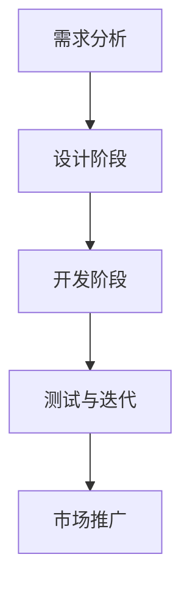

                 

### 文章标题

《创业路上的用户体验设计：从功能到情感的升华》

### 关键词

- 用户体验设计（User Experience Design，简称UXD）
- 创业项目
- 用户界面设计
- 交互设计
- 情感设计
- 用户研究方法

### 摘要

在快速发展的创业环境中，用户体验设计（UXD）作为产品成功的关键因素，正日益受到重视。本文从用户体验设计的基础理论出发，详细阐述了用户体验设计在创业项目中的应用和实践，包括用户研究方法、用户界面设计、交互设计以及情感设计等方面。通过实际案例分析和实践，本文揭示了如何通过提升用户体验设计，实现从功能到情感的升华，从而在竞争激烈的市场中取得成功。

## 第一部分：用户体验设计概述

### 第1章：用户体验设计基础

#### 1.1.1 用户体验设计的定义与重要性

用户体验设计（User Experience Design，简称UXD）是设计学科的一个重要分支，它专注于产品的用户体验，旨在通过设计提升用户在使用产品过程中的满意度、效率和乐趣。用户体验设计的定义可以从以下几个方面进行理解：

1. **用户中心**：用户体验设计以用户为中心，关注用户的需求、行为和感受。设计过程中，始终将用户的体验作为首要考虑因素。
2. **交互过程**：用户体验设计不仅关注产品的最终形态，还关注用户与产品交互的全过程，包括认知、情感和行为层面。
3. **多学科融合**：用户体验设计融合了心理学、人机交互、设计学、计算机科学等多个学科的知识，通过综合运用这些知识，创造出既符合用户需求又具有良好视觉和交互效果的产品。

用户体验设计的重要性体现在以下几个方面：

1. **提升用户满意度**：通过设计优化，提升用户在使用产品过程中的满意度，使产品更易于使用、更符合用户的期望。
2. **增加用户忠诚度**：良好的用户体验可以增强用户的品牌忠诚度，使用户更愿意持续使用和推荐产品。
3. **提高市场竞争力**：在竞争激烈的市场中，优质的产品体验成为企业区别于竞争对手的重要优势。

#### 1.1.2 用户体验设计与产品开发的关系

用户体验设计是产品开发过程中的关键环节，它贯穿于产品的整个生命周期。具体关系如下：

1. **需求分析**：在产品开发的初期，用户体验设计参与需求分析，通过用户调研、竞品分析等方法，了解用户需求和市场趋势，为产品功能设计提供依据。
2. **设计阶段**：在产品设计阶段，用户体验设计负责制定产品的交互流程、界面布局、视觉元素等，确保产品在视觉和交互上满足用户需求。
3. **开发阶段**：在开发过程中，用户体验设计需要与开发团队紧密合作，确保产品设计得到有效的实现。
4. **测试与迭代**：在产品测试和迭代过程中，用户体验设计通过用户测试、数据分析等方法，发现和解决产品中的用户体验问题，持续优化产品设计。
5. **市场推广**：在产品发布和市场推广阶段，用户体验设计也发挥着重要作用，通过优化产品宣传材料和用户体验，提升产品的市场认可度和用户口碑。

用户体验设计与产品开发的关系如图1所示：

### 第2章：用户研究方法

#### 2.1.1 用户调研

用户调研是了解用户需求和行为的重要手段，其目的是通过收集和分析用户数据，为产品设计提供依据。用户调研的方法包括以下几种：

1. **问卷调查**：通过设计问卷，收集用户对产品、服务或品牌的看法和反馈。问卷调查具有覆盖面广、数据量大的优势，但易受到用户主观性和样本代表性的影响。
2. **访谈**：通过面对面或在线访谈，深入了解用户对产品的使用习惯、需求和偏好。访谈能够获取更加深入和具体的用户信息，但成本较高且受时间限制。
3. **焦点小组**：组织一组目标用户，通过集体讨论，收集用户对产品、服务或品牌的看法和建议。焦点小组的优势在于能够快速获取大量用户反馈，但讨论过程中容易受到领导者的主导。
4. **观察法**：直接观察用户在使用产品或服务时的行为和操作，了解用户的实际需求和问题。观察法的优势在于能够获取真实、客观的用户数据，但可能受到观察者的主观影响。

#### 2.1.2 竞争分析

竞争分析是通过分析竞争对手的产品和策略，找出自身的优势和劣势，为产品优化提供参考。竞争分析的方法包括：

1. **产品对比**：对比自家产品和竞争对手的产品，分析各自的优势和不足，为产品优化提供依据。
2. **市场调研**：通过调研市场数据和用户反馈，了解竞争对手的市场份额、用户评价和产品表现。
3. **用户反馈**：收集和分析用户对竞争对手产品的评价和反馈，了解竞争对手的优劣势。

竞争分析的目的是：

1. **发现自身产品的不足**：通过对比分析，发现自家产品在功能、性能、用户体验等方面的不足，为产品优化提供方向。
2. **借鉴竞争对手的成功经验**：分析竞争对手的成功策略和优秀实践，借鉴并应用于自家产品。
3. **制定有针对性的市场策略**：通过分析竞争对手的市场策略，为自家产品制定更加有针对性的市场推广策略。

#### 2.1.3 用户调研与竞争分析的关系

用户调研和竞争分析相辅相成，共同为产品设计提供依据。用户调研帮助了解用户需求和行为，竞争分析则通过对比分析，发现竞争对手的优势和不足，从而为产品优化提供更全面的指导。具体关系如下：

1. **互补性**：用户调研侧重于了解用户的需求和行为，竞争分析侧重于分析竞争对手的产品和市场策略，二者相互补充，共同为产品设计提供全面的数据支持。
2. **关联性**：用户调研和竞争分析的结果可以相互印证，通过分析用户调研数据，可以验证竞争分析中发现的用户需求和痛点，从而更加准确地制定产品设计方向。
3. **协同性**：在产品设计过程中，用户调研和竞争分析需要协同进行，不断收集和分析用户数据和竞争信息，为产品设计提供持续的优化方向。

### 第二部分：用户体验设计实践

### 第3章：用户界面设计

#### 3.1.1 用户界面设计的原则

用户界面设计（User Interface Design，简称UID）是用户体验设计的重要组成部分，它直接影响用户对产品的第一印象和操作体验。用户界面设计的原则包括以下几点：

1. **简洁性**：简洁的界面能够减少用户的学习成本，使产品更易于使用。设计时，应避免界面过于复杂，尽量减少不必要的元素和信息。
2. **一致性**：界面设计的一致性有助于提高用户的认知效率和操作流畅度。在设计过程中，应保持颜色、字体、图标等视觉元素的一致性。
3. **易用性**：用户界面设计应注重易用性，确保用户能够轻松地完成各项操作。设计时，应考虑用户的认知能力和操作习惯，提供直观、明确的操作指引。
4. **可访问性**：用户界面设计应具备良好的可访问性，确保所有用户（包括残障人士）都能顺利使用产品。设计时，应遵循无障碍设计标准，提供适当的辅助功能。

#### 3.1.2 常用设计模式

在用户界面设计中，常用设计模式包括：

1. **按钮**：按钮是用户与产品进行交互的主要方式之一。设计时，应确保按钮的尺寸、颜色和文字清晰易读，便于用户点击。
2. **表单**：表单用于用户输入信息，如注册、登录、填写问卷等。设计时，应保持表单结构的清晰，避免过多的字段和复杂操作。
3. **导航栏**：导航栏用于用户浏览产品页面，提供主要内容和分类信息。设计时，应确保导航栏的位置和样式一致，便于用户快速找到所需内容。
4. **弹出窗口**：弹出窗口用于向用户展示重要信息或提示操作。设计时，应确保弹出窗口的时机和内容合适，避免干扰用户操作。

#### 3.1.3 用户界面设计的实践

用户界面设计的实践主要包括以下几个步骤：

1. **需求分析**：了解产品功能和目标用户，明确用户界面设计的需求和目标。
2. **原型设计**：基于需求分析，创建用户界面原型，包括布局、视觉元素和交互效果。
3. **用户测试**：通过用户测试，收集用户对用户界面的反馈和意见，发现和解决问题。
4. **迭代优化**：根据用户测试结果，对用户界面进行优化和调整，不断提升用户体验。

#### 3.1.4 用户界面设计案例

以一款移动APP为例，介绍用户界面设计的实践过程：

1. **需求分析**：该APP是一款社交类应用，主要功能包括好友互动、动态分享、聊天等功能。目标用户群体为年轻人，注重用户体验和社交互动。
2. **原型设计**：创建APP的原型，包括主页、动态页、聊天页等。设计时，注重简洁、易用和美观，确保用户能够快速找到所需功能。
3. **用户测试**：邀请目标用户进行测试，收集对用户界面的反馈和意见。主要问题包括导航栏不清晰、动态页加载速度慢等。
4. **迭代优化**：根据用户测试结果，对用户界面进行优化，包括调整导航栏位置、优化动态页加载速度等，提升用户体验。

### 第4章：交互设计

#### 4.1.1 交互设计的基本要素

交互设计（Interaction Design，简称IxD）是用户体验设计的核心，它关注用户与产品交互过程中的互动方式和体验。交互设计的基本要素包括：

1. **操作方式**：操作方式是用户与产品进行交互的方式，包括点击、拖拽、滑动、语音等。设计时，应考虑用户的操作习惯和认知能力，提供直观、简便的操作方式。
2. **反馈机制**：反馈机制用于告知用户操作结果，包括视觉反馈、声音反馈和文字提示等。设计时，应确保反馈及时、准确，提升用户对产品的信任感和满意度。
3. **导航系统**：导航系统用于帮助用户在产品中找到所需内容和功能。设计时，应确保导航系统的结构清晰、易于理解，提供多种导航方式（如顶部导航、侧边栏导航等）。

#### 4.1.2 交互设计的方法

交互设计的方法主要包括以下几个方面：

1. **原型设计**：通过创建交互原型，模拟用户与产品的交互过程，发现和解决问题。原型设计工具有Axure、Sketch、Figma等。
2. **用户测试**：通过用户测试，收集用户对交互设计的反馈和意见，验证设计是否符合用户需求。用户测试的方法包括可用性测试、认知走查等。
3. **迭代优化**：根据用户测试结果，对交互设计进行优化和调整，不断提升用户体验。迭代优化的过程是一个不断迭代、逐步完善的过程。

#### 4.1.3 交互设计案例

以一款电子商务网站为例，介绍交互设计的实践过程：

1. **需求分析**：了解网站的功能和目标用户，明确交互设计的需求和目标。主要功能包括商品浏览、购物车、下单支付等。
2. **原型设计**：创建网站的原型，包括首页、商品详情页、购物车页、支付页等。设计时，注重操作的简便性和流畅性，确保用户能够轻松完成购物流程。
3. **用户测试**：邀请目标用户进行测试，收集对交互设计的反馈和意见。主要问题包括购物车操作复杂、支付页面信息过多等。
4. **迭代优化**：根据用户测试结果，对交互设计进行优化，包括简化购物车操作、优化支付页面信息等，提升用户体验。

### 第三部分：用户体验评估与优化

### 第5章：用户体验评估

#### 5.1.1 用户体验评估的方法

用户体验评估（User Experience Evaluation，简称UEE）是验证和优化产品体验的重要环节，其目的是通过量化和质化分析，评估产品的用户体验。用户体验评估的方法包括以下几种：

1. **问卷调查**：通过设计问卷，收集用户对产品体验的反馈和评价。问卷调查可以收集大量数据，但易受到用户主观性和样本代表性的影响。
2. **用户测试**：通过观察和记录用户在实际使用产品时的行为和操作，评估产品的用户体验。用户测试可以深入了解用户需求和行为，但成本较高且受时间限制。
3. **A/B测试**：通过对比两组用户在两种不同设计下的体验，评估哪种设计更符合用户需求。A/B测试可以量化用户体验的差异，但受限于测试环境和样本量。
4. **满意度调查**：通过调查用户对产品的满意度，评估产品的整体用户体验。满意度调查可以快速了解用户对产品的感受，但无法深入了解用户的具体需求和问题。
5. **认知任务分析**：通过分析用户在完成特定任务时的认知过程，评估产品的易用性和可理解性。认知任务分析可以深入了解用户的使用习惯和认知障碍。

#### 5.1.2 用户体验评估的指标

用户体验评估的指标用于量化产品的用户体验，常见的评估指标包括：

1. **满意度**：用户对产品满意度的评价，通常用满意度评分（如5分制）表示。
2. **易用性**：用户完成特定任务所需的时间和步骤，通常用任务完成时间、错误率等指标表示。
3. **效率**：用户完成特定任务的速度和准确性，通常用任务完成时间和错误率等指标表示。
4. **学习成本**：用户学习使用产品所需的时间和难度，通常用任务完成时间和错误率等指标表示。
5. **情感体验**：用户在产品使用过程中的情感反应和体验，通常用情感量表（如正面情绪、负面情绪等）表示。

#### 5.1.3 用户体验评估的应用

用户体验评估在产品设计和优化过程中具有重要作用，其应用包括：

1. **验证设计假设**：在产品设计和开发过程中，通过用户体验评估验证设计假设和预期目标，确保产品设计符合用户需求。
2. **发现问题**：通过用户体验评估发现产品中的问题，如界面布局不合理、交互设计不流畅等，为优化设计提供依据。
3. **优化产品**：根据用户体验评估结果，对产品进行优化和调整，提升产品的用户体验和满意度。
4. **持续改进**：通过定期进行用户体验评估，跟踪产品的用户体验变化，持续改进产品设计。

### 第6章：用户体验优化

#### 6.1.1 用户体验优化的策略

用户体验优化（User Experience Optimization，简称UXO）是提升产品用户体验的关键步骤，其目的是通过改进设计、优化流程和提高性能，增强用户满意度。用户体验优化的策略包括以下几个方面：

1. **改进设计**：通过优化界面布局、交互流程和视觉元素，提升产品的易用性和美观度。设计改进可以基于用户体验评估的结果，针对性地解决用户提出的问题。
2. **优化流程**：简化用户完成任务所需的步骤和操作，减少用户的操作负担。优化流程可以基于用户行为数据，分析用户在使用产品时的痛点，提供更高效的操作路径。
3. **提高性能**：提升产品的加载速度、响应速度和稳定性，确保用户在使用过程中的顺畅体验。性能优化可以基于性能测试数据，识别和解决产品中的性能瓶颈。
4. **增强互动**：通过增加与用户的互动和反馈机制，提升用户的参与感和满意度。互动增强可以基于用户行为数据，设计更多人性化的互动方式和功能。
5. **持续迭代**：通过持续迭代和优化，不断提升产品的用户体验。持续迭代可以基于用户反馈和市场变化，及时调整产品设计方向，保持产品的竞争力。

#### 6.1.2 用户体验优化的实践

用户体验优化的实践主要包括以下几个步骤：

1. **需求分析**：了解用户需求和痛点，明确用户体验优化的目标和方向。
2. **数据分析**：通过数据分析，获取用户行为和反馈数据，识别产品中的问题和机会。
3. **设计优化**：根据数据分析结果，对界面布局、交互流程和视觉元素进行优化。
4. **用户测试**：通过用户测试，验证设计优化方案的有效性，收集用户反馈和意见。
5. **迭代优化**：根据用户测试结果，对设计优化方案进行迭代和优化，不断提升用户体验。

#### 6.1.3 用户体验优化案例

以一款在线教育平台为例，介绍用户体验优化的实践过程：

1. **需求分析**：了解用户在在线教育平台上的主要需求，如课程选择、学习进度跟踪、师生互动等。
2. **数据分析**：通过数据分析，发现用户在学习过程中遇到的问题，如课程页面加载缓慢、课程推荐不准确等。
3. **设计优化**：针对发现的问题，优化课程页面加载速度、调整课程推荐算法，提升用户的学习体验。
4. **用户测试**：邀请用户进行测试，收集对设计优化的反馈和意见，验证优化方案的有效性。
5. **迭代优化**：根据用户测试结果，对设计优化方案进行迭代和优化，不断提升在线教育平台的用户体验。

### 第四部分：情感设计

### 第7章：情感设计与用户体验

#### 7.1.1 情感设计的概念

情感设计（Emotion Design）是一种通过设计影响用户情感体验的方法。情感设计旨在通过产品和服务的设计，激发用户的情感反应，提升用户的整体体验。情感设计的核心概念包括：

1. **情感反应**：情感设计关注用户在使用产品或服务时的情感体验，包括愉悦、满意、兴奋、焦虑等。
2. **情感触发**：情感设计通过特定的视觉、声音、交互元素等，触发用户的情感反应。例如，通过鲜艳的颜色和动感的图形设计，激发用户的兴奋和兴趣。
3. **情感共鸣**：情感设计试图建立与用户的情感共鸣，使产品或服务成为用户情感体验的一部分。通过情感共鸣，用户会产生对产品或服务的情感依赖和忠诚度。

#### 7.1.2 情感设计的方法

情感设计的方法主要包括以下几个方面：

1. **视觉设计**：通过色彩、图形、动画等视觉元素，创造情感氛围和情感体验。例如，使用温暖的颜色和柔和的图形设计，营造舒适、温馨的氛围。
2. **声音设计**：通过声音、音乐、音效等，增强用户的情感体验。例如，使用轻柔的音乐和温馨的声音效果，提升用户的愉悦感和幸福感。
3. **交互设计**：通过用户与产品的交互过程，激发用户的情感反应。例如，设计有趣的互动游戏和富有情感的对话，提升用户的参与感和满意度。
4. **故事讲述**：通过故事和情境的构建，建立情感联系。例如，通过讲述产品的故事和背后的意义，激发用户的情感共鸣和认同。

#### 7.1.3 情感设计在用户体验中的作用

情感设计在用户体验中的作用不可忽视，它能够：

1. **提升用户满意度**：通过激发用户的积极情感反应，提升用户对产品的满意度和忠诚度。
2. **增强用户参与感**：通过情感共鸣，使用户更愿意参与产品的使用和分享，提升用户的参与度和活跃度。
3. **建立品牌形象**：通过情感设计，塑造独特的品牌形象和价值观，提升品牌在用户心中的地位和认知度。
4. **提升市场竞争力**：通过情感设计，打造差异化的产品体验，提升产品在竞争激烈的市场中的竞争力。

### 第8章：情感化用户体验设计案例研究

#### 8.1.1 案例研究的目的

情感化用户体验设计案例研究的目的是通过实际案例，探讨情感设计在提升用户体验中的应用和实践。通过分析情感设计在不同领域和场景中的成功案例，可以深入了解情感设计的方法、策略和效果，为其他产品和服务提供借鉴和启示。

#### 8.1.2 案例研究的内容

本章节将探讨以下几个情感化用户体验设计案例：

1. **案例一：电商平台的情感化设计**
   - **背景**：电商平台竞争激烈，如何提升用户购物体验成为关键问题。
   - **情感设计策略**：通过视觉设计、声音设计和交互设计，营造温馨、舒适的购物氛围。
   - **实践效果**：提升用户购物满意度和回购率。

2. **案例二：社交媒体的情感化设计**
   - **背景**：社交媒体用户对情感共鸣和互动有较高需求。
   - **情感设计策略**：通过故事讲述和情感互动，建立用户之间的情感联系。
   - **实践效果**：提升用户活跃度和用户粘性。

3. **案例三：医疗健康领域的情感化设计**
   - **背景**：医疗健康领域用户情感需求较高，对情感支持有较高期待。
   - **情感设计策略**：通过视觉设计和交互设计，营造关爱、温暖的氛围。
   - **实践效果**：提升用户对医疗服务的满意度和信任度。

4. **案例四：教育领域的情感化设计**
   - **背景**：教育领域用户对情感支持和互动有较高需求。
   - **情感设计策略**：通过故事讲述和情感互动，激发学生的学习兴趣和动力。
   - **实践效果**：提升学生的学习效果和满意度。

通过以上案例研究，可以深入了解情感化用户体验设计在不同领域和场景中的应用，为其他产品和服务提供有益的借鉴和启示。

### 第五部分：创业与用户体验设计

### 第9章：创业项目中的用户体验设计

#### 9.1.1 创业项目的特点

创业项目具有以下几个显著特点：

1. **快速迭代**：创业项目通常需要在短时间内完成产品的开发、测试和迭代，以满足市场变化和用户需求。
2. **资源有限**：创业项目通常面临资源限制，包括资金、人力、时间等，需要高效利用有限资源实现产品目标。
3. **市场不确定性**：创业项目面临较高的市场不确定性，需要通过市场调研和用户反馈不断调整产品方向和策略。
4. **团队协作**：创业项目通常由小团队完成，团队协作和沟通效率对项目成功至关重要。

#### 9.1.2 用户体验设计在创业项目中的应用

用户体验设计在创业项目中的应用具有以下几个关键方面：

1. **用户调研**：通过用户调研，了解目标用户的需求和行为，为产品设计提供依据。用户调研可以采用问卷调查、访谈、焦点小组等方法，获取用户的真实反馈。
2. **原型设计**：在创业项目的初期阶段，通过快速原型设计，验证产品概念和功能设计。原型设计可以帮助团队在有限资源下高效地进行迭代和优化。
3. **用户测试**：通过用户测试，评估产品的易用性和用户体验，发现和解决问题。用户测试可以采用可用性测试、认知走查等方法，确保产品满足用户需求。
4. **迭代优化**：根据用户测试结果，对产品设计进行迭代和优化，不断提升用户体验。迭代优化可以基于用户反馈、数据分析等方法，持续改进产品功能、界面和交互设计。

#### 9.1.3 用户体验设计在创业项目中的重要性

用户体验设计在创业项目中具有重要意义，主要体现在以下几个方面：

1. **提升用户满意度**：通过优化用户体验，提升用户对产品的满意度和忠诚度，为创业项目创造稳定的用户基础。
2. **降低用户流失率**：良好的用户体验可以降低用户流失率，减少用户在切换产品时的成本和难度。
3. **增强市场竞争力**：在竞争激烈的市场环境中，优质的用户体验成为企业区别于竞争对手的重要优势。
4. **促进产品迭代**：用户体验设计可以帮助创业项目快速识别用户需求和问题，推动产品的持续迭代和优化，保持市场竞争力。

### 第10章：用户体验设计在创业成功中的作用

#### 10.1.1 用户体验设计对创业成功的贡献

用户体验设计在创业成功中扮演着关键角色，其对创业成功的贡献主要体现在以下几个方面：

1. **提升用户满意度**：良好的用户体验可以提升用户对产品的满意度，使用户更愿意持续使用和推荐产品。高用户满意度有助于建立品牌的忠诚度和口碑，为创业项目创造稳定的用户基础。
2. **增加用户忠诚度**：通过优化用户体验，提升用户的品牌忠诚度。忠诚度较高的用户不仅会持续使用产品，还可能成为产品的推广者和传播者，为创业项目带来更多用户和市场份额。
3. **提高市场竞争力**：在竞争激烈的市场环境中，优质的用户体验成为企业区别于竞争对手的重要优势。通过不断优化用户体验，创业项目可以提升自身的市场竞争力，吸引更多潜在用户。
4. **降低用户流失率**：良好的用户体验可以降低用户流失率，减少用户在切换产品时的成本和难度。降低用户流失率有助于创业项目保持用户规模的稳定增长，为长期发展奠定基础。
5. **促进产品迭代**：用户体验设计可以帮助创业项目快速识别用户需求和问题，推动产品的持续迭代和优化。通过不断优化产品功能、界面和交互设计，创业项目可以保持市场竞争力，满足用户不断变化的需求。

#### 10.1.2 创业项目中的用户体验设计实践

在创业项目中，用户体验设计需要贯穿于整个产品开发过程，具体实践包括以下几个方面：

1. **需求分析**：在产品开发的初期，通过用户调研和竞品分析，了解目标用户的需求和市场竞争态势。需求分析为产品功能设计和用户体验设计提供依据。
2. **原型设计**：在需求分析的基础上，创建产品原型，包括界面布局、交互流程和视觉元素。原型设计可以帮助团队在有限资源下快速验证产品概念和功能设计。
3. **用户测试**：通过用户测试，评估产品的易用性和用户体验，发现和解决问题。用户测试可以采用可用性测试、认知走查等方法，确保产品满足用户需求。
4. **迭代优化**：根据用户测试结果，对产品设计进行迭代和优化，不断提升用户体验。迭代优化可以基于用户反馈、数据分析等方法，持续改进产品功能、界面和交互设计。
5. **持续反馈**：在产品发布后，通过用户反馈和数据分析，跟踪产品的用户体验和用户行为。持续反馈可以帮助团队及时发现和解决问题，保持产品的市场竞争力。

#### 10.1.3 用户体验设计实战案例

以一家初创公司开发的一款移动健康应用为例，介绍用户体验设计在创业项目中的实践：

1. **需求分析**：通过用户调研和竞品分析，发现用户对健康管理的需求主要集中在运动记录、饮食管理、健康咨询等方面。
2. **原型设计**：创建应用的原型，包括运动记录页、饮食管理页、健康咨询页等。设计时，注重简洁、易用和美观，确保用户能够快速找到所需功能。
3. **用户测试**：邀请目标用户进行测试，收集对应用界面的反馈和意见。主要问题包括运动记录页面信息过少、饮食管理页面操作复杂等。
4. **迭代优化**：根据用户测试结果，对应用界面进行优化，包括增加运动记录页面的详细信息、简化饮食管理页面的操作等，提升用户体验。
5. **持续反馈**：在应用发布后，通过用户反馈和数据分析，跟踪应用的用户体验和用户行为。根据用户反馈，继续优化应用功能，提高用户满意度。

### 第六部分：用户体验设计的未来趋势

### 第11章：用户体验设计的未来趋势

#### 11.1.1 数字化转型的趋势

数字化转型已经成为企业发展的重要方向，用户体验设计也需要适应这一变化。以下是一些数字化转型趋势对用户体验设计的影响：

1. **移动优先**：随着移动设备的普及，用户体验设计需要更加注重移动端的设计和优化。移动优先的设计策略要求设计师在有限的屏幕空间内提供最佳的用户体验。
2. **云服务**：云服务的普及使得用户体验设计更加灵活和可扩展。设计师可以借助云计算平台，快速部署和迭代产品，提高用户体验。
3. **人工智能**：人工智能技术的发展为用户体验设计带来了新的机遇。通过人工智能，设计师可以更好地了解用户需求和行为，提供个性化、智能化的用户体验。
4. **大数据分析**：大数据分析可以帮助设计师深入了解用户行为和需求，优化产品设计。通过数据分析，设计师可以及时发现和解决用户体验问题。

#### 11.1.2 新技术的应用

新技术的应用将继续推动用户体验设计的发展，以下是一些关键技术：

1. **虚拟现实（VR）和增强现实（AR）**：VR和AR技术为用户体验设计带来了全新的交互方式和体验。设计师可以利用这些技术，创造沉浸式、互动性强的用户体验。
2. **物联网（IoT）**：物联网技术的发展使得用户体验设计不再局限于单一设备，而是涵盖了多个设备和平台。设计师需要考虑如何将不同设备无缝连接，提供一致的用户体验。
3. **区块链**：区块链技术可以为用户体验设计带来去中心化、安全可靠的数据存储和交易方式。设计师可以利用区块链技术，创造更加安全、透明的用户体验。
4. **人工智能助手**：人工智能助手（如聊天机器人、智能语音助手等）正在改变用户体验的方式。设计师需要考虑如何将这些助手集成到产品中，提供更加智能、便捷的用户体验。

#### 11.1.3 用户体验设计的未来方向

用户体验设计的未来方向将更加注重以下几个方面：

1. **情感化设计**：随着人们对情感体验需求的增加，情感化设计将成为用户体验设计的重要方向。设计师需要关注如何通过设计影响用户的情感反应，提升用户体验。
2. **可访问性**：随着全球用户多样性增加，用户体验设计需要更加注重可访问性。设计师需要确保产品和服务能够满足不同用户群体的需求，包括残障人士、老年人等。
3. **可持续性**：用户体验设计需要关注环境和社会责任。设计师需要通过可持续的设计方法，减少产品的环境影响，提高用户和社会的满意度。
4. **全球一致性**：随着全球化进程的加速，用户体验设计需要考虑不同文化和地区的用户需求。设计师需要创造出具有全球一致性但又能适应本地文化差异的用户体验。

### 总结

用户体验设计在创业项目中扮演着至关重要的角色，它不仅关系到产品的成功，还影响企业的长期发展。通过深入理解用户体验设计的基本理论、实践方法和未来趋势，创业团队可以更好地满足用户需求，提升产品竞争力，实现企业的可持续发展。希望本文能为创业团队在用户体验设计方面提供有益的启示和指导。

### 作者信息

- 作者：AI天才研究院/AI Genius Institute & 禅与计算机程序设计艺术 /Zen And The Art of Computer Programming

---

**全文结束。**

---

本文从用户体验设计的定义和重要性入手，系统地阐述了用户体验设计在创业项目中的应用和实践，包括用户研究方法、用户界面设计、交互设计、情感设计以及用户体验评估与优化。通过实际案例的分析，展示了用户体验设计如何从功能到情感的升华，提升用户满意度、增加用户忠诚度，从而助力创业项目的成功。

在文章的结构安排上，首先介绍了用户体验设计的基本概念和重要性，接着详细讲解了用户研究方法、用户界面设计、交互设计、情感设计等核心内容，然后探讨了用户体验评估与优化的策略和实践，最后分析了情感设计在用户体验中的重要作用以及用户体验设计的未来趋势。

文章的核心内容不仅包括对用户体验设计理论的深入阐述，还结合了丰富的实际案例，使读者能够更加直观地理解用户体验设计在创业项目中的具体应用。同时，文章还强调了用户体验设计在未来发展中的趋势和方向，为创业团队提供了有价值的参考。

总之，本文旨在为创业团队提供全面的用户体验设计指南，帮助他们更好地理解用户体验设计的重要性，掌握相关理论和方法，提升产品的市场竞争力，实现创业项目的成功。通过本文的阅读，读者可以深入了解用户体验设计的核心内容，掌握用户体验设计的基本方法和技巧，从而在创业项目中发挥出最大的价值。

