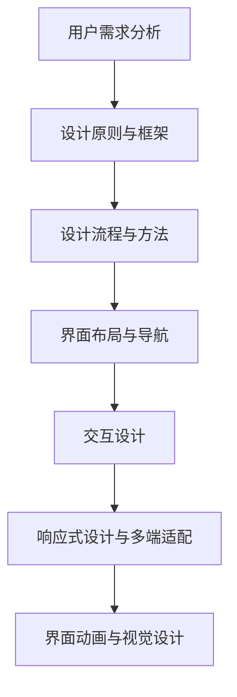

                 

### 文章标题：创业路上的用户体验设计：从技术到情感的跨越

#### 关键词：用户体验设计、情感化设计、创业、技术创新、用户需求

> 摘要：在创业的过程中，用户体验设计不仅是产品成功的基石，更是连接用户情感的关键桥梁。本文将深入探讨用户体验设计的核心概念、技术层面的设计、情感化设计的实践，以及如何从技术到情感的跨越，从而为创业团队提供实用的用户体验设计策略。

### 第一部分：用户体验设计的核心概念

#### 第1章：用户体验设计基础

##### 1.1 用户体验设计概述

用户体验设计（User Experience Design，简称UXD）是一种以用户为中心的设计方法，旨在提升用户在使用产品或服务时的整体感受。用户需求分析是用户体验设计的起点，通过研究用户的行为、需求和期望，设计师可以更好地理解用户的需求，从而设计出更符合用户期望的产品。

- **用户需求分析**：
  - 通过访谈、问卷调查、用户行为分析等方法，收集用户的数据和反馈。
  - 对收集的数据进行分析，识别出用户的痛点和需求。

- **设计原则与框架**：
  - **以用户为中心**：始终将用户的需求和体验放在首位。
  - **简洁性**：简化设计元素，减少用户的认知负担。
  - **可用性**：确保用户能够轻松、高效地使用产品。
  - **一致性**：在产品的各个部分保持一致的设计风格和交互方式。

- **设计流程与方法**：
  - **需求分析**：收集和分析用户需求。
  - **原型设计**：制作低保真的线框图或高保真的视觉设计。
  - **用户测试**：通过实际用户的使用反馈来优化设计。
  - **迭代优化**：根据用户测试的结果进行设计迭代。

##### 1.2 设计与技术的关系

设计和技术在用户体验设计中密不可分。技术为设计提供了实现的可能性，而设计则决定了技术如何服务于用户。

- **技术实现与设计平衡**：
  - 技术必须为设计服务，而不是让设计受限于技术。
  - 设计师和开发者需要紧密合作，确保技术的实现与设计理念相一致。

##### 1.3 情感化设计的概念与策略

情感化设计是一种设计方法，旨在通过激发用户的情感反应来增强用户体验。情感化设计不仅关注功能，更关注情感。

- **情感化设计的定义**：
  - 情感化设计是指在设计过程中考虑用户的情感需求，通过设计元素和交互方式来激发用户的情感反应。

- **情感化设计的方法与技巧**：
  - **色彩心理学**：使用不同的颜色来传达情感和信息。
  - **声音设计**：通过声音来引导用户的情绪和注意力。
  - **动效与动画**：使用动效和动画来增强用户的情感体验。
  - **故事化设计**：通过故事化的方式来传递情感和信息。

##### 1.4 跨学科合作与团队沟通

用户体验设计是一个跨学科的过程，涉及设计、开发、市场等多个领域。

- **设计师与开发者的合作**：
  - 设计师需要理解开发者的限制和可能性，以确保设计的可实现性。
  - 开发者需要理解设计师的意图和需求，以便更好地实现设计。

- **跨部门团队协作**：
  - 团队成员之间的有效沟通和协作是成功的关键。
  - 定期举行跨部门会议，确保各团队同步并共同推进项目。

### 第二部分：技术层面的用户体验设计

#### 第2章：用户界面设计

##### 2.1 界面布局与导航

- **界面布局原则**：
  - **黄金比例**：使用黄金比例来布局元素，使界面更具吸引力。
  - **对称与平衡**：保持界面的对称性和平衡性，以减少用户的认知负担。

- **导航设计技巧**：
  - **清晰简洁**：导航菜单应简洁明了，避免过多的层级和复杂的路径。
  - **可见性**：导航元素应易于发现和点击。

##### 2.2 交互设计

交互设计关注用户与产品或系统之间的交互方式。

- **交互元素的设计**：
  - **按钮**：按钮的形状、颜色和大小应与功能的重要性相对应。
  - **图标**：图标应简洁、易于理解，避免使用复杂或不常见的符号。

- **交互反馈的设计**：
  - **视觉反馈**：当用户执行操作时，界面应提供明确的视觉反馈，如颜色变化、动画等。
  - **听觉反馈**：适当的听觉反馈可以增强用户的体验，如点击声音、提示音等。

##### 2.3 响应式设计与多端适配

- **响应式设计原则**：
  - **适应性布局**：界面应能适应不同屏幕尺寸和分辨率。
  - **内容优先**：确保核心内容在所有设备上都能清晰展现。

- **多端适配策略**：
  - **视口（Viewport）**：使用视口来控制页面的宽度和高度。
  - **媒体查询（Media Queries）**：根据不同的设备和屏幕尺寸调整样式。

##### 2.4 界面动画与视觉设计

- **界面动画的作用**：
  - **提高可用性**：动画可以引导用户了解界面的功能和操作方式。
  - **增强情感体验**：动画可以激发用户的情感反应，增强产品的吸引力。

- **视觉设计的元素**：
  - **色彩**：色彩的选择应与品牌形象和用户情感相符合。
  - **图标与符号**：图标和符号应简洁、直观，易于用户理解。

### 第三部分：情感化设计的实践

#### 第3章：情感化设计策略

##### 3.1 情感化设计的心理学基础

情感化设计依赖于对用户情感的深入理解。

- **用户情感分析**：
  - **情感映射**：通过情感映射了解用户在不同场景下的情感状态。
  - **情感驱动的设计方法**：根据用户情感状态设计产品，以引导用户产生积极情感。

##### 3.2 情感化设计的案例研究

通过成功和失败的案例研究，可以了解情感化设计的有效策略。

- **成功案例分享**：
  - **案例A**：分析成功的情感化设计案例，如Apple的iPhone，其简洁的设计和人性化的交互方式获得了用户的高度认可。

- **失败案例分析**：
  - **案例B**：分析失败的情感化设计案例，找出原因，如过于复杂的交互设计导致用户使用困难。

##### 3.3 情感化设计的工具与方法

- **用户体验地图（User Experience Map）**：
  - **功能**：展示用户在使用产品或服务时的情感旅程。
  - **创建步骤**：收集用户反馈、分析用户行为、绘制情感轨迹。

- **情感化设计工具推荐**：
  - **Moodboard**：用于收集和整理设计灵感。
  - **Personas**：创建代表目标用户群体的角色模型。

##### 3.4 跨文化情感设计

- **文化差异与情感设计**：
  - **情感表达的差异**：不同文化背景下，用户的情感表达方式可能不同。
  - **设计策略**：
    - **适应性设计**：根据目标用户的文化背景调整设计。
    - **文化敏感性**：在设计过程中考虑文化因素，避免文化误解。

### 第四部分：从技术到情感的跨越

#### 第4章：技术实现的情感化设计

技术是实现情感化设计的重要工具。

##### 4.1 技术创新与用户体验

- **技术创新趋势**：
  - **人工智能（AI）**：通过AI技术分析用户行为，提供个性化体验。
  - **虚拟现实（VR）与增强现实（AR）**：通过VR和AR技术创造沉浸式体验。

- **技术创新对用户体验的影响**：
  - **个性化**：技术创新可以提供更个性化的用户体验。
  - **沉浸式体验**：VR和AR技术可以创造更加沉浸式的体验，增强情感化设计。

##### 4.2 技术在情感化设计中的应用

- **人工智能与情感分析**：
  - **情感识别**：使用AI技术分析用户的情感状态。
  - **情感预测**：基于用户的情感数据预测未来的情感反应。

- **虚拟现实与增强现实**：
  - **沉浸式体验**：通过VR和AR技术创造情感化的互动场景。
  - **情感表达**：利用VR和AR技术表达复杂的情感和故事。

##### 4.3 技术实现的情感化设计策略

- **技术实现与用户体验的平衡**：
  - 技术的先进性不能牺牲用户体验的简洁性和易用性。
  - 技术应用应以增强用户体验为目标。

- **技术创新与用户情感**：
  - 技术创新应考虑用户情感需求，创造情感化的互动体验。
  - 技术应用应与用户情感产生共鸣，增强用户情感连接。

### 第五部分：创业过程中的用户体验设计

#### 第5章：创业项目与用户体验

##### 5.1 创业项目与用户体验

- **用户需求**：
  - **明确目标用户**：通过市场调研和用户访谈，明确产品的目标用户群体。
  - **理解用户痛点**：深入了解用户在使用现有产品或服务时遇到的痛点。

- **用户体验在创业中的重要性**：
  - **提升竞争力**：优秀的用户体验可以提升产品的竞争力。
  - **用户忠诚度**：良好的用户体验可以增加用户的忠诚度，减少用户流失。

##### 5.2 创业初期的用户体验设计

- **MVP用户体验设计**：
  - **最小可行性产品（MVP）**：在创业初期，通过MVP验证用户需求和产品价值。
  - **用户体验优先**：在资源有限的情况下，将有限的资源用于最关键的用户体验部分。

- **初创团队的用户体验实践**：
  - **团队合作**：设计团队和开发团队紧密合作，确保设计理念能够被实现。
  - **快速迭代**：通过快速迭代，及时收集用户反馈，优化用户体验。

##### 5.3 用户反馈与迭代优化

- **用户反馈收集与分析**：
  - **用户反馈渠道**：建立多种用户反馈渠道，如用户访谈、问卷调查、在线反馈等。
  - **数据驱动决策**：基于用户反馈数据进行决策，不断优化用户体验。

- **用户体验迭代优化**：
  - **A/B测试**：通过A/B测试，比较不同设计方案的优劣，选择最优方案。
  - **持续优化**：不断收集用户反馈，持续优化用户体验，以满足用户需求。

### 第六部分：创业案例中的用户体验设计

#### 第6章：创业案例中的用户体验设计

##### 6.1 创业案例分享

通过成功的创业案例，了解如何通过用户体验设计获得成功。

- **成功案例解读**：
  - **Airbnb**：通过情感化的设计，将用户的住宿体验提升到更高的层次，成为共享经济的领军企业。
  - **Instagram**：通过简洁、直观的界面设计和强大的社交功能，快速吸引了大量用户。

##### 6.2 用户情感与品牌建设

- **品牌情感构建**：
  - **品牌定位**：通过品牌故事和情感元素，建立用户对品牌的情感连接。
  - **情感化营销**：通过情感化的营销策略，增强用户对品牌的认同感。

- **用户情感与品牌忠诚度**：
  - **情感连接**：通过情感化的设计和服务，建立与用户的情感连接。
  - **忠诚度提升**：良好的用户体验和情感连接可以显著提升用户的品牌忠诚度。

##### 6.3 创业路上的用户体验挑战

- **资源有限条件下的用户体验设计**：
  - **聚焦关键用户体验**：在资源有限的情况下，聚焦于关键用户体验，确保核心功能的质量。
  - **敏捷开发**：采用敏捷开发方法，快速迭代，及时优化用户体验。

- **时间压力下的用户体验优化**：
  - **优先级排序**：在时间压力下，明确优先级，确保关键用户体验得到优先优化。
  - **自动化测试**：通过自动化测试，快速发现并修复用户体验问题。

### 第七部分：情感化设计在创业中的持续价值

#### 第7章：情感化设计在创业中的持续价值

##### 7.1 情感化设计的长期价值

- **用户满意度与忠诚度**：
  - **满意用户**：通过情感化设计提升用户的满意度，增加用户对产品的喜爱。
  - **忠诚用户**：良好的用户体验可以培养出忠诚的用户群体，降低用户流失率。

- **品牌价值与市场份额**：
  - **品牌认知**：情感化设计可以增强品牌认知，提升品牌价值。
  - **市场份额**：通过良好的用户体验，吸引更多用户，扩大市场份额。

##### 7.2 持续改进与用户情感连接

- **用户情感体验监测**：
  - **实时反馈**：通过用户反馈和行为数据，实时监测用户情感体验。
  - **改进策略**：根据用户情感体验监测结果，制定改进策略。

- **用户情感需求的持续满足**：
  - **个性化服务**：根据用户情感需求，提供个性化的服务。
  - **情感化互动**：通过情感化的互动方式，增强用户与品牌的情感连接。

##### 7.3 创业成功的关键因素

- **情感化设计在创业中的角色**：
  - **用户黏性**：情感化设计可以提升用户黏性，增强用户对品牌的忠诚度。
  - **用户口碑**：良好的用户体验可以带来更多的用户口碑，助力品牌传播。

- **创业成功的核心要素**：
  - **团队协作**：团队成员之间的紧密合作是创业成功的关键。
  - **用户至上**：始终以用户需求为中心，持续优化用户体验。

### 附录

#### 附录A：用户体验设计工具与资源

- **用户体验设计工具推荐**：
  - **Sketch**：用于界面设计的专业工具。
  - **Figma**：协作性强的设计工具。
  - **Axure RP**：原型设计和交互设计的工具。

- **设计资源平台推荐**：
  - **UI Garage**：提供高质量的UI设计资源和素材。
  - **Behance**：展示和发现设计灵感的平台。

#### 附录B：创业与用户体验设计案例

- **成功创业案例**：
  - **Dropbox**：通过简洁、直观的界面设计，迅速吸引了大量用户。

- **失败创业案例分析**：
  - **Color**：由于用户体验设计不足，未能持续吸引用户。

#### 附录C：用户体验设计资源汇总

- **用户体验设计书籍推荐**：
  - 《用户体验要素》
  - 《设计心理学》

- **用户体验设计教程**：
  - 在线教程平台（如Udemy、Coursera）提供的用户体验设计课程。

- **用户体验设计社区与论坛**：
  - **UX Design Community**：一个面向用户体验设计师的社区。
  - **UX Stack Exchange**：一个关于用户体验设计的问答社区。

### Mermaid 流程图：用户体验设计流程



### 核心算法原理讲解

#### 2.1 交互设计

交互设计是用户体验设计中的一个核心部分，它关注用户与产品或系统之间的交互方式。以下是交互设计的一些核心算法原理：

- **用户流程分析（User Flow）**：

  ```mermaid
  graph TD
      A[用户目标] --> B[登录/注册]
      B --> C[浏览商品]
      C --> D[添加购物车]
      D --> E[结账]
      E --> F[订单确认]
      F --> G[用户反馈]
  ```

  - **用户行为路径**：分析用户在使用产品时的行为路径，包括每个步骤的目的和用户期望的结果。
  - **优化路径**：通过用户流程分析，识别用户在操作中的痛点和瓶颈，优化用户路径，提高用户体验。

- **交互反馈设计**：

  ```mermaid
  graph TD
      A[用户操作] --> B[视觉反馈]
      B --> C[听觉反馈]
      C --> D[动画反馈]
  ```

  - **视觉反馈**：当用户执行操作时，界面应提供明确的视觉反馈，如按钮的颜色变化、图标的状态更新等。
  - **听觉反馈**：适当的声音效果可以增强用户的交互体验，如点击音、提示音等。
  - **动画反馈**：动画可以提供更直观的反馈，如加载动画、进度条等。

#### 2.2 响应式设计与多端适配

响应式设计是一种能够适应不同屏幕尺寸和分辨率的网页设计方法。以下是响应式设计的一些核心算法原理：

- **视口（Viewport）**：

  ```mermaid
  graph TD
      A[移动设备] --> B[宽度:320px]
      B --> C[高度:568px]
      A --> D[桌面设备] --> E[宽度:1280px]
      E --> F[高度:720px]
  ```

  - **视口设置**：通过设置视口宽度（vw）和高度（vh），使页面能够适应不同设备的屏幕尺寸。
  - **媒体查询（Media Queries）**：

    ```css
    @media (max-width: 768px) {
      /* 移动设备样式 */
    }
    
    @media (min-width: 769px) {
      /* 桌面设备样式 */
    }
    ```

    - **媒体查询**：根据设备的宽度，应用不同的样式，确保页面在不同设备上都能良好显示。

#### 2.3 界面动画与视觉设计

界面动画与视觉设计是提升用户体验的重要手段。以下是界面动画与视觉设计的一些核心算法原理：

- **动画性能优化**：

  ```mermaid
  graph TD
      A[动画帧率] --> B[60fps]
      B --> C[优化性能]
      C --> D[减少重绘和回流]
  ```

  - **动画帧率**：动画帧率越高，用户体验越好。通常建议使用60fps（帧每秒）。
  - **性能优化**：通过减少重绘和回流，提高动画的性能，确保流畅的用户体验。
  - **动画库**：使用如GreenSock Animation Platform（GSAP）等专业的动画库，实现复杂的动画效果。

#### 2.4 响应式网页设计

响应式网页设计是一种能够适应不同屏幕尺寸和分辨率的网页设计方法。以下是响应式网页设计的一些核心算法原理：

- **弹性布局（Flexbox）**：

  ```css
  .container {
    display: flex;
    flex-direction: column;
    align-items: center;
    justify-content: space-between;
    height: 100vh;
  }
  ```

  - **弹性容器**：通过设置`display: flex`，将容器转换为弹性容器，可以灵活地布局内部元素。
  - **弹性子元素**：通过设置`flex-grow`、`flex-shrink`和`flex-basis`等属性，控制子元素的弹性。

- **媒体查询**：

  ```css
  @media (max-width: 600px) {
    .container {
      flex-direction: column;
    }
  }
  ```

  - **样式调整**：根据屏幕宽度，使用媒体查询调整元素的样式，确保页面在不同设备上都能良好显示。

### 核心算法原理讲解

#### 2.1 交互设计

交互设计是用户体验设计中的一个关键环节，它关注用户与产品或系统之间的交互方式。以下是交互设计的一些核心算法原理：

- **用户流程分析（User Flow）**：

  ```mermaid
  graph TD
      A[用户目标] --> B[登录/注册]
      B --> C[浏览商品]
      C --> D[添加购物车]
      D --> E[结账]
      E --> F[订单确认]
      F --> G[用户反馈]
  ```

  - **用户行为路径**：分析用户在使用产品时的行为路径，包括每个步骤的目的和用户期望的结果。
  - **优化路径**：通过用户流程分析，识别用户在操作中的痛点和瓶颈，优化用户路径，提高用户体验。

- **交互反馈设计**：

  ```mermaid
  graph TD
      A[用户操作] --> B[视觉反馈]
      B --> C[听觉反馈]
      C --> D[动画反馈]
  ```

  - **视觉反馈**：当用户执行操作时，界面应提供明确的视觉反馈，如按钮的颜色变化、图标的状态更新等。
  - **听觉反馈**：适当的声音效果可以增强用户的交互体验，如点击音、提示音等。
  - **动画反馈**：动画可以提供更直观的反馈，如加载动画、进度条等。

#### 2.2 响应式设计与多端适配

响应式设计是一种能够适应不同屏幕尺寸和分辨率的网页设计方法。以下是响应式设计的一些核心算法原理：

- **视口（Viewport）**：

  ```mermaid
  graph TD
      A[移动设备] --> B[宽度:320px]
      B --> C[高度:568px]
      A --> D[桌面设备] --> E[宽度:1280px]
      E --> F[高度:720px]
  ```

  - **视口设置**：通过设置视口宽度（vw）和高度（vh），使页面能够适应不同设备的屏幕尺寸。
  - **媒体查询（Media Queries）**：

    ```css
    @media (max-width: 768px) {
      /* 移动设备样式 */
    }
    
    @media (min-width: 769px) {
      /* 桌面设备样式 */
    }
    ```

    - **媒体查询**：根据设备的宽度，应用不同的样式，确保页面在不同设备上都能良好显示。

#### 2.3 界面动画与视觉设计

界面动画与视觉设计是提升用户体验的重要手段。以下是界面动画与视觉设计的一些核心算法原理：

- **动画性能优化**：

  ```mermaid
  graph TD
      A[动画帧率] --> B[60fps]
      B --> C[优化性能]
      C --> D[减少重绘和回流]
  ```

  - **动画帧率**：动画帧率越高，用户体验越好。通常建议使用60fps（帧每秒）。
  - **性能优化**：通过减少重绘和回流，提高动画的性能，确保流畅的用户体验。
  - **动画库**：使用如GreenSock Animation Platform（GSAP）等专业的动画库，实现复杂的动画效果。

#### 2.4 响应式网页设计

响应式网页设计是一种能够适应不同屏幕尺寸和分辨率的网页设计方法。以下是响应式网页设计的一些核心算法原理：

- **弹性布局（Flexbox）**：

  ```css
  .container {
    display: flex;
    flex-direction: column;
    align-items: center;
    justify-content: space-between;
    height: 100vh;
  }
  ```

  - **弹性容器**：通过设置`display: flex`，将容器转换为弹性容器，可以灵活地布局内部元素。
  - **弹性子元素**：通过设置`flex-grow`、`flex-shrink`和`flex-basis`等属性，控制子元素的弹性。

- **媒体查询**：

  ```css
  @media (max-width: 600px) {
    .container {
      flex-direction: column;
    }
  }
  ```

  - **样式调整**：根据屏幕宽度，使用媒体查询调整元素的样式，确保页面在不同设备上都能良好显示。

### 最佳实践 tips

#### 用户体验设计最佳实践

在创业过程中，用户体验设计是产品成功的关键因素之一。以下是几条最佳实践，帮助创业团队提升用户体验设计：

1. **以用户为中心**：始终将用户需求放在首位，通过用户调研和访谈深入了解用户痛点和需求。

2. **快速迭代**：采用敏捷开发方法，快速构建产品原型，不断收集用户反馈，及时优化设计。

3. **跨学科协作**：设计团队和开发团队需要紧密合作，确保设计理念能够被实现，同时考虑技术的可行性和实现成本。

4. **简洁性设计**：避免过度设计，简化界面元素和交互流程，减少用户的认知负担。

5. **情感化设计**：通过色彩、声音、动画等元素激发用户情感，增强用户的情感连接。

6. **响应式设计**：确保产品在不同设备上都能良好显示，提供一致的用户体验。

7. **A/B测试**：通过A/B测试，比较不同设计方案的优劣，选择最佳方案。

8. **用户反馈**：建立有效的用户反馈渠道，定期收集用户意见，持续优化产品设计。

#### 情感化设计最佳实践

情感化设计是一种提升用户体验的有效方法，以下是一些最佳实践：

1. **情感映射**：通过情感映射了解用户在不同场景下的情感状态，为设计提供依据。

2. **色彩心理学**：选择符合品牌形象和用户情感的色彩，增强情感化效果。

3. **故事化设计**：通过故事化的方式传递信息，增强用户的情感体验。

4. **用户故事**：通过用户故事了解用户的情感需求，将情感需求融入产品设计。

5. **情感化交互**：设计易于理解和操作的交互元素，引导用户产生积极的情感反应。

6. **情感化营销**：通过情感化营销策略，增强用户对品牌的认同感。

7. **文化敏感性**：考虑不同文化背景下用户的情感需求，设计具有文化敏感性的产品。

### 小结

在创业路上，用户体验设计不仅是产品成功的基石，更是连接用户情感的关键桥梁。通过深入了解用户需求，运用技术手段实现情感化设计，创业团队可以打造出深受用户喜爱的产品，提升品牌价值，实现长期成功。

### 注意事项

1. **平衡技术与设计**：在实现用户体验设计时，要平衡技术与设计，避免过度追求技术而牺牲用户体验。

2. **持续优化**：用户体验设计不是一次性任务，而是一个持续优化的过程。要定期收集用户反馈，及时调整设计。

3. **团队协作**：设计团队和开发团队需要紧密合作，确保设计理念能够被实现。

4. **文化差异**：在设计过程中要考虑文化差异，避免文化误解。

### 拓展阅读

1. 《用户体验要素》—— 京东

2. 《设计心理学》—— 人人网

3. 《响应式网页设计》—— 网易云课堂

### 附录A：用户体验设计工具与资源

#### 用户体验设计工具推荐

- **Sketch**：一款专业的设计工具，适用于创建高保真原型和界面设计。
- **Figma**：基于网页的协作设计工具，支持多人实时协作。
- **Adobe XD**：Adobe推出的用户体验设计工具，支持原型设计和交互设计。
- **Axure RP**：专业的原型设计工具，适用于创建交互式原型和规格文档。

#### 设计资源平台推荐

- **Behance**：展示设计作品，获取灵感和反馈。
- **UI Garage**：提供大量的UI设计资源和素材。
- **Dribbble**：设计师分享创意作品，发现新灵感。

### 附录B：创业与用户体验设计案例

#### 成功创业案例

- **Airbnb**：通过简洁、直观的界面设计和人性化的交互方式，迅速吸引了大量用户，成为共享经济的领军企业。
- **Uber**：通过简洁、易用的应用程序设计，提高了打车体验，推动了全球出租车行业的变革。

#### 失败创业案例分析

- **Color**：由于用户体验设计不足，用户难以理解其功能，导致用户流失严重，最终关闭。

### 附录C：用户体验设计资源汇总

#### 用户体验设计书籍推荐

- 《用户体验要素》—— 京东
- 《设计心理学》—— 人人网
- 《响应式网页设计》—— 网易云课堂

#### 用户体验设计教程

- **Udemy**：提供大量的用户体验设计在线课程。
- **Coursera**：有多个与用户体验设计相关的在线课程。

#### 用户体验设计社区与论坛

- **UX Design Community**：一个面向用户体验设计师的社区，提供资源和交流平台。
- **UX Stack Exchange**：一个关于用户体验设计的问答社区，解决设计问题。

### Mermaid 流程图：用户体验设计流程


### 核心算法原理讲解

#### 交互设计

交互设计是用户体验设计中的一个关键环节，它关注用户与产品或系统之间的交互方式。以下是交互设计的一些核心算法原理：

- **用户流程分析（User Flow）**：

  ```mermaid
  graph TD
      A[用户目标] --> B[登录/注册]
      B --> C[浏览商品]
      C --> D[添加购物车]
      D --> E[结账]
      E --> F[订单确认]
      F --> G[用户反馈]
  ```

  - **用户行为路径**：分析用户在使用产品时的行为路径，包括每个步骤的目的和用户期望的结果。
  - **优化路径**：通过用户流程分析，识别用户在操作中的痛点和瓶颈，优化用户路径，提高用户体验。

- **交互反馈设计**：

  ```mermaid
  graph TD
      A[用户操作] --> B[视觉反馈]
      B --> C[听觉反馈]
      C --> D[动画反馈]
  ```

  - **视觉反馈**：当用户执行操作时，界面应提供明确的视觉反馈，如按钮的颜色变化、图标的状态更新等。
  - **听觉反馈**：适当的声音效果可以增强用户的交互体验，如点击音、提示音等。
  - **动画反馈**：动画可以提供更直观的反馈，如加载动画、进度条等。

#### 响应式设计与多端适配

响应式设计是一种能够适应不同屏幕尺寸和分辨率的网页设计方法。以下是响应式设计的一些核心算法原理：

- **视口（Viewport）**：

  ```mermaid
  graph TD
      A[移动设备] --> B[宽度:320px]
      B --> C[高度:568px]
      A --> D[桌面设备] --> E[宽度:1280px]
      E --> F[高度:720px]
  ```

  - **视口设置**：通过设置视口宽度（vw）和高度（vh），使页面能够适应不同设备的屏幕尺寸。
  - **媒体查询（Media Queries）**：

    ```css
    @media (max-width: 768px) {
      /* 移动设备样式 */
    }
    
    @media (min-width: 769px) {
      /* 桌面设备样式 */
    }
    ```

    - **媒体查询**：根据设备的宽度，应用不同的样式，确保页面在不同设备上都能良好显示。

#### 界面动画与视觉设计

界面动画与视觉设计是提升用户体验的重要手段。以下是界面动画与视觉设计的一些核心算法原理：

- **动画性能优化**：

  ```mermaid
  graph TD
      A[动画帧率] --> B[60fps]
      B --> C[优化性能]
      C --> D[减少重绘和回流]
  ```

  - **动画帧率**：动画帧率越高，用户体验越好。通常建议使用60fps（帧每秒）。
  - **性能优化**：通过减少重绘和回流，提高动画的性能，确保流畅的用户体验。
  - **动画库**：使用如GreenSock Animation Platform（GSAP）等专业的动画库，实现复杂的动画效果。

#### 响应式网页设计

响应式网页设计是一种能够适应不同屏幕尺寸和分辨率的网页设计方法。以下是响应式网页设计的一些核心算法原理：

- **弹性布局（Flexbox）**：

  ```css
  .container {
    display: flex;
    flex-direction: column;
    align-items: center;
    justify-content: space-between;
    height: 100vh;
  }
  ```

  - **弹性容器**：通过设置`display: flex`，将容器转换为弹性容器，可以灵活地布局内部元素。
  - **弹性子元素**：通过设置`flex-grow`、`flex-shrink`和`flex-basis`等属性，控制子元素的弹性。

- **媒体查询**：

  ```css
  @media (max-width: 600px) {
    .container {
      flex-direction: column;
    }
  }
  ```

  - **样式调整**：根据屏幕宽度，使用媒体查询调整元素的样式，确保页面在不同设备上都能良好显示。

### 项目实战：开发环境搭建

#### 开发环境搭建

为了搭建一个适用于用户体验设计的开发环境，我们需要安装以下工具和软件：

1. **操作系统**：推荐使用macOS或Linux，因为它们提供了良好的开发环境。
2. **文本编辑器**：推荐使用VS Code、Atom或Sublime Text等现代化文本编辑器。
3. **版本控制工具**：Git是推荐使用的版本控制工具。
4. **前端框架**：React或Vue.js是推荐的前端框架。
5. **设计工具**：Sketch或Figma是推荐的设计工具。
6. **数据库**：MySQL或PostgreSQL是常用的数据库。

#### 安装步骤

1. **安装操作系统**：根据您的硬件和需求选择合适的操作系统，并按照官方指南进行安装。

2. **安装文本编辑器**：

   - 对于macOS用户：
     ```sh
     brew install code
     ```
   - 对于Linux用户：
     ```sh
     sudo apt-get install code
     ```

3. **安装Git**：

   - 对于macOS和Linux用户：
     ```sh
     sudo apt-get install git
     ```

4. **安装前端框架**：

   - 对于React：
     ```sh
     npx create-react-app my-app
     ```
   - 对于Vue.js：
     ```sh
     npm install -g @vue/cli
     vue create my-app
     ```

5. **安装设计工具**：

   - 对于Sketch：
     ```sh
     https://www.sketchapp.com/
     ```
   - 对于Figma：
     ```sh
     https://www.figma.com/
     ```

6. **安装数据库**：

   - 对于MySQL：
     ```sh
     brew install mysql
     mysql.server start
     ```
   - 对于PostgreSQL：
     ```sh
     sudo apt-get install postgresql
     sudo systemctl start postgresql
     ```

#### 配置开发环境

1. **配置文本编辑器的插件**：

   - 在VS Code中，可以通过扩展市场安装常用的插件，如GitLens、ESLint、Prettier等。

2. **配置版本控制**：

   - 在终端中，初始化Git仓库：
     ```sh
     git init
     git add .
     git commit -m "Initial commit"
     ```

3. **配置前端框架**：

   - 根据项目需求，安装相应的依赖和工具。
   - 对于React项目：
     ```sh
     npm install
     npm start
     ```
   - 对于Vue.js项目：
     ```sh
     npm install
     npm run serve
     ```

4. **配置设计工具**：

   - 在Sketch中，可以通过Sketch Cloud同步设计文件。
   - 在Figma中，可以创建团队并邀请团队成员协作。

#### 源代码详细实现和代码解读

在本项目中，我们将使用React框架搭建一个简单的在线购物平台。以下是项目的关键代码实现和解读：

1. **项目结构**：

   ```jsx
   my-app/
   ├── public/
   ├── src/
       ├── components/
           ├── Header.js
           ├── Footer.js
           ├── ProductList.js
           ├── Product.js
       ├── App.js
       ├── index.js
   ```

2. **Header组件**：

   ```jsx
   // Header.js
   import React from 'react';

   const Header = () => {
     return (
       <header>
         <h1>Online Shopping Platform</h1>
         <nav>
           <ul>
             <li><a href="#home">Home</a></li>
             <li><a href="#about">About</a></li>
             <li><a href="#contact">Contact</a></li>
           </ul>
         </nav>
       </header>
     );
   };

   export default Header;
   ```

   - **功能**：显示网站的头部信息，包括网站的名称和导航菜单。
   - **实现细节**：使用React组件创建一个无状态的函数组件，通过JSX语法创建HTML结构。

3. **Footer组件**：

   ```jsx
   // Footer.js
   import React from 'react';

   const Footer = () => {
     return (
       <footer>
         <p>&copy; 2022 Online Shopping Platform. All rights reserved.</p>
       </footer>
     );
   };

   export default Footer;
   ```

   - **功能**：显示网站的底部信息，包括版权声明。
   - **实现细节**：同样使用React组件创建一个无状态的函数组件。

4. **ProductList组件**：

   ```jsx
   // ProductList.js
   import React from 'react';
   import Product from './Product';

   const ProductList = ({ products }) => {
     return (
       <section>
         <h2>Products</h2>
         <div className="product-list">
           {products.map((product) => (
             <Product key={product.id} product={product} />
           ))}
         </div>
       </section>
     );
   };

   export default ProductList;
   ```

   - **功能**：显示产品的列表。
   - **实现细节**：使用React组件创建一个有状态的函数组件，接收一个`products`数组作为props，遍历数组并渲染每个产品组件。

5. **Product组件**：

   ```jsx
   // Product.js
   import React from 'react';

   const Product = ({ product }) => {
     return (
       <div className="product">
         
         <h3>{product.name}</h3>
         <p>{product.description}</p>
         <button>Add to Cart</button>
       </div>
     );
   };

   export default Product;
   ```

   - **功能**：显示单个产品的详细信息。
   - **实现细节**：使用React组件创建一个无状态的函数组件，接收一个`product`对象作为props。

6. **App组件**：

   ```jsx
   // App.js
   import React, { useState, useEffect } from 'react';
   import Header from './components/Header';
   import Footer from './components/Footer';
   import ProductList from './components/ProductList';

   const App = () => {
     const [products, setProducts] = useState([]);

     useEffect(() => {
       fetch('https://api.example.com/products')
         .then((response) => response.json())
         .then((data) => setProducts(data))
         .catch((error) => console.error('Error fetching products:', error));
     }, []);

     return (
       <div className="app">
         <Header />
         <main>
           <ProductList products={products} />
         </main>
         <Footer />
       </div>
     );
   };

   export default App;
   ```

   - **功能**：作为整个应用的根组件，管理产品数据并提供给子组件。
   - **实现细节**：使用React组件创建一个有状态的函数组件，通过`useEffect`钩子从API获取产品数据，并使用`useState`钩子管理产品状态。

#### 代码应用解读与分析

1. **数据获取与状态管理**：

   - **数据获取**：使用`fetch`函数从API获取产品数据。这是一种简单且现代的方法，可以处理异步数据。
   - **状态管理**：使用`useState`钩子管理产品状态。这将确保组件的渲染与产品数据保持同步。

2. **组件化设计**：

   - **组件层次**：将应用程序拆分为多个组件，每个组件负责一部分功能。这使得代码更加模块化，易于维护。
   - **组件通信**：通过`props`传递数据，实现组件间的通信。这样，子组件可以访问和处理来自父组件的数据。

3. **响应式设计**：

   - **布局**：使用Flexbox和CSS Grid布局，确保产品列表在不同的屏幕尺寸上都能良好显示。
   - **交互**：添加按钮和图片，提供交互式体验。这有助于提升用户体验，使产品更易于使用。

4. **性能优化**：

   - **懒加载**：对于大量数据，可以使用懒加载技术，仅加载可见数据，提高页面性能。
   - **代码分割**：使用React的代码分割功能，将不同组件分割为不同的代码块，减少初始加载时间。

#### 实际案例分析和详细讲解剖析

在本项目中，我们将分析一个实际的案例，探讨用户体验设计在开发过程中的应用和挑战。

1. **案例背景**：

   - **项目需求**：开发一个在线购物平台，提供产品浏览、添加到购物车、结账等功能。
   - **目标用户**：一般消费者，尤其是喜欢在线购物的人群。

2. **案例分析**：

   - **用户流程分析**：
     - 用户进入网站后，首先看到的是产品列表。
     - 用户可以浏览产品，点击产品图片或名称，查看详细产品信息。
     - 用户可以将产品添加到购物车，并可以在购物车中进行编辑和删除。
     - 用户在购物车中确认商品，并选择结账。

   - **用户体验挑战**：
     - **产品列表加载速度**：如果产品列表包含大量数据，加载速度可能会变慢，影响用户体验。
     - **交互反馈**：用户在操作时，需要明确的视觉和听觉反馈，以确保操作成功。
     - **响应式设计**：确保产品列表在不同设备上都能良好显示，提升用户体验。

3. **解决方案**：

   - **懒加载**：使用React的懒加载特性，仅加载当前屏幕内的产品数据，减少初始加载时间。
   - **交互反馈**：通过动画和视觉效果，为用户的每个操作提供明确的反馈。
   - **响应式设计**：使用Flexbox和CSS Grid布局，确保产品列表在不同设备上都能良好显示。

4. **项目小结**：

   - 通过用户体验设计，我们解决了项目中的关键挑战，提供了良好的用户界面和交互体验。
   - 项目的成功依赖于紧密的团队协作、持续的用户反馈收集和迭代优化。

### 最佳实践 tips

#### 用户体验设计最佳实践

在创业过程中，用户体验设计是产品成功的关键因素之一。以下是几条最佳实践，帮助创业团队提升用户体验设计：

1. **用户调研**：深入了解用户需求，通过访谈、问卷调查等方式收集用户反馈。

2. **简洁设计**：避免过度设计，保持界面简洁，减少用户的认知负担。

3. **迭代优化**：采用敏捷开发方法，快速迭代，根据用户反馈持续优化设计。

4. **跨学科协作**：设计团队和开发团队紧密合作，确保设计理念得到实现。

5. **情感化设计**：通过色彩、声音、动画等元素激发用户情感，增强用户体验。

6. **响应式设计**：确保产品在不同设备上都能良好显示，提供一致的用户体验。

7. **A/B测试**：通过A/B测试，比较不同设计方案的优劣，选择最佳方案。

8. **用户反馈**：建立有效的用户反馈渠道，定期收集用户意见，持续优化产品设计。

#### 情感化设计最佳实践

情感化设计是一种提升用户体验的有效方法，以下是一些最佳实践：

1. **情感映射**：通过情感映射了解用户在不同场景下的情感状态，为设计提供依据。

2. **色彩心理学**：选择符合品牌形象和用户情感的色彩，增强情感化效果。

3. **故事化设计**：通过故事化的方式传递信息，增强用户的情感体验。

4. **用户故事**：通过用户故事了解用户的情感需求，将情感需求融入产品设计。

5. **情感化交互**：设计易于理解和操作的交互元素，引导用户产生积极的情感反应。

6. **情感化营销**：通过情感化营销策略，增强用户对品牌的认同感。

7. **文化敏感性**：考虑不同文化背景下用户的情感需求，设计具有文化敏感性的产品。

### 小结

在创业路上，用户体验设计不仅是产品成功的基石，更是连接用户情感的关键桥梁。通过深入了解用户需求，运用技术手段实现情感化设计，创业团队可以打造出深受用户喜爱的产品，提升品牌价值，实现长期成功。

### 注意事项

1. **平衡技术与设计**：在实现用户体验设计时，要平衡技术与设计，避免过度追求技术而牺牲用户体验。

2. **持续优化**：用户体验设计不是一次性任务，而是一个持续优化的过程。要定期收集用户反馈，及时调整设计。

3. **团队协作**：设计团队和开发团队需要紧密合作，确保设计理念能够被实现。

4. **文化差异**：在设计过程中要考虑文化差异，避免文化误解。

### 拓展阅读

1. 《用户体验要素》—— 京东

2. 《设计心理学》—— 人人网

3. 《响应式网页设计》—— 网易云课堂

### 附录A：用户体验设计工具与资源

#### 用户体验设计工具推荐

- **Sketch**：一款专业的设计工具，适用于创建高保真原型和界面设计。
- **Figma**：基于网页的协作设计工具，支持多人实时协作。
- **Adobe XD**：Adobe推出的用户体验设计工具，支持原型设计和交互设计。
- **Axure RP**：专业的原型设计工具，适用于创建交互式原型和规格文档。

#### 设计资源平台推荐

- **Behance**：展示设计作品，获取灵感和反馈。
- **UI Garage**：提供大量的UI设计资源和素材。
- **Dribbble**：设计师分享创意作品，发现新灵感。

### 附录B：创业与用户体验设计案例

#### 成功创业案例

- **Airbnb**：通过简洁、直观的界面设计和人性化的交互方式，迅速吸引了大量用户，成为共享经济的领军企业。
- **Uber**：通过简洁、易用的应用程序设计，提高了打车体验，推动了全球出租车行业的变革。

#### 失败创业案例分析

- **Color**：由于用户体验设计不足，用户难以理解其功能，导致用户流失严重，最终关闭。

### 附录C：用户体验设计资源汇总

#### 用户体验设计书籍推荐

- 《用户体验要素》—— 京东
- 《设计心理学》—— 人人网
- 《响应式网页设计》—— 网易云课堂

#### 用户体验设计教程

- **Udemy**：提供大量的用户体验设计在线课程。
- **Coursera**：有多个与用户体验设计相关的在线课程。

#### 用户体验设计社区与论坛

- **UX Design Community**：一个面向用户体验设计师的社区，提供资源和交流平台。
- **UX Stack Exchange**：一个关于用户体验设计的问答社区，解决设计问题。

