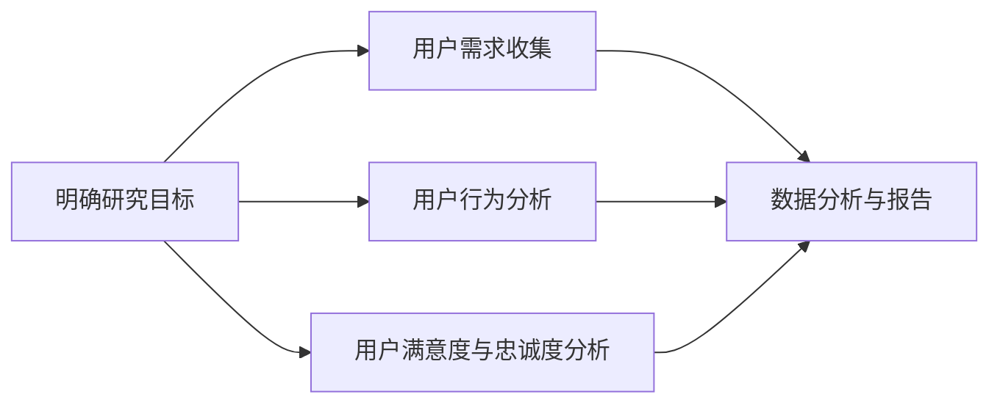
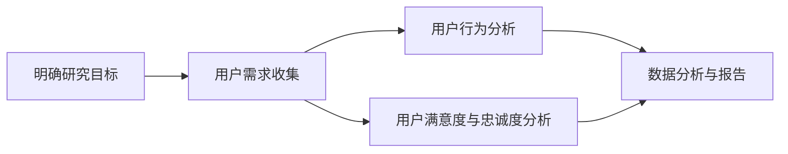
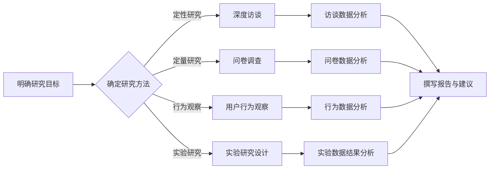

                 

### 文章标题

# 创业路上的用户研究方法：从定性到定量的全面分析

## 关键词

- 用户研究
- 定性分析
- 定量分析
- 创业
- 产品开发
- 数据分析

## 摘要

本文将深入探讨创业过程中用户研究的多种方法，包括从定性到定量的全面分析。我们将首先介绍用户研究的理论基础和核心概念，然后详细阐述定性研究中的深度访谈法和焦点小组法，以及定量研究中的问卷调查法和实验研究法。最后，我们将通过实际案例分析和总结，展示用户研究在产品开发中的应用及其未来发展方向。

## 《创业路上的用户研究方法：从定性到定量的全面分析》目录大纲

### 第一部分：用户研究的理论基础

#### 第1章：用户研究的背景和重要性

#### 第2章：用户研究的核心概念与联系

- 2.1 用户需求的收集与分析
  - 2.1.1 需求收集的方法与技巧
  - 2.1.2 需求分析的过程与工具
  - 2.1.3 需求优先级评估的方法
- 2.2 用户行为分析
  - 2.2.1 用户行为数据采集的方法
  - 2.2.2 用户行为数据处理的流程
  - 2.2.3 用户行为分析的常用工具
- 2.3 用户满意度与忠诚度分析
  - 2.3.1 满意度与忠诚度的定义与衡量
  - 2.3.2 满意度与忠诚度的分析方法
  - 2.3.3 满意度与忠诚度提升的策略

#### 第3章：用户研究的Mermaid流程图

### 第二部分：定性研究方法

#### 第4章：深度访谈法

- 4.1 深度访谈的设计与实施
  - 4.1.1 访谈对象的选择
  - 4.1.2 访谈问题的设计
  - 4.1.3 访谈的实施步骤
  - 4.1.4 访谈技巧与注意事项
- 4.2 深度访谈的数据分析
  - 4.2.1 数据整理与编码
  - 4.2.2 数据分析的方法与工具
  - 4.2.3 数据分析结果的应用
- 4.3 深度访谈的实际应用
  - 4.3.1 在产品原型设计中的应用
  - 4.3.2 在产品改进中的应用
  - 4.3.3 在市场调研中的应用

#### 第5章：焦点小组法

- 5.1 焦点小组的构建与组织
  - 5.1.1 小组成员的选择
  - 5.1.2 小组的组织与引导
  - 5.1.3 焦点小组的注意事项
- 5.2 焦点小组的讨论技巧
  - 5.2.1 讨论话题的引导
  - 5.2.2 讨论问题的提出与解答
  - 5.2.3 讨论结果的记录与整理
- 5.3 焦点小组的数据分析方法
  - 5.3.1 数据整理与编码
  - 5.3.2 数据分析的方法与工具
  - 5.3.3 数据分析结果的应用

#### 第6章：用户行为观察法

- 6.1 用户行为观察的理论基础
  - 6.1.1 用户行为的定义与分类
  - 6.1.2 用户行为观察的目标与意义
  - 6.1.3 用户行为观察的原则与方法
- 6.2 用户行为观察的实施步骤
  - 6.2.1 观察目标的确定
  - 6.2.2 观察环境的准备
  - 6.2.3 观察过程的实施
  - 6.2.4 观察数据的收集与整理
- 6.3 用户行为观察的数据分析
  - 6.3.1 数据整理与编码
  - 6.3.2 数据分析的方法与工具
  - 6.3.3 数据分析结果的应用

### 第三部分：定量研究方法

#### 第7章：问卷调查法

- 7.1 问卷设计的原则与方法
  - 7.1.1 问卷设计的步骤与流程
  - 7.1.2 问卷题目类型的选用与设计
  - 7.1.3 问卷的效度与信度评估
- 7.2 问卷的实施与数据收集
  - 7.2.1 问卷的发放渠道与方式
  - 7.2.2 问卷数据的收集方法与工具
  - 7.2.3 问卷数据的预处理
- 7.3 问卷数据的统计分析
  - 7.3.1 数据整理与编码
  - 7.3.2 数据分析的方法与工具
  - 7.3.3 数据分析结果的应用

#### 第8章：实验研究法

- 8.1 实验设计的基本概念
  - 8.1.1 实验设计的类型与方法
  - 8.1.2 实验变量与操作定义
  - 8.1.3 实验控制的策略与实施
- 8.2 实验研究的实施步骤
  - 8.2.1 实验前的准备工作
  - 8.2.2 实验过程的实施
  - 8.2.3 实验数据的收集与整理
- 8.3 实验数据的结果分析
  - 8.3.1 数据整理与编码
  - 8.3.2 数据分析的方法与工具
  - 8.3.3 数据分析结果的应用

### 第四部分：用户研究的应用与实践

#### 第9章：用户研究在产品开发中的应用

- 9.1 用户研究在产品概念验证中的应用
  - 9.1.1 用户需求收集与验证
  - 9.1.2 用户行为观察与分析
  - 9.1.3 用户满意度与忠诚度评估
- 9.2 用户研究在产品设计与改进中的应用
  - 9.2.1 用户反馈收集与处理
  - 9.2.2 产品原型设计与迭代
  - 9.2.3 产品功能测试与优化
- 9.3 用户研究在产品上市后的持续优化中的应用
  - 9.3.1 用户行为数据分析
  - 9.3.2 用户满意度与忠诚度监控
  - 9.3.3 产品功能迭代与优化

#### 第10章：用户研究的实际案例分析

- 10.1 案例一：某电商平台的用户研究实践
  - 10.1.1 案例背景与目标
  - 10.1.2 用户研究方法与实施
  - 10.1.3 案例结果与启示
- 10.2 案例二：某O2O服务平台的用户研究实践
  - 10.2.1 案例背景与目标
  - 10.2.2 用户研究方法与实施
  - 10.2.3 案例结果与启示
- 10.3 案例三：某医疗健康平台的用户研究实践
  - 10.3.1 案例背景与目标
  - 10.3.2 用户研究方法与实施
  - 10.3.3 案例结果与启示

#### 第11章：用户研究的总结与反思

- 11.1 用户研究的成果评估
  - 11.1.1 成果评估的标准与方法
  - 11.1.2 成果评估的结果与应用
- 11.2 用户研究的不足与改进方向
  - 11.2.1 存在的问题与挑战
  - 11.2.2 改进方向与策略
- 11.3 用户研究的未来发展展望
  - 11.3.1 技术发展趋势与影响
  - 11.3.2 未来研究方向与机会

### 附录

#### 附录A：用户研究常用工具与资源

- A.1 常用用户研究工具简介
  - A.1.1 调查问卷工具
  - A.1.2 深度访谈工具
  - A.1.3 用户行为数据分析工具
- A.2 用户研究相关的书籍与文献推荐
  - A.2.1 经典书籍推荐
  - A.2.2 最新研究成果推荐
- A.3 用户研究相关的在线资源与社区
  - A.3.1 在线课程与培训
  - A.3.2 用户研究社区与论坛

### 作者

- 作者：AI天才研究院/AI Genius Institute & 禅与计算机程序设计艺术 /Zen And The Art of Computer Programming

### 完整性要求

为了保证文章的完整性和深度，以下是每个小节的核心内容要求：

#### 第1章：用户研究的背景和重要性

- 背景介绍：创业过程中用户研究的重要性，用户研究在产品开发中的关键作用。
- 核心概念：用户研究的基本概念，用户研究的主要目标和方法。
- 关联性分析：用户研究与市场调研、产品开发、用户体验设计之间的关系。

#### 第2章：用户研究的核心概念与联系

- 用户需求收集与分析：需求收集的方法、技巧和过程，需求分析的工具和流程，需求优先级评估的方法。
- 用户行为分析：用户行为数据采集的方法、数据处理的流程、常用工具和案例分析。
- 用户满意度与忠诚度分析：满意度与忠诚度的定义、衡量方法、分析方法、提升策略。

#### 第3章：用户研究的Mermaid流程图

- 流程图设计：用户研究的基本流程，从明确研究目标到撰写报告与建议的详细步骤。

#### 第4章：深度访谈法

- 深度访谈的设计与实施：访谈对象的选择、问题的设计、实施步骤、技巧和注意事项。
- 深度访谈的数据分析：数据整理与编码、数据分析的方法与工具、数据分析结果的应用。
- 深度访谈的实际应用：产品原型设计、产品改进、市场调研中的应用案例。

#### 第5章：焦点小组法

- 焦点小组的构建与组织：小组成员的选择、小组的组织与引导、注意事项。
- 焦点小组的讨论技巧：讨论话题的引导、问题的提出与解答、讨论结果的记录与整理。
- 焦点小组的数据分析方法：数据整理与编码、数据分析的方法与工具、数据分析结果的应用。

#### 第6章：用户行为观察法

- 用户行为观察的理论基础：用户行为的定义与分类、用户行为观察的目标与意义、原则与方法。
- 用户行为观察的实施步骤：观察目标的确定、观察环境的准备、观察过程的实施、数据的收集与整理。
- 用户行为观察的数据分析：数据整理与编码、数据分析的方法与工具、数据分析结果的应用。

#### 第7章：问卷调查法

- 问卷设计的原则与方法：问卷设计的步骤与流程、题目类型的选用与设计、效度与信度评估。
- 问卷的实施与数据收集：问卷的发放渠道与方式、数据的收集方法与工具、预处理。
- 问卷数据的统计分析：数据整理与编码、数据分析的方法与工具、数据分析结果的应用。

#### 第8章：实验研究法

- 实验设计的基本概念：实验设计的类型与方法、实验变量与操作定义、实验控制的策略与实施。
- 实验研究的实施步骤：实验前的准备工作、实验过程的实施、数据的收集与整理。
- 实验数据的结果分析：数据整理与编码、数据分析的方法与工具、数据分析结果的应用。

#### 第9章：用户研究在产品开发中的应用

- 用户研究在产品概念验证中的应用：用户需求收集与验证、用户行为观察与分析、用户满意度与忠诚度评估。
- 用户研究在产品设计与改进中的应用：用户反馈收集与处理、产品原型设计与迭代、产品功能测试与优化。
- 用户研究在产品上市后的持续优化中的应用：用户行为数据分析、用户满意度与忠诚度监控、产品功能迭代与优化。

#### 第10章：用户研究的实际案例分析

- 案例一：某电商平台的用户研究实践：案例背景与目标、用户研究方法与实施、案例结果与启示。
- 案例二：某O2O服务平台的用户研究实践：案例背景与目标、用户研究方法与实施、案例结果与启示。
- 案例三：某医疗健康平台的用户研究实践：案例背景与目标、用户研究方法与实施、案例结果与启示。

#### 第11章：用户研究的总结与反思

- 用户研究的成果评估：成果评估的标准与方法、评估结果与应用。
- 用户研究的不足与改进方向：存在的问题与挑战、改进方向与策略。
- 用户研究的未来发展展望：技术发展趋势与影响、未来研究方向与机会。

### 完整性要求总结

- 确保文章内容结构合理、逻辑清晰。
- 每个章节的核心内容需详细阐述，确保知识点的全面覆盖。
- 使用具体案例、公式、算法和代码示例来增强文章的可读性和实用性。
- 确保文中所有引用的数据、资料、工具和案例均准确无误，并提供相应的来源。

### 文章字数要求

- 文章字数要求在8000～12000字左右，确保内容的丰富性和深度。

### 格式要求

- 文章内容使用markdown格式输出。
- 每个章节标题使用“##”进行标记。
- 小节标题使用“###”进行标记。
- 段落内代码示例使用`code block`格式，代码块前添加三个空格。
- 数学公式使用LaTeX格式，独立段落内的公式使用`$$`括起来，段落内的公式使用`$`括起来。

### 作者信息

- 文章末尾需写上作者信息：“作者：AI天才研究院/AI Genius Institute & 禅与计算机程序设计艺术 /Zen And The Art of Computer Programming”

### 最后的思考

- 在撰写文章的过程中，我们需要不断反思和调整，确保文章的逻辑性和连贯性。
- 深入分析用户研究的各种方法，结合实际案例，展示其在创业过程中的应用价值。
- 提出用户研究的未来发展方向，为创业者提供有价值的参考和建议。

### 开始撰写

现在，让我们开始撰写文章，逐步深入分析创业过程中的用户研究方法。每个章节都将详细讨论其核心概念、原理和应用，为读者提供全面、系统的指导。让我们从第1章开始，探讨用户研究的背景和重要性。通过深入的理论分析和实践案例，我们希望能帮助创业者更好地理解和运用用户研究，从而提高产品的市场竞争力和用户体验。

### 第1章：用户研究的背景和重要性

在当今快速发展的科技时代，创业已成为许多人的选择。然而，成功的创业不仅仅依赖于创新的产品和优秀的团队，更需要深入理解用户需求和市场动态。在这一章中，我们将探讨用户研究的背景和重要性，以及用户研究的基本概念和主要目标。

#### 1.1 用户研究的基本概念

用户研究（User Research）是指通过系统的方法收集和分析用户数据，以理解用户的需求、行为和偏好。用户研究的核心目的是帮助创业者、产品经理和设计师更好地了解目标用户，从而为产品开发、功能设计和用户体验优化提供有力支持。

用户研究的范围广泛，包括以下关键方面：

- **用户需求收集**：通过访谈、问卷和观察等方法，了解用户对产品的期望、使用场景和痛点。
- **用户行为分析**：收集和分析用户在使用产品过程中的行为数据，以发现用户行为的模式、趋势和异常。
- **用户满意度与忠诚度分析**：评估用户对产品的满意度、使用频率和推荐意愿，了解用户对产品的忠诚度。
- **市场调研**：通过用户研究了解市场需求和竞争状况，为市场定位和策略制定提供依据。

#### 1.2 用户研究的意义和价值

用户研究在创业过程中具有重要意义和价值，主要体现在以下几个方面：

- **指导产品开发**：用户研究能够帮助创业者明确产品的目标用户群体，了解用户的需求和痛点，从而指导产品设计和功能开发。
- **提高用户体验**：通过深入了解用户行为和满意度，创业者可以优化产品界面、交互流程和功能设计，提升用户体验和用户满意度。
- **降低开发风险**：在产品开发早期进行用户研究，可以识别潜在问题，避免开发出不符合市场需求的产品，降低开发风险。
- **市场定位与策略**：用户研究能够帮助创业者了解市场需求和竞争状况，为市场定位和营销策略提供科学依据。
- **持续优化与改进**：用户研究不仅是产品开发的起点，也是产品上市后的持续优化过程。通过持续的用户研究，创业者可以不断调整产品方向，满足用户需求，提升产品竞争力。

#### 1.3 用户研究的主要方法

用户研究的方法多样，可以根据研究目标和资源选择合适的方法。以下是一些常用的用户研究方法：

- **深度访谈**：通过与用户进行一对一的深入交流，了解用户的真实需求和感受。深度访谈通常用于探索性研究，以获取丰富的定性数据。
- **焦点小组**：邀请一组用户参与讨论，通过集体交流收集多方面的反馈。焦点小组适用于验证假设、了解用户对特定功能的看法。
- **用户行为观察**：在自然环境中观察用户使用产品的过程，记录用户行为和互动。用户行为观察适用于了解用户行为模式和问题。
- **问卷调查**：通过设计问卷收集大量用户的反馈，适用于大规模的数据收集。问卷调查可以采用线上或线下形式。
- **实验研究**：设计实验以测试特定假设或功能，适用于验证性研究。实验研究可以采用A/B测试、对照组实验等方法。

#### 1.4 用户研究在创业过程中的应用

用户研究在创业过程中的应用贯穿整个产品生命周期，从概念验证到上市后的持续优化。以下是用户研究在各个阶段的具体应用：

- **概念验证**：在产品开发初期，通过用户研究验证产品概念，了解用户对产品的初步反应和需求。
- **产品设计与开发**：在产品设计和开发过程中，通过用户研究收集用户反馈，优化产品功能和界面设计。
- **上市准备**：在产品上市前，通过用户研究评估产品的市场接受度，识别潜在问题并进行改进。
- **持续优化**：在产品上市后，通过用户研究监控用户行为和满意度，不断优化产品功能和服务。

#### 1.5 用户研究的Mermaid流程图

为了更清晰地展示用户研究的流程，我们使用Mermaid工具绘制了用户研究的流程图。以下是一个简单的Mermaid流程图示例：

在这个流程图中，A表示明确研究目标，B、C、D分别代表用户需求收集、用户行为分析和用户满意度与忠诚度分析，E表示数据分析与报告。通过这个流程图，创业者可以系统地规划用户研究工作，确保每个环节都得到充分关注。

#### 1.6 本章总结

本章介绍了用户研究的背景和重要性，阐述了用户研究的基本概念和主要目标。通过用户研究，创业者可以更好地了解用户需求，优化产品设计，提升用户体验，降低开发风险，为创业成功提供有力支持。下一章将深入探讨用户研究的核心概念与联系，包括用户需求的收集与分析、用户行为分析和用户满意度与忠诚度分析。

### 第2章：用户研究的核心概念与联系

在了解了用户研究的背景和重要性之后，我们需要深入探讨用户研究的核心概念与联系。这一章将重点介绍用户需求的收集与分析、用户行为分析、用户满意度与忠诚度分析，以及它们之间的关联性。

#### 2.1 用户需求的收集与分析

用户需求的收集与分析是用户研究的起点，也是至关重要的一环。通过深入了解用户需求，创业者可以明确产品的方向和功能，从而更好地满足用户需求。

##### 2.1.1 需求收集的方法与技巧

收集用户需求的方法有多种，以下是几种常见的方法：

- **深度访谈**：通过与用户进行一对一的深入交流，了解用户的真实需求和痛点。深度访谈的优点在于能够获取详细的定性数据，帮助创业者深入了解用户的需求和行为。
- **问卷调查**：通过设计问卷收集大量用户的反馈，适用于大规模的数据收集。问卷调查可以采用线上或线下形式，便于用户参与和数据分析。
- **用户行为观察**：在自然环境中观察用户使用产品的过程，记录用户行为和互动。用户行为观察适用于了解用户行为模式和问题，为需求收集提供有力支持。
- **焦点小组**：邀请一组用户参与讨论，通过集体交流收集多方面的反馈。焦点小组适用于验证假设、了解用户对特定功能的看法。

在收集用户需求时，需要注意以下技巧：

- **明确访谈或问卷调查的目标**：在开始访谈或问卷调查之前，明确研究目标和问题，确保收集的数据有针对性。
- **设计有针对性的问题**：问题应尽量简洁明了，避免引导性提问，以便获取真实的用户反馈。
- **灵活调整提问方式**：根据用户的回答，灵活调整问题，引导用户深入表达自己的需求和观点。
- **尊重用户的隐私**：在收集用户数据时，确保用户的隐私得到保护，避免泄露用户信息。

##### 2.1.2 需求分析的过程与工具

需求分析的过程可以分为以下几个步骤：

1. **需求收集**：通过访谈、问卷、用户行为观察等方式收集用户需求。
2. **需求整理**：对收集到的需求进行整理和分类，提炼出关键需求。
3. **需求优先级评估**：对每个需求的重要性进行评估，确定优先级。
4. **需求文档编写**：将需求整理成文档，便于团队成员参考和实施。

在需求分析过程中，可以使用以下工具：

- **用户故事地图**：通过用户故事地图，展示用户需求、使用场景和交互流程，便于团队讨论和优化。
- **用户画像**：通过用户画像，了解目标用户的基本特征、需求和偏好，为产品设计和功能实现提供依据。
- **需求矩阵**：通过需求矩阵，对需求进行分类和优先级排序，便于团队明确工作重点。

##### 2.1.3 需求优先级评估的方法

在需求分析过程中，需求优先级的评估非常重要。以下是一些常见的需求优先级评估方法：

- **Kano模型**：根据用户需求的重要性，将需求分为必须需求、一维需求、魅力需求和无关需求。必须需求是产品的核心功能，一维需求是基本功能，魅力需求是差异化功能，无关需求是用户不关心的功能。
- **MoSCoW模型**：将需求分为必须（Must have）、应该有（Should have）、可以有（Could have）和不会（Wont have）。必须需求是产品的基本功能，应该有需求是重要但不是必须的功能，可以有需求是可选的功能，不会需求是当前不实现的功能。
- **成本效益分析**：根据需求实现的成本和潜在收益，评估需求的优先级。成本效益分析可以帮助团队在资源有限的情况下，优先实现高价值、低成本的需求。

#### 2.2 用户行为分析

用户行为分析是用户研究的核心环节之一，通过分析用户行为，创业者可以了解用户在使用产品过程中的行为模式、偏好和痛点，从而为产品优化提供依据。

##### 2.2.1 用户行为数据采集的方法

采集用户行为数据的方法包括以下几种：

- **日志分析**：通过记录用户在产品中的操作行为，分析用户的访问路径、点击率、使用时长等行为数据。
- **用户行为跟踪**：通过安装跟踪器或使用SDK，实时收集用户在产品中的行为数据，如浏览页面、操作步骤、使用频率等。
- **用户行为观察**：在真实环境中观察用户使用产品的过程，记录用户行为和互动，了解用户行为模式和问题。
- **用户调研**：通过访谈、问卷等形式，了解用户对产品功能的看法、使用体验和满意度。

##### 2.2.2 用户行为数据处理的流程

用户行为数据处理的过程包括以下几个步骤：

1. **数据收集**：通过日志分析、用户行为跟踪、用户行为观察等方法，收集用户行为数据。
2. **数据清洗**：对收集到的数据进行清洗，去除无效数据、重复数据和错误数据，确保数据质量。
3. **数据存储**：将清洗后的数据存储在数据库或数据仓库中，便于后续的数据分析和处理。
4. **数据处理**：对存储的数据进行预处理，如数据格式转换、缺失值填充、异常值处理等，为数据挖掘和分析做好准备。
5. **数据可视化**：通过数据可视化工具，将处理后的数据以图表、图形等形式展示，便于团队理解和分析。

##### 2.2.3 用户行为分析的常用工具

在用户行为分析过程中，可以使用以下常用工具：

- **Google Analytics**：一款功能强大的网站分析工具，可以收集和分析用户在网站中的行为数据，如浏览量、访问路径、点击率等。
- **Mixpanel**：一款用户行为跟踪和分析工具，可以实时收集用户在应用程序中的行为数据，并进行用户细分和用户行为预测。
- **Tableau**：一款数据可视化工具，可以将用户行为数据以图表、图形等形式展示，帮助团队直观地了解用户行为模式。
- **Python数据分析库**：如Pandas、NumPy、Matplotlib等，可以用于数据处理、数据分析和数据可视化。

#### 2.3 用户满意度与忠诚度分析

用户满意度与忠诚度分析是评估产品成功与否的重要指标。通过分析用户满意度与忠诚度，创业者可以了解用户对产品的满意度、使用频率和推荐意愿，从而为产品优化和用户关系管理提供依据。

##### 2.3.1 满意度与忠诚度的定义与衡量

- **用户满意度**：用户满意度是指用户对产品或服务的整体评价和满意程度。通常采用问卷、访谈等方式进行衡量，常见指标包括用户满意度评分、用户投诉率等。
- **用户忠诚度**：用户忠诚度是指用户对产品或服务的忠诚程度，即用户在长期使用产品过程中，持续使用和推荐产品的意愿。通常采用用户留存率、复购率、推荐率等指标进行衡量。

##### 2.3.2 满意度与忠诚度的分析方法

- **描述性分析**：通过统计用户满意度评分、留存率、复购率等指标，了解用户满意度和忠诚度的总体情况。
- **比较分析**：通过对比不同用户群体、产品版本、市场区域的用户满意度与忠诚度，分析用户满意度和忠诚度的差异和原因。
- **因果分析**：通过相关性分析和回归分析等方法，探究用户满意度、忠诚度与产品功能、用户体验、服务质量等因素之间的关系。

##### 2.3.3 满意度与忠诚度提升的策略

- **优化产品功能**：根据用户反馈，持续优化产品功能，提升用户体验和满意度。
- **提升服务质量**：提高服务质量，包括客户服务、售后支持等，增强用户忠诚度。
- **用户教育**：通过用户教育，提高用户对产品的认知和理解，增强用户满意度和忠诚度。
- **用户激励**：通过用户激励，如优惠券、积分奖励、会员制度等，提升用户忠诚度和复购率。
- **用户互动**：通过用户互动，如用户论坛、用户反馈收集、在线客服等，增强用户归属感和忠诚度。

#### 2.4 用户研究的Mermaid流程图

为了更清晰地展示用户研究的流程，我们使用Mermaid工具绘制了用户研究的流程图。以下是一个简单的Mermaid流程图示例：

在这个流程图中，A表示明确研究目标，B、C、D分别代表用户需求收集、用户行为分析和用户满意度与忠诚度分析，E表示数据分析与报告。通过这个流程图，创业者可以系统地规划用户研究工作，确保每个环节都得到充分关注。

#### 2.5 本章总结

本章详细介绍了用户研究的核心概念与联系，包括用户需求的收集与分析、用户行为分析、用户满意度与忠诚度分析。通过这些核心概念的阐述，创业者可以更好地理解用户研究的意义和价值，掌握用户研究的方法和技巧。下一章将介绍用户研究的定性研究方法，包括深度访谈法、焦点小组法和用户行为观察法，以帮助创业者深入了解用户需求和优化产品设计。

### 第3章：用户研究的Mermaid流程图

用户研究的流程图是指导用户研究工作的重要工具，它可以帮助创业者系统地规划研究步骤，确保每个环节都得到充分关注。在本章中，我们将使用Mermaid工具绘制用户研究的流程图，并详细解释每个步骤的目的和重要性。

#### 3.1 Mermaid工具介绍

Mermaid是一种基于Markdown的图表绘制工具，它能够将简单的文本描述转换成结构化的图表。Mermaid支持多种类型的图表，包括流程图、时序图、网络图等，非常适合用于用户研究的流程设计。

#### 3.2 用户研究流程图设计

下面是一个简单的用户研究Mermaid流程图示例：

在这个流程图中，A表示明确研究目标，B是确定研究方法的决策节点，根据研究目标的不同，可以选择定性研究、定量研究、行为观察或实验研究。C、D、E、F分别代表深度访谈、问卷调查、用户行为观察和实验研究设计。每个研究方法都有其对应的数据分析步骤（G、H、I、J），最后汇总到K，即撰写报告与建议。

#### 3.3 流程图中的每个步骤详解

- **A：明确研究目标**：这是用户研究的起点，创业者需要明确研究的具体目标，例如了解用户需求、评估用户体验、收集市场反馈等。
- **B：确定研究方法**：根据研究目标，选择适合的定性或定量研究方法。定性研究适用于深入探索用户需求和动机，定量研究适用于大规模的数据收集和分析。
- **C：深度访谈**：通过深度访谈，创业者可以与用户进行一对一的深入交流，获取详细的需求和反馈。
- **D：问卷调查**：问卷调查是一种有效的定量研究方法，可以收集大量用户的数据，适用于大规模的用户调研。
- **E：用户行为观察**：在自然环境中观察用户行为，可以揭示用户在使用产品时的真实行为模式，帮助创业者优化产品设计。
- **F：实验研究设计**：实验研究是一种验证性研究方法，通过设计实验来测试假设，适用于验证产品功能或优化策略。
- **G：访谈数据分析**：对深度访谈的数据进行整理、编码和分析，提取关键信息，形成用户需求和行为报告。
- **H：问卷数据分析**：对问卷调查的数据进行统计分析，如描述性统计、相关性分析和回归分析等，以量化用户反馈。
- **I：行为数据分析**：对用户行为数据进行处理和分析，如点击流分析、事件追踪等，以了解用户行为模式和偏好。
- **J：实验数据结果分析**：对实验数据进行分析，验证假设的有效性，提取实验结果，为产品优化提供依据。
- **K：撰写报告与建议**：将分析结果整理成报告，为创业者提供具体的产品改进建议和下一步行动指南。

#### 3.4 用户研究流程图的应用

用户研究流程图不仅可以用于指导用户研究工作，还可以在项目规划和团队协作中发挥重要作用：

- **项目规划**：创业者可以利用流程图制定详细的研究计划，包括研究目标、方法、时间表和资源分配。
- **团队协作**：流程图可以帮助团队成员了解研究工作的每个环节，确保工作顺利进行，减少沟通成本。
- **成果评估**：通过流程图的步骤，创业者可以系统地评估研究工作的质量和效果，确保达到研究目标。

#### 3.5 本章总结

本章介绍了使用Mermaid工具绘制用户研究流程图的方法和步骤。通过用户研究流程图，创业者可以更清晰地规划研究工作，确保每个环节都得到充分关注。流程图不仅有助于项目规划和团队协作，还可以用于成果评估和改进。在下一章中，我们将深入探讨用户研究的定性研究方法，包括深度访谈法、焦点小组法和用户行为观察法。

### 第4章：深度访谈法

深度访谈法是用户研究中一种重要的定性研究方法，它通过深入、详尽的个人交流，获取用户对产品或服务的看法和感受。本章将详细讨论深度访谈法的具体应用，包括访谈的设计与实施、数据分析、实际应用以及注意事项。

#### 4.1 深度访谈的设计与实施

##### 4.1.1 访谈对象的选择

选择合适的访谈对象是深度访谈成功的关键。以下是选择访谈对象时需要考虑的几个方面：

- **代表性**：访谈对象应具备代表性，能够反映目标用户群体的特征和需求。
- **多样性**：为了获取更丰富的信息，访谈对象应具有多样性，涵盖不同年龄、性别、职业和教育背景等。
- **便利性**：访谈对象应方便参与访谈，如地理位置、时间安排等。
- **意愿性**：访谈对象应愿意参与访谈，并能够提供真实、详细的反馈。

##### 4.1.2 访谈问题的设计

设计有效的访谈问题是访谈成功的关键。以下是设计访谈问题时的几个要点：

- **开放式问题**：开放式问题鼓励访谈对象自由表达观点和感受，如“您对产品的使用体验如何？”
- **引导性问题**：引导性问题用于引导访谈对象深入探讨某些话题，如“您为什么会有这样的感受？”
- **控制性问题**：控制性问题用于限制访谈对象的话题范围，确保访谈聚焦于关键问题，如“您是否遇到过使用中的问题？”
- **顺序性**：访谈问题应按照逻辑顺序排列，从一般性问题逐渐过渡到具体问题，以便访谈对象逐步深入。

##### 4.1.3 访谈的实施步骤

以下是深度访谈的实施步骤：

1. **准备工作**：准备访谈大纲和访谈问题，选择合适的访谈环境，确保访谈的顺利进行。
2. **访谈引导**：访谈开始时，向访谈对象简要介绍研究背景和目的，确保其理解访谈的内容和意义。
3. **正式访谈**：按照访谈大纲和问题顺序进行访谈，鼓励访谈对象充分表达观点，注意倾听和记录。
4. **访谈总结**：访谈结束时，总结访谈内容，确保访谈对象的反馈得到充分记录和理解。
5. **访谈反馈**：在访谈结束后，向访谈对象表示感谢，并简要反馈访谈结果，增强其参与感。

##### 4.1.4 访谈技巧与注意事项

以下是进行深度访谈时需要掌握的技巧和注意事项：

- **建立信任关系**：访谈过程中，建立与访谈对象的信任关系，使其愿意分享真实感受和观点。
- **避免引导**：避免在访谈过程中过度引导访谈对象，以确保获取真实、客观的信息。
- **记录细节**：详细记录访谈过程中的关键信息，如访谈对象的表情、语气和具体表述，有助于后续的数据分析。
- **尊重隐私**：在访谈过程中，尊重访谈对象的隐私，确保其个人信息得到保护。
- **灵活调整**：根据访谈对象的回答，灵活调整访谈问题的顺序和深度，以获取更丰富的信息。

#### 4.2 深度访谈的数据分析

##### 4.2.1 数据整理与编码

深度访谈的数据分析通常包括以下步骤：

1. **数据录入**：将访谈录音或笔记转换为文本格式，方便后续的数据分析。
2. **初步整理**：对访谈文本进行初步整理，删除重复信息和无关内容。
3. **编码**：将访谈文本中的关键信息进行编码，形成分类或标签。例如，可以将关于产品使用体验的反馈编码为“用户体验”、“功能问题”、“界面设计”等。

##### 4.2.2 数据分析的方法与工具

深度访谈的数据分析可以采用以下几种方法：

1. **内容分析**：通过对访谈文本的内容进行分析，提取关键信息和主题。内容分析可以采用定量和定性方法，如词频统计、主题分类等。
2. **主题分析**：通过识别和分析访谈文本中的主题，探索用户需求、行为和感受。主题分析是一种定性分析方法，常用的工具包括NVivo、Atlas.ti等。
3. **案例研究**：通过深入研究个别访谈对象的情况，了解其特定需求和行为。案例研究适用于探索性研究，有助于深入了解用户群体。

##### 4.2.3 数据分析结果的应用

数据分析结果可以应用于以下几个方面：

1. **产品优化**：根据访谈结果，识别产品功能、用户体验和设计方面的问题，并提出改进建议。
2. **需求优先级评估**：通过分析访谈结果，确定用户需求的重要性和优先级，为产品开发提供依据。
3. **市场策略**：根据访谈结果，了解目标用户群体的需求和偏好，为市场定位和策略制定提供参考。
4. **团队沟通**：将访谈结果分享给团队成员，提高团队对用户需求的认知，促进产品开发工作的协同。

#### 4.3 深度访谈的实际应用

##### 4.3.1 在产品原型设计中的应用

深度访谈在产品原型设计阶段具有重要意义。通过访谈，设计师可以了解目标用户对产品功能的期望、界面设计的感受以及使用过程中的痛点。以下是一些具体应用：

1. **功能验证**：通过访谈，验证产品原型功能是否符合用户需求，及时调整和优化。
2. **界面设计**：通过访谈，收集用户对界面布局、交互设计、视觉元素的反馈，优化界面设计。
3. **用户体验**：通过访谈，了解用户在使用产品原型时的体验感受，识别潜在问题和改进点。

##### 4.3.2 在产品改进中的应用

深度访谈不仅可以用于产品原型设计阶段，还可以在产品改进过程中发挥重要作用。通过访谈，创业者可以获取用户对现有产品的真实反馈，发现产品的问题和改进空间。以下是一些具体应用：

1. **问题诊断**：通过访谈，识别用户在使用产品过程中遇到的具体问题和困扰，为产品改进提供依据。
2. **功能优化**：根据用户反馈，优化产品的功能设计和实现，提升用户体验。
3. **服务质量**：通过访谈，了解用户对产品服务的满意度，改进服务质量，增强用户忠诚度。

##### 4.3.3 在市场调研中的应用

深度访谈在市场调研中也具有重要作用。通过访谈，创业者可以了解目标市场的情况，包括用户需求、竞争状况、市场趋势等。以下是一些具体应用：

1. **市场定位**：通过访谈，了解目标市场的特点和用户需求，为市场定位提供参考。
2. **竞争分析**：通过访谈，收集竞争产品的情况和用户反馈，分析竞争态势，制定竞争策略。
3. **趋势预测**：通过访谈，了解用户对市场趋势的看法和预测，为创业者的战略规划提供依据。

#### 4.4 深度访谈的实际案例分析

以下是一个深度访谈的实际案例分析：

**案例背景**：某创业公司开发了一款智能家居产品，希望通过用户访谈了解产品在用户心中的定位、用户需求和使用体验。

**访谈对象**：选择10位不同年龄、性别、职业的用户，包括年轻家庭、中老年人、科技爱好者等。

**访谈问题**：

1. **您对智能家居产品的了解有多少？**
2. **您为什么选择使用这款智能家居产品？**
3. **在使用过程中，您遇到了哪些问题和困扰？**
4. **您对产品的哪些功能最满意？哪些功能需要改进？**
5. **您愿意向他人推荐这款产品吗？为什么？**

**访谈结果**：

通过访谈，发现以下问题和改进点：

1. **问题诊断**：部分用户对智能家居的概念和操作流程不够了解，导致使用过程中出现困扰。
2. **功能优化**：用户对智能安防、远程控制等核心功能非常满意，但建议增加智能家居设备的互联互通功能。
3. **用户体验**：用户对产品界面设计和交互体验提出了改进建议，如增加自定义设置、优化提示信息等。
4. **市场定位**：通过访谈，公司确定了以中老年用户和家庭为主要目标市场，并调整了产品宣传策略。

**访谈应用**：基于访谈结果，公司对产品进行了如下改进：

1. **增加用户指南**：在产品包装和官方网站上提供详细的用户指南，帮助用户快速了解和操作产品。
2. **优化功能设计**：增加了智能家居设备的互联互通功能，使用户能够更好地管理和控制设备。
3. **优化界面设计**：根据用户反馈，对产品界面进行了优化，增加了自定义设置和提示信息，提升了用户体验。

#### 4.5 本章总结

本章详细介绍了深度访谈法的具体应用，包括访谈的设计与实施、数据分析、实际应用以及注意事项。深度访谈法是一种重要的定性研究方法，能够帮助创业者深入了解用户需求、优化产品设计、提升用户体验。通过实际案例的分析，我们可以看到深度访谈法在产品开发、改进和市场调研中的重要作用。在下一章中，我们将探讨焦点小组法，继续深入探讨用户研究的定性研究方法。

### 第5章：焦点小组法

焦点小组法（Focus Group）是用户研究中常用的定性研究方法之一，通过小规模的集体讨论，获取多角度的用户反馈和观点。本章将详细讨论焦点小组法的构建与组织、讨论技巧、数据分析方法以及注意事项，并展示其在实际中的应用。

#### 5.1 焦点小组的构建与组织

##### 5.1.1 小组成员的选择

选择合适的小组成员是焦点小组成功的关键。以下是需要考虑的几个方面：

- **代表性**：小组成员应具有代表性，能够涵盖目标用户群体的多样化特征，如年龄、性别、职业、教育背景等。
- **数量**：焦点小组通常由6-10名成员组成，人数不宜过多，以免讨论过于分散，影响讨论深度。
- **自愿性**：小组成员应自愿参与讨论，以确保其积极参与和真实表达观点。
- **知识背景**：小组成员应具有一定的知识背景，能够理解讨论话题和提供有价值的信息。

##### 5.1.2 小组的组织与引导

焦点小组的组织与引导是确保讨论顺利进行的重要环节。以下是需要注意的几个方面：

- **确定讨论目标**：在讨论前明确讨论的目标和主题，确保讨论内容聚焦，避免偏离主题。
- **准备讨论大纲**：根据讨论目标，准备详细的讨论大纲，包括讨论的问题、引导语和可能的讨论分支。
- **安排会议场地**：选择一个安静、舒适、具备良好设备（如录音设备、投影仪等）的会议场地，为讨论提供良好的环境。
- **安排讨论引导者**：引导者应具备良好的沟通能力和引导技巧，能够引导讨论顺利进行，确保每个成员都有机会发言。

##### 5.1.3 焦点小组的注意事项

在组织焦点小组时，需要注意以下几点：

- **避免引导**：引导者应避免在讨论中给予小组成员过多引导，以免影响其真实表达观点。
- **鼓励积极参与**：鼓励小组成员积极参与讨论，发表自己的观点和意见，确保讨论的多样性和深度。
- **记录讨论内容**：详细记录讨论内容，包括小组成员的观点、讨论的分支和重要结论，以便后续的分析和应用。
- **尊重隐私**：确保小组成员的隐私得到保护，不泄露其个人信息和讨论内容。

#### 5.2 焦点小组的讨论技巧

以下是焦点小组讨论中常用的技巧：

- **开放式提问**：使用开放式问题引导讨论，如“您对产品的使用体验如何？”这类问题鼓励小组成员进行详细阐述。
- **反馈与确认**：在小组讨论中，引导者需要及时给予小组成员反馈，确认其观点和理解，如“您的意思是......？”这有助于澄清误解和深入讨论。
- **讨论分支引导**：在讨论过程中，引导者可以引导讨论进入不同的分支，以探索更多细节和观点，如“那您觉得这个功能还可以有哪些改进呢？”
- **控制时间**：确保每个小组成员都有机会发言，避免个别成员垄断讨论时间，确保讨论的公平性。
- **处理冲突**：在讨论中，小组成员可能会有不同意见和冲突，引导者应妥善处理，避免讨论偏离主题或陷入僵局。

#### 5.3 焦点小组的数据分析方法

焦点小组的数据分析通常包括以下步骤：

- **数据整理**：将讨论记录进行整理，去除重复信息和无关内容，确保数据的准确性。
- **编码**：对整理后的数据进行分析编码，将关键观点和主题进行分类和标签，如“用户体验问题”、“功能需求”等。
- **主题分析**：通过编码后的数据，识别和提取主要主题和观点，分析讨论中的共识和分歧。
- **报告撰写**：将分析结果整理成报告，包括主要发现、结论和建议，为创业者提供决策依据。

#### 5.4 焦点小组的实际应用

##### 5.4.1 在产品原型设计中的应用

焦点小组在产品原型设计阶段具有重要的应用价值。通过焦点小组讨论，设计师可以获取多角度的用户反馈和观点，优化产品原型。以下是一些具体应用：

- **功能验证**：通过焦点小组讨论，验证产品原型功能是否符合用户需求，识别潜在问题和改进点。
- **界面设计**：通过焦点小组讨论，收集用户对界面布局、交互设计、视觉元素的反馈，优化界面设计。
- **用户体验**：通过焦点小组讨论，了解用户在使用产品原型时的体验感受，识别潜在问题和改进点。

##### 5.4.2 在产品改进中的应用

焦点小组在产品改进过程中也具有重要作用。通过焦点小组讨论，创业者可以获取用户对现有产品的真实反馈，发现产品的问题和改进空间。以下是一些具体应用：

- **问题诊断**：通过焦点小组讨论，识别用户在使用产品过程中遇到的具体问题和困扰，为产品改进提供依据。
- **功能优化**：根据用户反馈，优化产品的功能设计和实现，提升用户体验。
- **服务质量**：通过焦点小组讨论，了解用户对产品服务的满意度，改进服务质量，增强用户忠诚度。

##### 5.4.3 在市场调研中的应用

焦点小组在市场调研中也具有重要作用。通过焦点小组讨论，创业者可以了解目标市场的情况，包括用户需求、竞争状况、市场趋势等。以下是一些具体应用：

- **市场定位**：通过焦点小组讨论，了解目标市场的特点和用户需求，为市场定位提供参考。
- **竞争分析**：通过焦点小组讨论，收集竞争产品的情况和用户反馈，分析竞争态势，制定竞争策略。
- **趋势预测**：通过焦点小组讨论，了解用户对市场趋势的看法和预测，为创业者的战略规划提供依据。

#### 5.5 焦点小组的实际案例分析

以下是一个焦点小组的实际案例分析：

**案例背景**：某创业公司开发了一款健康监测应用，希望通过焦点小组讨论了解用户对应用功能的期望和使用体验。

**讨论目标**：了解用户对健康监测应用的核心功能需求、界面设计偏好以及使用过程中的痛点。

**讨论过程**：

1. **开场介绍**：引导者简要介绍了讨论的目标和流程，确保小组成员了解讨论内容。
2. **功能讨论**：引导者提出了几个关于健康监测应用功能的问题，如“您希望应用提供哪些健康监测功能？”、“您对现有健康监测应用的功能是否满意？”等。
3. **界面设计讨论**：引导者展示了几个不同版本的界面设计，询问小组成员的偏好和意见。
4. **使用体验讨论**：引导者询问了小组成员在使用现有健康监测应用时的体验，如遇到的困扰、满意的部分等。

**讨论结果**：

通过焦点小组讨论，发现以下问题和改进点：

- **功能需求**：用户希望应用提供更多健康监测功能，如睡眠监测、运动跟踪、营养建议等。
- **界面设计**：用户对当前界面设计不满意，建议增加自定义设置、优化信息展示等。
- **使用体验**：用户在使用现有应用时遇到一些困扰，如操作复杂、信息展示不清晰等。

**讨论应用**：基于焦点小组讨论结果，公司对产品进行了如下改进：

- **增加功能**：根据用户需求，增加了睡眠监测、运动跟踪、营养建议等功能。
- **优化界面设计**：根据用户反馈，优化了界面布局和交互设计，增加了自定义设置和信息展示。
- **提升用户体验**：通过简化操作流程、优化信息展示等手段，提升了用户使用体验。

#### 5.6 本章总结

本章详细介绍了焦点小组法的构建与组织、讨论技巧、数据分析方法以及实际应用。焦点小组法是一种有效的定性研究方法，能够帮助创业者深入了解用户需求、优化产品设计、提升用户体验。通过实际案例的分析，我们可以看到焦点小组法在产品开发、改进和市场调研中的重要作用。在下一章中，我们将探讨用户行为观察法，继续深入探讨用户研究的定性研究方法。

### 第6章：用户行为观察法

用户行为观察法（User Behavior Observation）是用户研究中一种重要的定性研究方法，通过直接观察用户在自然环境或实验环境下使用产品或服务的实际行为，以获取用户对产品或服务的真实反馈。本章将详细讨论用户行为观察法的理论基础、实施步骤、数据分析以及在实际应用中的具体应用。

#### 6.1 用户行为观察的理论基础

##### 6.1.1 用户行为的定义与分类

用户行为（User Behavior）是指用户在特定环境下，对某一对象（如产品、服务、网站等）进行的操作和反应。用户行为可以分为以下几个类别：

- **浏览行为**：用户在网页或应用中浏览、跳转、搜索等行为。
- **交互行为**：用户与产品或服务进行交互的操作，如点击、拖动、输入等。
- **使用行为**：用户在使用产品或服务过程中的整体行为，如完成某项任务、使用特定功能等。
- **反馈行为**：用户对产品或服务的评价、建议、投诉等反馈行为。

##### 6.1.2 用户行为观察的目标与意义

用户行为观察的目标是深入了解用户在使用产品或服务过程中的行为模式、问题和需求，从而为产品或服务的优化提供依据。用户行为观察的意义主要体现在以下几个方面：

- **发现用户痛点**：通过观察用户行为，可以直观地发现用户在使用产品或服务过程中遇到的问题和困扰，为问题诊断提供依据。
- **优化用户体验**：了解用户行为有助于优化产品或服务的设计，提升用户体验和满意度。
- **改进产品设计**：用户行为观察可以帮助设计师了解用户实际需求，为产品的功能设计和界面布局提供参考。
- **评估产品效果**：通过观察用户行为，可以评估产品或服务的实际效果，为产品改进和市场推广提供依据。

##### 6.1.3 用户行为观察的原则与方法

用户行为观察应遵循以下原则：

- **客观性**：观察者应保持客观，避免主观判断和偏见，确保观察结果的准确性。
- **参与性**：观察者应积极参与用户行为观察，了解用户行为背后的动机和原因，以便进行深入分析。
- **全面性**：观察者应全面观察用户行为，包括浏览行为、交互行为、使用行为和反馈行为，确保获取全面的信息。

用户行为观察的方法包括：

- **现场观察**：在用户自然使用产品或服务的环境中进行观察，记录用户行为和互动。
- **远程观察**：通过远程监控工具，如摄像头、录音设备等，观察用户在使用产品或服务时的行为。
- **日志分析**：通过分析用户在使用产品或服务过程中产生的日志数据，了解用户行为模式。

#### 6.2 用户行为观察的实施步骤

##### 6.2.1 观察目标的确定

在开始用户行为观察之前，首先需要明确观察目标。观察目标应具体、明确，例如：

- **了解用户在购买过程中的行为模式**。
- **评估用户在使用某一功能时的满意度**。
- **发现用户在使用产品时的常见问题**。

##### 6.2.2 观察环境的准备

观察环境的准备包括以下几个方面：

- **选择观察环境**：根据观察目标，选择合适的观察环境，如用户家中、办公室或公共场所。
- **准备观察工具**：根据观察方法，准备相应的观察工具，如观察日志、录音设备、视频监控等。
- **培训观察人员**：对观察人员进行培训，确保其了解观察目标、方法和注意事项，提高观察的准确性和一致性。

##### 6.2.3 观察过程的实施

观察过程的实施包括以下几个方面：

- **开始观察**：观察者按照观察目标和计划，开始进行用户行为观察，记录用户行为和互动。
- **记录观察数据**：观察者应详细记录观察数据，包括用户行为、使用场景、时间点等，以便后续分析。
- **现场互动**：在观察过程中，观察者可以与用户进行适当的互动，了解用户行为背后的动机和原因。

##### 6.2.4 观察数据的收集与整理

观察数据的收集与整理包括以下几个方面：

- **数据收集**：通过观察日志、录音、视频等工具，收集观察数据。
- **数据整理**：对收集到的数据进行整理，去除重复信息和无关内容，确保数据的准确性。
- **数据存储**：将整理后的数据存储在数据库或数据仓库中，便于后续的数据分析和处理。

#### 6.3 用户行为观察的数据分析

用户行为观察的数据分析包括以下几个步骤：

- **数据预处理**：对收集到的观察数据进行清洗和预处理，如去除重复数据、缺失值填充、异常值处理等。
- **数据编码**：对预处理后的数据进行编码，将关键信息进行分类和标签，如“用户浏览行为”、“用户交互行为”等。
- **数据分析**：对编码后的数据进行分析，采用描述性分析、比较分析、因果分析等方法，提取关键信息和发现。
- **数据可视化**：通过数据可视化工具，将分析结果以图表、图形等形式展示，便于团队理解和分析。

#### 6.4 用户行为观察的常用工具

用户行为观察的常用工具包括：

- **观察日志**：记录观察过程中发现的关键行为和问题，便于后续分析和总结。
- **录音设备**：用于记录观察过程中的用户访谈和讨论，便于后续分析。
- **视频监控**：用于远程观察用户行为，记录用户在使用产品或服务时的操作和互动。
- **数据分析软件**：如Excel、SPSS、R等，用于对观察数据进行预处理、分析和可视化。

#### 6.5 用户行为观察的实际应用

##### 6.5.1 在产品原型设计中的应用

用户行为观察在产品原型设计阶段具有重要意义。通过观察用户在使用产品原型时的行为，设计师可以了解用户对产品功能的接受度、使用体验和需求。以下是一些具体应用：

- **功能验证**：通过用户行为观察，验证产品原型功能是否符合用户需求，发现潜在问题和改进点。
- **界面设计**：通过用户行为观察，了解用户对界面布局、交互设计、视觉元素的反馈，优化界面设计。
- **用户体验**：通过用户行为观察，识别用户在使用产品原型时的困扰和痛点，提升用户体验。

##### 6.5.2 在产品改进中的应用

用户行为观察在产品改进过程中也具有重要作用。通过观察用户在使用产品时的行为，创业者可以了解产品的问题和改进空间，为产品优化提供依据。以下是一些具体应用：

- **问题诊断**：通过用户行为观察，发现用户在使用产品过程中遇到的具体问题和困扰，为问题诊断提供依据。
- **功能优化**：根据用户行为观察结果，优化产品的功能设计和实现，提升用户体验。
- **服务质量**：通过用户行为观察，了解用户对产品服务的满意度，改进服务质量，增强用户忠诚度。

##### 6.5.3 在市场调研中的应用

用户行为观察在市场调研中也具有重要作用。通过观察用户在特定市场环境中的行为，创业者可以了解目标市场的情况，包括用户需求、竞争状况、市场趋势等。以下是一些具体应用：

- **市场定位**：通过用户行为观察，了解目标市场的特点和用户需求，为市场定位提供参考。
- **竞争分析**：通过用户行为观察，收集竞争产品的情况和用户反馈，分析竞争态势，制定竞争策略。
- **趋势预测**：通过用户行为观察，了解用户对市场趋势的看法和预测，为创业者的战略规划提供依据。

#### 6.6 用户行为观察的实际案例分析

以下是一个用户行为观察的实际案例分析：

**案例背景**：某创业公司开发了一款在线教育平台，希望通过用户行为观察了解用户在学习过程中的行为模式、需求和痛点。

**观察目标**：了解用户在学习平台上的行为模式、使用习惯以及对平台功能的评价。

**观察过程**：

1. **确定观察环境**：选择用户自然学习环境，如家庭或公共图书馆。
2. **准备观察工具**：使用观察日志和录音设备，记录用户学习行为和反馈。
3. **开始观察**：观察者对10名用户进行了为期一周的观察，记录用户在学习平台上的行为，如浏览课程、观看视频、完成练习等。
4. **记录观察数据**：观察者详细记录观察数据，包括用户行为、使用场景、时间点等。

**观察结果**：

通过用户行为观察，发现以下问题和改进点：

- **功能需求**：用户希望平台提供更多互动功能，如实时问答、小组讨论等。
- **界面设计**：用户对当前界面设计不满意，建议优化导航栏和课程展示方式。
- **使用体验**：部分用户在使用平台时遇到操作复杂、加载速度慢等问题。

**观察应用**：基于观察结果，公司对平台进行了如下改进：

- **增加互动功能**：根据用户需求，增加了实时问答和小组讨论功能，提升用户互动体验。
- **优化界面设计**：根据用户反馈，优化了界面布局和交互设计，提升了用户体验。
- **提升服务质量**：通过优化加载速度、简化操作流程等手段，提升了用户使用体验。

#### 6.7 本章总结

本章详细介绍了用户行为观察法在用户研究中的应用，包括理论基础、实施步骤、数据分析方法以及实际应用。用户行为观察法是一种有效的定性研究方法，能够帮助创业者深入了解用户需求、优化产品设计、提升用户体验。通过实际案例的分析，我们可以看到用户行为观察法在产品开发、改进和市场调研中的重要作用。在下一章中，我们将探讨定量研究方法，继续深入探讨用户研究的多种方法。

### 第7章：问卷调查法

问卷调查法是用户研究中广泛使用的一种定量研究方法，通过设计问卷收集大量用户的数据，从而了解用户的需求、行为和满意度。本章将详细讨论问卷调查法的设计原则、实施步骤、数据收集和分析方法，并展示其在实际中的应用。

#### 7.1 问卷设计的原则与方法

##### 7.1.1 问卷设计的步骤与流程

问卷设计是一个系统性的过程，包括以下几个步骤：

1. **明确研究目标**：确定问卷的目标，明确需要收集的信息类型和问题。
2. **确定问卷类型**：根据研究目标和数据需求，选择适合的问卷类型，如自填问卷、访谈问卷等。
3. **设计问卷内容**：根据研究目标，设计问卷的具体内容，包括问卷题目、选项、问题顺序等。
4. **预测试**：在正式发放问卷之前，对问卷进行预测试，确保问卷的有效性和可行性。
5. **修改与完善**：根据预测试结果，对问卷进行修改和完善，确保问卷的准确性和完整性。

##### 7.1.2 问卷题目类型的选用与设计

问卷题目类型主要有以下几种：

- **封闭式问题**：提供固定选项的问题，如单选题、多选题、判断题等。封闭式问题适用于收集量化数据，便于统计分析。
- **开放式问题**：允许用户自由回答的问题，如开放式问答题、自由陈述题等。开放式问题适用于收集定性数据，便于深入探讨用户观点。
- **组合式问题**：结合封闭式和开放式问题的特点，提供部分固定选项，同时允许用户补充回答。组合式问题适用于收集半定量和半定性数据。

在设计问卷题目时，需要注意以下几点：

- **简洁性**：题目应简洁明了，避免使用复杂术语和长句子，确保用户易于理解。
- **清晰性**：问题的表述应清晰明确，避免歧义，确保用户知道如何回答。
- **相关性**：问题的设计应与研究目标密切相关，确保收集的数据对研究有帮助。
- **逻辑性**：问题的顺序应合理，从一般性问题逐步过渡到具体问题，提高问卷的阅读流畅性。

##### 7.1.3 问卷的效度与信度评估

问卷的效度（Validity）和信度（Reliability）是评估问卷质量的重要指标。

- **效度**：效度是指问卷能够准确测量研究目标的能力。评估问卷效度的方法包括内容效度、结构效度和表面效度。
  - **内容效度**：评估问卷内容是否覆盖了研究目标的所有方面，通常通过专家评审和预测试来评估。
  - **结构效度**：评估问卷设计是否符合理论框架和假设，通常通过因子分析等方法来评估。
  - **表面效度**：评估问卷是否容易理解，用户是否觉得问卷有意义，通常通过用户反馈和专家评审来评估。

- **信度**：信度是指问卷结果的稳定性和一致性。评估问卷信度的方法包括内部一致性信度、再测信度和复本信度。
  - **内部一致性信度**：评估问卷中各问题之间的相关性，常用方法包括Cronbach's Alpha系数。
  - **再测信度**：评估问卷在两次测试中的结果一致性，通常通过重测相关系数来评估。
  - **复本信度**：评估两个相同问卷版本的结果一致性，通常通过复本相关系数来评估。

#### 7.2 问卷的实施与数据收集

##### 7.2.1 问卷的发放渠道与方式

问卷的实施和数据收集是确保问卷有效性和代表性的关键环节。以下是常见的问卷发放渠道与方式：

- **线上发放**：通过电子邮件、社交媒体、在线调查平台等渠道发放问卷，适用于大规模数据收集。
- **线下发放**：通过实地调研、面对面访谈等方式发放问卷，适用于小范围、高精度的数据收集。
- **混合发放**：结合线上和线下渠道，提高问卷的覆盖率和响应率。

在实施过程中，需要注意以下几点：

- **明确问卷目的**：在设计问卷时明确目标受众，确保问卷能够覆盖目标用户群体。
- **合理设计问卷长度**：问卷长度应适中，避免过长导致用户疲劳和放弃。
- **优化问卷展示**：确保问卷界面清晰、易操作，减少用户填写问卷的困难。
- **及时反馈**：在问卷完成后，及时向用户反馈填写结果，增强用户参与感。

##### 7.2.2 问卷数据的收集方法与工具

问卷数据的收集方法包括以下几种：

- **自动收集**：通过在线调查平台自动收集用户填写的问卷数据，如SurveyMonkey、Google Forms等。
- **手动收集**：通过实地调研、面对面访谈等方式收集问卷数据，然后手动输入到数据库中。
- **混合收集**：结合自动和手动收集方法，提高数据收集的效率和质量。

收集数据时，需要注意以下几点：

- **数据真实性**：确保收集到的数据真实可靠，避免用户故意填写虚假信息。
- **数据完整性**：确保问卷数据的完整性，避免缺失重要信息。
- **数据质量控制**：对收集到的数据进行检查和清洗，去除无效数据和重复数据。

##### 7.2.3 问卷数据的预处理

问卷数据的预处理是数据分析的重要前提，包括以下几个步骤：

- **数据清洗**：去除无效数据、重复数据和错误数据，确保数据质量。
- **数据转换**：将不同格式的数据转换为统一格式，便于后续分析。
- **数据整合**：将来自不同渠道的数据进行整合，形成完整的数据集。

#### 7.3 问卷数据的统计分析

问卷数据的统计分析是了解用户需求和行为的重要手段。以下是常用的统计分析方法：

- **描述性统计分析**：通过计算均值、中位数、标准差等统计量，描述数据的分布特征和集中趋势。
- **交叉分析**：通过将不同变量进行交叉组合，分析变量之间的关系和差异。
- **回归分析**：通过建立回归模型，分析变量之间的因果关系和预测关系。
- **因子分析**：通过提取共同因素，简化数据结构，提高数据解释力。

在统计分析过程中，需要注意以下几点：

- **数据可视化**：通过图表、图形等形式，直观展示数据分析结果，便于团队理解和沟通。
- **结果解释**：对分析结果进行合理解释，避免误解和误导。
- **结论验证**：通过对比不同假设和模型，验证分析结论的可靠性和有效性。

#### 7.4 问卷数据的分析方法与工具

问卷数据的分析需要借助统计软件和工具，以下是常用的工具：

- **Excel**：适用于简单的描述性统计分析和数据可视化。
- **SPSS**：适用于复杂的数据分析和回归分析等。
- **R**：适用于高级的数据分析和机器学习。
- **Python**：适用于大规模数据处理和复杂统计模型。

#### 7.5 问卷数据结果的应用

问卷数据结果可以应用于多个方面，包括：

- **需求分析**：通过分析用户需求和行为，了解用户对产品或服务的期望和需求。
- **市场调研**：通过分析市场竞争状况和用户偏好，为市场定位和策略提供依据。
- **产品优化**：通过分析用户反馈和使用数据，优化产品功能、界面设计和用户体验。
- **决策支持**：通过分析用户数据，为创业者的战略决策提供科学依据。

#### 7.6 问卷调查法的实际案例分析

以下是一个问卷调查法的实际案例分析：

**案例背景**：某电商企业希望通过问卷调查了解用户对网站界面设计和购物体验的满意度。

**问卷调查设计**：

- **研究目标**：了解用户对网站界面设计、购物流程、购物体验的满意度。
- **问卷类型**：自填问卷。
- **问卷题目**：包括封闭式问题（如单选题、多选题）和开放式问题（如开放式问答题）。

**问卷实施**：

- **发放渠道**：通过电子邮件和社交媒体平台发送问卷链接。
- **发放时间**：分时段发放，提高问卷的响应率。

**数据分析**：

- **描述性统计分析**：计算用户对界面设计、购物流程和购物体验的满意度评分。
- **交叉分析**：分析不同用户群体（如年龄、性别）对网站的评价差异。

**结果应用**：

- **需求分析**：根据用户反馈，优化网站界面设计和购物流程。
- **决策支持**：基于用户满意度评分，为产品促销和营销策略提供依据。

#### 7.7 本章总结

本章详细介绍了问卷调查法的原理、设计原则、实施步骤、数据分析方法和实际应用。问卷调查法是一种有效的定量研究方法，能够帮助创业者深入了解用户需求、优化产品设计、制定市场策略。通过实际案例的分析，我们可以看到问卷调查法在需求分析、市场调研和产品优化中的重要作用。在下一章中，我们将探讨实验研究法，继续深入探讨用户研究的定量研究方法。

### 第8章：实验研究法

实验研究法（Experimental Research）是用户研究中的另一种重要定量研究方法，通过设计实验来验证假设、测试功能、评估效果。本章将详细讨论实验研究法的基本概念、实验设计的基本原则、实验研究的实施步骤以及实验数据的结果分析。

#### 8.1 实验设计的基本概念

##### 8.1.1 实验研究的定义

实验研究是一种通过控制和操作变量，观察和测量结果的方法，旨在验证假设、测试理论或模型。实验研究通常包括以下基本组成部分：

- **实验变量**：实验中被控制和操作的变量，如产品功能、界面设计、营销策略等。
- **控制变量**：在实验过程中保持不变的因素，如用户年龄、性别、教育背景等，以确保实验结果的可靠性。
- **实验组**：接受实验变量处理的组，也称为处理组。
- **对照组**：不接受实验变量处理的组，作为基准组，用于对比实验组的处理效果。
- **结果变量**：实验研究的主要观察指标，如用户满意度、点击率、转化率等。

##### 8.1.2 实验设计的类型与方法

实验设计可以分为以下几种类型：

- **前后测试设计**：在实验前后对实验组和对照组进行测试，比较两组在实验前后的变化，以评估实验变量的效果。
- **单后测设计**：仅对实验组在实验后进行测试，以评估实验变量的效果。
- **A/B测试**：将用户随机分配到两个或多个实验组，比较不同组之间的结果，以测试不同版本的产品或功能。
- **多变量测试**：同时测试多个实验变量，以评估不同变量之间的交互作用和影响。

##### 8.1.3 实验变量与操作定义

实验变量是实验研究的核心，其操作定义直接影响实验结果的有效性和可靠性。操作定义包括以下几个方面：

- **变量的具体化**：明确实验变量所代表的具体内容，如“界面设计改进”可以具体化为“页面布局调整”、“颜色更换”等。
- **变量的量化**：对实验变量进行量化，使其具有可测量性，如“用户满意度”可以量化为“满意度评分”、“点击率”等。
- **变量的可控性**：确保实验变量可以在实验过程中进行控制，避免外部因素的干扰。

#### 8.2 实验研究的实施步骤

##### 8.2.1 实验前的准备工作

在开始实验之前，需要进行充分的准备工作，以确保实验的顺利进行和结果的有效性。以下是实验前的准备工作：

1. **明确研究目标**：明确实验的目的和要解决的问题，确保实验设计围绕研究目标进行。
2. **设计实验方案**：制定详细的实验方案，包括实验类型、实验变量、对照组、实验组和结果变量等。
3. **选择实验对象**：根据研究目标，选择具有代表性的实验对象，确保实验结果的广泛适用性。
4. **确定实验环境**：选择合适的实验环境，如实验场地、设备、工具等，确保实验条件的可控性。
5. **制定实验步骤**：明确实验的步骤和流程，确保实验过程的标准化和一致性。

##### 8.2.2 实验过程的实施

实验过程的实施包括以下几个步骤：

1. **随机分配**：将实验对象随机分配到实验组和对照组，以消除主观偏见和外部因素的干扰。
2. **实验变量操作**：对实验组进行实验变量的操作，如改变界面设计、调整营销策略等。
3. **实验数据收集**：在实验过程中，实时收集实验数据，包括实验变量操作前后的结果变量数据。
4. **实验监控**：监控实验过程的实施情况，确保实验变量的操作和实验数据的收集符合实验方案的要求。

##### 8.2.3 实验数据的收集与整理

实验数据的收集与整理是实验研究的重要环节，包括以下几个步骤：

1. **数据收集**：通过问卷调查、日志分析、用户反馈等方式收集实验数据。
2. **数据清洗**：去除无效数据、重复数据和错误数据，确保数据的准确性和完整性。
3. **数据整理**：将收集到的数据整理成统一格式，便于后续的数据分析和处理。

#### 8.3 实验数据的结果分析

实验数据的结果分析是评估实验变量效果的关键步骤，常用的分析方法包括：

- **描述性统计分析**：通过计算均值、中位数、标准差等统计量，描述实验数据的分布特征和集中趋势。
- **假设检验**：通过统计学方法，如t检验、卡方检验等，评估实验结果是否显著。
- **回归分析**：通过建立回归模型，分析实验变量与结果变量之间的因果关系和预测关系。
- **相关性分析**：分析实验变量与结果变量之间的相关性，评估变量之间的关系强度。

在分析过程中，需要注意以下几点：

1. **数据可视化**：通过图表、图形等形式，直观展示实验结果，便于团队理解和沟通。
2. **结果解释**：对分析结果进行合理解释，避免误解和误导。
3. **结论验证**：通过对比不同假设和模型，验证分析结论的可靠性和有效性。

#### 8.4 实验数据结果的应用

实验数据结果可以应用于多个方面，包括：

- **产品优化**：通过分析实验结果，了解不同变量对用户行为和满意度的影响，为产品优化提供依据。
- **决策支持**：通过实验结果，为创业者的战略决策提供科学依据，如市场定位、产品推广策略等。
- **效果评估**：通过实验结果，评估实验变量的有效性，为后续实验提供参考。

#### 8.5 实验研究法的实际案例分析

以下是一个实验研究法的实际案例分析：

**案例背景**：某电商企业希望通过A/B测试，评估不同购物流程对用户转化率的影响。

**实验设计**：

1. **实验目标**：测试购物流程A（传统购物流程）和购物流程B（简化购物流程）对用户转化率的影响。
2. **实验变量**：购物流程。
3. **对照组**：购物流程A。
4. **实验组**：购物流程B。
5. **结果变量**：用户转化率。

**实验实施**：

1. **随机分配**：将用户随机分配到购物流程A和购物流程B。
2. **购物流程操作**：购物流程B简化了购物流程，减少了用户操作步骤。
3. **数据收集**：记录实验组用户的购物行为和转化情况。

**数据分析**：

1. **描述性统计分析**：计算购物流程A和购物流程B的用户转化率。
2. **假设检验**：使用t检验评估购物流程B对用户转化率的影响是否显著。

**结果应用**：

1. **产品优化**：根据实验结果，选择转化率更高的购物流程进行推广。
2. **决策支持**：为企业的购物流程优化和用户体验改进提供科学依据。

#### 8.6 本章总结

本章详细介绍了实验研究法的基本概念、实验设计的基本原则、实验研究的实施步骤以及实验数据的结果分析。实验研究法是一种有效的定量研究方法，能够帮助创业者验证假设、测试功能、评估效果。通过实际案例的分析，我们可以看到实验研究法在产品优化、决策支持和效果评估中的重要作用。在下一章中，我们将探讨用户研究在产品开发中的应用，深入探讨用户研究对产品开发的具体影响和作用。

### 第9章：用户研究在产品开发中的应用

用户研究在产品开发中起着至关重要的作用，它不仅是产品设计的起点，也是产品迭代和优化过程中的重要依据。本章将详细探讨用户研究在产品开发中的应用，包括用户研究在产品概念验证、设计与改进、上市后的持续优化中的具体应用。

#### 9.1 用户研究在产品概念验证中的应用

在产品开发的初期，概念验证是至关重要的一步。用户研究可以帮助创业者验证产品概念，确保产品能够满足市场需求，具有实际可行性。以下是用户研究在产品概念验证中的具体应用：

##### 9.1.1 用户需求收集与验证

- **深度访谈**：通过与潜在用户进行一对一的深入访谈，了解用户对产品概念的理解、需求和期望。访谈过程中，可以收集用户对产品概念的初步反馈，如用户是否愿意使用、期望的产品功能等。
- **问卷调查**：设计简短的问卷，针对目标用户群体进行调研，了解用户对产品概念的接受程度和潜在需求。问卷调查可以收集大量数据，帮助创业者评估产品概念的市场潜力。
- **焦点小组**：组织一组用户参与讨论，通过集体交流收集多方面的反馈。焦点小组讨论可以帮助创业者更全面地了解用户需求，发现潜在问题，优化产品概念。

##### 9.1.2 用户行为观察与分析

- **用户行为观察**：在自然环境中观察用户的行为，记录用户在使用产品原型时的互动和反馈。用户行为观察可以帮助创业者了解用户在真实场景下的需求和使用习惯，从而优化产品功能设计。
- **A/B测试**：通过设计A/B测试，比较不同版本的产品原型，评估用户对不同设计的偏好和接受程度。A/B测试可以帮助创业者验证产品概念的可行性，优化产品功能。

##### 9.1.3 用户满意度与忠诚度评估

- **用户满意度调查**：通过问卷调查和访谈等方式，收集用户对产品概念的满意度评分，评估用户对产品的整体感受。用户满意度调查可以帮助创业者了解产品概念的潜在用户群体，为产品开发提供参考。
- **用户忠诚度评估**：通过用户留存率、复购率等指标，评估用户对产品的忠诚度。高忠诚度表明产品概念具有市场潜力，可以为产品开发提供支持。

#### 9.2 用户研究在产品设计与改进中的应用

在产品开发的实际阶段，用户研究是产品设计与改进的重要依据。通过用户研究，创业者可以不断优化产品功能、界面设计和用户体验，提高产品的市场竞争力。以下是用户研究在产品设计与改进中的应用：

##### 9.2.1 用户反馈收集与处理

- **用户反馈收集**：通过用户反馈渠道，如在线问卷、用户论坛、社交媒体等，收集用户对产品的意见和建议。用户反馈可以帮助创业者了解产品的优点和不足，为产品改进提供方向。
- **用户反馈处理**：对收集到的用户反馈进行整理和分析，分类并优先处理关键问题。通过用户反馈处理，创业者可以快速响应用户需求，优化产品功能。

##### 9.2.2 产品原型设计与迭代

- **产品原型设计**：根据用户研究的结果，设计产品原型，包括功能界面、交互流程等。产品原型设计应该充分考虑用户需求和习惯，以提高用户体验。
- **迭代与优化**：通过用户研究，不断对产品原型进行迭代和优化。每次迭代都应基于用户反馈，逐步解决用户提出的问题，提升产品的可用性和用户满意度。

##### 9.2.3 产品功能测试与优化

- **功能测试**：通过A/B测试、对照组实验等方法，测试不同版本的产品功能，评估用户对功能的接受程度和使用效果。功能测试可以帮助创业者了解用户对产品的实际反应，为产品优化提供依据。
- **功能优化**：根据功能测试结果，对产品功能进行优化和改进。优化过程应充分考虑用户需求和用户体验，以提高产品的市场竞争力。

#### 9.3 用户研究在产品上市后的持续优化中的应用

产品上市后，用户研究仍然是产品持续优化的重要依据。通过用户研究，创业者可以了解产品的实际使用情况，发现潜在问题，持续改进产品，提高用户满意度和忠诚度。以下是用户研究在产品上市后的持续优化中的应用：

##### 9.3.1 用户行为数据分析

- **用户行为数据分析**：通过分析用户行为数据，了解用户在使用产品过程中的行为模式、偏好和痛点。用户行为数据分析可以帮助创业者发现产品使用中的问题和改进机会。
- **数据可视化**：使用数据可视化工具，将用户行为数据以图表、图形等形式展示，便于团队直观地了解用户行为和问题，为产品优化提供直观依据。

##### 9.3.2 用户满意度与忠诚度监控

- **用户满意度监控**：通过定期进行用户满意度调查，了解用户对产品的整体满意度。用户满意度监控可以帮助创业者了解产品的市场表现，及时发现和解决问题。
- **用户忠诚度监控**：通过用户留存率、复购率等指标，监控用户的忠诚度。用户忠诚度监控可以帮助创业者了解产品的市场口碑和用户粘性，为产品优化提供参考。

##### 9.3.3 产品功能迭代与优化

- **产品功能迭代**：根据用户行为分析和满意度监控结果，制定产品功能迭代计划。产品功能迭代应充分考虑用户需求和市场趋势，持续改进产品功能。
- **产品优化**：在每次迭代中，对产品功能进行优化和改进。优化过程应基于用户反馈和数据分析，确保产品功能的可用性和用户体验。

#### 9.4 用户研究的实际案例分析

以下是一个用户研究的实际案例分析：

**案例背景**：某创业公司开发了一款智能家居产品，希望通过用户研究优化产品功能、界面设计和用户体验。

**用户研究过程**：

1. **概念验证阶段**：
   - **用户需求收集**：通过深度访谈和问卷调查，收集用户对智能家居产品的需求和期望，如智能安防、远程控制、能源管理等功能。
   - **用户行为观察**：在实验室环境中，观察用户对智能家居产品的操作和使用，记录用户的行为模式和反馈。
   - **用户满意度评估**：通过用户满意度调查，评估用户对产品概念的接受程度和满意度。

2. **设计与改进阶段**：
   - **用户反馈收集**：通过用户论坛和社交媒体，收集用户对现有产品的意见和建议，如功能不完善、界面设计不佳等。
   - **产品原型设计**：根据用户需求反馈，设计产品原型，包括功能界面、交互流程等。
   - **迭代与优化**：通过用户反馈和A/B测试，对产品原型进行多次迭代和优化，逐步解决用户提出的问题。

3. **上市后优化阶段**：
   - **用户行为数据分析**：通过分析用户行为数据，了解用户在产品上市后的使用情况，如功能使用频率、界面操作习惯等。
   - **用户满意度监控**：定期进行用户满意度调查，了解用户对产品的整体满意度。
   - **产品功能迭代**：根据用户反馈和数据分析结果，持续迭代和优化产品功能，提高用户体验。

**案例成果**：

通过用户研究，公司成功优化了智能家居产品的功能、界面设计和用户体验，实现了以下成果：

- **功能完善**：根据用户需求，增加了智能安防、远程控制、能源管理等功能，提高了产品的实用性和用户满意度。
- **界面优化**：根据用户反馈，优化了界面布局和交互设计，提高了用户的操作便利性和满意度。
- **用户体验提升**：通过持续的用户研究和优化，提高了用户的整体使用体验和忠诚度，促进了产品的市场推广和销售。

#### 9.5 本章总结

本章详细探讨了用户研究在产品开发中的应用，包括产品概念验证、设计与改进、上市后的持续优化。通过用户研究，创业者可以深入了解用户需求、优化产品设计、提升用户体验，从而提高产品的市场竞争力。实际案例分析展示了用户研究在产品开发中的具体应用和成果，为创业者提供了有益的参考。在下一章中，我们将探讨用户研究的实际案例分析，通过具体案例深入剖析用户研究在创业实践中的应用效果。

### 第10章：用户研究的实际案例分析

在上一章中，我们讨论了用户研究在产品开发中的应用。为了更好地理解用户研究在实践中的具体应用效果，本章将通过三个实际案例分析，展示用户研究在不同领域的应用场景、方法和结果，以帮助创业者更好地理解和运用用户研究。

#### 10.1 案例一：某电商平台的用户研究实践

**案例背景**：某电商企业希望在产品迭代中提升用户的购物体验，提高转化率和用户留存率。

**用户研究方法**：

1. **深度访谈**：通过与20名活跃用户进行深度访谈，了解用户在购物过程中的痛点、期望和需求。
2. **用户行为观察**：在电商平台上安装用户行为跟踪工具，记录用户在购物过程中的行为数据，如浏览路径、点击率、购物车操作等。
3. **问卷调查**：设计问卷，针对500名用户进行在线调查，收集用户对平台功能、界面设计、购物体验的满意度评分。
4. **A/B测试**：在平台上进行A/B测试，比较不同版本的用户界面和购物流程对用户行为和满意度的影响。

**研究过程与结果**：

1. **深度访谈**：通过深度访谈，发现用户在购物过程中普遍反映操作繁琐、界面复杂，尤其是在筛选商品和支付环节。
2. **用户行为观察**：用户行为数据显示，用户在购物过程中的平均停留时间较短，转换率较低，特别是新用户。
3. **问卷调查**：用户满意度调查结果显示，用户对平台界面设计、搜索功能、支付流程的满意度较低。
4. **A/B测试**：通过A/B测试，发现简化购物流程和优化界面设计的版本在用户停留时间和转换率方面有明显提升。

**应用与启示**：

基于用户研究的结果，电商平台对界面设计和购物流程进行了优化：

- **简化购物流程**：减少用户在购物过程中的操作步骤，提高用户转换率。
- **优化界面设计**：改进界面布局，提高用户操作便利性和满意度。
- **提升搜索功能**：优化搜索算法，提高搜索结果的准确性和相关性。

这个案例表明，通过用户研究，电商平台能够深入了解用户需求和痛点，从而优化产品功能，提升用户体验，提高市场竞争力。

#### 10.2 案例二：某O2O服务平台的用户研究实践

**案例背景**：某O2O服务企业希望通过用户研究优化其外卖平台的用户体验，提高用户满意度和忠诚度。

**用户研究方法**：

1. **焦点小组**：组织了5组用户，每组包括不同年龄、职业的用户，通过焦点小组讨论，了解用户对外卖平台的需求和期望。
2. **用户行为跟踪**：在平台上安装用户行为跟踪工具，收集用户在订餐、支付、评价等环节的行为数据。
3. **问卷调查**：设计问卷，针对1000名用户进行在线调查，收集用户对外卖平台整体满意度、服务质量和送餐速度的评分。
4. **实验研究**：通过实验研究，比较不同配送模式（如共享配送和自营配送）对用户满意度和忠诚度的影响。

**研究过程与结果**：

1. **焦点小组**：通过焦点小组讨论，发现用户对外卖平台的期望主要集中在送餐速度、服务质量和价格实惠等方面。
2. **用户行为跟踪**：用户行为数据显示，用户对送餐速度和送达时间非常敏感，对平台服务质量的投诉主要集中在配送员的服务态度。
3. **问卷调查**：用户满意度调查结果显示，用户对外卖平台的整体满意度较高，但仍有部分用户对配送速度和服务质量表示不满。
4. **实验研究**：通过实验研究，发现自营配送模式在用户满意度和忠诚度方面表现更好，而共享配送模式在成本控制方面具有优势。

**应用与启示**：

基于用户研究的结果，O2O服务平台进行了以下优化：

- **提高配送速度**：通过增加配送员数量和优化配送路线，提高送餐速度，提升用户满意度。
- **优化服务质量**：加强对配送员的培训，提高服务质量，减少用户投诉。
- **选择合适的配送模式**：结合成本控制和用户满意度，选择适合的配送模式，提高整体运营效率。

这个案例展示了用户研究如何帮助O2O服务平台优化用户体验，提高用户满意度和忠诚度，从而在竞争激烈的市场中保持优势。

#### 10.3 案例三：某医疗健康平台的用户研究实践

**案例背景**：某医疗健康平台希望通过用户研究优化其在线问诊功能，提高用户满意度和使用频率。

**用户研究方法**：

1. **深度访谈**：与20名在线问诊用户进行一对一的深度访谈，了解用户对在线问诊功能的期望和实际使用情况。
2. **用户行为观察**：在平台上安装用户行为跟踪工具，记录用户在在线问诊过程中的操作步骤和时间花费。
3. **问卷调查**：设计问卷，针对1000名用户进行在线调查，收集用户对在线问诊功能的满意度、使用频率和问题反馈。
4. **实验研究**：通过实验研究，测试不同问诊流程（如简单问诊和详细问诊）对用户满意度和使用频率的影响。

**研究过程与结果**：

1. **深度访谈**：通过深度访谈，发现用户对在线问诊功能的期望主要集中在问诊速度、医生专业性和隐私保护等方面。
2. **用户行为观察**：用户行为数据显示，用户在在线问诊过程中最关注问诊速度和医生的专业性。
3. **问卷调查**：用户满意度调查结果显示，用户对平台的在线问诊功能满意度较高，但仍有部分用户反映问诊速度较慢。
4. **实验研究**：通过实验研究，发现详细问诊流程在用户满意度和使用频率方面表现更好，但简单问诊流程在用户获取速度方面具有优势。

**应用与启示**：

基于用户研究的结果，医疗健康平台进行了以下优化：

- **提高问诊速度**：通过优化问诊流程和增加医生数量，提高在线问诊的速度，提升用户体验。
- **加强医生培训**：加强对医生的专业培训，提高医生的服务质量和用户满意度。
- **平衡问诊流程**：结合用户需求和实际操作情况，优化问诊流程，提供简单和详细问诊两种模式，满足不同用户的需求。

这个案例展示了用户研究在医疗健康平台中的应用，通过深入了解用户需求和优化功能，提升用户体验，增加用户使用频率。

#### 10.4 本章总结

本章通过三个实际案例分析，展示了用户研究在不同领域的应用场景、方法和结果。案例一展示了电商平台通过用户研究优化购物流程和界面设计，提高用户体验和转化率；案例二展示了O2O服务平台通过用户研究优化配送速度和服务质量，提升用户满意度和忠诚度；案例三展示了医疗健康平台通过用户研究优化在线问诊功能，提高用户满意度和使用频率。这些案例表明，用户研究是产品优化和创业成功的重要工具，通过深入了解用户需求和行为，创业者可以优化产品设计，提升用户体验，提高市场竞争力。

### 第11章：用户研究的总结与反思

在前面几章中，我们详细探讨了用户研究的多种方法及其在创业过程中的应用。通过对用户需求的收集与分析、用户行为观察、用户满意度与忠诚度评估，创业者能够深入了解用户需求，优化产品设计，提升用户体验。在本章中，我们将对用户研究的成果进行评估，反思用户研究的不足，并提出改进方向和未来发展趋势。

#### 11.1 用户研究的成果评估

用户研究的成果评估是确保研究有效性和实用性的关键步骤。以下是对用户研究主要成果的评估：

- **需求分析**：通过用户研究，创业者能够准确了解用户需求，为产品功能设计和迭代提供科学依据。例如，通过深度访谈和问卷调查，某电商平台成功优化了购物流程和界面设计，提高了用户转换率和满意度。
- **用户体验优化**：用户行为观察和实验研究帮助创业者识别用户痛点，优化产品功能和服务。通过用户研究，O2O服务平台提高了配送速度和服务质量，增加了用户满意度和忠诚度。
- **决策支持**：用户研究为创业者在产品开发、市场定位和策略制定方面提供了重要参考。通过分析用户数据，医疗健康平台优化了在线问诊功能，提升了用户满意度和使用频率。

然而，用户研究的成果评估不仅限于以上方面，还包括市场反馈、用户留存率、用户推荐率等指标。通过综合评估用户研究的成果，创业者可以了解用户研究对产品开发和市场表现的贡献，进一步优化研究方法和策略。

#### 11.2 用户研究的不足与改进方向

尽管用户研究在创业过程中具有重要意义，但仍存在一些不足和挑战：

- **数据质量**：用户研究的数据质量直接影响研究的有效性。数据收集过程中可能存在数据缺失、数据偏差等问题，影响研究结果的准确性。
- **资源限制**：用户研究需要投入大量的人力、物力和时间。对于初创企业来说，资源有限，可能难以进行大规模的用户研究。
- **研究方法的选择**：不同的用户研究方法适用于不同的研究目标和场景。创业者需要根据实际情况选择合适的研究方法，否则可能导致研究结果不全面或不准确。
- **用户隐私保护**：在用户研究过程中，确保用户隐私和数据安全是一个重要问题。不当的数据处理可能导致用户隐私泄露，影响用户信任。

针对上述不足，可以提出以下改进方向：

- **提高数据质量**：采用多种数据收集方法，确保数据的全面性和准确性。同时，对收集到的数据进行严格清洗和验证，提高数据质量。
- **合理分配资源**：根据研究目标和资源状况，合理分配用户研究资源，确保研究在关键环节得到充分支持。例如，在初创阶段，可以优先进行小范围的深度访谈和A/B测试。
- **选择合适的研究方法**：根据研究目标和实际情况，选择适合的定性或定量研究方法。对于复杂问题，可以结合多种研究方法，提高研究结果的全面性和准确性。
- **加强用户隐私保护**：在用户研究过程中，严格遵守用户隐私保护法规，采用加密技术和匿名化处理，确保用户数据的安全和隐私。

#### 11.3 用户研究的未来发展展望

随着技术的不断进步，用户研究也在不断发展和创新。以下是对用户研究未来发展的一些展望：

- **大数据与人工智能**：大数据和人工智能技术的应用将极大地提高用户研究的数据处理和分析能力。通过数据挖掘和机器学习，创业者可以更深入地了解用户行为和需求，发现潜在趋势和模式。
- **实时用户研究**：实时用户研究（Real-time User Research）是一种新兴的研究方法，通过实时监测用户行为和反馈，创业者可以快速响应用户需求，优化产品设计。例如，使用热图分析和用户行为跟踪工具，实时了解用户在使用产品时的交互和困惑。
- **沉浸式体验研究**：随着虚拟现实（VR）和增强现实（AR）技术的发展，沉浸式体验研究将成为用户研究的新领域。通过虚拟环境模拟，创业者可以更真实地了解用户在特定场景下的需求和体验，为产品设计提供更有针对性的指导。
- **多感官研究**：多感官研究（Multisensory Research）是一种综合多种感官（如视觉、听觉、触觉等）的研究方法，可以帮助创业者更全面地了解用户的感受和需求。通过多感官研究，创业者可以优化产品的感官体验，提高用户的满意度和忠诚度。

总之，用户研究在创业过程中发挥着至关重要的作用。通过对用户需求的深入分析和优化，创业者可以提升产品的市场竞争力，实现创业成功。在未来，随着技术的不断进步，用户研究将更加智能化、实时化和多样化，为创业者提供更加精准和有效的决策支持。

### 附录A：用户研究常用工具与资源

在进行用户研究时，选择合适的工具和资源对于确保研究质量和效率至关重要。以下是一些常用的用户研究工具、相关书籍与文献推荐以及在线资源与社区，供创业者参考。

#### A.1 常用用户研究工具简介

1. **SurveyMonkey**：
   - **功能**：在线调查平台，支持多种问卷设计、数据分析和报告生成。
   - **优势**：易于使用，数据可视化功能强大。
   - **适用场景**：适用于大规模问卷调查和市场调研。

2. **Qualtrics**：
   - **功能**：全面的调研工具，支持在线调查、深度访谈、行为跟踪等。
   - **优势**：功能丰富，数据分析工具强大。
   - **适用场景**：适用于复杂调研项目和企业级用户研究。

3. **Google Forms**：
   - **功能**：Google提供的免费在线问卷工具。
   - **优势**：简单易用，集成Google Sheets，便于数据整理和分析。
   - **适用场景**：适用于小型调查和内部员工调研。

4. **UserTesting**：
   - **功能**：在线用户测试平台，提供真实的用户反馈和视频。
   - **优势**：获取真实用户的互动反馈，支持多种视频和图像分析工具。
   - **适用场景**：适用于产品原型测试、用户体验评估等。

5. **Morae**：
   - **功能**：用户行为跟踪和分析工具，支持多平台数据收集和分析。
   - **优势**：专业性强，适用于复杂用户行为研究。
   - **适用场景**：适用于产品开发和用户体验优化。

#### A.2 用户研究相关的书籍与文献推荐

1. **《用户研究实战：设计更好的产品和服务》**：
   - **内容**：介绍了用户研究的核心概念、方法和实践技巧。
   - **推荐理由**：适合初学者，内容实用，涵盖了用户研究的各个方面。

2. **《用户体验要素》**：
   - **内容**：阐述了用户体验设计的基本原则和要素。
   - **推荐理由**：深入分析了用户体验设计的方法和实践，对创业者有重要参考价值。

3. **《设计调研：如何找到好创意，设计成功的产品》**：
   - **内容**：介绍了设计调研的方法和工具，包括用户研究、市场调研等。
   - **推荐理由**：适合设计师和创业者，内容系统，实战性强。

4. **《数据驱动产品》**：
   - **内容**：阐述了如何通过数据分析和用户研究优化产品设计和决策。
   - **推荐理由**：适合产品经理和创业者，内容深入浅出，实用性高。

#### A.3 用户研究相关的在线资源与社区

1. **Medium**：
   - **内容**：用户研究相关的文章、报告和实践案例。
   - **优势**：内容丰富，涵盖多个领域和主题。

2. **User Research Guide**：
   - **内容**：用户研究的方法、工具和实践指南。
   - **优势**：系统化、结构化的资源，适合初学者和从业者。

3. **UX Mastery**：
   - **内容**：用户体验设计相关的教程、资源和案例分析。
   - **优势**：专注于用户体验设计，内容全面，实战性强。

4. **LinkedIn Learning**：
   - **内容**：用户研究、用户体验设计等相关课程的在线学习平台。
   - **优势**：提供专业的课程和教程，适合不同层次的学习者。

5. **UX Club**：
   - **内容**：用户体验设计相关的社区，包括文章、讨论和活动。
   - **优势**：活跃的社区氛围，丰富的资源，适合设计师和研究者交流。

通过使用这些工具和资源，创业者可以更高效地进行用户研究，优化产品设计，提升用户体验，从而在竞争激烈的市场中脱颖而出。同时，不断学习和实践，将有助于创业者不断提高用户研究能力和创新思维。

### 附录B：用户研究方法总结与比较

为了更好地理解和应用用户研究方法，以下是对定性研究和定量研究方法的总结与比较。

#### 定性研究方法

定性研究方法主要关注用户行为、需求和动机的深度理解，适用于探索性研究和概念验证。以下是几种常见的定性研究方法及其特点：

- **深度访谈**：
  - **特点**：一对一的深入交流，获取详细的定性数据，适合探索用户需求和行为模式。
  - **适用场景**：产品原型设计、市场调研、用户痛点分析等。

- **焦点小组**：
  - **特点**：小组讨论，多角度收集用户反馈，适合验证假设和了解用户对特定功能的看法。
  - **适用场景**：产品改进、市场定位、用户体验评估等。

- **用户行为观察**：
  - **特点**：在自然环境中观察用户行为，记录用户互动和操作，了解真实使用场景。
  - **适用场景**：用户体验优化、功能测试、用户行为模式分析等。

- **用户日记法**：
  - **特点**：用户记录自己在使用产品过程中的体验和感受，适合长期跟踪用户行为和需求变化。
  - **适用场景**：长期用户行为研究、用户满意度监控、产品迭代等。

#### 定量研究方法

定量研究方法主要关注数据收集、统计分析和结果验证，适用于大规模数据分析和验证性研究。以下是几种常见的定量研究方法及其特点：

- **问卷调查**：
  - **特点**：通过设计问卷收集大量用户反馈，支持统计分析，适合大规模数据收集。
  - **适用场景**：市场调研、需求分析、用户满意度调查等。

- **实验研究**：
  - **特点**：通过设计实验控制变量，测试不同假设和功能，支持因果分析。
  - **适用场景**：功能验证、用户体验优化、产品改进等。

- **A/B测试**：
  - **特点**：将用户随机分配到不同版本，比较不同版本的转化率和用户行为，支持快速迭代。
  - **适用场景**：界面优化、功能改进、市场策略测试等。

- **统计分析**：
  - **特点**：通过计算均值、中位数、标准差等统计量，描述数据的分布特征和集中趋势。
  - **适用场景**：数据总结、趋势分析、效果评估等。

#### 比较与选择

选择定性研究方法还是定量研究方法，取决于研究目标、数据需求和资源条件。以下是两者之间的比较与选择建议：

- **研究目标**：定性研究适用于探索性研究和概念验证，定量研究适用于验证性研究和大规模数据分析。
- **数据需求**：定性研究提供详细、深入的用户需求和行为理解，定量研究提供大量数据支持统计分析。
- **资源条件**：定性研究通常需要较少的资源，适合初创企业和资源有限的团队；定量研究需要较多的人力和时间投入，适合大型企业和具备丰富资源的团队。

在选择研究方法时，创业者应考虑以下因素：

- **研究目标**：明确研究目标，确定需要获取的信息类型。
- **数据需求**：根据数据需求，选择合适的数据收集方法。
- **资源条件**：根据资源条件，确定能够投入的时间和资金。
- **结果应用**：考虑研究结果的应用场景和预期效果。

总之，定性研究和定量研究各有优势，创业者应根据实际情况灵活选择和组合使用，以获取全面、有效的用户研究数据，为产品优化和决策提供支持。

### 结论

用户研究是创业过程中不可或缺的一环，通过深入了解用户需求和优化产品设计，创业者可以提升产品的市场竞争力和用户体验。本文详细探讨了从定性到定量的多种用户研究方法，包括深度访谈法、焦点小组法、用户行为观察法、问卷调查法、实验研究法等，并结合实际案例展示了这些方法的实践应用。

通过用户研究，创业者可以：

- **准确了解用户需求**：通过深度访谈和用户行为观察，获取用户的真实需求和痛点，为产品设计和改进提供科学依据。
- **优化用户体验**：通过用户满意度与忠诚度分析，持续改进产品功能和服务，提升用户的满意度和忠诚度。
- **制定市场策略**：通过市场调研和实验研究，了解市场趋势和用户行为，为产品推广和市场定位提供依据。

未来，随着大数据和人工智能技术的发展，用户研究将更加智能化、实时化和多样化，为创业者提供更加精准和有效的决策支持。创业者应不断学习和实践，提高用户研究能力，以在竞争激烈的市场中脱颖而出。

### 文章关键词

- 用户研究
- 定性分析
- 定量分析
- 创业
- 产品开发
- 数据分析

### 文章摘要

本文深入探讨了创业过程中用户研究的多种方法，包括从定性到定量的全面分析。通过详细介绍深度访谈法、焦点小组法、用户行为观察法、问卷调查法、实验研究法等，本文展示了这些方法在实际应用中的具体案例。用户研究在产品开发中扮演着关键角色，通过了解用户需求、优化产品设计、提升用户体验，创业者可以提高产品的市场竞争力和用户满意度。本文旨在为创业者提供全面的用户研究指南，帮助他们更好地理解和运用用户研究，实现创业成功。

