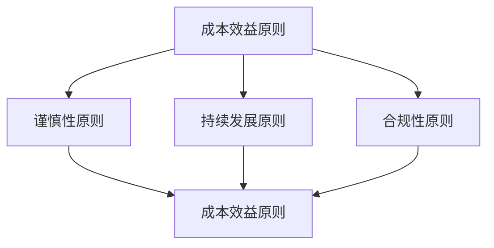
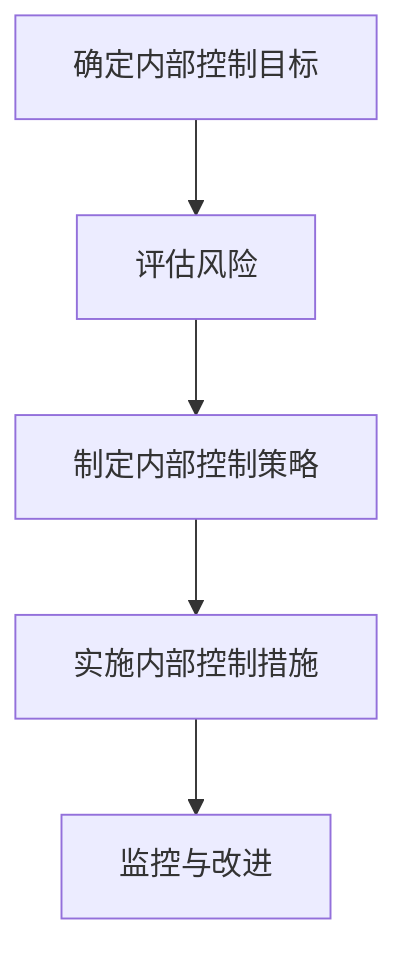
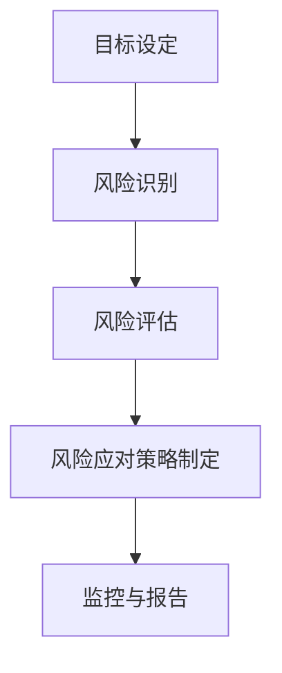

                 


## 《创业过程中如何不断提升财务管理和风险控制能力》的目录大纲

### 第一部分：财务管理和风险控制基础

**第1章：创业财务管理的核心概念**

- **1.1 财务管理的基本原则**
  - 背景介绍
  - 核心原则解析
  - 原则之间的联系与架构
  - **Mermaid 流程图**：展示财务管理基本原则的流程关系
  
- **1.2 财务报表解读**
  - 财务报表类型
  - 解读方法
  - 报表之间的联系
  - **案例解析**：结合实际财务报表进行解读
  
- **1.3 财务指标分析**
  - 核心财务指标
  - 指标计算方法
  - 指标之间的联系
  - **应用实例**：财务指标在创业企业中的应用

**第2章：财务风险管理概述**

- **2.1 风险管理的重要性**
  - 背景介绍
  - 风险管理对企业的影响
  - 风险管理的重要性
  
- **2.2 风险识别与评估**
  - 风险识别方法
  - 风险评估工具
  - 风险评估流程
  - **案例解析**：结合实际案例进行风险识别与评估
  
- **2.3 风险应对策略**
  - 风险应对策略类型
  - 风险应对策略选择
  - 风险应对策略实施
  - **案例解析**：结合实际案例进行风险应对策略分析

### 第二部分：提升财务管理和风险控制能力

**第3章：预算管理与成本控制**

- **3.1 预算管理流程**
  - 预算管理流程
  - 流程中的关键环节
  - **伪代码**：预算管理流程的伪代码实现
  
- **3.2 成本控制策略**
  - 成本控制方法
  - 成本控制目标
  - 成本控制策略
  - **数学模型**：成本控制的数学模型
  
- **3.3 成本分析工具**
  - 成本分析工具类型
  - 成本分析工具功能
  - 成本分析工具应用
  - **案例解析**：成本分析工具的实际应用

**第4章：财务分析工具与应用**

- **4.1 市场分析**
  - 市场分析工具
  - 市场分析流程
  - 市场分析应用
  - **案例解析**：市场分析在创业企业中的应用
  
- **4.2 财务预测**
  - 财务预测方法
  - 财务预测流程
  - 财务预测工具
  - **数学模型**：财务预测的数学模型
  
- **4.3 财务健康评估**
  - 财务健康指标
  - 财务健康评估方法
  - 财务健康评估应用
  - **案例解析**：财务健康评估在创业企业中的应用

**第5章：内部控制与审计**

- **5.1 内部控制的构建**
  - 内部控制的概念
  - 内部控制的要素
  - 内部控制的构建流程
  - **Mermaid 流程图**：展示内部控制构建的流程关系
  
- **5.2 审计流程与要求**
  - 审计流程
  - 审计要求
  - 审计方法
  - **案例解析**：审计流程在实际企业中的应用
  
- **5.3 内部控制与审计的关系**
  - 内部控制与审计的联系
  - 内部控制与审计的区别
  - 内部控制与审计的协同作用
  - **案例解析**：内部控制与审计在实际企业中的应用

**第6章：融资策略与风险控制**

- **6.1 融资渠道选择**
  - 融资渠道类型
  - 融资渠道选择方法
  - 融资渠道优缺点
  - **案例解析**：融资渠道选择的实际案例
  
- **6.2 资金成本管理**
  - 资金成本计算方法
  - 资金成本管理策略
  - 资金成本管理工具
  - **数学模型**：资金成本管理的数学模型
  
- **6.3 融资风险分析**
  - 融资风险类型
  - 融资风险分析方法
  - 融资风险应对策略
  - **案例解析**：融资风险分析的实例

**第7章：财务信息化建设**

- **7.1 信息系统在财务管理中的作用**
  - 信息系统的作用
  - 财务信息系统分类
  - 信息系统对财务管理的提升
  - **案例解析**：信息系统在创业企业中的应用
  
- **7.2 信息化财务管理工具**
  - 信息化财务管理工具类型
  - 工具功能及应用
  - 工具选择标准
  - **案例解析**：信息化财务管理工具的实际应用
  
- **7.3 信息安全管理**
  - 信息安全的重要性
  - 信息安全策略
  - 信息安全工具
  - **案例解析**：信息安全管理的实际案例

**第8章：实战案例与经验分享**

- **8.1 成功案例分享**
  - 成功案例分析
  - 经验总结
  - 启示与借鉴
  
- **8.2 失败案例分析**
  - 失败原因分析
  - 教训与反思
  - 风险控制策略
  
- **8.3 财务风险管理经验总结**
  - 经验分享
  - 管理策略
  - 风险防范措施

### 第三部分：提升风险控制能力

**第9章：风险评估与应对策略**

- **9.1 风险评估框架**
  - 风险评估框架设计
  - 风险评估方法
  - 风险评估流程
  - **Mermaid 流程图**：展示风险评估框架的流程关系
  
- **9.2 风险应对策略**
  - 风险应对策略类型
  - 风险应对策略选择
  - 风险应对策略实施
  - **案例解析**：风险应对策略的实际应用
  
- **9.3 风险报告撰写**
  - 风险报告结构
  - 风险报告内容
  - 风险报告撰写方法
  - **案例解析**：风险报告撰写的实例

**第10章：风险控制工具与技术**

- **10.1 风险控制工具介绍**
  - 工具类型
  - 功能及应用
  - 选择标准
  
- **10.2 风险控制技术应用**
  - 技术应用场景
  - 技术应用方法
  - 技术优势
  
- **10.3 风险控制案例分析**
  - 案例分析
  - 经验总结
  - 启示与借鉴

**第11章：法律与合规风险控制**

- **11.1 合规风险管理**
  - 合规管理概念
  - 合规风险管理流程
  - 合规风险管理策略
  
- **11.2 法律风险防范**
  - 法律风险识别
  - 法律风险评估
  - 法律风险防范策略
  
- **11.3 合规与法律风险控制策略**
  - 策略类型
  - 策略实施
  - 策略效果评估

**第12章：企业风险管理体系建设**

- **12.1 风险管理组织架构**
  - 组织架构设计
  - 职责分工
  - 沟通协作
  
- **12.2 风险管理流程优化**
  - 流程设计
  - 流程优化方法
  - 流程实施
  
- **12.3 风险管理文化建设**
  - 文化建设目标
  - 文化建设策略
  - 文化建设效果评估

### 附录

**附录A：财务管理和风险控制工具资源**

- **A.1 财务管理软件介绍**
  - 软件类型
  - 功能及应用
  
- **A.2 风险管理框架与模型**
  - 框架与模型类型
  - 功能及应用

**附录B：参考书目与资料**

- **B.1 财务管理相关书籍**
  - 书籍推荐
  - 主要内容
  
- **B.2 风险管理相关书籍**
  - 书籍推荐
  - 主要内容

## 文章标题：《创业过程中如何不断提升财务管理和风险控制能力》

> 关键词：创业、财务管理、风险控制、能力提升

> 摘要：本文旨在探讨创业过程中如何不断提升财务管理和风险控制能力。文章首先介绍了创业财务管理的核心概念和财务风险管理的重要性，然后详细阐述了预算管理与成本控制、财务分析工具与应用、内部控制与审计、融资策略与风险控制、财务信息化建设以及实战案例与经验分享等内容。同时，文章还讨论了风险评估与应对策略、风险控制工具与技术、法律与合规风险控制以及企业风险管理体系建设等提升风险控制能力的具体方法。最后，通过附录部分提供了财务管理和风险控制工具资源的详细介绍，以及参考书目与资料。本文旨在为创业者在财务管理与风险控制方面提供有价值的参考和指导。

## 第一部分：财务管理和风险控制基础

### 第1章：创业财务管理的核心概念

#### 1.1 财务管理的基本原则

**背景介绍**

在创业过程中，财务管理是企业生存和发展的基石。有效的财务管理能够帮助创业者更好地掌握企业财务状况，制定合理的经营策略，实现企业的长期稳定发展。财务管理的基本原则是确保财务管理的科学性和有效性，主要包括：

1. **成本效益原则**：在财务决策中，企业应综合考虑成本和效益，确保财务活动的成本效益最大化。
2. **谨慎性原则**：在财务活动中，企业应保持谨慎的态度，对可能出现的不确定性和风险进行充分的评估和预防。
3. **持续发展原则**：企业财务管理应注重长远规划，确保企业的可持续发展。
4. **合规性原则**：企业财务管理应符合相关法律法规和监管要求，确保财务活动的合规性。

**核心原则解析**

- **成本效益原则**：企业应通过科学的成本核算和效益分析，确保财务活动的投入产出比合理，避免资源的浪费。
- **谨慎性原则**：企业应建立健全的财务风险预警机制，对可能出现的不确定性和风险进行及时识别和评估，采取相应的预防和应对措施。
- **持续发展原则**：企业应制定长期的财务规划，合理分配资源，确保企业的持续发展和竞争力的提升。
- **合规性原则**：企业应遵守相关法律法规和监管要求，确保财务活动的合法性，避免因违法行为带来的风险和损失。

**原则之间的联系与架构**

财务管理的基本原则之间存在着紧密的联系和相互支持的关系。成本效益原则是财务管理的核心，它决定了企业财务活动的科学性和有效性。谨慎性原则是对成本效益原则的补充，它确保了企业在面对不确定性时能够保持谨慎的态度，避免不必要的风险。持续发展原则则是对企业长期发展的战略规划，它要求企业在财务决策中不仅要考虑短期效益，还要关注长期利益。合规性原则则是对企业财务活动的法律约束，它确保了企业财务活动的合法性和合规性，为企业的长期稳定发展提供了保障。

**Mermaid 流程图**：展示财务管理基本原则的流程关系



#### 1.2 财务报表解读

**财务报表类型**

财务报表是企业财务状况的反映，主要包括以下几种类型：

1. **资产负债表**：资产负债表是反映企业在某一特定日期财务状况的报表，包括资产、负债和所有者权益三部分。
2. **利润表**：利润表是反映企业在一定时期内经营成果的报表，包括收入、成本、费用和利润四部分。
3. **现金流量表**：现金流量表是反映企业在一定时期内现金流入和流出的报表，包括经营活动、投资活动和筹资活动三部分。
4. **所有者权益变动表**：所有者权益变动表是反映企业在一定时期内所有者权益变动情况的报表。

**解读方法**

财务报表的解读主要包括以下几个方面：

1. **数据对比**：通过对比不同时期的数据，了解企业财务状况的变化趋势。
2. **指标分析**：通过对关键财务指标的分析，评估企业的经营状况和财务健康程度。
3. **关联分析**：通过对不同报表之间的关联分析，了解企业财务状况的全貌。

**报表之间的联系**

资产负债表、利润表、现金流量表和所有者权益变动表之间存在紧密的联系。资产负债表和利润表反映了企业的财务状况和经营成果，现金流量表反映了企业的现金流动情况，所有者权益变动表反映了企业的所有者权益变动情况。通过综合分析这些报表，可以全面了解企业的财务状况和经营状况。

**案例解析**

假设我们有一家创业公司的财务报表，包括资产负债表、利润表、现金流量表和所有者权益变动表。我们可以通过以下步骤进行解读：

1. **资产负债表解读**：通过资产负债表，我们可以了解公司的资产、负债和所有者权益状况。例如，我们发现公司的流动资产比例较高，说明公司具备较强的短期偿债能力。

2. **利润表解读**：通过利润表，我们可以了解公司的收入、成本、费用和利润状况。例如，我们发现公司的毛利率较高，说明公司的产品具有较强的市场竞争力。

3. **现金流量表解读**：通过现金流量表，我们可以了解公司的现金流动情况。例如，我们发现公司的经营活动现金流入较多，说明公司的经营状况较好。

4. **所有者权益变动表解读**：通过所有者权益变动表，我们可以了解公司的所有者权益变动情况。例如，我们发现公司的净利润贡献了大部分的所有者权益增加，说明公司的盈利能力较强。

通过综合分析这些报表，我们可以全面了解公司的财务状况和经营状况，为决策提供依据。

#### 1.3 财务指标分析

**核心财务指标**

财务指标是评估企业财务状况和经营成果的重要工具，主要包括以下几种：

1. **盈利能力指标**：反映企业的盈利能力，如毛利率、净利润率、ROE（净资产收益率）等。
2. **偿债能力指标**：反映企业的偿债能力，如流动比率、速动比率、利息保障倍数等。
3. **营运能力指标**：反映企业的营运能力，如存货周转率、应收账款周转率、总资产周转率等。
4. **发展能力指标**：反映企业的发展能力，如增长率、市盈率、股息支付率等。

**指标计算方法**

以下是部分核心财务指标的计算方法：

1. **毛利率**：毛利率 = （销售收入 - 成本）/ 销售收入 × 100%
2. **净利润率**：净利润率 = 净利润 / 销售收入 × 100%
3. **ROE**：ROE = 净利润 / 净资产 × 100%
4. **流动比率**：流动比率 = 流动资产 / 流动负债
5. **速动比率**：速动比率 = （流动资产 - 存货）/ 流动负债
6. **利息保障倍数**：利息保障倍数 = 息税前利润 / 利息支出
7. **存货周转率**：存货周转率 = 销售成本 / 平均存货余额
8. **应收账款周转率**：应收账款周转率 = 销售收入 / 平均应收账款余额
9. **总资产周转率**：总资产周转率 = 销售收入 / 平均总资产余额

**指标之间的联系**

财务指标之间存在紧密的联系和相互影响。盈利能力指标反映了企业的盈利能力，偿债能力指标反映了企业的偿债能力，营运能力指标反映了企业的营运能力，发展能力指标反映了企业的发展能力。通过综合分析这些指标，可以全面了解企业的财务状况和经营成果。

**应用实例**

假设我们有一家创业公司的财务指标，包括毛利率、净利润率、ROE、流动比率、速动比率、利息保障倍数、存货周转率、应收账款周转率和总资产周转率。我们可以通过以下步骤进行财务指标分析：

1. **盈利能力分析**：通过毛利率和净利润率分析，我们发现公司的盈利能力较强，说明公司的产品具有市场竞争力。

2. **偿债能力分析**：通过流动比率和速动比率分析，我们发现公司的流动资产较高，说明公司具备较强的短期偿债能力。

3. **营运能力分析**：通过存货周转率和应收账款周转率分析，我们发现公司的存货周转率和应收账款周转率较高，说明公司的营运能力较强。

4. **发展能力分析**：通过ROE和总资产周转率分析，我们发现公司的ROE较高，总资产周转率较高，说明公司的发展能力较强。

通过综合分析这些指标，我们可以全面了解公司的财务状况和经营成果，为决策提供依据。

### 第2章：财务风险管理概述

#### 2.1 风险管理的重要性

**背景介绍**

在创业过程中，财务风险是企业面临的重要风险之一。有效的财务风险管理能够帮助企业降低风险，保障企业的稳定发展。风险管理的重要性主要体现在以下几个方面：

1. **降低风险损失**：有效的财务风险管理能够降低企业因财务风险而导致的损失，保障企业的财务安全。
2. **提升企业竞争力**：良好的财务风险管理能够提高企业的竞争力，为企业创造更多的商业机会。
3. **确保企业可持续发展**：财务风险管理能够确保企业的长期稳定发展，为企业实现战略目标提供保障。

**风险管理对企业的影响**

财务风险管理对企业的影响主要包括以下几个方面：

1. **财务决策**：财务风险管理能够为企业的财务决策提供科学依据，确保财务决策的合理性和有效性。
2. **资源配置**：财务风险管理能够优化企业的资源配置，提高资源利用效率。
3. **风险防范**：财务风险管理能够及时发现和防范潜在的财务风险，降低企业面临的风险。
4. **企业声誉**：良好的财务风险管理能够提升企业的声誉，增强企业的市场竞争力。

**风险管理的重要性**

风险管理的重要性主要体现在以下几个方面：

1. **风险防范**：风险管理能够帮助企业识别和评估潜在的风险，采取有效的措施进行防范和应对。
2. **风险转移**：风险管理能够通过保险、担保等手段将部分风险转移给第三方，降低企业承担的风险。
3. **风险控制**：风险管理能够帮助企业对已发生的风险进行有效的控制和处理，降低风险损失。
4. **战略规划**：风险管理是企业战略规划的重要组成部分，能够确保企业的长期稳定发展。

**风险管理的基本原则**

风险管理的基本原则主要包括以下几个方面：

1. **全面性**：风险管理应覆盖企业的所有部门和业务领域，确保风险管理的全面性。
2. **预防性**：风险管理应注重预防措施，提前识别和评估潜在风险，采取相应的预防和应对措施。
3. **科学性**：风险管理应依据科学的方法和工具，对风险进行准确识别、评估和控制。
4. **持续性**：风险管理是一个持续的过程，需要定期进行风险识别、评估和控制，确保风险管理的有效性。

**风险管理与企业发展战略的关系**

风险管理与企业发展战略密切相关，主要体现在以下几个方面：

1. **战略目标**：风险管理应与企业的战略目标相一致，确保企业实现长期稳定发展。
2. **资源配置**：风险管理需要合理的资源配置，确保风险管理的有效实施。
3. **风险管理策略**：风险管理策略应与企业的战略规划相匹配，确保企业能够应对各种风险挑战。
4. **风险管理组织**：风险管理组织应与企业发展战略相适应，确保风险管理的有效实施。

**风险管理流程**

风险管理流程主要包括以下几个方面：

1. **风险识别**：识别企业面临的潜在风险，包括外部风险和内部风险。
2. **风险评估**：评估风险的概率和影响，确定风险的重要性和优先级。
3. **风险应对**：制定和实施风险应对策略，包括风险规避、风险转移、风险缓解等。
4. **风险监控**：对风险应对措施的实施效果进行监控和评估，确保风险管理的有效性。

**风险管理工具**

风险管理过程中可以运用以下工具：

1. **风险矩阵**：用于评估风险的概率和影响，确定风险的重要性和优先级。
2. **风险清单**：用于记录企业面临的各类风险，便于管理和应对。
3. **风险评估报告**：用于详细描述风险评估的过程和结果，为决策提供依据。
4. **风险管理计划**：用于规划和管理风险应对措施，确保风险管理的有效实施。

**案例解析**

假设我们有一家创业公司，面临以下几种财务风险：

1. **市场风险**：由于市场环境变化，可能导致公司销售额下降。
2. **信用风险**：由于客户拖欠货款，可能导致公司现金流紧张。
3. **利率风险**：由于利率波动，可能导致公司融资成本上升。

我们可以通过以下步骤进行财务风险管理：

1. **风险识别**：通过市场调研、客户关系管理等手段，识别企业面临的财务风险。

2. **风险评估**：对识别出的财务风险进行概率和影响评估，确定风险的重要性和优先级。

3. **风险应对**：针对识别出的财务风险，制定相应的风险应对策略，如：

   - **市场风险**：通过拓展新市场、开发新产品等方式，降低市场变化对公司的影响。
   - **信用风险**：加强客户信用评估，建立严格的信用管理制度，确保公司现金流稳定。
   - **利率风险**：通过合理的融资策略，降低公司的融资成本，缓解利率波动的影响。

4. **风险监控**：对风险应对措施的实施效果进行监控和评估，确保风险管理的有效性。

通过以上步骤，我们可以有效识别、评估和应对财务风险，保障公司的财务安全。

### 第2章：财务风险管理概述（续）

#### 2.2 风险识别与评估

**风险识别方法**

风险识别是财务风险管理的基础，旨在识别企业面临的潜在风险。常见的风险识别方法包括：

1. **访谈法**：通过与企业管理层、员工等进行访谈，了解企业面临的财务风险。
2. **问卷调查法**：通过设计问卷，收集企业内部员工和管理层对财务风险的看法和意见。
3. **流程图法**：通过绘制企业财务管理的流程图，识别潜在的风险点。
4. **文献调研法**：通过查阅相关文献、报告等，了解企业财务风险的特点和趋势。

**风险评估工具**

风险评估工具用于评估风险的概率和影响，帮助确定风险的重要性和优先级。常见风险评估工具包括：

1. **风险矩阵**：通过风险矩阵，将风险的概率和影响进行量化，确定风险的重要性和优先级。
2. **风险清单**：用于记录企业面临的各类风险，便于管理和应对。
3. **蒙特卡罗模拟**：通过模拟风险事件的发生概率和影响，评估风险的可能性和损失。
4. **决策树**：用于评估不同决策方案的风险和收益，帮助决策者做出最优选择。

**风险评估流程**

风险评估流程主要包括以下几个步骤：

1. **风险识别**：通过访谈、问卷调查、流程图法等方法，识别企业面临的财务风险。
2. **风险分类**：根据风险的性质和影响，对识别出的风险进行分类。
3. **风险评估**：使用风险矩阵、蒙特卡罗模拟等方法，评估风险的概率和影响。
4. **风险优先级确定**：根据风险评估结果，确定风险的重要性和优先级。
5. **风险应对策略制定**：针对不同类型和优先级的风险，制定相应的应对策略。

**案例解析**

假设我们有一家创业公司，面临以下几种财务风险：

1. **市场风险**：由于市场环境变化，可能导致公司销售额下降。
2. **信用风险**：由于客户拖欠货款，可能导致公司现金流紧张。
3. **利率风险**：由于利率波动，可能导致公司融资成本上升。

我们可以通过以下步骤进行风险评估：

1. **风险识别**：通过市场调研、客户关系管理、财务数据分析等方法，识别企业面临的财务风险。

2. **风险分类**：根据风险的性质和影响，将识别出的风险分为市场风险、信用风险和利率风险。

3. **风险评估**：

   - **市场风险**：通过市场调研和财务数据分析，评估市场变化对公司销售额的可能影响。例如，如果市场环境发生重大变化，可能导致公司销售额下降20%。

   - **信用风险**：通过客户信用评估和财务数据分析，评估客户拖欠货款对公司现金流的影响。例如，如果客户拖欠货款的比例达到10%，可能导致公司现金流紧张。

   - **利率风险**：通过金融市场的分析和预测，评估利率波动对公司融资成本的影响。例如，如果利率上升2个百分点，可能导致公司融资成本增加。

4. **风险优先级确定**：根据风险评估结果，确定风险的重要性和优先级。例如，市场风险对公司的影响最大，应作为首要风险进行应对。

5. **风险应对策略制定**：

   - **市场风险**：通过拓展新市场、开发新产品等方式，降低市场变化对公司的影响。

   - **信用风险**：加强客户信用评估，建立严格的信用管理制度，确保公司现金流稳定。

   - **利率风险**：通过合理的融资策略，降低公司的融资成本，缓解利率波动的影响。

通过以上步骤，我们可以有效识别、评估和应对财务风险，保障公司的财务安全。

### 第2章：财务风险管理概述（续）

#### 2.3 风险应对策略

**风险应对策略类型**

根据风险的性质和影响，风险应对策略可以分为以下几种类型：

1. **风险规避**：通过调整业务模式、转移业务领域等方式，避免风险的发生。
2. **风险转移**：通过购买保险、签订合同等方式，将部分风险转移给第三方。
3. **风险缓解**：通过改进管理流程、加强内部控制等方式，降低风险的影响程度。
4. **风险接受**：对于无法规避、转移或缓解的风险，接受风险并制定相应的应对措施。

**风险应对策略选择**

在制定风险应对策略时，应综合考虑以下因素：

1. **风险的性质和影响**：根据风险的性质和影响程度，选择合适的应对策略。
2. **成本和效益**：综合考虑风险应对策略的成本和效益，确保风险应对的合理性和有效性。
3. **企业的资源和能力**：根据企业的资源和能力，选择适合的应对策略。
4. **法律法规和监管要求**：遵守相关法律法规和监管要求，确保风险应对的合规性。

**风险应对策略实施**

在实施风险应对策略时，应遵循以下步骤：

1. **制定风险应对计划**：明确风险应对的目标、措施和时间表，确保风险应对的有序进行。
2. **资源配置**：根据风险应对计划，合理配置企业资源和人力，确保风险应对的有效实施。
3. **培训与沟通**：对企业员工进行培训，提高员工的意识和能力，加强企业内部的沟通与协作。
4. **监控与评估**：对风险应对措施的实施效果进行监控和评估，及时调整和优化风险应对策略。

**案例解析**

假设我们有一家创业公司，面临以下几种财务风险：

1. **市场风险**：由于市场环境变化，可能导致公司销售额下降。
2. **信用风险**：由于客户拖欠货款，可能导致公司现金流紧张。
3. **利率风险**：由于利率波动，可能导致公司融资成本上升。

我们可以通过以下步骤进行风险应对：

1. **风险规避**：通过拓展新市场、开发新产品等方式，降低市场风险对公司的影响。

2. **风险转移**：购买保险，将部分市场风险、信用风险和利率风险转移给保险公司。

3. **风险缓解**：通过加强客户信用评估、建立严格的信用管理制度等方式，降低信用风险对公司现金流的影响。

4. **风险接受**：对于无法规避、转移或缓解的风险，制定相应的应对措施，如制定应急预案、提高企业流动性等。

通过以上步骤，我们可以有效应对财务风险，保障公司的财务安全。

### 第3章：预算管理与成本控制

#### 3.1 预算管理流程

**预算管理流程**

预算管理是企业财务管理的重要组成部分，其流程主要包括以下几个步骤：

1. **预算编制**：企业根据经营目标和战略规划，编制下一期的预算计划。预算编制过程包括收入预算、成本预算、利润预算等。

2. **预算审批**：预算编制完成后，提交给企业高层领导或董事会进行审批。审批通过后，预算计划开始实施。

3. **预算执行**：在预算执行过程中，企业各部门按照预算计划开展各项工作，确保预算目标的实现。

4. **预算调整**：在预算执行过程中，如果遇到市场环境、政策变化等原因，需要对预算进行调整。预算调整应经过严格的审批程序。

5. **预算分析**：预算执行完成后，对预算执行结果进行总结和分析，评估预算目标的完成情况。预算分析结果可以为下一期的预算编制提供参考。

**流程中的关键环节**

预算管理流程中的关键环节包括：

1. **预算编制**：预算编制是预算管理的起点，直接影响预算的合理性和可行性。企业应根据实际情况，科学合理地制定预算计划。

2. **预算审批**：预算审批是预算管理的保障，确保预算计划的实施符合企业战略目标和法律法规要求。

3. **预算执行**：预算执行是预算管理的关键，企业各部门应严格按照预算计划开展各项工作，确保预算目标的实现。

4. **预算调整**：预算调整是预算管理中的灵活应对措施，帮助企业应对市场环境、政策变化等不确定因素。

**伪代码**：预算管理流程的伪代码实现

```python
# 预算管理流程

# 预算编制
def budget_execution():
    # 收入预算
    income_budget = calculate_income()

    # 成本预算
    cost_budget = calculate_cost()

    # 利润预算
    profit_budget = calculate_profit(income_budget, cost_budget)

    # 提交审批
    submit_approval(income_budget, cost_budget, profit_budget)

# 预算审批
def approve_budget():
    # 审批通过
    approve_budget_plan()

    # 预算执行
    execute_budget_plan()

# 预算执行
def execute_budget_plan():
    # 按照预算计划开展各项工作
    execute各项工作()

# 预算调整
def adjust_budget():
    # 调整预算计划
    adjust_budget_plan()

    # 提交审批
    submit_approval(adjusted_budget_plan)

# 预算分析
def budget_analysis():
    # 分析预算执行结果
    analyze_budget_results()

    # 提供参考
    provide_reference_for_next_period()
```

#### 3.2 成本控制策略

**成本控制方法**

成本控制是企业实现预算目标、提高经济效益的重要手段。常见的成本控制方法包括：

1. **目标成本法**：通过设定目标成本，对成本进行严格的控制和优化。

2. **标准成本法**：根据标准成本进行成本核算，对实际成本与标准成本进行比较分析，找出成本差异并进行控制。

3. **作业成本法**：将成本分配到各项作业活动中，分析作业成本并找出降低成本的途径。

4. **目标利润法**：通过设定目标利润，对成本进行控制和优化，确保企业盈利目标的实现。

**成本控制目标**

成本控制的目标主要包括：

1. **降低成本**：通过优化成本结构和提高成本效益，降低企业总成本。

2. **提高质量**：通过有效的成本控制，确保产品质量达到预期水平。

3. **提高效率**：通过减少浪费和优化流程，提高生产效率和运营效率。

4. **增强竞争力**：通过降低成本、提高质量，增强企业的市场竞争力和盈利能力。

**成本控制策略**

成本控制策略主要包括以下几个方面：

1. **目标成本设定**：根据企业的战略目标和市场环境，设定合理的成本控制目标。

2. **成本核算**：建立完善的成本核算体系，对各项成本进行准确核算。

3. **成本分析**：对成本数据进行分析，找出成本高出的原因，采取相应的控制措施。

4. **成本优化**：通过优化产品设计、生产流程和供应链等环节，降低成本。

5. **成本考核**：建立成本考核机制，对各部门和员工的成本控制绩效进行考核。

**案例解析**

假设我们有一家制造企业，面临成本控制的需求。以下是一个典型的成本控制案例：

1. **目标成本设定**：企业根据市场行情和竞争对手的成本水平，设定了下一年的目标成本降低10%。

2. **成本核算**：企业建立了完善的成本核算体系，对各项成本进行详细核算，包括原材料成本、人工成本、制造费用等。

3. **成本分析**：通过对成本数据的分析，发现原材料成本占比较高，且存在一定的不合理支出。企业决定对原材料采购环节进行优化，降低原材料成本。

4. **成本优化**：企业通过优化供应链管理，与供应商建立长期合作关系，降低采购成本。同时，对企业内部生产流程进行优化，提高生产效率，降低制造费用。

5. **成本考核**：企业制定了成本考核制度，对各部门和员工的成本控制绩效进行考核，激励员工积极参与成本控制工作。

通过以上步骤，企业成功地实现了成本降低的目标，提高了市场竞争力和盈利能力。

#### 3.3 成本分析工具

**成本分析工具类型**

成本分析工具用于帮助企业识别成本高出的原因，制定成本控制策略。常见的成本分析工具包括：

1. **成本报表**：通过成本报表，企业可以直观地了解各项成本的具体数据，如成本构成、成本分布等。

2. **成本分析表**：通过成本分析表，企业可以对各项成本进行分析，找出成本高出的原因。

3. **成本趋势图**：通过成本趋势图，企业可以观察成本的变化趋势，发现成本异常。

4. **成本差异分析表**：通过成本差异分析表，企业可以分析成本差异的原因，制定相应的成本控制措施。

**成本分析工具功能**

成本分析工具的功能主要包括：

1. **成本核算**：成本分析工具可以帮助企业对各项成本进行准确核算，为成本控制提供数据支持。

2. **成本比较**：成本分析工具可以比较不同时期、不同部门的成本情况，找出成本异常。

3. **成本预测**：成本分析工具可以根据历史数据，预测未来成本的变化趋势，为企业制定成本控制策略提供参考。

4. **成本优化**：成本分析工具可以帮助企业识别成本高出的原因，制定成本优化方案，降低成本。

**成本分析工具应用**

成本分析工具在企业中的应用主要包括以下几个方面：

1. **成本核算**：企业可以使用成本分析工具对各项成本进行准确核算，确保成本数据的真实性。

2. **成本比较**：企业可以通过成本分析工具比较不同时期、不同部门的成本情况，发现成本异常，及时采取措施。

3. **成本预测**：企业可以使用成本分析工具预测未来成本的变化趋势，为制定成本控制策略提供参考。

4. **成本优化**：企业可以通过成本分析工具识别成本高出的原因，制定成本优化方案，降低成本。

**案例解析**

假设我们有一家制造企业，需要进行成本分析。以下是一个典型的成本分析案例：

1. **成本核算**：企业使用成本分析工具对各项成本进行准确核算，包括原材料成本、人工成本、制造费用等。

2. **成本比较**：企业使用成本分析工具比较不同时期的成本数据，发现近期的原材料成本上涨较快，需要进一步分析原因。

3. **成本预测**：企业使用成本分析工具预测未来成本的变化趋势，发现原材料成本可能继续上涨，需要提前采取措施。

4. **成本优化**：企业使用成本分析工具识别成本高出的原因，发现原材料采购环节存在不合理支出，决定与供应商进行谈判，降低采购成本。

通过以上步骤，企业成功地实现了成本控制，提高了盈利能力。

### 第4章：财务分析工具与应用

#### 4.1 市场分析

**市场分析工具**

市场分析是企业制定战略决策、预测市场趋势的重要工具。常见的市场分析工具包括：

1. **SWOT分析**：通过分析企业的优势、劣势、机会和威胁，帮助企业制定发展战略。

2. **PEST分析**：通过分析宏观环境中的政治、经济、社会和技术因素，了解市场环境对企业的影响。

3. **5W2H分析**：通过提问“What”、“Why”、“Who”、“Where”、“When”和“How”和“How much”，全面了解市场情况。

4. **市场规模与增长率分析**：通过分析市场容量和增长率，预测市场的未来发展趋势。

**市场分析流程**

市场分析流程主要包括以下几个步骤：

1. **确定分析目标**：明确市场分析的目标，如市场趋势、竞争对手分析、消费者行为等。

2. **收集数据**：通过市场调研、问卷调查、二手资料收集等方式，收集与市场分析相关的数据。

3. **数据整理与分析**：对收集到的数据进行分析和整理，提取有用的信息。

4. **撰写分析报告**：根据分析结果，撰写市场分析报告，为企业决策提供依据。

**市场分析应用**

市场分析在企业中的应用主要包括以下几个方面：

1. **战略规划**：通过市场分析，企业可以了解市场环境、竞争状况等，制定符合市场需求的企业发展战略。

2. **产品开发**：通过市场分析，企业可以了解消费者的需求、偏好等，开发符合市场需求的产品。

3. **营销策略**：通过市场分析，企业可以了解竞争对手的营销策略，制定更有效的营销方案。

4. **投资决策**：通过市场分析，企业可以评估投资项目的前景，降低投资风险。

**案例解析**

假设我们有一家制造企业，需要进行市场分析。以下是一个典型的市场分析案例：

1. **确定分析目标**：企业决定分析国内市场需求趋势，了解消费者对产品需求的变化。

2. **收集数据**：企业通过市场调研、问卷调查、二手资料收集等方式，收集与国内市场需求相关的数据。

3. **数据整理与分析**：企业对收集到的数据进行分析和整理，发现国内市场需求呈现快速增长趋势，消费者对产品质量要求越来越高。

4. **撰写分析报告**：企业根据分析结果，撰写市场分析报告，提出以下建议：

   - 加大产品研发投入，提高产品质量。
   - 开发符合消费者需求的新产品。
   - 加强市场营销，提高品牌知名度。

通过以上步骤，企业成功地了解了市场需求趋势，制定了符合市场发展的战略决策。

#### 4.2 财务预测

**财务预测方法**

财务预测是企业对未来财务状况的预测，有助于企业制定战略规划、调整经营策略。常见的财务预测方法包括：

1. **时间序列法**：通过分析历史财务数据的变化趋势，预测未来的财务状况。

2. **比率分析法**：通过分析财务指标之间的关系，预测未来的财务指标。

3. **回归分析法**：通过建立数学模型，分析财务指标之间的相关性，预测未来的财务状况。

4. **情景分析法**：通过设定不同的市场情景，预测在不同情景下的财务状况。

**财务预测流程**

财务预测流程主要包括以下几个步骤：

1. **确定预测目标**：明确财务预测的具体目标，如预测收入、利润、现金流等。

2. **收集数据**：收集与财务预测相关的数据，包括历史财务数据、市场数据、行业数据等。

3. **数据整理与分析**：对收集到的数据进行整理和分析，提取有用的信息。

4. **建立预测模型**：根据分析结果，建立合适的预测模型，如时间序列模型、比率分析模型、回归分析模型等。

5. **进行预测**：使用建立的预测模型，对未来财务状况进行预测。

6. **验证与调整**：对预测结果进行验证，根据实际情况进行调整和优化。

**财务预测工具**

财务预测工具用于辅助财务预测，提高预测的准确性和效率。常见的财务预测工具包括：

1. **Excel**：通过Excel表格，可以建立简单的财务预测模型，进行财务预测。

2. **ERP系统**：通过ERP系统，可以自动生成财务预测报表，提高预测效率。

3. **财务预测软件**：如Oracle Financials、SAP等，提供专业的财务预测功能，支持复杂的财务预测分析。

**财务预测应用**

财务预测在企业中的应用主要包括以下几个方面：

1. **战略规划**：通过财务预测，企业可以了解未来的财务状况，制定符合市场发展需求的企业战略。

2. **经营决策**：通过财务预测，企业可以预测未来的收入、利润等财务指标，为经营决策提供依据。

3. **投资决策**：通过财务预测，企业可以评估投资项目的前景，降低投资风险。

4. **风险管理**：通过财务预测，企业可以预测未来的财务风险，采取相应的风险控制措施。

**案例解析**

假设我们有一家制造企业，需要进行财务预测。以下是一个典型的财务预测案例：

1. **确定预测目标**：企业决定预测未来一年的收入、利润、现金流等财务指标。

2. **收集数据**：企业收集过去三年的财务数据、市场数据、行业数据等。

3. **数据整理与分析**：企业对收集到的数据进行分析和整理，提取有用的信息。

4. **建立预测模型**：企业使用回归分析法，建立收入、利润、现金流等财务指标的预测模型。

5. **进行预测**：企业使用建立的预测模型，预测未来一年的财务状况。

6. **验证与调整**：企业对预测结果进行验证，根据实际情况进行调整和优化。

通过以上步骤，企业成功地预测了未来一年的财务状况，为经营决策提供了有力支持。

#### 4.3 财务健康评估

**财务健康指标**

财务健康评估是企业财务状况的综合评估，通过分析一系列财务指标，了解企业的财务状况和经营成果。常见的财务健康指标包括：

1. **盈利能力指标**：反映企业的盈利能力，如毛利率、净利润率、ROE等。

2. **偿债能力指标**：反映企业的偿债能力，如流动比率、速动比率、利息保障倍数等。

3. **营运能力指标**：反映企业的营运能力，如存货周转率、应收账款周转率、总资产周转率等。

4. **发展能力指标**：反映企业的发展能力，如增长率、市盈率、股息支付率等。

**财务健康评估方法**

财务健康评估方法主要包括以下几种：

1. **比较分析法**：通过比较不同时期、不同企业的财务指标，了解企业的财务状况。

2. **趋势分析法**：通过分析财务指标的变化趋势，了解企业的财务状况。

3. **比率分析法**：通过计算财务指标之间的比率，分析企业的财务状况。

4. **综合评分法**：通过设定权重，对各项财务指标进行评分，综合评估企业的财务健康程度。

**财务健康评估应用**

财务健康评估在企业中的应用主要包括以下几个方面：

1. **战略规划**：通过财务健康评估，企业可以了解自身的财务状况，制定符合市场发展需求的企业战略。

2. **投资决策**：通过财务健康评估，企业可以评估投资项目的财务风险和收益，制定投资决策。

3. **风险管理**：通过财务健康评估，企业可以识别潜在的财务风险，采取相应的风险控制措施。

4. **绩效评估**：通过财务健康评估，企业可以评估各部门和员工的财务绩效，为绩效考核提供依据。

**案例解析**

假设我们有一家制造企业，需要进行财务健康评估。以下是一个典型的财务健康评估案例：

1. **确定评估目标**：企业决定对过去的三年财务状况进行健康评估。

2. **收集数据**：企业收集过去三年的财务报表数据，包括资产负债表、利润表、现金流量表等。

3. **财务指标分析**：企业计算毛利率、净利润率、ROE、流动比率、速动比率、存货周转率等财务指标。

4. **比较分析法**：企业比较不同时期的财务指标，了解财务状况的变化趋势。

5. **比率分析法**：企业计算财务指标之间的比率，如流动比率/速动比率，分析企业的偿债能力。

6. **综合评分法**：企业根据各项财务指标的权重，对财务健康程度进行评分。

7. **撰写评估报告**：企业根据评估结果，撰写财务健康评估报告，提出改进建议。

通过以上步骤，企业成功地评估了自身的财务健康状况，为经营决策提供了有力支持。

### 第5章：内部控制与审计

#### 5.1 内部控制的构建

**内部控制的概念**

内部控制是指企业通过制定和实施一系列规章制度、程序和方法，确保企业运营的合法性、合规性和有效性。内部控制主要包括以下几个方面：

1. **风险控制**：通过识别、评估和应对企业运营过程中可能出现的风险，确保企业目标的实现。

2. **合规性控制**：确保企业遵守相关法律法规和监管要求，确保企业运营的合法性。

3. **信息管理控制**：确保企业信息的准确性、完整性和安全性，提高信息管理的效率。

4. **财务控制**：通过财务制度和流程，确保企业财务活动的合规性和准确性。

**内部控制的要素**

内部控制的要素主要包括以下几个方面：

1. **控制环境**：控制环境是内部控制的基础，包括企业文化、管理理念、组织结构等。

2. **风险评估**：通过评估企业运营过程中可能出现的风险，识别和应对潜在的风险。

3. **控制活动**：通过制定和实施具体的控制措施，确保企业运营的合规性和有效性。

4. **信息与沟通**：确保企业内部的信息畅通和外部信息的获取，提高信息管理的效率。

5. **监控**：对内部控制的有效性进行监控，确保内部控制制度的持续改进。

**内部控制构建流程**

内部控制构建流程主要包括以下几个步骤：

1. **确定内部控制目标**：根据企业的战略目标和运营需求，明确内部控制的目标。

2. **评估风险**：对企业运营过程中可能出现的风险进行识别、评估和分类。

3. **制定内部控制策略**：根据风险评估结果，制定内部控制策略，包括控制措施、控制标准等。

4. **实施内部控制措施**：根据内部控制策略，实施具体的内部控制措施，如规章制度、程序和方法等。

5. **监控与改进**：对内部控制措施的实施效果进行监控，根据实际情况进行改进和优化。

**Mermaid 流程图**：展示内部控制构建的流程关系



#### 5.2 审计流程与要求

**审计流程**

审计流程是指审计人员对企业财务报表和内部控制制度进行审查、评估的过程。审计流程主要包括以下几个步骤：

1. **计划审计**：审计人员根据审计目标和范围，制定审计计划。

2. **风险评估**：审计人员对企业的财务报表和内部控制制度进行风险评估，识别潜在的风险。

3. **审计测试**：审计人员根据风险评估结果，选择适当的审计程序和方法，对企业的财务报表和内部控制制度进行测试。

4. **编制审计报告**：审计人员根据审计测试的结果，编制审计报告，对企业的财务报表和内部控制制度进行评估。

5. **沟通与反馈**：审计人员与企业管理层进行沟通，反馈审计发现和建议，协助企业改进内部控制制度。

**审计要求**

审计要求主要包括以下几个方面：

1. **独立性**：审计人员应保持独立，不受企业利益和外部压力的影响。

2. **客观性**：审计人员应客观公正，确保审计报告的真实性和准确性。

3. **专业性**：审计人员应具备相应的专业知识和技能，确保审计工作的质量和效率。

4. **严谨性**：审计人员应严谨对待审计工作，确保审计流程的合规性和完整性。

**案例解析**

假设我们有一家制造企业，需要进行审计。以下是一个典型的审计流程案例：

1. **计划审计**：审计人员根据企业的财务报表和内部控制制度，制定审计计划。

2. **风险评估**：审计人员对企业的财务报表和内部控制制度进行风险评估，识别潜在的风险。

3. **审计测试**：审计人员根据风险评估结果，选择适当的审计程序和方法，对企业的财务报表和内部控制制度进行测试。

4. **编制审计报告**：审计人员根据审计测试的结果，编制审计报告，对企业的财务报表和内部控制制度进行评估。

5. **沟通与反馈**：审计人员与企业管理层进行沟通，反馈审计发现和建议，协助企业改进内部控制制度。

通过以上步骤，审计人员成功地完成了审计工作，为企业提供了有效的内部控制建议。

#### 5.3 内部控制与审计的关系

**内部控制与审计的联系**

内部控制与审计之间存在紧密的联系，主要体现在以下几个方面：

1. **目标一致性**：内部控制和审计的目标都是为了确保企业运营的合规性和有效性。内部控制旨在预防和降低风险，审计则是对内部控制的评估和验证。

2. **相互补充**：内部控制和审计相互补充，共同构成企业风险管理体系。内部控制是企业内部自我监督和管理的手段，审计则是外部独立的评估和验证。

3. **信息共享**：内部控制和审计过程中，双方需要共享信息和数据，确保审计的准确性和有效性。审计人员可以利用内部控制制度提供的信息，提高审计工作的效率。

**内部控制与审计的区别**

内部控制与审计在以下几个方面存在区别：

1. **主体不同**：内部控制是企业内部的管理活动，由企业内部人员实施；审计则是外部独立的评估，由独立的第三方机构或人员实施。

2. **职责不同**：内部控制是企业内部自我监督和管理的职责，旨在预防和降低风险；审计则是对企业内部控制制度的评估和验证，旨在发现问题和提出建议。

3. **方法不同**：内部控制主要通过制定和实施规章制度、程序和方法来实现；审计则通过审查、评估和测试等方法，对企业财务报表和内部控制制度进行评估。

**内部控制与审计的协同作用**

内部控制与审计的协同作用主要体现在以下几个方面：

1. **提升内部控制水平**：审计通过对内部控制的评估，发现内部控制中的缺陷和不足，帮助企业改进内部控制制度，提升内部控制水平。

2. **降低审计风险**：内部控制的有效实施可以提高审计的准确性和效率，降低审计风险。审计人员可以利用内部控制制度提供的信息，提高审计工作的质量和效果。

3. **提高企业信誉**：内部控制和审计的有效实施可以提高企业的信誉和形象，增强投资者的信心。良好的内部控制和审计制度是企业稳健发展的基石。

**案例解析**

假设我们有一家制造企业，内部控制制度较为完善，但审计过程中发现内部控制存在一些缺陷。以下是一个典型的案例：

1. **内部控制评估**：审计人员对企业的内部控制制度进行评估，发现内部控制存在以下问题：

   - 部分内部控制制度未得到有效执行。
   - 内部控制制度的部分内容不适应实际业务需求。
   - 内部控制制度的培训和宣传不足。

2. **审计发现**：审计人员对企业财务报表进行审计，发现以下问题：

   - 财务报表存在一些错误和遗漏。
   - 财务报表的披露不完整。

3. **改进建议**：审计人员提出以下改进建议：

   - 加强内部控制制度的培训和宣传，提高员工对内部控制的认识和执行力。
   - 根据实际业务需求，完善内部控制制度，确保内部控制的有效性。
   - 加强财务报表的审核和披露，确保财务报表的真实性和完整性。

通过以上步骤，企业成功改进了内部控制制度，提高了审计工作的质量和效果，为企业的发展提供了有力支持。

### 第6章：融资策略与风险控制

#### 6.1 融资渠道选择

**融资渠道类型**

融资渠道是指企业筹集资金的方式和途径。常见的融资渠道包括：

1. **股权融资**：通过发行股票等方式，向股东筹集资金。股权融资的优点是无需偿还本金，但股东享有企业的所有权。

2. **债务融资**：通过发行债券、贷款等方式，向债权人筹集资金。债务融资的优点是可以利用财务杠杆，降低融资成本。

3. **内部融资**：通过留存收益、内部集资等方式，利用企业内部资金。内部融资的优点是无需支付利息，但可能影响企业的资金使用效率。

4. **外部融资**：通过向外部投资者、金融机构等筹集资金。外部融资的优点是可以获得大量资金，但需要支付利息或股权。

**融资渠道选择方法**

企业应根据自身的实际情况，选择适合的融资渠道。常见的融资渠道选择方法包括：

1. **成本效益法**：比较不同融资渠道的成本和效益，选择成本最低、效益最高的融资渠道。

2. **风险收益法**：根据融资渠道的风险和收益，选择适合企业的融资渠道。

3. **市场需求法**：根据市场对融资渠道的需求，选择适合企业的融资渠道。

**融资渠道优缺点**

以下是常见融资渠道的优缺点：

1. **股权融资**：

   - 优点：无需偿还本金，降低财务风险；股东享有企业的所有权。
   - 缺点：可能导致股权稀释，影响控制权；股东要求回报，可能影响企业的自主决策。

2. **债务融资**：

   - 优点：可以利用财务杠杆，降低融资成本；偿还期限灵活。
   - 缺点：需要偿还本金和利息，增加财务风险；可能导致债务负担加重。

3. **内部融资**：

   - 优点：无需支付利息，降低财务成本；无需披露企业信息。
   - 缺点：资金有限，可能影响企业的资金使用效率；可能影响股东的权益。

4. **外部融资**：

   - 优点：可以获得大量资金，支持企业快速发展；降低融资成本，提高资金使用效率。
   - 缺点：需要支付利息或股权，增加财务成本；可能影响企业的控制权和独立性。

**案例解析**

假设我们有一家创业公司，需要筹集资金。以下是一个典型的融资渠道选择案例：

1. **成本效益法**：公司对比了股权融资、债务融资和内部融资的成本和效益，发现：

   - 股权融资的成本较高，但风险较低，适合企业初创阶段。
   - 债务融资的成本较低，但需要偿还本金和利息，适合企业扩张阶段。
   - 内部融资的成本最低，但资金有限，适合企业资金周转。

2. **风险收益法**：公司根据自身的风险承受能力和资金需求，选择适合的融资渠道：

   - 初创阶段：选择股权融资，降低财务风险。
   - 扩张阶段：选择债务融资，支持企业快速发展。

3. **市场需求法**：公司根据市场需求和竞争环境，选择适合的融资渠道：

   - 竞争激烈的市场：选择内部融资，降低财务成本。
   - 市场前景较好的市场：选择股权融资，吸引投资者。

通过以上方法，公司成功地选择了适合的融资渠道，为企业的快速发展提供了资金支持。

#### 6.2 资金成本管理

**资金成本计算方法**

资金成本是企业筹集和使用资金所产生的成本，包括债务成本和股权成本。常见的资金成本计算方法包括：

1. **债务成本**：

   - 利息支出法：债务成本=债务本金×年利率。
   - 期限成本法：债务成本=债务本金×（1+年利率）^期限-债务本金。

2. **股权成本**：

   - 现金流量折现法：股权成本=预期未来现金流量的现值。
   - 市盈率法：股权成本=当前市盈率×公司市值。

**资金成本管理策略**

资金成本管理策略是指企业为降低资金成本，提高资金利用效率而采取的措施。常见的资金成本管理策略包括：

1. **优化资本结构**：通过调整债务和股权的比例，降低资金成本。

2. **合理确定融资规模**：根据企业资金需求，合理确定融资规模，避免过度融资。

3. **选择低成本融资渠道**：选择低成本、高效率的融资渠道，降低资金成本。

4. **加强资金成本控制**：通过严格的预算管理和成本控制，降低资金成本。

**资金成本管理工具**

资金成本管理工具用于帮助企业计算和管理资金成本。常见的资金成本管理工具包括：

1. **财务软件**：如SAP、Oracle等，提供资金成本计算和管理功能。

2. **财务模型**：通过建立财务模型，模拟不同融资方案的成本，选择最佳方案。

3. **预算管理系统**：通过预算管理，合理分配资金，降低资金成本。

**数学模型**：资金成本管理的数学模型

```latex
\text{债务成本} = \text{债务本金} \times \text{年利率}
$$

\text{股权成本} = \frac{\text{预期未来现金流量的现值}}{\text{公司市值}}
$$
```

**案例解析**

假设我们有一家创业公司，需要筹集资金。以下是一个典型的资金成本管理案例：

1. **计算资金成本**：

   - 债务成本：公司计划发行1000万元债券，年利率为5%，债务成本为1000万元×5%=50万元。
   - 股权成本：公司市值10亿元，预期未来现金流量的现值为5000万元，股权成本为5000万元/10亿元=0.5%。

2. **资金成本管理策略**：

   - 优化资本结构：公司通过调整债务和股权的比例，降低资金成本。例如，增加股权融资，减少债务融资，降低债务成本。
   - 合理确定融资规模：公司根据资金需求，合理确定融资规模，避免过度融资，降低资金成本。
   - 选择低成本融资渠道：公司选择低成本、高效率的融资渠道，如股权融资，降低资金成本。
   - 加强资金成本控制：公司通过严格的预算管理和成本控制，降低资金成本。

通过以上策略，公司成功地降低了资金成本，提高了资金利用效率。

### 第6章：融资策略与风险控制（续）

#### 6.3 融资风险分析

**融资风险类型**

融资风险是指企业在筹集资金过程中可能面临的各种风险。常见的融资风险类型包括：

1. **利率风险**：由于市场利率波动，导致企业融资成本上升，影响企业的财务状况。

2. **汇率风险**：企业在进行跨国融资时，由于汇率波动，导致融资成本上升或收益减少。

3. **流动性风险**：企业在筹集资金过程中，可能面临无法及时获得资金的风险，影响企业的正常运营。

4. **信用风险**：企业无法按时偿还债务或股权融资时，可能面临信用风险，影响企业的信誉和市场地位。

5. **政策风险**：政府政策的变化，如税收政策、货币政策等，可能影响企业的融资环境和成本。

**融资风险分析方法**

融资风险分析方法用于帮助企业识别、评估和控制融资风险。常见的融资风险分析方法包括：

1. **定性分析**：通过专家判断、经验分析等方法，评估融资风险的性质和程度。

2. **定量分析**：通过数据分析和统计方法，评估融资风险的概率和影响。

3. **情景分析**：设定不同的市场情景，分析不同情景下的融资风险。

4. **蒙特卡罗模拟**：通过模拟不同情景下的融资风险，评估融资风险的概率分布和预期损失。

**融资风险应对策略**

针对不同的融资风险类型，企业可以采取以下应对策略：

1. **利率风险**：通过合理的融资策略，如分散融资来源、选择浮动利率债务等，降低利率风险。

2. **汇率风险**：通过汇率风险管理工具，如外汇远期合约、期权等，降低汇率波动的影响。

3. **流动性风险**：保持合理的现金储备，确保企业能够应对突发的融资需求。

4. **信用风险**：加强客户信用评估，确保债务融资的安全性。

5. **政策风险**：密切关注政策变化，调整融资策略，降低政策风险。

**案例解析**

假设我们有一家创业公司，计划筹集资金。以下是一个典型的融资风险分析案例：

1. **识别融资风险**：

   - 利率风险：公司面临市场利率波动，可能导致融资成本上升。
   - 汇率风险：公司计划在海外筹集资金，面临汇率波动的影响。
   - 流动性风险：公司需要确保能够应对突发的融资需求。
   - 信用风险：公司面临客户拖欠货款的风险。
   - 政策风险：公司关注政策变化，如税收政策、货币政策等。

2. **评估融资风险**：

   - 利率风险：通过市场分析，评估利率波动对公司融资成本的影响。
   - 汇率风险：通过模拟不同汇率情景，评估汇率波动对公司融资成本的影响。
   - 流动性风险：通过现金流量分析，评估公司能否应对突发的融资需求。
   - 信用风险：通过客户信用评估，评估客户拖欠货款的风险。
   - 政策风险：通过政策分析，评估政策变化对公司融资环境的影响。

3. **制定应对策略**：

   - 利率风险：通过选择浮动利率债务、分散融资来源等策略，降低利率风险。
   - 汇率风险：通过签订外汇远期合约、期权等工具，降低汇率波动的影响。
   - 流动性风险：保持合理的现金储备，确保企业能够应对突发的融资需求。
   - 信用风险：加强客户信用评估，确保债务融资的安全性。
   - 政策风险：密切关注政策变化，调整融资策略，降低政策风险。

通过以上策略，公司成功地降低了融资风险，为企业的稳定发展提供了保障。

### 第7章：财务信息化建设

#### 7.1 信息系统在财务管理中的作用

**信息系统的作用**

信息系统在财务管理中起着至关重要的作用，它能够为企业的财务决策提供支持，提高财务管理的效率和准确性。具体来说，信息系统在财务管理中的作用主要包括以下几个方面：

1. **数据收集与处理**：信息系统可以帮助企业收集、存储和处理大量的财务数据，为财务分析和决策提供基础。

2. **提高工作效率**：通过信息系统，企业可以自动化许多财务流程，减少手工操作，提高工作效率。

3. **降低操作风险**：信息系统可以减少人为错误，降低操作风险，确保财务数据的准确性和可靠性。

4. **支持决策制定**：信息系统提供了实时、准确的财务信息，帮助企业管理层进行有效的决策。

5. **加强内部控制**：信息系统可以帮助企业建立完善的内部控制制度，提高财务管理的规范性和透明度。

**财务信息系统分类**

财务信息系统可以根据功能和应用范围进行分类，常见的财务信息系统包括：

1. **财务会计系统**：主要用于处理日常的财务核算工作，如账务处理、报表生成等。

2. **财务管理信息系统**：用于支持企业的财务管理活动，如预算管理、成本控制、资金管理、财务分析等。

3. **财务决策支持系统**：通过数据分析、预测和优化，为企业的财务决策提供支持。

4. **财务共享服务中心**：用于集中处理企业的财务事务，提高财务管理的效率和专业化水平。

**信息系统对财务管理的提升**

信息系统对财务管理的提升体现在以下几个方面：

1. **数据准确性**：通过信息系统，企业可以实时、准确地收集和存储财务数据，提高数据准确性。

2. **决策效率**：信息系统提供了实时、准确的财务信息，帮助管理层快速做出决策。

3. **成本控制**：通过信息化手段，企业可以更好地进行成本控制和预算管理，降低成本。

4. **合规性**：信息系统可以帮助企业建立完善的内部控制制度，确保财务活动的合规性。

5. **风险管理**：信息系统提供了风险识别、评估和监控的工具，帮助企业进行有效的风险管理。

**案例解析**

假设我们有一家制造企业，计划引入财务信息系统。以下是一个典型的案例：

1. **需求分析**：企业分析了当前的财务管理需求，确定了以下需求：

   - 提高财务数据的准确性。
   - 实现预算管理和成本控制的自动化。
   - 提供实时、准确的财务信息，支持决策制定。
   - 建立完善的内部控制制度，提高合规性。

2. **系统选型**：企业根据需求，选择了合适的财务信息系统，如财务会计系统、财务管理信息系统、财务决策支持系统等。

3. **系统实施**：企业进行了系统的安装、配置和调试，确保系统能够满足需求。

4. **培训与推广**：企业对员工进行了系统的培训，确保员工能够熟练使用系统。

5. **效果评估**：企业对系统的效果进行了评估，发现系统的引入提高了财务数据的准确性，实现了预算管理和成本控制的自动化，提供了实时、准确的财务信息，支持了决策制定，建立了完善的内部控制制度，提高了合规性。

通过以上步骤，企业成功地实现了财务信息化建设，提高了财务管理的效率和准确性。

#### 7.2 信息化财务管理工具

**信息化财务管理工具类型**

信息化财务管理工具是指用于支持企业财务管理活动的软件工具，常见的类型包括：

1. **财务软件**：如用友、金蝶等，主要用于处理日常的财务核算工作。

2. **预算管理软件**：如预算宝、budgetit等，主要用于实现预算管理和成本控制。

3. **财务分析软件**：如Excel、FineReport等，主要用于进行财务分析和报表生成。

4. **资金管理软件**：如资金通、财务通等，主要用于实现资金管理和现金流预测。

5. **财务决策支持系统**：如Oracle Financials、SAP等，主要用于支持企业的财务决策。

**信息化财务管理工具功能**

信息化财务管理工具的功能主要包括以下几个方面：

1. **数据管理**：用于收集、存储、处理和分析财务数据，提供实时、准确的财务信息。

2. **预算管理**：用于制定、审批、执行和监控预算，实现预算控制和成本管理。

3. **成本控制**：用于实时监控成本支出，分析成本结构，提供成本优化的建议。

4. **财务分析**：用于进行财务报表分析、趋势分析、对比分析等，帮助管理层做出决策。

5. **资金管理**：用于监控资金流动，实现资金调配和优化，确保资金安全。

6. **风险管理**：用于识别、评估、监控和管理财务风险，提供风险预警和应对策略。

**信息化财务管理工具应用**

信息化财务管理工具在企业中的应用主要包括以下几个方面：

1. **财务数据处理**：通过财务软件，企业可以实现财务数据的自动采集、存储和处理，提高数据准确性。

2. **预算管理**：通过预算管理软件，企业可以实现预算的制定、审批、执行和监控，实现预算控制和成本管理。

3. **成本控制**：通过成本控制软件，企业可以实现成本的实时监控和分析，提供成本优化的建议。

4. **财务分析**：通过财务分析软件，企业可以实现财务报表的生成、分析和对比，帮助管理层做出决策。

5. **资金管理**：通过资金管理软件，企业可以实现资金的监控、调配和优化，确保资金安全。

6. **风险管理**：通过风险管理软件，企业可以实现风险的识别、评估、监控和管理，提供风险预警和应对策略。

**案例解析**

假设我们有一家制造企业，计划引入信息化财务管理工具。以下是一个典型的案例：

1. **需求分析**：企业分析了当前的财务管理需求，确定了以下需求：

   - 实现财务数据的自动采集和处理。
   - 实现预算管理和成本控制。
   - 提供实时、准确的财务分析。
   - 实现资金管理和风险监控。

2. **工具选型**：企业根据需求，选择了合适的财务信息化管理工具，如财务软件、预算管理软件、财务分析软件、资金管理软件和风险管理软件。

3. **工具实施**：企业进行了工具的安装、配置和调试，确保工具能够满足需求。

4. **培训与推广**：企业对员工进行了工具的培训，确保员工能够熟练使用工具。

5. **效果评估**：企业对工具的效果进行了评估，发现工具的引入提高了财务数据的准确性，实现了预算管理和成本控制，提供了实时、准确的财务分析，实现了资金管理和风险监控。

通过以上步骤，企业成功地实现了信息化财务管理，提高了财务管理的效率和准确性。

#### 7.3 信息安全管理

**信息安全的重要性**

在信息化财务管理中，信息安全至关重要。信息安全不仅关系到企业的财务数据安全，还关系到企业的声誉和竞争力。信息安全的重要性主要体现在以下几个方面：

1. **数据保护**：财务数据是企业的重要资产，保护财务数据免受泄露、篡改和破坏是信息安全的重中之重。

2. **业务连续性**：信息安全确保企业的财务管理系统能够持续运行，避免因信息安全问题导致业务中断。

3. **合规性**：信息安全有助于企业遵守相关法律法规和监管要求，降低法律风险。

4. **企业形象**：信息安全有助于维护企业的声誉和形象，增强客户的信任。

**信息安全策略**

信息安全策略是企业为了确保信息安全而制定的一系列政策和措施。常见的信息安全策略包括：

1. **物理安全**：保护计算机硬件和存储设备免受物理破坏和盗窃。

2. **网络安全**：保护企业的网络免受黑客攻击、病毒感染和恶意软件的入侵。

3. **数据安全**：确保财务数据的完整性、保密性和可用性，采取加密、备份等措施。

4. **用户安全**：确保用户身份验证和访问控制，防止未经授权的访问。

5. **应急响应**：制定应急响应计划，应对信息安全事件，最大限度地减少损失。

**信息安全工具**

信息安全工具用于帮助企业实现信息安全策略。常见的信息安全工具包括：

1. **防火墙**：用于保护企业网络免受外部攻击。

2. **入侵检测系统（IDS）**：用于实时监控网络流量，检测和阻止入侵行为。

3. **加密技术**：用于保护财务数据在传输和存储过程中的安全性。

4. **防病毒软件**：用于检测和清除计算机病毒和恶意软件。

5. **数据备份工具**：用于定期备份财务数据，确保数据的安全性和可恢复性。

**案例解析**

假设我们有一家制造企业，需要加强信息安全。以下是一个典型的信息安全案例：

1. **制定信息安全策略**：企业根据实际情况，制定了以下信息安全策略：

   - 物理安全：加强办公区域的安全防护，防止设备被盗。
   - 网络安全：部署防火墙和入侵检测系统，保护网络免受攻击。
   - 数据安全：对财务数据进行加密，确保数据在传输和存储过程中的安全性。
   - 用户安全：实行严格的用户身份验证和访问控制，防止未经授权的访问。
   - 应急响应：制定应急响应计划，应对信息安全事件。

2. **实施信息安全工具**：企业根据信息安全策略，实施了以下信息安全工具：

   - 防火墙：部署防火墙，保护企业网络免受外部攻击。
   - 入侵检测系统（IDS）：部署入侵检测系统，实时监控网络流量，检测和阻止入侵行为。
   - 加密技术：对财务数据进行加密，确保数据在传输和存储过程中的安全性。
   - 防病毒软件：部署防病毒软件，定期更新病毒库，检测和清除计算机病毒和恶意软件。
   - 数据备份工具：定期备份财务数据，确保数据的安全性和可恢复性。

3. **培训与宣传**：企业对员工进行了信息安全培训，提高员工的信息安全意识和技能。

4. **效果评估**：企业对信息安全措施的实施效果进行了评估，发现信息安全状况得到显著改善，财务数据安全性得到有效保障。

通过以上步骤，企业成功地加强了信息安全，确保了财务管理的安全稳定运行。

### 第8章：实战案例与经验分享

#### 8.1 成功案例分享

**案例1：一家互联网创业公司的财务管理经验**

**背景**：某互联网创业公司成立于2010年，专注于移动互联网应用的开发。在创业初期，公司面临资金紧张、市场竞争激烈等挑战。为了确保公司的财务稳健发展，公司采取了一系列有效的财务管理措施。

**措施**：

1. **预算管理**：公司制定了详细的年度预算，明确了各部门的预算指标。通过严格的预算执行和监控，公司实现了成本的有效控制。

2. **成本分析**：公司定期进行成本分析，识别成本高出的原因，并采取相应的成本优化措施。例如，通过优化供应链管理，降低了采购成本。

3. **融资策略**：公司采取股权融资和债务融资相结合的策略，既满足了资金需求，又降低了融资成本。公司还通过引入外部投资者，获得了宝贵的市场资源和经验。

4. **内部控制**：公司建立了完善的内部控制制度，确保财务活动的合规性和准确性。公司定期进行内部审计，发现并解决了内部控制中的问题。

**结果**：

- 公司的财务状况逐年改善，盈利能力不断提升。
- 通过有效的成本控制和融资策略，公司成功应对了市场挑战，实现了市场份额的持续扩大。

**经验总结**：

- 预算管理和成本控制是确保公司财务稳健发展的重要手段。
- 多元化的融资策略有助于降低融资成本，提高资金利用效率。
- 建立完善的内部控制制度，有助于确保财务活动的合规性和准确性。
- 定期进行内部审计和风险控制，有助于及时发现和解决财务风险。

**启示与借鉴**：

- 创业公司在财务管理中应注重预算管理和成本控制，确保公司的可持续发展。
- 合理选择融资渠道，降低融资成本，提高资金利用效率。
- 建立健全的内部控制制度，加强内部审计和风险控制，确保公司的财务安全。

**案例2：一家传统制造业公司的财务转型经验**

**背景**：某传统制造业公司成立于1980年，主要从事机械设备的生产和销售。随着市场竞争的加剧，公司意识到需要进行财务转型，以适应新的市场环境。

**措施**：

1. **财务信息化**：公司引入了财务信息系统，实现了财务数据的自动化处理和实时监控，提高了财务管理的效率和准确性。

2. **预算管理**：公司制定了详细的预算管理流程，明确了各部门的预算责任，通过严格的预算执行和监控，实现了成本的有效控制。

3. **成本分析**：公司定期进行成本分析，识别成本高出的原因，并采取相应的成本优化措施。例如，通过优化生产流程，降低了生产成本。

4. **融资策略**：公司采取多元化的融资策略，通过债务融资、股权融资和外部投资等方式，满足了公司的资金需求。

5. **内部控制**：公司建立了完善的内部控制制度，确保财务活动的合规性和准确性。公司定期进行内部审计，发现并解决了内部控制中的问题。

**结果**：

- 公司的财务状况明显改善，盈利能力显著提升。
- 通过财务转型，公司成功应对了市场挑战，实现了业务的持续增长。

**经验总结**：

- 财务信息化有助于提高财务管理的效率和准确性。
- 预算管理和成本分析是确保公司财务稳健发展的重要手段。
- 多元化的融资策略有助于满足公司的资金需求，降低融资成本。
- 建立健全的内部控制制度，加强内部审计和风险控制，有助于确保公司的财务安全。

**启示与借鉴**：

- 传统制造业公司应积极推动财务信息化，提高财务管理的效率和准确性。
- 注重预算管理和成本分析，确保公司的财务稳健发展。
- 采取多元化的融资策略，降低融资成本，提高资金利用效率。
- 建立健全的内部控制制度，加强内部审计和风险控制，确保公司的财务安全。

#### 8.2 失败案例分析

**案例1：一家初创企业的财务困境**

**背景**：某初创企业成立于2015年，专注于人工智能领域的研发。公司在创业初期获得了风险投资，但由于财务管理不善，最终陷入了财务困境。

**原因**：

1. **预算管理不当**：公司未制定详细的预算计划，导致资金使用不合理，浪费严重。

2. **成本控制不力**：公司未对成本进行有效的控制，导致成本过高，盈利能力下降。

3. **融资策略不当**：公司过度依赖风险投资，未能及时进行债务融资和股权融资的转换，导致资金链紧张。

4. **内部控制缺失**：公司未建立完善的内部控制制度，财务数据不准确，无法及时发现问题。

**结果**：

- 公司资金链断裂，最终倒闭。

**教训与反思**：

- 预算管理和成本控制是确保公司财务健康的重要手段，必须高度重视。
- 融资策略应多元化，避免过度依赖单一融资渠道。
- 建立健全的内部控制制度，确保财务数据的准确性和及时性。

**案例2：一家传统企业的财务困境**

**背景**：某传统企业成立于1990年，主要从事家电产品的生产和销售。随着市场竞争的加剧，公司逐渐陷入财务困境。

**原因**：

1. **市场预测失误**：公司未能准确预测市场变化，导致产品滞销，库存积压。

2. **成本控制不力**：公司未能有效控制成本，导致产品价格过高，竞争力下降。

3. **融资策略不当**：公司过度依赖银行贷款，未能及时进行股权融资，导致债务负担沉重。

4. **内部控制缺失**：公司未建立完善的内部控制制度，财务管理混乱，无法及时发现问题。

**结果**：

- 公司逐渐陷入财务困境，最终破产。

**教训与反思**：

- 市场预测和成本控制是确保公司财务健康的重要手段，必须高度重视。
- 融资策略应多元化，避免过度依赖银行贷款。
- 建立健全的内部控制制度，确保财务管理的规范性和有效性。

**案例3：一家科技公司的财务风险**

**背景**：某科技公司成立于2000年，主要从事高科技产品的研发和销售。公司在发展过程中面临严重的财务风险。

**原因**：

1. **投资决策失误**：公司过度投资，导致资金链紧张，无法及时偿还债务。

2. **现金流管理不当**：公司未能有效管理现金流，导致资金不足，无法支付日常运营费用。

3. **融资策略不当**：公司未能及时进行债务融资和股权融资的转换，导致债务负担沉重。

4. **内部控制缺失**：公司未建立完善的内部控制制度，财务数据不准确，无法及时发现问题。

**结果**：

- 公司面临严重的财务风险，最终被迫进行债务重组。

**教训与反思**：

- 投资决策应谨慎，避免过度投资导致资金链紧张。
- 现金流管理至关重要，必须确保资金的充足和流动性。
- 融资策略应多元化，避免过度依赖单一融资渠道。
- 建立健全的内部控制制度，确保财务数据的准确性和及时性。

#### 8.3 财务风险管理经验总结

**经验总结**

通过对成功案例和失败案例的分析，我们可以总结出以下财务风险管理经验：

1. **预算管理和成本控制**：有效的预算管理和成本控制是确保公司财务健康的基础。公司应制定详细的预算计划，严格执行预算，定期进行成本分析，采取有效的成本优化措施。

2. **多元化融资策略**：多元化的融资策略有助于降低融资成本，提高资金利用效率。公司应合理选择融资渠道，避免过度依赖单一融资渠道，确保资金的充足和流动性。

3. **内部控制制度**：建立健全的内部控制制度是确保财务数据准确性和及时性的关键。公司应建立完善的内部控制制度，加强内部审计和风险控制，及时发现和解决财务风险。

4. **市场预测和风险意识**：公司应加强市场预测，准确把握市场变化，及时调整经营策略。同时，公司应提高风险意识，对潜在风险进行识别、评估和应对，确保公司的可持续发展。

**注意事项**

1. **数据准确性**：确保财务数据的准确性是财务风险管理的基础。公司应建立完善的数据采集、存储和处理机制，确保数据的真实性和完整性。

2. **风险预警机制**：建立有效的风险预警机制，对潜在风险进行实时监控和预警，确保公司能够及时应对风险。

3. **合规性**：遵守相关法律法规和监管要求，确保公司的财务活动合法合规，降低法律风险。

4. **持续改进**：财务风险管理是一个持续改进的过程。公司应定期进行风险评估和审查，根据实际情况调整风险控制措施，确保财务风险管理的有效性。

**拓展阅读**

1. 《财务管理：理论与实践》，作者：罗伯特·凯茨
2. 《风险管理：理论与实践》，作者：斯蒂芬·罗宾斯
3. 《财务报表分析》，作者：查理·蒂斯
4. 《企业内部控制》，作者：国际内部控制协会

通过以上阅读，读者可以更深入地了解财务管理和风险控制的理论和实践，为企业的财务管理提供有力支持。

### 第9章：风险评估与应对策略

#### 9.1 风险评估框架

**风险评估框架设计**

风险评估框架是帮助企业在复杂多变的环境中有效识别、评估和管理风险的重要工具。一个完整的风险评估框架通常包括以下几个核心要素：

1. **目标设定**：明确企业风险评估的目标，如识别风险、评估风险影响和概率、制定风险应对策略等。

2. **风险识别**：通过系统的过程和方法，识别企业面临的所有潜在风险，包括外部风险（如市场变化、政策法规）和内部风险（如操作风险、财务风险）。

3. **风险评估**：对识别出的风险进行定量和定性的评估，包括评估风险的概率、影响程度、风险等级等。

4. **风险应对策略制定**：根据风险评估结果，制定相应的风险应对策略，包括风险规避、风险转移、风险缓解、风险接受等。

5. **监控与报告**：建立风险监控机制，定期评估风险应对策略的有效性，并及时更新风险报告，确保风险评估的持续性和动态调整。

**风险评估方法**

在风险评估过程中，企业可以采用多种方法来识别和评估风险，以下是几种常见的方法：

1. **头脑风暴法**：通过集体讨论，收集和识别企业面临的潜在风险。

2. **SWOT分析法**：分析企业的优势、劣势、机会和威胁，识别潜在风险。

3. **风险矩阵法**：将风险的概率和影响进行量化，形成一个二维矩阵，以便对风险进行优先级排序。

4. **敏感性分析法**：通过分析关键变量对风险的影响，评估风险的关键驱动因素。

5. **蒙特卡罗模拟法**：通过模拟多种情景，评估不同情景下的风险影响和概率分布。

**Mermaid 流程图**：展示风险评估框架的流程关系



#### 9.2 风险应对策略

**风险应对策略类型**

风险应对策略是指企业针对识别和评估出的风险，采取的具体行动方案。根据风险的性质和特点，常见的风险应对策略包括：

1. **风险规避**：通过调整业务策略，避免风险的发生。例如，企业可以通过多元化经营，减少对单一市场的依赖。

2. **风险转移**：通过购买保险、签订合同等方式，将部分风险转移给第三方。例如，企业可以通过购买产品责任保险，转移产品责任风险。

3. **风险缓解**：通过改进管理流程、增加资源投入等方式，降低风险的影响程度。例如，企业可以通过增加安全投资，降低运营风险。

4. **风险接受**：对于无法规避、转移或缓解的风险，企业可以接受风险并制定相应的应对措施，如制定应急预案。

**风险应对策略选择**

选择适合的风险应对策略，需要综合考虑以下几个方面：

1. **风险性质**：根据风险的性质，选择合适的应对策略。例如，对于市场风险，可以选择规避或转移；对于运营风险，可以选择缓解或接受。

2. **成本效益**：评估不同风险应对策略的成本和效益，选择成本最低、效益最高的策略。例如，购买保险可能成本较低，但可能无法完全转移风险。

3. **企业资源和能力**：根据企业的资源和能力，选择适合的应对策略。例如，中小企业可能更倾向于选择风险规避或风险缓解策略。

4. **法律法规和监管要求**：遵守相关法律法规和监管要求，确保风险应对的合规性。例如，某些行业可能要求企业必须采取特定的风险控制措施。

**风险应对策略实施**

在实施风险应对策略时，企业应遵循以下步骤：

1. **制定风险应对计划**：明确风险应对的目标、措施、责任人、时间表等，确保风险应对策略的有效实施。

2. **资源配置**：根据风险应对计划，合理配置企业资源和人力，确保风险应对策略的顺利实施。

3. **培训与沟通**：对企业员工进行培训，提高员工的意识和能力，加强企业内部的沟通与协作。

4. **监控与评估**：对风险应对措施的实施效果进行监控和评估，确保风险应对策略的有效性和持续改进。

#### 9.3 风险报告撰写

**风险报告结构**

风险报告是风险管理的成果之一，用于向管理层和利益相关者传达风险评估和风险应对情况。一个完整的风险报告通常包括以下几个部分：

1. **封面**：包括报告名称、报告日期、报告人员等信息。

2. **目录**：列出报告的主要章节和子章节，方便读者快速查找。

3. **摘要**：简要概述报告的主要内容、风险评估结果和风险应对策略。

4. **引言**：介绍风险评估的目的、背景和范围。

5. **风险评估结果**：详细描述识别和评估出的风险，包括风险的概率、影响程度、风险等级等。

6. **风险应对策略**：阐述企业针对每个风险采取的应对策略，包括策略的可行性、预期效果等。

7. **实施计划**：列出风险应对策略的实施步骤、责任人、时间表等。

8. **监控与评估**：描述风险监控和评估的方法、频率和责任人。

9. **附录**：包括风险评估工具、相关数据、参考文献等。

**风险报告内容**

风险报告的内容应该详细、准确、具体，主要包括以下几个方面：

1. **风险识别**：列出企业面临的各类风险，包括外部风险和内部风险，详细描述每个风险的特点。

2. **风险评估**：对识别出的风险进行定量和定性的评估，包括风险的概率、影响程度、风险等级等。

3. **风险应对策略**：根据风险评估结果，针对每个风险制定相应的应对策略，详细描述策略的类型、预期效果等。

4. **实施计划**：列出风险应对策略的实施步骤、责任人、时间表等，确保风险应对策略的顺利实施。

5. **监控与评估**：描述风险监控和评估的方法、频率和责任人，确保风险应对策略的有效性和持续改进。

**风险报告撰写方法**

撰写风险报告时，应遵循以下方法：

1. **结构清晰**：确保报告的结构清晰，逻辑严密，便于读者理解。

2. **数据准确**：确保报告中引用的数据准确可靠，避免误导读者。

3. **语言简洁**：使用简洁、明了的语言，避免使用过于专业或复杂的术语。

4. **图表辅助**：合理使用图表、图形等辅助工具，帮助读者更直观地理解报告内容。

5. **案例说明**：通过实际案例，说明风险评估和风险应对策略的具体应用，增强报告的可操作性。

**案例解析**

假设我们有一家制造企业，需要撰写一份风险评估报告。以下是一个典型的风险报告案例：

1. **封面**：

   - 报告名称：《2023年企业风险评估报告》
   - 报告日期：2023年6月
   - 报告人员：张伟、李明

2. **目录**：

   - 摘要
   - 引言
   - 风险识别
   - 风险评估
   - 风险应对策略
   - 实施计划
   - 监控与评估
   - 附录

3. **摘要**：

   - 本报告对企业2023年的风险进行了全面评估，识别出10类主要风险，包括市场风险、财务风险、运营风险等。
   - 根据风险评估结果，企业制定了相应的风险应对策略，包括规避、转移、缓解和接受等。
   - 风险应对策略的实施计划已制定，包括责任人、时间表和具体措施。

4. **引言**：

   - 风险评估是企业风险管理的重要组成部分，本报告旨在为企业提供全面的风险评估和风险应对策略。

5. **风险评估结果**：

   - 市场风险：由于市场竞争加剧，企业面临销售下降的风险。
   - 财务风险：由于融资成本上升，企业面临融资风险。
   - 运营风险：由于生产设备老化，企业面临设备故障的风险。

6. **风险应对策略**：

   - 市场风险：通过市场调研，了解消费者需求，调整产品结构，提高市场竞争力。
   - 财务风险：通过优化资本结构，降低融资成本，确保资金充足。
   - 运营风险：通过设备升级和定期维护，降低设备故障风险。

7. **实施计划**：

   - 风险应对措施已分解为具体任务，责任人已明确，时间表如下：

     - 2023年7月：完成市场调研报告。
     - 2023年8月：完成资本结构调整方案。
     - 2023年9月：完成设备升级和定期维护计划。

8. **监控与评估**：

   - 风险应对措施的实施效果将定期评估，并根据评估结果进行调整。

9. **附录**：

   - 包括风险评估工具、相关数据、参考文献等。

通过以上步骤，企业成功撰写了一份全面、详细的风险评估报告，为企业风险管理提供了有力支持。

### 第10章：风险控制工具与技术

#### 10.1 风险控制工具介绍

**风险控制工具类型**

风险控制工具是帮助企业在面对不确定性时进行有效风险管理的重要工具。根据风险控制的目标和方法，常见的风险控制工具类型包括：

1. **风险识别工具**：用于帮助企业识别潜在的风险，常见的工具包括风险清单、风险矩阵、SWOT分析等。

2. **风险评估工具**：用于评估风险的概率和影响，常见的工具包括风险矩阵、蒙特卡罗模拟、概率树等。

3. **风险应对策略工具**：用于制定和实施风险应对策略，常见的工具包括决策树、行动地图、应急预案等。

4. **风险监控工具**：用于监控风险应对措施的实施效果，常见的工具包括风险仪表板、风险报告、KPI监控等。

**风险控制工具功能**

不同类型的风险控制工具具有不同的功能，但总体上，它们的功能包括：

1. **数据采集与分析**：收集和整合企业内外部的风险数据，进行分析和评估。

2. **风险评估与优先级排序**：根据风险的概率和影响，对风险进行评估和排序，确定风险管理的重点。

3. **风险应对策略制定**：根据风险评估结果，制定相应的风险应对策略，包括风险规避、风险转移、风险缓解、风险接受等。

4. **风险监控与报告**：监控风险应对措施的实施效果，定期生成风险报告，确保风险管理的持续性和动态调整。

**风险控制工具应用**

风险控制工具在企业中的应用广泛，主要表现在以下几个方面：

1. **企业战略规划**：通过风险识别、评估和应对，帮助企业制定更为稳健的战略规划。

2. **运营管理**：通过风险控制工具，优化企业的运营流程，降低运营风险。

3. **财务管理**：通过风险评估和风险控制，提高企业的资金使用效率和财务稳定性。

4. **合规性管理**：通过风险控制工具，确保企业的运营符合相关法律法规和监管要求。

**选择标准**

企业在选择风险控制工具时，应考虑以下标准：

1. **功能适用性**：工具的功能应满足企业的实际需求，如风险识别、评估、应对和监控等。

2. **用户友好性**：工具应易于使用，方便企业员工快速上手。

3. **可扩展性**：工具应具备良好的可扩展性，能够随着企业的发展而不断升级和完善。

4. **成本效益**：工具的成本应合理，能够为企业带来显著的风险管理效益。

**案例解析**

假设我们有一家制造企业，需要选择一套风险控制工具。以下是一个典型的案例：

1. **需求分析**：

   - 风险识别：企业需要一套工具来帮助识别潜在的风险。
   - 风险评估：企业需要能够对识别出的风险进行评估和排序。
   - 风险应对策略制定：企业需要能够根据风险评估结果制定相应的应对策略。
   - 风险监控与报告：企业需要能够监控风险应对措施的实施效果，并定期生成风险报告。

2. **工具选型**：

   - 风险识别工具：选择了SWOT分析工具，通过分析企业的优势、劣势、机会和威胁，帮助识别潜在风险。
   - 风险评估工具：选择了风险矩阵工具，通过评估风险的概率和影响，对风险进行排序。
   - 风险应对策略工具：选择了决策树工具，通过制定决策树，帮助企业制定风险应对策略。
   - 风险监控与报告工具：选择了风险仪表板工具，通过实时监控风险应对措施的实施效果，并生成风险报告。

3. **效果评估**：

   - 风险识别：通过SWOT分析工具，企业成功识别出多个潜在风险，为后续的风险评估和应对提供了基础。
   - 风险评估：通过风险矩阵工具，企业对识别出的风险进行了详细评估，明确了风险的重要性和优先级。
   - 风险应对策略制定：通过决策树工具，企业制定了详细的风险应对策略，明确了应对措施和责任人。
   - 风险监控与报告：通过风险仪表板工具，企业能够实时监控风险应对措施的实施效果，并定期生成风险报告，为管理层的决策提供了有力支持。

通过以上步骤，企业成功地选择了适合的风险控制工具，提高了风险管理的效率和效果。

#### 10.2 风险控制技术应用

**技术应用场景**

风险控制技术在企业的多个场景中都有广泛应用，以下是一些典型的应用场景：

1. **财务风险管理**：通过风险评估技术，企业可以识别和评估财务风险，如市场波动、利率变化等，制定相应的风险控制策略。

2. **运营风险管理**：通过风险管理软件和工具，企业可以监控生产流程、供应链管理等方面的风险，确保运营的连续性和效率。

3. **信息安全风险管理**：通过信息安全技术，如防火墙、入侵检测系统、加密技术等，企业可以保护关键数据和信息，防止数据泄露和网络安全威胁。

4. **合规性风险管理**：通过合规性管理工具，企业可以监控和评估自身是否符合相关法律法规和监管要求，确保合规运营。

**技术应用方法**

以下是几种常见的技术应用方法：

1. **风险评估与监测**：使用风险矩阵和概率树等方法，对企业的各种风险进行定量和定性评估，并建立实时监控和警报系统。

2. **风险建模与模拟**：通过构建风险模型，模拟不同情景下的风险影响，预测风险的可能性和后果，为决策提供科学依据。

3. **大数据分析**：利用大数据技术，对企业的历史数据进行分析，识别潜在风险模式，优化风险控制策略。

4. **人工智能与机器学习**：通过人工智能和机器学习技术，自动化识别和评估风险，提高风险管理的准确性和效率。

**技术优势**

风险控制技术的应用具有以下优势：

1. **提高风险管理效率**：自动化和智能化的风险控制技术可以显著提高风险管理的效率和准确性。

2. **降低风险成本**：通过有效的风险控制和预防措施，企业可以降低风险发生的概率和损失。

3. **提高决策质量**：基于数据和模型的风险分析，可以帮助企业做出更科学、更合理的决策。

4. **增强合规性**：合规性风险管理技术可以帮助企业确保运营符合法律法规和监管要求，降低法律风险。

**案例解析**

假设我们有一家互联网企业，需要利用风险控制技术提升风险管理能力。以下是一个典型的应用案例：

1. **需求分析**：

   - 财务风险管理：企业需要识别和评估市场波动、利率变化等财务风险。
   - 运营风险管理：企业需要监控生产流程和供应链管理中的风险。
   - 信息安全风险管理：企业需要保护关键数据和信息，防止网络攻击和数据泄露。

2. **技术应用**：

   - **风险评估与监测**：企业引入了风险矩阵工具，对识别出的风险进行定量和定性评估，并建立了实时监控和警报系统。
   - **风险建模与模拟**：企业使用大数据技术和机器学习算法，构建了财务风险模型，模拟不同情景下的风险影响，预测风险的可能性和后果。
   - **大数据分析**：企业利用大数据技术，对历史数据进行分析，识别潜在风险模式，优化风险控制策略。
   - **人工智能与机器学习**：企业引入了人工智能技术，自动化识别和评估风险，提高风险管理的准确性和效率。

3. **效果评估**：

   - **财务风险管理**：通过实时监控和警报系统，企业能够及时识别和应对市场波动、利率变化等财务风险，降低了风险损失。
   - **运营风险管理**：通过大数据分析和风险模型，企业优化了生产流程和供应链管理，提高了运营效率，降低了运营风险。
   - **信息安全风险管理**：通过人工智能技术，企业自动化识别和阻止网络攻击和数据泄露，提高了信息安全防护能力。

通过以上技术应用，企业成功地提升了风险管理能力，确保了业务的稳健运营。

### 第10章：风险控制工具与技术（续）

#### 10.3 风险控制案例分析

**案例1：某科技公司的供应链风险管理**

**背景**：某高科技公司成立于2010年，专注于智能家居产品的研发和销售。随着业务规模的扩大，公司面临供应链风险管理的问题。

**问题描述**：

- **供应风险**：由于供应链较长，原材料供应不稳定，可能导致生产中断。
- **运输风险**：物流公司服务质量不稳定，可能影响产品的及时交付。
- **库存风险**：库存管理不当，可能导致库存积压或供应不足。

**解决方案**：

1. **供应链风险评估**：公司使用风险矩阵对供应链各环节进行风险评估，识别出高风险点。

2. **多元化供应商**：公司与多家供应商建立合作关系，降低单一供应商依赖的风险。

3. **物流外包**：公司选择可靠的物流服务提供商，并签订长期合同，确保物流服务质量。

4. **库存管理优化**：公司引入先进的信息系统，优化库存管理，确保库存水平合理。

**结果**：

- **供应风险**：通过多元化供应商策略，公司确保了原材料供应的稳定性，降低了供应风险。
- **运输风险**：与可靠物流服务提供商合作，确保了产品及时交付，降低了运输风险。
- **库存风险**：通过优化库存管理，公司避免了库存积压和供应不足的问题，提高了库存利用率。

**经验总结**：

- **风险评估**：定期进行供应链风险评估，有助于识别和应对潜在风险。
- **多元化供应商**：多元化供应商策略有助于降低供应风险。
- **物流外包**：选择可靠的物流服务提供商，有助于确保物流服务质量。
- **库存管理优化**：通过先进的信息系统，优化库存管理，提高库存利用率。

**启示与借鉴**：

- 科技公司在供应链管理中应注重风险评估，制定针对性的风险应对策略。
- 多元化供应商和物流外包策略有助于降低供应链风险。
- 优化库存管理，提高库存利用率，降低成本。

**案例2：某金融机构的信用风险管理**

**背景**：某金融机构成立于2005年，提供个人和企业的金融服务。随着市场竞争的加剧，公司面临信用风险管理的问题。

**问题描述**：

- **信用风险**：由于客户违约，导致公司资金损失。
- **市场风险**：市场利率波动，影响公司的贷款收益。

**解决方案**：

1. **信用风险评估**：公司使用信用评分模型，对客户的信用状况进行评估。

2. **风险分散**：公司通过多样化贷款组合，降低单一客户信用风险。

3. **利率风险对冲**：公司使用利率互换、期货等金融工具，对冲市场利率波动风险。

4. **内部控制强化**：公司加强内部控制，确保信用风险评估和贷款审批的准确性。

**结果**：

- **信用风险**：通过信用评分模型和风险分散策略，公司有效降低了客户违约风险。
- **市场风险**：通过利率风险对冲措施，公司降低了市场利率波动对贷款收益的影响。

**经验总结**：

- **信用评估模型**：建立科学的信用评估模型，有助于准确评估客户信用风险。
- **风险分散**：通过多样化贷款组合，降低单一客户信用风险。
- **利率风险对冲**：使用金融工具对冲市场利率波动风险，提高贷款收益稳定性。
- **内部控制**：强化内部控制，确保信用风险评估和贷款审批的准确性。

**启示与借鉴**：

- 金融机构应建立科学的信用评估模型，提高信用风险评估的准确性。
- 风险分散策略有助于降低单一客户信用风险。
- 利率风险对冲措施有助于提高贷款收益的稳定性。
- 加强内部控制，确保信用风险评估和贷款审批的准确性。

**案例3：某制造企业的信息安全风险管理**

**背景**：某制造企业成立于1990年，专注于工业设备的制造和销售。随着企业信息系统的不断升级，公司面临信息安全风险管理的问题。

**问题描述**：

- **数据泄露风险**：企业敏感数据可能被非法访问和泄露。
- **网络攻击风险**：企业网络可能遭受黑客攻击，导致系统瘫痪。

**解决方案**：

1. **信息安全评估**：公司进行信息安全风险评估，识别潜在的安全漏洞。

2. **网络安全防护**：公司部署防火墙、入侵检测系统（IDS）等网络安全设备，提高网络防护能力。

3. **数据加密**：公司对敏感数据进行加密处理，确保数据在传输和存储过程中的安全性。

4. **员工培训与意识提升**：公司定期对员工进行信息安全培训，提高员工的信息安全意识和技能。

**结果**：

- **数据泄露风险**：通过数据加密和网络安全防护措施，公司有效降低了数据泄露风险。
- **网络攻击风险**：通过网络安全设备和员工培训，公司提高了网络防护能力，有效应对了网络攻击。

**经验总结**：

- **信息安全评估**：定期进行信息安全评估，有助于识别潜在的安全漏洞。
- **网络安全防护**：部署先进的网络安全设备，提高网络防护能力。
- **数据加密**：对敏感数据进行加密处理，确保数据安全。
- **员工培训**：定期对员工进行信息安全培训，提高员工的安全意识和技能。

**启示与借鉴**：

- 制造企业应定期进行信息安全评估，及时识别和修复安全漏洞。
- 部署先进的网络安全设备和工具，提高网络防护能力。
- 对员工进行定期的信息安全培训，提高员工的安全意识和技能。
- 加强数据加密措施，确保敏感数据的安全。

通过以上案例解析，我们可以看到，有效的风险控制工具和技术在企业管理中发挥着重要作用。企业应根据自身的特点和需求，选择合适的工具和技术，制定和实施有效的风险控制策略，确保业务的稳健运营。

### 第11章：法律与合规风险控制

#### 11.1 合规风险管理

**合规管理的概念**

合规管理是指企业在运营过程中，遵守相关法律法规、监管要求以及内部规章制度的过程。合规管理的目的是确保企业运营的合法性、合规性和可持续性。合规管理包括以下几个方面：

1. **法律合规**：确保企业的各项业务活动符合国家法律法规的要求，如合同法、公司法、税法等。

2. **监管合规**：遵守相关监管机构的规定，如金融监管、环保监管、食品安全监管等。

3. **内部合规**：建立企业内部的合规制度，如合规手册、合规流程、合规培训等。

**合规管理的重要性**

合规管理对于企业的重要性体现在以下几个方面：

1. **法律风险防范**：合规管理有助于企业防范法律风险，避免因违法行为而遭受法律责任和处罚。

2. **市场竞争力**：合规管理有助于提升企业的市场竞争力，增强企业的品牌形象和公信力。

3. **企业可持续发展**：合规管理有助于企业的长期可持续发展，确保企业的业务活动符合法律法规和道德标准。

4. **投资者信心**：合规管理有助于提高投资者对企业的信心，促进企业融资和发展。

**合规管理流程**

合规管理流程主要包括以下几个步骤：

1. **合规政策制定**：企业应根据法律法规和监管要求，制定合规政策，明确合规目标和责任。

2. **合规风险评估**：企业应定期进行合规风险评估，识别合规风险，并制定相应的风险管理策略。

3. **合规培训和宣传**：企业应定期对员工进行合规培训，提高员工的合规意识和技能。

4. **合规监控与报告**：企业应建立合规监控机制，对合规执行情况进行监控，并及时报告合规问题。

5. **合规改进与优化**：根据合规监控和评估结果，对合规管理流程进行改进和优化，确保合规管理的有效性。

**合规管理的具体措施**

1. **建立合规组织**：企业应设立合规部门或合规官，负责合规管理的具体实施。

2. **制定合规手册**：企业应制定详细的合规手册，明确合规政策、流程、责任等。

3. **合规培训**：企业应定期对员工进行合规培训，提高员工的合规意识和技能。

4. **合规检查**：企业应定期进行合规检查，确保合规政策的执行和合规目标的实现。

5. **合规报告**：企业应定期向管理层和监管机构报告合规情况，接受审查和监督。

**案例解析**

假设我们有一家金融机构，需要进行合规风险管理。以下是一个典型的合规风险管理案例：

1. **合规政策制定**：金融机构根据法律法规和监管要求，制定了合规政策，明确了合规目标和责任。

2. **合规风险评估**：金融机构定期进行合规风险评估，识别合规风险，并制定相应的风险管理策略。

3. **合规培训和宣传**：金融机构定期对员工进行合规培训，提高员工的合规意识和技能。

4. **合规监控与报告**：金融机构建立了合规监控机制，对合规执行情况进行监控，并及时报告合规问题。

5. **合规改进与优化**：根据合规监控和评估结果，金融机构对合规管理流程进行改进和优化，确保合规管理的有效性。

通过以上措施，金融机构成功地进行了合规风险管理，确保了业务的合法性和合规性。

#### 11.2 法律风险防范

**法律风险识别**

法律风险识别是防范法律风险的第一步，主要包括以下几个方面：

1. **业务活动审查**：企业应定期审查各项业务活动，识别可能存在的法律风险。

2. **合同审查**：企业应对签订的合同进行严格审查，确保合同条款合法、合规，避免因合同纠纷而承担法律责任。

3. **法律法规监测**：企业应关注相关法律法规的变化，及时了解新法规的要求，避免因违反新法规而承担法律责任。

4. **外部审计**：企业可以聘请外部审计机构，对业务活动和合同进行审计，识别潜在的法律风险。

**法律风险评估**

法律风险评估是对识别出的法律风险进行量化评估，以确定风险的重要性和优先级。法律风险评估的方法包括：

1. **风险矩阵**：通过风险矩阵对法律风险的概率和影响进行量化评估。

2. **定性分析**：根据法律风险的性质和特点，进行定性分析，确定风险的重要性和优先级。

3. **定量分析**：通过统计方法，对法律风险的概率和损失进行定量分析。

**法律风险防范策略**

根据法律风险评估的结果，企业可以采取以下法律风险防范策略：

1. **风险规避**：通过调整业务模式、转移业务领域等方式，避免法律风险的发生。

2. **风险转移**：通过购买保险、签订合同等方式，将部分法律风险转移给第三方。

3. **风险缓解**：通过改进管理流程、增加资源投入等方式，降低法律风险的影响程度。

4. **风险接受**：对于无法规避、转移或缓解的法律风险，企业可以接受风险并制定相应的应对措施，如制定应急预案。

**案例解析**

假设我们有一家科技公司，需要进行法律风险防范。以下是一个典型的法律风险防范案例：

1. **法律风险识别**：

   - 业务活动审查：科技公司审查了各项业务活动，发现可能存在合同纠纷、知识产权侵权等法律风险。
   - 合同审查：科技公司对签订的合同进行了严格审查，发现部分合同条款存在法律风险。
   - 法律法规监测：科技公司关注相关法律法规的变化，发现新的法律法规对公司的业务活动提出了新的要求。

2. **法律风险评估**：

   - 风险矩阵：通过风险矩阵对法律风险的概率和影响进行量化评估，确定合同纠纷和法律侵权风险的重要性。
   - 定性分析：根据法律风险的性质和特点，进行定性分析，确定法律风险的重要性和优先级。

3. **法律风险防范策略**：

   - 风险规避：科技公司调整业务模式，避免涉及高风险的合同纠纷和法律侵权活动。
   - 风险转移：科技公司购买保险，将部分法律风险转移给保险公司。
   - 风险缓解：科技公司改进合同条款，增加法律风险防范措施，降低法律风险的影响程度。
   - 风险接受：科技公司制定应急预案，应对无法规避或转移的法律风险。

通过以上措施，科技公司成功地进行了法律风险防范，确保了业务的合法性和合规性。

#### 11.3 合规与法律风险控制策略

**合规与法律风险控制策略的类型**

合规与法律风险控制策略主要包括以下几种类型：

1. **预防性策略**：通过制定合规政策、内部控制制度等，预防合规和法律风险的产生。

2. **反应性策略**：在合规和法律风险发生后，采取应对措施，减轻风险的影响。

3. **规避性策略**：通过调整业务模式、转移业务领域等方式，避免合规和法律风险。

4. **转移性策略**：通过购买保险、签订合同等方式，将合规和法律风险转移给第三方。

**合规与法律风险控制策略的实施**

实施合规与法律风险控制策略需要遵循以下步骤：

1. **制定策略**：根据合规和法律风险评估的结果，制定具体的合规与法律风险控制策略。

2. **资源配置**：根据策略要求，合理配置企业资源和人力，确保策略的有效实施。

3. **培训与宣传**：对员工进行合规和法律风险控制培训，提高员工的合规意识和风险防范能力。

4. **执行与监控**：制定详细的执行计划，确保合规与法律风险控制策略的落实。同时，建立监控机制，对策略实施效果进行监控和评估。

5. **持续改进**：根据监控和评估结果，对合规与法律风险控制策略进行调整和优化，确保其持续有效性。

**案例解析**

假设我们有一家金融服务公司，需要制定和实施合规与法律风险控制策略。以下是一个典型的案例：

1. **制定策略**：

   - 预防性策略：公司制定了详细的合规手册和内部控制制度，确保业务活动符合法律法规和监管要求。
   - 反应性策略：公司制定了应急预案，以应对可能出现的合规和法律风险。
   - 规避性策略：公司调整了部分业务模式，避免涉及高风险的业务领域。
   - 转移性策略：公司购买了一系列保险，将部分合规和法律风险转移给保险公司。

2. **资源配置**：

   - 公司设立了合规部门，负责合规与法律风险控制的具体实施。
   - 为合规部门提供了充足的人力资源，确保合规与法律风险控制工作的顺利进行。

3. **培训与宣传**：

   - 定期对员工进行合规和法律风险控制培训，提高员工的合规意识和风险防范能力。
   - 通过内部通讯、培训课程等方式，宣传合规与法律风险控制的重要性。

4. **执行与监控**：

   - 制定详细的合规与法律风险控制执行计划，确保各项策略的有效落实。
   - 建立了监控机制，定期对合规与法律风险控制策略的实施效果进行评估。

5. **持续改进**：

   - 根据监控和评估结果，对合规与法律风险控制策略进行调整和优化，确保其持续有效性。
   - 定期审查合规手册和内部控制制度，确保其与法律法规和监管要求保持一致。

通过以上步骤，金融服务公司成功地制定了和实施了合规与法律风险控制策略，确保了业务的合法性和合规性。

### 第12章：企业风险管理体系建设

#### 12.1 风险管理组织架构

**风险管理组织架构的设计**

风险管理组织架构是企业进行风险管理的核心，其设计应确保风险管理职责的明确划分和有效执行。一个典型的风险管理组织架构通常包括以下几个层级：

1. **风险管理委员会**：风险管理委员会是企业最高级别的风险管理决策机构，通常由企业高层领导组成，负责制定企业风险管理策略和重大风险决策。

2. **风险管理部**：风险管理部是风险管理委员会的执行机构，负责日常风险管理工作的开展。风险管理部通常包括风险管理部门、合规部门和内部审计部门。

3. **风险管理部门**：风险管理部门是风险管理部的具体执行部门，负责风险识别、评估、监控和报告等工作。

4. **业务部门**：业务部门是风险管理的具体实施者，负责根据风险管理要求，实施各项风险管理措施，确保业务活动的合规性和风险的可控性。

**风险管理组织架构的职责分工**

风险管理组织架构的职责分工如下：

1. **风险管理委员会**：负责制定企业风险管理战略、政策和风险承受度，审批重大风险管理决策。

2. **风险管理部**：负责制定和实施企业风险管理计划和程序，协调各部门的风险管理工作，确保风险管理的全面性和有效性。

3. **风险管理部门**：负责识别、评估、监控和报告企业面临的各种风险，提供风险管理建议和解决方案。

4. **业务部门**：负责根据风险管理要求，实施各项风险管理措施，确保业务活动的合规性和风险的可控性。

**风险管理组织架构的设计原则**

风险管理组织架构的设计应遵循以下原则：

1. **独立性**：风险管理组织应独立于业务部门，确保风险管理工作的公正性和客观性。

2. **统一性**：企业应建立统一的风险管理组织架构，确保风险管理工作的协调和统一。

3. **专业性**：风险管理组织应具备专业知识和技能，能够有效识别、评估和管理企业面临的风险。

4. **灵活性**：风险管理组织架构应具备灵活性，能够根据企业发展和风险环境的变化进行调整和优化。

**风险管理组织架构的案例解析**

假设我们有一家制造企业，以下是一个典型的风险管理组织架构案例：

1. **风险管理委员会**：由企业董事长、总经理、财务总监等高层领导组成，负责制定企业风险管理战略、政策和风险承受度。

2. **风险管理部**：设立风险管理部，包括风险管理部门、合规部门和内部审计部门，负责日常风险管理工作的开展。

3. **风险管理部门**：负责识别、评估、监控和报告企业面临的各种风险，提供风险管理建议和解决方案。

4. **业务部门**：包括生产部门、销售部门、财务部门等，负责根据风险管理要求，实施各项风险管理措施，确保业务活动的合规性和风险的可控性。

通过以上架构设计，企业能够有效整合内部资源，形成协同效应，提高风险管理效率。

#### 12.2 风险管理流程优化

**风险管理流程的设计**

风险管理流程是企业进行系统化风险管理的基础，其设计应涵盖风险识别、评估、应对、监控和报告等环节。以下是风险管理流程的设计要点：

1. **风险识别**：通过访谈、问卷调查、流程图分析等方法，全面识别企业面临的各类风险，包括外部风险和内部风险。

2. **风险评估**：对识别出的风险进行定量和定性评估，确定风险的概率、影响程度和优先级，为风险应对提供依据。

3. **风险应对**：根据风险评估结果，制定相应的风险应对策略，包括风险规避、风险转移、风险缓解和风险接受等。

4. **风险监控**：建立风险监控机制，定期评估风险应对措施的实施效果，确保风险管理的持续性和有效性。

5. **风险报告**：编制风险报告，向管理层和利益相关者传达风险评估和风险应对情况，提供决策支持。

**风险管理流程优化的方法**

以下是几种常见的风险管理流程优化方法：

1. **流程简化**：通过减少不必要的环节和步骤，简化风险管理流程，提高工作效率。

2. **流程标准化**：建立标准化的风险管理流程，确保风险管理的规范性和一致性。

3. **信息化手段**：运用信息化工具，如风险管理软件、大数据分析工具等，提高风险管理的精准性和效率。

4. **持续改进**：建立持续改进机制，定期审查和优化风险管理流程，确保其适应企业发展和风险环境的变化。

**风险管理流程优化的案例解析**

假设我们有一家信息技术公司，以下是一个典型的风险管理流程优化案例：

1. **流程简化**：

   - 删除不必要的风险识别环节，减少访谈次数，提高风险识别效率。
   - 简化风险评估流程，减少评估环节，提高风险评估的准确性。

2. **流程标准化**：

   - 制定统一的风险识别、评估、应对和监控标准，确保流程的一致性。
   - 建立标准化的风险报告模板，提高风险报告的规范性和可读性。

3. **信息化手段**：

   - 引入风险管理软件，实现风险识别、评估、监控和报告的自动化。
   - 利用大数据分析工具，对风险数据进行分析，提高风险预测的准确性。

4. **持续改进**：

   - 定期对风险管理流程进行审查和优化，根据实际情况进行调整。
   - 建立风险管理改进机制，鼓励员工提出改进建议，提高风险管理流程的适应性。

通过以上优化措施，信息技术公司成功地提高了风险管理效率，降低了风险损失。

#### 12.3 风险管理文化建设

**风险管理文化建设的意义**

风险管理文化建设是企业风险管理的重要基础，其意义主要体现在以下几个方面：

1. **提高风险管理意识**：通过风险管理文化建设，提高员工的风险管理意识，使员工认识到风险管理对企业发展的重要性。

2. **促进风险管理执行**：风险管理文化能够促进员工积极参与风险管理，提高风险管理措施的有效性和执行力。

3. **增强企业凝聚力**：风险管理文化建设有助于增强企业内部凝聚力，提高团队协作效率，共同应对企业面临的各类风险。

4. **提升企业竞争力**：风险管理文化能够帮助企业更好地应对市场变化，降低风险损失，提高企业竞争力。

**风险管理文化建设的策略**

以下是几种常见的风险管理文化建设策略：

1. **领导示范**：企业领导应率先树立风险管理意识，通过言行示范，影响员工的态度和行为。

2. **教育培训**：定期组织风险管理培训和教育活动，提高员工的风险管理知识和技能。

3. **激励机制**：建立风险管理激励机制，鼓励员工积极参与风险管理，提高风险管理工作的积极性。

4. **沟通与协作**：加强企业内部沟通与协作，建立风险管理信息共享平台，提高风险管理工作的透明度和效率。

5. **文化建设活动**：通过举办风险管理文化节、风险管理知识竞赛等活动，营造风险管理文化氛围，提高员工的风险管理意识。

**风险管理文化建设的案例解析**

假设我们有一家高科技企业，以下是一个典型的风险管理文化建设案例：

1. **领导示范**：

   - 企业领导定期参加风险管理会议，关注企业面临的风险，积极推动风险管理工作的开展。
   - 领导亲自参与风险管理项目，为员工树立风险管理榜样。

2. **教育培训**：

   - 定期组织风险管理培训，邀请外部专家进行授课，提高员工的风险管理知识和技能。
   - 内部开展风险管理知识竞赛，鼓励员工学习风险管理知识。

3. **激励机制**：

   - 建立风险管理绩效评估体系，对在风险管理工作中表现突出的员工进行奖励。
   - 设立风险管理创新奖，鼓励员工提出风险管理创新方案。

4. **沟通与协作**：

   - 建立风险管理信息共享平台，各部门之间及时分享风险管理信息，提高风险管理工作的透明度和效率。
   - 定期召开风险管理沟通会议，讨论风险管理中的问题和挑战，共同寻找解决方案。

5. **文化建设活动**：

   - 举办风险管理文化节，通过展览、演讲、讨论等形式，宣传风险管理的重要性和方法。
   - 开展风险管理知识竞赛，提高员工的风险管理意识和能力。

通过以上措施，高科技企业成功营造了风险管理文化氛围，提高了员工的风险管理意识，促进了风险管理工作的有效开展。

### 附录A：财务管理和风险控制工具资源

#### A.1 财务管理软件介绍

**财务管理软件类型**

财务管理软件是企业进行财务管理的重要工具，根据功能和应用范围，可以分为以下几种类型：

1. **财务会计软件**：主要用于处理日常的财务核算工作，如账务处理、报表生成等。常见的财务会计软件包括用友、金蝶等。

2. **财务管理软件**：用于支持企业的财务管理活动，如预算管理、成本控制、资金管理、财务分析等。常见的财务管理软件包括SAP、Oracle等。

3. **财务决策支持系统**：通过数据分析、预测和优化，为企业的财务决策提供支持。常见的财务决策支持系统包括Excel、FineReport等。

**财务管理软件功能**

财务管理软件的主要功能包括：

1. **财务数据处理**：自动采集、存储和处理财务数据，提供实时、准确的财务信息。

2. **预算管理**：制定、审批、执行和监控预算，实现预算控制和成本管理。

3. **成本控制**：实时监控成本支出，分析成本结构，提供成本优化的建议。

4. **财务分析**：进行财务报表分析、趋势分析、对比分析等，帮助管理层做出决策。

5. **资金管理**：监控资金流动，实现资金调配和优化，确保资金安全。

6. **风险管理**：识别、评估、监控和管理财务风险，提供风险预警和应对策略。

**财务管理软件应用**

财务管理软件在企业中的应用主要包括以下几个方面：

1. **财务数据处理**：通过财务会计软件，企业可以实现财务数据的自动采集、存储和处理，提高数据准确性。

2. **预算管理**：通过财务管理软件，企业可以实现预算的制定、审批、执行和监控，实现预算控制和成本管理。

3. **成本控制**：通过财务管理软件，企业可以实现成本的实时监控和分析，提供成本优化的建议。

4. **财务分析**：通过财务决策支持系统，企业可以实现财务报表的生成、分析和对比，帮助管理层做出决策。

5. **资金管理**：通过资金管理软件，企业可以实现资金的监控、调配和优化，确保资金安全。

**财务管理软件推荐**

以下是几款常见的财务管理软件推荐：

1. **用友**：功能全面，适用于中小企业，支持财务会计、预算管理、成本控制等。

2. **金蝶**：功能强大，适用于大型企业，支持财务管理、财务分析、资金管理等。

3. **SAP**：全球领先的财务管理软件，适用于大型企业，支持财务会计、预算管理、成本控制等。

4. **Oracle**：功能全面，适用于各类企业，支持财务管理、财务分析、资金管理等。

#### A.2 风险管理框架与模型

**风险管理框架**

风险管理框架是企业进行系统化风险管理的基础，常见的风险管理框架包括以下几种：

1. **COSO风险管理框架**：COSO（Committee of Sponsoring Organizations of the Treadway Commission）风险管理框架是一个广泛认可的风险管理框架，涵盖了风险识别、风险评估、风险应对、风险监控等环节。

2. **ERM（Enterprise Risk Management）框架**：ERM框架是一个全面的风险管理框架，强调风险管理的整体性和战略性，包括风险识别、风险评估、风险应对、风险监控等环节。

3. **ISO31000框架**：ISO31000框架是国际标准化组织发布的风险管理标准，涵盖了风险管理原则、风险管理过程、风险识别、风险评估、风险应对等环节。

**风险管理模型**

风险管理模型是用于评估和管理企业风险的工具，常见的风险管理模型包括以下几种：

1. **风险矩阵模型**：风险矩阵模型通过评估风险的概率和影响，确定风险的重要性和优先级，为企业制定风险应对策略提供依据。

2. **概率树模型**：概率树模型通过构建决策树，模拟不同情景下的风险影响和概率，帮助企业制定风险应对策略。

3. **蒙特卡罗模拟模型**：蒙特卡罗模拟模型通过模拟多种情景，评估不同情景下的风险影响和概率分布，为企业制定风险应对策略提供参考。

**风险管理框架与模型的应用**

风险管理框架与模型在企业中的应用主要包括以下几个方面：

1. **风险识别**：通过风险管理框架和模型，企业可以全面识别和评估各类风险，为风险应对提供依据。

2. **风险评估**：通过风险管理框架和模型，企业可以量化风险的概率和影响，确定风险的重要性和优先级。

3. **风险应对**：根据风险评估结果，企业可以制定相应的风险应对策略，包括风险规避、风险转移、风险缓解和风险接受等。

4. **风险监控**：通过风险管理框架和模型，企业可以建立风险监控机制，定期评估风险应对措施的实施效果，确保风险管理的持续性和有效性。

**风险管理框架与模型推荐**

以下是几种常见的管理框架和模型推荐：

1. **COSO风险管理框架**：适用于各类企业，提供全面的风险管理指南。

2. **ERM框架**：适用于大型企业，强调风险管理的整体性和战略性。

3. **ISO31000框架**：适用于各类企业，提供国际认可的风险管理标准。

4. **风险矩阵模型**：简单实用，适用于企业初步开展风险管理。

5. **概率树模型**：适用于需要详细分析风险情景的企业。

6. **蒙特卡罗模拟模型**：适用于需要精确评估风险概率和影响的企业。

通过以上推荐，企业可以根据自身需求选择合适的风险管理框架和模型，提高风险管理的效率和效果。

### 附录B：参考书目与资料

**财务管理相关书籍**

1. 《财务管理：理论与实践》
   - 作者：罗伯特·凯茨
   - 简介：本书系统地介绍了财务管理的基本概念、理论和实践，适合财务管理人员和企业管理者阅读。

2. 《财务报表分析》
   - 作者：查理·蒂斯
   - 简介：本书详细讲解了财务报表的构成、解读方法和财务分析技巧，有助于提高财务分析和决策能力。

3. 《公司财务》
   - 作者：斯蒂芬·罗斯、罗伯特·威斯顿
   - 简介：本书是公司财务领域的经典教材，涵盖了公司财务的基本理论、方法和实践，适合大学本科生和研究生学习。

**风险管理相关书籍**

1. 《风险管理：理论与实践》
   - 作者：斯蒂芬·罗宾斯
   - 简介：本书系统地介绍了风险管理的基本概念、方法和实践，包括风险识别、评估、应对和监控等环节。

2. 《企业风险管理》
   - 作者：罗伯特·希特、马克·希特
   - 简介：本书详细阐述了企业风险管理的理论和实践，包括风险管理框架、风险评估方法和风险应对策略等。

3. 《风险管理与保险》
   - 作者：罗伯特·莫顿、彼得·彼得森
   - 简介：本书从风险管理和保险的角度，探讨了企业面临的各种风险及其管理方法，适合风险管理专业人士阅读。

**财务软件与信息化管理**

1. 《用友ERP财务管理与应用》
   - 作者：李海波、李晨曦
   - 简介：本书详细介绍了用友ERP财务管理的功能和应用，包括财务会计、预算管理、成本控制等，适合用友ERP用户学习。

2. 《SAP财务管理系统实战》
   - 作者：徐开祥、李波
   - 简介：本书系统地介绍了SAP财务管理系统，包括财务会计、资金管理、财务分析等，适合SAP财务管理人员学习。

3. 《财务管理信息系统》
   - 作者：刘强、张丽华
   - 简介：本书探讨了财务管理信息系统的设计、实现和应用，包括财务软件、预算管理软件、财务分析软件等，适合企业管理者和IT人员阅读。

**信息化与信息安全**

1. 《信息系统安全》
   - 作者：李彤、刘永胜
   - 简介：本书系统地介绍了信息系统安全的基本概念、技术和实践，包括网络安全、数据安全、信息安全策略等。

2. 《信息安全管理体系》
   - 作者：王宏、郭瑞玲
   - 简介：本书详细阐述了信息安全管理体系的标准、设计和实施，包括ISO27001、信息安全策略、信息安全控制等。

3. 《信息安全与风险管理》
   - 作者：刘宏伟、王琪
   - 简介：本书探讨了信息安全与风险管理的关系，包括信息安全风险评估、信息安全风险管理、信息安全风险管理策略等。

**其他相关书籍**

1. 《现代企业管理》
   - 作者：斯蒂芬·罗宾斯
   - 简介：本书系统地介绍了现代企业管理的基本理论和实践，包括战略管理、组织管理、人力资源管理、财务管理等。

2. 《创新与创业管理》
   - 作者：蒂莫西·克拉克、艾伦·拉塞尔
   - 简介：本书探讨了创新与创业管理的基本理论和方法，包括创新管理、创业战略、创业团队管理、创业融资等。

3. 《战略管理》
   - 作者：迈克尔·波特
   - 简介：本书是战略管理领域的经典著作，详细阐述了企业战略的基本概念、方法和实践，包括竞争战略、竞争优势、战略规划等。

通过以上参考书目与资料，读者可以系统地了解财务管理和风险控制的理论与实践，为企业的财务管理与风险控制提供有力支持。

