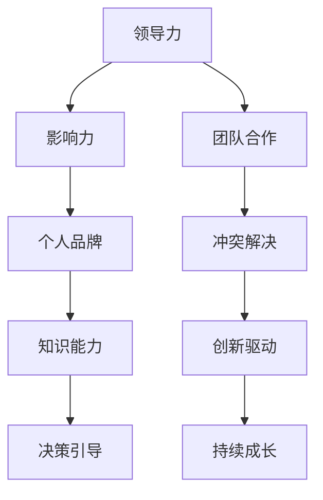
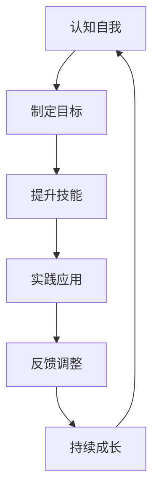
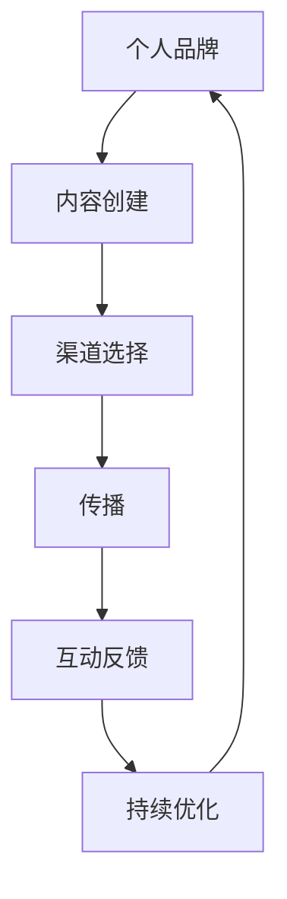

                 

### 文章标题：创业过程中如何不断提升领导力和影响力

> 关键词：创业、领导力、影响力、自我提升、沟通策略、团队管理

> 摘要：本文旨在探讨创业过程中如何通过系统的领导力和影响力提升策略，实现个人与团队的共同成长。文章首先定义了领导力和影响力的概念，阐述了其重要性；接着从基础理论和实践方法两个方面详细分析了提升领导力和影响力的具体路径；最后，结合创业过程中的不同阶段，提出了针对性的领导力和影响力提升策略。通过本文的阅读，创业者可以更好地理解并运用领导力和影响力，为创业成功奠定坚实基础。

---

# 《创业过程中如何不断提升领导力和影响力》

在当今快速变化和竞争激烈的商业环境中，创业不仅需要创新的产品和市场机会，更需要强有力的领导力和广泛的影响力。领导力和影响力不仅是个人成功的关键因素，更是创业团队协同作战的纽带和驱动力。本文将围绕创业过程中的领导力和影响力提升，展开深入探讨。

本文将分为三个部分：

- **第一部分：领导力和影响力的基础理论**，介绍领导力和影响力的定义、类型及其重要性。
- **第二部分：提升领导力的方法和实践**，探讨如何通过自我认知与提升、建立领导风格和具体实践来提升领导力。
- **第三部分：提升影响力的技巧与策略**，分析如何通过个人品牌建设、关系网络构建和影响力传播来提升影响力。

通过这些理论和方法的学习和实践，创业者可以更有效地领导团队，扩大影响力，从而推动创业事业的持续发展。

## 第一部分：领导力和影响力的基础理论

在探讨创业过程中的领导力和影响力提升之前，有必要先了解这两个核心概念的定义、类型及其重要性。本部分将详细介绍领导力和影响力的基础理论。

### 第1章：领导力的定义与类型

#### 1.1 领导力的概念

领导力（Leadership）是一种能力，它涉及到激励、引导和影响他人实现共同目标的过程。领导力不仅仅是管理职位所赋予的权力，它是一种通过个人魅力、知识和经验来影响他人思想和行动的技能。

#### 1.1.1 领导力的定义

领导力可以被定义为一系列行为的组合，这些行为能够激励、引导和影响个体或集体，朝着共同的目标努力。领导力不仅仅是权力和地位的体现，更是一种能力，涉及到人际交往、决策制定、愿景构建和变革推动等多个方面。

#### 1.1.2 领导力的特点

- **影响力**：领导力是通过个人魅力、知识和经验来影响他人的能力。
- **持续发展**：领导力不是一成不变的，而是一个持续发展的过程，需要不断学习和适应变化。
- **团队合作**：领导力强调团队合作，通过激励和引导团队成员实现共同目标。
- **变革推动**：领导力能够推动组织或团队进行变革，以适应外部环境和内部需求的变化。

#### 1.1.3 领导力的重要性

领导力在创业过程中至关重要。一个优秀的领导者能够：

- **明确愿景**：为团队提供清晰的愿景和目标，激发团队成员的动力和创造力。
- **有效沟通**：通过有效的沟通，确保团队成员理解并支持组织的战略和决策。
- **团队协调**：协调团队成员之间的关系，解决冲突，提高团队协作效率。
- **创新能力**：推动团队进行创新，应对市场竞争和技术变革。
- **持续成长**：鼓励团队成员持续学习和成长，提高整个团队的竞争力。

### 第2章：影响力的基础

#### 2.1 影响力的概念

影响力（Influence）是影响或改变他人思想、信念、态度和行为的潜力和能力。影响力不仅仅是一种领导技能，它也是我们在日常生活中与他人交往的重要工具。

#### 2.1.1 影响力的定义

影响力可以被定义为一种能力，通过这种能力，个人能够引导他人做出特定的行为或决策。它不仅仅依赖于职位权力，还包括个人魅力、专业知识、说服技巧等多种因素。

#### 2.1.2 影响力的特点

- **多方面**：影响力可以体现在多个方面，如情感、逻辑、情感等方面。
- **可持续性**：有效的领导力可以通过持续的努力来建立和维持。
- **可传递性**：个人影响力可以通过领导、教育、沟通等方式传递给他人。

#### 2.1.3 影响力的重要性

影响力在创业过程中同样至关重要。它能够帮助创业者：

- **建立品牌**：通过个人品牌和影响力来建立公司的知名度和信誉。
- **吸引人才**：通过个人魅力和专业能力吸引和留住优秀的人才。
- **决策支持**：在团队中提供有影响力的建议，促进有效决策。
- **推动变革**：通过影响力推动组织内部的变革和创新。
- **市场拓展**：通过影响力扩大市场影响，开拓新市场。

### 第3章：领导力和影响力的关系架构

为了更好地理解领导力和影响力的相互作用，我们使用Mermaid流程图来展示它们之间的关系。

这个流程图展示了领导力通过影响力和个人品牌来增强知识能力、决策引导、团队合作和冲突解决，进而推动创新和持续成长。

在下一部分中，我们将深入探讨提升领导力的具体方法和实践。

### 第3章：领导力的提升方法和实践

#### 3.1 自我认知与自我提升

自我认知是领导力提升的基石。领导者需要深入了解自己的优势和劣势，才能在正确的方向上不断进步。

##### 3.1.1 自我认知的方法

1. **反思与自我评估**：定期进行自我反思，评估自己在领导角色中的表现。
2. **360度反馈**：收集来自同事、下属和上级的反馈，了解自己在他人眼中的形象。
3. **心理测试**：通过专业心理测试了解自己的性格、优势和弱点。

##### 3.1.2 自我提升的策略

1. **持续学习**：不断学习新的知识和技能，提高自己的专业素养。
2. **培养习惯**：建立良好的工作习惯和生活习惯，提高自己的工作效率和生活质量。
3. **积极参与**：积极参与各种活动和项目，锻炼自己的领导能力和应对挑战的能力。

#### 3.2 建立领导风格

领导风格是领导者处理和管理团队的方式，不同的领导风格适用于不同的情境和团队。

##### 3.2.1 领导风格的类型

1. **交易型领导力**：通过奖励和惩罚来激励团队成员。
2. **变革型领导力**：通过激励和启发来推动团队成员实现变革。
3. **道德领导力**：强调道德和伦理，以正直和诚信为核心价值观。

##### 3.2.2 领导风格的选择

领导者需要根据团队的实际情况和自身的特点选择合适的领导风格。例如，在团队面临重大挑战时，变革型领导力可能更为有效；而在团队稳定运营时，交易型领导力可能更为合适。

##### 3.2.3 领导风格的发展

领导风格不是一成不变的，领导者需要不断适应环境变化和团队需求，发展适合自己的领导风格。例如，一个习惯于交易型领导力的领导者，可能需要通过学习和实践，逐渐培养出变革型和道德领导力的特质。

#### 3.3 领导力的实践

领导力不仅仅是理论，更需要通过实践来体现。以下是一些提升领导力的具体实践方法：

##### 3.3.1 沟通与协调

1. **倾听**：积极倾听团队成员的意见和建议，理解他们的需求和困扰。
2. **清晰表达**：清晰、明确地表达自己的期望和目标，确保团队成员理解。
3. **团队协调**：协调不同团队成员之间的关系，解决冲突，提高团队协作效率。

##### 3.3.2 决策与执行

1. **科学决策**：基于数据和事实做出决策，避免主观臆断。
2. **快速决策**：在必要时快速做出决策，避免拖延和犹豫。
3. **执行跟进**：确保决策得到有效执行，及时跟进和调整。

##### 3.3.3 领导力培养

1. **培训与学习**：参加各种领导力培训，提高自己的领导能力和管理技能。
2. **实践与反思**：通过实践来检验自己的领导力，并不断反思和总结经验教训。
3. **持续成长**：保持对领导力领域的关注，不断学习和适应新的变化。

通过自我认知与自我提升、建立领导风格和具体实践，领导者可以不断提升自己的领导力，为团队和创业事业的成功奠定坚实基础。

### 第4章：领导力的实践

#### 4.1 沟通与协调

有效的沟通和协调是领导力的重要组成部分，尤其是在一个多元化的团队中。良好的沟通能够确保信息的准确传递，减少误解和冲突，提高团队的整体协作效率。

##### 4.1.1 沟通的重要性

沟通不仅是信息的传递，更是一种建立信任、增强团队合作的重要手段。有效的沟通可以：

- **提高团队的凝聚力**：通过沟通，团队成员能够更好地理解彼此，建立共同的价值观和目标。
- **促进信息的透明化**：透明的沟通有助于团队成员了解组织的目标、进展和挑战，从而更好地支持团队的工作。
- **提高决策效率**：通过开放的沟通渠道，领导者可以快速获得团队成员的意见和建议，从而做出更明智的决策。

##### 4.1.2 有效沟通的策略

1. **倾听**：倾听是有效沟通的关键。领导者需要耐心地听取团队成员的意见，不仅关注内容，还要关注对方的情感和需求。
2. **清晰表达**：领导者应该确保自己的表达清晰、简洁，避免使用模糊的词汇和概念。使用具体的例子和数据来支持观点，有助于提高沟通的效果。
3. **积极反馈**：在沟通过程中，领导者应该给予积极的反馈，以确认对方已经理解了信息。这种反馈不仅包括口头确认，还可以通过非语言的肢体动作来表达。
4. **建立开放的沟通渠道**：鼓励团队成员提出问题和建议，建立开放的沟通环境。领导者可以通过定期的团队会议、邮件、即时通讯工具等多种渠道，确保沟通的畅通无阻。

##### 4.1.3 协调团队冲突

团队冲突是不可避免的，但有效的领导力可以帮助团队化解冲突，保持团队的和谐和高效运作。

1. **识别冲突**：领导者需要敏锐地识别出团队中的潜在冲突。这可以通过观察团队成员的行为和交流来做到。
2. **倾听各方意见**：在冲突出现时，领导者应该首先倾听各方的意见和观点，确保每个人都有机会表达自己的看法。
3. **中立调解**：在调解冲突时，领导者应保持中立，避免偏袒任何一方。领导者可以通过引导对话，帮助各方找到共同点和解决方案。
4. **制定解决方案**：在了解了各方的观点后，领导者应该与团队一起制定解决方案。这个解决方案应该是公平、合理且可行的，能够满足各方的合理需求。

通过有效的沟通和协调，领导者可以确保团队在一个积极、和谐的环境中运作，从而提高团队的整体效率和创新能力。

#### 4.2 决策与执行

决策和执行是领导力的核心要素，领导者必须在决策过程中体现其远见和智慧，在执行过程中展现其果断和执行力。

##### 4.2.1 决策的原则

1. **科学性**：决策应该基于充分的数据和事实，避免凭直觉或个人喜好做出决策。
2. **合理性**：决策应该经过严格的逻辑推理和论证，确保其合理性。
3. **灵活性**：决策应该具备一定的灵活性，能够根据实际情况的变化进行调整。

##### 4.2.2 决策的方法

1. **数据分析法**：通过收集和分析相关数据，利用统计学和数据分析工具，做出数据驱动的决策。
2. **SWOT分析法**：通过分析团队或项目的优势（Strengths）、劣势（Weaknesses）、机会（Opportunities）和威胁（Threats），制定出具有前瞻性的决策。
3. **头脑风暴法**：通过集体讨论和思维碰撞，激发团队成员的创新思维，产生更多决策选项。

##### 4.2.3 执行的策略

1. **明确目标**：在决策过程中，领导者需要明确目标，确保团队成员理解并认同决策的目的和预期结果。
2. **分工协作**：根据团队成员的技能和特长，合理分工，确保每个人在执行过程中发挥最大作用。
3. **过程监控**：在执行过程中，领导者需要定期监控项目进度，及时发现和解决问题，确保决策的有效执行。
4. **激励与反馈**：通过激励机制和及时的反馈，鼓励团队成员保持积极性和执行力，同时帮助其改进和提升。

通过科学决策和有效执行，领导者可以确保团队目标的实现，推动创业事业的持续发展。

#### 4.3 领导力的培养

领导力是一种可以通过培养和实践不断提升的能力。以下方法可以帮助创业者培养和提升自己的领导力。

##### 4.3.1 领导力培养的重要性

1. **适应变化**：在快速变化的商业环境中，领导者需要具备快速适应和应对变化的能力。通过领导力培养，创业者可以提升自己的应变能力，更好地应对各种挑战。
2. **团队协作**：有效的领导力能够促进团队协作，提高团队的凝聚力和执行力。领导力培养可以帮助创业者建立更和谐的团队关系，推动团队共同进步。
3. **持续成长**：领导力培养是一个持续的过程，通过不断学习和实践，创业者可以不断提升自己的领导水平，为创业事业的长期发展奠定坚实基础。

##### 4.3.2 领导力培养的目标

1. **提升自我认知**：了解自己的优势和劣势，明确自己的职业发展方向。
2. **增强决策能力**：通过科学的方法和工具，提高决策的质量和效率。
3. **提高沟通能力**：通过有效的沟通策略，提高团队协作效率，减少误解和冲突。
4. **培养团队合作精神**：通过团队合作实践，提升团队的整体执行力。

##### 4.3.3 领导力培养的方法

1. **培训与学习**：参加领导力培训课程，学习最新的领导理论和方法，提升自己的管理技能。
2. **实践与反思**：通过实际工作经历，不断反思和总结，将理论知识应用到实践中，提升领导力。
3. **持续成长**：保持对领导力领域的关注，不断学习新知识，适应新的变化和挑战。

通过领导力的培养，创业者可以不断提升自己的领导水平，为创业事业的成功奠定坚实基础。

## 第三部分：提升影响力的技巧与策略

在创业过程中，影响力是领导者的重要资产。通过有效的技巧和策略，创业者可以提升个人品牌，构建强大的关系网络，并传播影响力，从而在市场中脱颖而出。以下是提升影响力的具体方法和实践。

### 第6章：影响力的技巧

#### 6.1 个人品牌建设

个人品牌是影响力的核心。一个强有力的个人品牌能够增强个人在行业内的知名度和认可度。

##### 6.1.1 个人品牌的定义

个人品牌是指个人在行业内或社会中所拥有的独特形象和声誉。它包括个人的专业知识、专业能力和职业价值观等多个方面。

##### 6.1.2 个人品牌的建设策略

1. **明确定位**：明确个人品牌的核心价值和定位，确保在市场上具有独特性和可识别性。
2. **专业积累**：通过不断学习和实践，提升专业知识和技能，建立权威性。
3. **积极发声**：利用各种渠道（如社交媒体、博客、演讲等）发声，展示个人专业能力和见解。
4. **参与活动**：积极参与行业活动，扩大人脉，提高个人知名度。

##### 6.1.3 个人品牌的维护与更新

1. **持续学习**：保持对行业动态的关注，不断更新知识和技能，保持个人品牌的活力。
2. **优质内容**：持续产出高质量、有价值的内容，巩固个人品牌形象。
3. **积极反馈**：关注市场反馈，及时调整和优化个人品牌策略。

#### 6.2 关系网络的构建

关系网络是影响力的重要支撑。通过构建和维护良好的关系网络，创业者可以获取更多的资源和支持。

##### 6.2.1 关系网络的重要性

1. **资源共享**：关系网络可以帮助创业者获取行业资源，包括资金、人才和技术等。
2. **信息传递**：关系网络是信息传递的重要渠道，有助于创业者及时了解行业动态和市场变化。
3. **人脉支持**：强大的关系网络可以提供创业者在困境中的支持和帮助。

##### 6.2.2 关系网络的构建方法

1. **主动社交**：积极参加各种社交活动，主动结识行业内的专家和同行。
2. **长期维护**：保持与关系网络的联系，定期沟通，增进了解和信任。
3. **互利共赢**：在构建关系网络时，注重互利共赢，提供帮助，建立互信。

##### 6.2.3 关系网络的维护与拓展

1. **定期沟通**：通过电话、邮件、社交媒体等方式，定期与关系网络成员保持联系。
2. **个性化互动**：根据关系网络成员的兴趣和需求，提供个性化的帮助和支持。
3. **共同参与**：邀请关系网络成员参与共同的项目或活动，增强互动和合作。

### 第7章：影响力的策略

#### 7.1 说服力提升

说服力是影响力的核心要素。提升说服力可以帮助创业者更有效地推广自己的理念、产品和品牌。

##### 7.1.1 说服力的概念

说服力是指通过有效的沟通技巧和策略，影响他人信念和行动的能力。

##### 7.1.2 提升说服力的策略

1. **建立信任**：通过诚实、正直和透明的沟通建立信任，这是说服力的基础。
2. **清晰表达**：确保自己的观点和论据清晰、有逻辑，避免含糊不清和模糊表述。
3. **展示权威**：通过专业知识和经验展示自己的权威性，增加说服力。
4. **情感共鸣**：通过情感共鸣和情感化表达，打动听众，增强说服力。

##### 7.1.3 说服力的实践案例

1. **产品发布会**：在产品发布会上，通过详尽的演示和情感化的演讲，增强产品的影响力。
2. **行业报告**：通过发布权威的行业报告，展示专业能力和对行业的深入理解，提升个人和品牌的权威性。
3. **社交媒体互动**：通过社交媒体与粉丝互动，展示个人专业知识和生活态度，增强粉丝的信任和忠诚度。

#### 7.2 影响力传播

传播是影响力扩大的关键。有效的传播策略可以帮助创业者将个人或品牌的影响力扩散到更广泛的范围。

##### 7.2.1 影响力传播的渠道

1. **社交媒体**：利用社交媒体平台，如微博、微信、LinkedIn等，进行内容传播和互动。
2. **专业媒体**：通过行业媒体、专业杂志和网站发布文章、评论和报道，提升个人和品牌的知名度。
3. **演讲与会议**：参加行业会议、研讨会和公开演讲，展示个人专业能力和行业见解。
4. **线下活动**：组织或参与线下活动，如讲座、培训、聚会等，与行业人士建立联系。

##### 7.2.2 影响力传播的方法

1. **内容营销**：通过高质量的内容（如文章、报告、视频等）来吸引目标受众，增强影响力。
2. **口碑营销**：利用用户口碑和推荐，提升个人和品牌的信誉和影响力。
3. **合作推广**：与其他个人或品牌合作，通过互惠互利的方式扩大影响力。
4. **社交媒体互动**：通过社交媒体的互动和参与，提升个人和品牌的活跃度和影响力。

##### 7.2.3 影响力传播的案例分析

1. **乔布斯**：通过苹果的产品发布会和演讲，乔布斯成功地将苹果品牌和个人影响力传播到全球。
2. **马云**：通过在国内外演讲、接受媒体采访和参与各种活动，马云提升了阿里巴巴的知名度和个人品牌。
3. **谷歌**：通过在社交媒体上发布高质量的内容和互动，谷歌成功地将自身打造成一个科技和创新的代名词。

通过个人品牌建设、关系网络构建和影响力传播，创业者可以不断提升自己的影响力，为创业事业的长期发展奠定坚实基础。

### 第8章：创业过程中的领导力与影响力实践

#### 8.1 创业初期的领导力与影响力

在创业初期，领导力和影响力对于团队的凝聚力和市场竞争力至关重要。以下是创业初期领导力和影响力提升的几个关键点：

##### 8.1.1 初期团队建设

1. **明确愿景和目标**：在创业初期，领导者需要明确团队的愿景和目标，使团队成员明确自己的角色和贡献。
2. **选拔合适的人才**：通过选拔和培养合适的团队成员，确保团队能够高效协作，共同实现目标。
3. **建立共同价值观**：在团队中建立共同的价值观和使命，增强团队的凝聚力和归属感。

##### 8.1.2 初期市场定位

1. **市场调研**：通过市场调研，了解目标市场和潜在客户的需求，为产品或服务的定位提供依据。
2. **竞争分析**：分析竞争对手的优势和劣势，制定出差异化的市场定位策略。
3. **制定营销策略**：根据市场定位，制定出有效的营销策略，吸引目标客户。

##### 8.1.3 初期资源整合

1. **资金筹集**：通过天使投资、风险投资、银行贷款等多种方式筹集创业所需资金。
2. **技术资源**：与专业机构和技术团队合作，获取所需的技术支持和资源。
3. **人才引进**：通过招聘、合作、兼职等多种方式引进所需的优秀人才。

#### 8.2 创业成长期的领导力与影响力

在创业成长期，领导力和影响力需要进一步提升，以应对市场变化和团队扩展的挑战。

##### 8.2.1 成长期团队管理

1. **团队扩展**：随着业务的增长，领导者需要有效地扩展团队，确保团队的专业能力和工作效率。
2. **培养接班人**：通过培养接班人，确保团队在领导者的离开或变动时能够顺利过渡。
3. **团队激励**：通过有效的激励机制，保持团队成员的积极性和创造力。

##### 8.2.2 成长期业务拓展

1. **市场拓展**：通过市场拓展策略，将业务从本地市场扩展到全国甚至全球市场。
2. **产品创新**：通过产品创新，不断满足市场需求，提升产品的竞争力。
3. **品牌建设**：通过有效的品牌建设策略，提升品牌知名度和市场影响力。

##### 8.2.3 成长期品牌建设

1. **内容营销**：通过高质量的内容营销，提升品牌在目标市场的知名度和认可度。
2. **社交媒体互动**：通过社交媒体的互动和参与，扩大品牌的社交影响力。
3. **合作伙伴关系**：通过与其他品牌和机构的合作，共同提升品牌的影响力和市场地位。

#### 8.3 创业成熟期的领导力与影响力

在创业成熟期，领导力和影响力需要更加成熟和稳定，以确保企业的长期可持续发展。

##### 8.3.1 成熟期团队稳定

1. **团队稳定**：保持团队的稳定和高效运作，减少人员流动和冲突。
2. **人才培养**：通过培训和激励机制，不断提升团队成员的专业能力和领导力。
3. **企业文化**：建立强大的企业文化，增强团队的凝聚力和归属感。

##### 8.3.2 成熟期业务优化

1. **业务优化**：通过业务优化和流程改进，提高企业的运营效率和盈利能力。
2. **市场深耕**：在成熟市场中深耕细作，提升市场份额和客户满意度。
3. **技术创新**：通过持续的技术创新，保持企业的市场竞争力。

##### 8.3.3 成熟期持续创新

1. **创新文化**：建立创新文化，鼓励团队成员提出新想法和解决方案。
2. **研发投入**：增加研发投入，推动产品和技术的创新。
3. **市场前瞻**：关注市场趋势和变化，提前布局新市场和新业务。

通过在不同阶段的创业过程中不断优化领导力和影响力，创业者可以确保企业的长期成功和可持续发展。

### 附录

#### 附录A：领导力和影响力提升工具推荐

**自我提升工具推荐**：

- **心理测试**：如MBTI、DISC等，帮助了解自己的性格和优势。
- **领导力培训课程**：参加线上或线下的领导力培训，提升管理技能。
- **阅读**：阅读领导力、管理、心理学等相关书籍，吸收先进理念。

**沟通技巧提升工具**：

- **沟通反馈工具**：如360度反馈、沟通训练软件等，帮助提升沟通能力。
- **语音识别和翻译工具**：如Google Translate、iTranslate等，帮助进行跨语言沟通。

**影响力传播工具**：

- **社交媒体平台**：如微博、微信、LinkedIn等，进行内容传播和互动。
- **内容管理系统**：如WordPress、Drupal等，发布高质量内容。
- **邮件营销工具**：如Mailchimp、SendinBlue等，进行精准营销。

#### 附录B：参考文献

**领导力相关书籍推荐**：

- **《领导力的五项修炼》**：斯蒂芬·罗宾斯（Stephen Robbins）著。
- **《影响力》**：罗伯特·西奥迪尼（Robert B. Cialdini）著。
- **《创业维艰》**：本·霍洛维茨（Ben Horowitz）著。

**影响力相关书籍推荐**：

- **《说服力》**：史蒂夫·乔布斯（Steve Jobs）著。
- **《影响力的六要素》**：罗伯特·西奥迪尼（Robert B. Cialdini）著。
- **《个人品牌》**：丹尼尔·平克（Daniel Pink）著。

**创业相关书籍推荐**：

- **《创业者的科学》**：史蒂夫·布兰克（Steve Blank）著。
- **《精益创业》**：埃里克·莱斯（Eric Ries）著。
- **《创业维艰》**：本·霍洛维茨（Ben Horowitz）著。

通过这些工具和书籍的学习和实践，创业者可以不断提升自己的领导力和影响力，为创业事业的持续成功奠定坚实基础。

### 第9章：领导力与影响力的Mermaid流程图

为了更好地理解和应用领导力和影响力，我们使用Mermaid流程图来展示它们的发展过程和关键步骤。

#### 9.1 领导力发展流程图

这个流程图展示了领导力从自我认知开始，通过制定目标、提升技能、实践应用和反馈调整，最终实现持续成长的过程。

#### 9.2 影响力传播流程图

这个流程图展示了影响力的传播过程，从个人品牌的建设开始，通过内容创建、渠道选择、传播和互动反馈，最终实现持续优化的目标。

通过这些流程图的指导，创业者可以更加系统地提升自己的领导力和影响力，推动创业事业的持续成功。

### 总结

在创业过程中，领导力和影响力是创业者不可或缺的重要资产。通过本文的探讨，我们了解了领导力和影响力的基础理论，学习了如何通过自我认知与提升、建立领导风格和具体实践来提升领导力，以及如何通过个人品牌建设、关系网络构建和影响力传播来提升影响力。

创业初期的领导力与影响力建设是团队凝聚力和市场竞争力的重要保障，成长期的领导力与影响力提升则有助于企业在激烈的市场竞争中脱颖而出，成熟期的领导力与影响力稳定则确保企业的长期可持续发展。

为了进一步提升领导力和影响力，创业者可以借助各种工具和策略，如领导力培训课程、心理测试、社交媒体互动等，不断优化自己的领导力和影响力。

让我们共同努力，不断提升自己的领导力和影响力，为创业事业的辉煌成就奠定坚实基础。

### 附录A：领导力和影响力提升工具推荐

#### A.1 自我提升工具推荐

1. **心理测试**：通过MBTI、DISC等心理测试工具，了解自己的性格和优势，为自我提升提供科学依据。
2. **领导力培训课程**：参加线上或线下的领导力培训课程，学习先进的管理理念和实践技巧。
3. **阅读**：阅读领导力、管理、心理学等相关书籍，吸收先进理念，提升自我认知。

#### A.2 沟通技巧提升工具

1. **沟通反馈工具**：如360度反馈、沟通训练软件等，帮助提升沟通能力和技巧。
2. **语音识别和翻译工具**：如Google Translate、iTranslate等，帮助进行跨语言沟通，提高沟通效率。

#### A.3 影响力传播工具

1. **社交媒体平台**：如微博、微信、LinkedIn等，进行内容传播和互动，扩大影响力。
2. **内容管理系统**：如WordPress、Drupal等，发布高质量内容，提升个人品牌。
3. **邮件营销工具**：如Mailchimp、SendinBlue等，进行精准营销，增强影响力。

这些工具和资源为创业者提供了丰富的自我提升和影响力传播的途径，有助于在创业过程中更加有效地提升领导力和影响力。

### 附录B：参考文献

**领导力相关书籍推荐**：

1. 《领导力的五项修炼》：斯蒂芬·罗宾斯（Stephen Robbins）著。
2. 《影响力》：罗伯特·西奥迪尼（Robert B. Cialdini）著。
3. 《创业维艰》：本·霍洛维茨（Ben Horowitz）著。

**影响力相关书籍推荐**：

1. 《说服力》：史蒂夫·乔布斯（Steve Jobs）著。
2. 《影响力的六要素》：罗伯特·西奥迪尼（Robert B. Cialdini）著。
3. 《个人品牌》：丹尼尔·平克（Daniel Pink）著。

**创业相关书籍推荐**：

1. 《创业者的科学》：史蒂夫·布兰克（Steve Blank）著。
2. 《精益创业》：埃里克·莱斯（Eric Ries）著。
3. 《创业维艰》：本·霍洛维茨（Ben Horowitz）著。

通过这些书籍的阅读，创业者可以深入了解领导力和影响力提升的理论和实践，为创业事业的持续成功提供智力支持。

### 附录C：技术词汇表

在本文中，我们使用了一些与领导力和影响力相关的技术词汇，以下是这些词汇的定义：

1. **领导力**（Leadership）：指一种能力，涉及到激励、引导和影响他人实现共同目标的过程。
2. **影响力**（Influence）：指影响或改变他人思想、信念、态度和行为的潜力和能力。
3. **个人品牌**（Personal Brand）：指个人在行业或社会中所拥有的独特形象和声誉。
4. **团队建设**（Team Building）：指通过一系列措施和活动，增强团队凝聚力和协作效率的过程。
5. **市场定位**（Market Positioning）：指企业或产品在目标市场中的定位策略，以区分竞争对手，满足特定客户需求。
6. **决策制定**（Decision Making）：指在多个备选方案中，选择最优方案的过程。
7. **影响力传播**（Influence Communication）：指通过多种渠道和策略，扩大个人或品牌影响力的过程。

通过了解这些技术词汇，读者可以更好地理解本文的内容，并在实际创业过程中应用相关理论和方法。

### 作者信息

**作者：AI天才研究院/AI Genius Institute & 禅与计算机程序设计艺术 /Zen And The Art of Computer Programming**

本文由AI天才研究院和《禅与计算机程序设计艺术》的作者共同撰写。AI天才研究院致力于推动人工智能领域的研究和应用，通过技术创新和理论探索，为创业者提供前沿的技术支持和智力支持。《禅与计算机程序设计艺术》则是一部经典的计算机科学著作，通过哲学和技术的结合，为程序设计提供了独特的视角和方法论。两位作者均具有深厚的专业背景和丰富的实践经验，致力于通过本文为创业者提供有价值的领导力和影响力提升策略。

