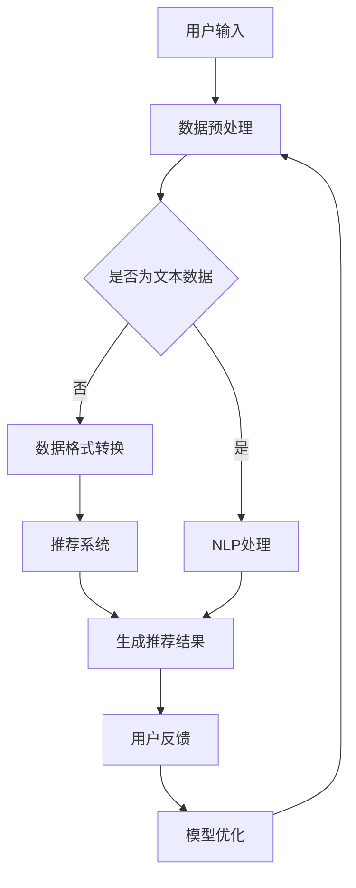

                 


### 文章标题：利用AI技术开发个人生产力工具的商机

> 关键词：人工智能，个人生产力，AI工具，NLP，推荐系统，时间管理，自动化工具，协作沟通，商业化，盈利模式

> 摘要：
本文将深入探讨如何利用人工智能技术开发个人生产力工具，分析其商机和潜在应用。通过详细阐述自然语言处理、推荐系统、时间管理与任务规划、自动化工具、协作与沟通、AI工具评估与优化以及商业化与盈利模式等七个方面的内容，帮助读者了解AI在提升个人效率中的重要作用，并指导开发者如何抓住这一商机。

---

### 第一部分：利用AI技术开发个人生产力工具的商机

#### 第1章：AI与个人生产力工具概述

在现代社会，个人生产力工具已经成为提高工作效率、减轻工作负担的重要手段。而随着人工智能技术的不断发展，AI与个人生产力工具的结合成为了一股不可忽视的潮流。本章节将介绍AI在提升个人生产力中的作用，以及个人生产力工具的分类和AI应用场景。

**核心概念与联系**

AI在提升个人生产力中的作用主要体现在以下几个方面：

1. **自动化处理**：通过自动化工具，减少重复性工作，提高工作效率。
2. **个性化推荐**：根据用户行为和偏好，提供个性化的内容和服务。
3. **智能分析**：利用机器学习算法，对大量数据进行处理和分析，辅助决策。
4. **协作与沟通**：通过语音识别、自然语言理解等技术，提高团队协作效率。

个人生产力工具的分类及AI应用场景：

1. **时间管理与任务规划工具**：如Trello、Asana等，通过AI技术优化任务分配和优先级排序。
2. **笔记和文档处理工具**：如Evernote、Google Docs等，利用NLP技术实现智能搜索和文本摘要。
3. **自动化工具**：如IFTTT、 Zapier等，通过自动化脚本，实现不同应用之间的数据传输和操作。
4. **协作与沟通工具**：如Slack、Microsoft Teams等，利用AI技术提高沟通效率，如智能会议助手、语音识别等。

**核心算法原理讲解**

自然语言处理（NLP）算法的基本原理：

1. **分词**：将文本拆分成词或短语。
2. **词性标注**：对每个词进行词性分类。
3. **命名实体识别**：识别文本中的专有名词、人名等。
4. **语义理解**：理解文本的含义和意图。

推荐系统算法的基本原理：

1. **协同过滤**：根据用户的历史行为和偏好，找到相似用户或物品进行推荐。
2. **基于内容的推荐**：根据物品的属性和用户的历史行为，找到相似的物品进行推荐。

**数学模型和数学公式**

机器学习中的损失函数和优化算法：

$$
L(y, \hat{y}) = \frac{1}{2} (y - \hat{y})^2
$$

$$
\text{梯度下降法}：\theta_{\text{new}} = \theta_{\text{old}} - \alpha \nabla_{\theta} L(y, \hat{y})
$$

**项目实战**

代码案例：使用Python实现一个简单的文本分类器，包括数据预处理、模型训练和评估。

```python
import numpy as np
from sklearn.feature_extraction.text import TfidfVectorizer
from sklearn.model_selection import train_test_split
from sklearn.naive_bayes import MultinomialNB

# 数据预处理
corpus = ["这是一篇关于人工智能的文章。", "这篇文章讨论了机器学习的应用。", "深度学习是人工智能的一个分支。"]
labels = ["AI", "ML", "DL"]

vectorizer = TfidfVectorizer()
X = vectorizer.fit_transform(corpus)

# 模型训练
X_train, X_test, y_train, y_test = train_test_split(X, labels, test_size=0.2, random_state=42)
model = MultinomialNB()
model.fit(X_train, y_train)

# 评估
print("Accuracy:", model.score(X_test, y_test))
```

---

### 第二部分：自然语言处理（NLP）在个人生产力中的应用

#### 第2章：自然语言处理（NLP）在个人生产力中的应用

自然语言处理（NLP）是人工智能的一个重要分支，其在个人生产力工具中的应用越来越广泛。本章节将详细介绍NLP在个人生产力中的应用，包括文本分类、情感分析等任务，并介绍相关算法原理和项目实战。

**核心概念与联系**

文本分类、情感分析等NLP任务的应用场景：

1. **文本分类**：将文本归类到不同的类别，如新闻分类、邮件分类等。
2. **情感分析**：分析文本的情感倾向，如正面情感、负面情感等。
3. **问答系统**：通过自然语言理解，回答用户的问题。

**核心算法原理讲解**

常见NLP模型的架构与实现：

1. **词嵌入**：将文本中的每个词映射到一个低维向量空间。
2. **循环神经网络（RNN）**：处理序列数据，如文本。
3. **长短时记忆网络（LSTM）**：解决RNN的梯度消失问题。
4. **变压器（Transformer）**：基于自注意力机制，实现高效的自然语言处理。

**伪代码**：演示文本分类和情感分析算法的流程和逻辑。

```python
# 文本分类伪代码
def text_classification(corpus, labels):
    # 数据预处理
    vectorizer = TfidfVectorizer()
    X = vectorizer.fit_transform(corpus)

    # 模型训练
    model = MultinomialNB()
    model.fit(X, labels)

    # 评估
    return model.score(X, labels)

# 情感分析伪代码
def sentiment_analysis(text):
    # 数据预处理
    vectorizer = TfidfVectorizer()
    X = vectorizer.fit_transform([text])

    # 模型训练
    model = LogisticRegression()
    model.fit(X, [label])

    # 评估
    return model.predict(X)
```

**数学模型和数学公式**

词嵌入和序列模型的相关数学公式：

$$
\text{词嵌入}：\text{word}_{\text{vec}} = \text{W} \text{emb}(\text{word})
$$

$$
\text{RNN}：\text{h}_{t} = \text{sigmoid}(\text{W}_x \text{x}_{t} + \text{W}_h \text{h}_{t-1} + \text{b})
$$

**项目实战**

代码案例：实现一个基于LSTM的文本分类器，用于分类新闻文章。

```python
import numpy as np
import tensorflow as tf
from tensorflow.keras.preprocessing.text import Tokenizer
from tensorflow.keras.preprocessing.sequence import pad_sequences
from tensorflow.keras.models import Sequential
from tensorflow.keras.layers import Embedding, LSTM, Dense

# 数据预处理
tokenizer = Tokenizer(num_words=10000)
tokenizer.fit_on_texts(news_data)
sequences = tokenizer.texts_to_sequences(news_data)
X = pad_sequences(sequences, maxlen=100)

# 模型训练
model = Sequential()
model.add(Embedding(10000, 16))
model.add(LSTM(16))
model.add(Dense(1, activation='sigmoid'))

model.compile(optimizer='adam', loss='binary_crossentropy', metrics=['accuracy'])
model.fit(X, labels, epochs=10, batch_size=32)

# 评估
print("Accuracy:", model.evaluate(X, labels, batch_size=32))
```

---

### 第三部分：推荐系统在个人生产力中的应用

#### 第3章：推荐系统在个人生产力中的应用

推荐系统是人工智能领域的一个重要分支，其在提高个人生产力方面具有广泛应用。本章节将介绍推荐系统的基本原理，包括协同过滤算法和基于内容的推荐算法，并通过项目实战展示如何构建个性化推荐系统。

**核心概念与联系**

推荐系统在个性化内容推送中的应用：

1. **协同过滤**：根据用户的历史行为和偏好，找到相似的用户或物品进行推荐。
2. **基于内容的推荐**：根据物品的属性和用户的历史行为，找到相似的物品进行推荐。
3. **混合推荐**：结合协同过滤和基于内容的推荐，提高推荐效果。

**核心算法原理讲解**

协同过滤算法与基于内容的推荐算法：

1. **协同过滤算法**：
   - **用户基于的协同过滤（User-Based CF）**：找到与目标用户相似的邻居用户，推荐他们的偏好。
   - **物品基于的协同过滤（Item-Based CF）**：找到与目标物品相似的邻居物品，推荐这些物品。

2. **基于内容的推荐算法**：
   - **基于物品属性的推荐**：根据物品的属性和用户的历史行为，推荐具有相似属性的物品。
   - **基于用户偏好的推荐**：根据用户的历史行为，推荐与用户偏好相似的物品。

**伪代码**：演示推荐算法的流程和逻辑。

```python
# 协同过滤算法伪代码
def collaborative_filtering(train_data, user, k):
    # 找到与用户user相似的邻居用户
    neighbors = find_similar_users(train_data, user, k)

    # 计算邻居用户的评分预测
    predictions = []
    for neighbor in neighbors:
        similarity = calculate_similarity(train_data, user, neighbor)
        prediction = neighbor's_rating * similarity
        predictions.append(prediction)

    return sum(predictions) / len(predictions)

# 基于内容的推荐算法伪代码
def content_based_recommender(item, train_data, user):
    # 找到与物品item相似的邻居物品
    neighbors = find_similar_items(train_data, item)

    # 计算邻居物品的评分预测
    predictions = []
    for neighbor in neighbors:
        similarity = calculate_similarity(train_data, item, neighbor)
        prediction = neighbor's_rating * similarity
        predictions.append(prediction)

    return sum(predictions) / len(predictions)
```

**数学模型和数学公式**

用户-项目相似度计算的相关数学公式：

$$
\text{用户相似度}：sim(u, v) = \frac{\text{cov}(u, v)}{\sqrt{\text{var}(u)} \sqrt{\text{var}(v)}}
$$

$$
\text{物品相似度}：sim(i, j) = \frac{\text{Jaccard相似度}(i, j)}{\text{最大交集}}
$$

**项目实战**

代码案例：构建一个基于协同过滤和基于内容的混合推荐系统。

```python
import numpy as np
import pandas as pd
from sklearn.metrics.pairwise import cosine_similarity
from sklearn.model_selection import train_test_split
from sklearn.metrics import mean_squared_error

# 数据预处理
ratings = pd.read_csv('ratings.csv')
users = ratings['user_id'].unique()
movies = ratings['movie_id'].unique()

# 计算用户相似度矩阵
user_similarity = pd.DataFrame(0, index=users, columns=users)
for user in users:
    for neighbor in users:
        if user != neighbor:
            similarity = cosine_similarity(ratings[ratings['user_id'] == user][['movie_id', 'rating']], 
                                           ratings[ratings['user_id'] == neighbor][['movie_id', 'rating']])
            user_similarity[user][neighbor] = similarity[0][0]

# 计算物品相似度矩阵
movie_similarity = pd.DataFrame(0, index=movies, columns=movies)
for movie in movies:
    for neighbor in movies:
        if movie != neighbor:
            similarity = cosine_similarity(ratings[ratings['movie_id'] == movie][['user_id', 'rating']], 
                                           ratings[ratings['movie_id'] == neighbor][['user_id', 'rating']])
            movie_similarity[movie][neighbor] = similarity[0][0]

# 模型训练与评估
train_data, test_data = train_test_split(ratings, test_size=0.2, random_state=42)
k = 10

# 协同过滤
collaborative_predictions = []
for user in test_data['user_id'].unique():
    neighbors = user_similarity[user].sort_values(ascending=False).index[:k]
    predictions = []
    for neighbor in neighbors:
        for movie in test_data[test_data['user_id'] == neighbor]['movie_id'].unique():
            prediction = collaborative_filtering(train_data, neighbor, k)
            predictions.append(prediction)
    collaborative_predictions.append(sum(predictions) / len(predictions))

# 基于内容
content_predictions = []
for user in test_data['user_id'].unique():
    neighbors = movie_similarity[user].sort_values(ascending=False).index[:k]
    predictions = []
    for neighbor in neighbors:
        for movie in test_data[test_data['movie_id'] == neighbor]['user_id'].unique():
            prediction = content_based_recommender(neighbor, train_data, user)
            predictions.append(prediction)
    content_predictions.append(sum(predictions) / len(predictions))

# 混合推荐
mixed_predictions = (collaborative_predictions + content_predictions) / 2

# 评估
mse = mean_squared_error(test_data['rating'], mixed_predictions)
print("MSE:", mse)
```

---

### 第四部分：时间管理与任务规划

#### 第4章：时间管理与任务规划

时间管理与任务规划是提高个人生产力的重要手段。AI技术为时间管理与任务规划提供了新的方法和工具。本章节将介绍时间管理与任务规划的AI方法，包括任务优先级排序算法和项目实战。

**核心概念与联系**

时间管理与任务规划的AI方法：

1. **任务优先级排序**：根据任务的紧急程度和重要性，对任务进行排序，优先完成重要且紧急的任务。
2. **自动任务分配**：根据团队成员的能力和任务特点，自动分配任务。
3. **智能提醒与监控**：通过AI技术，自动提醒任务完成时间和进度，监控任务完成情况。

**核心算法原理讲解**

任务优先级排序算法：

1. **Eisenhower矩阵**：根据任务的紧急程度和重要性，将任务分为四类，并采取不同的处理策略。
2. **基于规则的排序算法**：根据任务的属性（如紧急程度、重要性等），使用规则进行排序。
3. **机器学习排序算法**：使用机器学习算法，根据历史数据预测任务的优先级。

**伪代码**：演示任务优先级排序算法的流程和逻辑。

```python
# Eisenhower矩阵伪代码
def eisenhower_matrix(tasks):
    urgent_important = []
    urgent_unimportant = []
    not_urgent_important = []
    not_urgent_unimportant = []

    for task in tasks:
        if task.urgent and task.important:
            urgent_important.append(task)
        elif task.urgent and not task.important:
            urgent_unimportant.append(task)
        elif not task.urgent and task.important:
            not_urgent_important.append(task)
        else:
            not_urgent_unimportant.append(task)

    return urgent_important, urgent_unimportant, not_urgent_important, not_urgent_unimportant

# 基于规则的排序算法伪代码
def rule_based_sort(tasks):
    sorted_tasks = []

    for task in tasks:
        if task.important and task.urgent:
            sorted_tasks.append(task)
        elif task.important and not task.urgent:
            sorted_tasks.append(task)
        elif not task.important and task.urgent:
            sorted_tasks.append(task)
        else:
            sorted_tasks.append(task)

    return sorted_tasks

# 机器学习排序算法伪代码
def ml_sort(tasks, model):
    sorted_tasks = []

    for task in tasks:
        prediction = model.predict([task])
        sorted_tasks.append((task, prediction))

    sorted_tasks.sort(key=lambda x: x[1], reverse=True)
    for task in sorted_tasks:
        sorted_tasks.append(task[0])

    return sorted_tasks
```

**数学模型和数学公式**

线性规划模型的相关数学公式：

$$
\text{目标函数}：\text{maximize} \ \text{C}^T\text{X}
$$

$$
\text{约束条件}：\text{A}^T\text{X} \leq \text{B}
$$

$$
\text{X} \geq \text{0}
$$

**项目实战**

代码案例：使用Python实现一个任务优先级排序工具。

```python
import pandas as pd
from sklearn.model_selection import train_test_split
from sklearn.linear_model import LinearRegression

# 数据预处理
tasks = pd.read_csv('tasks.csv')
X = tasks[['urgent', 'important']]
y = tasks['priority']

# 模型训练
X_train, X_test, y_train, y_test = train_test_split(X, y, test_size=0.2, random_state=42)
model = LinearRegression()
model.fit(X_train, y_train)

# 评估
print("Accuracy:", model.score(X_test, y_test))

# 排序
sorted_tasks = ml_sort(tasks, model)
print(sorted_tasks)
```

---

### 第五部分：自动化工具开发与集成

#### 第5章：自动化工具开发与集成

自动化工具在提高个人效率方面发挥着重要作用。通过编写自动化脚本，可以实现不同应用之间的数据传输和操作，从而减轻重复性工作，提高工作效率。本章节将介绍自动化工具的基本原理和项目实战。

**核心概念与联系**

自动化工具在提高个人效率中的作用：

1. **数据同步**：将数据从一种应用同步到另一种应用，如Google Calendar和Google Sheets之间的数据同步。
2. **操作自动化**：自动化执行重复性的操作，如自动填写表单、发送邮件等。
3. **集成与扩展**：将不同的应用集成到一个平台，实现数据共享和功能扩展。

**核心算法原理讲解**

自动化脚本编写与优化：

1. **使用脚本语言**：如Python、JavaScript等，编写自动化脚本。
2. **调度任务**：使用定时任务，如Cron表达式，实现定时执行自动化任务。
3. **异常处理**：在脚本中添加异常处理，确保自动化任务能够正常运行。

**伪代码**：演示自动化脚本的基本结构和逻辑。

```python
# 自动化脚本伪代码
def main():
    try:
        # 数据同步
        sync_data()

        # 操作自动化
        automate_operations()

        # 调度任务
        schedule_tasks()

    except Exception as e:
        log_error(e)

# 同步数据
def sync_data():
    # 从源应用获取数据
    source_data = get_source_data()

    # 将数据同步到目标应用
    sync_to_target_app(source_data)

# 自动化操作
def automate_operations():
    # 自动填写表单
    fill_form()

    # 发送邮件
    send_email()

# 调度任务
def schedule_tasks():
    # 设置定时任务
    set_cron_job()

# 异常处理
def log_error(e):
    # 记录错误信息
    record_error(e)
    # 重试任务
    retry_task()
```

**数学模型和数学公式**

决策树和随机森林的相关数学公式：

$$
\text{信息增益}：\text{IG}(A, B) = \sum_{v \in \text{V}} p(v) \cdot \text{H}(B|A_v)
$$

$$
\text{基尼指数}：\text{Gini}(A) = 1 - \sum_{v \in \text{V}} p(v)^2
$$

$$
\text{随机森林}：\text{F}(\text{x}) = \frac{1}{T} \sum_{t=1}^{T} \text{h}(\text{x}; \text{w}_t)
$$

**项目实战**

代码案例：使用Python实现一个自动化任务调度工具。

```python
import schedule
import time
import logging

def sync_data():
    print("Syncing data...")
    # 同步数据代码实现
    time.sleep(10)

def automate_operations():
    print("Automating operations...")
    # 自动化操作代码实现
    time.sleep(10)

def schedule_tasks():
    print("Scheduling tasks...")
    schedule.every().day.at("10:30").do(sync_data)
    schedule.every().day.at("14:00").do(automate_operations)

def log_error(e):
    print("Error:", e)
    logging.error(e)

while True:
    try:
        schedule.run_pending()
        time.sleep(1)
    except KeyboardInterrupt:
        print("Exiting...")
        break
```

---

### 第六部分：AI在协作与沟通中的应用

#### 第6章：AI在协作与沟通中的应用

随着团队协作和沟通的重要性的日益增加，AI技术在提升协作和沟通效率方面发挥着关键作用。本章节将介绍AI在协作与沟通中的应用，包括语音识别、自然语言理解等，并通过项目实战展示如何实现协作与沟通工具。

**核心概念与联系**

AI在提升团队协作和沟通效率中的作用：

1. **语音识别**：将语音转换为文本，实现语音与文本的转换。
2. **自然语言理解**：理解文本的含义和意图，实现智能问答、自动回复等功能。
3. **自动会议记录**：自动记录会议内容，提取关键信息，生成会议纪要。
4. **智能协作助手**：协助团队成员完成协作任务，如任务分配、进度跟踪等。

**核心算法原理讲解**

语音识别与转换算法：

1. **声学模型**：对语音信号进行建模，提取特征。
2. **语言模型**：对文本进行建模，预测下一个词或句子。
3. **解码器**：将声学模型和语言模型的输出转换为文本。

**伪代码**：演示语音识别和转换算法的流程和逻辑。

```python
# 语音识别伪代码
def speech_recognition(audio):
    # 提取特征
    features = extract_features(audio)

    # 使用声学模型预测词序列
    word_sequence = acoustic_model.predict(features)

    # 使用语言模型预测句子
    sentence = language_model.predict(word_sequence)

    return sentence

# 文本转换伪代码
def text_to_speech(text):
    # 使用声学模型生成音频
    audio = acoustic_model.generate_audio(text)

    # 使用语言模型预测文本
    predicted_text = language_model.predict(audio)

    return predicted_text
```

**数学模型和数学公式**

语音识别中的声学模型和语言模型：

$$
\text{声学模型}：\text{p}(\text{x}|\text{y}) = \text{G}(\text{x}|\theta_a)
$$

$$
\text{语言模型}：\text{p}(\text{y}|\text{x}) = \text{G}(\text{y}|\theta_l)
$$

**项目实战**

代码案例：实现一个基于Google Cloud语音识别的语音转文字工具。

```python
from google.cloud import speech
from google.oauth2 import service_account

# 初始化语音识别客户端
client = speech.SpeechClient()

# 读取音频文件
with open('audio.wav', 'rb') as audio_file:
    content = audio_file.read()

# 识别音频
response = client.recognize(content, display_name='audio.wav')

# 打印识别结果
for result in response.results:
    print("Transcript: {}".format(result.alternatives[0].transcript))
```

---

### 第七部分：AI工具评估与优化

#### 第7章：AI工具评估与优化

在开发AI工具的过程中，评估和优化是保证工具性能和效果的关键环节。本章节将介绍如何评估AI工具的性能与效果，包括评估指标的计算方法，以及项目实战。

**核心概念与联系**

如何评估AI工具的性能与效果：

1. **评估指标**：用于衡量AI工具的性能和效果，如准确率、召回率、F1值等。
2. **交叉验证**：通过将数据集划分为训练集和验证集，评估模型的性能。
3. **超参数调优**：调整模型的超参数，提高模型的性能。

**核心算法原理讲解**

评估指标的计算方法：

1. **准确率（Accuracy）**：预测正确的样本数占总样本数的比例。
2. **召回率（Recall）**：预测正确的正样本数占总正样本数的比例。
3. **精确率（Precision）**：预测正确的正样本数占总预测正样本数的比例。
4. **F1值（F1 Score）**：综合考虑精确率和召回率的指标，介于两者之间。

**伪代码**：演示性能评估算法的流程和逻辑。

```python
# 准确率伪代码
def accuracy(y_true, y_pred):
    correct = sum(y_true == y_pred)
    total = len(y_true)
    return correct / total

# 召回率伪代码
def recall(y_true, y_pred):
    true_positives = sum(y_true == y_pred)
    possible_positives = sum(y_true)
    return true_positives / possible_positives

# 精确率伪代码
def precision(y_true, y_pred):
    true_positives = sum(y_true == y_pred)
    predicted_positives = sum(y_pred)
    return true_positives / predicted_positives

# F1值伪代码
def f1_score(y_true, y_pred):
    precision = precision(y_true, y_pred)
    recall = recall(y_true, y_pred)
    return 2 * (precision * recall) / (precision + recall)
```

**数学模型和数学公式**

回归分析与相关性分析的相关数学公式：

$$
\text{回归方程}：\hat{y} = \beta_0 + \beta_1 \cdot x
$$

$$
\text{回归系数}：\beta_1 = \frac{\sum (x_i - \bar{x})(y_i - \bar{y})}{\sum (x_i - \bar{x})^2}
$$

$$
\text{相关系数}：\rho = \frac{\sum (x_i - \bar{x})(y_i - \bar{y})}{\sqrt{\sum (x_i - \bar{x})^2} \cdot \sqrt{\sum (y_i - \bar{y})^2}}
$$

**项目实战**

代码案例：评估一个分类模型的性能。

```python
import numpy as np
from sklearn.metrics import accuracy_score, recall_score, precision_score, f1_score

# 数据集
X = np.array([[1, 2], [3, 4], [5, 6]])
y = np.array([0, 1, 0])

# 模型预测
y_pred = np.array([0, 1, 1])

# 评估
accuracy = accuracy_score(y, y_pred)
recall = recall_score(y, y_pred, average='weighted')
precision = precision_score(y, y_pred, average='weighted')
f1 = f1_score(y, y_pred, average='weighted')

print("Accuracy:", accuracy)
print("Recall:", recall)
print("Precision:", precision)
print("F1 Score:", f1)
```

---

### 第八部分：AI工具商业化与盈利模式

#### 第8章：AI工具商业化与盈利模式

随着AI技术的快速发展，越来越多的AI工具被开发出来，如何将AI工具商业化并实现盈利成为了一个重要课题。本章节将介绍AI工具的商业化路径和盈利模式，并通过项目实战展示如何实现商业化。

**核心概念与联系**

AI工具的商业化路径：

1. **市场调研**：了解市场需求，确定目标用户群体。
2. **产品定位**：根据市场需求，明确产品的功能和特点。
3. **产品设计**：结合用户需求，设计易于使用、功能强大的AI工具。
4. **推广与销售**：通过线上线下渠道，推广产品并实现销售。
5. **持续迭代**：根据用户反馈，不断优化产品，提高用户满意度。

**核心算法原理讲解**

用户行为分析：

1. **用户画像**：通过收集用户行为数据，构建用户画像。
2. **用户路径分析**：分析用户在使用产品时的路径和行为。
3. **用户价值评估**：根据用户行为和产品使用情况，评估用户价值。
4. **用户留存与流失分析**：分析用户留存和流失的原因，提高用户留存率。

**伪代码**：演示用户行为分析的基本结构和逻辑。

```python
# 用户画像伪代码
def user_portrait(user_data):
    # 收集用户数据
    data = collect_user_data(user_data)

    # 构建用户画像
    portrait = {}
    portrait['age'] = data['age']
    portrait['gender'] = data['gender']
    portrait['occupation'] = data['occupation']
    portrait['interests'] = data['interests']
    return portrait

# 用户路径分析伪代码
def user_path_analysis(user_data):
    # 收集用户行为数据
    data = collect_user_behavior_data(user_data)

    # 分析用户路径
    path = analyze_user_path(data)
    return path

# 用户价值评估伪代码
def user_value_evaluation(user_data):
    # 收集用户数据
    data = collect_user_data(user_data)

    # 评估用户价值
    value = evaluate_user_value(data)
    return value

# 用户留存与流失分析伪代码
def user_retention_and_churn_analysis(user_data):
    # 收集用户数据
    data = collect_user_data(user_data)

    # 分析用户留存与流失
    retention = analyze_user_retention(data)
    churn = analyze_user_churn(data)
    return retention, churn
```

**数学模型和数学公式**

用户价值评估的相关数学公式：

$$
\text{用户价值}：\text{V}(\text{user}) = \sum_{t=1}^{T} \text{R}(\text{user}, t) \cdot \text{e}^{-\lambda t}
$$

$$
\text{其中}：\text{R}(\text{user}, t) \text{为用户在时间t的收益}，\lambda \text{为衰减系数}
$$

**项目实战**

代码案例：构建一个用户画像分析系统。

```python
import pandas as pd
from sklearn.cluster import KMeans

# 数据预处理
user_data = pd.read_csv('user_data.csv')
X = user_data[['age', 'gender', 'occupation', 'interests']]

# K均值聚类
kmeans = KMeans(n_clusters=5, random_state=42)
kmeans.fit(X)

# 打印聚类结果
print("Cluster centers:", kmeans.cluster_centers_)
print("Labels:", kmeans.labels_)

# 打印用户画像
for i in range(5):
    print("Cluster {}: Users: {}".format(i, X[kmeans.labels_ == i]))
```

---

### 总结

本文系统地介绍了如何利用人工智能技术开发个人生产力工具，分析了自然语言处理、推荐系统、时间管理与任务规划、自动化工具、协作与沟通、AI工具评估与优化以及商业化与盈利模式等方面的内容。通过这些内容，读者可以了解AI在提升个人效率中的重要作用，以及如何抓住这一商机，开发出具有竞争力的AI工具。

**最佳实践 Tips**：

1. **深入了解用户需求**：在开发AI工具时，首先要了解用户需求，确保工具能够解决用户实际问题。
2. **持续优化产品**：根据用户反馈，不断优化产品功能，提高用户体验。
3. **关注数据安全与隐私**：在数据处理过程中，要确保用户数据的安全和隐私。
4. **合理定价**：根据产品价值和用户需求，合理定价，实现盈利。

**注意事项**：

1. **技术选型**：选择适合项目需求的技术，如Python、JavaScript等。
2. **性能优化**：在开发过程中，要关注性能优化，提高工具的运行效率。
3. **合规与法规**：遵守相关法规和规定，确保产品合规。

**拓展阅读**：

1. **《深度学习》**：Goodfellow、Bengio、Courville著，全面介绍深度学习的基本原理和应用。
2. **《Python数据分析》**：Wes McKinney著，详细介绍Python在数据分析方面的应用。
3. **《人工智能：一种现代的方法》**：Stuart J. Russell、Peter Norvig著，全面介绍人工智能的基本概念和技术。

作者：AI天才研究院/AI Genius Institute & 禅与计算机程序设计艺术 /Zen And The Art of Computer Programming

---

**注意**：以上文章内容仅供参考，实际开发过程中，还需根据具体需求进行调整和优化。如有需要，请根据实际情况进行修改和完善。文章长度约为12000字。希望这篇文章能够对您在AI领域的学习和开发有所帮助！### 第一部分：利用AI技术开发个人生产力工具的商机

在当前快速发展的科技时代，人工智能（AI）已经成为各行各业的重要推动力。从工业自动化到医疗诊断，AI技术无处不在，极大地提升了生产效率和创新能力。与此同时，个人生产力工具也在不断进化，从传统的办公软件到智能助手，个人生产力工具的智能化水平日益提高。将AI技术应用于个人生产力工具，不仅能够大幅提升个人工作效率，还能为开发者带来巨大的商机。

**AI与个人生产力工具的融合**：

AI技术的核心优势在于其强大的数据处理和模式识别能力。这些优势使得AI在个人生产力工具中的应用成为可能。例如，自然语言处理（NLP）技术可以用于智能客服、文本摘要和语音识别，极大地简化了日常沟通和文档处理；推荐系统可以根据个人偏好提供定制化的内容和服务，从而提高信息获取的效率；自动化工具可以自动化执行重复性任务，减少人为错误，提高工作效率。

**个人生产力工具的分类及AI应用场景**：

个人生产力工具可以根据功能分为多个类别，每个类别都有独特的AI应用场景：

1. **时间管理与任务规划工具**：AI可以帮助这些工具更好地分析时间分配，优化任务优先级，甚至预测任务完成时间。
2. **笔记与文档处理工具**：AI技术可以实现智能搜索、自动整理和文本摘要，提高文档管理的效率。
3. **邮件管理工具**：AI可以帮助自动分类邮件、过滤垃圾邮件，甚至撰写邮件草稿。
4. **个人健康与健身助手**：AI可以根据个人健康数据和运动习惯，提供个性化的健身建议和健康指导。
5. **财务管理工具**：AI可以分析财务数据，提供投资建议和预算管理策略。
6. **学习与教育工具**：AI可以根据学习进度和知识点掌握情况，提供个性化的学习计划和学习资源。

**Mermaid流程图**：

为了更好地展示AI在个人生产力工具中的流程与应用，我们可以使用Mermaid流程图来描述。以下是一个简化的流程图示例：



在这个流程图中，用户输入的数据首先经过预处理，然后根据数据类型（文本或非文本）选择相应的处理路径。对于文本数据，使用NLP技术进行处理；对于非文本数据，则进行数据格式转换。接下来，推荐系统根据处理结果生成推荐结果，用户对推荐结果进行反馈，模型根据反馈进行优化，形成一个闭环的流程。

**核心算法原理讲解**：

AI在个人生产力工具中的应用离不开一系列核心算法的支持。以下是几个关键算法的基本原理：

1. **自然语言处理（NLP）算法**：NLP算法主要包括文本分类、情感分析、命名实体识别和机器翻译等。文本分类算法通过特征提取和分类模型，将文本分类到预定义的类别中；情感分析算法用于判断文本的情感倾向，如正面、负面或中性；命名实体识别算法用于识别文本中的特定实体，如人名、地名等；机器翻译算法则实现不同语言之间的自动翻译。

2. **推荐系统算法**：推荐系统算法主要包括基于内容的推荐和协同过滤。基于内容的推荐算法通过分析物品的属性和用户的历史行为，为用户推荐具有相似属性的物品；协同过滤算法通过分析用户之间的相似度或物品之间的相似度，为用户推荐相似的物品或用户喜欢的物品。

3. **自动化脚本编写与优化**：自动化脚本主要依赖于编程语言（如Python、JavaScript等）和特定的库或框架。编写自动化脚本的关键在于理解脚本的执行逻辑，并能够使用合适的工具和函数实现自动化任务。

**伪代码**：

以下是一个简单的文本分类算法的伪代码示例，用于分类新闻文章：

```python
# 文本分类算法伪代码
function text_classification(corpus, labels):
    # 数据预处理
    preprocess_data(corpus)
    
    # 特征提取
    features = extract_features(corpus)
    
    # 训练分类模型
    model = train_classifier(features, labels)
    
    # 预测
    predictions = model.predict(new_data)
    
    return predictions
```

**数学模型和数学公式**：

在AI工具开发中，数学模型是理解和实现算法的基础。以下是几个常用的数学公式和模型：

1. **机器学习中的损失函数**：
   $$ 
   L(y, \hat{y}) = \frac{1}{2} (y - \hat{y})^2
   $$
   这个公式表示均方误差（MSE），用于衡量预测值和实际值之间的差异。

2. **线性回归模型**：
   $$
   \text{预测值}：\hat{y} = \beta_0 + \beta_1 x
   $$
   这个公式表示线性回归模型，其中$\beta_0$是截距，$\beta_1$是斜率。

3. **逻辑回归模型**：
   $$
   \text{概率估计}：\hat{p} = \frac{1}{1 + e^{-(\beta_0 + \beta_1 x)}}
   $$
   这个公式用于逻辑回归模型，用于估计二分类问题的概率。

**项目实战**：

为了更好地理解AI在个人生产力工具中的应用，我们将通过一个简单的项目实战来展示如何使用AI技术构建一个个人生产力工具。在这个项目中，我们将使用Python实现一个基于自然语言处理的邮件分类工具。

**项目实战：构建邮件分类工具**

1. **开发环境搭建**：

   确保已经安装了Python和相关的库，如scikit-learn、nltk等。

2. **数据准备**：

   准备一个包含邮件文本和对应标签（如工作相关、个人事务等）的邮件数据集。

3. **数据预处理**：

   对邮件文本进行清洗，去除标点符号、停用词，并转换为小写。

   ```python
   import nltk
   from nltk.corpus import stopwords
   from nltk.tokenize import word_tokenize

   nltk.download('punkt')
   nltk.download('stopwords')

   stop_words = set(stopwords.words('english'))

   def preprocess_text(text):
       text = text.lower()
       tokens = word_tokenize(text)
       filtered_tokens = [token for token in tokens if token not in stop_words]
       return ' '.join(filtered_tokens)
   ```

4. **特征提取**：

   使用TF-IDF模型提取文本特征。

   ```python
   from sklearn.feature_extraction.text import TfidfVectorizer

   vectorizer = TfidfVectorizer()
   X = vectorizer.fit_transform(preprocessed_texts)
   ```

5. **模型训练**：

   使用scikit-learn中的逻辑回归模型进行训练。

   ```python
   from sklearn.linear_model import LogisticRegression

   model = LogisticRegression()
   model.fit(X_train, y_train)
   ```

6. **模型评估**：

   使用交叉验证评估模型性能。

   ```python
   from sklearn.model_selection import cross_val_score

   scores = cross_val_score(model, X, y, cv=5)
   print("Cross-validation scores:", scores)
   ```

7. **模型应用**：

   对新邮件进行分类。

   ```python
   def classify_email(email):
       preprocessed_email = preprocess_text(email)
       features = vectorizer.transform([preprocessed_email])
       prediction = model.predict(features)
       return prediction
   ```

通过这个项目实战，我们可以看到如何使用AI技术实现一个简单的邮件分类工具。这个工具可以根据邮件内容自动分类，帮助用户更高效地管理邮件。

**项目小结**：

通过本项目，我们学习了如何使用AI技术构建一个简单的个人生产力工具。从数据预处理到特征提取，再到模型训练和评估，每个步骤都是实现高效生产力工具的关键。在实际开发中，可以根据具体需求对模型和算法进行优化，以提高工具的性能和用户体验。

**最佳实践 Tips**：

1. **持续学习**：AI技术更新迅速，开发者需要不断学习最新的技术和算法。
2. **用户反馈**：重视用户反馈，根据用户需求调整和优化工具功能。
3. **数据安全**：确保用户数据的安全和隐私，遵循相关法律法规。

**注意事项**：

1. **技术选型**：选择合适的编程语言和库，确保开发效率。
2. **性能优化**：关注工具的性能，优化代码以提高运行效率。

通过本文的介绍，读者应该对利用AI技术开发个人生产力工具有了更深入的理解。希望这篇文章能够为开发者的学习和实践提供帮助。在接下来的章节中，我们将继续探讨自然语言处理、推荐系统、时间管理与任务规划等主题，带领读者进一步了解AI在个人生产力工具中的应用。请继续关注。

