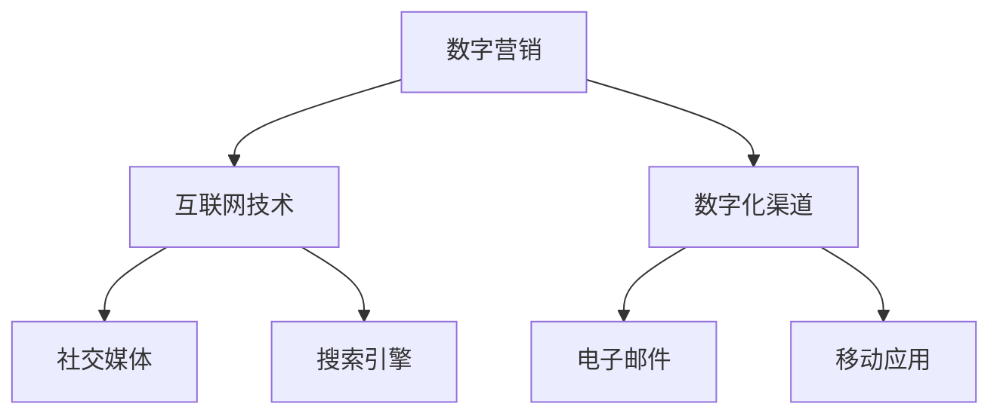

                 

### 第1章：数字营销概述

#### 1.1 数字营销的定义与重要性

数字营销（Digital Marketing）是指企业利用互联网和数字技术，通过在线渠道进行的营销活动。它涵盖了搜索引擎优化（SEO）、内容营销、社交媒体营销、电子邮件营销等多种形式。随着互联网的普及和技术的不断进步，数字营销已经成为企业获取客户、提升品牌知名度的重要手段。

**Mermaid 流程图：**

- **互联网技术**：包括Web技术、搜索引擎技术、社交媒体技术等。
- **数字化渠道**：如网站、博客、社交媒体平台、电子邮件等。
- **社交媒体**：如Facebook、Twitter、Instagram等。
- **搜索引擎**：如Google、Bing等。
- **电子邮件**：作为一种传统但依然有效的在线营销渠道。

数字营销的重要性体现在以下几个方面：

1. **覆盖范围广**：互联网已经深入到人们的日常生活，覆盖了全球各地的用户。
2. **精准定位**：通过数据分析，可以更精确地定位目标受众，提高营销效果。
3. **互动性强**：数字营销强调与用户的互动，可以通过各种方式收集用户反馈，及时调整营销策略。
4. **成本低**：相比传统营销渠道，数字营销的成本较低，尤其适合中小企业。

#### 1.2 数字营销与传统营销的区别

数字营销与传统营销在传播方式、互动性、成本效益等方面存在显著差异：

1. **传播方式**：
   - **数字营销**：依赖于互联网和数字技术，可以通过网站、社交媒体、电子邮件等渠道实时传播。
   - **传统营销**：主要依靠电视、报纸、广播等渠道，传播速度较慢，效果难以实时监控。

2. **互动性**：
   - **数字营销**：强调与用户的互动，可以通过社交媒体、在线聊天、用户评论等方式直接与用户沟通。
   - **传统营销**：多为单向传播，用户参与度低，难以形成互动。

3. **成本效益**：
   - **数字营销**：成本相对较低，可以根据实际效果进行实时调整。
   - **传统营销**：成本较高，调整难度大，效果往往滞后。

#### 1.3 数字营销的发展历程

数字营销的发展历程大致可以分为以下几个阶段：

1. **互联网兴起**：20世纪90年代，互联网开始普及，企业开始尝试在线营销。
2. **搜索引擎兴起**：2000年代，Google等搜索引擎崛起，SEO成为热门话题。
3. **社交媒体兴起**：2010年代，社交媒体平台如Facebook、Twitter等兴起，社交媒体营销成为主流。
4. **大数据与人工智能**：近年来，大数据和人工智能技术的发展，使得数字营销更加精准、个性化。

### 第2章：数字营销策略与目标

#### 2.1 制定数字营销策略

数字营销策略是指为实现营销目标而制定的计划和行动。制定策略时需要考虑以下几个方面：

1. **企业目标**：明确企业的发展目标，如提升品牌知名度、增加销售额等。
2. **目标受众**：分析目标受众的特征和需求，制定有针对性的营销策略。
3. **营销渠道**：选择适合的数字营销渠道，如SEO、社交媒体、电子邮件等。
4. **营销工具**：利用各种数字营销工具，如内容管理系统、营销自动化工具等。

制定数字营销策略的过程可以分为以下步骤：

1. **分析企业目标**：明确企业希望达到的具体目标，如提升网站流量、提高转化率、增加品牌知名度等。
2. **研究目标受众**：了解目标受众的年龄、性别、地域、兴趣爱好等信息，分析其行为习惯和需求。
3. **选择营销渠道**：根据目标受众的特点，选择适合的数字营销渠道，如SEO、社交媒体、电子邮件等。
4. **制定具体策略**：根据渠道特点，制定具体的营销策略，如撰写高质量内容、进行社交媒体推广、开展电子邮件营销等。
5. **制定预算和计划**：根据企业实际情况，制定营销预算和具体执行计划。

#### 2.2 设定数字营销目标

数字营销目标的设定应遵循SMART原则，即具体（Specific）、可衡量（Measurable）、可实现（Achievable）、相关性强（Relevant）、有时间限制（Time-bound）。

1. **具体**：明确目标，如提升网站流量、增加社交媒体粉丝数等。
2. **可衡量**：设定量化指标，如每月增加1000名新用户、降低客户获取成本等。
3. **可实现**：确保目标具有可行性，结合企业资源和市场环境进行合理设定。
4. **相关性强**：目标应与企业整体战略一致，有助于实现企业长期发展。
5. **有时间限制**：设定明确的时间期限，如半年、一年等。

例如，一个具体的数字营销目标可以是：“在2023年年底前，通过SEO和社交媒体营销，将网站流量提高30%。”

#### 2.3 制定营销预算

营销预算的制定是数字营销策略的重要组成部分。合理的预算分配可以提高营销效果，确保资源的有效利用。

1. **确定预算范围**：根据企业财务状况和市场环境，确定营销预算的范围。
2. **分配预算**：根据不同营销渠道的特点和目标受众的需求，合理分配预算。
   - **SEO**：优化网站结构和内容，提高搜索引擎排名，吸引更多潜在客户。
   - **社交媒体**：在社交媒体平台进行广告投放和内容推广，提高品牌知名度和用户参与度。
   - **电子邮件**：通过定期发送电子邮件，与客户保持联系，提高客户忠诚度。
3. **监控预算执行**：定期监控预算执行情况，根据实际效果进行调整。

制定营销预算的步骤如下：

1. **分析历史数据**：参考过去的市场营销活动数据，了解各项渠道的投入产出比。
2. **设定预算比例**：根据市场趋势和企业战略，设定各个营销渠道的预算比例。
3. **制定预算计划**：将预算具体分配到每个月或每个季度，确保预算的合理利用。
4. **监控和调整**：定期检查预算执行情况，根据市场变化和实际效果进行预算调整。

通过以上步骤，企业可以制定出合理的数字营销策略和目标，为实现营销目标奠定坚实基础。在接下来的章节中，我们将进一步探讨数字营销的具体策略和工具，帮助企业更好地实施数字营销活动。接下来，我们将深入了解数字营销中的目标受众分析与定位。

