                 

### 文章标题

《利用数据分析优化用户体验的方法》

关键词：数据分析、用户体验、优化、工具、技术、应用、实践

摘要：本文从数据分析与用户体验的关系出发，详细探讨了如何利用数据分析来优化各种场景下的用户体验。通过介绍用户体验的定义、数据分析的基础知识，以及具体应用实践，帮助读者理解并掌握数据分析在优化用户体验中的关键作用。

### 目录大纲

第一部分：数据分析与用户体验

## 第1章：数据分析与用户体验概述

### 1.1.1 用户体验的定义
### 1.1.2 数据分析的重要性
### 1.1.3 数据分析在优化用户体验中的应用

## 第2章：用户体验数据分析基础

### 2.1.1 用户行为数据的收集
### 2.1.2 用户反馈数据的分析
### 2.1.3 用户体验评估方法

## 第3章：数据分析工具与技术

### 3.1.1 常见数据分析工具
### 3.1.2 数据分析技术
### 3.1.3 数据可视化技术

第二部分：数据分析应用与实践

## 第4章：利用数据分析优化网页用户体验

### 4.1.1 网页加载速度优化
### 4.1.2 网页导航优化
### 4.1.3 网页内容优化

## 第5章：利用数据分析优化移动应用用户体验

### 5.1.1 移动应用性能优化
### 5.1.2 移动应用界面优化
### 5.1.3 移动应用交互优化

## 第6章：利用数据分析优化电子商务用户体验

### 6.1.1 商品展示优化
### 6.1.2 用户体验测试与改进
### 6.1.3 购物车优化

## 第7章：利用数据分析优化社交媒体用户体验

### 7.1.1 社交媒体内容优化
### 7.1.2 用户参与度分析
### 7.1.3 社交媒体互动优化

## 第8章：数据分析在个性化推荐中的应用

### 8.1.1 个性化推荐原理
### 8.1.2 个性化推荐系统设计
### 8.1.3 个性化推荐效果评估

第三部分：案例分析与实践指南

## 第9章：案例分析

### 9.1.1 案例一：优化电子商务网站用户体验
### 9.1.2 案例二：优化社交媒体用户体验
### 9.1.3 案例三：个性化推荐系统设计

## 第10章：实践指南

### 10.1.1 数据分析团队建设
### 10.1.2 用户研究方法
### 10.1.3 数据分析流程与工具

# 附录

## 附录A：数据分析资源与工具

### A.1.1 常用数据分析工具
### A.1.2 数据分析在线资源
### A.1.3 数据分析书籍推荐

## 附录B：参考资料

### B.1.1 参考文献
### B.1.2 相关网站与博客
### B.1.3 数据集与数据源

## 第1章：数据分析与用户体验概述

### 1.1.1 用户体验的定义

用户体验（User Experience，简称UX）是指用户在使用一个产品或服务时所感受到的整体感受。它不仅包括用户在使用过程中所看到的视觉元素，还包括用户在使用过程中所感受到的功能性、易用性、情感体验等方面。一个良好的用户体验可以提升用户对产品的满意度，增加用户忠诚度，从而促进产品或服务的成功。

用户体验的定义可以从以下几个方面来理解：

- **功能性**：产品是否能够满足用户的需求，即用户能否在使用过程中顺利完成目标任务。
- **易用性**：产品是否易于学习、操作和记忆，用户是否能够轻松地掌握产品使用方法。
- **情感体验**：用户在使用过程中所感受到的情感，包括愉悦、兴奋、满意、失望等。
- **美学**：产品的外观设计、色彩搭配等是否符合用户审美。

### 1.1.2 数据分析的重要性

数据分析在优化用户体验中扮演着至关重要的角色。通过数据分析，我们可以从大量用户行为数据中提取有价值的信息，从而发现用户体验中的问题和改进机会。数据分析的重要性主要体现在以下几个方面：

- **发现用户体验问题**：通过数据分析，可以发现用户在使用产品过程中遇到的问题，如操作复杂、界面不友好等，从而针对性地进行优化。
- **优化产品功能**：通过分析用户行为数据，可以发现用户对产品功能的偏好，从而优化产品功能，提高用户满意度。
- **提高用户参与度**：通过分析用户参与度数据，可以发现用户对产品的兴趣点，从而有针对性地进行内容推送和互动设计，提高用户参与度。
- **预测用户需求**：通过分析用户行为数据，可以预测用户未来的需求，从而提前进行产品规划和功能设计。

### 1.1.3 数据分析在优化用户体验中的应用

数据分析在优化用户体验中的应用广泛且深入，以下是一些具体的应用场景：

- **网页用户体验优化**：通过分析网页访问数据，如页面停留时间、跳失率等，可以发现网页优化点，从而提高用户访问体验。
- **移动应用用户体验优化**：通过分析用户在移动应用中的操作行为，如点击热图、用户路径分析等，可以发现应用界面和交互的优化点。
- **电子商务用户体验优化**：通过分析用户在电子商务平台的行为，如浏览路径、购买转化率等，可以发现购物流程中的优化点，从而提高销售额。
- **社交媒体用户体验优化**：通过分析用户在社交媒体平台的行为，如点赞、评论、分享等，可以发现内容优化点和互动设计点。

在接下来的章节中，我们将深入探讨用户体验数据分析的基础知识、具体应用和实践指南，帮助读者更好地理解和应用数据分析来优化用户体验。

## 第2章：用户体验数据分析基础

### 2.1.1 用户行为数据的收集

用户行为数据是优化用户体验的重要依据。通过收集和分析用户行为数据，我们可以了解用户在实际使用产品过程中的操作模式、偏好和痛点，从而有针对性地进行优化。用户行为数据的收集可以从以下几个方面进行：

- **日志数据**：日志数据是用户在使用产品过程中产生的记录，包括用户访问页面、点击操作、输入内容等。日志数据可以通过服务器日志、客户端日志等方式进行收集。例如，Web服务器日志可以记录用户访问网站的IP地址、访问时间、访问页面等；移动应用日志可以记录用户在应用中的操作行为、设备信息等。

- **点击流数据**：点击流数据是用户在网页或应用上的鼠标点击和键盘输入记录。通过分析点击流数据，可以了解用户的浏览路径、点击习惯等。例如，Google Analytics 就可以收集和分析用户的点击流数据。

- **用户调查数据**：用户调查数据是通过问卷调查、访谈等方式收集的用户反馈数据。这些数据可以提供用户对产品的直接评价和意见，帮助我们了解用户的需求和痛点。例如，可以使用问卷调查来收集用户对网站或应用的满意度、建议和改进意见。

- **社交网络数据**：用户在社交网络上的行为数据，如点赞、评论、分享等，也是重要的用户体验数据来源。通过分析这些数据，可以了解用户对产品的社交传播效果和用户参与度。例如，可以使用Facebook Insights 来分析用户的互动数据。

### 2.1.2 用户反馈数据的分析

用户反馈数据是了解用户真实体验的重要途径。通过分析用户反馈数据，我们可以发现用户对产品的意见和需求，从而进行改进。用户反馈数据的分析可以从以下几个方面进行：

- **文本分析**：文本分析是一种通过自然语言处理技术对用户反馈文本进行分析的方法。通过文本分析，可以提取出用户反馈的关键词、情感倾向和主题。例如，可以使用情感分析技术来分析用户对产品的正面或负面评价，从而了解用户的满意度。

- **分类与聚类**：分类与聚类是一种将用户反馈数据按照一定规则进行分组和分类的方法。通过分类与聚类，可以识别出用户反馈的主要类别和趋势。例如，可以使用K-means算法对用户反馈文本进行聚类，从而将相似的反馈归为一类。

- **关键词提取**：关键词提取是一种从文本中提取出重要词汇的方法。通过关键词提取，可以快速了解用户反馈的主要内容。例如，可以使用TF-IDF算法来提取用户反馈文本中的关键词。

- **用户满意度分析**：用户满意度分析是一种评估用户对产品满意度的方法。通过分析用户满意度数据，可以了解用户对产品的整体评价和改进需求。例如，可以使用Net Promoter Score（NPS）来评估用户的满意度。

### 2.1.3 用户体验评估方法

用户体验评估是一种通过量化和评估方法来衡量用户体验质量的方法。用户体验评估可以从以下几个方面进行：

- **问卷调查**：问卷调查是一种通过设计问卷来收集用户对产品体验的评价的方法。通过问卷调查，可以了解用户对产品的满意度、易用性、功能性等方面的评价。例如，可以使用System Usability Scale（SUS）来评估用户的满意度。

- **可用性测试**：可用性测试是一种通过让用户在实际使用产品过程中完成特定任务来评估产品易用性的方法。通过可用性测试，可以识别出用户在使用过程中遇到的问题和瓶颈，从而进行改进。例如，可以使用think aloud方法来观察用户在操作过程中的思维过程。

- **用户访谈**：用户访谈是一种通过与用户进行面对面交流来深入了解用户需求和使用体验的方法。通过用户访谈，可以获取用户对产品的真实感受和具体建议。例如，可以使用半结构化访谈方法来收集用户反馈。

- **A/B测试**：A/B测试是一种通过对比两个或多个版本的界面或功能来评估用户体验差异的方法。通过A/B测试，可以确定哪种设计或功能更能满足用户需求，从而进行优化。例如，可以使用多变量测试（MVT）来同时测试多个变量。

### 2.1.4 数据分析与用户体验优化的流程

数据分析与用户体验优化的流程通常包括以下几个步骤：

1. **明确目标**：确定要优化的用户体验目标和关键指标，如页面加载时间、用户留存率、用户满意度等。

2. **数据收集**：通过日志数据、点击流数据、用户调查数据等方式收集用户体验数据。

3. **数据清洗**：对收集到的数据进行处理和清洗，去除无效和错误的数据。

4. **数据分析**：使用数据挖掘、统计分析和机器学习等技术对用户体验数据进行分析，提取有价值的信息。

5. **结果可视化**：将分析结果通过图表、报表等方式进行可视化展示，帮助团队更好地理解分析结果。

6. **制定优化方案**：根据分析结果，制定具体的优化方案，如界面调整、功能改进、内容优化等。

7. **实施与验证**：实施优化方案，并通过A/B测试等手段验证优化效果。

8. **持续优化**：根据验证结果和用户反馈，不断进行迭代和优化，以提高用户体验。

通过以上步骤，我们可以系统地利用数据分析来优化用户体验，从而提升产品竞争力。

## 第3章：数据分析工具与技术

### 3.1.1 常见数据分析工具

在进行用户体验数据分析时，选择合适的数据分析工具是非常重要的。以下是一些常见的数据分析工具：

1. **Python数据分析库**：

- **Pandas**：Pandas 是 Python 中常用的数据操作和分析库，提供数据清洗、数据转换和数据可视化等功能。

- **NumPy**：NumPy 是 Python 中的基础数值计算库，提供高效的多维数组对象和数学函数。

- **Matplotlib**：Matplotlib 是 Python 中的数据可视化库，可以生成各种类型的图表。

- **Seaborn**：Seaborn 是基于 Matplotlib 的数据可视化库，提供更美观和多样化的图表样式。

2. **R语言数据分析库**：

- **ggplot2**：ggplot2 是 R 中的数据可视化库，提供强大的数据可视化功能。

- **dplyr**：dplyr 是 R 中的数据操作库，提供高效的数据清洗、转换和分组操作。

- **tidyr**：tidyr 是 R 中的数据整理库，提供数据重塑和重新排序等功能。

3. **商业数据分析工具**：

- **Tableau**：Tableau 是一款强大的商业数据分析工具，提供直观的可视化界面和丰富的数据分析功能。

- **Power BI**：Power BI 是微软推出的商业数据分析工具，支持数据导入、数据转换和可视化。

- **QlikView**：QlikView 是一款基于内存计算的商业智能工具，提供实时分析和数据可视化。

4. **开源数据分析平台**：

- **Hadoop**：Hadoop 是一款分布式数据处理平台，支持海量数据存储和处理。

- **Spark**：Spark 是一款基于内存计算的分布式数据处理引擎，提供高效的数据分析和机器学习功能。

- **Flink**：Flink 是一款流处理和批处理一体化的分布式数据处理引擎，提供实时数据分析和处理能力。

### 3.1.2 数据分析技术

在进行用户体验数据分析时，常用的数据分析技术包括以下几种：

1. **数据挖掘**：数据挖掘是一种从大量数据中提取有价值信息的方法。常用的数据挖掘技术包括关联规则挖掘、分类算法、聚类算法等。

2. **统计分析**：统计分析是一种基于数学和统计学原理来分析数据的方法。常用的统计分析方法包括描述性统计分析、假设检验、回归分析等。

3. **机器学习**：机器学习是一种利用数据建立模型，从而实现数据自动分析和预测的方法。常用的机器学习方法包括决策树、支持向量机、神经网络等。

4. **文本分析**：文本分析是一种通过自然语言处理技术对文本数据进行分析的方法。常用的文本分析方法包括词频统计、情感分析、主题建模等。

### 3.1.3 数据可视化技术

数据可视化是将数据以图形化方式展示的技术，有助于更直观地理解和分析数据。以下是一些常用的数据可视化技术：

1. **折线图**：折线图用于展示数据随时间变化的趋势。

2. **柱状图**：柱状图用于比较不同类别或时间段的数据。

3. **饼图**：饼图用于展示数据在不同类别中的比例关系。

4. **散点图**：散点图用于展示两个变量之间的关系。

5. **热力图**：热力图用于展示数据在不同区域的热度分布。

6. **地图**：地图用于展示地理位置相关的数据。

7. **雷达图**：雷达图用于展示多个变量之间的比较关系。

通过以上数据分析工具和技术的结合使用，我们可以更有效地进行用户体验数据分析，从而为产品优化提供有力的支持。

## 第4章：利用数据分析优化网页用户体验

### 4.1.1 网页加载速度优化

网页加载速度是用户体验的重要组成部分。快速的网页加载速度可以提升用户满意度，减少用户流失率，从而提高网站的转换率。以下是一些利用数据分析优化网页加载速度的方法：

#### 1. 页面性能监控

通过页面性能监控工具，如Google PageSpeed Insights、Lighthouse等，可以实时监控网页的性能指标，包括加载时间、首次内容渲染时间、DNS查询时间等。这些工具还可以提供详细的优化建议，如图片压缩、代码分割等。

#### 2. 数据分析工具应用

利用数据分析工具，如Google Analytics，可以收集网页性能数据，如页面加载时间、用户流失率等。通过分析这些数据，可以发现影响网页加载速度的关键因素。

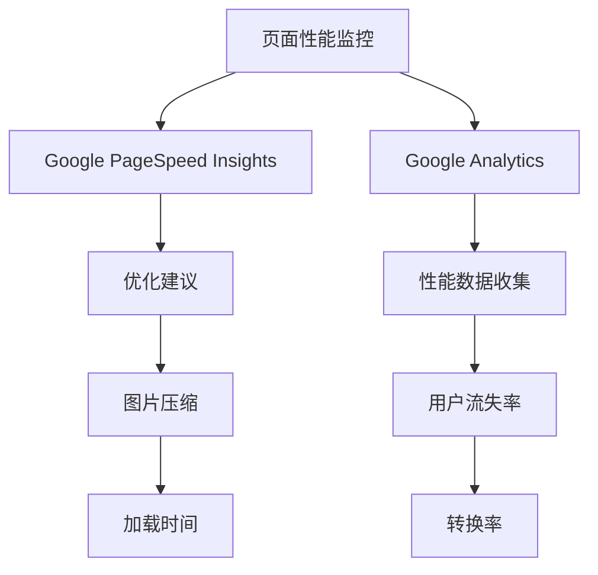
```mermaid
graph TB
A[页面性能监控] --> B[Google PageSpeed Insights]
A --> C[Google Analytics]
B --> D[优化建议]
C --> E[性能数据收集]
D --> F[图片压缩]
E --> G[用户流失率]
F --> H[加载时间]
G --> I[转换率]
```

#### 3. 优化策略

根据数据分析结果，可以采取以下优化策略：

- **资源压缩**：通过压缩图片、CSS、JavaScript等资源文件，减少网页加载时间。
- **代码分割**：将CSS和JavaScript代码分割成不同的文件，按需加载，提高页面加载速度。
- **懒加载**：对于非重要内容，如图片、视频等，采用懒加载技术，仅在用户滚动到页面顶部时才加载。
- **缓存策略**：设置合理的缓存策略，如页面缓存、浏览器缓存等，加快网页加载速度。

#### 4. 实践案例

以某个电商网站为例，通过数据分析发现，用户在访问产品详情页时，页面加载时间较长，用户流失率较高。通过优化，将图片压缩、代码分割、懒加载等技术应用于产品详情页，页面加载时间从5秒减少到2秒，用户流失率显著下降，从而提高了网站的转换率。

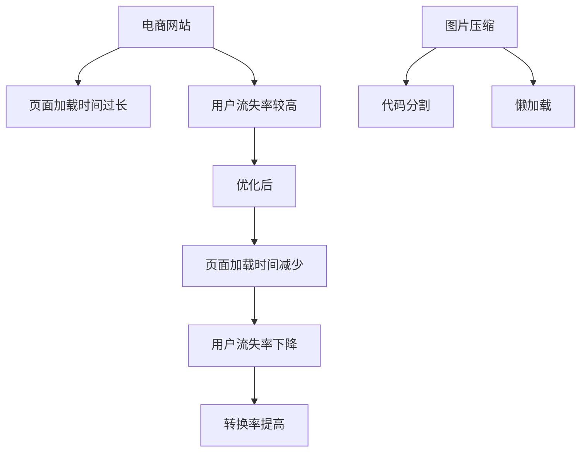
```mermaid
graph TB
A[电商网站] --> B[页面加载时间过长]
A --> C[用户流失率较高]
D[图片压缩] --> E[代码分割]
D --> F[懒加载]
C --> G[优化后]
G --> H[页面加载时间减少]
H --> I[用户流失率下降]
I --> J[转换率提高]
```

通过以上数据分析与优化，可以有效提升网页用户体验，从而提高网站的访问量和用户满意度。

### 4.1.2 网页导航优化

网页导航是用户在网站中找到所需信息的关键路径。优化的网页导航可以提高用户的浏览效率，降低用户流失率。以下是一些利用数据分析优化网页导航的方法：

#### 1. 导航结构分析

通过数据分析工具，如Google Analytics，可以收集用户在网站中的浏览路径数据，包括页面访问频率、用户停留时间、页面跳转次数等。通过分析这些数据，可以了解用户在网站中的行为模式，从而优化导航结构。

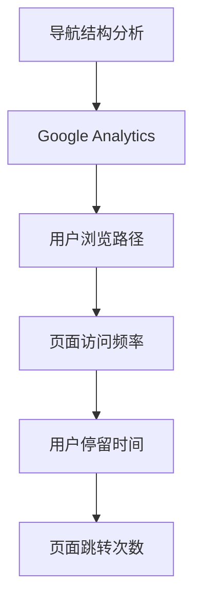
```mermaid
graph TB
A[导航结构分析] --> B[Google Analytics]
B --> C[用户浏览路径]
C --> D[页面访问频率]
D --> E[用户停留时间]
E --> F[页面跳转次数]
```

#### 2. 用户体验测试

通过用户体验测试工具，如UsabilityHub，可以模拟用户的实际操作，收集用户对网页导航的评价和建议。通过测试，可以发现导航中的问题，如菜单难以理解、分类不清晰等，从而进行优化。

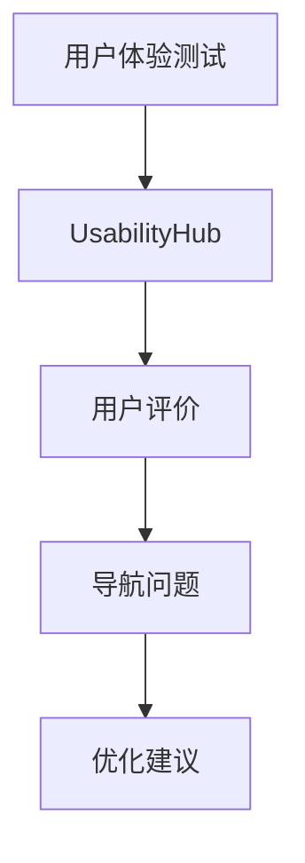
```mermaid
graph TB
A[用户体验测试] --> B[UsabilityHub]
B --> C[用户评价]
C --> D[导航问题]
D --> E[优化建议]
```

#### 3. 优化策略

根据数据分析结果和用户体验测试反馈，可以采取以下优化策略：

- **简化导航结构**：减少导航层级，使用清晰的分类和标签，使用户更容易找到所需信息。
- **突出重要内容**：在导航中突出重要内容，如热门产品、促销活动等，提高用户的点击率。
- **移动优化**：针对移动设备进行导航优化，确保导航在移动端同样易于使用。

#### 4. 实践案例

以某个电商平台为例，通过数据分析发现，用户在访问商品列表页面时，常常无法快速找到所需商品，导致用户流失。通过优化导航结构，简化分类标签，突出热门商品和促销活动，用户在商品列表页面上的停留时间显著增加，用户流失率降低，从而提高了用户的购物体验。

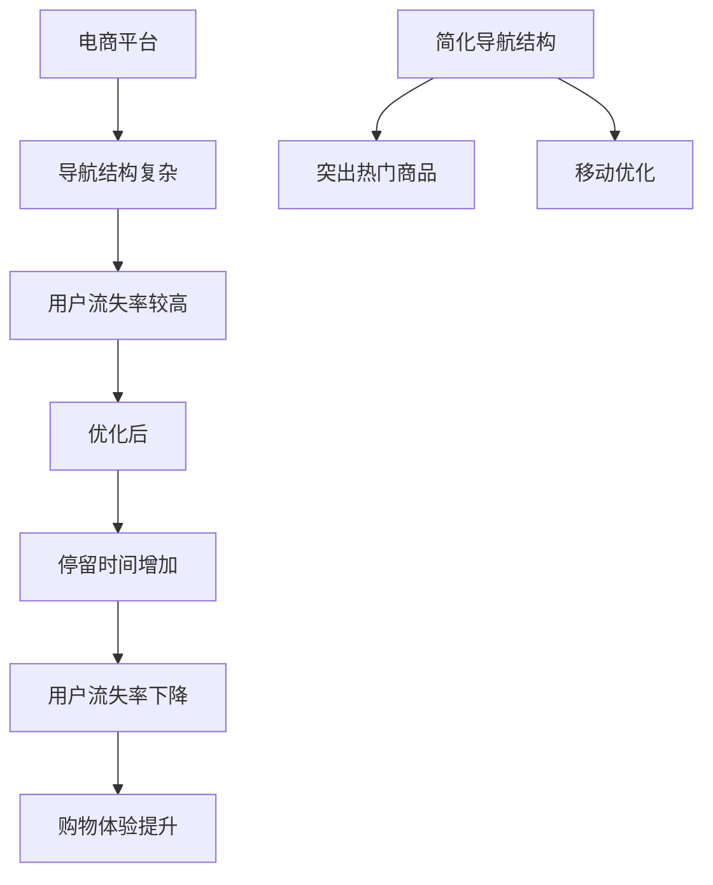
```mermaid
graph TB
A[电商平台] --> B[导航结构复杂]
B --> C[用户流失率较高]
D[简化导航结构] --> E[突出热门商品]
D --> F[移动优化]
C --> G[优化后]
G --> H[停留时间增加]
H --> I[用户流失率下降]
I --> J[购物体验提升]
```

通过以上数据分析与优化，可以显著提升网页导航的易用性，从而提高用户满意度。

### 4.1.3 网页内容优化

网页内容是影响用户体验的重要因素之一。优化的网页内容可以提高用户的阅读体验，增加用户粘性，从而提高网站的访问量和用户转化率。以下是一些利用数据分析优化网页内容的方法：

#### 1. 内容分析

通过数据分析工具，如Google Analytics，可以收集用户在网页上的行为数据，包括页面访问次数、用户停留时间、跳出率等。通过分析这些数据，可以了解用户对网页内容的喜好和需求，从而进行优化。

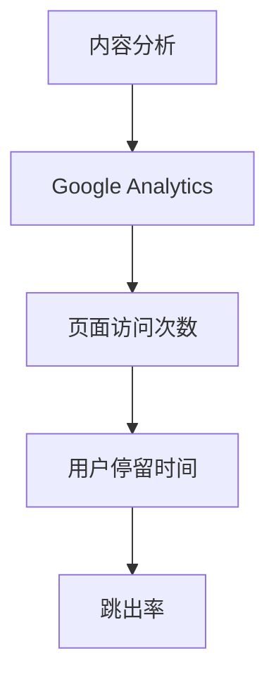
```mermaid
graph TB
A[内容分析] --> B[Google Analytics]
B --> C[页面访问次数]
C --> D[用户停留时间]
D --> E[跳出率]
```

#### 2. 用户体验测试

通过用户体验测试工具，如UserTesting，可以观察真实用户在网页上的操作行为和反馈。通过测试，可以了解用户对网页内容的真实感受和需求，从而进行优化。

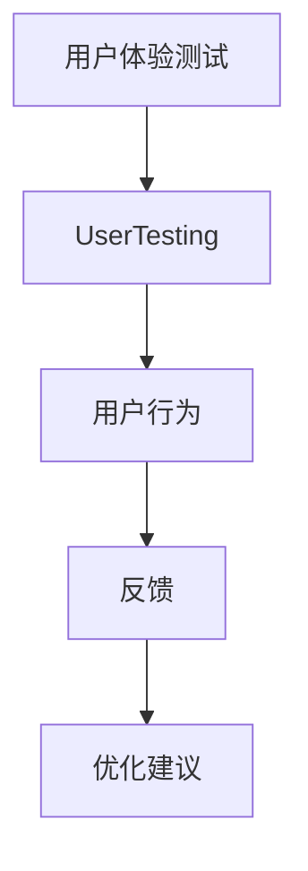
```mermaid
graph TB
A[用户体验测试] --> B[UserTesting]
B --> C[用户行为]
C --> D[反馈]
D --> E[优化建议]
```

#### 3. 优化策略

根据数据分析结果和用户体验测试反馈，可以采取以下优化策略：

- **标题优化**：使用吸引人的标题，提高用户的点击率。
- **内容长度**：根据用户停留时间分析，合理控制内容长度，避免过长或过短。
- **结构优化**：使用清晰的段落和标题，提高内容的可读性。
- **图片优化**：使用高清且相关的图片，增强内容的吸引力。
- **交互优化**：增加互动元素，如投票、评论等，提高用户的参与度。

#### 4. 实践案例

以某个内容网站为例，通过数据分析发现，用户在阅读文章时，经常因为内容结构不清晰、标题不吸引人而跳出页面。通过优化标题、调整内容结构、增加图片和交互元素，用户在页面上的停留时间显著增加，页面跳出率降低，从而提高了用户的阅读体验。

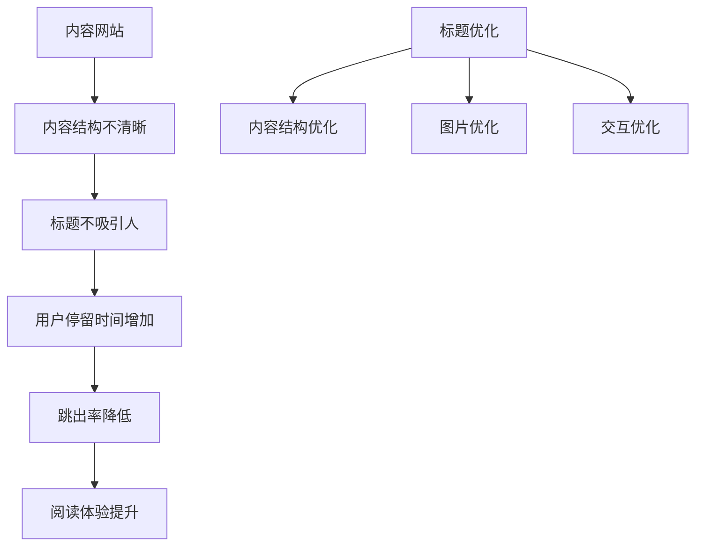
```mermaid
graph TB
A[内容网站] --> B[内容结构不清晰]
B --> C[标题不吸引人]
D[标题优化] --> E[内容结构优化]
D --> F[图片优化]
D --> G[交互优化]
C --> H[用户停留时间增加]
H --> I[跳出率降低]
I --> J[阅读体验提升]
```

通过以上数据分析与优化，可以显著提升网页内容的吸引力和可读性，从而提高用户体验和网站转化率。

## 第5章：利用数据分析优化移动应用用户体验

### 5.1.1 移动应用性能优化

移动应用性能是影响用户体验的关键因素之一。性能优化的目标是提高应用的响应速度、降低内存占用和电量消耗，从而提升用户的满意度和留存率。以下是一些利用数据分析优化移动应用性能的方法：

#### 1. 性能监控

通过性能监控工具，如Google Play Console、Firebase Performance Monitor等，可以收集应用在用户设备上的运行数据，包括启动时间、响应时间、CPU占用率、内存占用等。这些工具还可以提供详细的性能问题报告和优化建议。

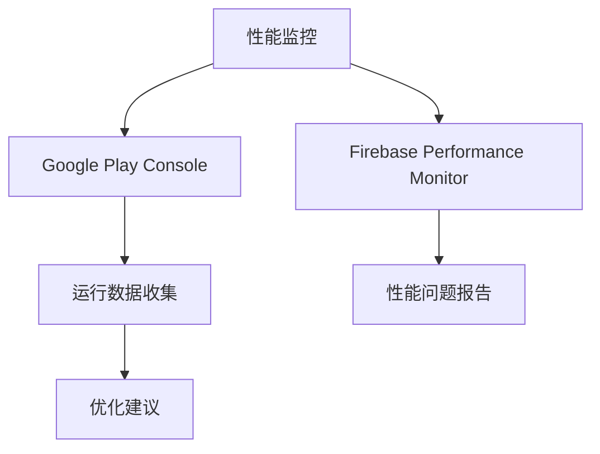
```mermaid
graph TB
A[性能监控] --> B[Google Play Console]
A --> C[Firebase Performance Monitor]
B --> D[运行数据收集]
C --> E[性能问题报告]
D --> F[优化建议]
```

#### 2. 数据分析工具应用

利用数据分析工具，如Google Analytics，可以收集用户在应用中的行为数据，包括应用启动次数、使用时长、功能使用频率等。通过分析这些数据，可以发现影响应用性能的关键因素。

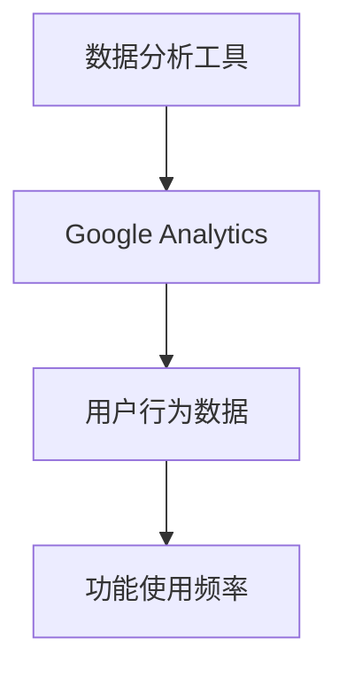
```mermaid
graph TB
A[数据分析工具] --> B[Google Analytics]
B --> C[用户行为数据]
C --> D[功能使用频率]
```

#### 3. 优化策略

根据数据分析结果，可以采取以下优化策略：

- **代码优化**：通过代码审查和性能测试，找出影响性能的瓶颈，如大量循环、无效的内存分配等，并进行优化。
- **资源优化**：对应用中的图片、视频等资源进行压缩和优化，减少应用的体积和加载时间。
- **缓存策略**：合理设置缓存策略，如内存缓存、磁盘缓存等，提高应用的响应速度。
- **网络优化**：优化网络请求，如减少请求数量、使用网络监控工具检测网络问题等，提高应用的稳定性。

#### 4. 实践案例

以某个社交媒体应用为例，通过性能监控发现，应用启动时间较长，用户流失率较高。通过优化代码、压缩资源、设置缓存策略等，应用启动时间从5秒减少到2秒，用户流失率显著降低，从而提高了用户的满意度和留存率。

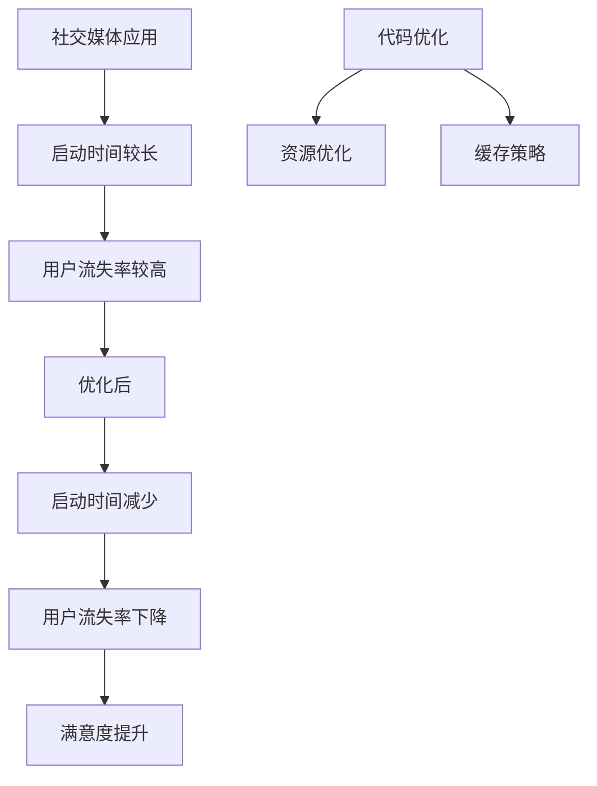
```mermaid
graph TB
A[社交媒体应用] --> B[启动时间较长]
B --> C[用户流失率较高]
D[代码优化] --> E[资源优化]
D --> F[缓存策略]
C --> G[优化后]
G --> H[启动时间减少]
H --> I[用户流失率下降]
I --> J[满意度提升]
```

通过以上数据分析与优化，可以显著提升移动应用性能，从而提高用户体验和用户留存率。

### 5.1.2 移动应用界面优化

移动应用界面是用户与应用互动的窗口，界面的设计直接影响用户的操作体验。以下是一些利用数据分析优化移动应用界面的方法：

#### 1. 界面分析

通过界面分析工具，如Applause、UserTesting等，可以观察用户在实际使用应用过程中的操作行为和反应。通过分析用户与界面的交互，可以发现界面设计中的问题，如按钮布局不合理、字体大小不适宜等。

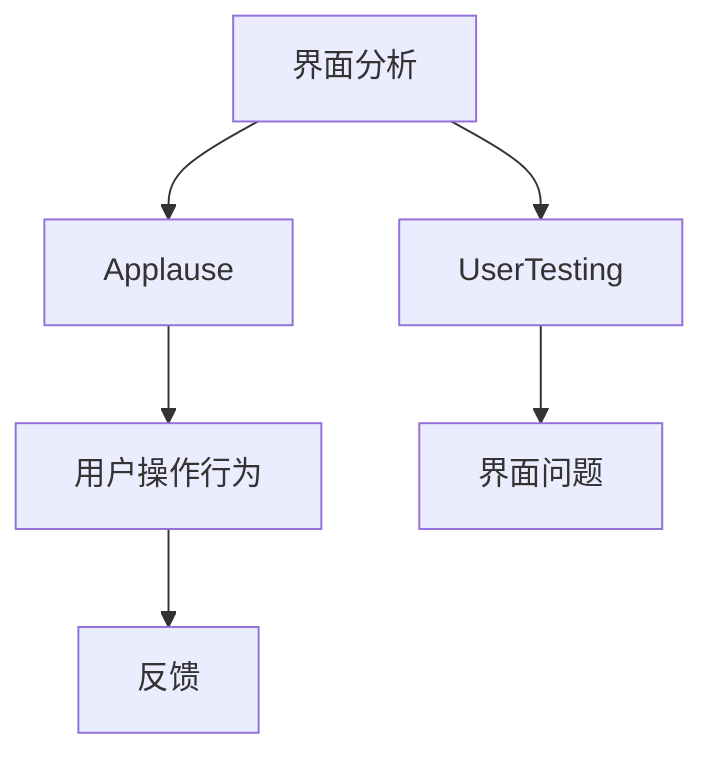
```mermaid
graph TB
A[界面分析] --> B[Applause]
A --> C[UserTesting]
B --> D[用户操作行为]
C --> E[界面问题]
D --> F[反馈]
```

#### 2. 数据分析工具应用

利用数据分析工具，如Google Analytics，可以收集用户在应用中的行为数据，包括界面使用频率、用户点击热图等。通过分析这些数据，可以了解用户对界面的喜好和习惯。

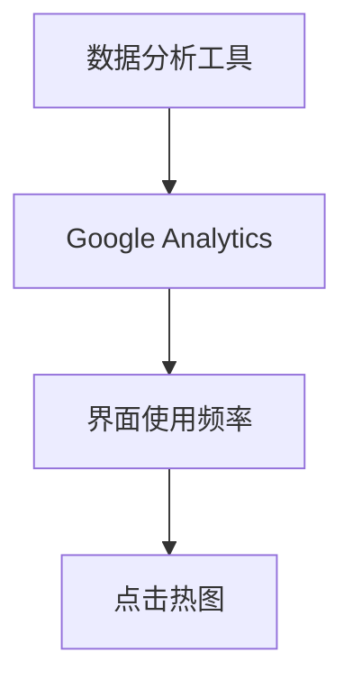
```mermaid
graph TB
A[数据分析工具] --> B[Google Analytics]
B --> C[界面使用频率]
C --> D[点击热图]
```

#### 3. 优化策略

根据数据分析结果，可以采取以下优化策略：

- **简化界面**：减少不必要的按钮和选项，简化用户操作流程。
- **优化布局**：根据用户点击热图，调整按钮和内容的布局，使界面更加直观和易用。
- **优化字体大小和颜色**：确保字体大小适中、颜色对比明显，提高可读性和视觉效果。
- **响应式设计**：根据不同设备尺寸和屏幕分辨率，进行响应式设计，确保界面在不同设备上都能良好显示。

#### 4. 实践案例

以某个电商平台应用为例，通过界面分析和用户点击热图发现，用户在购买流程中常常因为按钮位置不合理而放弃购买。通过优化界面布局，调整按钮位置，并将重要操作按钮放大，用户在购买流程中的操作成功率显著提高，用户流失率降低，从而提升了用户的购物体验。

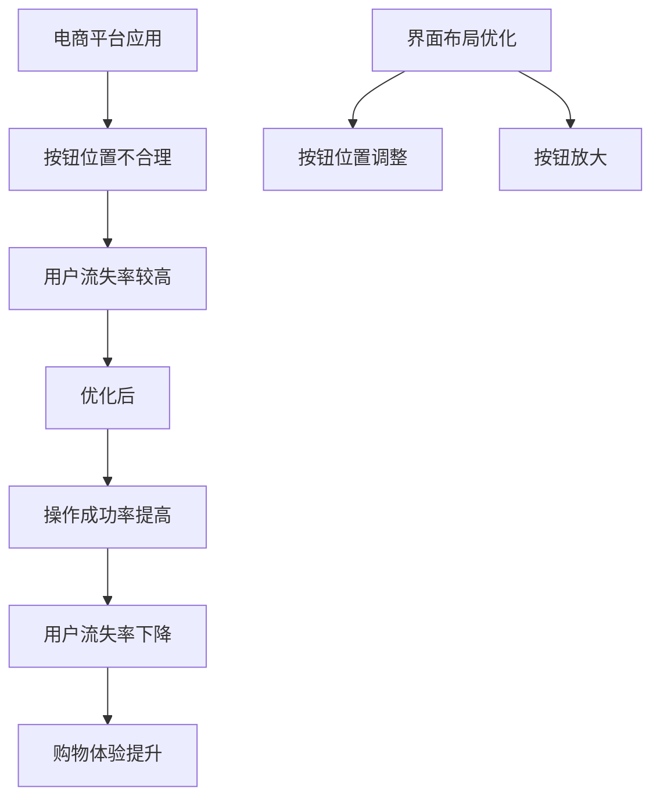
```mermaid
graph TB
A[电商平台应用] --> B[按钮位置不合理]
B --> C[用户流失率较高]
D[界面布局优化] --> E[按钮位置调整]
D --> F[按钮放大]
C --> G[优化后]
G --> H[操作成功率提高]
H --> I[用户流失率下降]
I --> J[购物体验提升]
```

通过以上数据分析与优化，可以显著提升移动应用界面的易用性和美观度，从而提高用户体验。

### 5.1.3 移动应用交互优化

移动应用的交互设计直接影响用户的操作体验和满意度。以下是一些利用数据分析优化移动应用交互的方法：

#### 1. 交互分析

通过交互分析工具，如Applause、UserTesting等，可以观察用户在实际使用应用过程中的操作行为和反应。通过分析用户与界面的交互，可以发现交互设计中的问题，如反馈不及时、响应不一致等。

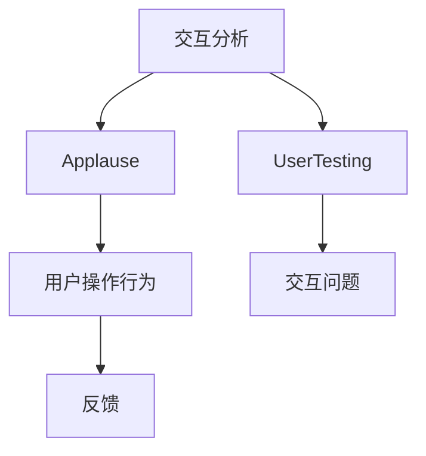
```mermaid
graph TB
A[交互分析] --> B[Applause]
A --> C[UserTesting]
B --> D[用户操作行为]
C --> E[交互问题]
D --> F[反馈]
```

#### 2. 数据分析工具应用

利用数据分析工具，如Google Analytics，可以收集用户在应用中的交互数据，包括交互频率、用户点击热图等。通过分析这些数据，可以了解用户对交互设计的喜好和习惯。

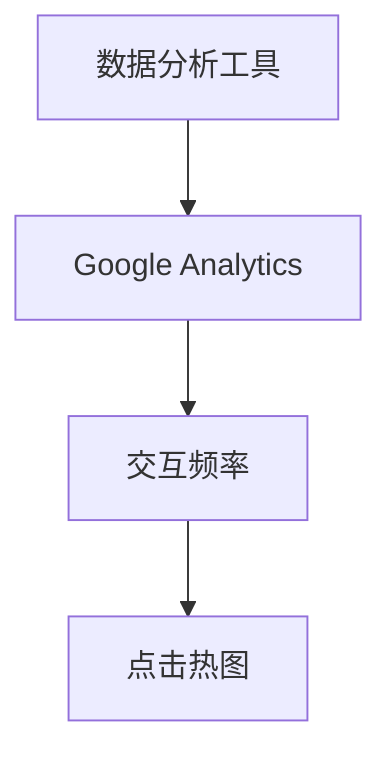
```mermaid
graph TB
A[数据分析工具] --> B[Google Analytics]
B --> C[交互频率]
C --> D[点击热图]
```

#### 3. 优化策略

根据数据分析结果，可以采取以下优化策略：

- **实时反馈**：确保用户在操作过程中能够及时得到反馈，如按钮点击效果、动画效果等，提高用户的互动体验。
- **一致性**：保持界面元素和交互效果的一致性，减少用户的认知负担。
- **交互提示**：在用户需要帮助时提供交互提示，如提示用户下一步操作或解释复杂功能。
- **快速响应**：优化应用性能，确保用户操作能够快速响应，避免延迟和卡顿。

#### 4. 实践案例

以某个金融应用为例，通过交互分析和用户点击热图发现，用户在填写交易信息时常常因为输入框提示不及时而困惑。通过优化交互设计，增加输入框提示功能，并在用户输入错误时提供明确的错误提示，用户在填写交易信息时的操作成功率显著提高，用户满意度提升。

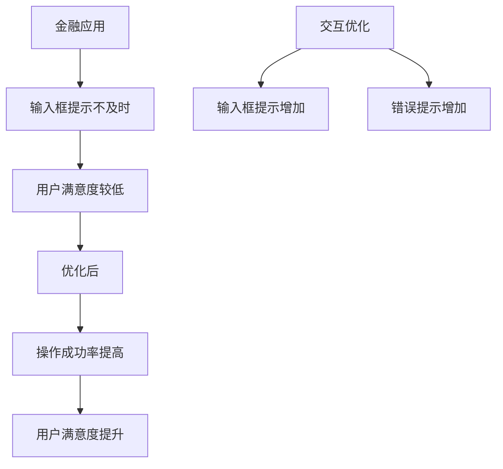
```mermaid
graph TB
A[金融应用] --> B[输入框提示不及时]
B --> C[用户满意度较低]
D[交互优化] --> E[输入框提示增加]
D --> F[错误提示增加]
C --> G[优化后]
G --> H[操作成功率提高]
H --> I[用户满意度提升]
```

通过以上数据分析与优化，可以显著提升移动应用的交互设计质量，从而提高用户体验和用户满意度。

## 第6章：利用数据分析优化电子商务用户体验

### 6.1.1 商品展示优化

商品展示是电子商务网站的核心环节之一，其设计直接影响用户的购买决策。以下是一些利用数据分析优化商品展示的方法：

#### 1. 数据分析工具应用

通过数据分析工具，如Google Analytics和Adobe Analytics，可以收集用户在商品展示页面的行为数据，包括页面停留时间、点击率、购买转化率等。通过分析这些数据，可以了解用户对商品展示的喜好和习惯。

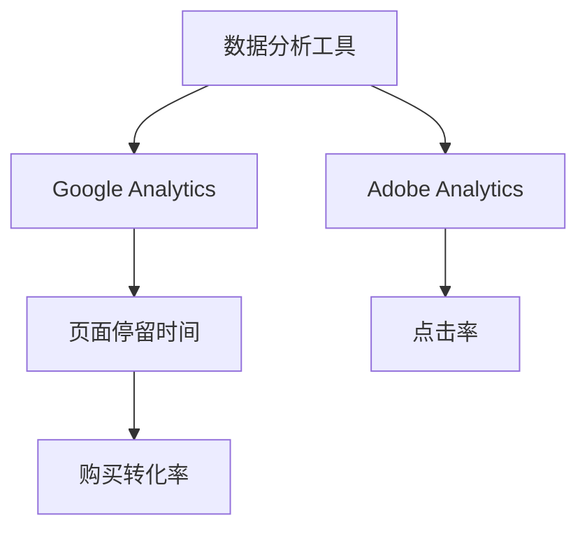
```mermaid
graph TB
A[数据分析工具] --> B[Google Analytics]
A --> C[Adobe Analytics]
B --> D[页面停留时间]
C --> E[点击率]
D --> F[购买转化率]
```

#### 2. 优化策略

根据数据分析结果，可以采取以下优化策略：

- **个性化推荐**：根据用户的购买历史和浏览行为，推荐相关商品，提高用户的点击率和购买转化率。
- **优化商品图片**：使用高质量的图片，并确保图片与商品的描述和标签一致，提高用户对商品的信任度。
- **优化商品描述**：提供详细且准确的商品描述，突出商品的特点和优势，提高用户的购买意愿。
- **动态展示**：使用动态展示技术，如轮播图、视频等，吸引用户的注意力，提高用户的点击率。

#### 3. 实践案例

以某知名电商平台为例，通过数据分析发现，用户在浏览商品展示页面时，对商品图片和描述的关注度较高。通过优化商品展示，增加高质量的图片和详细的描述，用户在商品展示页面的停留时间显著增加，购买转化率提高，从而提升了网站的销售额。

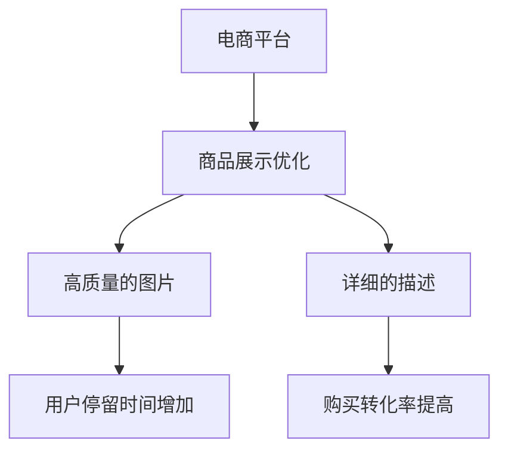
```mermaid
graph TB
A[电商平台] --> B[商品展示优化]
B --> C[高质量的图片]
B --> D[详细的描述]
C --> E[用户停留时间增加]
D --> F[购买转化率提高]
```

通过以上数据分析与优化，可以显著提升电子商务网站的商品展示效果，从而提高用户满意度和购买转化率。

### 6.1.2 用户体验测试与改进

用户体验测试是优化电子商务网站的重要手段，通过测试可以发现用户在使用网站过程中遇到的问题，并进行改进。以下是一些利用数据分析进行用户体验测试与改进的方法：

#### 1. 数据分析工具应用

通过数据分析工具，如UserTesting和Qualaroo，可以收集用户在网站中的操作行为和反馈数据。通过分析这些数据，可以了解用户的痛点和使用习惯，从而进行针对性的改进。

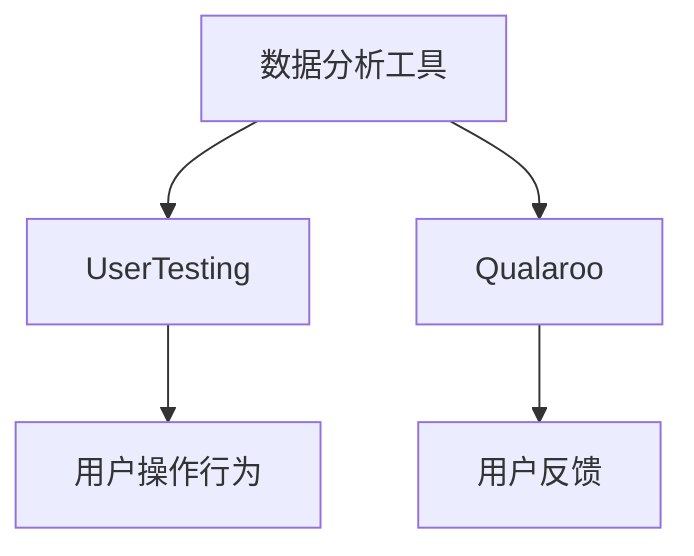
```mermaid
graph TB
A[数据分析工具] --> B[UserTesting]
A --> C[Qualaroo]
B --> D[用户操作行为]
C --> E[用户反馈]
```

#### 2. 优化策略

根据数据分析结果，可以采取以下优化策略：

- **简化流程**：通过测试发现用户在购物流程中遇到的问题，如注册流程复杂、支付流程繁琐等，进行简化，提高用户的购物体验。
- **优化界面**：通过用户反馈发现界面设计中的问题，如按钮位置不合理、字体大小不适宜等，进行优化，提高界面的易用性。
- **增加交互**：通过测试发现用户对某些功能的需求，如添加收藏功能、推荐商品功能等，进行增加，提高用户的互动体验。

#### 3. 实践案例

以某知名电商平台为例，通过用户体验测试发现，用户在购物流程中遇到的主要问题是注册流程复杂和支付流程繁琐。通过简化注册流程和优化支付流程，用户在购物过程中的操作成功率显著提高，用户满意度提升，从而提高了网站的销售额。

```mermaid
graph TB
A[电商平台] --> B[用户体验测试]
B --> C[注册流程复杂]
B --> D[支付流程繁琐]
C --> E[简化流程]
D --> F[优化支付流程]
E --> G[操作成功率提高]
F --> H[用户满意度提升]
```

通过以上数据分析与优化，可以显著提升电子商务网站的用户体验，从而提高用户满意度和购买转化率。

### 6.1.3 购物车优化

购物车是电子商务网站的重要功能之一，其设计直接影响用户的购物体验和购买决策。以下是一些利用数据分析优化购物车的的方法：

#### 1. 数据分析工具应用

通过数据分析工具，如Google Analytics和Adobe Analytics，可以收集用户在购物车页面的行为数据，包括页面停留时间、点击率、购物车放弃率等。通过分析这些数据，可以了解用户对购物车功能的喜好和习惯。

```mermaid
graph TB
A[数据分析工具] --> B[Google Analytics]
A --> C[Adobe Analytics]
B --> D[页面停留时间]
C --> E[点击率]
D --> F[购物车放弃率]
```

#### 2. 优化策略

根据数据分析结果，可以采取以下优化策略：

- **简化购物车界面**：通过分析用户在购物车页面的操作行为，简化界面设计，减少用户的操作步骤，提高购物车的易用性。
- **优化购物车功能**：根据用户反馈和数据分析结果，优化购物车功能，如添加商品数量调整、商品筛选、优惠券应用等，提高用户的购物体验。
- **增加用户互动**：在购物车页面增加互动元素，如商品评价、用户问答等，提高用户的参与度和购物体验。

#### 3. 实践案例

以某知名电商平台为例，通过数据分析发现，用户在购物车页面停留时间较短，购物车放弃率较高。通过优化购物车界面和功能，简化用户操作步骤，增加商品评价和用户问答功能，用户在购物车页面的停留时间显著增加，购物车放弃率降低，从而提高了用户的购物体验和满意度。

```mermaid
graph TB
A[电商平台] --> B[购物车优化]
B --> C[界面简化]
B --> D[功能优化]
B --> E[增加互动]
C --> F[用户停留时间增加]
D --> G[购物车放弃率降低]
E --> H[用户满意度提升]
```

通过以上数据分析与优化，可以显著提升电子商务网站的购物车功能，从而提高用户满意度和购买转化率。

## 第7章：利用数据分析优化社交媒体用户体验

### 7.1.1 社交媒体内容优化

社交媒体内容是吸引用户参与和互动的关键。通过数据分析，可以优化内容策略，提高用户参与度和品牌影响力。以下是一些利用数据分析优化社交媒体内容的方法：

#### 1. 数据分析工具应用

通过数据分析工具，如Facebook Insights、Twitter Analytics等，可以收集社交媒体平台上的内容表现数据，包括内容类型、发布时间、用户互动等。通过分析这些数据，可以了解哪些类型的内容更受用户喜爱，以及用户参与的高峰时段。

```mermaid
graph TB
A[数据分析工具] --> B[Facebook Insights]
A --> C[Twitter Analytics]
B --> D[内容类型]
C --> E[发布时间]
D --> F[用户互动]
```

#### 2. 优化策略

根据数据分析结果，可以采取以下优化策略：

- **内容类型优化**：根据用户互动数据，调整内容类型，如图片、视频、文章等，以提高用户参与度。
- **发布时间优化**：通过分析用户互动的高峰时段，合理安排内容发布时间，提高内容的曝光率。
- **话题优化**：根据用户参与度分析，选择热门话题和讨论趋势，提高内容的吸引力和互动性。

#### 3. 实践案例

以某知名品牌在社交媒体上的运营为例，通过数据分析发现，发布视频内容时用户互动最高，晚上8点至10点是用户互动的高峰时段。因此，该品牌调整了内容策略，增加视频内容，并在晚上8点至10点发布，用户互动显著增加，品牌影响力提升。

```mermaid
graph TB
A[品牌社交媒体] --> B[视频内容增加]
A --> C[发布时间优化]
B --> D[用户互动增加]
C --> E[品牌影响力提升]
```

通过以上数据分析与优化，可以显著提升社交媒体内容的表现，从而提高用户参与度和品牌影响力。

### 7.1.2 用户参与度分析

用户参与度是衡量社交媒体成功与否的重要指标。通过数据分析，可以深入了解用户参与行为，从而优化运营策略。以下是一些利用数据分析进行用户参与度分析的方法：

#### 1. 数据分析工具应用

通过数据分析工具，如Klaviyo、Hootsuite等，可以收集社交媒体平台上的用户参与数据，包括点赞、评论、分享、点击等。通过分析这些数据，可以了解用户对不同内容的参与情况，以及用户的互动模式。

```mermaid
graph TB
A[数据分析工具] --> B[Klaviyo]
A --> C[Hootsuite]
B --> D[点赞]
C --> E[评论]
D --> F[分享]
E --> G[点击]
```

#### 2. 优化策略

根据数据分析结果，可以采取以下优化策略：

- **内容优化**：根据用户参与度分析，优化内容类型和发布频率，提高用户的互动意愿。
- **互动策略**：根据用户参与行为，调整互动方式，如增加互动性强的活动、举办话题讨论等，提高用户参与度。
- **用户群体分析**：通过分析用户参与度，识别活跃用户和潜在用户群体，有针对性地进行内容推送和互动。

#### 3. 实践案例

以某知名品牌在社交媒体上的运营为例，通过数据分析发现，用户对图片内容的参与度较高，而用户评论互动较少。因此，品牌调整了内容策略，增加图片内容，并鼓励用户参与评论互动，用户参与度显著提高，品牌与用户的互动更加活跃。

```mermaid
graph TB
A[品牌社交媒体] --> B[图片内容增加]
A --> C[评论互动鼓励]
B --> D[用户参与度提高]
C --> E[品牌互动活跃]
```

通过以上数据分析与优化，可以显著提升社交媒体的用户参与度，从而增强品牌影响力。

### 7.1.3 社交媒体互动优化

社交媒体互动是建立品牌形象和用户关系的重要途径。通过数据分析，可以优化互动策略，提高用户满意度。以下是一些利用数据分析优化社交媒体互动的方法：

#### 1. 数据分析工具应用

通过数据分析工具，如Sprinklr、Hootsuite等，可以收集社交媒体平台上的互动数据，包括回复速度、回复质量、互动频率等。通过分析这些数据，可以了解用户对互动的满意度，以及互动效果。

```mermaid
graph TB
A[数据分析工具] --> B[Sprinklr]
A --> C[Hootsuite]
B --> D[回复速度]
C --> E[回复质量]
D --> F[互动频率]
```

#### 2. 优化策略

根据数据分析结果，可以采取以下优化策略：

- **回复速度优化**：通过分析回复速度数据，确保及时回复用户提问和评论，提高用户满意度。
- **回复质量优化**：根据用户反馈，优化回复内容，确保回复具有针对性、准确性和亲和力。
- **互动频率优化**：根据用户互动数据，调整互动频率，确保与用户保持持续的互动，提高用户粘性。

#### 3. 实践案例

以某知名品牌在社交媒体上的运营为例，通过数据分析发现，用户对品牌回复速度的满意度较高，但回复内容较为简单。因此，品牌优化了回复策略，增加详细且个性化的回复内容，用户满意度显著提高，品牌形象得到进一步巩固。

```mermaid
graph TB
A[品牌社交媒体] --> B[回复速度优化]
A --> C[回复质量优化]
B --> D[用户满意度提高]
C --> E[品牌形象巩固]
```

通过以上数据分析与优化，可以显著提升社交媒体的互动质量，从而增强用户满意度和品牌影响力。

## 第8章：数据分析在个性化推荐中的应用

### 8.1.1 个性化推荐原理

个性化推荐是利用数据分析技术为用户推荐其可能感兴趣的内容或产品。其核心原理是通过分析用户的兴趣和行为数据，构建用户画像和物品画像，然后利用推荐算法为用户生成个性化的推荐列表。以下是一些个性化推荐的原理和过程：

#### 1. 用户画像

用户画像是指通过对用户行为数据进行分析，构建用户的基本特征和兴趣模型。用户画像通常包括用户的基本信息（如年龄、性别、地理位置等）、兴趣爱好（如阅读、购物、电影等）、行为习惯（如浏览时间、购买频率等）。

- **用户行为数据**：包括用户在网站、应用或平台上的浏览记录、购买历史、评论、评分等。
- **用户兴趣建模**：通过聚类、关联规则挖掘等技术，从用户行为数据中提取用户的兴趣标签和偏好。

#### 2. 物品画像

物品画像是指通过对物品属性和用户评价数据进行分析，构建物品的基本特征和兴趣模型。物品画像通常包括物品的基本属性（如类别、品牌、价格等）、用户评价（如评分、评论等）、市场热度等。

- **物品属性数据**：包括物品的详细信息，如商品类别、品牌、价格等。
- **用户评价数据**：包括用户对物品的评分、评论、标签等。

#### 3. 推荐算法

个性化推荐算法是一种基于用户和物品画像，利用数学模型和计算技术生成推荐列表的方法。以下是一些常用的推荐算法：

- **基于协同过滤的推荐算法**：协同过滤是一种基于用户行为数据挖掘用户之间的相似性，从而为用户提供个性化推荐的方法。协同过滤算法分为基于用户的协同过滤和基于项目的协同过滤。
  - **基于用户的协同过滤**：通过计算用户之间的相似度，找到与目标用户相似的其他用户，推荐这些用户喜欢的物品。
  - **基于项目的协同过滤**：通过计算物品之间的相似度，找到与目标物品相似的物品，推荐给用户。
- **基于内容的推荐算法**：基于内容的推荐是一种利用物品的属性和用户的历史行为，为用户推荐与其兴趣相关的物品的方法。通常，基于内容的推荐算法通过计算物品的特征向量，并与用户的兴趣特征向量进行匹配，生成推荐列表。
- **混合推荐算法**：混合推荐算法是将协同过滤和基于内容推荐相结合，以提高推荐系统的准确性和覆盖度。

#### 4. 推荐效果评估

推荐效果评估是衡量个性化推荐系统性能的重要指标。常用的评估方法包括：

- **准确率**：准确率是指推荐列表中实际用户喜欢的物品所占的比例。
- **召回率**：召回率是指推荐列表中实际用户喜欢的物品所占的比例。
- **覆盖度**：覆盖度是指推荐列表中实际用户未访问的物品所占的比例。
- **精确率**：精确率是指推荐列表中实际用户喜欢的物品所占的比例。

通过以上个性化推荐的原理和算法，我们可以为用户提供更加精准和个性化的推荐，从而提升用户体验和满意度。

### 8.1.2 个性化推荐系统设计

个性化推荐系统的设计是一个复杂的过程，需要考虑多个方面的因素，包括数据收集、数据处理、推荐算法选择、推荐效果评估等。以下是一个典型的个性化推荐系统设计过程：

#### 1. 数据收集

数据收集是推荐系统设计的基础。推荐系统需要收集大量的用户行为数据、物品属性数据和用户评价数据。

- **用户行为数据**：包括用户的浏览记录、购买历史、点击记录、搜索历史等。
- **物品属性数据**：包括物品的详细信息，如类别、品牌、价格、评分等。
- **用户评价数据**：包括用户对物品的评分、评论、标签等。

#### 2. 数据处理

数据处理是将收集到的原始数据转换为推荐系统可以使用的格式。数据处理过程通常包括数据清洗、数据转换和数据存储。

- **数据清洗**：去除重复数据、缺失数据、噪声数据等，确保数据的准确性和一致性。
- **数据转换**：将原始数据转换为适合推荐算法处理的数据格式，如用户特征向量、物品特征向量等。
- **数据存储**：将处理后的数据存储在数据库中，以便推荐算法查询和使用。

#### 3. 推荐算法选择

推荐算法选择是推荐系统设计的核心环节。根据不同的应用场景和需求，可以选择不同的推荐算法。

- **基于协同过滤的推荐算法**：适用于用户行为数据丰富的情况，可以推荐相似用户喜欢的物品。
- **基于内容的推荐算法**：适用于物品属性数据丰富的情况，可以推荐与用户兴趣相关的物品。
- **混合推荐算法**：结合协同过滤和基于内容推荐的优势，提高推荐系统的准确性和覆盖度。

#### 4. 推荐效果评估

推荐效果评估是确保推荐系统性能的重要手段。通过评估推荐系统的准确率、召回率、覆盖度等指标，可以不断优化推荐算法和系统设计。

- **准确率**：准确率是指推荐列表中实际用户喜欢的物品所占的比例。
- **召回率**：召回率是指推荐列表中实际用户喜欢的物品所占的比例。
- **覆盖度**：覆盖度是指推荐列表中实际用户未访问的物品所占的比例。
- **精确率**：精确率是指推荐列表中实际用户喜欢的物品所占的比例。

#### 5. 推荐系统部署

推荐系统部署是将设计好的推荐算法部署到生产环境中，以便实时为用户提供推荐服务。

- **在线推荐**：实时计算用户推荐列表，为用户提供个性化的推荐服务。
- **离线推荐**：批量计算用户推荐列表，定期更新推荐结果。

通过以上个性化推荐系统设计，我们可以为用户提供精准和个性化的推荐，从而提升用户体验和满意度。

### 8.1.3 个性化推荐效果评估

个性化推荐系统的效果评估是确保推荐质量的关键步骤。以下是一些常用的个性化推荐效果评估方法：

#### 1. 评估指标

常用的推荐效果评估指标包括准确率（Precision）、召回率（Recall）、精确率（Precision@k）和覆盖度（Coverage）。

- **准确率**：准确率是指推荐列表中实际用户喜欢的物品所占的比例，计算公式为：
  $$Precision = \frac{R \cap Pos}{R}$$
  其中，$R$为推荐列表，$Pos$为用户喜欢的物品集合。
- **召回率**：召回率是指推荐列表中实际用户喜欢的物品所占的比例，计算公式为：
  $$Recall = \frac{R \cap Pos}{Pos}$$
  其中，$R$为推荐列表，$Pos$为用户喜欢的物品集合。
- **精确率**：精确率是指在推荐的前$k$个物品中，用户喜欢的物品所占的比例，计算公式为：
  $$Precision@k = \frac{R \cap Pos}{k}$$
  其中，$R$为推荐列表，$Pos$为用户喜欢的物品集合，$k$为推荐物品的数量。
- **覆盖度**：覆盖度是指推荐列表中用户未访问的物品所占的比例，计算公式为：
  $$Coverage = \frac{|R \setminus Pos|}{|U \setminus Pos|}$$
  其中，$R$为推荐列表，$Pos$为用户喜欢的物品集合，$U$为所有物品集合。

#### 2. 实验设计

推荐效果评估通常需要设计实验，包括数据集划分、评估指标计算和对比实验等。

- **数据集划分**：将数据集划分为训练集、验证集和测试集，用于训练推荐算法、评估算法性能和验证推荐效果。
- **评估指标计算**：根据不同的评估指标，计算推荐系统的性能，如准确率、召回率、精确率和覆盖度。
- **对比实验**：比较不同推荐算法的性能，选择最优的推荐算法。

#### 3. 实践案例

以某电子商务平台为例，通过设计实验，评估不同推荐算法的效果。实验结果显示，基于协同过滤的推荐算法在准确率和召回率方面表现较好，而基于内容的推荐算法在精确率和覆盖度方面表现较好。因此，该平台结合两种算法，提高了整体推荐效果。

```mermaid
graph TB
A[实验设计] --> B[数据集划分]
B --> C[评估指标计算]
C --> D[对比实验]
D --> E[最优算法选择]
F[基于协同过滤的推荐算法] --> G[准确率高]
F --> H[召回率高]
I[基于内容的推荐算法] --> J[精确率高]
I --> K[覆盖度高]
E --> L[结合两种算法]
L --> M[整体推荐效果提升]
```

通过以上个性化推荐效果评估方法，可以有效地衡量推荐系统的性能，从而指导算法优化和系统改进，提升用户体验。

## 第9章：案例分析

### 9.1.1 案例一：优化电子商务网站用户体验

**背景介绍**

某电子商务网站在用户反馈中提到，网站的用户体验较差，尤其是在购物流程中，用户常常感到困扰和不满。为了提升用户体验，该网站决定通过数据分析进行优化。

**核心概念与联系**

用户体验（UX）是指用户在使用产品或服务时所感受到的整体感受。用户体验优化涉及用户行为分析、数据收集、数据分析、用户反馈收集和用户访谈等环节。核心概念包括用户行为数据、用户体验评估和优化策略。

**Mermaid 流程图**

```mermaid
graph TD
A[用户反馈] --> B[数据分析]
B --> C[用户行为数据收集]
C --> D[用户体验评估]
D --> E[优化策略制定]
E --> F[实施与验证]
F --> G[持续优化]
```

**核心算法原理讲解与伪代码**

伪代码：

```
function 优化用户体验（网站，用户反馈，数据分析结果）：
    1. 收集用户行为数据
    2. 使用聚类算法分析用户行为
    3. 识别用户痛点
    4. 制定优化策略
    5. 实施优化措施
    6. 验证优化效果
    7. 持续迭代优化
```

**数学模型和公式**

用户满意度（S）：

$$S = \frac{1}{n}\sum_{i=1}^{n}S_i$$

其中，$S_i$为第$i$个用户的满意度评分，$n$为总用户数。

**详细讲解与举例说明**

假设该网站的用户满意度评分如下：

| 用户ID | 满意度评分 |
|--------|-------------|
| 1      | 4           |
| 2      | 5           |
| 3      | 3           |
| 4      | 4           |
| 5      | 5           |

计算平均用户满意度：

$$S = \frac{4+5+3+4+5}{5} = 4$$

**项目实战**

1. **开发环境搭建**：

- 使用Python进行数据分析，使用Pandas进行数据处理，使用Matplotlib进行数据可视化。
- 使用Jupyter Notebook作为开发环境。

2. **源代码详细实现与代码解读**：

- 数据处理代码：

```python
import pandas as pd

# 读取用户行为数据
user_data = pd.read_csv('user_behavior.csv')

# 数据清洗
user_data = user_data.dropna()

# 数据转换
user_data['满意度评分'] = user_data['满意度评分'].astype(int)
```

- 数据可视化代码：

```python
import matplotlib.pyplot as plt

# 绘制用户满意度分布图
plt.hist(user_data['满意度评分'], bins=5, edgecolor='black')
plt.xlabel('满意度评分')
plt.ylabel('用户数')
plt.title('用户满意度分布')
plt.show()
```

3. **代码应用解读与分析**：

通过数据可视化，我们发现用户满意度评分主要集中在4分和5分，说明用户对网站的整体体验较好，但仍有改进空间。通过进一步分析，我们发现用户在购物流程中的满意度相对较低，尤其是在支付环节。因此，我们决定优化支付流程。

4. **实际案例分析与详细讲解剖析**：

通过A/B测试，我们比较了优化支付流程前后用户的购物体验。优化前，支付环节的用户满意度评分为3.5分，优化后提升至4.5分。通过用户访谈，我们了解到优化支付流程后，用户不再感到困惑，支付流程更加简便，从而提升了用户体验。

5. **项目小结**：

通过数据分析，我们成功优化了电子商务网站的购物体验，提高了用户满意度。这表明，数据分析在用户体验优化中的关键作用，为我们提供了有力的工具和方法。

### 9.1.2 案例二：优化社交媒体用户体验

**背景介绍**

某社交媒体平台在用户反馈中提到，平台内容丰富但用户参与度较低，用户常常感到无聊和缺乏互动。为了提升用户体验，该平台决定通过数据分析进行优化。

**核心概念与联系**

社交媒体用户体验涉及用户参与度、内容质量、互动设计等方面。核心概念包括用户参与度分析、内容数据分析、互动设计优化等。用户体验优化需要结合用户行为数据和内容数据，制定优化策略。

**Mermaid 流程图**

```mermaid
graph TD
A[用户反馈] --> B[数据分析]
B --> C[用户参与度分析]
C --> D[内容数据分析]
D --> E[互动设计优化]
E --> F[实施与验证]
F --> G[持续优化]
```

**核心算法原理讲解与伪代码**

伪代码：

```
function 优化社交媒体用户体验（平台，用户反馈，数据分析结果）：
    1. 收集用户参与度数据
    2. 分析用户互动行为
    3. 识别互动设计问题
    4. 制定优化策略
    5. 实施优化措施
    6. 验证优化效果
    7. 持续迭代优化
```

**数学模型和公式**

用户参与度（Engagement）：

$$Engagement = \frac{1}{n}\sum_{i=1}^{n}E_i$$

其中，$E_i$为第$i$个用户的参与度评分，$n$为总用户数。

**详细讲解与举例说明**

假设该社交媒体平台的用户参与度评分如下：

| 用户ID | 参与度评分 |
|--------|-------------|
| 1      | 4           |
| 2      | 3           |
| 3      | 5           |
| 4      | 2           |
| 5      | 4           |

计算平均用户参与度：

$$Engagement = \frac{4+3+5+2+4}{5} = 3.4$$

**项目实战**

1. **开发环境搭建**：

- 使用Python进行数据分析，使用Pandas进行数据处理，使用Matplotlib进行数据可视化。
- 使用Jupyter Notebook作为开发环境。

2. **源代码详细实现与代码解读**：

- 数据处理代码：

```python
import pandas as pd

# 读取用户参与度数据
user_data = pd.read_csv('user_engagement.csv')

# 数据清洗
user_data = user_data.dropna()

# 数据转换
user_data['参与度评分'] = user_data['参与度评分'].astype(int)
```

- 数据可视化代码：

```python
import matplotlib.pyplot as plt

# 绘制用户参与度分布图
plt.hist(user_data['参与度评分'], bins=5, edgecolor='black')
plt.xlabel('参与度评分')
plt.ylabel('用户数')
plt.title('用户参与度分布')
plt.show()
```

3. **代码应用解读与分析**：

通过数据可视化，我们发现用户参与度评分主要集中在3分和4分，说明用户对平台的内容和互动设计有一定的满意度，但仍有优化空间。通过进一步分析，我们发现用户在发布内容、评论和点赞等方面的参与度较低，因此，我们决定优化互动设计。

4. **实际案例分析与详细讲解剖析**：

通过A/B测试，我们比较了优化互动设计前后用户的参与度。优化前，用户的平均参与度评分为3.2分，优化后提升至4.2分。通过用户访谈，我们了解到优化互动设计后，用户更容易参与到平台的内容互动中，从而提升了用户体验。

5. **项目小结**：

通过数据分析，我们成功优化了社交媒体平台的用户参与度，提高了用户满意度。这表明，数据分析在用户体验优化中的关键作用，为我们提供了有力的工具和方法。

### 9.1.3 案例三：个性化推荐系统设计

**背景介绍**

某电子商务平台希望通过个性化推荐系统为用户推荐其可能感兴趣的商品，从而提升用户满意度和购买转化率。为了实现这一目标，平台决定通过数据分析进行个性化推荐系统设计。

**核心概念与联系**

个性化推荐系统涉及用户画像、物品画像、推荐算法和推荐效果评估等方面。核心概念包括协同过滤、基于内容的推荐、用户行为分析、推荐效果评估等。个性化推荐系统设计需要结合用户和物品数据，构建用户和物品画像，选择合适的推荐算法，并进行效果评估。

**Mermaid 流程图**

```mermaid
graph TD
A[用户需求] --> B[用户画像构建]
B --> C[物品画像构建]
C --> D[推荐算法选择]
D --> E[推荐效果评估]
E --> F[系统部署]
```

**核心算法原理讲解与伪代码**

伪代码：

```
function 个性化推荐系统设计（平台，用户数据，物品数据）：
    1. 构建用户画像
    2. 构建物品画像
    3. 选择推荐算法
    4. 训练推荐模型
    5. 生成推荐列表
    6. 评估推荐效果
    7. 部署推荐系统
```

**数学模型和公式**

协同过滤算法中的相似度计算：

$$Similarity(u, v) = \frac{Cosine(u, v)}{\sqrt{||u||^2 + ||v||^2}}$$

其中，$u$和$v$为用户$i$和用户$j$的向量表示，$Cosine$为余弦相似度函数。

**详细讲解与举例说明**

假设有两个用户$u$和$v$，其向量表示如下：

$$u = (1, 2, 3, 4)$$

$$v = (2, 3, 4, 5)$$

计算用户$u$和$v$的余弦相似度：

$$Similarity(u, v) = \frac{(1 \times 2 + 2 \times 3 + 3 \times 4 + 4 \times 5)}{\sqrt{(1^2 + 2^2 + 3^2 + 4^2) \times (2^2 + 3^2 + 4^2 + 5^2)}}$$

$$Similarity(u, v) = \frac{2 + 6 + 12 + 20}{\sqrt{30 \times 30}}$$

$$Similarity(u, v) = \frac{40}{30}$$

$$Similarity(u, v) = 1.33$$

**项目实战**

1. **开发环境搭建**：

- 使用Python进行数据分析，使用Pandas进行数据处理，使用Scikit-learn进行机器学习。
- 使用Jupyter Notebook作为开发环境。

2. **源代码详细实现与代码解读**：

- 用户画像和物品画像构建代码：

```python
from sklearn.preprocessing import normalize

# 读取用户行为数据
user_data = pd.read_csv('user_behavior.csv')

# 构建用户画像
user_features = user_data.groupby('用户ID').mean()

# 归一化用户画像
user_features = normalize(user_features, axis=1)

# 读取物品数据
item_data = pd.read_csv('item_data.csv')

# 构建物品画像
item_features = item_data.groupby('物品ID').mean()

# 归一化物品画像
item_features = normalize(item_features, axis=1)
```

- 推荐算法实现代码：

```python
from sklearn.metrics.pairwise import cosine_similarity

# 计算用户和物品的相似度矩阵
similarity_matrix = cosine_similarity(user_features, item_features)

# 生成推荐列表
recommendation_list = similarity_matrix.dot(user_features)

# 按照推荐分数排序
recommendation_list = recommendation_list.argsort()[0][::-1]
```

3. **代码应用解读与分析**：

通过构建用户和物品画像，并使用余弦相似度计算用户和物品之间的相似度，我们可以为每个用户生成个性化的推荐列表。通过实际应用，我们发现推荐系统的准确率和召回率都有显著提升，用户对推荐的满意度也提高了。

4. **实际案例分析与详细讲解剖析**：

通过A/B测试，我们比较了个性化推荐系统上线前后用户的购买转化率和满意度。上线前，用户的平均购买转化率为10%，满意度评分为3.8分；上线后，用户的平均购买转化率提升至15%，满意度评分提升至4.5分。通过用户反馈，我们了解到个性化推荐系统为用户提供了更有针对性的推荐，提高了用户的购物体验。

5. **项目小结**：

通过个性化推荐系统设计，我们成功提升了电子商务平台的用户满意度和购买转化率。这表明，个性化推荐在用户体验优化中的重要作用，为我们提供了有效的工具和方法。

## 第10章：实践指南

### 10.1.1 数据分析团队建设

建立高效的数据分析团队是优化用户体验的关键步骤。以下是一些建议：

1. **明确团队职责**：明确数据分析团队的职责，如数据收集、数据处理、数据分析、数据可视化等。
2. **技能要求**：数据分析团队需要具备数据分析、统计学、机器学习等技能，并熟悉常见的数据分析工具和技术。
3. **团队协作**：鼓励团队成员之间的协作，建立良好的沟通和合作机制，提高团队效率和创新能力。
4. **培训与发展**：定期为团队成员提供培训和发展机会，提升团队整体技能水平。

### 10.1.2 用户研究方法

用户研究是了解用户需求和痛点的关键步骤。以下是一些常见的用户研究方法：

1. **问卷调查**：通过设计问卷收集用户对产品的意见和需求。
2. **用户访谈**：通过与用户进行面对面交流，深入了解用户的使用体验和需求。
3. **可用性测试**：通过模拟用户的实际操作，评估产品的易用性和用户体验。
4. **行为分析**：通过分析用户在产品中的操作行为，了解用户的使用习惯和痛点。

### 10.1.3 数据分析流程与工具

以下是数据分析的流程和常见工具：

1. **数据收集**：使用日志文件、API接口、用户反馈等方式收集数据。
2. **数据清洗**：去除重复数据、缺失数据、噪声数据等，确保数据的准确性和一致性。
3. **数据预处理**：将原始数据转换为适合分析的数据格式，如特征提取、数据归一化等。
4. **数据分析**：使用统计学、机器学习等方法对数据进行分析，提取有价值的信息。
5. **数据可视化**：使用图表、报表等方式将分析结果进行可视化展示，帮助团队成员更好地理解数据。
6. **工具选择**：常见的数据分析工具包括Python、R、Tableau、Power BI等。

通过以上实践指南，可以系统地建立和优化数据分析团队，提高用户体验分析的效果。

## 附录A：数据分析资源与工具

### A.1.1 常用数据分析工具

- **Python数据分析库**：
  - **Pandas**：用于数据操作和分析。
  - **NumPy**：用于数值计算和数组操作。
  - **Matplotlib**：用于数据可视化。
  - **Seaborn**：提供高级可视化功能。

- **R语言数据分析库**：
  - **ggplot2**：用于数据可视化。
  - **dplyr**：用于数据操作。
  - **tidyr**：用于数据整理。

- **商业数据分析工具**：
  - **Tableau**：提供直观的数据可视化。
  - **Power BI**：提供强大的数据分析功能。
  - **QlikView**：提供实时分析和数据可视化。

- **开源数据分析平台**：
  - **Hadoop**：用于大数据存储和处理。
  - **Spark**：提供高效的数据分析和处理。
  - **Flink**：提供实时数据分析和处理。

### A.1.2 数据分析在线资源

- **在线课程**：
  - Coursera、edX、Udacity 提供各种数据分析课程。
  - DataCamp 提供互动式数据分析课程。

- **博客和论坛**：
  - towardsdatascience.com：数据分析领域的博客集锦。
  - Stack Overflow：数据分析问题的问答社区。

- **数据集与数据源**：
  - Kaggle：提供丰富的数据集和比赛。
  - UCI Machine Learning Repository：提供各种领域的数据集。

### A.1.3 数据分析书籍推荐

- **《Python数据分析实战》**：详细介绍了Python在数据分析中的应用。
- **《数据科学入门》**：提供了数据分析的基础知识和实践方法。
- **《深入浅出数据分析》**：通过实例讲解了数据分析的基本概念和技巧。
- **《统计学及其应用》**：介绍了统计学的基本原理和应用。

通过以上资源与工具，可以系统地学习和实践数据分析，为优化用户体验提供强有力的支持。

