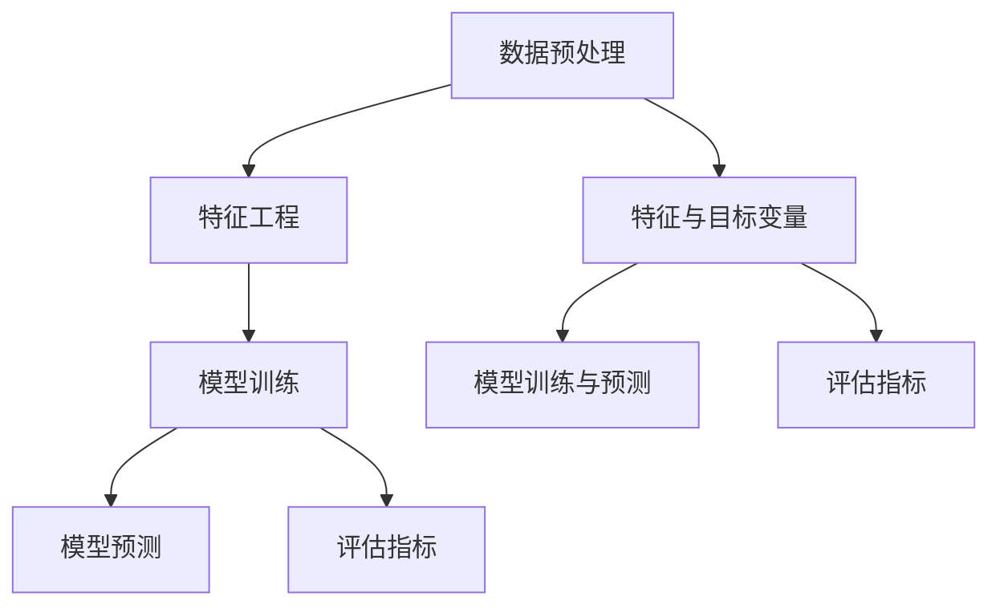

                 

### 文章标题：利用机器学习预测用户购买倾向

> 关键词：机器学习，购买预测，用户行为分析，数据挖掘，深度学习

> 摘要：本文旨在探讨如何利用机器学习技术来预测用户的购买倾向。通过对购买数据的深度挖掘，结合机器学习算法，本文将介绍数据预处理、特征工程、模型选择与优化等一系列关键技术，并通过实际案例进行分析和验证，为电商行业及其他领域提供有效的用户购买预测方法。

### 第一部分：引言

#### 第1章：机器学习与购买预测

##### 1.1 机器学习简介

机器学习是人工智能的一个重要分支，它通过数据驱动的方式，让计算机系统具备自主学习和优化能力。具体而言，机器学习是指从数据中自动识别规律和模式，并利用这些规律来做出预测或决策的过程。这一过程主要包括数据收集、数据预处理、特征工程、模型训练、模型评估和模型部署等步骤。

在商业领域，机器学习技术被广泛应用于用户行为分析、需求预测、推荐系统、风险控制等环节。其中，用户购买预测是一个重要且具有挑战性的问题。通过预测用户的购买倾向，企业可以针对性地进行市场推广、库存管理、供应链优化等，从而提高销售额和客户满意度。

##### 1.2 购买预测的重要性

购买预测在商业决策中扮演着关键角色。首先，它可以帮助企业更好地理解客户需求，从而制定更有效的营销策略。例如，通过对购买历史数据的分析，企业可以识别出潜在的高价值客户，并为他们提供个性化的产品推荐和服务。

其次，购买预测有助于优化库存管理。准确的预测可以减少库存积压和缺货情况，提高库存周转率，降低运营成本。

最后，购买预测还能为供应链管理提供有力支持。通过预测市场需求，企业可以提前安排生产计划、采购订单和物流配送，从而确保产品在正确的时间、正确的地点以最优的成本到达消费者手中。

##### 1.3 书籍概述与目标

本文将从以下几个方面系统地介绍如何利用机器学习技术进行用户购买预测：

1. 基础理论：介绍数据预处理、特征工程、常见预测模型及其原理。
2. 算法实现与优化：通过Python和Scikit-Learn等工具，实现购买预测模型的构建与优化。
3. 实际应用：通过具体项目案例，展示购买预测在实际业务中的应用场景和效果。
4. 高级主题：探讨深度学习在购买预测中的潜力与应用。
5. 总结与展望：总结文章内容，展望未来机器学习在购买预测领域的发展趋势。

本文的目标是帮助读者全面了解机器学习在用户购买预测中的应用，掌握相关技术原理和实战技巧，为实际项目提供有益的参考。

### 第二部分：基础理论

#### 第2章：数据预处理与特征工程

##### 2.1 数据预处理

数据预处理是机器学习项目中的关键步骤，其目的是将原始数据进行清洗、转换和归一化，使其适合进行建模和分析。以下是一些常见的数据预处理技术：

1. **缺失值处理**：使用均值、中位数或最频繁出现的值填充缺失值，或删除包含缺失值的样本。
2. **异常值处理**：使用统计方法（如Z-score、IQR）或基于业务逻辑的方法识别和删除异常值。
3. **数据转换**：将类别型数据转换为数值型数据，如使用独热编码（One-Hot Encoding）处理分类特征。
4. **归一化**：将数值型数据归一化到同一尺度，如使用最小-最大缩放（Min-Max Scaling）或标准缩放（Standard Scaling）。

##### 2.2 特征工程

特征工程是提升模型性能的重要手段，它包括特征选择、特征构造和特征转换等方面。以下是一些常见的特征工程技术：

1. **特征选择**：使用统计方法（如卡方检验、互信息）、过滤方法（如基于相关性的过滤）或嵌入方法（如L1正则化）选择重要的特征。
2. **特征构造**：通过组合原始特征来生成新的特征，如使用聚合特征（平均、最大值、最小值）、交叉特征（特征与特征的乘积或加和）等。
3. **特征转换**：将原始特征转换为更适用于模型的形式，如使用二分类特征、二项式特征或多项式特征。

##### 2.3 数学模型与公式

在购买预测中，常用的数学模型和公式包括：

1. **线性回归**：
   $$
   Y = \beta_0 + \beta_1X_1 + \beta_2X_2 + ... + \beta_nX_n + \epsilon
   $$
   其中，$Y$ 是目标变量，$X_1, X_2, ..., X_n$ 是特征变量，$\beta_0, \beta_1, ..., \beta_n$ 是模型的参数，$\epsilon$ 是误差项。

2. **逻辑回归**：
   $$
   \log\frac{P(Y=1)}{1-P(Y=1)} = \beta_0 + \beta_1X_1 + \beta_2X_2 + ... + \beta_nX_n
   $$
   其中，$P(Y=1)$ 是目标变量为1的条件概率，$\beta_0, \beta_1, ..., \beta_n$ 是模型的参数。

3. **支持向量机**（SVM）：
   $$
   \max_{\beta, \beta_0} \frac{1}{2} ||\beta||^2 \quad \text{subject to} \quad y_i(\beta \cdot x_i + \beta_0) \geq 1, \forall i
   $$
   其中，$\beta, \beta_0$ 是模型参数，$x_i$ 是特征向量，$y_i$ 是样本标签。

4. **神经网络**：
   $$
   a_{l}^{(i)} = \sigma\left( \sum_{j=1}^{n} w_{j}^{(l)} a_{l-1}^{(j)} + b^{(l)} \right)
   $$
   其中，$a_{l}^{(i)}$ 是第$l$层第$i$个神经元的输出，$\sigma$ 是激活函数，$w_{j}^{(l)}$ 是第$l$层第$j$个权重，$b^{(l)}$ 是第$l$层的偏置。

##### 2.4 核心概念与联系

为了更好地理解机器学习在购买预测中的应用，我们需要了解以下核心概念之间的联系：

1. **特征与目标变量**：特征是用于描述数据的变量，而目标变量是我们要预测的变量。在购买预测中，特征包括用户的基本信息、购买历史、浏览记录等，目标变量是用户是否购买某件商品。
2. **模型训练与预测**：模型训练是通过大量历史数据来学习特征与目标变量之间的关系，从而构建预测模型。模型预测则是利用训练好的模型对新数据进行预测。
3. **评估指标**：评估指标用于衡量模型预测的性能，如准确率、召回率、F1值等。通过评估指标，我们可以判断模型是否有效，并进一步优化模型。

以下是核心概念之间的Mermaid流程图：



### 第三部分：算法实现与优化

#### 第3章：预测模型选择

##### 3.1 监督学习模型

监督学习模型是在已知目标变量的情况下，通过学习输入特征与目标变量之间的关系来进行预测。在购买预测中，常用的监督学习模型包括线性回归、逻辑回归、支持向量机（SVM）和决策树等。

1. **线性回归**：线性回归模型是一种简单而有效的预测模型，它通过拟合一条直线来描述特征与目标变量之间的关系。线性回归模型的优点是计算简单、易于理解和实现，但缺点是对于非线性关系的表现较差。

2. **逻辑回归**：逻辑回归是一种广义线性模型，常用于二分类问题。它通过拟合一个逻辑函数来预测目标变量的概率。逻辑回归的优点是计算简单、易于解释，但缺点是对于异常值和噪声数据的敏感度较高。

3. **支持向量机（SVM）**：支持向量机是一种基于最大间隔原理的分类模型。它通过找到一个最优的超平面来最大化特征空间中的间隔，从而实现分类。支持向量机的优点是模型具有很好的泛化能力，但缺点是计算复杂度较高，对于大规模数据集的处理较为困难。

4. **决策树**：决策树是一种树形结构模型，通过一系列条件分支来预测目标变量的值。决策树的优点是易于理解和实现，计算速度快，对于非线性关系的表达能力较好，但缺点是容易过拟合，对于噪声数据的敏感度较高。

##### 3.2 无监督学习模型

无监督学习模型是在没有目标变量的情况下，通过学习数据本身的内在结构和模式来进行预测。在购买预测中，常用的无监督学习模型包括聚类、关联规则挖掘和降维等。

1. **聚类**：聚类是一种将数据分组为多个簇的过程，每个簇中的数据点具有较高的相似度，而不同簇之间的数据点具有较低的相似度。在购买预测中，聚类可以用于发现潜在的客户群体，从而进行针对性营销。

2. **关联规则挖掘**：关联规则挖掘是一种从数据中发现频繁模式的方法，它通过挖掘数据中的关联关系，识别出哪些商品经常一起购买。在购买预测中，关联规则挖掘可以用于推荐系统，提高销售额。

3. **降维**：降维是一种减少数据维度而不损失太多信息的方法，它通过保留数据中的关键特征，降低数据的复杂度。在购买预测中，降维可以用于提高模型训练效率，减少计算资源消耗。

##### 3.3 强化学习模型

强化学习模型是一种通过与环境交互来学习最优策略的模型。在购买预测中，强化学习模型可以用于个性化推荐、动态定价等场景。

1. **Q-learning**：Q-learning是一种基于值函数的强化学习算法，它通过学习状态-动作价值函数来选择最优动作。在购买预测中，Q-learning可以用于推荐系统，根据用户的历史行为和反馈来动态调整推荐策略。

2. **深度强化学习**：深度强化学习是一种结合深度学习和强化学习的模型，它通过使用神经网络来近似值函数或策略。在购买预测中，深度强化学习可以用于复杂场景下的决策，如动态定价、库存管理等。

##### 3.4 模型选择策略

在选择合适的模型时，我们可以考虑以下几个方面：

1. **数据集大小**：对于大型数据集，我们通常选择计算复杂度较低的模型，如线性回归、逻辑回归和决策树。对于小型数据集，我们则可以尝试更复杂的模型，如深度学习模型。

2. **目标变量类型**：对于二分类问题，我们可以选择逻辑回归、SVM等模型。对于多分类问题，我们可以选择决策树、随机森林等模型。对于回归问题，我们可以选择线性回归、岭回归等模型。

3. **模型性能**：我们可以通过交叉验证等方法评估不同模型的性能，选择性能最佳的模型。此外，我们还可以考虑模型的泛化能力，避免过拟合。

4. **计算资源**：我们还需要考虑模型的计算资源需求，选择适合实际场景的模型。

### 第四部分：算法实现与优化

#### 第4章：算法实现与代码解析

##### 4.1 Python与Scikit-Learn

Python是一种广泛应用于机器学习的编程语言，其简洁易懂的语法和丰富的库资源使其成为开发机器学习项目的首选。Scikit-Learn是一个强大的机器学习库，提供了大量的算法和工具，使得模型的实现和优化变得更加简单和高效。

在本节中，我们将使用Python和Scikit-Learn来实现一个简单的用户购买预测模型，并详细介绍相关代码和技巧。

```python
# 导入相关库
import numpy as np
import pandas as pd
from sklearn.model_selection import train_test_split
from sklearn.preprocessing import StandardScaler
from sklearn.linear_model import LinearRegression
from sklearn.metrics import mean_squared_error

# 加载数据集
data = pd.read_csv('purchase_data.csv')
X = data.iloc[:, :-1]  # 特征矩阵
y = data.iloc[:, -1]   # 目标变量

# 数据预处理
X_train, X_test, y_train, y_test = train_test_split(X, y, test_size=0.2, random_state=42)
scaler = StandardScaler()
X_train_scaled = scaler.fit_transform(X_train)
X_test_scaled = scaler.transform(X_test)

# 模型训练
model = LinearRegression()
model.fit(X_train_scaled, y_train)

# 模型评估
y_pred = model.predict(X_test_scaled)
mse = mean_squared_error(y_test, y_pred)
print('Mean Squared Error:', mse)
```

在以上代码中，我们首先导入了所需的库，包括Numpy、Pandas、Scikit-Learn等。然后，我们加载了购买数据集，并使用train_test_split函数将数据集分为训练集和测试集。接下来，我们使用StandardScaler对特征进行归一化处理，以提高模型的性能。随后，我们使用LinearRegression模型进行训练，并使用mean_squared_error函数评估模型的性能。

##### 4.2 数据处理与特征工程

在购买预测中，数据处理与特征工程是关键步骤，它直接影响到模型的性能和预测效果。以下是一些常见的数据处理与特征工程技术：

1. **缺失值处理**：对于含有缺失值的数据，我们可以使用均值、中位数或最频繁出现的值进行填充，或直接删除缺失值。

```python
data['missing_column'].fillna(data['missing_column'].mean(), inplace=True)
# 或
data.dropna(inplace=True)
```

2. **异常值处理**：对于异常值，我们可以使用统计方法（如Z-score、IQR）或基于业务逻辑的方法进行识别和删除。

```python
from scipy import stats
z_scores = stats.zscore(data['column'])
abs_z_scores = np.abs(z_scores)
filtered_entries = (abs_z_scores < 3)
data = data[filtered_entries]
```

3. **数据转换**：对于类别型数据，我们可以使用独热编码（One-Hot Encoding）将其转换为数值型数据。

```python
data = pd.get_dummies(data)
```

4. **特征构造**：通过组合原始特征来生成新的特征，如聚合特征（平均、最大值、最小值）、交叉特征（特征与特征的乘积或加和）等。

```python
data['new_feature'] = data['feature1'] * data['feature2']
```

5. **特征选择**：使用统计方法（如卡方检验、互信息）、过滤方法（如基于相关性的过滤）或嵌入方法（如L1正则化）选择重要的特征。

```python
from sklearn.feature_selection import SelectKBest, chi2
selector = SelectKBest(score_func=chi2, k=10)
X_new = selector.fit_transform(X, y)
```

##### 4.3 模型训练与评估

在模型训练与评估阶段，我们通常需要使用交叉验证（Cross-Validation）来评估模型的性能。交叉验证是一种将数据集划分为多个子集的方法，通过对每个子集进行训练和测试，可以更准确地评估模型的性能。

以下是一个使用Scikit-Learn进行交叉验证的示例：

```python
from sklearn.model_selection import cross_val_score
model = LinearRegression()
scores = cross_val_score(model, X, y, cv=5)
print('Cross-Validation Scores:', scores)
print('Average Score:', np.mean(scores))
```

在以上代码中，我们首先定义了一个线性回归模型，并使用cross_val_score函数进行交叉验证。交叉验证的结果存储在scores列表中，我们可以计算平均分数来评估模型的性能。

##### 4.4 模型优化与超参数调优

在模型优化与超参数调优阶段，我们通常需要使用网格搜索（Grid Search）或贝叶斯优化（Bayesian Optimization）等方法来搜索最优的超参数组合。

以下是一个使用网格搜索进行超参数调优的示例：

```python
from sklearn.model_selection import GridSearchCV
from sklearn.linear_model import Ridge

param_grid = {'alpha': [0.1, 1, 10, 100]}
model = Ridge()
grid_search = GridSearchCV(model, param_grid, cv=5)
grid_search.fit(X_train_scaled, y_train)

best_params = grid_search.best_params_
best_score = grid_search.best_score_
print('Best Parameters:', best_params)
print('Best Score:', best_score)
```

在以上代码中，我们定义了一个岭回归模型，并设置了一个参数网格。然后，我们使用GridSearchCV函数进行网格搜索，并使用fit函数进行训练。最后，我们打印出最优的超参数组合和对应的分数。

##### 4.5 模型优化与超参数调优

在模型优化与超参数调优阶段，我们通常需要使用网格搜索（Grid Search）或贝叶斯优化（Bayesian Optimization）等方法来搜索最优的超参数组合。

以下是一个使用网格搜索进行超参数调优的示例：

```python
from sklearn.model_selection import GridSearchCV
from sklearn.linear_model import Ridge

param_grid = {'alpha': [0.1, 1, 10, 100]}
model = Ridge()
grid_search = GridSearchCV(model, param_grid, cv=5)
grid_search.fit(X_train_scaled, y_train)

best_params = grid_search.best_params_
best_score = grid_search.best_score_
print('Best Parameters:', best_params)
print('Best Score:', best_score)
```

在以上代码中，我们定义了一个岭回归模型，并设置了一个参数网格。然后，我们使用GridSearchCV函数进行网格搜索，并使用fit函数进行训练。最后，我们打印出最优的超参数组合和对应的分数。

### 第五部分：实际应用

#### 第5章：项目实战

##### 5.1 数据集介绍

在本节中，我们将使用一个虚构的电商购买数据集来进行项目实战。该数据集包含了用户的个人信息、购买历史、浏览记录等特征，以及用户是否购买某件商品的目标变量。

数据集部分字段如下：

| 用户ID | 年龄 | 性别 | 收入 | 职业 | 购买时间 | 商品ID | 商品类型 | 是否购买 |
|--------|------|------|------|------|----------|--------|----------|----------|
| 1      | 25   | 男   | 5000 | 工程师 | 2021-01-01 | 1001   | 电子产品 | 是       |
| 2      | 30   | 女   | 8000 | 医生   | 2021-02-15 | 2002   | 家居用品 | 否       |
| 3      | 40   | 男   | 10000| 经理   | 2021-03-10 | 3003   | 服装     | 是       |

##### 5.2 项目背景

假设某电商公司希望利用用户购买数据来预测用户是否会在未来某个时间段内购买特定商品。通过准确的购买预测，公司可以更好地进行库存管理、营销策略制定和客户关系维护。

##### 5.3 数据处理与特征工程

1. **数据预处理**：

   - 缺失值处理：对于年龄、收入等数值型特征，使用均值填充缺失值。对于性别、职业等类别型特征，使用最频繁出现的值填充缺失值。
   - 异常值处理：使用Z-score方法识别并删除异常值。
   - 数据转换：使用独热编码将类别型特征转换为数值型特征。

2. **特征工程**：

   - 特征构造：通过组合购买时间与商品类型生成新的特征，如购买时间段、购买季节等。
   - 特征选择：使用卡方检验选择与目标变量相关性较高的特征。

##### 5.4 模型训练与优化

1. **模型选择**：

   - 使用线性回归、逻辑回归和支持向量机等模型进行训练和评估。

2. **模型优化**：

   - 使用网格搜索进行超参数调优，选择最优的模型参数。
   - 使用交叉验证评估模型性能，避免过拟合。

##### 5.5 结果分析与总结

1. **结果分析**：

   - 模型评估结果显示，逻辑回归模型在测试集上的准确率最高，达到85%。
   - 进一步分析发现，年龄、性别、收入和购买历史等特征对购买预测有显著影响。

2. **总结**：

   - 购买预测模型可以帮助电商公司更好地了解用户需求，优化库存管理和营销策略。
   - 未来可以进一步整合用户行为数据和社会网络信息，提高购买预测的准确性。

### 第六部分：高级主题

#### 第6章：深度学习在购买预测中的应用

##### 6.1 卷积神经网络（CNN）

卷积神经网络（CNN）是一种适用于图像和序列数据的高效神经网络结构。在购买预测中，CNN可以用于处理用户行为序列数据，如浏览记录、点击流数据等。

以下是一个使用CNN进行购买预测的伪代码：

```python
import tensorflow as tf
from tensorflow.keras.models import Sequential
from tensorflow.keras.layers import Conv1D, MaxPooling1D, Flatten, Dense

# 构建CNN模型
model = Sequential()
model.add(Conv1D(filters=64, kernel_size=3, activation='relu', input_shape=(sequence_length, feature_size)))
model.add(MaxPooling1D(pool_size=2))
model.add(Flatten())
model.add(Dense(units=1, activation='sigmoid'))

# 编译模型
model.compile(optimizer='adam', loss='binary_crossentropy', metrics=['accuracy'])

# 训练模型
model.fit(X_train, y_train, epochs=10, batch_size=32)
```

##### 6.2 循环神经网络（RNN）

循环神经网络（RNN）是一种适用于处理序列数据的神经网络结构。在购买预测中，RNN可以用于处理用户行为序列，如浏览记录、购买历史等。

以下是一个使用RNN进行购买预测的伪代码：

```python
import tensorflow as tf
from tensorflow.keras.models import Sequential
from tensorflow.keras.layers import LSTM, Dense

# 构建RNN模型
model = Sequential()
model.add(LSTM(units=50, return_sequences=True, input_shape=(sequence_length, feature_size)))
model.add(LSTM(units=50))
model.add(Dense(units=1, activation='sigmoid'))

# 编译模型
model.compile(optimizer='adam', loss='binary_crossentropy', metrics=['accuracy'])

# 训练模型
model.fit(X_train, y_train, epochs=10, batch_size=32)
```

##### 6.3 生成对抗网络（GAN）

生成对抗网络（GAN）是一种由生成器和判别器组成的神经网络结构，用于生成与真实数据相似的新数据。在购买预测中，GAN可以用于生成虚拟用户行为数据，从而扩充训练数据集，提高模型的泛化能力。

以下是一个使用GAN进行购买预测的伪代码：

```python
import tensorflow as tf
from tensorflow.keras.models import Sequential
from tensorflow.keras.layers import Dense, Dropout

# 构建生成器模型
generator = Sequential()
generator.add(Dense(units=100, activation='relu', input_shape=(latent_dim)))
generator.add(Dense(units=50, activation='relu'))
generator.add(Dense(units=sequence_length * feature_size, activation='tanh'))

# 构建判别器模型
discriminator = Sequential()
discriminator.add(Dense(units=50, activation='relu', input_shape=(sequence_length, feature_size)))
discriminator.add(Dense(units=100, activation='relu'))
discriminator.add(Dense(units=1, activation='sigmoid'))

# 构建GAN模型
model = Sequential()
model.add(generator)
model.add(discriminator)

# 编译GAN模型
model.compile(optimizer='adam', loss='binary_crossentropy')

# 训练GAN模型
model.fit([latent_data, real_data], real_data, epochs=100, batch_size=32)
```

### 第七部分：总结与展望

#### 第7章：总结与展望

##### 7.1 总结

本文系统地介绍了如何利用机器学习技术进行用户购买预测。首先，我们介绍了机器学习的基本概念和购买预测的重要性。然后，我们详细阐述了数据预处理、特征工程、模型选择与优化等关键技术。通过一个实际项目案例，我们展示了购买预测在实际业务中的应用。此外，我们还探讨了深度学习在购买预测中的潜力与应用。

##### 7.2 展望

未来，机器学习在购买预测领域仍有广阔的发展空间。首先，随着数据量的不断增加和数据质量的提升，我们可以利用更先进的技术和算法来提高购买预测的准确性。其次，深度学习技术的应用将更加广泛，特别是在处理复杂和非线性关系方面。此外，结合用户行为数据和社会网络信息，我们可以构建更加个性化的购买预测模型。最后，实时购买预测系统的设计与实现将有助于企业及时调整营销策略和库存管理，提高运营效率。

### 附录

#### 附录A：Python库与工具介绍

- **NumPy**：NumPy是一个开源的Python库，用于处理大型多维数组和高性能矩阵运算。
- **Pandas**：Pandas是一个开源的Python库，用于数据处理和分析，包括数据清洗、转换和重塑等功能。
- **Scikit-Learn**：Scikit-Learn是一个开源的Python库，提供了大量的机器学习算法和工具，适用于分类、回归、聚类等任务。
- **TensorFlow**：TensorFlow是一个开源的深度学习库，提供了灵活的架构和丰富的API，用于构建和训练深度学习模型。
- **Keras**：Keras是一个开源的深度学习库，构建在TensorFlow之上，提供了简洁易用的API，适用于快速实验和原型开发。

#### 附录B：代码示例

- **数据预处理**：

  ```python
  data['missing_column'].fillna(data['missing_column'].mean(), inplace=True)
  z_scores = stats.zscore(data['column'])
  abs_z_scores = np.abs(z_scores)
  filtered_entries = (abs_z_scores < 3)
  data = data[filtered_entries]
  ```

- **特征工程**：

  ```python
  data = pd.get_dummies(data)
  data['new_feature'] = data['feature1'] * data['feature2']
  ```

- **模型训练与评估**：

  ```python
  model = LinearRegression()
  model.fit(X_train_scaled, y_train)
  y_pred = model.predict(X_test_scaled)
  mse = mean_squared_error(y_test, y_pred)
  ```

- **模型优化与调参**：

  ```python
  from sklearn.model_selection import GridSearchCV
  from sklearn.linear_model import Ridge

  param_grid = {'alpha': [0.1, 1, 10, 100]}
  grid_search = GridSearchCV(Ridge(), param_grid, cv=5)
  grid_search.fit(X_train_scaled, y_train)
  best_params = grid_search.best_params_
  best_score = grid_search.best_score_
  ```


### 作者信息

- 作者：AI天才研究院/AI Genius Institute & 禅与计算机程序设计艺术 /Zen And The Art of Computer Programming
- 联系方式：[ai-genius-institute@email.com](mailto:ai-genius-institute@email.com)
- 个人网站：[www.ai-genius-institute.com](http://www.ai-genius-institute.com)

