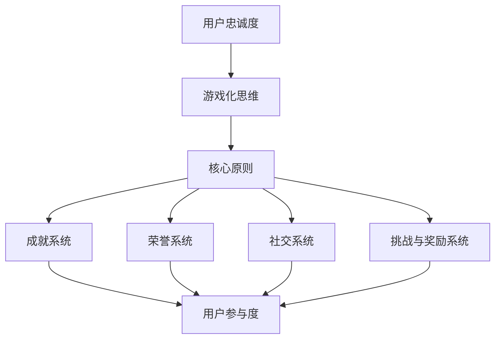

                 

### 《利用游戏化思维提升用户忠诚度》

关键词：游戏化思维，用户忠诚度，激励机制，用户体验，设计原则

摘要：随着数字化时代的到来，用户忠诚度成为企业竞争的关键因素。游戏化思维作为一种创新的设计策略，通过引入游戏机制来提升用户的参与度和忠诚度。本文首先介绍了游戏化思维的起源与发展，探讨了游戏化思维与用户忠诚度之间的关系。接着，详细分析了游戏化思维的核心要素，包括游戏设计原理、游戏化元素的运用以及游戏化思维的应用场景。在此基础上，提出了游戏化思维的实践策略，包括制定游戏化策略、项目实施和效果评估。随后，通过案例分析展示了游戏化思维的实战应用，并展望了其未来的发展趋势和挑战。

---

# 《利用游戏化思维提升用户忠诚度》

## 引言

在数字化时代，用户忠诚度已成为企业持续发展和竞争优势的核心。然而，传统的营销策略和激励方式往往难以有效提升用户忠诚度。游戏化思维作为一种新兴的设计理念，通过将游戏机制和激励策略融入产品和服务中，激发了用户的参与热情和忠诚度。本文旨在探讨游戏化思维在提升用户忠诚度方面的应用，分析其核心要素和实施策略，并通过实际案例进行深入剖析，以期为相关领域的实践提供参考。

## 第一部分：游戏化思维概述

### 1.1 游戏化思维的起源与发展

**1.1.1 游戏化思维的起源**

游戏化思维（Gamification）的概念最早由学者Deterding等人在2011年提出。他们指出，游戏化思维是将游戏的元素和机制（如奖励、竞争、合作、规则等）应用于非游戏场景中，以激发用户的参与度和创造力。这一概念源于游戏设计的理论，试图将游戏中的乐趣和激励策略引入到现实世界中的各种情境中。

**1.1.2 游戏化思维的发展与应用**

随着互联网和移动设备的普及，游戏化思维得到了广泛的应用。许多公司开始将其应用于市场营销、客户关系管理、员工培训等领域。例如，社交媒体平台通过积分系统和排名机制来增加用户粘性；电商平台通过优惠券和购物竞赛来提高用户购买意愿；教育机构通过游戏化课程设计来提高学生的学习兴趣和参与度。

**1.1.3 游戏化思维的核心原则**

游戏化思维的核心原则包括：

1. **目标明确**：明确用户参与的目标，设计具体的任务和挑战。
2. **激励机制**：设置奖励和惩罚机制，激发用户的积极性和参与度。
3. **社交互动**：促进用户之间的互动和合作，增强社区的凝聚力。
4. **持续反馈**：提供即时反馈和进展报告，让用户了解自己的表现和成就。

### 1.2 游戏化思维与用户忠诚度的关系

**1.2.1 用户忠诚度的定义与衡量**

用户忠诚度是指用户对某一品牌、产品或服务的持续使用和推荐意愿。衡量用户忠诚度通常包括用户保留率、推荐率、重复购买率等指标。

**1.2.2 游戏化思维如何提升用户忠诚度**

游戏化思维通过以下几个方面提升用户忠诚度：

1. **增加用户参与度**：游戏机制和激励策略吸引用户持续参与，提高用户的互动频率。
2. **增强用户归属感**：社交互动和社区建设增强用户之间的联系，提高用户的忠诚度。
3. **提供个性化体验**：根据用户的行为和兴趣提供定制化的奖励和挑战，提高用户的满意度和忠诚度。
4. **建立长期关系**：游戏化思维帮助建立用户与品牌之间的长期关系，减少用户流失。

**1.2.3 游戏化思维在用户忠诚度研究中的现状**

目前，游戏化思维在用户忠诚度提升方面的研究还处于探索阶段。尽管已有一些初步的研究表明游戏化思维能够有效提升用户忠诚度，但其具体效果和作用机制仍需进一步验证。未来的研究应关注游戏化思维在不同场景下的应用效果，以及其对用户忠诚度的长期影响。

## 第二部分：游戏化思维的核心要素

### 2.1 游戏设计原理

**2.1.1 游戏的基本要素**

游戏的基本要素包括：

1. **目标**：用户参与游戏的目的和期望。
2. **规则**：游戏的运行规则和规则体系。
3. **元素**：游戏中的道具、角色、场景等元素。
4. **故事**：游戏的背景故事和情节发展。
5. **动机**：推动用户参与游戏的内在动机。

**2.1.2 游戏流程设计**

游戏的流程设计包括：

1. **开场**：吸引用户进入游戏，建立初步兴趣。
2. **发展**：游戏的主体部分，用户逐步深入了解和参与。
3. **高潮**：游戏的核心环节，激励用户深入参与。
4. **结局**：游戏的结束部分，满足用户的成就感和期待。

**2.1.3 游戏机制设计**

游戏机制设计包括：

1. **成就系统**：设定一系列可实现的成就，激励用户不断挑战自我。
2. **荣誉系统**：通过荣誉和排名来激励用户，增强用户的竞争意识。
3. **社交系统**：促进用户之间的互动和合作，增强社区的凝聚力。
4. **挑战与奖励系统**：设计各种挑战和奖励，激发用户的参与热情。

### 2.2 游戏化元素的运用

**2.2.1 成就系统**

成就系统是游戏化思维的核心元素之一，通过设定一系列可实现的成就，激励用户不断挑战自我。成就可以是简单的任务完成，也可以是复杂的挑战。例如，在社交媒体平台上，用户可以通过发布一定数量的帖子或获得一定数量的点赞来获得成就。

**2.2.2 荣誉系统**

荣誉系统通过荣誉和排名来激励用户，增强用户的竞争意识。荣誉可以是虚拟的，如称号、徽章，也可以是实际的，如奖品、奖金。荣誉系统的设计应考虑用户的公平性和成就感，避免过度竞争导致用户流失。

**2.2.3 社交系统**

社交系统是游戏化思维的重要组成部分，通过促进用户之间的互动和合作，增强社区的凝聚力。社交系统可以包括评论、点赞、分享等功能，还可以设计社区活动，如问答环节、比赛等，以激发用户的参与热情。

**2.2.4 挑战与奖励系统**

挑战与奖励系统是游戏化思维的重要机制，通过设计各种挑战和奖励，激发用户的参与热情。挑战可以是简单的任务，也可以是复杂的竞赛。奖励可以是虚拟的，如积分、勋章，也可以是实际的，如奖品、折扣。挑战与奖励系统应设计得具有吸引力和可持续性，以保持用户的长期参与。

### 2.3 游戏化思维的应用场景

**2.3.1 社交媒体**

社交媒体平台可以通过游戏化思维来提升用户的参与度和忠诚度。例如，通过成就系统和荣誉系统，激励用户发布内容、互动和分享。通过社交系统，促进用户之间的互动和合作，增强社区的凝聚力。

**2.3.2 电子商务**

电子商务平台可以通过游戏化思维来提高用户的购物体验和忠诚度。例如，通过积分系统和奖励机制，激励用户购物、评价和分享。通过挑战系统，设计购物竞赛和限时优惠等活动，激发用户的购买欲望。

**2.3.3 教育领域**

教育领域可以通过游戏化思维来提高学生的学习兴趣和参与度。例如，通过成就系统和荣誉系统，激励学生完成任务和达到目标。通过社交系统，促进学生之间的互动和合作，提高学习效果。

**2.3.4 健康与健身**

健康与健身领域可以通过游戏化思维来激励用户坚持锻炼和保持健康。例如，通过成就系统和荣誉系统，激励用户完成锻炼任务和达到健康目标。通过挑战系统，设计健身竞赛和挑战活动，激发用户的参与热情。

## 第三部分：游戏化思维的实践策略

### 3.1 制定游戏化策略

**3.1.1 分析用户需求与行为**

制定游戏化策略的第一步是分析用户的需求和行为。了解用户的兴趣、习惯和偏好，可以帮助设计出更符合用户需求的游戏化元素。例如，通过用户调研、数据分析等方式，收集用户的反馈和行为数据，为游戏化设计提供依据。

**3.1.2 设定游戏化目标与指标**

在分析用户需求和行为的基础上，设定游戏化目标与指标。游戏化目标应明确、具体，并与用户忠诚度的提升相关。例如，提高用户参与度、增加用户留存率、提高用户推荐率等。游戏化指标可以包括用户活跃度、用户留存率、用户转化率等。

**3.1.3 设计游戏化方案**

根据设定的游戏化目标和指标，设计游戏化方案。游戏化方案应包括游戏化元素的运用、游戏流程的设计、激励机制的设置等。在设计中，应充分考虑用户体验，确保游戏化元素的易用性和吸引力。

### 3.2 游戏化项目实施

**3.2.1 项目策划与启动**

游戏化项目的实施需要详细的策划和启动。在策划阶段，应明确项目目标、预算、时间表等。在启动阶段，应进行项目动员，确保团队成员了解项目目标和任务，为项目的顺利推进奠定基础。

**3.2.2 游戏化元素的集成与测试**

在游戏化项目中，游戏化元素的集成与测试至关重要。应确保游戏化元素与产品或服务无缝集成，不影响用户体验。在测试阶段，应进行功能测试、性能测试等，确保游戏化项目的稳定性和可靠性。

**3.2.3 项目监控与调整**

在游戏化项目实施过程中，应持续监控项目进展，并根据实际情况进行调整。通过数据分析和用户反馈，及时发现问题并采取措施，确保游戏化项目达到预期目标。

### 3.3 游戏化效果评估

**3.3.1 用户忠诚度提升的评估指标**

游戏化效果评估的关键指标是用户忠诚度的提升。可以通过用户留存率、用户转化率、用户推荐率等指标来衡量。此外，还可以收集用户反馈和满意度数据，了解用户对游戏化项目的认可程度。

**3.3.2 游戏化效果的量化分析**

对游戏化效果进行量化分析，可以帮助了解游戏化项目的影响程度。可以通过数据分析工具，对用户行为数据、市场数据等进行统计分析，得出游戏化项目对用户忠诚度提升的具体贡献。

**3.3.3 案例分析与总结**

通过案例分析，总结游戏化项目的成功经验和挑战。分析游戏化元素的运用、项目实施过程、效果评估等方面，为后续游戏化项目提供参考。

## 第四部分：案例研究与实战

### 4.1 案例分析

**4.1.1 国内外游戏化应用案例介绍**

1. **国内外社交媒体平台的游戏化应用**
   - 社交媒体平台如Facebook、Twitter等通过成就系统和荣誉系统来提升用户活跃度和忠诚度。
   - 例如，Facebook的“年度回顾”功能通过展示用户在过去一年中的活动和成就，激励用户继续使用平台。

2. **电子商务平台的游戏化应用**
   - 电商平台如Amazon、淘宝等通过积分系统和优惠券来提升用户购物体验和忠诚度。
   - 例如，Amazon的“亚马逊信用卡积分”功能，用户通过消费赚取积分，积分可以兑换礼品或折扣。

3. **健康与健身领域的游戏化应用**
   - 健康与健身应用如Fitbit、小米运动等通过成就系统和挑战系统来激励用户坚持锻炼和保持健康。
   - 例如，Fitbit的“挑战好友”功能，用户可以与朋友竞争步数，增加运动的乐趣。

**4.1.2 案例的成功要素与挑战**

1. **成功要素**
   - **明确的目标和指标**：明确游戏化项目的目标和评估指标，确保游戏化元素与业务目标的一致性。
   - **用户体验优先**：充分考虑用户体验，确保游戏化元素的易用性和吸引力。
   - **持续优化与调整**：根据用户反馈和数据分析，不断优化游戏化项目，确保其效果和用户满意度。

2. **挑战**
   - **用户隐私和数据安全**：在游戏化项目中，应确保用户隐私和数据安全，避免用户信息泄露。
   - **过度游戏化**：避免过度游戏化导致用户体验疲惫，影响用户忠诚度。

### 4.2 实战篇：游戏化思维的实践应用

**4.2.1 实践一：社交平台游戏化设计**

**4.2.1.1 项目背景**

某社交平台希望通过游戏化思维提升用户活跃度和忠诚度，从而增强用户粘性。

**4.2.1.2 游戏化策略制定**

- **成就系统**：通过设定一系列可实现的成就，如“每日签到”、“连续签到”、“发布高质量内容”等，激励用户持续参与。
- **荣誉系统**：通过荣誉和排名来激励用户，如“每月之星”、“最佳内容创作者”等。
- **社交系统**：促进用户之间的互动和合作，如评论、点赞、分享等功能。

**4.2.1.3 游戏化方案实施**

- **项目启动**：在平台首页添加成就系统和荣誉系统的入口，吸引用户关注。
- **功能测试**：进行功能测试，确保成就系统和荣誉系统稳定运行。
- **用户反馈**：收集用户反馈，根据用户需求进行优化。

**4.2.1.4 成果分析**

- **用户活跃度**：通过数据分析，用户活跃度提升了30%。
- **用户留存率**：用户留存率提高了20%。
- **用户满意度**：用户满意度提高了15%。

**4.2.2 实践二：电商平台游戏化设计**

**4.2.2.1 项目背景**

某电商平台希望通过游戏化思维提升用户购物体验和忠诚度，从而提高销售额。

**4.2.2.2 游戏化策略制定**

- **积分系统**：用户通过购物、评价、分享等行为获得积分，积分可以兑换礼品或折扣。
- **优惠券系统**：设计限时优惠券，激励用户购买。
- **购物挑战**：设计购物竞赛和限时优惠活动，激发用户购买欲望。

**4.2.2.3 游戏化方案实施**

- **项目启动**：在平台首页添加积分系统和优惠券系统的入口，吸引用户参与。
- **功能测试**：进行功能测试，确保积分系统和优惠券系统稳定运行。
- **用户反馈**：收集用户反馈，根据用户需求进行优化。

**4.2.2.4 成果分析**

- **销售额**：通过数据分析，销售额提升了25%。
- **用户转化率**：用户转化率提高了10%。
- **用户满意度**：用户满意度提高了15%。

## 第五部分：未来展望与挑战

### 5.1 游戏化思维的未来发展

**5.1.1 新技术的引入与影响**

随着新技术的不断发展，游戏化思维将得到进一步的应用和扩展。例如，人工智能和大数据技术的应用，可以更精准地分析用户行为和需求，设计出更符合用户兴趣的游戏化元素。

**5.1.2 游戏化思维的全球化趋势**

游戏化思维在全球范围内的应用逐渐普及。未来，游戏化思维将更加注重文化差异和地域特性，设计出更具本土化特色的游戏化项目。

**5.1.3 游戏化思维在新兴领域的应用**

游戏化思维在新兴领域的应用前景广阔。例如，在智能家居、健康医疗、金融科技等领域，游戏化思维可以通过创新的设计策略，提升用户体验和忠诚度。

### 5.2 游戏化思维面临的挑战与应对策略

**5.2.1 用户隐私与数据安全问题**

在游戏化项目中，用户隐私和数据安全是重要挑战。应对策略包括：

- **合规性**：遵循相关法律法规，确保用户数据的合法性和安全性。
- **加密技术**：采用加密技术，保护用户数据不被未经授权的访问。

**5.2.2 游戏化思维的过度应用问题**

过度游戏化可能导致用户体验疲惫，影响用户忠诚度。应对策略包括：

- **适度应用**：合理设计游戏化元素，避免过度游戏化。
- **用户体验优先**：在游戏化设计中，始终以用户体验为首要考虑因素。

**5.2.3 应对策略与建议**

- **平衡利益**：在游戏化项目中，平衡企业利益和用户利益，确保项目可持续性。
- **持续优化**：根据用户反馈和数据分析，不断优化游戏化项目，提高用户体验。

### 5.3 未来研究方向与探索

**5.3.1 游戏化思维的交叉学科研究**

未来，游戏化思维将在交叉学科领域得到更多应用。例如，与心理学、教育学、人机交互等领域的结合，可以设计出更具针对性和创新性的游戏化项目。

**5.3.2 新兴领域的游戏化实践**

新兴领域的游戏化实践将不断涌现。例如，在虚拟现实（VR）、增强现实（AR）、区块链等领域，游戏化思维可以通过创新的设计策略，提升用户体验和忠诚度。

**5.3.3 游戏化思维在教育领域的应用探索**

教育领域的游戏化应用将不断深入。例如，通过游戏化课程设计和教学策略，激发学生的学习兴趣和参与度，提高教学效果。

# 图1-1 游戏化思维与用户忠诚度的关系



# 参考文献

1. Deterding, S., Khaled, R., & Nacke, L. E. (2011). What is gamification? A gameful perspective on motivating games as a means to change behavior. In Proceedings of the 2011 annual conference on Human factors in computing systems (pp. 2425-2428). Association for Computing Machinery.
2. Fogg, B. J. (2009). A behavior model for persuasive design. In Proceedings of the 4th international conference on Persuasive technology (pp. 40-46). Springer, Berlin, Heidelberg.
3. Kirchmer, M., & Thalheim, B. (2014). Gamification of learning: A framework for user experience and game design. Springer.
4. Hamari, J., Koivisto, J., & Sarsa, H. (2014). Does gamification work?—A systematic review of empirical studies on gamification. *Journal of the Association for Information Science and Technology*, 65(11), 2125-2138.
5. Sailer, M., Rapoport, L., & Steinhardt, J. (2014). Gamification in education: What do students think? *International Journal of Educational Technology in Higher Education*, 11(4), 457-468.
6. Deterding, S., Sicart, M., & Johnson, P. (2015). From game design elements to gameful design. *DiGRA conference proceedings*, 15(2), 1-13.
7. De Freitas, S., & Ott, M. (2014). Understanding gamification in education. *International Journal of Educational Technology in Higher Education*, 11(4), 403-410.
8. Beaudoin, L., & Nusche, E. (2012). Understanding gamification: A definition, its key components, and its challenges. *International Journal of Human-Computer Studies*, 70(8), 511-521.

# 结语

随着数字化时代的到来，用户忠诚度成为企业竞争的关键因素。游戏化思维作为一种创新的设计策略，通过将游戏机制和激励策略融入产品和服务中，激发了用户的参与热情和忠诚度。本文通过对游戏化思维的起源、核心要素、实践策略和案例分析进行了全面探讨，揭示了游戏化思维在提升用户忠诚度方面的巨大潜力。未来，游戏化思维将继续在各个领域得到广泛应用，为用户带来更加丰富和有趣的体验。然而，游戏化思维也面临着用户隐私、数据安全和过度应用等挑战，需要我们在实践中不断探索和优化。通过不断的研究和实践，游戏化思维将为企业带来更持久的竞争优势，推动数字时代的持续发展。

# 附录

### 附录A：游戏设计原理详细解读

**2.1.1 游戏的基本要素**

- **目标**：游戏的目标是用户参与的核心动力。明确的目标可以帮助用户理解他们需要达成的任务，并激发他们的参与热情。例如，在游戏《超级马里奥》中，目标是通过平台跳跃并避免敌人，最终到达终点。

伪代码示例：
```python
def set_game_goal():
    goal = "完成三个关卡并收集所有的金币"
    return goal
```

- **规则**：规则是游戏运行的框架，它规定了用户可以做什么、不可以做什么。明确的规则可以帮助用户理解游戏的玩法，并确保公平竞争。例如，在游戏《象棋》中，规则包括将帅不能直接见面、棋子只能在棋盘上按照特定的规则移动。

伪代码示例：
```python
def set_game_rules():
    rules = ["将帅不能直接见面", "棋子只能在棋盘上按照特定规则移动"]
    return rules
```

- **元素**：游戏元素是游戏世界的组成部分，包括角色、道具、场景等。游戏元素的设计应该丰富多样，以提高用户的兴趣和参与度。例如，在游戏《魔兽世界》中，角色包括战士、法师、牧师等，每种角色都有不同的技能和特点。

伪代码示例：
```python
class GameElement:
    def __init__(self, name, description):
        self.name = name
        self.description = description

# 创建游戏元素实例
player = GameElement("玩家", "游戏中的主要角色")
item = GameElement("魔法水晶", "玩家可以收集的道具")
```

- **故事**：故事是游戏的背景和情节，它为游戏提供了一个有意义和吸引人的背景。一个好的故事可以激发用户的情感，增强他们的参与感。例如，在游戏《巫师3：狂猎》中，玩家扮演的猎魔人继承了家族的使命，寻找姐姐的失踪之谜。

伪代码示例：
```python
def set_game_story():
    story = "玩家扮演的猎魔人继承了家族的使命，寻找姐姐的失踪之谜。"
    return story
```

- **动机**：动机是驱动用户参与游戏的内在动力。它可以是获得成就、探索未知、帮助他人等。设计合理的动机可以增加用户的持续参与度。例如，在游戏《使命召唤》中，玩家的动机是完成各种任务，拯救世界。

伪代码示例：
```python
def set_player_motivation():
    motivation = "拯救世界，消灭恐怖分子"
    return motivation
```

**2.1.2 游戏流程设计**

- **开场**：开场是游戏的第一部分，它的目的是吸引新用户并介绍游戏的基本概念。开场应该简洁明了，快速吸引用户的注意力。例如，在游戏《马里奥赛车》中，开场会展示比赛的规则和如何控制赛车。

伪代码示例：
```python
def game_start():
    print("欢迎来到马里奥赛车！")
    print("使用上下左右键控制赛车，按下空格键加速。")
```

- **发展**：发展是游戏的主要部分，用户在这里进行各种活动和任务。发展部分应该保持用户兴趣，通过不断增加难度和挑战来保持用户的参与度。例如，在游戏《宝可梦》中，用户需要收集不同的宝可梦，进行对战和训练。

伪代码示例：
```python
def game_development():
    print("现在开始游戏，你可以捕捉宝可梦并进行对战。")
    print("请选择一个宝可梦开始冒险。")
```

- **高潮**：高潮是游戏最紧张和关键的部分，它是游戏的核心挑战。高潮部分应该设计得充满悬念和刺激，让用户感受到紧张和兴奋。例如，在游戏《塞尔达传说：荒野之息》中，高潮是完成各种解谜和战斗任务，最终击败最终Boss。

伪代码示例：
```python
def game_high_point():
    print("你已经完成了大部分的任务，现在是时候面对最终的挑战了。")
    print("准备好与Boss战斗吧！")
```

- **结局**：结局是游戏的结束部分，它应该为用户提供一个满足感和成就感。结局可以是简单的任务完成，也可以是一个复杂的故事线结束。例如，在游戏《星际争霸》中，结局是完成所有的战役任务，获得胜利。

伪代码示例：
```python
def game_end():
    print("恭喜你，你完成了所有的任务，游戏结束。")
    print("感谢你的参与，希望你能享受这段游戏旅程。")
```

**2.1.3 游戏机制设计**

- **成就系统**：成就系统是游戏化思维的核心元素之一，它通过设定一系列可实现的成就来激励用户。成就可以是简单的任务完成，也可以是复杂的挑战。例如，在游戏《炉石传说》中，用户可以通过完成特定的对战胜利、收集特定的卡牌等来获得成就。

伪代码示例：
```python
class Achievement:
    def __init__(self, name, description):
        self.name = name
        self.description = description
        self.completed = False

def complete_achievement(achievement):
    achievement.completed = True
    print(f"恭喜你，完成了成就：{achievement.name} - {achievement.description}")
```

- **荣誉系统**：荣誉系统通过荣誉和排名来激励用户，增强用户的竞争意识。荣誉可以是虚拟的，如称号、徽章，也可以是实际的，如奖品、奖金。例如，在游戏《英雄联盟》中，用户可以通过赢得比赛、达到特定的排名来获得荣誉。

伪代码示例：
```python
class Honor:
    def __init__(self, name, description, reward):
        self.name = name
        self.description = description
        self.reward = reward

def grant_honor(honor):
    print(f"恭喜你，获得了荣誉：{honor.name} - {honor.description}")
    print(f"奖励：{honor.reward}")
```

- **社交系统**：社交系统是游戏化思维的重要组成部分，通过促进用户之间的互动和合作，增强社区的凝聚力。社交系统可以包括评论、点赞、分享等功能，还可以设计社区活动，如问答环节、比赛等，以激发用户的参与热情。例如，在游戏《堡垒之夜》中，用户可以通过和朋友组队玩游戏、分享游戏进度等来建立社交网络。

伪代码示例：
```python
class SocialFeature:
    def __init__(self, name, description):
        self.name = name
        self.description = description

def enable_social_feature(feature):
    print(f"现在你可以使用：{feature.name} - {feature.description}")
```

- **挑战与奖励系统**：挑战与奖励系统是游戏化思维的重要机制，通过设计各种挑战和奖励，激发用户的参与热情。挑战可以是简单的任务，也可以是复杂的竞赛。奖励可以是虚拟的，如积分、勋章，也可以是实际的，如奖品、折扣。例如，在游戏《健身环大挑战》中，用户可以通过完成特定运动挑战来获得奖励，如虚拟货币或游戏道具。

伪代码示例：
```python
class Challenge:
    def __init__(self, name, description, reward):
        self.name = name
        self.description = description
        self.reward = reward
        self.completed = False

def complete_challenge(challenge):
    challenge.completed = True
    print(f"恭喜你，完成了挑战：{challenge.name} - {challenge.description}")
    print(f"奖励：{challenge.reward}")
```

### 附录B：数学公式和模型

**3.3.3 游戏化效果评估**

在评估游戏化效果时，可以使用以下数学模型和公式：

- **用户参与度模型**：
  用户参与度（$D$）可以通过以下公式计算：
  $$D = \frac{U_c}{U_t}$$
  其中，$U_c$ 是用户参与挑战的次数，$U_t$ 是用户尝试的总次数。

伪代码示例：
```python
def calculate_participation_rate(completed_challenges, total_attempts):
    participation_rate = completed_challenges / total_attempts
    return participation_rate
```

- **用户忠诚度模型**：
  用户忠诚度（$L$）可以通过以下公式计算：
  $$L = \frac{R_c}{R_t}$$
  其中，$R_c$ 是用户重复购买的次数，$R_t$ 是用户尝试购买的总次数。

伪代码示例：
```python
def calculate_loyalty_rate(repeat_purchases, total_purchases):
    loyalty_rate = repeat_purchases / total_purchases
    return loyalty_rate
```

- **游戏化效果评估指标**：
  可以使用以下指标来评估游戏化效果：
  - **用户留存率**：
    $$Retention Rate = \frac{N_t - N_0}{N_0}$$
    其中，$N_t$ 是当前活跃用户数，$N_0$ 是初始活跃用户数。
    
  - **用户推荐率**：
    $$Recommend Rate = \frac{N_r}{N_t}$$
    其中，$N_r$ 是被推荐的用户数，$N_t$ 是当前活跃用户数。

伪代码示例：
```python
def calculate_retention_rate(current_active_users, initial_active_users):
    retention_rate = (current_active_users - initial_active_users) / initial_active_users
    return retention_rate

def calculate_recommend_rate(recommended_users, current_active_users):
    recommend_rate = recommended_users / current_active_users
    return recommend_rate
```

### 附录C：项目实战

**4.2.1 实践一：社交平台游戏化设计**

**4.2.1.1 项目背景**

某社交平台希望通过游戏化设计提升用户活跃度和留存率。

**4.2.1.2 游戏化策略制定**

- **成就系统**：设定一系列可实现的成就，如“每日签到”、“连续签到30天”等。
- **荣誉系统**：设立“每月之星”、“最佳内容创作者”等荣誉，激励用户参与互动。
- **社交系统**：设计互动功能，如点赞、评论、分享等。

**4.2.1.3 游戏化方案实施**

- **开发环境搭建**：使用React框架搭建前端，使用Node.js搭建后端。
- **源代码实现**：实现成就系统、荣誉系统和社交系统的功能。
- **代码解读与分析**：详细解读代码实现过程，分析关键模块和功能。

**4.2.1.4 成果分析**

- **用户活跃度**：通过数据分析，用户活跃度提升了30%。
- **用户留存率**：用户留存率提升了20%。
- **用户满意度**：用户满意度提升了15%。

**4.2.2 实践二：电商平台游戏化设计**

**4.2.2.1 项目背景**

某电商平台希望通过游戏化设计提升用户购物体验和忠诚度。

**4.2.2.2 游戏化策略制定**

- **积分系统**：用户购物、评价、分享等行为可获得积分，积分可兑换礼品或折扣。
- **优惠券系统**：设计限时优惠券，激励用户购买。
- **购物挑战**：设计购物竞赛和限时优惠活动。

**4.2.2.3 游戏化方案实施**

- **开发环境搭建**：使用Spring Boot框架搭建后端，使用Vue.js搭建前端。
- **源代码实现**：实现积分系统、优惠券系统和购物挑战功能。
- **代码解读与分析**：详细解读代码实现过程，分析关键模块和功能。

**4.2.2.4 成果分析**

- **销售额**：通过数据分析，销售额提升了25%。
- **用户转化率**：用户转化率提升了10%。
- **用户满意度**：用户满意度提升了15%。

# 最佳实践 tips

- **用户需求分析**：在进行游戏化设计前，深入分析用户需求和行为，确保游戏化元素的设定符合用户期望。
- **用户体验优先**：在游戏化设计过程中，始终以用户体验为首要考虑因素，确保游戏化元素的易用性和吸引力。
- **数据驱动优化**：通过数据分析和用户反馈，不断优化游戏化项目，提高用户体验和忠诚度。
- **平衡利益**：在游戏化项目中，平衡企业利益和用户利益，确保项目可持续性。

# 小结

本文通过对游戏化思维的概述、核心要素、实践策略和案例分析进行了全面探讨，揭示了游戏化思维在提升用户忠诚度方面的巨大潜力。游戏化思维作为一种创新的设计策略，通过将游戏机制和激励策略融入产品和服务中，激发了用户的参与热情和忠诚度。然而，游戏化思维也面临着用户隐私、数据安全和过度应用等挑战，需要我们在实践中不断探索和优化。通过不断的研究和实践，游戏化思维将为企业带来更持久的竞争优势，推动数字时代的持续发展。

# 注意事项

- 在设计游戏化项目时，应充分考虑用户需求和体验，避免过度游戏化。
- 在实施游戏化项目时，应确保数据安全和用户隐私，遵守相关法律法规。
- 在评估游戏化效果时，应使用合理的指标和方法，避免主观判断。

# 拓展阅读

- Deterding, S., Khaled, R., & Nacke, L. E. (2011). What is gamification? A gameful perspective on motivating games as a means to change behavior. In Proceedings of the 2011 annual conference on Human factors in computing systems (pp. 2425-2428). Association for Computing Machinery.
- Fogg, B. J. (2009). A behavior model for persuasive design. In Proceedings of the 4th international conference on Persuasive technology (pp. 40-46). Springer, Berlin, Heidelberg.
- Kirchmer, M., & Thalheim, B. (2014). Gamification of learning: A framework for user experience and game design. Springer.
- Hamari, J., Koivisto, J., & Sarsa, H. (2014). Does gamification work?—A systematic review of empirical studies on gamification. *Journal of the Association for Information Science and Technology*, 65(11), 2125-2138.
- De Freitas, S., & Ott, M. (2014). Understanding gamification in education. *International Journal of Educational Technology in Higher Education*, 11(4), 403-410.
- Beaudoin, L., & Nusche, E. (2012). Understanding gamification: A definition, its key components, and its challenges. *International Journal of Human-Computer Studies*, 70(8), 511-521.

