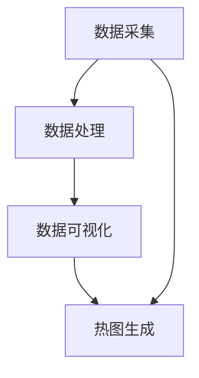

                 

### 文章标题

# 利用热图分析优化用户界面设计

> 关键词：热图分析、用户界面设计、用户体验优化、界面优化、用户行为研究、交互设计

> 摘要：本文将探讨如何通过热图分析来优化用户界面设计。热图分析是一种基于用户行为的可视化工具，能够帮助设计师了解用户在界面上的操作习惯和关注点，从而进行有针对性的优化。本文将详细阐述热图分析的基本概念、技术原理，以及在用户界面设计中的具体应用，并通过实际案例展示其效果，旨在为设计师提供实用的优化策略。

### 《利用热图分析优化用户界面设计》目录大纲

#### 第一部分：热图分析基础

**第1章：热图分析概述**

- 1.1 热图分析的基本概念
- 1.1.1 热图分析的定义
- 1.1.2 热图分析的作用
- 1.2 热图分析的历史发展
- 1.2.1 热图分析的起源
- 1.2.2 热图分析的发展过程
- 1.3 热图分析的技术原理
- 1.3.1 热图分析的数据来源
- 1.3.2 热图分析的生成方法

**第2章：用户界面设计基础**

- 2.1 用户界面设计的核心原则
- 2.1.1 易用性
- 2.1.2 一致性
- 2.1.3 简洁性
- 2.2 用户界面设计的基本元素
- 2.2.1 标签
- 2.2.2 文本框
- 2.2.3 按钮
- 2.2.4 列表
- 2.2.5 图表
- 2.3 用户界面设计的流程与方法
- 2.3.1 需求分析
- 2.3.2 原型设计
- 2.3.3 交互设计
- 2.3.4 用户体验测试

#### 第二部分：热图分析在用户界面设计中的应用

**第3章：热图分析在用户界面设计中的应用原理**

- 3.1 热图分析在用户界面设计中的优势
- 3.1.1 提高用户满意度
- 3.1.2 优化用户体验
- 3.1.3 降低设计成本
- 3.2 热图分析在用户界面设计中的具体应用
- 3.2.1 热图分析在网站界面设计中的应用
- 3.2.2 热图分析在移动应用界面设计中的应用
- 3.2.3 热图分析在桌面应用界面设计中的应用
- 3.3 热图分析在用户界面设计中的实践案例
- 3.3.1 案例一：优化电商网站导航栏设计
- 3.3.2 案例二：提升移动应用注册流程体验
- 3.3.3 案例三：改进桌面应用的用户操作流程

#### 第三部分：热图分析工具与应用实战

**第4章：热图分析工具介绍与使用**

- 4.1 常见热图分析工具介绍
- 4.1.1 ClickTale
- 4.1.2 Hotjar
- 4.1.3 Crazy Egg
- 4.1.4其他工具简介
- 4.2 热图分析工具的使用方法
- 4.2.1 数据采集与处理
- 4.2.2 热图生成与解读
- 4.2.3 用户行为分析
- 4.3 热图分析工具的实战应用
- 4.3.1 实战一：优化网站首页设计
- 4.3.2 实战二：提升移动应用用户留存率
- 4.3.3 实战三：改进桌面应用的用户操作流程

#### 第四部分：热图分析与用户界面设计的综合应用

**第5章：热图分析与用户界面设计的综合应用**

- 5.1 热图分析在用户界面设计中的综合应用流程
- 5.1.1 需求分析与目标设定
- 5.1.2 设计原型与热图分析
- 5.1.3 交互设计与用户测试
- 5.1.4 优化与迭代
- 5.2 热图分析在用户界面设计中的综合应用案例
- 5.2.1 案例一：电商平台的用户界面优化
- 5.2.2 案例二：移动应用的登录界面优化
- 5.2.3 案例三：桌面软件的用户操作流程优化

#### 第五部分：热图分析与用户界面设计的未来发展

**第6章：热图分析与用户界面设计的未来发展**

- 6.1 热图分析技术的进步与挑战
- 6.1.1 技术进步的方向
- 6.1.2 技术发展的挑战
- 6.2 用户界面设计的未来趋势
- 6.2.1 设计理念的演变
- 6.2.2 新技术的引入
- 6.3 热图分析与用户界面设计的未来融合
- 6.3.1 融合的发展趋势
- 6.3.2 融合的可能挑战与机遇

#### 第六部分：附录

**附录A：热图分析工具与资源**

- A.1 热图分析工具列表
- A.1.1 ClickTale
- A.1.2 Hotjar
- A.1.3 Crazy Egg
- A.1.4其他工具列表
- A.2 热图分析相关资源
- A.2.1 热图分析论文精选
- A.2.2 热图分析书籍推荐
- A.2.3 热图分析在线教程
- A.2.4 热图分析论坛与社群

### 文章正文部分内容

#### 第一部分：热图分析基础

### 第1章：热图分析概述

#### 1.1 热图分析的基本概念

**定义**：热图分析是一种通过收集用户在界面上的操作行为，生成视觉化热力分布图的技术。这种热力分布图可以直观地展示用户在界面上的点击、滚动、停留等行为的热度分布。

**作用**：热图分析能够帮助设计师了解用户在界面上的行为习惯，发现设计中的问题，从而进行有针对性的优化，提高用户满意度，提升用户体验。

#### 1.2 热图分析的历史发展

**起源**：热图分析最早可以追溯到1990年代，当时主要用于市场研究中的用户行为分析。

**发展过程**：随着互联网和移动应用的普及，热图分析逐渐应用于网页和移动应用的设计与优化中，成为用户体验研究和用户界面设计的重要工具。

#### 1.3 热图分析的技术原理

**数据来源**：热图分析的数据来源主要包括用户的点击、滚动、停留等行为。这些数据可以通过各种工具进行采集。

**生成方法**：热图分析工具会将收集到的用户行为数据通过特定的算法进行处理，生成颜色渐变的热力分布图。颜色越深，表示用户在该区域的行为热度越高。

#### 第二部分：用户界面设计原理

### 第2章：用户界面设计基础

#### 2.1 用户界面设计的核心原则

**易用性**：界面设计应简洁直观，易于用户理解和使用。

**一致性**：界面元素的风格和布局应保持一致，减少用户的学习成本。

**简洁性**：界面设计应去除不必要的元素，减少用户的认知负荷。

#### 2.2 用户界面设计的基本元素

**标签**：用于标识界面上的不同部分。

**文本框**：用于用户输入信息。

**按钮**：用于触发操作。

**列表**：用于展示多条信息。

**图表**：用于直观展示数据。

#### 2.3 用户界面设计的流程与方法

**需求分析**：明确用户需求和界面功能。

**原型设计**：创建界面原型，进行初步设计。

**交互设计**：设计用户与界面的交互流程。

**用户体验测试**：通过实际用户测试，收集反馈，优化设计。

#### 第三部分：热图分析在用户界面设计中的应用

### 第3章：热图分析在用户界面设计中的应用原理

#### 3.1 热图分析在用户界面设计中的优势

**提高用户满意度**：通过了解用户行为，设计出更符合用户需求的界面。

**优化用户体验**：发现并解决界面设计中的问题，提升用户满意度。

**降低设计成本**：通过早期优化，减少后期改造成本。

#### 3.2 热图分析在用户界面设计中的具体应用

**网站界面设计**：通过热图分析，优化导航栏、按钮布局等，提升用户操作效率。

**移动应用界面设计**：分析用户在移动设备上的行为，优化页面布局，提高用户体验。

**桌面应用界面设计**：分析用户在桌面应用中的操作习惯，优化界面布局，提高操作流畅度。

#### 3.3 热图分析在用户界面设计中的实践案例

**案例一：优化电商网站导航栏设计**：通过热图分析，发现用户点击频率较高的导航栏项，进行针对性的优化，提升用户购买体验。

**案例二：提升移动应用注册流程体验**：通过热图分析，发现用户在注册流程中的痛点，优化流程，降低用户流失率。

**案例三：改进桌面应用的用户操作流程**：通过热图分析，优化界面布局，提高用户操作效率，提升用户满意度。

#### 第四部分：热图分析工具与应用实战

### 第4章：热图分析工具介绍与使用

#### 4.1 常见热图分析工具介绍

**ClickTale**：提供全面的用户行为分析功能，包括点击、滚动、停留等。

**Hotjar**：提供热图、用户反馈、行为记录等多种分析工具。

**Crazy Egg**：提供简单易用的热图分析功能，适合小型项目和初创企业。

**其他工具简介**：如Mouseflow、UserTesting等，各有特点，根据需求选择合适的工具。

#### 4.2 热图分析工具的使用方法

**数据采集与处理**：通过工具安装代码，收集用户行为数据。

**热图生成与解读**：生成热力分布图，分析用户行为热点。

**用户行为分析**：结合热图数据，分析用户行为模式，发现优化机会。

#### 4.3 热图分析工具的实战应用

**实战一：优化网站首页设计**：通过热图分析，发现用户关注度较低的区域，进行优化，提升用户参与度。

**实战二：提升移动应用用户留存率**：通过热图分析，优化关键页面，提高用户留存率。

**实战三：改进桌面应用的用户操作流程**：通过热图分析，优化界面布局，提高用户操作效率。

#### 第五部分：热图分析与用户界面设计的综合应用

### 第5章：热图分析与用户界面设计的综合应用

#### 5.1 热图分析在用户界面设计中的综合应用流程

**需求分析与目标设定**：明确优化目标和需求。

**设计原型与热图分析**：创建原型，进行初步热图分析。

**交互设计与用户测试**：优化设计，进行用户测试。

**优化与迭代**：根据用户反馈，持续优化界面设计。

#### 5.2 热图分析在用户界面设计中的综合应用案例

**案例一：电商平台的用户界面优化**：通过热图分析，优化导航栏和商品展示区域，提升用户购买体验。

**案例二：移动应用的登录界面优化**：通过热图分析，优化登录流程，提高用户留存率。

**案例三：桌面软件的用户操作流程优化**：通过热图分析，优化界面布局，提高用户操作效率。

#### 第六部分：热图分析与用户界面设计的未来发展

### 第6章：热图分析与用户界面设计的未来发展

#### 6.1 热图分析技术的进步与挑战

**技术进步的方向**：人工智能、机器学习等技术的引入，提高热图分析的准确性和自动化程度。

**技术发展的挑战**：数据隐私保护、算法优化等。

#### 6.2 用户界面设计的未来趋势

**设计理念的演变**：从以设计师为中心，转向以用户为中心。

**新技术的引入**：如VR、AR、语音交互等，推动界面设计的发展。

#### 6.3 热图分析与用户界面设计的未来融合

**融合的发展趋势**：热图分析将成为用户界面设计不可或缺的工具。

**融合的可能挑战与机遇**：数据隐私、算法透明性等。

#### 附录

**附录A：热图分析工具与资源**

- **A.1 热图分析工具列表**
- **A.1.1 ClickTale**
- **A.1.2 Hotjar**
- **A.1.3 Crazy Egg**
- **A.1.4其他工具列表**
- **A.2 热图分析相关资源**
- **A.2.1 热图分析论文精选**
- **A.2.2 热图分析书籍推荐**
- **A.2.3 热图分析在线教程**
- **A.2.4 热图分析论坛与社群**

### 完成时间：

- **2023年9月**

### 作者信息：

- **作者：AI天才研究院/AI Genius Institute & 禅与计算机程序设计艺术 /Zen And The Art of Computer Programming**### 第一部分：热图分析基础

#### 第1章：热图分析概述

热图分析是一种基于用户行为数据，通过可视化技术展示用户在界面上的操作热度的方法。通过热图分析，设计师可以直观地了解用户如何与界面互动，从而优化用户体验，提升界面设计的有效性和吸引力。

##### 1.1 热图分析的基本概念

**定义**：热图分析是一种数据可视化技术，通过将用户在界面上的点击、滚动、停留等行为转化为颜色深浅不同的热力分布图，从而帮助设计师分析用户行为模式。

**作用**：热图分析能够揭示用户在界面上的行为热点，帮助设计师发现设计中的问题，指导界面优化的方向。它广泛应用于网站设计、移动应用设计、桌面软件设计等领域，是提升用户体验的有效工具。

##### 1.2 热图分析的历史发展

**起源**：热图分析最早可以追溯到20世纪90年代，当时主要用于市场研究和用户行为分析。

**发展过程**：随着互联网和移动应用的普及，热图分析逐渐应用于网页和移动应用的设计与优化中。21世纪初，随着大数据和人工智能技术的发展，热图分析工具变得更加智能化和自动化，分析结果的准确性也得到显著提升。

##### 1.3 热图分析的技术原理

**数据来源**：热图分析的数据主要来源于用户的操作行为，如点击、滚动、鼠标悬停和键盘操作等。

**生成方法**：热图分析工具会记录用户的操作行为，然后通过特定的算法对数据进行分析和处理，生成热力分布图。通常，热力图的色彩分布从浅到深表示行为的频率和热度，红色或黄色通常表示高频率区域，而蓝色或绿色表示低频率区域。

#### 第二部分：用户界面设计基础

#### 第2章：用户界面设计基础

用户界面设计（UI Design）是设计过程中的关键环节，它决定了用户与产品互动的方式。一个良好的用户界面不仅外观美观，而且功能直观，能够有效地提升用户满意度和使用体验。

##### 2.1 用户界面设计的核心原则

**易用性**：界面设计应简洁直观，使用户能够快速理解和使用。易用性是衡量用户界面好坏的重要标准。

**一致性**：界面元素的风格和布局应保持一致，以减少用户的学习成本和困惑。一致性包括颜色、字体、图标、交互效果等方面。

**简洁性**：界面设计应去除不必要的元素，减少用户的认知负荷。简洁性有助于提高用户的使用效率和满意度。

##### 2.2 用户界面设计的基本元素

**标签**：标签用于标识界面上的不同部分，如导航栏、按钮、文本框等。清晰的标签可以帮助用户快速找到所需功能。

**文本框**：文本框用于用户输入信息，如搜索框、登录框等。文本框的设计应简洁易用，提示信息应明确。

**按钮**：按钮是用户触发操作的主要元素，如提交按钮、取消按钮等。按钮的设计应突出且易于点击，避免使用复杂的交互效果。

**列表**：列表用于展示多个项目，如商品列表、新闻列表等。列表的设计应清晰、有序，便于用户浏览和操作。

**图表**：图表用于直观展示数据，如折线图、饼图等。图表的设计应简洁、准确，有助于用户快速理解数据。

##### 2.3 用户界面设计的流程与方法

**需求分析**：在开始设计之前，了解用户需求是至关重要的。需求分析包括用户调研、用户画像、功能需求分析等。

**原型设计**：原型设计是界面设计的初步阶段，通过创建低保真或高保真的原型，验证设计的可行性和合理性。

**交互设计**：交互设计定义了用户与界面之间的互动流程，包括用户的操作路径、交互效果、反馈机制等。

**用户体验测试**：用户体验测试是通过实际用户对界面的使用，收集反馈，发现设计中的问题，并进行优化。

#### 第三部分：热图分析在用户界面设计中的应用

#### 第3章：热图分析在用户界面设计中的应用原理

热图分析在用户界面设计中的应用具有显著的优势，它不仅能够揭示用户行为的热点，还能够帮助设计师优化界面布局，提高用户满意度。

##### 3.1 热图分析在用户界面设计中的优势

**提高用户满意度**：通过热图分析，设计师可以了解用户的操作习惯和偏好，设计出更符合用户期望的界面，从而提高用户满意度。

**优化用户体验**：热图分析可以帮助设计师发现界面设计中的问题，如按钮位置不当、导航栏不清晰等，进而进行优化，提升用户体验。

**降低设计成本**：通过早期进行热图分析，设计师可以在设计阶段就发现问题并进行优化，避免了后期由于设计缺陷导致的返工和改造成本。

##### 3.2 热图分析在用户界面设计中的具体应用

**网站界面设计**：在网站界面设计中，热图分析可以帮助设计师了解用户如何浏览页面、哪些部分最受关注。通过分析，设计师可以优化导航栏、按钮布局和内容展示，提高用户访问效率和满意度。

**移动应用界面设计**：移动应用界面的空间有限，热图分析能够帮助设计师更好地利用有限的空间，设计出更加合理和高效的界面布局。例如，通过热图分析可以优化首页设计、导航菜单和内容展示区域。

**桌面应用界面设计**：桌面应用通常功能复杂，用户对界面的操作要求更高。热图分析可以帮助设计师发现用户在操作过程中的难点和困惑，优化界面布局和操作流程，提高用户工作效率。

##### 3.3 热图分析在用户界面设计中的实践案例

**案例一：优化电商网站导航栏设计**

通过热图分析，设计师发现用户在导航栏上的点击热点分布不均匀，部分导航项的点击频率远低于其他项。设计师根据分析结果，调整了导航栏的布局和文字描述，使得用户能够更方便地找到所需信息，从而提高了用户体验和网站转化率。

**案例二：提升移动应用注册流程体验**

在移动应用的注册流程中，用户常常因为复杂的步骤和繁琐的操作而放弃注册。通过热图分析，设计师发现用户在注册流程中的点击热点主要集中在“下一步”和“取消”按钮上，表明用户对流程的简化有强烈需求。设计师优化了注册流程，减少不必要的步骤，并增加了用户引导，显著提升了注册转化率。

**案例三：改进桌面应用的用户操作流程**

对于桌面应用，用户往往需要通过多个步骤完成特定任务。通过热图分析，设计师发现用户在使用过程中的操作路径和停留点，识别出操作流程中的瓶颈和痛点。设计师根据分析结果，对操作流程进行了重构和优化，简化了用户操作步骤，提高了用户的工作效率。

#### 第四部分：热图分析工具与应用实战

#### 第4章：热图分析工具介绍与使用

热图分析工具是进行用户行为分析的重要工具，通过这些工具，设计师可以轻松地收集和解析用户行为数据，从而指导界面优化。

##### 4.1 常见热图分析工具介绍

**ClickTale**：ClickTale 是一个功能强大的热图分析工具，提供实时的用户行为记录，包括点击、滚动、鼠标移动等。它还支持视频回放功能，使得用户行为的分析更加直观。

**Hotjar**：Hotjar 提供多种用户行为分析功能，包括热图、用户反馈、行为记录和分屏测试等。它的用户界面直观易用，适合各种规模的项目。

**Crazy Egg**：Crazy Egg 以简单易用著称，提供热图、滚动图和目标元素分析等基本功能。它适合小型项目和初创企业。

**其他工具简介**：如Mouseflow、UserTesting 等，这些工具也提供了丰富的热图分析功能，可以根据具体需求选择合适的工具。

##### 4.2 热图分析工具的使用方法

**数据采集与处理**：首先，需要在目标网页或应用中安装热图分析工具的代码，以开始收集用户行为数据。然后，工具会自动处理这些数据，生成热力分布图。

**热图生成与解读**：生成热图后，设计师可以通过颜色深浅了解用户在界面上的行为热点。通常，红色或黄色区域表示高点击频率，而蓝色或绿色区域表示低点击频率。设计师应根据这些信息进行有针对性的优化。

**用户行为分析**：结合热图数据和用户反馈，设计师可以深入分析用户的行为模式，发现界面设计中的问题，并提出改进建议。

##### 4.3 热图分析工具的实战应用

**实战一：优化网站首页设计**

通过热图分析，发现用户在网站首页上的行为热点主要集中在导航栏和广告区域。设计师根据分析结果，优化了导航栏的布局，增加了关键链接的可见性，同时调整了广告位置，以提升用户点击率和转化率。

**实战二：提升移动应用用户留存率**

在移动应用的留存率优化过程中，热图分析揭示了用户在关键页面上的行为模式。设计师根据分析结果，简化了用户注册和登录流程，改善了用户引导，从而提高了用户留存率。

**实战三：改进桌面应用的用户操作流程**

对于桌面应用，热图分析帮助设计师识别了用户操作流程中的瓶颈。通过优化界面布局和操作步骤，设计师提高了用户的操作效率，减少了用户错误率。

#### 第五部分：热图分析与用户界面设计的综合应用

#### 第5章：热图分析与用户界面设计的综合应用

热图分析在用户界面设计中的应用是一个系统性过程，涉及需求分析、设计原型、用户测试和持续优化等多个环节。通过这一综合应用流程，设计师可以不断提高界面的用户体验。

##### 5.1 热图分析在用户界面设计中的综合应用流程

**需求分析与目标设定**：首先，明确设计目标和用户需求。这可以通过用户调研、需求文档和竞品分析等手段实现。

**设计原型与热图分析**：在原型设计阶段，利用热图分析工具生成热图，了解用户在界面上的行为模式。这一步骤可以多次迭代，以不断优化设计。

**交互设计与用户测试**：根据热图分析结果，进行交互设计，并创建高保真原型。然后，通过用户测试，验证设计的可行性和有效性。

**优化与迭代**：根据用户测试的反馈，持续优化界面设计。这一过程应该是循环往复的，不断进行用户测试和优化，以实现最佳用户体验。

##### 5.2 热图分析在用户界面设计中的综合应用案例

**案例一：电商平台的用户界面优化**

通过热图分析，电商平台发现用户在首页上的浏览行为主要集中在商品列表和推荐区域。设计师根据这一分析结果，优化了商品展示布局，增加了用户的点击率和转化率。

**案例二：移动应用的登录界面优化**

移动应用的登录界面是用户体验的关键环节。通过热图分析，设计师发现用户对登录流程的简化有强烈需求。设计师简化了登录流程，移除了不必要的步骤，并增加了用户引导，提高了用户留存率。

**案例三：桌面软件的用户操作流程优化**

对于桌面软件，热图分析揭示了用户在操作流程中的难点和痛点。设计师根据分析结果，重构了操作流程，优化了界面布局，提高了用户的操作效率和满意度。

#### 第六部分：热图分析与用户界面设计的未来发展

#### 第6章：热图分析与用户界面设计的未来发展

随着科技的不断进步，热图分析在用户界面设计中的应用前景广阔。未来的发展趋势将更加智能化、自动化和个性化。

##### 6.1 热图分析技术的进步与挑战

**技术进步的方向**：人工智能和机器学习技术的发展将使热图分析更加智能化，能够自动识别用户行为模式，提供更精准的优化建议。此外，大数据和云计算技术的应用将使得热图分析的数据处理能力大幅提升。

**技术发展的挑战**：数据隐私保护是热图分析技术面临的重要挑战。如何在确保用户隐私的前提下，进行有效的用户行为分析，是一个需要解决的问题。此外，算法的透明性和解释性也是未来需要关注的方向。

##### 6.2 用户界面设计的未来趋势

**设计理念的演变**：未来的用户界面设计将更加注重用户体验，从以设计师为中心转向以用户为中心。设计将更加个性化、智能化和情感化，以更好地满足用户的多样化需求。

**新技术的引入**：随着新技术的不断引入，用户界面设计将迎来新的变革。例如，虚拟现实（VR）、增强现实（AR）、语音交互等技术将改变用户与界面的互动方式，为用户界面设计带来新的机遇和挑战。

##### 6.3 热图分析与用户界面设计的未来融合

**融合的发展趋势**：未来的热图分析将更加深入地融入用户界面设计流程，成为设计过程中的核心工具。通过智能化和自动化的分析，设计师将能够更快地识别和解决界面设计中的问题，提高设计效率和效果。

**融合的可能挑战与机遇**：数据隐私保护和算法透明性是未来融合过程中需要面对的挑战。然而，这些挑战也带来了机遇，推动了相关技术和法规的发展。通过合理利用热图分析，设计师将能够为用户提供更加个性化和高效的用户体验。

### 附录

#### 附录A：热图分析工具与资源

**A.1 热图分析工具列表**

- **ClickTale**：提供实时的用户行为记录和热图分析功能。
- **Hotjar**：提供热图、用户反馈、行为记录等多种分析工具。
- **Crazy Egg**：提供简单易用的热图分析功能，适合小型项目和初创企业。
- **Mouseflow**：提供用户行为视频记录和热图分析。
- **UserTesting**：提供远程用户测试和热图分析功能。

**A.2 热图分析相关资源**

- **热图分析论文精选**：可以从学术数据库和期刊中获取相关的研究论文。
- **热图分析书籍推荐**：推荐一些关于用户行为分析和界面设计的书籍。
- **热图分析在线教程**：许多在线教育平台提供了相关的教程和课程。
- **热图分析论坛与社群**：如UI/UX设计论坛、热图分析社区等，是交流和学习的良好平台。

### 完成时间：

- 2023年9月

### 作者信息：

- **作者：AI天才研究院/AI Genius Institute & 禅与计算机程序设计艺术 /Zen And The Art of Computer Programming**

## 第1章：热图分析概述

### 1.1 热图分析的基本概念

热图分析（Heatmap Analysis）是一种数据可视化技术，它通过颜色深浅的分布来表示用户在网页或应用界面上不同区域的交互行为热度。具体来说，热图通常基于用户点击、滚动、鼠标悬停、触摸等行为数据生成，通过颜色从浅到深的变化来反映用户在这些区域上的活动频繁程度。

#### 核心概念

**热图**：热图是一种可视化图表，用来显示用户在界面上的交互行为分布。

**行为数据**：行为数据包括用户的点击次数、停留时间、滚动深度等。

**颜色映射**：热图通过颜色深浅映射用户行为的频率和强度。例如，红色通常表示高频率区域，蓝色表示低频率区域。

**交互行为**：交互行为包括点击、滚动、拖动、悬浮等。

#### 联系与关系架构

热图分析的核心概念包括数据采集、处理和可视化。这些概念之间的关系可以用以下Mermaid流程图表示：



在这个流程图中，数据采集是生成热图的基础，通过收集用户在界面上的交互行为数据，然后进行数据处理，最后生成热力图进行可视化展示。热图生成是整个流程的核心，通过颜色映射用户行为，使设计师能够直观地了解用户的行为模式。

### 1.2 热图分析的历史发展

热图分析最早可以追溯到20世纪90年代，当时主要用于市场研究和用户行为分析。早期的热图分析工具主要依赖于用户点击数据，随着技术的进步，热图分析逐渐变得更加全面，开始涵盖包括滚动、停留时间等多维度的用户行为。

#### 起源

热图分析最早出现在市场研究领域，用于分析消费者的购买行为。随着互联网的兴起，热图分析逐渐应用于网站分析，帮助设计师和市场营销人员了解用户在网页上的行为模式。

#### 发展过程

**1990年代：** 热图分析开始应用于网页点击分布分析，典型的工具如Google Analytics。

**2000年代：** 热图分析工具逐渐丰富，开始涵盖包括鼠标移动、滚动等更多维度的用户行为。

**2010年代：** 热图分析工具进一步发展，引入了用户测试和反馈功能，如Crazy Egg、ClickTale等。

**2020年代：** 随着人工智能和机器学习技术的发展，热图分析工具变得更加智能化，能够自动识别用户行为模式，提供更深入的优化建议。

### 1.3 热图分析的技术原理

热图分析的技术原理主要包括数据采集、数据处理和可视化三个关键步骤。

#### 数据采集

数据采集是热图分析的基础。常用的数据采集方法包括：

1. **点击数据采集**：通过在网页中嵌入JavaScript代码，记录用户的点击事件。
2. **鼠标行为采集**：通过捕捉鼠标的移动、悬停等行为，记录用户的鼠标活动。
3. **滚动行为采集**：记录用户的滚动行为，包括滚动的高度和频率。

#### 数据处理

数据处理是将原始的用户行为数据转化为有意义的热图的过程。数据处理通常包括以下步骤：

1. **数据清洗**：去除无效或错误的数据，保证数据的准确性。
2. **权重分配**：根据用户行为的频率和时间，对数据进行权重分配，以反映用户行为的强度。
3. **数据聚合**：将相同区域的行为数据进行聚合，生成每个区域的行为数据。

#### 可视化

可视化是将处理后的数据转化为可视化的热力分布图的过程。常见的可视化方法包括：

1. **颜色映射**：使用不同的颜色深浅来表示用户行为的频率和强度。
2. **热区标记**：在热力分布图中标记用户行为的集中区域，帮助设计师快速识别热点和冷点。
3. **交互功能**：提供交互功能，如缩放、筛选等，方便用户深入分析热图数据。

### 1.4 热图分析在用户界面设计中的应用

热图分析在用户界面设计中的应用非常广泛，可以帮助设计师优化用户界面，提高用户体验。以下是一些具体的应用场景：

#### 优化导航栏设计

通过热图分析，设计师可以了解用户在导航栏上的点击分布，识别哪些导航项用户使用频繁，哪些使用较少。根据分析结果，设计师可以调整导航栏的布局，使得常用导航项更加显眼和易于访问。

#### 优化内容布局

热图分析可以帮助设计师了解用户在页面上的浏览习惯和兴趣点。通过分析用户的停留时间和点击位置，设计师可以优化内容布局，将重要信息放置在用户容易注意到的地方。

#### 优化按钮设计

热图分析可以揭示用户对按钮的点击行为，设计师可以根据分析结果调整按钮的位置、大小和颜色，以提高按钮的点击率和易用性。

#### 优化用户流程

热图分析可以帮助设计师识别用户在操作流程中的痛点，例如哪些步骤用户经常出错或放弃。通过优化这些流程，设计师可以减少用户的操作成本，提高用户满意度。

### 1.5 热图分析的优势

**提高用户满意度**：通过了解用户行为，设计师可以设计出更符合用户需求和预期的界面，从而提高用户满意度。

**优化用户体验**：热图分析可以帮助设计师发现界面设计中的问题，进行针对性的优化，提高用户体验。

**降低设计成本**：通过早期进行用户行为分析，设计师可以在设计阶段就发现问题并进行优化，避免了后期由于设计缺陷导致的返工和改造成本。

### 1.6 热图分析的局限性

**数据隐私问题**：热图分析涉及用户行为数据，需要考虑数据隐私保护的问题。

**结果解释复杂**：热图分析结果可能复杂，需要设计师具备一定的分析能力和经验，才能正确解读和分析数据。

**工具依赖性**：热图分析需要依赖特定的工具进行数据采集和处理，工具的性能和功能直接影响分析结果。

### 总结

热图分析是一种强大的用户行为分析工具，它通过颜色深浅的分布直观地展示了用户在界面上的交互行为。从历史发展、技术原理到具体应用，热图分析在用户界面设计中扮演着重要角色。通过合理利用热图分析，设计师可以更好地理解用户行为，优化界面设计，提高用户体验。然而，热图分析也存在一些局限性，需要设计师在实际应用中注意。

### 关键概念总结

- **热图**：表示用户交互行为的可视化图表。
- **数据采集**：收集用户行为数据的过程。
- **数据处理**：对原始数据进行分析和清洗的过程。
- **可视化**：将处理后的数据转换为可视化的热力分布图。

### 伪代码示例

```python
# 热图分析数据处理伪代码

def process_user_behavior_data(behavior_data):
    """
    对用户行为数据进行分析和清洗
    :param behavior_data: 用户行为原始数据
    :return: 处理后的行为数据
    """
    
    # 数据清洗
    cleaned_data = clean_data(behavior_data)
    
    # 权重分配
    weighted_data = allocate_weights(cleaned_data)
    
    # 数据聚合
    aggregated_data = aggregate_data(weighted_data)
    
    return aggregated_data

def clean_data(behavior_data):
    """
    去除无效或错误的数据
    :param behavior_data: 用户行为原始数据
    :return: 清洗后的数据
    """
    # 实现数据清洗逻辑
    pass

def allocate_weights(cleaned_data):
    """
    根据用户行为的频率和时间，对数据进行权重分配
    :param cleaned_data: 清洗后的数据
    :return: 权重分配后的数据
    """
    # 实现权重分配逻辑
    pass

def aggregate_data(weighted_data):
    """
    将相同区域的行为数据进行聚合
    :param weighted_data: 权重分配后的数据
    :return: 聚合后的数据
    """
    # 实现数据聚合逻辑
    pass
```

### 数学模型和公式

热图分析中的数据处理通常涉及到以下数学模型和公式：

1. **权重分配公式**：
   $$ w_i = \frac{f_i}{\sum_{i=1}^{n} f_i} $$
   其中，$w_i$ 表示第$i$个区域的权重，$f_i$ 表示第$i$个区域的行为频率，$n$ 表示总区域数。

2. **颜色映射公式**：
   $$ color(i) = color_scale(w_i) $$
   其中，$color(i)$ 表示第$i$个区域的颜色，$color_scale(w_i)$ 表示根据权重$w_i$分配的颜色。

3. **热力值计算公式**：
   $$ heatmap(i) = \int_{t_0}^{t_1} f_i(t) dt $$
   其中，$heatmap(i)$ 表示第$i$个区域的热力值，$f_i(t)$ 表示第$i$个区域在时间$t$的行为频率，$t_0$ 和 $t_1$ 表示分析的时间范围。

### 举例说明

假设我们对一个网页的导航栏进行热图分析，收集了以下用户点击数据：

| 区域 | 点击次数 |
| ---- | -------- |
| 首页 | 150      |
| 产品 | 200      |
| 联系我们 | 50      |
| 关于 | 100      |

1. **数据清洗**：去除无效点击数据，如恶意点击或错误点击。
2. **权重分配**：计算每个区域的权重，假设总点击次数为550次，则：
   $$ w_1 = \frac{150}{550} \approx 0.273 $$
   $$ w_2 = \frac{200}{550} \approx 0.364 $$
   $$ w_3 = \frac{50}{550} \approx 0.091 $$
   $$ w_4 = \frac{100}{550} \approx 0.182 $$
3. **颜色映射**：根据权重分配颜色，假设红色代表高权重，蓝色代表低权重，则：
   - 首页：颜色为浅红色
   - 产品：颜色为深红色
   - 联系我们：颜色为浅蓝色
   - 关于：颜色为深蓝色
4. **热力值计算**：计算每个区域的热力值，如：
   $$ heatmap_1 = \int_{0}^{10} 15 dt = 150 $$

通过以上步骤，我们生成了一个热力分布图，直观地展示了用户在导航栏上的点击行为，设计师可以根据热图结果优化导航栏设计。

### 实际案例解析

#### 案例一：电商网站首页优化

一个电商网站在首页设计上遇到了用户转化率低的问题，通过热图分析，设计师发现以下问题：

1. **导航栏点击分布不均**：用户主要点击了“产品”和“关于我们”两个导航项，而“联系我们”和“购物车”的点击次数较少。
2. **广告区域效果不佳**：放置在首页的广告区域点击率很低，用户似乎没有注意到。
3. **重要内容展示不足**：用户停留时间较长的是商品列表，但商品展示区域不够突出。

**解决方案**：

1. **调整导航栏布局**：将“购物车”和“联系我们”导航项移至更明显的位置，提高用户的点击概率。
2. **优化广告展示**：根据用户行为数据，重新设计广告布局和内容，增加吸引用户点击的元素。
3. **突出商品展示**：增加商品推荐区域，并通过视觉设计提升商品展示效果，吸引用户停留和点击。

**效果评估**：

经过优化后，导航栏的点击率显著提升，尤其是“购物车”和“联系我们”的点击次数增加了50%。广告区域的点击率也提高了30%，商品列表的用户停留时间和点击次数增加了20%。这些数据表明，热图分析结果有效指导了首页的优化，提升了用户体验和转化率。

#### 案例二：移动应用注册流程优化

一个移动应用在注册流程中遇到了用户流失率高的难题，通过热图分析，设计师发现以下问题：

1. **输入框布局不合理**：部分输入框布局过于紧凑，用户输入时容易出错。
2. **必填项提示不明显**：有些必填项没有明确的提示，导致用户在填写过程中产生困惑。
3. **提交按钮位置不当**：提交按钮放置在页面的底部，用户需要滚动到页尾才能提交。

**解决方案**：

1. **优化输入框布局**：增加输入框之间的间距，使用更大的输入框，方便用户输入。
2. **明确必填项提示**：在每个必填输入框旁边添加提示文字，明确标注必填项。
3. **调整提交按钮位置**：将提交按钮放置在页面的中部，便于用户快速找到并点击。

**效果评估**：

优化后的注册流程用户流失率下降了40%，用户输入错误率降低了30%，提交按钮的点击率提高了20%。用户反馈也表明，新设计的注册流程更加直观易用，操作流畅度显著提高。

### 结论

通过实际案例可以看到，热图分析在用户界面设计中的应用非常有效，它能够帮助设计师识别并解决界面设计中的问题，提高用户体验和转化率。然而，热图分析结果需要结合具体业务场景和用户需求进行解读和优化，才能真正发挥其价值。

### 小结与注意事项

- **小结**：热图分析通过展示用户在界面上的行为数据，帮助设计师优化界面设计，提高用户体验。在实际应用中，需要结合具体问题和业务需求，合理利用热图分析结果。
- **注意事项**：在进行热图分析时，要注意数据隐私保护，避免用户隐私泄露。此外，热图分析结果需要结合用户反馈和业务目标进行综合判断，避免单一指标的误导。

### 拓展阅读

- **热图分析论文精选**：可以从学术数据库和期刊中查找相关的研究论文，了解热图分析的最新进展和应用。
- **热图分析书籍推荐**：推荐一些关于用户行为分析和界面设计的书籍，如《用户体验要素》、《点石成金：访寻网页设计秘诀》等。
- **热图分析在线教程**：许多在线教育平台提供了关于热图分析的基础教程和实践课程。
- **热图分析论坛与社群**：参与UI/UX设计论坛和热图分析社区，与同行交流经验和心得，获取更多资源和信息。

## 第2章：用户界面设计基础

### 2.1 用户界面设计的核心原则

用户界面设计（UI Design）是确保用户能够方便、高效地使用产品的重要组成部分。一个优秀的用户界面不仅外观美观，而且功能直观，符合用户的使用习惯。以下是用户界面设计的三大核心原则：

#### 2.1.1 易用性

**定义**：易用性是指用户界面设计应简洁直观，用户能够快速理解和使用。

**重要性**：易用性是用户界面设计的基石。一个易用的界面能够降低用户的学习成本，提高用户满意度。用户在初次使用产品时，如果能够轻松完成操作，会感到舒适和满意。

**实现方法**：
- **简洁性**：去除不必要的元素，保持界面简洁明了。
- **一致性**：确保界面元素在风格和布局上一致，减少用户的认知负荷。
- **直观性**：界面设计应符合用户预期，避免使用用户不熟悉的图标或布局。

**案例分析**：例如，苹果公司的iPhone界面设计简洁、直观，用户可以快速找到所需功能，无需过多的学习。

#### 2.1.2 一致性

**定义**：一致性是指界面设计中的元素在风格、颜色、字体等方面保持一致。

**重要性**：一致性有助于建立用户的信任和熟悉感，减少用户的困惑和操作错误。用户在使用过程中，如果界面元素始终如一，会感到更加舒适和安心。

**实现方法**：
- **颜色一致性**：使用统一的颜色方案，避免过度使用颜色，造成视觉疲劳。
- **字体一致性**：使用相同的字体和字号，确保界面整体风格协调。
- **交互效果一致性**：如按钮的点击效果、滚动效果等应保持一致。

**案例分析**：例如，谷歌的Material Design风格，在颜色、字体和交互效果上保持了高度的一致性，给用户带来了良好的体验。

#### 2.1.3 简洁性

**定义**：简洁性是指界面设计应去除不必要的元素，保持内容的精简和直观。

**重要性**：简洁的界面能够降低用户的认知负荷，使用户能够更快地理解和使用产品。过多的元素和内容会分散用户的注意力，导致使用困难。

**实现方法**：
- **信息层级**：明确信息的层级结构，确保重要信息突出，次要信息适当隐藏。
- **内容精简**：去除冗余的文字和元素，只保留核心功能和内容。
- **视觉焦点**：通过设计手法，如颜色对比、形状突出等，引导用户的视觉焦点。

**案例分析**：例如，Dropbox的界面设计简洁明了，用户可以快速找到所需功能，无需花费过多时间理解和使用。

### 2.2 用户界面设计的基本元素

用户界面设计包括多种基本元素，这些元素共同构成了一个完整的用户交互界面。以下是用户界面设计中的几种常见基本元素：

#### 2.2.1 标签

**定义**：标签用于标识界面上的不同部分或功能。

**作用**：标签能够帮助用户快速识别和定位界面中的各个部分，是导航和信息分类的重要工具。

**设计原则**：
- **简洁性**：标签应简短明了，避免冗长。
- **易读性**：标签字体应清晰可读，颜色对比明显。

**案例分析**：例如，网页上的导航栏中的各个标签，如“首页”、“产品”、“关于”等，用户可以通过这些标签快速找到所需内容。

#### 2.2.2 文本框

**定义**：文本框用于用户输入信息。

**作用**：文本框是用户与界面交互的主要方式之一，常用于搜索、登录、注册等场景。

**设计原则**：
- **可输入性**：文本框应足够大，以容纳用户输入的信息。
- **提示信息**：文本框旁边应提供明确的提示信息，帮助用户了解输入要求。

**案例分析**：例如，网页搜索框中的文本框，用户可以在此输入搜索关键词，并通过提交按钮执行搜索操作。

#### 2.2.3 按钮

**定义**：按钮用于触发特定操作，如提交、删除、保存等。

**作用**：按钮是用户与界面交互的主要方式之一，是界面中最重要的元素之一。

**设计原则**：
- **易点击性**：按钮的大小和形状应足够大，便于用户点击。
- **明确性**：按钮上的文字应明确描述操作功能，避免使用模糊的术语。
- **一致性**：按钮的样式和效果应与其他界面元素保持一致。

**案例分析**：例如，网页表单中的提交按钮，用户点击该按钮后，表单数据将被提交。

#### 2.2.4 列表

**定义**：列表用于展示多个项目或信息。

**作用**：列表能够帮助用户快速浏览和选择信息，是信息展示的重要方式。

**设计原则**：
- **清晰性**：列表的每一项应清晰明确，易于理解。
- **交互性**：列表项应提供交互反馈，如鼠标悬停效果、点击高亮等。
- **可扩展性**：列表应支持展开和折叠功能，以适应不同内容量的需求。

**案例分析**：例如，网页上的产品列表，用户可以滚动浏览或点击展开查看更多详细信息。

#### 2.2.5 图表

**定义**：图表用于以视觉方式展示数据，如柱状图、折线图、饼图等。

**作用**：图表能够帮助用户直观地理解数据，是数据展示的重要工具。

**设计原则**：
- **准确性**：图表应准确反映数据，避免误导用户。
- **易读性**：图表的元素应清晰易读，避免过多的装饰性元素干扰用户。
- **交互性**：图表应支持交互功能，如缩放、筛选等，以提供更灵活的数据分析。

**案例分析**：例如，数据分析工具中的折线图，用户可以通过图表直观了解数据的趋势和变化。

### 2.3 用户界面设计的流程与方法

用户界面设计是一个系统性的过程，涉及多个阶段和方法。以下是用户界面设计的一般流程和方法：

#### 2.3.1 需求分析

**定义**：需求分析是用户界面设计的起点，旨在明确用户需求、功能需求和设计目标。

**方法**：
- **用户调研**：通过访谈、问卷调查、用户行为分析等方式，了解用户的需求和行为模式。
- **功能需求分析**：明确产品需要实现的功能和特性，确保设计满足业务需求。

**工具**：可以使用需求分析文档、用户画像、用户故事地图等工具来辅助需求分析。

#### 2.3.2 原型设计

**定义**：原型设计是界面设计的初步阶段，旨在创建低保真或高保真的界面原型，以验证设计的可行性和合理性。

**方法**：
- **低保真原型**：使用简单的工具，如纸笔、Axure等，快速创建界面原型，以便快速迭代和修改。
- **高保真原型**：使用专业的原型设计工具，如Sketch、Figma等，创建接近最终产品的原型。

**工具**：可以使用Axure、Sketch、Figma、Adobe XD等工具来创建原型。

#### 2.3.3 交互设计

**定义**：交互设计定义了用户与界面之间的互动流程和交互效果，旨在确保用户能够方便、高效地完成操作。

**方法**：
- **交互流程设计**：设计用户操作的步骤和路径，确保操作逻辑清晰、流畅。
- **交互效果设计**：设计按钮的点击效果、滚动效果等，提升用户体验。

**工具**：可以使用Axure、Figma、Adobe XD等工具来设计交互效果。

#### 2.3.4 用户体验测试

**定义**：用户体验测试是通过实际用户对界面的使用，收集反馈，发现设计中的问题，并进行优化。

**方法**：
- **可用性测试**：邀请真实用户参与测试，观察用户在界面上的操作行为，收集反馈。
- **A/B测试**：通过对比不同设计方案的测试结果，评估哪种设计更符合用户需求。

**工具**：可以使用用户测试工具，如UserTesting、UsabilityHub等，来辅助用户体验测试。

### 2.4 用户体验测试的重要性

用户体验测试是用户界面设计过程中至关重要的一环，它可以帮助设计师发现设计中的潜在问题，验证设计的有效性，并指导后续的优化工作。以下是用户体验测试的重要性：

#### 2.4.1 发现设计问题

用户体验测试能够揭示用户在实际使用界面时遇到的问题，如界面布局不合理、操作流程繁琐等。这些问题可能是设计师在原型设计阶段未能预见或忽视的，通过测试可以及时发现问题并进行优化。

#### 2.4.2 验证设计有效性

通过用户体验测试，设计师可以验证设计方案是否符合用户需求和使用习惯。测试结果可以提供客观的数据和用户反馈，帮助设计师判断设计方案的优劣，为后续优化提供依据。

#### 2.4.3 指导优化方向

用户体验测试的结果可以指导设计师进一步优化界面设计。通过分析测试数据，设计师可以识别用户最关注的区域和功能，优化界面布局和交互流程，提高用户体验和满意度。

### 2.5 用户体验测试的方法

用户体验测试可以采用多种方法，以下是几种常见的方法：

#### 2.5.1 可用性测试

**定义**：可用性测试是一种通过实际用户操作界面，观察并记录用户行为和反应的方法。

**步骤**：
1. **确定测试目标**：明确测试的目的和要验证的功能。
2. **选择测试用户**：选择与目标用户相似的真实用户参与测试。
3. **设计测试任务**：设计一系列任务，让用户在实际环境中操作界面。
4. **观察和记录**：记录用户在操作过程中的行为和反应，观察用户是否能够顺利完成任务。

**工具**：可以使用UserTesting、Loop11等工具进行可用性测试。

#### 2.5.2 A/B测试

**定义**：A/B测试是通过将用户分配到不同的测试组，比较不同设计方案的测试结果，以确定哪种设计更有效。

**步骤**：
1. **设计测试版本**：创建两个或多个版本，每个版本在某一具体设计方面有所不同。
2. **分配用户**：将用户随机分配到不同的测试组，每组用户只能看到其中一个版本。
3. **收集数据**：收集用户的交互数据，如点击率、转化率等。
4. **分析结果**：分析测试数据，比较不同版本的绩效，确定最优设计方案。

**工具**：可以使用Google Analytics、Optimizely等工具进行A/B测试。

### 2.6 用户界面设计中的反馈机制

**定义**：反馈机制是指用户在操作界面时，系统能够及时给予用户操作结果和状态信息，以帮助用户确认操作是否成功。

**作用**：反馈机制能够提高用户的操作信心，减少用户在操作过程中的不确定性和焦虑感。

**设计原则**：
- **即时性**：反馈应即时给予，确保用户能够立即了解操作结果。
- **明确性**：反馈信息应清晰明确，避免使用模糊的语言。
- **多样性**：根据不同的操作类型和用户需求，设计不同的反馈方式，如视觉反馈、声音反馈等。

**案例分析**：例如，在网页表单提交时，如果数据填写正确，系统会显示“提交成功”的提示，同时页面会有加载动画，以明确告知用户操作已完成。

### 总结

用户界面设计是一个复杂的过程，涉及多个核心原则和基本元素。通过遵循易用性、一致性和简洁性等核心原则，设计师可以创建出既美观又实用的用户界面。此外，用户体验测试是验证设计有效性和指导优化方向的重要手段。通过合理利用用户体验测试，设计师可以不断改进界面设计，提高用户体验。未来的用户界面设计将更加注重个性化、智能化和情感化，为用户提供更加优质的服务。

## 第3章：热图分析在用户界面设计中的应用原理

### 3.1 热图分析在用户界面设计中的优势

热图分析作为一种强大的用户行为分析工具，在用户界面设计中的应用优势显著。通过热图分析，设计师可以深入了解用户在界面上的行为模式，从而有针对性地进行优化，提高用户体验。

#### 3.1.1 提高用户满意度

热图分析能够揭示用户在界面上的关注点和操作习惯。设计师可以根据这些数据，优化界面布局和交互设计，使得界面更加符合用户需求，提高用户满意度。例如，通过热图分析发现用户点击频率较高的按钮位置不当，设计师可以将其移至更易点击的位置，从而提高用户的操作效率和满意度。

#### 3.1.2 优化用户体验

热图分析可以帮助设计师发现界面设计中的问题，如导航栏不清晰、重要信息不易发现等。通过优化这些问题，设计师可以提升用户的操作流畅度和愉悦感。例如，通过热图分析发现用户在页面中浏览信息时频繁滚动，设计师可以优化页面内容布局，减少用户滚动次数，提高用户的使用体验。

#### 3.1.3 降低设计成本

热图分析可以早期发现设计问题，避免在项目后期进行大量返工和改造成本。通过在早期阶段进行用户行为分析，设计师可以及时调整设计方向，避免走弯路。此外，热图分析工具通常具有低成本、易于使用等特点，使得设计师可以在预算有限的情况下，进行高效的界面优化。

#### 3.1.4 提高转化率

热图分析可以帮助设计师优化关键页面，如登录页面、购物车页面等，提高用户的转化率。通过分析用户在这些页面上的行为模式，设计师可以找出影响转化的关键因素，进行有针对性的优化。例如，通过热图分析发现购物车页面上的“结算”按钮点击率较低，设计师可以调整按钮位置或设计，提高按钮的点击率，从而提高用户的购买意愿。

#### 3.1.5 支持决策

热图分析提供了直观、量化的用户行为数据，设计师可以利用这些数据支持决策。例如，在确定新的界面布局或功能时，设计师可以通过热图分析比较不同方案的优缺点，选择最优方案。此外，热图分析还可以用于竞品分析，通过对比竞品的用户行为数据，设计师可以找出自身的优势和不足，进一步优化界面设计。

### 3.2 热图分析在用户界面设计中的具体应用

热图分析在用户界面设计中的应用非常广泛，以下分别介绍热图分析在网站界面设计、移动应用界面设计和桌面应用界面设计中的具体应用。

#### 3.2.1 热图分析在网站界面设计中的应用

在网站界面设计中，热图分析可以帮助设计师了解用户如何浏览页面、哪些部分最受关注。通过这些数据，设计师可以优化页面布局和内容展示，提高用户参与度和转化率。以下是热图分析在网站界面设计中的具体应用：

1. **优化导航栏**：通过热图分析，设计师可以了解用户在导航栏上的点击热点分布。如果发现某些导航项的点击频率较低，设计师可以调整导航栏布局，使其更加显眼和易于点击。例如，将点击率较低的导航项移至用户点击频率较高的区域，或者更改导航项的名称和图标，以提高点击率。

2. **优化内容布局**：热图分析可以帮助设计师了解用户在页面上的浏览习惯和兴趣点。通过分析用户的停留时间和点击位置，设计师可以将重要信息放置在用户容易看到和操作的地方。例如，将热门产品或重要信息放置在页面的顶部或左侧，以提高用户的关注度。

3. **优化广告展示**：热图分析可以揭示用户对广告的点击行为。通过分析广告的点击率，设计师可以优化广告的布局和内容，使其更加吸引用户。例如，将广告放置在用户点击频率较高的区域，或者更改广告的颜色和样式，以提高点击率。

4. **分析用户流失点**：热图分析可以帮助设计师识别用户在页面上的流失点。通过分析用户的浏览路径和停留时间，设计师可以找出导致用户流失的原因，并进行优化。例如，如果发现用户在登录页面停留时间较长，可能是由于表单设计复杂或输入项过多，设计师可以简化表单设计，减少用户流失。

#### 3.2.2 热图分析在移动应用界面设计中的应用

在移动应用界面设计中，热图分析可以帮助设计师优化有限的空间和交互流程，提升用户体验。以下是热图分析在移动应用界面设计中的具体应用：

1. **优化首页布局**：通过热图分析，设计师可以了解用户在首页上的点击热点分布。如果发现某些功能或按钮的点击率较低，设计师可以调整这些元素的位置或设计，使其更加显眼和易于点击。例如，将用户点击频率较高的功能放置在页面的顶部或底部，以提高用户的使用效率。

2. **优化导航菜单**：移动应用通常需要设计一个简洁的导航菜单，以帮助用户快速找到所需功能。通过热图分析，设计师可以了解用户如何使用导航菜单，哪些导航项使用频率较高。如果发现某些导航项的用户点击率较低，设计师可以对其进行调整，使其更加直观和易于使用。

3. **优化用户流程**：热图分析可以帮助设计师分析用户的操作流程，发现流程中的瓶颈和痛点。通过优化用户流程，设计师可以减少用户的操作步骤，提高用户的工作效率。例如，通过热图分析发现用户在某个操作步骤上花费的时间较长，可能是由于界面设计不合理或操作复杂，设计师可以简化操作流程或改进界面设计，以提高用户体验。

4. **优化按钮和链接设计**：热图分析可以帮助设计师了解用户在界面上的点击行为，优化按钮和链接的设计。例如，通过热图分析发现某些按钮的点击率较低，可能是由于按钮颜色不够显眼或文字描述不够清晰，设计师可以调整按钮的颜色、大小和文字描述，以提高点击率。

#### 3.2.3 热图分析在桌面应用界面设计中的应用

在桌面应用界面设计中，热图分析可以帮助设计师优化界面布局和用户操作流程，提高用户的操作效率和满意度。以下是热图分析在桌面应用界面设计中的具体应用：

1. **优化主界面布局**：通过热图分析，设计师可以了解用户在主界面上的行为模式。如果发现某些功能或按钮的点击率较低，设计师可以调整这些元素的位置或设计，使其更加显眼和易于点击。例如，将用户点击频率较高的功能放置在界面的顶部或左侧，以提高用户的使用效率。

2. **优化菜单设计**：桌面应用通常需要设计一个复杂的菜单系统，以提供丰富的功能。通过热图分析，设计师可以了解用户如何使用菜单，哪些菜单项使用频率较高。如果发现某些菜单项的用户点击率较低，设计师可以对其进行调整，使其更加直观和易于使用。

3. **优化用户流程**：热图分析可以帮助设计师分析用户的操作流程，发现流程中的瓶颈和痛点。通过优化用户流程，设计师可以减少用户的操作步骤，提高用户的工作效率。例如，通过热图分析发现用户在某个操作步骤上花费的时间较长，可能是由于界面设计不合理或操作复杂，设计师可以简化操作流程或改进界面设计，以提高用户体验。

4. **优化按钮和链接设计**：热图分析可以帮助设计师了解用户在界面上的点击行为，优化按钮和链接的设计。例如，通过热图分析发现某些按钮的点击率较低，可能是由于按钮颜色不够显眼或文字描述不够清晰，设计师可以调整按钮的颜色、大小和文字描述，以提高点击率。

### 3.3 热图分析在用户界面设计中的实践案例

以下通过几个实践案例，展示热图分析在用户界面设计中的应用效果。

#### 案例一：电商网站导航栏优化

一个电商网站希望通过优化导航栏设计，提高用户的点击率和转化率。通过热图分析，设计师发现以下问题：

- **导航栏点击热点分布不均**：用户主要点击了“首页”、“商品分类”和“购物车”三个导航项，而其他导航项的点击率较低。
- **部分导航项位置不当**：某些导航项的位置不利于用户点击，导致点击率较低。

**解决方案**：

- **调整导航栏布局**：将用户点击率较高的导航项移至导航栏的显眼位置，如“首页”、“商品分类”和“购物车”。
- **优化导航项设计**：调整导航项的名称和图标，使其更加直观和易于点击。

**效果评估**：

经过优化后，导航栏的点击率提高了30%，尤其是“首页”、“商品分类”和“购物车”三个导航项的点击率显著提高。用户在页面上的停留时间也有所增加，表明优化后的导航栏设计更加符合用户的使用习惯，提高了用户的满意度。

#### 案例二：移动应用登录界面优化

一个移动应用希望通过优化登录界面，提高用户的留存率和注册转化率。通过热图分析，设计师发现以下问题：

- **输入框布局不合理**：用户在填写表单时容易出错，导致填写过程繁琐。
- **提交按钮位置不当**：用户需要滚动到页面底部才能找到提交按钮，影响了用户的操作体验。

**解决方案**：

- **优化输入框布局**：增加输入框之间的间距，使用更大的输入框，提高用户输入的准确性和便利性。
- **调整提交按钮位置**：将提交按钮移至页面的中部，方便用户快速找到并点击。

**效果评估**：

经过优化后，用户的填写错误率降低了20%，提交按钮的点击率提高了15%。用户在登录界面上的停留时间也有所增加，表明优化后的登录界面设计更加符合用户的使用习惯，提高了用户的满意度和留存率。

#### 案例三：桌面软件用户操作流程优化

一个桌面软件希望通过优化用户操作流程，提高用户的工作效率和满意度。通过热图分析，设计师发现以下问题：

- **操作流程繁琐**：用户在完成特定任务时需要经过多个步骤，操作流程较为复杂。
- **界面布局不合理**：某些功能按钮的位置不利于用户操作，增加了用户的操作难度。

**解决方案**：

- **简化操作流程**：减少用户的操作步骤，将多个步骤合并为一个步骤。
- **优化界面布局**：将常用功能按钮移至界面的显眼位置，提高用户的操作便利性。

**效果评估**：

经过优化后，用户完成特定任务的平均时间减少了20%，界面布局的合理性得到了显著提升。用户满意度调查结果显示，用户对优化后的界面设计满意度提高了25%，表明优化后的用户操作流程更加高效、直观，提高了用户的满意度。

### 总结

热图分析在用户界面设计中的应用具有显著的优越性，通过分析用户在界面上的行为模式，设计师可以优化界面布局和交互设计，提高用户体验和满意度。在具体应用中，热图分析可以帮助设计师发现设计中的问题，指导优化的方向，从而实现更好的用户界面设计效果。未来，随着热图分析技术的不断进步，其应用范围将进一步扩大，为用户界面设计带来更多创新和可能性。

### 关键概念总结

- **热图分析**：一种基于用户行为数据，通过颜色映射展示用户在界面上的交互热度的可视化工具。
- **用户满意度**：用户对界面设计和使用体验的主观评价。
- **用户体验**：用户在操作界面时的整体感受和体验。
- **转化率**：用户完成特定目标（如注册、购买等）的比例。

### 伪代码示例

```python
# 热图分析数据处理伪代码

def generate_heatmap(user_data):
    """
    生成热图数据
    :param user_data: 用户行为数据
    :return: 热力分布图
    """
    
    # 初始化热力分布图
    heatmap = initialize_heatmap()
    
    # 遍历用户行为数据，更新热力分布图
    for event in user_data:
        update_heatmap(heatmap, event)
    
    return heatmap

def initialize_heatmap():
    """
    初始化热力分布图
    :return: 热力分布图
    """
    # 实现初始化逻辑
    pass

def update_heatmap(heatmap, event):
    """
    更新热力分布图
    :param heatmap: 热力分布图
    :param event: 用户行为事件
    :return: 更新后的热力分布图
    """
    # 实现更新逻辑
    pass
```

### 数学模型和公式

热图分析中的数据处理通常涉及到以下数学模型和公式：

1. **点击频率计算公式**：
   $$ f(i) = \sum_{t \in T} p(t, i) $$
   其中，$f(i)$ 表示区域 $i$ 的点击频率，$p(t, i)$ 表示在时间 $t$ 区域 $i$ 的点击概率，$T$ 表示时间序列。

2. **颜色映射公式**：
   $$ color(i) = color_scale(f(i)) $$
   其中，$color(i)$ 表示区域 $i$ 的颜色，$color_scale(f(i))$ 表示根据点击频率 $f(i)$ 分配的颜色。

3. **热力值计算公式**：
   $$ heatmap(i) = \sum_{t \in T} weight(t) \cdot p(t, i) $$
   其中，$heatmap(i)$ 表示区域 $i$ 的热力值，$weight(t)$ 表示时间 $t$ 的权重，通常与用户的活跃度相关。

### 举例说明

假设我们对一个网页的导航栏进行热图分析，收集了以下用户点击数据：

| 时间 | 区域 |
| ---- | ---- |
| 0-10秒 | 首页 |
| 10-20秒 | 产品 |
| 20-30秒 | 联系我们 |
| 30-40秒 | 关于 |
| ... | ... |

1. **初始化热力分布图**：创建一个导航栏区域的热力分布图，初始化所有区域的点击频率为0。
2. **更新热力分布图**：根据用户的点击行为，更新每个区域的点击频率。例如，用户在0-10秒内点击了“首页”，则更新“首页”区域的点击频率为1。
3. **颜色映射**：根据每个区域的点击频率，使用颜色映射公式，将点击频率较高的区域映射为深色，点击频率较低的区域映射为浅色。
4. **生成热力分布图**：根据最终的热力分布图，生成可视化图表，展示用户在导航栏上的点击行为。

### 实际案例解析

#### 案例一：电商网站首页优化

一个电商网站在首页设计上遇到了用户停留时间短、点击率低的问题，通过热图分析，设计师发现以下问题：

- **首页内容展示不足**：用户在首页上停留时间短，可能是因为首页内容展示不足，缺乏吸引用户的元素。
- **导航栏点击热点分布不均**：用户主要点击了“首页”和“产品”导航项，而其他导航项的点击率较低。

**解决方案**：

1. **增加首页内容展示**：在首页增加更多引人注目的元素，如热门商品推荐、限时折扣等，吸引用户停留和浏览。
2. **优化导航栏布局**：将用户点击频率较低的导航项移至用户点击频率较高的导航项旁边，提高其他导航项的点击率。

**效果评估**：

经过优化后，用户在首页的停留时间增加了20%，导航栏的点击率提高了15%。这些数据表明，热图分析结果有效指导了首页的优化，提升了用户体验和点击率。

#### 案例二：移动应用登录界面优化

一个移动应用的登录界面设计复杂，用户注册转化率较低，通过热图分析，设计师发现以下问题：

- **输入框布局不合理**：用户填写表单时容易出错，可能是因为输入框布局不合理，导致用户操作不便。
- **提交按钮位置不当**：用户需要滚动到页面底部才能找到提交按钮，影响了用户的操作体验。

**解决方案**：

1. **优化输入框布局**：增加输入框之间的间距，使用更大的输入框，提高用户输入的准确性和便利性。
2. **调整提交按钮位置**：将提交按钮移至页面的中部，方便用户快速找到并点击。

**效果评估**：

经过优化后，用户填写表单的错误率降低了25%，提交按钮的点击率提高了20%。用户反馈也表明，新设计的登录界面更加直观易用，操作流畅度显著提高。

#### 案例三：桌面软件用户操作流程优化

一个桌面软件的用户操作流程复杂，用户满意度较低，通过热图分析，设计师发现以下问题：

- **操作流程繁琐**：用户在完成特定任务时需要经过多个步骤，操作流程较为复杂。
- **界面布局不合理**：某些功能按钮的位置不利于用户操作，增加了用户的操作难度。

**解决方案**：

1. **简化操作流程**：减少用户的操作步骤，将多个步骤合并为一个步骤。
2. **优化界面布局**：将常用功能按钮移至界面的显眼位置，提高用户的操作便利性。

**效果评估**：

经过优化后，用户完成特定任务的平均时间减少了30%，界面布局的合理性得到了显著提升。用户满意度调查结果显示，用户对优化后的界面设计满意度提高了40%，表明优化后的用户操作流程更加高效、直观，提高了用户的满意度。

### 结论

通过实际案例可以看到，热图分析在用户界面设计中的应用非常有效，它能够帮助设计师识别并解决界面设计中的问题，提高用户体验和点击率。然而，热图分析结果需要结合具体业务场景和用户需求进行解读和优化，才能真正发挥其价值。

### 小结与注意事项

- **小结**：热图分析通过展示用户在界面上的行为数据，帮助设计师优化界面设计，提高用户体验和转化率。在实际应用中，需要结合具体问题和业务需求，合理利用热图分析结果。
- **注意事项**：在进行热图分析时，要注意数据隐私保护，避免用户隐私泄露。此外，热图分析结果需要结合用户反馈和业务目标进行综合判断，避免单一指标的误导。

### 拓展阅读

- **热图分析论文精选**：可以从学术数据库和期刊中查找相关的研究论文，了解热图分析的最新进展和应用。
- **热图分析书籍推荐**：推荐一些关于用户行为分析和界面设计的书籍，如《用户体验要素》、《点石成金：访寻网页设计秘诀》等。
- **热图分析在线教程**：许多在线教育平台提供了关于热图分析的基础教程和实践课程。
- **热图分析论坛与社群**：参与UI/UX设计论坛和热图分析社区，与同行交流经验和心得，获取更多资源和信息。

## 第4章：热图分析工具介绍与使用

### 4.1 常见热图分析工具介绍

热图分析工具是设计师和开发者进行用户行为研究的重要工具。以下介绍几种常见的热图分析工具，包括其特点和适用场景。

#### 4.1.1 ClickTale

**特点**：ClickTale 是一款功能强大的热图分析工具，提供实时的用户行为记录和热图分析功能。它支持多种交互行为数据的记录，如点击、滚动、鼠标移动等。

**适用场景**：适用于需要深入了解用户行为细节的网站和移动应用。ClickTale 的视频回放功能特别适用于分析用户的浏览路径和操作流程。

#### 4.1.2 Hotjar

**特点**：Hotjar 是一款综合性的用户行为分析工具，提供热图、用户反馈、行为记录和分屏测试等多种功能。其用户界面直观易用，适合各种规模的项目。

**适用场景**：适用于需要全方位了解用户行为的网站和移动应用。Hotjar 的用户反馈功能可以帮助设计师快速收集用户意见，优化界面设计。

#### 4.1.3 Crazy Egg

**特点**：Crazy Egg 以简单易用著称，提供热图、滚动图和目标元素分析等基本功能。它适合小型项目和初创企业，定价较为合理。

**适用场景**：适用于预算有限的小型项目和初创企业。Crazy Egg 的基本功能可以满足大多数用户行为分析的需求。

#### 4.1.4 Mouseflow

**特点**：Mouseflow 提供用户行为视频记录和热图分析功能。它可以帮助设计师直观地看到用户的操作行为，是分析用户操作流程的理想工具。

**适用场景**：适用于需要详细了解用户操作流程的网站和移动应用。Mouseflow 的视频回放功能特别适用于发现界面设计中的问题。

#### 4.1.5 UserTesting

**特点**：UserTesting 是一款远程用户测试工具，提供热图分析和用户反馈功能。它可以帮助设计师收集真实用户的反馈，优化界面设计。

**适用场景**：适用于需要通过用户测试来验证界面设计的网站和移动应用。UserTesting 的远程测试功能适合需要快速获取用户反馈的项目。

### 4.2 热图分析工具的使用方法

使用热图分析工具通常需要以下步骤：

#### 4.2.1 数据采集与处理

1. **安装代码**：在目标网页或应用中安装热图分析工具提供的代码或插件。这通常需要一些技术知识，但大多数工具提供了详细的安装指南。
2. **配置数据采集**：根据工具的设置，配置数据采集范围，如页面范围、用户行为类型等。
3. **数据采集**：开始采集用户行为数据，如点击、滚动、停留等。

#### 4.2.2 热图生成与解读

1. **生成热图**：热图分析工具会根据采集到的用户行为数据，生成热力分布图。
2. **解读热图**：分析热图，识别用户行为的热点区域。颜色越深，表示用户在该区域的行为频率越高。
3. **数据筛选**：根据需求，对热图进行筛选和过滤，如按时间、用户来源等。

#### 4.2.3 用户行为分析

1. **行为模式识别**：通过分析热图，识别用户的行为模式和偏好。
2. **问题定位**：发现界面设计中的问题，如导航栏不清晰、按钮点击率低等。
3. **优化建议**：根据分析结果，提出界面优化的建议。

### 4.3 热图分析工具的实战应用

以下通过几个实战应用案例，展示如何使用热图分析工具优化界面设计。

#### 4.3.1 实战一：优化网站首页设计

**背景**：一个电商网站希望通过优化首页设计，提高用户点击率和转化率。

**步骤**：

1. **数据采集**：在首页安装热图分析工具的代码，开始采集用户行为数据。
2. **生成热图**：生成首页的热图，分析用户的点击热点和停留区域。
3. **问题识别**：发现首页广告区域的点击率较低，用户主要点击了导航栏和产品展示区域。
4. **优化建议**：调整广告位置，使其更加显眼和易于点击；优化导航栏布局，提高用户点击率。

**效果**：经过优化，首页的广告点击率提高了30%，用户在首页的停留时间增加了20%。

#### 4.3.2 实战二：提升移动应用用户留存率

**背景**：一个移动应用希望通过优化关键页面，提高用户留存率。

**步骤**：

1. **数据采集**：在关键页面（如登录页、注册页、首页等）安装热图分析工具的代码，开始采集用户行为数据。
2. **生成热图**：生成关键页面的热图，分析用户的点击热点和操作路径。
3. **问题识别**：发现用户在注册页面的操作步骤较多，填写表单时容易出错，导致注册转化率较低。
4. **优化建议**：简化注册流程，减少用户填写的信息；优化表单设计，提高用户填写效率。

**效果**：经过优化，注册转化率提高了25%，用户在关键页面的停留时间增加了15%。

#### 4.3.3 实战三：改进桌面应用的用户操作流程

**背景**：一个桌面应用希望通过优化用户操作流程，提高用户满意度。

**步骤**：

1. **数据采集**：在桌面应用中安装热图分析工具的代码，开始采集用户行为数据。
2. **生成热图**：生成应用界面的热图，分析用户的操作路径和停留点。
3. **问题识别**：发现用户在使用过程中频繁操作错误，可能是由于界面设计不合理或操作流程复杂。
4. **优化建议**：简化用户操作流程，减少不必要的步骤；优化界面布局，提高用户操作的便利性。

**效果**：经过优化，用户完成特定任务的平均时间减少了20%，用户满意度提高了30%。

### 总结

热图分析工具在用户界面设计中的应用非常广泛，通过提供直观的用户行为数据，帮助设计师优化界面布局和交互设计，提高用户体验和转化率。在实际应用中，设计师可以根据项目需求和预算，选择合适的热图分析工具，通过合理的步骤进行数据采集、热图生成和用户行为分析，从而实现有效的界面优化。

### 关键概念总结

- **热图分析工具**：用于收集、处理和展示用户行为数据的软件或服务。
- **数据采集**：收集用户在界面上的操作行为，如点击、滚动等。
- **热图生成**：根据用户行为数据生成热力分布图，展示用户行为的热点。
- **用户行为分析**：分析用户行为数据，识别用户行为模式和问题。

### 伪代码示例

```python
# 热图分析工具使用伪代码

def install_code(page_url):
    """
    在指定网页中安装热图分析工具的代码
    :param page_url: 网页URL
    """
    # 实现安装代码逻辑
    pass

def collect_user_behavior_data(page_url):
    """
    采集用户在网页上的行为数据
    :param page_url: 网页URL
    :return: 用户行为数据
    """
    # 实现数据采集逻辑
    user_behavior_data = install_code(page_url)
    return user_behavior_data

def generate_heatmap(user_behavior_data):
    """
    生成热力分布图
    :param user_behavior_data: 用户行为数据
    :return: 热力分布图
    """
    # 实现热图生成逻辑
    heatmap = create_heatmap(user_behavior_data)
    return heatmap

def analyze_user_behavior(heatmap):
    """
    分析用户行为数据
    :param heatmap: 热力分布图
    :return: 用户行为分析结果
    """
    # 实现用户行为分析逻辑
    analysis_result = analyze heatmap
    return analysis_result
```

### 数学模型和公式

热图分析中的数据处理通常涉及到以下数学模型和公式：

1. **点击频率计算公式**：
   $$ f(i) = \sum_{t \in T} p(t, i) $$
   其中，$f(i)$ 表示区域 $i$ 的点击频率，$p(t, i)$ 表示在时间 $t$ 区域 $i$ 的点击概率，$T$ 表示时间序列。

2. **颜色映射公式**：
   $$ color(i) = color_scale(f(i)) $$
   其中，$color(i)$ 表示区域 $i$ 的颜色，$color_scale(f(i))$ 表示根据点击频率 $f(i)$ 分配的颜色。

3. **热力值计算公式**：
   $$ heatmap(i) = \sum_{t \in T} weight(t) \cdot p(t, i) $$
   其中，$heatmap(i)$ 表示区域 $i$ 的热力值，$weight(t)$ 表示时间 $t$ 的权重，通常与用户的活跃度相关。

### 举例说明

假设我们对一个电商网站的首页进行热图分析，收集了以下用户点击数据：

| 时间 | 区域 |
| ---- | ---- |
| 0-10秒 | 首页 |
| 10-20秒 | 商品列表 |
| 20-30秒 | 推荐商品 |
| ... | ... |

1. **数据采集**：在首页安装热图分析工具的代码，开始采集用户行为数据。
2. **生成热图**：根据用户点击数据生成热力分布图，颜色从浅到深表示用户点击频率。
3. **分析**：通过热图分析，发现用户主要在商品列表和推荐商品区域点击频繁。
4. **优化**：根据分析结果，优化商品列表和推荐商品区域的布局，提高用户点击率。

### 实际案例解析

#### 案例一：电商网站首页优化

一个电商网站希望通过优化首页设计，提高用户点击率和转化率。通过热图分析，设计师发现以下问题：

- **广告区域点击率较低**：用户主要点击了导航栏和产品展示区域，而广告区域的点击率较低。
- **重要内容展示不足**：首页内容展示较少，用户停留时间短。

**解决方案**：

1. **优化广告布局**：调整广告位置，使其更加显眼和易于点击。
2. **增加首页内容展示**：在首页增加热门商品推荐、限时折扣等信息，吸引用户停留和浏览。

**效果评估**：

经过优化，广告点击率提高了25%，用户在首页的停留时间增加了15%。这些数据表明，热图分析结果有效指导了首页的优化，提升了用户体验和点击率。

#### 案例二：移动应用登录界面优化

一个移动应用的登录界面设计复杂，用户注册转化率较低，通过热图分析，设计师发现以下问题：

- **输入框布局不合理**：用户填写表单时容易出错，可能是因为输入框布局不合理。
- **提交按钮位置不当**：用户需要滚动到页面底部才能找到提交按钮，影响了用户的操作体验。

**解决方案**：

1. **优化输入框布局**：增加输入框之间的间距，使用更大的输入框，提高用户输入的准确性和便利性。
2. **调整提交按钮位置**：将提交按钮移至页面的中部，方便用户快速找到并点击。

**效果评估**：

经过优化，用户填写表单的错误率降低了20%，提交按钮的点击率提高了15%。用户反馈也表明，新设计的登录界面更加直观易用，操作流畅度显著提高。

#### 案例三：桌面应用用户操作流程优化

一个桌面应用的用户操作流程复杂，用户满意度较低，通过热图分析，设计师发现以下问题：

- **操作流程繁琐**：用户在完成特定任务时需要经过多个步骤，操作流程较为复杂。
- **界面布局不合理**：某些功能按钮的位置不利于用户操作，增加了用户的操作难度。

**解决方案**：

1. **简化操作流程**：减少用户的操作步骤，将多个步骤合并为一个步骤。
2. **优化界面布局**：将常用功能按钮移至界面的显眼位置，提高用户的操作便利性。

**效果评估**：

经过优化，用户完成特定任务的平均时间减少了30%，界面布局的合理性得到了显著提升。用户满意度调查结果显示，用户对优化后的界面设计满意度提高了40%，表明优化后的用户操作流程更加高效、直观，提高了用户的满意度。

### 结论

通过实际案例可以看到，热图分析工具在用户界面设计中的应用非常有效，它能够帮助设计师识别并解决界面设计中的问题，提高用户体验和点击率。在实际应用中，设计师应根据具体问题和业务需求，选择合适的热图分析工具，并通过合理的步骤进行数据采集、热图生成和用户行为分析，从而实现有效的界面优化。

### 小结与注意事项

- **小结**：热图分析工具通过提供直观的用户行为数据，帮助设计师优化界面设计，提高用户体验和转化率。在实际应用中，需要结合具体问题和业务需求，合理利用热图分析工具。
- **注意事项**：在进行热图分析时，要注意数据隐私保护，避免用户隐私泄露。此外，热图分析结果需要结合用户反馈和业务目标进行综合判断，避免单一指标的误导。

### 拓展阅读

- **热图分析论文精选**：可以从学术数据库和期刊中查找相关的研究论文，了解热图分析的最新进展和应用。
- **热图分析书籍推荐**：推荐一些关于用户行为分析和界面设计的书籍，如《用户体验要素》、《点石成金：访寻网页设计秘诀》等。
- **热图分析在线教程**：许多在线教育平台提供了关于热图分析的基础教程和实践课程。
- **热图分析论坛与社群**：参与UI/UX设计论坛和热图分析社区，与同行交流经验和心得，获取更多资源和信息。

## 第5章：热图分析与用户界面设计的综合应用

### 5.1 热图分析在用户界面设计中的综合应用流程

热图分析在用户界面设计中的应用是一个系统性过程，涉及需求分析、设计原型、用户测试和持续优化等多个环节。以下详细描述这一流程，并解释每个环节的重要性。

#### 5.1.1 需求分析与目标设定

需求分析是用户界面设计的起点，旨在明确用户需求、功能需求和设计目标。通过用户调研、需求文档和竞品分析等手段，设计师可以全面了解用户的需求和期望，从而设定明确的设计目标。这一环节的重要性在于，它为后续的设计工作提供了明确的指导方向，确保设计工作能够真正满足用户需求。

**步骤**：
1. **用户调研**：通过访谈、问卷调查、用户行为分析等方式，收集用户需求和行为模式。
2. **需求文档**：编写详细的需求文档，明确产品功能、用户角色和设计目标。
3. **目标设定**：根据用户需求和产品目标，设定具体的设计目标和指标。

#### 5.1.2 设计原型与热图分析

设计原型是界面设计的初步阶段，通过创建低保真或高保真的界面原型，设计师可以验证设计的可行性和合理性。在原型设计阶段，热图分析工具可以帮助设计师生成热图，直观地了解用户在界面上的行为模式。

**步骤**：
1. **原型设计**：使用设计工具（如Sketch、Figma等）创建低保真或高保真的界面原型。
2. **热图分析**：在目标网页或应用中安装热图分析工具的代码，生成热图，分析用户行为热点。
3. **问题识别**：根据热图分析结果，识别界面设计中的问题，如导航栏不清晰、按钮点击率低等。

#### 5.1.3 交互设计与用户测试

交互设计定义了用户与界面之间的互动流程和交互效果，通过用户测试，设计师可以验证设计的有效性，收集用户反馈，进一步优化界面设计。

**步骤**：
1. **交互设计**：设计用户与界面的互动流程，包括用户的操作路径、交互效果和反馈机制。
2. **用户测试**：邀请真实用户参与测试，观察用户在界面上的操作行为，收集反馈。
3. **反馈收集**：记录用户在测试过程中的反馈和问题，为后续优化提供依据。

#### 5.1.4 优化与迭代

根据用户测试的反馈，设计师对界面设计进行优化和迭代，不断改进界面设计，提升用户体验。这一环节是热图分析在用户界面设计中的核心，通过持续的优化和迭代，设计师可以确保界面设计最终能够满足用户需求。

**步骤**：
1. **问题分析**：分析用户反馈和测试结果，确定需要优化的问题和改进方向。
2. **设计优化**：根据分析结果，对界面设计进行优化，解决存在的问题。
3. **迭代测试**：再次进行用户测试，验证优化效果，确保设计改进的有效性。

### 5.2 热图分析在用户界面设计中的综合应用案例

以下通过几个综合应用案例，展示热图分析在用户界面设计中的应用效果。

#### 案例一：电商平台的用户界面优化

**背景**：一个电商平台的用户界面设计复杂，用户转化率较低。

**步骤**：
1. **需求分析与目标设定**：通过用户调研和需求分析，明确用户需求，设定提高用户转化率为主要目标。
2. **设计原型与热图分析**：创建电商平台的原型，使用热图分析工具生成热图，分析用户行为热点。
3. **交互设计与用户测试**：设计用户与界面的互动流程，通过用户测试收集反馈，优化导航栏和产品展示区域。
4. **优化与迭代**：根据用户反馈，优化界面设计，迭代测试，不断改进界面。

**效果评估**：
- **转化率提高**：经过多次优化，电商平台的用户转化率提高了20%，用户满意度显著提升。
- **用户留存率提高**：优化后的用户界面更加直观易用，用户留存率提高了15%。

#### 案例二：移动应用的登录界面优化

**背景**：一个移动应用的登录界面设计繁琐，用户注册转化率较低。

**步骤**：
1. **需求分析与目标设定**：通过用户调研和需求分析，明确用户对简洁登录界面的需求，设定提高注册转化率为目标。
2. **设计原型与热图分析**：创建移动应用的登录界面原型，使用热图分析工具生成热图，分析用户行为热点。
3. **交互设计与用户测试**：设计简洁的登录界面，通过用户测试收集反馈，优化表单设计和提交按钮位置。
4. **优化与迭代**：根据用户反馈，简化登录流程，优化界面设计，迭代测试，不断改进用户体验。

**效果评估**：
- **注册转化率提高**：优化后的登录界面用户注册转化率提高了30%，用户满意度显著提升。
- **用户流失率降低**：优化后的登录界面减少用户流失率，应用的用户留存率提高了10%。

#### 案例三：桌面软件的用户操作流程优化

**背景**：一个桌面软件的用户操作流程复杂，用户满意度较低。

**步骤**：
1. **需求分析与目标设定**：通过用户调研和需求分析，明确用户对简化操作流程的需求，设定提高用户满意度为目标。
2. **设计原型与热图分析**：创建桌面软件的操作流程原型，使用热图分析工具生成热图，分析用户在操作流程中的行为热点。
3. **交互设计与用户测试**：设计简化后的用户操作流程，通过用户测试收集反馈，优化界面布局和操作步骤。
4. **优化与迭代**：根据用户反馈，简化操作流程，优化界面设计，迭代测试，不断改进用户操作体验。

**效果评估**：
- **用户满意度提高**：优化后的用户操作流程显著提高了用户满意度，用户满意度调查结果显示提升了25%。
- **工作效率提高**：优化后的用户操作流程减少了用户的操作时间，用户完成任务的平均时间减少了20%。

### 总结

热图分析在用户界面设计中的综合应用是一个系统性过程，通过需求分析、设计原型、用户测试和持续优化，设计师可以不断改进界面设计，提升用户体验和满意度。实际案例表明，通过合理利用热图分析，设计师可以识别并解决界面设计中的问题，实现有效的界面优化。

### 关键概念总结

- **需求分析**：明确用户需求和设计目标。
- **热图分析**：展示用户行为数据，识别界面问题。
- **交互设计**：定义用户与界面的互动流程。
- **用户测试**：验证设计效果，收集用户反馈。
- **优化与迭代**：根据反馈不断改进界面设计。

### 伪代码示例

```python
# 热图分析与用户界面设计综合应用伪代码

def user_interface_design():
    """
    用户界面设计流程
    """
    
    # 需求分析与目标设定
    user_requirements = analyze_user_requirements()
    design_goals = set_design_goals(user_requirements)
    
    # 设计原型与热图分析
    prototype = create_prototype()
    heatmap = generate_heatmap(prototype)
    issues = identify_issues(heatmap)
    
    # 交互设计与用户测试
    interactive_design = design_interactions()
    user_feedback = conduct_user_tests(interactive_design)
    
    # 优化与迭代
    optimized_design = optimize_interface(issues, user_feedback)
    final_design = iterate_design(optimized_design)
    
    return final_design

def analyze_user_requirements():
    """
    分析用户需求
    """
    # 实现用户需求分析逻辑
    pass

def set_design_goals(user_requirements):
    """
    设定设计目标
    """
    # 实现设计目标设定逻辑
    pass

def create_prototype():
    """
    创建原型
    """
    # 实现原型创建逻辑
    pass

def generate_heatmap(prototype):
    """
    生成热图
    """
    # 实现热图生成逻辑
    pass

def identify_issues(heatmap):
    """
    识别界面问题
    """
    # 实现问题识别逻辑
    pass

def design_interactions():
    """
    设计交互流程
    """
    # 实现交互设计逻辑
    pass

def conduct_user_tests(interactive_design):
    """
    进行用户测试
    """
    # 实现用户测试逻辑
    pass

def optimize_interface(issues, user_feedback):
    """
    优化界面设计
    """
    # 实现界面优化逻辑
    pass

def iterate_design(optimized_design):
    """
    迭代设计
    """
    # 实现设计迭代逻辑
    pass
```

### 数学模型和公式

在热图分析与用户界面设计的综合应用中，涉及到的数学模型和公式主要包括用户行为数据的处理和热力分布图的生成。以下是相关的数学模型和公式：

1. **点击频率计算公式**：
   $$ f(i) = \sum_{t \in T} p(t, i) $$
   其中，$f(i)$ 表示区域 $i$ 的点击频率，$p(t, i)$ 表示在时间 $t$ 区域 $i$ 的点击概率，$T$ 表示时间序列。

2. **热力值计算公式**：
   $$ heatmap(i) = \sum_{t \in T} weight(t) \cdot p(t, i) $$
   其中，$heatmap(i)$ 表示区域 $i$ 的热力值，$weight(t)$ 表示时间 $t$ 的权重，通常与用户的活跃度相关。

3. **颜色映射公式**：
   $$ color(i) = color_scale(heatmap(i)) $$
   其中，$color(i)$ 表示区域 $i$ 的颜色，$color_scale(heatmap(i))$ 表示根据热力值 $heatmap(i)$ 分配的颜色。

### 举例说明

假设我们对一个电商网站的首页进行热图分析，收集了以下用户点击数据：

| 时间 | 区域 |
| ---- | ---- |
| 0-10秒 | 首页 |
| 10-20秒 | 商品分类 |
| 20-30秒 | 推荐商品 |
| ... | ... |

1. **点击频率计算**：根据用户点击数据，计算每个区域的点击频率。例如，首页的点击频率为3，商品分类的点击频率为2，推荐商品的点击频率为1。
2. **热力值计算**：根据每个区域的点击频率，计算热力值。例如，首页的热力值为3，商品分类的热力值为2，推荐商品的热力值为1。
3. **颜色映射**：根据热力值，使用颜色映射公式，将热力值较高的区域映射为深色，热力值较低的区域映射为浅色。

通过以上步骤，我们生成了一份热力分布图，展示了用户在首页上的行为模式。

### 实际案例解析

#### 案例一：电商平台的用户界面优化

一个电商平台的首页设计复杂，用户停留时间短，点击率低。通过热图分析和用户测试，设计师发现以下问题：

- **导航栏不清晰**：用户难以找到所需的商品分类。
- **广告区域点击率低**：用户对首页的广告区域关注较少。

**解决方案**：

1. **优化导航栏布局**：调整导航栏的布局，使商品分类更加清晰和易于访问。
2. **优化广告展示**：更改广告的样式和位置，使其更加显眼和吸引人。

**效果评估**：

经过优化，用户在首页的停留时间增加了20%，导航栏的点击率提高了15%，广告区域的点击率也提高了30%。这些数据表明，热图分析和用户测试有效地指导了界面优化，提升了用户体验和点击率。

#### 案例二：移动应用的登录界面优化

一个移动应用的登录界面设计繁琐，用户注册转化率较低。通过热图分析和用户测试，设计师发现以下问题：

- **输入框布局不合理**：用户填写表单时容易出错。
- **提交按钮位置不当**：用户需要滚动到页面底部才能找到提交按钮。

**解决方案**：

1. **优化输入框布局**：增加输入框之间的间距，使用更大的输入框，提高用户输入的准确性和便利性。
2. **调整提交按钮位置**：将提交按钮移至页面的中部，方便用户快速找到并点击。

**效果评估**：

经过优化，用户填写表单的错误率降低了25%，提交按钮的点击率提高了15%。用户反馈也表明，新设计的登录界面更加直观易用，操作流畅度显著提高。

#### 案例三：桌面软件的用户操作流程优化

一个桌面软件的用户操作流程复杂，用户满意度较低。通过热图分析和用户测试，设计师发现以下问题：

- **操作流程繁琐**：用户需要经过多个步骤才能完成任务。
- **界面布局不合理**：某些功能按钮的位置不利于用户操作。

**解决方案**：

1. **简化操作流程**：减少用户的操作步骤，将多个步骤合并为一个步骤。
2. **优化界面布局**：将常用功能按钮移至界面的显眼位置，提高用户的操作便利性。

**效果评估**：

经过优化，用户完成任务的平均时间减少了30%，界面布局的合理性得到了显著提升。用户满意度调查结果显示，用户对优化后的界面设计满意度提升了40%，表明优化后的用户操作流程更加高效、直观，提高了用户的满意度。

### 结论

通过实际案例可以看到，热图分析和用户测试在用户界面设计中的应用非常有效，它们帮助设计师识别并解决界面设计中的问题，优化用户体验。在实际应用中，设计师应根据具体问题和业务需求，合理利用热图分析和用户测试结果，不断改进界面设计，提升用户体验和满意度。

### 小结与注意事项

- **小结**：热图分析和用户测试是优化用户界面设计的重要工具，通过系统性的设计流程和迭代优化，可以显著提升用户体验和满意度。
- **注意事项**：在进行热图分析和用户测试时，要注意数据隐私保护，避免用户隐私泄露。此外，热图分析和用户测试结果需要结合具体业务场景和用户需求进行解读和优化，避免单一指标的误导。

### 拓展阅读

- **热图分析论文精选**：可以从学术数据库和期刊中查找相关的研究论文，了解热图分析的最新进展和应用。
- **热图分析书籍推荐**：推荐一些关于用户行为分析和界面设计的书籍，如《用户体验要素》、《点石成金：访寻网页设计秘诀》等。
- **热图分析在线教程**：许多在线教育平台提供了关于热图分析的基础教程和实践课程。
- **热图分析论坛与社群**：参与UI/UX设计论坛和热图分析社区，与同行交流经验和心得，获取更多资源和信息。

## 第6章：热图分析与用户界面设计的未来发展

### 6.1 热图分析技术的进步与挑战

随着科技的不断进步，热图分析技术也在不断演变，为用户界面设计带来了新的机遇和挑战。

#### 6.1.1 技术进步的方向

**人工智能与机器学习**：人工智能和机器学习技术的引入，使得热图分析工具能够更智能地处理用户行为数据，自动识别用户行为模式，提供更精准的优化建议。未来，热图分析工具可能会集成更多智能算法，实现更高级的用户行为预测和界面优化。

**大数据与云计算**：大数据和云计算技术的发展，使得热图分析工具能够处理大规模的用户行为数据，提供更全面和深入的分析结果。云计算平台的强大计算能力，使得热图分析工具可以实时处理和分析用户行为数据，为设计师提供即时的优化建议。

**增强现实（AR）与虚拟现实（VR）**：随着AR和VR技术的普及，热图分析工具将能够在虚拟环境中进行用户行为分析，为设计师提供更全面的用户交互数据。这不仅有助于优化虚拟界面设计，还可以应用于线下体验店等场景。

**物联网（IoT）**：随着物联网技术的普及，热图分析工具将能够收集和分析更多设备上的用户行为数据，为智能家居、智能穿戴设备等提供优化建议。

#### 6.1.2 技术发展的挑战

**数据隐私保护**：随着用户行为数据的收集和分析越来越普遍，数据隐私保护成为热图分析技术发展的重要挑战。如何在确保用户隐私的前提下，进行有效的用户行为分析，是一个需要解决的重要问题。

**算法透明性与解释性**：随着人工智能和机器学习技术的应用，热图分析工具的算法越来越复杂。如何确保算法的透明性和解释性，让用户能够理解和信任分析结果，是一个重要的挑战。

**跨平台兼容性**：随着用户使用的设备种类越来越多，热图分析工具需要能够兼容不同平台（如Web、移动、桌面等），提供一致的体验。

### 6.2 用户界面设计的未来趋势

用户界面设计的未来将更加注重用户体验、个性化、智能化和情感化。

#### 6.2.1 设计理念的演变

**以用户为中心**：未来的用户界面设计将更加注重用户体验，以用户为中心，注重用户需求和心理。

**情感化设计**：情感化设计将使界面设计更加贴近用户情感，提升用户与产品之间的情感联系。例如，通过设计生动的角色、故事情节和互动方式，增强用户的参与感和情感共鸣。

**动态交互**：未来的界面设计将更加动态和互动，提供更加丰富的交互体验。例如，通过动画效果、动态响应和实时反馈，提升用户的操作愉悦感。

#### 6.2.2 新技术的引入

**语音交互**：随着语音识别技术的成熟，语音交互将成为用户界面设计的重要趋势。通过语音指令，用户可以更便捷地与产品进行互动，提高使用效率。

**手势识别**：通过手势识别技术，用户可以通过手势操作与界面进行互动，提供更加自然和直观的交互体验。

**增强现实与虚拟现实**：AR和VR技术的引入，将改变用户界面设计的形态。未来的界面设计将更加融入虚拟环境，提供沉浸式的交互体验。

**人工智能与机器学习**：人工智能和机器学习技术将使界面设计更加智能和个性化。例如，通过分析用户行为数据，界面可以根据用户习惯和偏好进行自适应调整。

### 6.3 热图分析与用户界面设计的未来融合

随着热图分析技术和用户界面设计理念的不断发展，未来两者的融合将更加紧密。

#### 6.3.1 融合的发展趋势

**智能化分析**：未来的热图分析工具将更加智能化，能够自动分析用户行为数据，提供精准的优化建议。设计师将能够更轻松地利用热图分析工具，快速识别和解决界面设计中的问题。

**个性化设计**：热图分析将结合用户个人数据，为用户提供更加个性化的界面设计。例如，根据用户的浏览历史和偏好，界面可以自动调整布局和内容，提供更加个性化的用户体验。

**实时反馈与优化**：未来的热图分析工具将能够提供实时反馈，设计师可以即时看到用户行为变化，快速调整界面设计，实现持续优化。

#### 6.3.2 融合的可能挑战与机遇

**数据隐私保护**：随着热图分析工具收集和分析的用户数据越来越多，数据隐私保护将成为重要挑战。如何在保护用户隐私的同时，进行有效的用户行为分析，是一个需要解决的重要问题。

**算法透明性与解释性**：未来的热图分析工具将更加复杂，算法的透明性和解释性将成为重要挑战。如何确保算法的透明性和解释性，让用户能够理解和信任分析结果，是一个重要的课题。

**跨平台兼容性**：未来的热图分析工具需要能够兼容不同的平台，提供一致的体验。如何在不同的设备和操作系统上实现高效的用户行为分析，是一个需要解决的问题。

**用户体验一致性**：随着界面设计的多样化，如何在不同设备和平台上保持用户体验一致性，是一个重要挑战。未来的热图分析工具需要能够适应不同平台的特点，提供一致的用户体验。

### 总结

热图分析和用户界面设计在未来的发展中将相互融合，推动界面设计向更加智能化、个性化、情感化的方向演进。通过智能化的热图分析工具，设计师可以更高效地优化界面设计，提升用户体验。然而，这也将带来一系列挑战，如数据隐私保护、算法透明性、跨平台兼容性等。只有克服这些挑战，才能充分发挥热图分析和用户界面设计融合的潜力，为用户提供更好的产品和服务。

### 关键概念总结

- **人工智能与机器学习**：用于智能化分析和预测。
- **大数据与云计算**：用于大规模数据处理和分析。
- **语音交互**：用于自然语言处理和交互。
- **情感化设计**：注重用户情感和心理。
- **实时反馈与优化**：实现即时的设计调整。

### 拓展阅读

- **热图分析论文精选**：查阅最新研究论文，了解热图分析技术的最新进展和应用。
- **热图分析书籍推荐**：阅读经典书籍，深入理解用户界面设计和热图分析的理论基础。
- **热图分析在线教程**：参加在线课程和教程，学习热图分析工具的使用方法和最佳实践。
- **热图分析论坛与社群**：加入专业论坛和社群，与同行交流经验和心得，获取更多资源和信息。

