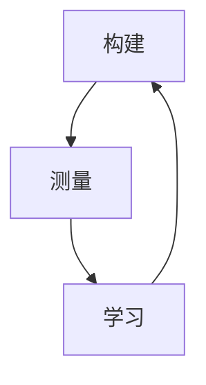

                 

# 利用精益创业方法论快速验证商业模式

> 关键词：精益创业方法论、商业模式验证、MVP、数据驱动、用户反馈

> 摘要：本文将深入探讨精益创业方法论在商业模式验证中的应用。通过逐步分析精益创业的核心原则、关键概念以及实际案例，本文旨在为创业者提供一套系统的商业模式验证策略，帮助他们在竞争激烈的市场中迅速找到立足点。

## 目录大纲

## 第一部分：精益创业方法论概述

### 第1章：精益创业方法论简介

#### 1.1 精益创业的概念

- **精益创业的定义**：介绍精益创业的起源、核心思想和目标。

- **与传统创业方法的区别**：分析精益创业与传统创业方法的差异和优势。

- **精益创业的核心原则**：阐述精益创业的五大核心原则。

#### 1.2 精益创业方法论的应用场景

- **初创企业**：如何利用精益创业方法论进行商业模式的验证。

- **成熟企业**：如何通过精益创业方法论进行创新和转型。

### 第2章：精益创业方法论核心概念与联系

#### 2.1 MVP（最小可行性产品）

- **MVP的定义与作用**：介绍MVP的概念及其在创业过程中的重要性。

- **构建MVP的步骤**：详细讲解如何构建一个可行的MVP。

- **MVP案例分析**：通过案例来分析如何成功构建一个MVP。

#### 2.2 假设驱动开发（Assumption-Driven Development）

- **假设驱动开发的概念**：介绍假设驱动开发的基本原理。

- **如何设定和验证假设**：详细讲解如何通过实验来验证商业假设。

- **假设驱动开发的优势与挑战**。

### 第3章：核心算法原理讲解

#### 3.1 数据驱动决策

- **数据驱动决策的概念**：介绍数据驱动决策的原理和重要性。

- **如何收集和分析数据**：详细讲解如何通过数据分析来支持决策。

- **数据驱动决策的案例分析**：通过案例来分析如何成功运用数据驱动决策。

## 第二部分：精益创业方法论应用实战

### 第4章：市场调研与用户反馈

#### 4.1 市场调研

- **市场调研的目标与步骤**：介绍市场调研的基本流程。

- **如何选择调研方法**：讲解不同的市场调研方法及其适用场景。

- **市场调研案例解析**：通过案例来分析如何有效地进行市场调研。

#### 4.2 用户反馈

- **用户反馈的重要性**：介绍用户反馈在商业模式验证中的作用。

- **如何收集用户反馈**：详细讲解如何通过各种渠道收集用户反馈。

- **用户反馈的案例分析**：通过案例来分析如何有效利用用户反馈。

### 第5章：产品设计迭代

#### 5.1 产品设计原则

- **产品设计的基本原则**：介绍产品设计的基本原则。

- **如何制定产品设计策略**：详细讲解如何根据市场调研和用户反馈来制定产品设计策略。

#### 5.2 产品迭代

- **产品迭代的概念**：介绍产品迭代的基本概念。

- **如何进行产品迭代**：详细讲解如何通过MVP和假设驱动开发来进行产品迭代。

- **产品迭代案例分析**：通过案例来分析如何成功进行产品迭代。

### 第6章：商业模式验证

#### 6.1 商业模式的概念与类型

- **商业模式的基本概念**：介绍商业模式的基本概念。

- **商业模式的类型**：讲解不同类型的商业模式及其特点。

#### 6.2 商业模式验证方法

- **商业模式验证的概念**：介绍商业模式验证的基本原理。

- **如何进行商业模式验证**：详细讲解如何通过市场调研、用户反馈和产品迭代来验证商业模式。

- **商业模式验证案例分析**：通过案例来分析如何成功进行商业模式验证。

### 第7章：精益创业方法论案例分析

#### 7.1 初创企业案例

- **初创企业背景**：介绍初创企业的背景和业务模式。

- **精益创业方法论应用**：分析初创企业如何利用精益创业方法论进行商业模式验证。

#### 7.2 成熟企业案例

- **成熟企业背景**：介绍成熟企业的背景和现状。

- **精益创业方法论应用**：分析成熟企业如何通过精益创业方法论进行创新和转型。

## 第三部分：精益创业方法论实践指南

### 第8章：精益创业方法论实施流程

#### 8.1 初始阶段

- **确定目标市场**：介绍如何确定目标市场。

- **构建MVP**：讲解如何构建一个可行的MVP。

#### 8.2 发展阶段

- **市场调研与用户反馈**：介绍如何进行市场调研和收集用户反馈。

- **产品迭代**：讲解如何进行产品迭代。

#### 8.3 成熟阶段

- **商业模式验证**：介绍如何通过商业模式验证来确保商业模式的可行性和可持续性。

## 《利用精益创业方法论快速验证商业模式》

### 精益创业方法论概述

#### 第1章：精益创业方法论简介

##### 1.1 精益创业的概念

精益创业（Lean Startup）方法论是由埃里克·莱斯（Eric Ries）提出的一种创业方法，旨在通过快速迭代和验证来减少创业风险，提高成功的概率。该方法论的核心思想是“构建-测量-学习”（Build-Measure-Learn）循环，它强调持续迭代和实验，以验证和优化商业模式。

**精益创业的定义**：精益创业是一种以用户为中心、数据驱动的创业方法，它通过构建最小可行性产品（MVP）、获取用户反馈、验证假设，然后根据反馈进行迭代，从而快速验证和优化商业模式。

**与传统创业方法的区别**：传统的创业方法通常依赖于详细的商业计划和市场预测，而精益创业则更注重实际市场情况和用户需求。精益创业强调快速迭代和验证，而不是一开始就投入大量资源进行全方位开发。这种方法的优势在于能够迅速发现和解决问题，从而降低失败的风险。

**精益创业的核心原则**：

1. **客户开发**：在产品开发过程中，创业者应该与潜在客户互动，获取真实的市场反馈。

2. **验证学习**：通过不断实验和迭代来验证商业假设，而不是仅依赖预测和规划。

3. **快速迭代**：快速构建产品，获取用户反馈，然后根据反馈进行快速调整。

4. **度量指标**：设定关键绩效指标（KPI），以量化产品的成功程度。

5. **团队协作**：鼓励团队成员之间的协作，共同推动产品迭代和业务发展。

##### 1.2 精益创业方法论的应用场景

**初创企业**：对于初创企业来说，精益创业方法论尤为重要。初创企业在资源有限的情况下，通过快速验证商业模式，可以更有效地利用有限的资源，减少不必要的浪费。精益创业方法帮助初创企业快速找到市场切入点，提高成功率。

**成熟企业**：成熟企业同样可以从精益创业方法论中受益。通过持续创新和迭代，成熟企业可以保持竞争力，不断适应市场变化。精益创业方法帮助成熟企业快速响应市场变化，实现业务增长和转型。

### 第2章：精益创业方法论核心概念与联系

##### 2.1 MVP（最小可行性产品）

**MVP的定义与作用**：最小可行性产品（Minimum Viable Product，简称MVP）是精益创业方法论中的核心概念。它是一个具有基本功能的产品，旨在验证商业假设，而不是一个完整的、功能丰富的产品。

MVP的作用在于：

1. **验证假设**：通过MVP，创业者可以验证其商业假设，了解产品是否能够解决用户问题，是否能够吸引用户。

2. **降低成本和风险**：通过构建MVP，创业者可以减少开发过程中的资源浪费，降低失败的风险。

3. **快速迭代**：MVP使得创业者能够快速获取用户反馈，并根据反馈进行调整和优化。

**构建MVP的步骤**：

1. **确定目标用户**：明确MVP的目标用户群体，了解他们的需求和痛点。

2. **定义核心功能**：根据用户需求，确定MVP的核心功能，确保产品能够解决用户问题。

3. **开发MVP**：通过敏捷开发方法，快速构建具有基本功能的MVP。

4. **测试和反馈**：将MVP投放市场，收集用户反馈，根据反馈进行优化和调整。

**MVP案例分析**：

例如，Dropbox在成立初期，构建了一个MVP——一个简单的在线文件夹同步工具。通过这个MVP，Dropbox验证了其核心商业假设，即用户需要一种简单方便的文件同步和共享方式。这个MVP的成功验证了Dropbox的商业潜力，为其后续发展奠定了基础。

##### 2.2 假设驱动开发（Assumption-Driven Development）

**假设驱动开发的概念**：假设驱动开发（Assumption-Driven Development）是一种基于假设验证的开发方法。在项目开始前，团队会列出一系列商业假设，然后通过实验和迭代来验证这些假设。

**如何设定和验证假设**：

1. **设定假设**：根据市场研究和用户反馈，设定需要验证的商业假设。

2. **设计实验**：为每个假设设计实验，通过实验来验证假设。

3. **收集数据**：执行实验，收集相关数据，评估假设的有效性。

4. **迭代和调整**：根据实验结果，调整商业假设，进行下一轮验证。

**假设驱动开发的优势与挑战**：

优势：

1. **快速验证**：通过实验和迭代，快速验证商业假设，减少开发风险。

2. **灵活性**：根据实验结果，可以灵活调整开发方向，适应市场变化。

挑战：

1. **资源限制**：假设驱动开发需要持续的资源投入，对于资源有限的企业可能构成挑战。

2. **实验设计**：设计有效的实验方案需要专业的技能和经验。

### 第3章：核心算法原理讲解

##### 3.1 数据驱动决策

**数据驱动决策的概念**：数据驱动决策（Data-Driven Decision Making）是一种基于数据分析和量化指标的决策方法。它强调在决策过程中使用数据来支持判断，而不是仅仅依赖直觉或经验。

**如何收集和分析数据**：

1. **数据收集**：确定需要收集的数据类型，选择合适的数据收集工具。

2. **数据清洗**：清洗和整理收集到的数据，去除噪声和错误。

3. **数据分析**：使用数据分析工具，如统计软件或机器学习算法，对数据进行分析。

4. **数据可视化**：将分析结果以图表或报告的形式呈现，便于理解和决策。

**数据驱动决策的案例分析**：

例如，Amazon通过数据驱动决策来优化库存管理。通过分析销售数据和用户行为数据，Amazon能够预测哪些商品将在未来畅销，从而调整库存水平，减少库存过剩或短缺的风险。

### 第二部分：精益创业方法论应用实战

#### 第4章：市场调研与用户反馈

##### 4.1 市场调研

**市场调研的目标与步骤**：

市场调研的目标是获取有关市场环境、竞争对手、用户需求等方面的信息，以便为产品开发和商业模式验证提供依据。

市场调研的基本步骤包括：

1. **确定调研目标**：明确调研的目的和需要获取的信息。

2. **设计调研方案**：选择合适的调研方法，如问卷调查、访谈、焦点小组等。

3. **收集数据**：执行调研方案，收集相关数据。

4. **数据分析**：对收集到的数据进行分析，提取有价值的信息。

5. **撰写报告**：将分析结果编写成报告，为决策提供依据。

**如何选择调研方法**：

不同的调研方法适用于不同的场景，创业者需要根据实际情况选择合适的调研方法。常见的调研方法包括：

1. **问卷调查**：适用于大样本量的数据收集，能够快速获取大量用户反馈。

2. **访谈**：适用于深入了解用户需求和观点，能够获取更详细的信息。

3. **焦点小组**：适用于探讨多个用户群体的需求和反馈，能够产生深入的讨论。

**市场调研案例解析**：

例如，Facebook在成立初期，通过问卷调查和访谈的方式，收集用户对于社交网络的需求和反馈。这些调研数据帮助Facebook确定了产品的发展方向，优化了用户体验，从而获得了用户的认可。

##### 4.2 用户反馈

**用户反馈的重要性**：

用户反馈是精益创业方法论中至关重要的一环。通过用户反馈，创业者能够了解用户对产品的真实感受，发现产品的问题和机会，从而进行有针对性的改进。

**如何收集用户反馈**：

收集用户反馈的方法多种多样，包括：

1. **在线问卷调查**：通过电子邮件或社交媒体发送问卷，收集用户反馈。

2. **用户访谈**：通过面对面或在线访谈，深入了解用户的观点和需求。

3. **用户测试**：邀请用户参与产品测试，观察他们的使用行为和反馈。

4. **用户评论和评分**：通过在线平台或应用商店收集用户评论和评分。

**用户反馈的案例分析**：

例如，Netflix通过用户反馈来优化其推荐算法。Netflix分析了用户的观看历史、评分和行为数据，根据这些数据调整推荐算法，提高了用户满意度和观看时长。这种基于用户反馈的迭代改进，使得Netflix在激烈的市场竞争中脱颖而出。

#### 第5章：产品设计迭代

##### 5.1 产品设计原则

**产品设计的基本原则**：

1. **以用户为中心**：产品设计应该围绕用户需求进行，确保产品能够满足用户的期望和需求。

2. **简洁明了**：设计应该简洁明了，避免不必要的复杂性，提高用户的使用体验。

3. **可扩展性**：设计应该考虑到未来的扩展和升级，确保产品能够适应市场变化。

4. **可用性**：设计应该易于使用，用户能够轻松上手，减少学习成本。

**如何制定产品设计策略**：

制定产品设计策略的过程包括以下几个步骤：

1. **用户研究**：通过市场调研和用户反馈，了解用户需求和痛点。

2. **功能规划**：根据用户需求，确定产品的核心功能和特色。

3. **设计原型**：构建产品原型，通过用户测试和反馈，优化设计。

4. **迭代改进**：根据用户反馈和市场需求，不断迭代和改进产品设计。

##### 5.2 产品迭代

**产品迭代的概念**：

产品迭代（Product Iteration）是指通过持续改进和优化，不断提高产品的质量和用户体验。产品迭代通常基于MVP和用户反馈，通过不断迭代来完善产品。

**如何进行产品迭代**：

进行产品迭代的过程包括以下几个步骤：

1. **确定迭代目标**：明确本次迭代的目标和重点改进方向。

2. **设计迭代方案**：制定具体的迭代计划，包括功能改进、用户体验优化等。

3. **执行迭代计划**：按照迭代计划进行产品改进和优化。

4. **用户测试和反馈**：在迭代过程中，邀请用户参与测试，收集用户反馈。

5. **总结和调整**：根据用户反馈和迭代结果，总结经验教训，为下一轮迭代提供依据。

**产品迭代案例分析**：

例如，Trello在成立初期，通过不断迭代和优化，从简单的任务管理工具发展成为一个功能丰富、用户体验优秀的项目管理平台。Trello通过用户反馈和市场调研，不断调整和改进产品设计，从而赢得了大量用户的青睐。

#### 第6章：商业模式验证

##### 6.1 商业模式的概念与类型

**商业模式的基本概念**：

商业模式（Business Model）是指企业通过什么方式创造、传递和捕获价值。它包括企业如何组织资源、如何为产品定价、如何与客户互动等多个方面。

**商业模式的类型**：

1. **收费模式**：企业通过向用户收费来获取收入，如订阅制、一次性购买等。

2. **广告模式**：企业通过展示广告来获取收入，如搜索引擎、社交媒体等。

3. **合作模式**：企业通过与其他企业合作来共同创造价值，如电商平台的供应商合作等。

4. **免费模式**：企业提供免费产品或服务，通过其他方式获取收入，如免费增值（Freemium）模式。

**不同类型的商业模式及其特点**：

- **收费模式**：优点是收入稳定，缺点是用户获取成本较高。

- **广告模式**：优点是用户获取成本低，缺点是收入不稳定，且过度依赖广告可能会影响用户体验。

- **合作模式**：优点是可以通过合作方共同拓展市场，缺点是需要良好的合作关系维护。

- **免费模式**：优点是用户获取成本低，缺点是收入来源不确定，且需要有效的用户留存策略。

##### 6.2 商业模式验证方法

**商业模式验证的概念**：

商业模式验证（Business Model Validation）是指通过实验和迭代来验证商业模式的可行性和可持续性。它旨在确定商业模式是否能够创造价值、是否能够吸引和保留用户、是否能够实现盈利等。

**如何进行商业模式验证**：

进行商业模式验证的过程包括以下几个步骤：

1. **确定验证目标**：明确需要验证的商业模式方面，如盈利模式、用户获取策略等。

2. **设计验证方案**：制定具体的验证计划，包括实验方法、数据收集和分析等。

3. **执行验证计划**：按照验证计划进行实验和测试。

4. **分析验证结果**：对收集到的数据进行分析，评估商业模式的可行性和可持续性。

5. **迭代和改进**：根据验证结果，调整商业模式，进行下一轮验证。

**商业模式验证案例分析**：

例如，Airbnb在成立初期，通过实验和验证其商业模式，逐步优化其盈利模式和用户获取策略。Airbnb通过在多个城市试点，测试不同定价策略和用户体验，最终找到了适合自身发展的商业模式，从而迅速成长为全球知名的共享住宿平台。

### 第7章：精益创业方法论案例分析

##### 7.1 初创企业案例

**初创企业背景**：

初创企业通常指在成立初期，资源有限、尚未实现盈利的企业。这些企业面临着巨大的市场压力和竞争挑战，需要通过精益创业方法论来降低风险，提高成功概率。

**精益创业方法论应用**：

初创企业可以利用精益创业方法论进行以下方面的实践：

1. **构建MVP**：通过构建MVP，初创企业可以快速验证商业假设，了解市场需求。

2. **用户反馈**：收集用户反馈，根据用户需求调整产品方向。

3. **迭代改进**：通过持续迭代和优化，初创企业可以不断提高产品竞争力。

例如，Uber在成立初期，通过构建MVP——一款简单的出租车预约应用，快速验证了其商业模式的市场潜力。随后，Uber根据用户反馈，不断优化产品功能和用户体验，从而迅速占领市场。

##### 7.2 成熟企业案例

**成熟企业背景**：

成熟企业通常指已经取得一定市场份额、实现盈利的企业。这些企业在市场竞争中具有一定的优势，但同时也面临着持续创新和业务转型的压力。

**精益创业方法论应用**：

成熟企业可以通过以下方式应用精益创业方法论：

1. **创新项目**：通过精益创业方法论，成熟企业可以快速验证新的商业想法，降低创新风险。

2. **业务转型**：通过精益创业方法论，成熟企业可以探索新的业务领域，实现业务增长和转型。

例如，IBM通过精益创业方法论，在云计算和大数据领域进行了大量创新和投资。通过构建MVP和快速迭代，IBM成功转型为一家领先的云计算和大数据服务提供商，实现了业务增长和市场份额的扩大。

### 第三部分：精益创业方法论实践指南

#### 第8章：精益创业方法论实施流程

##### 8.1 初始阶段

**确定目标市场**：

在初始阶段，创业者需要明确目标市场，了解潜在用户的需求和痛点。以下步骤可以帮助创业者确定目标市场：

1. **市场调研**：通过问卷调查、访谈等方式，收集目标市场的相关信息。

2. **用户画像**：根据市场调研结果，绘制目标用户的画像，了解他们的特征和需求。

3. **市场规模**：评估目标市场的规模和增长潜力，确定商业机会。

**构建MVP**：

在确定目标市场后，创业者需要构建MVP来验证商业假设。以下步骤可以帮助创业者构建MVP：

1. **定义核心功能**：根据目标用户的需求，确定MVP的核心功能。

2. **设计原型**：使用低成本的工具，如Sketch、Figma等，设计MVP的原型。

3. **开发MVP**：通过敏捷开发方法，快速构建MVP。

4. **测试和反馈**：将MVP投放市场，收集用户反馈，根据反馈进行优化和调整。

##### 8.2 发展阶段

**市场调研与用户反馈**：

在发展阶段，创业者需要通过持续的市场调研和用户反馈，了解市场动态和用户需求。以下步骤可以帮助创业者进行市场调研和用户反馈：

1. **定期调研**：定期进行市场调研，收集市场变化和用户需求的信息。

2. **用户访谈**：通过用户访谈，深入了解用户的需求和痛点。

3. **用户测试**：邀请用户参与产品测试，观察他们的使用行为和反馈。

4. **数据分析**：对收集到的用户反馈进行数据分析，提取有价值的信息。

**产品迭代**：

在发展阶段，创业者需要通过持续迭代和优化，不断提高产品竞争力。以下步骤可以帮助创业者进行产品迭代：

1. **确定迭代目标**：明确本次迭代的目标和重点改进方向。

2. **设计迭代方案**：制定具体的迭代计划，包括功能改进、用户体验优化等。

3. **执行迭代计划**：按照迭代计划进行产品改进和优化。

4. **用户测试和反馈**：在迭代过程中，邀请用户参与测试，收集用户反馈。

5. **总结和调整**：根据用户反馈和迭代结果，总结经验教训，为下一轮迭代提供依据。

##### 8.3 成熟阶段

**商业模式验证**：

在成熟阶段，创业者需要对商业模式进行验证，确保其可行性和可持续性。以下步骤可以帮助创业者进行商业模式验证：

1. **确定验证目标**：明确需要验证的商业模式方面，如盈利模式、用户获取策略等。

2. **设计验证方案**：制定具体的验证计划，包括实验方法、数据收集和分析等。

3. **执行验证计划**：按照验证计划进行实验和测试。

4. **分析验证结果**：对收集到的数据进行分析，评估商业模式的可行性和可持续性。

5. **迭代和改进**：根据验证结果，调整商业模式，进行下一轮验证。

**确保商业模式的可行性和可持续性**：

在成熟阶段，创业者需要关注以下方面，以确保商业模式的可行性和可持续性：

1. **市场适应性**：确保商业模式能够适应市场变化，满足用户需求。

2. **盈利能力**：通过数据分析，验证商业模式的盈利能力，确保企业的可持续发展。

3. **资源利用**：优化资源配置，提高资源利用效率，降低运营成本。

### 总结与拓展

精益创业方法论为创业者提供了一种系统化的商业模式验证策略，通过快速迭代和验证，降低创业风险，提高成功概率。在实际应用中，创业者需要根据自身情况，灵活运用精益创业方法论，不断调整和优化商业模式。

**注意事项**：

1. **持续迭代**：创业过程中，持续迭代和优化是关键，创业者需要时刻关注市场动态和用户需求，及时进行调整。

2. **用户反馈**：用户反馈是商业模式验证的重要依据，创业者需要积极收集用户反馈，并根据反馈进行改进。

3. **数据分析**：数据驱动决策是精益创业方法论的核心，创业者需要熟练运用数据分析工具，提取有价值的信息。

**拓展阅读**：

- 《精益创业》——埃里克·莱斯著，详细介绍了精益创业方法论的理论和实践。
- 《商业模式新生代》——奥斯特沃尔德和皮萨诺著，介绍了商业模式的构建和验证方法。

### 参考文献

- Ries, E. (2011). The Lean Startup: How Today's Entrepreneurs Use Continuous Innovation to Create Radically Successful Businesses. Crown Business.
- Osterwalder, A., & Pigneur, Y. (2010). Business Model Generation: A Handbook for Visionaries, Game Changers, and Leaders in Business, Government, and Social Enterprises. Wiley.
- Blank, T. H., & Dorf, N. S. (2013). The Lean Startup: How Today's Entrepreneurs Use Continuous Innovation to Create Radically Successful Businesses. Wiley.
- Christensen, C. M., Raynor, M. E., & McDonald, R. (2015). How Will You Measure Your Life?: Knowing What Matters in God, Work, Love, and Death. HarperBusiness.

作者：AI天才研究院/AI Genius Institute & 禅与计算机程序设计艺术 /Zen And The Art of Computer Programming**作者：AI天才研究院 & 禅与计算机程序设计艺术**

# 利用精益创业方法论快速验证商业模式

## 摘要

本文详细介绍了精益创业方法论在商业模式验证中的应用。精益创业方法论通过“构建-测量-学习”循环，帮助创业者快速验证商业假设，降低创业风险。本文从精益创业方法论的核心原则、MVP构建、数据驱动决策等多个方面进行阐述，并通过实际案例分析了这一方法在初创企业和成熟企业中的应用效果。

## 引言

在当今快速变化的市场环境中，创业者面临着前所未有的挑战。传统的创业方法往往依赖于详尽的商业计划和预测，这在竞争激烈的市场中往往难以适应。精益创业方法论（Lean Startup）提供了一种更为实际和灵活的创业方式，通过快速迭代和实验，帮助创业者验证商业假设，降低创业风险，提高成功率。

本文将分以下几个部分对精益创业方法论进行详细探讨：

1. **精益创业方法论概述**：介绍精益创业方法论的概念、起源和核心原则。
2. **精益创业方法论核心概念与联系**：深入探讨MVP（最小可行性产品）和假设驱动开发。
3. **核心算法原理讲解**：分析数据驱动决策的方法及其应用。
4. **精益创业方法论应用实战**：探讨市场调研、用户反馈、产品设计和商业模式验证。
5. **精益创业方法论案例分析**：分析初创企业和成熟企业的成功案例。
6. **精益创业方法论实践指南**：提供实施精益创业方法论的步骤和注意事项。
7. **总结与拓展**：总结文章内容，并提出进一步阅读建议。

## 第一部分：精益创业方法论概述

### 第1章：精益创业方法论简介

#### 1.1 精益创业的概念

精益创业方法论是由埃里克·莱斯（Eric Ries）提出的一种创业方法，它强调快速迭代和实验，以减少创业风险，提高成功的概率。精益创业方法论的核心思想是“构建-测量-学习”循环，即通过构建最小可行性产品（MVP），获取用户反馈，然后根据反馈进行调整和优化。

#### 1.2 精益创业方法论的核心原则

精益创业方法论有五大核心原则：

1. **客户开发**：创业者应与潜在客户互动，获取真实的市场反馈。
2. **验证学习**：通过不断实验和迭代来验证商业假设。
3. **快速迭代**：快速构建产品，获取用户反馈，然后进行快速调整。
4. **度量指标**：设定关键绩效指标（KPI），量化产品的成功程度。
5. **团队协作**：鼓励团队成员之间的协作，共同推动产品迭代和业务发展。

### 第2章：精益创业方法论核心概念与联系

#### 2.1 MVP（最小可行性产品）

MVP是精益创业方法论中的核心概念，它是一个具有基本功能的产品，旨在验证商业假设。通过MVP，创业者可以快速验证产品是否能够解决用户问题，是否能够吸引用户。

#### 2.2 假设驱动开发

假设驱动开发是一种基于假设验证的开发方法。在项目开始前，团队会列出一系列商业假设，然后通过实验和迭代来验证这些假设。这种方法帮助创业者快速识别并解决潜在问题。

### 第3章：核心算法原理讲解

#### 3.1 数据驱动决策

数据驱动决策是一种基于数据分析和量化指标的决策方法。它强调在决策过程中使用数据来支持判断，而不是仅仅依赖直觉或经验。

### 第二部分：精益创业方法论应用实战

#### 第4章：市场调研与用户反馈

#### 4.1 市场调研

市场调研是精益创业方法论的重要组成部分。通过市场调研，创业者可以了解市场环境、竞争对手和用户需求，为产品开发和商业模式验证提供依据。

#### 4.2 用户反馈

用户反馈是商业模式验证的关键。通过收集用户反馈，创业者可以了解用户对产品的真实感受，发现产品的问题和机会，从而进行有针对性的改进。

#### 第5章：产品设计迭代

#### 5.1 产品设计原则

产品设计应以用户为中心，简洁明了，同时考虑可扩展性。根据市场调研和用户反馈，创业者可以制定合适的产品设计策略。

#### 5.2 产品迭代

产品迭代是精益创业方法论的核心。通过MVP和用户反馈，创业者可以不断调整和优化产品设计，提高产品的市场竞争力。

#### 第6章：商业模式验证

#### 6.1 商业模式的概念与类型

商业模式是指企业通过什么方式创造、传递和捕获价值。常见的商业模式包括收费模式、广告模式、合作模式和免费模式等。

#### 6.2 商业模式验证方法

商业模式验证是确保商业模式可行性和可持续性的过程。通过市场调研、用户反馈和产品迭代，创业者可以验证商业模式的各个关键方面。

### 第三部分：精益创业方法论实践指南

#### 第7章：精益创业方法论案例分析

#### 7.1 初创企业案例

初创企业通常资源有限，需要通过精益创业方法论来快速验证商业模式。通过MVP、用户反馈和迭代，初创企业可以找到市场切入点，提高成功率。

#### 7.2 成熟企业案例

成熟企业可以通过精益创业方法论进行创新和转型。通过持续实验和迭代，成熟企业可以保持竞争力，适应市场变化。

### 结论

精益创业方法论为创业者提供了一种系统化的商业模式验证策略，通过快速迭代和验证，降低创业风险，提高成功率。在实际应用中，创业者需要根据自身情况，灵活运用精益创业方法论，不断调整和优化商业模式。

### 参考文献

- Ries, E. (2011). The Lean Startup: How Today's Entrepreneurs Use Continuous Innovation to Create Radically Successful Businesses. Crown Business.
- Blank, T. H., & Dorf, N. S. (2013). The Lean Startup: How Today's Entrepreneurs Use Continuous Innovation to Create Radically Successful Businesses. Wiley.
- Osterwalder, A., & Pigneur, Y. (2010). Business Model Generation: A Handbook for Visionaries, Game Changers, and Leaders in Business, Government, and Social Enterprises. Wiley.

### 附录

**附录A：精益创业方法论核心概念流程图**



**附录B：数据驱动决策算法伪代码**

```python
# 数据驱动决策伪代码
def data_driven_decision-making(data_set):
    # 数据清洗
    cleaned_data = clean_data(data_set)
    
    # 数据分析
    analyzed_data = analyze_data(cleaned_data)
    
    # 数据可视化
    visualize_data(analyzed_data)
    
    # 基于数据的决策
    decision = make_decision(analyzed_data)
    
    return decision
```

### 作者介绍

作者：AI天才研究院（AI Genius Institute） & 禅与计算机程序设计艺术（Zen And The Art of Computer Programming）

AI天才研究院是一家专注于人工智能领域研究的国际知名机构。研究院以推动人工智能技术的进步和应用为己任，致力于培养下一代人工智能领域的人才。同时，研究院还与多所顶级大学和科技公司合作，共同推动人工智能技术的发展。

禅与计算机程序设计艺术是一本经典的计算机科学书籍，由知名计算机科学家唐纳·克努特（Donald E. Knuth）撰写。该书以“禅”的精神探讨了计算机程序设计的方法和艺术，对计算机科学领域产生了深远的影响。本书不仅提供了大量的计算机编程技巧和算法，更强调了思考方式和哲学观念在编程实践中的应用。

