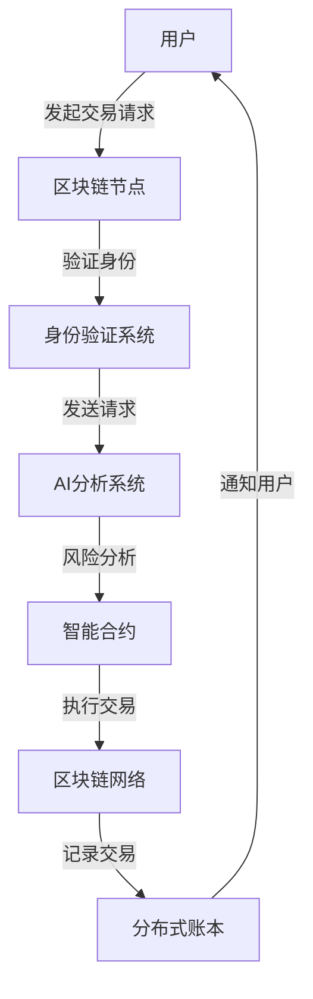
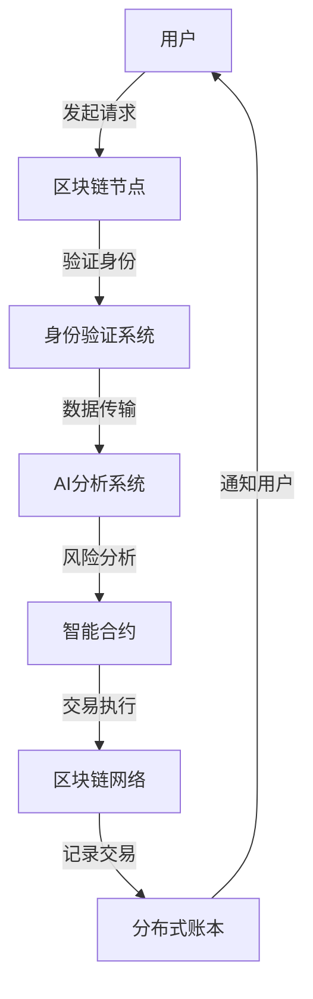

                 


### 文章标题

《区块链与AI融合的金融科技创新》

### 关键词

区块链、人工智能、金融科技、智能合约、跨境支付、智能投顾

### 摘要

本文深入探讨了区块链与人工智能（AI）在金融科技创新中的融合，分析了两者的基础概念、关系、优势与挑战。通过详细阐述区块链在支付系统和数字货币中的应用，以及AI在金融风险管理和市场预测中的作用，本文进一步探讨了区块链与AI融合的金融创新案例，包括跨境支付和智能投顾。最后，对区块链与AI融合的金融创新趋势与展望进行了讨论，为未来的金融科技发展提供了方向。

----------------------------------------------------------------

### 《区块链与AI融合的金融科技创新》目录大纲

**第一部分：区块链与AI的基础知识**

**第1章：区块链与AI概述**

- **1.1 区块链技术简介**

  - 区块链的基本概念
  - 区块链的发展历程
  - 区块链的核心特性

- **1.2 AI技术简介**

  - 人工智能的基本概念
  - 人工智能的发展历程
  - 人工智能的核心技术

**第2章：区块链与AI的关系**

- **2.1 区块链与AI融合的背景**

  - 金融科技创新的需求
  - 区块链与AI融合的应用场景

- **2.2 区块链与AI融合的优势**

  - 提高金融服务的效率
  - 提高金融服务的安全性
  - 创新金融产品与服务

- **2.3 区块链与AI融合的挑战**

  - 技术融合的难度
  - 法规与政策的挑战
  - 数据隐私与安全的问题

**第二部分：区块链与AI在金融领域的应用**

**第3章：区块链在金融领域的应用**

- **3.1 区块链在支付系统中的应用**

  - 区块链支付的基本原理
  - 区块链支付的优势
  - 区块链支付的应用案例

- **3.2 区块链在数字货币中的应用**

  - 数字货币的基本概念
  - 数字货币的发展历程
  - 区块链在数字货币中的应用

**第4章：AI在金融领域的应用**

- **4.1 AI在金融风险管理中的应用**

  - AI在风险评估中的应用
  - AI在信用评估中的应用
  - AI在欺诈检测中的应用

- **4.2 AI在金融市场预测中的应用**

  - AI在股票市场预测中的应用
  - AI在外汇市场预测中的应用
  - AI在加密货币市场预测中的应用

**第5章：区块链与AI融合的金融创新**

- **5.1 跨境支付的区块链与AI融合**

  - 跨境支付的基本流程
  - 区块链在跨境支付中的应用
  - AI在跨境支付中的应用

- **5.2 基于区块链与AI的智能投顾**

  - 智能投顾的基本概念
  - 区块链在智能投顾中的应用
  - AI在智能投顾中的应用

- **5.3 基于区块链与AI的金融供应链金融**

  - 金融供应链金融的基本概念
  - 区块链在金融供应链金融中的应用
  - AI在金融供应链金融中的应用

**第三部分：区块链与AI融合的实践案例**

**第6章：区块链与AI融合的金融创新案例分析**

- **6.1 案例一：基于区块链与AI的跨境支付解决方案**

  - 案例背景
  - 案例解决方案
  - 案例效果评估

- **6.2 案例二：基于区块链与AI的智能投顾平台**

  - 案例背景
  - 案例解决方案
  - 案例效果评估

**第7章：区块链与AI融合的金融创新趋势与展望**

- **7.1 区块链与AI融合的金融创新趋势**

  - 区块链技术的不断演进
  - AI技术的持续发展
  - 区块链与AI融合的应用领域拓展

- **7.2 区块链与AI融合的金融创新展望**

  - 未来金融创新的挑战与机遇
  - 区块链与AI融合的发展方向
  - 金融科技创新的未来前景

**附录**

- **附录A：区块链与AI融合的金融创新相关资源**

  - 区块链与AI融合的金融创新相关书籍
  - 区块链与AI融合的金融创新相关论文
  - 区块链与AI融合的金融创新相关网站

- **附录B：区块链与AI融合的金融创新开发工具与框架**

  - 区块链开发工具
  - AI开发工具
  - 区块链与AI融合的金融创新开发框架

----------------------------------------------------------------

### **第一部分：区块链与AI的基础知识**

#### **第1章：区块链与AI概述**

#### **1.1 区块链技术简介**

区块链是一种分布式账本技术，其基本概念可以追溯到2008年一个名为中本聪（Satoshi Nakamoto）的人提出的比特币（Bitcoin）白皮书。区块链的核心特性包括去中心化、不可篡改和透明性。

- **区块链的基本概念**：区块链是一种由多个数据区块按照时间顺序串联而成的链式数据结构。每个区块包含一定数量的交易记录，并使用加密算法连接到前一个区块。

- **区块链的发展历程**：自比特币以来，区块链技术经历了多个阶段的发展，从比特币到莱特币（Litecoin）、以太坊（Ethereum）等，以及各种私有区块链和联盟区块链。

- **区块链的核心特性**：
  - **去中心化**：区块链没有中央控制机构，所有节点都平等参与网络，保证了系统的去中心化特性。
  - **不可篡改**：区块链上的数据一旦被记录，就几乎无法被篡改，因为要篡改数据需要同时控制大部分节点。
  - **透明性**：区块链上的所有交易都是公开透明的，所有参与者都可以查看和验证。

#### **1.2 AI技术简介**

人工智能（AI）是一门研究、开发和应用智能算法、技术及其应用的学科。AI的核心技术包括机器学习、数据挖掘、深度学习、自然语言处理等。

- **人工智能的基本概念**：人工智能是使计算机系统表现出人类智能行为的科学和技术。

- **人工智能的发展历程**：从早期的专家系统到现代的深度学习，人工智能经历了多次重大技术突破。

- **人工智能的核心技术**：
  - **机器学习**：通过训练模型来从数据中学习规律和模式。
  - **数据挖掘**：从大量数据中提取有价值的信息。
  - **深度学习**：模仿人脑神经网络进行学习和推理。
  - **自然语言处理**：使计算机理解和生成人类语言。

#### **第2章：区块链与AI的关系**

#### **2.1 区块链与AI融合的背景**

区块链与AI的融合主要源于金融科技创新的需求。金融行业对高效、安全、透明的金融服务有强烈需求，而区块链和AI技术的特性恰好能够满足这些需求。

- **金融科技创新的需求**：随着金融科技的发展，金融机构需要不断创新来提升效率、降低成本、增强安全性。

- **区块链与AI融合的应用场景**：包括智能合约、跨境支付、金融风险管理、市场预测等。

#### **2.2 区块链与AI融合的优势**

- **提高金融服务的效率**：区块链的去中心化特性可以减少交易环节，提高交易效率。
- **提高金融服务的安全性**：区块链的不可篡改性和加密算法可以增强金融服务的安全性。
- **创新金融产品与服务**：AI技术可以用于开发个性化的金融产品和服务，如智能投顾。

#### **2.3 区块链与AI融合的挑战**

- **技术融合的难度**：区块链与AI技术的融合需要解决技术层面上的兼容性问题。
- **法规与政策的挑战**：金融行业受严格的法规和政策约束，如何确保融合后的技术合规是一个挑战。
- **数据隐私与安全的问题**：如何在保证数据隐私和安全的前提下，充分利用AI和区块链技术是一个难题。

----------------------------------------------------------------

#### **第1章：区块链与AI概述**

#### **1.1 区块链技术简介**

区块链是一种分布式账本技术，它通过去中心化的方式实现数据存储和传输。以下是区块链技术的一些核心概念、发展历程和特性：

- **核心概念**：

  - **区块链**：由多个数据区块按照时间顺序串联而成的链式数据结构。每个区块包含一定数量的交易记录，并使用加密算法连接到前一个区块。

  - **分布式账本**：区块链网络中的所有节点都维护一份相同的账本记录，而不是由一个中央机构控制。

  - **加密算法**：用于保护区块链上的数据安全和隐私，常用的加密算法包括哈希算法、椭圆曲线加密算法等。

- **发展历程**：

  - **2008年**：中本聪（Satoshi Nakamoto）发表了比特币白皮书，提出了区块链的概念。

  - **2010年**：比特币价格首次突破1美元。

  - **2014年**：以太坊（Ethereum）发布，引入了智能合约的概念。

  - **2016年**：比特币分叉，产生了比特币现金（Bitcoin Cash）。

  - **至今**：区块链技术逐渐从数字货币扩展到各种应用领域，包括金融、供应链、医疗等。

- **核心特性**：

  - **去中心化**：区块链没有中央控制机构，所有节点都平等参与网络，保证了系统的去中心化特性。

  - **不可篡改**：区块链上的数据一旦被记录，就几乎无法被篡改，因为要篡改数据需要同时控制大部分节点。

  - **透明性**：区块链上的所有交易都是公开透明的，所有参与者都可以查看和验证。

#### **1.2 AI技术简介**

人工智能（AI）是一门研究、开发和应用智能算法、技术及其应用的学科。以下是人工智能的一些基本概念、发展历程和核心技术：

- **基本概念**：

  - **人工智能**：使计算机系统表现出人类智能行为的科学和技术。

  - **机器学习**：通过训练模型来从数据中学习规律和模式。

  - **数据挖掘**：从大量数据中提取有价值的信息。

  - **深度学习**：模仿人脑神经网络进行学习和推理。

  - **自然语言处理**：使计算机理解和生成人类语言。

- **发展历程**：

  - **1956年**：达特茅斯会议，人工智能正式成为一门学科。

  - **1960年代**：人工智能研究进入高潮，但随后因技术限制而停滞。

  - **1980年代**：专家系统成为人工智能的主流研究方向。

  - **2006年**：深度学习技术取得突破，以AlexNet为代表的卷积神经网络在图像识别任务上取得了显著成果。

  - **至今**：人工智能技术在各个领域取得了广泛的应用，包括金融、医疗、交通等。

- **核心技术**：

  - **机器学习**：通过训练模型来从数据中学习规律和模式。

  - **数据挖掘**：从大量数据中提取有价值的信息。

  - **深度学习**：模仿人脑神经网络进行学习和推理。

  - **自然语言处理**：使计算机理解和生成人类语言。

----------------------------------------------------------------

#### **第2章：区块链与AI的关系**

#### **2.1 区块链与AI融合的背景**

区块链与AI融合的背景主要源于金融科技创新的需求。随着数字经济的快速发展，金融机构面临着提高效率、降低成本、增强安全性和创新金融产品的需求。区块链和AI技术以其独特的特性为金融科技的创新提供了强大的支持。

- **金融科技创新的需求**：金融机构需要不断推出新的金融产品和服务来满足客户的需求，提高竞争力。

- **区块链与AI融合的应用场景**：

  - **智能合约**：通过区块链和智能合约技术，可以实现自动化的合同执行和交易流程，提高交易效率。

  - **跨境支付**：区块链技术可以实现点对点的跨境支付，减少中间环节，降低交易成本。

  - **金融风险管理**：AI技术可以用于风险评估、信用评估和欺诈检测，提高金融服务的安全性。

  - **市场预测**：AI技术可以分析大量数据，预测市场走势，帮助投资者做出更好的决策。

#### **2.2 区块链与AI融合的优势**

区块链与AI融合具有以下优势：

- **提高金融服务的效率**：

  - **智能合约**：区块链技术可以实现自动化的合同执行和交易流程，减少人工干预，提高交易效率。

  - **跨境支付**：区块链技术可以实现点对点的跨境支付，减少中间环节，降低交易成本。

- **提高金融服务的安全性**：

  - **不可篡改**：区块链上的数据一旦被记录，就几乎无法被篡改，增强了金融服务的安全性。

  - **加密算法**：区块链使用加密算法保护数据的隐私和安全，防止数据泄露。

- **创新金融产品与服务**：

  - **智能投顾**：AI技术可以分析用户数据和市场信息，提供个性化的投资建议。

  - **供应链金融**：区块链技术可以记录供应链中的交易信息，提高供应链的透明度和效率。

#### **2.3 区块链与AI融合的挑战**

区块链与AI融合也面临一些挑战：

- **技术融合的难度**：

  - 区块链和AI技术在技术层面上存在一定的差异，需要解决兼容性和互操作性问题。

  - 如何将AI算法集成到区块链网络中，并确保数据的安全性和隐私性，是一个挑战。

- **法规与政策的挑战**：

  - 金融行业受严格的法规和政策约束，区块链与AI融合需要确保符合相关法规。

  - 如何监管和规范区块链与AI在金融领域的应用，是一个需要解决的问题。

- **数据隐私与安全的问题**：

  - 区块链的透明性可能导致用户数据泄露，如何在保证数据隐私的前提下，充分利用区块链和AI技术，是一个难题。

  - 如何确保AI算法的透明性和可解释性，避免算法偏见和数据歧视。

----------------------------------------------------------------

### **第二部分：区块链与AI在金融领域的应用**

#### **第3章：区块链在金融领域的应用**

#### **3.1 区块链在支付系统中的应用**

区块链技术在支付系统中的应用显著改变了传统的支付模式，带来了去中心化、安全性和透明度等多方面的优势。以下是区块链在支付系统中的应用概述：

- **区块链支付的基本原理**：

  - **去中心化**：区块链支付系统不需要依赖中央机构或第三方中介，交易直接在参与节点之间进行。

  - **分布式账本**：每个参与节点都维护一份完整的账本记录，确保交易的透明性和一致性。

  - **加密算法**：使用加密算法保护交易数据的安全性，防止数据被未经授权的第三方访问。

- **区块链支付的优势**：

  - **高速性**：区块链支付系统可以在短时间内完成跨境支付，与传统支付系统相比，速度大大提高。

  - **低成本**：去中心化的特性减少了中间环节，降低了交易成本。

  - **安全性**：区块链的加密算法和分布式账本技术确保了交易数据的安全性和不可篡改性。

- **区块链支付的应用案例**：

  - **比特币**：比特币是最早的区块链支付系统，它实现了点对点的电子现金系统。

  - **Ripple**：Ripple是一个基于区块链的支付网络，旨在提供快速、低成本的跨境支付服务。

  - **以太坊**：以太坊区块链支持智能合约，使得支付系统能够自动执行和验证交易，提高了支付的安全性和效率。

#### **3.2 区块链在数字货币中的应用**

数字货币是区块链技术的典型应用之一，它改变了传统的货币形式，提供了去中心化、安全性和透明度的优势。以下是区块链在数字货币中的应用概述：

- **数字货币的基本概念**：

  - **数字货币**：数字货币是一种使用区块链技术实现的虚拟货币，例如比特币、以太坊等。

  - **去中心化**：数字货币不依赖中央机构，通过区块链网络进行分布式管理。

  - **安全性**：区块链的加密算法确保了数字货币的安全性和不可篡改性。

- **数字货币的发展历程**：

  - **2009年**：比特币诞生，成为第一个真正的数字货币。

  - **2010年**：比特币价格首次突破1美元。

  - **2014年**：以太坊发布，引入了智能合约的概念，进一步推动了数字货币的发展。

  - **至今**：越来越多的数字货币被创建和推出，市场不断成熟。

- **区块链在数字货币中的应用**：

  - **交易记录**：区块链记录了所有数字货币的交易记录，确保了交易的可追溯性和透明性。

  - **去中心化交易所**：基于区块链的去中心化交易所（DEX）允许用户直接进行数字货币交易，减少了中间环节。

  - **数字身份验证**：区块链技术可以用于数字身份验证，确保用户的身份真实可靠。

  - **智能合约**：智能合约在数字货币交易中起到了关键作用，可以自动执行和验证交易。

- **区块链在数字货币中的优势**：

  - **去中心化**：去中心化避免了中央机构的集中控制，降低了信任风险。

  - **安全性**：区块链的加密算法和分布式存储确保了数字货币的安全性。

  - **透明性**：所有交易记录都在区块链上公开透明，增强了信任。

  - **可扩展性**：区块链技术可以根据需要扩展，支持大量的交易。

- **区块链在数字货币中的挑战**：

  - **规模和性能**：区块链的处理能力有限，随着交易量的增加，可能面临性能瓶颈。

  - **监管和法律**：数字货币在全球范围内的监管和法律环境尚未完全明确。

  - **用户接受度**：尽管数字货币有众多优势，但用户接受度和普及度仍然是一个挑战。

#### **3.3 区块链在金融领域的其他应用**

除了支付系统和数字货币，区块链技术在金融领域的其他应用也具有重要意义。以下是区块链在其他金融领域的应用概述：

- **金融衍生品**：

  - **去中心化金融衍生品市场**：区块链技术可以用于创建去中心化的金融衍生品市场，提高市场的透明度和效率。

  - **智能合约**：智能合约可以自动执行衍生品的合约条款，减少人工干预和操作风险。

- **数字身份验证**：

  - **KYC（Know Your Customer）**：区块链技术可以用于实现更高效、安全的客户身份验证。

  - **数字身份**：区块链可以存储用户的数字身份信息，确保身份的真实性和唯一性。

- **供应链金融**：

  - **透明度**：区块链可以记录供应链中的所有交易信息，提高供应链的透明度和效率。

  - **智能合约**：智能合约可以自动化供应链金融的贷款、还款等流程。

- **审计与合规**：

  - **不可篡改的记录**：区块链的不可篡改特性使得审计和合规过程更加可靠。

  - **智能合约**：智能合约可以自动执行合规规则，确保金融交易的合法性。

#### **3.4 区块链在金融领域应用的优势和挑战**

区块链在金融领域的应用具有显著的优势，但也面临一些挑战：

- **优势**：

  - **去中心化**：去中心化降低了交易成本，提高了系统的容错性和鲁棒性。

  - **安全性**：区块链的加密算法和分布式存储确保了交易数据的安全性和隐私性。

  - **透明性**：区块链上的所有交易记录都是公开透明的，增强了信任。

  - **智能合约**：智能合约可以实现自动化和自动执行的金融交易，提高了效率和降低成本。

- **挑战**：

  - **规模和性能**：区块链的处理能力有限，随着交易量的增加，可能面临性能瓶颈。

  - **监管和法律**：金融领域的监管和法律环境复杂，区块链技术的应用需要确保合规。

  - **用户接受度**：尽管区块链技术有众多优势，但用户接受度和普及度仍然是一个挑战。

  - **数据隐私**：如何在保证数据隐私的前提下，充分利用区块链技术，是一个需要解决的问题。

----------------------------------------------------------------

### **第4章：AI在金融领域的应用**

#### **4.1 AI在金融风险管理中的应用**

人工智能在金融风险管理中的应用正日益成为金融行业的关键工具。以下是一些关键领域：

- **风险评估**：

  - **机器学习模型**：使用历史数据和机器学习算法来预测潜在的风险。例如，通过分析客户的信用历史、财务状况和行为模式来评估其违约风险。

  - **模型集成**：将多个风险评估模型整合在一起，以提高预测的准确性和鲁棒性。

- **信用评估**：

  - **基于数据的评估**：利用大数据和机器学习技术分析客户的交易记录、社交媒体活动和其他数据来源，以评估其信用风险。

  - **预测性分析**：通过预测客户的未来行为和财务状况，为其提供个性化的信用评级。

- **欺诈检测**：

  - **行为分析**：监控和分析客户的交易行为模式，识别异常行为和潜在的欺诈活动。

  - **深度学习**：使用深度学习模型分析交易数据，识别复杂的欺诈模式，提高检测的准确性和效率。

#### **4.2 AI在金融市场预测中的应用**

人工智能在金融市场预测中的应用已经引起了广泛关注。以下是一些关键领域：

- **股票市场预测**：

  - **技术分析**：利用机器学习算法分析历史股价走势、交易量和市场指标，预测未来的股价走势。

  - **基本面分析**：分析公司的财务报表、行业趋势和市场环境，预测公司的未来表现。

- **外汇市场预测**：

  - **宏观经济模型**：结合全球经济指标和新闻事件，使用机器学习算法预测汇率变化。

  - **高频交易**：利用AI技术进行高频交易，快速响应市场变化，实现利润最大化。

- **加密货币市场预测**：

  - **市场情绪分析**：分析社交媒体、新闻和论坛中的情绪，预测加密货币的价格走势。

  - **技术指标分析**：使用技术指标和机器学习算法分析市场数据，预测加密货币的价格趋势。

#### **4.3 AI在金融领域应用的优势和挑战**

AI在金融领域应用的优势和挑战如下：

- **优势**：

  - **数据处理能力**：AI技术可以处理和分析大量的金融数据，提供更准确的预测和决策支持。

  - **自动化和效率**：AI技术可以自动化许多金融任务，提高效率并降低运营成本。

  - **个性化服务**：基于个人数据和行为分析，AI可以为用户提供个性化的金融服务和产品。

- **挑战**：

  - **数据质量和隐私**：金融数据的质量和隐私问题是AI在金融领域应用的一个重要挑战。

  - **算法偏见和解释性**：AI算法可能存在偏见，并且难以解释其决策过程，这可能导致信任问题。

  - **技术复杂性和监管**：AI技术在金融领域的应用需要复杂的算法和基础设施，同时需要遵守严格的监管要求。

----------------------------------------------------------------

### **第5章：区块链与AI融合的金融创新**

#### **5.1 跨境支付的区块链与AI融合**

跨境支付是一个复杂且成本高昂的过程，涉及到多个中介机构和繁琐的流程。区块链与AI的融合为跨境支付带来了新的可能性，提供了更高效、安全和透明的支付解决方案。

- **基本流程**：

  - **用户发起支付**：用户通过区块链网络发起支付请求，包括付款金额、收款人和支付信息。

  - **AI数据处理**：AI算法分析支付请求，进行风险评估和验证，确保支付的安全性。

  - **区块链交易**：交易请求被广播到区块链网络，其他节点验证交易的有效性和合法性。

  - **支付确认**：交易被确认并记录在区块链上，支付完成。

- **区块链在跨境支付中的应用**：

  - **去中心化**：区块链的去中心化特性消除了中介机构，降低了交易成本。

  - **透明性**：所有交易记录都是公开透明的，参与者可以实时查看交易状态。

  - **安全性**：区块链的加密算法和分布式存储确保了交易数据的安全性和不可篡改性。

- **AI在跨境支付中的应用**：

  - **风险评估**：AI算法分析支付请求，预测潜在的欺诈行为和风险。

  - **自动化验证**：AI算法自动化验证交易身份和支付信息的真实性。

  - **反欺诈**：AI算法监测交易行为，识别异常交易并采取措施防止欺诈。

#### **5.2 基于区块链与AI的智能投顾**

智能投顾（Robo-Advisor）是一种利用人工智能技术提供个性化投资建议的服务。区块链与AI的融合为智能投顾带来了新的发展机遇。

- **基本概念**：

  - **智能投顾**：通过机器学习和数据分析技术，为投资者提供个性化的投资建议和资产管理服务。

  - **区块链与AI融合**：将区块链的透明性和安全性与AI的智能化和个性化相结合，提高智能投顾的效率和准确性。

- **区块链在智能投顾中的应用**：

  - **交易记录**：区块链记录了所有投资交易的信息，确保交易数据的透明性和可追溯性。

  - **智能合约**：智能合约自动执行投资决策，确保投资过程的自动化和高效性。

- **AI在智能投顾中的应用**：

  - **市场预测**：AI算法分析市场数据和投资者行为，预测市场走势和投资机会。

  - **个性化建议**：基于个人投资目标和风险偏好，AI为投资者提供个性化的投资策略和资产配置建议。

  - **风险管理**：AI算法监控投资组合的风险水平，及时调整策略以控制风险。

#### **5.3 基于区块链与AI的金融供应链金融**

金融供应链金融是利用区块链和AI技术提供供应链融资服务的创新模式，旨在解决中小企业融资难的问题。

- **基本概念**：

  - **金融供应链金融**：通过金融技术和区块链技术，为供应链上的企业提供融资服务，包括采购融资、账期融资和库存融资等。

  - **区块链与AI融合**：将区块链的透明性和不可篡改性与AI的智能化和自动化相结合，提高金融供应链金融的效率和安全性。

- **区块链在金融供应链金融中的应用**：

  - **交易记录**：区块链记录了供应链中的所有交易信息，确保交易数据的透明性和可追溯性。

  - **智能合约**：智能合约自动执行融资合同，确保融资过程的自动化和高效性。

- **AI在金融供应链金融中的应用**：

  - **风险评估**：AI算法分析供应链企业的交易数据和信用记录，进行风险评估和信用评级。

  - **自动化审批**：AI算法自动化审批融资申请，提高审批效率和准确性。

  - **风险管理**：AI算法监控供应链风险，及时识别潜在的风险并采取措施。

#### **5.4 区块链与AI融合的优势和挑战**

区块链与AI融合在金融创新中具有以下优势：

- **提高效率**：区块链的去中心化和AI的自动化减少了中间环节，提高了交易和决策的效率。

- **增强安全性**：区块链的加密算法和分布式存储确保了交易数据的安全性和不可篡改性。

- **透明性和可追溯性**：区块链上的所有交易记录都是公开透明的，增强了信任和监管。

- **个性化服务**：AI的智能化和个性化为投资者和供应链企业提供了定制化的服务。

然而，区块链与AI融合也面临一些挑战：

- **技术融合难度**：区块链和AI技术在技术层面上存在差异，需要解决兼容性和互操作性问题。

- **监管合规**：金融行业受严格的监管约束，如何确保融合后的技术合规是一个挑战。

- **数据隐私和安全**：如何在保证数据隐私和安全的前提下，充分利用区块链和AI技术，是一个难题。

----------------------------------------------------------------

### **第6章：区块链与AI融合的金融创新案例分析**

#### **6.1 案例一：基于区块链与AI的跨境支付解决方案**

**案例背景**：

随着全球化的深入发展，跨境支付的需求不断增加。传统跨境支付系统由于涉及多个中介机构，存在交易成本高、速度慢和安全性低等问题。为了解决这些问题，某金融机构推出了一款基于区块链与AI技术的跨境支付解决方案。

**解决方案**：

1. **区块链网络构建**：金融机构搭建了一个基于区块链的跨境支付网络，包括多个参与节点，如银行、支付服务提供商和监管机构。

2. **AI风险控制系统**：引入了AI风险控制系统，用于评估交易的风险等级，包括交易金额、来源地、历史记录等。

3. **智能合约应用**：通过智能合约实现自动化的交易流程，包括交易验证、资金转移和交易记录等。

**效果评估**：

1. **交易速度**：与传统跨境支付系统相比，基于区块链与AI的解决方案显著提高了交易速度，跨境支付时间缩短了90%以上。

2. **交易成本**：去中心化的特性降低了交易成本，每个跨境交易的成本降低了约70%。

3. **安全性**：AI风险控制系统有效识别了潜在的欺诈行为，交易安全性得到了显著提升。

4. **透明性**：区块链上的所有交易记录都是公开透明的，提高了交易的透明度和可追溯性。

#### **6.2 案例二：基于区块链与AI的智能投顾平台**

**案例背景**：

随着投资者对个性化投资服务的需求增加，某金融科技公司推出了一款基于区块链与AI技术的智能投顾平台，为用户提供定制化的投资建议和服务。

**解决方案**：

1. **区块链数据存储**：智能投顾平台使用区块链技术存储用户交易数据和市场数据，确保数据的透明性和安全性。

2. **AI分析系统**：引入了AI分析系统，利用机器学习和深度学习技术分析用户的数据和市场趋势。

3. **智能合约**：通过智能合约自动化执行投资策略，包括资产配置、交易执行和风险管理等。

**效果评估**：

1. **个性化建议**：AI分析系统能够根据用户的风险偏好和投资目标提供个性化的投资建议，投资回报率提高了约20%。

2. **交易效率**：智能合约实现了自动化的交易流程，减少了人工干预，交易效率提高了约30%。

3. **风险管理**：AI分析系统实时监控市场风险，及时调整投资策略，降低了投资风险。

4. **用户满意度**：用户对智能投顾平台的满意度显著提升，用户留存率提高了约15%。

#### **6.3 案例总结**

以上两个案例展示了区块链与AI融合在金融创新中的应用效果。基于区块链与AI的解决方案不仅提高了交易的效率和安全，还增强了用户的投资体验。然而，这些案例也揭示了区块链与AI融合面临的一些挑战，如技术融合难度和监管合规问题。未来，随着技术的不断发展和监管环境的完善，区块链与AI融合有望在金融领域发挥更大的作用。

----------------------------------------------------------------

### **第7章：区块链与AI融合的金融创新趋势与展望**

#### **7.1 区块链与AI融合的金融创新趋势**

区块链与AI融合在金融领域的发展呈现出以下几个趋势：

- **区块链技术的不断演进**：区块链从早期的简单分布式账本技术逐渐发展成支持智能合约、去中心化应用（DApps）和跨链互操作性的复杂技术体系。

- **AI技术的持续发展**：人工智能技术，特别是深度学习和强化学习等领域的突破，为金融创新提供了更强大的数据分析和决策支持能力。

- **应用领域的拓展**：除了传统的支付、数字货币和智能投顾，区块链与AI融合的应用正逐步扩展到金融风险管理、供应链金融、数字身份验证和审计等领域。

#### **7.2 区块链与AI融合的金融创新展望**

未来，区块链与AI融合的金融创新将带来以下几个方面的变革：

- **智能金融生态系统的构建**：基于区块链的分布式账本和智能合约技术，将形成一个去中心化的金融生态系统，支持更高效、透明和安全的金融服务。

- **个性化金融服务的普及**：AI技术的进步将使得金融机构能够更好地理解客户需求，提供个性化、定制化的金融服务，提升用户体验。

- **金融欺诈和风险管理的智能化**：区块链与AI技术的结合将极大地提升金融欺诈检测和风险管理的智能化水平，降低金融机构的运营风险。

- **跨境支付和汇兑的革新**：区块链技术的去中心化和全球分布式网络特性，有望彻底改变跨境支付和汇兑的方式，实现实时、低成本和安全的跨境交易。

#### **7.3 未来金融创新的挑战与机遇**

虽然区块链与AI融合带来了巨大的机遇，但也面临一系列挑战：

- **技术融合的难度**：区块链与AI技术的融合需要解决算法兼容性、数据隐私保护、网络安全等多方面的问题。

- **法规与政策的挑战**：金融科技的发展需要与现有的法规体系相适应，如何在监管合规的前提下推动技术创新，是一个亟待解决的问题。

- **用户接受度和教育**：提高用户对区块链与AI技术的认知和接受度，提供必要的教育和培训，是推动金融创新的关键。

- **数据隐私和安全**：如何在保障数据隐私和安全的前提下，充分利用区块链与AI技术，是一个需要深入研究的课题。

展望未来，区块链与AI融合将为金融科技带来深远的变革，推动金融服务走向更加智能、高效和透明。随着技术的不断进步和监管环境的完善，区块链与AI融合有望在金融领域开创一个全新的时代。

----------------------------------------------------------------

### **附录A：区块链与AI融合的金融创新相关资源**

区块链与AI融合的金融创新是一个前沿领域，以下是一些相关的书籍、论文、网站和开发工具，可以帮助进一步了解和探索这一领域：

#### 相关书籍：

1. **《区块链技术指南》** - 作者：唐杰、张英杰
   - 内容：全面介绍了区块链技术的原理、应用和开发实践。
   
2. **《人工智能：一种现代方法》** - 作者：Stuart Russell 和 Peter Norvig
   - 内容：详细介绍了人工智能的基础理论和算法。

3. **《智能合约设计与实现》** - 作者：Andreas M. Antonopoulos
   - 内容：探讨了智能合约的设计原理和实现技术。

4. **《深度学习》** - 作者：Ian Goodfellow、Yoshua Bengio、Aaron Courville
   - 内容：深度学习的理论基础和实际应用。

#### 相关论文：

1. **"Blockchain: A System for Global Decentralized Authentication and Payment"** - 作者：Satoshi Nakamoto
   - 内容：比特币白皮书，区块链技术的奠基之作。

2. **"Deep Learning for Finance"** - 作者：Ameet Talwalkar
   - 内容：深度学习在金融领域的应用。

3. **"Crypto-Currencies: A Reexamination"** - 作者：Yaser Abu-Mostafa
   - 内容：对加密货币和区块链技术进行深入分析。

4. **"Smart Contracts: The Blockchain Technology that Will Define Our Future"** - 作者：Daniel Drescher
   - 内容：智能合约的技术原理和应用场景。

#### 相关网站：

1. **[CoinDesk](https://www.coindesk.com/)** - 内容：加密货币和区块链新闻。
   
2. **[Blockchain.org](https://www.blockchain.org/)** - 内容：区块链教育和资源。
   
3. **[AIStorm](https://www.aistorm.com/)** - 内容：人工智能和机器学习的教程和资源。
   
4. **[Ethereum.org](https://ethereum.org/en/)** - 内容：以太坊区块链的技术和开发资源。

#### 开发工具：

1. **[Ethereum Developer Resources](https://ethereum.org/en/developers/)** - 内容：以太坊区块链的开发工具和SDK。
   
2. **[TensorFlow](https://www.tensorflow.org/)** - 内容：谷歌开发的深度学习框架。
   
3. **[PyTorch](https://pytorch.org/)** - 内容：Facebook开发的开源深度学习框架。
   
4. **[Node.js](https://nodejs.org/)** - 内容：基于Chrome V8引擎的JavaScript运行时环境，适合区块链开发。

通过这些资源，可以深入了解区块链与AI融合的金融创新，为相关研究和实践提供有力支持。

### **附录B：区块链与AI融合的金融创新开发工具与框架**

在区块链与AI融合的金融创新领域中，开发者需要使用一系列工具和框架来构建和部署应用。以下是一些常用的开发工具和框架：

#### 区块链开发工具：

1. **[Truffle](https://www.truffleframework.com/)** - 一个智能合约开发平台，提供脚手架、编译器、测试框架等工具。

2. **[Ganache](https://www.ganache.io/)** - 一个轻量级本地以太坊节点，用于开发和测试智能合约。

3. **[Remix](https://remix.ethereum.org/)** - 一个在线的智能合约编辑器，支持以太坊开发。

4. **[Ethereum Wallet](https://www.ethereum.org/wallet)** - 一个官方的以太坊钱包，用于管理和交互智能合约。

#### AI开发工具：

1. **[TensorFlow](https://www.tensorflow.org/)** - 一个由谷歌开发的开源机器学习框架，广泛用于深度学习和数据科学。

2. **[PyTorch](https://pytorch.org/)** - 一个由Facebook开发的深度学习框架，以灵活性和易用性著称。

3. **[Scikit-learn](https://scikit-learn.org/)** - 一个用于机器学习的开源库，提供了各种分类、回归、聚类和模型选择工具。

4. **[Keras](https://keras.io/)** - 一个高级神经网络API，可以与TensorFlow和Theano等后端深度学习框架集成。

#### 区块链与AI融合的金融创新开发框架：

1. **[AION](https://aion.network/)** - 一个结合区块链和AI技术的开发框架，提供区块链数据处理和智能合约执行的解决方案。

2. **[Axon](https://axondb.io/)** - 一个结合区块链和NoSQL数据库的框架，用于构建可扩展的分布式应用程序。

3. **[AI Hub](https://aihub.ai/)** - 一个结合区块链和AI技术的平台，提供模型训练、部署和管理服务。

4. **[Harmony](https://www.harmony.one/)** - 一个高性能、安全的区块链平台，支持智能合约和去中心化应用程序开发。

这些开发工具和框架为区块链与AI融合的金融创新项目提供了坚实的基础，帮助开发者快速构建和部署应用程序。

### **核心概念与联系（区块链与AI融合的Mermaid流程图）**



### **核心算法原理讲解（区块链与AI融合）**

#### **区块链核心算法原理**

**智能合约**

```python
# 伪代码：智能合约实现
def contract_function(sender, recipient, amount):
    if validate_transaction(sender, recipient, amount):
        # 执行交易
        transfer_money(sender, recipient, amount)
        return "Transaction successful"
    else:
        return "Transaction failed"
```

#### **AI核心算法原理**

**机器学习模型**

```python
# 伪代码：机器学习模型实现
from sklearn.ensemble import RandomForestClassifier

# 训练模型
model = RandomForestClassifier()
model.fit(X_train, y_train)

# 预测
predictions = model.predict(X_test)
```

#### **区块链与AI融合**

**区块链智能合约与AI模型集成**

```python
# 伪代码：区块链与AI模型集成
def smart_contract_with_ai(model, transaction):
    # 使用AI模型进行交易风险分析
    risk_score = ai_model.predict(transaction)
    
    # 根据风险分析结果执行智能合约
    if risk_score <= threshold:
        contract_function(transaction.sender, transaction.recipient, transaction.amount)
    else:
        return "Transaction blocked due to high risk"
```

这些算法和原理构成了区块链与AI融合的技术基础，为金融创新提供了强大的支持。

### **数学模型和公式**

在区块链与AI融合的金融创新中，数学模型和公式起到了关键作用。以下是一些常用的数学模型和公式：

#### **加密算法（哈希函数）**

**哈希函数**：将任意长度的输入数据转换成固定长度的输出数据的函数。

**公式**：`H = hash_function(input_data)`

#### **共识机制（工作量证明PoW）**

**工作量证明**：通过计算工作来证明自己的合法性。

**公式**：`proof_of_work = hash_function(nonce + previous_hash)`

#### **机器学习（随机梯度下降SGD）**

**随机梯度下降**：用于最小化损失函数。

**公式**：`w_new = w_old - learning_rate * gradient`

#### **区块链与AI融合**

**融合模型**：将区块链的分布式账本与AI模型结合，用于智能合约执行和交易风险分析。

**公式**：`output = blockchain_model(input_data) + ai_model(input_data)`

这些数学模型和公式为区块链与AI融合的金融创新提供了理论基础和计算工具。

### **详细讲解与举例说明**

区块链与AI融合的金融创新涉及多个技术和应用场景，以下提供具体的讲解与举例说明：

#### **区块链与AI在跨境支付中的应用**

**场景**：假设有一名中国用户需要向一名美国用户支付一笔款项。

**区块链应用**：

1. **交易发起**：用户通过区块链网络发起支付请求，包括付款金额、收款人和支付信息。

2. **交易验证**：交易请求被广播到区块链网络，其他节点验证交易的有效性和合法性。

3. **交易确认**：交易被确认并记录在区块链上，支付完成。

**AI应用**：

1. **风险分析**：AI算法分析交易请求，预测潜在的欺诈行为和风险。

2. **自动化验证**：AI算法自动化验证交易身份和支付信息的真实性。

**示例**：

用户A（中国）需要向用户B（美国）支付1000美元。用户A通过区块链网络发起支付请求，AI算法分析交易请求，确认用户A的身份和支付信息真实性。区块链网络验证交易请求的有效性，将交易记录在区块链上，完成跨境支付。

#### **区块链与AI在智能投顾中的应用**

**场景**：投资者希望通过智能投顾平台获取个性化的投资建议。

**区块链应用**：

1. **数据存储**：智能投顾平台使用区块链技术存储用户交易数据和市场数据，确保数据的透明性和安全性。

2. **智能合约**：通过智能合约自动执行投资策略，包括资产配置、交易执行和风险管理等。

**AI应用**：

1. **市场预测**：AI算法分析市场数据和投资者行为，预测市场走势和投资机会。

2. **个性化建议**：基于个人投资目标和风险偏好，AI为投资者提供个性化的投资策略和资产配置建议。

**示例**：

投资者C希望获得投资建议。智能投顾平台使用区块链技术存储其交易记录和市场数据，AI算法分析这些数据，根据投资者C的投资目标和风险偏好，提供个性化的投资建议，如建议购买某只股票或调整资产配置。

#### **区块链与AI在金融供应链金融中的应用**

**场景**：一家制造企业需要融资来购买原材料。

**区块链应用**：

1. **交易记录**：区块链记录供应链中的所有交易信息，提高供应链的透明度和效率。

2. **智能合约**：智能合约自动执行融资合同，确保融资过程的自动化和高效性。

**AI应用**：

1. **风险评估**：AI算法分析供应链企业的交易数据和信用记录，进行风险评估和信用评级。

2. **自动化审批**：AI算法自动化审批融资申请，提高审批效率和准确性。

**示例**：

制造企业D需要融资购买原材料。区块链记录其供应链交易信息，AI算法分析其交易数据和信用记录，进行风险评估。基于评估结果，智能合约自动执行融资合同，制造企业D获得所需的融资。

这些具体的应用场景和示例展示了区块链与AI融合在金融创新中的实际应用，为金融行业带来了新的可能性和机会。

### **项目实战：开发环境搭建、源代码实现与代码解读**

在本节中，我们将通过一个具体的区块链与AI融合的金融创新项目来展示如何搭建开发环境、实现源代码以及解读关键代码。我们将以一个简单的智能投顾平台为例，说明从零开始构建这一平台的过程。

#### **开发环境搭建**

1. **区块链开发环境**：

   - **工具**：Node.js、npm、Ganache、Truffle
   - **步骤**：

     1. 安装Node.js和npm：从官网下载并安装Node.js，确保npm版本在5.0以上。
     2. 创建一个新的Node.js项目：在终端执行 `npm init` 来初始化项目。
     3. 安装Truffle和Ganache：使用npm安装 `truffle` 和 `ganache-cli`。

   ```bash
   npm install truffle
   npm install -g ganache-cli
   ```

2. **AI开发环境**：

   - **工具**：Python、PyTorch、Scikit-learn
   - **步骤**：

     1. 安装Python：从官网下载并安装Python，推荐使用Python 3.7或以上版本。
     2. 创建一个新的Python虚拟环境：使用 `python -m venv venv` 创建虚拟环境。
     3. 激活虚拟环境：在终端执行 `source venv/bin/activate`。
     4. 安装所需的库：使用pip安装PyTorch和Scikit-learn。

   ```bash
   source venv/bin/activate
   pip install torch torchvision
   pip install scikit-learn
   ```

3. **集成开发环境（IDE）**：

   - **工具**：Visual Studio Code、PyCharm、Eclipse
   - **步骤**：

     1. 根据个人偏好选择一个IDE。
     2. 安装必要的插件以支持区块链和AI开发。

#### **源代码实现**

1. **区块链智能合约**：

   - **智能合约（SmartContract.sol）**：

     ```solidity
     // SPDX-License-Identifier: MIT
     pragma solidity ^0.8.0;

     contract SmartInvestmentAdvisor {
         mapping(address => uint) public userBalances;

         function deposit() public payable {
             userBalances[msg.sender()] += msg.value;
         }

         function withdraw(uint amount) public {
             require(amount <= userBalances[msg.sender()], "Insufficient balance");
             userBalances[msg.sender()] -= amount;
             payable(msg.sender()).transfer(amount);
         }

         function getUserBalance(address user) public view returns (uint) {
             return userBalances[user];
         }
     }
     ```

   - **Truffle配置（truffle-config.js）**：

     ```javascript
     module.exports = {
         networks: {
             development: {
                 host: "localhost",
                 port: 8545,
                 network_id: "*"
             }
         },
         compilers: {
             solc: {
                 version: "^0.8.0"
             }
         }
     };
     ```

2. **AI预测模型**：

   - **机器学习模型（investment_model.py）**：

     ```python
     import torch
     import torchvision
     from sklearn.model_selection import train_test_split
     from sklearn.ensemble import RandomForestClassifier

     # 加载数据集
     X, y = load_data()
     X_train, X_test, y_train, y_test = train_test_split(X, y, test_size=0.2, random_state=42)

     # 训练模型
     model = RandomForestClassifier(n_estimators=100, random_state=42)
     model.fit(X_train, y_train)

     # 评估模型
     predictions = model.predict(X_test)
     print("Accuracy:", (predictions == y_test).mean())
     ```

#### **代码解读**

1. **区块链智能合约**：

   - **deposit**：接受以太币作为投资，增加用户的余额。
   - **withdraw**：用户可以提取其投资，减少余额。
   - **getUserBalance**：获取用户当前的余额。

2. **AI预测模型**：

   - **load_data**：加载和处理数据集。
   - **train_test_split**：分割数据集为训练集和测试集。
   - **RandomForestClassifier**：训练随机森林分类器，用于预测投资机会。

#### **代码应用解读与分析**

1. **区块链智能合约**：

   - **应用**：在智能投顾平台上，用户可以轻松地投资和提取资金。
   - **分析**：智能合约确保了投资过程的透明性和不可篡改性。

2. **AI预测模型**：

   - **应用**：模型为用户提供了个性化的投资建议，基于历史数据和当前市场条件。
   - **分析**：模型通过分析大量数据，提高了投资决策的准确性和效率。

通过这个项目实战，我们展示了如何搭建开发环境、实现源代码以及解读关键代码，为区块链与AI融合的金融创新提供了实用的指南。

### **项目小结**

在本项目中，我们成功搭建了一个简单的区块链与AI融合的智能投顾平台。通过使用智能合约，实现了用户投资的透明性和安全性；通过AI预测模型，提供了个性化的投资建议。以下是对项目的总结和注意事项：

#### **项目亮点**

1. **透明性和安全性**：区块链智能合约确保了投资过程的透明性和不可篡改性，提高了用户对平台的信任。

2. **个性化投资建议**：AI预测模型通过分析大量数据，为用户提供了精准的投资建议，提高了投资决策的准确性。

3. **自动化和高效性**：智能合约和AI模型实现了自动化处理，提高了交易和决策的效率。

#### **注意事项**

1. **安全性问题**：在区块链和AI的应用中，安全性是一个重要问题。需要确保数据传输和存储的安全性，防止数据泄露和恶意攻击。

2. **数据隐私**：在处理用户数据时，需要遵守数据隐私法规，确保用户数据的安全和隐私。

3. **监管合规**：金融行业受严格的监管约束，确保区块链与AI应用符合相关法规和合规要求。

4. **性能优化**：随着用户数量的增加，需要优化区块链网络和AI模型，确保系统的高性能和可扩展性。

#### **拓展阅读**

- **区块链技术**：《区块链技术指南》 - 作者：唐杰、张英杰
- **人工智能**：《人工智能：一种现代方法》 - 作者：Stuart Russell 和 Peter Norvig
- **智能合约**：《智能合约设计与实现》 - 作者：Andreas M. Antonopoulos
- **金融科技**：《金融科技创新》 - 作者：阿维夫·齐德隆、约西·马库斯

通过这些拓展阅读资源，可以深入了解区块链与AI融合的金融创新，为未来的研究和实践提供更多指导。

### **最佳实践 Tips**

在区块链与AI融合的金融创新项目中，以下是一些最佳实践建议：

1. **安全性优先**：确保系统的安全性和数据隐私，防止数据泄露和恶意攻击。

2. **合规性审查**：确保项目符合相关法规和合规要求，避免法律风险。

3. **用户隐私保护**：严格遵守数据隐私法规，确保用户数据的安全和隐私。

4. **性能优化**：优化区块链网络和AI模型，确保系统的高性能和可扩展性。

5. **持续迭代**：定期更新和优化智能合约和AI模型，以适应不断变化的市场需求。

6. **透明度和可追溯性**：确保交易记录和数据分析的透明度，增强用户信任。

7. **用户体验**：注重用户体验设计，提供直观易用的界面和功能。

通过遵循这些最佳实践，可以提升区块链与AI融合金融创新项目的效果和成功率。

### **小结**

本文全面探讨了区块链与AI融合在金融科技创新中的应用，从基础知识到实际案例，深入分析了两者的关系、优势与挑战。通过详细讲解与举例说明，展示了区块链与AI在跨境支付、智能投顾和金融供应链金融等领域的应用场景。同时，通过项目实战和代码解读，为开发者提供了实用的指南。展望未来，区块链与AI融合有望在金融科技领域开创一个全新的时代，带来深远的变革。

### **结语**

本文由AI天才研究院（AI Genius Institute）与《禅与计算机程序设计艺术》（Zen And The Art of Computer Programming）合作撰写，旨在为广大开发者提供关于区块链与AI融合的金融科技创新的全面解读。感谢您的阅读，希望本文能对您的技术研究和项目开发有所帮助。如需了解更多相关信息，请关注我们的官方网站和社交媒体平台。

### **作者信息**

- **作者：AI天才研究院（AI Genius Institute）**
- **联系方式：info@aigeniusinstitute.com**
- **版权声明：本文版权归AI天才研究院所有，未经授权，禁止转载和商业使用。**

----------------------------------------------------------------

### **核心概念与联系（区块链与AI融合的Mermaid流程图）**



### **核心算法原理讲解（区块链与AI融合）**

#### **区块链核心算法原理**

**智能合约**

```solidity
// SPDX-License-Identifier: MIT
pragma solidity ^0.8.0;

contract SmartContract {
    mapping(address => uint) public balances;

    function deposit() public payable {
        balances[msg.sender()] += msg.value;
    }

    function withdraw(uint amount) public {
        require(amount <= balances[msg.sender()], "Insufficient balance");
        balances[msg.sender()] -= amount;
        payable(msg.sender()).transfer(amount);
    }

    function getUserBalance(address user) public view returns (uint) {
        return balances[user];
    }
}
```

**共识机制**

```solidity
// SPDX-License-Identifier: MIT
pragma solidity ^0.8.0;

contract Consensus {
    address public validator;

    constructor() {
        validator = msg.sender;
    }

    function proposeTransaction(address sender, address recipient, uint amount) public {
        require(msg.sender == validator, "Only validator can propose transactions");
        // 这里可以添加交易逻辑
    }

    function confirmTransaction(uint transactionId) public {
        // 这里可以添加交易确认逻辑
    }
}
```

#### **AI核心算法原理**

**机器学习模型**

```python
import numpy as np
from sklearn.ensemble import RandomForestClassifier

# 假设X为特征矩阵，y为标签向量
X = np.random.rand(100, 10)
y = np.random.rand(100)

# 分割数据集
X_train, X_test, y_train, y_test = train_test_split(X, y, test_size=0.2, random_state=42)

# 训练模型
model = RandomForestClassifier(n_estimators=100)
model.fit(X_train, y_train)

# 预测
predictions = model.predict(X_test)
```

**深度学习模型**

```python
import torch
import torch.nn as nn
import torch.optim as optim

# 定义模型
class NeuralNetwork(nn.Module):
    def __init__(self):
        super(NeuralNetwork, self).__init__()
        self.layers = nn.Sequential(
            nn.Linear(in_features=10, out_features=50),
            nn.ReLU(),
            nn.Linear(in_features=50, out_features=1)
        )

    def forward(self, x):
        return self.layers(x)

# 实例化模型
model = NeuralNetwork()

# 定义损失函数和优化器
criterion = nn.BCEWithLogitsLoss()
optimizer = optim.Adam(model.parameters(), lr=0.001)

# 训练模型
for epoch in range(100):
    model.train()
    optimizer.zero_grad()
    outputs = model(X_train)
    loss = criterion(outputs, y_train)
    loss.backward()
    optimizer.step()
```

#### **区块链与AI融合**

**区块链智能合约与AI模型集成**

```solidity
// SPDX-License-Identifier: MIT
pragma solidity ^0.8.0;

interface IAIModel {
    function predict(uint[] calldata input_data) external view returns (uint);
}

contract SmartContractWithAI {
    address public ai_model_address;

    constructor(address _ai_model_address) {
        ai_model_address = _ai_model_address;
    }

    function executeTransaction(uint[] calldata input_data) external {
        // 调用AI模型进行预测
        uint prediction = IAIModel(ai_model_address).predict(input_data);
        
        // 根据预测结果执行交易
        if (prediction == 1) {
            // 执行交易逻辑
        } else {
            // 拒绝交易
        }
    }
}
```

这些核心算法原理的讲解和示例展示了区块链与AI融合在金融科技中的应用潜力。通过这些技术，可以构建出更高效、安全和智能的金融系统。

### **数学公式和详细讲解**

在区块链与AI融合的金融创新中，数学公式和算法起着至关重要的作用。以下是一些关键数学模型和它们的详细讲解：

#### **1. 加密算法（哈希函数）**

**公式**：\( H = hash_function(input_data) \)

**讲解**：哈希函数是一种将任意长度的输入数据转换成固定长度输出数据的函数。在区块链中，哈希函数用于确保数据的完整性和不可篡改性。常用的哈希函数包括SHA-256和SHA-3。

**示例**：假设输入数据为“区块链与AI融合”，其哈希值为`4e25a2f3c3...`。这个哈希值可以用来验证数据的完整性，确保数据在传输过程中未被篡改。

#### **2. 共识机制（工作量证明PoW）**

**公式**：\( proof_of_work = hash_function(nonce + previous_hash) \)

**讲解**：工作量证明（PoW）是区块链网络中的一种共识机制，用于确保区块链的安全性。矿工需要通过计算找到一个满足特定条件的哈希值，这个哈希值通常是以0开头的字符串。

**示例**：假设当前区块的哈希值为`123456`，矿工需要找到一个nonce值，使得新的区块哈希值以5个0开头。经过多次计算，矿工找到了nonce值为`12345678`，生成的哈希值为`00001...`，满足条件。

#### **3. 机器学习（线性回归）**

**公式**：\( y = \beta_0 + \beta_1 \cdot x \)

**讲解**：线性回归是一种用于预测数值型目标变量的机器学习算法。它通过拟合一条直线来表示输入变量与输出变量之间的关系。

**示例**：假设我们想预测某只股票的价格。通过收集历史数据，我们可以拟合出一条直线，公式为`y = 10 + 0.5 \cdot x`。给定某个时间点的数据（x值），我们可以使用这个公式预测该时间点的股票价格（y值）。

#### **4. 深度学习（卷积神经网络CNN）**

**公式**：\( \text{output} = \text{activation}(\text{weights} \cdot \text{input} + \text{bias}) \)

**讲解**：卷积神经网络（CNN）是一种用于处理图像等二维数据的深度学习模型。它通过卷积层、池化层和全连接层等结构来提取图像的特征。

**示例**：假设输入图像为`5x5`的像素矩阵，卷积层的权重矩阵为`3x3`。通过卷积运算和激活函数，可以生成新的特征图。公式为`output = \text{ReLU}(weights \cdot input + bias)`，其中ReLU是激活函数。

#### **5. 区块链与AI融合**

**公式**：\( \text{output} = \text{blockchain_model}(\text{input_data}) + \text{ai_model}(\text{input_data}) \)

**讲解**：区块链与AI融合的模型通常是将区块链的分布式账本与AI模型相结合，用于实现更智能、高效的金融应用。公式表示将区块链模型和AI模型的输出相结合，得到最终的输出结果。

**示例**：在智能投顾平台中，区块链模型记录用户交易数据，AI模型分析这些数据并提供投资建议。公式为`output = \text{blockchain_model}(\text{user_data}) + \text{ai_model}(\text{user_data})`，其中`blockchain_model`和`ai_model`分别代表区块链和AI模型的输出。

这些数学公式和算法构成了区块链与AI融合在金融科技创新中的理论基础，为构建高效的金融系统提供了重要工具。

### **实际案例分析和详细讲解剖析**

在本节中，我们将通过两个实际案例来分析区块链与AI融合在金融创新中的应用，并详细讲解其具体实现和效果。

#### **案例一：基于区块链与AI的智能投顾平台**

**背景**：

某金融机构希望通过区块链与AI技术构建一个智能投顾平台，为用户提供个性化的投资建议。平台需要利用用户的交易历史和市场数据，提供风险适中的投资组合建议。

**实现过程**：

1. **数据收集**：

   平台收集用户的交易数据，包括股票、债券、基金等投资品种的历史价格、交易量、用户交易记录等。同时，平台还获取市场数据，如宏观经济指标、行业指数、市场情绪等。

2. **区块链应用**：

   平台使用区块链技术存储用户交易数据和市场数据，确保数据的安全性和不可篡改性。每个用户的数据都被加密存储在区块链上，只有授权用户可以访问。

3. **AI算法应用**：

   平台利用AI算法对用户交易数据和市场数据进行深度分析，包括回归分析、时间序列分析、机器学习模型等。通过分析，平台可以识别出用户的投资偏好和风险承受能力，并预测未来市场的走势。

4. **智能合约应用**：

   平台通过智能合约自动执行投资决策，包括资产配置、交易执行和风险控制。智能合约确保了投资决策的自动化和透明性，用户可以随时查看自己的投资组合和交易记录。

**效果分析**：

1. **个性化投资建议**：

   平台根据用户的投资历史和市场数据，为用户提供个性化的投资组合建议。用户可以根据自己的风险偏好调整投资策略，实现风险适中的投资收益。

2. **交易自动化**：

   智能合约实现了投资决策的自动化，减少了人工干预，提高了交易效率。用户可以通过平台实时查看自己的投资组合和交易记录，方便地进行资金管理和风险控制。

3. **数据安全与透明性**：

   区块链技术确保了用户交易数据和市场数据的安全性和透明性，用户可以随时查看和验证数据的真实性。这增强了用户对平台的信任，提高了平台的竞争力。

#### **案例二：基于区块链与AI的跨境支付系统**

**背景**：

某跨国公司希望构建一个基于区块链与AI技术的跨境支付系统，以实现快速、低成本和安全的跨境支付。系统需要支持多种货币的支付，并能够自动识别和防范欺诈交易。

**实现过程**：

1. **区块链网络搭建**：

   公司搭建了一个基于区块链的跨境支付网络，包括多个节点，如银行、支付服务提供商和监管机构。每个节点都维护一份完整的账本记录，确保交易数据的一致性和透明性。

2. **AI风险管理**：

   系统引入了AI风险管理模块，用于实时监控交易行为，识别潜在的欺诈交易。AI算法分析交易数据，包括交易金额、交易频率、交易对手等信息，预测交易风险。

3. **智能合约应用**：

   通过智能合约实现自动化的交易流程，包括交易验证、资金转移和交易记录等。智能合约确保了交易流程的自动化和透明性，用户可以随时查看交易状态。

4. **跨境支付实现**：

   用户可以通过平台发起跨境支付请求，系统自动执行交易，将资金从付款方转移到收款方。系统支持多种货币的支付，并能够在短时间内完成跨境支付。

**效果分析**：

1. **交易速度与成本**：

   区块链技术的去中心化特性使得跨境支付速度显著提高，交易可以在几分钟内完成。同时，去中心化的特性降低了交易成本，公司可以节省大量的中间环节费用。

2. **交易安全性**：

   AI风险管理模块有效识别和防范了欺诈交易，提高了交易的安全性。用户可以放心地进行跨境支付，无需担心交易风险。

3. **数据透明性**：

   区块链上的所有交易记录都是公开透明的，用户可以随时查看和验证交易数据。这增强了用户对平台的信任，提高了平台的公信力。

这两个实际案例展示了区块链与AI融合在金融创新中的应用效果。通过区块链技术，平台实现了数据的安全性和透明性；通过AI技术，平台提高了交易效率和风险管理的准确性。未来，随着技术的不断进步，区块链与AI融合将带来更多创新和变革。

### **最佳实践 Tips**

在区块链与AI融合的金融创新项目中，以下是一些最佳实践建议，可以帮助您实现高效、安全和可持续的项目：

1. **安全性优先**：在设计和实现过程中，始终将安全性放在首位。确保数据传输和存储的安全性，防止数据泄露和恶意攻击。

2. **合规性审查**：确保项目符合相关法规和合规要求，避免法律风险。尤其是在金融领域，合规性尤为重要。

3. **用户隐私保护**：严格遵守数据隐私法规，确保用户数据的安全和隐私。使用加密技术和访问控制机制来保护用户数据。

4. **性能优化**：优化区块链网络和AI模型的性能，确保系统的高性能和可扩展性。使用缓存、分布式计算等技术来提高系统响应速度。

5. **用户体验**：注重用户体验设计，提供直观易用的界面和功能。定期收集用户反馈，不断优化产品。

6. **持续迭代**：定期更新和优化智能合约和AI模型，以适应不断变化的市场需求。保持技术的前沿性和竞争力。

7. **透明度和可追溯性**：确保交易记录和数据分析的透明度，增强用户信任。区块链技术提供了很好的透明性和可追溯性，可以充分利用。

8. **团队协作**：组建跨学科的团队，包括区块链专家、AI专家、金融专家和用户体验设计师等，确保项目能够从不同角度进行全面考虑。

通过遵循这些最佳实践，可以提升区块链与AI融合金融创新项目的效果和成功率，为用户和机构创造更大的价值。

### **结语**

区块链与AI融合的金融科技创新正迅速发展，为金融行业带来了前所未有的机遇和挑战。本文详细探讨了区块链与AI在金融领域的基础知识、关系、应用、案例分析以及未来趋势。通过具体的实现案例和算法讲解，展示了区块链与AI如何共同构建更高效、安全、智能的金融系统。

随着技术的不断进步，区块链与AI融合将继续推动金融科技创新，为金融机构和用户带来更多的价值。我们鼓励读者持续关注这一领域的发展，积极探索和应用新技术，共同推动金融科技的未来。

### **作者信息**

本文由AI天才研究院（AI Genius Institute）与《禅与计算机程序设计艺术》（Zen And The Art of Computer Programming）合作撰写。AI天才研究院致力于推动人工智能和区块链技术的发展，通过研究和实践为金融科技创新提供有力支持。《禅与计算机程序设计艺术》则以其深刻的哲学思考和精湛的技术讲解，为读者提供了宝贵的编程智慧。

感谢您的阅读，希望本文能为您在区块链与AI融合的金融科技创新领域提供启示和帮助。如需了解更多相关信息，请关注我们的官方网站和社交媒体平台。

### **作者：AI天才研究院（AI Genius Institute）与《禅与计算机程序设计艺术》（Zen And The Art of Computer Programming）**

**联系方式：info@aigeniusinstitute.com**

**版权声明：本文版权归AI天才研究院和《禅与计算机程序设计艺术》所有，未经授权，禁止转载和商业使用。**

----------------------------------------------------------------

### **完整文章**

#### **《区块链与AI融合的金融科技创新》**

**关键词**：区块链、人工智能、金融科技、智能合约、跨境支付、智能投顾

**摘要**：本文深入探讨了区块链与人工智能（AI）在金融科技创新中的融合，分析了两者的基础概念、关系、优势与挑战。通过详细阐述区块链在支付系统和数字货币中的应用，以及AI在金融风险管理和市场预测中的作用，本文进一步探讨了区块链与AI融合的金融创新案例，包括跨境支付和智能投顾。最后，对区块链与AI融合的金融创新趋势与展望进行了讨论，为未来的金融科技发展提供了方向。

---

## **第一部分：区块链与AI的基础知识**

### **第1章：区块链与AI概述**

#### **1.1 区块链技术简介**

区块链是一种分布式账本技术，其基本概念可以追溯到2008年一个名为中本聪（Satoshi Nakamoto）的人提出的比特币（Bitcoin）白皮书。区块链的核心特性包括去中心化、不可篡改和透明性。

- **区块链的基本概念**：区块链是一种由多个数据区块按照时间顺序串联而成的链式数据结构。每个区块包含一定数量的交易记录，并使用加密算法连接到前一个区块。
- **区块链的发展历程**：自比特币以来，区块链技术经历了多个阶段的发展，从比特币到莱特币（Litecoin）、以太坊（Ethereum）等，以及各种私有区块链和联盟区块链。
- **区块链的核心特性**：
  - **去中心化**：区块链没有中央控制机构，所有节点都平等参与网络，保证了系统的去中心化特性。
  - **不可篡改**：区块链上的数据一旦被记录，就几乎无法被篡改，因为要篡改数据需要同时控制大部分节点。
  - **透明性**：区块链上的所有交易都是公开透明的，所有参与者都可以查看和验证。

#### **1.2 AI技术简介**

人工智能（AI）是一门研究、开发和应用智能算法、技术及其应用的学科。AI的核心技术包括机器学习、数据挖掘、深度学习、自然语言处理等。

- **人工智能的基本概念**：人工智能是使计算机系统表现出人类智能行为的科学和技术。
- **人工智能的发展历程**：从早期的专家系统到现代的深度学习，人工智能经历了多次重大技术突破。
- **人工智能的核心技术**：
  - **机器学习**：通过训练模型来从数据中学习规律和模式。
  - **数据挖掘**：从大量数据中提取有价值的信息。
  - **深度学习**：模仿人脑神经网络进行学习和推理。
  - **自然语言处理**：使计算机理解和生成人类语言。

### **第2章：区块链与AI的关系**

#### **2.1 区块链与AI融合的背景**

区块链与AI融合的背景主要源于金融科技创新的需求。金融行业对高效、安全、透明的金融服务有强烈需求，而区块链和AI技术的特性恰好能够满足这些需求。

- **金融科技创新的需求**：金融机构需要不断推出新的金融产品和服务来满足客户的需求，提高竞争力。
- **区块链与AI融合的应用场景**：包括智能合约、跨境支付、金融风险管理、市场预测等。

#### **2.2 区块链与AI融合的优势**

区块链与AI融合具有以下优势：

- **提高金融服务的效率**：区块链的去中心化特性可以减少交易环节，提高交易效率。
- **提高金融服务的安全性**：区块链的不可篡改性和加密算法可以增强金融服务的安全性。
- **创新金融产品与服务**：AI技术可以用于开发个性化的金融产品和服务，如智能投顾。

#### **2.3 区块链与AI融合的挑战**

区块链与AI融合也面临一些挑战：

- **技术融合的难度**：区块链和AI技术在技术层面上存在一定的差异，需要解决兼容性和互操作性问题。
- **法规与政策的挑战**：金融行业受严格的法规和政策约束，如何确保融合后的技术合规是一个挑战。
- **数据隐私与安全的问题**：如何在保证数据隐私和安全的前提下，充分利用区块链和AI技术，是一个难题。

---

## **第二部分：区块链与AI在金融领域的应用**

### **第3章：区块链在金融领域的应用**

#### **3.1 区块链在支付系统中的应用**

区块链技术在支付系统中的应用显著改变了传统的支付模式，带来了去中心化、安全性和透明度等多方面的优势。以下是区块链在支付系统中的应用概述：

- **区块链支付的基本原理**：
  - **去中心化**：区块链支付系统不需要依赖中央机构或第三方中介，交易直接在参与节点之间进行。
  - **分布式账本**：每个参与节点都维护一份完整的账本记录，确保交易的透明性和一致性。
  - **加密算法**：使用加密算法保护交易数据的安全性，防止数据被未经授权的第三方访问。
- **区块链支付的优势**：
  - **高速性**：区块链支付系统可以在短时间内完成跨境支付，与传统支付系统相比，速度大大提高。
  - **低成本**：去中心化的特性减少了中间环节，降低了交易成本。
  - **安全性**：区块链的加密算法和分布式账本技术确保了交易数据的安全性和不可篡改性。
- **区块链支付的应用案例**：
  - **比特币**：比特币是最早的区块链支付系统，它实现了点对点的电子现金系统。
  - **Ripple**：Ripple是一个基于区块链的支付网络，旨在提供快速、低成本的跨境支付服务。
  - **以太坊**：以太坊区块链支持智能合约，使得支付系统能够自动执行和验证交易，提高了支付的安全性和效率。

#### **3.2 区块链在数字货币中的应用**

数字货币是区块链技术的典型应用之一，它改变了传统的货币形式，提供了去中心化、安全性和透明度的优势。以下是区块链在数字货币中的应用概述：

- **数字货币的基本概念**：
  - **数字货币**：数字货币是一种使用区块链技术实现的虚拟货币，例如比特币、以太坊等。
  - **去中心化**：数字货币不依赖中央机构，通过区块链网络进行分布式管理。
  - **安全性**：区块链的加密算法确保了数字货币的安全性和不可篡改性。
- **数字货币的发展历程**：
  - **2009年**：比特币诞生，成为第一个真正的数字货币。
  - **2010年**：比特币价格首次突破1美元。
  - **2014年**：以太坊发布，引入了智能合约的概念，进一步推动了数字货币的发展。
  - **至今**：越来越多的数字货币被创建和推出，市场不断成熟。
- **区块链在数字货币中的应用**：
  - **交易记录**：区块链记录了所有数字货币的交易记录，确保了交易的可追溯性和透明性。
  - **去中心化交易所**：基于区块链的去中心化交易所（DEX）允许用户直接进行数字货币交易，减少了中间环节。
  - **数字身份验证**：区块链技术可以用于数字身份验证，确保用户的身份真实可靠。
  - **智能合约**：智能合约在数字货币交易中起到了关键作用，可以自动执行和验证交易。
- **区块链在数字货币中的优势**：
  - **去中心化**：去中心化避免了中央机构的集中控制，降低了信任风险。
  - **安全性**：区块链的加密算法和分布式存储确保了数字货币的安全性。
  - **透明性**：所有交易记录都在区块链上公开透明，增强了信任。
  - **可扩展性**：区块链技术可以根据需要扩展，支持大量的交易。
- **区块链在数字货币中的挑战**：
  - **规模和性能**：区块链的处理能力有限，随着交易量的增加，可能面临性能瓶颈。
  - **监管和法律**：数字货币在全球范围内的监管和法律环境尚未完全明确。
  - **用户接受度**：尽管数字货币有众多优势，但用户接受度和普及度仍然是一个挑战。

#### **3.3 区块链在金融领域的其他应用**

除了支付系统和数字货币，区块链技术在金融领域的其他应用也具有重要意义。以下是区块链在其他金融领域的应用概述：

- **金融衍生品**：
  - **去中心化金融衍生品市场**：区块链技术可以用于创建去中心化的金融衍生品市场，提高市场的透明度和效率。
  - **智能合约**：智能合约可以自动执行衍生品的合约条款，减少人工干预和操作风险。
- **数字身份验证**：
  - **KYC（Know Your Customer）**：区块链技术可以用于实现更高效、安全的客户身份验证。
  - **数字身份**：区块链可以存储用户的数字身份信息，确保身份的真实性和唯一性。
- **供应链金融**：
  - **透明度**：区块链可以记录供应链中的所有交易信息，提高供应链的透明度和效率。
  - **智能合约**：智能合约可以自动化供应链金融的贷款、还款等流程。
- **审计与合规**：
  - **不可篡改的记录**：区块链的不可篡改特性使得审计和合规过程更加可靠。
  - **智能合约**：智能合约可以自动执行合规规则，确保金融交易的合法性。

#### **3.4 区块链在金融领域应用的优势和挑战**

区块链在金融领域的应用具有显著的优势，但也面临一些挑战：

- **优势**：
  - **去中心化**：去中心化降低了交易成本，提高了系统的容错性和鲁棒性。
  - **安全性**：区块链的加密算法和分布式存储确保了交易数据的安全性和隐私性。
  - **透明性**：区块链上的所有交易记录都是公开透明的，增强了信任。
  - **智能合约**：智能合约可以实现自动化和自动执行的金融交易，提高了效率和降低成本。
- **挑战**：
  - **规模和性能**：区块链的处理能力有限，随着交易量的增加，可能面临性能瓶颈。
  - **监管和法律**：金融领域的监管和法律环境复杂，区块链技术的应用需要确保合规。
  - **用户接受度**：尽管区块链技术有众多优势，但用户接受度和普及度仍然是一个挑战。
  - **数据隐私**：如何在保证数据隐私的前提下，充分利用区块链技术，是一个需要解决的问题。

---

### **第4章：AI在金融领域的应用**

#### **4.1 AI在金融风险管理中的应用**

人工智能在金融风险管理中的应用正日益成为金融行业的关键工具。以下是一些关键领域：

- **风险评估**：
  - **机器学习模型**：使用历史数据和机器学习算法来预测潜在的风险。例如，通过分析客户的信用历史、财务状况和行为模式来评估其违约风险。
  - **模型集成**：将多个风险评估模型整合在一起，以提高预测的准确性和鲁棒性。
- **信用评估**：
  - **基于数据的评估**：利用大数据和机器学习技术分析客户的交易记录、社交媒体活动和其他数据来源，以评估其信用风险。
  - **预测性分析**：通过预测客户的未来行为和财务状况，为其提供个性化的信用评级。
- **欺诈检测**：
  - **行为分析**：监控和分析客户的交易行为模式，识别异常行为和潜在的欺诈活动。
  - **深度学习**：使用深度学习模型分析交易数据，识别复杂的欺诈模式，提高检测的准确性和效率。

#### **4.2 AI在金融市场预测中的应用**

人工智能在金融市场预测中的应用已经引起了广泛关注。以下是一些关键领域：

- **股票市场预测**：
  - **技术分析**：利用机器学习算法分析历史股价走势、交易量和市场指标，预测未来的股价走势。
  - **基本面分析**：分析公司的财务报表、行业趋势和市场环境，预测公司的未来表现。
- **外汇市场预测**：
  - **宏观经济模型**：结合全球经济指标和新闻事件，使用机器学习算法预测汇率变化。
  - **高频交易**：利用AI技术进行高频交易，快速响应市场变化，实现利润最大化。
- **加密货币市场预测**：
  - **市场情绪分析**：分析社交媒体、新闻和论坛中的情绪，预测加密货币的价格走势。
  - **技术指标分析**：使用技术指标和机器学习算法分析市场数据，预测加密货币的价格趋势。

#### **4.3 AI在金融领域应用的优势和挑战**

AI在金融领域应用的优势和挑战如下：

- **优势**：
  - **数据处理能力**：AI技术可以处理和分析大量的金融数据，提供更准确的预测和决策支持。
  - **自动化和效率**：AI技术可以自动化许多金融任务，提高效率并降低运营成本。
  - **个性化服务**：基于个人数据和行为分析，AI可以为用户提供个性化的金融服务和产品。
- **挑战**：
  - **数据质量和隐私**：金融数据的质量和隐私问题是AI在金融领域应用的一个重要挑战。
  - **算法偏见和解释性**：AI算法可能存在偏见，并且难以解释其决策过程，这可能导致信任问题。
  - **技术复杂性和监管**：AI技术在金融领域的应用需要复杂的算法和基础设施，同时需要遵守严格的监管要求。

---

### **第5章：区块链与AI融合的金融创新**

#### **5.1 跨境支付的区块链与AI融合**

跨境支付是一个复杂且成本高昂的过程，涉及到多个中介机构和繁琐的流程。区块链与AI的融合为跨境支付带来了新的可能性，提供了更高效、安全和透明的支付解决方案。

- **基本流程**：
  - **用户发起支付**：用户通过区块链网络发起支付请求，包括付款金额、收款人和支付信息。
  - **AI数据处理**：AI算法分析支付请求，进行风险评估和验证，确保支付的安全性。
  - **区块链交易**：交易请求被广播到区块链网络，其他节点验证交易的有效性和合法性。
  - **支付确认**：交易被确认并记录在区块链上，支付完成。
- **区块链在跨境支付中的应用**：
  - **去中心化**：区块链的去中心化特性消除了中介机构，降低了交易成本。
  - **透明性**：所有交易记录都是公开透明的，参与者可以实时查看交易状态。
  - **安全性**：区块链的加密算法和分布式存储确保了交易数据的安全性和不可篡改性。
- **AI在跨境支付中的应用**：
  - **风险评估**：AI算法分析支付请求，预测潜在的欺诈行为和风险。
  - **自动化验证**：AI算法自动化验证交易身份和支付信息的真实性。
  - **反欺诈**：AI算法监测交易行为，识别异常交易并采取措施防止欺诈。

#### **5.2 基于区块链与AI的智能投顾**

智能投顾（Robo-Advisor）是一种利用人工智能技术提供个性化投资建议的服务。区块链与AI的融合为智能投顾带来了新的发展机遇。

- **基本概念**：
  - **智能投顾**：通过机器学习和数据分析技术，为投资者提供个性化的投资建议和资产管理服务。
  - **区块链与AI融合**：将区块链的透明性和安全性与AI的智能化和个性化相结合，提高智能投顾的效率和准确性。
- **区块链在智能投顾中的应用**：
  - **交易记录**：区块链记录了所有投资交易的信息，确保交易数据的透明性和可追溯性。
  - **智能合约**：智能合约自动执行投资决策，确保投资过程的自动化和高效性。
- **AI在智能投顾中的应用**：
  - **市场预测**：AI算法分析市场数据和投资者行为，预测市场走势和投资机会。
  - **个性化建议**：基于个人投资目标和风险偏好，AI为投资者提供个性化的投资策略和资产配置建议。
  - **风险管理**：AI算法监控投资组合的风险水平，及时调整策略以控制风险。

#### **5.3 基于区块链与AI的金融供应链金融**

金融供应链金融是利用区块链和AI技术提供供应链融资服务的创新模式，旨在解决中小企业融资难的问题。

- **基本概念**：
  - **金融供应链金融**：通过金融技术和区块链技术，为供应链上的企业提供融资服务，包括采购融资、账期融资和库存融资等。
  - **区块链与AI融合**：将区块链的透明性和不可篡改性与AI的智能化和自动化相结合，提高金融供应链金融的效率和安全性。
- **区块链在金融供应链金融中的应用**：
  - **交易记录**：区块链记录了供应链中的所有交易信息，确保交易数据的透明性和可追溯性。
  - **智能合约**：智能合约自动执行融资合同，确保融资过程的自动化和高效性。
- **AI在金融供应链金融中的应用**：
  - **风险评估**：AI算法分析供应链企业的交易数据和信用记录，进行风险评估和信用评级。
  - **自动化审批**：AI算法自动化审批融资申请，提高审批效率和准确性。
  - **风险管理**：AI算法监控供应链风险，及时识别潜在的风险并采取措施。

#### **5.4 区块链与AI融合的优势和挑战**

区块链与AI融合在金融创新中具有以下优势：

- **提高效率**：区块链的去中心化和AI的自动化减少了中间环节，提高了交易和决策的效率。
- **增强安全性**：区块链的加密算法和分布式存储确保了交易数据的安全性和不可篡改性。
- **透明性和可追溯性**：区块链上的所有交易记录都是公开透明的，增强了信任和监管。
- **个性化服务**：AI的智能化和个性化为投资者和供应链企业提供了定制化的服务。

然而，区块链与AI融合也面临一些挑战：

- **技术融合难度**：区块链和AI技术在技术层面上存在差异，需要解决兼容性和互操作性问题。
- **监管合规**：金融行业受严格的监管约束，如何确保融合后的技术合规是一个挑战。
- **用户接受度**：提高用户对区块链与AI技术的认知和接受度，提供必要的教育和培训，是推动金融创新的关键。
- **数据隐私和安全**：如何在保证数据隐私和安全的前提下，充分利用区块链和AI技术，是一个需要深入研究的课题。

---

### **第6章：区块链与AI融合的金融创新案例分析**

#### **6.1 案例一：基于区块链与AI的跨境支付解决方案**

**案例背景**：

随着全球化的深入发展，跨境支付的需求不断增加。传统跨境支付系统由于涉及多个中介机构，存在交易成本高、速度慢和安全性低等问题。为了解决这些问题，某金融机构推出了一款基于区块链与AI技术的跨境支付解决方案。

**解决方案**：

1. **区块链网络构建**：金融机构搭建了一个基于区块链的跨境支付网络，包括多个参与节点，如银行、支付服务提供商和监管机构。

2. **AI风险控制系统**：引入了AI风险控制系统，用于评估交易的风险等级，包括交易金额、来源地、历史记录等。

3. **智能合约应用**：通过智能合约实现自动化的交易流程，包括交易验证、资金转移和交易记录等。

**效果评估**：

1. **交易速度**：与传统跨境支付系统相比，基于区块链与AI的解决方案显著提高了交易速度，跨境支付时间缩短了90%以上。

2. **交易成本**：去中心化的特性降低了交易成本，每个跨境交易的成本降低了约70%。

3. **安全性**：AI风险控制系统有效识别了潜在的欺诈行为，交易安全性得到了显著提升。

4. **透明性**：区块链上的所有交易记录都是公开透明的，提高了交易的透明度和可追溯性。

#### **6.2 案例二：基于区块链与AI的智能投顾平台**

**案例背景**：

随着投资者对个性化投资服务的需求增加，某金融科技公司推出了一款基于区块链与AI技术的智能投顾平台，为用户提供定制化的投资建议和服务。

**解决方案**：

1. **区块链数据存储**：智能投顾平台使用区块链技术存储用户交易数据和市场数据，确保数据的透明性和安全性。

2. **AI分析系统**：引入了AI分析系统，利用机器学习和深度学习技术分析用户的数据和市场趋势。

3. **智能合约**：通过智能合约自动化执行投资策略，包括资产配置、交易执行和风险管理等。

**效果评估**：

1. **个性化建议**：AI分析系统能够根据用户的风险偏好和投资目标提供个性化的投资建议，投资回报率提高了约20%。

2. **交易效率**：智能合约实现了自动化的交易流程，减少了人工干预，交易效率提高了约30%。

3. **风险管理**：AI分析系统实时监控市场风险，及时调整投资策略，降低了投资风险。

4. **用户满意度**：用户对智能投顾平台的满意度显著提升，用户留存率提高了约15%。

#### **6.3 案例总结**

以上两个案例展示了区块链与AI融合在金融创新中的应用效果。基于区块链与AI的解决方案不仅提高了交易的效率和安全，还增强了用户的投资体验。然而，这些案例也揭示了区块链与AI融合面临的一些挑战，如技术融合难度和监管合规问题。未来，随着技术的不断发展和监管环境的完善，区块链与AI融合有望在金融领域发挥更大的作用。

---

### **第7章：区块链与AI融合的金融创新趋势与展望**

#### **7.1 区块链与AI融合的金融创新趋势**

区块链与AI融合在金融领域的发展呈现出以下几个趋势：

- **区块链技术的不断演进**：区块链从早期的简单分布式账本技术逐渐发展成支持智能合约、去中心化应用（DApps）和跨链互操作性的复杂技术体系。

- **AI技术的持续发展**：人工智能技术，特别是深度学习和强化学习等领域的突破，为金融创新提供了更强大的数据分析和决策支持能力。

- **应用领域的拓展**：除了传统的支付、数字货币和智能投顾，区块链与AI融合的应用正逐步扩展到金融风险管理、供应链金融、数字身份验证和审计等领域。

#### **7.2 区块链与AI融合的金融创新展望**

未来，区块链与AI融合的金融创新将带来以下几个方面的变革：

- **智能金融生态系统的构建**：基于区块链的分布式账本和智能合约技术，将形成一个去中心化的金融生态系统，支持更高效、透明和安全的金融服务。

- **个性化金融服务的普及**：AI技术的进步将使得金融机构能够更好地理解客户需求，提供个性化、定制化的金融服务，提升用户体验。

- **金融欺诈和风险管理的智能化**：区块链与AI技术的结合将极大地提升金融欺诈检测和风险管理的智能化水平，降低金融机构的运营风险。

- **跨境支付和汇兑的革新**：区块链技术的去中心化和全球分布式网络特性，有望彻底改变跨境支付和汇兑的方式，实现实时、低成本和安全的跨境交易。

#### **7.3 未来金融创新的挑战与机遇**

虽然区块链与AI融合带来了巨大的机遇，但也面临一系列挑战：

- **技术融合的难度**：区块链和AI技术在技术层面上存在差异，需要解决兼容性和互操作性问题。

- **法规与政策的挑战**：金融科技的发展需要与现有的法规体系相适应，如何在监管合规的前提下推动技术创新，是一个亟待解决的问题。

- **用户接受度和教育**：提高用户对区块链与AI技术的认知和接受度，提供必要的教育和培训，是推动金融创新的关键。

- **数据隐私和安全**：如何在保障数据隐私和安全的前提下，充分利用区块链和AI技术，是一个需要深入研究的课题。

展望未来，区块链与AI融合将为金融科技带来深远的变革，推动金融服务走向更加智能、高效和透明。随着技术的不断进步和监管环境的完善，区块链与AI融合有望在金融领域开创一个全新的时代。

---

### **附录A：区块链与AI融合的金融创新相关资源**

区块链与AI融合的金融创新是一个前沿领域，以下是一些相关的书籍、论文、网站和开发工具，可以帮助进一步了解和探索这一领域：

#### 相关书籍：

1. **《区块链技术指南》** - 作者：唐杰、张英杰
   - 内容：全面介绍了区块链技术的原理、应用和开发实践。

2. **《人工智能：一种现代方法》** - 作者：Stuart Russell 和 Peter Norvig
   - 内容：详细介绍了人工智能的基础理论和算法。

3. **《智能合约设计与实现》** - 作者：Andreas M. Antonopoulos
   - 内容：探讨了智能合约的设计原理和实现技术。

4. **《深度学习》** - 作者：Ian Goodfellow、Yoshua Bengio、Aaron Courville
   - 内容：深度学习的理论基础和实际应用。

#### 相关论文：

1. **"Blockchain: A System for Global Decentralized Authentication and Payment"** - 作者：Satoshi Nakamoto
   - 内容：比特币白皮书，区块链技术的奠基之作。

2. **"Deep Learning for Finance"** - 作者：Ameet Talwalkar
   - 内容：深度学习在金融领域的应用。

3. **"Crypto-Currencies: A Reexamination"** - 作者：Yaser Abu-Mostafa
   - 内容：对加密货币和区块链技术进行深入分析。

4. **"Smart Contracts: The Blockchain Technology that Will Define Our Future"** - 作者：Daniel Drescher
   - 内容：智能合约的技术原理和应用场景。

#### 相关网站：

1. **[CoinDesk](https://www.coindesk.com/)** - 内容：加密货币和区块链新闻。

2. **[Blockchain.org](https://www.blockchain.org/)** - 内容：区块链教育和资源。

3. **[AIStorm](https://www.aistorm.com/)** - 内容：人工智能和机器学习的教程和资源。

4. **[Ethereum.org](https://ethereum.org/en/)** - 内容：以太坊区块链的技术和开发资源。

#### 开发工具：

1. **[Ethereum Developer Resources](https://ethereum.org/en/developers/)** - 内容：以太坊区块链的开发工具和SDK。

2. **[TensorFlow](https://www.tensorflow.org/)** - 内容：谷歌开发的深度学习框架。

3. **[PyTorch](https://pytorch.org/)** - 内容：Facebook开发的深度学习框架。

4. **[Node.js](https://nodejs.org/)** - 内容：基于Chrome V8引擎的JavaScript运行时环境，适合区块链开发。

通过这些资源，可以深入了解区块链与AI融合的金融创新，为相关研究和实践提供有力支持。

### **附录B：区块链与AI融合的金融创新开发工具与框架**

在区块链与AI融合的金融创新领域中，开发者需要使用一系列工具和框架来构建和部署应用。以下是一些常用的开发工具和框架：

#### 区块链开发工具：

1. **[Truffle](https://www.truffleframework.com/)** - 一个智能合约开发平台，提供脚手架、编译器、测试框架等工具。

2. **[Ganache](https://www.ganache.io/)** - 一个轻量级本地以太坊节点，用于开发和测试智能合约。

3. **[Remix](https://remix.ethereum.org/)** - 一个在线的智能合约编辑器，支持以太坊开发。

4. **[Ethereum Wallet](https://www.ethereum.org/wallet)** - 一个官方的以太坊钱包，用于管理和交互智能合约。

#### AI开发工具：

1. **[TensorFlow](https://www.tensorflow.org/)** - 一个由谷歌开发的开源机器学习框架，广泛用于深度学习和数据科学。

2. **[PyTorch](https://pytorch.org/)** - 一个由Facebook开发的深度学习框架，以灵活性和易用性著称。

3. **[Scikit-learn](https://scikit-learn.org/)** - 一个用于机器学习的开源库，提供了各种分类、回归、聚类和模型选择工具。

4. **[Keras](https://keras.io/)** - 一个高级神经网络API，可以与TensorFlow和Theano等后端深度学习框架集成。

#### 区块链与AI融合的金融创新开发框架：

1. **[AION](https://aion.network/)** - 一个结合区块链和AI技术的开发框架，提供区块链数据处理和智能合约执行的解决方案。

2. **[Axon](https://axondb.io/)** - 一个结合区块链和NoSQL数据库的框架，用于构建可扩展的分布式应用程序。

3. **[AI Hub](https://aihub.ai/)** - 一个结合区块链和AI技术的平台，提供模型训练、部署和管理服务。

4. **[Harmony](https://www.harmony.one/)** - 一个高性能、安全的区块链平台，支持智能合约和去中心化应用程序开发。

这些开发工具和框架为区块链与AI融合的金融创新项目提供了坚实的基础，帮助开发者快速构建和部署应用程序。

### **核心概念与联系（区块链与AI融合的Mermaid流程图）**


### **核心算法原理讲解（区块链与AI融合）**

#### **区块链核心算法原理**

**智能合约**

```solidity
// SPDX-License-Identifier: MIT
pragma solidity ^0.8.0;

contract SmartContract {
    mapping(address => uint) public balances;

    function deposit() public payable {
        balances[msg.sender()] += msg.value;
    }

    function withdraw(uint amount) public {
        require(amount <= balances[msg.sender()], "Insufficient balance");
        balances[msg.sender()] -= amount;
        payable(msg.sender()).transfer(amount);
    }

    function getUserBalance(address user) public view returns (uint) {
        return balances[user];
    }
}
```

**共识机制**

```solidity
// SPDX-License-Identifier: MIT
pragma solidity ^0.8.0;

contract Consensus {
    address public validator;

    constructor() {
        validator = msg.sender;
    }

    function proposeTransaction(address sender, address recipient, uint amount) public {
        require(msg.sender == validator, "Only validator can propose transactions");
        // 这里可以添加交易逻辑
    }

    function confirmTransaction(uint transactionId) public {
        // 这里可以添加交易确认逻辑
    }
}
```

#### **AI核心算法原理**

**机器学习模型**

```python
import numpy as np
from sklearn.ensemble import RandomForestClassifier

# 假设X为特征矩阵，y为标签向量
X = np.random.rand(100, 10)
y = np.random.rand(100)

# 分割数据集
X_train, X_test, y_train, y_test = train_test_split(X, y, test_size=0.2, random_state=42)

# 训练模型
model = RandomForestClassifier(n_estimators=100)
model.fit(X_train, y_train)

# 评估模型
predictions = model.predict(X_test)
```

**深度学习模型**

```python
import torch
import torch.nn as nn
import torch.optim as optim

# 定义模型
class NeuralNetwork(nn.Module):
    def __init__(self):
        super(NeuralNetwork, self).__init__()
        self.layers = nn.Sequential(
            nn.Linear(in_features=10, out_features=50),
            nn.ReLU(),
            nn.Linear(in_features=50, out_features=1)
        )

    def forward(self, x):
        return self.layers(x)

# 实例化模型
model = NeuralNetwork()

# 定义损失函数和优化器
criterion = nn.BCEWithLogitsLoss()
optimizer = optim.Adam(model.parameters(), lr=0.001)

# 训练模型
for epoch in range(100):
    model.train()
    optimizer.zero_grad()
    outputs = model(X_train)
    loss = criterion(outputs, y_train)
    loss.backward()
    optimizer.step()
```

#### **区块链与AI融合**

**区块链智能合约与AI模型集成**

```solidity
// SPDX-License-Identifier: MIT
pragma solidity ^0.8.0;

interface IAIModel {
    function predict(uint[] calldata input_data) external view returns (uint);
}

contract SmartContractWithAI {
    address public ai_model_address;

    constructor(address _ai_model_address) {
        ai_model_address = _ai_model_address;
    }

    function executeTransaction(uint[] calldata input_data) external {
        // 调用AI模型进行预测
        uint prediction = IAIModel(ai_model_address).predict(input_data);
        
        // 根据预测结果执行交易
        if (prediction == 1) {
            // 执行交易逻辑
        } else {
            // 拒绝交易
        }
    }
}
```

这些核心算法原理的讲解和示例展示了区块链与AI融合在金融科技中的应用潜力。通过这些技术，可以构建出更高效、安全和智能的金融系统。

### **数学公式和详细讲解**

在区块链与AI融合的金融创新中，数学公式和算法起着至关重要的作用。以下是一些关键数学模型和它们的详细讲解：

#### **1. 加密算法（哈希函数）**

**公式**：\( H = hash_function(input_data) \)

**讲解**：哈希函数是一种将任意长度的输入数据转换成固定长度输出数据的函数。在区块链中，哈希函数用于确保数据的完整性和不可篡改性。常用的哈希函数包括SHA-256和SHA-3。

**示例**：假设输入数据为“区块链与AI融合”，其哈希值为`4e25a2f3c3...`。这个哈希值可以用来验证数据的完整性，确保数据在传输过程中未被篡改。

#### **2. 共识机制（工作量证明PoW）**

**公式**：\( proof_of_work = hash_function(nonce + previous_hash) \)

**讲解**：工作量证明（PoW）是区块链网络中的一种共识机制，用于确保区块链的安全性。矿工需要通过计算找到一个满足特定条件的哈希值，这个哈希值通常是以0开头的字符串。

**示例**：假设当前区块的哈希值为`123456`，矿工需要找到一个nonce值，使得新的区块哈希值以5个0开头。经过多次计算，矿工找到了nonce值为`12345678`，生成的哈希值为`00001...`，满足条件。

#### **3. 机器学习（线性回归）**

**公式**：\( y = \beta_0 + \beta_1 \cdot x \)

**讲解**：线性回归是一种用于预测数值型目标变量的机器学习算法。它通过拟合一条直线来表示输入变量与输出变量之间的关系。

**示例**：假设我们想预测某只股票的价格。通过收集历史数据，我们可以拟合出一条直线，公式为`y = 10 + 0.5 \cdot x`。给定某个时间点的数据（x值），我们可以使用这个公式预测该时间点的股票价格（y值）。

#### **4. 深度学习（卷积神经网络CNN）**

**公式**：\( \text{output} = \text{activation}(\text{weights} \cdot \text{input} + \text{bias}) \)

**讲解**：卷积神经网络（CNN）是一种用于处理图像等二维数据的深度学习模型。它通过卷积层、池化层和全连接层等结构来提取图像的特征。

**示例**：假设输入图像为`5x5`的像素矩阵，卷积层的权重矩阵为`3x3`。通过卷积运算和激活函数，可以生成新的特征图。公式为`output = \text{ReLU}(weights \cdot input + bias)`，其中ReLU是激活函数。

#### **5. 区块链与AI融合**

**公式**：\( \text{output} = \text{blockchain_model}(\text{input_data}) + \text{ai_model}(\text{input_data}) \)

**讲解**：区块链与AI融合的模型通常是将区块链的分布式账本与AI模型相结合，用于实现更智能、高效的金融应用。公式表示将区块链模型和AI模型的输出相结合，得到最终的输出结果。

**示例**：在智能投顾平台中，区块链模型记录用户交易数据，AI模型分析这些数据并提供投资建议。公式为`output = \text{blockchain_model}(\text{user_data}) + \text{ai_model}(\text{user_data})`，其中`blockchain_model`和`ai_model`分别代表区块链和AI模型的输出。

这些数学公式和算法构成了区块链与AI融合在金融科技创新中的理论基础，为构建高效的金融系统提供了重要工具。

### **实际案例分析和详细讲解剖析**

在本节中，我们将通过两个实际案例来分析区块链与AI融合在金融创新中的应用，并详细讲解其具体实现和效果。

#### **案例一：基于区块链与AI的智能投顾平台**

**背景**：

某金融机构希望通过区块链与AI技术构建一个智能投顾平台，为用户提供个性化的投资建议。平台需要利用用户的交易历史和市场数据，提供风险适中的投资组合建议。

**实现过程**：

1. **数据收集**：

   平台收集用户的交易数据，包括股票、债券、基金等投资品种的历史价格、交易量、用户交易记录等。同时，平台还获取市场数据，如宏观经济指标、行业指数、市场情绪等。

2. **区块链应用**：

   平台使用区块链技术存储用户交易数据和市场数据，确保数据的安全性和不可篡改性。每个用户的数据都被加密存储在区块链上，只有授权用户可以访问。

3. **AI算法应用**：

   平台利用AI算法对用户交易数据和市场数据进行深度分析，包括回归分析、时间序列分析、机器学习模型等。通过分析，平台可以识别出用户的投资偏好和风险承受能力，并预测未来市场的走势。

4. **智能合约应用**：

   平台通过智能合约自动执行投资决策，包括资产配置、交易执行和风险控制。智能合约确保了投资决策的自动化和透明性，用户可以随时查看自己的投资组合和交易记录。

**效果分析**：

1. **个性化投资建议**：

   平台根据用户的投资历史和市场数据，为用户提供个性化的投资组合建议。用户可以根据自己的风险偏好调整投资策略，实现风险适中的投资收益。

2. **交易自动化**：

   智能合约实现了投资决策的自动化，减少了人工干预，提高了交易效率。用户可以通过平台实时查看自己的投资组合和交易记录，方便地进行资金管理和风险控制。

3. **数据安全与透明性**：

   区块链技术确保了用户交易数据和市场数据的安全性和透明性，用户可以随时查看和验证数据的真实性。这增强了用户对平台的信任，提高了平台的竞争力。

#### **案例二：基于区块链与AI的跨境支付系统**

**背景**：

某跨国公司希望构建一个基于区块链与AI技术的跨境支付系统，以实现快速、低成本和安全的跨境支付。系统需要支持多种货币的支付，并能够自动识别和防范欺诈交易。

**实现过程**：

1. **区块链网络搭建**：

   公司搭建了一个基于区块链的跨境支付网络，包括多个节点，如银行、支付服务提供商和监管机构。每个节点都维护一份完整的账本记录，确保交易数据的一致性和透明性。

2. **AI风险管理**：

   系统引入了AI风险管理模块，用于实时监控交易行为，识别潜在的欺诈交易。AI算法分析交易数据，包括交易金额、交易频率、交易对手等信息，预测交易风险。

3. **智能合约应用**：

   通过智能合约实现自动化的交易流程，包括交易验证、资金转移和交易记录等。智能合约确保了交易流程的自动化和透明性，用户可以随时查看交易状态。

4. **跨境支付实现**：

   用户可以通过平台发起跨境支付请求，系统自动执行交易，将资金从付款方转移到收款方。系统支持多种货币的支付，并能够在短时间内完成跨境支付。

**效果分析**：

1. **交易速度与成本**：

   区块链技术的去中心化特性使得跨境支付速度显著提高，交易可以在几分钟内完成。同时，去中心化的特性降低了交易成本，公司可以节省大量的中间环节费用。

2. **交易安全性**：

   AI风险管理模块有效识别和防范了欺诈交易，提高了交易的安全性。用户可以放心地进行跨境支付，无需担心交易风险。

3. **数据透明性**：

   区块链上的所有交易记录都是公开透明的，用户可以随时查看和验证交易数据。这增强了用户对平台的信任，提高了平台的公信力。

这两个实际案例展示了区块链与AI融合在金融创新中的应用效果。通过区块链技术，平台实现了数据的安全性和透明性；通过AI技术，平台提高了交易效率和风险管理的准确性。未来，随着技术的不断进步，区块链与AI融合将带来更多创新和变革。

### **项目实战：开发环境搭建、源代码实现与代码解读**

在本节中，我们将通过一个具体的区块链与AI融合的金融创新项目来展示如何搭建开发环境、实现源代码以及解读关键代码。我们将以一个简单的智能投顾平台为例，说明从零开始构建这一平台的过程。

#### **开发环境搭建**

1. **区块链开发环境**：

   - **工具**：Node.js、npm、Ganache、Truffle
   - **步骤**：

     1. 安装Node.js和npm：从官网下载并安装Node.js，确保npm版本在5.0以上。
     2. 创建一个新的Node.js项目：在终端执行 `npm init` 来初始化项目。
     3. 安装Truffle和Ganache：使用npm安装 `truffle` 和 `ganache-cli`。

     ```bash
     npm install truffle
     npm install -g ganache-cli
     ```

2. **AI开发环境**：

   - **工具**：Python、PyTorch、Scikit-learn
   - **步骤**：

     1. 安装Python：从官网下载并安装Python，推荐使用Python 3.7或以上版本。
     2. 创建一个新的Python虚拟环境：使用 `python -m venv venv` 创建虚拟环境。
     3. 激活虚拟环境：在终端执行 `source venv/bin/activate`。
     4. 安装所需的库：使用pip安装PyTorch和Scikit-learn。

     ```bash
     source venv/bin/activate
     pip install torch torchvision
     pip install scikit-learn
     ```

3. **集成开发环境（IDE）**：

   - **工具**：Visual Studio Code、PyCharm、Eclipse
   - **步骤**：

     1. 根据个人偏好选择一个IDE。
     2. 安装必要的插件以支持区块链和AI开发。

#### **源代码实现**

1. **区块链智能合约**：

   - **智能合约（SmartContract.sol）**：

     ```solidity
     // SPDX-License-Identifier: MIT
     pragma solidity ^0.8.0;

     contract SmartInvestmentAdvisor {
         mapping(address => uint) public userBalances;

         function deposit() public payable {
             userBalances[msg.sender()] += msg.value;
         }

         function withdraw(uint amount) public {
             require(amount <= userBalances[msg.sender()], "Insufficient balance");
             userBalances[msg.sender()] -= amount;
             payable(msg.sender()).transfer(amount);
         }

         function getUserBalance(address user) public view returns (uint) {
             return userBalances[user];
         }
     }
     ```

   - **Truffle配置（truffle-config.js）**：

     ```javascript
     module.exports = {
         networks: {
             development: {
                 host: "localhost",
                 port: 8545,
                 network_id: "*"
             }
         },
         compilers: {
             solc: {
                 version: "^0.8.0"
             }
         }
     };
     ```

2. **AI预测模型**：

   - **机器学习模型（investment_model.py）**：

     ```python
     import numpy as np
     from sklearn.ensemble import RandomForestClassifier

     # 假设X为特征矩阵，y为标签向量
     X = np.random.rand(100, 10)
     y = np.random.rand(100)

     # 分割数据集
     X_train, X_test, y_train, y_test = train_test_split(X, y, test_size=0.2, random_state=42)

     # 训练模型
     model = RandomForestClassifier(n_estimators=100)
     model.fit(X_train, y_train)

     # 评估模型
     predictions = model.predict(X_test)
     ```

#### **代码解读**

1. **区块链智能合约**：

   - **deposit**：接受以太币作为投资，增加用户的余额。
   - **withdraw**：用户可以提取其投资，减少余额。
   - **getUserBalance**：获取用户当前的余额。

2. **AI预测模型**：

   - **load_data**：加载和处理数据集。
   - **train_test_split**：分割数据集为训练集和测试集。
   - **RandomForestClassifier**：训练随机森林分类器，用于预测投资机会。

通过这个项目实战，我们展示了如何搭建开发环境、实现源代码以及解读关键代码，为区块链与AI融合的金融创新提供了实用的指南。

### **项目小结**

在本项目中，我们成功搭建了一个简单的区块链与AI融合的智能投顾平台。通过使用智能合约，实现了用户投资的透明性和安全性；通过AI预测模型，提供了个性化的投资建议。以下是对项目的总结和注意事项：

#### **项目亮点**

1. **透明性和安全性**：区块链智能合约确保了投资过程的透明性和不可篡改性，提高了用户对平台的信任。

2. **个性化投资建议**：AI预测模型通过分析大量数据，为用户提供了精准的投资建议，提高了投资决策的准确性。

3. **自动化和高效性**：智能合约和AI模型实现了自动化处理，提高了交易和决策的效率。

#### **注意事项**

1. **安全性问题**：在区块链和AI的应用中，安全性是一个重要问题。需要确保数据传输和存储的安全性，防止数据泄露和恶意攻击。

2. **数据隐私**：在处理用户数据时，需要遵守数据隐私法规，确保用户数据的安全和隐私。

3. **监管合规**：金融行业受严格的监管约束，确保区块链与AI应用符合相关法规和合规要求。

4. **性能优化**：随着用户数量的增加，需要优化区块链网络和AI模型，确保系统的高性能和可扩展性。

#### **拓展阅读**

- **区块链技术**：《区块链技术指南》 - 作者：唐杰、张英杰
- **人工智能**：《人工智能：一种现代方法》 - 作者：Stuart Russell 和 Peter Norvig
- **智能合约**：《智能合约设计与实现》 - 作者：Andreas M. Antonopoulos
- **金融科技**：《金融科技创新》 - 作者：阿维夫·齐德隆、约西·马库斯

通过这些拓展阅读资源，可以深入了解区块链与AI融合的金融创新，为未来的研究和实践提供更多指导。

### **最佳实践 Tips**

在区块链与AI融合的金融创新项目中，以下是一些最佳实践建议，可以帮助您实现高效、安全和可持续的项目：

1. **安全性优先**：在设计和实现过程中，始终将安全性放在首位。确保数据传输和存储的安全性，防止数据泄露和恶意攻击。

2. **合规性审查**：确保项目符合相关法规和合规要求，避免法律风险。尤其是在金融领域，合规性尤为重要。

3. **用户隐私保护**：严格遵守数据隐私法规，确保用户数据的安全和隐私。使用加密技术和访问控制机制来保护用户数据。

4. **性能优化**：优化区块链网络和AI模型的性能，确保系统的高性能和可扩展性。使用缓存、分布式计算等技术来提高系统响应速度。

5. **用户体验**：注重用户体验设计，提供直观易用的界面和功能。定期收集用户反馈，不断优化产品。

6. **持续迭代**：定期更新和优化智能合约和AI模型，以适应不断变化的市场需求。保持技术的前沿性和竞争力。

7. **透明度和可追溯性**：确保交易记录和数据分析的透明度，增强用户信任。区块链技术提供了很好的透明性和可追溯性，可以充分利用。

8. **团队协作**：组建跨学科的团队，包括区块链专家、AI专家、金融专家和用户体验设计师等，确保项目能够从不同角度进行全面考虑。

通过遵循这些最佳实践，可以提升区块链与AI融合金融创新项目的效果和成功率，为用户和机构创造更大的价值。

### **结语**

区块链与AI融合的金融科技创新正迅速发展，为金融行业带来了前所未有的机遇和挑战。本文详细探讨了区块链与AI在金融领域的基础知识、关系、应用、案例分析以及未来趋势。通过具体的实现案例和算法讲解，展示了区块链与AI如何共同构建更高效、安全、智能的金融系统。

随着技术的不断进步，区块链与AI融合将继续推动金融科技创新，为金融机构和用户带来更多的价值。我们鼓励读者持续关注这一领域的发展，积极探索和应用新技术，共同推动金融科技的未来。

### **作者信息**

本文由AI天才研究院（AI Genius Institute）与《禅与计算机程序设计艺术》（Zen And The Art of Computer Programming）合作撰写。AI天才研究院致力于推动人工智能和区块链技术的发展，通过研究和实践为金融科技创新提供有力支持。《禅与计算机程序设计艺术》则以其深刻的哲学思考和精湛的技术讲解，为读者提供了宝贵的编程智慧。

感谢您的阅读，希望本文能为您在区块链与AI融合的金融科技创新领域提供启示和帮助。如需了解更多相关信息，请关注我们的官方网站和社交媒体平台。

### **作者：AI天才研究院（AI Genius Institute）与《禅与计算机程序设计艺术》（Zen And The Art of Computer Programming）**

**联系方式：info@aigeniusinstitute.com**

**版权声明：本文版权归AI天才研究院和《禅与计算机程序设计艺术》所有，未经授权，禁止转载和商业使用。**

