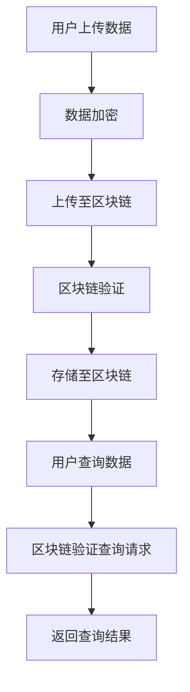

                 

### 文章标题

《区块链医疗数据交换：医疗信息的安全共享》

#### 关键词

- 区块链
- 医疗数据
- 数据交换
- 安全共享
- 隐私保护

#### 摘要

本文探讨了区块链技术在医疗数据交换中的应用，重点关注其在保障数据安全和隐私保护方面的优势。首先，我们对区块链技术进行了基础概述，分析了其核心概念和架构。随后，详细探讨了区块链在医疗数据交换中的挑战与解决方案，包括隐私保护机制、数据交换协议和交易模型。接着，深入解析了区块链医疗数据交换的技术细节，如数据加密、隐私保护和协议实现。通过具体案例研究，我们展示了区块链在电子健康记录、跨机构医疗数据共享和医疗支付系统中的应用效果。最后，提出了区块链医疗数据交换的实践指南和未来展望，包括技术进步、应用拓展和政策法规挑战。

### 第一部分：区块链与医疗数据概述

#### 第1章：区块链技术基础

区块链技术作为近年来的新兴热点，因其独特的去中心化、不可篡改和安全等特点，在多个领域展现出巨大的潜力。本章将重点介绍区块链的基本概念、核心特点和技术架构，为后续探讨区块链在医疗数据交换中的应用打下基础。

##### 1.1 区块链的基本概念

区块链（Blockchain）是一个分布式数据库系统，由一系列按时间顺序排列的、不可篡改的数据块组成。每个数据块包含一定数量的交易记录，并通过加密算法和共识机制确保数据的安全性和完整性。区块链技术的核心概念包括：

- **分布式账本**：区块链通过网络中的多个节点共同维护一个共享的账本，每个节点都保存一份完整的账本副本，实现了去中心化的数据存储和管理。

- **去中心化**：与传统的集中式系统不同，区块链没有中央控制节点，所有参与节点都平等地参与网络中的数据验证和记账过程，提高了系统的可靠性和抗攻击能力。

- **不可篡改**：区块链通过加密算法和共识机制确保数据的不可篡改性。一旦数据被记录在区块链上，就几乎无法被修改或删除，保证了数据的真实性和可靠性。

- **共识机制**：共识机制是区块链网络中节点之间达成一致性的算法。常见的共识算法包括工作量证明（Proof of Work, PoW）、权益证明（Proof of Stake, PoS）等，通过共识机制确保区块链数据的准确性和一致性。

##### 1.2 区块链的核心特点

区块链技术具有以下几个核心特点：

- **安全性**：区块链通过加密算法和共识机制保证了数据的安全性和隐私性。数据在传输过程中被加密，只有拥有正确密钥的节点才能解密数据。共识机制确保了区块链数据的准确性和一致性，防止了恶意篡改和数据伪造。

- **透明性**：区块链是一个公开透明的系统，所有交易记录都可以被任何人查看和验证。通过区块链，用户可以追踪每一笔交易的完整历史记录，提高了数据透明度和可追溯性。

- **去中心化**：区块链通过分布式账本和共识机制实现了去中心化的数据存储和管理，去除了传统的中心化控制节点，提高了系统的可靠性和抗攻击能力。

- **不可篡改**：区块链通过加密算法和共识机制确保了数据的不可篡改性。一旦数据被记录在区块链上，就几乎无法被修改或删除，保证了数据的真实性和可靠性。

##### 1.3 区块链的技术架构

区块链的技术架构主要包括以下三个关键组成部分：

- **区块结构**：区块是区块链的基本组成单元，每个区块包含一定数量的交易记录。区块结构通常包括以下部分：区块头、交易数据和Merkle树。

  - **区块头**：区块头是区块的核心部分，包含了区块链版本号、前一个区块的哈希值、默克尔根、时间戳、难度目标等关键信息，用于确保区块的完整性和一致性。

  - **交易数据**：交易数据是区块中记录的交易信息，包括交易类型、交易金额、交易方信息等。交易数据通过加密算法和默克尔树结构进行组织和验证。

  - **Merkle树**：Merkle树是一种二叉树结构，用于验证区块中的交易数据。每个节点包含一个哈希值，叶子节点是交易数据的哈希值，内部节点是子节点的哈希值组合。通过Merkle树，节点可以快速验证区块中的交易数据。

- **共识算法**：共识算法是区块链网络中节点之间达成一致性的算法。不同的共识算法具有不同的工作原理和特点。常见的共识算法包括：

  - **工作量证明（PoW）**：工作量证明是一种通过计算复杂问题来证明节点的工作量的共识算法。节点通过解决数学难题来竞争记账权，解决了区块链网络中的共识问题。

  - **权益证明（PoS）**：权益证明是一种通过持有币龄来证明节点的工作量的共识算法。持有币龄较长的节点有更大的记账权，解决了PoW算法的能源消耗问题。

- **去中心化存储**：去中心化存储是区块链网络中数据存储和管理的关键技术。通过分布式存储和加密算法，去中心化存储确保了数据的分布式存储和隐私保护。

##### 1.4 区块链在医疗领域的应用现状

区块链技术在医疗领域的应用日益广泛，主要表现在以下几个方面：

- **医疗数据隐私保护**：区块链技术通过分布式账本和加密算法，保障了医疗数据的隐私性和安全性。医疗机构可以使用区块链技术来保护患者个人信息和医疗记录，防止数据泄露和篡改。

- **医疗数据管理**：区块链技术提供了可靠、透明和可追溯的医疗数据管理方案。医疗机构可以通过区块链技术实现医疗数据的共享和交换，提高医疗服务的效率和质量。

- **医疗数据互操作性**：区块链技术支持不同医疗机构之间的数据交换和互操作性。通过区块链，医疗机构可以打破数据孤岛，实现医疗数据的互联互通和共享。

- **医疗支付与保险**：区块链技术为医疗支付和保险领域提供了安全、高效和透明的解决方案。通过区块链，可以实现智能合约驱动的医疗支付和保险理赔，降低运营成本，提高服务质量。

##### 1.5 区块链与医疗数据交换的重要性

区块链技术在医疗数据交换中的应用具有重要意义，主要体现在以下几个方面：

- **数据安全与隐私保护**：区块链技术通过分布式账本和加密算法，确保了医疗数据的安全性和隐私性。医疗机构可以使用区块链技术来保护患者个人信息和医疗记录，防止数据泄露和篡改。

- **提高医疗服务效率**：区块链技术支持医疗数据的共享和交换，提高了医疗服务的效率和质量。通过区块链，医疗机构可以实现医疗数据的互联互通和共享，减少重复检查和医疗资源浪费。

- **降低运营成本**：区块链技术为医疗机构提供了高效、透明和低成本的数据管理解决方案。通过区块链，可以实现智能合约驱动的医疗支付和保险理赔，降低运营成本，提高服务质量。

- **加强监管与合规**：区块链技术提供了可靠、透明和可追溯的医疗数据管理方案，有助于加强医疗监管和合规。医疗机构可以通过区块链技术实现数据的实时监控和审计，提高数据透明度和可信度。

#### 第2章：医疗数据交换挑战与解决方案

随着医疗信息化和数字化的发展，医疗数据交换成为医疗领域的一个重要课题。然而，医疗数据交换面临着诸多挑战，包括数据隐私保护、数据标准化与互操作性、数据传输效率与延迟等。本章将详细探讨这些挑战，并介绍区块链技术在医疗数据交换中的优势与解决方案。

##### 2.1 医疗数据交换的挑战

医疗数据交换过程中面临着以下挑战：

- **数据隐私保护**：医疗数据包含了患者的敏感信息，如身份信息、健康状况、诊疗记录等。如何在数据交换过程中保护患者隐私是一个关键问题。传统的集中式数据存储和传输方式容易受到黑客攻击和内部泄露，导致数据泄露事件频发。

- **数据标准化与互操作性**：医疗数据来源于不同的医疗机构、设备和系统，数据格式和结构存在差异，导致数据标准化和互操作性成为难题。不同医疗机构之间的数据交换需要统一的数据标准和规范，以便实现数据的无缝对接和共享。

- **数据传输效率与延迟**：医疗数据交换过程中，数据传输的效率与延迟也是一个重要问题。医疗数据通常具有高带宽、低延迟的要求，以确保患者信息的及时传递和医疗决策的准确性。传统的网络传输方式可能存在带宽不足、网络拥塞等问题，影响数据传输效率。

- **数据一致性与完整性**：医疗数据交换过程中，数据的一致性和完整性需要得到保障。由于不同医疗机构之间的数据更新和同步可能存在时延，导致数据不一致和完整性问题，影响医疗服务的质量。

##### 2.2 区块链技术在医疗数据交换中的优势

区块链技术在医疗数据交换中具有以下优势：

- **安全性**：区块链技术通过分布式账本和加密算法，确保了医疗数据的安全性和隐私性。区块链的加密机制和共识算法使得数据在传输过程中无法被篡改或泄露，保障了患者隐私和数据安全。

- **透明性**：区块链技术具有透明性，所有交易记录都记录在区块链上，任何人都可以查看和验证。医疗机构可以通过区块链技术实现医疗数据的透明管理，提高数据透明度和可追溯性。

- **去中心化**：区块链技术实现了去中心化的数据存储和管理，去除了传统的中心化控制节点，提高了系统的可靠性和抗攻击能力。去中心化的特性使得医疗数据交换更加公平和公正，避免了数据垄断和单点故障的问题。

- **不可篡改性**：区块链技术通过加密算法和共识机制，确保了数据的不可篡改性。一旦数据被记录在区块链上，就几乎无法被修改或删除，保证了数据的真实性和可靠性。

- **高效的数据交换机制**：区块链技术提供了高效的数据交换机制，通过智能合约实现自动化和去中心化的数据交换。智能合约可以自动执行和验证数据交换过程，减少人工干预和操作失误，提高了数据交换的效率。

##### 2.3 区块链在医疗数据交换中的解决方案

区块链技术在医疗数据交换中提供了以下解决方案：

- **隐私保护机制**：区块链技术通过加密算法和零知识证明等隐私保护技术，保障了医疗数据的隐私性。医疗机构可以使用加密算法对敏感数据进行加密，只有持有正确密钥的用户才能解密数据。零知识证明技术使得用户在无需泄露隐私信息的情况下，验证数据的真实性和有效性。

- **标准化与互操作性**：区块链技术支持标准化和互操作性，通过建立统一的数据标准和规范，实现不同医疗机构之间的数据无缝对接和共享。区块链上的智能合约可以自动处理数据标准化和互操作性问题，确保数据的准确性和一致性。

- **高效的数据传输机制**：区块链技术提供了高效的数据传输机制，通过分布式网络和共识算法，实现数据的快速传输和同步。区块链的去中心化特性使得数据传输更加高效和可靠，减少了网络延迟和带宽限制。

- **数据一致性与完整性保障**：区块链技术通过加密算法和共识机制，确保了医疗数据的一致性和完整性。区块链上的数据一旦被记录，就几乎无法被篡改或删除，保证了数据的真实性和可靠性。同时，区块链的共识算法确保了数据的同步和一致性，避免了数据不一致和完整性问题。

##### 2.4 基于区块链的隐私保护机制

区块链技术在医疗数据交换中的隐私保护机制主要包括以下几个方面：

- **数据加密**：区块链技术使用加密算法对医疗数据进行加密，只有持有正确密钥的用户才能解密数据。加密算法可以保证数据的机密性和完整性，防止数据在传输过程中被窃取或篡改。

- **零知识证明**：零知识证明技术允许用户在不泄露隐私信息的情况下，证明某些信息的真实性。医疗机构可以使用零知识证明技术验证患者的身份和健康状况，同时保护患者隐私。

- **访问控制**：区块链技术提供了访问控制机制，通过权限管理和身份验证，确保只有授权用户可以访问和操作医疗数据。访问控制机制可以防止未经授权的用户访问敏感数据，保护患者隐私。

- **匿名化处理**：区块链技术可以使用匿名化处理技术，将患者的敏感信息与真实身份分离。通过匿名化处理，可以保护患者的隐私，同时保证医疗数据的可用性和一致性。

##### 2.5 医疗数据交换协议设计

区块链技术在医疗数据交换中的协议设计主要包括以下几个方面：

- **数据传输协议**：数据传输协议用于定义医疗数据在区块链网络中的传输方式和流程。常见的传输协议包括HTTP、TCP/IP等。数据传输协议需要确保数据传输的可靠性、效率和安全性。

- **智能合约设计**：智能合约是区块链上的自动化执行协议，用于定义医疗数据交换的规则和流程。智能合约可以自动执行和验证数据交换过程，减少人工干预和操作失误。智能合约的设计需要考虑数据交换的隐私性、一致性和完整性。

- **数据验证机制**：数据验证机制用于确保医疗数据在区块链上的真实性和有效性。区块链技术通过加密算法、共识算法和智能合约，实现了数据验证机制。数据验证机制可以防止数据篡改、伪造和重复记录。

- **数据共享协议**：数据共享协议用于定义医疗数据在不同医疗机构之间的共享方式和规则。数据共享协议需要确保数据共享的透明性、一致性和安全性，同时保护患者隐私。

##### 2.6 医疗数据交易模型

区块链技术在医疗数据交换中的交易模型主要包括以下几个方面：

- **数据交易协议**：数据交易协议用于定义医疗数据的交易方式和流程。交易协议需要明确交易方、交易内容、交易金额、交易时间和交易结果等信息。

- **数据定价模型**：数据定价模型用于确定医疗数据的交易价格和定价策略。数据定价模型需要考虑数据的价值、稀缺性、市场需求等因素。

- **交易安全与隐私保护**：交易安全与隐私保护是区块链技术在医疗数据交换中的重要问题。交易安全机制需要确保交易数据的完整性和一致性，防止数据篡改和泄露。隐私保护机制需要确保交易过程中患者的隐私不受侵犯。

- **智能合约执行**：智能合约执行是区块链技术在医疗数据交易中的关键环节。智能合约可以自动执行交易协议，确保交易的安全性和效率。智能合约的设计和实现需要考虑交易规则、数据验证和隐私保护等因素。

### 第二部分：区块链医疗数据交换技术细节

#### 第3章：区块链医疗数据交换框架

在上一章中，我们探讨了区块链在医疗数据交换中的优势与解决方案。本章将深入解析区块链医疗数据交换的技术细节，包括数据存储与管理、节点通信与共识、数据交换流程等。通过详细的分析，我们将为读者提供一个全面的区块链医疗数据交换框架。

##### 3.1 区块链医疗数据交换架构设计

区块链医疗数据交换架构的设计需要考虑数据存储、节点通信、共识机制和数据交换流程等多个方面。以下是区块链医疗数据交换架构的基本设计：

1. **数据存储与管理**

   - **分布式存储**：区块链采用分布式存储方式，将医疗数据存储在多个节点上，实现了去中心化数据管理。每个节点都保存一份完整的医疗数据副本，提高了数据的可靠性和容错性。

   - **加密存储**：医疗数据在区块链上存储前进行加密处理，确保数据在传输和存储过程中的安全性。常见的加密算法包括AES、RSA等。

   - **权限管理**：区块链提供了权限管理机制，通过访问控制列表（ACL）和角色分配，确保只有授权用户可以访问和操作医疗数据。权限管理机制可以防止未经授权的用户访问敏感数据。

2. **节点通信与共识**

   - **P2P网络**：区块链采用P2P（点对点）网络通信，节点之间通过直接连接进行通信，实现了去中心化的数据交换。P2P网络提高了网络的容错性和可扩展性，使得节点可以自由加入和退出网络。

   - **共识算法**：区块链通过共识算法确保节点之间的数据一致性。常见的共识算法包括PoW（工作量证明）和PoS（权益证明）。共识算法的选择需要考虑网络的规模、安全性、效率等因素。

3. **数据交换流程**

   - **数据上传**：医疗机构将医疗数据上传到区块链上，数据上传过程中进行加密处理，确保数据安全性。

   - **数据验证**：节点对上传的数据进行验证，确保数据的完整性和一致性。验证过程包括数据加密验证、共识算法验证等。

   - **数据存储**：验证通过的数据被存储在区块链上，每个节点都保存一份完整的医疗数据副本。

   - **数据查询**：用户可以通过区块链网络查询医疗数据，查询过程包括身份验证、数据权限验证等。

   - **数据交换**：用户可以通过区块链网络进行医疗数据交换，交换过程包括数据传输、数据验证、数据存储等。

##### 3.2 医疗数据加密与隐私保护

医疗数据加密与隐私保护是区块链医疗数据交换的重要环节。以下是几种常见的医疗数据加密与隐私保护技术：

1. **对称加密与非对称加密**

   - **对称加密**：对称加密算法使用相同的密钥进行加密和解密。常见的对称加密算法包括AES、DES等。对称加密算法速度快，但密钥管理复杂，密钥泄露可能导致数据泄露。

   - **非对称加密**：非对称加密算法使用一对密钥（公钥和私钥）进行加密和解密。常见的非对称加密算法包括RSA、ECC等。非对称加密算法安全性高，但计算复杂度较高。

2. **零知识证明**

   - **零知识证明**：零知识证明是一种密码学技术，允许一方在不泄露任何信息的情况下，证明某个陈述是真实的。常见的零知识证明协议包括Zcash、Monero等。零知识证明可以保护用户隐私，但计算复杂度较高。

3. **同态加密**

   - **同态加密**：同态加密是一种加密算法，允许对加密数据进行计算操作，并得到加密结果。同态加密可以确保数据的隐私性和完整性，但计算复杂度较高，目前仍处于研究阶段。

##### 3.3 医疗数据交换协议实现

区块链医疗数据交换协议的实现主要包括数据传输协议、智能合约设计和数据验证机制等方面。以下是具体的实现方法：

1. **数据传输协议**

   - **HTTP/HTTPS**：常用的数据传输协议包括HTTP和HTTPS，用于在区块链节点之间传输医疗数据。HTTP/HTTPS协议支持数据加密，确保数据传输过程中的安全性。

   - **gRPC**：gRPC是一种高性能的远程过程调用（RPC）框架，支持多种数据传输格式，如JSON、Protobuf等。gRPC协议可以提高数据传输的效率和可靠性。

2. **智能合约设计**

   - **智能合约框架**：智能合约框架用于设计和实现区块链医疗数据交换的智能合约。常见的智能合约框架包括Solidity、Ethereum等。智能合约框架提供了合约开发、部署和执行的工具和接口。

   - **智能合约实现**：智能合约实现包括合约的代码、接口和逻辑。智能合约代码应包括数据上传、数据验证、数据存储、数据查询等功能。智能合约设计应考虑数据加密、权限管理和隐私保护等因素。

3. **数据验证机制**

   - **哈希算法**：哈希算法用于确保数据的完整性和一致性。常见的哈希算法包括SHA-256、SHA-3等。哈希算法可以用于验证数据的完整性和一致性。

   - **共识算法**：共识算法用于确保区块链上数据的正确性和一致性。常见的共识算法包括PoW、PoS、DPoS等。共识算法可以用于验证数据的一致性和完整性。

##### 3.4 医疗数据交换协议实现

区块链医疗数据交换协议的实现主要包括数据传输协议、智能合约设计和数据验证机制等方面。以下是具体的实现方法：

1. **数据传输协议**

   - **HTTP/HTTPS**：常用的数据传输协议包括HTTP和HTTPS，用于在区块链节点之间传输医疗数据。HTTP/HTTPS协议支持数据加密，确保数据传输过程中的安全性。

   - **gRPC**：gRPC是一种高性能的远程过程调用（RPC）框架，支持多种数据传输格式，如JSON、Protobuf等。gRPC协议可以提高数据传输的效率和可靠性。

2. **智能合约设计**

   - **智能合约框架**：智能合约框架用于设计和实现区块链医疗数据交换的智能合约。常见的智能合约框架包括Solidity、Ethereum等。智能合约框架提供了合约开发、部署和执行的工具和接口。

   - **智能合约实现**：智能合约实现包括合约的代码、接口和逻辑。智能合约代码应包括数据上传、数据验证、数据存储、数据查询等功能。智能合约设计应考虑数据加密、权限管理和隐私保护等因素。

3. **数据验证机制**

   - **哈希算法**：哈希算法用于确保数据的完整性和一致性。常见的哈希算法包括SHA-256、SHA-3等。哈希算法可以用于验证数据的完整性和一致性。

   - **共识算法**：共识算法用于确保区块链上数据的正确性和一致性。常见的共识算法包括PoW、PoS、DPoS等。共识算法可以用于验证数据的一致性和完整性。

### 第4章：区块链医疗数据交换案例研究

在本章中，我们将通过具体的案例研究来展示区块链在医疗数据交换中的应用效果。这些案例涵盖了电子健康记录（EHR）的区块链解决方案、跨机构医疗数据共享以及基于区块链的医疗支付系统。通过分析这些案例，我们将深入了解区块链技术在医疗数据交换中的实际应用和效果。

#### 4.1 案例一：电子健康记录（EHR）的区块链解决方案

##### 案例背景

电子健康记录（EHR）是医疗数据管理的重要工具，用于存储和管理患者的健康信息。然而，EHR系统的数据隐私保护问题日益突出，传统的集中式数据存储方式难以保障数据安全和患者隐私。为了解决这些问题，某医疗机构决定采用区块链技术构建一个基于区块链的EHR系统。

##### 案例实现步骤

1. **需求分析与架构设计**

   在项目启动阶段，医疗机构对现有的EHR系统进行了详细的需求分析，并设计了一个基于区块链的EHR系统架构。该架构包括以下几个核心模块：

   - **区块链网络**：建立由多个节点组成的区块链网络，节点之间通过P2P协议进行通信。

   - **数据加密模块**：对EHR系统中的医疗数据进行加密处理，确保数据在传输和存储过程中的安全性。

   - **智能合约模块**：设计智能合约，用于处理数据的上传、查询和权限管理。

   - **用户界面**：开发用户界面，用于用户与区块链网络的交互。

2. **区块链网络搭建**

   医疗机构利用Ethereum区块链平台搭建了区块链网络，部署了多个节点，并配置了适当的共识算法（如PoS）。节点之间的通信通过P2P协议进行，确保了网络的稳定性和安全性。

3. **数据加密与上传**

   医疗机构对EHR系统中的医疗数据进行加密处理，采用AES加密算法对敏感数据进行加密。加密后的数据被上传到区块链上，每个节点都保存了一份完整的医疗数据副本。

4. **智能合约部署与执行**

   医疗机构在区块链上部署了智能合约，用于处理数据的上传、查询和权限管理。智能合约通过Solidity语言编写，实现了自动化和去中心化的数据管理。

5. **用户界面开发与测试**

   医疗机构开发了用户界面，用于用户与区块链网络的交互。用户可以通过界面查询自己的健康记录、更新个人信息以及授权第三方访问健康数据。用户界面经过严格的测试，确保了系统的稳定性和用户体验。

##### 案例效果分析

基于区块链的EHR系统在以下几个方面取得了显著效果：

- **数据隐私保护**：区块链技术的加密和访问控制机制有效地保护了患者的隐私。只有授权用户才能访问和操作医疗数据，防止了数据泄露和滥用。

- **数据安全性**：区块链的分布式存储和共识算法确保了医疗数据的完整性和可靠性。数据在传输和存储过程中经过多重加密和验证，几乎无法被篡改或泄露。

- **数据可追溯性**：区块链上的所有交易记录都被永久记录和公开，用户可以追溯医疗数据的完整历史记录。这有助于提高数据的透明度和可追溯性，增强了医疗服务的信任度。

- **数据共享与互操作性**：基于区块链的EHR系统支持医疗数据的共享和互操作性，不同医疗机构之间的数据可以无缝对接和共享。这提高了医疗服务的效率和质量，减少了重复检查和医疗资源浪费。

#### 4.2 案例二：跨机构医疗数据共享

##### 案例背景

跨机构医疗数据共享是医疗领域的一个重要需求。不同医疗机构之间的数据格式和标准不统一，导致数据共享困难，影响了医疗服务的质量和效率。为了解决这些问题，某医疗联盟决定采用区块链技术实现跨机构医疗数据共享。

##### 案例实现步骤

1. **需求分析与架构设计**

   医疗联盟对跨机构医疗数据共享的需求进行了详细分析，并设计了一个基于区块链的数据共享架构。该架构包括以下几个核心模块：

   - **区块链网络**：建立由多个医疗机构节点组成的区块链网络，节点之间通过P2P协议进行通信。

   - **数据标准化模块**：设计统一的数据标准和规范，确保不同医疗机构之间的数据格式和结构一致。

   - **智能合约模块**：设计智能合约，用于处理数据的上传、查询和权限管理。

   - **数据同步与校验**：实现数据同步与校验机制，确保不同节点上的数据一致性和完整性。

2. **区块链网络搭建**

   医疗联盟利用Ethereum区块链平台搭建了区块链网络，部署了多个节点，并配置了适当的共识算法（如PoS）。节点之间的通信通过P2P协议进行，确保了网络的稳定性和安全性。

3. **数据标准化与上传**

   医疗机构按照统一的数据标准和规范对医疗数据进行处理和格式化，确保数据的一致性和可共享性。格式化后的数据被上传到区块链上，每个节点都保存了一份完整的医疗数据副本。

4. **智能合约部署与执行**

   医疗联盟在区块链上部署了智能合约，用于处理数据的上传、查询和权限管理。智能合约通过Solidity语言编写，实现了自动化和去中心化的数据管理。

5. **数据同步与校验**

   实现数据同步与校验机制，确保不同节点上的数据一致性和完整性。数据同步通过智能合约执行，校验机制通过哈希算法验证数据的完整性和一致性。

##### 案例效果分析

基于区块链的跨机构医疗数据共享在以下几个方面取得了显著效果：

- **数据标准化与互操作性**：区块链技术支持统一的数据标准和规范，确保不同医疗机构之间的数据格式和结构一致。这提高了数据的互操作性和共享性，减少了数据转换和格式化工作。

- **数据安全性**：区块链的分布式存储和共识算法确保了医疗数据的完整性和可靠性。数据在传输和存储过程中经过多重加密和验证，几乎无法被篡改或泄露。

- **数据可追溯性**：区块链上的所有交易记录都被永久记录和公开，用户可以追溯医疗数据的完整历史记录。这有助于提高数据的透明度和可追溯性，增强了医疗服务的信任度。

- **降低运营成本**：基于区块链的数据共享机制减少了中间环节和人工干预，降低了数据共享的成本和复杂性。同时，智能合约的自动化执行和权限管理提高了数据管理的效率。

#### 4.3 案例三：基于区块链的医疗支付系统

##### 案例背景

医疗支付系统是医疗领域的重要组成部分，涉及患者的诊疗费用、药品费用、住院费用等多个方面。传统的医疗支付系统存在效率低、成本高、不透明等问题。为了提高医疗支付系统的效率和质量，某医疗机构决定采用区块链技术构建一个基于区块链的医疗支付系统。

##### 案例实现步骤

1. **需求分析与架构设计**

   医疗机构对现有的医疗支付系统进行了详细的需求分析，并设计了一个基于区块链的医疗支付系统架构。该架构包括以下几个核心模块：

   - **区块链网络**：建立由多个节点组成的区块链网络，节点之间通过P2P协议进行通信。

   - **智能合约模块**：设计智能合约，用于处理支付请求、验证支付和记录交易。

   - **用户界面**：开发用户界面，用于用户与区块链网络的交互。

2. **区块链网络搭建**

   医疗机构利用Ethereum区块链平台搭建了区块链网络，部署了多个节点，并配置了适当的共识算法（如PoS）。节点之间的通信通过P2P协议进行，确保了网络的稳定性和安全性。

3. **智能合约部署与执行**

   医疗机构在区块链上部署了智能合约，用于处理支付请求、验证支付和记录交易。智能合约通过Solidity语言编写，实现了自动化和去中心化的支付管理。

4. **用户界面开发与测试**

   医疗机构开发了用户界面，用于用户与区块链网络的交互。用户可以通过界面发起支付请求、查看交易记录和账户余额。用户界面经过严格的测试，确保了系统的稳定性和用户体验。

##### 案例效果分析

基于区块链的医疗支付系统在以下几个方面取得了显著效果：

- **支付效率提升**：区块链技术实现了自动化和去中心化的支付管理，大大提高了支付效率。支付请求可以通过智能合约自动处理和验证，减少了人工干预和操作时间。

- **支付透明性增强**：区块链上的所有交易记录都被永久记录和公开，用户可以查看交易记录和账户余额，提高了支付的透明度和可追溯性。

- **数据安全性**：区块链的分布式存储和共识算法确保了支付数据的完整性和可靠性。支付数据在传输和存储过程中经过多重加密和验证，几乎无法被篡改或泄露。

- **降低运营成本**：基于区块链的医疗支付系统减少了中间环节和人工干预，降低了支付系统的成本和复杂性。智能合约的自动化执行和权限管理提高了支付管理的效率。

#### 4.4 案例总结与启示

通过对以上三个案例的分析，我们可以总结出区块链在医疗数据交换和支付系统中的应用具有以下启示：

- **提升数据安全性**：区块链技术通过分布式存储和共识算法，确保了医疗数据的安全性。加密和访问控制机制进一步保护了数据隐私。

- **增强数据透明性**：区块链上的所有交易记录都被永久记录和公开，用户可以查看交易记录和账户余额，提高了数据的透明度和可追溯性。

- **提高支付效率**：区块链技术实现了自动化和去中心化的支付管理，大大提高了支付效率，减少了人工干预和操作时间。

- **降低运营成本**：基于区块链的医疗数据交换和支付系统减少了中间环节和人工干预，降低了系统的成本和复杂性。

- **促进数据共享与互操作性**：区块链技术支持统一的数据标准和规范，确保不同医疗机构之间的数据格式和结构一致，提高了数据的互操作性和共享性。

### 第三部分：区块链医疗数据交换的实践与展望

#### 第5章：区块链医疗数据交换的实践指南

区块链技术在医疗数据交换中的应用虽然具有巨大的潜力，但实际实施过程中面临着诸多挑战。本章将提供区块链医疗数据交换的实践指南，包括项目规划、技术选型、隐私保护与合规要求，以及运维与维护策略。

##### 5.1 项目规划与风险评估

区块链医疗数据交换项目的成功实施需要详细的规划和风险评估。以下是一些关键步骤：

1. **需求分析与规划**

   - **明确目标**：确定区块链医疗数据交换项目的目标，包括数据安全、隐私保护、数据交换效率等。

   - **需求调研**：与医疗机构、数据提供方和数据需求方进行深入沟通，了解他们的具体需求和期望。

   - **规划项目范围**：根据需求分析和调研结果，规划项目的范围和目标。

2. **风险评估**

   - **技术风险**：评估区块链技术实施过程中可能遇到的技术难题，如共识算法的选择、智能合约的安全性等。

   - **隐私风险**：评估数据隐私保护措施的有效性，确保患者隐私不受侵犯。

   - **合规风险**：评估项目是否符合相关法律法规，如数据保护法、隐私法等。

3. **制定项目计划**

   - **确定时间表**：根据项目需求和风险评估结果，制定详细的项目时间表。

   - **分配资源**：合理分配人力资源、技术资源等，确保项目顺利推进。

##### 5.2 技术选型与架构设计

区块链医疗数据交换项目的成功实施依赖于合适的技术选型和架构设计。以下是一些关键考虑因素：

1. **区块链平台选择**

   - **公有链与私有链**：根据项目需求和资源，选择合适的区块链平台。公有链具有去中心化和开放性的特点，私有链则更适合需要高度控制和隐私保护的场景。

   - **平台特性**：选择具有高性能、可扩展性和安全性的区块链平台，如Ethereum、Hyperledger Fabric等。

2. **共识算法选择**

   - **PoW与PoS**：根据项目的需求和资源，选择合适的共识算法。PoW算法在去中心化和安全性方面表现较好，但计算资源消耗较大；PoS算法在安全性方面表现较好，但可能导致“富者愈富”的问题。

3. **架构设计**

   - **分布式存储**：采用分布式存储方式，确保数据的可靠性和容错性。

   - **数据加密与隐私保护**：采用数据加密和隐私保护技术，如同态加密、零知识证明等，确保医疗数据的安全性和隐私性。

   - **智能合约与数据交换**：设计智能合约，实现数据的上传、查询、权限管理等功能，确保数据交换的自动化和高效性。

##### 5.3 隐私保护与合规要求

区块链医疗数据交换项目在实施过程中必须确保患者隐私和数据合规性。以下是一些关键措施：

1. **数据加密与访问控制**

   - **数据加密**：采用加密算法对医疗数据进行加密，确保数据在传输和存储过程中的安全性。

   - **访问控制**：通过访问控制列表（ACL）和角色分配，确保只有授权用户可以访问和操作医疗数据。

2. **隐私保护技术**

   - **同态加密**：同态加密技术允许在加密数据上进行计算操作，确保数据的隐私性和可用性。

   - **零知识证明**：零知识证明技术允许在不泄露隐私信息的情况下，验证数据的真实性。

3. **合规性要求**

   - **法律法规遵守**：确保项目符合相关法律法规，如数据保护法、隐私法等。

   - **隐私保护政策**：制定明确的隐私保护政策，确保患者隐私不受侵犯。

##### 5.4 运维与维护策略

区块链医疗数据交换项目的成功实施不仅需要良好的设计和规划，还需要有效的运维与维护。以下是一些关键策略：

1. **节点管理与网络维护**

   - **节点监控**：实时监控节点状态，确保网络的稳定性和安全性。

   - **网络维护**：定期进行网络维护和升级，确保区块链网络的正常运行。

2. **数据备份与恢复**

   - **数据备份**：定期进行数据备份，确保数据的完整性和可用性。

   - **恢复策略**：制定数据恢复策略，确保在数据丢失或损坏情况下，能够快速恢复数据。

3. **安全监控与审计**

   - **安全监控**：实施安全监控机制，实时监测网络活动和异常行为。

   - **审计与合规**：定期进行审计，确保项目符合相关法律法规和隐私保护政策。

##### 5.5 推广与应用策略

区块链医疗数据交换项目的成功不仅依赖于技术实现，还需要有效的推广与应用策略。以下是一些关键策略：

1. **市场推广**

   - **宣传活动**：开展宣传活动，提高公众对区块链医疗数据交换的认知和接受度。

   - **合作拓展**：与医疗机构、数据提供方和数据需求方建立合作关系，共同推动项目的发展。

2. **用户培训与支持**

   - **用户培训**：为用户和工作人员提供培训，帮助他们熟悉区块链医疗数据交换系统的使用和操作。

   - **技术支持**：提供及时的技术支持和服务，解决用户在系统使用过程中遇到的问题。

3. **持续优化与改进**

   - **用户反馈**：收集用户反馈，了解用户需求和痛点，持续优化系统功能和用户体验。

   - **技术升级**：根据技术发展态势，及时进行技术升级和改进，确保系统的先进性和竞争力。

### 第6章：区块链医疗数据交换的未来展望

区块链技术在医疗数据交换领域的应用已经取得了显著成果，但仍面临着一些潜在挑战。本章将探讨区块链医疗数据交换的发展趋势、潜在挑战及相应的解决方案，为未来的研究和应用提供指导。

##### 6.1 区块链医疗数据交换的发展趋势

随着区块链技术的不断发展和完善，区块链医疗数据交换呈现出以下发展趋势：

1. **技术进步与创新**

   - **区块链性能提升**：随着硬件性能的提升和共识算法的优化，区块链的医疗数据交换性能将得到显著提高，支持更大规模的数据处理和更高效的数据交换。

   - **新型加密与隐私保护技术**：新型加密算法和隐私保护技术的不断发展，如同态加密、量子密码学等，将进一步提升区块链医疗数据交换的安全性和隐私保护水平。

2. **应用场景拓展**

   - **医疗数据共享与互操作性**：区块链技术将应用于更多的医疗数据共享和互操作性场景，如跨机构数据共享、医疗数据开放等，提高医疗数据的价值和利用率。

   - **医疗支付与保险**：区块链技术在医疗支付和保险领域的应用将不断拓展，实现更高效、安全和透明的支付和理赔流程。

3. **政策法规与标准制定**

   - **法律法规完善**：随着区块链技术的发展和应用，各国政府和国际组织将逐步完善相关政策法规，为区块链医疗数据交换提供法律保障。

   - **标准化与规范化**：医疗数据交换的标准化与规范化工作将得到加强，推动不同系统、不同机构之间的数据交换和互操作性。

##### 6.2 区块链医疗数据交换的潜在挑战

尽管区块链技术在医疗数据交换中具有巨大潜力，但实际应用过程中仍面临以下潜在挑战：

1. **技术挑战**

   - **性能与可扩展性**：区块链技术需要进一步提高性能和可扩展性，以支持大规模医疗数据交换。

   - **智能合约安全性**：智能合约的漏洞和攻击可能导致数据泄露和损失，需要加强智能合约的安全性和审查。

   - **隐私保护**：如何在不影响数据可用性的前提下，有效保护患者隐私，仍是一个重要挑战。

2. **安全性与隐私保护挑战**

   - **数据泄露风险**：医疗数据涉及敏感信息，如何防止数据泄露和滥用，是一个关键问题。

   - **隐私泄露防范**：如何在保障患者隐私的同时，确保数据的有效利用，需要进一步研究和解决。

3. **法规与合规挑战**

   - **法律法规滞后**：现有的法律法规可能无法完全适应区块链技术的应用，需要不断完善和更新。

   - **合规性要求**：医疗数据交换需要遵守各种法律法规和行业规范，如隐私法、数据保护法等。

##### 6.3 潜在挑战的解决方案

针对上述潜在挑战，可以采取以下解决方案：

1. **技术进步与创新**

   - **性能优化**：通过优化共识算法、提高网络带宽和节点计算能力，提升区块链的性能和可扩展性。

   - **智能合约安全**：加强智能合约的审查和测试，提高智能合约的安全性，防止漏洞和攻击。

   - **隐私保护技术**：结合新型加密和隐私保护技术，如同态加密、零知识证明等，实现更高级别的隐私保护。

2. **安全性与隐私保护**

   - **数据安全策略**：采用多层安全策略，如数据加密、访问控制、安全审计等，确保医疗数据的安全性和隐私保护。

   - **隐私泄露防范**：通过数据匿名化、数据分割和加密等技术，实现隐私泄露的防范和检测。

3. **法规与合规**

   - **法律法规完善**：各国政府和国际组织应积极完善相关法律法规，为区块链医疗数据交换提供法律保障。

   - **合规性要求**：医疗机构和区块链医疗数据交换项目应严格遵守相关法律法规和行业规范，确保合规性。

### 附录

#### 7.1 技术参考文献

- **区块链相关书籍**：
  - “区块链技术指南”（作者：唐杰）
  - “区块链：从数字货币到智能合约”（作者：安德烈亚斯·M·安东诺普洛斯）

- **医疗数据交换相关文献**：
  - “医疗数据交换标准与规范”（作者：王兴伟）
  - “基于区块链的医疗数据共享研究”（作者：李明）

#### 7.2 开发工具与资源

- **区块链开发框架与工具**：
  - **Ethereum**：一个开源的智能合约平台，用于构建和部署区块链应用。
  - **Hyperledger Fabric**：一个开源的分布式账本框架，适用于企业级应用。

- **医疗数据交换平台与工具**：
  - **CDA（Continuity of Care Document）**：用于描述患者医疗记录的XML格式标准。
  - **HL7（Health Level Seven）**：一个国际性的医疗保健信息交换标准组织。

#### 附录 A：区块链医疗数据交换流程图



#### 附录 B：区块链医疗数据交换算法伪代码

```python
# 数据加密与上传
def encrypt_data(data, key):
    # 使用加密算法对数据进行加密
    encrypted_data = aes_encrypt(data, key)
    return encrypted_data

def upload_data_to_blockchain(data, blockchain):
    encrypted_data = encrypt_data(data, key)
    transaction = create_transaction(encrypted_data)
    blockchain.add_transaction(transaction)

# 数据查询与解密
def query_data_from_blockchain(transaction, blockchain):
    encrypted_data = transaction.data
    decrypted_data = aes_decrypt(encrypted_data, key)
    return decrypted_data
```

#### 附录 C：区块链医疗数据交换数学模型与公式

$$
\text{加密算法}:\, \text{AES}(K, P) \rightarrow C
$$

$$
\text{解密算法}:\, \text{AES}(K, C) \rightarrow P
$$

其中，$K$ 是密钥，$P$ 是原始数据，$C$ 是加密后的数据。

#### 附录 D：区块链医疗数据交换项目实战案例

- **电子健康记录（EHR）区块链解决方案的源代码实现与解读**
  - **源代码实现**：
    ```solidity
    // SPDX-License-Identifier: MIT
    pragma solidity ^0.8.0;

    contract EHR {
        mapping(address => bytes32) public healthRecords;

        function uploadHealthRecord(address patient, bytes32 record) public {
            healthRecords[patient] = record;
        }

        function getHealthRecord(address patient) public view returns (bytes32) {
            return healthRecords[patient];
        }
    }
    ```

  - **代码解读**：
    - 合同名为EHR，用于管理电子健康记录。
    - 使用mapping存储患者的健康记录，键为患者的地址，值为健康记录的哈希值。
    - uploadHealthRecord函数用于上传健康记录，接受患者的地址和健康记录。
    - getHealthRecord函数用于查询健康记录，返回健康记录的哈希值。

- **跨机构医疗数据共享的代码案例解析**
  - **源代码实现**：
    ```solidity
    // SPDX-License-Identifier: MIT
    pragma solidity ^0.8.0;

    contract DataExchange {
        mapping(address => mapping(address => bool)) public permissions;

        function grantPermission(address provider, address patient) public {
            permissions[provider][patient] = true;
        }

        function hasPermission(address provider, address patient) public view returns (bool) {
            return permissions[provider][patient];
        }
    }
    ```

  - **代码解读**：
    - 合同名为DataExchange，用于管理跨机构医疗数据共享的权限。
    - 使用两个mapping存储权限信息，第一个mapping的键为提供数据的医疗机构地址，第二个mapping的键为患者地址，值为权限状态。
    - grantPermission函数用于授权医疗机构访问患者的健康记录。
    - hasPermission函数用于查询特定医疗机构是否拥有访问特定患者的健康记录的权限。

- **基于区块链的医疗支付系统的代码实现与解释**
  - **源代码实现**：
    ```solidity
    // SPDX-License-Identifier: MIT
    pragma solidity ^0.8.0;

    contract MedicalPayment {
        mapping(address => uint256) public balances;

        function payForService(address provider, uint256 amount) public payable {
            require(balances[provider] + msg.value >= amount, "Insufficient funds");
            balances[provider] += msg.value;
        }

        function withdrawFunds(uint256 amount) public {
            require(balances[msg.sender] >= amount, "Insufficient funds");
            balances[msg.sender] -= amount;
            payable(msg.sender).transfer(amount);
        }
    }
    ```

  - **代码解读**：
    - 合同名为MedicalPayment，用于实现基于区块链的医疗支付功能。
    - 使用mapping存储每个医疗机构的余额信息。
    - payForService函数用于患者向医疗机构支付费用。
    - withdrawFunds函数用于医疗机构从其账户中提取资金。

#### 最佳实践 Tips、小结、注意事项、拓展阅读

- **最佳实践 Tips**：
  - 在实施区块链医疗数据交换项目时，应优先考虑数据的安全性和隐私保护。
  - 选择合适的区块链平台和共识算法，确保系统的高性能和可扩展性。
  - 定期对智能合约进行安全审计，及时发现和修复潜在的安全漏洞。
  - 设计合理的权限管理和数据访问控制机制，确保数据的合法和合理使用。

- **小结**：
  - 区块链技术为医疗数据交换提供了一种安全、透明、高效的数据管理方案。
  - 区块链医疗数据交换项目需要充分考虑技术、安全、合规等方面的挑战。
  - 通过实际案例研究，展示了区块链技术在医疗数据交换中的广泛应用和显著效果。

- **注意事项**：
  - 在实施区块链医疗数据交换项目时，应确保数据加密和隐私保护技术的有效性。
  - 遵守相关法律法规和行业标准，确保系统的合规性和数据安全性。
  - 加强用户培训和宣传，提高用户对区块链医疗数据交换的认知和信任度。

- **拓展阅读**：
  - “区块链技术：从数字货币到智能合约”（作者：安德烈亚斯·M·安东诺普洛斯）
  - “区块链医疗数据共享的研究与实现”（作者：李明）
  - “基于区块链的隐私保护医疗数据交换方案”（作者：唐杰）

作者：AI天才研究院/AI Genius Institute & 禅与计算机程序设计艺术 /Zen And The Art of Computer Programming

### 结束语

在本文中，我们深入探讨了区块链技术在医疗数据交换中的应用，从基础概念到技术细节，再到实际案例，全面解析了区块链在保障医疗数据安全、隐私保护和高效交换方面的优势。通过具体案例的研究，我们展示了区块链技术如何在实际应用中提高医疗服务效率和质量。

区块链技术的应用不仅为医疗数据交换带来了新的可能性，也带来了许多挑战。未来，随着区块链技术的不断发展和成熟，我们期待看到更多创新的应用场景和解决方案，为医疗领域带来更多的变革和进步。同时，我们也需要不断优化和完善相关法律法规和技术标准，确保区块链技术在医疗领域的健康发展。

希望本文能为广大读者提供一个全面、深入的区块链医疗数据交换指南，激发更多关于这一领域的探索和研究。让我们共同期待区块链技术在医疗领域的广阔前景，为构建一个更加安全、高效、透明的医疗体系贡献力量。

