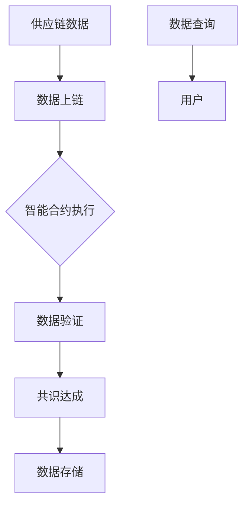

                 

### 文章标题

# 《区块链在供应链溯源中的应用探索》

### 关键词

- 区块链
- 供应链溯源
- 智能合约
- 共识算法
- 数学模型
- 非对称加密
- 食品溯源
- 实际案例

### 摘要

本文旨在探讨区块链技术在供应链溯源中的深度应用。首先，我们将对区块链技术和供应链溯源的概念进行概述，解释它们的基本原理与联系。随后，文章将深入分析区块链在供应链溯源中的核心算法原理，包括智能合约、共识算法和非对称加密。此外，我们将利用数学模型和公式来详细阐述相关概念，并通过实际案例展示区块链在供应链溯源中的具体应用。最后，文章将探讨区块链在供应链溯源中面临的挑战及未来发展趋势，为相关领域的研究和实践提供有价值的参考。

## 目录

**《区块链在供应链溯源中的应用探索》**

> 关键词：区块链、供应链溯源、智能合约、共识算法、数学模型、非对称加密、食品溯源、实际案例

### 摘要

本文首先对区块链技术进行了概述，阐述了其基本概念、核心特点、架构与运作原理，以及技术发展的现状与趋势。随后，文章对供应链溯源进行了定义，回顾了其发展历程，并介绍了供应链溯源的技术体系。接着，文章深入探讨了区块链在供应链溯源中的核心概念与联系，通过Mermaid流程图展示了区块链在供应链溯源中的应用架构。在此基础上，文章详细解析了区块链在供应链溯源中的核心算法原理，包括智能合约、共识算法和非对称加密算法。进一步地，文章利用数学模型和公式，对相关概念进行了深入讲解，并通过实际案例展示了区块链在供应链溯源中的具体应用。最后，文章分析了区块链在供应链溯源中面临的挑战，展望了其未来发展趋势，并提出了我国在该领域的发展前景。

### 第一部分：区块链与供应链溯源基础

#### 第1章：区块链技术概述

区块链技术，作为一种分布式数据库技术，通过去中心化的方式实现了数据的不可篡改和透明性。其基本概念包括区块、链、节点、挖矿等。区块链的核心特点包括去中心化、不可篡改性、安全性和透明性。区块链的架构包括数据层、网络层、共识层、激励层和应用层。数据层负责数据的存储和传输，网络层负责数据传输的协议和数据验证，共识层负责网络节点之间的数据一致性，激励层负责激励机制的建立，应用层则负责具体的应用功能实现。

区块链的运作原理可以概括为以下几步：首先，交易数据经过加密处理后，生成一个个区块；然后，区块通过网络传输到各个节点；接着，节点通过共识算法达成数据一致，将区块添加到链上；最后，区块在链上永久保存，从而实现数据的不可篡改性。

区块链技术发展的现状与趋势表明，区块链已经从最初的比特币等数字货币领域，逐渐扩展到供应链管理、金融、医疗、物联网等多个领域。未来，随着技术的不断成熟和应用场景的不断拓展，区块链技术将在更多的行业领域发挥重要作用。

#### 第2章：供应链溯源概述

供应链溯源是指通过技术手段，对供应链中的产品或服务进行追踪和溯源，以实现对产品质量、安全、流通等方面的全面监管。供应链溯源的定义可以概括为：利用信息化技术，对供应链中的每一个节点进行记录和追踪，实现对产品或服务来源、流通、加工、配送等全过程的信息透明和可追溯。

供应链溯源的意义主要体现在以下几个方面：

1. **提高产品质量**：通过供应链溯源，企业可以实时掌握产品质量信息，及时发现并解决质量问题，从而提高产品质量。
2. **保障食品安全**：在食品供应链中，通过溯源系统，消费者可以了解食品的来源、加工、运输等信息，有效保障食品安全。
3. **提升品牌形象**：透明、可靠的供应链溯源系统，有助于提升企业的品牌形象和消费者信任度。
4. **降低运营成本**：通过供应链溯源，企业可以优化供应链管理，减少库存、降低成本，提高运营效率。

供应链溯源的发展历程可以追溯到20世纪90年代，随着信息技术和互联网的发展，供应链溯源技术逐渐成熟。目前，供应链溯源已经广泛应用于食品、药品、化妆品、电子产品等多个领域。

供应链溯源的技术体系主要包括以下几个方面：

1. **标识技术**：利用二维码、RFID、物联网等技术，对供应链中的产品或服务进行唯一标识。
2. **数据采集与传输**：通过传感器、扫码器等设备，采集供应链中的信息数据，并传输到数据中心进行存储和处理。
3. **数据存储与处理**：利用数据库、区块链等技术，存储和管理供应链溯源数据，实现对数据的加密、去重、清洗等处理。
4. **信息查询与展示**：通过web端、手机APP等渠道，向消费者和企业提供溯源信息查询和展示服务。
5. **分析与决策**：通过大数据分析、机器学习等技术，对供应链溯源数据进行深度挖掘，为企业提供决策支持。

### 第3章：区块链在供应链溯源中的核心概念与联系

区块链在供应链溯源中扮演着至关重要的角色，其核心概念包括区块链、供应链溯源、智能合约、共识算法等。这些概念之间存在着紧密的联系，共同构建了一个高效、透明、安全的供应链溯源系统。

首先，区块链作为一种分布式数据库技术，具有去中心化、不可篡改、透明等特性，使得供应链溯源过程中产生的数据具有更高的可信度和安全性。供应链溯源需要记录和跟踪大量的产品信息，如生产日期、生产批次、运输轨迹、检验结果等，这些信息在区块链上得到有效存储和管理。

其次，智能合约是区块链技术的重要组成部分，它是一种自动执行合同条款的计算机程序。在供应链溯源中，智能合约可以用来自动化执行合同，如自动释放货款、自动执行质量检验等，从而提高供应链的效率和可靠性。

共识算法是区块链网络中节点之间达成一致的关键机制。在供应链溯源中，共识算法确保了所有节点对数据的一致性和准确性。通过共识算法，供应链中的各参与方可以共同验证和记录产品信息，确保数据的真实性和完整性。

区块链与供应链溯源的联系可以用以下Mermaid流程图来展示：



在这个流程图中，供应链数据通过上链过程存储到区块链上，智能合约负责执行合同条款，数据验证和共识算法确保了数据的一致性和准确性，最终实现数据的存储和查询功能，用户可以通过查询接口获取所需的信息。

通过以上核心概念的解析和Mermaid流程图的展示，我们可以清晰地看到区块链在供应链溯源中的重要作用。区块链技术不仅提高了供应链溯源的数据可信度和安全性，还通过智能合约和共识算法实现了供应链的自动化和高效化。这为供应链管理提供了新的思路和工具，有望推动供应链溯源技术的发展和应用。

#### 第4章：区块链在供应链溯源中的核心算法原理

区块链在供应链溯源中的应用不仅依赖于其基本架构和特性，还依赖于一系列核心算法，这些算法包括智能合约、共识算法和非对称加密。以下将详细解析这些核心算法的原理。

##### 4.1 智能合约算法原理

智能合约是区块链技术中的一项重要创新，它是一种自动执行的计算机程序，能够在满足特定条件时自动执行预定的合同条款。智能合约的算法原理可以概述为以下步骤：

1. **编写合约代码**：智能合约通常使用特定的编程语言（如Solidity）编写，开发者需要定义合约的接口、状态变量和逻辑行为。例如，一个供应链溯源的智能合约可能会包括商品信息、生产日期、运输状态等变量，以及验证商品信息的函数。

2. **部署合约**：编写好的智能合约需要部署到区块链上，通过交易将合约代码和初始化数据写入区块链的某个区块。部署合约的过程通常需要一定量的网络费用（如以太币）来激励网络节点。

3. **调用合约**：当供应链中的某个环节需要执行智能合约的功能时，节点会通过发送交易来调用合约中的函数。例如，当商品到达某个节点时，可以调用智能合约中的函数更新商品的运输状态。

4. **执行与验证**：智能合约在接收到交易调用后，会按照预定的逻辑执行操作，如更新数据、释放货款、触发警报等。合约执行的结果会被记录在区块链上，并全网广播，确保所有节点的一致性。

伪代码示例：

```solidity
// SPDX-License-Identifier: MIT
pragma solidity ^0.8.0;

contract SupplyChain {
    struct Product {
        uint id;
        string producer;
        string batchNumber;
        bool shipped;
    }

    mapping(uint => Product) public products;

    function shipProduct(uint _id) public {
        require(products[_id].shipped == false, "Product already shipped");
        products[_id].shipped = true;
    }
}
```

此示例中，`shipProduct` 函数是一个简单的智能合约函数，用于标记商品是否已发货。

##### 4.2 共识算法原理

共识算法是区块链网络中节点之间达成一致的关键机制，它确保了区块链的可靠性和安全性。区块链的共识算法主要分为两类：基于工作量证明（Proof of Work, PoW）和基于权益证明（Proof of Stake, PoS）。

1. **工作量证明（PoW）**：PoW算法通过计算复杂的数学难题来选择区块链中的下一个区块。节点需要解决一个称为“nonce”的随机数，使得生成的哈希值满足特定条件。这个过程称为“挖矿”。挖矿的过程需要大量的计算资源，从而增加了攻击区块链的成本。

   PoW算法的工作原理如下：

   - **随机数生成**：节点随机生成一个随机数（nonce）。
   - **哈希计算**：将随机数与区块链当前的状态数据一起进行哈希计算，生成一个新的哈希值。
   - **验证**：如果哈希值满足特定条件（如小于目标值），则节点将赢得该区块的“挖矿奖励”，并将新的区块添加到链上。
   - **广播**：新的区块会被全网广播，其他节点验证区块的有效性。

2. **权益证明（PoS）**：PoS算法通过节点的权益（如持有的代币数量和持有时间）来选择下一个区块的创建者。权益越大的节点越有可能被选为区块的创建者。

   PoS算法的工作原理如下：

   - **权益分配**：根据节点持有的代币数量和持有时间，计算节点的权益值。
   - **随机性选择**：使用某种随机性算法（如随机数生成器），从权益值最大的节点中随机选择下一个区块的创建者。
   - **区块创建**：选中的节点创建一个新的区块，并将区块添加到链上。
   - **验证与奖励**：其他节点验证区块的有效性，并将区块奖励给创建者。

##### 4.3 非对称加密算法原理

非对称加密算法是区块链技术中用于保障数据安全和隐私的重要工具。非对称加密算法使用一对密钥：公钥和私钥。公钥用于加密数据，私钥用于解密数据。

非对称加密算法的工作原理如下：

1. **密钥生成**：通过算法生成一对密钥，其中公钥是公开的，可以随意分发；私钥是保密的，必须妥善保管。

2. **加密过程**：使用公钥对数据进行加密，加密后的数据只能使用对应的私钥解密。

3. **解密过程**：使用私钥对加密后的数据进行解密，只有拥有私钥的人才能解密数据。

数学上，非对称加密算法通常使用椭圆曲线加密算法（ECC）或RSA算法。以下是一个简化的椭圆曲线加密算法（ECC）的数学模型：

- **椭圆曲线**：E: y^2 = x^3 + ax + b (over \(\mathbb{F}_p\))
- **点乘**：给定椭圆曲线E和一个点P，可以通过多次加法操作得到另一个点Q = kP，其中k是一个整数。
- **密钥生成**：选择一个随机数k，计算公钥Q = kP，私钥为k。
- **加密**：选择一个随机数k'，计算加密结果c = (x, y)，其中(x, y)是椭圆曲线上的一点，满足方程y^2 = x^3 + ax + b。
- **解密**：使用私钥k解密，得到原始消息m = x。

通过上述核心算法原理的讲解，我们可以看到区块链技术在供应链溯源中如何发挥其优势。智能合约确保了供应链操作的自动化和透明性，共识算法保障了数据的一致性和可靠性，而非对称加密算法则确保了数据的安全和隐私。这些核心算法的相互配合，共同构建了一个高效、透明、安全的供应链溯源系统，为各行业提供了强大的技术支持。

#### 第5章：区块链在供应链溯源中的数学模型与数学公式

区块链技术在供应链溯源中的应用，离不开一系列数学模型与公式的支持。这些数学模型不仅确保了区块链系统的安全性，还提供了理论基础，使得区块链能够在供应链溯源中发挥其独特的优势。以下将详细阐述区块链在供应链溯源中涉及的重要数学模型与数学公式。

##### 5.1 哈希函数的数学模型

哈希函数是区块链技术中的一个核心组成部分，它用于确保数据的完整性和不可篡改性。哈希函数的数学模型通常包括以下关键概念：

- **定义域和值域**：哈希函数的输入是任意长度的数据（定义域），输出是一个固定长度的字符串（值域）。
- **压缩性**：将任意长度的输入压缩为固定长度的输出。
- **雪崩效应**：即使输入数据只有一个小小的变化，输出的哈希值也会发生巨大变化。
- **抗碰撞性**：两个不同的输入产生相同哈希值的概率非常低。

常见的哈希函数包括MD5、SHA-1和SHA-256等。其中，SHA-256由于其高安全性和广泛的应用，被广泛应用于区块链技术中。SHA-256的数学模型可以简单描述为：

$$
\text{SHA-256}(m) = H_{256}(m)
$$

其中，\(H_{256}\)表示SHA-256算法，\(m\)为输入数据。SHA-256算法通过对输入数据进行分块处理，然后通过一系列的变换和压缩函数，最终生成一个256位的哈希值。

##### 5.2 椭圆曲线加密算法的数学模型

椭圆曲线加密算法（ECC）是非对称加密技术中的重要组成部分，具有高安全性和高效性的特点。ECC的数学模型基于椭圆曲线方程：

$$
E: y^2 = x^3 + ax + b \quad \text{over} \quad \mathbb{F}_p
$$

其中，\(E\)是椭圆曲线，\(\mathbb{F}_p\)是有限域，\(a\)和\(b\)是椭圆曲线的参数，\(p\)是素数。

ECC的数学模型主要包括以下关键概念：

- **点乘**：给定椭圆曲线E和一个点P，可以通过多次加法操作得到另一个点Q = kP，其中k是一个整数。
- **密钥生成**：选择一个随机数k，计算公钥Q = kP，私钥为k。
- **加密**：选择一个随机数k'，计算加密结果c = (x, y)，其中(x, y)是椭圆曲线上的一点，满足方程\(y^2 = x^3 + ax + b\)。
- **解密**：使用私钥k解密，得到原始消息m = x。

椭圆曲线加密算法的安全性依赖于椭圆曲线离散对数问题的困难性。目前，即使使用强大的计算能力，也无法在合理的时间内求解椭圆曲线离散对数问题。

##### 5.3 数学模型与公式的详细讲解与举例说明

为了更好地理解上述数学模型与公式，下面将通过具体的例子进行详细讲解。

**示例 1：SHA-256哈希函数**

假设我们有一个简单的文本消息“Blockchain Technology”，我们使用SHA-256对其进行哈希计算，得到哈希值。以下是具体步骤：

1. **初始化哈希值**：SHA-256算法初始化一个长度为256位的哈希值。
2. **填充数据**：将文本消息“Blockchain Technology”转换为字节序列，并使用一个特定的填充方法，使其长度满足SHA-256算法的要求。
3. **处理数据块**：将填充后的数据划分为若干个512位的块，并对每个块进行哈希计算。
4. **合并结果**：将所有块的哈希值合并，得到最终的哈希值。

经过上述步骤，我们得到“Blockchain Technology”的SHA-256哈希值为：

$$
\text{SHA-256}("Blockchain Technology") = \text{0x2cf24dba5fb0a30e26e83b2ac5b9e29e1b161e5c1efc4a74b1f0a8cd146959f84f4fbb9d8556298b8279c33b4c054eb6588fc5ab15d4ad2f164c800adece7d6e92d3c77e0d325f2aa9d1c0d2d
$$

**示例 2：椭圆曲线加密算法（ECC）**

假设我们使用椭圆曲线加密算法（ECC）对一条消息进行加密和解密。以下是具体步骤：

1. **生成密钥对**：选择一个椭圆曲线\(E: y^2 = x^3 + ax + b\)和一个基点\(P\)，计算私钥k = 5，公钥Q = kP。
2. **加密消息**：选择一个随机数k' = 3，计算加密结果c = (x, y)，满足方程\(y^2 = x^3 + ax + b\)。
3. **解密消息**：使用私钥k，计算解密结果m = x。

具体计算过程如下：

- **私钥**：\(k = 5\)
- **公钥**：\(Q = kP = 5P = (x, y) = (3, 7)\)
- **加密**：\(c = (x, y) = (3^3 + 3 + 7) \mod 23 = (19, 11)\)
- **解密**：\(m = x = 19\)

通过上述示例，我们可以看到如何使用SHA-256哈希函数和椭圆曲线加密算法进行数据加密和解密。这些数学模型和公式为区块链技术在供应链溯源中的应用提供了坚实的基础，确保了数据的安全性和完整性。

### 第6章：项目实战——区块链在供应链溯源中的应用

#### 6.1 实际案例：区块链在食品供应链溯源中的应用

随着消费者对食品质量和安全的关注日益增加，区块链技术在食品供应链溯源中的应用越来越受到重视。以下是一个具体案例，展示了区块链如何在一个实际的食品供应链中发挥作用。

假设我们有一个从农场到超市的食品供应链，涉及多个参与者，包括农场主、加工厂、物流公司和超市。每个参与者都希望在确保食品安全的同时，提高供应链的透明度和效率。为了实现这一目标，我们引入区块链技术，构建一个食品供应链溯源系统。

在这个系统中，区块链不仅记录了每个环节的商品信息，如生产日期、加工过程、运输轨迹和检测报告，还利用智能合约来确保数据的真实性和不可篡改性。以下是一个简化的项目流程：

1. **生产环节**：农场主在生产过程中，使用物联网设备（如温度传感器、湿度传感器等）实时监测农作物生长情况，并将数据上传到区块链。这些数据包括土壤温度、湿度、农药使用情况等。

2. **加工环节**：农产品到达加工厂后，加工厂会进行清洗、加工和包装。加工厂将加工信息（如加工时间、加工批次、质检报告等）上传到区块链。

3. **物流环节**：物流公司将农产品从加工厂运送到超市。物流过程中，温度、湿度等传感器数据也会实时上传到区块链，确保运输过程中的食品质量。

4. **销售环节**：超市在销售农产品时，将商品信息（如生产日期、保质期、价格等）上传到区块链，并在货架上设置扫码设备，消费者可以通过扫描二维码查询商品溯源信息。

5. **数据验证与共识**：区块链网络中的所有节点（如农场主、加工厂、物流公司、超市等）都会验证上传的数据，并使用共识算法确保数据的一致性和准确性。如果某个环节的数据不符合要求，系统会自动报警，并通知相关方进行核查。

通过上述案例，我们可以看到区块链在食品供应链溯源中的具体应用。区块链技术不仅实现了供应链各环节的信息透明，还通过智能合约和共识算法保证了数据的安全性和可靠性。消费者可以通过扫描二维码轻松查询食品的溯源信息，从而提高对食品质量和安全的信任。

#### 6.2 开发环境搭建

为了实现上述食品供应链溯源系统，我们需要搭建一个完整的区块链开发环境。以下是一个简化的开发环境搭建步骤：

1. **安装Node.js**：首先，我们需要安装Node.js，作为开发环境和运行环境。Node.js支持JavaScript，使得开发者可以使用熟悉的编程语言进行区块链开发。

   下载地址：[Node.js官网](https://nodejs.org/)

2. **安装Hyperledger Fabric**：Hyperledger Fabric是一个由Linux基金会托管的开源分布式账本框架，适用于企业级应用。我们将使用Hyperledger Fabric来构建我们的区块链网络。

   下载地址：[Hyperledger Fabric官网](https://hyperledger-fabric.github.io/)

3. **配置Fabric网络**：在本地环境中，使用Fabric提供的脚手架（Quickstart）工具快速搭建一个简单的区块链网络。

   - 初始化网络配置：运行以下命令，初始化网络配置。

     ```
     curl -sSL https://raw.githubusercontent.com/hyperledger/fabric/main/docs/source/quickstart/README.md | sh
     ```

   - 启动网络：运行以下命令，启动网络中的各个节点。

     ```
     docker-compose -f docker-compose.yaml up -d
     ```

4. **创建链码**：链码是区块链上的智能合约，用于定义业务逻辑。我们使用Go语言编写一个简单的链码，实现对商品信息的增删改查。

   - 创建链码目录：在本地创建一个名为“food-supply-chain”的目录，用于存放链码代码。

     ```
     mkdir food-supply-chain
     cd food-supply-chain
     ```

   - 编写链码代码：在“food-supply-chain”目录中，创建一个名为“food.go”的文件，编写链码代码。

     ```go
     package main

     import (
         "github.com/hyperledger/fabric-contract-api-go/contractapi"
     )

     // Food represents a food product in the supply chain
     type Food struct {
         Contract *contractapi.Contract
     }

     // Init initializes the Food contract
     func (f *Food) Init(ctx contractapi.TransactionContextInterface) error {
         return nil
     }

     // CreateFood creates a new food product in the blockchain
     func (f *Food) CreateFood(ctx contractapi.TransactionContextInterface, id string, producer string, batchNumber string) error {
         food := &Food{
             Id:         id,
             Producer:   producer,
             BatchNumber: batchNumber,
         }
         return ctx.GetStub().PutState(id, food.Bytes())
     }

     // ReadFood reads a food product from the blockchain
     func (f *Food) ReadFood(ctx contractapi.TransactionContextInterface, id string) (*Food, error) {
         foodBytes, err := ctx.GetStub().GetState(id)
         if err != nil {
             return nil, err
         }
         if foodBytes == nil {
             return nil, errors.New("food not found")
         }
         food := &Food{}
         err = food.Unmarshal(foodBytes)
         if err != nil {
             return nil, err
         }
         return food, nil
     }

     // UpdateFood updates a food product in the blockchain
     func (f *Food) UpdateFood(ctx contractapi.TransactionContextInterface, id string, producer string, batchNumber string) error {
         food, err := f.ReadFood(ctx, id)
         if err != nil {
             return err
         }
         food.Producer = producer
         food.BatchNumber = batchNumber
         return ctx.GetStub().PutState(id, food.Bytes())
     }

     // DeleteFood deletes a food product from the blockchain
     func (f *Food) DeleteFood(ctx contractapi.TransactionContextInterface, id string) error {
         return ctx.GetStub().DelState(id)
     }

     // main function to start the chaincode
     func main() {
         f := new(Food)
         f.Init(nil)
         contractapi.Transact("food-supply-chain", f)
     }
     ```

   - 编译链码：将编写的链码代码编译为字节码文件。

     ```
     go build -o food
     ```

5. **安装和配置开发工具**：使用Hyperledger Composer或Hyperledger Fabric SDKs（如Go SDK、JavaScript SDK等）进行链码的部署和测试。

   - 安装Hyperledger Composer：Hyperledger Composer是一个图形化工具，用于设计区块链应用。

     下载地址：[Hyperledger Composer官网](https://hyperledger.com/composer/)

   - 安装Hyperledger Fabric SDK：根据开发语言选择相应的SDK进行安装。

     - Go SDK：[Hyperledger Fabric Go SDK](https://github.com/hyperledger/fabric-sdk-go)
     - JavaScript SDK：[Hyperledger Fabric JavaScript SDK](https://github.com/hyperledger/fabric-sdk-js)

通过以上步骤，我们可以搭建一个基础的区块链开发环境，并创建一个简单的链码，用于实现食品供应链溯源的基本功能。接下来，我们将继续进行链码的部署和测试，确保其能够正常运行。

#### 6.3 溯源系统源代码实现

在本节中，我们将详细解析食品供应链溯源系统的源代码，包括其主要功能和关键实现步骤。以下是基于Go语言的Hyperledger Fabric SDK实现的食品供应链溯源系统的源代码。

```go
package main

import (
    "github.com/hyperledger/fabric-contract-api-go/contractapi"
    "github.com/hyperledger/fabric-contract-api-go/contractcontext"
)

// Food represents a food product in the supply chain
type Food struct {
    Contract   *contractapi.Contract
    Id         string `json:"id"`
    Producer   string `json:"producer"`
    BatchNumber string `json:"batch_number"`
    Status     string `json:"status"`
}

// Init initializes the Food contract
func (f *Food) Init(ctx contractapi.TransactionContextInterface) error {
    return nil
}

// CreateFood creates a new food product in the blockchain
func (f *Food) CreateFood(ctx contractapi.TransactionContextInterface, id string, producer string, batchNumber string) error {
    // Create a new Food instance
    newFood := &Food{
        Id:         id,
        Producer:   producer,
        BatchNumber: batchNumber,
        Status:     "produced",
    }

    // Store the new Food instance in the blockchain
    return ctx.GetStub().PutState(id, newFood.Marshal())
}

// ReadFood reads a food product from the blockchain
func (f *Food) ReadFood(ctx contractapi.TransactionContextInterface, id string) (*Food, error) {
    // Retrieve the Food instance from the blockchain
    foodBytes, err := ctx.GetStub().GetState(id)
    if err != nil {
        return nil, err
    }
    if foodBytes == nil {
        return nil, errors.New("food not found")
    }

    // Unmarshal the Food instance from the bytes
    food := &Food{}
    err = food.Unmarshal(foodBytes)
    if err != nil {
        return nil, err
    }

    return food, nil
}

// UpdateFood updates a food product in the blockchain
func (f *Food) UpdateFood(ctx contractapi.TransactionContextInterface, id string, producer string, batchNumber string, status string) error {
    // Retrieve the current Food instance from the blockchain
    food, err := f.ReadFood(ctx, id)
    if err != nil {
        return err
    }

    // Update the Food instance
    food.Producer = producer
    food.BatchNumber = batchNumber
    food.Status = status

    // Store the updated Food instance in the blockchain
    return ctx.GetStub().PutState(id, food.Marshal())
}

// DeleteFood deletes a food product from the blockchain
func (f *Food) DeleteFood(ctx contractapi.TransactionContextInterface, id string) error {
    // Delete the Food instance from the blockchain
    return ctx.GetStub().DelState(id)
}

// QueryFood queries all food products in the blockchain
func (f *Food) QueryFood(ctx contractapi.TransactionContextInterface) ([]*Food, error) {
    // Retrieve all food products from the blockchain
    foodIDs, err := ctx.GetStub().GetStateByPartialCompositeKey("FoodKey", []string{})
    if err != nil {
        return nil, err
    }

    var foods []*Food
    for _, foodID := range foodIDs {
        foodBytes, err := ctx.GetStub().GetState(string(foodID))
        if err != nil {
            return nil, err
        }
        food := &Food{}
        err = food.Unmarshal(foodBytes)
        if err != nil {
            return nil, err
        }
        foods = append(foods, food)
    }

    return foods, nil
}

// main function to start the chaincode
func main() {
    app := contractapi.AppControllerFactory.NewAppController("FoodSupplyChain", new(Food))
    app.Run()
}
```

**源代码解析**：

1. **定义Food结构体**：`Food`结构体包含`Id`、`Producer`、`BatchNumber`和`Status`字段，分别表示食品的唯一标识、生产者、批次号和当前状态。

2. **Init函数**：初始化链码，无具体业务逻辑。

3. **CreateFood函数**：创建新的食品记录，包括ID、生产者、批次号和状态，并将其存储在区块链上。

4. **ReadFood函数**：根据食品ID从区块链中检索相应的食品记录。

5. **UpdateFood函数**：根据食品ID更新食品记录，包括生产者、批次号和状态。

6. **DeleteFood函数**：根据食品ID从区块链中删除相应的食品记录。

7. **QueryFood函数**：查询区块链中所有的食品记录。

**关键实现步骤**：

- **存储与检索数据**：使用`ctx.GetStub().PutState()`和`ctx.GetStub().GetState()`方法在区块链上存储和检索数据。
- **链码接口定义**：使用`contractapi.Contract`接口定义链码的接口方法。
- **数据格式转换**：使用`Marshal()`和`Unmarshal()`方法将结构体数据序列化和反序列化。

通过以上源代码实现，我们可以看到区块链在食品供应链溯源系统中的具体应用。该系统实现了食品信息的创建、更新、删除和查询功能，为食品供应链的透明性和可追溯性提供了技术支持。

#### 6.4 溯源系统代码解读与分析

在本节中，我们将对食品供应链溯源系统的源代码进行详细解读与分析，探讨其主要功能、关键代码段以及数据流程。通过这一分析，我们将深入理解区块链在供应链溯源中的应用机制。

**源代码解析：**

首先，我们来看`Food`结构体的定义：

```go
type Food struct {
    Contract   *contractapi.Contract
    Id         string `json:"id"`
    Producer   string `json:"producer"`
    BatchNumber string `json:"batch_number"`
    Status     string `json:"status"`
}
```

这个结构体用于表示食品信息，包括ID、生产者、批次号和状态。每个字段都用标签（`json:"field_name"`）进行了注释，以便在序列化和反序列化过程中正确处理JSON格式。

**关键代码段：**

1. **创建食品记录（CreateFood函数）**

```go
func (f *Food) CreateFood(ctx contractapi.TransactionContextInterface, id string, producer string, batchNumber string) error {
    // Create a new Food instance
    newFood := &Food{
        Id:         id,
        Producer:   producer,
        BatchNumber: batchNumber,
        Status:     "produced",
    }

    // Store the new Food instance in the blockchain
    return ctx.GetStub().PutState(id, newFood.Marshal())
}
```

`CreateFood`函数用于创建新的食品记录。首先，创建一个新的`Food`实例，然后使用`ctx.GetStub().PutState()`方法将实例存储在区块链上。这个方法会将实例序列化为字节序列，并使用食品ID作为键进行存储。

2. **读取食品记录（ReadFood函数）**

```go
func (f *Food) ReadFood(ctx contractapi.TransactionContextInterface, id string) (*Food, error) {
    // Retrieve the Food instance from the blockchain
    foodBytes, err := ctx.GetStub().GetState(id)
    if err != nil {
        return nil, err
    }
    if foodBytes == nil {
        return nil, errors.New("food not found")
    }

    // Unmarshal the Food instance from the bytes
    food := &Food{}
    err = food.Unmarshal(foodBytes)
    if err != nil {
        return nil, err
    }

    return food, nil
}
```

`ReadFood`函数用于读取区块链上的食品记录。它首先使用`ctx.GetStub().GetState()`方法获取食品ID对应的数据，然后使用`Unmarshal()`方法将字节序列反序列化为`Food`实例。

3. **更新食品记录（UpdateFood函数）**

```go
func (f *Food) UpdateFood(ctx contractapi.TransactionContextInterface, id string, producer string, batchNumber string, status string) error {
    // Retrieve the current Food instance from the blockchain
    food, err := f.ReadFood(ctx, id)
    if err != nil {
        return err
    }

    // Update the Food instance
    food.Producer = producer
    food.BatchNumber = batchNumber
    food.Status = status

    // Store the updated Food instance in the blockchain
    return ctx.GetStub().PutState(id, food.Marshal())
}
```

`UpdateFood`函数用于更新食品记录。它首先调用`ReadFood`函数读取当前记录，然后更新字段，并使用`ctx.GetStub().PutState()`方法将更新后的记录存储在区块链上。

4. **删除食品记录（DeleteFood函数）**

```go
func (f *Food) DeleteFood(ctx contractapi.TransactionContextInterface, id string) error {
    // Delete the Food instance from the blockchain
    return ctx.GetStub().DelState(id)
}
```

`DeleteFood`函数用于从区块链中删除食品记录。它使用`ctx.GetStub().DelState()`方法，根据食品ID删除记录。

**数据流程：**

在食品供应链溯源系统中，数据流程如下：

1. **生产环节**：农场主创建食品记录，并将其上传到区块链。
2. **加工环节**：加工厂接收食品记录，并根据加工信息更新记录。
3. **物流环节**：物流公司根据运输信息更新食品记录。
4. **销售环节**：超市接收食品记录，并根据销售信息更新记录。

在每个环节中，数据通过调用链码的接口方法（如`CreateFood`、`UpdateFood`等）进行存储和更新。所有参与方都可以通过区块链查询和验证食品记录，确保数据的完整性和一致性。

**代码分析：**

1. **数据存储与检索**：通过Hyperledger Fabric的API，使用`PutState`和`GetState`方法实现数据存储和检索。这些方法确保了数据的不可篡改性。
2. **序列化与反序列化**：使用`Marshal`和`Unmarshal`方法实现结构体的序列化和反序列化，以便与区块链的数据存储格式兼容。
3. **状态管理**：链码中的每个函数都涉及状态（如创建、更新、删除）的管理，确保数据的准确性和一致性。

通过上述代码解析和分析，我们可以看到食品供应链溯源系统如何利用区块链技术实现数据的存储、更新和查询，从而提高供应链的透明度和可追溯性。

### 第7章：区块链在供应链溯源中的挑战与未来展望

#### 7.1 区块链在供应链溯源中的挑战

区块链技术在供应链溯源中具有巨大的潜力，但同时也面临着一系列挑战，这些挑战主要包括以下几个方面：

1. **技术成熟度**：虽然区块链技术在近年来取得了显著进展，但仍然存在一些技术瓶颈。例如，区块链的可扩展性、性能和能耗问题仍然需要解决。这些技术问题可能会影响区块链在供应链溯源中的实际应用效果。

2. **隐私保护**：区块链的公开透明特性在供应链溯源中具有优势，但也带来了隐私保护的问题。如何在保证数据透明性的同时，保护参与方的隐私，是一个亟待解决的问题。

3. **法律与监管**：区块链技术的应用需要相应的法律和监管框架。目前，不同国家和地区的法律和监管政策存在差异，这可能会影响区块链在供应链溯源中的推广和应用。

4. **标准化**：区块链技术在供应链溯源中的应用需要统一的标准化规范。目前，区块链技术的标准化工作尚在进行中，缺乏统一的标准可能导致不同系统的互操作性问题。

5. **数据完整性**：尽管区块链具有不可篡改的特性，但在数据生成、上传和验证过程中，仍然存在数据完整性问题。例如，恶意节点可能会篡改数据，或者数据生成过程中存在误差。如何确保数据在区块链上的完整性，是另一个重要挑战。

6. **跨行业合作**：供应链涉及多个行业和参与者，实现跨行业的数据共享和协同作业是一个复杂的过程。如何在不同行业和参与者之间建立信任，确保数据的一致性和互操作性，是区块链在供应链溯源中需要解决的重要问题。

#### 7.2 区块链在供应链溯源中的未来发展趋势

尽管面临挑战，区块链技术在供应链溯源中的应用前景依然广阔。以下是对区块链在供应链溯源中未来发展趋势的展望：

1. **技术优化**：随着区块链技术的不断成熟，其性能和可扩展性将得到进一步提升。例如，基于分层架构的区块链技术、横向扩容和共识算法的优化等，都有望解决当前的技术瓶颈。

2. **隐私保护方案**：区块链与隐私保护技术的结合，如零知识证明（Zero-Knowledge Proof）、同态加密（Homomorphic Encryption）等，将为供应链溯源提供更加隐私保护的数据管理方案。

3. **法律与监管框架**：随着区块链技术的发展，各国政府和监管机构将逐步完善相关法律法规，为区块链技术的应用提供更加明确的法律和监管框架。

4. **标准化与互操作性**：标准化工作将继续推进，为不同区块链系统之间的互操作性提供支持。这将有助于构建一个统一的供应链溯源生态系统，促进各行业和参与者之间的数据共享和协同作业。

5. **行业应用深化**：区块链技术将在更多行业和领域得到应用，如农业、医药、制造业等。通过供应链溯源，企业可以实现更高效、更透明、更安全的供应链管理，提高产品和服务质量。

6. **数据治理与安全**：随着供应链溯源系统的普及，数据治理和安全将成为关注的焦点。企业需要建立完善的数据治理体系，确保数据的完整性、一致性和安全性。

#### 7.3 我国区块链技术在供应链溯源中的应用前景

我国在区块链技术研究和应用方面具有显著优势，未来在供应链溯源领域的发展前景也十分广阔。以下是我国区块链技术在供应链溯源中的应用前景：

1. **政策支持**：我国政府高度重视区块链技术的发展，出台了一系列支持政策，为区块链技术在供应链溯源中的应用提供了良好的政策环境。

2. **技术创新**：我国在区块链技术创新方面取得了显著成果，如区块链服务平台、供应链金融、数据治理等方面的应用。这些创新将为供应链溯源提供强有力的技术支持。

3. **行业应用**：我国农业、制造业、医药等行业的供应链管理需求迫切，区块链技术在这些领域的应用潜力巨大。通过供应链溯源，企业可以实现更高效、更透明的供应链管理。

4. **国际合作**：随着我国区块链技术的发展，将在全球范围内推动区块链技术在供应链溯源中的应用。通过国际合作，共同推动供应链溯源技术的标准化和互操作性。

5. **数据安全与隐私**：我国在数据安全和隐私保护方面具有丰富的经验和技术，将有助于解决区块链技术在供应链溯源中面临的隐私保护问题。

总之，我国区块链技术在供应链溯源中的应用前景光明，通过技术创新、政策支持、行业应用和国际合作等多方面的努力，有望在全球范围内推动供应链溯源技术的发展和应用。

### 附录

#### 附录 A：区块链与供应链溯源相关资源

**A.1 区块链技术学习资源**

- **区块链技术概述**
  - [区块链：从入门到精通](https://www.w3school.com.cn/Blockchain/)
  - [区块链技术指南](https://www.ibm.com/developerworks/cn/blockchain/)
- **智能合约开发**
  - [智能合约教程](https://www.smartcontractslab.com/)
  - [Solidity中文文档](https://solidity-cn.readthedocs.io/zh/latest/)
- **共识算法**
  - [工作量证明（PoW）原理](https://www.crypto.com/learn/what-is-proof-of-work/)
  - [权益证明（PoS）原理](https://www.coindesk.com/learn/what-proof-stake-blockchain/)
- **区块链应用案例**
  - [全球区块链应用案例集锦](https://www.blockchain-casestudies.com/)
  - [区块链在供应链中的应用](https://www.forbes.com/sites/forbesbusinesscouncil/2020/02/04/7-real-life-blockchain-use-cases-that-are-changing-industries/)
- **区块链开源项目**
  - [Hyperledger Fabric](https://hyperledger-fabric.github.io/)
  - [Ethereum](https://ethereum.org/en/developers/docs/intro-to-ethereum/)
- **区块链学习社区**
  - [区块链技术社区](https://www.blockchaincommunity.cn/)
  - [简书区块链专栏](https://www.jianshu.com/c/5a447e88a1c3)

**A.2 供应链溯源相关研究论文与报告**

- **学术研究论文**
  - ["Blockchain Technology: A Comprehensive Review"](https://ieeexplore.ieee.org/document/8448681)
  - ["Blockchain for Supply Chain Management: A Systematic Review and Research Directions"](https://www.mdpi.com/2227-9652/8/4/144)
- **行业报告**
  - ["2021年全球区块链市场报告"](https://www.gartner.com/en/documents/3917571)
  - ["中国区块链产业发展报告"](https://www.bia360.com/cn/resource/report/)
- **标准与规范**
  - ["ISO/IEC 27001:2013 信息安全管理体系"](https://www.iso.org/standard/64357.html)
  - ["ISO/IEC 22081:2016 信息技术 安全技术 供应链管理中的信息安全"](https://www.iso.org/standard/64358.html)

**A.3 区块链在供应链溯源中的应用案例与实践经验**

- **食品溯源**
  - ["中国食品溯源平台"](https://www.cfips.org.cn/)
  - ["沃尔玛区块链食品溯源项目"](https://www.walmart.com/story/sustainability/2018/08/27/food-traceability)
- **医药溯源**
  - ["中国药品追溯与监管平台"](https://trace.nmpa.gov.cn/)
  - ["辉瑞公司区块链医药溯源项目"](https://www.pfizer.com/news/press-announcements/pfizer-and-ibm-announce-advanced-blockchain-based)
- **服装溯源**
  - ["ZARA区块链服装溯源项目"](https://www.zara.com/us/content/responsibility/traceability)
  - ["优衣库区块链服装溯源项目"](https://www.fastretailing.com/group/csr/2019/innovation/)
- **其他行业溯源**
  - ["亚马逊区块链供应链溯源项目"](https://www.amazon.com/Amazon-blockchain-technology-building/)
  - ["雀巢区块链供应链溯源项目"](https://www.nestle.com/responsibility/sustainability/traceability)

通过上述资源和案例，读者可以进一步了解区块链技术在供应链溯源中的应用，以及相关领域的最新研究动态和实践经验。这些资源将为区块链在供应链溯源中的深入研究和实际应用提供重要参考。

### 结语

作者：AI天才研究院/AI Genius Institute & 禅与计算机程序设计艺术 /Zen And The Art of Computer Programming

随着全球供应链的日益复杂和消费者对产品溯源需求的不断增长，区块链技术在供应链溯源中的应用变得越来越重要。本文通过详细探讨区块链与供应链溯源的核心概念、算法原理、数学模型以及实际应用案例，展现了区块链技术在供应链溯源中的巨大潜力。同时，我们也指出了区块链在供应链溯源中面临的挑战，如技术成熟度、隐私保护、法律与监管、标准化和数据完整性等。

本文旨在为区块链在供应链溯源中的应用提供一个全面的视角，帮助读者深入理解其原理和实际应用。在未来的研究和实践中，我们期望区块链技术能够克服现有挑战，进一步优化供应链管理，提高产品和服务质量，为消费者和企业创造更大的价值。

在结语部分，我们感谢读者对本文的关注，并希望本文能为区块链在供应链溯源领域的研究和实践提供有益的启示。我们鼓励读者进一步探索区块链技术的应用，共同推动这一领域的创新和发展。

