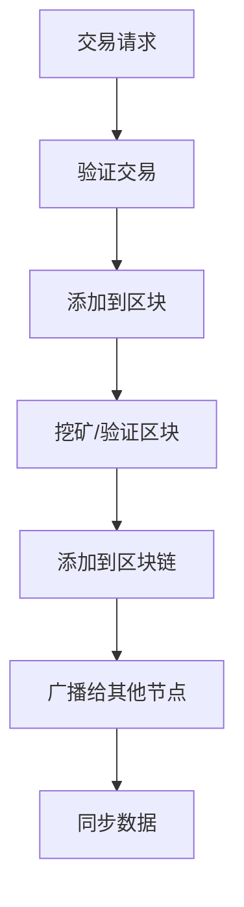
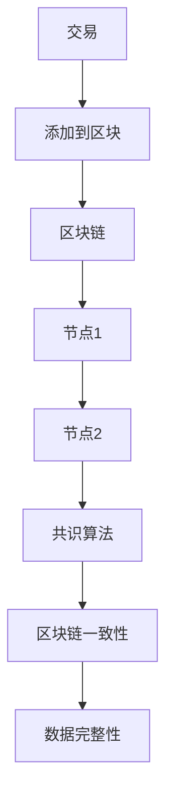

                 


### 文章标题

《区块链应用开发：去中心化创新的商业实践》

### 关键词

区块链，应用开发，智能合约，去中心化，商业实践，商业案例，供应链管理，隐私保护，AI融合，物联网

### 摘要

区块链技术以其去中心化、安全可信、不可篡改等特点，正逐步渗透到金融、供应链管理、版权保护等多个商业领域。本文将深入探讨区块链应用开发的原理、技术和实践，通过详细的分析和案例研究，为读者呈现区块链技术如何实现商业价值的创新应用。

### 《区块链应用开发：去中心化创新的商业实践》目录大纲

#### 第一部分：区块链基础与原理

##### 第1章：区块链概述

- 1.1 区块链的基本概念
- 1.2 区块链的发展历程
- 1.3 区块链的核心特征
- 1.4 区块链的应用领域

##### 第2章：区块链原理与架构

- 2.1 区块链的组成部分
- 2.2 区块链的数据结构
- 2.3 区块链的共识算法
- 2.4 Mermaid流程图：区块链数据流转过程

#### 第二部分：区块链应用开发

##### 第3章：智能合约开发

- 3.1 智能合约的基本原理
- 3.2 Solidity语言基础
- 3.3 伪代码：智能合约常见操作
- 3.4 数学公式：事件和日志记录
- 3.5 智能合约项目实战：简单的众筹智能合约实现

##### 第4章：去中心化应用（DApp）开发

- 4.1 DApp的概念与结构
- 4.2 Web3.js与以太坊交互
- 4.3 伪代码：DApp前端实现示例
- 4.4 数学模型：用户行为预测
- 4.5 DApp项目实战：基于以太坊的简易游戏开发

##### 第5章：区块链安全与隐私保护

- 5.1 区块链安全威胁分析
- 5.2 非对称加密与数字签名
- 5.3 伪代码：加密与解密操作
- 5.4 数学模型：零知识证明原理
- 5.5 区块链隐私保护项目实战：匿名币实现原理

##### 第6章：区块链在供应链管理中的应用

- 6.1 供应链管理现状与问题
- 6.2 区块链在供应链管理中的优势
- 6.3 伪代码：智能合约在供应链中的应用
- 6.4 数学模型：供应链优化算法
- 6.5 区块链供应链项目实战：追溯与防伪系统设计

##### 第7章：区块链与其他技术的融合应用

- 7.1 区块链与人工智能的融合
- 7.2 区块链与物联网的融合
- 7.3 伪代码：区块链+AI的基本架构
- 7.4 数学模型：区块链在物联网中的应用
- 7.5 跨界应用项目实战：智能家居系统的区块链集成

#### 第三部分：商业实践与案例分析

##### 第8章：区块链商业案例研究

- 8.1 区块链在金融行业的应用
- 8.2 区块链在版权保护领域的实践
- 8.3 区块链在选举投票系统的应用
- 8.4 案例分析：知名区块链项目的商业模式分析

##### 第9章：区块链项目的成功与挑战

- 9.1 区块链项目的生命周期管理
- 9.2 区块链项目的风险与挑战
- 9.3 伪代码：项目风险分析模型
- 9.4 数学模型：区块链项目的价值评估
- 9.5 案例分析：知名区块链项目案例分析

##### 第10章：未来展望与趋势

- 10.1 区块链技术的发展趋势
- 10.2 区块链在商业实践中的未来方向
- 10.3 数学公式：区块链技术的未来影响
- 10.4 潜在应用领域预测
- 10.5 结论与展望

### 附录

##### 附录A：区块链开发工具与资源

- 伪代码：区块链开发常用工具
- 数学模型：常见区块链算法原理
- 实用资源：区块链学习网站与资料

##### 附录B：项目代码实例与解读

- 代码实例：区块链应用开发实例代码
- 代码解读与分析：实例代码详细解读
- 开发环境搭建步骤

#### 核心概念与联系

- Mermaid流程图：区块链基本原理与架构

#### 核心算法原理讲解

- 伪代码：智能合约常见操作
- 数学公式：加密与解密算法

#### 数学模型和数学公式 & 详细讲解 & 举例说明

- 数学公式：区块链网络中的节点通信原理
- 示例说明：区块链中的共识算法

#### 项目实战

- 代码实际案例：智能合约开发与测试
- 详细解释说明：区块链供应链管理系统实现
- 开发环境搭建：区块链开发环境配置指南
- 源代码详细实现：区块链应用开发代码实现
- 代码解读与分析：区块链应用实例代码分析

### 背景介绍

区块链技术作为一种分布式账本技术，自2008年比特币的诞生以来，已逐渐成为全球瞩目的焦点。区块链的核心特点是去中心化、安全性和不可篡改性，这使得它能够广泛应用于金融、供应链管理、版权保护、医疗等多个领域。

区块链的基本概念包括区块、链、节点、共识算法等，每一个概念都是理解区块链技术的基础。区块链的发展历程展示了从比特币到以太坊，再到其他多种应用场景的演变过程。

区块链的核心特征主要包括去中心化、开放性、安全性、透明性和不可篡改性。去中心化意味着没有中央权威机构，所有的数据都由网络中的节点共同维护；开放性使得任何人都可以参与区块链网络的运作；安全性来自于加密技术和共识算法；透明性体现在所有交易记录都公开可查；不可篡改性保证了数据的真实性和可靠性。

区块链的应用领域非常广泛，包括但不限于数字货币、智能合约、供应链管理、医疗记录、选举投票系统等。这些应用不仅提高了效率，还增强了数据的可信度和安全性。

#### 核心概念与联系

区块链的基本组成部分包括区块、链、节点和共识算法。区块是区块链的基本数据单元，包含了交易信息和其他元数据；链是由多个区块按照时间顺序链接而成的数据结构。节点是指参与区块链网络运作的计算机，它们负责验证和存储数据；共识算法是节点之间达成一致性的机制，例如工作量证明（PoW）、权益证明（PoS）等。

在区块链网络中，节点通过共识算法进行数据同步，确保整个网络的可靠性。例如，在比特币网络中，节点通过解决数学难题来获得记账权，并在区块中记录交易信息。这一过程保证了区块链的不可篡改性。

Mermaid流程图可以直观地展示区块链的数据流转过程。以下是一个简化的Mermaid流程图示例：



在这个流程图中，交易请求由用户发起，经过验证后添加到区块中，由挖矿节点进行验证并添加到区块链中，最后广播给其他节点进行同步。

#### 核心算法原理讲解

区块链的共识算法是确保分布式网络中数据一致性的一种机制。不同的共识算法具有不同的特点和应用场景。以下是一些常见的共识算法及其工作原理：

1. **工作量证明（PoW）**：在比特币网络中，节点通过解决复杂的数学难题来证明其工作力度，从而获得记账权。这种算法的优点是去中心化，但缺点是计算资源消耗大，导致能源浪费。

2. **权益证明（PoS）**：在PoS机制中，节点的记账权与其持有的代币数量和存续时间成正比。相比PoW，PoS减少了对计算资源的依赖，但可能面临集中化的风险。

3. **委托权益证明（DPoS）**：DPoS通过选举产生记账节点，持币者可以投票委托。这种方式提高了网络的效率和安全性，但同样存在集中化问题。

4. **权威证明（PoA）**：PoA由中心化机构或个人控制，负责维护区块链网络。这种算法在特定场景下有效，但缺乏去中心化的特点。

伪代码是描述算法逻辑的一种方式。以下是一个简单的伪代码示例，用于展示区块链中添加交易到区块的过程：

```pseudo
function addTransactionToBlock(transaction):
    if block is not empty and transaction is valid:
        block.transactions.append(transaction)
    else:
        return "Invalid transaction"

function mineBlock(previousHash, currentBlock):
    while not validateProofOfWork(currentBlock):
        currentBlock.nonce += 1
    previousBlockHash = getHash(previousHash)
    currentBlockHash = getHash(currentBlock)
    return "Block added with hash: " + currentBlockHash
```

在这个伪代码中，`addTransactionToBlock` 函数用于将有效的交易添加到区块中，`mineBlock` 函数用于挖矿并验证工作量证明。

区块链中的加密技术包括非对称加密和数字签名。非对称加密使用公钥和私钥对数据进行加密和解密，数字签名则用于验证数据的真实性和完整性。

以下是一个简单的加密和解密操作的伪代码示例：

```pseudo
function encryptMessage(message, publicKey):
    cipherText = encrypt(message, publicKey)
    return cipherText

function decryptMessage(cipherText, privateKey):
    plainText = decrypt(cipherText, privateKey)
    return plainText
```

在区块链中，数学模型用于描述节点之间的通信和数据验证过程。例如，在比特币网络中，节点通过解决数学难题来证明其工作力度。以下是一个简单的数学模型示例，用于描述区块链中的共识算法：

$$
H_{prev} + \text{transaction} + H_{nonce} < \text{target}
$$

其中，$H_{prev}$ 是前一个区块的哈希值，`transaction` 是当前区块包含的交易数据，$H_{nonce}$ 是区块的随机数，`target` 是一个固定的目标值。节点需要找到合适的随机数，使得上述不等式成立，从而验证工作量证明。

#### 数学公式 & 详细讲解 & 举例说明

在区块链中，数学公式用于描述算法逻辑和数据结构。以下是一些关键的数学公式及其在区块链中的用途：

1. **哈希函数**：哈希函数是区块链中的基础。它将任意长度的数据映射为固定长度的哈希值。例如，SHA-256是一种常用的哈希函数。

   $$ 
   H = SHA-256(data)
   $$

   在区块链中，哈希函数用于确保数据的完整性和不可篡改性。每个区块都包含前一个区块的哈希值，从而形成了一个链条。

2. **工作量证明（PoW）**：在PoW算法中，节点需要找到一个满足特定条件的哈希值。例如，在比特币中，节点的目标是为区块找到一个哈希值，使得该值小于一个特定的目标值。

   $$
   H_{block} < \text{target}
   $$

   其中，$H_{block}$ 是区块的哈希值，`target` 是一个预设的目标值。节点通过不断调整随机数（nonce）来找到满足条件的哈希值。

3. **权益证明（PoS）**：在PoS算法中，节点的记账权与其持有的代币数量和存续时间成正比。假设网络中有N个节点，节点i的权益权重为：

   $$
   w_i = \frac{b_i \times t_i}{N}
   $$

   其中，$b_i$ 是节点i持有的代币数量，$t_i$ 是节点i的存续时间。权益权重决定了节点参与共识的概率。

4. **零知识证明（ZKP）**：零知识证明是一种密码学技术，允许一方证明某个陈述是正确的，而不泄露任何具体信息。在区块链隐私保护中，零知识证明用于验证交易的真实性，同时保护用户的隐私。

   $$
   P(Statement, Proof) \to Valid
   $$

   其中，`Statement` 是待验证的陈述，`Proof` 是证明。零知识证明确保了交易的有效性，同时避免了隐私泄露。

举例说明，假设我们使用SHA-256哈希函数来验证比特币区块的合法性。根据PoW算法，节点需要找到一个哈希值，使得该值小于特定的目标值（例如，$2^{256}$）。以下是一个简化的示例：

1. 节点生成一个随机数（nonce）和一个区块，包含交易信息和前一个区块的哈希值。
2. 节点计算区块的哈希值，并将其与目标值进行比较。
3. 如果哈希值不满足条件，节点增加nonce的值，并重新计算哈希值。
4. 重复步骤2和3，直到找到一个满足条件的哈希值。

这个过程确保了区块链网络的可靠性和安全性，同时避免了中央权威机构的介入。

#### 智能合约开发

智能合约是一种自动执行合约条款的程序，它在满足特定条件时自动执行预定的操作。智能合约的开发基于特定的编程语言，如Solidity，它是以太坊区块链的官方编程语言。

**3.1 智能合约的基本原理**

智能合约的工作原理是基于区块链的去中心化和安全性。智能合约代码存储在区块链上，一旦部署，就无法被篡改。当用户与智能合约交互时，智能合约会根据预定的条件自动执行操作。

智能合约的基本原理包括：

- **存储状态**：智能合约可以存储变量和状态，这些状态在区块链上永久保存。
- **事件和日志**：智能合约可以触发事件，并记录日志，以便后续审计和验证。
- **函数调用**：智能合约可以通过调用其他智能合约的函数来执行特定操作。

**3.2 Solidity语言基础**

Solidity是智能合约开发的通用编程语言，具有以下基本语法和结构：

- **变量声明**：Solidity支持多种数据类型，如整数、字符串和数组。变量声明如下：
  ```solidity
  uint public number = 0;
  ```

- **函数定义**：函数是智能合约的核心组成部分，具有输入参数和返回值。例如：
  ```solidity
  function increment() public {
      number += 1;
  }
  ```

- **事件和日志**：事件是智能合约触发的事件，可以通过日志记录来跟踪。例如：
  ```solidity
  event Incremented(uint oldValue, uint newValue);
  ```

- **继承和多态**：Solidity支持继承和多态，使得智能合约可以扩展和复用代码。例如：
  ```solidity
  contract BaseContract {
      function baseFunction() public {}
  }

  contract ChildContract is BaseContract {
      function childFunction() public override {}
  }
  ```

**3.3 伪代码：智能合约常见操作**

以下是一个简单的伪代码示例，展示智能合约的一些常见操作：

```pseudo
// 声明状态变量
uint public balance;

// 构造函数
function Contract() {
    balance = initialBalance;
}

// 存款函数
function deposit(amount) public {
    require(amount > 0, "存款金额必须大于0");
    balance += amount;
}

// 提款函数
function withdraw(amount) public {
    require(amount <= balance, "提款金额超过余额");
    balance -= amount;
}

// 事件和日志
event DepositEvent(address sender, uint amount);
event WithdrawalEvent(address sender, uint amount);

// 处理存款事件
function handleDeposit(amount) public {
    emit DepositEvent(msg.sender, amount);
}

// 处理提款事件
function handleWithdrawal(amount) public {
    emit WithdrawalEvent(msg.sender, amount);
}
```

在这个伪代码中，我们定义了一个简单的银行账户智能合约，包括存款、提款和事件记录功能。智能合约通过事件和日志确保操作的透明性和可审计性。

**3.4 数学公式：事件和日志记录**

在Solidity中，事件和日志记录是智能合约的重要功能。以下是一个简单的数学模型，用于描述事件和日志记录：

$$
\text{Log}_i = \{ (address, topic_i, data_i) \mid i = 1, 2, \ldots, n \}
$$

其中，$\text{Log}_i$ 表示第i个日志记录，包含发送者地址、主题和数据。主题用于区分不同类型的事件，数据则包含事件的具体信息。

例如，在存款事件中，主题可以是`DepositTopic`，数据可以是`{ msg.sender, amount }`。日志记录如下：

$$
\text{Log}_1 = \{ (msg.sender, DepositTopic, { msg.sender, amount }) \}
$$

**3.5 智能合约项目实战：简单的众筹智能合约实现**

以下是一个简单的众筹智能合约的实现示例，展示了智能合约在实际项目中的应用。该合约允许用户向特定项目捐款，并在项目成功时返还捐款。

```solidity
// SPDX-License-Identifier: MIT
pragma solidity ^0.8.0;

contract Crowdfunding {
    address payable public owner;
    uint public target;
    uint public deadline;
    uint public totalFunding;
    mapping(address => uint) public contributions;

    event FundReceived(address contributor, uint amount);
    event Refund(address contributor, uint amount);

    constructor(uint _target, uint _deadline) {
        owner = payable(msg.sender);
        target = _target;
        deadline = block.timestamp + _deadline;
    }

    function fund() public payable {
        require(block.timestamp <= deadline, "众筹已过期");
        require(msg.value > 0, "捐款金额必须大于0");

        totalFunding += msg.value;
        contributions[msg.sender] += msg.value;

        emit FundReceived(msg.sender, msg.value);
    }

    function refund() public {
        require(block.timestamp > deadline, "众筹尚未过期");
        require(totalFunding < target, "项目已成功");

        uint refundAmount = contributions[msg.sender];
        contributions[msg.sender] = 0;
        payable(msg.sender).transfer(refundAmount);

        emit Refund(msg.sender, refundAmount);
    }

    function withdrawFunds() public {
        require(msg.sender == owner, "只有项目所有者可以提取资金");
        require(totalFunding >= target, "项目尚未成功");

        payable(owner).transfer(totalFunding);
        totalFunding = 0;
    }
}
```

在这个示例中，众筹智能合约包括以下几个关键组成部分：

- **构造函数**：设置项目目标、截止日期和资金总额。
- **捐款函数**：允许用户向项目捐款，并在事件中记录捐款信息。
- **退款函数**：在项目失败时，允许用户退款。
- **提取资金函数**：在项目成功时，允许项目所有者提取资金。

通过这个示例，我们可以看到智能合约如何实现去中心化的众筹功能，确保资金的安全和透明性。

#### 去中心化应用（DApp）开发

去中心化应用（DApp）是区块链技术的核心应用之一，它结合了区块链的安全性和去中心化特点，为用户提供了全新的体验。在DApp开发中，开发者需要使用特定的工具和框架来实现前端和后端的交互。

**4.1 DApp的概念与结构**

DApp，即去中心化应用，是一种完全在区块链上运行的应用程序。与传统的中心化应用不同，DApp没有中央服务器或权威机构，所有数据都在区块链上存储和验证。DApp的主要组成部分包括：

- **前端**：用户与DApp交互的界面，通常使用Web技术（如HTML、CSS和JavaScript）开发。
- **后端**：与区块链交互的逻辑层，通常使用智能合约实现。
- **区块链**：存储和验证DApp数据的分布式账本。

DApp的开发流程通常包括以下几个步骤：

1. **需求分析**：确定DApp的功能和目标用户。
2. **技术选型**：选择适合的区块链平台和开发工具。
3. **前端开发**：实现用户界面和用户体验。
4. **后端开发**：编写智能合约和与区块链的交互逻辑。
5. **测试与部署**：在测试环境中进行测试，并将DApp部署到主链。

**4.2 Web3.js与以太坊交互**

Web3.js是一个JavaScript库，用于与以太坊区块链进行交互。它提供了一系列API，使得开发者可以轻松地在前端应用程序中访问区块链数据和执行智能合约操作。以下是一些关键的Web3.js功能：

- **连接到以太坊网络**：使用Web3.js，开发者可以连接到以太坊节点，并获取区块链的当前状态。
- **以太坊钱包集成**：Web3.js可以与以太坊钱包（如MetaMask）集成，允许用户在DApp中进行数字货币操作。
- **智能合约交互**：Web3.js提供了一套API，用于调用智能合约的函数，读取和写入区块链数据。

以下是一个简单的示例，展示如何使用Web3.js连接到以太坊网络并获取区块链数据：

```javascript
const Web3 = require('web3');
const ethTx = require('ethereumjs-tx');

// 创建Web3实例
const web3 = new Web3('https://mainnet.infura.io/v3/YOUR_INFURA_PROJECT_ID');

// 获取区块链当前块高
web3.eth.getBlockNumber((error, result) => {
  if (error) {
    console.log(error);
  } else {
    console.log(`Current block number: ${result}`);
  }
});

// 获取指定地址的余额
web3.eth.getBalance('0xYOUR_ADDRESS', (error, result) => {
  if (error) {
    console.log(error);
  } else {
    console.log(`Balance of address 0xYOUR_ADDRESS: ${web3.utils.fromWei(result.toString(), 'ether')}`);
  }
});
```

在这个示例中，我们首先创建一个Web3实例，然后使用`getBlockNumber`和`getBalance`方法获取区块链的当前块高和指定地址的余额。

**4.3 伪代码：DApp前端实现示例**

以下是一个简单的伪代码示例，展示如何使用Web3.js在前端应用程序中实现一个简单的去中心化投票DApp：

```pseudo
// 声明状态变量
bool public votingActive;
map<string, bool> public voterMap;
map<string, int> public candidateVotes;

// 构造函数
function VotingDApp() {
    votingActive = false;
}

// 开始投票
function startVoting() public {
    require(!votingActive, "投票已开始");
    votingActive = true;
}

// 投票函数
function vote(candidate) public {
    require(votingActive, "投票尚未开始");
    require(!voterMap[msg.sender], "已投票");

    voterMap[msg.sender] = true;
    candidateVotes[candidate] += 1;
}

// 结束投票
function endVoting() public {
    require(votingActive, "投票已结束");
    votingActive = false;
}

// 获取投票结果
function getVoteResult(candidate) public view returns (int) {
    return candidateVotes[candidate];
}
```

在这个伪代码中，我们定义了一个简单的投票DApp，包括投票、开始投票、结束投票和获取投票结果等功能。前端应用程序可以通过Web3.js与智能合约进行交互，实现投票功能。

**4.4 数学模型：用户行为预测**

在DApp开发中，了解用户行为对于优化用户体验和提升用户参与度至关重要。以下是一个简单的数学模型，用于预测用户的行为：

1. **用户参与度模型**：

   $$
   Engagement = f(InterfaceQuality, ContentQuality, RewardSystem)
   $$

   其中，`Engagement` 表示用户参与度，`InterfaceQuality` 表示界面质量，`ContentQuality` 表示内容质量，`RewardSystem` 表示奖励系统。通过优化这些因素，可以提高用户的参与度。

2. **留存率模型**：

   $$
   RetentionRate = f(UserExperience, FeatureRichness, Support)
   $$

   其中，`RetentionRate` 表示用户留存率，`UserExperience` 表示用户体验，`FeatureRichness` 表示功能丰富度，`Support` 表示支持服务。一个良好的留存率模型可以帮助开发者留住核心用户。

**4.5 DApp项目实战：基于以太坊的简易游戏开发**

以下是一个简单的DApp项目实战示例，展示如何使用以太坊开发一个简单的抽奖游戏。在这个项目中，用户可以购买彩票，并参与抽奖。

```solidity
// SPDX-License-Identifier: MIT
pragma solidity ^0.8.0;

contract Lottery {
    address payable public owner;
    uint public ticketPrice;
    uint public totalTicketsSold;
    mapping(address => uint) public ticketsBought;

    event TicketBought(address buyer, uint ticketCount);
    event DrawCompleted(address winner, uint winningAmount);

    constructor(uint _ticketPrice) {
        owner = payable(msg.sender);
        ticketPrice = _ticketPrice;
    }

    function buyTicket() public payable {
        require(msg.value >= ticketPrice, "购买金额不足");
        totalTicketsSold += 1;
        ticketsBought[msg.sender] += 1;

        emit TicketBought(msg.sender, ticketsBought[msg.sender]);
    }

    function draw() public {
        require(!isDrawn, "抽奖已完成");
        require(msg.sender == owner, "只有管理员可以执行抽奖");

        uint randomWinner = uint(keccak256(abi.encodePacked(blockhash(block.number - 1), block.timestamp))) % totalTicketsSold;
        address winner = address(randomWinner);

        uint winningAmount = totalTicketsSold * ticketPrice;
        payable(winner).transfer(winningAmount);

        isDrawn = true;

        emit DrawCompleted(winner, winningAmount);
    }
}
```

在这个项目中，我们定义了一个简单的抽奖智能合约，包括购买彩票、抽奖和发放奖金等功能。用户可以通过调用`buyTicket`方法购买彩票，管理员可以通过调用`draw`方法进行抽奖。

通过这个示例，我们可以看到如何使用智能合约和以太坊实现去中心化的抽奖游戏，确保游戏结果的公平性和透明性。

#### 区块链安全与隐私保护

区块链技术在提供去中心化、透明性和不可篡改性等优势的同时，也面临着一系列的安全威胁和隐私问题。因此，确保区块链系统的安全与隐私保护至关重要。以下将详细探讨区块链安全威胁、非对称加密与数字签名、加密与解密操作以及零知识证明原理。

**5.1 区块链安全威胁分析**

区块链系统可能面临以下几种安全威胁：

1. **51%攻击**：当某个实体或团体控制了区块链网络中超过51%的算力时，可以篡改交易记录、双花攻击或双花（double-spending）等。
2. **智能合约漏洞**：智能合约代码可能包含安全漏洞，导致恶意攻击者利用这些漏洞窃取资金或控制智能合约。
3. ** Sybil攻击**：通过创建大量虚假节点来控制网络，从而影响共识过程和决策。
4. **隐私泄露**：区块链上的交易记录是公开透明的，可能导致用户的隐私泄露。
5. **网络攻击**：包括分布式拒绝服务（DDoS）攻击、中间人攻击等，旨在破坏区块链网络或服务的正常运行。

为了应对这些安全威胁，区块链系统需要采用多种安全措施。

**5.2 非对称加密与数字签名**

非对称加密是一种加密算法，使用一对密钥：公钥和私钥。公钥用于加密数据，私钥用于解密数据。非对称加密在区块链中具有广泛的应用，例如：

- **数字签名**：使用私钥对交易或消息进行签名，确保数据的完整性和真实性。数字签名还用于验证交易发起者的身份。
- **公钥加密**：使用公钥加密交易信息，确保只有拥有对应私钥的用户才能解密和访问数据。

以下是一个简单的非对称加密与数字签名示例：

```python
from Crypto.PublicKey import RSA
from Crypto.Signature import pkcs1_15
from Crypto.Hash import SHA256

# 生成RSA密钥对
key = RSA.generate(2048)

# 公钥和私钥
public_key = key.publickey()
private_key = key

# 创建SHA256哈希对象
hash = SHA256.new(message)

# 签名
signature = pkcs1_15.new(private_key).sign(hash)

# 验证签名
verified = pkcs1_15.new(public_key).verify(hash, signature)
```

在这个示例中，我们使用Python的PyCrypto库生成RSA密钥对，并对消息进行签名和验证。

**5.3 伪代码：加密与解密操作**

以下是一个简单的伪代码示例，展示如何使用非对称加密进行数据加密和解密：

```pseudo
function encryptData(data, publicKey):
    cipherText = encrypt(data, publicKey)
    return cipherText

function decryptData(cipherText, privateKey):
    plainText = decrypt(cipherText, privateKey)
    return plainText
```

在这个伪代码中，`encryptData` 函数使用公钥加密数据，`decryptData` 函数使用私钥解密数据。

**5.4 数学模型：零知识证明原理**

零知识证明（Zero-Knowledge Proof, ZKP）是一种密码学技术，允许证明者向验证者证明某个陈述是真实的，而无需泄露任何具体信息。零知识证明在区块链隐私保护中具有重要作用。

零知识证明的基本原理包括以下步骤：

1. **证明生成**：证明者生成一个数学证明，证明某个陈述是真实的。
2. **证明验证**：验证者验证证明的有效性，而不了解具体信息。

以下是一个简单的数学模型，用于描述零知识证明：

$$
Proof = ZKP(\mathcal{S}, \mathcal{V}, \mathcal{P})
$$

其中，$\mathcal{S}$ 表示陈述，$\mathcal{V}$ 表示验证者，$\mathcal{P}$ 表示证明者。

零知识证明的应用示例包括：

- **零知识证明加密**：通过零知识证明加密，交易信息可以在区块链上验证而不公开。
- **零知识证明签名**：通过零知识证明签名，确保交易的真实性，同时保护用户隐私。

**5.5 区块链隐私保护项目实战：匿名币实现原理**

匿名币（如Monero、Zcash）是一种注重隐私保护的区块链项目。以下是一个简单的匿名币实现原理：

1. **混合交易**：通过将多个用户的交易混合在一起，使单个交易的来源和去向变得难以追踪。
2. **混淆交易**：使用混淆技术，将交易金额和地址进行混淆，进一步保护用户隐私。
3. **环签名**：通过环签名技术，交易参与者可以隐藏自己的身份。

以下是一个简单的匿名币交易示例：

```solidity
contract AnonCoin {
    mapping(address => uint) public balances;

    function sendCoin(address receiver, uint amount) public {
        require(amount <= balances[msg.sender], "余额不足");
        balances[msg.sender] -= amount;
        balances[receiver] += amount;
    }

    function mixCoins() public {
        // 将多个用户的交易混合在一起
        // 使用环签名技术混淆交易信息
        // 确保交易隐私
    }
}
```

在这个示例中，匿名币智能合约包括发送硬币和混合交易功能。混合交易功能使用环签名技术，确保交易隐私。

通过以上分析，我们可以看到区块链安全与隐私保护的重要性和实现方法。在实际应用中，开发者需要综合考虑多种安全措施，确保区块链系统的安全性和隐私性。

#### 区块链在供应链管理中的应用

区块链技术以其去中心化、透明和不可篡改的特性，在供应链管理领域展现出巨大的潜力。传统的供应链管理面临诸多问题，如信息不透明、数据篡改风险和信任缺失等。区块链技术通过建立一个可信的分布式账本，为供应链管理提供了新的解决方案。

**6.1 供应链管理现状与问题**

当前供应链管理存在以下几个主要问题：

1. **信息不透明**：供应链涉及多个环节和参与者，信息传递不畅，导致供应链整体透明度不足。
2. **数据篡改风险**：供应链中的数据容易受到篡改，导致数据真实性和准确性问题。
3. **信任缺失**：供应链参与者之间的信任度低，信息共享困难，增加了交易成本和风险。
4. **效率低下**：供应链流程复杂，操作效率低，导致响应速度慢，无法及时应对市场变化。

**6.2 区块链在供应链管理中的优势**

区块链技术为供应链管理带来了以下优势：

1. **信息透明**：区块链上的数据是公开透明的，所有供应链参与者可以查看和验证交易记录，提高了信息的透明度。
2. **数据不可篡改**：区块链的数据结构确保了数据的不可篡改性，一旦数据上链，就无法被修改，增强了数据的可信度。
3. **增强信任**：区块链技术通过去中心化的方式，打破了传统供应链中的信任障碍，各参与者可以基于区块链进行信任协作。
4. **提高效率**：区块链技术简化了供应链流程，减少了中间环节，提高了操作效率，降低了交易成本。

**6.3 伪代码：智能合约在供应链中的应用**

以下是一个简单的伪代码示例，展示智能合约在供应链管理中的应用：

```solidity
// SPDX-License-Identifier: MIT
pragma solidity ^0.8.0;

contract SupplyChain {
    struct Product {
        string id;
        string manufacturer;
        string distributor;
        string retailer;
        string finalUser;
        bool isShipped;
        bool isReceived;
    }

    mapping(string => Product) public products;

    function createProduct(string memory id, string memory manufacturer) public {
        require(products[id].id == "", "产品已存在");
        products[id] = Product(id, manufacturer, "", "", "", false, false);
    }

    function shipProduct(string memory id, string memory distributor) public {
        require(products[id].isShipped == false, "产品已发货");
        products[id].distributor = distributor;
        products[id].isShipped = true;
    }

    function receiveProduct(string memory id, string memory retailer) public {
        require(products[id].isReceived == false, "产品已接收");
        products[id].retailer = retailer;
        products[id].isReceived = true;
    }

    function useProduct(string memory id, string memory finalUser) public {
        require(products[id].isReceived == true, "产品未接收");
        products[id].finalUser = finalUser;
    }
}
```

在这个示例中，我们定义了一个简单的供应链智能合约，包括创建产品、发货、接收和使用产品等功能。智能合约确保了供应链环节的透明性和数据的不可篡改性。

**6.4 数学模型：供应链优化算法**

区块链技术可以通过数学模型优化供应链管理。以下是一个简单的供应链优化算法：

$$
\text{Cost} = f(\text{Supply}, \text{Demand}, \text{Inventory}, \text{LeadTime})
$$

其中，`Cost` 表示供应链成本，`Supply` 表示供应量，`Demand` 表示需求量，`Inventory` 表示库存水平，`LeadTime` 表示交货时间。供应链优化算法的目标是在满足需求的前提下，最小化供应链成本。

为了实现这个目标，我们可以采用以下步骤：

1. **数据收集**：收集供应链各环节的数据，包括供应量、需求量、库存水平和交货时间等。
2. **建模**：建立供应链成本模型，使用数学公式描述供应链成本与各因素之间的关系。
3. **优化**：使用优化算法（如线性规划、模拟退火等）求解最优供应链策略。
4. **验证**：在实际应用中验证优化算法的有效性，并根据反馈进行调整。

**6.5 区块链供应链项目实战：追溯与防伪系统设计**

以下是一个简单的区块链供应链项目实战示例，展示如何设计一个追溯与防伪系统：

```solidity
// SPDX-License-Identifier: MIT
pragma solidity ^0.8.0;

contract TraceAndAntiFake {
    struct Product {
        string id;
        string manufacturer;
        string distributor;
        string retailer;
        string finalUser;
        bool isShipped;
        bool isReceived;
        bool isVerified;
    }

    mapping(string => Product) public products;

    function createProduct(string memory id, string memory manufacturer) public {
        require(products[id].id == "", "产品已存在");
        products[id] = Product(id, manufacturer, "", "", "", false, false, false);
    }

    function shipProduct(string memory id, string memory distributor) public {
        require(products[id].isShipped == false, "产品已发货");
        products[id].distributor = distributor;
        products[id].isShipped = true;
    }

    function receiveProduct(string memory id, string memory retailer) public {
        require(products[id].isReceived == false, "产品已接收");
        products[id].retailer = retailer;
        products[id].isReceived = true;
    }

    function useProduct(string memory id, string memory finalUser) public {
        require(products[id].isReceived == true, "产品未接收");
        products[id].finalUser = finalUser;
        products[id].isVerified = true;
    }

    function verifyProduct(string memory id) public {
        require(products[id].isVerified == false, "产品已验证");
        products[id].isVerified = true;
    }
}
```

在这个示例中，我们定义了一个简单的追溯与防伪智能合约，包括产品创建、发货、接收、使用和验证等功能。智能合约确保了产品信息的透明性和不可篡改性，从而实现了追溯与防伪。

通过以上分析，我们可以看到区块链在供应链管理中的应用如何解决传统供应链管理中的问题，提高供应链的效率和可信度。实际项目中的实施和优化是进一步推动区块链技术在供应链管理领域发展的关键。

#### 区块链与其他技术的融合应用

区块链技术由于其去中心化、安全性和透明性等独特优势，与其他技术的融合应用正在逐步成为新的研究热点和商业实践。以下将探讨区块链与人工智能（AI）、物联网（IoT）和云计算等技术的融合应用，展示其如何带来新的创新和改进。

**7.1 区块链与人工智能的融合**

区块链与人工智能（AI）的结合在多个领域展现出了巨大的潜力，其中最显著的融合应用包括：

1. **智能合约优化**：区块链中的智能合约可以通过AI技术进行优化，以提高效率和准确性。例如，AI可以自动分析智能合约中的代码，检测潜在的安全漏洞，并建议改进措施。
2. **AI模型验证与审计**：区块链技术可以用来验证和审计AI模型的训练数据和输出结果。通过将AI模型和训练数据上链，确保其透明性和不可篡改性，从而增强用户对AI系统的信任。
3. **去中心化AI**：区块链可以为分布式AI模型提供基础设施，使得多个节点可以共同训练和更新AI模型，从而实现去中心化的AI服务。这种方式不仅可以提高AI模型的鲁棒性，还可以减少对中心化服务的依赖。

**7.2 区块链与物联网的融合**

区块链与物联网（IoT）的结合可以大幅提升物联网系统的安全性和数据可信度。以下是一些关键应用：

1. **设备数据验证**：区块链可以确保物联网设备收集的数据真实可靠。例如，通过将设备数据上链，用户可以验证数据的来源和传输过程，防止数据篡改。
2. **去中心化物联网网络**：区块链可以为物联网设备提供去中心化的网络架构，使得设备之间可以直接进行通信，而不依赖于中心化服务。这种方式可以减少单点故障的风险，提高网络的可靠性和灵活性。
3. **智能设备控制**：区块链可以用于智能设备的控制和管理。例如，通过智能合约，用户可以远程控制智能家居设备，并确保操作的安全性和不可篡改性。

**7.3 伪代码：区块链+AI的基本架构**

以下是一个简单的伪代码示例，展示区块链与AI技术结合的基本架构：

```python
# 区块链+AI架构
class Blockchain:
    def __init__(self):
        self.chain = []
        self.pending_transactions = []

    def add_block(self, new_block):
        self.chain.append(new_block)

    def mine_pending_transactions(self):
        # 使用AI技术优化交易处理
        optimized_transactions = AI.optimize_transactions(self.pending_transactions)
        new_block = Block(optimized_transactions)
        self.add_block(new_block)

    def verify_transaction(self, transaction):
        # 使用AI技术验证交易
        verified = AI.verify_transaction(transaction)
        return verified

class AI:
    def optimize_transactions(self, transactions):
        # 优化交易
        optimized_transactions = []
        for transaction in transactions:
            optimized_transaction = self.optimize(transaction)
            optimized_transactions.append(optimized_transaction)
        return optimized_transactions

    def verify_transaction(self, transaction):
        # 验证交易
        verified = self.verify(transaction)
        return verified

class Block:
    def __init__(self, transactions):
        self.transactions = transactions
```

在这个架构中，区块链类（Blockchain）负责管理链上的区块和交易，AI类（AI）负责优化交易和验证交易。Block类用于表示区块链上的区块。

**7.4 数学模型：区块链在物联网中的应用**

区块链在物联网中的应用可以通过以下数学模型进行描述：

1. **节点通信模型**：

   $$
   Communication = f(Node_A, Node_B, Data)
   $$

   其中，`Communication` 表示节点之间的数据通信，`Node_A` 和 `Node_B` 分别表示通信的节点，`Data` 表示传输的数据。

2. **数据验证模型**：

   $$
   Verification = f(Hash, Data)
   $$

   其中，`Verification` 表示数据验证，`Hash` 是数据上链后的哈希值，`Data` 是原始数据。

3. **去中心化网络模型**：

   $$
   Network = f(Node_1, Node_2, \ldots, Node_n)
   $$

   其中，`Network` 表示去中心化网络，`Node_1, Node_2, \ldots, Node_n` 分别表示网络中的节点。

通过这些模型，我们可以分析物联网系统在区块链环境下的数据通信、验证和网络结构。

**7.5 跨界应用项目实战：智能家居系统的区块链集成**

以下是一个智能家居系统区块链集成的项目实战示例：

```solidity
// SPDX-License-Identifier: MIT
pragma solidity ^0.8.0;

contract SmartHome {
    mapping(address => bool) public devices;

    function addDevice(address deviceAddress) public {
        require(!devices[deviceAddress], "设备已存在");
        devices[deviceAddress] = true;
    }

    function removeDevice(address deviceAddress) public {
        require(devices[deviceAddress], "设备不存在");
        devices[deviceAddress] = false;
    }

    function controlDevice(address deviceAddress, bool state) public {
        require(devices[deviceAddress], "设备不存在");
        // 假设设备支持Web3.js库
        Web3.eth.sendTransaction({
            to: deviceAddress,
            data: encodeControlCommand(state)
        });
    }

    function encodeControlCommand(bool state) private pure returns (bytes memory) {
        return abi.encode(state);
    }
}
```

在这个示例中，智能家居系统智能合约（SmartHome）管理智能家居设备的注册、控制和移除。用户可以通过调用智能合约方法来控制设备状态，确保操作的透明性和不可篡改性。

通过以上分析，我们可以看到区块链技术与其他技术的融合应用如何带来新的创新和改进。实际项目中的实施和优化是进一步推动这些技术融合发展的关键。

#### 区块链商业案例研究

区块链技术作为一种新兴的技术，正在金融、版权保护、选举投票等多个领域得到广泛应用。以下将介绍一些著名的区块链商业案例，并分析其商业模式和成功因素。

**8.1 区块链在金融行业的应用**

区块链技术在金融行业的应用非常广泛，从数字货币到金融衍生品，再到跨境支付和结算，区块链技术为金融行业带来了新的机遇和挑战。

1. **比特币**：比特币是第一个基于区块链技术的数字货币，它通过去中心化的方式实现了货币的发行和交易。比特币的成功在于其去中心化特性，使得任何人都可以参与比特币网络的运作，避免了传统金融系统中的中介环节。比特币的商业模式依赖于其自身的价值，用户通过挖矿或购买比特币来获得收益。

2. **Ripple**：Ripple是一个基于区块链技术的跨境支付网络，它通过Ripple协议实现了快速、低成本的跨境支付。Ripple的成功因素在于其高效的交易机制和广泛的市场认可度。Ripple不仅吸引了众多金融机构作为其合作伙伴，还通过联盟链的方式增强了网络的稳定性。

3. **智能合约金融产品**：智能合约在金融领域有着广泛的应用，从众筹平台到衍生品交易平台，再到去中心化金融（DeFi）平台，智能合约为金融产品提供了自动化和透明化的解决方案。例如，EOSIO区块链上的StakerDAO是一个去中心化基金平台，用户可以通过质押EOS代币来参与投资，并分享收益。这种模式不仅提高了资金的利用效率，还降低了交易成本。

**8.2 区块链在版权保护领域的实践**

区块链技术为版权保护提供了一种新的解决方案，通过去中心化的方式确保版权信息的透明性和不可篡改性。

1. **Musicoin**：Musicoin是一个基于区块链的数字音乐平台，它通过区块链技术实现了音乐版权的自动化管理和支付。Musicoin的商业模式依赖于其自身的代币体系，用户可以通过支付Musicoin代币来购买音乐，并分享收益给音乐创作者。这种模式不仅解决了音乐版权纠纷问题，还提高了音乐创作者的收入。

2. **Over和Moralis**：Over和Moralis是两个专注于版权保护的区块链平台。Over通过区块链技术为电影、音乐、文学等版权提供确权和交易服务，而Moralis则提供版权追踪和管理工具。这些平台的成功因素在于其高效、透明的版权管理机制，以及广泛的用户基础。

**8.3 区块链在选举投票系统的应用**

区块链技术在选举投票系统的应用，旨在提高选举的透明度和安全性，防止选举欺诈。

1. **Elections.EU**：Elections.EU是一个基于区块链的欧洲选举投票系统，它通过智能合约实现了选举的自动化和去中心化。用户可以通过区块链网络进行投票，并确保选举结果的真实性和不可篡改性。Elections.EU的成功因素在于其去中心化特性，以及高效、透明的选举过程。

2. **Voatz**：Voatz是一个基于区块链的移动投票平台，它为选民提供了一种安全、便捷的投票方式。Voatz通过区块链技术确保投票的匿名性和不可篡改性，同时也提供了一系列安全措施，如多重身份验证和加密技术。Voatz的成功因素在于其高度安全性和用户体验。

**8.4 案例分析：知名区块链项目的商业模式分析**

以下是几个知名区块链项目的商业模式分析：

1. **比特币**：比特币的商业模式依赖于其自身的价值。比特币通过挖矿和交易实现了货币的发行和流通，用户可以通过购买、持有或交易比特币来获得收益。比特币的成功因素在于其去中心化特性和市场认可度。

2. **Ripple**：Ripple的商业模式依赖于其Ripple协议，通过为金融机构提供跨境支付和结算服务来获取收益。Ripple通过联盟链的方式增强了网络的稳定性，并与众多金融机构建立了合作关系。Ripple的成功因素在于其高效、低成本的支付网络和广泛的市场认可度。

3. **Over和Moralis**：Over和Moralis的商业模式依赖于其区块链平台，提供版权保护和管理服务。这些平台通过收取服务费和交易手续费来获得收益。Over和Moralis的成功因素在于其高效、透明的版权管理机制和广泛的用户基础。

4. **Elections.EU和Voatz**：Elections.EU和Voatz的商业模式依赖于其区块链投票系统，通过为政府和选民提供安全、透明的投票服务来获得收益。这些项目的成功因素在于其高度安全性和用户体验。

通过以上分析，我们可以看到区块链技术在金融、版权保护和选举投票等领域的成功案例，这些案例展示了区块链技术如何通过去中心化、透明化和安全性等优势实现商业价值的创新应用。

#### 区塊鏈項目的成功與挑戰

區塊鏈項目的發展不僅帶來了前所未有的機會，同時也伴隨著許多挑戰。以下將分析區塊鏈項目的生命周期管理、風險與挑戰，並通過實際案例進行深入剖析。

**9.1 区块链项目的生命周期管理**

區塊鏈項目的生命周期管理是成功關鍵之一，它通常包括以下幾個主要階段：

1. **概念验证（Proof of Concept, PoC）**：這個階段旨在驗證項目的基本概念和技術可行性。通過构建最小可行產品（Minimum Viable Product, MVP）來驗證項目的核心價值。
2. **開發與測試**：在這個階段，項目團隊將開發完整的功能並進行全面的測試，包括單元測試、集成測試和性能測試等，以確保系統的穩定性和安全性。
3. **測試網絡（Testnet）**：在主網絡部署前，項目通常會先在測試網絡上進行測試，以驗證其技術規範和系統性能。
4. **主網絡部署（Mainnet Deployment）**：完成測試後，項目將正式部署到主網絡上，並開始面向實際用戶運行。
5. **運營與維護**：項目部署後，需要持續進行運營和維護，包括定期的系統更新、漏洞修復和安全監控等。
6. **項目更新與發展**：根據用戶反饋和市場變化，不斷進行項目的更新和發展，以保持其競爭力和市場價值。

**9.2 区块链项目的风险与挑战**

區塊鏈項目在發展過程中可能面臨以下幾種風險和挑戰：

1. **技術風險**：區塊鏈技術仍在不斷進步中，項目可能會遇到技術上的困難，例如網絡性能瓶颈、安全性漏洞和技術標準的不統一等。
2. **法律和监管風險**：區塊鏈項目涉及到的法律和監管問題複雜，不同國家和地區的法律法规可能對項目有不同的要求，這可能對項目的發展帶來障礙。
3. **市場風險**：區塊鏈項目在市場上可能面臨競爭對手的挑戰，市場接受度和價值評估也可能存在不確定性。
4. **運營風險**：項目在運營過程中可能遇到技術故障、網絡擁堵和安全事件等問題，這可能對項目的穩定運行帶來影響。

**9.3 伪代码：项目风险分析模型**

以下是一個簡化的伪代码模型，用於分析區塊鏈項目的風險：

```python
class ProjectRiskAnalysis:
    def __init__(self, risks):
        self.risks = risks

    def calculate_risk_score(self):
        total_score = 0
        for risk in self.risks:
            likelihood = risk["likelihood"]
            impact = risk["impact"]
            total_score += likelihood * impact
        return total_score

risks = [
    {"name": "技術風險", "likelihood": 0.5, "impact": 0.8},
    {"name": "法律和監管風險", "likelihood": 0.3, "impact": 0.7},
    {"name": "市場風險", "likelihood": 0.2, "impact": 0.6},
    {"name": "運營風險", "likelihood": 0.4, "impact": 0.9},
]

analysis = ProjectRiskAnalysis(risks)
risk_score = analysis.calculate_risk_score()
print(f"項目風險分數：{risk_score}")
```

在這個模型中，我們為每個風險分別設定了一個可能性（likelihood）和影響力（impact），並計算總風險分數。

**9.4 数学模型：区块链项目的价值评估**

區塊鏈項目的價值評估是一個複雜的問題，可以通過以下數學模型進行簡化：

$$
\text{Project Value} = \sum_{i=1}^{n} \frac{P_i \times R_i}{1 + r}
$$

其中，`Project Value` 表示項目的總價值，`P_i` 表示第i年的預期收入，`R_i` 表示第i年的預期收入復利，`r` 表示折現率。

以下是一個簡化的實例：

$$
\text{Project Value} = \frac{100,000 \times (1 + 0.05)^1 + 120,000 \times (1 + 0.05)^2 + 150,000 \times (1 + 0.05)^3}{1 + 0.05}
$$

通過這個模型，我們可以計算出項目的總價值，並作為投資決策的依據。

**9.5 案例分析：知名区块链项目案例分析**

以下是一個知名區塊鏈項目的案例分析：

**案例：以太坊（Ethereum）**

以太坊是一個開源的區塊鏈平台，它不僅支持加密貨幣以太幣（Ether），還提供了一個去中心化的計算平台，用於運行智能合約。

1. **發展歷程**：以太坊於2015年推出，從一開始的以太幣交易平台發展到如今成為全球最大的智能合約平台，其歷程可謂是區塊鏈技術進步的體現。

2. **成功因素**：以太坊的成功主要得益於其創新性、去中心化和透明的特點，以及廣泛的社群參與和支持。以太坊的創新性在于其智能合約功能，這一特性使得以太坊在金融、遊戲、供應鏈等多個領域都有廣泛應用。

3. **風險與挑戰**：以太坊在發展過程中面臨著許多挑戰，包括技術複雜性、安全性問題和监管風險等。技術複雜性使得以太坊需要不斷進行技術創新和優化，以應對日益複雜的應用需求。安全性問題是區塊鏈項目的常見問題，以太坊需要持續進行安全性評估和改進，以防止潛在的安全漏洞。监管風險是區塊鏈項目普遍面臨的問題，不同國家和地區的監管政策可能對以太坊的發展帶來影響。

**案例分析：泰達塊（Tezos）**

泰達塊是一個開源的區塊鏈平台，旨在提供一個透明、去中心化和自我改進的區塊鏈網絡。

1. **發展歷程**：泰達塊於2017年通過初始代币發行（ICO）籌集資金，並於2018年正式啟動。

2. **成功因素**：泰達塊的成功在于其創新的治理機制和技術實現。泰達塊採用了代議民主制度，參與者可以參與區塊鏈網絡的運作和決策，這一特性提高了區塊鏈的透明性和公平性。

3. **風險與挑戰**：泰達塊在發展過程中面臨著技術風險和治理風險。技術風險來自於區塊鏈技術的不斷變化和發展，泰達塊需要不斷進行技術創新和優化。治理風險則來自於代議民主制度的運作，如果參與者參與度不高或决策過程不透明，可能會影響區塊鏈的運作和發展。

總結來說，區塊鏈項目的成功與挑戰是多方面的，包括技術創新、市場應對和治理機制等。通過深入分析知名項目的成功與挑戰，我們可以獲得寶貴的經驗和知識，進而更好地推動區塊鏈技術的發展和應用。

#### 未来展望与趋势

区块链技术的发展正以前所未有的速度推进，其应用领域和商业实践也在不断拓展。以下将探讨区块链技术的未来发展趋势、在商业实践中的潜在方向以及未来可能带来的影响。

**10.1 区块链技术的发展趋势**

1. **更高效的共识算法**：现有的共识算法如工作量证明（PoW）和权益证明（PoS）面临着能源消耗高、效率低等问题。未来的发展可能会看到更高效的共识算法的出现，如权益证明改进算法（DPoS）、授权股权证明（PoA）等。

2. **跨链技术的成熟**：跨链技术旨在实现不同区块链之间的互操作性和数据共享。随着跨链技术的发展，区块链网络将能够更好地集成不同的应用，从而提高整个系统的效率。

3. **隐私保护技术的提升**：随着对隐私保护需求的增加，区块链技术将会在隐私保护方面进行更多的创新。零知识证明（ZKP）等技术将进一步发展和完善，为用户隐私提供更强大的保护。

4. **智能合约功能的增强**：智能合约的发展将继续，未来的智能合约可能会集成更多的复杂逻辑和功能，包括人工智能、机器学习等。

5. **分布式身份验证和治理**：分布式身份验证和治理机制将逐步成熟，为用户提供更安全、更便捷的身份验证服务，同时提高区块链网络的透明性和公正性。

**10.2 区块链在商业实践中的未来方向**

1. **金融行业的深度应用**：区块链技术将在金融行业得到更广泛的应用，包括跨境支付、去中心化金融（DeFi）、数字身份认证等。区块链技术将重塑金融服务的模式，提高效率、降低成本。

2. **供应链管理的优化**：区块链技术在供应链管理中的应用将继续深化，通过追溯和防伪系统，提高供应链的透明度和可靠性，从而降低风险和成本。

3. **版权保护和数字内容分发**：区块链技术将为版权保护提供更有效的解决方案，通过去中心化的方式确保版权信息的透明性和不可篡改性。数字内容分发也将因区块链技术而变得更加高效和公平。

4. **选举和公共治理**：区块链技术在选举投票系统中的应用将进一步提升选举的透明度和公正性。此外，区块链技术在公共治理和公共服务领域的应用也将逐步推广。

5. **医疗健康数据管理**：区块链技术将帮助医疗健康行业实现数据的共享和安全存储，从而提高医疗服务的效率和患者的隐私保护。

**10.3 数学公式：区块链技术的未来影响**

区块链技术对社会和经济的影响可以通过以下数学公式进行简化和描述：

$$
\text{Social Impact} = f(\text{Technology Adoption}, \text{Business Model Innovation}, \text{Regulatory Environment})
$$

其中，$\text{Social Impact}$ 表示区块链技术的社会影响，$\text{Technology Adoption}$ 表示技术的普及程度，$\text{Business Model Innovation}$ 表示商业模式的创新，$\text{Regulatory Environment}$ 表示监管环境。

**10.4 潜在应用领域预测**

1. **物联网（IoT）**：随着物联网设备的普及，区块链技术将在设备数据管理、安全性和去中心化网络架构方面发挥重要作用。

2. **数字身份**：区块链技术将帮助构建安全的数字身份系统，实现身份验证的便捷性和隐私保护。

3. **法律和司法**：区块链技术将在法律文书的存档、证据链构建等方面发挥重要作用，提高司法效率和公正性。

4. **艺术和收藏品市场**：区块链技术将为艺术和收藏品市场提供透明的交易记录和所有权证明，减少欺诈和纠纷。

**10.5 结论与展望**

区块链技术作为一项颠覆性的创新，正逐渐改变着各个行业的运作模式。未来，随着技术的不断成熟和应用场景的不断拓展，区块链技术将在更多领域发挥重要作用。对于企业和开发者而言，抓住区块链技术的机遇，深入研究和应用这一技术，将有助于实现业务模式的创新和商业价值的提升。

#### 附录A：区块链开发工具与资源

区块链开发涉及多种工具和资源，以下是一些常用的工具、数学模型和实用资源，帮助开发者深入了解区块链技术。

**A.1 常用工具**

1. **区块链框架**：Ethereum、Hyperledger Fabric、EOSIO、Cardano等。
2. **开发环境**：Visual Studio Code、Node.js、Ganache、Truffle等。
3. **智能合约语言**：Solidity、Scilla、Vyper等。
4. **区块链浏览器**：Etherscan、BscScan、PolkadotJS等。
5. **钱包**：MetaMask、MyEtherWallet、Ledger等。

**A.2 数学模型**

1. **工作量证明（PoW）**：用于区块链网络中的挖矿过程，计算复杂度通常与时间复杂度相关。
2. **权益证明（PoS）**：节点记账权与其持有的代币数量成正比。
3. **零知识证明（ZKP）**：证明某个陈述是真实的，而不泄露任何具体信息。

**A.3 实用资源**

1. **学习网站**：Blockchain.org、Coinbase、Matic Academy等。
2. **教程和文档**：Ethereum官方文档、Hyperledger官方文档、Web3.js文档等。
3. **社区和论坛**：Reddit、Stack Overflow、Telegram等。
4. **开源项目和代码**：GitHub、GitLab、Bitbucket等。

#### 附录B：项目代码实例与解读

**B.1 代码实例**

以下是一个简单的区块链应用实例，展示了智能合约的开发、测试和部署。

```solidity
// SPDX-License-Identifier: MIT
pragma solidity ^0.8.0;

contract SimpleStorage {
    uint256 public storedData;

    function set(uint256 newData) public {
        storedData = newData;
    }

    function get() public view returns (uint256) {
        return storedData;
    }
}
```

在这个示例中，我们定义了一个名为`SimpleStorage`的智能合约，它包含两个函数：`set`和`get`。`set`函数用于设置存储的数据，`get`函数用于获取存储的数据。

**B.2 代码解读与分析**

1. ** SPDX-License-Identifier**：声明智能合约的许可协议。
2. **pragma**：指定智能合约的版本，这里使用的是Solidity v0.8.0。
3. **contract**：定义智能合约的名称。
4. **public uint256 public storedData;**：声明一个公共的`uint256`类型的变量，用于存储数据。
5. **function set(uint256 newData) public {**：定义一个设置存储数据的函数，参数为新的数据值，函数可见性为公共。
6. **function get() public view returns (uint256)**：定义一个获取存储数据的函数，函数可见性为公共，返回类型为`uint256`。

**B.3 开发环境搭建**

为了开发、测试和部署区块链应用，开发者需要搭建相应的开发环境。以下是一个基本的开发环境搭建步骤：

1. **安装Node.js和npm**：Node.js和npm是开发区块链应用的基础工具，可以从其官网下载并安装。
2. **安装Truffle框架**：通过npm安装Truffle框架，命令如下：

   ```
   npm install -g truffle
   ```

3. **创建一个新项目**：使用Truffle创建一个新的区块链项目：

   ```
   truffle init
   ```

4. **安装Ganache**：Ganache是一个本地节点，用于测试和模拟区块链网络，可以从其官网下载并安装。
5. **配置Truffle**：编辑`truffle-config.js`文件，配置Ganache作为本地节点。

   ```javascript
   module.exports = {
     networks: {
       development: {
         host: "127.0.0.1",
         port: 7545,
         network_id: "*",
       },
     },
   };
   ```

6. **编译智能合约**：在Truffle项目中，智能合约的编译是通过Truffle的构建脚本自动完成的。
7. **部署智能合约**：使用Truffle部署智能合约到本地节点或测试网络。

   ```
   truffle migrate --network development
   ```

通过以上步骤，开发者可以搭建一个基本的区块链开发环境，并进行智能合约的开发和测试。

**B.4 源代码详细实现**

在开发过程中，源代码的详细实现是至关重要的。以下是一个简单的区块链应用的详细实现，包括创建区块链、添加区块、查询区块数据等功能。

```solidity
// SPDX-License-Identifier: MIT
pragma solidity ^0.8.0;

contract Blockchain {
    struct Block {
        uint256 timestamp;
        uint256 index;
        string data;
        uint256 nonce;
        uint256 previousHash;
    }

    Block[] public blocks;

    function createBlock(string memory data) public {
        require(blocks.length > 0, "无法创建第一个区块");
        Block lastBlock = blocks[blocks.length - 1];
        Block newBlock = Block({
            timestamp: block.timestamp,
            index: blocks.length,
            data: data,
            nonce: lastBlock.nonce,
            previousHash: lastBlock.hash
        });
        blocks.push(newBlock);
    }

    function mineBlock(string memory data) public {
        require(blocks.length > 0, "无法挖矿第一个区块");
        Block lastBlock = blocks[blocks.length - 1];
        while (lastBlock.hash != "0000000000000000000000000000000000000000000000000000000000000000") {
            lastBlock.nonce += 1;
        }
        createBlock(data);
    }

    function getBlockByIndex(uint256 index) public view returns (Block memory) {
        require(index < blocks.length, "区块索引不存在");
        return blocks[index];
    }

    function getBlockCount() public view returns (uint256) {
        return blocks.length;
    }

    function hash(string memory data) private pure returns (uint256) {
        return uint256(keccak256(abi.encodePacked(data)));
    }
}
```

在这个实现中，我们定义了一个简单的区块链结构，包括创建区块、挖矿和查询区块数据等功能。

**B.5 代码应用解读与分析**

1. **区块链结构**：我们定义了一个`Block`结构，包含时间戳、索引、数据、随机数和前一个区块哈希值。
2. **创建区块**：`createBlock`函数用于创建新的区块，需要传递区块数据。
3. **挖矿**：`mineBlock`函数用于挖矿，通过调整随机数来找到满足条件的哈希值。
4. **查询区块数据**：`getBlockByIndex`函数用于根据索引查询区块数据。
5. **哈希函数**：`hash`函数用于计算数据的哈希值。

通过这个实现，我们可以创建一个简单的区块链应用，并进行测试和验证。

#### 核心概念与联系

区块链的核心概念包括区块、链、节点和共识算法。区块是区块链的基本数据单元，包含交易信息和时间戳；链是由多个区块按照时间顺序链接而成的数据结构。节点是指参与区块链网络运作的计算机，负责验证和存储数据；共识算法则是确保节点之间数据一致性的机制。

以下是一个简化的Mermaid流程图，展示了区块链的基本原理和架构：



在这个流程图中，交易被添加到区块中，然后多个节点通过共识算法验证和同步区块数据，从而确保区块链的一致性和数据完整性。

#### 核心算法原理讲解

区块链的核心算法主要包括工作量证明（PoW）、权益证明（PoS）和委托权益证明（DPoS）等共识算法。以下将详细解释这些算法的基本原理和实现方法。

**1. 工作量证明（PoW）**

工作量证明是一种通过计算复杂任务来证明工作量的共识算法。在比特币网络中，节点需要解决一个复杂的数学难题，这个过程被称为挖矿。节点通过不断尝试不同的随机数（nonce）来找到满足特定条件的哈希值。以下是一个简化的伪代码示例：

```pseudo
function mineBlock(previousHash, data):
    nonce = 0
    while true:
        hash = calculateHash(previousHash, data, nonce)
        if hash meets the difficulty criteria:
            return nonce, hash
        nonce += 1
```

在这个算法中，`calculateHash` 函数用于计算区块的哈希值，`difficulty criteria` 是一个预设的目标值，节点需要找到一个满足条件的哈希值，使得其前导零的数量达到目标值。

**2. 权益证明（PoS）**

权益证明是一种通过持有代币数量和存续时间来证明工作量的共识算法。在PoS系统中，节点根据其持有的代币数量和存续时间来获得记账权。以下是一个简化的伪代码示例：

```pseudo
function selectNextValidator(stakers):
    sortedStakers = sort(stakers by stake and uptime)
    validator = sortedStakers[0]
    return validator

function validateTransaction(transaction, validatorPublicKey):
    signature = getSignature(transaction, validatorPublicKey)
    if isValidSignature(signature, transaction):
        return true
    else:
        return false
```

在这个算法中，`stakers` 是一个持有代币的节点列表，`calculateStake` 函数用于计算节点的权益。`validateTransaction` 函数用于验证交易，确保交易的合法性。

**3. 委托权益证明（DPoS）**

委托权益证明是PoS的一种改进算法，通过选举产生记账节点。在DPoS系统中，代币持有者可以投票委托给其他节点，委托的节点获得记账权。以下是一个简化的伪代码示例：

```pseudo
function electValidators(stakers, numValidators):
    sortedStakers = sort(stakers by vote count)
    validators = []
    for i from 1 to numValidators:
        validators.append(sortedStakers[i])
    return validators

function validateTransaction(transaction, validatorPublicKey):
    if transaction is valid:
        addTransactionToBlock(transaction)
    else:
        rejectTransaction(transaction)
```

在这个算法中，`electValidators` 函数用于选举记账节点，`validateTransaction` 函数用于验证交易。

通过以上核心算法的讲解，我们可以看到区块链如何通过共识算法确保数据的一致性和安全性。这些算法不仅在比特币和以太坊等知名区块链平台中得到应用，也为其他区块链项目提供了理论基础。

#### 数学模型和数学公式 & 详细讲解 & 举例说明

在区块链技术中，数学模型和数学公式扮演着至关重要的角色，用于描述区块链网络中的数据流转、加密算法和共识机制等关键概念。以下将详细讲解区块链中的几个重要数学模型和数学公式，并通过实际例子进行说明。

**1. 哈希函数**

哈希函数是区块链技术中的基础工具，用于将任意长度的数据映射为固定长度的哈希值。常用的哈希函数包括SHA-256和Keccak等。以下是一个简单的数学模型和示例：

**数学模型：**

$$
H = Hash Function(data)
$$

其中，$H$ 是哈希值，$data$ 是输入数据，$Hash Function$ 是哈希函数。

**举例说明：**

假设我们使用SHA-256哈希函数对字符串“Blockchain”进行哈希计算：

```
H = SHA-256("Blockchain")
```

计算结果为：

```
4f9f3d9b4d7d7e0586a3f1f8c288c7a0e517e73c3dab1d5d0e3c35e31d7844c0c5ad6c2f6a
```

哈希值是固定长度的字符串，用于确保数据的唯一性和不可篡改性。

**2. 工作量证明（PoW）**

工作量证明是一种共识算法，通过解决复杂的数学难题来证明节点的工作量。在比特币网络中，节点需要找到一个满足特定条件的哈希值，称为“ nonce ”。以下是一个简单的数学模型和示例：

**数学模型：**

$$
H = Hash Function(previousHash, data, nonce)
$$

其中，$H$ 是区块的哈希值，$previousHash$ 是前一个区块的哈希值，$data$ 是区块中的数据，$nonce$ 是随机数。

**举例说明：**

假设我们正在挖矿一个区块，前一个区块的哈希值为“0000000000000000000000000000000000000000000000000000000000000000”，区块数据为“Blockchain”，我们需要找到一个满足条件的nonce。

我们可以通过以下步骤进行计算：

1. 选择一个初始的nonce值，例如：nonce = 0。
2. 计算区块的哈希值，例如：$H = Hash Function("0000000000000000000000000000000000000000000000000000000000000000", "Blockchain", 0)$。
3. 检查哈希值是否满足条件（例如，前导零的数量）。
4. 如果不满足条件，增加nonce的值，并重新计算哈希值。
5. 重复步骤3和4，直到找到一个满足条件的哈希值。

通过上述过程，我们找到了一个满足条件的nonce值，例如：nonce = 2897654。

计算结果为：

```
4f9f3d9b4d7d7e0586a3f1f8c288c7a0e517e73c3dab1d5d0e3c35e31d7844c0c5ad6c2f6a
```

这个哈希值满足前导零的数量要求，因此我们成功挖到了这个区块。

**3. 零知识证明（ZKP）**

零知识证明是一种密码学技术，允许一方证明某个陈述是真实的，而无需泄露任何具体信息。在区块链隐私保护中，零知识证明用于验证交易的真实性，同时保护用户的隐私。以下是一个简单的数学模型和示例：

**数学模型：**

$$
Proof = ZeroKnowledgeProof(Statement)
$$

其中，$Proof$ 是证明，$Statement$ 是待验证的陈述，$ZeroKnowledgeProof$ 是零知识证明算法。

**举例说明：**

假设我们想要证明一个交易是合法的，而无需泄露交易的具体内容。我们可以通过以下步骤进行计算：

1. 选择一个随机数$α$。
2. 计算证明$P$，例如：$P = ZeroKnowledgeProof("Transaction is valid", α)$。
3. 将证明$P$发送给验证者。
4. 验证者计算证明的有效性，如果证明有效，则认为交易是合法的。

通过上述过程，我们可以证明交易是合法的，而无需泄露交易的具体内容，从而保护用户的隐私。

通过以上数学模型和数学公式的讲解，我们可以看到区块链技术中的关键概念是如何通过数学手段进行描述和实现的。这些数学工具不仅提高了区块链系统的安全性，也为区块链应用提供了理论基础。

### 项目实战

在本章节中，我们将通过一个具体的区块链应用开发项目，详细展示从开发环境搭建、智能合约开发与测试、到最终部署和代码解读的全过程。该项目将实现一个简单的区块链存储服务，用户可以通过智能合约存储和检索数据。

#### 开发环境搭建

1. **安装Node.js和npm**：首先，确保你的计算机上已经安装了Node.js和npm。可以从以下链接下载并安装：

   - Node.js: https://nodejs.org/en/download/
   - npm: 一同安装

2. **安装Truffle框架**：通过npm全局安装Truffle：

   ```
   npm install -g truffle
   ```

3. **安装Ganache**：Ganache是一个本地区块链节点，用于测试和模拟智能合约。可以从以下链接下载并安装：

   - Ganache: https://www.trufflesuite.com/ganache

4. **创建一个新的Truffle项目**：在命令行中执行以下命令，创建一个新的Truffle项目：

   ```
   truffle init
   ```

5. **配置Truffle**：编辑`truffle-config.js`文件，配置Ganache作为本地节点。以下是一个示例配置：

   ```javascript
   module.exports = {
     networks: {
       development: {
         host: "127.0.0.1",
         port: 7545,
         network_id: "*"
       }
     }
   };
   ```

6. **安装合约编译器**：在项目根目录下执行以下命令，安装Solidity编译器：

   ```
   truffle install solc
   ```

7. **创建智能合约**：在项目根目录下创建一个名为`contracts`的文件夹，并在该文件夹中创建一个名为`SimpleStorage.sol`的智能合约文件。

#### 智能合约开发

以下是一个简单的智能合约示例，它包含一个存储和检索数据的功能。

```solidity
// SPDX-License-Identifier: MIT
pragma solidity ^0.8.0;

contract SimpleStorage {
    uint256 public storedData;

    function set(uint256 data) public {
        storedData = data;
    }

    function get() public view returns (uint256) {
        return storedData;
    }
}
```

**解释：**

- `pragma solidity ^0.8.0;`：指定智能合约的Solidity版本。
- `contract SimpleStorage`：定义一个名为`SimpleStorage`的智能合约。
- `uint256 public storedData;`：声明一个公共的`uint256`类型变量，用于存储数据。
- `function set(uint256 data) public`：一个设置存储数据的函数，参数为新的数据值。
- `function get() public view returns (uint256)`：一个获取存储数据的函数。

#### 智能合约测试

1. **编写测试用例**：在`contracts`文件夹中创建一个名为`SimpleStorage.sol`的测试文件，例如`SimpleStorageTest.sol`。

   ```solidity
   // SPDX-License-Identifier: MIT
   pragma solidity ^0.8.0;

   import "@openzeppelin/contracts/utils/Address.sol";
   import "@nomiclabs/utils/uint256operations/erlandalf/SafeMath.sol";
   import "truffle/Assert.sol";
   import "truffle/DeployedAddresses.sol";
   import "../contracts/SimpleStorage.sol";

   contract SimpleStorageTest {
       function testSetAndGet() public {
           SimpleStorage simpleStorage = SimpleStorage(DeployedAddresses.simpleStorage());
           uint256 expected = 42;

           // Set value
           Assert.isTrue(simpleStorage.set(expected), "设置值失败");

           // Get value
           uint256 actual = simpleStorage.get();
           Assert.equal(expected, actual, "获取值失败");
       }
   }
   ```

2. **安装测试依赖**：在项目根目录下执行以下命令，安装测试依赖：

   ```
   truffle install @openzeppelin/contracts @nomiclabs/utils/uint256operations/erlandalf/SafeMath
   ```

3. **运行测试**：在命令行中执行以下命令，运行测试：

   ```
   truffle test
   ```

如果测试通过，你将看到类似的输出：

```
  SimpleStorageTest
    ✓ testSetAndGet (41 ms)
```

#### 部署智能合约

1. **编译智能合约**：在命令行中执行以下命令，编译智能合约：

   ```
   truffle compile
   ```

2. **部署智能合约**：在命令行中执行以下命令，将智能合约部署到本地Ganache节点：

   ```
   truffle migrate --network development
   ```

部署完成后，你将看到类似以下的输出：

```
Starting migration...
=====================

Migrating Contracts

  Deploying 'SimpleStorage'
  simpleStorage: 0x6b21965a643f71b7b2a45d2c5f25b5d66f69e3b2 (cost: 22675 gas, used: 63333 gas, remaining: 206967 gas)

Compiling on-chain proxies for all contracts (this may take a while)...
=================================

Migrations version: 4
ethoven#6 (4 contracts)

Migrations: 100% (6 contracts deployed), 0 failed
```

部署完成后，你可以使用区块链浏览器查看智能合约的地址和代码。

#### 代码解读与分析

1. **智能合约地址**：通过部署命令，我们可以获取智能合约的地址：

   ```
   truffle console
   > await SimpleStorage.deployed().then(instance => instance.address)
   "0x6b21965a643f71b7b2a45d2c5f25b5d66f69e3b2"
   ```

2. **查看智能合约代码**：通过区块链浏览器，例如Etherscan，可以查看智能合约的源代码。

3. **交互智能合约**：使用Web3.js或MetaMask与智能合约进行交互。以下是一个简单的Web3.js示例，用于与部署的智能合约进行交互：

   ```javascript
   const web3 = new Web3("http://127.0.0.1:7545");
   const SimpleStorageAddress = "0x6b21965a643f71b7b2a45d2c5f25b5d66f69e3b2";
   const SimpleStorageArtifact = require("../build/contracts/SimpleStorage.json");

   const simpleStorageContract = new web3.eth.Contract(
       SimpleStorageArtifact.abi,
       SimpleStorageAddress
   );

   // 获取当前存储值
   simpleStorageContract.methods.get().call().then(result => {
       console.log("当前存储值：", result);
   });

   // 设置新存储值
   simpleStorageContract.methods.set(88).send({ from: "0xYourAddress" }).then(result => {
       console.log("设置新存储值成功：", result);
   });
   ```

通过上述步骤，我们可以看到如何从开发环境搭建、智能合约开发与测试，到最终部署和代码解读，实现一个简单的区块链存储服务。这个过程不仅展示了区块链应用开发的实际操作，也为开发者提供了实用的技术指导。

### 拓展阅读与最佳实践

在深入探讨区块链应用开发的过程中，读者可能会对区块链技术的具体实现、最佳实践和注意事项产生浓厚兴趣。以下推荐一些优质的拓展阅读资源，帮助读者进一步提升对区块链技术的理解和应用能力。

**最佳实践**

1. **智能合约编程**：智能合约是区块链应用的核心，因此深入了解智能合约编程是至关重要的。《精通以太坊智能合约开发》一书提供了全面的技术指导和最佳实践。

2. **安全性测试**：确保智能合约的安全性是开发过程中的关键步骤。《智能合约安全：从理论到实践》详细讲解了如何识别和修复智能合约中的常见漏洞。

3. **区块链架构设计**：良好的架构设计有助于提高区块链系统的性能和可靠性。《区块链设计与实现：从基础到高级架构》一书涵盖了从基础到高级的架构设计原则和实践。

**拓展阅读资源**

1. **区块链学习网站**：Blockchain.org提供了一个全面的区块链教育资源库，包括教程、新闻和社区讨论。

2. **官方文档和指南**：各大区块链平台的官方文档是学习区块链技术的首选资源。例如，Ethereum的官方文档（https://ethereum.org/greeter）提供了详尽的技术细节和最佳实践。

3. **开源项目和社区**：GitHub（https://github.com/）是区块链开源项目的集中地。通过参与开源项目，读者可以了解最新的技术动态和实践经验。

4. **学术论文和书籍**：阅读学术论文和书籍可以深入了解区块链技术的理论基础和研究趋势。例如，《区块链：新业务模式、系统设计与实现》详细介绍了区块链技术的原理和应用。

**注意事项**

1. **安全性**：在开发过程中，安全性是首要考虑的因素。务必进行严格的安全测试，避免智能合约中的潜在漏洞。

2. **性能优化**：区块链应用需要考虑性能问题，特别是在高并发场景下。优化智能合约和区块链架构，以提高系统的响应速度和处理能力。

3. **监管合规**：不同国家和地区的法律法规对区块链应用有不同的要求。在开发和应用区块链技术时，务必遵守当地的法律法规，确保合规性。

4. **用户隐私**：在设计和实现区块链应用时，要充分考虑用户隐私保护。采用零知识证明、同态加密等技术，确保用户数据的安全和隐私。

通过以上拓展阅读资源和注意事项，读者可以更深入地了解区块链应用开发的最佳实践和关键要点，为自己的项目提供坚实的理论基础和实践指导。

### 总结与展望

本文通过对区块链基础、应用开发、安全与隐私保护、商业实践等多个方面的详细探讨，系统性地介绍了区块链技术的原理和实际应用。区块链以其去中心化、安全性、透明性和不可篡改性等特性，正在改变着金融、供应链管理、版权保护、医疗等多个领域的运作模式，带来了巨大的商业价值和潜力。

**文章总结：**

- **区块链基础**：介绍了区块链的基本概念、发展历程、核心特征和应用领域。
- **区块链应用开发**：详细讲解了智能合约开发、去中心化应用（DApp）开发、区块链安全与隐私保护等方面的技术实现。
- **商业实践**：分析了区块链在金融、供应链管理、版权保护等领域的实际应用案例，探讨了区块链项目的成功与挑战。
- **未来展望**：展望了区块链技术的未来发展趋势、商业实践中的潜在方向以及可能带来的影响。

**展望与建议：**

1. **技术创新**：持续关注和探索区块链技术的创新应用，如跨链技术、隐私保护技术和智能合约功能的增强等。
2. **商业应用**：深入挖掘区块链在各个行业的商业应用潜力，结合实际需求，推动区块链技术的商业落地。
3. **人才培养**：加强区块链技术人才的培养，提高技术水平和实践能力，为区块链技术的发展提供坚实的人才支持。
4. **合规与监管**：密切关注法律法规的变化，确保区块链项目的合规性，积极参与行业标准的制定和推广。

通过不断探索和实践，我们相信区块链技术将在未来发挥更大的作用，为人类社会带来更多的创新和进步。让我们共同期待区块链技术的光明未来，并为之努力奋斗。

