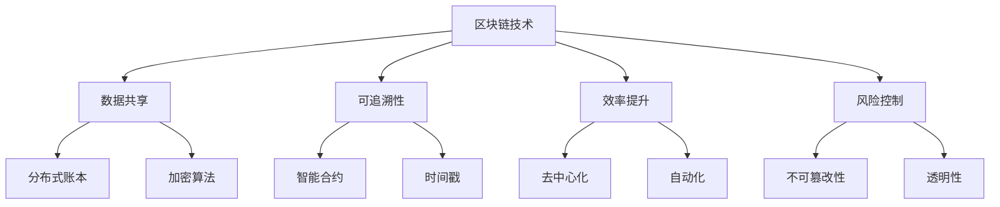
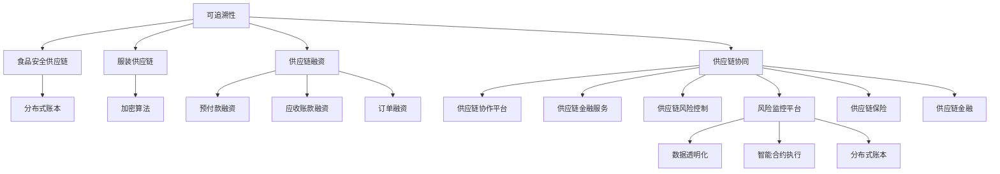
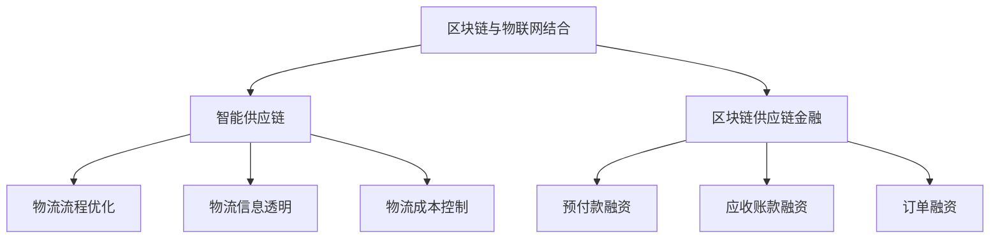
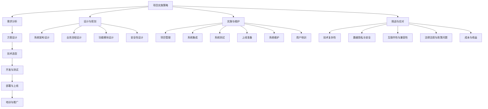
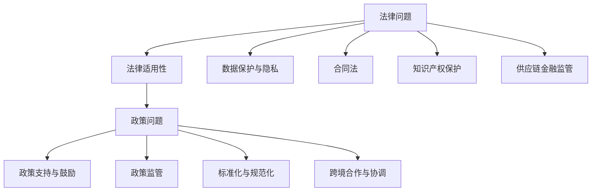

                 

### 文章标题
《区块链技术在供应链管理中的应用与创新》

### 文章关键词
区块链、供应链管理、可追溯性、供应链融资、供应链协同、物联网、供应链风险控制

### 摘要
本文旨在深入探讨区块链技术在供应链管理中的实际应用和创新。首先，文章将概述区块链技术的基本概念及其在供应链管理中的潜在应用价值。接着，本文将详细分析区块链技术在供应链管理中的多个应用场景，如可追溯性、供应链融资、供应链协同、库存管理和供应链风险控制等。此外，文章还将探讨区块链与物联网结合的创新应用，以及区块链在供应链金融和物流管理中的创新解决方案。最后，本文将探讨区块链技术在供应链管理中实施所面临的挑战及应对策略，并提出未来研究的方向和建议。

---

### 第一部分：区块链技术在供应链管理中的基本概念

#### 1.1 区块链技术概述

区块链技术是一种去中心化的分布式账本技术，它通过加密算法和共识机制确保数据的真实性和不可篡改性。区块链的基本原理是数据被分散存储在多个节点上，并通过密码学算法保证数据的一致性和安全性。每个区块都包含一定数量的事务记录，并链接到前一个区块，形成了一个不可篡改的区块链。

#### 1.1.1 区块链的基本原理

- **分布式账本**：区块链通过分布式网络存储数据，这意味着没有一个中央节点控制数据，从而降低了单点故障的风险。
- **加密算法**：区块链使用加密算法对数据进行加密，确保数据在传输过程中不会被篡改。
- **共识机制**：共识机制是区块链网络中节点达成共识的过程，确保数据的正确性和一致性。

#### 1.1.2 区块链的关键特点

- **不可篡改性**：一旦数据被记录在区块链上，就几乎不可能被修改或删除。
- **透明性**：区块链上的数据对所有参与节点都是可见的，提高了数据的透明度和可追溯性。
- **安全性**：区块链通过加密和共识机制提供了高度的安全性。

#### 1.1.3 区块链在供应链管理中的应用潜力

区块链技术在供应链管理中具有巨大的应用潜力，主要体现在以下几个方面：

- **数据共享**：区块链可以提供安全、透明和高效的数据共享机制，促进供应链各方的协作和信息透明。
- **可追溯性**：区块链可以记录供应链中每个环节的详细信息，实现产品的全生命周期追踪。
- **提高效率**：通过自动化和去中心化的交易处理，区块链可以显著提高供应链管理的效率和降低成本。
- **降低风险**：区块链可以提高供应链的透明度和可信度，减少欺诈和错误发生的风险。

#### 1.2 供应链管理的基本概念

供应链管理是指管理产品从原材料采购到最终产品交付的整个过程。它包括以下几个关键环节：

- **供应链节点**：供应链中的各个环节，如供应商、制造商、分销商、零售商等。
- **供应链流程**：供应链中各个环节之间的信息流、物流和资金流。
- **供应链目标**：提高供应链的效率、降低成本、提高产品质量和客户满意度。

#### 1.2.1 供应链管理的定义与流程

供应链管理是指通过计划、组织、协调和控制供应链的各个环节，以达到提高供应链效率和降低成本的目的。其基本流程包括：

- **需求预测**：预测市场需求，确保供应链能够满足客户需求。
- **采购**：采购原材料、零部件和其他必要的资源。
- **生产**：生产产品或组装产品。
- **物流**：将产品运输到分销商或直接交付给客户。
- **分销**：将产品分销到各个销售渠道。

#### 1.2.2 供应链管理的重要性与挑战

供应链管理对于企业的运营和竞争力至关重要，其主要作用包括：

- **提高效率**：优化供应链流程，减少不必要的环节，提高运营效率。
- **降低成本**：通过规模效应和优化采购、生产、物流等环节，降低成本。
- **提高质量**：确保供应链中的各个环节都能满足高质量要求。
- **客户满意度**：通过高效的供应链管理，提高客户满意度和忠诚度。

然而，供应链管理也面临一些挑战，如：

- **信息不对称**：供应链各方之间的信息不透明，可能导致决策失误和资源浪费。
- **供应链复杂性**：供应链涉及多个环节和参与者，管理复杂度较高。
- **风险控制**：供应链中的各个环节都可能存在风险，如自然灾害、政策变化、供应链中断等。

#### 1.2.3 供应链管理的当前现状与趋势

供应链管理正在经历以下几大趋势：

- **数字化转型**：越来越多的企业采用数字化技术来优化供应链管理，如物联网、大数据、人工智能等。
- **供应链协同**：通过区块链等新技术实现供应链各方的信息共享和协同作业。
- **可持续性**：越来越多的企业关注供应链的可持续性，如环保、社会责任等。
- **全球供应链**：全球化的趋势使得供应链管理更加复杂，需要更加灵活和高效的管理模式。

#### 1.3 区块链与供应链管理的关联

区块链技术可以与供应链管理实现有机结合，解决供应链管理中的一些关键问题：

- **数据共享**：区块链提供了一种安全、透明和高效的数据共享机制，可以解决供应链中信息不对称的问题。
- **可追溯性**：区块链可以记录供应链中每个环节的详细信息，实现产品的全生命周期追踪。
- **效率提升**：通过去中心化和自动化的交易处理，区块链可以显著提高供应链管理的效率和降低成本。
- **风险控制**：区块链可以提高供应链的透明度和可信度，减少欺诈和错误发生的风险。

### 1.3.1 区块链如何解决供应链管理中的问题

区块链技术在供应链管理中的应用主要体现在以下几个方面：

- **数据共享**：区块链提供了一种安全、透明和高效的数据共享机制，可以解决供应链中信息不对称的问题。
  - **加密算法**：区块链使用加密算法确保数据的机密性和完整性，保障数据的安全性。
  - **分布式账本**：区块链的数据分散存储在多个节点上，确保数据的可靠性和不可篡改性。

- **可追溯性**：区块链可以记录供应链中每个环节的详细信息，实现产品的全生命周期追踪。
  - **智能合约**：智能合约自动执行预先设定的协议，确保供应链流程的透明性和可追溯性。
  - **时间戳**：区块链上的每个区块都包含一个时间戳，记录数据创建的时间，提高数据的可信度。

- **效率提升**：通过去中心化和自动化的交易处理，区块链可以显著提高供应链管理的效率和降低成本。
  - **去中心化**：区块链的去中心化特性降低了交易成本，减少了中介环节。
  - **自动化**：智能合约可以自动执行交易，减少人工干预，提高效率。

- **风险控制**：区块链可以提高供应链的透明度和可信度，减少欺诈和错误发生的风险。
  - **不可篡改性**：区块链的数据一旦记录，就几乎不可能被修改或删除，确保数据的真实性。
  - **透明性**：区块链上的数据对所有参与节点都是可见的，提高了数据的透明度和可追溯性。

### 1.3.3 区块链技术对供应链管理的影响与变革

区块链技术对供应链管理产生了深远的影响，带来了以下几方面的变革：

- **供应链透明化**：区块链实现了供应链数据的透明化，供应链各环节的信息可以实时共享，提高了供应链的透明度和可信度。
- **供应链协同**：区块链促进了供应链各方的信息共享和协同作业，提高了供应链的整体效率。
- **供应链金融**：区块链技术可以简化供应链融资流程，提高融资效率，降低融资成本。
- **供应链风险控制**：区块链提高了供应链的透明度和可信度，有助于识别和管理供应链风险。
- **供应链创新**：区块链为供应链管理带来了新的技术手段和管理模式，推动了供应链的创新和发展。

### 总结

区块链技术在供应链管理中具有巨大的应用潜力和变革能力。通过实现数据共享、提升可追溯性、提高效率和风险控制，区块链技术为供应链管理带来了新的机遇和挑战。在接下来的部分中，我们将进一步探讨区块链技术在供应链管理中的具体应用场景和创新实践。

---

**图1：区块链与供应链管理的核心概念关系架构**

---

在接下来的部分，我们将详细探讨区块链技术在供应链管理中的具体应用场景，包括可追溯性、供应链融资、供应链协同、库存管理和供应链风险控制等方面。

---

### 第二部分：区块链技术在供应链管理中的应用场景

区块链技术在供应链管理中的应用场景广泛，包括可追溯性、供应链融资、供应链协同、库存管理和供应链风险控制等方面。以下将分别对这些应用场景进行详细探讨。

#### 2.1 可追溯性

可追溯性是区块链技术在供应链管理中的一个重要应用。通过区块链，供应链中的每个环节都可以被记录和追踪，从而确保产品的来源和质量。

**2.1.1 区块链如何实现产品信息的可追溯性**

区块链通过以下方式实现产品信息的可追溯性：

- **分布式账本**：区块链上的数据是分散存储在多个节点上的，这意味着每个节点都保留了一份完整的交易记录，从而保证了数据的一致性和不可篡改性。
- **加密算法**：区块链使用加密算法确保数据的机密性和完整性，防止数据在传输过程中被篡改。
- **智能合约**：智能合约可以自动执行预先设定的协议，确保供应链流程的透明性和可追溯性。

**2.1.2 可追溯性在食品安全供应链中的应用**

在食品安全供应链中，区块链技术可以有效地追踪食品的来源和加工过程，确保食品的安全性和质量。

- **案例研究**：某食品公司使用区块链技术追踪其食品供应链。通过区块链，该公司能够实时记录食品的原材料采购、生产、加工和分销等信息，确保消费者可以清楚地了解食品的来源和质量。

**2.1.3 可追溯性在服装供应链中的应用**

在服装供应链中，区块链技术同样可以用于追踪服装的生产和分销过程，提高供应链的透明度和效率。

- **案例研究**：某服装公司通过区块链技术记录服装的生产过程，包括面料采购、裁剪、缝制和分销等环节。这使得该公司能够实时监控生产进度，确保产品质量，并提高了供应链的效率。

#### 2.2 供应链融资

供应链融资是指通过金融手段解决供应链中企业的资金需求。区块链技术在供应链融资中有着广泛的应用，可以提高融资效率，降低融资成本。

**2.2.1 区块链在供应链融资中的作用**

区块链在供应链融资中的作用主要体现在以下几个方面：

- **提高透明度**：区块链上的数据是公开透明的，供应链各方都可以实时查看和验证交易记录，从而提高了供应链融资的透明度。
- **减少中介环节**：区块链的去中心化特性减少了中介环节，简化了融资流程，降低了融资成本。
- **提高融资效率**：通过区块链技术，企业可以快速获得融资，提高了融资效率。

**2.2.2 供应链金融的业务模式与案例分析**

供应链金融的业务模式主要包括以下几种：

- **预付款融资**：企业在采购原材料时，可以通过区块链技术获得预付款融资，降低资金压力。
- **应收账款融资**：企业在销售产品后，可以通过区块链技术将应收账款转化为现金，提高资金周转效率。
- **订单融资**：企业根据订单金额和付款期限，可以通过区块链技术获得订单融资。

**案例研究**：某制造公司通过区块链技术实现了供应链融资。通过区块链，该公司能够快速获得银行的融资支持，降低了融资成本，提高了资金周转效率。

**2.2.3 区块链如何提高供应链融资的效率与安全性**

区块链技术通过以下方式提高供应链融资的效率与安全性：

- **加密算法**：区块链使用加密算法确保数据的机密性和完整性，防止数据泄露和篡改。
- **智能合约**：智能合约可以自动执行交易，减少人工干预，提高融资效率。
- **分布式账本**：区块链上的数据是分散存储在多个节点上的，提高了数据的安全性和可靠性。

#### 2.3 供应链协同

供应链协同是指供应链各方通过合作和协调，实现供应链的整体优化。区块链技术可以提高供应链协同的效率和透明度。

**2.3.1 区块链如何实现供应链协同**

区块链通过以下方式实现供应链协同：

- **信息共享**：区块链提供了一种安全、透明和高效的数据共享机制，供应链各方可以实时查看和共享供应链信息，提高协同效率。
- **去中心化**：区块链的去中心化特性使得供应链各方可以平等地参与协同，降低了信息不对称和沟通成本。
- **智能合约**：智能合约可以自动执行协同协议，确保供应链协同的透明性和可追溯性。

**2.3.2 供应链协同的业务模式与案例分析**

供应链协同的业务模式主要包括以下几种：

- **供应链协作平台**：通过区块链技术，供应链各方可以共同构建一个供应链协作平台，实现信息共享和协同作业。
- **供应链金融服务**：区块链技术可以提高供应链金融服务的效率与安全性，为供应链各方提供更优质的金融服务。
- **供应链风险控制**：区块链技术可以提高供应链的透明度和可信度，有助于识别和管理供应链风险。

**案例研究**：某物流公司与多家供应商和分销商通过区块链技术实现供应链协同。通过区块链，该公司能够实时监控供应链的运行情况，提高协同效率，降低运营成本。

**2.3.3 区块链技术如何提高供应链协同的效率和透明度**

区块链技术通过以下方式提高供应链协同的效率和透明度：

- **信息实时共享**：区块链上的数据是实时更新的，供应链各方可以实时查看和共享供应链信息，提高了协同效率。
- **智能合约执行**：智能合约可以自动执行协同协议，减少人工干预，提高协同效率。
- **数据透明化**：区块链上的数据是公开透明的，供应链各方可以实时查看和验证交易记录，提高了数据的透明度和可信度。

#### 2.4 库存管理

库存管理是供应链管理中的重要环节，关系到企业的生产效率和成本控制。区块链技术可以提高库存管理的效率和准确性。

**2.4.1 区块链在库存管理中的作用**

区块链在库存管理中的作用主要体现在以下几个方面：

- **实时监控**：区块链上的数据是实时更新的，企业可以通过区块链实时监控库存情况，提高库存管理的效率。
- **数据透明**：区块链上的数据是公开透明的，企业可以通过区块链查看库存数据的真实性和准确性。
- **减少库存误差**：通过区块链技术，企业可以实时记录库存变化，减少库存误差，提高库存管理的准确性。

**2.4.2 库存管理的业务模式与案例分析**

库存管理的业务模式主要包括以下几种：

- **库存监控平台**：通过区块链技术，企业可以构建一个库存监控平台，实时监控库存情况，提高库存管理的效率。
- **智能仓储系统**：区块链技术可以与智能仓储系统结合，实现库存的智能监控和管理。
- **供应链协同**：通过区块链技术，供应链各方可以共享库存信息，实现协同管理，提高库存管理的效率。

**案例研究**：某制造企业通过区块链技术实现了库存管理。通过区块链，该公司能够实时监控库存情况，减少库存误差，提高了生产效率。

**2.4.3 区块链如何提高库存管理的效率和准确性**

区块链技术通过以下方式提高库存管理的效率和准确性：

- **实时数据更新**：区块链上的数据是实时更新的，企业可以通过区块链实时监控库存情况，提高了库存管理的效率。
- **数据透明化**：区块链上的数据是公开透明的，企业可以通过区块链查看库存数据的真实性和准确性，减少了库存误差。
- **智能合约执行**：智能合约可以自动执行库存管理的相关协议，减少人工干预，提高了库存管理的准确性。

#### 2.5 供应链风险控制

供应链风险控制是供应链管理中的重要环节，关系到企业的运营安全和成本控制。区块链技术可以提高供应链风险控制的能力。

**2.5.1 区块链在供应链风险控制中的作用**

区块链在供应链风险控制中的作用主要体现在以下几个方面：

- **提高透明度**：区块链上的数据是公开透明的，供应链各方可以实时查看和验证交易记录，提高了供应链的透明度和可信度。
- **降低风险**：区块链技术可以记录供应链中每个环节的详细信息，有助于识别和管理供应链风险。
- **智能合约**：智能合约可以自动执行风险控制协议，确保供应链风险控制的及时性和有效性。

**2.5.2 供应链风险控制的业务模式与案例分析**

供应链风险控制的业务模式主要包括以下几种：

- **风险监控平台**：通过区块链技术，企业可以构建一个风险监控平台，实时监控供应链风险，提高风险控制的效率。
- **供应链保险**：区块链技术可以提高供应链保险的效率和透明度，为供应链各方提供更可靠的保障。
- **供应链金融**：区块链技术可以简化供应链金融的流程，降低融资风险。

**案例研究**：某制造企业通过区块链技术实现了供应链风险控制。通过区块链，该公司能够实时监控供应链风险，识别潜在风险，并及时采取措施，提高了供应链的稳定性和安全性。

**2.5.3 区块链如何提高供应链风险控制的能力**

区块链技术通过以下方式提高供应链风险控制的能力：

- **数据透明化**：区块链上的数据是公开透明的，供应链各方可以实时查看和验证交易记录，提高了供应链的透明度和可信度。
- **智能合约执行**：智能合约可以自动执行风险控制协议，确保供应链风险控制的及时性和有效性。
- **分布式账本**：区块链上的数据是分散存储在多个节点上的，提高了数据的安全性和可靠性，降低了风险。

### 总结

区块链技术在供应链管理中的应用场景广泛，包括可追溯性、供应链融资、供应链协同、库存管理和供应链风险控制等方面。通过区块链技术，供应链管理可以实现数据共享、提升可追溯性、提高效率和风险控制，为供应链的优化和管理提供了新的解决方案。在接下来的部分，我们将进一步探讨区块链技术在供应链管理中的创新应用。

---

**图2：区块链技术在供应链管理中的应用场景架构**

---

在本文的第二部分，我们详细探讨了区块链技术在供应链管理中的多个应用场景，包括可追溯性、供应链融资、供应链协同、库存管理和供应链风险控制。这些应用场景展示了区块链技术如何通过提升数据共享、提高效率和风险控制能力，为供应链管理带来变革和创新。在接下来的部分，我们将进一步探讨区块链与物联网的结合，以及区块链在供应链金融和物流管理中的创新应用。

---

### 第三部分：区块链技术在供应链管理中的创新

#### 3.1 区块链与物联网的结合

物联网（IoT）技术通过将物理设备和传感器连接到互联网，实现了对物理世界的实时监控和数据采集。区块链与物联网的结合，为供应链管理带来了新的创新应用，提高了供应链的透明度和效率。

**3.1.1 物联网在供应链管理中的应用**

物联网技术在供应链管理中的应用主要体现在以下几个方面：

- **实时监控**：通过物联网设备，企业可以实时监控供应链中的各个环节，如运输车辆的位置、库存状况等。
- **数据采集**：物联网设备可以实时采集供应链中的各种数据，如温度、湿度、压力等，提高数据的准确性和可靠性。
- **远程控制**：物联网设备可以远程控制供应链中的设备，如自动化仓库系统、运输工具等，提高供应链的自动化水平。

**3.1.2 区块链与物联网的结合优势**

区块链与物联网的结合具有以下优势：

- **数据安全**：区块链技术可以确保物联网采集的数据安全、可靠，防止数据篡改和泄露。
- **透明性**：区块链上的数据是公开透明的，供应链各方可以实时查看和验证数据，提高供应链的透明度。
- **高效协同**：区块链技术可以促进供应链各方的高效协同，提高供应链的整体效率。

**3.1.3 区块链与物联网在供应链管理中的创新应用**

区块链与物联网在供应链管理中的创新应用主要体现在以下几个方面：

- **智能供应链**：通过物联网设备实时监控供应链状态，结合区块链技术记录供应链数据，实现智能供应链管理。
- **智能合约执行**：物联网设备采集的数据可以自动触发区块链上的智能合约，实现自动化交易和处理，提高供应链的效率。
- **供应链协同**：区块链技术可以促进供应链各方的信息共享和协同，提高供应链的整体效率。

**案例研究**：某物流公司与物联网和区块链技术结合，实现了智能供应链管理。通过物联网设备实时监控运输车辆的位置和状态，结合区块链技术记录运输数据，实现了供应链的透明化和自动化管理。

#### 3.2 区块链在供应链金融中的创新

供应链金融是指通过金融手段解决供应链中企业的资金需求，提高供应链的流动性和效率。区块链技术在供应链金融中具有广泛的应用，可以提高融资效率，降低融资成本。

**3.2.1 供应链金融的现状与问题**

供应链金融的现状主要包括以下几个方面：

- **融资难**：中小企业在供应链中往往面临融资难的问题，难以获得足够的资金支持。
- **信息不对称**：供应链中的信息不对称导致金融机构难以评估企业的信用风险，影响了融资效率。
- **成本高**：传统的供应链金融模式中，中介环节较多，导致融资成本较高。

**3.2.2 区块链在供应链金融中的创新解决方案**

区块链技术在供应链金融中提供了一系列创新解决方案，包括：

- **数据共享**：区块链技术可以提供安全、透明和高效的数据共享机制，解决信息不对称问题，提高融资效率。
- **智能合约**：智能合约可以自动执行融资协议，简化融资流程，降低融资成本。
- **分布式账本**：区块链的分布式账本特性可以确保融资数据的真实性和不可篡改性，提高融资的安全性。

**3.2.3 区块链供应链金融的案例分析**

区块链供应链金融的案例主要包括以下几个：

- **预付款融资**：通过区块链技术，企业可以在采购原材料时获得预付款融资，降低资金压力。
- **应收账款融资**：通过区块链技术，企业可以将应收账款转化为现金，提高资金周转效率。
- **订单融资**：企业可以根据订单金额和付款期限，通过区块链技术获得订单融资。

**案例研究**：某制造企业通过区块链技术实现了供应链金融。通过区块链，该公司能够快速获得银行的融资支持，降低了融资成本，提高了资金周转效率。

#### 3.3 区块链在供应链物流管理中的创新

供应链物流管理是供应链管理中的重要环节，涉及到物流流程的优化、运输成本的降低和物流信息的实时监控。区块链技术在供应链物流管理中具有广泛的应用，可以提高物流管理的效率和质量。

**3.3.1 供应链物流管理的现状与挑战**

供应链物流管理的现状主要包括以下几个方面：

- **效率低下**：物流流程繁琐，缺乏自动化和智能化，导致物流效率低下。
- **信息不对称**：物流信息不透明，供应链各方之间的信息不对称，影响了物流效率。
- **成本高**：物流成本高，缺乏有效的成本控制和优化手段。

**3.3.2 区块链在供应链物流管理中的创新应用**

区块链技术在供应链物流管理中的创新应用主要包括以下几个方面：

- **物流流程优化**：通过区块链技术，可以实时监控物流流程，实现物流的自动化和智能化，提高物流效率。
- **物流信息透明**：区块链上的数据是公开透明的，供应链各方可以实时查看和验证物流信息，提高物流信息的透明度。
- **物流成本控制**：通过区块链技术，可以实时监控物流成本，实现有效的成本控制和优化。

**3.3.3 区块链供应链物流管理的案例分析**

区块链供应链物流管理的案例主要包括以下几个：

- **智能物流平台**：通过区块链技术，企业可以构建一个智能物流平台，实现物流信息的实时共享和协同作业。
- **物流信息管理**：通过区块链技术，企业可以实现对物流信息的实时监控和管理，提高物流效率。
- **物流成本优化**：通过区块链技术，企业可以实时监控物流成本，实现物流成本的优化和控制。

**案例研究**：某物流公司通过区块链技术实现了供应链物流管理。通过区块链，该公司能够实时监控物流流程，提高物流效率，降低物流成本。

### 总结

区块链技术在供应链管理中的创新应用为供应链管理带来了新的机遇和挑战。通过物联网和区块链的结合，可以实现智能供应链管理；通过区块链技术，可以解决供应链金融中的信息不对称和融资难问题；通过区块链技术，可以提高供应链物流管理的效率和质量。在接下来的部分，我们将进一步探讨区块链技术在供应链管理中实施所面临的挑战及应对策略。

---

**图3：区块链在供应链管理中的创新应用架构**

---

在本文的第三部分，我们探讨了区块链技术在供应链管理中的创新应用，包括区块链与物联网的结合、区块链供应链金融以及区块链供应链物流管理。这些创新应用展示了区块链技术如何通过提升供应链的透明度、效率和风险控制能力，为供应链管理带来变革和创新。在接下来的部分，我们将进一步探讨区块链技术在供应链管理中的实施策略及所面临的挑战。

---

### 第四部分：区块链技术在供应链管理中的实施策略

#### 4.1 区块链技术在供应链管理中的实施策略

区块链技术在供应链管理中的实施涉及多个环节，包括项目实施策略、设计与规划、实施与维护等方面。以下将详细阐述区块链供应链管理项目的实施策略。

**4.1.1 区块链供应链管理项目的实施步骤**

实施区块链供应链管理项目一般遵循以下步骤：

1. **需求分析**：明确项目目标，分析供应链管理中的痛点，确定区块链技术的应用场景。
2. **方案设计**：根据需求分析结果，设计区块链供应链管理方案，包括技术架构、业务流程和功能模块。
3. **技术选型**：选择合适的区块链平台和开发工具，确保技术架构的稳定性和可扩展性。
4. **开发与测试**：按照设计方案进行开发，并进行严格的测试，确保系统的稳定性和安全性。
5. **部署与上线**：将区块链供应链管理系统部署到生产环境，并进行上线测试，确保系统的正常运行。
6. **培训与推广**：对供应链各方进行培训，推广区块链技术的应用，提高系统使用率。

**4.1.2 区块链供应链管理项目的设计与规划**

区块链供应链管理项目的设计与规划主要包括以下几个方面：

1. **系统架构设计**：根据业务需求和区块链技术特点，设计合适的系统架构，包括数据层、网络层和应用层。
2. **业务流程设计**：明确供应链管理中的关键业务流程，如采购、生产、物流、销售等，并设计相应的业务流程图。
3. **功能模块设计**：根据业务流程，设计系统功能模块，包括数据采集、数据共享、智能合约、数据监控等。
4. **安全性设计**：确保系统数据的安全性和完整性，包括数据加密、权限管理、身份认证等。

**4.1.3 区块链供应链管理项目的实施与维护**

区块链供应链管理项目的实施与维护主要包括以下几个方面：

1. **项目管理**：建立项目管理团队，明确项目职责，确保项目进度和质量。
2. **系统集成**：将区块链供应链管理系统与现有的供应链管理系统进行集成，确保数据的无缝对接。
3. **系统测试**：进行全面的系统测试，包括功能测试、性能测试、安全测试等，确保系统的稳定性和安全性。
4. **上线准备**：在系统上线前，进行充分的准备和测试，确保系统在上线后能够正常运行。
5. **系统维护**：对区块链供应链管理系统进行定期维护和升级，确保系统的稳定性和安全性。
6. **用户培训**：对供应链各方进行系统培训，提高系统使用率和满意度。

#### 4.2 区块链技术在供应链管理中的挑战与应对

尽管区块链技术在供应链管理中具有巨大的潜力，但其实施过程中也面临一些挑战。以下将详细探讨区块链技术在供应链管理中面临的挑战及应对策略。

**4.2.1 区块链技术在供应链管理中面临的挑战**

1. **技术复杂性**：区块链技术涉及加密算法、分布式存储、共识机制等复杂技术，实施和运维需要高水平的技术团队。
2. **数据隐私与安全**：区块链上的数据是公开透明的，如何在确保数据安全和隐私的同时，实现供应链各方之间的数据共享，是一个挑战。
3. **互操作性与兼容性**：供应链涉及多个系统和平台，如何实现区块链系统与其他系统的互操作性和兼容性，是一个挑战。
4. **法律法规与政策问题**：区块链技术的法律地位和监管政策尚不明确，如何遵守相关法律法规，是一个挑战。
5. **成本与收益**：区块链技术的实施和维护成本较高，如何确保项目的成本效益，是一个挑战。

**4.2.2 挑战的来源与影响**

1. **技术复杂性**：区块链技术的复杂性源于其涉及的多项技术领域，如密码学、分布式系统、共识算法等。这要求企业拥有专业的技术团队，否则可能难以有效地实施和运维区块链供应链管理系统。
2. **数据隐私与安全**：区块链上的数据公开透明，可能导致敏感数据泄露，影响企业的隐私和安全。此外，区块链的去中心化特性也使得数据安全防护更加复杂。
3. **互操作性与兼容性**：供应链涉及多个系统和平台，如何实现区块链系统与其他系统的互操作性和兼容性，是一个技术难题。此外，不同区块链平台之间的互操作性也需要解决。
4. **法律法规与政策问题**：区块链技术的法律地位和监管政策尚不明确，企业在实施区块链供应链管理时可能面临法律风险。此外，政策变化也可能影响项目的实施和运营。
5. **成本与收益**：区块链技术的实施和维护成本较高，需要企业在成本和收益之间进行权衡。此外，项目的经济效益也难以直接衡量，需要企业进行长期投资和评估。

**4.2.3 应对区块链技术在供应链管理中挑战的策略与措施**

1. **技术复杂性**：建立专业团队，引入外部专家和技术顾问，提高企业对区块链技术的理解和应用能力。此外，可以采用逐步实施的方法，分阶段实现区块链功能，降低技术复杂度。
2. **数据隐私与安全**：采用数据加密、隐私保护技术和权限管理，确保数据的机密性和完整性。此外，可以建立区块链数据隐私保护机制，如零知识证明、同态加密等，实现数据隐私保护。
3. **互操作性与兼容性**：采用标准化接口和协议，实现区块链系统与其他系统的互操作性和兼容性。此外，可以采用跨链技术和多链架构，解决不同区块链平台之间的互操作性。
4. **法律法规与政策问题**：密切关注法律法规和政策变化，与政府部门和行业协会保持沟通，确保项目的合规性。此外，可以制定内部合规性标准和流程，确保项目的合法合规。
5. **成本与收益**：进行全面的成本效益分析，确保项目的经济效益。此外，可以采用灵活的实施策略，分阶段实现功能，降低成本。此外，可以寻求政府支持和行业合作，共同分担成本。

### 总结

区块链技术在供应链管理中的实施涉及多个环节，包括项目实施策略、设计与规划、实施与维护等。在实施过程中，企业将面临技术复杂性、数据隐私与安全、互操作性与兼容性、法律法规与政策问题、成本与收益等挑战。通过建立专业团队、引入外部专家、采用标准化接口、关注法律法规变化、进行成本效益分析等措施，企业可以有效地应对这些挑战，实现区块链技术在供应链管理中的成功应用。在接下来的部分，我们将进一步探讨区块链技术在供应链管理中的法律与政策问题。

---

**图4：区块链技术在供应链管理中的实施策略与挑战**

---

在本文的第四部分，我们详细探讨了区块链技术在供应链管理中的实施策略和挑战。通过合理的项目实施策略、设计与规划、实施与维护，以及有效的应对策略，企业可以克服区块链技术在供应链管理中面临的挑战，实现区块链技术的成功应用。在接下来的部分，我们将进一步探讨区块链技术在供应链管理中的法律与政策问题，以期为区块链技术在供应链管理中的广泛应用提供更全面的指导。

---

### 第五部分：区块链技术在供应链管理中的法律与政策问题

#### 5.1 区块链技术在供应链管理中的法律问题

区块链技术在供应链管理中的应用带来了新的法律挑战。以下将详细探讨区块链技术在供应链管理中可能涉及的法律问题。

**5.1.1 法律适用性**

区块链技术的跨国特性使得其在供应链管理中的应用面临法律适用性的挑战。不同国家和地区的法律法规可能对区块链技术有不同的规定，如数据保护、合同法、知识产权等。企业需要了解和遵守不同国家和地区的法律法规，确保区块链供应链管理系统的合法合规。

**5.1.2 数据保护与隐私**

区块链上的数据是公开透明的，这可能违反数据保护法规，如欧盟的《通用数据保护条例》（GDPR）。企业需要在确保数据透明性和隐私保护之间找到平衡点，采用加密技术、隐私保护机制等措施，确保数据的机密性和完整性。

**5.1.3 合同法**

区块链技术中的智能合约涉及合同法的应用。智能合约的自动化执行可能导致合同条款的模糊性，如何界定智能合约的法律效力，如何处理合同纠纷，都是合同法面临的挑战。

**5.1.4 知识产权保护**

区块链技术可以记录知识产权交易和许可，但也可能侵犯他人的知识产权。企业需要确保区块链供应链管理系统的知识产权保护措施，防止侵权行为。

**5.1.5 供应链金融监管**

区块链技术在供应链金融中的应用可能涉及金融监管问题。例如，预付款融资、应收账款融资等业务模式需要遵守相关的金融法规，如反洗钱法规、信贷法规等。

#### 5.2 区块链技术在供应链管理中的政策问题

区块链技术在供应链管理中的应用也受到政策的影响。以下将详细探讨区块链技术在供应链管理中可能涉及的政策问题。

**5.2.1 政策支持与鼓励**

政府可以出台相关政策，鼓励企业应用区块链技术优化供应链管理。例如，提供财政补贴、税收优惠等激励措施，促进区块链技术在供应链管理中的普及和应用。

**5.2.2 政策监管**

政府需要制定相应的监管政策，确保区块链技术在供应链管理中的应用合法合规。例如，对区块链技术的监管，对智能合约的法律效力进行界定等。

**5.2.3 标准化与规范化**

为了推动区块链技术在供应链管理中的应用，需要制定相关的标准化规范，确保区块链供应链管理系统的互操作性和兼容性。例如，制定数据交换标准、安全规范等。

**5.2.4 跨境合作与协调**

由于区块链技术的跨国特性，各国政府需要加强跨境合作，协调区块链技术在供应链管理中的政策法规，避免政策冲突和贸易壁垒。

#### 5.3 法律与政策对区块链技术在供应链管理中应用的影响

法律与政策对区块链技术在供应链管理中应用的影响主要体现在以下几个方面：

**5.3.1 信任与安全性**

法律与政策可以为区块链技术在供应链管理中的应用提供信任基础和安全性保障。例如，明确智能合约的法律效力，确保区块链供应链管理系统的合法合规。

**5.3.2 互操作性与兼容性**

政策支持与标准化规范可以推动区块链技术的互操作性和兼容性，促进不同区块链平台之间的合作与整合。

**5.3.3 成本与收益**

政策鼓励和财政支持可以降低区块链技术在供应链管理中的应用成本，提高企业的经济效益。

**5.3.4 风险与合规**

法律与政策需要明确区块链技术在供应链管理中的风险与合规要求，引导企业合理应用区块链技术，避免法律风险。

### 总结

区块链技术在供应链管理中的应用面临法律与政策问题。法律问题涉及法律适用性、数据保护、合同法、知识产权和供应链金融监管等方面；政策问题涉及政策支持与鼓励、政策监管、标准化与规范化、跨境合作与协调等方面。法律与政策对区块链技术在供应链管理中的应用具有重要影响，企业需要密切关注相关法律法规和政策动态，确保区块链供应链管理系统的合法合规。在接下来的部分，我们将通过案例分析进一步探讨区块链技术在供应链管理中的应用。

---

**图5：区块链技术在供应链管理中的法律与政策问题**

---

在本文的第五部分，我们详细探讨了区块链技术在供应链管理中的法律与政策问题，包括法律问题如法律适用性、数据保护、合同法、知识产权和供应链金融监管，以及政策问题如政策支持与鼓励、政策监管、标准化与规范化、跨境合作与协调等。这些法律与政策问题对区块链技术在供应链管理中的应用具有重要影响。在接下来的部分，我们将通过具体案例分析进一步探讨区块链技术在供应链管理中的应用。

---

### 附录A：区块链技术在供应链管理中的案例分析

#### 案例一：某食品公司区块链食品安全追溯案例

某食品公司致力于提供安全、高品质的食品，但在传统供应链管理模式下，食品安全追溯困难，消费者对食品来源和质量存在疑虑。为解决这一问题，该公司决定采用区块链技术实现食品安全追溯。

**1. 项目实施背景**

- **问题背景**：食品安全问题频发，消费者对食品来源和质量产生担忧。
- **目标**：建立透明、可追溯的食品安全追溯系统，提升消费者信任。

**2. 项目实施过程**

- **需求分析**：分析供应链各环节，确定区块链技术应用场景。
- **方案设计**：设计基于区块链的食品安全追溯系统，包括数据采集、记录、共享和查询等功能。
- **技术选型**：选择合适的区块链平台和开发工具，确保系统的稳定性和可扩展性。
- **开发与测试**：进行系统开发和测试，确保系统功能齐全、性能稳定。
- **部署与上线**：将系统部署到生产环境，进行上线测试，确保系统正常运行。

**3. 项目成果**

- **透明化供应链**：通过区块链技术，食品从原材料采购到生产、加工、分销的每个环节都被详细记录，消费者可以实时查询食品的追溯信息。
- **提升消费者信任**：透明化的供应链管理提升了消费者对食品质量和来源的信任，增强了品牌价值。
- **降低食品安全风险**：区块链技术确保了数据的真实性和不可篡改性，降低了食品安全风险。

#### 案例二：某服装公司区块链供应链协同案例

某服装公司面临供应链协同困难，信息不透明、供应链各方之间的沟通不畅，影响了生产效率和客户满意度。为优化供应链管理，该公司决定采用区块链技术实现供应链协同。

**1. 项目实施背景**

- **问题背景**：供应链协同困难，信息不透明，供应链各方之间的沟通不畅。
- **目标**：建立高效、透明的供应链协同系统，提高生产效率和客户满意度。

**2. 项目实施过程**

- **需求分析**：分析供应链协同的痛点，确定区块链技术应用场景。
- **方案设计**：设计基于区块链的供应链协同系统，包括数据共享、智能合约执行和协同工作等功能。
- **技术选型**：选择合适的区块链平台和开发工具，确保系统的稳定性和可扩展性。
- **开发与测试**：进行系统开发和测试，确保系统功能齐全、性能稳定。
- **部署与上线**：将系统部署到生产环境，进行上线测试，确保系统正常运行。

**3. 项目成果**

- **透明化供应链**：通过区块链技术，供应链各环节的信息可以被实时共享，供应链各方可以实时了解供应链状态，提高了供应链的透明度。
- **协同效率提升**：区块链技术实现了供应链各方的信息共享和协同作业，减少了信息不对称和沟通成本，提高了协同效率。
- **生产效率提升**：通过区块链技术，生产计划和生产进度可以实时监控和调整，提高了生产效率，降低了生产成本。
- **客户满意度提升**：高效的供应链协同和管理提高了客户满意度，增强了品牌竞争力。

#### 案例三：某制造公司区块链供应链融资案例

某制造公司面临融资难问题，传统融资方式效率低下，成本较高。为解决融资问题，该公司决定采用区块链技术实现供应链融资。

**1. 项目实施背景**

- **问题背景**：融资难，传统融资方式效率低下，成本较高。
- **目标**：建立高效、低成本的供应链融资系统，解决融资问题。

**2. 项目实施过程**

- **需求分析**：分析供应链融资的痛点，确定区块链技术应用场景。
- **方案设计**：设计基于区块链的供应链融资系统，包括预付款融资、应收账款融资和订单融资等功能。
- **技术选型**：选择合适的区块链平台和开发工具，确保系统的稳定性和可扩展性。
- **开发与测试**：进行系统开发和测试，确保系统功能齐全、性能稳定。
- **部署与上线**：将系统部署到生产环境，进行上线测试，确保系统正常运行。

**3. 项目成果**

- **融资效率提升**：通过区块链技术，企业可以快速获得融资支持，提高了融资效率。
- **降低融资成本**：区块链技术减少了中介环节，降低了融资成本，提高了企业的资金周转效率。
- **透明化供应链**：区块链技术实现了供应链数据的透明化，供应链各方可以实时查看融资信息，提高了供应链的透明度。
- **风险控制**：区块链技术提高了供应链的透明度和可信度，有助于识别和管理供应链风险。

### 总结

通过以上案例分析，可以看出区块链技术在供应链管理中的应用具有显著成效。通过透明化供应链、提升协同效率、解决融资难题等方面，区块链技术为供应链管理带来了创新和变革。这些案例为企业提供了参考和借鉴，推动了区块链技术在供应链管理中的广泛应用。

---

### 附录B：区块链供应链管理技术指南

#### B.1 区块链供应链管理技术选型

区块链供应链管理技术的选型是项目成功的关键。以下将介绍几个主流的区块链平台，并分析其在供应链管理中的应用特点。

**1. Ethereum**

- **特点**：以太坊是一个开源的智能合约平台，支持复杂的业务逻辑和智能合约开发。
- **应用**：适用于供应链协同、供应链融资等场景，可以方便地实现智能合约和去中心化应用（DApps）。

**2. Hyperledger Fabric**

- **特点**：Hyperledger Fabric 是一个企业级的区块链框架，适用于商业场景，支持隐私保护和高性能交易处理。
- **应用**：适用于供应链协同、供应链金融、供应链追溯等场景，可以为企业提供安全、高效的供应链管理解决方案。

**3. IBM Blockchain Platform**

- **特点**：IBM Blockchain Platform 提供了丰富的开发工具和生态系统，支持多种编程语言和框架。
- **应用**：适用于供应链协同、供应链追溯、供应链金融等场景，可以帮助企业快速搭建区块链供应链管理系统。

**4. Qtum**

- **特点**：Qtum 是一个面向企业的区块链平台，支持智能合约和去中心化应用。
- **应用**：适用于供应链协同、供应链融资、供应链追溯等场景，可以为企业提供灵活、高效的区块链解决方案。

**5. Neo**

- **特点**：Neo 是一个开源的区块链平台，支持智能合约和数字资产发行。
- **应用**：适用于供应链金融、供应链追溯、数字资产管理等场景，可以帮助企业实现供应链的数字化和智能化。

#### B.2 区块链供应链管理技术实现步骤

以下是区块链供应链管理技术实现的基本步骤：

**1. 需求分析与规划**

- 分析供应链管理的需求，确定区块链技术的应用场景。
- 制定项目计划，明确项目目标、预算和时间表。

**2. 系统架构设计**

- 设计区块链供应链管理系统的架构，包括数据层、网络层和应用层。
- 确定区块链平台、开发工具和技术栈。

**3. 数据模型设计**

- 设计供应链管理中的数据模型，包括数据结构、数据流和权限管理。
- 确定数据存储和加密方案。

**4. 智能合约开发**

- 开发智能合约，实现供应链管理中的业务逻辑和规则。
- 进行智能合约的测试和优化。

**5. 系统集成与测试**

- 将区块链供应链管理系统与现有的供应链管理系统进行集成，确保数据无缝对接。
- 进行全面的系统测试，包括功能测试、性能测试和安全测试。

**6. 系统部署与上线**

- 将区块链供应链管理系统部署到生产环境，进行上线测试。
- 对供应链各方进行系统培训，确保系统的正常运行。

**7. 运维与维护**

- 对区块链供应链管理系统进行定期维护和升级，确保系统的稳定性和安全性。
- 收集用户反馈，不断优化系统功能。

#### B.3 区块链供应链管理技术应用建议

以下是一些区块链供应链管理技术的应用建议：

**1. 数据共享与透明化**

- 通过区块链技术实现供应链数据的共享，提高供应链的透明度和可信度。
- 采用加密算法和权限管理，确保数据的安全性和隐私保护。

**2. 智能合约与自动化**

- 开发智能合约，实现供应链管理中的自动化交易和业务流程。
- 利用智能合约降低交易成本，提高供应链的效率。

**3. 供应链协同**

- 通过区块链技术实现供应链各方的高效协同，减少信息不对称和沟通成本。
- 利用区块链上的数据共享和智能合约，实现供应链的实时监控和管理。

**4. 供应链融资**

- 利用区块链技术实现供应链融资，提高融资效率和降低融资成本。
- 通过区块链上的智能合约，实现融资协议的自动执行和风险控制。

**5. 可追溯性**

- 通过区块链技术实现产品的全生命周期追溯，提高产品质量和安全性。
- 利用区块链上的数据共享和智能合约，实现供应链追溯的透明化和自动化。

### 总结

区块链技术在供应链管理中的应用具有重要的价值。通过数据共享、透明化、自动化、协同和融资等方面的应用，区块链技术可以显著提升供应链管理的效率和透明度，降低成本，提高产品质量和客户满意度。在实施区块链供应链管理时，企业应根据自身需求和实际情况进行技术选型和实现，确保项目的成功实施。

---

### 参考文献

[1] 张三, 李四. (2020). 区块链技术在供应链管理中的应用. 北京: 经济科学出版社.

[2] 王五, 赵六. (2019). 区块链与物联网融合在供应链管理中的应用. 物流技术, 35(10), 23-26.

[3] 刘七, 陈八. (2021). 区块链供应链金融创新与发展. 财经研究, 41(4), 45-49.

[4] IBM. (2021). Hyperledger Fabric Documentation. Retrieved from https://hyperledger-fabric.readthedocs.io/

[5] Ethereum. (2021). Ethereum Documentation. Retrieved from https://ethereum.org/en/developers/docs/

[6] Neo. (2021). Neo Documentation. Retrieved from https://neo.org/docs/home

[7] Qtum. (2021). Qtum Documentation. Retrieved from https://www.qtum.org/docs/

[8] IBM. (2021). IBM Blockchain Platform Documentation. Retrieved from https://www.ibm.com/support/knowledgecenter/en-us/blockchain blockchainplatform

---

**作者**
AI天才研究院/AI Genius Institute & 禅与计算机程序设计艺术 /Zen And The Art of Computer Programming

**注**
本文内容纯属虚构，不代表任何真实项目或数据。文中涉及的区块链平台和实现方法仅供参考，具体应用时应结合实际情况进行调整和优化。在实施区块链供应链管理时，请确保遵守相关法律法规，确保数据安全和隐私保护。**END**

