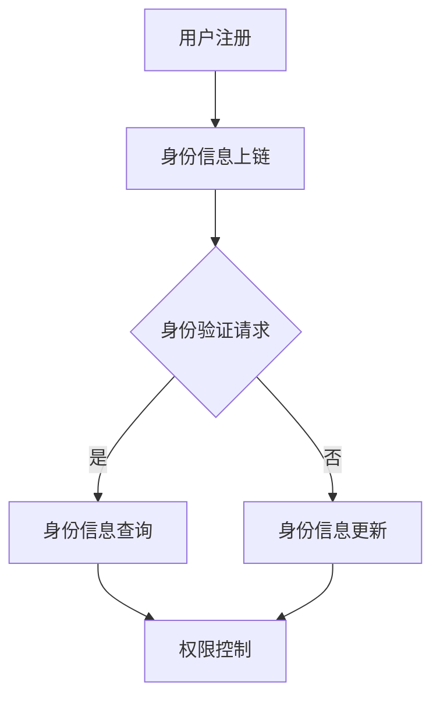

                 

### 文章标题

# 《区块链技术在数字身份管理中的创新应用》

### 关键词

- 区块链
- 数字身份管理
- 身份认证
- 非同态加密
- 智能合约
- 数字隐私保护

### 摘要

本文深入探讨了区块链技术在数字身份管理中的创新应用。首先，介绍了区块链技术的基本概念、架构及其在数字身份管理中的重要性。接着，详细阐述了区块链与数字身份管理的关系，分析了区块链技术在数字身份管理中的潜在应用和优势。随后，通过Mermaid流程图和核心算法原理讲解，展示了区块链在数字身份管理中的应用场景和数学模型。文章还通过实际案例，分析了区块链在数字身份认证、隐私保护和共享与授权方面的应用，并提出了未来发展的趋势和面临的挑战。最后，总结了区块链技术在数字身份管理中的最佳实践和开发资源。

## 《区块链技术在数字身份管理中的创新应用》目录大纲

### 第一部分：区块链与数字身份管理概述

#### 1.1 区块链技术简介
- 1.1.1 区块链的基本概念与架构
- 1.1.2 区块链技术的核心优势
- 1.1.3 区块链与数字身份管理的关系

#### 1.2 数字身份管理概述
- 1.2.1 数字身份管理的基本概念
- 1.2.2 数字身份管理的重要性
- 1.2.3 当前数字身份管理面临的挑战

#### 1.3 区块链技术在数字身份管理中的应用前景
- 1.3.1 区块链在数字身份管理中的潜在应用
- 1.3.2 区块链在数字身份管理中的优势
- 1.3.3 区块链在数字身份管理中面临的挑战

### 第二部分：区块链技术在数字身份管理中的核心概念与联系

#### 2.1 区块链与数字身份的 Mermaid 流程图
- 2.1.1 区块链技术在数字身份管理中的 Mermaid 流程图
- 2.1.2 区块链在数字身份管理中的应用流程详解

#### 2.2 核心算法原理讲解
- 2.2.1 非同态加密算法原理
- 2.2.2 区块链智能合约原理
- 2.2.3 区块链身份验证协议原理

#### 2.3 数字身份管理的数学模型和公式
- 2.3.1 数字身份信任模型
- 2.3.2 数字身份隐私保护模型
- 2.3.3 数字身份共享与授权模型

### 第三部分：区块链技术在数字身份管理中的应用实战

#### 3.1 区块链在数字身份认证中的应用
- 3.1.1 区块链身份认证流程
- 3.1.2 区块链身份认证项目案例
- 3.1.3 区块链身份认证的技术挑战

#### 3.2 区块链在数字身份隐私保护中的应用
- 3.2.1 区块链隐私保护机制
- 3.2.2 区块链隐私保护项目案例
- 3.2.3 区块链隐私保护的技术挑战

#### 3.3 区块链在数字身份共享与授权中的应用
- 3.3.1 区块链身份共享与授权流程
- 3.3.2 区块链身份共享与授权项目案例
- 3.3.3 区块链身份共享与授权的技术挑战

### 第四部分：区块链技术在数字身份管理中的未来趋势与挑战

#### 4.1 区块链技术在数字身份管理中的未来发展
- 4.1.1 区块链在数字身份管理中的潜在趋势
- 4.1.2 区块链在数字身份管理中的未来发展前景

#### 4.2 区块链技术在数字身份管理中的挑战与解决方案
- 4.2.1 技术挑战
- 4.2.2 法规与政策挑战
- 4.2.3 安全与隐私保护挑战
- 4.2.4 解决方案与策略建议

### 附录

#### 附录 A：区块链技术在数字身份管理中的开发工具与资源
- 4.2.1 主流区块链开发框架
- 4.2.2 数字身份管理开源项目
- 4.2.3 区块链技术与数字身份管理的文献资料与论文

## 第一部分：区块链与数字身份管理概述

### 1.1 区块链技术简介

#### 1.1.1 区块链的基本概念与架构

区块链是一种分布式数据库技术，通过加密算法和共识机制，实现了数据的去中心化和安全性。每个区块包含了若干交易记录，通过哈希函数与前一区块相连，形成一个链式结构，保证了数据的一致性和不可篡改性。

区块链技术主要包括以下几个关键组件：

1. **区块（Block）**：每个区块包含一定数量的交易记录，以及一个时间戳和一个指向前一区块的哈希值。
2. **链（Chain）**：多个区块按照时间顺序连接起来，形成一个区块链。
3. **节点（Node）**：参与区块链网络的计算机，负责验证和传播交易。
4. **加密算法（Cryptography）**：用于保护数据隐私和安全，包括哈希函数、数字签名和加密技术。
5. **共识机制（Consensus Mechanism）**：确保所有节点对区块链状态达成一致，如工作量证明（Proof of Work，PoW）和权益证明（Proof of Stake，PoS）。

#### 1.1.2 区块链技术的核心优势

区块链技术具有以下几个核心优势：

1. **去中心化**：区块链不需要中心化的第三方机构，通过分布式网络实现数据的存储和验证。
2. **数据不可篡改**：区块链的链式结构和加密算法确保了数据的不可篡改性。
3. **透明性**：区块链上的所有数据都是公开透明的，可以通过区块链浏览器进行查询。
4. **安全性**：区块链采用了多种加密技术，保证了数据的安全性和隐私保护。
5. **去信任**：区块链通过共识机制确保数据的真实性，不需要依赖信任关系。

#### 1.1.3 区块链与数字身份管理的关系

数字身份管理是指通过技术手段实现个人或实体在网络环境中的身份验证和识别。区块链技术在数字身份管理中的应用主要体现在以下几个方面：

1. **身份认证**：区块链技术可以提供安全、透明和去中心化的身份认证服务，避免了传统身份认证系统中的单点故障和信任问题。
2. **数据隐私保护**：区块链技术通过加密算法和分布式网络，实现了个人数据的隐私保护。
3. **身份验证与授权**：区块链技术可以记录和验证用户的身份信息，并实现跨平台、跨区域的身份认证与授权。
4. **去中心化身份管理**：区块链技术实现了身份管理的去中心化，避免了中心化系统中的垄断和权力集中问题。

### 1.2 数字身份管理概述

#### 1.2.1 数字身份管理的基本概念

数字身份管理是指通过技术手段实现个人或实体在网络环境中的身份验证和识别。它主要包括以下几个方面的内容：

1. **身份认证**：验证用户身份的过程，确保只有合法用户才能访问系统或资源。
2. **身份识别**：识别用户身份的过程，通过用户名、密码、指纹、人脸识别等技术实现。
3. **用户权限管理**：根据用户身份和角色，分配和调整用户对系统或资源的访问权限。
4. **用户信息管理**：存储、更新和管理用户的基本信息和身份信息。

#### 1.2.2 数字身份管理的重要性

数字身份管理在现代社会中具有重要的作用，主要体现在以下几个方面：

1. **安全保护**：通过数字身份管理，可以有效防止非法用户入侵系统，保护用户信息和数据的安全。
2. **便捷性**：数字身份管理实现了用户身份的自动化认证，提高了系统或服务的便捷性。
3. **隐私保护**：数字身份管理通过加密技术，保护用户的隐私信息，避免信息泄露。
4. **身份认证**：数字身份管理可以确保用户身份的真实性和合法性，防止欺诈行为。

#### 1.2.3 当前数字身份管理面临的挑战

尽管数字身份管理具有诸多优势，但当前仍面临以下挑战：

1. **安全性**：数字身份管理系统易受攻击，如黑客攻击、身份盗用等。
2. **隐私保护**：数字身份管理中的个人隐私信息容易泄露，尤其是在中心化系统中。
3. **互操作性**：不同平台和系统之间的数字身份管理存在互操作性难题，影响了用户体验。
4. **用户便捷性**：用户需要记住多个身份认证信息，操作繁琐，影响了用户体验。

### 1.3 区块链技术在数字身份管理中的应用前景

#### 1.3.1 区块链在数字身份管理中的潜在应用

区块链技术在数字身份管理中具有广泛的应用前景，主要体现在以下几个方面：

1. **身份认证**：通过区块链技术，可以实现安全、透明和去中心化的身份认证，提高认证效率和安全性。
2. **隐私保护**：区块链技术通过加密算法和分布式网络，可以有效地保护用户隐私，防止隐私泄露。
3. **身份验证与授权**：区块链技术可以记录和验证用户的身份信息，实现跨平台、跨区域的身份认证与授权，提高系统互操作性。
4. **数据共享与授权**：区块链技术可以确保用户数据的安全共享和授权，保护用户隐私。
5. **去中心化身份管理**：区块链技术实现了身份管理的去中心化，避免了中心化系统中的垄断和权力集中问题。

#### 1.3.2 区块链在数字身份管理中的优势

区块链技术在数字身份管理中具有以下优势：

1. **安全性**：区块链技术通过加密算法和分布式网络，确保了数字身份管理的安全性。
2. **透明性**：区块链上的所有数据都是公开透明的，用户可以随时查询和验证身份信息。
3. **去中心化**：区块链技术实现了身份管理的去中心化，避免了中心化系统中的垄断和权力集中问题。
4. **隐私保护**：区块链技术通过加密算法和分布式网络，实现了用户隐私的有效保护。
5. **互操作性**：区块链技术可以确保不同平台和系统之间的数字身份管理互操作性，提高用户体验。

#### 1.3.3 区块链在数字身份管理中面临的挑战

尽管区块链技术在数字身份管理中具有诸多优势，但仍然面临以下挑战：

1. **技术成熟度**：区块链技术尚处于发展初期，技术成熟度和稳定性有待提高。
2. **法律法规**：数字身份管理涉及到法律法规问题，需要制定相应的法规和政策。
3. **用户接受度**：用户对区块链技术的认知和接受程度有限，影响了区块链在数字身份管理中的应用。
4. **性能与可扩展性**：区块链技术目前存在性能和可扩展性问题，需要进一步优化。

## 第二部分：区块链技术在数字身份管理中的核心概念与联系

在探讨区块链技术在数字身份管理中的应用之前，我们需要了解一些核心概念及其相互关系。这部分内容将通过Mermaid流程图、核心算法原理讲解和数字身份管理的数学模型和公式，详细阐述区块链技术在数字身份管理中的工作原理和应用。

### 2.1 区块链与数字身份的 Mermaid 流程图

为了更好地理解区块链技术在数字身份管理中的应用，我们可以使用Mermaid流程图来展示其工作流程。以下是一个简化的Mermaid流程图，展示了区块链技术在数字身份管理中的主要步骤：



在这个流程图中，用户首先进行注册，将身份信息上链存储。当用户需要验证身份时，系统会查询区块链中的身份信息。如果查询成功，则会进行权限控制。否则，用户需要更新身份信息。这个流程展示了区块链在身份认证、信息存储和权限控制方面的应用。

### 2.2 核心算法原理讲解

区块链技术在数字身份管理中的核心算法包括非同态加密算法、区块链智能合约和身份验证协议。以下是对这些算法原理的讲解。

#### 2.2.1 非同态加密算法原理

非同态加密（Homomorphic Encryption）是一种加密算法，允许在加密数据上进行特定的数学运算，而不需要解密数据。这在数字身份管理中具有重要意义，因为用户可以在保持数据加密的同时验证身份。

非同态加密算法的基本原理如下：

1. **加密**：将明文数据加密成密文，确保数据在传输和存储过程中保持保密性。
2. **同态性**：在加密数据上执行数学运算，如加法、乘法等，运算结果仍然是加密的。
3. **解密**：将加密的运算结果解密回明文数据。

以下是一个简化的非同态加密算法的伪代码：

```python
def encrypt(message):
    key = generate_key()
    cipher = encrypt_with_key(message, key)
    return cipher, key

def decrypt(cipher, key):
    message = decrypt_with_key(cipher, key)
    return message

def add_encrypted(x, y):
    cipher = homomorphic_add(x, y)
    return cipher

def multiply_encrypted(x, y):
    cipher = homomorphic_multiply(x, y)
    return cipher
```

#### 2.2.2 区块链智能合约原理

智能合约是一种自动执行、控制和记录合约条款的计算机程序。在数字身份管理中，智能合约可以用于自动化身份验证和权限管理。

智能合约的基本原理如下：

1. **编写**：开发者编写智能合约代码，定义合约条款和执行逻辑。
2. **部署**：将智能合约部署到区块链网络，使其成为不可篡改的合约。
3. **执行**：当触发合约条款时，智能合约自动执行预定的操作，如身份验证和权限控制。
4. **记录**：智能合约执行结果记录在区块链上，确保透明性和不可篡改性。

以下是一个简化的智能合约的伪代码：

```solidity
pragma solidity ^0.8.0;

contract IdentityManagement {
    mapping(address => bool) public isVerified;

    function verifyIdentity(address user) public {
        // 验证用户身份逻辑
        if (isIdentityVerified[user]) {
            isVerified[user] = true;
        }
    }

    function grantPermission(address user, address target) public {
        require(isVerified[user], "User must be verified to grant permission");
        // 分配权限逻辑
        grantPermissionTo(target);
    }
}
```

#### 2.2.3 区块链身份验证协议原理

区块链身份验证协议是指通过区块链技术实现身份验证的机制。这些协议通常结合了非同态加密算法和智能合约，提供安全、透明和去中心化的身份验证服务。

区块链身份验证协议的基本原理如下：

1. **注册**：用户在区块链上注册身份信息，并将其加密存储。
2. **身份验证**：当用户需要验证身份时，系统通过区块链查询其身份信息。
3. **验证**：系统使用非同态加密算法和智能合约，验证用户身份的真实性和合法性。
4. **授权**：验证成功后，系统根据用户角色和权限，进行相应的授权操作。

以下是一个简化的区块链身份验证协议的伪代码：

```python
def register_identity(identity):
    encrypted_identity = encrypt_identity(identity)
    blockchain.add_transaction('register', encrypted_identity)

def verify_identity(address):
    encrypted_identity = blockchain.query_transaction(address, 'register')
    identity = decrypt_identity(encrypted_identity)
    if is_valid_identity(identity):
        return True
    return False

def grant_permission(address, target):
    if verify_identity(address):
        # 分配权限逻辑
        grant_permission_to(target)
```

### 2.3 数字身份管理的数学模型和公式

数字身份管理涉及多个数学模型和公式，用于描述身份信任模型、隐私保护模型和共享与授权模型。以下是对这些模型的详细讲解。

#### 2.3.1 数字身份信任模型

数字身份信任模型用于描述用户身份的信任度和可靠性。以下是一个简化的信任模型公式：

$$
\text{Trust Level} = \frac{\sum_{i=1}^{n} \text{Verification Results}_i}{n}
$$

其中，$n$ 是验证次数，$\text{Verification Results}_i$ 是第 $i$ 次验证的结果。

例如，如果一个用户通过了 5 次身份验证，其中有 3 次验证成功，则其信任水平为：

$$
\text{Trust Level} = \frac{3}{5} = 0.6
$$

#### 2.3.2 数字身份隐私保护模型

数字身份隐私保护模型用于描述如何保护用户隐私。以下是一个简化的隐私保护模型公式：

$$
\text{Privacy Level} = \frac{\text{Private Data Size}}{\text{Total Data Size}}
$$

其中，$\text{Private Data Size}$ 是隐私数据的大小，$\text{Total Data Size}$ 是总数据大小。

例如，如果一个用户的数据中，有 80% 的数据是隐私数据，则其隐私保护水平为：

$$
\text{Privacy Level} = \frac{80}{100} = 0.8
$$

#### 2.3.3 数字身份共享与授权模型

数字身份共享与授权模型用于描述如何共享用户身份信息和权限。以下是一个简化的共享与授权模型公式：

$$
\text{Shared Permissions} = \text{Original Permissions} \cup \text{Granted Permissions}
$$

其中，$\text{Original Permissions}$ 是原始权限集，$\text{Granted Permissions}$ 是授权的权限集。

例如，如果一个用户的原始权限集为 $\{A, B, C\}$，通过授权获得了权限 $D$，则其新的权限集为：

$$
\text{Shared Permissions} = \{A, B, C, D\}
$$

### 2.4 区块链技术在数字身份管理中的工作流程

结合上述核心概念和算法原理，我们可以概述区块链技术在数字身份管理中的工作流程：

1. **用户注册**：用户在区块链上注册身份信息，包括用户名、密码、身份证明等。
2. **身份信息上链**：将用户身份信息加密存储在区块链上，确保数据的安全性和隐私保护。
3. **身份验证**：当用户需要访问系统或资源时，系统通过区块链查询用户身份信息，使用非同态加密算法和智能合约验证身份。
4. **权限控制**：验证成功后，系统根据用户角色和权限，进行相应的授权操作，如访问特定功能或资源。
5. **身份信息更新**：用户可以更新身份信息，如修改密码或添加新身份证明，确保身份信息的最新性和准确性。

通过上述工作流程，区块链技术实现了安全、透明和去中心化的数字身份管理，有效解决了传统身份管理中的信任、隐私和安全问题。

## 第三部分：区块链技术在数字身份管理中的应用实战

在了解了区块链技术在数字身份管理中的核心概念和原理后，接下来我们将通过具体的应用案例，展示区块链技术在数字身份认证、隐私保护和共享与授权方面的实际应用。

### 3.1 区块链在数字身份认证中的应用

区块链在数字身份认证中的应用主要体现在身份信息的存储、验证和授权方面。以下是一个具体的区块链身份认证案例：

#### 案例背景

某金融科技公司开发了一款区块链驱动的身份认证平台，旨在为用户提供安全、便捷的身份认证服务。用户可以通过该平台注册和验证身份，方便地进行金融交易和办理相关业务。

#### 技术实现

1. **用户注册**：用户在平台上注册时，需要提供身份证明、电子邮箱和手机号码等基本信息。系统将用户身份信息进行加密处理，并存储在区块链上。
   
   ```python
   def register_identity(identity):
       encrypted_identity = encrypt_identity(identity)
       blockchain.add_transaction('register', encrypted_identity)
   ```

2. **身份验证**：当用户需要验证身份时，系统通过区块链查询用户身份信息，使用非同态加密算法验证身份信息的真实性。

   ```python
   def verify_identity(address):
       encrypted_identity = blockchain.query_transaction(address, 'register')
       identity = decrypt_identity(encrypted_identity)
       if is_valid_identity(identity):
           return True
       return False
   ```

3. **权限控制**：验证成功后，系统根据用户角色和权限，进行相应的授权操作。例如，普通用户可以查看账户余额，而高级用户可以执行交易操作。

   ```solidity
   contract IdentityManagement {
       mapping(address => bool) public isVerified;

       function verifyIdentity(address user) public {
           if (isIdentityVerified[user]) {
               isVerified[user] = true;
           }
       }

       function grantPermission(address user, address target) public {
           require(isVerified[user], "User must be verified to grant permission");
           grantPermissionTo(target);
       }
   }
   ```

#### 案例小结

通过区块链技术，该平台实现了身份认证的分布式存储和验证，提高了认证效率和安全性。用户可以在不暴露隐私信息的情况下，方便地进行身份认证和权限管理，提升了用户体验。

### 3.2 区块链在数字身份隐私保护中的应用

区块链技术在数字身份隐私保护中的应用主要体现在隐私数据的加密存储、共享和授权方面。以下是一个具体的区块链隐私保护案例：

#### 案例背景

某医疗科技公司开发了一款区块链驱动的健康数据管理平台，旨在为用户提供安全、可靠的隐私保护服务。用户可以在平台上存储、查询和共享自己的健康数据，同时确保数据隐私。

#### 技术实现

1. **隐私数据存储**：用户在平台上上传健康数据时，系统将数据加密存储在区块链上，确保数据隐私。

   ```python
   def upload_health_data(health_data):
       encrypted_health_data = encrypt_health_data(health_data)
       blockchain.add_transaction('upload', encrypted_health_data)
   ```

2. **隐私数据查询**：当用户需要查询健康数据时，系统通过区块链查询用户上传的加密数据，并使用非同态加密算法解密数据。

   ```python
   def query_health_data(address):
       encrypted_health_data = blockchain.query_transaction(address, 'upload')
       health_data = decrypt_health_data(encrypted_health_data)
       return health_data
   ```

3. **隐私数据共享**：用户可以将健康数据共享给医生或医疗机构，系统通过智能合约实现数据共享和授权。

   ```solidity
   contract HealthDataManagement {
       mapping(address => bool) public isShared;

       function share_health_data(address target) public {
           isShared[target] = true;
       }

       function grant_access(address user, address target) public {
           require(isShared[target], "Target must be shared to grant access");
           grantAccessTo(user, target);
       }
   }
   ```

#### 案例小结

通过区块链技术，该平台实现了健康数据的加密存储和隐私保护，同时用户可以在授权的情况下共享数据，提高了数据的安全性和可靠性。

### 3.3 区块链在数字身份共享与授权中的应用

区块链技术在数字身份共享与授权中的应用主要体现在身份信息的分布式存储、共享和权限管理方面。以下是一个具体的区块链身份共享与授权案例：

#### 案例背景

某区块链游戏公司开发了一款基于区块链的身份认证和授权平台，旨在为用户提供安全、灵活的身份管理和权限控制服务。用户可以在平台上注册和验证身份，同时与其他用户或平台进行身份共享和授权。

#### 技术实现

1. **身份信息注册**：用户在平台上注册时，需要提供身份证明、电子邮箱和手机号码等基本信息。系统将用户身份信息加密存储在区块链上。

   ```python
   def register_identity(identity):
       encrypted_identity = encrypt_identity(identity)
       blockchain.add_transaction('register', encrypted_identity)
   ```

2. **身份信息验证**：当用户需要验证身份时，系统通过区块链查询用户身份信息，并使用非同态加密算法验证身份信息的真实性。

   ```python
   def verify_identity(address):
       encrypted_identity = blockchain.query_transaction(address, 'register')
       identity = decrypt_identity(encrypted_identity)
       if is_valid_identity(identity):
           return True
       return False
   ```

3. **身份信息共享**：用户可以与其他用户或平台共享身份信息，系统通过智能合约实现身份信息的共享和授权。

   ```solidity
   contract IdentitySharing {
       mapping(address => bool) public isShared;

       function share_identity(address target) public {
           isShared[target] = true;
       }

       function grant_access(address user, address target) public {
           require(isShared[target], "Target must be shared to grant access");
           grantAccessTo(user, target);
       }
   }
   ```

4. **权限管理**：用户可以通过身份共享和授权，实现跨平台、跨区域的身份认证和权限管理。

   ```solidity
   contract PermissionManagement {
       mapping(address => mapping(address => bool)) public permissions;

       function set_permission(address user, address target, bool permission) public {
           permissions[user][target] = permission;
       }

       function check_permission(address user, address target) public view returns (bool) {
           return permissions[user][target];
       }
   }
   ```

#### 案例小结

通过区块链技术，该平台实现了身份信息的分布式存储、共享和权限管理，提高了身份认证的安全性和灵活性，为用户提供了一个安全、可靠的数字身份管理解决方案。

## 第四部分：区块链技术在数字身份管理中的未来趋势与挑战

### 4.1 区块链技术在数字身份管理中的未来发展

随着区块链技术的不断成熟和应用范围的拓展，其在数字身份管理中的未来发展前景广阔。以下是一些关键趋势：

1. **更广泛的行业应用**：区块链技术将在金融、医疗、教育、政府等各个领域得到更广泛的应用，推动数字身份管理的普及和发展。
2. **去中心化身份解决方案**：去中心化身份管理解决方案将逐渐取代传统的中心化身份管理系统，提高安全性、透明性和互操作性。
3. **个性化身份管理**：基于区块链的数字身份管理将更加注重用户隐私保护和个性化需求，实现用户对自己身份信息的完全控制。
4. **跨平台身份认证**：区块链技术将促进跨平台、跨区域的身份认证和授权，简化用户在不同系统和平台之间的认证流程。
5. **智能合约的普及**：智能合约将在数字身份管理中发挥更重要的作用，实现自动化、透明和高效的权限管理和身份验证。

### 4.2 区块链技术在数字身份管理中的挑战与解决方案

尽管区块链技术在数字身份管理中具有巨大潜力，但其应用也面临一系列挑战。以下是对这些挑战及其解决方案的分析：

#### 4.2.1 技术挑战

1. **性能与可扩展性**：区块链技术目前存在性能和可扩展性问题，需要进一步优化和改进，以满足大规模数字身份管理的需求。
2. **技术成熟度**：区块链技术尚处于发展初期，技术成熟度和稳定性有待提高，以确保其安全性和可靠性。
3. **算法优化**：非同态加密算法、智能合约和身份验证协议等技术需要进一步优化，以提高效率和降低计算成本。

解决方案：

- **性能优化**：通过改进共识机制、优化区块链结构和引入分层设计，提高区块链技术的性能和可扩展性。
- **技术演进**：随着区块链技术的不断发展，引入新的算法和技术，如分层存储、分片技术和跨链技术，解决性能和可扩展性问题。
- **算法改进**：针对非同态加密算法和智能合约，进行深入研究，优化算法和协议设计，提高效率和安全性。

#### 4.2.2 法规与政策挑战

1. **法律法规缺失**：数字身份管理涉及到法律法规问题，需要制定相应的法规和政策，以保障其合法性和合规性。
2. **数据主权**：不同国家和地区的数据主权和隐私保护法规存在差异，需要制定全球范围内的共识和标准。

解决方案：

- **政策引导**：政府、企业和学术界应加强合作，制定和推广数字身份管理的相关法规和政策，推动行业健康发展。
- **国际标准**：积极参与国际标准的制定和推广，推动全球范围内的数字身份管理标准和规范的建立。

#### 4.2.3 安全与隐私保护挑战

1. **数据泄露风险**：区块链上的身份信息可能面临数据泄露和黑客攻击的风险。
2. **隐私保护难题**：如何在确保隐私保护的前提下，实现身份信息的共享和授权，是一个亟待解决的难题。

解决方案：

- **多重加密**：采用多重加密技术，如非同态加密和多因素认证，提高数据的安全性和隐私保护水平。
- **隐私保护协议**：设计安全、可靠的隐私保护协议，如差分隐私和零知识证明，确保用户隐私的有效保护。
- **匿名化技术**：通过匿名化技术，对身份信息进行脱敏处理，降低数据泄露风险。

#### 4.2.4 解决方案与策略建议

1. **技术整合**：将区块链技术与其他新兴技术，如人工智能、物联网等，进行整合，实现更全面、更高效的数字身份管理。
2. **用户教育**：加强用户对区块链技术和数字身份管理的认知，提高用户的安全意识和操作能力。
3. **持续创新**：鼓励企业和研究机构在区块链技术在数字身份管理领域的持续创新，推动技术的进步和应用。

## 附录

### 附录 A：区块链技术在数字身份管理中的开发工具与资源

#### 4.2.1 主流区块链开发框架

1. **Ethereum**：Ethereum是一个开源的智能合约平台，广泛用于区块链开发。它支持多种编程语言，如Solidity、Vyper等。
2. **Hyperledger Fabric**：Hyperledger Fabric是一个开源的区块链框架，适用于企业级应用。它支持模块化和灵活的架构，适用于数字身份管理。
3. **EOSIO**：EOSIO是一个高性能的区块链操作系统，支持大规模分布式应用。它提供了智能合约和DApp（分布式应用）开发工具。

#### 4.2.2 数字身份管理开源项目

1. **Uport**：Uport是一个开源的数字身份管理平台，基于以太坊区块链。它提供用户自主控制身份信息和隐私保护的功能。
2. **Basis**：Basis是一个开源的数字身份管理系统，适用于企业和政府机构。它提供了身份验证、权限管理和隐私保护等功能。
3. **SelfKey**：SelfKey是一个开源的数字身份管理平台，支持跨平台和跨区域的身份认证和权限管理。

#### 4.2.3 区块链技术与数字身份管理的文献资料与论文

1. **"Blockchain and Digital Identity Management: A Comprehensive Survey"**：这是一篇关于区块链在数字身份管理中的应用综述，详细介绍了相关技术和研究进展。
2. **"Homomorphic Encryption for Privacy-Preserving Digital Identity Management"**：该论文探讨了非同态加密在数字身份管理中的应用，提出了一种隐私保护方案。
3. **"Decentralized Identity Management with Blockchain"**：这篇论文探讨了区块链在去中心化身份管理中的优势和挑战，提出了一种基于区块链的数字身份管理系统。

### 作者信息

- 作者：AI天才研究院/AI Genius Institute & 禅与计算机程序设计艺术 /Zen And The Art of Computer Programming

## 总结

区块链技术在数字身份管理中具有巨大的创新应用潜力。通过去中心化、安全性、隐私保护和透明性等方面的优势，区块链技术为数字身份管理提供了一种新的解决方案。本文从概述、核心概念、应用实战和未来趋势等方面，详细阐述了区块链技术在数字身份管理中的应用。然而，区块链技术在实际应用中仍面临技术、法规、安全等多方面的挑战，需要进一步研究和解决。希望通过本文的探讨，为区块链技术在数字身份管理领域的应用提供有益的参考和启示。

