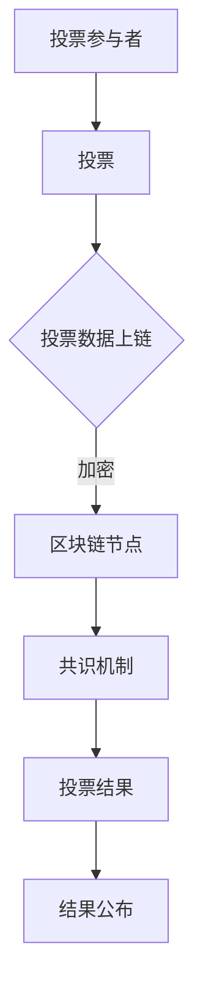

                 

### 文章标题：区块链投票系统：民主参与的技术创新

> 关键词：区块链，投票系统，民主参与，技术创新，加密算法，共识机制

> 摘要：本文将深入探讨区块链投票系统的技术原理及其在民主参与中的创新应用。通过分析区块链的基本原理、投票系统的核心概念以及区块链投票系统的优势，我们将揭示其在安全性、透明性和隐私保护方面的独特优势。同时，我们将介绍加密算法和共识机制在区块链投票系统中的应用，并通过实际案例展示其应用前景。通过本文的阅读，读者将全面了解区块链投票系统在民主参与中的重要作用，以及其为实现更加公正和透明的选举机制所带来的技术创新。

### 第一部分：区块链投票系统的概述

区块链投票系统是一种基于区块链技术的投票系统，旨在提供一种安全、透明且不可篡改的投票方式。这一部分将首先介绍区块链的基本原理，然后分析投票系统的核心概念，并探讨区块链投票系统的优势和应用前景。

#### 第1章：区块链投票系统的基础概念

**1.1 区块链的基本原理**

区块链是一种分布式账本技术，通过加密算法和共识机制确保数据的不可篡改和透明性。区块链由多个区块组成，每个区块包含一定数量的交易记录，并通过加密算法将这些区块链接起来，形成一个链条。区块链的特点包括：

- **分布式账本**：区块链不需要中心化的机构来管理数据，而是通过分布在多个节点上的分布式账本实现数据的存储和验证。
- **不可篡改性**：区块链采用加密算法和共识机制，确保数据一旦上链即被加密并永久保存，无法被篡改。
- **透明性**：区块链的数据公开透明，所有参与者都可以验证数据的真实性和完整性。
- **安全性**：区块链的共识机制和加密技术提供了高度的安全性，确保数据不被未授权的访问或篡改。

**1.2 投票系统的基本概念**

投票系统是一种用于选举、民意调查等活动中收集和处理选民意见的机制。投票系统通常包括以下几个主要功能：

- **投票**：选民通过投票系统提交自己的投票意愿。
- **计票**：投票系统对选民的投票进行收集和统计，得出最终的投票结果。
- **结果公布**：投票系统将最终投票结果公布给选民。

**1.2.1 投票系统的定义**

投票系统是一种用于选举、民意调查等活动中收集和处理选民意见的机制。它通过一系列技术手段，如在线投票、纸质投票等，实现选民的投票意愿的收集、统计和公布。

**1.2.2 投票系统的主要功能**

投票系统的主要功能包括投票、计票和结果公布。具体来说：

- **投票**：选民通过投票系统提交自己的投票意愿。投票可以在线进行，也可以通过纸质投票进行。
- **计票**：投票系统对选民的投票进行收集和统计，得出最终的投票结果。计票过程通常涉及数据清洗、去重和加权等步骤。
- **结果公布**：投票系统将最终投票结果公布给选民。结果公布可以通过在线平台、纸质公告等形式进行。

**1.2.3 传统投票系统的局限**

传统投票系统在安全性、透明性和隐私保护方面存在一些局限：

- **安全性**：传统投票系统容易受到黑客攻击，选票容易被篡改或丢失。
- **透明性**：传统投票系统的计票和结果公布过程不透明，选民难以验证投票的真实性和公正性。
- **隐私保护**：传统投票系统无法保护选民的隐私，选票信息容易被泄露或滥用。

**1.3 区块链投票系统的优势**

区块链投票系统通过利用区块链技术，解决了传统投票系统在安全性、透明性和隐私保护方面的局限，具有以下优势：

- **不可篡改性**：区块链投票系统确保投票数据一旦上链即被加密并永久保存，无法被篡改。这有助于确保投票的真实性和公正性。
- **隐私保护**：区块链投票系统通过加密技术保护选民隐私，确保投票匿名。选民可以在保持匿名的情况下参与投票，避免了隐私泄露的风险。
- **安全性**：区块链投票系统采用共识机制和加密技术，提供了高度的安全性。这有助于防止黑客攻击、选票篡改等行为。
- **透明性**：区块链投票系统的投票过程和结果公开透明，所有参与者都可以验证数据的真实性和完整性。这有助于提高投票系统的可信度。

**1.4 区块链投票系统的应用前景**

区块链投票系统在民主参与、企业管理与选举、国际合作与治理等方面具有广泛的应用前景：

- **民主参与的创新**：区块链投票系统为民主参与提供了新的途径，促进了更广泛的公众参与。通过区块链投票系统，选民可以更加方便、安全地参与选举和民意调查，提高了民主参与度。
- **企业管理和选举**：区块链投票系统可以用于企业内部选举、股东投票等场景。通过区块链投票系统，企业可以确保选举的公正性和透明性，提高员工和股东的满意度。
- **国际合作与治理**：区块链投票系统有助于跨国组织进行投票，提高国际合作的效率。通过区块链投票系统，跨国组织可以确保投票的公正性和透明性，促进国际合作和治理。

#### Mermaid 流�程图



### 第2章：区块链投票系统的核心算法与原理

区块链投票系统的核心算法与原理是其实现安全、透明、不可篡改投票的关键。这一部分将详细分析区块链投票系统中的加密算法和共识机制，并探讨其在区块链投票系统中的应用。

#### 2.1 加密算法

加密算法是区块链投票系统的核心组成部分，主要用于保护投票的隐私和安全。以下将介绍密码学基础、常见的加密算法以及区块链中的加密应用。

**2.1.1 密码学基础**

密码学是研究加密和解密技术的学科。加密是指将明文信息转换为密文的过程，而解密则是将密文还原为明文的过程。密码学主要涉及以下几个方面：

- **加密与解密**：加密是将明文信息转换为密文的过程，解密则是将密文还原为明文的过程。加密和解密需要使用密钥，密钥是加密算法的核心组成部分。
- **对称加密与非对称加密**：对称加密使用相同的密钥进行加密和解密，而非对称加密则使用一对公钥和私钥进行加密和解密。

**2.1.2 常见的加密算法**

常见的加密算法包括对称加密和非对称加密。对称加密算法的优点是计算速度快，但缺点是密钥分发困难；非对称加密算法则解决了密钥分发问题，但计算复杂度较高。

- **对称加密**：对称加密算法使用相同的密钥进行加密和解密。常见的对称加密算法包括AES（高级加密标准）和DES（数据加密标准）。
- **非对称加密**：非对称加密算法使用一对公钥和私钥进行加密和解密。常见的非对称加密算法包括RSA（Rivest-Shamir-Adleman算法）和ECC（椭圆曲线加密）。

**2.1.3 区块链中的加密应用**

在区块链投票系统中，加密算法主要用于以下几个方面：

- **数字签名**：数字签名是一种确保数据完整性和身份认证的技术。在区块链投票系统中，选民可以使用私钥对投票信息进行签名，以确保投票的真实性和完整性。
- **加密投票**：加密投票是保护投票隐私的重要手段。在区块链投票系统中，选民可以将投票信息进行加密，确保投票在传输和存储过程中不会被泄露。

**2.1.4 伪代码**

以下是一个简单的加密算法的伪代码示例：

```python
def encrypt(message, key):
    # 对消息进行加密
    encrypted_message = encrypt_algorithm(message, key)
    return encrypted_message

def decrypt(encrypted_message, key):
    # 对加密的消息进行解密
    message = decrypt_algorithm(encrypted_message, key)
    return message
```

#### 2.2 共识机制

共识机制是区块链投票系统的关键组成部分，用于确保区块链网络中的所有节点对数据的共识。以下将介绍常见的共识机制及其在区块链投票系统中的应用。

**2.2.1 共识机制概述**

共识机制是指区块链网络中的所有节点通过一系列协议和算法，就区块链中的数据达成一致的过程。常见的共识机制包括以下几种：

- **工作量证明（PoW）**：工作量证明是一种通过计算能力来达成共识的机制。在PoW机制中，节点需要通过解决一个复杂的数学问题来获得记账权。
- **权益证明（PoS）**：权益证明是一种通过节点持有的代币数量和持币时间来达成共识的机制。在PoS机制中，节点可以通过质押代币来获得记账权。
- **委托权益证明（DPoS）**：委托权益证明是一种基于PoS机制的改进方案。在DPoS机制中，节点可以通过投票来选出记账节点。

**2.2.2 共识机制在区块链投票系统中的应用**

在区块链投票系统中，共识机制主要用于以下几个方面：

- **投票数据确认**：共识机制确保区块链网络中的所有节点对投票数据达成一致，防止恶意篡改。
- **投票结果计算**：共识机制确保投票结果的正确性和公正性，防止恶意攻击和投票欺诈。

**2.2.3 共识机制的优缺点**

不同的共识机制有其优缺点。以下是对几种常见共识机制的优缺点的简要分析：

- **PoW**：优点是安全性高，缺点是计算资源消耗大，可能导致性能瓶颈。
- **PoS**：优点是效率高，缺点是可能存在“富者愈富”的问题。
- **DPoS**：优点是效率更高，缺点是可能存在选举不公平的问题。

#### 2.3 加密数学模型

在区块链投票系统中，加密数学模型主要用于保护投票的隐私和安全。以下将介绍椭圆曲线加密（ECC）的数学模型及其在区块链投票系统中的应用。

**2.3.1 椭圆曲线加密（ECC）**

椭圆曲线加密（ECC）是一种基于椭圆曲线的公钥加密算法。ECC具有以下特点：

- **安全性**：ECC相对于传统RSA加密算法具有更高的安全性，其安全性随着密钥长度的增加而增加。
- **效率**：ECC相对于RSA加密算法具有更高的计算效率，其加密和解密速度更快。

**2.3.2 椭圆曲线加密的数学模型**

椭圆曲线加密的数学模型主要包括以下方面：

- **椭圆曲线定义**：椭圆曲线是一个数学对象，其定义如下：

  $$y^2 = x^3 + ax + b$$

  其中，\(a\) 和 \(b\) 是常数。

- **点加法**：椭圆曲线上的点可以通过点加法进行操作。点加法满足以下性质：

  - 加法封闭性：对于任意两个点 \(P\) 和 \(Q\)，它们的和 \(P+Q\) 仍在椭圆曲线上。
  - 加法交换律：\(P+Q = Q+P\)。
  - 加法结合律：\(P+(Q+R) = (P+Q)+R\)。

- **双倍加法**：对于任意点 \(P\)，其双倍加法 \(2P\) 也满足上述性质。

**2.3.3 椭圆曲线加密的过程**

椭圆曲线加密的过程主要包括以下步骤：

1. **密钥生成**：选择一个随机数 \(k\)，计算私钥 \(d = kG\)（其中 \(G\) 是生成元），然后计算公钥 \(Q = kG\)。

2. **加密**：选择一个随机数 \(k'\)，计算加密消息 \(c_1 = k'G\) 和 \(c_2 = Enc(k', m)\)，其中 \(m\) 是明文消息，\(Enc\) 是加密算法。

3. **解密**：使用私钥 \(d\) 解密加密消息，计算明文消息 \(m = Dec(c_1, c_2)\)。

**2.3.4 伪代码**

以下是一个简单的椭圆曲线加密的伪代码示例：

```python
def generate_keypair():
    # 生成椭圆曲线密钥对
    p = 2184
    a = 9
    b = 10
    G = (13, 15)  # 生成元
    n = order(G)  # 椭圆曲线的阶

    # 生成私钥
    d = random.randint(1, n-1)

    # 生成公钥
    Q = scalar_multiplication(G, d)

    return (d, Q)

def encrypt(message, public_key):
    # 对消息进行加密
    p = 2184
    a = 9
    b = 10
    G = (13, 15)  # 生成元

    # 选择随机数 k
    k = random.randint(1, n-1)

    # 计算加密消息
    c1 = scalar_multiplication(G, k)
    c2 = (message ^ k) % p

    return (c1, c2)

def decrypt(encrypted_message, private_key):
    # 对加密的消息进行解密
    p = 2184
    a = 9
    b = 10
    G = (13, 15)  # 生成元

    # 解密加密消息
    c1, c2 = encrypted_message
    k = inverse模p(c1[0], p)
    message = (c2 ^ k) % p

    return message
```

### 第3章：区块链投票系统的数学模型与算法

区块链投票系统的数学模型和算法是实现其安全、透明和不可篡改功能的关键。这一部分将深入探讨区块链投票系统中的数学模型和算法，包括椭圆曲线加密（ECC）、智能合约等，并提供相关的数学公式和伪代码示例。

#### 3.1 椭圆曲线加密（ECC）

椭圆曲线加密（ECC）是基于椭圆曲线数学的公钥加密算法，它具有高安全性和高效率的特点。以下将介绍ECC的基本数学模型和相关算法。

**3.1.1 椭圆曲线的定义**

椭圆曲线在数学上可以表示为以下方程：

$$y^2 = x^3 + ax + b$$

其中，\(a\) 和 \(b\) 是常数，且 \(a \neq 0\)。

**3.1.2 椭圆曲线上的点加法**

在椭圆曲线上，任意两点 \(P\) 和 \(Q\) 的和 \(P + Q\) 仍然在椭圆曲线上。点加法满足以下性质：

- 加法封闭性：对于任意两个点 \(P\) 和 \(Q\)，它们的和 \(P+Q\) 仍在椭圆曲线上。
- 加法交换律：\(P+Q = Q+P\)。
- 加法结合律：\(P+(Q+R) = (P+Q)+R\)。

**3.1.3 椭圆曲线的阶**

椭圆曲线的阶是指曲线上所有点的数量。椭圆曲线的阶可以通过以下公式计算：

$$n = \frac{p^2 - 1}{4a}$$

其中，\(p\) 是椭圆曲线的定义域的上限。

**3.1.4 椭圆曲线加密算法**

ECC加密算法的主要步骤如下：

1. **密钥生成**：选择一个随机数 \(k\)，计算私钥 \(d = kG\)（其中 \(G\) 是生成元），然后计算公钥 \(Q = kG\)。

2. **加密**：选择一个随机数 \(k'\)，计算加密消息 \(c_1 = k'G\) 和 \(c_2 = Enc(k', m)\)，其中 \(m\) 是明文消息，\(Enc\) 是加密算法。

3. **解密**：使用私钥 \(d\) 解密加密消息，计算明文消息 \(m = Dec(c_1, c_2)\)。

**3.1.5 伪代码**

以下是一个简单的ECC加密和解密的伪代码示例：

```python
# 密钥生成
def generate_keypair():
    p = 2184
    a = 9
    b = 10
    G = (13, 15)  # 生成元
    n = order(G)  # 椭圆曲线的阶

    # 生成私钥
    d = random.randint(1, n-1)

    # 生成公钥
    Q = scalar_multiplication(G, d)

    return (d, Q)

# 加密
def encrypt(message, public_key):
    p = 2184
    a = 9
    b = 10
    G = (13, 15)  # 生成元

    # 选择随机数 k
    k = random.randint(1, n-1)

    # 计算加密消息
    c1 = scalar_multiplication(G, k)
    c2 = (message ^ k) % p

    return (c1, c2)

# 解密
def decrypt(encrypted_message, private_key):
    p = 2184
    a = 9
    b = 10
    G = (13, 15)  # 生成元

    # 解密加密消息
    c1, c2 = encrypted_message
    k = inverse模p(c1[0], p)
    message = (c2 ^ k) % p

    return message
```

#### 3.2 智能合约

智能合约是一种自动执行合同条款的程序，它可以实现去中心化的自动化交易。在区块链投票系统中，智能合约用于自动化投票过程和结果计算。

**3.2.1 智能合约的基本原理**

智能合约的基本原理是基于区块链的编程语言，如Solidity，编写一个程序，并在区块链上进行部署。智能合约的主要特点是：

- **自执行**：智能合约在满足特定条件时自动执行。
- **不可篡改**：智能合约一旦部署，其代码和状态不可篡改。
- **透明性**：智能合约的执行过程和结果公开透明，所有参与者都可以验证。

**3.2.2 智能合约在区块链投票系统中的应用**

在区块链投票系统中，智能合约主要用于以下几个方面：

- **投票过程**：智能合约用于验证选民的投票权限，确保每个选民只能投票一次。
- **结果计算**：智能合约用于自动化计票和结果计算，确保投票结果的真实性和公正性。
- **结果公布**：智能合约用于自动化公布投票结果，确保结果的透明性。

**3.2.3 智能合约的数学模型**

智能合约的数学模型主要包括以下方面：

- **状态变量**：智能合约的状态变量用于存储投票数据、计票结果等。
- **事件**：智能合约的事件用于记录重要操作，如投票、计票结果公布等。
- **逻辑控制**：智能合约的逻辑控制用于实现投票过程和结果计算。

**3.2.4 伪代码**

以下是一个简单的智能合约的伪代码示例：

```solidity
// 投票智能合约
pragma solidity ^0.8.0;

contract Voting {
    // 状态变量
    mapping(address => bool) public voted;  // 存储已投票的选民
    mapping(string => uint256) public votes;  // 存储每个候选人的得票数

    // 事件
    event Vote(address voter, string candidate);

    // 投票函数
    function vote(string memory candidate) public {
        require(!voted[msg.sender], "已经投票");
        voted[msg.sender] = true;
        votes[candidate] += 1;
        emit Vote(msg.sender, candidate);
    }

    // 计票函数
    function tally() public {
        // 计票逻辑
        // ...
    }
}
```

#### 3.3 数学模型与算法的应用

在区块链投票系统中，数学模型和算法的应用是实现其安全、透明和不可篡改的关键。以下将介绍一些具体的数学模型和算法的应用。

**3.3.1 投票数据加密**

投票数据加密是保护选民隐私的重要手段。在区块链投票系统中，选民可以将投票信息进行加密，确保投票在传输和存储过程中不会被泄露。常见的加密算法包括RSA、ECC等。

**3.3.2 投票数据验证**

投票数据验证是确保投票结果真实性和公正性的重要手段。在区块链投票系统中，可以通过智能合约实现投票数据的验证。智能合约可以用于验证选民的投票权限、投票数据的完整性等。

**3.3.3 投票结果计算**

投票结果计算是确定选举结果的重要步骤。在区块链投票系统中，可以通过智能合约实现投票结果的自动化计算。智能合约可以根据投票数据，计算每个候选人的得票数，并确定选举结果。

**3.3.4 投票结果公布**

投票结果公布是确保选举结果公开透明的重要环节。在区块链投票系统中，可以通过智能合约自动化公布投票结果。智能合约可以记录重要事件，如投票、计票结果公布等，并确保这些事件公开透明。

#### 3.4 案例分析

以下是一个区块链投票系统的案例分析，展示了如何使用数学模型和算法实现一个安全、透明和不可篡改的投票系统。

**案例：智能选举平台**

智能选举平台是一个基于区块链的投票系统，用于选举过程。该系统包括以下几个主要模块：

- **投票模块**：选民可以通过投票模块提交自己的投票意愿。投票模块使用ECC加密算法对投票数据进行加密，确保投票隐私。
- **计票模块**：计票模块使用智能合约实现投票数据的验证和计票。智能合约可以确保每个选民只能投票一次，并计算每个候选人的得票数。
- **结果公布模块**：结果公布模块使用智能合约自动化公布投票结果。智能合约可以记录重要事件，如投票、计票结果公布等，并确保这些事件公开透明。

**案例分析**

1. **投票数据加密**：选民使用ECC加密算法对投票数据进行加密，确保投票隐私。加密过程如下：

   - 选民选择一个随机数 \(k\)，计算私钥 \(d = kG\)（其中 \(G\) 是生成元），然后计算公钥 \(Q = kG\)。
   - 选民将投票信息 \(m\) 与公钥 \(Q\) 进行加密，得到加密消息 \(c_1 = k'G\) 和 \(c_2 = Enc(k', m)\)。

2. **投票数据验证**：计票模块使用智能合约实现投票数据的验证。智能合约可以确保每个选民只能投票一次，并计算每个候选人的得票数。验证过程如下：

   - 计票模块验证选民的投票权限，确保选民未投票。
   - 计票模块将选民的投票数据与已存储的公钥进行比对，确保投票数据与公钥匹配。
   - 计票模块将每个候选人的得票数累加，并更新智能合约的状态。

3. **投票结果计算**：计票模块使用智能合约自动化计算投票结果。智能合约可以确保投票结果的真实性和公正性。计算过程如下：

   - 计票模块根据每个候选人的得票数，确定选举结果。
   - 计票模块将选举结果记录在智能合约中，并更新智能合约的状态。

4. **投票结果公布**：结果公布模块使用智能合约自动化公布投票结果。智能合约可以记录重要事件，如投票、计票结果公布等，并确保这些事件公开透明。公布过程如下：

   - 结果公布模块将投票结果记录在区块链上，并广播给所有参与者。
   - 结果公布模块将投票结果公开在区块链浏览器上，供所有人查看。

### 第4章：项目实战

本节将介绍一个实际的区块链投票系统的开发过程，包括环境搭建、源代码实现和代码解读。通过这个项目，我们将展示如何利用区块链技术实现一个安全、透明和不可篡改的投票系统。

#### 4.1 开发环境搭建

要开发一个区块链投票系统，首先需要搭建一个合适的开发环境。以下是一个基本的开发环境搭建步骤：

1. **安装Node.js**：Node.js是一个基于Chrome V8引擎的JavaScript运行时环境，用于构建区块链节点。请从[Node.js官网](https://nodejs.org/)下载并安装Node.js。

2. **安装Truffle**：Truffle是一个用于开发以太坊区块链应用的框架。安装Truffle可以使用npm（Node Package Manager）：

   ```bash
   npm install -g truffle
   ```

3. **创建区块链节点**：使用Truffle创建一个新的区块链节点：

   ```bash
   truffle init
   ```

4. **安装开发工具**：安装必要的开发工具，如Visual Studio Code、Remix IDE（用于智能合约开发）等。

5. **安装区块链节点依赖**：在项目目录中安装区块链节点依赖：

   ```bash
   npm install
   ```

#### 4.2 源代码实现

以下是一个简单的区块链投票系统的源代码实现，包括投票合约和投票前端界面。

**4.2.1 投票合约**

```solidity
// SPDX-License-Identifier: MIT
pragma solidity ^0.8.0;

contract Voting {
    // 存储候选人的名称和得票数
    mapping(string => uint256) public candidates;
    // 存储已投票的地址
    mapping(address => bool) public voters;

    // 事件记录投票
    event VoteRecorded(address voter, string candidate);

    // 投票
    function vote(string memory candidate) public {
        require(!voters[msg.sender], "已经投票");
        voters[msg.sender] = true;
        candidates[candidate] += 1;
        emit VoteRecorded(msg.sender, candidate);
    }

    // 查询得票数
    function getCandidates() public view returns (mapping(string => uint256) memory) {
        return candidates;
    }
}
```

**4.2.2 投票前端界面**

```jsx
import React, { useState } from 'react';
import Voting from './ Voting.json';

const App = () => {
    const [candidate, setCandidate] = useState('');
    const [votes, setVotes] = useState({});

    const vote = async () => {
        if (!candidate) return;
        try {
            const provider = new Web3.providers.HttpProvider('http://127.0.0.1:7545');
            const web3 = new Web3(provider);
            const contract = new web3.eth.Contract(Voting.abi, Voting.address);

            await contract.methods.vote(candidate).send({ from: web3.eth.accounts[0] });

            const newVotes = await contract.methods.getCandidates().call();
            setVotes(newVotes);
        } catch (error) {
            console.error(error);
        }
    };

    return (
        <div>
            <h1>区块链投票系统</h1>
            <select value={candidate} onChange={(e) => setCandidate(e.target.value)}>
                <option value="">请选择候选人</option>
                <option value="候选人A">候选人A</option>
                <option value="候选人B">候选人B</option>
            </select>
            <button onClick={vote}>投票</button>
            <h2>得票数：</h2>
            <ul>
                {Object.keys(votes).map((candidate) => (
                    <li key={candidate}>{candidate}: {votes[candidate]}</li>
                ))}
            </ul>
        </div>
    );
};

export default App;
```

#### 4.3 代码解读

**4.3.1 投票合约解读**

- **合约结构**：合约使用`pragma`声明了使用的Solidity版本，并定义了两个映射：`candidates`存储候选人的名称和得票数，`voters`存储已投票的地址。
- **事件**：合约定义了一个名为`VoteRecorded`的事件，用于记录投票行为。
- **投票函数**：`vote`函数用于投

