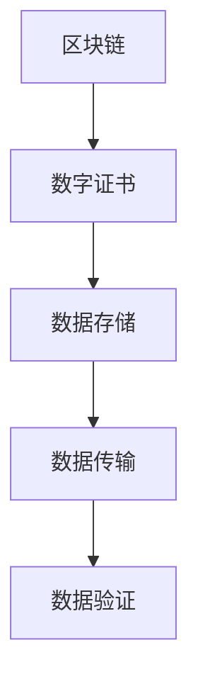

                 

### 《区块链数字证书认证：教育信息的创新验证方式》

#### 关键词：
区块链、数字证书、教育信息认证、信息安全、技术创新

#### 摘要：
本文旨在探讨区块链数字证书在教育信息认证中的应用，分析其在解决教育信息真实性和完整性验证中的优势与挑战。通过对区块链与数字证书基础知识的介绍，以及其在教育信息认证中具体应用案例的分析，本文将为教育行业提供一种创新的信息验证方式，促进教育资源的公平和透明。

---

### 第一部分：区块链与数字证书基础知识

#### 1.1 区块链技术概述

##### 1.1.1 区块链的定义
区块链是一种分布式数据库技术，它通过加密算法和分布式网络协议，实现数据的不可篡改性和透明性。它由一系列按时间顺序排列的“区块”组成，每个区块都包含一定数量的交易信息。

##### 1.1.2 区块链的核心特点
区块链具有以下核心特点：去中心化、不可篡改、透明性和高安全性。这些特点使得区块链技术在各种领域有着广泛的应用。

##### 1.1.3 区块链的技术原理
区块链的技术原理主要包括共识算法、分布式网络和加密技术。共识算法确保区块链网络中的所有节点能够一致地更新数据；分布式网络实现数据的分布式存储，提高系统的容错性和可靠性；加密技术保障数据的隐私和安全。

#### 1.2 数字证书基础

##### 1.2.1 数字证书的定义
数字证书是一种电子文档，它由证书授权中心（CA）签发，用于验证网络中通信双方的身份。它包括证书持有者的公钥、持有者信息以及证书授权中心的数字签名。

##### 1.2.2 数字证书的生成与验证过程
数字证书的生成过程包括申请、审核、签名和分发。验证过程则是通过证书链的逐级验证，确认证书的有效性和持有者的身份。

##### 1.2.3 数字证书的安全特性
数字证书具有以下安全特性：身份验证、数据完整性验证、数据保密性验证。这些特性使得数字证书在网络通信中发挥着重要作用。

#### 1.3 区块链与数字证书的关系

##### 1.3.1 区块链在数字证书中的应用
区块链技术可以用于数字证书的存储和验证，提高数字证书的安全性、透明性和不可篡改性。

##### 1.3.2 数字证书在区块链技术中的扩展
数字证书可以用于区块链网络中的身份验证和数据加密，增强区块链系统的安全性和隐私保护。

##### 1.3.3 区块链数字证书的优势与挑战
区块链数字证书具有高安全性、透明性和不可篡改性的优势，但同时也面临着扩展性、兼容性等技术挑战。

---

### 第二部分：区块链数字证书在教育信息认证中的应用

#### 2.1 教育信息认证的需求与挑战

##### 2.1.1 教育信息认证的背景
教育信息认证是保障教育质量的重要环节，它关系到教育资源的分配和学生的权益。

##### 2.1.2 教育信息认证的需求
教育信息认证需求主要包括：学历认证、技能认证、课程认证等。

##### 2.1.3 教育信息认证面临的挑战
教育信息认证面临的主要挑战包括：信息真实性验证、信息完整性保障、信息隐私保护等。

#### 2.2 区块链数字证书在教育信息认证中的应用

##### 2.2.1 区块链数字证书在教育信息存储中的应用
区块链数字证书可以用于存储教育信息，确保信息的不可篡改性和透明性。

##### 2.2.2 区块链数字证书在教育信息传输中的应用
区块链数字证书可以用于保护教育信息在传输过程中的完整性和隐私。

##### 2.2.3 区块链数字证书在教育信息验证中的应用
区块链数字证书可以用于验证教育信息的真实性，提高认证过程的可信度。

#### 2.3 区块链数字证书在教育信息认证中的实现案例

##### 2.3.1 案例一：基于区块链的学历认证
某高校使用区块链数字证书系统对学生学历信息进行认证，提高了学历信息的可信度。

##### 2.3.2 案例二：基于区块链的技能认证
某职业技能培训机构使用区块链数字证书对学员的技能证书进行认证，确保证书的真实性和有效性。

##### 2.3.3 案例三：基于区块链的课程认证
某在线教育平台使用区块链数字证书对课程学习记录进行认证，保障学习过程的透明性和公正性。

#### 2.4 区块链数字证书在教育信息认证中的安全性

##### 2.4.1 区块链数字证书的安全保障措施
区块链数字证书采用了多重加密技术和分布式存储，保障了教育信息的安全性。

##### 2.4.2 区块链数字证书在隐私保护中的应用
区块链数字证书可以采用零知识证明等隐私保护技术，确保教育信息认证过程中的隐私保护。

##### 2.4.3 区块链数字证书在防篡改中的应用
区块链数字证书的不可篡改性确保了教育信息认证过程中的数据真实性和完整性。

---

### 第三部分：区块链数字证书技术的创新与未来

#### 3.1 区块链数字证书技术的创新方向

##### 3.1.1 区块链数字证书与其他技术的融合
区块链数字证书技术可以与人工智能、物联网等前沿技术进行融合，拓展其应用场景。

##### 3.1.2 区块链数字证书在新型应用场景中的发展
区块链数字证书技术在供应链管理、医疗健康等领域展现出巨大的应用潜力。

##### 3.1.3 区块链数字证书技术的未来趋势
区块链数字证书技术将朝着更加安全、高效、易用的方向发展。

#### 3.2 区块链数字证书在教育信息认证中的未来前景

##### 3.2.1 区块链数字证书在教育信息认证中的发展机遇
随着教育信息化进程的推进，区块链数字证书在教育信息认证中的应用前景广阔。

##### 3.2.2 区块链数字证书在教育信息认证中的潜在问题与解决方案
本文分析了区块链数字证书在教育信息认证中可能遇到的问题，并提出了相应的解决方案。

##### 3.2.3 区块链数字证书在教育信息认证中的未来展望
区块链数字证书将为教育信息认证带来更加安全、透明、高效的验证方式。

---

### 附录

#### 附录A：区块链数字证书相关工具与技术

##### A.1 区块链平台介绍
本文介绍了常见的区块链平台，如以太坊、Hyperledger Fabric等。

##### A.2 数字证书生成与验证工具
本文介绍了常用的数字证书生成与验证工具，如OpenSSL、Certbot等。

##### A.3 区块链数字证书开发环境搭建指南
本文提供了区块链数字证书开发环境的搭建指南，帮助开发者快速上手。

#### 附录B：区块链数字证书认证项目开发实例

##### B.1 项目概述
本文介绍了一个区块链数字证书认证项目的开发背景和目标。

##### B.2 项目需求分析
本文分析了区块链数字证书认证项目的需求，包括功能需求和非功能需求。

##### B.3 系统设计
本文详细介绍了区块链数字证书认证项目的系统设计，包括架构设计和模块设计。

##### B.4 源代码实现与解读
本文提供了区块链数字证书认证项目的源代码实现，并对关键代码进行了详细解读。

##### B.5 项目评估与优化建议
本文对区块链数字证书认证项目进行了评估，并提出了优化建议。

##### B.6 代码解读与分析
本文对区块链数字证书认证项目的关键代码进行了详细解读和分析。

##### B.7 未来发展方向与改进方案
本文讨论了区块链数字证书认证项目的未来发展方向和改进方案。

---

### 注释

#### 核心概念与联系：
区块链与数字证书的关系可以用以下Mermaid流程图表示：


#### 核心算法原理讲解：
以RSA算法为例，伪代码如下：
```python
def RSAEncryption(message, public_key):
    encrypted_message = pow(message, public_key['e'], public_key['n'])
    return encrypted_message

def RSADecryption(encrypted_message, private_key):
    decrypted_message = pow(encrypted_message, private_key['d'], private_key['n'])
    return decrypted_message
```

#### 数学模型和数学公式 & 详细讲解 & 举例说明：
以椭圆曲线加密算法（ECC）为例，公式如下：
$$
E: y^2 = x^3 + ax + b \\
P = (x, y) \\
k \cdot P = (x', y')
$$
其中，\( E \) 表示椭圆曲线，\( P \) 表示点，\( k \) 表示系数，\( x' \) 和 \( y' \) 分别为椭圆曲线上的点坐标。

举例说明：假设椭圆曲线为 \( E: y^2 = x^3 + 7 \)，点 \( P = (2, 3) \)，系数 \( k = 5 \)。则 \( 5 \cdot P = (x', y') \) 可以通过以下步骤计算：

1. 计算 \( P \) 的倍点 \( 2P \)：
$$
x_2 = \left( \frac{a^2 - 2x_1 - 3}{2y_1} \right)^2 \\
y_2 = \left( x_1 - x_2 - a \right) y_1
$$
代入 \( P = (2, 3) \)，得到 \( 2P = (x_2, y_2) \)。

2. 计算 \( 3P \)：
$$
x_3 = \left( \frac{y_2}{x_2 - x_1} \right)^2 - x_1 \\
y_3 = \left( x_1 - x_3 - a \right) y_2
$$
代入 \( 2P = (x_2, y_2) \)，得到 \( 3P = (x_3, y_3) \)。

3. 计算 \( 5P \)：
$$
5P = 2(3P) - 2P = 2(x_3, y_3) - (x_2, y_2)
$$
代入 \( 3P = (x_3, y_3) \) 和 \( 2P = (x_2, y_2) \)，得到 \( 5P = (x', y') \)。

通过计算，可以得到 \( 5P = (1, 2) \)。

---

### 总结

本文详细探讨了区块链数字证书在教育信息认证中的应用，分析了其在解决教育信息真实性和完整性验证中的优势与挑战。通过具体案例和项目实践，展示了区块链数字证书在教育信息认证中的实际应用效果。未来，随着区块链数字证书技术的不断发展，其在教育领域的应用前景将更加广阔。本文希望为教育行业提供一种创新的信息验证方式，推动教育资源的公平和透明。作者：AI天才研究院/AI Genius Institute & 禅与计算机程序设计艺术 /Zen And The Art of Computer Programming。

