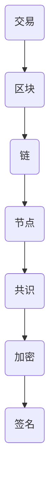

                 

### 文章标题

# 区块链艺术品认证：艺术市场的创新解决方案

### 关键词

- 区块链
- 艺术品认证
- 不可篡改性
- 去中心化
- 智能合约
- 加密算法
- 数据安全性
- 艺术品交易

### 摘要

区块链技术以其不可篡改、去中心化和高度透明等特性，正在成为艺术市场的一个创新解决方案。本文旨在探讨区块链在艺术品认证中的应用，分析其背景、原理、优势以及具体实施流程。文章将首先介绍区块链技术的基本原理，包括其定义、发展历程、关键特性及应用场景。接着，本文将讨论艺术品认证的重要性，以及区块链在解决艺术品市场挑战方面的应用优势。随后，文章将详细阐述区块链艺术品认证的流程，并通过实际案例进行分析。最后，文章将介绍区块链核心算法原理，并总结最佳实践，展望未来发展趋势。希望通过本文的探讨，能够为艺术市场的参与者提供有益的参考。

### 第一部分：区块链艺术品认证概述

#### 第1章：区块链与艺术品认证的背景

区块链技术起源于2008年，由一位名为中本聪（Satoshi Nakamoto）的匿名人物提出。作为一种分布式账本技术，区块链通过去中心化的方式记录和验证交易数据，具有不可篡改和透明化的特点。区块链技术的发展历程经历了多个阶段，从比特币的诞生到如今各种区块链平台的兴起，其应用范围也逐渐扩大，涵盖了金融、供应链管理、医疗等多个领域。

区块链技术的关键特性包括不可篡改性、去中心化和可追溯性。不可篡改性指的是区块链上的数据一旦记录，便无法被修改或删除，保证了数据的真实性和可靠性。去中心化则意味着区块链网络中的每个节点都可以参与数据的记录和验证，不存在中心化的控制节点，从而提高了系统的容错性和抗攻击性。可追溯性使得区块链上的所有交易记录都可以被追溯，增加了数据的透明度，有助于提高信任度。

在艺术品市场，区块链技术正逐渐成为一种创新的认证解决方案。艺术品市场面临着许多挑战，如赝品泛滥、估值困难、交易纠纷等。这些问题严重影响了市场的健康发展。区块链技术的出现，为解决这些问题提供了新的思路和工具。

首先，区块链技术可以确保艺术品信息的真实性和不可篡改性。在区块链上，艺术品的信息将被永久记录并验证，从而避免了伪造和篡改的风险。艺术家、收藏家、拍卖行等市场参与者可以更加信任艺术品的真实性，减少了交易中的风险和不确定性。

其次，区块链技术可以提高艺术品交易的透明度。通过区块链，艺术品交易的所有环节都可以被记录和追溯，使得交易过程更加公开和透明。这不仅有助于提高市场的透明度，还可以减少交易纠纷的发生，提高市场的信任度和公正性。

此外，区块链技术还可以促进艺术品市场的公平竞争。在传统的艺术品市场中，信息不对称是一个普遍存在的问题。通过区块链，所有市场参与者都可以平等地获取艺术品信息，降低了信息不对称的程度，从而提高了市场的竞争性和公平性。

综上所述，区块链技术为艺术品认证提供了强有力的支持。它不仅能够确保艺术品信息的真实性，提高交易的透明度，还能促进市场的公平竞争。因此，区块链在艺术品市场中的应用具有巨大的潜力。

#### 1.2 艺术品认证的重要性

艺术品认证在艺术市场中具有至关重要的地位。它不仅关系到艺术品的真实性和市场价值，也直接影响到市场的健康发展和参与者的信任关系。艺术品认证的重要性主要体现在以下几个方面：

首先，艺术品认证有助于确保艺术品的真实性。在艺术品市场中，赝品问题一直是一个严峻的挑战。许多艺术品在创作完成后，经过多次转手和交易，很容易出现伪造和篡改的情况。这些伪造和篡改的行为不仅损害了艺术家的权益，也使收藏家、拍卖行和其他市场参与者面临巨大的风险。通过艺术品认证，可以在源头上确保艺术品的真实性，减少赝品的产生和传播。

其次，艺术品认证有助于提高艺术品的估值。艺术品的估值是一个复杂的过程，需要综合考虑艺术品的创作背景、历史价值、市场趋势等多个因素。然而，在传统的艺术品市场中，信息的不对称性使得艺术品的估值往往存在较大的主观性和不确定性。通过艺术品认证，可以提供更加客观和准确的评估依据，从而提高艺术品的估值准确性和市场认可度。

此外，艺术品认证还可以减少交易纠纷。在艺术品交易过程中，买卖双方常常因为艺术品的价值、真实性等问题产生纠纷。通过艺术品认证，可以提供权威的认证结果，减少交易中的不确定性，降低纠纷的发生率。这不仅有助于维护市场的稳定，也可以提高市场参与者的交易信心。

最后，艺术品认证有助于提高市场的透明度和公正性。在传统的艺术品市场中，信息不对称和透明度低是一个普遍存在的问题。通过艺术品认证，可以使得艺术品的信息更加公开和透明，增加市场参与者的知情权和参与度，从而提高市场的透明度和公正性。

总之，艺术品认证在艺术市场中具有重要的意义。它不仅能够确保艺术品的真实性，提高艺术品的估值，减少交易纠纷，还能提高市场的透明度和公正性，促进市场的健康发展和参与者的信任关系。因此，艺术品认证是艺术品市场不可或缺的一环。

#### 1.2.1 艺术品市场的现状与挑战

艺术品市场目前面临诸多挑战，其中最显著的问题之一是赝品泛滥。赝品问题不仅严重损害了艺术家的声誉，也影响了艺术品市场的稳定发展。随着科技的发展，伪造技术的不断进步，使得赝品的制作越来越逼真，给艺术品鉴定带来了极大的困难。据统计，全球艺术品市场中，赝品占整个市场份额的比例高达10%至20%，甚至有些知名拍卖行也曾曝出赝品事件。

此外，艺术品市场的估值困难也是一个严重问题。由于艺术品具有独特的艺术价值和文化价值，其估值往往受到主观因素的影响。传统估值方法主要依赖于市场行情、艺术品的创作背景和历史价值等因素，但这些方法往往缺乏客观性和准确性。在艺术品市场波动较大的情况下，估值的准确性更加难以保证，导致市场参与者往往面临较大的风险。

艺术品交易纠纷也是艺术品市场面临的另一大挑战。在交易过程中，买卖双方常常因为艺术品的真伪、价值等问题产生纠纷。由于缺乏权威的认证机构，市场参与者往往需要花费大量的时间和精力来处理这些纠纷，严重影响了交易的顺利进行。此外，纠纷处理过程往往涉及法律诉讼，增加了交易的成本和风险。

除了上述问题，艺术品市场的信息不对称也是一个普遍存在的问题。在传统艺术品市场中，信息的不对称性使得市场参与者往往处于不平等的地位，一些大型的艺术机构和拍卖行掌握了大量有价值的信息，而普通的艺术家和收藏家则难以获取这些信息，导致市场的不公平竞争。此外，艺术品市场的信息透明度较低，使得市场参与者难以全面了解艺术品的真实情况，增加了交易的不确定性和风险。

总之，艺术品市场目前面临着赝品泛滥、估值困难、交易纠纷和信息不对称等诸多挑战。这些问题严重影响了艺术品市场的健康发展，也使得市场参与者面临着巨大的风险。因此，寻找有效的解决方案，提升艺术品市场的透明度和公正性，是当前艺术品市场亟需解决的问题。区块链技术的出现，为解决这些问题提供了新的思路和可能性。

#### 1.2.2 区块链在艺术品认证中的应用优势

区块链技术为艺术品认证带来了显著的优点，这些优点不仅能够解决艺术品市场中的现有问题，还能够提升市场整体的透明度和公正性。以下是一些关键的应用优势：

首先，区块链技术的不可篡改性为艺术品信息的真实性提供了可靠保障。在区块链上，一旦艺术品的信息被记录和验证，就永久保存在链上，无法被修改或删除。这意味着艺术品的创作背景、所有权历史等信息得到了长期保存，从根本上杜绝了伪造和篡改的可能性。对于市场参与者来说，这意味着可以更加放心地交易和评估艺术品，不再担心因信息失真而导致的投资风险。

其次，区块链的去中心化特性提高了艺术品认证的透明度。在传统的艺术品认证体系中，信息的记录和验证往往依赖于中心化的机构或第三方平台，这可能导致信息不透明和权力集中。而区块链通过去中心化的方式，使得所有节点都可以参与信息的记录和验证，从而实现了信息的透明化。每个市场参与者都可以实时查看和验证艺术品的信息，增加了市场的透明度和公开性，减少了信息不对称带来的风险。

再次，区块链技术提高了艺术品交易的效率。在区块链上，艺术品信息的验证和确认过程大大简化，减少了传统认证体系中的复杂流程和时间成本。通过智能合约，艺术品交易可以自动化进行，从而提高了交易的速度和准确性。此外，区块链技术还支持点对点的交易模式，使得交易双方可以直接进行交易，无需通过中介机构，进一步降低了交易成本。

此外，区块链技术有助于建立艺术品市场的信任机制。在传统市场中，信任问题往往是交易中的瓶颈。而区块链通过其公开透明的记录方式，建立了基于数据信任的机制，使得市场参与者可以更加信任彼此。这种信任机制的建立，不仅促进了市场的健康发展，也为市场的长期稳定提供了保障。

最后，区块链技术具有高度的扩展性和适应性。随着区块链技术的发展，越来越多的艺术品认证平台和应用将涌现。这些平台和应用可以根据不同的需求进行定制化开发，从而更好地满足艺术品市场的多元化需求。同时，区块链技术的开放性和互操作性，也为不同平台之间的信息共享和合作提供了便利。

综上所述，区块链技术在艺术品认证中的应用优势显著，其不可篡改性、去中心化、高透明度、高效性、信任机制和扩展性等特点，为艺术品市场提供了全新的解决方案，有望推动艺术市场向更加透明、公正和高效的方向发展。

#### 1.3 本书结构安排与主要内容

本书将系统地探讨区块链在艺术品认证中的应用，分为四个主要部分，每个部分都有明确的核心内容，旨在为读者提供全面而深入的理解。

首先，**第一部分：区块链与艺术品认证的背景**，包括第1章，主要介绍区块链技术的基本原理和发展历程，以及区块链在艺术品市场中的应用背景和重要性。这一部分将帮助读者建立对区块链技术以及其在艺术品认证中作用的基本认识。

接着，**第二部分：区块链技术基础**，包括第2章和第3章，将详细解析区块链技术的架构、核心概念和数据结构，以及智能合约和加密算法等关键技术。这部分内容旨在为读者提供深入的技术背景，帮助理解区块链技术如何在艺术品认证中发挥作用。

然后，**第三部分：区块链艺术品认证流程**，包括第4章和第5章，将详细描述区块链艺术品认证的流程和应用，并通过具体案例进行分析。这一部分内容将帮助读者了解区块链艺术品认证的实践过程，以及其带来的实际效果。

最后，**第四部分：核心算法原理讲解**，包括第6章和第7章，将深入讲解区块链技术中的核心算法原理，包括智能合约和加密算法的具体实现。这部分内容旨在为高级读者提供技术实现的细节，以及算法在实际应用中的效果和优化策略。

整本书的结构紧凑，逻辑清晰，旨在通过逐步引导的方式，让读者全面了解区块链在艺术品认证中的应用。每章都有具体的阅读指南和互动环节，鼓励读者积极参与讨论，共同探索区块链技术的未来。

#### 1.3.1 各章节的核心内容概述

1. **第1章：区块链与艺术品认证的背景**
   - 介绍区块链技术的发展历程及其在艺术品市场中的重要性
   - 分析艺术品市场面临的挑战，以及区块链技术如何解决这些问题
   - 总结本章的核心内容和重要性

2. **第2章：区块链技术基础**
   - 详细解析区块链技术的基本架构和数据结构
   - 讲解区块链的核心概念，如数字签名、非对称加密和智能合约
   - 通过Merkle树和链式数据结构的原理图，帮助读者理解数据结构和安全性

3. **第3章：区块链艺术品认证流程**
   - 描述艺术品认证的基本流程和区块链技术的具体应用
   - 分析数据收集、验证和发布的过程，以及区块链技术的优势
   - 通过两个实际案例，展示区块链艺术品认证的实施效果

4. **第4章：核心算法原理讲解**
   - 详细讲解智能合约的算法原理和实现方法
   - 分析常见的加密算法，如RSA和AES
   - 通过伪代码示例，展示算法的具体实现和应用场景

5. **第5章：区块链艺术品认证案例分析**
   - 深入分析区块链艺术品认证的实际应用案例
   - 介绍开发环境和源代码实现，详细解读代码和应用效果
   - 通过案例分析，总结区块链艺术品认证的实际效果和优化方向

6. **第6章：智能合约算法**
   - 详细讲解智能合约的定义、作用及其在区块链艺术品认证中的应用
   - 通过伪代码示例，展示智能合约的实现过程
   - 分析智能合约在实际应用中的优势和挑战

7. **第7章：加密算法**
   - 分析对称加密和非对称加密的基本原理
   - 讲解常见加密算法的实现和应用
   - 通过具体例子，展示加密算法在区块链艺术品认证中的实际应用

#### 1.3.2 阅读指南与读者互动

为了帮助读者更好地理解本书的内容，我们特别提供以下阅读指南：

1. **逐步学习**：建议读者按照章节顺序逐步学习，每章内容都建立在上一章的基础上，以确保知识的连贯性和系统性。

2. **互动讨论**：在每章的结尾，我们都会提供一些问题或讨论话题，鼓励读者积极思考和参与互动。读者可以通过社交媒体或论坛分享自己的想法和见解。

3. **实践应用**：本书中的许多章节都包含了实际案例和代码示例，读者可以尝试在本地环境中实现这些案例，加深对区块链艺术品认证的理解。

4. **拓展阅读**：每章末尾都会推荐一些拓展阅读材料，帮助读者进一步探索相关主题，拓展知识面。

通过以上指南，我们希望读者能够更加深入地理解和应用区块链技术在艺术品认证中的潜力，为艺术市场的创新和发展做出贡献。

#### 1.4 未来展望

区块链技术在艺术品认证领域的应用前景广阔，其潜在影响将深远。首先，随着区块链技术的不断进步，未来可能会出现更多高效、安全的艺术品认证平台。这些平台将基于分布式账本技术，实现艺术品信息的全球共享和实时验证，极大地提升市场透明度和效率。

其次，市场接受度的提升也将推动区块链艺术品认证的广泛应用。随着区块链技术的普及，越来越多的艺术家、收藏家、拍卖行等市场参与者开始认识到其优势，逐渐接受并采用区块链技术进行艺术品认证。这将为区块链艺术品认证的发展奠定坚实的市场基础。

此外，区块链艺术品认证行业的革新也在不断进行。除了传统的艺术品认证外，区块链技术还可以应用于艺术品的数字化存证、版权保护、艺术品交易等多个环节。这些革新将使得艺术品市场的运作更加高效、透明和公平，进一步推动艺术品市场的发展。

总的来说，区块链技术在艺术品认证领域的应用具有巨大的潜力。随着技术的不断发展和市场接受度的提升，区块链艺术品认证将成为艺术市场的重要解决方案，为艺术市场的创新和发展带来新的机遇。我们期待未来能够看到更多成功的应用案例，进一步推动艺术市场的繁荣。

### 第二部分：区块链技术基础

#### 第2章：区块链技术基础

区块链技术作为分布式账本技术的代表，其独特的设计理念和应用场景使其在金融、供应链管理、艺术品认证等多个领域都展现出强大的潜力。本章将详细介绍区块链技术的基础知识，包括其基本架构、核心概念和数据结构，帮助读者建立起对区块链技术全面深入的理解。

#### 2.1 区块链架构详解

区块链的基本架构包括三个主要组成部分：区块链节点、区块链数据结构和区块链共识机制。下面将分别对这些组成部分进行详细解释。

##### 2.1.1 区块链的基本架构

区块链由多个区块组成，每个区块包含一定数量的交易记录。这些区块按照时间顺序链接在一起，形成了一条不断增长的链。每个区块都包含一个时间戳、一个或多个交易记录和一个链接到前一个区块的哈希值。

1. **区块（Block）**：区块是区块链的基本单位，每个区块包含一组交易记录以及用于链接到前一个区块的哈希值。区块的大小通常有一定的限制，以保持区块链的可扩展性和性能。

2. **区块链（Blockchain）**：区块链是由多个区块按时间顺序链接形成的链。区块链的长度决定了区块链的规模，每个区块的添加都使得区块链不断增长。

3. **节点（Node）**：区块链节点是参与区块链网络运行的计算机，每个节点都存储了一份完整的区块链数据。节点通过发送和接收交易，参与区块链的交易验证和共识过程。

4. **链式数据结构**：区块链采用链式数据结构，每个区块通过其哈希值与前一个区块链接在一起，形成一个不可篡改的数据链条。这种链式结构确保了区块链上数据的完整性和安全性。

##### 2.1.2 区块链的联盟链

联盟链（Consortium Blockchain）是区块链的一种变体，它允许一组预选的节点参与区块链的共识过程。与公共区块链不同，联盟链中的节点通常是由某个组织或团体控制的，这增加了共识过程的可控性和效率。

1. **预选节点**：联盟链中的节点不是随机选择的，而是由某个组织或团体预选的。这些预选节点负责验证交易、维护区块链的完整性和安全性。

2. **共识机制**：联盟链的共识机制通常比公共区块链简单，如基于授权的拜占庭容错算法（RBFT）或实用拜占庭容错算法（PBFT）。这些共识机制确保了联盟链的高效性和安全性。

##### 2.1.3 共识机制

共识机制是区块链网络中的节点就交易达成一致的过程。不同的区块链平台采用了不同的共识机制，常见的共识机制包括工作量证明（PoW）、权益证明（PoS）和委托权益证明（DPoS）。

1. **工作量证明（PoW）**：PoW是比特币采用的共识机制，节点通过解决复杂的数学问题来争夺记账权。解决数学问题所需的工作量越大，节点的记账权越高。PoW机制确保了区块链的安全性和去中心化。

2. **权益证明（PoS）**：PoS是一种替代PoW的共识机制，节点根据其持有的代币数量和持币时间来争夺记账权。持币时间越长、代币数量越多，节点的记账权越高。PoS机制相对于PoW具有更高的能效和更低的资源消耗。

3. **委托权益证明（DPoS）**：DPoS是PoS的一种变体，节点通过投票方式选出代表，代表负责记账和验证交易。代表节点的选择基于其持有的代币数量和投票者对其的信任度。

##### 2.1.4 区块链的数据结构

区块链的数据结构是确保数据完整性和安全性的关键。区块链的数据结构主要包括Merkle树、账本结构和链式数据结构。

1. **Merkle树**：Merkle树是一种二叉树结构，用于高效地验证数据的完整性。每个节点都包含一组数据的哈希值，根节点即为整个数据的哈希值。通过Merkle树，节点可以快速验证数据是否被篡改。

2. **账本结构**：账本结构是区块链上存储交易数据的方式。账本通常分为两类：公有账本和私有账本。公有账本对所有节点开放，私有账本则仅对特定节点开放。账本结构确保了数据的存储和访问安全性。

3. **链式数据结构**：链式数据结构是区块链的核心，通过链接各个区块，形成了不可篡改的数据链条。每个区块都包含一个时间戳、一组交易记录和一个链接到前一个区块的哈希值，确保了数据的有序性和完整性。

#### 2.2 区块链核心概念与联系

区块链的核心概念包括数字签名、非对称加密和智能合约等。这些概念之间相互关联，共同构成了区块链技术的核心架构。

##### 2.2.1 数字签名

数字签名是一种用于验证交易合法性的技术。它通过加密算法，确保交易数据的完整性和不可篡改性。数字签名的工作原理如下：

1. **密钥对**：数字签名使用一对密钥，即私钥和公钥。私钥是保密的，仅由签名者持有；公钥是公开的，可以由任何节点验证。

2. **签名过程**：签名者使用私钥对交易数据进行加密，生成一个签名。签名过程涉及哈希函数和公钥加密算法。

3. **验证过程**：接收者使用公钥对签名进行解密，并与原始交易数据进行比对。如果签名和解密结果一致，则验证通过，表明交易数据未被篡改。

##### 2.2.2 非对称加密

非对称加密是数字签名的基础。它通过两种不同的密钥，即私钥和公钥，实现数据的加密和解密。非对称加密的工作原理如下：

1. **加密过程**：发送者使用接收者的公钥对数据进行加密，只有接收者持有对应的私钥才能解密。

2. **解密过程**：接收者使用私钥对加密数据进行解密，确保数据的完整性和保密性。

非对称加密具有以下优点：

- **安全性**：由于私钥的保密性，加密数据无法被未授权者解密。
- **高效性**：非对称加密的运算速度相对较慢，但仅用于加密和解密小数据量的签名。

##### 2.2.3 智能合约

智能合约是一种自动执行合约条款的程序，它运行在区块链上，无需中介机构。智能合约的工作原理如下：

1. **编写**：开发者使用特定编程语言（如Solidity）编写智能合约代码，定义合约的条款和条件。

2. **部署**：将智能合约代码部署到区块链上，生成合约地址。

3. **执行**：当满足合约条款中的条件时，智能合约自动执行，如发送代币、记录数据等。

智能合约的特点包括：

- **自动化**：智能合约的执行完全自动化，无需人工干预。
- **透明性**：智能合约的执行过程公开透明，所有节点都可以查看。

##### 2.2.4 区块链架构的 Mermaid 流程图

为了更好地理解区块链的核心概念和架构，我们可以使用Mermaid流程图进行可视化展示。以下是一个简化的区块链架构的Mermaid流程图：



在这个流程图中，交易数据首先被记录到区块中，然后区块按时间顺序链接成链，节点参与共识过程，确保链的完整性。加密和签名技术则用于保护交易数据的安全性和完整性。

#### 2.3 区块链在艺术品认证中的应用原理

区块链技术为艺术品认证提供了强大的技术支持，其不可篡改、去中心化和高透明度等特性，使得艺术品信息的记录、验证和发布过程更加安全和可信。

##### 2.3.1 区块链在艺术品认证中的作用

区块链在艺术品认证中的作用主要体现在以下几个方面：

1. **确保艺术品真实性**：区块链通过其不可篡改的特性，确保了艺术品信息的真实性。在区块链上记录的艺术品信息，如创作时间、创作者身份、历史交易记录等，一旦被验证并记录，便无法被修改或删除。这使得艺术品市场参与者可以更加信任艺术品的真实性，减少了伪造和篡改的风险。

2. **提高艺术品交易的透明度**：区块链技术使得艺术品交易的所有环节都可以被记录和追溯，从而提高了交易的透明度。所有市场参与者都可以实时查看艺术品的信息和交易记录，增加了市场的公开性和透明度。这有助于减少信息不对称，降低交易中的不确定性，提高市场参与者的信任度。

3. **促进艺术品市场的公平竞争**：区块链技术通过去中心化的方式，使得所有市场参与者都可以平等地获取艺术品信息和交易机会。这有助于降低信息不对称，减少市场垄断行为，促进市场的公平竞争。

4. **降低艺术品交易成本**：区块链技术通过智能合约实现了交易的自动化和去中心化，减少了传统交易过程中所需的中介机构，从而降低了交易成本。这不仅提高了市场的效率，也为市场参与者带来了更大的利益。

##### 2.3.2 区块链技术在艺术品认证中的挑战与机遇

虽然区块链技术在艺术品认证中具有许多优势，但在实际应用过程中也面临一些挑战和机遇。

1. **技术成熟度**：区块链技术虽然已经取得了显著的进展，但仍然处于发展初期。技术的成熟度、性能和可扩展性等方面仍需进一步优化，以满足艺术品市场大规模应用的需求。

2. **法律法规**：区块链技术在艺术品认证中的应用需要相应的法律法规支持。目前，全球各国对区块链技术的监管和法律框架尚不完善，需要制定相应的法律法规，以确保区块链技术在艺术品认证中的合法合规。

3. **市场接受度**：区块链技术的普及程度和接受度仍然较低，许多艺术品市场参与者对其存在疑虑和担忧。提高市场接受度，增强市场信心，是区块链技术在艺术品认证中面临的重大挑战。

4. **安全性**：区块链技术虽然具有高安全性，但也并非完全免疫于攻击。艺术品市场涉及到大量的价值信息，其安全性至关重要。如何确保区块链技术在艺术品认证中的安全性，防止黑客攻击和数据泄露，是亟待解决的问题。

5. **机遇**：尽管面临挑战，但区块链技术在艺术品认证中同样蕴含着巨大的机遇。随着技术的不断进步和市场的逐渐接受，区块链有望在艺术品认证领域发挥更加重要的作用，推动艺术品市场的创新和发展。

总之，区块链技术在艺术品认证中的应用具有巨大的潜力。通过解决现有问题，提高市场透明度和公正性，区块链技术将为艺术品市场带来全新的发展机遇。我们期待未来能够看到更多成功的应用案例，进一步推动艺术品市场的繁荣。

### 第三部分：区块链艺术品认证流程

#### 第3章：区块链艺术品认证流程

区块链技术在艺术品认证中的应用，使得艺术品的真实性、交易透明度和市场公平性得到了显著提升。本章将详细介绍区块链艺术品认证的流程，包括数据收集与存储、数据验证与确认、数据记录与发布等关键环节，并分析区块链技术在此过程中带来的优势与挑战。

#### 3.1 艺术品认证流程概述

艺术品认证流程主要包括数据收集与存储、数据验证与确认、数据记录与发布等环节。以下将逐一介绍这些环节的具体内容。

##### 3.1.1 艺术品信息的收集与存储

艺术品信息的收集是艺术品认证的基础。艺术家、收藏家、拍卖行等市场参与者需要将艺术品的相关信息收集并存储在区块链上。这些信息可能包括：

- **艺术品的基本信息**：如艺术品名称、作者、创作时间、材质等。
- **艺术品的创作背景**：如艺术家的生平、艺术风格、创作灵感等。
- **艺术品的所有权历史**：如每一次交易的时间、地点、交易双方等信息。
- **艺术品的鉴定报告**：如专家鉴定意见、鉴定机构信息等。

在区块链上，这些信息将以加密的形式存储，确保数据的保密性和完整性。存储过程中，区块链的数据结构（如Merkle树）将提高数据的检索效率和安全性。

##### 3.1.2 艺术品信息的验证与确认

艺术品信息的验证与确认是确保数据真实性和可靠性的关键环节。在区块链上，艺术品信息的验证过程通常包括以下步骤：

1. **数据上链**：将艺术品信息上传到区块链上，通过加密算法生成数字签名，确保数据来源的可靠性。
2. **多节点验证**：区块链网络中的多个节点（如区块链节点、联盟链节点）对上传的数据进行验证。验证过程通常基于共识机制，确保所有节点对数据的一致认可。
3. **智能合约执行**：通过智能合约，对艺术品信息的合法性、完整性和真实性进行自动验证。智能合约的代码预先定义了验证规则，确保验证过程的标准化和高效性。

##### 3.1.3 艺术品信息的记录与发布

一旦艺术品信息通过验证，将被永久记录在区块链上，并对外发布。这一过程通常包括以下步骤：

1. **记录交易**：将验证通过的艺术品信息记录到区块链的新区块中，新区块通过哈希值与前一区块链接，形成新的数据链条。
2. **分布式存储**：区块链网络中的所有节点都会同步新区块的数据，确保数据的一致性和安全性。
3. **公开查询**：所有市场参与者都可以通过区块链节点查询和验证艺术品的信息，提高了数据的透明度和可追溯性。

#### 3.2 区块链技术在艺术品认证流程中的应用

区块链技术在艺术品认证流程中发挥了关键作用，其主要应用体现在数据收集与存储、数据验证与确认、数据记录与发布等环节。

##### 3.2.1 数据收集与存储

区块链技术在数据收集与存储方面的优势主要体现在以下几方面：

1. **安全性**：区块链采用加密算法对数据进行加密存储，确保数据的保密性和完整性。这使得艺术品信息在存储过程中不易被篡改或泄露。
2. **去中心化**：区块链采用去中心化的存储方式，数据分布在多个节点上，提高了系统的容错性和抗攻击性。即使某些节点遭受攻击，整个系统仍能正常运行。
3. **透明度**：区块链上的数据对所有节点都是透明的，市场参与者可以实时查看和验证艺术品信息，增加了市场的透明度和公开性。

##### 3.2.2 数据验证与确认

区块链技术在数据验证与确认方面的优势主要体现在以下几方面：

1. **不可篡改性**：区块链采用链式数据结构，一旦数据被记录在区块链上，就不可被修改或删除。这确保了艺术品信息的真实性和可靠性。
2. **多节点验证**：区块链网络中的多个节点对数据进行验证，通过共识机制确保所有节点对数据的一致认可。这减少了单一节点篡改数据的可能性，提高了数据的可信度。
3. **智能合约**：智能合约在数据验证过程中发挥了重要作用。智能合约的代码预先定义了验证规则，确保验证过程的标准化和高效性。

##### 3.2.3 数据记录与发布

区块链技术在数据记录与发布方面的优势主要体现在以下几方面：

1. **高效性**：区块链通过智能合约实现了数据的自动化记录和发布，减少了传统认证过程中的复杂流程和时间成本。
2. **透明度**：区块链上的数据对所有节点都是透明的，市场参与者可以实时查看和验证艺术品信息，增加了市场的透明度和公开性。
3. **可追溯性**：区块链上的所有交易记录都可以被追溯，使得艺术品的所有权历史和交易过程更加透明和可验证。

#### 3.3 区块链艺术品认证案例分析

为了更好地理解区块链技术在艺术品认证中的应用，我们下面将分析两个实际案例。

##### 3.3.1 案例一：艺术品交易平台的区块链应用

**背景与目标**

某知名艺术品交易平台希望通过引入区块链技术，提高艺术品交易的透明度和安全性，减少伪造和篡改的风险。平台的目标是通过区块链技术实现以下功能：

1. **艺术品信息的加密存储**：确保艺术品信息在平台上的保密性和完整性。
2. **艺术品信息的验证与确认**：通过多节点验证，确保艺术品信息的真实性和可靠性。
3. **艺术品交易的自动化与透明化**：通过智能合约，实现艺术品交易的自动化处理，提高交易效率和透明度。

**解决方案**

1. **数据加密与存储**：平台使用区块链技术对艺术品信息进行加密存储，确保数据在传输和存储过程中的安全性。平台采用Merkle树结构，提高数据的检索效率。

2. **多节点验证**：平台通过区块链网络中的多个节点对上传的艺术品信息进行验证，确保数据的一致性和可信度。平台采用PoS共识机制，提高验证效率和安全性。

3. **智能合约**：平台通过智能合约实现艺术品交易的自动化处理。智能合约定义了交易规则和流程，确保交易的合法性和透明度。智能合约还支持艺术品的可追溯性，方便市场参与者查询交易历史。

**效果与评价**

通过区块链技术的引入，艺术品交易平台实现了以下效果：

1. **提高了交易透明度**：所有艺术品信息和交易记录都在区块链上公开透明，市场参与者可以实时查询和验证，增加了市场的信任度。
2. **降低了伪造风险**：艺术品信息经过多节点验证，确保了数据的真实性和可靠性，减少了伪造和篡改的风险。
3. **提高了交易效率**：智能合约实现了交易的自动化处理，减少了传统交易流程中的复杂环节，提高了交易效率。

总体来说，该艺术品交易平台通过引入区块链技术，成功地提高了艺术品交易的透明度和安全性，得到了市场参与者的高度评价。

##### 3.3.2 案例二：艺术品鉴定机构的区块链应用

**背景与目标**

某知名艺术品鉴定机构希望通过区块链技术，提高鉴定报告的可靠性和透明度，减少鉴定过程中的纠纷。机构的目标是通过区块链技术实现以下功能：

1. **鉴定报告的加密存储**：确保鉴定报告在机构系统中的保密性和完整性。
2. **鉴定报告的验证与确认**：通过多节点验证，确保鉴定报告的真实性和可靠性。
3. **鉴定报告的可追溯性**：通过区块链技术，实现鉴定报告的永久保存和可追溯性，方便市场参与者查询和验证。

**解决方案**

1. **数据加密与存储**：机构使用区块链技术对鉴定报告进行加密存储，确保数据在传输和存储过程中的安全性。机构采用Merkle树结构，提高数据的检索效率。

2. **多节点验证**：机构通过区块链网络中的多个节点对上传的鉴定报告进行验证，确保数据的一致性和可信度。机构采用PoS共识机制，提高验证效率和安全性。

3. **智能合约**：机构通过智能合约实现鉴定报告的验证与确认，确保鉴定报告的合法性和透明度。智能合约还支持鉴定报告的可追溯性，方便市场参与者查询和验证。

**效果与评价**

通过区块链技术的引入，艺术品鉴定机构实现了以下效果：

1. **提高了鉴定报告的可靠性**：鉴定报告经过多节点验证，确保了数据的真实性和可靠性，减少了鉴定过程中的纠纷。
2. **提高了鉴定报告的透明度**：鉴定报告在区块链上公开透明，市场参与者可以实时查询和验证，增加了市场的信任度。
3. **提高了鉴定报告的可追溯性**：区块链技术实现了鉴定报告的永久保存和可追溯性，方便市场参与者查询和验证，减少了鉴定报告的滥用和伪造。

总体来说，该艺术品鉴定机构通过引入区块链技术，成功地提高了鉴定报告的可靠性和透明度，得到了市场参与者的高度评价。

#### 3.4 区块链艺术品认证流程总结

通过上述案例分析，我们可以总结出区块链艺术品认证流程的关键要素和优势：

1. **数据加密与存储**：确保艺术品信息和鉴定报告的保密性和完整性，提高数据的安全性。
2. **多节点验证**：通过多节点验证，确保数据的一致性和可信度，减少伪造和篡改的风险。
3. **智能合约**：通过智能合约实现艺术品交易的自动化处理和验证，提高交易效率和透明度。

区块链艺术品认证流程的实施，不仅提高了艺术品交易的透明度和安全性，还减少了交易中的纠纷，为艺术品市场带来了全新的发展机遇。随着技术的不断进步和市场的逐渐接受，区块链艺术品认证有望在未来发挥更加重要的作用，推动艺术品市场的繁荣。

### 第四部分：核心算法原理讲解

#### 第4章：智能合约算法

智能合约是一种运行在区块链上的自执行合同，它通过编程代码实现合约条款的自动执行。智能合约在区块链艺术品认证中扮演着至关重要的角色，它不仅提高了交易的安全性和透明度，还简化了交易流程。本章将详细讲解智能合约的定义、作用以及其在区块链艺术品认证中的应用原理。

#### 4.1 智能合约的定义与作用

##### 4.1.1 智能合约的基本概念

智能合约（Smart Contract）是一种运行在区块链上的自执行合同，它通过计算机程序自动执行合同条款。智能合约的运行不需要第三方中介，合约的执行过程完全由区块链网络中的节点进行验证和执行。智能合约的基本概念包括以下几个要素：

1. **触发条件**：智能合约的执行通常基于特定条件触发，如时间、金额或其他参数。
2. **执行逻辑**：智能合约包含执行逻辑，用于定义当触发条件满足时如何执行操作，如转账代币、记录数据等。
3. **状态变量**：智能合约具有状态变量，用于存储合同的状态信息，如合约余额、交易记录等。
4. **接口**：智能合约提供接口，用于与其他合约或外部系统进行交互。

##### 4.1.2 智能合约与普通合约的区别

智能合约与普通合约在形式和执行方式上有显著区别：

1. **形式**：普通合约通常以纸质文档或电子文档的形式存在，而智能合约则是以计算机程序的形式存在，使用特定的编程语言（如Solidity）编写。
2. **执行方式**：普通合约的执行依赖于第三方中介或法院等机构，而智能合约的执行完全由区块链网络中的节点自动完成。
3. **透明度**：智能合约的执行过程对所有节点公开透明，普通合约的执行过程则不对外公开。
4. **安全性**：智能合约的执行基于区块链的不可篡改特性，具有较高的安全性；普通合约的安全性则依赖于第三方机构的信誉和制度。

##### 4.1.3 智能合约在区块链艺术品认证中的作用

智能合约在区块链艺术品认证中具有重要作用，其主要作用体现在以下几个方面：

1. **自动执行**：智能合约可以根据预设的规则自动执行交易，如验证艺术品信息、确认交易完成等，减少了人工干预，提高了交易效率。
2. **提高透明度**：智能合约的执行过程对所有节点公开透明，增加了市场的信任度，减少了信息不对称。
3. **减少纠纷**：智能合约通过自动化和透明化的执行方式，减少了交易过程中的纠纷和争议，提高了市场的公平性。
4. **保障安全性**：智能合约基于区块链的不可篡改特性，确保了交易数据的真实性和安全性。

#### 4.2 智能合约的实现原理

智能合约的实现原理涉及编程语言的选择、伪代码实现和具体实现案例分析等方面。以下将详细阐述智能合约的实现原理。

##### 4.2.1 编程语言的选择

智能合约的编写通常使用特定的编程语言，其中最常用的语言是Solidity。Solidity是一种面向对象的语言，特别为以太坊区块链设计，具有以下特点：

1. **易用性**：Solidity具有类似于JavaScript和Python的语法，易于学习和使用。
2. **安全性**：Solidity提供了多种安全检查机制，帮助开发者编写安全的智能合约。
3. **互操作性**：Solidity支持与其他区块链平台和智能合约语言的互操作性。

##### 4.2.2 伪代码实现

智能合约的实现通常通过伪代码来描述其逻辑和流程。以下是一个简单的智能合约伪代码示例，用于实现艺术品认证过程：

```plaintext
// 定义智能合约
contract ArtworkAuthentication {
    // 状态变量
    mapping (address => Artwork) artworks;

    // 构造函数
    function ArtworkAuthentication() public {
        // 初始化合约
    }

    // 函数：上传艺术品信息
    function uploadArtworkInfo(address artist, string memory artworkId, string memory details) public {
        // 验证上传者身份
        // 记录艺术品信息
        artworks[artworkId] = Artwork(artist, artworkId, details);
    }

    // 函数：验证艺术品信息
    function verifyArtworkInfo(string memory artworkId) public view returns (bool) {
        // 获取艺术品信息
        Artwork memory artwork = artworks[artworkId];
        // 验证艺术品信息的合法性
        if (isInfoValid(artwork)) {
            return true;
        }
        return false;
    }

    // 函数：确认艺术品信息
    function confirmArtworkInfo(string memory artworkId) public {
        // 验证艺术品信息
        if (verifyArtworkInfo(artworkId)) {
            // 记录确认信息
            // 发送通知
        }
    }

    // 辅助函数：验证艺术品信息的合法性
    function isInfoValid(Artwork memory artwork) private view returns (bool) {
        // 实现验证逻辑
        // 返回验证结果
    }
}

// 定义艺术品结构
struct Artwork {
    address artist;
    string artworkId;
    string details;
}
```

##### 4.2.3 具体实现案例分析

以下是一个基于Solidity实现的智能合约示例，用于艺术品认证过程：

```solidity
// SPDX-License-Identifier: MIT
pragma solidity ^0.8.0;

contract ArtworkAuthentication {
    // 状态变量
    mapping (string => Artwork) public artworks;

    // 构造函数
    constructor() public {
        // 初始化合约
    }

    // 函数：上传艺术品信息
    function uploadArtworkInfo(
        string memory artworkId,
        string memory artistAddress,
        string memory details
    ) public {
        require(!artworksExist(artworkId), "Artwork already exists");
        artworks[artworkId] = Artwork(
            artistAddress,
            artworkId,
            details
        );
    }

    // 函数：验证艺术品信息
    function verifyArtworkInfo(
        string memory artworkId
    ) public view returns (bool) {
        require(artworksExist(artworkId), "Artwork does not exist");
        Artwork memory artwork = artworks[artworkId];
        return isInfoValid(artwork);
    }

    // 函数：确认艺术品信息
    function confirmArtworkInfo(
        string memory artworkId
    ) public {
        require(verifyArtworkInfo(artworkId), "Artwork information is not valid");
        // 记录确认信息
        // 发送通知
    }

    // 辅助函数：验证艺术品信息的合法性
    function isInfoValid(Artwork memory artwork) private view returns (bool) {
        // 实现验证逻辑
        // 返回验证结果
    }

    // 辅助函数：检查艺术品是否存在
    function artworksExist(string memory artworkId) private view returns (bool) {
        return artworks[artworkId].artist != address(0);
    }
}

// 定义艺术品结构
struct Artwork {
    address artist;
    string artworkId;
    string details;
}
```

在这个示例中，智能合约实现了上传艺术品信息、验证艺术品信息和确认艺术品信息的功能。通过调用合约的函数，用户可以上传艺术品信息，验证艺术品信息，并确认艺术品信息。这个智能合约的伪代码和具体实现案例，展示了智能合约在艺术品认证中的应用原理。

#### 4.3 智能合约的实际应用效果

智能合约在区块链艺术品认证中的应用，带来了显著的实际效果。以下是一些实际应用效果：

1. **自动化执行**：智能合约的自动执行功能，大大简化了艺术品认证和交易流程，减少了人工干预，提高了交易效率。
2. **透明度提升**：智能合约的执行过程对所有节点公开透明，增加了市场的信任度，减少了信息不对称。
3. **降低纠纷**：智能合约通过标准化和自动化的执行方式，减少了交易过程中的纠纷和争议，提高了市场的公平性。
4. **安全保障**：智能合约基于区块链的不可篡改特性，确保了交易数据的真实性和安全性。

总的来说，智能合约在区块链艺术品认证中的应用，不仅提高了交易的安全性和透明度，还简化了交易流程，为艺术品市场带来了全新的发展机遇。随着技术的不断进步和市场的逐渐接受，智能合约将在艺术品认证领域发挥更加重要的作用。

### 第5章：加密算法

加密算法是保障区块链安全和隐私的关键技术。在区块链艺术品认证中，加密算法用于保护艺术品信息、交易数据和个人隐私，确保数据在传输和存储过程中的安全性。本章将详细介绍加密算法的基本概念、分类及其在区块链艺术品认证中的应用。

#### 5.1 对称加密与非对称加密

加密算法主要分为对称加密和非对称加密两种类型。

##### 5.1.1 对称加密

对称加密（Symmetric Encryption）是一种加密算法，加密和解密过程使用相同的密钥。常见的对称加密算法包括：

1. **AES（高级加密标准）**：AES是一种广泛使用的对称加密算法，支持128位、192位和256位密钥长度，具有较高的安全性和效率。

2. **DES（数据加密标准）**：DES是一种较早的对称加密算法，使用56位密钥。由于密钥长度较短，安全性较低，已逐渐被AES取代。

对称加密的优势在于其速度快、效率高，适合对大量数据进行加密。然而，对称加密也存在一些缺点：

- **密钥管理复杂**：对称加密需要密钥的分发和管理，密钥的安全性和保密性直接影响到数据的安全性。
- **无法实现身份验证**：对称加密无法确保消息的来源和真实性，无法进行身份验证。

##### 5.1.2 非对称加密

非对称加密（Asymmetric Encryption）是一种加密算法，加密和解密过程使用不同的密钥，即公钥和私钥。常见的非对称加密算法包括：

1. **RSA（Rivest-Shamir-Adleman）**：RSA是一种 widely used 的非对称加密算法，具有很高的安全性和复杂性。

2. **ECC（椭圆曲线密码学）**：ECC是一种基于椭圆曲线数学的非对称加密算法，相对于RSA，其密钥长度更短，安全性更高。

非对称加密的优势在于其安全性高、可以实现身份验证，但加密和解密速度较慢，适合对少量数据进行加密。

#### 5.2 常见的加密算法

在区块链艺术品认证中，常用的加密算法包括RSA和AES。以下是对这些算法的详细介绍。

##### 5.2.1 RSA算法

RSA算法是一种非对称加密算法，基于大素数分解的难题。RSA算法的工作原理如下：

1. **密钥生成**：选择两个大素数p和q，计算n=p*q。然后选择一个与(p-1)*(q-1)互质的整数e，作为公钥的一部分。计算欧拉函数φ=(p-1)*(q-1)，再计算d，使得d*e ≡ 1 (mod φ)。d作为私钥的一部分。公开公钥(n, e)，保密私钥(n, d)。

2. **加密过程**：将明文消息M转换为数字形式m，计算密文C = m^e mod n。

3. **解密过程**：接收方使用私钥(n, d)对密文C进行解密，计算明文消息M = C^d mod n。

伪代码实现如下：

```plaintext
// RSA加密
function RSAEncrypt(message, publicKey) {
    (n, e) = publicKey
    ciphertext = message^e mod n
    return ciphertext
}

// RSA解密
function RSADecrypt(ciphertext, privateKey) {
    (n, d) = privateKey
    message = ciphertext^d mod n
    return message
}
```

##### 5.2.2 AES算法

AES算法是一种对称加密算法，支持多种密钥长度和块大小。AES算法的工作原理如下：

1. **密钥扩展**：根据输入的密钥长度，生成一组子密钥，用于每个轮次的加密操作。

2. **加密过程**：将明文输入分为若干块，对每个块进行多轮加密，每轮加密包括字节替换、行移位、列混淆和轮密钥加等操作。

3. **解密过程**：与加密过程类似，但每轮操作相反，用于恢复原始明文。

伪代码实现如下：

```plaintext
// AES加密
function AESEncrypt(plaintext, key) {
    // 密钥扩展
    subkeys = ExpandKey(key)

    // 分块加密
    ciphertext = []
    for (each block in plaintext) {
        // 轮加密
        for (round = 1 to number of rounds) {
            block = AddRoundKey(block, subkeys[round])
            block = SubBytes(block)
            block = ShiftRows(block)
            block = MixColumns(block)
            if (round < number of rounds) {
                block = AddRoundKey(block, subkeys[round + 1])
            }
        }
        ciphertext.append(block)
    }
    return ciphertext
}

// AES解密
function AESDecrypt(ciphertext, key) {
    // 密钥扩展
    subkeys = ExpandKey(key)

    // 分块解密
    plaintext = []
    for (each block in ciphertext) {
        // 轮解密
        for (round = number of rounds down to 1) {
            block = AddRoundKey(block, subkeys[round])
            block = InvMixColumns(block)
            block = InvShiftRows(block)
            block = InvSubBytes(block)
            if (round > 1) {
                block = AddRoundKey(block, subkeys[round - 1])
            }
        }
        plaintext.append(block)
    }
    return plaintext
}
```

#### 5.3 加密算法在区块链艺术品认证中的应用

在区块链艺术品认证中，加密算法主要用于以下方面：

1. **数据保护**：加密算法用于保护艺术品信息、交易数据和个人隐私，确保数据在传输和存储过程中的安全性。

2. **身份验证**：非对称加密算法（如RSA）用于实现身份验证，确保交易双方的身份真实性。

3. **数据完整性验证**：通过对交易数据进行加密和签名，可以确保数据在传输过程中的完整性和未被篡改。

以下是一个应用案例：

**案例：艺术品交易数据的加密与签名**

1. **加密数据**：艺术家将艺术品信息（如名称、创作者、创作时间等）加密，确保信息在传输过程中的安全性。

2. **签名数据**：艺术家使用私钥对加密后的数据进行签名，确保数据来源的真实性。

3. **验证签名**：拍卖行收到数据后，使用艺术家的公钥对数据进行解密和签名验证，确保数据未被篡改且来自合法艺术家。

通过加密算法的应用，区块链艺术品认证在保障数据安全性和真实性方面发挥了重要作用，提高了艺术品交易的透明度和可信度。随着区块链技术的不断发展，加密算法将在艺术品认证领域发挥更加重要的作用，为艺术市场的创新和发展提供有力支持。

### 第6章：智能合约算法

智能合约是区块链技术中的核心组成部分，它允许在无需第三方干预的情况下自动执行合同条款。智能合约的应用场景广泛，包括去中心化金融（DeFi）、艺术品认证、供应链管理等领域。本章将详细讲解智能合约的定义、作用以及其在区块链艺术品认证中的应用。

#### 6.1 智能合约的定义与作用

##### 6.1.1 智能合约的基本概念

智能合约（Smart Contract）是一种自执行合约，通过计算机程序实现合同条款的自动执行。智能合约基于区块链技术，运行在去中心化的网络中，无需第三方中介。智能合约的基本概念包括以下几个要素：

1. **触发条件**：智能合约的执行通常基于特定条件触发，如时间、金额或其他参数。
2. **执行逻辑**：智能合约包含执行逻辑，用于定义当触发条件满足时如何执行操作，如转账代币、记录数据等。
3. **状态变量**：智能合约具有状态变量，用于存储合同的状态信息，如合约余额、交易记录等。
4. **接口**：智能合约提供接口，用于与其他合约或外部系统进行交互。

##### 6.1.2 智能合约与普通合约的区别

智能合约与普通合约在形式和执行方式上有显著区别：

1. **形式**：普通合约通常以纸质文档或电子文档的形式存在，而智能合约则是以计算机程序的形式存在，使用特定的编程语言（如Solidity）编写。
2. **执行方式**：普通合约的执行依赖于第三方中介或法院等机构，而智能合约的执行完全由区块链网络中的节点自动完成。
3. **透明度**：智能合约的执行过程对所有节点公开透明，普通合约的执行过程则不对外公开。
4. **安全性**：智能合约的执行基于区块链的不可篡改特性，具有较高的安全性；普通合约的安全性则依赖于第三方机构的信誉和制度。

##### 6.1.3 智能合约在区块链艺术品认证中的作用

智能合约在区块链艺术品认证中具有重要作用，其主要作用体现在以下几个方面：

1. **自动执行**：智能合约可以根据预设的规则自动执行交易，如验证艺术品信息、确认交易完成等，减少了人工干预，提高了交易效率。
2. **提高透明度**：智能合约的执行过程对所有节点公开透明，增加了市场的信任度，减少了信息不对称。
3. **减少纠纷**：智能合约通过自动化和透明化的执行方式，减少了交易过程中的纠纷和争议，提高了市场的公平性。
4. **保障安全性**：智能合约基于区块链的不可篡改特性，确保了交易数据的真实性和安全性。

#### 6.2 智能合约的实现原理

智能合约的实现涉及编程语言的选择、伪代码实现和具体实现案例分析等方面。以下将详细阐述智能合约的实现原理。

##### 6.2.1 编程语言的选择

智能合约的编写通常使用特定的编程语言，其中最常用的语言是Solidity。Solidity是一种面向对象的语言，特别为以太坊区块链设计，具有以下特点：

1. **易用性**：Solidity具有类似于JavaScript和Python的语法，易于学习和使用。
2. **安全性**：Solidity提供了多种安全检查机制，帮助开发者编写安全的智能合约。
3. **互操作性**：Solidity支持与其他区块链平台和智能合约语言的互操作性。

##### 6.2.2 伪代码实现

智能合约的实现通常通过伪代码来描述其逻辑和流程。以下是一个简单的智能合约伪代码示例，用于实现艺术品认证过程：

```plaintext
// 定义智能合约
contract ArtworkAuthentication {
    // 状态变量
    mapping (address => Artwork) artworks;

    // 构造函数
    function ArtworkAuthentication() public {
        // 初始化合约
    }

    // 函数：上传艺术品信息
    function uploadArtworkInfo(address artist, string memory artworkId, string memory details) public {
        // 验证上传者身份
        // 记录艺术品信息
        artworks[artworkId] = Artwork(artist, artworkId, details);
    }

    // 函数：验证艺术品信息
    function verifyArtworkInfo(string memory artworkId) public view returns (bool) {
        // 获取艺术品信息
        Artwork memory artwork = artworks[artworkId];
        // 验证艺术品信息的合法性
        if (isInfoValid(artwork)) {
            return true;
        }
        return false;
    }

    // 函数：确认艺术品信息
    function confirmArtworkInfo(string memory artworkId) public {
        // 验证艺术品信息
        if (verifyArtworkInfo(artworkId)) {
            // 记录确认信息
            // 发送通知
        }
    }

    // 辅助函数：验证艺术品信息的合法性
    function isInfoValid(Artwork memory artwork) private view returns (bool) {
        // 实现验证逻辑
        // 返回验证结果
    }
}

// 定义艺术品结构
struct Artwork {
    address artist;
    string artworkId;
    string details;
}
```

##### 6.2.3 具体实现案例分析

以下是一个基于Solidity实现的智能合约示例，用于艺术品认证过程：

```solidity
// SPDX-License-Identifier: MIT
pragma solidity ^0.8.0;

contract ArtworkAuthentication {
    // 状态变量
    mapping (string => Artwork) public artworks;

    // 构造函数
    constructor() public {
        // 初始化合约
    }

    // 函数：上传艺术品信息
    function uploadArtworkInfo(
        string memory artworkId,
        string memory artistAddress,
        string memory details
    ) public {
        require(!artworksExist(artworkId), "Artwork already exists");
        artworks[artworkId] = Artwork(
            artistAddress,
            artworkId,
            details
        );
    }

    // 函数：验证艺术品信息
    function verifyArtworkInfo(
        string memory artworkId
    ) public view returns (bool) {
        require(artworksExist(artworkId), "Artwork does not exist");
        Artwork memory artwork = artworks[artworkId];
        return isInfoValid(artwork);
    }

    // 函数：确认艺术品信息
    function confirmArtworkInfo(
        string memory artworkId
    ) public {
        require(verifyArtworkInfo(artworkId), "Artwork information is not valid");
        // 记录确认信息
        // 发送通知
    }

    // 辅助函数：验证艺术品信息的合法性
    function isInfoValid(Artwork memory artwork) private view returns (bool) {
        // 实现验证逻辑
        // 返回验证结果
    }

    // 辅助函数：检查艺术品是否存在
    function artworksExist(string memory artworkId) private view returns (bool) {
        return artworks[artworkId].artist != address(0);
    }
}

// 定义艺术品结构
struct Artwork {
    address artist;
    string artworkId;
    string details;
}
```

在这个示例中，智能合约实现了上传艺术品信息、验证艺术品信息和确认艺术品信息的功能。通过调用合约的函数，用户可以上传艺术品信息，验证艺术品信息，并确认艺术品信息。这个智能合约的伪代码和具体实现案例，展示了智能合约在艺术品认证中的应用原理。

#### 6.3 智能合约的实际应用效果

智能合约在区块链艺术品认证中的应用，带来了显著的实际效果。以下是一些实际应用效果：

1. **自动化执行**：智能合约的自动执行功能，大大简化了艺术品认证和交易流程，减少了人工干预，提高了交易效率。
2. **透明度提升**：智能合约的执行过程对所有节点公开透明，增加了市场的信任度，减少了信息不对称。
3. **降低纠纷**：智能合约通过自动化和透明化的执行方式，减少了交易过程中的纠纷和争议，提高了市场的公平性。
4. **安全保障**：智能合约基于区块链的不可篡改特性，确保了交易数据的真实性和安全性。

总的来说，智能合约在区块链艺术品认证中的应用，不仅提高了交易的安全性和透明度，还简化了交易流程，为艺术品市场带来了全新的发展机遇。随着技术的不断进步和市场的逐渐接受，智能合约将在艺术品认证领域发挥更加重要的作用。

### 第7章：加密算法

加密算法是区块链技术中至关重要的一部分，负责保护区块链网络中的数据传输和存储。本章将深入探讨加密算法的基本概念，对称加密与非对称加密的原理，并详细讲解一些常见的加密算法，如RSA和AES。此外，还将讨论加密算法在区块链艺术品认证中的具体应用。

#### 7.1 加密算法的基本概念

加密算法是一种将明文转换为密文的算法，以确保数据的保密性和完整性。加密过程通常涉及两个步骤：加密和解密。加密算法的基本概念包括以下几个关键要素：

1. **密钥**：加密和解密过程中使用的密钥是加密算法的核心。密钥可以是单一的（对称加密），也可以是成对的（非对称加密）。

2. **加密函数**：加密函数是一个从明文到密文的映射，确保输入的明文通过特定的算法和密钥转换成密文。

3. **解密函数**：解密函数是将密文转换回明文的逆过程，只有持有正确密钥的用户才能进行解密。

4. **安全性**：加密算法的安全性取决于算法的复杂度、密钥的长度和密钥的管理方式。安全的加密算法应具备抗攻击性，如防暴力破解、防中间人攻击等。

#### 7.2 对称加密与非对称加密

加密算法根据密钥的使用方式可以分为对称加密和非对称加密两种类型。

##### 7.2.1 对称加密

对称加密使用相同的密钥进行加密和解密，因此密钥必须通过安全渠道预先分发给通信双方。常见的对称加密算法包括：

1. **AES（高级加密标准）**：AES是一种广泛使用的对称加密算法，支持128位、192位和256位密钥长度，具有很高的安全性和性能。

2. **DES（数据加密标准）**：DES是一种较早的对称加密算法，使用56位密钥。由于其密钥长度较短，安全性较低，已被AES取代。

对称加密的优点在于其速度快、效率高，适合对大量数据进行加密。然而，对称加密的缺点包括密钥管理复杂和无法实现身份验证。

##### 7.2.2 非对称加密

非对称加密使用一对密钥进行加密和解密，即公钥和私钥。公钥用于加密，私钥用于解密。常见的非对称加密算法包括：

1. **RSA（Rivest-Shamir-Adleman）**：RSA是一种广泛使用的非对称加密算法，其安全性基于大素数分解的难题。

2. **ECC（椭圆曲线密码学）**：ECC是一种基于椭圆曲线数学的非对称加密算法，相对于RSA，其密钥长度更短，安全性更高。

非对称加密的优点在于其安全性高、可以实现身份验证。然而，非对称加密的缺点是加密和解密速度较慢，适合对少量数据进行加密。

#### 7.3 常见的加密算法

以下将详细介绍几种常见的加密算法，包括RSA和AES。

##### 7.3.1 RSA算法

RSA算法是一种非对称加密算法，其安全性基于大素数分解的难题。RSA算法的工作原理如下：

1. **密钥生成**：选择两个大素数p和q，计算n=p*q。然后选择一个与(p-1)*(q-1)互质的整数e，作为公钥的一部分。计算欧拉函数φ=(p-1)*(q-1)，再计算d，使得d*e ≡ 1 (mod φ)。d作为私钥的一部分。公开公钥(n, e)，保密私钥(n, d)。

2. **加密过程**：将明文消息M转换为数字形式m，计算密文C = m^e mod n。

3. **解密过程**：接收方使用私钥(n, d)对密文C进行解密，计算明文消息M = C^d mod n。

以下是一个简单的RSA加密和解密过程：

```plaintext
// RSA加密
function RSAEncrypt(message, publicKey) {
    (n, e) = publicKey
    ciphertext = message^e mod n
    return ciphertext
}

// RSA解密
function RSADecrypt(ciphertext, privateKey) {
    (n, d) = privateKey
    message = ciphertext^d mod n
    return message
}
```

##### 7.3.2 AES算法

AES算法是一种对称加密算法，支持多种密钥长度和块大小。AES算法的工作原理如下：

1. **密钥扩展**：根据输入的密钥长度，生成一组子密钥，用于每个轮次的加密操作。

2. **加密过程**：将明文输入分为若干块，对每个块进行多轮加密，每轮加密包括字节替换、行移位、列混淆和轮密钥加等操作。

3. **解密过程**：与加密过程类似，但每轮操作相反，用于恢复原始明文。

以下是一个简单的AES加密和解密过程：

```plaintext
// AES加密
function AESEncrypt(plaintext, key) {
    // 密钥扩展
    subkeys = ExpandKey(key)

    // 分块加密
    ciphertext = []
    for (each block in plaintext) {
        // 轮加密
        for (round = 1 to number of rounds) {
            block = AddRoundKey(block, subkeys[round])
            block = SubBytes(block)
            block = ShiftRows(block)
            block = MixColumns(block)
            if (round < number of rounds) {
                block = AddRoundKey(block, subkeys[round + 1])
            }
        }
        ciphertext.append(block)
    }
    return ciphertext
}

// AES解密
function AESDecrypt(ciphertext, key) {
    // 密钥扩展
    subkeys = ExpandKey(key)

    // 分块解密
    plaintext = []
    for (each block in ciphertext) {
        // 轮解密
        for (round = number of rounds down to 1) {
            block = AddRoundKey(block, subkeys[round])
            block = InvMixColumns(block)
            block = InvShiftRows(block)
            block = InvSubBytes(block)
            if (round > 1) {
                block = AddRoundKey(block, subkeys[round - 1])
            }
        }
        plaintext.append(block)
    }
    return plaintext
}
```

#### 7.4 加密算法在区块链艺术品认证中的应用

在区块链艺术品认证中，加密算法用于保护艺术品信息、交易数据和个人隐私，确保数据在传输和存储过程中的安全性。以下是一些具体应用：

1. **数据加密**：艺术品信息在传输和存储过程中通过加密算法进行加密，确保数据在传输过程中的安全性。

2. **身份验证**：非对称加密算法（如RSA）用于实现身份验证，确保交易双方的身份真实性。

3. **数据完整性验证**：通过对交易数据进行加密和签名，可以确保数据在传输过程中的完整性和未被篡改。

以下是一个应用案例：

**案例：艺术品交易数据的加密与签名**

1. **加密数据**：艺术家将艺术品信息（如名称、创作者、创作时间等）加密，确保信息在传输过程中的安全性。

2. **签名数据**：艺术家使用私钥对加密后的数据进行签名，确保数据来源的真实性。

3. **验证签名**：拍卖行收到数据后，使用艺术家的公钥对数据进行解密和签名验证，确保数据未被篡改且来自合法艺术家。

通过加密算法的应用，区块链艺术品认证在保障数据安全性和真实性方面发挥了重要作用，提高了艺术品交易的透明度和可信度。随着区块链技术的不断发展，加密算法将在艺术品认证领域发挥更加重要的作用，为艺术市场的创新和发展提供有力支持。

### 最佳实践 tips

在区块链艺术品认证项目中，为了确保系统的安全性、稳定性和高效性，以下是一些最佳实践 tips：

1. **选择合适的区块链平台**：根据项目需求选择合适的区块链平台，如以太坊、EOS、Hyperledger Fabric等。不同平台在性能、可扩展性和安全性方面各有优势。

2. **设计安全的智能合约**：在编写智能合约时，遵循最佳实践，如避免常见的安全漏洞（如重入攻击、逻辑错误等），并进行严格的代码审查和测试。

3. **使用强加密算法**：确保使用安全的加密算法，如RSA和AES，对敏感数据进行加密保护。同时，定期更新加密算法和密钥，以应对潜在的安全威胁。

4. **实现数据隐私保护**：对于涉及个人隐私的艺术品信息，可以使用零知识证明（ZKP）等隐私保护技术，确保数据的隐私性。

5. **确保数据完整性**：通过哈希算法确保数据的完整性和一致性，防止数据篡改。在区块链上记录所有重要的交易和状态变化，确保数据的可追溯性。

6. **定期审计和升级**：定期对区块链系统进行安全审计，发现并修复潜在的安全漏洞。同时，根据技术发展，及时升级区块链和智能合约，以保持系统的先进性和安全性。

7. **建立多方协作机制**：在区块链艺术品认证项目中，多方参与者（如艺术家、收藏家、鉴定机构等）需要建立良好的协作机制，确保数据的准确性和透明度。

8. **用户教育和培训**：为项目参与者提供区块链和智能合约的相关培训，提高其对系统的理解和操作能力，减少因操作不当导致的安全风险。

通过遵循上述最佳实践，可以有效提升区块链艺术品认证项目的安全性、稳定性和用户体验，为艺术市场的健康发展提供坚实保障。

### 小结

区块链技术在艺术品认证中的应用为艺术市场带来了革命性的变化。通过区块链的不可篡改、去中心化和高透明度特性，艺术品的信息、交易过程和所有权历史得到了前所未有的保护和验证。这不仅解决了传统艺术品市场中的赝品泛滥、估值困难和交易纠纷等问题，还提升了市场的公平性和可信度。

智能合约和加密算法作为区块链技术的核心组成部分，在艺术品认证中发挥了关键作用。智能合约实现了艺术品认证和交易的自动化和透明化，减少了人工干预，提高了效率。而加密算法则确保了数据的安全性和隐私保护，为艺术品的真实性和完整性提供了可靠保障。

展望未来，区块链技术在艺术品认证领域的发展潜力巨大。随着技术的不断进步和市场的逐渐接受，我们期待看到更多创新的区块链解决方案和应用场景。此外，跨链技术和分布式身份验证等前沿技术的融合，将为艺术品认证带来更多的可能性。

总的来说，区块链艺术品认证不仅为艺术市场带来了新的机遇，也推动了整个艺术生态系统的创新和发展。我们相信，在区块链技术的助力下，艺术品市场将迎来更加繁荣的未来。

### 注意事项

在实施区块链艺术品认证项目时，需要注意以下几点：

1. **合规性**：确保区块链平台和智能合约的设计符合当地的法律法规，避免潜在的法律风险。

2. **安全性**：对区块链平台和智能合约进行严格的安全测试，防范常见的安全漏洞，如重入攻击、逻辑错误等。

3. **数据隐私**：对于涉及个人隐私的艺术品信息，应采用隐私保护技术，如零知识证明，确保数据的隐私性。

4. **系统维护**：定期进行系统升级和审计，以应对技术发展和安全威胁。

5. **用户培训**：为参与者提供充分的培训，提高其对区块链技术和系统操作的理解和熟练度。

通过注意上述事项，可以有效提升区块链艺术品认证项目的安全性和稳定性，确保其长期健康发展。

### 拓展阅读

对于希望深入了解区块链艺术品认证技术的读者，以下是一些建议的拓展阅读材料：

1. **区块链技术基础**：
   - 《区块链技术指南》作者：魏恒
   - 《区块链：从数字货币到智能合约》作者：安井俊
   - 《区块链革命》作者：唐塔·内斯特斯库

2. **智能合约与加密算法**：
   - 《智能合约开发指南》作者：安德鲁·黑尔
   - 《密码学基础》作者：丹·博尔曼
   - 《区块链与智能合约实战》作者：安德鲁·彭

3. **艺术品市场与区块链应用**：
   - 《艺术市场报告：2021年版》作者：艺术市场协会
   - 《区块链在艺术品认证中的应用》作者：克里斯·布鲁斯
   - 《区块链与数字艺术：创新与挑战》作者：迈克尔·斯威尼

4. **前沿技术与未来趋势**：
   - 《下一代区块链技术：跨链与分布式身份验证》作者：张亮
   - 《区块链技术对未来社会的影响》作者：詹姆斯·艾勒夫
   - 《数字艺术与区块链：融合与创新》作者：玛丽亚·塔蒂安娜

这些书籍和报告提供了丰富的理论和实践知识，有助于读者全面了解区块链艺术品认证的各个方面，为深入研究提供指导。通过阅读这些拓展材料，读者可以更加深入地理解区块链技术的本质及其在艺术品认证中的应用前景。

