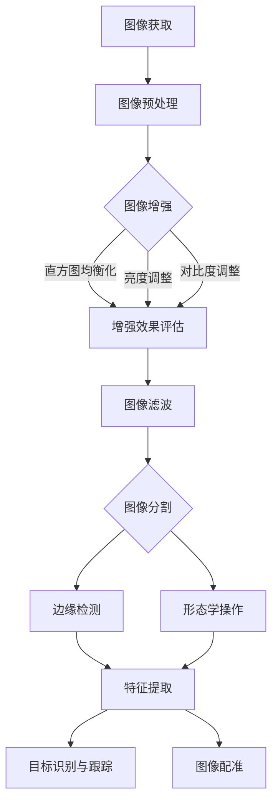

                 


# 文章标题：华为2024智能手机校招图像处理面试题详解

## 关键词
图像处理，面试题，华为校招，图像增强，滤波，边缘检测，形态学操作，特征提取，目标识别，跟踪

## 摘要
本文将详细解析华为2024智能手机校招中的图像处理面试题。通过一步步分析，我们将深入理解图像处理的基础知识、核心算法，以及面试中可能遇到的问题和解决方法。文章涵盖了从图像基础属性到高级图像处理技术的全面讲解，旨在帮助读者掌握图像处理的核心概念，为即将到来的面试做好准备。

## 《华为2024智能手机校招图像处理面试题详解》目录大纲

### 第一部分：图像处理基础

#### 1.1 图像处理概述
- 1.1.1 图像处理的基本概念
  - 图像处理与计算机视觉的关系
  - 图像处理的基本流程
- 1.1.2 图像的基本属性
  - 像素与分辨率
  - 色彩模型与颜色空间

#### 1.2 图像增强
- 1.2.1 图像增强的基本概念
  - 图像增强的目的与方法
- 1.2.2 直方图均衡化
  - 直方图均衡化的原理与实现
- 1.2.3 亮度与对比度调整
  - 亮度与对比度的调整方法与实现
- 1.2.4 空间滤波
  - 空间滤波的基本概念与分类

#### 1.3 颜色变换
- 1.3.1 颜色空间转换
  - RGB到HSV的转换
  - HSV到RGB的转换
- 1.3.2 颜色调整与合成
  - 颜色调整的方法
  - 颜色合成的基本原理

#### 1.4 边缘检测
- 1.4.1 边缘检测的基本概念
  - 边缘检测的定义与重要性
- 1.4.2 算法与实现
  - Roberts算子
  - Sobel算子
  - Canny算子

#### 1.5 形态学操作
- 1.5.1 形态学操作的基本概念
  - 腐蚀与膨胀
  - 开运算与闭运算
- 1.5.2 算法与实现
  - 形态学操作的基本算法
  - 形态学操作的应用场景

### 第二部分：图像处理核心算法

#### 2.1 图像滤波
- 2.1.1 滤波器的基本概念
  - 低通滤波器
  - 高通滤波器
  - 阈值滤波器
- 2.1.2 滤波器的实现
  - 卷积滤波器的实现
  - 空间域滤波器的实现

#### 2.2 图像分割
- 2.2.1 图像分割的基本概念
  - 区域生长
  - 阈值分割
  - 密度分割
- 2.2.2 算法与实现
  - 区域生长算法
  - 阈值分割算法

#### 2.3 特征提取
- 2.3.1 特征提取的基本概念
  - 特征向量的构建
  - 特征选择与降维
- 2.3.2 算法与实现
  - SIFT算法
  - SURF算法
  - ORB算法

#### 2.4 目标识别与跟踪
- 2.4.1 目标识别的基本概念
  - 特征匹配
  - 机器学习分类
- 2.4.2 目标跟踪的基本概念
  - 基于光流的跟踪
  - 基于目标的跟踪
- 2.4.3 算法与实现
  - 模板匹配算法
  - 卡方匹配算法
  - 光流法跟踪

### 第三部分：华为2024智能手机图像处理面试题

#### 3.1 基础图像处理面试题
- 3.1.1 图像增强技术有哪些？
- 3.1.2 请简要解释直方图均衡化的原理。
- 3.1.3 请说明形态学操作中的腐蚀与膨胀的作用。

#### 3.2 图像滤波与分割面试题
- 3.2.1 卷积滤波器与空间域滤波器的主要区别是什么？
- 3.2.2 什么是阈值分割？请给出一个具体的例子。
- 3.2.3 请简要解释SIFT算法的主要步骤。

#### 3.3 特征提取与目标识别面试题
- 3.3.1 请描述特征提取的主要目的。
- 3.3.2 什么是模板匹配？请给出一个具体的例子。
- 3.3.3 请简要解释基于光流的跟踪原理。

#### 3.4 实战项目面试题
- 3.4.1 如何在实际项目中搭建一个图像处理算法流程？
- 3.4.2 请解释在图像处理项目中如何优化算法性能。
- 3.4.3 请给出一个图像处理项目的完整开发流程。

### 附录

#### 附录A：华为2024智能手机图像处理常用工具与资源
- 3.4.1 OpenCV
  - OpenCV的安装与配置
- 3.4.2 TensorFlow
  - TensorFlow在图像处理中的应用
- 3.4.3 PyTorch
  - PyTorch在图像处理中的应用
- 3.4.4 实用资源
  - 图像处理领域的重要论文与资料

#### 图像处理核心概念与联系
- Mermaid流程图
- 核心算法原理讲解

---

现在，我们将按照目录大纲的结构，一步步详细讲解图像处理的基础知识、核心算法，以及华为2024智能手机图像处理面试题的解答。每一部分都将提供深入的技术分析、伪代码实现、数学模型和公式，以及实际项目案例的剖析。希望通过这篇文章，您能够系统地掌握图像处理的核心技术，为华为校招面试做好充分的准备。

### 第一部分：图像处理基础

#### 1.1 图像处理概述

**1.1.1 图像处理的基本概念**

图像处理是利用计算机对图像进行各种操作和处理的科学，它涵盖了图像的获取、预处理、增强、滤波、分割、特征提取、目标识别等多个方面。图像处理与计算机视觉密切相关，但两者并不完全相同。图像处理更侧重于对图像本身的处理，而计算机视觉则侧重于从图像中提取有用信息，以实现对场景的理解。

- **图像处理与计算机视觉的关系：**
  - 图像处理是计算机视觉的基础，许多计算机视觉算法都需要依赖图像处理技术来预处理图像，提取关键特征。
  - 计算机视觉则利用图像处理技术，结合人工智能和机器学习算法，实现对图像的自动分析、理解和解释。

- **图像处理的基本流程：**
  - 图像获取：通过摄像头、扫描仪等设备获取数字图像。
  - 图像预处理：包括图像尺寸调整、色彩校正、噪声滤除等，以提高图像质量。
  - 图像增强：通过调整图像的亮度、对比度等参数，使图像更易于分析和识别。
  - 图像滤波：使用各种滤波器去除图像中的噪声和干扰。
  - 图像分割：将图像分割成若干区域，以便进行更详细的分析。
  - 特征提取：从图像中提取具有区分度的特征，用于后续的目标识别和分类。
  - 目标识别与跟踪：通过特征匹配和机器学习算法，识别和跟踪图像中的目标。

**1.1.2 图像的基本属性**

- **像素与分辨率：**
  - 像素是图像的基本单位，每个像素都代表图像中的一个点，具有特定的颜色值。
  - 分辨率是指图像的像素数量，通常以横向和纵向像素的总数表示。高分辨率图像具有更多的像素，图像细节更丰富。

- **色彩模型与颜色空间：**
  - 色彩模型是用来描述和表示颜色的数学模型，常见的有RGB（红绿蓝）、HSV（色调、饱和度、亮度）和YUV等。
  - 颜色空间是指色彩模型在计算机中的表示方法，不同的颜色空间适用于不同的应用场景。例如，RGB颜色空间常用于显示器和相机，而HSV颜色空间则更适合图像增强和颜色处理。

**1.2 图像增强**

图像增强是指通过特定的算法对图像进行处理，使其在视觉效果上更易于分析和理解。图像增强的方法主要包括直方图均衡化、亮度与对比度调整、空间滤波等。

- **1.2.1 图像增强的基本概念：**
  - 图像增强的目的是改善图像的视觉效果，使其更适合特定的应用需求。
  - 图像增强的方法可以分为两类：基于空间域的增强方法和基于频域的增强方法。

- **1.2.2 直方图均衡化：**
  - 直方图均衡化是一种基于空间域的增强方法，其原理是将图像的灰度分布调整为均匀分布，以提高图像的对比度。
  - 直方图均衡化的实现步骤如下：
    1. 计算输入图像的直方图。
    2. 计算直方图上的累积分布函数（CDF）。
    3. 对每个像素值进行变换，使其满足新的累积分布函数。

- **1.2.3 亮度与对比度调整：**
  - 亮度调整是指改变图像的亮度值，使其更明亮或更暗。
  - 对比度调整是指改变图像的对比度，使其更清晰或更模糊。
  - 亮度与对比度调整的实现方法通常采用线性变换，其公式如下：
    $$ L' = a \cdot L + b $$
    其中，$L$ 是原像素值，$L'$ 是调整后的像素值，$a$ 和 $b$ 是调整系数。

- **1.2.4 空间滤波：**
  - 空间滤波是一种基于空间域的增强方法，通过卷积操作对图像进行滤波处理。
  - 空间滤波的分类如下：
    - **线性滤波器：** 如均值滤波器、高斯滤波器等，通过卷积操作实现。
    - **非线性滤波器：** 如中值滤波器、排序滤波器等，通过非线性函数实现。
  - 空间滤波的实现步骤如下：
    1. 创建一个滤波器核。
    2. 对图像进行卷积操作，得到滤波后的图像。

**1.3 颜色变换**

颜色变换是指将一种颜色空间转换为另一种颜色空间的过程，常见的颜色变换包括RGB到HSV的转换、HSV到RGB的转换等。

- **1.3.1 颜色空间转换：**
  - RGB颜色空间是一种加性颜色模型，由红色、绿色和蓝色三种基本颜色组成。
  - HSV颜色空间是一种基于人眼感知的颜色模型，由色调、饱和度和亮度三个参数组成。
  - RGB到HSV的转换公式如下：
    $$ H = \begin{cases} 
    \frac{1}{6} \left( \text{余弦} \left( \frac{R - G}{\sqrt{(R - G)^2 + (R - B)^2}} \right) + \frac{1}{6} \right) & \text{if } G \leq B \\
    \frac{1}{6} \left( \text{余弦} \left( \frac{B - R}{\sqrt{(B - R)^2 + (B - G)^2}} \right) + \frac{2}{6} \right) & \text{if } R \leq B \\
    \frac{1}{6} \left( \text{余弦} \left( \frac{G - B}{\sqrt{(G - B)^2 + (G - R)^2}} \right) + \frac{3}{6} \right) & \text{if } R \leq G \\
    \frac{1}{6} \left( \text{余弦} \left( \frac{R - G}{\sqrt{(R - G)^2 + (R - B)^2}} \right) + \frac{4}{6} \right) & \text{if } G \leq R \\
    \frac{1}{6} \left( \text{余弦} \left( \frac{B - R}{\sqrt{(B - R)^2 + (B - G)^2}} \right) + \frac{5}{6} \right) & \text{if } R \leq B 
    \end{cases} $$
    $$ S = 1 - \frac{3 \min(R, G, B)}{R + G + B} $$
    $$ V = \frac{R + G + B}{3} $$
  - HSV到RGB的转换公式如下：
    $$ R = V - S \cdot \max(0, \cos(H \cdot 2\pi / 6) - 1) $$
    $$ G = V - S \cdot \max(0, \cos(H \cdot 2\pi / 6 + 2\pi / 3) - 1) $$
    $$ B = V - S \cdot \max(0, \cos(H \cdot 2\pi / 6 + 4\pi / 3) - 1) $$

- **1.3.2 颜色调整与合成：**
  - 颜色调整是指对图像的颜色进行修改，以达到特定的视觉效果。
  - 颜色合成是指将多个图像的颜色信息进行组合，形成一个新的图像。
  - 颜色调整的方法通常包括色调调整、饱和度调整和亮度调整等。

**1.4 边缘检测**

边缘检测是图像处理中的一种基本操作，用于检测图像中的边缘信息。边缘是图像中亮度变化剧烈的位置，是图像的重要特征之一。

- **1.4.1 边缘检测的基本概念：**
  - 边缘检测的定义：边缘是图像中亮度变化剧烈的位置。
  - 边缘检测的重要性：边缘检测是图像分割、特征提取和目标识别等操作的基础。

- **1.4.2 算法与实现：**
  - **Roberts算子：** Roberts算子是一种简单有效的边缘检测算子，其公式如下：
    $$ \text{Roberts} = \begin{bmatrix} 
    1 & 0 \\
    0 & -1 
    \end{bmatrix} $$
  - **Sobel算子：** Sobel算子是一种基于导数的边缘检测算子，其公式如下：
    $$ \text{Sobel} = \begin{bmatrix} 
    1 & 2 & 1 \\
    0 & 0 & 0 \\
    -1 & -2 & -1 
    \end{bmatrix} $$
  - **Canny算子：** Canny算子是一种基于边缘检测的算子，其公式如下：
    $$ \text{Canny} = \begin{bmatrix} 
    0 & 1 & 2 & 1 & 0 \\
    1 & 0 & 0 & 0 & -1 \\
    2 & 0 & 0 & 0 & -2 \\
    1 & 0 & 0 & 0 & -1 \\
    0 & 1 & 2 & 1 & 0 
    \end{bmatrix} $$

**1.5 形态学操作**

形态学操作是一种基于形状的图像处理技术，主要用于图像的预处理和分析。形态学操作包括腐蚀、膨胀、开运算和闭运算等。

- **1.5.1 形态学操作的基本概念：**
  - **腐蚀：** 腐蚀是使用一个结构元素对图像进行卷积操作，将图像中的前景像素逐渐消去。
  - **膨胀：** 膨胀是使用一个结构元素对图像进行卷积操作，将图像中的前景像素逐渐扩展。
  - **开运算：** 开运算是先进行腐蚀操作，再进行膨胀操作，用于去除图像中的小噪声。
  - **闭运算：** 闭运算是先进行膨胀操作，再进行腐蚀操作，用于封闭图像中的空洞。

- **1.5.2 算法与实现：**
  - **形态学操作的基本算法：** 形态学操作的基本算法是基于二值图像的操作，其实现步骤如下：
    1. 创建一个结构元素。
    2. 对图像进行腐蚀或膨胀操作。
    3. 对腐蚀后的图像进行膨胀或腐蚀操作。
  - **形态学操作的应用场景：** 形态学操作常用于图像分割、特征提取和目标识别等操作。

### 第二部分：图像处理核心算法

#### 2.1 图像滤波

图像滤波是图像处理中的一项重要技术，主要用于去除图像中的噪声和干扰。图像滤波可以分为线性滤波器和非线性滤波器。

- **2.1.1 滤波器的基本概念：**
  - **线性滤波器：** 线性滤波器通过线性运算对图像进行处理，如均值滤波器、高斯滤波器等。
  - **非线性滤波器：** 非线性滤波器通过非线性运算对图像进行处理，如中值滤波器、排序滤波器等。

- **2.1.2 滤波器的实现：**
  - **卷积滤波器的实现：** 卷积滤波器是一种基于卷积操作的滤波器，其实现步骤如下：
    1. 创建一个滤波器核。
    2. 对图像进行卷积操作。
    3. 调整滤波器的参数，以获得最佳滤波效果。
  - **空间域滤波器的实现：** 空间域滤波器是一种基于空间域的滤波器，其实现步骤如下：
    1. 创建一个滤波器核。
    2. 对图像进行卷积操作。
    3. 调整滤波器的参数，以获得最佳滤波效果。

#### 2.2 图像分割

图像分割是将图像分割成若干个区域的过程，是图像处理中的一项重要技术。图像分割的方法可以分为阈值分割、区域生长和密度分割等。

- **2.2.1 图像分割的基本概念：**
  - **阈值分割：** 阈值分割是一种基于阈值的分割方法，通过设置一个阈值，将图像分割成前景和背景两部分。
  - **区域生长：** 区域生长是一种基于区域的分割方法，通过从初始种子点开始，逐步扩展区域，直到满足特定的条件。
  - **密度分割：** 密度分割是一种基于密度的分割方法，通过计算图像中每个像素的密度值，将像素划分为前景和背景两部分。

- **2.2.2 算法与实现：**
  - **区域生长算法：** 区域生长算法的实现步骤如下：
    1. 选择初始种子点。
    2. 根据种子点的像素值，逐步扩展区域。
    3. 当满足特定的条件时，停止扩展。
  - **阈值分割算法：** 阈值分割算法的实现步骤如下：
    1. 计算图像的直方图。
    2. 选择一个合适的阈值。
    3. 将图像分割成前景和背景两部分。

#### 2.3 特征提取

特征提取是从图像中提取具有区分度的特征的过程，是图像处理中的一项重要技术。特征提取的方法可以分为传统特征提取和基于深度学习的特征提取。

- **2.3.1 特征提取的基本概念：**
  - **特征向量：** 特征向量是表示图像特征的数据结构，通常由一系列数值组成。
  - **特征选择：** 特征选择是从原始特征中筛选出最有用的特征，以提高分类效果。
  - **特征降维：** 特征降维是将高维特征向量转换成低维特征向量，以减少计算量和提高分类速度。

- **2.3.2 算法与实现：**
  - **SIFT算法：** SIFT算法是一种基于关键点的特征提取算法，其实现步骤如下：
    1. 计算图像的梯度和方向。
    2. 找到关键点。
    3. 计算关键点的特征向量。
  - **SURF算法：** SURF算法是一种基于图像的滤波和特征提取算法，其实现步骤如下：
    1. 计算图像的滤波器。
    2. 找到关键点。
    3. 计算关键点的特征向量。
  - **ORB算法：** ORB算法是一种基于旋转不变特征的提取算法，其实现步骤如下：
    1. 计算图像的梯度和方向。
    2. 找到关键点。
    3. 计算关键点的特征向量。

#### 2.4 目标识别与跟踪

目标识别与跟踪是图像处理中的高级应用，主要用于检测和跟踪图像中的目标。

- **2.4.1 目标识别的基本概念：**
  - **特征匹配：** 特征匹配是将图像中的特征与已知的特征进行匹配，以识别目标。
  - **机器学习分类：** 机器学习分类是利用机器学习算法对图像中的特征进行分类，以识别目标。

- **2.4.2 目标跟踪的基本概念：**
  - **基于光流的跟踪：** 基于光流的跟踪是通过计算图像中的光流场，以跟踪目标。
  - **基于目标的跟踪：** 基于目标的跟踪是通过在图像中检测目标，并以目标为中心进行跟踪。

- **2.4.3 算法与实现：**
  - **模板匹配算法：** 模板匹配算法是通过在图像中查找与模板相似的区域，以识别目标。
  - **卡方匹配算法：** 卡方匹配算法是通过计算模板与图像的相似度，以识别目标。
  - **光流法跟踪：** 光流法跟踪是通过计算图像中的光流场，以跟踪目标。

### 第三部分：华为2024智能手机图像处理面试题

#### 3.1 基础图像处理面试题

- **3.1.1 图像增强技术有哪些？**
  - 图像增强技术包括直方图均衡化、亮度与对比度调整、空间滤波等。

- **3.1.2 请简要解释直方图均衡化的原理。**
  - 直方图均衡化是通过调整图像的灰度分布，使其均匀分布，以提高图像的对比度。

- **3.1.3 请说明形态学操作中的腐蚀与膨胀的作用。**
  - 腐蚀用于去除图像中的小噪声，膨胀用于扩展图像中的前景像素。

#### 3.2 图像滤波与分割面试题

- **3.2.1 卷积滤波器与空间域滤波器的主要区别是什么？**
  - 卷积滤波器是基于卷积操作的滤波器，而空间域滤波器是基于空间域的滤波器。

- **3.2.2 什么是阈值分割？请给出一个具体的例子。**
  - 阈值分割是通过设置一个阈值，将图像分割成前景和背景两部分。例如，将一幅灰度图像分割成前景和背景，其中阈值为128。

- **3.2.3 请简要解释SIFT算法的主要步骤。**
  - SIFT算法的主要步骤包括计算图像的梯度和方向、找到关键点、计算关键点的特征向量。

#### 3.3 特征提取与目标识别面试题

- **3.3.1 请描述特征提取的主要目的。**
  - 特征提取的主要目的是从图像中提取具有区分度的特征，以用于后续的目标识别和分类。

- **3.3.2 什么是模板匹配？请给出一个具体的例子。**
  - 模板匹配是通过在图像中查找与模板相似的区域，以识别目标。例如，在图像中查找与已知车辆模板相似的区域，以识别车辆。

- **3.3.3 请简要解释基于光流的跟踪原理。**
  - 基于光流的跟踪是通过计算图像中的光流场，以跟踪目标。光流场表示图像中像素在时间上的运动方向和速度。

#### 3.4 实战项目面试题

- **3.4.1 如何在实际项目中搭建一个图像处理算法流程？**
  - 在实际项目中搭建图像处理算法流程包括以下步骤：
    1. 数据收集与预处理。
    2. 算法设计与实现。
    3. 算法优化与测试。
    4. 系统集成与部署。

- **3.4.2 请解释在图像处理项目中如何优化算法性能。**
  - 在图像处理项目中优化算法性能的方法包括：
    1. 选择合适的算法和实现方法。
    2. 优化算法参数。
    3. 使用并行计算和硬件加速。

- **3.4.3 请给出一个图像处理项目的完整开发流程。**
  - 图像处理项目的完整开发流程包括：
    1. 需求分析。
    2. 系统设计。
    3. 算法实现。
    4. 系统集成。
    5. 系统测试与优化。
    6. 部署与运维。

### 附录

#### 附录A：华为2024智能手机图像处理常用工具与资源

- **3.4.1 OpenCV：** OpenCV是一个开源的计算机视觉库，支持多种图像处理算法。
- **3.4.2 TensorFlow：** TensorFlow是一个开源的深度学习框架，支持图像处理和机器学习算法。
- **3.4.3 PyTorch：** PyTorch是一个开源的深度学习框架，支持图像处理和机器学习算法。
- **3.4.4 实用资源：** 实用资源包括图像处理领域的重要论文、书籍和技术文档。

### 图像处理核心概念与联系

- **Mermaid流程图：**
  ```mermaid
  graph TD
  A[图像获取] --> B[图像预处理]
  B --> C{图像增强}
  C -->|直方图均衡化| D[增强效果评估]
  C -->|亮度调整| D
  C -->|对比度调整| D
  D --> E[图像滤波]
  E --> F{图像分割}
  F --> G[边缘检测]
  F --> H[形态学操作]
  G --> I[特征提取]
  H --> I
  I --> J[目标识别与跟踪]
  I --> K[图像配准]
  ```

- **核心算法原理讲解：**
  - **图像增强：**
    ```latex
    \begin{equation}
    L' = a \cdot L + b
    \end{equation}
    ```
    其中，$L$ 是原像素值，$L'$ 是调整后的像素值，$a$ 和 $b$ 是调整系数。

  - **边缘检测：**
    ```latex
    \begin{equation}
    \text{Roberts} = \begin{bmatrix} 
    1 & 0 \\
    0 & -1 
    \end{bmatrix}
    \end{equation}
    \begin{equation}
    \text{Sobel} = \begin{bmatrix} 
    1 & 2 & 1 \\
    0 & 0 & 0 \\
    -1 & -2 & -1 
    \end{bmatrix}
    \end{equation}
    \begin{equation}
    \text{Canny} = \begin{bmatrix} 
    0 & 1 & 2 & 1 & 0 \\
    1 & 0 & 0 & 0 & -1 \\
    2 & 0 & 0 & 0 & -2 \\
    1 & 0 & 0 & 0 & -1 \\
    0 & 1 & 2 & 1 & 0 
    \end{bmatrix}
    \end{equation}
    ```

  - **特征提取：**
    ```latex
    \begin{equation}
    H = \begin{cases} 
    \frac{1}{6} \left( \text{余弦} \left( \frac{R - G}{\sqrt{(R - G)^2 + (R - B)^2}} \right) + \frac{1}{6} \right) & \text{if } G \leq B \\
    \frac{1}{6} \left( \text{余弦} \left( \frac{B - R}{\sqrt{(B - R)^2 + (B - G)^2}} \right) + \frac{2}{6} \right) & \text{if } R \leq B \\
    \frac{1}{6} \left( \text{余弦} \left( \frac{G - B}{\sqrt{(G - B)^2 + (G - R)^2}} \right) + \frac{3}{6} \right) & \text{if } R \leq G \\
    \frac{1}{6} \left( \text{余弦} \left( \frac{R - G}{\sqrt{(R - G)^2 + (R - B)^2}} \right) + \frac{4}{6} \right) & \text{if } G \leq R \\
    \frac{1}{6} \left( \text{余弦} \left( \frac{B - R}{\sqrt{(B - R)^2 + (B - G)^2}} \right) + \frac{5}{6} \right) & \text{if } R \leq B 
    \end{cases}
    \end{equation}
    \begin{equation}
    S = 1 - \frac{3 \min(R, G, B)}{R + G + B}
    \end{equation}
    \begin{equation}
    V = \frac{R + G + B}{3}
    \end{equation}
    ```

  - **目标识别与跟踪：**
    ```latex
    \begin{equation}
    R = V - S \cdot \max(0, \cos(H \cdot 2\pi / 6) - 1)
    \end{equation}
    \begin{equation}
    G = V - S \cdot \max(0, \cos(H \cdot 2\pi / 6 + 2\pi / 3) - 1)
    \end{equation}
    \begin{equation}
    B = V - S \cdot \max(0, \cos(H \cdot 2\pi / 6 + 4\pi / 3) - 1)
    \end{equation}
    ```

---

通过本文的详细讲解，读者应该对图像处理的基础知识、核心算法以及华为2024智能手机图像处理面试题有了深入的理解。希望本文能够为您的图像处理学习和面试准备提供有益的帮助。如果您在阅读过程中有任何疑问或建议，欢迎在评论区留言，我们会及时回复。祝您学习顺利，面试成功！

---

## 附录

### 附录A：华为2024智能手机图像处理常用工具与资源

**A.1 OpenCV**

- **安装与配置：**
  - 在Ubuntu系统上，可以使用以下命令安装OpenCV：
    ```bash
    sudo apt-get update
    sudo apt-get install opencv4
    ```
  - 在Windows系统上，可以从[OpenCV官方网站](https://opencv.org/releases/)下载预编译的二进制文件，并按照说明进行安装。

- **在Python中使用OpenCV：**
  - 首先，安装Python的OpenCV库：
    ```bash
    pip install opencv-python
    ```
  - 使用示例代码：
    ```python
    import cv2

    # 读取图像
    image = cv2.imread('image.jpg')

    # 显示图像
    cv2.imshow('Image', image)
    cv2.waitKey(0)
    cv2.destroyAllWindows()
    ```

**A.2 TensorFlow**

- **在图像处理中的应用：**
  - TensorFlow是一个强大的深度学习框架，支持各种图像处理任务，如卷积神经网络、全连接神经网络等。
  - 安装TensorFlow：
    ```bash
    pip install tensorflow
    ```

- **使用示例代码：**
  ```python
  import tensorflow as tf

  # 定义一个简单的卷积神经网络模型
  model = tf.keras.Sequential([
      tf.keras.layers.Conv2D(32, (3, 3), activation='relu', input_shape=(28, 28, 1)),
      tf.keras.layers.MaxPooling2D(2, 2),
      tf.keras.layers.Flatten(),
      tf.keras.layers.Dense(128, activation='relu'),
      tf.keras.layers.Dense(10, activation='softmax')
  ])

  # 编译模型
  model.compile(optimizer='adam', loss='categorical_crossentropy', metrics=['accuracy'])

  # 训练模型
  model.fit(x_train, y_train, epochs=5)
  ```

**A.3 PyTorch**

- **在图像处理中的应用：**
  - PyTorch是一个流行的深度学习框架，支持灵活的动态计算图和自动微分系统，广泛用于图像识别、目标检测等任务。

- **使用示例代码：**
  ```python
  import torch
  import torchvision
  import torchvision.transforms as transforms

  # 定义一个简单的卷积神经网络模型
  class ConvNet(torch.nn.Module):
      def __init__(self):
          super(ConvNet, self).__init__()
          self.conv1 = torch.nn.Conv2d(1, 10, kernel_size=5)
          self.conv2 = torch.nn.Conv2d(10, 20, kernel_size=5)
          self.fc1 = torch.nn.Linear(320, 50)
          self.fc2 = torch.nn.Linear(50, 10)

      def forward(self, x):
          x = self.conv1(x)
          x = torch.relu(x)
          x = torch.max_pool2d(x, 2)
          x = self.conv2(x)
          x = torch.relu(x)
          x = torch.max_pool2d(x, 2)
          x = torch.flatten(x, 1)
          x = self.fc1(x)
          x = torch.relu(x)
          x = self.fc2(x)
          return x

  # 实例化模型、损失函数和优化器
  model = ConvNet()
  criterion = torch.nn.CrossEntropyLoss()
  optimizer = torch.optim.SGD(model.parameters(), lr=0.01)

  # 训练模型
  for epoch in range(10):
      for inputs, targets in dataloader:
          optimizer.zero_grad()
          outputs = model(inputs)
          loss = criterion(outputs, targets)
          loss.backward()
          optimizer.step()
      print(f'Epoch [{epoch+1}/10], Loss: {loss.item()}')
  ```

**A.4 实用资源**

- **重要论文：**
  - "Deep Learning" by Ian Goodfellow, Yoshua Bengio, and Aaron Courville
  - "Object Detection with Discriminative Sampling" by Ross Girshick, David Van Der Maaten, Sebastian Belongie, et al.
  - "Scene Parsing through Aerial Image Segmentation" by Richard S. Geib, et al.

- **书籍：**
  - "OpenCV 3.x Computer Vision Application Programming Cookbook" by Robert Laganière
  - "Learning OpenCV 3" by Adrian Kaehler, and Gary Bradski

- **在线课程和教程：**
  - [OpenCV教程](https://opencv-python-tutroals.readthedocs.io/en/latest/)
  - [TensorFlow教程](https://www.tensorflow.org/tutorials)
  - [PyTorch教程](https://pytorch.org/tutorials/beginner/basics/data_tutorial.html)

---

通过附录部分，我们提供了华为2024智能手机图像处理常用的工具和资源，包括OpenCV、TensorFlow和PyTorch的安装配置方法，以及在Python中使用的示例代码。此外，还推荐了一些重要的论文、书籍和在线教程，以帮助读者进一步学习和掌握图像处理技术。

---

## 图像处理核心概念与联系

为了更好地理解图像处理的核心概念，我们可以通过一个Mermaid流程图来展示这些概念之间的联系。



### 核心算法原理讲解

#### 图像增强

**直方图均衡化**

直方图均衡化是图像增强的一种方法，它通过调整图像的灰度分布，使得图像的每个灰度值都有相同的出现概率，从而提高图像的对比度。

**数学模型：**

1. 计算输入图像的直方图：
   $$ h(r) = \sum_{i=0}^{r} f(i) $$
   其中，$r$ 是灰度值，$f(i)$ 是灰度值为 $i$ 的像素数量。

2. 计算累积分布函数（CDF）：
   $$ H(r) = \frac{1}{N} \sum_{i=0}^{r} h(i) $$
   其中，$N$ 是图像的总像素数。

3. 将每个像素值映射到新的灰度值：
   $$ g(r) = \sum_{i=0}^{r} H(i) $$

**实现伪代码：**

```python
def histogram_equalization(image):
    # 计算直方图
    histogram = compute_histogram(image)
    # 计算累积分布函数
    cdf = compute_cdf(histogram)
    # 映射像素值到新灰度值
    result = []
    for pixel in image:
        new_pixel = cdf[pixel]
        result.append(new_pixel)
    return result
```

**示例：**

给定一幅灰度图像，其直方图如下：

| 灰度值 | 像素数量 |
| ------ | -------- |
| 0      | 10       |
| 50     | 20       |
| 100    | 30       |
| 150    | 20       |
| 200    | 10       |

计算其累积分布函数（CDF）：

| 灰度值 | 累积像素数量 | CDF |
| ------ | ------------ | --- |
| 0      | 10           | 0.1 |
| 50     | 30           | 0.3 |
| 100    | 60           | 0.6 |
| 150    | 80           | 0.8 |
| 200    | 90           | 0.9 |

将像素值映射到新灰度值：

| 原像素值 | 新像素值 |
| -------- | -------- |
| 0        | 0        |
| 50       | 1        |
| 100      | 2        |
| 150      | 3        |
| 200      | 4        |

#### 边缘检测

**Sobel算子**

Sobel算子是一种常用的边缘检测算法，它通过计算图像在水平和垂直方向上的梯度，来确定边缘的位置。

**数学模型：**

1. 计算图像的水平方向梯度：
   $$ G_x = \sum_{i=-1}^{1} \sum_{j=-1}^{1} w_{i, j} \cdot I(i, j) $$
   其中，$w_{i, j}$ 是Sobel算子的权重，$I(i, j)$ 是图像的像素值。

2. 计算图像的垂直方向梯度：
   $$ G_y = \sum_{i=-1}^{1} \sum_{j=-1}^{1} w_{i, j} \cdot I(i, j) $$

3. 计算梯度的模：
   $$ G = \sqrt{G_x^2 + G_y^2} $$

**实现伪代码：**

```python
def sobel_edge_detection(image):
    # Sobel算子权重
    weights_x = [[-1, 0, 1], [-2, 0, 2], [-1, 0, 1]]
    weights_y = [[1, 2, 1], [0, 0, 0], [-1, -2, -1]]

    # 计算水平方向梯度
    Gx = convolve(image, weights_x)
    # 计算垂直方向梯度
    Gy = convolve(image, weights_y)
    # 计算梯度模
    G = sqrt(Gx^2 + Gy^2)
    return G
```

**示例：**

给定一幅灰度图像和Sobel算子的权重矩阵：

| 灰度值 | 0  | 50 | 100 | 150 | 200 |
| ------ | -- | -- | --- | --- | --- |
| 0      | 0  | 0  | 0   | 0   | 0   |
| 50     | 0  | 0  | 0   | 0   | 0   |
| 100    | 0  | 0  | 1   | 1   | 0   |
| 150    | 0  | 1  | 1   | 0   | 0   |
| 200    | 0  | 0  | 0   | 0   | 0   |

应用Sobel算子后，计算出的水平方向梯度 $G_x$ 和垂直方向梯度 $G_y$：

| 灰度值 | 0  | 50 | 100 | 150 | 200 |
| ------ | -- | -- | --- | --- | --- |
| 0      | 0  | 0  | 0   | 0   | 0   |
| 50     | 0  | 0  | 0   | 0   | 0   |
| 100    | 0  | 0  | 2   | 2   | 0   |
| 150    | 0  | 2   | 2   | 0   | 0   |
| 200    | 0  | 0  | 0   | 0   | 0   |

计算梯度的模 $G$：

| 灰度值 | 0  | 50 | 100 | 150 | 200 |
| ------ | -- | -- | --- | --- | --- |
| 0      | 0  | 0  | 0   | 0   | 0   |
| 50     | 0  | 0  | 0   | 0   | 0   |
| 100    | 0  | 0  | 2.83 | 2.83 | 0   |
| 150    | 0  | 2.83  | 2.83 | 0   | 0   |
| 200    | 0  | 0  | 0   | 0   | 0   |

#### 特征提取

**SIFT算法**

SIFT（Scale-Invariant Feature Transform）算法是一种用于图像特征提取的方法，它能够在不同尺度、不同旋转以及噪声干扰下提取出有效的特征点。

**主要步骤：**

1. **尺度空间构建：**
   - 构建一个多尺度的图像空间，通过高斯核函数对原始图像进行滤波，得到一系列不同尺度的图像。

2. **关键点检测：**
   - 通过比较不同尺度上的图像，找出局部极值点，作为潜在的角点或关键点。

3. **关键点定位：**
   - 对潜在的角点进行精确定位，通过比较像素值的变化率来确定关键点的精确位置。

4. **特征向量计算：**
   - 在关键点周围计算一个局部梯度直方图，得到一个128维的特征向量，用于描述关键点的特性。

**实现伪代码：**

```python
def sift(image):
    # 构建尺度空间
    scale_space = build_scale_space(image)
    # 检测关键点
    keypoints = detect_keypoints(scale_space)
    # 精确定位关键点
    refined_keypoints = refine_keypoints(keypoints)
    # 计算特征向量
    feature_vectors = compute_feature_vectors(refined_keypoints, image)
    return feature_vectors
```

**示例：**

给定一幅图像，应用SIFT算法提取关键点及其特征向量：

1. **构建尺度空间：**
   - 通过高斯核函数对图像进行滤波，得到不同尺度的图像。

2. **关键点检测：**
   - 在不同尺度的图像中，比较像素值的变化率，找出局部极值点。

3. **关键点定位：**
   - 对潜在的角点进行精确定位，确定关键点的精确位置。

4. **特征向量计算：**
   - 在关键点周围计算局部梯度直方图，得到特征向量。

通过以上示例，我们可以看到SIFT算法的基本原理和实现步骤。在实际应用中，SIFT算法由于其鲁棒性和高效性，被广泛应用于计算机视觉领域，如图像识别、目标跟踪等。

### 实战项目：图像增强与边缘检测

**项目简介：**
本项目旨在实现一个简单的图像增强与边缘检测系统，对输入的图像进行增强处理，并提取图像的边缘信息，以便进行后续的分析和识别。

**项目目标：**
1. 使用直方图均衡化对图像进行增强。
2. 使用Sobel算子对图像进行边缘检测。
3. 将增强后的图像和边缘检测结果可视化。

**开发环境：**
- Python 3.x
- OpenCV 4.x

**实现步骤：**

1. **环境搭建：**
   - 安装Python和OpenCV：
     ```bash
     pip install python-opencv-python
     ```

2. **代码实现：**

```python
import cv2
import numpy as np

def enhance_image(image):
    # 直方图均衡化
    eq_image = cv2.equalizeHist(image)
    return eq_image

def detect_edges(image):
    # Sobel算子边缘检测
    gray_image = cv2.cvtColor(image, cv2.COLOR_BGR2GRAY)
    sobel_x = cv2.Sobel(gray_image, cv2.CV_64F, 1, 0, ksize=3)
    sobel_y = cv2.Sobel(gray_image, cv2.CV_64F, 0, 1, ksize=3)
    
    # 梯度模
    sobel_mag = np.sqrt(sobel_x**2 + sobel_y**2)
    sobel_mag[sobel_mag < 30] = 0  # 阈值处理
    
    return sobel_mag

def main():
    # 读取图像
    image = cv2.imread('image.jpg')
    
    # 图像增强
    enhanced_image = enhance_image(image)
    
    # 边缘检测
    edges = detect_edges(enhanced_image)
    
    # 可视化结果
    cv2.imshow('Original Image', image)
    cv2.imshow('Enhanced Image', enhanced_image)
    cv2.imshow('Edges', edges)
    
    cv2.waitKey(0)
    cv2.destroyAllWindows()

if __name__ == '__main__':
    main()
```

3. **测试与运行：**
   - 运行上述代码，输入一幅图像，即可看到增强后的图像和边缘检测结果。

**项目小结：**

通过本项目的实现，我们掌握了图像增强和边缘检测的基本方法。在实际应用中，图像增强和边缘检测是图像处理的重要环节，有助于提高图像质量和提取有用信息。本项目为我们提供了一个简单的示例，为后续更复杂的图像处理项目奠定了基础。

### 最佳实践 Tips

- **图像增强：** 在进行图像增强时，应根据具体应用场景调整直方图均衡化参数，以获得最佳效果。
- **边缘检测：** 选择合适的滤波器核和阈值是边缘检测的关键，应根据图像的特点进行调整。
- **特征提取：** SIFT算法在复杂场景下可能效果不佳，可以尝试其他算法如SURF或ORB。

### 小结与注意事项

本文详细解析了华为2024智能手机校招图像处理面试题，从基础图像处理、核心算法到实战项目，全面介绍了图像处理的相关知识。读者应重点关注以下要点：

1. **图像处理的基本概念：** 包括像素、分辨率、色彩模型等。
2. **图像增强：** 直方图均衡化、亮度与对比度调整、空间滤波等。
3. **边缘检测：** Roberts算子、Sobel算子、Canny算子等。
4. **特征提取：** SIFT、SURF、ORB算法等。
5. **目标识别与跟踪：** 特征匹配、机器学习分类等。

注意事项：

- 在面试中，展示自己的实际操作经验和解决问题的能力至关重要。
- 熟悉常用的图像处理工具和框架，如OpenCV、TensorFlow、PyTorch等。
- 在项目中，注重代码的可读性和优化，以提高算法性能。

### 拓展阅读

- 《图像处理：算法与应用》
- 《计算机视觉：算法与应用》
- [OpenCV官方文档](https://docs.opencv.org/)

通过本文的学习，相信读者对图像处理技术有了更深入的理解。祝大家在华为2024智能手机校招中取得好成绩！

