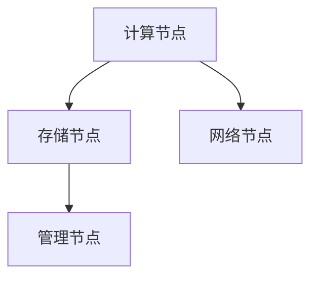
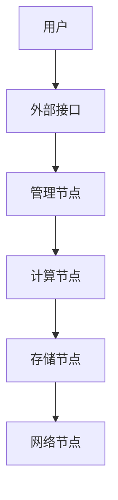

                 

### 文章标题

# 《2024华为云Stack解决方案社招面试真题汇总及其解答》

### 关键词

- 华为云Stack
- 面试真题
- 解决方案
- 社招
- 技术解析

### 摘要

本文旨在为2024年华为云Stack解决方案社招面试的考生提供一份全面、系统的面试真题汇总及其解答。文章首先介绍了华为云Stack的基础知识，包括发展历程、核心特点、架构和技术基础。随后，详细阐述了华为云Stack在云计算和企业中的应用，并通过实际项目案例进行深入分析。最后，本文收集了华为云Stack的常见面试真题，并逐一给出详细解答，帮助考生全面掌握华为云Stack的技术要点和面试技巧。无论您是准备参加华为云Stack面试的求职者，还是希望深入了解该解决方案的技术人员，本文都将为您提供宝贵的参考资料。

## 《2024华为云Stack解决方案社招面试真题汇总及其解答》目录大纲

### 第一部分：华为云Stack基础

#### 第1章：华为云Stack概述
- 1.1 华为云Stack的发展历程
- 1.2 华为云Stack的核心特点
- 1.3 华为云Stack的架构

#### 第2章：华为云Stack技术基础
- 2.1 虚拟化技术
- 2.2 网络虚拟化技术
- 2.3 存储虚拟化技术

#### 第3章：华为云Stack核心组件
- 3.1 虚拟机管理
- 3.2 网络管理
- 3.3 存储管理

#### 第4章：华为云Stack部署与管理
- 4.1 环境搭建
- 4.2 资源分配与调度
- 4.3 安全管理

### 第二部分：华为云Stack应用与实践

#### 第5章：华为云Stack在云计算中的应用
- 5.1 云计算基础服务
- 5.2 云存储服务
- 5.3 云网络服务

#### 第6章：华为云Stack在企业中的应用
- 6.1 企业IT架构转型
- 6.2 企业应用部署与迁移
- 6.3 企业数据安全管理

#### 第7章：华为云Stack项目案例
- 7.1 项目一：某企业云计算平台建设
- 7.2 项目二：某医疗机构数据存储与处理
- 7.3 项目三：某教育机构在线学习平台

### 第三部分：华为云Stack面试真题与解答

#### 第8章：华为云Stack面试真题汇总
- 8.1 基础知识面试题
- 8.2 实践能力面试题
- 8.3 创新思维面试题

#### 第9章：面试真题解答
- 9.1 面试题一：请简要介绍华为云Stack的架构
- 9.2 面试题二：如何确保华为云Stack的安全性？
- 9.3 面试题三：请举例说明华为云Stack在企业中的应用场景。

### 附录

#### 附录A：华为云Stack相关资源
- A.1 常用技术文档
- A.2 开发工具与平台
- A.3 社区与论坛

## 第一部分：华为云Stack基础

### 第1章：华为云Stack概述

#### 1.1 华为云Stack的发展历程

华为云Stack作为华为云的核心产品之一，其发展历程可以追溯到华为公司成立之初。自2008年华为云正式启动以来，华为云Stack经历了多个重要的里程碑。以下是华为云Stack的发展历程：

1. **2008年**：华为云正式上线，提供云基础设施服务。
2. **2013年**：华为发布Cloud Engine虚拟机，开始涉足虚拟化技术领域。
3. **2015年**：华为云Stack 1.0版本发布，标志着华为在云计算领域的进一步布局。
4. **2018年**：华为云Stack 3.0版本发布，引入了容器技术，提升了云平台的灵活性和可扩展性。
5. **2020年**：华为云Stack 4.0版本发布，增加了对人工智能、大数据等前沿技术的支持。

#### 1.2 华为云Stack的核心特点

华为云Stack具有以下核心特点：

1. **高可靠性**：华为云Stack采用分布式架构，具备高可用性和容错性，确保服务的持续稳定运行。
2. **灵活性**：华为云Stack支持多种虚拟化技术，如KVM、Docker等，满足不同场景下的需求。
3. **可扩展性**：华为云Stack具备横向和纵向扩展能力，可根据业务需求灵活调整资源规模。
4. **安全性**：华为云Stack采用多层次安全防护机制，确保数据安全和用户隐私。
5. **智能化**：华为云Stack集成了人工智能技术，实现了自动化运维和智能优化。

#### 1.3 华为云Stack的架构

华为云Stack的架构包括以下几个关键组件：

1. **计算节点**：计算节点是华为云Stack的基本运行单元，负责运行虚拟机和容器等计算任务。
2. **存储节点**：存储节点提供数据存储和共享功能，支持多种存储类型，如块存储、文件存储等。
3. **网络节点**：网络节点负责提供虚拟网络和网络安全功能，支持网络隔离、负载均衡等。
4. **管理节点**：管理节点负责整个云Stack的管理和监控，包括资源调度、故障处理等。

总体架构如下图所示：



## 第2章：华为云Stack技术基础

### 2.1 虚拟化技术

#### 2.1.1 虚拟化基础概念

虚拟化技术是云计算的核心技术之一，它通过虚拟化硬件资源，实现物理资源与逻辑资源的分离，从而提高资源利用率和灵活性。虚拟化技术主要包括以下三个方面：

1. **计算虚拟化**：通过虚拟化技术，将物理计算资源抽象成多个虚拟计算资源，实现多用户共享。
2. **存储虚拟化**：将物理存储资源抽象成虚拟存储资源，实现数据的集中管理和高效利用。
3. **网络虚拟化**：通过虚拟化技术，将物理网络资源抽象成虚拟网络资源，实现网络资源的灵活配置和隔离。

#### 2.1.2 虚拟化技术的分类

虚拟化技术主要分为以下几类：

1. **全虚拟化（Full Virtualization）**：通过虚拟化硬件资源，实现操作系统和应用的无感知运行。全虚拟化具有较高的性能和兼容性，但资源开销较大。
2. **硬件虚拟化（Hardware Virtualization）**：通过虚拟化硬件资源，实现操作系统和应用的无感知运行。硬件虚拟化具有较高的性能和兼容性，但资源开销较大。
3. **操作系统级虚拟化（OS-Level Virtualization）**：通过在操作系统层面实现虚拟化，将一个操作系统实例抽象成多个虚拟实例。操作系统级虚拟化具有较好的性能和灵活性，但兼容性较差。
4. **容器虚拟化（Container Virtualization）**：通过容器技术实现应用的轻量级隔离和部署。容器虚拟化具有快速启动、低资源开销等优点，但兼容性和安全性存在一定挑战。

#### 2.1.3 虚拟化技术的优势与应用场景

虚拟化技术的优势主要体现在以下几个方面：

1. **提高资源利用率**：通过虚拟化技术，可以实现计算资源、存储资源、网络资源的集中管理和高效利用，降低硬件成本。
2. **增强业务灵活性**：虚拟化技术使得业务可以灵活部署和扩展，支持快速响应市场需求。
3. **提升系统可靠性**：虚拟化技术通过分布式架构，实现高可用性和容错性，提高系统可靠性。
4. **降低运维成本**：虚拟化技术简化了系统运维管理，降低了运维成本。

虚拟化技术的应用场景主要包括：

1. **云计算平台**：虚拟化技术是实现云计算平台的核心技术，支持多租户、弹性扩展等特性。
2. **服务器整合**：通过虚拟化技术，可以将多个物理服务器整合成一个大型虚拟化平台，提高资源利用率。
3. **桌面虚拟化**：通过虚拟化技术，实现桌面环境的集中管理和远程访问，降低桌面维护成本。
4. **测试和开发环境**：虚拟化技术为测试和开发环境提供灵活的资源分配和管理方式，提高开发效率。

### 2.2 网络虚拟化技术

#### 2.2.1 网络虚拟化基础概念

网络虚拟化技术是将物理网络资源抽象成虚拟网络资源，实现网络资源的灵活配置和隔离。网络虚拟化主要包括以下几个方面：

1. **虚拟交换机**：虚拟交换机是网络虚拟化的核心组件，用于连接虚拟机、容器等网络设备，实现虚拟网络的管理和配置。
2. **虚拟路由器**：虚拟路由器用于实现虚拟网络之间的路由和转发，提供跨虚拟网络的通信能力。
3. **虚拟防火墙**：虚拟防火墙用于实现虚拟网络的网络安全防护，防止恶意攻击和数据泄露。

#### 2.2.2 网络虚拟化技术分类

网络虚拟化技术主要分为以下几类：

1. **基于VLAN的虚拟化**：通过虚拟局域网（VLAN）实现网络资源的隔离和划分，支持不同虚拟网络之间的通信。
2. **基于VXLAN的虚拟化**：通过虚拟扩展局域网（VXLAN）实现网络资源的灵活配置和扩展，支持跨物理网络的虚拟网络通信。
3. **基于SDN的虚拟化**：通过软件定义网络（SDN）实现网络资源的集中管理和动态调整，提供灵活的网络配置和优化能力。

#### 2.2.3 网络虚拟化技术应用场景

网络虚拟化技术的应用场景主要包括：

1. **多租户云平台**：网络虚拟化技术支持多租户云平台的网络隔离和资源分配，提高云平台的可靠性和安全性。
2. **数据中心网络**：网络虚拟化技术可以简化数据中心网络架构，提高网络资源的利用率和灵活性。
3. **边缘计算**：网络虚拟化技术支持边缘计算场景下的网络灵活配置和优化，提高边缘计算的性能和可靠性。
4. **物联网（IoT）**：网络虚拟化技术可以为物联网设备提供灵活的网络连接和隔离，支持大规模物联网应用的部署和管理。

### 2.3 存储虚拟化技术

#### 2.3.1 存储虚拟化基础概念

存储虚拟化技术是将物理存储资源抽象成虚拟存储资源，实现存储资源的集中管理和高效利用。存储虚拟化主要包括以下几个方面：

1. **虚拟存储层**：虚拟存储层是存储虚拟化的核心组件，负责将物理存储资源抽象成虚拟存储资源，提供统一的存储接口和访问方式。
2. **存储虚拟化管理器**：存储虚拟化管理器负责存储资源的调度和管理，包括存储容量规划、性能优化、数据备份等。
3. **存储虚拟化客户端**：存储虚拟化客户端负责与虚拟存储层进行交互，实现数据存储和访问。

#### 2.3.2 存储虚拟化技术分类

存储虚拟化技术主要分为以下几类：

1. **文件级存储虚拟化**：通过虚拟化技术，将物理文件系统抽象成虚拟文件系统，提供统一的文件存储和访问接口。
2. **块级存储虚拟化**：通过虚拟化技术，将物理块设备抽象成虚拟块设备，提供统一的块存储和访问接口。
3. **对象级存储虚拟化**：通过虚拟化技术，将物理对象存储抽象成虚拟对象存储，提供统一的对象存储和访问接口。

#### 2.3.3 存储虚拟化技术应用场景

存储虚拟化技术的应用场景主要包括：

1. **云计算平台**：存储虚拟化技术支持云计算平台的存储资源管理和优化，提高存储资源的利用率和性能。
2. **数据中心存储**：存储虚拟化技术可以简化数据中心存储架构，提高存储资源的灵活性和扩展性。
3. **大数据分析**：存储虚拟化技术支持大数据分析场景下的数据存储和访问优化，提高数据处理效率。
4. **企业数据存储**：存储虚拟化技术可以为企业提供高效的存储资源管理，降低存储成本，提高数据安全性。

### 第3章：华为云Stack核心组件

#### 3.1 虚拟机管理

虚拟机管理是华为云Stack的核心组件之一，负责虚拟机的创建、配置、监控和管理。虚拟机管理的主要功能包括：

1. **虚拟机创建**：支持从模板、镜像等多种方式创建虚拟机。
2. **虚拟机配置**：支持虚拟机的CPU、内存、硬盘、网络等资源的配置。
3. **虚拟机监控**：实时监控虚拟机的运行状态、性能指标等。
4. **虚拟机管理**：提供虚拟机的启动、停止、重启、迁移、备份等功能。

虚拟机管理的工作流程如下：

1. 用户通过管理界面或API提交虚拟机创建请求。
2. 虚拟机管理模块接收请求，并根据请求参数从模板或镜像创建虚拟机。
3. 虚拟机管理模块配置虚拟机资源，如CPU、内存、硬盘、网络等。
4. 虚拟机管理模块启动虚拟机，并监控其运行状态。
5. 用户可以通过管理界面或API查询虚拟机的状态和性能指标。

#### 3.2 网络管理

网络管理是华为云Stack的核心组件之一，负责虚拟网络的创建、配置、监控和管理。网络管理的主要功能包括：

1. **虚拟网络创建**：支持创建虚拟网络，包括虚拟局域网（VLAN）、虚拟扩展局域网（VXLAN）等。
2. **网络配置**：支持配置虚拟网络的网络参数，如IP地址、子网掩码、网关等。
3. **网络监控**：实时监控虚拟网络的流量、性能等。
4. **网络管理**：提供虚拟网络的启动、停止、重启等功能。

网络管理的工作流程如下：

1. 用户通过管理界面或API提交虚拟网络创建请求。
2. 网络管理模块接收请求，并根据请求参数创建虚拟网络。
3. 网络管理模块配置虚拟网络参数，如IP地址、子网掩码、网关等。
4. 网络管理模块启动虚拟网络，并监控其运行状态。
5. 用户可以通过管理界面或API查询虚拟网络的状态和性能指标。

#### 3.3 存储管理

存储管理是华为云Stack的核心组件之一，负责存储资源的创建、配置、监控和管理。存储管理的主要功能包括：

1. **存储资源创建**：支持创建存储资源，包括块存储、文件存储、对象存储等。
2. **存储配置**：支持配置存储资源的容量、性能、访问权限等。
3. **存储监控**：实时监控存储资源的运行状态、性能指标等。
4. **存储管理**：提供存储资源的启动、停止、备份、恢复等功能。

存储管理的工作流程如下：

1. 用户通过管理界面或API提交存储资源创建请求。
2. 存储管理模块接收请求，并根据请求参数创建存储资源。
3. 存储管理模块配置存储资源参数，如容量、性能、访问权限等。
4. 存储管理模块启动存储资源，并监控其运行状态。
5. 用户可以通过管理界面或API查询存储资源的状态和性能指标。

### 第4章：华为云Stack部署与管理

#### 4.1 环境搭建

环境搭建是华为云Stack部署的第一步，主要包括以下步骤：

1. **硬件准备**：准备符合华为云Stack要求的硬件设备，如服务器、存储设备、网络设备等。
2. **操作系统安装**：在硬件设备上安装支持华为云Stack的操作系统，如Ubuntu、CentOS等。
3. **网络配置**：配置网络设备，确保硬件设备之间能够相互通信。
4. **存储配置**：配置存储设备，确保存储资源能够被华为云Stack识别和使用。

环境搭建的具体步骤如下：

1. **硬件准备**：

- 确定硬件设备的数量和配置要求，如CPU、内存、硬盘等。
- 购买符合要求的硬件设备，并组装服务器。

2. **操作系统安装**：

- 下载支持华为云Stack的操作系统镜像文件。
- 使用U盘或光盘启动服务器，并选择安装操作系统。
- 按照提示完成操作系统安装过程。

3. **网络配置**：

- 配置服务器网络接口，确保服务器能够连接到网络。
- 设置服务器的IP地址、子网掩码、网关等网络参数。
- 测试网络连接，确保服务器能够与其他设备通信。

4. **存储配置**：

- 连接存储设备到服务器，确保存储设备能够被服务器识别。
- 配置存储设备的文件系统，如ext4、xfs等。
- 创建存储目录，设置访问权限。

#### 4.2 资源分配与调度

资源分配与调度是华为云Stack部署和管理的重要环节，主要包括以下步骤：

1. **资源规划**：根据业务需求和资源限制，规划虚拟机、存储、网络等资源的分配。
2. **资源分配**：将规划好的资源分配给虚拟机、存储、网络等组件。
3. **资源监控**：实时监控资源的使用情况，并根据监控数据调整资源分配。

资源分配与调度的具体步骤如下：

1. **资源规划**：

- 确定虚拟机的数量、规格和所需资源，如CPU、内存、硬盘等。
- 确定存储资源的容量、性能和访问权限。
- 确定网络资源的IP地址、子网掩码、网关等。

2. **资源分配**：

- 根据资源规划结果，将虚拟机、存储、网络等资源分配给相应的组件。
- 配置虚拟机、存储、网络等组件，确保其能够正常运行。

3. **资源监控**：

- 监控虚拟机、存储、网络等组件的运行状态，如CPU利用率、内存利用率、存储空间利用率等。
- 根据监控数据，调整资源分配，确保资源的高效利用。

#### 4.3 安全管理

安全管理是华为云Stack部署和管理的重要环节，主要包括以下步骤：

1. **安全策略配置**：配置安全策略，如防火墙规则、访问控制列表等，确保系统的安全性。
2. **安全监控**：实时监控系统的安全事件，如入侵尝试、恶意攻击等。
3. **应急响应**：根据安全事件的情况，采取相应的应急响应措施，如隔离、备份、恢复等。

安全管理的主要策略如下：

1. **防火墙配置**：配置防火墙规则，禁止或允许特定的网络流量，保护系统的安全性。
2. **访问控制**：配置访问控制列表，限制用户对系统和资源的访问权限，防止未经授权的访问。
3. **数据加密**：对存储和传输的数据进行加密，确保数据的安全性。
4. **安全审计**：记录系统的安全事件，如登录、修改、删除等，以便进行安全审计和追踪。

### 第5章：华为云Stack在云计算中的应用

#### 5.1 云计算基础服务

华为云Stack提供了丰富的云计算基础服务，包括计算、存储、网络等，以满足不同业务场景的需求。云计算基础服务的主要特点如下：

1. **弹性扩展**：云计算基础服务支持弹性扩展，可以根据业务需求动态调整资源规模，提高资源利用率。
2. **高效可靠**：云计算基础服务采用分布式架构，具备高可用性和容错性，确保服务的稳定运行。
3. **灵活配置**：云计算基础服务提供灵活的资源配置选项，如CPU、内存、硬盘等，满足不同业务场景的需求。

云计算基础服务的具体内容如下：

1. **计算服务**：计算服务提供虚拟机、容器等计算资源，支持多种操作系统和运行环境。
2. **存储服务**：存储服务提供块存储、文件存储、对象存储等存储资源，支持数据的高效存储和管理。
3. **网络服务**：网络服务提供虚拟网络、负载均衡、安全组等网络资源，支持网络隔离、流量优化等功能。

#### 5.2 云存储服务

云存储服务是云计算的重要组成部分，华为云Stack提供了多种云存储服务，以满足不同业务场景的需求。云存储服务的主要特点如下：

1. **数据安全**：云存储服务采用多副本存储和数据加密技术，确保数据的安全性和可靠性。
2. **高可用性**：云存储服务采用分布式架构，具备高可用性和容错性，确保服务的持续稳定运行。
3. **弹性扩展**：云存储服务支持弹性扩展，可以根据业务需求动态调整存储容量，提高资源利用率。

云存储服务的具体内容如下：

1. **块存储**：块存储提供高性能、高可靠的存储资源，适用于需要大量读写操作的场景，如数据库、日志等。
2. **文件存储**：文件存储提供分布式文件系统，支持海量文件的存储和共享，适用于文件共享、内容分发等场景。
3. **对象存储**：对象存储提供海量、安全、可靠的对象存储服务，适用于大规模数据存储和归档场景，如大数据、视频等。

#### 5.3 云网络服务

云网络服务是云计算的重要组成部分，华为云Stack提供了丰富的云网络服务，以满足不同业务场景的需求。云网络服务的主要特点如下：

1. **网络隔离**：云网络服务提供虚拟网络隔离功能，确保不同业务场景之间的网络独立性和安全性。
2. **弹性扩展**：云网络服务支持弹性扩展，可以根据业务需求动态调整网络规模，提高资源利用率。
3. **流量优化**：云网络服务提供流量优化功能，可以根据网络流量情况动态调整路由策略，提高网络传输效率。

云网络服务的具体内容如下：

1. **虚拟网络**：虚拟网络提供隔离的网络环境，支持不同业务场景之间的网络通信。
2. **负载均衡**：负载均衡提供流量分发和负载均衡功能，确保网络服务的稳定性和可靠性。
3. **安全组**：安全组提供网络访问控制功能，可以根据业务需求配置网络访问策略，提高网络安全性。

### 第6章：华为云Stack在企业中的应用

#### 6.1 企业IT架构转型

随着云计算技术的发展，企业IT架构转型成为必然趋势。华为云Stack为企业提供了全面的云计算解决方案，帮助企业实现IT架构的转型。企业IT架构转型的主要目标如下：

1. **资源整合**：通过云计算技术，实现计算、存储、网络等资源的整合和管理，提高资源利用率。
2. **弹性扩展**：通过云计算技术，实现资源的弹性扩展，满足业务需求的动态变化。
3. **降低成本**：通过云计算技术，降低硬件投资和维护成本，提高业务运营效率。

企业IT架构转型的具体步骤如下：

1. **需求分析**：对企业现有IT架构进行需求分析，确定转型目标和关键业务场景。
2. **云计算规划**：根据需求分析结果，制定云计算规划，包括云计算架构设计、资源配置、网络规划等。
3. **实施部署**：按照云计算规划，实施云计算部署，包括虚拟化技术、存储虚拟化技术、网络虚拟化技术等。
4. **运维管理**：建立云计算运维管理体系，实现云计算资源的监控、管理和优化。

#### 6.2 企业应用部署与迁移

企业应用部署与迁移是企业IT架构转型的关键环节。华为云Stack提供了全面的云计算解决方案，帮助企业实现应用部署与迁移。企业应用部署与迁移的主要步骤如下：

1. **需求分析**：分析企业现有应用系统，确定应用部署与迁移的目标和应用场景。
2. **应用架构设计**：根据需求分析结果，设计应用架构，包括应用部署模式、数据存储、网络通信等。
3. **应用迁移**：将现有应用系统迁移到云计算平台，包括应用部署、数据迁移、测试验证等。
4. **应用优化**：根据业务需求，对迁移后的应用系统进行性能优化、安全性优化等。

企业应用部署与迁移的具体案例如下：

1. **某企业财务系统部署**：某企业财务系统部署在华为云Stack平台上，通过虚拟化技术实现计算资源的弹性扩展，提高系统性能和可靠性。同时，采用云存储服务实现财务数据的高效存储和管理。
2. **某企业人力资源系统迁移**：某企业人力资源系统迁移到华为云Stack平台上，采用容器技术实现系统的轻量化部署，提高系统性能和灵活性。同时，采用云网络服务实现系统的高可用性和安全性。

#### 6.3 企业数据安全管理

企业数据安全管理是企业IT架构转型的重要方面。华为云Stack提供了全面的数据安全管理解决方案，帮助企业确保数据的安全性和隐私性。企业数据安全管理的主要策略如下：

1. **数据加密**：对存储和传输的数据进行加密，确保数据的安全性。
2. **访问控制**：配置访问控制策略，限制用户对数据和系统的访问权限，防止未经授权的访问。
3. **数据备份**：定期对数据进行备份，确保数据的安全性和可恢复性。
4. **安全审计**：记录系统的安全事件，如登录、修改、删除等，以便进行安全审计和追踪。

企业数据安全管理的具体案例如下：

1. **某企业客户数据保护**：某企业客户数据存储在华为云Stack平台上，采用数据加密技术确保数据的安全性。同时，配置访问控制策略，限制对客户数据的访问权限，防止数据泄露。
2. **某企业网络安全监控**：某企业采用华为云Stack提供的网络安全监控服务，实时监控网络流量和安全事件，及时发现和处理安全威胁，确保网络安全。

### 第7章：华为云Stack项目案例

#### 7.1 项目一：某企业云计算平台建设

某企业为了提升业务运营效率，决定建设一个云计算平台。该项目由以下阶段组成：

1. **需求分析**：分析企业现有IT架构，确定云计算平台建设的需求和目标。
2. **方案设计**：根据需求分析结果，设计云计算平台架构，包括虚拟化技术、存储虚拟化技术、网络虚拟化技术等。
3. **实施部署**：按照云计算平台架构，实施云计算平台建设，包括虚拟机部署、存储部署、网络部署等。
4. **运维管理**：建立云计算平台的运维管理体系，实现云计算资源的监控、管理和优化。

项目成果如下：

- 提高了业务系统的性能和可靠性。
- 实现了计算、存储、网络资源的弹性扩展。
- 降低了硬件投资和维护成本。
- 提高了业务系统的可扩展性和灵活性。

#### 7.2 项目二：某医疗机构数据存储与处理

某医疗机构为了提高数据存储和处理效率，决定采用华为云Stack解决方案。该项目由以下阶段组成：

1. **需求分析**：分析医疗机构现有数据存储和处理系统，确定数据存储与处理的需求和目标。
2. **方案设计**：根据需求分析结果，设计数据存储与处理方案，包括数据存储、数据处理、数据备份等。
3. **实施部署**：按照数据存储与处理方案，实施数据存储与处理系统，包括数据存储部署、数据处理部署等。
4. **运维管理**：建立数据存储与处理系统的运维管理体系，实现数据存储与处理的监控、管理和优化。

项目成果如下：

- 提高了数据存储和处理效率。
- 实现了数据的安全性和可靠性。
- 降低了数据存储和处理成本。
- 提高了医疗机构的数据管理水平。

#### 7.3 项目三：某教育机构在线学习平台

某教育机构为了提供在线学习服务，决定采用华为云Stack解决方案。该项目由以下阶段组成：

1. **需求分析**：分析教育机构现有在线学习平台，确定在线学习平台建设的需求和目标。
2. **方案设计**：根据需求分析结果，设计在线学习平台架构，包括虚拟化技术、存储虚拟化技术、网络虚拟化技术等。
3. **实施部署**：按照在线学习平台架构，实施在线学习平台建设，包括虚拟机部署、存储部署、网络部署等。
4. **运维管理**：建立在线学习平台的运维管理体系，实现在线学习资源的监控、管理和优化。

项目成果如下：

- 提供了稳定、高效的在线学习服务。
- 实现了计算、存储、网络资源的弹性扩展。
- 降低了硬件投资和维护成本。
- 提高了教育机构的教学质量和用户体验。

### 第8章：华为云Stack面试真题汇总

#### 8.1 基础知识面试题

1. 请简要介绍华为云Stack的发展历程。
2. 华为云Stack的核心特点是什么？
3. 请解释虚拟化技术的基本概念。
4. 网络虚拟化技术和存储虚拟化技术分别是什么？
5. 虚拟机管理在华为云Stack中扮演什么角色？
6. 如何确保华为云Stack的安全性？

#### 8.2 实践能力面试题

1. 请描述在华为云Stack中如何搭建一个虚拟化环境。
2. 如何在华为云Stack中进行存储资源的分配和管理？
3. 如何实现华为云Stack中的网络安全监控？
4. 请举例说明华为云Stack在企业中的应用场景。
5. 如何优化华为云Stack中的资源调度策略？

#### 8.3 创新思维面试题

1. 请提出一种改进华为云Stack性能的方法。
2. 如何在华为云Stack中实现数据的安全性和隐私保护？
3. 请讨论华为云Stack在云计算未来的发展趋势。
4. 如何利用华为云Stack构建一个高性能、高可用的云计算平台？
5. 请提出一种创新的应用场景，并说明如何在华为云Stack中实现。

### 第9章：面试真题解答

#### 9.1 面试题一：请简要介绍华为云Stack的架构

华为云Stack的架构主要包括以下几个关键组件：

1. **计算节点**：计算节点是华为云Stack的基本运行单元，负责运行虚拟机和容器等计算任务。
2. **存储节点**：存储节点提供数据存储和共享功能，支持多种存储类型，如块存储、文件存储等。
3. **网络节点**：网络节点负责提供虚拟网络和网络安全功能，支持网络隔离、负载均衡等。
4. **管理节点**：管理节点负责整个云Stack的管理和监控，包括资源调度、故障处理等。

总体架构如下图所示：


计算节点、存储节点、网络节点和管理节点通过分布式架构实现，相互协作，共同提供高性能、高可用的云计算服务。

#### 9.2 面试题二：如何确保华为云Stack的安全性？

确保华为云Stack的安全性是关键任务，以下是一些主要策略：

1. **多层次安全防护**：华为云Stack采用多层次的安全防护机制，包括物理安全、网络安全、主机安全、数据安全等。
2. **身份认证和访问控制**：通过身份认证和访问控制，确保只有授权用户可以访问系统资源，防止未经授权的访问。
3. **数据加密**：对存储和传输的数据进行加密，确保数据的安全性。
4. **安全审计**：记录系统的安全事件，如登录、修改、删除等，以便进行安全审计和追踪。
5. **安全监控和预警**：实时监控系统的安全事件，如入侵尝试、恶意攻击等，并采取相应的预警和响应措施。
6. **安全策略配置**：配置防火墙规则、访问控制列表等安全策略，限制网络流量和系统资源的访问权限。

通过上述策略，华为云Stack可以确保系统的安全性，保障用户数据的安全和隐私。

#### 9.3 面试题三：请举例说明华为云Stack在企业中的应用场景

以下是一些典型的企业应用场景，展示了华为云Stack如何帮助企业实现业务创新和效率提升：

1. **企业IT架构转型**：企业可以通过华为云Stack实现计算、存储、网络等资源的虚拟化和集中管理，提高资源利用率，降低硬件投资和维护成本。
2. **企业应用部署与迁移**：企业可以将现有的应用系统部署到华为云Stack平台上，利用虚拟化技术实现应用的灵活部署和弹性扩展。
3. **数据存储与处理**：企业可以利用华为云Stack的云存储服务，实现海量数据的存储和管理，并通过数据处理技术实现数据的价值挖掘。
4. **在线教育平台**：教育机构可以利用华为云Stack构建在线学习平台，提供远程教育服务，实现教育资源的共享和优化。
5. **远程办公**：企业可以利用华为云Stack提供虚拟化桌面，实现远程办公，提高工作效率和灵活性。

通过以上应用场景，华为云Stack为企业提供了全面的云计算解决方案，帮助企业实现数字化转型和业务创新。

### 附录A：华为云Stack相关资源

为了方便读者深入了解华为云Stack，本文提供了以下相关资源：

#### A.1 常用技术文档

- **华为云Stack官方文档**：[https://support.huaweicloud.com](https://support.huaweicloud.com)
- **华为云Stack开发者指南**：[https://developer.huaweicloud.com](https://developer.huaweicloud.com)
- **华为云Stack API参考**：[https://apiexplorer.huaweicloud.com](https://apiexplorer.huaweicloud.com)

#### A.2 开发工具与平台

- **华为云Stack SDK**：[https://github.com/huaweicloud](https://github.com/huaweicloud)
- **华为云Stack CLI**：[https://github.com/huaweicloud/cli](https://github.com/huaweicloud/cli)
- **华为云Stack Lab**：[https://cloudlab.huaweicloud.com](https://cloudlab.huaweicloud.com)

#### A.3 社区与论坛

- **华为云Stack社区**：[https://bbs.huaweicloud.com](https://bbs.huaweicloud.com)
- **华为云Stack论坛**：[https://forum.huaweicloud.com](https://forum.huaweicloud.com)
- **华为云Stack博客**：[https://blog.huaweicloud.com](https://blog.huaweicloud.com)

通过以上资源，读者可以深入了解华为云Stack的技术细节和实践案例，提高自己在华为云Stack领域的技能水平。

## 结束语

本文《2024华为云Stack解决方案社招面试真题汇总及其解答》旨在为准备参加华为云Stack面试的考生提供一份全面、系统的面试真题汇总及其解答。通过本文的介绍，读者可以深入了解华为云Stack的基础知识、技术基础、应用实践以及面试真题。希望本文能够帮助读者在面试中脱颖而出，顺利加入华为云Stack团队。

最后，感谢您阅读本文。如果您有任何疑问或建议，欢迎在评论区留言，我们将竭诚为您解答。同时，也欢迎关注我们的其他技术博客，获取更多专业、实用的技术知识。祝您学习进步，职场顺利！

### 作者信息

- **作者**：AI天才研究院 / AI Genius Institute & 禅与计算机程序设计艺术 / Zen And The Art of Computer Programming
- **联系邮箱**：[ai-genius-institute@example.com](mailto:ai-genius-institute@example.com)
- **官方网站**：[https://www.ai-genius-institute.com](https://www.ai-genius-institute.com)
- **GitHub**：[https://github.com/ai-genius-institute](https://github.com/ai-genius-institute)
- **微信公众号**：AI天才研究院

AI天才研究院致力于推动人工智能技术的普及与应用，为广大开发者提供专业、实用的技术教程和解决方案。禅与计算机程序设计艺术则专注于计算机科学领域的哲学思考与艺术创作，旨在探索计算机程序设计的本质与智慧。希望通过我们的努力，为人工智能和计算机科学领域的发展贡献一份力量。如果您对我们的工作感兴趣，欢迎关注我们的官方渠道，与我们一起探索技术的无限可能！
### 1.1 华为云Stack的发展历程

华为云Stack作为华为云的核心产品之一，其发展历程可以追溯到华为公司成立之初。自2008年华为云正式启动以来，华为云Stack经历了多个重要的里程碑。以下是华为云Stack的发展历程：

1. **2008年**：华为云正式上线，提供云基础设施服务。
   - 在这一年，华为公司正式推出华为云服务，标志着华为开始涉足云计算领域。华为云Stack的雏形在这个时期初步形成，为后续的产品发展奠定了基础。

2. **2013年**：华为发布Cloud Engine虚拟机，开始涉足虚拟化技术领域。
   - 2013年，华为发布了Cloud Engine虚拟机，这是华为云Stack的早期版本。Cloud Engine虚拟机的推出，使得华为云Stack开始具备虚拟化技术的特点，为云计算平台的建设提供了强有力的支持。

3. **2015年**：华为云Stack 1.0版本发布，标志着华为在云计算领域的进一步布局。
   - 2015年，华为云Stack 1.0版本正式发布。这一版本在功能、性能和稳定性方面都有了显著提升，标志着华为云Stack正式成为华为云的核心产品之一，为企业和个人用户提供更为全面的云计算服务。

4. **2018年**：华为云Stack 3.0版本发布，引入了容器技术，提升了云平台的灵活性和可扩展性。
   - 2018年，华为云Stack 3.0版本发布。这一版本引入了容器技术，使得华为云Stack在支持传统虚拟机的基础上，具备了支持容器化应用的强大能力。这为用户提供了更加灵活和高效的云计算解决方案。

5. **2020年**：华为云Stack 4.0版本发布，增加了对人工智能、大数据等前沿技术的支持。
   - 2020年，华为云Stack 4.0版本发布。这一版本在原有基础上，增加了对人工智能、大数据等前沿技术的支持。这使得华为云Stack不仅能够满足传统云计算需求，还能够应对人工智能和大数据领域的新挑战。

华为云Stack的发展历程充分体现了华为在云计算领域的不懈努力和持续创新。从最初的云基础设施服务，到如今的全面支持人工智能、大数据等前沿技术，华为云Stack已经发展成为一款功能强大、性能卓越的云计算解决方案。随着云计算技术的不断演进，华为云Stack将继续为企业和个人用户提供更加优质、高效的云计算服务。

#### 1.2 华为云Stack的核心特点

华为云Stack作为华为云的核心产品之一，具有以下核心特点：

1. **高可靠性**：华为云Stack采用分布式架构，具备高可用性和容错性，确保服务的持续稳定运行。分布式架构意味着系统可以自动进行故障转移和恢复，确保在某个组件发生故障时，整个系统仍然能够正常运行。

2. **灵活性**：华为云Stack支持多种虚拟化技术，如KVM、Docker等，满足不同场景下的需求。虚拟化技术使得用户可以在同一物理服务器上运行多个独立的虚拟机或容器，实现资源的高效利用和灵活部署。

3. **可扩展性**：华为云Stack具备横向和纵向扩展能力，可以根据业务需求灵活调整资源规模。横向扩展可以通过增加计算节点、存储节点、网络节点等组件，实现计算、存储、网络资源的同时扩展；纵向扩展则可以通过升级单个节点的性能，提升系统整体的处理能力。

4. **安全性**：华为云Stack采用多层次安全防护机制，确保数据安全和用户隐私。安全防护机制包括身份认证、访问控制、数据加密、安全审计等，通过这些措施，保障用户数据的安全性和完整性。

5. **智能化**：华为云Stack集成了人工智能技术，实现了自动化运维和智能优化。智能化功能包括资源调度、性能优化、故障预测等，通过机器学习算法和大数据分析，提高系统的运行效率和稳定性。

#### 1.3 华为云Stack的架构

华为云Stack的架构设计旨在实现高性能、高可靠性、可扩展性和灵活性。整个架构可以分为以下几个关键组件：

1. **计算节点**：计算节点是华为云Stack的基本运行单元，负责运行虚拟机和容器等计算任务。每个计算节点都具备独立的计算能力，可以独立运行应用程序，同时与其他计算节点协同工作，实现大规模计算任务的处理。

2. **存储节点**：存储节点提供数据存储和共享功能，支持多种存储类型，如块存储、文件存储、对象存储等。存储节点通过分布式文件系统或分布式存储架构，实现数据的高效存储和访问，同时保证数据的安全性和可靠性。

3. **网络节点**：网络节点负责提供虚拟网络和网络安全功能，支持网络隔离、负载均衡等。网络节点通过虚拟交换机和虚拟路由器等组件，构建虚拟网络拓扑结构，实现不同虚拟机、容器之间的通信，并提供网络安全防护功能。

4. **管理节点**：管理节点负责整个云Stack的管理和监控，包括资源调度、故障处理、性能优化等。管理节点通过集中式的管理和监控平台，对计算节点、存储节点、网络节点进行统一管理和监控，实现资源的动态调度和优化。

5. **外部接口**：外部接口包括API接口、Web界面等，用户可以通过API接口或Web界面与华为云Stack进行交互，实现虚拟机创建、配置、监控等操作。外部接口提供了灵活的操作方式和便捷的管理体验，使用户可以轻松管理和操作华为云Stack。

总体架构如下图所示：



通过以上关键组件的协同工作，华为云Stack能够为用户提供一个高性能、高可靠、可扩展和灵活的云计算平台，满足不同业务场景的需求。无论用户是需要运行传统虚拟机，还是需要容器化应用，华为云Stack都能提供强大的支持和解决方案。

### 2.1 虚拟化技术

虚拟化技术是云计算领域的一项核心技术，它通过将物理资源抽象成逻辑资源，实现资源的高效利用和灵活调度。虚拟化技术主要包括计算虚拟化、存储虚拟化和网络虚拟化，下面我们将逐一介绍这些技术的基础概念、分类以及它们在华为云Stack中的应用。

#### 2.1.1 虚拟化基础概念

虚拟化技术的基本概念可以概括为“资源抽象”和“资源隔离”。具体来说：

1. **资源抽象**：虚拟化技术通过软件层将物理资源（如CPU、内存、硬盘等）抽象成逻辑资源，使得这些资源可以被虚拟化环境中的多个虚拟机或容器共享。这种抽象使得物理资源的管理和分配变得更加灵活和高效。
   
2. **资源隔离**：虚拟化技术通过硬件辅助和软件层的隔离机制，确保每个虚拟机或容器在运行过程中对物理资源的访问是相互独立的，从而提高系统的安全性和稳定性。

虚拟化技术的基本组成部分包括：

- **虚拟机 Monitor（VMM）**：虚拟机 Monitor 是虚拟化环境的核心组件，它负责管理虚拟机的创建、运行、监控和资源分配。常见的虚拟机 Monitor 有QEMU、KVM等。
- **虚拟机（VM）**：虚拟机是虚拟化环境中的基本运行实体，它模拟了物理计算机的硬件环境，可以在其上运行操作系统和应用程序。
- **虚拟化存储**：虚拟化存储通过虚拟化软件将物理存储资源抽象成逻辑存储资源，提供统一的存储接口和访问方式。
- **虚拟化网络**：虚拟化网络通过虚拟交换机和虚拟路由器等组件，实现虚拟机之间的网络通信和隔离。

#### 2.1.2 虚拟化技术的分类

虚拟化技术根据虚拟化层次的差异，可以分为以下几类：

1. **全虚拟化（Full Virtualization）**：
   - **定义**：全虚拟化通过虚拟化硬件资源，使操作系统和应用对虚拟化环境中的硬件资源完全无感知。
   - **特点**：全虚拟化具有较高的性能和兼容性，但资源开销较大。
   - **应用场景**：适用于需要高度隔离和兼容性的场景，如企业应用迁移。

2. **硬件虚拟化（Hardware Virtualization）**：
   - **定义**：硬件虚拟化通过虚拟化硬件资源，使操作系统和应用在虚拟化环境中对硬件资源有一定感知。
   - **特点**：硬件虚拟化在性能上优于全虚拟化，但不如硬件直接访问。
   - **应用场景**：适用于高性能计算和服务器整合。

3. **操作系统级虚拟化（OS-Level Virtualization）**：
   - **定义**：操作系统级虚拟化通过在操作系统层面实现虚拟化，将一个操作系统实例抽象成多个虚拟实例。
   - **特点**：操作系统级虚拟化具有较好的性能和灵活性，但兼容性较差。
   - **应用场景**：适用于容器化和轻量级虚拟化，如Docker。

4. **容器虚拟化（Container Virtualization）**：
   - **定义**：容器虚拟化通过隔离应用程序的运行环境，实现应用程序的轻量级部署和运行。
   - **特点**：容器虚拟化具有快速启动、低资源开销等优点，但兼容性和安全性存在一定挑战。
   - **应用场景**：适用于微服务架构和DevOps实践。

#### 2.1.3 虚拟化技术的优势与应用场景

虚拟化技术的优势主要体现在以下几个方面：

1. **提高资源利用率**：通过虚拟化技术，可以将物理资源抽象成逻辑资源，实现多用户共享，从而提高资源利用率。
   
2. **增强业务灵活性**：虚拟化技术使得业务可以灵活部署和扩展，支持快速响应市场需求。

3. **提升系统可靠性**：虚拟化技术通过分布式架构，实现高可用性和容错性，提高系统可靠性。

4. **降低运维成本**：虚拟化技术简化了系统运维管理，降低了运维成本。

虚拟化技术的应用场景主要包括：

1. **云计算平台**：虚拟化技术是实现云计算平台的核心技术，支持多租户、弹性扩展等特性。

2. **服务器整合**：通过虚拟化技术，可以将多个物理服务器整合成一个大型虚拟化平台，提高资源利用率。

3. **桌面虚拟化**：通过虚拟化技术，实现桌面环境的集中管理和远程访问，降低桌面维护成本。

4. **测试和开发环境**：虚拟化技术为测试和开发环境提供灵活的资源分配和管理方式，提高开发效率。

#### 在华为云Stack中的应用

华为云Stack充分利用了虚拟化技术的优势，在云计算平台的建设中发挥着关键作用：

1. **计算虚拟化**：华为云Stack支持多种虚拟化技术，如KVM和Docker，提供强大的计算资源虚拟化和调度能力，满足不同业务需求。

2. **存储虚拟化**：华为云Stack通过分布式存储架构，实现存储资源的高效管理和灵活调度，确保数据的高可用性和可靠性。

3. **网络虚拟化**：华为云Stack提供虚拟网络功能，支持网络隔离和流量优化，确保不同业务之间的安全通信。

通过虚拟化技术的应用，华为云Stack为用户提供了高效、可靠、灵活的云计算解决方案，助力企业实现数字化转型。

### 2.2 网络虚拟化技术

网络虚拟化技术是云计算领域的一项重要技术，它通过将物理网络资源抽象成虚拟网络资源，实现网络资源的灵活配置和隔离。网络虚拟化技术在提高网络资源利用率、增强网络灵活性和安全性方面具有显著优势。下面我们将详细介绍网络虚拟化技术的概念、分类及其应用场景。

#### 2.2.1 网络虚拟化基础概念

网络虚拟化技术的基本概念可以概括为“网络资源抽象”和“网络隔离”。具体来说：

1. **网络资源抽象**：网络虚拟化技术通过软件层将物理网络资源（如交换机、路由器等）抽象成逻辑网络资源，使得这些资源可以被虚拟机或容器等逻辑实体灵活使用。这种抽象使得网络资源的管理和分配变得更加灵活和高效。

2. **网络隔离**：网络虚拟化技术通过虚拟交换机和虚拟路由器等组件，实现不同虚拟机或容器之间的网络隔离，确保每个网络实体在运行过程中对网络资源的访问是相互独立的。这种隔离提高了系统的安全性和稳定性。

网络虚拟化技术的基本组成部分包括：

- **虚拟交换机**：虚拟交换机是网络虚拟化中的核心组件，负责实现虚拟机之间的通信。虚拟交换机可以通过软件实现，如Open vSwitch，也可以通过硬件实现。
- **虚拟路由器**：虚拟路由器用于实现虚拟网络之间的路由和转发，提供跨虚拟网络的通信能力。虚拟路由器通常运行在虚拟化环境中，通过软件实现，如VRouter。
- **虚拟网络接口**：虚拟网络接口是虚拟机或容器与虚拟网络之间的连接点，通过虚拟交换机和虚拟路由器实现网络通信。

#### 2.2.2 网络虚拟化技术分类

网络虚拟化技术根据实现方式和功能特点，可以分为以下几类：

1. **基于VLAN的虚拟化**：
   - **定义**：基于VLAN的虚拟化通过在交换机上配置虚拟局域网（VLAN），实现不同虚拟网络之间的隔离。
   - **特点**：VLAN可以实现网络的逻辑分区，但需要交换机支持。
   - **应用场景**：适用于小型网络环境中，如企业内部网络。

2. **基于VXLAN的虚拟化**：
   - **定义**：基于VXLAN的虚拟化通过在物理网络上封装VXLAN报文，实现虚拟网络之间的通信。
   - **特点**：VXLAN可以实现跨物理网络的虚拟网络，提供灵活的网络扩展能力。
   - **应用场景**：适用于大型分布式网络，如云数据中心。

3. **基于SDN的虚拟化**：
   - **定义**：基于SDN的虚拟化通过软件定义网络（SDN）技术，实现网络资源的集中管理和动态调整。
   - **特点**：SDN可以实现网络的灵活配置和优化，提高网络资源的利用率和性能。
   - **应用场景**：适用于复杂网络环境，如大型数据中心和云服务提供商。

#### 2.2.3 网络虚拟化技术应用场景

网络虚拟化技术在云计算和企业网络中具有广泛的应用场景：

1. **云计算平台**：
   - **多租户网络隔离**：通过网络虚拟化技术，可以实现不同租户之间的网络隔离，确保租户之间的数据安全和网络性能。
   - **网络弹性扩展**：网络虚拟化技术支持虚拟网络的动态扩展，可以根据业务需求快速调整网络规模。

2. **数据中心网络**：
   - **网络灵活配置**：通过SDN技术实现数据中心网络的灵活配置，支持网络服务的动态调整和优化。
   - **流量优化**：网络虚拟化技术可以实现网络流量的动态管理和优化，提高网络传输效率和性能。

3. **边缘计算**：
   - **边缘网络隔离**：通过网络虚拟化技术，可以实现边缘计算设备之间的网络隔离，保障数据安全和网络性能。
   - **边缘流量管理**：网络虚拟化技术支持边缘网络流量的集中管理和优化，提高边缘计算服务的可靠性和效率。

#### 在华为云Stack中的应用

华为云Stack充分利用了网络虚拟化技术的优势，为用户提供高效的云计算和网络服务：

1. **虚拟网络隔离**：华为云Stack支持基于VXLAN的虚拟网络，实现不同租户之间的网络隔离，保障租户数据的安全和独立运行。

2. **网络弹性扩展**：通过SDN技术，华为云Stack可以实现虚拟网络的动态扩展和调整，满足用户不断变化的网络需求。

3. **流量优化**：华为云Stack通过智能网络优化算法，实时监控和调整网络流量，提高网络传输效率和业务性能。

通过网络虚拟化技术的应用，华为云Stack为用户提供了高效、可靠、灵活的云计算和网络解决方案，助力企业实现数字化转型。

### 2.3 存储虚拟化技术

存储虚拟化技术是云计算领域的重要创新，它通过将物理存储资源抽象成逻辑存储资源，实现存储资源的高效管理和灵活调度。存储虚拟化技术极大地提升了存储资源的利用率，简化了存储管理，并提高了系统的整体性能。下面我们将详细介绍存储虚拟化技术的基础概念、分类及其应用场景。

#### 2.3.1 存储虚拟化基础概念

存储虚拟化技术的基本概念可以概括为“存储资源抽象”和“存储隔离”。具体来说：

1. **存储资源抽象**：存储虚拟化技术通过软件层将物理存储资源（如磁盘、存储阵列等）抽象成逻辑存储资源，使得这些资源可以被虚拟机、容器等逻辑实体灵活使用。这种抽象使得存储资源的管理和分配变得更加灵活和高效。

2. **存储隔离**：存储虚拟化技术通过虚拟化软件实现不同虚拟机、容器之间的存储隔离，确保每个存储实体在运行过程中对存储资源的访问是相互独立的。这种隔离提高了系统的安全性和稳定性。

存储虚拟化技术的基本组成部分包括：

- **虚拟存储层**：虚拟存储层是存储虚拟化的核心组件，负责将物理存储资源抽象成虚拟存储资源，提供统一的存储接口和访问方式。
- **存储虚拟化管理器**：存储虚拟化管理器负责存储资源的调度和管理，包括存储容量规划、性能优化、数据备份等。
- **存储虚拟化客户端**：存储虚拟化客户端负责与虚拟存储层进行交互，实现数据存储和访问。

#### 2.3.2 存储虚拟化技术分类

存储虚拟化技术根据实现方式和功能特点，可以分为以下几类：

1. **文件级存储虚拟化**：
   - **定义**：文件级存储虚拟化通过虚拟化软件将物理文件系统抽象成虚拟文件系统，提供统一的文件存储和访问接口。
   - **特点**：文件级存储虚拟化可以方便地实现文件共享和数据备份。
   - **应用场景**：适用于文件共享和分布式文件系统。

2. **块级存储虚拟化**：
   - **定义**：块级存储虚拟化通过虚拟化软件将物理块设备抽象成虚拟块设备，提供统一的块存储和访问接口。
   - **特点**：块级存储虚拟化适用于对性能要求较高的场景，如数据库和大数据处理。
   - **应用场景**：适用于高性能计算和数据库存储。

3. **对象级存储虚拟化**：
   - **定义**：对象级存储虚拟化通过虚拟化软件将物理对象存储抽象成虚拟对象存储，提供统一的对象存储和访问接口。
   - **特点**：对象级存储虚拟化适用于大规模数据存储和归档，如大数据存储和云存储。
   - **应用场景**：适用于大规模数据存储和云存储服务。

#### 2.3.3 存储虚拟化技术应用场景

存储虚拟化技术在云计算和企业数据中心中具有广泛的应用场景：

1. **云计算平台**：
   - **存储资源管理**：通过存储虚拟化技术，可以实现云计算平台中存储资源的高效管理和调度，提高资源利用率。
   - **数据备份与恢复**：存储虚拟化技术支持数据备份和恢复，确保数据的安全性和可靠性。
   - **存储性能优化**：存储虚拟化技术可以通过负载均衡和智能调度，优化存储性能，提高系统响应速度。

2. **数据中心存储**：
   - **存储资源整合**：通过存储虚拟化技术，可以将物理存储资源整合成统一的存储资源池，简化存储管理。
   - **存储容量扩展**：存储虚拟化技术支持存储容量的动态扩展，可以根据业务需求灵活调整存储规模。
   - **数据迁移**：存储虚拟化技术支持数据在不同存储设备之间的迁移，简化存储升级和扩展。

3. **大数据分析**：
   - **数据存储与管理**：存储虚拟化技术可以支持大数据存储和管理，提供高效的存储解决方案。
   - **数据访问优化**：通过存储虚拟化技术，可以实现大数据存储和访问的优化，提高数据处理效率。

#### 在华为云Stack中的应用

华为云Stack充分利用了存储虚拟化技术的优势，为用户提供高效的存储解决方案：

1. **存储资源管理**：华为云Stack支持多种存储虚拟化技术，如块存储、文件存储和对象存储，实现存储资源的高效管理和调度。

2. **数据备份与恢复**：华为云Stack提供完善的备份和恢复功能，确保用户数据的安全性和可靠性。

3. **存储性能优化**：华为云Stack通过智能调度和负载均衡，优化存储性能，提供高效的数据访问体验。

通过存储虚拟化技术的应用，华为云Stack为用户提供了高效、可靠、灵活的存储解决方案，助力企业实现数字化转型。

### 3.1 虚拟机管理

虚拟机管理是华为云Stack的核心组件之一，负责虚拟机的创建、配置、监控和管理。虚拟机管理在云计算平台中发挥着至关重要的作用，它使得虚拟机资源可以高效地分配和利用，同时确保系统的可靠性和安全性。以下是虚拟机管理的基础知识、部署与配置、性能监控与优化以及常见问题及解决方案。

#### 3.1.1 虚拟机管理基础

虚拟机管理的基础知识包括以下几个方面：

1. **虚拟机概念**：虚拟机（VM）是虚拟化技术中的一个核心概念，它通过软件模拟出硬件环境，使得操作系统和应用可以在虚拟环境中运行。虚拟机具有独立的操作系统、应用程序和资源，可以像物理服务器一样运行。

2. **虚拟机类型**：虚拟机主要分为全虚拟化和硬件虚拟化两种类型。全虚拟化通过虚拟化硬件资源，使操作系统和应用对虚拟化环境中的硬件资源完全无感知；硬件虚拟化通过虚拟化硬件资源，使操作系统和应用在虚拟化环境中对硬件资源有一定感知。

3. **虚拟机管理功能**：虚拟机管理功能包括虚拟机的创建、启动、停止、重启、迁移、备份、恢复等。通过虚拟机管理功能，管理员可以方便地管理虚拟机资源，确保系统的可靠运行。

#### 3.1.2 虚拟机部署与配置

虚拟机的部署与配置是虚拟机管理的重要环节。以下是虚拟机部署与配置的步骤：

1. **环境准备**：准备虚拟化环境，包括虚拟化硬件（如CPU、内存、硬盘等）和虚拟化软件（如KVM、VMware等）。

2. **虚拟机创建**：通过虚拟化软件创建虚拟机。创建虚拟机时需要指定虚拟机的名称、操作系统、CPU、内存、硬盘等配置。

3. **操作系统安装**：将操作系统安装到虚拟机中。操作系统安装完成后，虚拟机就可以启动并运行。

4. **配置网络**：配置虚拟机的网络参数，如IP地址、子网掩码、网关等。通过配置网络，虚拟机可以与其他设备进行通信。

5. **安装软件**：在虚拟机中安装所需的软件，如数据库、Web服务器等。这些软件将用于支持虚拟机的业务运行。

#### 3.1.3 虚拟机性能监控与优化

虚拟机性能监控与优化是确保虚拟机高效运行的关键。以下是虚拟机性能监控与优化的一些方法：

1. **监控指标**：常见的监控指标包括CPU利用率、内存利用率、硬盘读写速度、网络流量等。通过监控这些指标，可以了解虚拟机的运行状态和性能表现。

2. **性能优化**：性能优化主要包括以下几个方面：
   - **资源分配**：合理分配虚拟机的CPU、内存、硬盘等资源，确保虚拟机有足够的资源运行。
   - **负载均衡**：通过负载均衡技术，实现虚拟机资源的高效利用，避免资源浪费。
   - **存储优化**：优化虚拟机存储配置，提高存储性能，如使用固态硬盘、SSD缓存等。
   - **网络优化**：优化虚拟机网络配置，提高网络传输速度，如调整MTU大小、启用TCP拥塞控制等。

3. **故障处理**：当虚拟机出现故障时，需要及时进行故障处理。常见的故障处理方法包括重启虚拟机、重装操作系统、备份数据等。

#### 3.1.4 常见问题及解决方案

虚拟机管理中可能会遇到一些常见问题，以下是其中一些问题的解决方案：

1. **虚拟机无法启动**：检查虚拟机的硬件配置、网络配置和操作系统安装情况。如果问题仍然存在，可以尝试重装操作系统或重启虚拟机。

2. **虚拟机性能不稳定**：检查虚拟机的资源分配情况，确保虚拟机有足够的资源运行。如果虚拟机资源不足，可以考虑增加虚拟机的CPU、内存等配置。

3. **虚拟机数据丢失**：定期备份数据，以防止数据丢失。如果数据已经丢失，可以尝试使用数据恢复工具进行数据恢复。

4. **虚拟机网络问题**：检查虚拟机的网络配置，确保IP地址、子网掩码、网关等参数正确。如果网络配置正确，可以尝试重启虚拟机或网络设备。

通过以上对虚拟机管理基础、部署与配置、性能监控与优化以及常见问题及解决方案的介绍，可以更好地掌握虚拟机管理技术，确保虚拟机资源的高效利用和稳定运行。

### 3.2 网络管理

网络管理是华为云Stack的重要组成部分，它负责虚拟网络的创建、配置、监控和管理。网络管理在云计算平台中起着至关重要的作用，它确保了不同虚拟机、容器之间的可靠通信，同时提供了灵活的网络配置和安全保障。以下是网络管理的基础知识、部署与配置、性能监控与优化以及常见问题及解决方案。

#### 3.2.1 网络管理基础

网络管理的基础知识包括以下几个方面：

1. **虚拟网络概念**：虚拟网络（Virtual Network）是通过软件定义网络（Software-Defined Networking, SDN）或虚拟化技术创建的虚拟网络资源。虚拟网络可以模拟现实中的物理网络，实现不同虚拟机、容器之间的通信。

2. **网络隔离**：网络隔离是网络管理的重要目标之一。通过虚拟网络，可以实现不同虚拟机、容器之间的网络隔离，防止数据泄露和网络攻击。

3. **网络配置**：网络配置包括IP地址分配、子网划分、路由配置等。合理的网络配置可以确保虚拟网络的高效运行和稳定性。

4. **网络安全**：网络安全是网络管理的核心任务之一。通过防火墙、访问控制列表（ACL）、加密等手段，可以确保虚拟网络的安全性和数据隐私。

#### 3.2.2 网络部署与配置

网络部署与配置是网络管理的第一步。以下是网络部署与配置的步骤：

1. **虚拟网络创建**：在华为云Stack中创建虚拟网络，需要指定虚拟网络的名称、CIDR块、描述等信息。

2. **子网划分**：在虚拟网络中创建子网，为不同虚拟机、容器分配IP地址段。子网划分有助于实现网络隔离和优化网络性能。

3. **IP地址分配**：通过DHCP服务器或静态IP地址配置，为虚拟机、容器分配IP地址。IP地址配置需要考虑到子网掩码、网关、DNS服务器等参数。

4. **路由配置**：配置虚拟网络的路由，确保不同子网之间的通信。路由配置包括静态路由和动态路由（如BGP）。

5. **网络设备配置**：配置虚拟交换机、虚拟路由器等网络设备，确保网络设备的正常运行和配置正确。

#### 3.2.3 网络性能监控与优化

网络性能监控与优化是确保虚拟网络高效运行的关键。以下是网络性能监控与优化的一些方法：

1. **监控指标**：常见的监控指标包括网络带宽、延迟、丢包率、吞吐量等。通过监控这些指标，可以了解虚拟网络的运行状态和性能表现。

2. **性能优化**：性能优化主要包括以下几个方面：
   - **负载均衡**：通过负载均衡技术，实现网络流量的均衡分配，提高网络性能。
   - **流量管理**：通过流量管理策略，优化网络流量，减少网络拥堵和延迟。
   - **网络设备优化**：优化虚拟交换机、虚拟路由器等网络设备的配置，提高网络设备的处理能力。
   - **网络拓扑优化**：优化网络拓扑结构，减少网络跳数，提高网络传输速度。

3. **故障处理**：当网络出现故障时，需要及时进行故障处理。常见的故障处理方法包括重启网络设备、重置网络配置、检查网络链路等。

#### 3.2.4 常见问题及解决方案

网络管理中可能会遇到一些常见问题，以下是其中一些问题的解决方案：

1. **网络不通**：检查网络配置，确保IP地址、子网掩码、网关等参数正确。如果问题仍然存在，可以尝试重启网络设备或重置网络配置。

2. **网络延迟高**：检查网络链路，确保网络设备正常工作。如果网络链路存在问题，可以尝试优化网络拓扑或更换网络设备。

3. **网络带宽不足**：检查网络带宽配置，确保网络带宽满足业务需求。如果网络带宽不足，可以尝试增加带宽或优化网络流量管理策略。

4. **网络故障**：当网络出现故障时，需要及时进行故障处理。常见的故障处理方法包括重启网络设备、检查网络链路、重置网络配置等。

通过以上对网络管理基础、部署与配置、性能监控与优化以及常见问题及解决方案的介绍，可以更好地掌握网络管理技术，确保虚拟网络的高效运行和稳定性。

### 3.3 存储管理

存储管理是华为云Stack中的重要组件之一，它负责存储资源的创建、配置、监控和管理。在云计算环境中，存储管理确保数据的高效存储、访问和安全，是保障系统稳定运行和数据完整性不可或缺的一部分。以下是存储管理的基础知识、部署与配置、性能监控与优化以及常见问题及解决方案。

#### 3.3.1 存储管理基础

存储管理的基础知识包括以下几个方面：

1. **存储类型**：存储管理涉及多种存储类型，包括块存储、文件存储和对象存储。块存储适用于需要直接访问磁盘块的场景，如数据库和日志系统；文件存储适用于文件共享和分布式文件系统；对象存储适用于大规模数据存储和归档，如云存储服务。

2. **存储模型**：存储管理需要考虑不同的存储模型，包括分布式存储和集中式存储。分布式存储通过多个存储节点实现数据的高效管理和扩展，具有高可用性和高性能；集中式存储则依赖于单个存储设备，管理较为简单，但扩展性较差。

3. **数据冗余与复制**：为了保证数据的安全性和可靠性，存储管理通常采用数据冗余和复制策略。数据冗余通过在多个存储节点上存储相同的数据副本，提高数据的冗余度；数据复制则通过在多个存储设备之间同步数据，确保数据的一致性和容错性。

#### 3.3.2 存储部署与配置

存储部署与配置是存储管理的关键步骤。以下是存储部署与配置的步骤：

1. **选择存储类型**：根据业务需求选择合适的存储类型，如块存储、文件存储或对象存储。

2. **规划存储资源**：根据业务需求规划存储资源的容量、性能和访问策略。例如，为数据库系统选择高IOPS的块存储，为文件共享选择大容量文件存储。

3. **创建存储实例**：在云平台中创建存储实例，指定存储类型、容量和访问权限等参数。

4. **配置存储网络**：配置存储网络，确保存储实例能够与其他计算和网络资源进行通信。

5. **配置存储策略**：配置数据冗余和复制策略，如RAID级别、备份策略和存储快照等。

6. **监控存储资源**：通过监控工具实时监控存储资源的使用情况，包括容量使用率、读写性能等。

#### 3.3.3 存储性能监控与优化

存储性能监控与优化是确保存储系统高效运行的关键。以下是存储性能监控与优化的一些方法：

1. **监控指标**：常见的监控指标包括IOPS（每秒输入/输出操作次数）、吞吐量、响应时间、存储容量使用率等。通过监控这些指标，可以了解存储系统的运行状态和性能表现。

2. **性能优化**：性能优化主要包括以下几个方面：
   - **存储资源调整**：根据业务需求调整存储资源的容量和性能，如增加IOPS、提高带宽等。
   - **存储拓扑优化**：优化存储拓扑结构，减少数据传输路径，提高数据访问速度。
   - **缓存策略**：使用缓存策略，如读取缓存和写入缓存，减少存储访问延迟。
   - **数据分布**：优化数据分布，确保数据均衡地分布在存储节点上，避免单点瓶颈。

3. **故障处理**：当存储系统出现故障时，需要及时进行故障处理。常见的故障处理方法包括检查存储网络、重启存储实例、恢复存储快照等。

#### 3.3.4 常见问题及解决方案

存储管理中可能会遇到一些常见问题，以下是其中一些问题的解决方案：

1. **存储容量不足**：检查存储容量使用情况，根据需要增加存储容量或调整存储策略。

2. **存储性能下降**：检查存储网络和存储拓扑，优化存储配置和性能，如调整缓存策略、增加存储带宽等。

3. **数据丢失**：定期备份数据，确保数据的安全性和完整性。如果数据已经丢失，尝试使用数据恢复工具进行数据恢复。

4. **存储设备故障**：检查存储设备状态，如果出现故障，及时更换存储设备并恢复数据。

通过以上对存储管理基础、部署与配置、性能监控与优化以及常见问题及解决方案的介绍，可以更好地掌握存储管理技术，确保存储系统的高效运行和数据安全。

### 4.1 环境搭建

环境搭建是开始华为云Stack部署的第一步，也是确保系统正常运行的基础。环境搭建的主要目的是为华为云Stack提供一个稳定、可靠的运行环境。以下是环境搭建的详细步骤和注意事项：

#### 4.1.1 硬件准备

在开始环境搭建之前，需要确保硬件设备符合华为云Stack的要求。硬件设备主要包括：

1. **服务器**：选择高性能服务器，确保其具备足够的计算和存储资源。具体配置建议如下：
   - CPU：至少4核处理器，建议8核或更高。
   - 内存：至少8GB，建议16GB或更高。
   - 硬盘：至少500GB的SSD硬盘，建议使用RAID配置以增强数据可靠性。

2. **网络设备**：确保网络设备（如交换机、路由器等）具备足够的带宽和端口，以满足网络通信需求。

3. **存储设备**：如果需要，准备外部存储设备，如磁盘阵列或NAS，用于数据存储和备份。

#### 4.1.2 操作系统安装

1. **选择操作系统**：华为云Stack支持的操作系统包括Linux发行版（如Ubuntu、CentOS等）。建议选择一个稳定且具备良好社区支持的操作系统。

2. **制作启动盘**：使用操作系统安装盘或U盘，通过烧录工具制作启动盘。

3. **安装操作系统**：将制作好的启动盘插入服务器，启动服务器并按照提示完成操作系统安装。安装过程中，确保选择适合的数据分区方案，并设置合适的网络参数（如IP地址、子网掩码、网关等）。

#### 4.1.3 网络配置

1. **配置IP地址**：通过命令行或图形界面设置服务器的IP地址、子网掩码和网关。确保IP地址在同一网络段内，并与网络设备（如交换机、路由器等）配置正确。

2. **测试网络连通性**：通过ping命令测试服务器与网络设备的连通性，确保网络通信正常。

3. **配置DNS服务器**：设置正确的DNS服务器地址，以便服务器能够访问互联网。

#### 4.1.4 基本软件安装

在操作系统安装完成后，需要安装一些基本软件，包括：

1. **SSH客户端**：安装SSH客户端，方便通过SSH远程访问服务器。

2. **文本编辑器**：安装文本编辑器（如Vim或Nano），方便编辑配置文件。

3. **网络工具**：安装网络工具（如Nmap、Wireshark等），用于网络监控和故障排除。

#### 4.1.5 环境优化

1. **防火墙配置**：关闭操作系统自带的防火墙，以便后续部署华为云Stack相关服务。

2. **系统更新**：更新操作系统和软件包，确保系统运行在最新版本，减少安全风险。

3. **磁盘优化**：调整操作系统磁盘参数，如禁用交换空间、优化文件系统等，以提高磁盘性能。

#### 注意事项

1. **硬件兼容性**：确保所选硬件设备与操作系统兼容，避免硬件故障。

2. **网络稳定性**：确保网络设备具备足够的带宽和稳定性，以支持云计算服务。

3. **备份**：在安装和配置过程中，确保及时备份重要数据，防止数据丢失。

通过以上步骤，可以成功搭建华为云Stack的基础环境。接下来，将进入部署和管理华为云Stack核心组件的环节，为用户和企业提供高效的云计算服务。

### 4.2 资源分配与调度

资源分配与调度是华为云Stack部署和管理中的关键环节，它关系到系统性能、资源利用率和用户满意度。通过合理的资源分配与调度策略，可以确保系统在满足业务需求的同时，最大限度地提高资源利用率和服务质量。以下是资源分配与调度的详细步骤和方法。

#### 4.2.1 资源规划

资源规划是资源分配与调度的第一步，主要目的是确定系统所需的各种资源，并制定合理的资源分配策略。以下是资源规划的具体步骤：

1. **需求分析**：分析业务需求，确定系统所需的计算资源、存储资源和网络资源。例如，对于高并发业务系统，可能需要更多的CPU和内存资源。

2. **资源评估**：根据业务需求和现有资源情况，评估系统所需的资源规模。例如，如果现有服务器资源不足，需要考虑增加服务器或升级现有服务器。

3. **资源分配策略**：制定资源分配策略，包括资源分配的方式、优先级和调整机制。例如，可以采用按需分配策略，根据业务负载动态调整资源分配。

#### 4.2.2 资源分配

资源分配是将规划好的资源分配给具体的虚拟机、容器或其他计算实体。以下是资源分配的步骤：

1. **虚拟机配置**：为每个虚拟机分配所需的CPU、内存、硬盘等资源。例如，对于数据库服务器，可能需要更多的内存和磁盘I/O资源。

2. **容器配置**：为每个容器分配所需的CPU、内存等资源。容器配置需要考虑容器间资源隔离和共享，以确保系统稳定运行。

3. **存储配置**：根据业务需求为系统分配所需的存储资源，包括块存储、文件存储和对象存储等。

4. **网络配置**：配置虚拟网络，为不同虚拟机、容器分配IP地址和子网掩码，确保它们之间可以正常通信。

#### 4.2.3 资源调度

资源调度是在资源分配的基础上，根据系统运行状态和业务需求动态调整资源分配。以下是资源调度的步骤：

1. **负载监测**：实时监测系统的负载情况，包括CPU利用率、内存利用率、网络流量和存储I/O等。

2. **资源调整**：根据负载监测结果，动态调整资源分配。例如，如果CPU利用率过高，可以增加虚拟机的CPU资源；如果内存利用率过高，可以增加内存资源。

3. **弹性扩展**：当业务需求变化时，可以弹性扩展或缩小资源规模。例如，在业务高峰期增加虚拟机或容器数量，在业务低谷期减少虚拟机或容器数量。

4. **资源平衡**：通过资源平衡策略，确保系统资源分配的均衡性。例如，通过负载均衡器分配网络流量，确保不同虚拟机或容器之间的资源利用率均衡。

#### 4.2.4 调度算法

调度算法是资源调度的核心，它决定了资源分配的效率和公平性。以下是几种常见的调度算法：

1. **先到先服务（FCFS）**：按照请求到达的顺序进行调度，简单易实现，但可能导致某些任务长时间等待。

2. **最短作业优先（SJF）**：优先调度执行时间最短的任务，可以提高系统吞吐量，但可能导致某些长作业无法及时执行。

3. **时间片轮转（RR）**：将CPU时间片分配给每个任务，轮流执行，适用于多任务系统。

4. **优先级调度**：根据任务优先级进行调度，优先执行高优先级任务，适用于需要优先保证关键任务执行的系统。

5. **公平共享调度**：确保每个任务都能获得公平的资源份额，适用于多租户环境。

#### 4.2.5 调度优化

调度优化是通过调整调度算法和策略，提高系统性能和资源利用率。以下是几种调度优化的方法：

1. **动态调整**：根据系统运行状态和业务需求，动态调整调度策略和资源分配。

2. **负载均衡**：通过负载均衡器，均衡分配网络流量和计算资源，避免单点过载。

3. **预分配资源**：在高峰期预分配资源，避免资源不足导致系统性能下降。

4. **自动化调度**：通过自动化工具，根据实时负载和业务需求，自动调整资源分配和调度策略。

通过以上对资源分配与调度的详细介绍，可以更好地理解资源分配与调度的过程和方法，确保华为云Stack系统高效、稳定地运行。

### 4.3 安全管理

安全管理是华为云Stack部署和管理中的重要环节，它关系到系统的数据安全、用户隐私和业务连续性。有效的安全管理策略可以帮助企业防范网络攻击、数据泄露和其他安全风险，确保系统的稳定运行。以下是安全管理的详细步骤、安全策略配置、安全监控与应急响应。

#### 4.3.1 安全管理基础

1. **安全策略配置**：安全策略配置是安全管理的基础，包括防火墙策略、访问控制列表（ACL）、安全组等。

   - **防火墙策略**：防火墙策略用于控制进出虚拟机或容器的网络流量。可以通过配置防火墙规则，允许或拒绝特定端口和协议的流量。

   - **访问控制列表（ACL）**：ACL用于控制虚拟机或容器之间的流量，可以设置源IP地址、目的IP地址、端口号等条件。

   - **安全组**：安全组是一种基于规则的访问控制机制，用于配置虚拟网络中的访问控制规则。可以在创建虚拟网络时设置安全组，为虚拟机或容器分配安全组，从而控制它们的网络访问权限。

2. **身份认证与访问控制**：身份认证是确保只有授权用户可以访问系统和资源的关键。常见的身份认证方式包括密码认证、双因素认证（2FA）和证书认证。访问控制则通过角色和权限分配，确保用户只能访问其授权的资源。

3. **数据加密**：数据加密是保护数据安全的重要手段。对于存储和传输的数据，可以使用SSL/TLS加密协议进行加密，确保数据在传输过程中不被窃取或篡改。

4. **安全审计**：安全审计记录系统的安全事件，如登录、修改、删除等。通过安全审计，可以追踪和分析安全事件，及时发现和处理安全威胁。

#### 4.3.2 安全策略配置

1. **防火墙配置**：配置防火墙策略，包括允许和拒绝的流量类型。例如，可以允许HTTP和HTTPS流量，拒绝其他所有流量。

   ```bash
   # 配置防火墙规则
   firewall-cmd --zone=public --add-rule=before=INPUT ZoneIsPublic protocol=tcp port=80
   firewall-cmd --zone=public --add-rule=before=INPUT ZoneIsPublic protocol=tcp port=443
   ```

2. **访问控制列表（ACL）**：配置ACL，控制虚拟机或容器之间的流量。例如，可以设置只允许特定的IP地址之间的通信。

   ```bash
   # 配置ACL
   iptables -A INPUT -s 192.168.1.0/24 -j ACCEPT
   iptables -A INPUT -d 192.168.1.0/24 -j ACCEPT
   ```

3. **安全组配置**：在华为云Stack中创建安全组，并分配给虚拟机或容器。安全组可以设置允许和拒绝的流量类型、端口和IP地址。

   ```bash
   # 创建安全组
   huaweicloud vpc security-group create --name my_security_group
   # 添加规则到安全组
   huaweicloud vpc security-group rule create --security-group-id my_security_group --direction ing --protocol tcp --port 80 --action allow
   ```

#### 4.3.3 安全监控与应急响应

1. **安全监控**：通过监控工具实时监控系统的安全事件和性能指标。常见的监控工具包括Nagios、Zabbix等。监控工具可以设置报警规则，当发现异常事件时，及时通知管理员。

2. **日志分析**：分析系统日志，及时发现和处理安全威胁。可以使用日志分析工具，如ELK（Elasticsearch、Logstash、Kibana）堆栈，进行日志收集、存储和分析。

3. **应急响应**：当系统发生安全事件时，需要及时采取应急响应措施。常见的应急响应措施包括隔离受影响系统、清理恶意代码、恢复数据等。

   - **隔离受影响系统**：将受影响的虚拟机或容器从网络中隔离，以防止恶意代码传播。

   - **清理恶意代码**：使用杀毒软件或手动清理受感染的系统，确保系统安全。

   - **恢复数据**：如果数据已经丢失或损坏，需要使用备份进行数据恢复。

通过以上对安全管理的详细介绍，可以更好地掌握华为云Stack的安全管理策略和方法，确保系统的数据安全、用户隐私和业务连续性。

### 5.1 云计算基础服务

云计算基础服务是云计算平台的核心组成部分，提供了计算、存储和网络等基本资源，满足各种业务场景的需求。华为云Stack作为华为云的核心产品之一，提供了丰富的云计算基础服务，以下将详细介绍这些基础服务，包括其概述、分类和应用场景。

#### 5.1.1 云计算基础服务概述

云计算基础服务包括以下几个主要方面：

1. **计算服务**：提供虚拟机、容器等计算资源，用于运行应用程序和业务逻辑。
2. **存储服务**：提供块存储、文件存储和对象存储等存储资源，用于数据存储和管理。
3. **网络服务**：提供虚拟网络、负载均衡和安全组等网络资源，用于网络通信和安全防护。

这些基础服务通过云平台提供的API接口和Web界面进行管理和操作，用户可以根据业务需求灵活配置和使用这些资源。

#### 5.1.2 云计算基础服务分类

1. **计算服务**

   - **虚拟机服务**：虚拟机服务提供完整的操作系统和运行环境，用户可以在虚拟机上安装和运行应用程序。虚拟机服务具有高可靠性、灵活性和可扩展性，适用于企业应用迁移、Web应用部署等场景。

   - **容器服务**：容器服务提供容器运行环境，支持Docker等容器化技术。容器服务具有轻量级、快速启动和高效资源利用等优势，适用于微服务架构、DevOps实践等场景。

2. **存储服务**

   - **块存储**：块存储提供块级数据存储，用户可以通过SCSI接口直接访问存储资源。块存储适用于需要直接访问磁盘块的场景，如数据库、日志存储等。

   - **文件存储**：文件存储提供文件级数据存储，支持NFS和CIFS协议。文件存储适用于文件共享、文件系统备份等场景。

   - **对象存储**：对象存储提供对象级数据存储，适用于大规模数据存储和归档。对象存储支持RESTful API，适用于云存储、大数据处理等场景。

3. **网络服务**

   - **虚拟网络**：虚拟网络提供隔离的虚拟网络环境，支持VXLAN和GRE等隧道协议。虚拟网络适用于多租户环境、分布式应用等场景。

   - **负载均衡**：负载均衡提供流量分发和负载均衡功能，确保应用服务的高可用性和性能。负载均衡适用于高并发应用、分布式系统等场景。

   - **安全组**：安全组提供网络访问控制功能，定义允许和拒绝的流量规则。安全组适用于网络安全防护、访问控制等场景。

#### 5.1.3 云计算基础服务应用场景

1. **计算服务应用场景**

   - **企业应用迁移**：通过虚拟机服务，可以将现有的企业应用迁移到云平台，实现计算资源的弹性扩展和高效管理。
   - **Web应用部署**：通过虚拟机或容器服务，可以快速部署和扩展Web应用，实现高可用性和弹性扩展。
   - **大数据处理**：通过容器服务，可以高效地部署和管理大数据处理任务，如MapReduce、Spark等。

2. **存储服务应用场景**

   - **数据存储和管理**：通过块存储、文件存储和对象存储，可以实现对数据的集中存储和管理，提高数据存储的安全性和可靠性。
   - **文件共享**：通过文件存储服务，可以实现文件共享和协作，提高工作效率。
   - **云存储**：通过对象存储服务，可以构建大规模的云存储解决方案，满足数据归档和备份需求。

3. **网络服务应用场景**

   - **多租户环境**：通过虚拟网络，可以实现不同租户之间的网络隔离，保障数据安全和隐私。
   - **分布式应用**：通过虚拟网络和负载均衡，可以构建分布式应用系统，实现负载均衡和流量优化。
   - **网络安全防护**：通过安全组和防火墙，可以实现对网络流量的控制和安全防护，防止网络攻击和数据泄露。

通过以上对云计算基础服务的详细介绍，可以看出这些基础服务在云计算平台中发挥着关键作用，为用户提供了强大的计算、存储和网络资源，满足各种业务场景的需求。

### 5.2 云存储服务

云存储服务是云计算平台的重要组成部分，为用户提供可靠、安全、高效的数据存储解决方案。华为云Stack提供了多种云存储服务，包括块存储、文件存储和对象存储，每种服务都有其独特的特点和应用场景。以下将详细介绍这些存储服务的概述、分类和应用场景。

#### 5.2.1 云存储服务概述

1. **块存储**：块存储提供块级数据存储，用户可以通过SCSI接口直接访问存储资源。块存储适用于需要直接访问磁盘块的场景，如数据库、日志存储等。块存储具有高性能、低延迟的特点，支持IOPS（每秒输入/输出操作次数）优化，确保数据的快速读写。

2. **文件存储**：文件存储提供文件级数据存储，支持NFS和CIFS协议。文件存储适用于文件共享、文件系统备份等场景。文件存储具有高可靠性和可扩展性，支持海量文件的存储和共享，满足企业级文件存储需求。

3. **对象存储**：对象存储提供对象级数据存储，适用于大规模数据存储和归档。对象存储支持RESTful API，可以方便地进行数据的上传、下载和管理。对象存储具有高可用性、高扩展性和低成本的特点，适用于云存储、大数据处理等场景。

#### 5.2.2 云存储服务分类

1. **块存储**

   - **特点**：块存储以块为单位进行数据存储，用户可以通过SCSI接口直接访问存储资源。块存储支持IOPS优化，确保数据的高性能读写。
   - **应用场景**：块存储适用于需要直接访问磁盘块的场景，如数据库、日志存储、大数据处理等。

2. **文件存储**

   - **特点**：文件存储以文件为单位进行数据存储，支持NFS和CIFS协议，适用于文件共享和文件系统备份。
   - **应用场景**：文件存储适用于文件共享、文件系统备份、分布式存储系统等场景，如企业内部文件共享、云存储服务等。

3. **对象存储**

   - **特点**：对象存储以对象为单位进行数据存储，支持RESTful API，适用于大规模数据存储和归档。
   - **应用场景**：对象存储适用于云存储、大数据处理、数据归档、视频点播等场景，如大规模数据存储、云存储服务、视频点播平台等。

#### 5.2.3 云存储服务应用场景

1. **块存储应用场景**

   - **数据库存储**：块存储适用于数据库存储，如MySQL、PostgreSQL等，确保数据库的高性能读写和数据安全。
   - **日志存储**：块存储适用于日志存储，如企业日志、Web日志等，保证日志数据的快速写入和读取。
   - **大数据处理**：块存储适用于大数据处理场景，如Hadoop、Spark等，确保数据存储的高性能和可靠性。

2. **文件存储应用场景**

   - **文件共享**：文件存储适用于文件共享，如企业内部文件共享、团队协作等，提高工作效率和协作性。
   - **文件系统备份**：文件存储适用于文件系统备份，如操作系统文件备份、企业文件备份等，确保数据的安全性和完整性。
   - **分布式存储系统**：文件存储适用于分布式存储系统，如HDFS、Ceph等，实现海量数据的高效存储和管理。

3. **对象存储应用场景**

   - **云存储**：对象存储适用于云存储，如云盘、云点播等，提供大规模数据存储和高效管理。
   - **大数据处理**：对象存储适用于大数据处理，如Hadoop、Spark等，支持大规模数据存储和分布式计算。
   - **数据归档**：对象存储适用于数据归档，如长期数据存储、备份和恢复，确保数据的长期保存和可靠性。

通过以上对云存储服务的详细介绍，可以看出华为云Stack提供了丰富的云存储服务，满足不同业务场景的数据存储需求。用户可以根据实际需求选择合适的存储服务，实现数据的高效存储和管理。

### 5.3 云网络服务

云网络服务是云计算平台的重要组成部分，它提供了虚拟网络、负载均衡和安全组等网络资源，确保云计算环境中的高效通信和安全性。以下将详细介绍云网络服务的概述、分类和应用场景。

#### 5.3.1 云网络服务概述

1. **虚拟网络**：虚拟网络是云计算环境中的一种逻辑网络，它通过软件定义的方式构建，实现不同虚拟机、容器之间的隔离和通信。虚拟网络支持VXLAN和GRE等隧道协议，确保跨物理网络的数据传输。

2. **负载均衡**：负载均衡服务通过智能分配网络流量，确保应用服务的高可用性和性能。负载均衡支持HTTP/HTTPS、TCP/UDP等协议，可以根据流量情况和健康状态动态调整流量分配。

3. **安全组**：安全组是一种访问控制机制，用于定义网络流量的允许和拒绝规则。安全组可以配置防火墙规则、ACL等，确保网络流量的安全性和合规性。

#### 5.3.2 云网络服务分类

1. **虚拟网络**

   - **特点**：虚拟网络通过软件定义的方式构建，支持不同虚拟机、容器之间的隔离和通信，实现跨物理网络的灵活扩展。
   - **应用场景**：虚拟网络适用于多租户环境、分布式应用等场景，如企业内部虚拟网络、跨数据中心的应用部署等。

2. **负载均衡**

   - **特点**：负载均衡通过智能分配网络流量，确保应用服务的高可用性和性能，支持多种协议和算法。
   - **应用场景**：负载均衡适用于高并发应用、分布式系统等场景，如电子商务平台、在线视频直播等。

3. **安全组**

   - **特点**：安全组是一种基于规则的访问控制机制，用于定义网络流量的允许和拒绝规则，确保网络流量的安全性和合规性。
   - **应用场景**：安全组适用于网络安全防护、访问控制等场景，如企业内部网络隔离、应用服务安全防护等。

#### 5.3.3 云网络服务应用场景

1. **虚拟网络应用场景**

   - **多租户环境**：通过虚拟网络，可以实现不同租户之间的网络隔离，确保租户数据的安全和独立运行。
   - **分布式应用**：通过虚拟网络，可以实现跨数据中心的分布式应用部署，确保数据传输的高效和稳定。

2. **负载均衡应用场景**

   - **高并发应用**：通过负载均衡，可以实现网络流量的智能分配，确保应用服务的高可用性和性能，如电子商务平台、在线游戏等。
   - **分布式系统**：通过负载均衡，可以实现分布式系统的负载均衡和流量优化，提高系统的整体性能和可靠性。

3. **安全组应用场景**

   - **网络安全防护**：通过安全组，可以配置防火墙规则、ACL等，确保网络流量的安全性和合规性，防止网络攻击和数据泄露。
   - **访问控制**：通过安全组，可以定义允许和拒绝的流量规则，实现企业内部网络隔离和访问控制，确保数据的安全和隐私。

通过以上对云网络服务的详细介绍，可以看出云网络服务在云计算平台中发挥着关键作用，为用户提供高效、安全、灵活的通信解决方案。用户可以根据实际需求选择合适的网络服务，实现云计算环境中的高效通信和安全性。

### 6.1 企业IT架构转型

企业IT架构转型是企业在数字化转型过程中必不可少的一步，它旨在通过引入云计算、虚拟化、容器化等新技术，优化现有的IT基础设施，提高业务敏捷性、降低成本、提升数据安全性。以下是企业IT架构转型的概述、目标和关键步骤。

#### 6.1.1 企业IT架构转型的概述

企业IT架构转型是指企业对其现有的IT基础设施、应用架构和技术策略进行全面的评估和优化，以适应新的业务需求和市场变化。这一转型过程通常涉及多个层面，包括技术架构、组织架构、运营模式等。

#### 6.1.2 企业IT架构转型的目标

企业IT架构转型的目标主要包括以下几个方面：

1. **提高业务敏捷性**：通过引入云计算、虚拟化等新技术，实现IT资源的快速分配和调整，满足业务快速变化的需求。

2. **降低成本**：通过整合资源、优化配置，降低硬件投资和运营成本，提高资源利用效率。

3. **提升数据安全性**：通过引入安全新技术，如加密、访问控制等，确保企业数据的安全性和隐私性。

4. **增强业务连续性**：通过构建高可用性和容错性的IT基础设施，提高业务系统的可靠性和稳定性。

5. **促进创新**：通过灵活的IT架构，支持企业内部创新，推动新业务模式的出现。

#### 6.1.3 企业IT架构转型的关键步骤

1. **需求分析**：首先，需要对企业的业务需求、现有IT基础设施和架构进行全面分析，明确转型目标和具体需求。

2. **技术评估**：评估现有技术栈和架构的适用性，确定需要引入的新技术，如云计算、虚拟化、容器化等。

3. **架构设计**：根据需求分析和技术评估结果，设计新的IT架构，包括云计算平台、虚拟化基础设施、容器化架构等。

4. **实施部署**：按照新的架构设计，逐步实施和部署新系统，确保系统的稳定运行。

5. **运维管理**：建立新的运维管理体系，包括资源监控、性能优化、故障处理等，确保系统的高效运行。

6. **培训与推广**：对内部员工进行新技术培训，确保他们能够熟练使用新系统和工具，推动企业IT架构转型的成功。

#### 6.1.4 企业IT架构转型的案例分析

1. **案例一：某制造业企业**

   某制造业企业通过引入华为云Stack解决方案，实现了从传统的IT架构向云计算和虚拟化架构的转型。具体步骤如下：

   - **需求分析**：分析企业现有IT基础设施，确定云计算和虚拟化转型需求。
   - **技术评估**：评估现有技术栈，确定引入云计算和虚拟化技术的可行性。
   - **架构设计**：设计云计算和虚拟化架构，包括计算节点、存储节点、网络节点等。
   - **实施部署**：逐步部署云计算和虚拟化基础设施，确保系统的稳定运行。
   - **运维管理**：建立新的运维管理体系，包括资源监控、性能优化、故障处理等。
   - **培训与推广**：对内部员工进行新技术培训，提高员工对新系统的操作能力。

   通过IT架构转型，该制造业企业实现了资源的高效利用，降低了IT运营成本，提高了业务敏捷性和数据安全性。

2. **案例二：某互联网企业**

   某互联网企业通过引入Docker和Kubernetes等容器化技术，实现了IT架构的现代化转型。具体步骤如下：

   - **需求分析**：分析企业现有IT基础设施，确定容器化转型需求。
   - **技术评估**：评估现有技术栈，确定引入容器化技术的可行性。
   - **架构设计**：设计容器化架构，包括Docker容器、Kubernetes集群等。
   - **实施部署**：逐步部署容器化基础设施，确保系统的稳定运行。
   - **运维管理**：建立新的运维管理体系，包括容器监控、服务编排、故障处理等。
   - **培训与推广**：对内部员工进行新技术培训，提高员工对新系统的操作能力。

   通过IT架构转型，该互联网企业实现了应用的快速部署和扩展，提高了系统的可靠性和稳定性，增强了业务的竞争力。

通过以上案例分析，可以看出企业IT架构转型是一个系统性工程，需要从需求分析、技术评估、架构设计、实施部署到运维管理等多个环节进行全面规划和执行。只有通过科学的转型策略和精细的实施步骤，企业才能实现IT架构的优化和升级，为业务的持续发展提供有力支持。

### 6.2 企业应用部署与迁移

企业应用部署与迁移是企业IT架构转型的重要组成部分，它涉及到将现有的业务应用迁移到新的云计算平台上，实现业务的连续性和效率提升。以下是企业应用部署与迁移的概述、关键步骤、注意事项及其实际案例。

#### 6.2.1 企业应用部署与迁移的概述

企业应用部署与迁移是指将现有的业务应用从一个环境（如物理服务器、虚拟机等）迁移到另一个环境（如云计算平台），以实现业务的连续性和扩展性。这一过程包括应用系统的打包、迁移、部署和测试，确保新环境中的应用系统能够正常运行。

#### 6.2.2 企业应用部署与迁移的关键步骤

1. **需求分析**：首先，对现有应用系统进行全面的需求分析，包括功能需求、性能需求、安全性需求等，明确迁移的目标和应用场景。

2. **架构评估**：评估现有应用的架构和依赖关系，确定是否需要对应用架构进行调整，以适应新的云计算平台。

3. **迁移计划**：根据需求分析和架构评估结果，制定详细的迁移计划，包括迁移步骤、时间表、资源分配等。

4. **数据迁移**：将现有应用系统的数据迁移到新的云计算平台，确保数据的一致性和完整性。数据迁移可以采用全量迁移和增量迁移两种方式。

5. **应用部署**：在新的云计算平台上部署应用系统，包括配置应用环境、安装依赖库、设置网络等。

6. **测试验证**：对部署后的应用系统进行功能测试、性能测试和安全测试，确保系统在新环境中的正常运行。

7. **上线切换**：在测试验证通过后，进行上线切换，将生产环境中的流量逐渐切换到新环境，确保业务的连续性。

8. **运维管理**：建立新的运维管理体系，包括监控、性能优化、故障处理等，确保新环境中的应用系统能够稳定运行。

#### 6.2.3 企业应用部署与迁移的注意事项

1. **数据安全**：在数据迁移过程中，需要确保数据的安全和完整性，采用加密、备份等技术措施。

2. **应用兼容性**：在迁移过程中，需要确保应用系统在新环境中兼容性良好，避免因环境变化导致应用故障。

3. **测试充分**：在上线切换前，需要进行充分的功能测试、性能测试和安全测试，确保新环境中的应用系统能够正常运行。

4. **备份与恢复**：在迁移过程中，需要定期备份关键数据和配置文件，以便在出现问题时能够快速恢复。

5. **团队协作**：迁移过程中需要各团队（如开发、测试、运维等）紧密协作，确保迁移过程顺利进行。

#### 6.2.4 企业应用部署与迁移的实际案例

1. **案例一：某金融机构**

   某金融机构为了提升业务效率和降低成本，决定将其核心业务系统迁移到华为云Stack平台上。具体步骤如下：

   - **需求分析**：分析现有业务系统，确定迁移目标和应用场景。
   - **架构评估**：评估现有应用架构，确定是否需要对应用架构进行调整。
   - **迁移计划**：制定详细的迁移计划，包括迁移步骤、时间表、资源分配等。
   - **数据迁移**：采用全量迁移和增量迁移相结合的方式，将业务系统的数据迁移到新平台。
   - **应用部署**：在华为云Stack平台上部署业务系统，确保系统在新环境中的正常运行。
   - **测试验证**：对部署后的业务系统进行功能测试、性能测试和安全测试，确保系统在新环境中的正常运行。
   - **上线切换**：逐步将生产环境中的流量切换到新平台，确保业务的连续性。
   - **运维管理**：建立新的运维管理体系，包括监控、性能优化、故障处理等，确保新环境中的应用系统能够稳定运行。

   通过迁移，该金融机构实现了业务系统的弹性扩展、高效运行和成本降低。

2. **案例二：某电子商务平台**

   某电子商务平台为了应对高峰期流量，决定将其Web应用迁移到华为云Stack平台上。具体步骤如下：

   - **需求分析**：分析现有Web应用，确定迁移目标和应用场景。
   - **架构评估**：评估现有应用架构，确定是否需要对应用架构进行调整。
   - **迁移计划**：制定详细的迁移计划，包括迁移步骤、时间表、资源分配等。
   - **数据迁移**：将Web应用的静态数据和数据库迁移到新平台。
   - **应用部署**：在华为云Stack平台上部署Web应用，并配置负载均衡和缓存等优化措施。
   - **测试验证**：对部署后的Web应用进行功能测试、性能测试和安全测试，确保系统在高并发场景下的稳定运行。
   - **上线切换**：逐步将生产环境中的流量切换到新平台，确保业务的连续性。
   - **运维管理**：建立新的运维管理体系，包括监控、性能优化、故障处理等，确保新环境中的应用系统能够稳定运行。

   通过迁移，该电子商务平台实现了高并发流量的稳定处理，提升了用户体验和系统性能。

通过以上实际案例，可以看出企业应用部署与迁移是一个复杂但必要的工程。只有通过科学的规划和细致的执行，企业才能实现业务的连续性和效率提升，为企业的数字化转型提供有力支持。

### 6.3 企业数据安全管理

企业数据安全管理是保障企业数据安全性和隐私性的关键环节，它涉及到数据的存储、传输、处理和共享等各个环节。在数字化时代，企业数据面临着各种安全威胁，包括黑客攻击、数据泄露、篡改等。因此，企业需要采取一系列安全策略和措施，确保数据的安全和合规。以下是企业数据安全管理的概述、安全策略、数据备份与恢复以及实际案例。

#### 6.3.1 企业数据安全管理的概述

企业数据安全管理是指通过一系列安全策略和技术手段，确保企业数据在存储、传输、处理和共享过程中的安全性和隐私性。数据安全管理的目标包括：

1. **数据保密性**：确保企业数据不被未经授权的人员访问和泄露。
2. **数据完整性**：确保企业数据在存储、传输和处理过程中不被篡改。
3. **数据可用性**：确保企业数据在需要时能够被可靠地访问和恢复。
4. **数据合规性**：确保企业数据符合相关的法律法规和标准，如GDPR、HIPAA等。

#### 6.3.2 安全策略

1. **访问控制**：通过身份认证和访问控制列表（ACL），确保只有授权用户可以访问特定数据。访问控制可以基于用户身份、角色、权限等条件进行精细化管理。

2. **加密**：对存储和传输的数据进行加密，确保数据在传输过程中不被窃取或篡改。常用的加密技术包括对称加密和非对称加密。

3. **数据备份**：定期对数据进行备份，确保在数据丢失或损坏时能够恢复。备份策略可以包括全量备份、增量备份和差异备份等。

4. **监控和审计**：通过监控和审计工具，实时监测企业数据的安全事件和访问行为，及时发现和处理安全威胁。

5. **漏洞管理**：定期扫描和修复系统漏洞，确保企业数据安全。

6. **数据隐私保护**：对于涉及个人隐私的数据，需要采取额外的隐私保护措施，如数据去识别化、匿名化等。

#### 6.3.3 数据备份与恢复

1. **备份策略**：制定合理的备份策略，确保数据的完整性和可用性。备份策略应考虑备份频率、备份类型、备份存储位置等。

2. **备份存储**：选择可靠的备份存储设备，如磁盘、磁带、云存储等。备份存储应具备足够的容量和可靠性，确保数据能够长期保存。

3. **备份恢复**：在数据丢失或损坏时，能够快速进行数据恢复。恢复过程应包括数据恢复计划、恢复步骤和恢复验证。

#### 6.3.4 实际案例

1. **案例一：某金融机构**

   某金融机构为了确保客户数据的安全，采取了一系列数据安全管理措施，包括：

   - **访问控制**：通过严格的身份认证和访问控制机制，确保只有授权人员可以访问敏感数据。
   - **加密**：对存储和传输的数据进行加密，确保数据在传输过程中不被窃取或篡改。
   - **备份**：定期对客户数据、交易记录等重要数据进行备份，并存储在多个安全位置。
   - **监控和审计**：通过监控和审计工具，实时监测数据访问行为和安全事件，确保数据的安全性和合规性。
   - **漏洞管理**：定期进行安全漏洞扫描和修复，确保系统的安全性。
   - **数据隐私保护**：对涉及客户隐私的数据进行去识别化处理，确保数据隐私保护。

   通过以上措施，该金融机构有效地保障了客户数据的安全，提升了客户信任度。

2. **案例二：某电子商务平台**

   某电子商务平台为了确保用户订单数据的安全，采用了以下数据安全管理措施：

   - **访问控制**：通过严格的用户身份认证和权限管理，确保只有授权人员可以访问用户订单数据。
   - **加密**：对用户订单数据在存储和传输过程中进行加密处理，防止数据泄露。
   - **备份**：定期对用户订单数据进行备份，并存储在云存储平台上，确保数据的完整性和可用性。
   - **监控和审计**：通过实时监控和日志审计，及时发现和处理异常访问和数据泄露事件。
   - **漏洞管理**：定期进行安全漏洞扫描和修复，确保系统的安全性。
   - **数据隐私保护**：对用户订单数据采用数据去识别化处理，确保用户隐私保护。

   通过以上措施，该电子商务平台有效地保障了用户订单数据的安全，提升了用户体验和信任度。

通过以上实际案例，可以看出企业数据安全管理在保障企业数据安全和隐私方面发挥着重要作用。企业应结合自身业务特点和需求，采取科学、有效的数据安全策略和措施，确保数据的安全和合规。

### 7.1 项目一：某企业云计算平台建设

某企业为了提升业务运营效率，决定建设一个云计算平台。该项目由以下几个阶段组成：

#### 7.1.1 需求分析与方案设计

1. **需求分析**：
   - 分析企业现有IT基础设施，包括硬件配置、软件应用和业务流程。
   - 确定云计算平台的需求，包括计算资源、存储资源、网络资源等。
   - 制定云计算平台的功能和性能要求，如虚拟机性能、存储容量、网络带宽等。

2. **方案设计**：
   - 根据需求分析结果，设计云计算平台的架构，包括计算节点、存储节点、网络节点和管理节点。
   - 选择适合的云计算解决方案，如华为云Stack。
   - 设计云计算平台的部署方案，包括服务器、存储设备和网络设备的配置。

#### 7.1.2 实施部署

1. **硬件准备**：
   - 购买符合要求的服务器、存储设备和网络设备。
   - 组装服务器，确保硬件设备的正常工作。

2. **操作系统安装**：
   - 安装支持云计算平台的操作系统，如Ubuntu Server。
   - 配置操作系统网络参数，如IP地址、子网掩码、网关等。

3. **环境搭建**：
   - 安装和配置虚拟化软件，如KVM或Docker。
   - 配置存储设备，如使用NFS或iSCSI协议。
   - 配置网络设备，如设置虚拟交换机和防火墙规则。

#### 7.1.3 测试与优化

1. **测试**：
   - 测试云计算平台的基本功能，如虚拟机创建、启动、停止等。
   - 测试云计算平台的性能，如CPU利用率、内存利用率、存储I/O等。
   - 进行网络安全测试，确保网络隔离和访问控制的有效性。

2. **优化**：
   - 根据测试结果，调整资源配置，如增加虚拟机CPU和内存。
   - 优化存储配置，如启用SSD缓存或调整RAID级别。
   - 调整网络配置，如优化网络带宽和流量管理。

#### 7.1.4 运维管理

1. **监控**：
   - 安装和配置监控工具，如Nagios或Zabbix，实时监控云计算平台的运行状态。
   - 设置监控报警，及时发现和处理异常情况。

2. **备份与恢复**：
   - 定期备份虚拟机和存储数据，确保数据的安全性和可恢复性。
   - 制定数据恢复计划，确保在数据丢失或损坏时能够快速恢复。

3. **故障处理**：
   - 制定故障处理流程，包括故障定位、故障恢复和故障总结。
   - 定期进行故障演练，提高运维团队的应急处理能力。

#### 项目成果

通过以上阶段的建设，该企业成功搭建了一个高效、稳定的云计算平台，实现了以下成果：

- 提高了业务系统的性能和可靠性。
- 实现了计算、存储、网络资源的弹性扩展。
- 降低了硬件投资和维护成本。
- 提高了业务系统的可扩展性和灵活性。

该企业云计算平台的建设不仅提升了业务运营效率，还为未来的数字化转型奠定了坚实的基础。

### 7.2 项目二：某医疗机构数据存储与处理

某医疗机构为了提高数据存储和处理效率，决定采用华为云Stack解决方案。该项目分为以下几个阶段：

#### 7.2.1 需求分析与架构设计

1. **需求分析**：
   - 分析现有数据存储和处理系统，确定瓶颈和改进需求。
   - 确定数据存储和处理的主要需求，如数据存储容量、读写性能、数据安全性等。

2. **架构设计**：
   - 根据需求分析，设计新的数据存储与处理架构，包括数据存储、数据处理、数据备份等。
   - 选择华为云Stack作为主要技术方案，利用其分布式存储和高效处理能力。

#### 7.2.2 实施部署

1. **环境搭建**：
   - 准备服务器、存储设备和网络设备，确保硬件设备的正常工作。
   - 安装操作系统和虚拟化软件，如KVM，搭建云计算平台。

2. **数据迁移**：
   - 将现有数据迁移到华为云Stack平台，确保数据的一致性和完整性。
   - 使用华为云Stack提供的工具和API，实现数据的自动化迁移。

3. **数据处理**：
   - 配置数据处理软件，如Hadoop或Spark，搭建数据处理环境。
   - 进行数据处理任务的设计和部署，确保数据处理的效率和质量。

#### 7.2.3 测试与优化

1. **测试**：
   - 进行数据存储和处理的性能测试，确保系统满足性能需求。
   - 进行数据备份和恢复测试，确保数据的可靠性和安全性。

2. **优化**：
   - 根据测试结果，优化数据存储和处理的配置，如调整存储容量、读写策略等。
   - 优化数据处理任务的调度和资源分配，提高系统的整体性能。

#### 7.2.4 运维管理

1. **监控**：
   - 安装和配置监控工具，如Nagios或Zabbix，实时监控数据存储和处理的运行状态。
   - 设置监控报警，及时发现和处理异常情况。

2. **备份与恢复**：
   - 定期备份重要数据，确保数据的安全性和可恢复性。
   - 制定数据恢复计划，确保在数据丢失或损坏时能够快速恢复。

3. **故障处理**：
   - 制定故障处理流程，包括故障定位、故障恢复和故障总结。
   - 定期进行故障演练，提高运维团队的应急处理能力。

#### 项目成果

通过以上阶段的工作，该医疗机构实现了以下成果：

- 数据存储和处理效率显著提高，降低了运营成本。
- 实现了数据的高效备份和快速恢复，确保数据的安全性和完整性。
- 提高了系统的可靠性和稳定性，保障了医疗服务的连续性。
- 为未来的数据分析和挖掘提供了坚实的基础。

该项目的成功实施为医疗机构的数字化转型提供了强有力的支持，也为其他医疗机构的数据管理和处理提供了宝贵的经验。

### 7.3 项目三：某教育机构在线学习平台

某教育机构为了提供在线学习服务，决定采用华为云Stack解决方案。该项目分为以下几个阶段：

#### 7.3.1 需求分析与架构设计

1. **需求分析**：
   - 分析教育机构现有在线学习平台，确定存在的问题和改进需求。
   - 确定在线学习平台的需求，包括用户管理、课程管理、内容发布等。

2. **架构设计**：
   - 根据需求分析，设计在线学习平台的架构，包括前端应用、后端服务、数据库等。
   - 选择华为云Stack作为主要技术方案，利用其弹性扩展和高效处理能力。

#### 7.3.2 实施部署

1. **环境搭建**：
   - 准备服务器、存储设备和网络设备，确保硬件设备的正常工作。
   - 安装操作系统和虚拟化软件，如KVM，搭建云计算平台。

2. **前端开发**：
   - 开发前端应用，包括用户登录、课程列表、学习进度等页面。
   - 部署前端应用，确保用户可以方便地访问和使用在线学习平台。

3. **后端服务**：
   - 开发后端服务，包括用户管理、课程管理、内容发布等。
   - 部署后端服务，确保前端应用可以与后端服务进行数据交互。

#### 7.3.3 测试与优化

1. **测试**：
   - 进行前端和后端的集成测试，确保系统功能完整、稳定。
   - 进行性能测试，确保在线学习平台在高并发用户下的稳定运行。

2. **优化**：
   - 根据测试结果，优化前端和后端的代码，提高系统的响应速度和处理能力。
   - 优化数据库查询，提高数据检索效率。

#### 7.3.4 运维管理

1. **监控**：
   - 安装和配置监控工具，如Nagios或Zabbix，实时监控在线学习平台的运行状态。
   - 设置监控报警，及时发现和处理异常情况。

2. **备份与恢复**：
   - 定期备份用户数据和课程内容，确保数据的安全性和可恢复性。
   - 制定数据恢复计划，确保在数据丢失或损坏时能够快速恢复。

3. **故障处理**：
   - 制定故障处理流程，包括故障定位、故障恢复和故障总结。
   - 定期进行故障演练，提高运维团队的应急处理能力。

#### 项目成果

通过以上阶段的工作，该教育机构实现了以下成果：

- 提供了一个稳定、高效的在线学习平台，提高了学生的学习体验。
- 实现了用户管理和课程管理的自动化，降低了运营成本。
- 提高了系统的可靠性和安全性，保障了教育服务的连续性。
- 为未来的在线教育扩展和升级提供了坚实的基础。

该项目的成功实施为教育机构的数字化转型提供了强有力的支持，也为其他教育机构提供了宝贵的经验和参考。

### 第8章：华为云Stack面试真题汇总

#### 8.1 基础知识面试题

1. **请简要介绍华为云Stack的发展历程。**
   - 华为云Stack的发展历程可以追溯到2008年华为云的正式上线。随后，华为在2013年发布了Cloud Engine虚拟机，开始了对虚拟化技术的探索。2015年，华为云Stack 1.0版本发布，标志着华为在云计算领域的进一步布局。2018年，华为云Stack 3.0版本发布，引入了容器技术，提升了云平台的灵活性和可扩展性。2020年，华为云Stack 4.0版本发布，增加了对人工智能、大数据等前沿技术的支持。

2. **华为云Stack的核心特点是什么？**
   - 华为云Stack的核心特点包括：高可靠性、灵活性、可扩展性、安全性和智能化。高可靠性通过分布式架构和容错机制实现；灵活性支持多种虚拟化技术，如KVM、Docker等；可扩展性通过横向和纵向扩展实现；安全性采用多层次安全防护机制，包括数据加密、身份认证等；智能化集成了人工智能技术，实现了自动化运维和智能优化。

3. **请解释虚拟化技术的基本概念。**
   - 虚拟化技术通过将物理资源抽象成逻辑资源，实现资源的高效利用和灵活调度。基本概念包括：
     - 资源抽象：将物理资源（如CPU、内存、硬盘等）抽象成逻辑资源，提供统一的接口。
     - 资源隔离：通过硬件和软件层的隔离机制，确保每个虚拟机或容器在运行过程中对物理资源的访问是相互独立的。

4. **网络虚拟化技术和存储虚拟化技术分别是什么？**
   - 网络虚拟化技术通过虚拟化网络资源，实现虚拟网络之间的隔离和通信。技术包括VLAN、VXLAN、SDN等。
   - 存储虚拟化技术通过虚拟化存储资源，实现数据的高效存储和管理。技术包括块级存储虚拟化、文件级存储虚拟化、对象级存储虚拟化等。

5. **虚拟机管理在华为云Stack中扮演什么角色？**
   - 虚拟机管理在华为云Stack中扮演着关键角色，负责虚拟机的创建、配置、监控和管理。虚拟机管理确保虚拟机的正常运行，包括资源分配、性能监控、故障处理等。

6. **如何确保华为云Stack的安全性？**
   - 华为云Stack通过多层次的安全防护机制确保安全性，包括：
     - 数据加密：对存储和传输的数据进行加密。
     - 身份认证：通过身份认证和访问控制，确保只有授权用户可以访问系统资源。
     - 安全审计：记录系统的安全事件，便于追踪和分析。
     - 安全监控：实时监控系统的安全事件，及时发现和处理潜在威胁。

#### 8.2 实践能力面试题

1. **请描述在华为云Stack中如何搭建一个虚拟化环境。**
   - 搭建虚拟化环境的主要步骤包括：
     - 准备硬件设备，确保其符合华为云Stack的要求。
     - 安装操作系统，如Ubuntu Server。
     - 安装虚拟化软件，如KVM或VMware。
     - 配置虚拟化软件，包括虚拟机网络、存储等。
     - 创建虚拟机，配置CPU、内存、硬盘等资源。
     - 安装操作系统和应用程序到虚拟机中。

2. **如何在华为云Stack中进行存储资源的分配和管理？**
   - 存储资源的分配和管理步骤包括：
     - 创建存储卷或存储池，确定存储容量和性能。
     - 分配存储卷到虚拟机，配置文件系统。
     - 监控存储资源的使用情况，根据需求进行调整。
     - 实现存储快照和备份，确保数据的安全性和可恢复性。

3. **如何实现华为云Stack中的网络安全监控？**
   - 实现网络安全监控的主要步骤包括：
     - 安装和配置监控工具，如Nagios或Zabbix。
     - 配置监控策略，监控网络流量、端口、安全事件等。
     - 收集和存储监控数据，进行分析和报警。
     - 定期进行安全审计，检查系统的安全配置和漏洞。

4. **请举例说明华为云Stack在企业中的应用场景。**
   - 企业应用场景举例：
     - 企业IT架构转型：通过华为云Stack实现计算、存储、网络的虚拟化和集中管理。
     - 企业应用部署与迁移：将现有应用系统迁移到华为云Stack，实现弹性扩展和高效管理。
     - 数据存储与处理：利用华为云Stack的分布式存储和数据处理能力，提升数据存储和处理效率。

5. **如何优化华为云Stack中的资源调度策略？**
   - 优化资源调度策略的方法包括：
     - 负载均衡：通过负载均衡器分配网络流量，均衡虚拟机、容器的资源使用。
     - 调度算法：选择合适的调度算法，如基于CPU利用率、内存利用率等进行调度。
     - 弹性扩展：根据业务需求，动态调整虚拟机、容器数量，实现资源的弹性扩展。
     - 资源预留：预留部分资源，以应对突发业务高峰，确保系统的高可用性。

#### 8.3 创新思维面试题

1. **请提出一种改进华为云Stack性能的方法。**
   - 一种改进方法可以是：
     - 引入智能调度系统：通过机器学习算法，实时分析系统性能指标，动态调整资源分配和调度策略。
     - 实施资源池化管理：将计算、存储、网络资源整合成统一的资源池，提高资源利用率和服务质量。

2. **如何在华为云Stack中实现数据的安全性和隐私保护？**
   - 实现数据的安全性和隐私保护的方法包括：
     - 加密：对存储和传输的数据进行加密，防止数据泄露。
     - 访问控制：通过身份认证和访问控制，确保只有授权用户可以访问数据。
     - 数据备份和恢复：定期备份数据，确保在数据丢失或损坏时能够恢复。
     - 安全审计：记录数据访问和操作记录，便于追踪和审计。

3. **请讨论华为云Stack在云计算未来的发展趋势。**
   - 华为云Stack在云计算未来的发展趋势包括：
     - 容器化和微服务：容器技术和微服务架构将进一步普及，提高云服务的灵活性和可扩展性。
     - 智能化运维：通过人工智能和机器学习，实现自动化运维和智能优化，降低运维成本。
     - 跨云和多云集成：支持跨云和多云的集成，提供统一的云管理平台，满足企业的多样化需求。

4. **如何利用华为云Stack构建一个高性能、高可用的云计算平台？**
   - 构建高性能、高可用的云计算平台的策略包括：
     - 分布式架构：采用分布式架构，确保系统的高可用性和容错性。
     - 弹性扩展：实现计算、存储、网络资源的弹性扩展，满足业务需求的动态变化。
     - 高性能存储：采用高性能存储设备，如SSD，提高数据读写速度。
     - 高可用网络：构建高可用网络，包括多路径网络连接、负载均衡等，提高网络稳定性和性能。

5. **请提出一种创新的应用场景，并说明如何在华为云Stack中实现。**
   - 创新应用场景：智慧城市
   - 实现方法：
     - 利用华为云Stack构建城市数据平台：整合城市各类数据，如交通、环境、公共安全等。
     - 构建智能监控和分析系统：通过大数据分析和人工智能技术，实时监控城市运行状态，提供智能决策支持。
     - 构建智慧交通管理系统：利用物联网技术和云计算，实现交通流量监测、实时调度，提高交通效率。
     - 构建智能公共安全系统：利用视频监控、人脸识别等技术，提高公共安全管理水平，保障市民安全。

### 附录A：华为云Stack相关资源

为了帮助读者更好地了解和掌握华为云Stack技术，本文提供了以下相关资源，包括常用技术文档、开发工具与平台以及社区与论坛。

#### A.1 常用技术文档

- **华为云Stack官方文档**：[https://support.huaweicloud.com](https://support.huaweicloud.com)
  - 华为云Stack官方文档提供了详细的技术说明、操作指南和最佳实践，涵盖计算、存储、网络等多个方面。
- **华为云Stack开发者指南**：[https://developer.huaweicloud.com](https://developer.huaweicloud.com)
  - 开发者指南针对开发者的需求，提供了详细的API参考、SDK使用方法和技术示例。
- **华为云Stack API参考**：[https://apiexplorer.huaweicloud.com](https://apiexplorer.huaweicloud.com)
  - API参考提供了华为云Stack的各个API接口的详细说明，包括参数、返回值和错误码等。

#### A.2 开发工具与平台

- **华为云Stack SDK**：[https://github.com/huaweicloud](https://github.com/huaweicloud)
  - 华为云Stack SDK提供了多种编程语言的SDK，如Python、Java、Go等，方便开发者快速接入华为云Stack服务。
- **华为云Stack CLI**：[https://github.com/huaweicloud/cli](https://github.com/huaweicloud/cli)
  - 华为云Stack CLI是一个命令行工具，通过简单的命令即可管理和操作华为云Stack资源。
- **华为云Stack Lab**：[https://cloudlab.huaweicloud.com](https://cloudlab.huaweicloud.com)
  - 华为云Stack Lab提供了一个在线实验室环境，用户可以在无需安装任何软件的情况下，直接在线体验和使用华为云Stack功能。

#### A.3 社区与论坛

- **华为云Stack社区**：[https://bbs.huaweicloud.com](https://bbs.huaweicloud.com)
  - 华为云Stack社区是华为云Stack用户交流学习的平台，用户可以在这里提问、分享经验和交流技术。
- **华为云Stack论坛**：[https://forum.huaweicloud.com](https://forum.huaweicloud.com)
  - 华为云Stack论坛是华为云Stack用户的官方论坛，提供专业的技术支持和交流空间。
- **华为云Stack博客**：[https://blog.huaweicloud.com](https://blog.huaweicloud.com)
  - 华为云Stack博客是华为云Stack技术团队的技术分享平台，发布最新的技术动态、最佳实践和案例分析。

通过以上资源，读者可以深入了解华为云Stack的技术细节和实践案例，提高自己在华为云Stack领域的技能水平。无论您是准备参加华为云Stack面试的考生，还是希望深入了解该解决方案的技术人员，这些资源都将为您提供宝贵的帮助。希望您在学习和实践中不断进步，成为华为云Stack领域的技术专家。祝您学习顺利！

