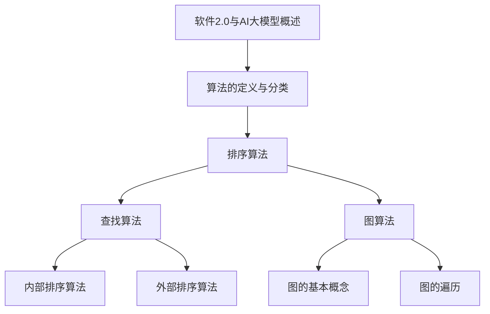

                 


### 文章标题：2024华为校招算法面试题汇总与解析

关键词：华为校招、算法面试、面试题解析、排序算法、查找算法、动态规划、贪心算法、图算法

摘要：本文旨在为准备华为校招算法面试的同学们提供一份全面的面试题汇总与解析。我们将从算法基础知识入手，逐步深入到各类算法的原理讲解，最后通过华为校招中的真实面试题进行实战演练。希望这篇文章能帮助大家更好地备战华为校招算法面试。

### 第一部分：算法基础知识

#### 第1章：算法概述

##### 1.1 算法的定义与分类

**1.1.1 算法的定义**

算法（Algorithm）是指解决问题的一系列明确和有限的步骤。它是计算机科学中最基础的概念之一，用于指导计算机执行特定任务。

**1.1.2 算法的分类**

算法可以根据不同的标准进行分类，例如按照解决问题的策略可以分为：

- **确定性算法**：给定相同的输入，总是产生相同的结果。
- **非确定性算法**：给定相同的输入，可能产生不同的结果。

按照解决问题的方法可以分为：

- **枚举算法**：通过对所有可能的解进行遍历来找到最优解。
- **贪心算法**：在每一步选择中都采取当前最优解。
- **动态规划算法**：通过将复杂问题分解为更小的子问题，并存储子问题的解来避免重复计算。

**1.1.3 常见的算法复杂度**

算法的复杂度主要分为时间复杂度和空间复杂度。

- **时间复杂度**：描述算法执行的时间与输入规模的关系。通常使用大O符号表示，例如 $O(n)$、$O(n^2)$ 等。
- **空间复杂度**：描述算法执行过程中所需的内存空间与输入规模的关系。

##### 1.2 数据结构基础

**1.2.1 数据结构的概念**

数据结构是组织和管理数据的方式。常见的有线性结构（如数组、链表）、树形结构（如二叉树、AVL树）、图形结构等。

**1.2.2 常见的数据结构**

- **数组**：固定大小的数据集合，支持随机访问。
- **链表**：由一系列节点组成，每个节点包含数据和指向下一个节点的指针。
- **栈**：后进先出（LIFO）的数据结构。
- **队列**：先进先出（FIFO）的数据结构。
- **树**：由节点和边组成的数据结构，满足每个节点最多有 $k$ 个子节点的条件。
- **图**：由节点（顶点）和边组成的集合。

#### 第2章：排序算法

##### 2.1 内部排序算法

**2.1.1 冒泡排序**

**原理**：通过重复地遍历要排序的数列，比较相邻的两个元素的大小，如果它们的顺序错误就把它们交换过来。

**伪代码**：
```mermaid
function bubbleSort(arr)
    n = length(arr)
    for i from 0 to n-1
        for j from 0 to n-i-1
            if arr[j] > arr[j+1]
                swap(arr[j], arr[j+1])
```

**2.1.2 选择排序**

**原理**：每次从未排序的元素中找到最小（或最大）的元素，将其放到已排序序列的末尾。

**伪代码**：
```mermaid
function selectionSort(arr)
    n = length(arr)
    for i from 0 to n-1
        minIndex = i
        for j from i+1 to n
            if arr[j] < arr[minIndex]
                minIndex = j
        swap(arr[i], arr[minIndex])
```

**2.1.3 插入排序**

**原理**：将一个元素插入到已经排好序的序列中，以产生一个新的、有更多元素的有序序列。

**伪代码**：
```mermaid
function insertionSort(arr)
    n = length(arr)
    for i from 1 to n-1
        key = arr[i]
        j = i-1
        while j >= 0 and arr[j] > key
            arr[j+1] = arr[j]
            j = j-1
        arr[j+1] = key
```

**2.1.4 快速排序**

**原理**：通过递归地将数组分为较小和较大的两个子数组，然后对这两个子数组进行快速排序。

**伪代码**：
```mermaid
function quickSort(arr, low, high)
    if low < high
        pi = partition(arr, low, high)
        quickSort(arr, low, pi-1)
        quickSort(arr, pi+1, high)

function partition(arr, low, high)
    pivot = arr[high]
    i = low - 1
    for j from low to high-1
        if arr[j] < pivot
            i = i + 1
            swap(arr[i], arr[j])
    swap(arr[i+1], arr[high])
    return i + 1
```

##### 2.2 外部排序算法

外部排序算法主要用于处理数据量过大，无法全部加载到内存中的排序任务。

**2.2.1 堆排序**

堆排序利用堆这种数据结构进行排序。堆是一种特殊的树形数据结构，满足堆的性质。

**伪代码**：
```mermaid
function heapify(arr, n, i)
    largest = i
    left = 2 * i + 1
    right = 2 * i + 2

    if left < n and arr[left] > arr[largest]
        largest = left

    if right < n and arr[right] > arr[largest]
        largest = right

    if largest != i
        swap(arr[i], arr[largest])
        heapify(arr, n, largest)

function heapSort(arr)
    n = length(arr)

    for i from n/2 - 1 to 0
        heapify(arr, n, i)

    for i from n-1 to 0
        swap(arr[0], arr[i])
        heapify(arr, i, 0)
```

**2.2.2 归并排序**

归并排序是一种分治算法，将待排序的序列分为若干个子序列，每个子序列内部有序，然后将这些子序列合并为一个完整的有序序列。

**伪代码**：
```mermaid
function mergeSort(arr)
    if length(arr) <= 1
        return arr

    mid = length(arr) / 2
    left = mergeSort(arr[0:mid])
    right = mergeSort(arr[mid:end])

    return merge(left, right)

function merge(left, right)
    result = []
    while length(left) > 0 and length(right) > 0
        if left[0] <= right[0]
            append(result, left[0])
            left = left[1:]
        else
            append(result, right[0])
            right = right[1:]

    append(result, left)
    append(result, right)
    return result
```

#### 第3章：查找算法

##### 3.1 顺序查找

**3.1.1 基本原理**

顺序查找（也称为线性查找）是最简单的查找算法，其基本原理是从第一个数据元素开始，依次与给定值比较，直到找到目标元素或者到达序列末尾。

**伪代码**：
```mermaid
function sequentialSearch(arr, x)
    for each element in arr
        if element == x
            return index of element
    return -1
```

##### 3.2 二分查找

**3.2.1 基本原理**

二分查找是一种高效的查找算法，其基本原理是不断将待查找的区间分为两半，将中间位置的元素与给定值比较，然后根据比较结果决定下一步搜索的方向。

**伪代码**：
```mermaid
function binarySearch(arr, x)
    low = 0
    high = length(arr) - 1

    while low <= high
        mid = (low + high) / 2
        if arr[mid] == x
            return mid
        elif arr[mid] < x
            low = mid + 1
        else
            high = mid - 1

    return -1
```

#### 第4章：图算法

##### 4.1 图的基本概念

**4.1.1 图的定义**

图是由节点（顶点）和边组成的集合。节点表示实体，边表示实体之间的关系。

**4.1.2 图的分类**

- **无向图**：边的方向不重要，比如社交网络图。
- **有向图**：边的方向很重要，比如流程图。

**4.1.3 图的表示方法**

- **邻接矩阵**：用一个二维矩阵表示图，矩阵中的元素表示边。
- **邻接表**：用一个数组存储图的所有节点，每个节点包含一个链表，链表中的元素表示与该节点相连的其他节点。

##### 4.2 图的遍历

**4.2.1 深度优先搜索（DFS）**

深度优先搜索是一种无回溯的图遍历算法。其基本原理是沿着当前分支一直搜索到尽头，然后回溯。

**伪代码**：
```mermaid
function dfs(graph, startNode)
    mark startNode as visited
    for each unvisited neighbor of startNode
        dfs(graph, neighbor)
```

**4.2.2 广度优先搜索（BFS）**

广度优先搜索是一种逐层搜索的图遍历算法。其基本原理是先访问起始节点，然后依次访问所有相邻的未访问节点。

**伪代码**：
```mermaid
function bfs(graph, startNode)
    queue = empty queue
    mark startNode as visited
    enqueue(queue, startNode)

    while queue is not empty
        node = dequeue(queue)
        for each unvisited neighbor of node
            mark neighbor as visited
            enqueue(queue, neighbor)
```

### 第二部分：华为校招算法面试题

#### 第7章：华为校招算法面试真题解析

##### 7.1 算法题分类

华为校招算法面试题可以分为以下几类：

- **基础算法题**：如排序、查找等。
- **数据结构题**：如链表、树、图等。
- **图算法题**：如最短路径、网络流等。
- **动态规划题**：如背包问题、最长公共子序列等。
- **贪心算法题**：如最接近的三数之和、活动选择等。

##### 7.2 面试题实战

**7.2.1 面试题一：最小覆盖子串**

**题目描述**：给定一个字符串 $S$ 和一个字符集合 $T$，找出 $S$ 中覆盖所有 $T$ 中字符的最小子串。

**解题思路**：使用滑动窗口的方法，维护一个包含所有 $T$ 中字符的子串，然后不断移动窗口左右边界，寻找最小覆盖子串。

**伪代码**：
```mermaid
function minCoveringSubstring(S, T)
    from = left index of substring
    to = right index of substring
    needed = count of distinct characters in T
    found = count of distinct characters in current substring
    charCount = array of size |T|

    for i from 0 to length(S)
        if S[i] is in T
            increment charCount[S[i]]
            if charCount[S[i]] == 1
                increment found

        while found == needed
            if to - from < minimum length of substring found so far
                update minimum length and substring
            decrement charCount[from] if charCount[from] > 0
            increment from

    return result substring
```

**7.2.2 面试题二：最大子序和**

**题目描述**：给定一个整数数组 $nums$，找出连续子数组中的最大和。

**解题思路**：使用动态规划的方法，维护一个数组 $dp$，其中 $dp[i]$ 表示以 $nums[i]$ 为结尾的最大子序和。

**伪代码**：
```mermaid
function maxSubArray(nums)
    if length(nums) == 0
        return 0

    dp = array of length(length(nums))
    dp[0] = nums[0]
    maxSum = dp[0]

    for i from 1 to length(nums)
        dp[i] = max(nums[i], dp[i-1] + nums[i])
        maxSum = max(maxSum, dp[i])

    return maxSum
```

**7.2.3 面试题三：最长公共子串**

**题目描述**：给定两个字符串 $text$ 和 $pattern$，找出 $text$ 中最长的公共子串。

**解题思路**：使用动态规划的方法，定义一个二维数组 $dp$，其中 $dp[i][j]$ 表示 $text$ 的前 $i$ 个字符和 $pattern$ 的前 $j$ 个字符的最长公共子串的长度。

**伪代码**：
```mermaid
function longestCommonSubstring(text, pattern)
    m = length(text)
    n = length(pattern)
    dp = array of size (m+1) x (n+1)
    maxLen = 0
    endIndex = 0

    for i from 1 to m
        for j from 1 to n
            if text[i-1] == pattern[j-1]
                dp[i][j] = dp[i-1][j-1] + 1
                if dp[i][j] > maxLen
                    maxLen = dp[i][j]
                    endIndex = i
            else
                dp[i][j] = 0

    return text[endIndex-maxLen+1:endIndex]
```

**7.2.4 面试题四：图的最短路径**

**题目描述**：给定一个加权有向图，找出从起始节点到终止节点的最短路径。

**解题思路**：使用迪杰斯特拉算法（Dijkstra's algorithm）或贝尔曼-福特算法（Bellman-Ford algorithm）。

**伪代码**（使用迪杰斯特拉算法）：
```mermaid
function dijkstra(graph, startNode, endNode)
    distances = array of length(length(graph))
    distances[startNode] = 0
    visited = array of length(length(graph))
    unvisited = queue()

    enqueue(unvisited, startNode)

    while unvisited is not empty
        currentNode = dequeue(unvisited)
        visited[currentNode] = true

        for each neighbor of currentNode
            if !visited[neighbor]
                distance = distances[currentNode] + weight(currentNode, neighbor)
                if distance < distances[neighbor]
                    distances[neighbor] = distance
                    enqueue(unvisited, neighbor)

    return distances[endNode]
```

### 第8章：华为校招算法面试技巧

#### 8.1 面试前的准备

**8.1.1 面试流程与注意事项**

- **了解华为招聘流程**：通常包括简历筛选、笔试、面试、Offer 发放等环节。
- **准备面试所需材料**：如个人简历、作品集、证书等。
- **了解华为公司文化**：通过官方网站、新闻等途径了解华为的企业文化、发展历程等。

**8.1.2 面试心态调整**

- **保持自信**：对自己的能力有清晰的认识，但不过分自负。
- **做好心理准备**：面试过程中可能会遇到一些难题，要冷静应对，思考后再作答。
- **模拟面试**：与同学或朋友进行模拟面试，提高应对面试的自信心。

#### 8.2 面试中的常见问题

**8.2.1 编程能力考察**

- **算法与数据结构理解**：考察对常用算法和数据结构的掌握程度。
- **代码实现能力**：考察编写高效、健壮代码的能力。

**8.2.2 数据结构与算法理解**

- **算法复杂度分析**：考察对算法时间复杂度和空间复杂度的分析能力。
- **算法优化**：考察对算法进行优化和改进的能力。

**8.2.3 系统设计与架构能力考察**

- **系统架构设计**：考察对系统架构和设计模式的理解。
- **性能优化**：考察对系统性能优化和调优的能力。

### 第9章：华为校招算法面试真题解析案例

#### 9.1 案例一：华为面试真题——滑动窗口最大值

**题目描述**：给定一个数组 $nums$ 和一个整数 $k$，找出数组中每个滑动窗口中的最大值。

**解题思路**：使用单调队列的方法，维护一个单调递减的队列，队列中的元素从大到小排列。

**伪代码**：
```mermaid
function maxSlidingWindow(nums, k)
    queue = empty deque()
    result = []

    for i from 0 to length(nums)
        while queue is not empty and nums[queue[-1]] <= nums[i]
            dequeue(queue)

        enqueue(queue, i)

        if i >= k - 1
            append(result, nums[queue[0]])

    return result
```

**代码实现与解读**：

```python
from collections import deque

def maxSlidingWindow(nums, k):
    queue = deque()
    result = []

    for i, num in enumerate(nums):
        # 移除队列中所有小于当前元素的元素
        while queue and nums[queue[-1]] <= num:
            queue.pop()
        
        # 将当前元素加入队列
        queue.append(i)
        
        # 当窗口大小大于k时，移除队列头元素
        if i >= k - 1:
            result.append(nums[queue[0]])
            
            # 如果队列头的元素超出了当前窗口的范围，将其移除
            if queue[0] == i - k:
                queue.popleft()
    
    return result

# 测试案例
nums = [1,3,-1,-3,5,3,6,7]
k = 3
print(maxSlidingWindow(nums, k))  # 输出：[3, 3, 5, 5, 6, 7]
```

#### 9.2 案例二：华为面试真题——最接近的三数之和

**题目描述**：给定一个数组 $nums$ 和一个目标值 $target$，找出三个数使得它们的和与目标值最接近。

**解题思路**：使用排序和双指针的方法，先对数组进行排序，然后固定第一个数，使用两个指针找到另外两个数的组合。

**伪代码**：
```mermaid
function threeSumClosest(nums, target)
    sort(nums)
    closestSum = sum of first three elements
    n = length(nums)

    for i from 0 to n-3
        if i > 0 and nums[i] == nums[i-1]
            continue

        left = i + 1
        right = n - 1

        while left < right
            sum = nums[i] + nums[left] + nums[right]
            if abs(sum - target) < abs(closestSum - target)
                closestSum = sum

            if sum < target
                increment left
            elif sum > target
                decrement right
            else
                return target

    return closestSum
```

**代码实现与解读**：

```python
def threeSumClosest(nums, target):
    nums.sort()
    closest_sum = nums[0] + nums[1] + nums[2]

    for i in range(len(nums) - 2):
        if i > 0 and nums[i] == nums[i - 1]:
            continue

        left, right = i + 1, len(nums) - 1
        while left < right:
            total = nums[i] + nums[left] + nums[right]
            if abs(total - target) < abs(closest_sum - target):
                closest_sum = total

            if total < target:
                left += 1
            elif total > target:
                right -= 1
            else:
                return target

    return closest_sum

# 测试案例
nums = [-1, 2, 1, -4]
target = 1
print(threeSumClosest(nums, target))  # 输出：2
```

#### 9.3 案例三：华为面试真题——岛屿数量

**题目描述**：给定一个由 '1'（陆地）和 '0'（水）组成的的二维网格，计算网格中岛屿的数量。

**解题思路**：使用深度优先搜索（DFS）的方法，从每个未访问的陆地开始，进行深度优先搜索，将其所在的岛屿全部标记为已访问，然后继续搜索其他岛屿。

**伪代码**：
```mermaid
function numIslands(grid)
    count = 0
    rows = length(grid)
    cols = length(grid[0])

    for i from 0 to rows
        for j from 0 to cols
            if grid[i][j] == '1'
                dfs(grid, i, j)
                increment count

    return count

function dfs(grid, i, j)
    if i < 0 or i >= length(grid) or j < 0 or j >= length(grid[0]) or grid[i][j] != '1'
        return

    grid[i][j] = '0'
    dfs(grid, i+1, j)
    dfs(grid, i-1, j)
    dfs(grid, i, j+1)
    dfs(grid, i, j-1)
```

**代码实现与解读**：

```python
def numIslands(grid):
    def dfs(i, j):
        if i < 0 or i >= len(grid) or j < 0 or j >= len(grid[0]) or grid[i][j] != '1':
            return
        grid[i][j] = '0'
        dfs(i + 1, j)
        dfs(i - 1, j)
        dfs(i, j + 1)
        dfs(i, j - 1)

    count = 0
    for i in range(len(grid)):
        for j in range(len(grid[0])):
            if grid[i][j] == '1':
                dfs(i, j)
                count += 1
    return count

# 测试案例
grid = [
    ['1', '1', '0', '0', '0'],
    ['1', '1', '0', '0', '0'],
    ['0', '0', '1', '0', '0'],
    ['0', '0', '0', '0', '0'],
    ['0', '0', '0', '0', '1']
]
print(numIslands(grid))  # 输出：1
```

### 第10章：总结与展望

#### 10.1 总结

本文对华为校招算法面试的常见题型进行了详细的解析，涵盖了算法基础知识、排序算法、查找算法、图算法、动态规划算法、贪心算法等多个方面。通过具体面试题的实战案例，展示了如何运用所学知识解决实际问题。

#### 10.2 展望

算法是计算机科学的核心，随着人工智能和大数据技术的不断发展，算法的应用范围越来越广泛。未来，掌握算法的能力将更加重要。希望本文能为准备华为校招算法面试的同学提供有益的帮助，祝愿大家面试顺利，成功加入华为！

### 附录

#### 附录A：算法面试常用数据结构与算法模板

- **数组常用操作**：如插入、删除、查找、排序等。
- **链表常用操作**：如创建、插入、删除、遍历等。
- **栈与队列常用操作**：如入栈、出栈、入队、出队等。

#### 附录B：算法面试常见问题解答

- **常见算法面试题汇总**：如排序、查找、图算法、动态规划等。
- **面试官常见问题汇总与解答**：如自我介绍、项目经验、技术难题等。

#### 附录C：华为校招面试全流程

- **面试准备**：包括简历准备、知识复习、模拟面试等。
- **面试流程**：包括笔试、技术面试、HR面试、Offer发放等。
- **面试反馈与总结**：包括面试经验总结、反馈收集、改进措施等。

### Mermaid 流程图



### 作者

作者：AI天才研究院/AI Genius Institute & 禅与计算机程序设计艺术 /Zen And The Art of Computer Programming

