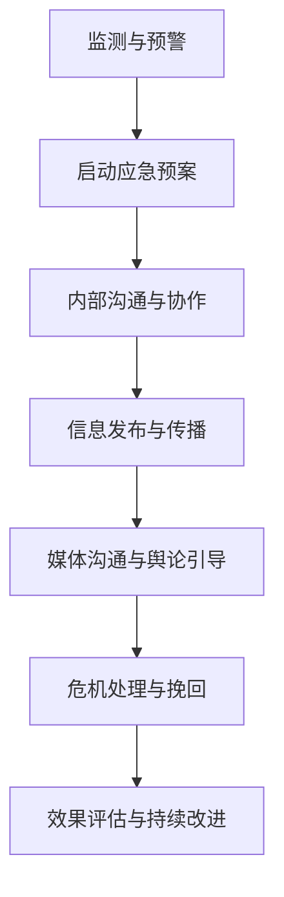
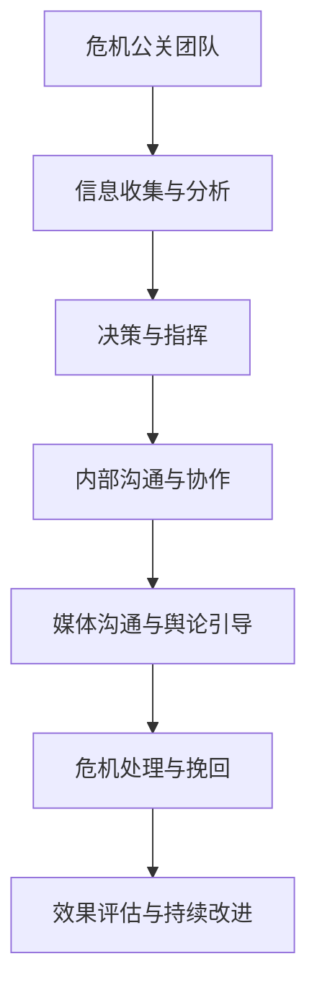
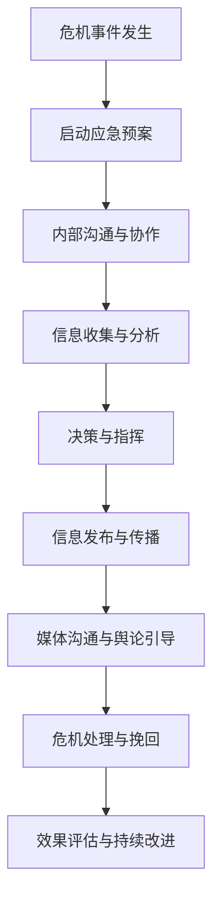
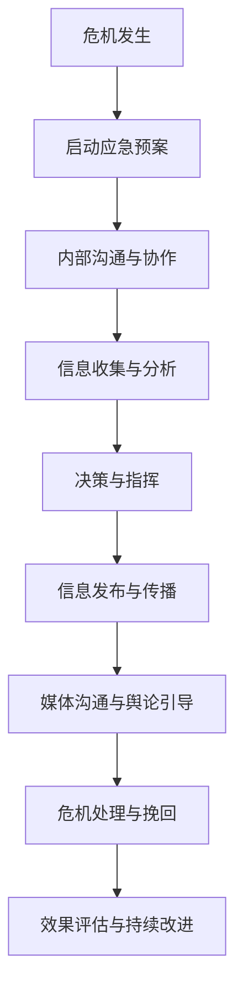

                 

### 文章标题

《危机公关管理：创业公司如何应对负面舆情》

> 关键词：危机公关，创业公司，负面舆情，应对策略

> 摘要：本文旨在探讨创业公司在面临负面舆情时，如何通过有效的危机公关管理策略来维护品牌形象、恢复信誉，并最终实现企业的持续健康发展。文章从危机公关的定义与重要性入手，详细分析了危机公关的基础理论、组织策略、监测预警、传播技巧、法律问题及风险管理等方面，结合典型案例进行了深入剖析，并为创业公司提供了可行的危机公关提升与持续改进方案。

### 《危机公关管理：创业公司如何应对负面舆情》目录大纲

**第一部分：危机公关基础**

## 第1章：危机公关概述

### 1.1 危机公关的定义与重要性

### 1.2 危机公关与传统公关的区别

### 1.3 创业公司面临的主要危机类型

## 第2章：危机公关的组织与策略

### 2.1 危机公关团队的建设

### 2.2 危机公关的应急预案

### 2.3 危机公关的策略与原则

## 第3章：危机事件的监测与预警

### 3.1 网络舆情的监测工具与方法

### 3.2 负面舆情的预警机制

### 3.3 如何应对突发危机事件

**第二部分：危机公关执行**

## 第4章：危机公关传播策略

### 4.1 社交媒体在危机公关中的应用

### 4.2 媒体沟通与新闻发布

### 4.3 媒体危机管理案例分析

## 第5章：危机公关沟通技巧

### 5.1 内部沟通与团队协作

### 5.2 外部沟通与公众互动

### 5.3 如何应对质疑与谣言

## 第6章：危机公关法律问题与风险管理

### 6.1 危机公关中的法律风险

### 6.2 法律咨询与法律维权

### 6.3 风险评估与管理策略

## 第7章：危机公关案例分析

### 7.1 国内知名危机公关案例解析

### 7.2 国际企业危机公关案例分析

### 7.3 创业公司危机公关案例启示

**第三部分：危机公关提升与持续改进**

## 第8章：危机公关能力建设

### 8.1 危机公关培训与团队提升

### 8.2 创新思维与应对策略

### 8.3 案例学习与经验总结

## 第9章：危机公关的持续改进与优化

### 9.1 定期评估与改进策略

### 9.2 持续优化危机公关流程

### 9.3 创业公司危机公关的长期规划

## 附录

### 附录A：危机公关常用工具与资源

#### A.1 社交媒体监测工具介绍

#### A.2 常用公关咨询公司推荐

#### A.3 创业公司危机公关资源汇总

### 附录B：危机公关流程图与架构图

#### B.1 危机公关流程图

#### B.2 危机公关组织架构图

#### B.3 危机公关事件处理流程Mermaid图

---

**第一部分：危机公关基础**

### 第1章：危机公关概述

#### 1.1 危机公关的定义与重要性

危机公关，是指在突发事件或危机发生时，企业或组织采取的一系列公关措施，以维护或恢复其声誉、品牌形象，减少或避免负面影响，并最终实现企业的正常运营和持续发展。对于创业公司而言，危机公关尤为重要。由于创业公司通常资源有限、市场知名度不高，一旦发生危机事件，容易受到公众舆论的强烈影响，导致品牌形象受损，甚至面临生存危机。

危机公关的重要性主要体现在以下几个方面：

1. **维护企业声誉**：危机公关有助于企业及时应对危机，采取有效的措施进行沟通，防止危机蔓延，减少损失，维护企业的声誉和品牌形象。
2. **挽回客户信任**：危机公关能够迅速向公众传达企业的态度和解决方案，消除客户的疑虑，恢复客户的信任，保持企业的市场份额。
3. **应对法律风险**：危机公关有助于企业提前识别潜在的法律风险，及时采取措施进行法律咨询和维权，避免因危机事件引发的法律纠纷。
4. **提高企业竞争力**：有效的危机公关能够增强企业的应变能力和管理水平，提高企业的整体竞争力。

#### 1.2 危机公关与传统公关的区别

传统公关主要侧重于企业形象建设、品牌推广和公关活动的策划执行，其目的是提升企业的知名度、美誉度和忠诚度。而危机公关则是在企业面临危机时，通过快速反应和有效沟通，控制危机影响，维护企业声誉。

两者的主要区别在于以下几点：

1. **目标不同**：传统公关的目标是建立和维护企业的良好形象，而危机公关的目标是应对危机，减少负面影响。
2. **时间紧迫性**：危机公关通常需要在短时间内迅速做出反应，而传统公关则可以按照计划逐步推进。
3. **信息传播方式**：危机公关需要通过多种渠道进行信息传播，包括社交媒体、新闻媒体、企业官网等，而传统公关则更多依赖于媒体发布会、公关活动等。
4. **沟通对象**：危机公关的沟通对象更加广泛，包括媒体、客户、员工、投资者等，而传统公关则主要面向媒体和公众。

#### 1.3 创业公司面临的主要危机类型

创业公司通常面临以下几种类型的危机：

1. **产品质量问题**：产品质量问题可能导致消费者投诉、退货，甚至引发安全事件，对企业声誉造成严重影响。
2. **安全事故**：安全事故如火灾、爆炸、食品安全问题等，可能导致企业停产、赔偿损失，甚至面临法律诉讼。
3. **舆论危机**：由于创业公司知名度较低，容易成为舆论焦点，一旦发生负面事件，容易引起广泛传播，对企业形象造成负面影响。
4. **法律纠纷**：创业公司可能因合同纠纷、专利侵权等法律问题，面临诉讼和赔偿风险。
5. **财务危机**：财务危机可能导致企业资金链断裂，影响正常运营。

针对以上危机类型，创业公司需要制定相应的危机公关策略，提前预防和及时应对，以减少危机对企业的影响。

### 第2章：危机公关的组织与策略

#### 2.1 危机公关团队的建设

危机公关团队是危机公关的核心力量，其建设至关重要。一个高效的危机公关团队应具备以下要素：

1. **专业技能**：团队成员应具备较强的沟通、协调、分析问题和解决问题的能力，熟悉危机公关的流程和方法。
2. **多元化背景**：团队应包括市场营销、法律、人力资源、财务等多个领域的专业人才，以应对不同类型的危机。
3. **快速响应能力**：团队成员应能够随时待命，迅速响应危机事件，确保危机处理的高效性。
4. **跨部门协作**：危机公关团队需要与其他部门密切合作，如市场营销、产品研发、人力资源等，共同应对危机。

#### 2.2 危机公关的应急预案

应急预案是危机公关的关键组成部分，能够帮助企业迅速应对危机事件，减少损失。应急预案应包括以下内容：

1. **危机类型识别**：明确企业可能面临的危机类型，如产品质量问题、安全事故、舆论危机等。
2. **应急流程**：制定危机发生后的应对流程，包括危机监测、信息报告、危机处理、沟通协调等。
3. **责任分配**：明确各团队成员在危机处理过程中的职责，确保高效协作。
4. **资源储备**：储备必要的资源，如资金、物资、专业人员等，以应对突发危机。
5. **培训与演练**：定期进行危机公关培训和演练，提高团队成员的危机应对能力。

#### 2.3 危机公关的策略与原则

危机公关策略的制定需要结合企业的实际情况和危机类型，确保应对措施的针对性和有效性。以下是一些常见的危机公关策略和原则：

1. **快速反应**：危机公关的关键在于迅速做出反应，避免危机进一步扩大。企业应建立快速反应机制，确保在危机事件发生后第一时间采取行动。
2. **透明沟通**：与公众、媒体、员工等各方保持透明沟通，及时发布相关信息，消除疑虑，建立信任。
3. **积极正面**：在危机公关过程中，企业应积极传递正面信息，强调解决问题的决心和措施，增强公众信心。
4. **针对性回应**：针对不同类型的危机，制定针对性的应对策略，避免一刀切的处理方式。
5. **风险评估**：在制定危机公关策略时，应充分考虑危机可能带来的风险，并采取相应的风险管理措施。
6. **持续跟进**：危机处理不是一蹴而就的，企业应持续跟进危机事件，评估处理效果，不断完善危机公关策略。

### 第3章：危机事件的监测与预警

#### 3.1 网络舆情的监测工具与方法

网络舆情监测是危机公关的重要环节，能够帮助企业及时发现潜在危机，采取预防措施。以下是一些常用的网络舆情监测工具与方法：

1. **社交媒体监测工具**：如微博、微信公众号、抖音等，通过关键词、标签等筛选，实时监测网络舆情。
2. **搜索引擎监测工具**：如百度指数、360搜索引擎等，通过关键词搜索量、趋势分析等，评估网络舆情热度。
3. **舆情分析系统**：如腾讯舆情分析系统、阿里云舆情分析系统等，通过大数据分析，提供全面的舆情监测报告。
4. **人工监测**：通过招聘专业舆情监测人员，定期浏览论坛、社区、新闻网站等，了解网络舆情动态。

#### 3.2 负面舆情的预警机制

负面舆情预警机制是企业预防危机的重要手段，以下是一些常见的预警机制：

1. **关键词预警**：设定关键词，如企业名称、产品名称、品牌名称等，当这些关键词在网络上出现频率过高或负面情绪明显时，触发预警。
2. **情绪分析预警**：利用自然语言处理技术，分析网络言论的情感倾向，当负面情绪占比过高时，触发预警。
3. **趋势预警**：通过大数据分析，发现网络舆情的发展趋势，如负面情绪逐渐扩大，提前采取预防措施。
4. **人工审核预警**：定期组织专业舆情监测人员，对网络舆情进行审核，发现潜在危机，及时上报。

#### 3.3 如何应对突发危机事件

突发危机事件是企业面临的重大挑战，以下是一些应对突发危机事件的策略：

1. **立即响应**：危机事件发生后，企业应立即启动应急预案，召开紧急会议，评估危机影响，制定应对措施。
2. **信息发布**：通过企业官网、社交媒体等渠道，及时发布危机事件的相关信息，保持透明沟通，避免谣言传播。
3. **正面引导**：针对负面舆情，积极传递正面信息，强调企业的应对措施和解决问题的决心，引导公众情绪。
4. **法律维权**：如危机事件涉及法律问题，企业应立即寻求法律咨询，采取维权措施，维护自身合法权益。
5. **持续跟进**：危机事件处理后，企业应持续跟进事件进展，评估处理效果，根据实际情况调整应对措施。

---

**第二部分：危机公关执行**

### 第4章：危机公关传播策略

#### 4.1 社交媒体在危机公关中的应用

社交媒体已成为危机公关的重要战场，企业应充分利用社交媒体进行信息传播和舆论引导。以下是一些社交媒体在危机公关中的应用策略：

1. **快速响应**：社交媒体具有传播速度快、互动性强的特点，企业应迅速在社交媒体上发布危机事件的相关信息，保持透明沟通。
2. **内容策划**：企业应根据危机事件的性质，策划有针对性的内容，如道歉声明、解决方案、正面信息等，以影响公众舆论。
3. **互动沟通**：积极与公众互动，回答问题、回应关切，建立信任关系，减少负面情绪的传播。
4. **媒体合作**：与社交媒体平台合作，如微博、微信公众号等，利用平台资源进行信息传播，扩大影响力。

#### 4.2 媒体沟通与新闻发布

媒体沟通和新闻发布是危机公关的重要环节，以下是一些关键策略：

1. **媒体关系维护**：建立良好的媒体关系，与媒体保持密切沟通，为危机事件的处理提供舆论支持。
2. **新闻发布**：通过新闻发布会、媒体通稿等形式，及时向媒体发布危机事件的相关信息，引导舆论方向。
3. **信息控制**：对危机事件的信息进行控制，避免谣言和虚假信息的传播，确保公众获得真实、准确的信息。
4. **负面报道应对**：对负面报道进行应对，通过事实澄清、正面报道等方式，纠正错误信息，挽回企业形象。

#### 4.3 媒体危机管理案例分析

以下分析两个典型的媒体危机管理案例，以供参考：

1. **案例一：某知名餐饮品牌食品安全事件**

某知名餐饮品牌因食品安全问题引发公众关注，媒体纷纷报道。该企业迅速采取以下措施：

- 立即停业自查，进行全面整改；
- 通过企业官网、社交媒体发布声明，承认错误，承诺整改措施；
- 召开新闻发布会，向公众道歉，公布整改进展；
- 与媒体保持密切沟通，主动提供信息，避免谣言传播。

通过以上措施，该企业成功平息了舆论风波，恢复了品牌形象。

2. **案例二：某互联网企业数据泄露事件**

某互联网企业发生用户数据泄露事件，用户隐私受到威胁。该企业采取以下应对措施：

- 立即启动应急预案，启动数据安全调查；
- 通过官网、社交媒体发布声明，承认数据泄露事实，承诺加强数据安全防护；
- 成立专门团队，与用户进行一对一沟通，了解用户关切，提供解决方案；
- 与相关部门合作，进行调查和整改，确保用户数据安全。

通过积极应对，该企业成功挽回了用户信任，减少了负面影响。

### 第5章：危机公关沟通技巧

#### 5.1 内部沟通与团队协作

内部沟通与团队协作在危机公关中至关重要，以下是一些关键技巧：

1. **建立有效的沟通渠道**：设立危机公关内部沟通平台，如微信群、邮件列表等，确保信息传递畅通。
2. **明确沟通责任**：明确各部门在危机处理过程中的职责和任务，确保团队协作高效。
3. **及时反馈与调整**：在危机处理过程中，及时收集反馈，调整应对策略，提高危机公关效果。
4. **保持信息透明**：内部沟通应保持信息透明，让全体员工了解危机处理进展，增强团队凝聚力。

#### 5.2 外部沟通与公众互动

外部沟通与公众互动是危机公关的重要环节，以下是一些关键技巧：

1. **倾听公众声音**：关注公众的意见和关切，通过社交媒体、客服渠道等了解公众需求，及时回应。
2. **正面引导舆论**：在危机公关过程中，积极传递正面信息，引导公众情绪，减少负面情绪的传播。
3. **保持真诚与透明**：与公众保持真诚沟通，及时发布相关信息，避免隐瞒和虚假信息。
4. **建立信任关系**：通过积极互动和解决问题，建立与公众的信任关系，提高企业形象。

#### 5.3 如何应对质疑与谣言

在危机公关过程中，质疑和谣言往往难以避免。以下是一些应对策略：

1. **事实澄清**：针对质疑和谣言，及时发布事实澄清信息，提供证据支持，消除公众疑虑。
2. **积极回应**：对公众的质疑和谣言进行积极回应，避免沉默引发更大争议。
3. **法律维权**：如质疑和谣言涉及法律问题，企业应寻求法律帮助，采取维权措施，维护自身合法权益。
4. **加强舆论引导**：通过正面报道、社交媒体互动等方式，引导公众关注企业正面信息，减少质疑和谣言的传播。

### 第6章：危机公关法律问题与风险管理

#### 6.1 危机公关中的法律风险

危机公关过程中，企业可能会面临以下法律风险：

1. **侵权风险**：如未经授权使用他人知识产权，可能导致侵权诉讼。
2. **隐私权风险**：涉及用户隐私信息泄露，可能导致隐私权纠纷。
3. **广告法风险**：危机公关中的广告宣传可能违反广告法规定，导致处罚。
4. **合同纠纷风险**：危机公关过程中的合同履行可能引发合同纠纷。

#### 6.2 法律咨询与法律维权

为了有效应对危机公关中的法律风险，企业应采取以下措施：

1. **法律咨询**：在危机发生时，及时寻求专业法律咨询，了解相关法律法规，制定应对策略。
2. **法律维权**：如危机涉及法律纠纷，企业应积极采取法律措施，维护自身合法权益。
3. **法律培训**：定期进行法律培训，提高员工的法律意识，减少法律风险。

#### 6.3 风险评估与管理策略

企业应建立危机公关风险评估与管理机制，以下是一些关键策略：

1. **风险评估**：对危机事件的潜在法律风险进行评估，制定针对性的风险管理策略。
2. **预防措施**：在危机处理过程中，采取预防措施，如与专业律师合作、签订保密协议等，减少法律风险。
3. **风险管理**：建立风险管理机制，定期评估危机公关的法律风险，及时调整应对策略。

### 第7章：危机公关案例分析

#### 7.1 国内知名危机公关案例解析

以下分析两个国内知名危机公关案例：

1. **案例一：某知名互联网公司用户隐私泄露事件**

某知名互联网公司发生用户隐私泄露事件，导致大量用户个人信息被泄露。企业采取以下措施：

- 立即启动应急预案，进行数据安全调查；
- 通过官网、社交媒体发布声明，承认隐私泄露事实，承诺加强数据安全防护；
- 成立专门团队，与用户进行一对一沟通，提供解决方案，挽回用户信任；
- 与相关部门合作，进行调查和整改，确保用户数据安全。

通过以上措施，该企业成功缓解了舆论压力，恢复了品牌形象。

2. **案例二：某知名餐饮品牌食品安全事件**

某知名餐饮品牌因食品安全问题引发公众关注，媒体纷纷报道。企业采取以下措施：

- 立即停业自查，进行全面整改；
- 通过企业官网、社交媒体发布声明，承认错误，承诺整改措施；
- 召开新闻发布会，向公众道歉，公布整改进展；
- 与媒体保持密切沟通，主动提供信息，避免谣言传播。

通过积极应对，该企业成功平息了舆论风波，恢复了品牌形象。

#### 7.2 国际企业危机公关案例分析

以下分析两个国际企业危机公关案例：

1. **案例一：某知名汽车制造商产品召回事件**

某知名汽车制造商因产品存在质量问题，决定召回部分车辆。企业采取以下措施：

- 及时发布召回声明，说明召回原因和措施；
- 与车主进行一对一沟通，提供解决方案，如免费维修、更换零部件等；
- 与相关部门合作，确保召回工作的顺利进行；
- 通过官网、社交媒体等渠道，积极传递召回信息，避免谣言传播。

通过以上措施，该企业成功缓解了舆论压力，恢复了品牌形象。

2. **案例二：某知名电子产品制造商电池爆炸事件**

某知名电子产品制造商发生电池爆炸事件，导致用户财产受损。企业采取以下措施：

- 立即发布声明，承认电池爆炸问题，承诺提供解决方案；
- 提供免费检测服务，排查电池问题，为用户更换安全电池；
- 与媒体保持密切沟通，及时发布召回和维修信息，避免谣言传播；
- 加强电池安全检测，确保后续产品的安全性。

通过积极应对，该企业成功挽回了用户信任，恢复了品牌形象。

#### 7.3 创业公司危机公关案例启示

以下总结创业公司危机公关案例的启示：

1. **快速响应**：创业公司在危机事件发生后，应迅速采取行动，避免危机扩大。
2. **透明沟通**：保持透明沟通，及时发布相关信息，避免谣言传播，建立信任关系。
3. **积极正面**：在危机公关过程中，积极传递正面信息，强调企业的应对措施和解决问题的决心。
4. **团队协作**：危机公关需要团队协作，明确各成员职责，确保高效应对。
5. **法律维权**：在危机涉及法律问题时，及时寻求法律帮助，采取维权措施，维护企业合法权益。
6. **持续改进**：危机公关不是一次性的，企业应持续改进危机公关策略，提高应对能力。

### 第三部分：危机公关提升与持续改进

#### 8.1 危机公关能力建设

危机公关能力建设是提升企业应对危机能力的重要手段。以下是一些建议：

1. **培训与演练**：定期开展危机公关培训，提高员工应对危机的能力。同时，进行危机演练，检验应急预案的有效性。
2. **团队建设**：加强危机公关团队的内部建设，提高团队协作能力。引入多元化背景的成员，丰富团队专业知识。
3. **资源储备**：储备必要的资源，如资金、物资、专业人员等，以应对突发危机。
4. **信息共享**：建立危机公关信息共享机制，确保团队成员及时了解危机处理进展，提高协同效率。

#### 8.2 创新思维与应对策略

创新思维在危机公关中具有重要意义。以下是一些创新思维的应对策略：

1. **逆向思维**：从危机中寻找机遇，如通过危机公关提升品牌知名度、拓展市场份额等。
2. **跨界合作**：与行业内外企业、机构合作，共同应对危机，实现优势互补。
3. **大数据分析**：利用大数据分析，预测危机发展趋势，提前采取预防措施。
4. **虚拟现实**：利用虚拟现实技术，模拟危机场景，提高危机应对能力。

#### 8.3 案例学习与经验总结

案例学习与经验总结是提升危机公关能力的重要途径。以下是一些建议：

1. **学习经典案例**：分析国内外知名企业的危机公关案例，了解成功经验与失败教训。
2. **内部交流**：组织内部交流会议，分享危机公关案例和经验，提高团队成员的应对能力。
3. **定期总结**：定期对危机公关案例进行总结，提炼经验教训，完善危机公关策略。
4. **实战演练**：通过实战演练，检验危机公关能力，发现并解决问题。

### 9.1 定期评估与改进策略

定期评估与改进策略是危机公关持续改进的关键。以下是一些建议：

1. **评估危机公关效果**：定期评估危机公关效果，如公众舆论变化、企业形象恢复程度等，为改进策略提供依据。
2. **分析失败案例**：分析危机处理失败案例，找出原因，提出改进措施。
3. **优化应急预案**：根据评估结果和改进措施，优化应急预案，提高应对危机的能力。
4. **建立评估机制**：建立定期评估机制，确保危机公关策略的持续改进。

#### 9.2 持续优化危机公关流程

持续优化危机公关流程是提高危机公关效率的关键。以下是一些建议：

1. **简化流程**：简化危机公关流程，减少不必要的环节，提高响应速度。
2. **明确责任**：明确各部门和人员在危机公关中的职责，确保高效协作。
3. **加强培训**：定期开展培训，提高员工危机公关意识和技能。
4. **技术支持**：利用信息技术，如舆情监测系统、沟通平台等，提高危机公关效率。

#### 9.3 创业公司危机公关的长期规划

创业公司危机公关的长期规划是确保企业稳健发展的重要保障。以下是一些建议：

1. **建立危机预警机制**：建立危机预警机制，提前发现潜在危机，采取预防措施。
2. **制定长期战略**：结合企业发展战略，制定长期危机公关战略，确保企业长期稳定发展。
3. **优化企业文化**：加强企业文化建设，提高员工危机意识，培养团队协作精神。
4. **拓展资源**：积极拓展资源，如与专业公关公司合作、建立危机公关培训体系等，提高危机应对能力。

### 附录A：危机公关常用工具与资源

#### A.1 社交媒体监测工具介绍

以下介绍一些常用的社交媒体监测工具：

1. **百度舆情监测**：提供实时舆情监测、关键词分析、情绪监测等功能，帮助用户了解网络舆情动态。
2. **腾讯舆情通**：提供舆情监测、数据分析、舆情预警等功能，支持多平台舆情监测。
3. **阿里云舆情分析**：提供舆情监测、数据分析、舆情报告等功能，助力企业了解网络舆情。

#### A.2 常用公关咨询公司推荐

以下推荐一些知名的公关咨询公司：

1. **蓝色光标**：国内领先的公关咨询公司，提供危机公关、品牌策划、市场推广等服务。
2. **华谊兄弟**：专业从事公关咨询、品牌传播、活动策划等业务，具有丰富的危机公关经验。
3. **奥美公关**：国际知名公关公司，提供危机公关、品牌咨询、营销传播等服务。

#### A.3 创业公司危机公关资源汇总

以下汇总一些创业公司危机公关的资源：

1. **危机公关指南**：提供危机公关的策略、案例、技巧等内容，助力企业应对危机。
2. **危机公关培训课程**：提供线上和线下危机公关培训课程，提高员工危机应对能力。
3. **危机公关咨询**：提供专业的危机公关咨询服务，帮助企业制定针对性的危机公关策略。

### 附录B：危机公关流程图与架构图

#### B.1 危机公关流程图

以下展示一个简化的危机公关流程图：

#### B.2 危机公关组织架构图

以下展示一个简化的危机公关组织架构图：

#### B.3 危机公关事件处理流程Mermaid图

以下展示一个详细的危机公关事件处理流程Mermaid图：

---

**作者：AI天才研究院/AI Genius Institute & 禅与计算机程序设计艺术 /Zen And The Art of Computer Programming**

本文从危机公关的基础理论、组织策略、监测预警、传播技巧、法律问题及风险管理等方面，详细探讨了创业公司在面对负面舆情时如何进行有效的危机公关管理。文章结合典型案例，为创业公司提供了实用的危机公关策略和技巧，旨在帮助创业公司提高应对危机的能力，维护企业声誉和品牌形象，实现持续健康发展。希望本文能对广大创业者带来启示和帮助。在未来的发展中，创业公司应注重危机公关能力建设，持续优化危机公关流程，制定长期规划，以应对不断变化的商业环境。同时，创业公司也应关注技术创新和商业模式创新，提高核心竞争力，为企业的长远发展奠定坚实基础。祝愿广大创业公司在未来的道路上越走越远，创造更多辉煌！** **

---

### 附录A：危机公关常用工具与资源

#### A.1 社交媒体监测工具介绍

在危机公关中，及时监测社交媒体上的舆论动态至关重要。以下是一些常用的社交媒体监测工具及其功能介绍：

1. **百度舆情监测**：
   - 功能：实时监控关键词、话题、事件等网络信息，提供舆情分析报告。
   - 特色：支持多平台监测，包括微博、微信、新闻网站等。

2. **腾讯舆情通**：
   - 功能：提供舆情监测、数据分析、舆情预警等功能，支持定制化服务。
   - 特色：拥有丰富的舆情数据资源，可进行深度分析。

3. **阿里云舆情分析**：
   - 功能：提供舆情监测、大数据分析、舆情报告等服务。
   - 特色：集成阿里云大数据技术，分析准确、实时性强。

#### A.2 常用公关咨询公司推荐

选择专业的公关咨询公司可以帮助创业公司更好地应对危机。以下是一些在业内知名的公关咨询公司推荐：

1. **蓝色光标**：
   - 服务：危机公关、品牌策划、市场推广等。
   - 特色：拥有丰富的实战经验和专业的团队。

2. **华谊兄弟**：
   - 服务：公关咨询、品牌传播、活动策划等。
   - 特色：兼具娱乐和公关背景，具备较强的行业影响力。

3. **奥美公关**：
   - 服务：危机公关、品牌咨询、营销传播等。
   - 特色：国际化的服务团队，具备全球资源和视野。

#### A.3 创业公司危机公关资源汇总

为了更好地应对危机，创业公司可以参考以下资源，以提升危机公关能力：

1. **危机公关指南**：
   - 内容：危机公关策略、案例、技巧等。
   - 来源：专业机构、行业报告等。

2. **危机公关培训课程**：
   - 内容：线上和线下危机公关培训课程。
   - 来源：培训机构、在线教育平台等。

3. **危机公关咨询**：
   - 内容：专业的危机公关咨询服务。
   - 来源：公关咨询公司、法律机构等。

这些资源将有助于创业公司在危机发生时，迅速采取有效的应对措施，降低危机对企业的影响。

### 附录B：危机公关流程图与架构图

#### B.1 危机公关流程图

以下是一个简化的危机公关流程图，展示了危机从发生到解决的整个过程：

#### B.2 危机公关组织架构图

以下是一个简化的危机公关组织架构图，展示了危机公关团队的组织结构和各成员的职责：

#### B.3 危机公关事件处理流程Mermaid图

以下是一个详细的危机公关事件处理流程Mermaid图，展示了危机公关的具体执行步骤：

通过这些流程图和架构图，创业公司可以更清晰地了解危机公关的各个环节，从而更有效地应对危机。

