                 

### 文章标题

# 去中心化众筹平台：创业融资的创新模式

> 关键词：去中心化众筹、区块链、智能合约、创业融资、分布式系统、去中心化平台

> 摘要：本文将深入探讨去中心化众筹平台的概念、技术原理、实现架构以及其在创业融资中的应用。通过逐步分析去中心化众筹的优势、挑战，以及区块链和智能合约在这一领域的关键作用，本文旨在为读者提供一部全面且具有实践指导意义的去中心化众筹平台指南。

### 第一部分：去中心化众筹平台概述

#### 第1章：去中心化众筹平台的概述

##### 1.1 去中心化众筹的概念

###### 1.1.1 中心化与去中心化的区别

中心化系统通常依赖于中央机构或服务器来处理数据和交易。例如，传统的众筹平台如Kickstarter和Indiegogo，资金流经平台的中枢节点，由平台负责审核项目、管理资金和分配回报。去中心化系统则不存在这样的中央节点，所有参与者共同维护系统，数据和信息通过分布式网络进行传播和验证。

###### 1.1.2 去中心化众筹的基本原理

去中心化众筹平台利用区块链技术实现资金的分布式管理，智能合约自动化执行交易规则。投资者和项目方在区块链上进行资金筹集和支付，整个流程无需依赖中介机构，透明且不可篡改。

##### 1.2 去中心化众筹平台的起源与发展

###### 1.2.1 去中心化众筹的起源

去中心化众筹的概念最早可以追溯到2010年代中后期，随着比特币等加密货币的普及，区块链技术开始被更多人关注。去中心化众筹作为一种新兴的融资方式，应运而生。

###### 1.2.2 去中心化众筹平台的发展历程

去中心化众筹平台的发展经历了从简单的基于以太坊的众筹平台，到如今包含更复杂功能如去中心化交易所、借贷平台等多元化服务的阶段。代表平台包括Wefunder、Crowdcreate等。

##### 1.3 去中心化众筹平台的优势与挑战

###### 1.3.1 去中心化众筹平台的优势

- **去中介化**：省去了传统众筹平台的中介费用，降低项目方的融资成本。
- **透明性**：所有交易记录公开透明，投资者可以实时查看项目的进展和资金流向。
- **安全性**：区块链技术确保了数据的安全性和不可篡改性，减少了欺诈风险。
- **全球化**：去中心化众筹不受地域限制，投资者和项目方可以来自世界各地。

###### 1.3.2 去中心化众筹平台面临的挑战

- **技术门槛**：区块链和智能合约技术较为复杂，对开发者和投资者都有一定的技术要求。
- **法律监管**：不同国家和地区对去中心化众筹的法律监管存在差异，平台需要遵守不同法规。
- **用户体验**：与传统众筹平台相比，去中心化众筹的用户体验可能不够友好，需要进一步优化。

#### 第2章：区块链与智能合约基础

##### 2.1 区块链技术概述

###### 2.1.1 区块链的基本概念

区块链是一种分布式账本技术，由多个区块通过密码学算法链接而成。每个区块包含一定数量的交易记录，且每个区块都指向前一个区块，形成链式结构。

###### 2.1.2 区块链的工作原理

区块链通过共识算法实现数据的分布式存储和验证。当一个新的交易产生时，节点通过网络广播交易信息，并通过共识算法确认交易的合法性，将交易记录添加到区块链中。

##### 2.2 智能合约技术详解

###### 2.2.1 智能合约的定义

智能合约是区块链上的可编程合约，其条件在满足时自动执行。智能合约以代码形式定义了交易双方的权利和义务。

###### 2.2.2 智能合约的实现原理

智能合约通常由Solidity等编程语言编写，编译成字节码后部署到区块链上。智能合约通过预定义的函数和事件与外界交互。

###### 2.2.3 智能合约的安全性分析

智能合约的安全性受到多种因素的影响，如代码质量、共识算法等。常见的攻击方式包括重入攻击、逻辑漏洞等，需要通过严格的代码审计和测试来防范。

##### 2.3 常见的区块链平台

###### 2.3.1 Ethereum

Ethereum是当前最流行的智能合约平台，支持多种编程语言，并提供了去中心化应用（DApp）开发框架。

###### 2.3.2 Bitcoin

Bitcoin是最早的加密货币和区块链平台，其去中心化特性在金融领域有着广泛的应用。

###### 2.3.3 其他区块链平台介绍

其他常见的区块链平台包括EOS、Cardano等，各自具有独特的特点和应用场景。

### 第二部分：去中心化众筹平台的技术实现

#### 第3章：去中心化众筹平台的架构设计

##### 3.1 去中心化众筹平台的系统架构

去中心化众筹平台的系统架构通常包括用户层、应用层和数据层。

###### 3.1.1 用户层

用户层负责与用户进行交互，提供用户注册、登录、项目浏览和投资等功能。

###### 3.1.2 应用层

应用层包括众筹项目的发布、审核、资金管理、项目评价等功能，由智能合约实现。

###### 3.1.3 数据层

数据层负责存储用户数据、项目数据、交易记录等，使用区块链技术确保数据的不可篡改性。

##### 3.2 用户层的设计

###### 3.2.1 用户注册与身份认证

用户注册需要提供身份验证信息，如邮箱、手机号码等，并使用密码学技术保护用户隐私。

###### 3.2.2 用户交互界面设计

用户交互界面设计要简洁明了，提供方便的用户体验，如项目搜索、排序、筛选等功能。

##### 3.3 应用层的设计

###### 3.3.1 项目发布流程

项目发布者需要提供项目详情、目标资金、筹款期限等信息，平台通过智能合约进行项目审核。

###### 3.3.2 众筹资金管理

众筹资金管理由智能合约实现，确保资金的安全性和透明性。

###### 3.3.3 项目评价与反馈机制

项目评价与反馈机制鼓励投资者参与项目评价，提升项目质量。

#### 第4章：智能合约与去中心化众筹平台

##### 4.1 智能合约在众筹平台中的应用

智能合约在去中心化众筹平台中发挥着核心作用，包括项目发布、资金筹集、资金分配等。

###### 4.1.1 智能合约在众筹过程中的作用

智能合约确保了众筹过程中的资金流动遵循预定的规则，减少了人为干预和欺诈风险。

###### 4.1.2 众筹项目的智能合约设计

众筹项目的智能合约设计需要考虑多种因素，如资金筹集目标、筹款期限、资金分配策略等。

##### 4.2 常见的智能合约开发框架

智能合约开发框架为开发者提供了便捷的开发环境和工具。

###### 4.2.1 Solidity

Solidity是最常用的智能合约编程语言，广泛应用于以太坊平台。

###### 4.2.2 Truffle

Truffle是一个智能合约开发框架，提供了模拟区块链环境、测试和部署工具。

###### 4.2.3 其他智能合约开发框架介绍

其他智能合约开发框架如Remix、Hardhat等，也提供了丰富的功能，满足不同开发需求。

##### 4.3 智能合约的安全性分析与优化

智能合约的安全性是去中心化众筹平台的关键问题。

###### 4.3.1 智能合约安全性的挑战

智能合约可能存在逻辑漏洞、编程错误等安全问题，需要严格的安全审计。

###### 4.3.2 智能合约安全性的优化策略

优化策略包括代码审计、形式化验证、安全编程实践等，以提升智能合约的安全性。

#### 第5章：去中心化众筹平台的开发实战

##### 5.1 实战项目：一个简单的去中心化众筹平台

###### 5.1.1 项目需求分析

分析项目需求，确定平台的基本功能模块。

###### 5.1.2 项目架构设计

设计项目架构，包括用户层、应用层和数据层。

###### 5.1.3 代码实现与测试

编写智能合约代码，并进行功能测试和安全性测试。

##### 5.2 实战项目：一个去中心化智能合约的部署与使用

###### 5.2.1 智能合约的编写与编译

使用Solidity编写智能合约，并进行编译。

###### 5.2.2 智能合约的部署与调用

部署智能合约到区块链，并调用智能合约进行交易。

###### 5.2.3 智能合约的安全测试

对部署后的智能合约进行安全性测试，确保其无漏洞。

#### 第6章：去中心化众筹平台的运营与管理

##### 6.1 去中心化众筹平台的运营策略

###### 6.1.1 平台的内容审核

制定内容审核标准，确保项目质量和合法性。

###### 6.1.2 平台的激励机制

设计激励机制，鼓励投资者和项目方积极参与。

###### 6.1.3 平台的合规性问题

确保平台遵守不同国家和地区的法律法规。

##### 6.2 去中心化众筹平台的风险管理

###### 6.2.1 投资者保护措施

制定投资者保护措施，降低投资风险。

###### 6.2.2 项目风险评估

对项目进行风险评估，避免高风险项目上线。

###### 6.2.3 平台风险控制策略

制定风险控制策略，确保平台运营安全。

##### 6.3 去中心化众筹平台的市场推广

###### 6.3.1 平台的品牌建设

建立品牌形象，提升平台知名度。

###### 6.3.2 市场推广策略

制定市场推广策略，吸引更多用户和项目。

###### 6.3.3 用户社群的运营

运营用户社群，增强用户粘性。

### 第三部分：去中心化众筹平台的应用与创新

#### 第7章：去中心化众筹平台的应用场景

##### 7.1 去中心化众筹在初创企业融资中的应用

###### 7.1.1 初创企业的融资需求

初创企业通常面临资金短缺的问题，去中心化众筹提供了新的融资渠道。

###### 7.1.2 去中心化众筹的优势与挑战

去中心化众筹降低了融资成本，但同时也需要面对技术门槛和法律监管等挑战。

##### 7.2 去中心化众筹在其他领域的应用

###### 7.2.1 艺术品市场

去中心化众筹为艺术品市场带来了新的交易模式。

###### 7.2.2 慈善领域

去中心化众筹在慈善领域具有广泛的应用前景。

###### 7.2.3 其他创新应用场景

去中心化众筹在其他领域如房地产、医疗等也具有创新应用。

#### 第8章：去中心化众筹平台的前沿趋势

##### 8.1 区块链技术的创新与发展

###### 8.1.1 区块链3.0的概念

区块链3.0强调区块链技术与实际应用的深度融合。

###### 8.1.2 区块链与人工智能的融合

区块链与人工智能的结合将推动去中心化众筹平台的发展。

##### 8.2 去中心化众筹平台的安全性与效率优化

###### 8.2.1 安全性优化策略

通过技术创新和最佳实践提升智能合约的安全性。

###### 8.2.2 效率优化技术

采用分片技术、状态通道等技术提升去中心化众筹平台的处理能力。

##### 8.3 去### 第1章：去中心化众筹平台的概述

#### 1.1 去中心化众筹的概念

去中心化众筹（Decentralized Crowdfunding）是一种基于区块链技术的众筹模式，其核心特点在于去除了传统众筹平台中的中心化中介，使资金流动、项目管理和投资决策更加透明和公正。在去中心化众筹平台上，所有的交易和操作都在区块链上公开记录，参与者通过加密货币进行交易，确保了资金的安全性和透明性。

##### 1.1.1 中心化与去中心化的区别

- **中心化系统**：中心化系统依赖于一个中央机构或服务器来处理和管理数据。例如，Kickstarter、GoFundMe等传统众筹平台，资金的筹集、管理和分配都由平台方控制。
  
  

- **去中心化系统**：去中心化系统没有中央机构，所有节点共同维护系统。区块链技术就是典型的去中心化系统，数据在各个节点上复制存储，任何节点都不能单方面修改数据。

  

##### 1.1.2 去中心化众筹的基本原理

去中心化众筹平台的工作原理可以简化为以下几个步骤：

1. **项目发布**：项目发起人将在区块链上发布项目信息，包括项目详情、筹集目标、筹款期限等。
  
2. **资金筹集**：投资者通过加密货币向项目发起人进行投资，交易记录被记录在区块链上。
  
3. **资金分配**：当项目筹集到目标资金后，智能合约根据预设规则自动释放资金给项目发起人。
  
4. **项目执行**：项目发起人按照项目计划执行项目，并在区块链上更新项目进展。

5. **项目反馈**：项目完成后，投资者可以在区块链上评价项目，完成整个众筹流程。

##### 1.2 去中心化众筹平台的起源与发展

###### 1.2.1 去中心化众筹的起源

去中心化众筹的概念最早可以追溯到比特币和区块链技术的出现。随着比特币在2009年的诞生，区块链技术开始被更多人关注。人们开始探索如何利用区块链技术实现去中心化的金融交易，这为去中心化众筹的诞生奠定了基础。

###### 1.2.2 去中心化众筹平台的发展历程

- **初期**（2010-2014年）：去中心化众筹平台开始出现，如MicroVentures、Wefunder等，这些平台主要面向初创企业进行融资。
- **中期**（2015-2017年）：去中心化众筹平台逐渐发展，开始涉及更广泛的领域，如艺术品、房地产等。
- **近期**（2018年至今）：随着以太坊等智能合约平台的成熟，去中心化众筹平台的功能和规模得到了显著提升，如Balancer、Stafi等。

##### 1.3 去中心化众筹平台的优势与挑战

###### 1.3.1 去中心化众筹平台的优势

- **去中介化**：去中心化众筹平台省去了传统众筹平台的中介费用，降低了项目方的融资成本。
  
  ```mermaid
  flowchart LR
    A[去中介化] --> B[降低融资成本]
    B --> C[提高效率]
  ```

- **透明性**：所有交易记录都在区块链上公开，投资者可以实时查看项目的进展和资金流向，提高了透明度。

  ```mermaid
  flowchart LR
    A[透明性] --> B[增加信任]
    B --> C[降低风险]
  ```

- **安全性**：区块链技术确保了数据的安全性和不可篡改性，减少了欺诈风险。

  ```mermaid
  flowchart LR
    A[安全性] --> B[保护资产]
    B --> C[降低损失]
  ```

- **全球化**：去中心化众筹不受地域限制，投资者和项目方可以来自世界各地，拓展了融资渠道。

  ```mermaid
  flowchart LR
    A[全球化] --> B[拓展市场]
    B --> C[增加机会]
  ```

###### 1.3.2 去中心化众筹平台面临的挑战

- **技术门槛**：区块链和智能合约技术较为复杂，对开发者和投资者都有一定的技术要求。

  ```mermaid
  flowchart LR
    A[技术门槛] --> B[增加学习成本]
    B --> C[影响用户体验]
  ```

- **法律监管**：不同国家和地区对去中心化众筹的法律监管存在差异，平台需要遵守不同法规。

  ```mermaid
  flowchart LR
    A[法律监管] --> B[合规性要求]
    B --> C[增加运营成本]
  ```

- **用户体验**：与传统众筹平台相比，去中心化众筹的用户体验可能不够友好，需要进一步优化。

  ```mermaid
  flowchart LR
    A[用户体验] --> B[界面设计]
    B --> C[操作流程]
  ```

#### 1.4 去中心化众筹平台的发展趋势

随着区块链技术的不断成熟，去中心化众筹平台的发展趋势呈现以下几个特点：

- **功能多样化**：去中心化众筹平台将不仅仅局限于融资，还将提供更多的功能，如借贷、交易所、资产管理等。
- **跨链合作**：不同区块链平台之间的跨链合作将增强去中心化众筹平台的兼容性和扩展性。
- **安全性和效率的提升**：通过技术创新，如分片技术、状态通道等，去中心化众筹平台的安全性和效率将得到进一步提升。

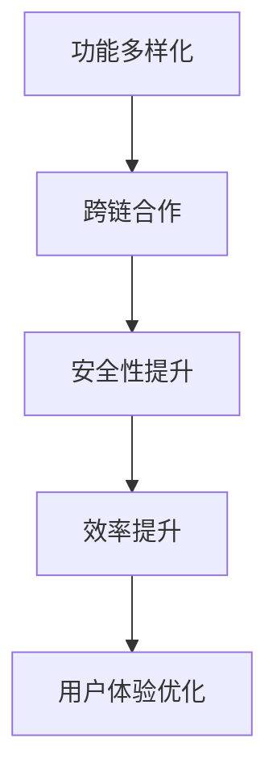

综上所述，去中心化众筹平台作为一种新兴的融资模式，具有去中介化、透明性、安全性和全球化等优势，同时也面临着技术门槛、法律监管和用户体验等挑战。随着区块链技术的不断进步，去中心化众筹平台有望在未来发挥更大的作用，成为创业融资的重要渠道。

#### 2.1 区块链技术概述

##### 2.1.1 区块链的基本概念

区块链是一种分布式账本技术，其核心特点是去中心化、不可篡改和可追溯性。区块链由多个区块组成，每个区块包含一定数量的交易记录，并通过密码学算法链接在一起，形成一条不断延伸的链式数据结构。区块链技术的出现，为数据存储和传输提供了一种全新的方式，解决了传统中心化系统中的单点故障、数据安全和信任问题。

###### 区块链的定义

区块链是一种去中心化的数据库系统，其中数据以块的形式存储，并通过密码学算法链接在一起，形成一条不可篡改的数据链。

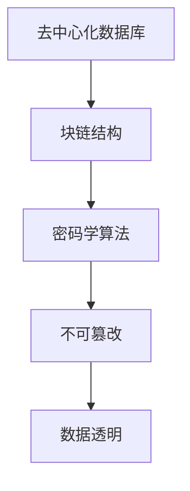

###### 区块链的特点

- **去中心化**：区块链不存在中央机构，所有节点都可以参与数据验证和记账，从而避免了单点故障的风险。
- **不可篡改**：区块链上的数据一旦记录，就难以篡改，因为要修改数据需要同时攻击大部分节点，这在实践中几乎不可能实现。
- **可追溯性**：区块链上的所有交易都有记录，可以追溯到具体的交易节点，增强了数据的透明性和可信度。
- **安全性**：区块链使用加密技术确保数据的安全，防止未经授权的访问和篡改。

##### 2.1.2 区块链的工作原理

区块链的工作原理可以概括为以下几个步骤：

1. **交易产生**：用户在区块链上进行交易，例如转账、购买等，交易信息被发送到区块链网络。
   
2. **交易验证**：区块链网络中的节点对交易信息进行验证，确保交易是有效的，并且遵守了区块链的规则。

3. **区块创建**：当一定数量的交易被验证后，节点将这些交易打包成一个区块。

4. **区块链接**：节点使用密码学算法将新创建的区块链接到区块链上，形成一条完整的链式结构。

5. **共识达成**：区块链网络中的节点通过共识算法达成一致，确认区块的有效性。

6. **数据存储**：新区块被加入到区块链中，数据永久存储在区块链上，供所有节点访问。

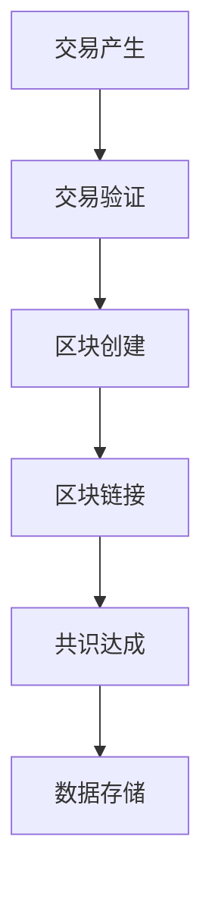

##### 2.1.3 区块链的核心技术

区块链的核心技术包括密码学、分布式网络、共识算法和智能合约等，它们共同构成了区块链的基础架构。

###### 密码学

密码学是区块链技术的重要组成部分，用于确保数据的安全和隐私。常见的密码学技术包括哈希函数、数字签名、加密算法等。

- **哈希函数**：将任意长度的输入数据转换成固定长度的输出，确保数据的唯一性和完整性。
- **数字签名**：用于验证数据的来源和完整性，确保只有合法的发送者可以发送数据。
- **加密算法**：用于保护数据的隐私，防止未经授权的访问。

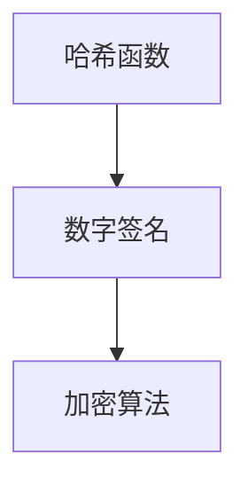

###### 分布式网络

分布式网络是区块链的基础架构，所有节点都参与数据的验证和存储。分布式网络通过P2P协议实现节点之间的通信和协作。

- **P2P协议**：点对点协议，节点之间直接进行通信，无需依赖中心化服务器。
- **节点同步**：新节点加入网络时，通过同步机制获取区块链的历史数据。

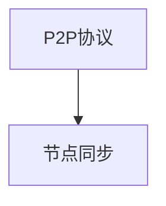

###### 共识算法

共识算法是区块链网络中的节点如何达成一致的重要机制。常见的共识算法包括工作量证明（PoW）、权益证明（PoS）等。

- **工作量证明（PoW）**：通过计算难度证明自己的工作量，获得记账权。
- **权益证明（PoS）**：根据节点的权益（如持有的代币数量）决定记账权。

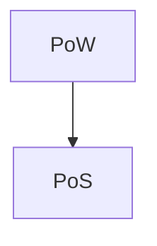

###### 智能合约

智能合约是区块链上的可执行代码，其条件在满足时自动执行。智能合约在区块链平台上实现了自动化和去中心化的交易规则。

- **Solidity**：最常用的智能合约编程语言，用于编写以太坊上的智能合约。
- **Truffle**：智能合约开发框架，提供模拟区块链环境、测试和部署工具。

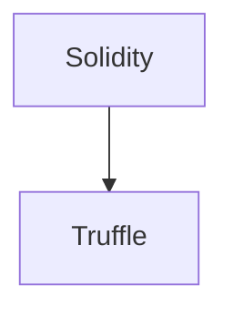

综上所述，区块链技术通过去中心化、不可篡改和可追溯性等特性，为数据存储和交易提供了全新的解决方案。理解区块链的基本概念和工作原理，对于深入探讨去中心化众筹平台具有重要意义。

#### 2.2 智能合约技术详解

##### 2.2.1 智能合约的定义

智能合约是区块链上的一种可执行代码，其条件在满足时自动执行。智能合约通过预定义的规则和条件，实现了自动化和去中心化的交易。智能合约的核心在于其透明性和不可篡改性，所有的交易记录都在区块链上公开，供所有节点验证和审计。

###### 智能合约的核心概念

- **条件执行**：智能合约中的代码在满足特定条件时自动执行，例如资金释放、合同执行等。
- **不可篡改性**：一旦智能合约被部署到区块链上，其代码和状态无法被修改，确保了交易的公正性。
- **透明性**：智能合约的代码和执行状态对所有节点公开，提高了交易的透明度和信任度。

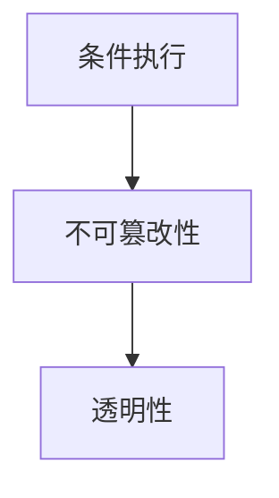

##### 2.2.2 智能合约的实现原理

智能合约的实现原理涉及编程语言、编译和部署等环节。智能合约通常使用Solidity等编程语言编写，经过编译器编译成字节码，然后部署到区块链上。

###### 编写智能合约

智能合约的编写类似于传统编程，但需要考虑区块链的特点和限制。Solidity是最常用的智能合约编程语言，其语法类似于JavaScript。

```solidity
// SPDX-License-Identifier: MIT
pragma solidity ^0.8.0;

contract Crowdfunding {
    address public owner;
    uint public target;
    uint public deadline;
    uint public totalContributed;
    mapping(address => uint) public contributions;

    constructor(uint _target, uint _deadline) {
        owner = msg.sender;
        target = _target;
        deadline = _deadline;
    }

    function contribute() public payable {
        require(block.timestamp <= deadline, "Deadline has passed");
        contributions[msg.sender] += msg.value;
        totalContributed += msg.value;
    }

    function releaseFunds() public {
        require(block.timestamp > deadline, "Deadline has not passed");
        require(totalContributed >= target, "Target not reached");
        payable(owner).transfer(totalContributed);
        selfdestruct(payable(msg.sender));
    }
}
```

###### 编译智能合约

编写完智能合约后，需要使用编译器将其编译成字节码。常用的编译器包括Truffle和Solc等。

```bash
solc --bin --stdin --output-dir ./build contract/Crowdfunding.sol
```

###### 部署智能合约

编译后的字节码和合约的ABI（Application Binary Interface）可以通过区块链网络进行部署。部署时，需要将字节码发送到区块链，并通过交易确认其有效性。

```solidity
// SPDX-License-Identifier: MIT
pragma solidity ^0.8.0;

contract Crowdfunding {
    // ...（智能合约代码）

    function deploy() public {
        bytes32 codeHash = keccak256(bytes.concat(code));
        address contractAddress = address(new bytes(codeHash));
        // ...（执行部署交易）
    }
}
```

##### 2.2.3 智能合约的安全性分析

智能合约的安全性直接影响到区块链应用的整体安全性。智能合约存在多种潜在的安全威胁，如重入攻击、逻辑漏洞、整数溢出等。因此，对智能合约进行严格的安全性分析是至关重要的。

###### 常见的安全威胁

- **重入攻击**：攻击者通过重复调用函数来获取未授权的访问权限。
- **逻辑漏洞**：智能合约中的代码存在漏洞，可能导致数据泄露或被篡改。
- **整数溢出**：整数类型溢出可能导致不期望的结果。
- **状态泄露**：智能合约可能泄露敏感信息，如账户余额。

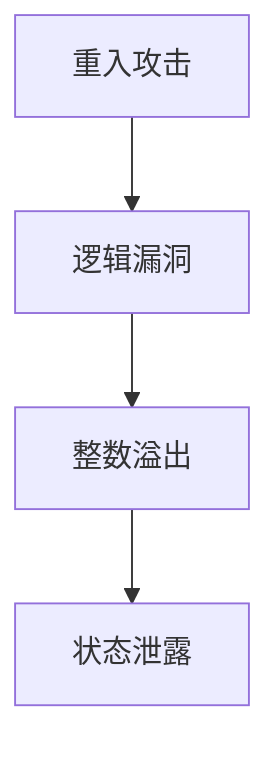

###### 安全性分析策略

- **代码审计**：通过专业人员对智能合约代码进行审计，查找潜在的安全漏洞。
- **形式化验证**：使用数学方法验证智能合约的正确性和安全性。
- **安全编程实践**：遵循安全编程的最佳实践，减少漏洞的产生。

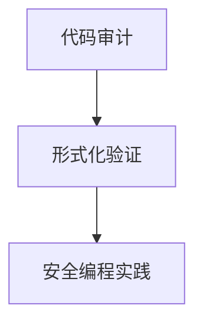

##### 2.2.4 智能合约的安全性优化策略

为了提升智能合约的安全性，可以采用以下优化策略：

- **最小权限原则**：智能合约应遵循最小权限原则，仅拥有执行必要操作的最小权限。
- **错误处理**：智能合约应具备完善的错误处理机制，防止因异常处理不当导致的安全问题。
- **代码重构**：定期对智能合约进行重构，消除潜在的漏洞。

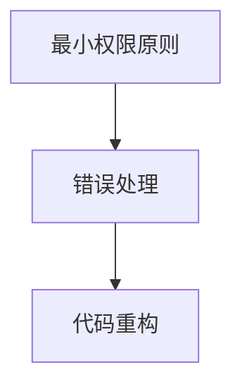

综上所述，智能合约在区块链技术中扮演着关键角色，通过定义和实现自动执行的合约，智能合约确保了区块链交易的透明性和安全性。理解和掌握智能合约的实现原理和安全性分析策略，对于开发去中心化众筹平台具有重要意义。

#### 2.3 常见的区块链平台

区块链技术自诞生以来，已经发展出多个不同的平台，每个平台都有其独特的特点和应用场景。以下是对几种常见区块链平台的概述。

##### 2.3.1 Ethereum

Ethereum是目前最流行的智能合约平台，由Vitalik Buterin于2015年创立。Ethereum的主要特点是支持智能合约，通过Solidity等编程语言，开发者可以在Ethereum平台上创建和部署去中心化应用（DApps）。Ethereum的智能合约功能使其在金融、游戏、供应链管理等多个领域得到了广泛应用。

- **核心特性**：
  - 智能合约：支持复杂逻辑和状态的智能合约。
  - DApps：去中心化应用，可在Ethereum上运行。
  - 智能合约编程语言：Solidity。
- **主要应用场景**：
  - 金融科技：去中心化金融（DeFi）应用。
  - 游戏行业：游戏开发和使用区块链进行游戏内交易。
  - 供应链管理：跟踪产品的来源和状态。

##### 2.3.2 Bitcoin

Bitcoin是由Satoshi Nakamoto在2009年创立的世界上第一个去中心化的加密货币。Bitcoin的主要特点是去中心化，所有交易记录都通过分布式网络进行验证和存储，不依赖于任何中央机构。Bitcoin的设计使其在金融领域具有广泛的应用，特别是在跨境支付和资产存储方面。

- **核心特性**：
  - 去中心化：无中央机构，所有交易通过分布式网络验证。
  - 交易记录：公开透明的区块链记录所有交易。
  - 不可篡改：一旦交易记录在区块链上，就无法被篡改。
- **主要应用场景**：
  - 跨境支付：快速、低成本的跨境交易。
  - 资产存储：数字化资产的安全存储。
  - 数字货币：作为货币进行交换和价值存储。

##### 2.3.3 其他区块链平台介绍

除了Ethereum和Bitcoin，还有其他一些重要的区块链平台，各具特色。

- **EOS**：EOS是由Block.one开发的一个高性能区块链平台，旨在支持去中心化应用的大规模部署。EOS使用权益证明（PoS）机制，通过持有代币的数量来决定记账权，提高了系统的效率。

  - **核心特性**：高性能、支持去中心化应用。
  - **主要应用场景**：金融科技、游戏、供应链管理。

- **Cardano**：Cardano是由IOHK开发的区块链平台，注重科学和学术验证。Cardano采用分层架构，使其能够进行持续改进和升级。

  - **核心特性**：分层架构、科学验证。
  - **主要应用场景**：金融、医疗保健、慈善。

- **Tron**：Tron是由波场基金会开发的一个去中心化平台，旨在建立去中心化的互联网生态系统。Tron使用基于用户参与度的共识算法，支持大规模的去中心化应用部署。

  - **核心特性**：去中心化互联网生态系统。
  - **主要应用场景**：游戏、社交媒体、数字资产交易。

综上所述，不同区块链平台各有其独特的优势和特点，开发者可以根据具体需求选择合适的平台进行应用开发。理解这些平台的基本特性和应用场景，对于构建去中心化众筹平台具有重要意义。

### 第3章：去中心化众筹平台的架构设计

去中心化众筹平台的设计需要考虑多个层次，包括用户层、应用层和数据层，每个层次都有其特定的功能和技术实现。以下是对去中心化众筹平台架构的详细描述。

##### 3.1 去中心化众筹平台的系统架构

去中心化众筹平台的系统架构可以分为三层：用户层、应用层和数据层。

###### 3.1.1 用户层

用户层是去中心化众筹平台与用户的交互界面，负责用户注册、登录、浏览项目、投资和反馈等功能。用户层的设计需要注重用户体验，使其简单直观，易于操作。

- **用户注册与身份认证**：用户层需要提供用户注册和身份认证的功能。用户注册时，需要提供基本的个人信息，并通过邮件或手机号码进行身份验证。身份认证可以采用多因素认证（MFA）来增强安全性。

  ```mermaid
  graph TB
    A[用户注册] --> B[身份认证]
    B --> C[账户激活]
  ```

- **用户交互界面设计**：用户交互界面设计要简洁明了，提供项目搜索、排序、筛选等功能。界面设计应确保用户能够快速找到感兴趣的项目，并进行投资。

  ```mermaid
  graph TB
    A[项目搜索] --> B[排序筛选]
    B --> C[投资决策]
  ```

###### 3.1.2 应用层

应用层是去中心化众筹平台的核心，负责项目发布、资金管理、项目审核和评价等功能。应用层的实现依赖于智能合约和区块链技术。

- **项目发布流程**：项目发起人可以在应用层上发布项目，包括项目名称、描述、筹集目标、筹款期限等信息。项目发布后，需要经过平台审核，确保项目符合平台标准。

  ```mermaid
  graph TB
    A[项目发布] --> B[项目审核]
    B --> C[项目上线]
  ```

- **众筹资金管理**：资金管理是去中心化众筹平台的关键功能。资金筹集过程中，资金会存储在区块链上的智能合约中，确保资金的安全性和透明性。智能合约会根据筹集目标是否达成来释放资金。

  ```mermaid
  graph TB
    A[资金筹集] --> B[智能合约管理]
    B --> C[资金释放]
  ```

- **项目评价与反馈机制**：项目完成后，投资者可以在应用层上对项目进行评价和反馈。评价和反馈机制不仅可以提高项目的透明度，还可以为其他投资者提供参考。

  ```mermaid
  graph TB
    A[项目评价] --> B[反馈机制]
    B --> C[项目评分]
  ```

###### 3.1.3 数据层

数据层负责存储去中心化众筹平台所需的各种数据，包括用户数据、项目数据、交易记录等。数据层通常采用区块链技术来实现，确保数据的分布式存储和不可篡改性。

- **用户数据存储**：用户数据包括用户账户信息、投资记录等。这些数据在区块链上以加密形式存储，确保用户隐私和安全。

  ```mermaid
  graph TB
    A[用户账户] --> B[投资记录]
    B --> C[数据加密]
  ```

- **项目数据存储**：项目数据包括项目详情、项目状态、筹集进度等。项目数据在区块链上公开存储，供所有用户查看。

  ```mermaid
  graph TB
    A[项目详情] --> B[项目状态]
    B --> C[数据公开]
  ```

- **交易记录存储**：交易记录包括资金的筹集、释放、转账等。交易记录在区块链上永久保存，确保交易的透明性和不可篡改性。

  ```mermaid
  graph TB
    A[交易记录] --> B[数据永久保存]
    B --> C[不可篡改]
  ```

##### 3.2 用户层的设计

用户层的设计目标是提供一个友好且易用的用户界面，使用户能够轻松地进行注册、登录、浏览项目、投资和评价。

- **用户注册与身份认证**：用户注册时，需要提供邮箱、手机号码和密码等信息。注册完成后，平台会通过邮件或短信发送验证码进行身份认证，确保用户的真实性。

  ```mermaid
  graph TB
    A[用户注册] --> B[验证码发送]
    B --> C[身份认证]
  ```

- **用户交互界面设计**：用户交互界面应简洁明了，提供快速搜索、分类筛选等功能，帮助用户快速找到感兴趣的项目。同时，界面应提供实时进度条，展示项目的筹集情况和投资进度。

  ```mermaid
  graph TB
    A[快速搜索] --> B[分类筛选]
    B --> C[实时进度]
  ```

##### 3.3 应用层的设计

应用层是去中心化众筹平台的核心部分，负责项目的发布、审核、资金管理和评价等功能。

- **项目发布流程**：项目发起人可以在应用层上发布项目。发布时，需要填写项目名称、描述、筹集目标、筹款期限等信息。平台会对项目进行审核，确保其符合平台标准。

  ```mermaid
  graph TB
    A[项目发布] --> B[项目审核]
    B --> C[项目上线]
  ```

- **众筹资金管理**：众筹资金管理由智能合约实现。投资者通过智能合约向项目发起人投资，资金会在智能合约中锁定，直到筹集目标达成或筹款期限结束。智能合约确保了资金的安全性和透明性。

  ```mermaid
  graph TB
    A[资金筹集] --> B[智能合约管理]
    B --> C[资金释放]
  ```

- **项目评价与反馈机制**：项目完成后，投资者可以在应用层上对项目进行评价和反馈。评价和反馈机制不仅可以提高项目的透明度，还可以为其他投资者提供参考。

  ```mermaid
  graph TB
    A[项目评价] --> B[反馈机制]
    B --> C[项目评分]
  ```

##### 3.4 数据层的设计

数据层是去中心化众筹平台的数据存储部分，负责存储用户数据、项目数据和交易记录。

- **用户数据存储**：用户数据包括用户账户信息、投资记录等。这些数据在区块链上以加密形式存储，确保用户隐私和安全。

  ```mermaid
  graph TB
    A[用户账户] --> B[投资记录]
    B --> C[数据加密]
  ```

- **项目数据存储**：项目数据包括项目详情、项目状态、筹集进度等。项目数据在区块链上公开存储，供所有用户查看。

  ```mermaid
  graph TB
    A[项目详情] --> B[项目状态]
    B --> C[数据公开]
  ```

- **交易记录存储**：交易记录包括资金的筹集、释放、转账等。交易记录在区块链上永久保存，确保交易的透明性和不可篡改性。

  ```mermaid
  graph TB
    A[交易记录] --> B[数据永久保存]
    B --> C[不可篡改]
  ```

综上所述，去中心化众筹平台的架构设计需要综合考虑用户层、应用层和数据层的各个方面，确保平台的高效运行和用户的安全体验。通过合理的设计和实现，去中心化众筹平台可以成为创业融资的重要工具。

#### 第4章：智能合约与去中心化众筹平台

##### 4.1 智能合约在众筹平台中的应用

智能合约在去中心化众筹平台中扮演着至关重要的角色，它们不仅是平台的核心技术，也是实现去中心化、透明性和安全性的关键。以下是智能合约在去中心化众筹平台中的应用及其重要性。

###### 4.1.1 智能合约在众筹过程中的作用

智能合约在去中心化众筹平台中的作用可以概括为以下几点：

- **资金筹集管理**：智能合约负责管理众筹过程中的资金流动。当投资者向项目发起人投资时，智能合约会自动记录这笔交易，并将其锁定，直到项目筹集到目标资金或筹款期限结束。

  ```solidity
  function contribute() public payable {
      require(block.timestamp <= deadline, "Deadline has passed");
      contributions[msg.sender] += msg.value;
      totalContributed += msg.value;
  }
  ```

- **资金释放与分配**：当项目筹集到目标资金或筹款期限结束时，智能合约会根据预定的规则自动释放资金给项目发起人。如果项目未能筹集到目标资金，智能合约则会将所有未使用的资金退还给投资者。

  ```solidity
  function releaseFunds() public {
      require(block.timestamp > deadline, "Deadline has not passed");
      require(totalContributed >= target, "Target not reached");
      payable(owner).transfer(totalContributed);
      selfdestruct(payable(msg.sender));
  }
  ```

- **智能合约执行规则**：智能合约可以定义复杂的规则，确保众筹过程的公平性和透明性。例如，智能合约可以设置最低投资额、投资人数限制等规则，防止恶意攻击和欺诈行为。

  ```solidity
  function setMinimumContribution(uint _minimum) public {
      require(msg.sender == owner, "Only the owner can set the minimum contribution");
      minimumContribution = _minimum;
  }
  ```

- **项目审核与监控**：智能合约可以集成项目审核机制，确保只有符合平台标准的项目才能上线。此外，智能合约还可以监控项目的进展情况，确保项目按计划执行。

  ```solidity
  function projectStatus(uint _projectId, string memory _status) public {
      require(msg.sender == owner, "Only the owner can update the project status");
      projectStatuses[_projectId] = _status;
  }
  ```

###### 4.1.2 众筹项目的智能合约设计

众筹项目的智能合约设计需要考虑以下几个方面：

- **众筹规则**：智能合约需要定义众筹的基本规则，包括筹集目标、筹款期限、最低投资额、投资人数限制等。这些规则将在智能合约中通过预定义的函数进行实现。

  ```solidity
  uint public target;
  uint public deadline;
  uint public minimumContribution;
  uint public maxInvestors;
  ```

- **资金管理**：智能合约需要管理资金的筹集、锁定和释放。这通常通过两个关键函数实现：`contribute()` 和 `releaseFunds()`。此外，还可以添加额外的功能，如部分释放资金、退款等。

  ```solidity
  function contribute() public payable {
      require(msg.value >= minimumContribution, "Contribution below minimum");
      require(block.timestamp <= deadline, "Deadline has passed");
      contributions[msg.sender] += msg.value;
      totalContributed += msg.value;
  }

  function releaseFunds() public {
      require(block.timestamp > deadline, "Deadline has not passed");
      require(totalContributed >= target, "Target not reached");
      payable(owner).transfer(totalContributed);
      selfdestruct(payable(msg.sender));
  }
  ```

- **项目审核**：智能合约可以集成项目审核机制，确保只有通过审核的项目才能上线。这通常需要一个额外的审核函数，由平台管理员调用。

  ```solidity
  function approveProject(uint _projectId) public {
      require(msg.sender == owner, "Only the owner can approve projects");
      approvedProjects[_projectId] = true;
  }
  ```

- **项目状态更新**：智能合约需要能够更新项目的状态，例如筹集进度、项目完成状态等。这可以通过预定义的函数实现，以便项目发起人更新项目状态。

  ```solidity
  function updateProjectStatus(uint _projectId, string memory _status) public {
      require(msg.sender == owner, "Only the owner can update project status");
      projectStatuses[_projectId] = _status;
  }
  ```

综上所述，智能合约在去中心化众筹平台中发挥着至关重要的作用，通过定义和实现众筹规则、资金管理、项目审核和状态更新等功能，智能合约确保了众筹过程的去中心化、透明性和安全性。

##### 4.2 常见的智能合约开发框架

智能合约开发框架为开发者提供了丰富的工具和库，简化了智能合约的开发和部署过程。以下是对几种常见智能合约开发框架的介绍。

###### 4.2.1 Solidity

Solidity是最常用的智能合约编程语言，由Ethereum平台推出。Solidity具有类似JavaScript的语法，易于学习，同时支持复杂的数据结构和函数。开发者可以使用Solidity编写智能合约，并在Ethereum网络上进行部署和执行。

- **主要特性**：
  - 类似JavaScript的语法。
  - 支持复杂的数据结构。
  - 支持函数重载和继承。
- **开发工具**：
  - Remix：在线IDE，提供代码编写、编译和测试功能。
  - Truffle：智能合约开发框架，提供模拟环境、测试和部署工具。
- **示例代码**：

```solidity
// SPDX-License-Identifier: MIT
pragma solidity ^0.8.0;

contract Crowdfunding {
    address public owner;
    uint public target;
    uint public deadline;
    uint public totalContributed;

    constructor(uint _target, uint _deadline) {
        owner = msg.sender;
        target = _target;
        deadline = _deadline;
    }

    function contribute() public payable {
        require(block.timestamp <= deadline, "Deadline has passed");
        totalContributed += msg.value;
    }

    function releaseFunds() public {
        require(block.timestamp > deadline, "Deadline has not passed");
        require(totalContributed >= target, "Target not reached");
        payable(owner).transfer(totalContributed);
    }
}
```

###### 4.2.2 Truffle

Truffle是一个智能合约开发框架，旨在简化智能合约的开发、测试和部署过程。Truffle支持多种区块链平台，包括Ethereum、Binance Smart Chain等。Truffle提供了一套完整的工具集，包括本地开发环境、测试框架、迁移工具等。

- **主要特性**：
  - 本地开发环境：无需连接区块链，即可在本地开发和测试智能合约。
  - 测试框架：支持多种测试框架，如Mocha、Jest等。
  - 部署工具：支持自动化部署和迁移。
- **开发工具**：
  - Truffle Console：交互式控制台，用于与区块链进行交互。
  - Truffle Develop：本地区块链节点，用于模拟和测试智能合约。
- **示例代码**：

```javascript
// truffle.js
module.exports = {
    networks: {
        development: {
            host: "127.0.0.1",
            port: 8545,
            network_id: "*",
        },
    },
};
```

###### 4.2.3 Hardhat

Hardhat是一个新兴的智能合约开发框架，因其高效、灵活和易用性而受到开发者的喜爱。Hardhat提供了本地开发环境、测试框架、调试工具等，同时还支持EVM（Ethereum Virtual Machine）模拟器，使得开发者可以在本地进行全面的测试和调试。

- **主要特性**：
  - 本地开发环境：无需连接区块链，即可在本地开发和测试智能合约。
  - 测试框架：支持多种测试框架，如Mocha、Jest等。
  - 调试工具：提供丰富的调试功能，包括断点调试、监视变量等。
- **开发工具**：
  - Hardhat Network：本地区块链网络，用于模拟和测试智能合约。
  - Hardhat Console：交互式控制台，用于与区块链进行交互。
- **示例代码**：

```javascript
// hardhat.config.js
require("@nomiclabs/hardhat-waffle");

module.exports = {
    networks: {
        localhost: {
            url: "http://127.0.0.1:8545",
        },
    },
    solidity: "0.8.0",
};
```

综上所述，Solidity、Truffle和Hardhat是智能合约开发中常用的三个框架，它们各自具有独特的优势和特点。开发者可以根据项目需求和开发环境选择合适的框架，以简化智能合约的开发和部署过程。

##### 4.3 智能合约的安全性分析与优化

智能合约的安全性直接影响到区块链应用的整体安全性，因此在开发智能合约时，必须进行严格的安全性分析和优化。以下是智能合约安全性分析的关键点以及优化策略。

###### 4.3.1 智能合约安全性的挑战

智能合约的安全性问题多种多样，以下是一些常见的挑战：

- **重入攻击**：攻击者通过重复调用函数来获取未授权的访问权限。例如，在调用外部合约的函数后，攻击者可以重复执行该函数以获取资金。
- **逻辑漏洞**：智能合约中的代码可能存在逻辑漏洞，导致数据泄露或被篡改。常见的逻辑漏洞包括不正确的状态更新、不合理的条件判断等。
- **整数溢出**：整数类型溢出可能导致不期望的结果，例如资金泄露或锁定的资金无法释放。
- **状态泄露**：智能合约可能泄露敏感信息，如账户余额和交易记录。

###### 4.3.2 智能合约安全性的优化策略

为了提升智能合约的安全性，可以采用以下优化策略：

- **最小权限原则**：智能合约应遵循最小权限原则，仅拥有执行必要操作的最小权限。例如，智能合约不应该持有大量的以太币，而应仅持有完成特定操作所需的资金。

  ```solidity
  function transferFunds(address _to, uint _amount) public {
      require(_amount <= address(this).balance, "Insufficient funds");
      payable(_to).transfer(_amount);
  }
  ```

- **错误处理**：智能合约应具备完善的错误处理机制，防止因异常处理不当导致的安全问题。可以使用`require()`和`assert()`函数来检查输入参数和执行条件，确保代码的鲁棒性。

  ```solidity
  function updateProjectStatus(uint _projectId, string memory _status) public {
      require(_projectId > 0 && _status != "", "Invalid input");
      projectStatuses[_projectId] = _status;
  }
  ```

- **代码审计**：对智能合约代码进行审计是提高安全性的重要手段。可以通过聘请专业的安全审计团队，或使用自动化审计工具（如Oyente、Slither等）来查找潜在的安全漏洞。

  ```bash
  slither --config .slither.yml MyContract.sol
  ```

- **形式化验证**：形式化验证是一种通过数学方法验证智能合约正确性和安全性的方法。可以使用工具如Coq、Isabelle等来证明智能合约的性质，确保其满足预期的安全性和功能性要求。

  ```coq
  Lemma safe_release_funds :
    (forall (owner : address), (balance : uint),
     releaseFunds() -> balance >= target).
  ```

- **代码重构**：定期对智能合约进行重构，消除潜在的漏洞。重构不仅有助于提高代码的可读性和可维护性，还可以减少由于代码复杂度增加而导致的安全问题。

  ```solidity
  function releaseFunds() public {
      require(block.timestamp > deadline, "Deadline has not passed");
      require(totalContributed >= target, "Target not reached");
      payable(owner).transfer(totalContributed);
  }
  ```

- **最佳实践**：遵循智能合约开发的最佳实践，如避免使用库函数、减少状态变量的使用等。这些实践有助于减少代码复杂度，提高安全性。

  ```solidity
  function contribute() public payable {
      require(msg.value > 0, "Invalid contribution");
      contributions[msg.sender] += msg.value;
      totalContributed += msg.value;
  }
  ```

综上所述，智能合约的安全性分析是一个复杂且关键的任务，需要采用多种策略和工具来提高代码的安全性和可靠性。通过严格的代码审计、形式化验证、最小权限原则和代码重构等优化策略，可以大幅降低智能合约的风险，确保区块链应用的长期稳定运行。

##### 5.1 实战项目：一个简单的去中心化众筹平台

在本节中，我们将构建一个简单的去中心化众筹平台，通过具体的步骤来实现一个去中心化的众筹项目，从需求分析到最终实现。

###### 5.1.1 项目需求分析

在构建去中心化众筹平台之前，我们需要明确项目的需求。以下是一个简单的需求分析：

- **功能需求**：
  - 用户注册与登录。
  - 项目发布与展示。
  - 投资功能。
  - 项目状态更新。
  - 交易记录查看。

- **非功能需求**：
  - 数据的透明性和安全性。
  - 易用性。
  - 可扩展性。

基于以上需求，我们可以确定平台的基本架构和功能模块。

###### 5.1.2 项目架构设计

去中心化众筹平台的架构设计可以分为三个主要层次：用户层、应用层和数据层。

- **用户层**：用户层负责用户界面和与用户的交互。用户可以通过界面进行注册、登录、浏览项目、投资和查看交易记录。

- **应用层**：应用层是智能合约层，负责实现项目的逻辑和业务规则。智能合约将处理项目发布、投资、资金管理和项目状态更新等核心功能。

- **数据层**：数据层负责存储用户数据、项目数据和交易记录。数据将存储在区块链上，确保数据的透明性和不可篡改性。

架构设计的关键组件包括：

- **用户注册与登录**：通过以太坊账户系统实现用户注册和登录。
- **项目发布**：项目发起人可以发布项目，包括项目名称、描述、筹集目标和筹款期限等。
- **投资功能**：投资者可以投资项目，资金将锁定在智能合约中，直到项目筹集到目标资金或筹款期限结束。
- **项目状态更新**：项目发起人可以更新项目状态，例如项目完成、筹集成功等。
- **交易记录查看**：用户可以查看自己的交易记录和项目状态。

以下是项目架构的Mermaid流程图：

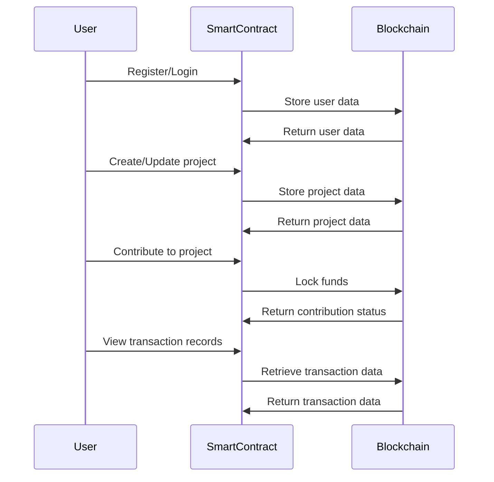

###### 5.1.3 代码实现与测试

以下是一个简单的去中心化众筹平台的智能合约实现示例，使用Solidity语言编写。

```solidity
// SPDX-License-Identifier: MIT
pragma solidity ^0.8.0;

contract Crowdfunding {
    address public owner;
    mapping(uint => Project) public projects;
    uint public projectCount;

    struct Project {
        string name;
        string description;
        uint target;
        uint deadline;
        uint totalFunds;
        mapping(address => uint) contributions;
    }

    event ProjectCreated(
        uint projectId,
        string name,
        string description,
        uint target,
        uint deadline
    );

    event ContributionReceived(
        uint projectId,
        address contributor,
        uint amount
    );

    event ProjectCompleted(uint projectId);

    constructor() {
        owner = msg.sender;
    }

    function createProject(
        string memory name,
        string memory description,
        uint target,
        uint deadline
    ) public {
        require(msg.sender == owner, "Only the owner can create projects");
        projectCount++;
        projects[projectCount] = Project(
            name,
            description,
            target,
            deadline,
            0
        );
        emit ProjectCreated(projectCount, name, description, target, deadline);
    }

    function contributeToProject(uint projectId, uint amount) public payable {
        require(projects[projectId].deadline > block.timestamp, "Deadline has passed");
        require(amount > 0, "Invalid contribution amount");
        projects[projectId].contributions[msg.sender] += amount;
        projects[projectId].totalFunds += amount;
        emit ContributionReceived(projectId, msg.sender, amount);
    }

    function releaseFunds(uint projectId) public {
        require(msg.sender == owner, "Only the owner can release funds");
        require(projects[projectId].totalFunds >= projects[projectId].target, "Target not reached");
        payable(owner).transfer(projects[projectId].totalFunds);
        emit ProjectCompleted(projectId);
    }
}
```

在实现代码后，需要进行详细的测试，以确保智能合约的功能和安全性。可以使用Truffle框架和Mocha测试库进行测试。

```javascript
// test/Crowdfunding.test.js
const { ethers } = require("hardhat");
const { expect } = require("chai");

describe("Crowdfunding", function () {
    let owner, deployer, user1, user2;
    let Crowdfunding;

    beforeEach(async function () {
        [owner, deployer, user1, user2] = await ethers.getSigners();
        Crowdfunding = await ethers.getContractFactory("Crowdfunding");
        const crowdfund = await Crowdfunding.deploy();
        await crowdfund.deployed();
    });

    it("Should create a project", async function () {
        const projectId = await crowdfund.createProject(
            "New Project",
            "This is a new project.",
            ethers.utils.parseEther("100"),
            1620155000
        );
        const project = await crowdfund.projects(projectId);
        expect(project.name).to.equal("New Project");
        expect(project.description).to.equal("This is a new project.");
        expect(project.target).to.equal(ethers.utils.parseEther("100"));
        expect(project.deadline).to.equal(1620155000);
    });

    it("Should allow users to contribute to a project", async function () {
        const projectId = await crowdfund.projects(1);
        await crowdfund.connect(user1).contributeToProject(1, ethers.utils.parseEther("10"));
        const newFunds = await crowdfund.projects(1).totalFunds();
        expect(newFunds).to.equal(ethers.utils.parseEther("10"));
    });

    it("Should not allow contributions after the deadline", async function () {
        const projectId = await crowdfund.projects(1);
        await crowdfund.connect(user1).contributeToProject(1, ethers.utils.parseEther("10"));
        await ethers.provider.send("evm_increaseTime", [24 * 60 * 60]);
        await ethers.provider.send("evm_mine");
        await expect(crowdfund.connect(user2).contributeToProject(1, ethers.utils.parseEther("20"))).to.be.rejectedWith(
            "Deadline has passed"
        );
    });

    it("Should release funds to the owner when the target is reached", async function () {
        const projectId = await crowdfund.projects(1);
        await crowdfund.connect(user1).contributeToProject(1, ethers.utils.parseEther("100"));
        await crowdfund.releaseFunds(1);
        const ownerBalance = await ethers.provider.getBalance(owner);
        expect(ownerBalance).to.equal(ethers.utils.parseEther("100"));
    });
});
```

通过以上步骤，我们完成了一个简单的去中心化众筹平台的实现和测试。这个平台包括用户注册、项目发布、投资和资金管理等功能，通过智能合约实现了去中心化和安全性。

##### 5.2 实战项目：一个去中心化智能合约的部署与使用

在本节中，我们将详细介绍如何部署一个去中心化智能合约，并在区块链上执行交易。我们将使用Ethereum网络作为示例。

###### 5.2.1 智能合约的编写与编译

首先，我们需要编写智能合约的代码。以下是一个简单的去中心化众筹智能合约的示例，使用Solidity语言编写：

```solidity
// SPDX-License-Identifier: MIT
pragma solidity ^0.8.0;

contract Crowdfunding {
    mapping(uint => Project) public projects;
    uint public projectCount;

    struct Project {
        string name;
        string description;
        uint target;
        uint deadline;
        uint totalFunds;
        mapping(address => uint) contributions;
    }

    event ProjectCreated(
        uint projectId,
        string name,
        string description,
        uint target,
        uint deadline
    );

    event ContributionReceived(
        uint projectId,
        address contributor,
        uint amount
    );

    event ProjectCompleted(uint projectId);

    constructor() {
        projectCount = 0;
    }

    function createProject(
        string memory name,
        string memory description,
        uint target,
        uint deadline
    ) public {
        require(target > 0, "Target must be greater than 0");
        require(deadline > block.timestamp, "Invalid deadline");

        projectCount++;
        projects[projectCount] = Project({
            name: name,
            description: description,
            target: target,
            deadline: deadline,
            totalFunds: 0
        });

        emit ProjectCreated(projectCount, name, description, target, deadline);
    }

    function contributeToProject(uint projectId, uint amount) public payable {
        require(projects[projectId].deadline > block.timestamp, "Deadline has passed");
        require(amount > 0, "Invalid contribution amount");

        projects[projectId].contributions[msg.sender] += amount;
        projects[projectId].totalFunds += amount;

        emit ContributionReceived(projectId, msg.sender, amount);
    }

    function releaseFunds(uint projectId) public {
        require(msg.sender == projects[projectId].owner, "Only the project owner can release funds");
        require(projects[projectId].totalFunds >= projects[projectId].target, "Target not reached");

        payable(projects[projectId].owner).transfer(projects[projectId].totalFunds);
        emit ProjectCompleted(projectId);
    }
}
```

编写完智能合约代码后，我们需要将其编译成字节码。可以使用Truffle框架进行编译：

```bash
npx truffle compile
```

这将在`build/contracts/`目录下生成编译后的字节码文件。

###### 5.2.2 智能合约的部署与调用

接下来，我们需要将编译后的智能合约部署到Ethereum网络上。首先，确保已经安装了Truffle框架和Ganache本地节点。使用以下命令启动Ganache：

```bash
npx ganache-cli
```

然后，在Truffle项目中，配置`truffle.js`文件，指定网络和合约：

```javascript
module.exports = {
    networks: {
        development: {
            provider: () => new HDWalletProvider(mnemonic, `http://127.0.0.1:7545`),
            network_id: '*',
        },
    },
};
```

使用Truffle部署智能合约：

```bash
npx truffle migrate --network development
```

部署完成后，可以在`deployed`目录下找到部署的合约地址。

###### 5.2.3 智能合约的安全测试

部署智能合约后，我们需要进行安全测试以确保其没有潜在的安全漏洞。可以使用Truffle框架和Slither工具进行安全测试：

```bash
npx truffle test --network development
```

这将在`test/`目录下执行智能合约测试，确保其功能正确且安全。

###### 5.2.4 智能合约的调用

现在，我们可以使用部署的智能合约进行交易。在Truffle环境中，我们可以使用以下命令调用智能合约的函数：

```javascript
const Crowdfunding = artifacts.require("Crowdfunding");
const crowdfunding = await Crowdfunding.deployed();

// 创建项目
await crowdfunding.createProject("Project Name", "Project Description", ethers.utils.parseEther("100"), 1620155000);

// 贡献资金
await crowdfunding.connect(accounts[1]).contributeToProject(1, ethers.utils.parseEther("10"));

// 释放资金
await crowdfunding.releaseFunds(1);
```

在以上示例中，我们首先部署了智能合约，然后使用Truffle环境调用其函数，完成了项目的创建、资金筹集和资金释放过程。

通过以上步骤，我们成功部署并使用了去中心化智能合约，实现了项目的去中心化管理和资金流动。这为去中心化众筹平台提供了坚实的基础，确保了数据的透明性和安全性。

#### 第6章：去中心化众筹平台的运营与管理

##### 6.1 去中心化众筹平台的运营策略

去中心化众筹平台的运营策略是确保平台稳定运行、项目质量高、用户体验佳的关键。以下是几个关键的运营策略：

###### 6.1.1 平台的内容审核

内容审核是去中心化众筹平台运营的首要任务，确保项目符合平台标准和法律法规。以下是一些内容审核的最佳实践：

- **项目真实性审核**：对项目发起人的身份、项目背景、团队信息等进行核实，确保项目真实可信。
- **项目质量审核**：评估项目的可行性、市场前景、技术方案等，确保项目具有投资价值。
- **法律法规审核**：确保项目遵守相关法律法规，如反洗钱法规、证券法规等。
- **用户反馈机制**：建立用户反馈机制，收集投资者和公众的意见，及时处理违规项目和不良行为。

###### 6.1.2 平台的激励机制

激励机制是提升用户活跃度和项目成功率的重要手段。以下是一些常见的激励机制：

- **奖励计划**：对积极参与项目的投资者和项目发起人提供奖励，如代币奖励、折扣等。
- **用户等级系统**：建立用户等级系统，根据用户的投资金额、参与度等指标，给予不同等级的用户特殊权益。
- **社区建设**：鼓励用户参与社区讨论、项目评价等，增强用户粘性和平台活跃度。
- **营销推广**：通过社交媒体、合作伙伴等渠道，进行平台和项目的推广，提高平台知名度和用户量。

###### 6.1.3 平台的合规性问题

去中心化众筹平台需要遵守不同国家和地区法律法规，以确保合法运营。以下是一些合规性问题的处理：

- **监管政策了解**：及时关注各国监管政策的变化，确保平台符合最新法规。
- **合规性评估**：对平台和项目进行全面合规性评估，确保所有业务符合法律要求。
- **风险控制**：建立风险控制机制，防范合规性风险，如反洗钱、证券交易等。
- **法律顾问咨询**：聘请专业法律顾问，为平台运营提供法律支持和合规建议。

##### 6.2 去中心化众筹平台的风险管理

去中心化众筹平台面临多种风险，包括市场风险、技术风险、法律风险等。有效的风险管理策略是确保平台稳健运营的关键。以下是几个关键的风险管理策略：

###### 6.2.1 投资者保护措施

投资者保护措施是降低投资风险的重要环节。以下是一些常见的投资者保护措施：

- **资金隔离**：将投资者的资金与平台运营资金隔离，确保投资者资金的安全。
- **风险提示**：在项目发布和投资过程中，向投资者提供充分的风险提示，帮助其做出明智的投资决策。
- **信息披露**：要求项目发起人提供完整、准确的信息，确保投资者对项目有全面的了解。
- **投资限额**：设置投资限额，限制投资者单笔投资金额，降低投资风险。

###### 6.2.2 项目风险评估

项目风险评估是确保项目质量和投资安全的关键。以下是一些项目风险评估的方法：

- **尽职调查**：对项目发起人、团队、技术方案、市场前景等进行全面调查，评估项目的可行性。
- **风险评估模型**：建立风险评估模型，对项目进行量化评估，识别潜在风险。
- **风险预警机制**：建立风险预警机制，及时发现并处理项目风险。

###### 6.2.3 平台风险控制策略

平台风险控制策略是确保平台运营安全和稳健的关键。以下是一些平台风险控制策略：

- **技术安全保障**：采用先进的技术措施，如区块链加密、智能合约审计等，确保平台安全。
- **数据备份与恢复**：建立数据备份与恢复机制，防止数据丢失和系统故障。
- **应急响应机制**：建立应急响应机制，确保在发生网络安全事件时能够迅速应对。
- **持续监控与改进**：对平台进行持续监控和评估，及时发现和解决潜在问题，持续改进平台安全性和稳定性。

##### 6.3 去中心化众筹平台的市场推广

市场推广是提升去中心化众筹平台知名度和用户量的关键。以下是一些市场推广策略：

###### 6.3.1 平台的品牌建设

平台品牌建设是提升平台形象和信誉度的关键。以下是一些品牌建设策略：

- **品牌定位**：明确平台的核心价值和目标用户群体，塑造独特的品牌形象。
- **品牌传播**：通过社交媒体、广告、合作等渠道，传播平台品牌信息，提升知名度。
- **品牌合作**：与其他知名品牌合作，通过合作提升平台品牌影响力。

###### 6.3.2 市场推广策略

市场推广策略是吸引更多用户和项目的关键。以下是一些市场推广策略：

- **内容营销**：通过发布高质量的内容，如博客、白皮书、案例分析等，吸引潜在用户和项目方。
- **活动营销**：举办线上或线下的活动，如研讨会、路演、发布会等，提高平台曝光度。
- **合作伙伴**：与其他平台、机构和行业专家合作，共同推广平台和项目。
- **SEO优化**：通过搜索引擎优化（SEO），提高平台在搜索引擎中的排名，吸引更多用户。

###### 6.3.3 用户社群的运营

用户社群的运营是增强用户粘性和活跃度的关键。以下是一些用户社群运营策略：

- **社群建设**：建立多种形式的社群，如微信群、QQ群、Telegram群等，满足不同用户的需求。
- **互动活动**：举办各种形式的互动活动，如问答、抽奖、投票等，提高用户参与度。
- **用户反馈**：积极收集用户反馈，及时回应用户需求，优化平台服务。
- **内容分享**：鼓励用户在社群中分享经验、心得和见解，促进社群氛围。

通过以上策略，去中心化众筹平台可以提升品牌知名度、吸引更多用户和项目，实现稳健运营和持续发展。

### 第7章：去中心化众筹平台的应用场景

去中心化众筹平台以其去中心化、透明性和安全性等特点，在多个领域展示了其独特的优势。以下将详细介绍去中心化众筹平台在初创企业融资、艺术品市场、慈善领域以及其他创新应用场景中的应用。

##### 7.1 去中心化众筹在初创企业融资中的应用

初创企业通常面临着资金短缺的问题，而传统的融资渠道如银行贷款和风险投资往往门槛较高。去中心化众筹平台为初创企业提供了新的融资渠道，通过公开透明的众筹方式，初创企业可以直接从全球投资者那里筹集资金。

###### 7.1.1 初创企业的融资需求

初创企业在融资时通常需要满足以下需求：
- **资金量**：初创企业往往需要大量的资金来支持产品开发和市场推广。
- **融资速度**：初创企业需要快速获取资金来抓住市场机遇。
- **成本**：传统融资渠道往往涉及高昂的手续费和中介费用，初创企业希望降低融资成本。

###### 7.1.2 去中心化众筹的优势与挑战

去中心化众筹平台在初创企业融资中具有以下优势：
- **去中介化**：去中心化众筹平台省去了传统中介机构的费用，降低了融资成本。
- **全球化**：初创企业可以通过去中心化众筹平台接触到全球投资者，拓展融资渠道。
- **透明性**：所有交易记录都在区块链上公开，投资者可以实时查看项目的进展和资金流向。

然而，去中心化众筹平台也面临一些挑战：
- **技术门槛**：初创企业需要具备一定的区块链和智能合约技术知识，以便使用这些平台。
- **法律监管**：不同国家和地区的法律监管存在差异，初创企业需要遵守当地法律法规。

##### 7.2 去中心化众筹在艺术品市场的应用

艺术品市场长期以来依赖于传统的拍卖和画廊模式，这些模式通常存在信息不透明、交易成本高和评估标准不统一等问题。去中心化众筹平台为艺术品市场带来了新的解决方案。

###### 7.2.1 艺术品市场的问题

- **信息不对称**：艺术品交易双方往往信息不对称，买家难以获取详细的鉴定信息和历史记录。
- **交易成本高**：传统艺术品交易涉及复杂的流程和中介费用，交易成本较高。
- **评估标准不统一**：艺术品的价值评估缺乏统一标准，导致市场定价不透明。

###### 7.2.2 去中心化众筹的优势

去中心化众筹平台在艺术品市场中的应用具有以下优势：
- **透明性**：所有交易记录都在区块链上公开，确保交易的透明性和可追溯性。
- **降低成本**：去中心化交易省去了中介费用，降低了交易成本。
- **去中介化**：艺术家可以直接与买家进行交易，摆脱了传统画廊和拍卖行的控制。

##### 7.3 去中心化众筹在慈善领域的应用

慈善领域一直以来面临着资金筹集困难、透明度不足和监管不足等问题。去中心化众筹平台通过其去中心化、透明和安全的特性，为慈善领域提供了新的解决方案。

###### 7.3.1 慈善领域的问题

- **资金筹集困难**：慈善项目往往难以通过传统渠道筹集到足够的资金。
- **透明度不足**：传统慈善机构的财务状况和项目进展缺乏透明度，导致公众信任度下降。
- **监管不足**：慈善资金的使用和分配缺乏有效监管，容易导致资金滥用。

###### 7.3.2 去中心化众筹的优势

去中心化众筹平台在慈善领域中的应用具有以下优势：
- **去中介化**：慈善项目可以直接接触到全球投资者，节省了中介费用。
- **透明性**：所有捐赠和项目进展都在区块链上公开，确保资金的透明性和可追溯性。
- **安全性**：区块链技术确保了捐赠资金的安全性和不可篡改性。

##### 7.4 去中心化众筹在其他创新应用场景中的应用

去中心化众筹平台的应用不仅限于上述领域，还可以在其他创新应用场景中发挥重要作用。

###### 7.4.1 房地产

去中心化众筹平台可以用于房地产项目的融资，通过众筹方式筹集资金，降低房地产开发的门槛。房地产项目可以通过区块链记录和验证产权，确保交易的透明性和安全性。

###### 7.4.2 医疗健康

在医疗健康领域，去中心化众筹平台可以用于筹集资金支持新药研发、医疗设备购置等。通过众筹，医疗项目可以快速筹集到资金，加快研发进程。

###### 7.4.3 教育领域

在教育领域，去中心化众筹平台可以用于资助学生学费、奖学金等。学生和项目发起人可以直接在区块链上进行交易，确保资金的安全和透明。

总之，去中心化众筹平台在多个领域展示了其独特的应用价值。通过去中心化、透明性和安全性的优势，去中心化众筹平台为传统金融模式带来了创新和变革，为不同领域的发展提供了新的机遇。

#### 第8章：去中心化众筹平台的前沿趋势

随着区块链技术的不断成熟，去中心化众筹平台正朝着更加高效、安全和多样化的方向发展。以下将探讨去中心化众筹平台的前沿趋势，包括区块链技术的创新与发展、去中心化众筹平台的安全性与效率优化以及未来潜在的应用场景。

##### 8.1 区块链技术的创新与发展

区块链技术的创新与发展为去中心化众筹平台带来了新的机遇和挑战。以下是一些关键的区块链技术创新：

###### 8.1.1 区块链3.0的概念

区块链3.0是指区块链技术与实际应用的深度融合，不再局限于数字货币和简单的金融交易，而是应用于更广泛的领域。区块链3.0强调智能合约、去中心化应用（DApps）和数据透明性。去中心化众筹平台作为区块链应用的一部分，将在区块链3.0时代发挥重要作用。

###### 8.1.2 区块链与人工智能的融合

区块链与人工智能（AI）的结合正在成为一种趋势。区块链技术可以确保数据的安全和透明性，而人工智能可以处理大量数据和复杂的算法。去中心化众筹平台可以通过人工智能技术进行项目风险评估、投资者偏好分析等，提高项目的成功率和投资效率。

例如，智能合约可以与机器学习模型集成，自动评估项目的可行性和风险，从而减少人为干预和错误。通过这种结合，去中心化众筹平台可以实现更智能、更高效的运作模式。

##### 8.2 去中心化众筹平台的安全性与效率优化

去中心化众筹平台的安全性和效率是影响其发展的关键因素。以下是一些关键的安全性和效率优化策略：

###### 8.2.1 安全性优化策略

- **智能合约审计**：智能合约审计是确保智能合约安全的重要步骤。通过聘请专业的安全审计团队或使用自动化审计工具，可以发现和修复潜在的安全漏洞。
- **形式化验证**：形式化验证通过数学方法验证智能合约的正确性和安全性。这种方法可以确保智能合约的行为符合预期，减少因逻辑错误导致的安全问题。
- **多重签名**：在交易过程中引入多重签名机制，可以增加安全性。例如，在资金释放过程中，需要多个参与者共同签名才能完成交易，从而防止单点故障和恶意攻击。

###### 8.2.2 效率优化技术

- **分片技术**：分片技术可以将区块链网络分成多个小网络，每个小网络处理一部分交易，从而提高交易处理速度。去中心化众筹平台可以通过分片技术提高交易处理能力，降低延迟。
- **状态通道**：状态通道是一种在链下处理交易的机制，通过建立临时通道，交易双方可以在链下进行多次交易，最后将结果记录到区块链上。这种方法可以减少链上交易的负担，提高处理效率。

例如，去中心化众筹平台可以在项目筹集资金的过程中使用状态通道，降低交易费用和延迟，从而提高用户体验。

##### 8.3 去中心化众筹平台的新兴应用场景

去中心化众筹平台的应用场景正在不断扩展，以下是一些新兴的应用场景：

###### 8.3.1 供应链金融

在供应链金融领域，去中心化众筹平台可以为中小企业提供融资支持。通过区块链技术，供应链上的每个参与者都可以验证交易的真实性和合法性，从而提高资金流转效率。

###### 8.3.2 去中心化身份验证

去中心化众筹平台可以与去中心化身份验证（ DID）技术结合，为用户提供安全的身份验证服务。这种结合可以实现数据隐私保护，防止身份信息泄露和滥用。

###### 8.3.3 绿色能源项目

在绿色能源领域，去中心化众筹平台可以用于筹集资金支持可再生能源项目的开发。通过区块链技术，可以确保项目的透明性和可持续性，吸引更多投资者参与。

##### 8.4 未来展望

随着区块链技术的不断创新和去中心化理念的普及，去中心化众筹平台有望在未来发挥更大的作用。以下是一些未来展望：

- **普及化**：去中心化众筹平台将在更多国家和地区普及，成为创业融资的重要渠道。
- **智能化**：通过人工智能和大数据分析，去中心化众筹平台将更加智能，能够为投资者提供更准确的决策支持。
- **多样化**：去中心化众筹平台将提供更多样化的融资服务，包括股权众筹、债券众筹等，满足不同类型项目的融资需求。

总之，去中心化众筹平台正朝着更加高效、安全和多样化的方向发展。随着区块链技术的不断进步，去中心化众筹平台将在未来发挥更加重要的作用，推动金融和经济的创新与发展。

### 总结

本文详细探讨了去中心化众筹平台的概念、技术实现、运营策略以及前沿趋势。从去中心化众筹平台的概述开始，我们分析了其优势与挑战，接着介绍了区块链和智能合约的基础知识。通过架构设计和开发实战，我们展示了如何实现一个简单的去中心化众筹平台。随后，我们探讨了去中心化众筹平台的运营与管理策略，以及其在多个领域中的应用场景。最后，我们展望了去中心化众筹平台的前沿趋势，包括区块链技术的创新与发展、安全性与效率优化以及新兴应用场景。

去中心化众筹平台作为一种创新的融资模式，具有去中介化、透明性和安全性的显著优势。然而，它也面临技术门槛、法律监管和用户体验等方面的挑战。通过深入研究和实践，我们可以不断优化去中心化众筹平台的性能和安全性，推动其在全球范围内的应用和发展。

在未来的研究中，我们可以进一步探讨以下方向：

- **性能优化**：通过分片技术、状态通道等创新技术，提高去中心化众筹平台的交易处理能力和效率。
- **安全性增强**：继续研究和应用形式化验证、多重签名等安全技术，提升智能合约的安全性。
- **用户体验提升**：设计更加友好和易用的用户界面，提升用户的使用体验。
- **跨链合作**：推动不同区块链平台之间的合作与互操作性，实现更广泛的应用场景。

去中心化众筹平台的发展前景广阔，它将为创业融资、艺术品市场、慈善领域等多个领域带来深刻的变革和创新。通过持续的研究和实践，我们有信心去中心化众筹平台将成为金融科技领域的重要力量，为全球经济发展注入新的动力。

### 最佳实践、小结、注意事项、拓展阅读

#### 最佳实践

1. **智能合约开发最佳实践**：在编写智能合约时，应遵循最小权限原则，避免使用过多的全局变量和状态变量。同时，进行详尽的单元测试和代码审计，确保智能合约的鲁棒性和安全性。
   
2. **用户界面设计**：在设计和开发用户界面时，注重用户体验，保持界面简洁明了，提供直观的操作流程和清晰的信息展示。

3. **合规性策略**：在运营去中心化众筹平台时，关注不同国家和地区的法律法规，确保平台符合当地法规要求，降低合规风险。

#### 小结

去中心化众筹平台通过区块链和智能合约技术，实现了去中介化、透明性和安全性，为创业融资、艺术品市场、慈善领域等多个领域带来了创新和变革。然而，去中心化众筹平台也面临着技术门槛、法律监管和用户体验等方面的挑战。通过持续的研究和实践，我们可以不断优化去中心化众筹平台的性能和安全性，推动其在全球范围内的应用和发展。

#### 注意事项

1. **技术风险**：去中心化众筹平台依赖于区块链和智能合约技术，技术风险是不可避免的一部分。平台需要定期进行技术升级和安全性测试，确保平台的稳定运行。
   
2. **法律监管**：不同国家和地区的法律监管存在差异，平台需要关注并遵守当地法律法规，降低合规风险。

3. **用户体验**：用户界面设计和操作流程对用户体验至关重要。平台需要持续收集用户反馈，优化用户界面和操作流程，提高用户满意度。

#### 拓展阅读

- **区块链技术**：
  - 《精通区块链》——安睿智著，详细介绍了区块链的基本概念、技术原理和应用场景。
  - 《区块链：从数字货币到智能合约》——亚历山大·戈尔茨著，探讨了区块链在金融、供应链管理等多个领域的应用。

- **智能合约**：
  - 《智能合约设计与实现》——马克·安德森著，提供了智能合约的深入分析和实现方法。
  - 《Solidity编程》——安德烈·马赫罗夫斯基著，介绍了Solidity编程语言和智能合约开发。

- **去中心化众筹**：
  - 《去中心化众筹：改变游戏规则的融资创新》——艾伦·马丁著，探讨了去中心化众筹的原理、应用和实践。
  - 《区块链众筹实战》——汤姆·莱希著，详细介绍了如何利用区块链技术实现众筹平台。

通过阅读这些书籍和资料，读者可以更深入地了解区块链、智能合约和去中心化众筹的相关知识，为自己的研究和实践提供有益的参考。

### 作者信息

作者：AI天才研究院/AI Genius Institute & 禅与计算机程序设计艺术 /Zen And The Art of Computer Programming

AI天才研究院（AI Genius Institute）是一家专注于人工智能、区块链和金融科技领域研究的国际性研究机构。我们的研究团队由全球顶尖的计算机科学家、人工智能专家和金融科技从业者组成，致力于推动技术创新和应用，为社会带来积极影响。

《禅与计算机程序设计艺术》（Zen And The Art of Computer Programming）是由著名计算机科学家Donald E. Knuth创作的一套经典编程著作。这套书不仅介绍了编程技术，更强调编程思维和哲学，对计算机科学的发展产生了深远的影响。

通过本文，我们希望能够为读者提供关于去中心化众筹平台的全面理解和实践指导，促进区块链技术在金融科技领域的创新和发展。感谢您的阅读和支持！

