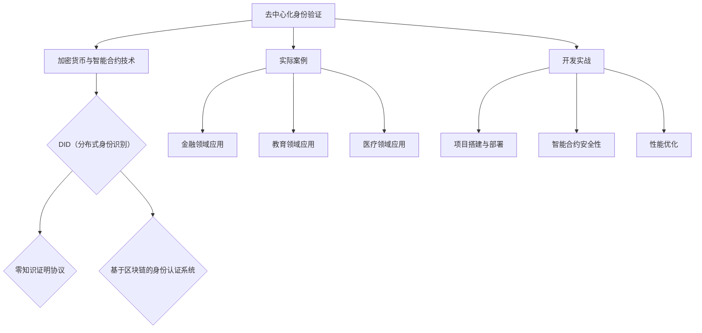

                 

### 文章标题

《去中心化身份验证：网络安全的创新解决方案》

### 关键词

去中心化身份验证、区块链、加密技术、网络安全、智能合约、分布式身份管理系统、DID、零知识证明、加密货币

### 摘要

随着互联网技术的迅猛发展，网络安全问题日益突出，传统中心化身份验证方式已难以满足安全需求。本文将深入探讨去中心化身份验证这一创新解决方案，通过对其基本概念、技术原理、关键算法与架构、应用实例以及开发实战的详细分析，揭示其在提升网络安全方面的潜力与挑战。

#### 第一部分：去中心化身份验证概述

### 第1章：去中心化身份验证的基本概念

**1.1 去中心化身份验证的定义与历史背景**

去中心化身份验证是一种通过去中心化技术，如区块链和加密算法，来实现用户身份验证的方法。它不同于传统的中心化身份验证，后者依赖于单一中心服务器，数据易受到攻击且信任问题难以解决。

去中心化身份验证的历史背景可追溯至区块链技术的兴起。2008年，中本聪（Satoshi Nakamoto）提出了比特币的概念，开创了去中心化金融的新纪元。随后，去中心化身份验证技术逐渐受到关注，并成为网络安全的创新解决方案之一。

**1.2 去中心化身份验证的核心原则**

去中心化身份验证的核心原则包括：

- **自主权**：用户可以自主管理自己的身份信息，无需依赖第三方机构。
- **透明性**：身份验证过程公开透明，所有参与者都可以验证身份信息的真实性。
- **安全性**：采用加密技术和分布式存储，确保身份信息难以被篡改和窃取。
- **可扩展性**：能够支持大量用户和复杂应用场景，满足不同业务需求。

**1.3 去中心化身份验证在网络安全中的应用**

去中心化身份验证在网络安全中的应用十分广泛。例如，在金融领域，它可以帮助防止欺诈和洗钱行为；在教育领域，可以实现学历验证和资质认证；在医疗领域，可以保护患者隐私并确保医疗数据的真实性。去中心化身份验证通过提高系统的透明性和安全性，极大地增强了网络环境的安全性。

#### 第二部分：去中心化身份验证技术原理

### 第2章：区块链与加密技术基础

**2.1 区块链技术概述**

区块链是一种分布式数据库技术，其基本架构包括数据区块、链式结构、共识算法等。区块链通过加密技术保证数据的不可篡改性和安全性，为去中心化身份验证提供了坚实的基础。

**2.2 公钥加密与数字签名**

公钥加密和数字签名是加密技术的重要组成部分。公钥加密算法确保信息传输的机密性，而数字签名则验证信息的完整性和真实性。这些技术为去中心化身份验证提供了安全保障。

**2.3 分布式身份管理系统**

分布式身份管理系统是一种基于区块链和加密技术的身份验证系统。它通过去中心化的方式，管理用户的身份信息，确保身份验证过程的透明性和安全性。

#### 第三部分：去中心化身份验证的关键算法与架构

### 第3章：加密货币与智能合约技术

**3.1 加密货币的工作原理**

加密货币如比特币，通过区块链技术实现了去中心化的价值传输。比特币的架构和交易流程是理解加密货币和智能合约技术的基础。

**3.2 智能合约的设计与应用**

智能合约是一种在区块链上自动执行合同条款的程序。Solidity语言是智能合约编写的主要语言，其安全性和应用场景是研究的重要方向。

**3.3 DID（分布式身份识别）**

DID是分布式身份识别的缩写，它为每个用户生成一个独一无二的数字身份标识。DID的标准与实现是去中心化身份验证的关键。

### 第4章：分布式身份认证协议

**4.1 DID（分布式身份识别）**

DID为每个用户分配一个唯一的身份标识，使其能够自主管理身份信息，提高身份验证的透明性和安全性。

**4.2 零知识证明协议**

零知识证明是一种在无需透露任何信息的情况下，证明某个陈述为真的技术。它在去中心化身份验证中的应用极大地提高了隐私保护水平。

**4.3 基于区块链的身份认证系统**

基于区块链的身份认证系统通过分布式存储和加密技术，实现了高度安全且透明的身份验证过程。

#### 第四部分：去中心化身份验证的应用与实现

### 第5章：去中心化身份验证的实际案例

**5.1 去中心化身份验证在金融领域的应用**

在金融领域，去中心化身份验证可以用于反欺诈、身份认证和智能投顾等应用。

**5.2 去中心化身份验证在教育领域的应用**

在教育领域，去中心化身份验证可以用于学历验证和资质认证，确保教育信息的真实性和完整性。

**5.3 去中心化身份验证在医疗领域的应用**

在医疗领域，去中心化身份验证可以用于保护患者隐私，确保医疗数据的真实性和安全性。

### 第6章：去中心化身份验证的开发实战

**6.1 去中心化身份验证项目的搭建与部署**

搭建与部署去中心化身份验证项目需要配置开发环境、编写智能合约和部署区块链网络。

**6.2 智能合约的安全性与漏洞分析**

智能合约的安全性是去中心化身份验证开发的重要问题。分析常见漏洞类型和防护措施对于确保系统的安全性至关重要。

**6.3 去中心化身份验证系统的性能优化**

优化去中心化身份验证系统的性能，包括提高交易速度和降低网络延迟，是提升用户体验的关键。

#### 第五部分：未来展望与趋势

### 第7章：未来展望与趋势

**7.1 去中心化身份验证的发展趋势**

随着技术的不断进步，去中心化身份验证将在更多领域得到应用，其发展趋势包括：

- **跨链互操作性**：实现不同区块链之间的身份信息交换。
- **隐私保护增强**：采用更多隐私保护技术，提高用户隐私水平。
- **法律法规完善**：各国逐步完善相关法律法规，推动去中心化身份验证的合规发展。

**7.2 去中心化身份验证面临的挑战与解决方案**

去中心化身份验证在发展过程中面临诸多挑战，包括：

- **法律法规与政策影响**：各国法律法规的不确定性对去中心化身份验证的推广产生影响。
- **技术与安全挑战**：如何确保去中心化身份验证系统的安全性和稳定性是关键问题。

#### 附录

**附录A：去中心化身份验证相关工具与资源**

去中心化身份验证的实践需要使用各种工具与资源。附录A将介绍一些常用的开发工具、学习资源与社区，以及相关标准与规范。

### Mermaid 流�程图



### 加密货币技术伪代码

```python
# 加密货币交易流程伪代码

# 比特币交易流程
def bitcoin_transaction(sender_address, receiver_address, amount):
    # 签名交易
    transaction = sign_transaction(sender_address, receiver_address, amount)
    # 广播交易
    broadcast_transaction(transaction)
    # 验证交易
    verify_transaction(transaction)

# 签名交易
def sign_transaction(sender_address, receiver_address, amount):
    # 生成交易哈希
    transaction_hash = generate_transaction_hash(sender_address, receiver_address, amount)
    # 签名交易
    signature = sign(transaction_hash, sender_address)
    # 构建交易
    transaction = build_transaction(sender_address, receiver_address, amount, signature)
    return transaction

# 广播交易
def broadcast_transaction(transaction):
    # 将交易广播到区块链网络
    broadcast(transaction)

# 验证交易
def verify_transaction(transaction):
    # 验证交易的有效性
    if is_valid_transaction(transaction):
        print("交易验证通过")
    else:
        print("交易验证失败")
```

---

**作者：AI天才研究院/AI Genius Institute & 禅与计算机程序设计艺术 /Zen And The Art of Computer Programming**

---

本文详细介绍了去中心化身份验证的基本概念、技术原理、关键算法与架构、应用实例以及开发实战。通过一步步的分析推理，我们揭示了去中心化身份验证在提升网络安全方面的潜力与挑战。随着技术的不断进步，去中心化身份验证有望成为未来网络安全的重要解决方案。在附录中，我们提供了相关工具与资源，供读者进一步学习与探索。希望本文能对广大开发者和技术爱好者有所启发，共同推动网络安全的创新发展。

