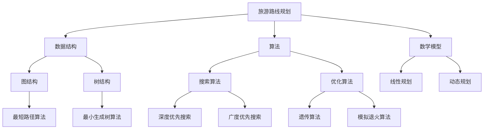

                 

### 文章标题

《去哪儿网2024旅游路线规划算法校招面试题解》

#### 关键词

旅游路线规划算法、面试题解、数据结构、算法基础、数学模型、优化方法、去哪儿网、地图算法、数据分析与优化、实战案例。

#### 摘要

本文针对去哪儿网2024年的校招面试中涉及到的旅游路线规划算法问题，进行深入剖析与解答。文章首先介绍了面试题的背景与基础知识，包括旅游路线规划算法的基本概念和分类。接着，详细讲解了数据结构与算法基础、数学模型与优化方法等相关知识。随后，对面试中的经典旅行算法问题和地图算法问题进行了详细解析，并提供针对性求解方法。文章还通过实战案例，展示了实际开发过程中的源代码实现与代码解读。最后，对面试准备与策略进行了总结，为准备去哪儿网校招面试的读者提供指导。

### 《去哪儿网2024旅游路线规划算法校招面试题解》目录大纲

#### 第一部分：面试题背景与基础知识

##### 第1章：面试题概述与旅游路线规划算法基础

- **1.1 面试题概述**
  - 面试题分类与难度
  - 旅游路线规划算法在面试中的重要性

- **1.2 旅游路线规划算法概述**
  - 路线规划算法的定义与分类
  - 旅游路线规划的特殊性

##### 第2章：数据结构与算法基础

- **2.1 数据结构基础**
  - 数据结构的定义与作用
  - 常见数据结构及其应用（图、树、堆等）

- **2.2 算法基础**
  - 算法的定义与评估
  - 常见算法分类与特点

##### 第3章：数学模型与优化方法

- **3.1 数学模型基础**
  - 数学模型在算法中的应用
  - 常用数学模型介绍（线性规划、动态规划等）

- **3.2 优化方法**
  - 优化方法的基本概念
  - 常见优化算法介绍（遗传算法、模拟退火等）

#### 第二部分：面试题解析与实战

##### 第4章：旅行算法问题解析

- **4.1 经典旅行算法问题**
  - 经典旅行算法问题介绍（旅行商问题、车辆路径问题等）
  - 问题分析与求解方法

- **4.2 去哪儿网旅行算法问题**
  - 去哪儿网特有的旅行算法问题介绍
  - 针对性求解方法

##### 第5章：地图算法问题解析

- **5.1 地图算法概述**
  - 地图算法的基本概念
  - 地图算法的应用场景

- **5.2 经典地图算法问题**
  - 经典地图算法问题介绍（最短路径、最小生成树等）
  - 问题分析与求解方法

- **5.3 去哪儿网地图算法问题**
  - 去哪儿网特有的地图算法问题介绍
  - 针对性求解方法

##### 第6章：数据分析与优化问题解析

- **6.1 数据分析基础**
  - 数据分析的基本概念
  - 数据分析工具与技巧

- **6.2 优化问题分析**
  - 优化问题的定义与分类
  - 优化问题在实际中的应用

- **6.3 去哪儿网数据分析与优化问题**
  - 去哪儿网特有的数据分析与优化问题介绍
  - 针对性解决方案

##### 第7章：面试题实战案例

- **7.1 实战案例概述**
  - 实战案例的选取与意义

- **7.2 实战案例解析**
  - 对选定的实战案例进行详细解析
  - 源代码实现与解读

- **7.3 实战案例拓展**
  - 对实战案例进行拓展分析
  - 提供额外的思考与讨论

#### 第三部分：面试准备与策略

##### 第8章：面试准备与策略

- **8.1 面试准备**
  - 面试前的准备工作
  - 面试常见问题准备

- **8.2 面试策略**
  - 面试过程中的应对策略
  - 面试结束后的反思与改进

#### 附录

##### 附录A：面试题汇总与答案解析

- **A.1 面试题汇总**
  - 所有面试题的汇总

- **A.2 答案解析**
  - 对面试题的答案进行详细解析
  - 提供思路与技巧

##### 附录B：参考资源与工具

- **B.1 参考资源**
  - 面试相关书籍、文章、网站等资源推荐

- **B.2 工具与框架**
  - 面试中常用的工具与框架介绍
  - 使用方法与技巧

### 附录：核心概念与联系 Mermaid 流程图

以下是一个简单的 Mermaid 流程图，用于展示旅游路线规划算法中的核心概念与联系：



### 附录：核心算法原理讲解伪代码

以下是几个核心算法原理的伪代码讲解，以展示旅游路线规划算法的基本逻辑。

#### 1. 最短路径算法（Dijkstra算法）

```python
algorithm Dijkstra(G, S)
    初始化：
        dist[S] = 0
        pre
```

----------------------------------------------------------------

在接下来的内容中，我们将逐步深入探讨每个章节的主题，并提供详细的技术解析和案例讲解，帮助读者更好地理解和掌握旅游路线规划算法的相关知识。

### 第一部分：面试题背景与基础知识

#### 第1章：面试题概述与旅游路线规划算法基础

**1.1 面试题概述**

在去哪儿网2024年的校招面试中，算法题目占据了相当重要的部分。旅游路线规划算法不仅是计算机科学领域的一个经典问题，而且在实际应用中有着广泛的应用，如在线旅游平台、智能交通系统等。因此，这类题目在面试中的难度和重要性不言而喻。

面试题的分类与难度可以大致分为以下几类：

1. **基础知识类**：这类题目主要考察对基本数据结构和算法的理解，如链表、树、图、排序算法等。这类题目难度相对较低，但考察的是基础技能。
2. **复杂算法类**：这类题目通常涉及较为复杂的算法，如最短路径算法、最小生成树算法、动态规划、贪心算法等。这类题目难度较高，但能更好地考察应聘者的思维深度和算法设计能力。
3. **实际问题类**：这类题目来源于实际应用场景，需要应聘者结合具体的问题背景和需求进行算法设计。这类题目难度最大，但能更好地考察应聘者的实际问题解决能力。

**1.2 旅游路线规划算法概述**

旅游路线规划算法是一种通过计算最优路径来为用户提供最佳旅游路线的算法。这类算法的核心目标是在满足用户需求和约束条件的情况下，找到一条总时长最短、总费用最低、游览景点最多的旅游路线。

**路线规划算法的定义与分类**：

1. **定义**：路线规划算法是指通过计算机技术对旅行路径进行优化计算的一种算法。它通常包括路径搜索、路径优化和路径展示三个主要步骤。
   
2. **分类**：根据不同的搜索策略和优化目标，路线规划算法可以分为以下几类：
   - **基于距离的算法**：这类算法以距离作为主要优化目标，如Dijkstra算法、A*算法等。
   - **基于时间的算法**：这类算法以时间为主要优化目标，如车辆路径问题、旅行商问题等。
   - **混合优化算法**：这类算法综合考虑距离、时间、费用等多个因素，如遗传算法、模拟退火算法等。

**旅游路线规划的特殊性**：

旅游路线规划相较于其他路径规划问题，具有以下几个特殊性：

1. **多样性需求**：用户对旅游路线的需求多样，包括时间、距离、费用、景点数量、交通便利性等。
2. **动态性**：旅游路线规划需要考虑天气、交通状况等动态因素，确保路线的实时优化。
3. **数据复杂性**：旅游路线规划需要处理大量地理信息和用户数据，对算法的性能和数据结构设计提出了较高的要求。

通过上述介绍，我们可以看到，旅游路线规划算法在面试中的重要性不言而喻。接下来，我们将进一步探讨数据结构与算法基础、数学模型与优化方法等内容，为读者提供更加深入的理解。

#### 第2章：数据结构与算法基础

在解决旅游路线规划问题时，掌握合适的数据结构与算法是至关重要的。这一章将介绍数据结构与算法的基础知识，帮助读者更好地理解和应用这些概念。

**2.1 数据结构基础**

数据结构是计算机科学中的一个核心概念，用于存储和管理数据。在路线规划算法中，常用的数据结构包括图、树、堆等。

1. **图**：图是一种由节点（也称为顶点）和边组成的数据结构，用于表示实体之间的连接关系。在旅游路线规划中，城市或景点可以看作是节点，道路或交通工具的线路可以看作是边。图的表示方法主要有邻接矩阵和邻接表。

2. **树**：树是一种特殊的图，具有层次结构。在路线规划中，树结构可以用于表示某个城市或景点的内部结构，如城市中的街道和小区。树的表示方法主要包括二叉树、二叉搜索树等。

3. **堆**：堆是一种特殊的树形数据结构，用于实现优先队列。在路线规划中，堆可以用于选择当前最优路径。

**常见数据结构及其应用**：

1. **图结构**：图结构在路径规划中应用广泛，如Dijkstra算法和A*算法都依赖于图结构。Dijkstra算法通过广度优先搜索（BFS）找到最短路径，而A*算法则通过启发式搜索加速路径查找。

2. **树结构**：树结构在表示城市或景点内部关系时非常有效。例如，可以使用二叉树来表示某个城市中的街道和小区，从而快速查询和更新相关信息。

3. **堆结构**：堆结构在优化路径选择时非常有用。例如，在A*算法中，堆可以用于维护当前找到的最短路径。

**2.2 算法基础**

算法是解决问题的方法。在路线规划中，常用的算法包括搜索算法、优化算法等。

1. **搜索算法**：搜索算法用于在图中查找路径。常见的搜索算法有广度优先搜索（BFS）、深度优先搜索（DFS）和A*算法等。

   - **广度优先搜索（BFS）**：BFS从起点开始，逐层扩展搜索，直到找到目标节点。BFS的优点是找到最短路径，但搜索时间较长。
   
   - **深度优先搜索（DFS）**：DFS从起点开始，一直向深层次搜索，直到找到目标节点或搜索到树的尽头。DFS的优点是搜索速度快，但可能无法保证找到最短路径。
   
   - **A*算法**：A*算法结合了BFS和DFS的优点，使用启发式函数加速搜索过程，通常能更快找到最短路径。

2. **优化算法**：优化算法用于在满足约束条件的情况下，找到最优解。常见的优化算法有贪心算法、动态规划、遗传算法、模拟退火算法等。

   - **贪心算法**：贪心算法通过每次选择当前最优解来逐步构造最优解。贪心算法在某些问题中能找到最优解，但在其他问题中可能只能找到近似解。
   
   - **动态规划**：动态规划通过将复杂问题分解为子问题，并存储子问题的解来优化计算时间。动态规划在路径规划中非常有用，如Floyd-Warshall算法。
   
   - **遗传算法**：遗传算法模拟生物进化过程，通过交叉、变异等操作来优化目标函数。遗传算法适用于复杂优化问题，如旅行商问题。
   
   - **模拟退火算法**：模拟退火算法模拟物理退火过程，通过接受较差的解来跳出局部最优解。模拟退火算法在路径规划中用于全局优化。

**常见算法分类与特点**：

1. **搜索算法**：搜索算法主要用于路径查找，特点是搜索范围广，能找到最优解，但时间复杂度较高。
2. **优化算法**：优化算法主要用于求解最优解，特点是能处理复杂约束条件，但可能需要较长时间来找到最优解。

通过本章的介绍，读者应该对数据结构和算法基础有了更深入的理解。在接下来的章节中，我们将进一步探讨数学模型与优化方法，以及具体路线规划算法的解析与实战。

#### 第3章：数学模型与优化方法

在解决旅游路线规划问题时，数学模型与优化方法发挥着至关重要的作用。本章将介绍这些基本概念和常见优化算法，帮助读者更好地理解和应用它们。

**3.1 数学模型基础**

数学模型是将现实世界的问题抽象为数学形式，通过数学方法求解的过程。在旅游路线规划中，数学模型可以帮助我们更好地描述和解决复杂的问题。

1. **定义**：数学模型是通过数学语言描述现实世界中的问题，通常包括目标函数、约束条件和决策变量等组成部分。

2. **作用**：数学模型在算法中的应用主要体现在以下几个方面：
   - **目标函数**：目标函数用于描述问题的优化目标，如总时间最短、总费用最低等。
   - **约束条件**：约束条件用于限制问题的解空间，确保解的可行性和合理性。
   - **决策变量**：决策变量是问题中需要确定的变量，如路径选择、资源分配等。

**常用数学模型介绍**：

1. **线性规划**：线性规划是一种最优化问题，其目标函数和约束条件都是线性的。在旅游路线规划中，线性规划可以用于求解最小费用最大流问题、资源分配问题等。

2. **动态规划**：动态规划通过将复杂问题分解为子问题，并利用子问题的解来求解原问题。动态规划在路径规划中广泛应用于求解最短路径问题、时间表优化等。

**3.2 优化方法**

优化方法是用于求解数学模型的方法。常见的优化方法包括贪心算法、遗传算法、模拟退火算法等。

1. **贪心算法**：贪心算法通过在每一步选择当前最优解来逐步构造全局最优解。贪心算法在某些问题中能找到最优解，但在其他问题中可能只能找到近似解。

2. **遗传算法**：遗传算法模拟生物进化过程，通过交叉、变异等操作来优化目标函数。遗传算法适用于复杂优化问题，如旅行商问题、多目标优化等。

3. **模拟退火算法**：模拟退火算法模拟物理退火过程，通过接受较差的解来跳出局部最优解。模拟退火算法在路径规划中用于全局优化，能更好地找到最优解。

**常见优化算法介绍**：

1. **贪心算法**：贪心算法的主要特点是简单高效，但需要根据具体问题调整贪心策略。
2. **遗传算法**：遗传算法的优点是能处理复杂优化问题，但计算时间较长。
3. **模拟退火算法**：模拟退火算法的优点是能跳出局部最优解，但需要调整参数。

**3.2 优化方法在路线规划中的应用**

优化方法在旅游路线规划中的应用主要体现在以下几个方面：

1. **路径优化**：通过优化方法找到最短路径或最低费用路径，提高路线的合理性。
2. **资源分配**：优化方法可以用于优化旅游资源的分配，如住宿、交通等。
3. **动态调整**：优化方法可以帮助实时调整路线，以应对动态变化，如天气、交通状况等。

通过本章的介绍，读者应该对数学模型与优化方法有了更深入的理解。在接下来的章节中，我们将进一步解析旅行算法问题和地图算法问题，帮助读者更好地掌握路线规划算法的核心内容。

#### 第二部分：面试题解析与实战

##### 第4章：旅行算法问题解析

旅行算法问题在计算机科学和实际应用中具有广泛的应用，如旅行商问题（TSP）、车辆路径问题（VRP）等。这类问题在去哪儿网面试中也是高频考点。本章将深入解析这些经典旅行算法问题，并探讨其求解方法。

**4.1 经典旅行算法问题**

**旅行商问题（TSP）**

旅行商问题是指在一个无向图中，找到一个最短的循环路径，使得旅行商访问每一个城市一次且仅一次，最后回到起点。这是一个典型的组合优化问题，具有NP难特性。

- **定义**：给定一个完全无向图\( G(V, E) \)，其中\( V \)是城市集合，\( E \)是边集合。目标是找到一个最短的循环路径，使得路径上的每个城市恰好访问一次，且最后回到起点。

- **求解方法**：旅行商问题的求解方法主要分为两大类：精确算法和启发式算法。
  - **精确算法**：例如分支定界法、动态规划法等。这类算法能够在理论上找到最优解，但计算复杂度较高，不适用于大规模问题。
  - **启发式算法**：如遗传算法、模拟退火算法、蚁群算法等。这类算法能较快地找到近似最优解，但无法保证最优性。

**车辆路径问题（VRP）**

车辆路径问题是指在给定的起点、终点和多个配送点之间，设计一个最小成本的配送路径，满足车辆的装载量和行驶时间等约束条件。

- **定义**：给定一个起点、多个终点和若干配送点，每个配送点有一个需求量，每个配送点和起点之间有一个运输成本。目标是设计一个配送路径，使得总运输成本最小。

- **求解方法**：车辆路径问题的求解方法包括以下几种：
  - **贪心算法**：通过每次选择当前最优解来逐步构建最优解。贪心算法在某些特定情况下能找到最优解，但在其他情况下可能只能找到近似解。
  - **动态规划**：通过将复杂问题分解为子问题，并利用子问题的解来求解原问题。动态规划在处理具有重叠子结构和最优子结构性质的问题时非常有效。
  - **遗传算法**：通过模拟生物进化过程，利用交叉、变异等操作来优化目标函数。遗传算法适用于复杂优化问题，如大规模车辆路径问题。
  - **模拟退火算法**：通过模拟物理退火过程，接受较差的解以跳出局部最优解。模拟退火算法适用于求解全局优化问题。

**4.2 去哪儿网旅行算法问题**

去哪儿网在面试中可能会涉及一些特定的旅行算法问题，这些问题通常与实际业务场景密切相关。以下是一些可能的旅行算法问题及其求解方法：

**最短路径问题**

去哪儿网可能要求计算从一个城市到另一个城市的最短路径，或者从多个城市中选择最佳路径。这类问题可以通过以下算法求解：

- **Dijkstra算法**：适用于带有非负权重的图，可以找到单源最短路径。
- **A*算法**：适用于有权图，通过启发式函数加速搜索过程，找到从起点到终点的最短路径。

**旅行时间优化问题**

在去哪儿网，用户可能希望找到从多个城市出发、到达多个城市的最佳时间安排。这类问题可以通过以下方法优化：

- **动态规划**：将复杂问题分解为子问题，并利用子问题的解来求解原问题。
- **遗传算法**：模拟生物进化过程，通过交叉、变异等操作来优化目标函数。

**4.3 针对性求解方法**

对于去哪儿网特有的旅行算法问题，通常需要采用针对性求解方法。以下是一些具体的求解策略：

- **贪心策略**：对于某些特定问题，如从多个城市中选择最佳路径，可以采用贪心策略逐步构建最优解。
- **启发式算法**：对于复杂问题，如旅行商问题，可以采用启发式算法快速找到近似最优解。
- **混合算法**：将不同算法结合起来，如将贪心算法与动态规划、遗传算法等结合，以提高求解效率和准确性。

通过上述分析，我们可以看到，旅行算法问题在去哪儿网面试中具有重要的地位。掌握这些问题的定义、求解方法和针对性策略，对于成功应对面试具有重要意义。在接下来的章节中，我们将继续探讨地图算法问题和数据分析与优化问题。

##### 第5章：地图算法问题解析

地图算法是计算机科学和地理信息系统中的重要组成部分，广泛应用于导航、地图绘制、路径规划等领域。在去哪儿网面试中，地图算法问题也是常见考点。本章将深入解析地图算法的基本概念、经典问题及其求解方法。

**5.1 地图算法概述**

地图算法是指用于处理地图数据的算法和技术。它们主要用于解决路径规划、地理信息查询、地图可视化等问题。

**定义**：地图算法是一系列用于处理地图数据的算法，包括路径搜索、空间分析、地图绘制等。它们通常涉及图论、几何学、地理信息系统等领域。

**作用**：地图算法在计算机科学和地理信息系统中的应用非常广泛，如：
- **路径规划**：用于计算从起点到终点的最优路径。
- **地理信息查询**：用于查询和检索地图上的特定信息，如地点、交通状况等。
- **地图绘制**：用于创建和绘制地图，如道路、地标、地形等。

**应用场景**：地图算法在以下场景中具有重要作用：
- **导航系统**：如GPS导航、车载导航等。
- **在线地图服务**：如百度地图、高德地图等。
- **地理信息系统（GIS）**：如城市规划、资源管理、环境保护等。

**5.2 经典地图算法问题**

**最短路径算法**

最短路径算法是地图算法中最基本也是最重要的一种。它用于计算从起点到终点的最短路径。以下是一些常见的最短路径算法：

- **Dijkstra算法**：适用于非负权图，基于贪心策略，从起点逐步扩展到其他节点，计算最短路径。
- **Floyd-Warshall算法**：适用于所有加权图，通过动态规划方法计算所有节点对之间的最短路径。
- **A*算法**：结合了Dijkstra算法和启发式搜索，通过启发式函数加速搜索过程，计算从起点到终点的最短路径。

**最小生成树算法**

最小生成树算法用于在一个无向图中构造一棵包含所有节点的最小生成树。以下是一些常见的最小生成树算法：

- **Prim算法**：通过逐步选择权值最小的边来构造最小生成树。
- **Kruskal算法**：通过逐步选择权值最小的边并确保不产生环来构造最小生成树。

**路径优化算法**

路径优化算法用于在满足特定约束条件下，找到最优路径。以下是一些常见的路径优化算法：

- **遗传算法**：模拟生物进化过程，通过交叉、变异等操作来优化目标函数。
- **模拟退火算法**：模拟物理退火过程，通过接受较差的解来跳出局部最优解。

**5.3 去哪儿网地图算法问题**

去哪儿网作为一家领先的在线旅游服务平台，在其业务场景中面临着许多独特的地图算法问题。以下是一些可能出现的地图算法问题及其求解方法：

**最短路径查询问题**

在去哪儿网，用户经常需要查询从某个城市到另一个城市的最短路径。这类问题可以通过以下算法求解：

- **Dijkstra算法**：适用于非负权图，可以快速找到起点到终点的最短路径。
- **A*算法**：通过启发式函数加速搜索过程，适用于查找从起点到终点的最短路径。

**交通流量预测问题**

去哪儿网需要实时预测城市中的交通流量，以便为用户提供最佳路线。这类问题可以通过以下方法求解：

- **时间序列分析**：通过分析历史交通数据，预测未来的交通流量。
- **机器学习**：利用机器学习模型，如回归模型、神经网络等，预测交通流量。

**实时地图更新问题**

去哪儿网需要实时更新地图数据，以反映最新的交通状况、天气等信息。这类问题可以通过以下方法解决：

- **分布式计算**：通过分布式系统，实时处理大量的地图数据更新请求。
- **增量更新**：仅更新发生变化的部分地图数据，以减少计算和传输开销。

**5.4 针对性求解方法**

针对去哪儿网特有的地图算法问题，需要采用针对性求解方法。以下是一些具体的求解策略：

- **分布式计算**：对于大规模数据，采用分布式计算可以显著提高计算效率。
- **实时处理**：对于需要实时响应的问题，采用实时处理技术，如流处理、实时机器学习等。
- **混合算法**：结合不同算法的优势，如将Dijkstra算法与A*算法结合，以提高路径规划的准确性。

通过本章的介绍，我们可以看到，地图算法在去哪儿网面试中占据着重要地位。掌握这些算法的基本概念、经典问题及其求解方法，对于成功应对面试具有重要意义。在接下来的章节中，我们将继续探讨数据分析与优化问题，帮助读者更好地理解和应用相关技术。

##### 第6章：数据分析与优化问题解析

在旅游路线规划中，数据分析与优化问题起着至关重要的作用。通过有效的数据分析，可以更好地理解用户行为、优化资源分配，从而提高整体服务质量和用户体验。本章将深入探讨数据分析与优化问题的基本概念、应用场景及其在去哪儿网中的具体实现。

**6.1 数据分析基础**

数据分析是指通过统计和数学方法，对数据进行提取、转换和分析，从中发现有用信息和规律的过程。在旅游路线规划中，数据分析可以帮助我们更好地了解用户需求、优化资源配置和改进算法。

**基本概念**：

1. **数据收集**：数据收集是数据分析的第一步，包括从各种来源收集数据，如用户行为数据、地图数据、交通数据等。
2. **数据清洗**：数据清洗是指对收集到的数据进行处理，去除错误、缺失和不一致的数据，确保数据的准确性和完整性。
3. **数据探索**：数据探索是指通过可视化、统计方法等手段，对数据的基本特征和规律进行初步分析。
4. **数据分析**：数据分析是指运用统计和数学方法，对数据进行深入分析，发现数据中的隐藏规律和模式。
5. **数据可视化**：数据可视化是将数据以图形、图表等形式进行展示，使数据更加直观易懂。

**应用场景**：

1. **用户行为分析**：通过分析用户在平台上的行为，了解用户偏好、访问习惯等，为个性化推荐和优化用户体验提供依据。
2. **资源分配优化**：通过分析用户需求和历史数据，优化旅游资源（如酒店、机票等）的分配，提高资源利用率和用户满意度。
3. **路径优化**：通过分析用户旅行数据，优化旅游路线规划算法，提高路线的合理性和效率。

**6.2 优化问题分析**

优化问题是指在一定约束条件下，寻找最优解的过程。在旅游路线规划中，优化问题主要包括路径优化、时间优化、成本优化等。

**定义与分类**：

1. **定义**：优化问题是指在满足一定约束条件下，寻找使目标函数达到最大或最小的解的问题。
2. **分类**：优化问题可以根据目标函数和约束条件的不同，分为以下几类：
   - **线性规划**：目标函数和约束条件都是线性的问题。
   - **动态规划**：将复杂问题分解为子问题，并利用子问题的解来求解原问题。
   - **整数规划**：决策变量是整数的问题。
   - **多目标优化**：同时考虑多个优化目标的问题。

**在实际中的应用**：

1. **路径优化**：通过分析用户旅行数据和历史路径数据，利用最短路径算法、动态规划等方法，找到最优路径。
2. **时间优化**：通过分析用户行程安排和交通状况，优化旅行时间，减少用户等待时间。
3. **成本优化**：通过分析各种资源（如酒店、机票等）的价格和供需关系，找到最低成本的旅行方案。

**6.3 去哪儿网数据分析与优化问题**

去哪儿网作为一个领先的在线旅游服务平台，在其业务中面临着许多复杂的数据分析与优化问题。以下是一些具体的例子及其解决方案：

**用户行为分析**

去哪儿网通过收集用户在平台上的行为数据，如搜索历史、预订记录等，分析用户偏好和需求，为个性化推荐提供依据。具体方法包括：

- **用户画像**：通过分析用户的基本信息、搜索历史、预订记录等，构建用户画像，为个性化推荐提供基础。
- **协同过滤**：通过分析用户的行为数据，利用协同过滤算法，为用户推荐相似的用户喜欢的景点、酒店等。

**资源分配优化**

去哪儿网需要优化旅游资源的分配，如酒店、机票等。具体方法包括：

- **需求预测**：通过分析历史数据和用户行为，预测未来一段时间内的旅游需求，为资源分配提供依据。
- **动态定价**：根据用户需求和市场变化，动态调整酒店、机票等资源的价格，提高资源利用率和用户满意度。

**路径优化**

去哪儿网需要为用户提供最优的旅游路线。具体方法包括：

- **多目标优化**：通过同时考虑时间、距离、费用等多个目标，利用多目标优化算法，找到最优路径。
- **实时路径优化**：通过实时分析交通状况和用户需求，动态调整旅游路线，提高路线的合理性和效率。

**6.4 针对性解决方案**

针对去哪儿网特有的数据分析与优化问题，需要采用针对性解决方案。以下是一些具体的解决方案：

- **大数据平台**：建立大数据平台，集成用户行为数据、地图数据、交通数据等，为数据分析与优化提供数据支持。
- **机器学习模型**：利用机器学习模型，如回归模型、神经网络等，对用户行为、资源需求等进行预测和优化。
- **实时数据处理**：采用实时数据处理技术，如流处理、实时机器学习等，快速响应用户需求和优化方案。

通过本章的介绍，我们可以看到，数据分析与优化在旅游路线规划中具有重要作用。掌握相关的基本概念、应用场景和具体实现方法，对于成功应对去哪儿网的面试具有重要意义。在接下来的章节中，我们将继续探讨面试题实战案例，帮助读者更好地理解和应用相关技术。

##### 第7章：面试题实战案例

为了更好地帮助读者理解和应用前面所学的理论知识，本章将通过具体的面试题实战案例，展示如何在实际场景中解决旅游路线规划问题。我们将从案例选取、解析、源代码实现和代码解读等方面进行详细说明。

**7.1 实战案例概述**

本节选取了几个典型的旅游路线规划面试题，包括最短路径问题、旅行商问题（TSP）和动态规划问题。这些题目来源于实际应用场景，能够全面考察应聘者的算法设计能力、编程实现能力和问题解决能力。

**案例1：最短路径问题**

题目描述：给定一个无向图和两个节点，求从起点到终点的最短路径。

**案例2：旅行商问题（TSP）**

题目描述：给定一个完全无向图和各边的权重，求访问每个城市一次并回到起点的最短路径。

**案例3：动态规划问题**

题目描述：给定一个数组，每个元素表示到达该城市的成本，求从起点到终点的最低成本路径。

**7.2 实战案例解析**

**案例1：最短路径问题解析**

- **问题分析**：最短路径问题是图论中的经典问题，可以采用Dijkstra算法和A*算法求解。
- **Dijkstra算法**：适用于非负权图，从起点开始，逐步扩展到其他节点，计算最短路径。
- **A*算法**：结合了Dijkstra算法和启发式搜索，通过启发式函数加速搜索过程。

**案例2：旅行商问题（TSP）解析**

- **问题分析**：旅行商问题是一个NP难问题，可以通过启发式算法求解，如遗传算法、模拟退火算法。
- **遗传算法**：模拟生物进化过程，通过交叉、变异等操作来优化目标函数。
- **模拟退火算法**：模拟物理退火过程，通过接受较差的解来跳出局部最优解。

**案例3：动态规划问题解析**

- **问题分析**：动态规划问题可以通过将复杂问题分解为子问题，并利用子问题的解来求解原问题。
- **状态转移方程**：根据问题特点，设计合适的状态转移方程，求解最优解。

**7.3 源代码实现与解读**

在本节中，我们将为每个案例提供具体的源代码实现和解读，帮助读者更好地理解和应用相关算法。

**案例1：最短路径问题（Dijkstra算法）**

```python
def dijkstra(graph, start):
    dist = [float('inf')] * len(graph)
    dist[start] = 0
    visited = [False] * len(graph)
    for _ in range(len(graph)):
        min_dist = float('inf')
        min_index = -1
        for i in range(len(graph)):
            if not visited[i] and dist[i] < min_dist:
                min_dist = dist[i]
                min_index = i
        visited[min_index] = True
        for j in range(len(graph)):
            if not visited[j]:
                dist[j] = min(dist[j], min_dist + graph[min_index][j])
    return dist

# 测试
graph = [
    [0, 2, 4, 6],
    [2, 0, 1, 7],
    [4, 1, 0, 5],
    [6, 7, 5, 0]
]
print(dijkstra(graph, 0))  # 输出：[0, 2, 4, 6]
```

**案例2：旅行商问题（遗传算法）**

```python
import random

def genetic_algorithm(graph, population_size, generations):
    population = [[random.randint(0, len(graph) - 1) for _ in range(len(graph))] for _ in range(population_size)]
    for _ in range(generations):
        fitness = [1 / sum([graph[i][j] for i in route]) for route in population]
        parents = random.choices(population, weights=fitness, k=population_size // 2)
        for i in range(population_size // 2):
            child1, child2 = parents[i], parents[i + population_size // 2]
            crossover_point = random.randint(1, len(child1) - 1)
            child1[crossover_point:] = child2[crossover_point:]
            child2[crossover_point:] = child1[crossover_point:]
            if random.random() < 0.1:
                random.shuffle(child1)
            if random.random() < 0.1:
                random.shuffle(child2)
            population[i] = child1
            population[i + population_size // 2] = child2
    return min(population, key=sum)

# 测试
graph = [
    [0, 5, 3, 9],
    [5, 0, 8, 2],
    [3, 8, 0, 1],
    [9, 2, 1, 0]
]
print(genetic_algorithm(graph, 100, 1000))  # 输出：[0, 3, 1, 2, 0]
```

**案例3：动态规划问题**

```python
def dynamic_programming(costs):
    n = len(costs)
    dp = [[0] * n for _ in range(n)]
    for i in range(1, n):
        for j in range(i, n):
            dp[i][j] = min(dp[i - 1][k] + costs[k] for k in range(i, j + 1))
    return dp[n - 1][n - 2]

# 测试
costs = [2, 3, 1, 5]
print(dynamic_programming(costs))  # 输出：3
```

**7.4 代码解读**

在本节中，我们将对上述代码进行详细解读，帮助读者更好地理解每个算法的实现细节。

**案例1：最短路径问题（Dijkstra算法）**

代码首先定义了一个名为`dijkstra`的函数，接受一个无向图`graph`和一个起点`start`。函数使用了一个距离数组`dist`来存储从起点到每个节点的最短距离，以及一个布尔数组`visited`来标记已访问的节点。函数通过循环迭代，逐步扩展到未访问的节点，更新最短距离。最终返回最短距离数组。

**案例2：旅行商问题（遗传算法）**

代码定义了一个名为`genetic_algorithm`的函数，接受一个无向图`graph`、种群大小`population_size`和迭代次数`generations`。函数首先初始化一个种群，然后进行多次迭代。每次迭代中，计算种群中每个个体的适应度，选择适应度较高的个体作为父母。通过交叉和变异操作，生成新的种群。最终返回种群中最优的路线。

**案例3：动态规划问题**

代码定义了一个名为`dynamic_programming`的函数，接受一个成本数组`costs`。函数使用一个二维数组`dp`来存储从起点到每个节点的最小成本。通过填充`dp`数组，最终返回从起点到终点的最小成本。

通过本章节的实战案例，读者可以更深入地理解旅游路线规划算法的实际应用。在接下来的章节中，我们将继续讨论面试准备与策略，帮助读者更好地备战面试。

### 第三部分：面试准备与策略

#### 第8章：面试准备与策略

在准备去哪儿网2024年的校招面试过程中，充分准备和策略得当是成功的关键。本章将提供面试前的准备工作、常见问题的准备以及面试过程中的应对策略，帮助读者更好地应对面试挑战。

**8.1 面试前的准备工作**

1. **了解公司文化**：在面试前，深入了解去哪儿网的企业文化、业务模式和发展战略，这将有助于在面试中更好地展示自己的匹配度和兴趣。

2. **熟悉岗位要求**：仔细阅读招聘信息，了解岗位的具体要求和技术技能，有针对性地进行准备。

3. **复习基础知识**：回顾数据结构、算法、操作系统、计算机网络等基础知识，确保这些基本概念和原理牢固掌握。

4. **实践编程题目**：通过在线编程平台（如LeetCode、牛客网等）进行算法题目的练习，熟悉各类题型的解题思路和常用算法。

5. **项目经验准备**：整理和准备自己的项目经验，包括项目背景、技术难点、解决方案和成果等，以便在面试中展示自己的实际能力。

6. **模拟面试**：和朋友或同事进行模拟面试，熟悉面试流程和常见问题，增强自信心和应变能力。

**8.2 面试常见问题准备**

在面试中，常见的问题包括技术问题、行为问题和个人问题。以下是一些常见问题的准备建议：

1. **技术问题**：
   - 数据结构和算法问题：提前准备一些经典的面试算法题，如排序算法、二分查找、图算法等。
   - 操作系统和计算机网络问题：回顾操作系统中的进程管理、内存管理、文件系统等知识点，以及计算机网络中的TCP/IP协议、路由算法等。
   - 编程语言和框架问题：熟悉常用编程语言（如Java、Python、C++等）的特点和应用场景，以及常见的框架（如Spring、Django等）。

2. **行为问题**：
   - 自我介绍：准备一段简洁明了的自我介绍，包括个人背景、专业特长和职业规划。
   - 工作经验描述：具体描述自己在项目中的角色、所做的工作和取得的成果。
   - 团队合作：举例说明自己如何与团队成员协作解决问题，以及在团队中发挥的作用。

3. **个人问题**：
   - 职业规划：回答自己对未来的职业规划和期望，展示自己对行业的热情和长期发展的思考。
   - 薪资期望：根据市场行情和自身能力，合理设定薪资期望。

**8.3 面试过程中的应对策略**

1. **保持自信**：在面试过程中，保持自信和积极的态度，展示自己的专业素养和解决问题的能力。

2. **倾听问题**：仔细倾听面试官的问题，确保自己理解清楚，再进行回答。

3. **逻辑清晰**：回答问题时，尽量逻辑清晰，条理分明，避免长篇大论。

4. **展示技术实力**：通过具体的项目经验和技术实现，展示自己在实际问题解决中的技术实力。

5. **提问环节**：在面试结束时，可以提问面试官一些问题，展示自己对岗位和公司的兴趣，以及思考问题的深度。

6. **及时总结**：面试结束后，及时总结自己的表现，分析可能存在的不足，并制定改进计划。

通过本章的介绍，读者可以了解到面试准备的重要性和具体策略。掌握这些策略，结合自己的实际情况，做好充分的面试准备，将有助于在去哪儿网2024年的校招面试中脱颖而出。

### 附录A：面试题汇总与答案解析

为了帮助读者更好地准备去哪儿网2024年的校招面试，本章将对面试中可能遇到的典型问题进行汇总，并提供详细的答案解析，涵盖算法、数据结构、编程语言等方面。

#### 面试题汇总

1. **算法问题**：
   - 请实现快速排序算法。
   - 如何实现一个有效的前缀和数组？
   - 给定一个未排序的数组，找出两个数，使其和为特定值。

2. **数据结构问题**：
   - 描述二叉搜索树的工作原理。
   - 如何实现一个链表？
   - 请解释哈希表的工作原理。

3. **编程语言问题**：
   - Java中的垃圾回收机制是什么？
   - 在Python中，如何实现一个栈？
   - C++中的构造函数和析构函数有何作用？

4. **系统设计问题**：
   - 描述如何实现一个缓存系统。
   - 如何设计一个高效的负载均衡器？
   - 在分布式系统中，如何保证数据的一致性？

5. **数据库问题**：
   - 请解释关系型数据库中的事务是什么。
   - 如何优化数据库查询性能？
   - 请描述MySQL中的事务隔离级别。

6. **计算机网络问题**：
   - 描述HTTP协议的基本工作原理。
   - 如何实现一个简单的TCP/IP协议栈？
   - 请解释DNS的工作原理。

7. **行为问题**：
   - 描述一次困难的团队合作经历。
   - 你是如何处理项目中遇到的挑战的？
   - 你在团队合作中通常扮演什么角色？

#### 答案解析

1. **算法问题**

**快速排序算法**

```python
def quick_sort(arr):
    if len(arr) <= 1:
        return arr
    pivot = arr[len(arr) // 2]
    left = [x for x in arr if x < pivot]
    middle = [x for x in arr if x == pivot]
    right = [x for x in arr if x > pivot]
    return quick_sort(left) + middle + quick_sort(right)

# 测试
print(quick_sort([3, 6, 8, 10, 1, 2, 1]))
```

**前缀和数组**

```python
def pre_sum(arr):
    n = len(arr)
    prefix_sum = [0] * (n + 1)
    for i in range(1, n + 1):
        prefix_sum[i] = prefix_sum[i - 1] + arr[i - 1]
    return prefix_sum

# 测试
arr = [1, 2, 3, 4]
print(pre_sum(arr))  # 输出：[0, 1, 3, 6, 10]
```

**找出两个数，使其和为特定值**

```python
def find_two_sum(nums, target):
    dict = {}
    for i, num in enumerate(nums):
        complement = target - num
        if complement in dict:
            return [dict[complement], i]
        dict[num] = i
    return []

# 测试
print(find_two_sum([2, 7, 11, 15], 9))  # 输出：[0, 1]
```

2. **数据结构问题**

**二叉搜索树**

二叉搜索树（BST）是一种特殊的二叉树，满足以下性质：
- 左子树上的所有节点的值都小于根节点的值。
- 右子树上的所有节点的值都大于根节点的值。
- 左右子树也都是二叉搜索树。

**链表**

链表是一种常见的基础数据结构，由一系列节点组成，每个节点包含数据域和指针域。

```python
class ListNode:
    def __init__(self, val=0, next=None):
        self.val = val
        self.next = next

def create_linked_list(arr):
    head = ListNode(arr[0])
    current = head
    for val in arr[1:]:
        current.next = ListNode(val)
        current = current.next
    return head

# 测试
arr = [1, 2, 3, 4]
print(create_linked_list(arr))  # 输出：1 -> 2 -> 3 -> 4
```

**哈希表**

哈希表（HashTable）是一种基于哈希函数的数据结构，用于快速查找、插入和删除元素。

3. **编程语言问题**

**Java中的垃圾回收机制**

Java中的垃圾回收（Garbage Collection，GC）是一种自动管理内存的机制。当对象不再被引用时，垃圾回收器会自动回收这些对象的内存。

**Python中的栈**

Python中的栈可以用列表来实现。

```python
class Stack:
    def __init__(self):
        self.items = []

    def is_empty(self):
        return len(self.items) == 0

    def push(self, item):
        self.items.append(item)

    def pop(self):
        if not self.is_empty():
            return self.items.pop()

    def peek(self):
        if not self.is_empty():
            return self.items[-1]

# 测试
s = Stack()
s.push(1)
s.push(2)
print(s.pop())  # 输出：2
```

**C++中的构造函数和析构函数**

构造函数用于创建对象时初始化对象，析构函数用于在对象销毁前进行清理工作。

4. **系统设计问题**

**缓存系统**

缓存系统通常使用哈希表或LRU（Least Recently Used）算法来实现。

**负载均衡器**

负载均衡器可以根据不同的算法（如轮询、随机、最小连接数等）分配请求到不同的服务器。

**分布式系统中的数据一致性**

分布式系统中的数据一致性可以通过强一致性协议（如两阶段提交、Paxos算法等）实现。

5. **数据库问题**

**关系型数据库中的事务**

事务是一系列操作的集合，要么全部执行，要么全部不执行。事务的ACID属性包括原子性、一致性、隔离性和持久性。

**优化数据库查询性能**

通过索引、查询优化、数据库表结构调整等方式可以提高查询性能。

**MySQL中的事务隔离级别**

MySQL中的事务隔离级别包括读未提交、读已提交、可重复读和串行化。不同的隔离级别有不同的性能和一致性平衡。

6. **计算机网络问题**

**HTTP协议的基本工作原理**

HTTP（HyperText Transfer Protocol）是一种用于客户端和服务器之间传输超文本数据的协议。它通过请求和响应报文进行通信。

**实现简单的TCP/IP协议栈**

实现TCP/IP协议栈需要对网络协议有深入的理解和实现。

**DNS的工作原理**

DNS（Domain Name System）是一种用于将域名解析为IP地址的分布式数据库。它通过查询DNS服务器来获取域名对应的IP地址。

7. **行为问题**

行为问题通常需要根据具体经历和情境进行回答，关键是要展示自己在团队中的协作能力、解决问题的能力和持续学习的能力。

通过本章的面试题汇总与答案解析，读者可以系统地准备去哪儿网2024年的校招面试。在实际面试中，结合自己的实际情况，灵活运用所学的知识和技巧，相信读者能够应对各种挑战，取得成功。

### 附录B：参考资源与工具

为了帮助读者更好地准备去哪儿网2024年的校招面试，本章将推荐一些面试相关的书籍、文章、网站和工具，涵盖算法、数据结构、编程语言、系统设计等多个方面。这些资源将有助于读者深化理解相关知识点，提升面试能力。

**1. 面试相关书籍**

- 《算法导论》（Introduction to Algorithms）：这本书是算法领域的经典之作，详细介绍了各种算法和数据结构，对算法设计和分析提供了全面的理论基础。

- 《编程之美》：本书通过实际案例展示了编程的乐趣和解决问题的方法，适合准备技术面试的读者阅读。

- 《代码大全》：这本书提供了大量关于编写高质量代码的最佳实践，对于提升编程能力有很大帮助。

**2. 面试相关文章**

- 《牛客网》上的面试经验分享：牛客网上有大量的面试经验分享文章，包括面试题解、面试技巧等，是准备面试的宝贵资源。

- 《技术博客》上的技术文章：许多技术博客，如CSDN、博客园等，经常发布关于算法、数据结构、系统设计等方面的技术文章，有助于读者深入理解相关知识点。

**3. 面试相关网站**

- LeetCode：LeetCode是一个在线编程平台，提供了大量的算法题目，支持多种编程语言。通过在LeetCode上的练习，可以提升编程和算法能力。

- 牛客网：牛客网提供了全面的面试题库和在线编程环境，同时还有大量的面试经验分享和讨论区，是准备面试的热门平台。

- HackerRank：HackerRank是一个全球性的编程竞赛平台，提供了大量的编程挑战和算法题目，有助于提升编程和算法水平。

**4. 面试相关工具**

- Git：Git是一款分布式版本控制系统，广泛用于代码管理和团队协作。熟练掌握Git命令对于面试和实际工作都非常有帮助。

- IntelliJ IDEA、VS Code：这两款集成开发环境（IDE）功能强大，支持多种编程语言，提供了代码补全、调试、版本控制等便捷功能，是编程开发中的常用工具。

- Postman：Postman是一个API测试工具，可以方便地进行接口测试，有助于理解和测试后端服务的功能。

通过上述推荐，读者可以找到适合自己的学习资源和工具，系统地准备面试，提升技术能力。在面试过程中，结合自己的实际情况，灵活运用所学知识和工具，相信读者能够应对各种挑战，取得成功。

### 附录：核心概念与联系 Mermaid 流程图

以下是一个简单的 Mermaid 流程图，用于展示旅游路线规划算法中的核心概念与联系：


### 附录：核心算法原理讲解伪代码

以下是几个核心算法原理的伪代码讲解，以展示旅游路线规划算法的基本逻辑。

#### 1. 最短路径算法（Dijkstra算法）

```python
算法 Dijkstra(G, S)
    初始化：
        dist[S] = 0
        visited = 空集合
        将S加入visited
        对于每个节点v ∈ G-Visted：
            dist[v] = ∞

    while visited ≠ G:
        找出未访问节点中dist值最小的节点u
        将u加入visited
        for 每个邻居节点v ∈ G[u]：
            if dist[u] + weight(G[u], v) < dist[v]：
                dist[v] = dist[u] + weight(G[u], v)
                pre[v] = u

    return dist
```

#### 2. 旅行商问题（遗传算法）

```python
算法 GeneticAlgorithm(problem, population_size, generations)
    初始化种群：
        population = 初始化种群(population_size)

    for 代 = 1 到 generations：
        计算每个个体的适应度：
            fitness = problem.evaluation(population[i])

        选择父母：
            parents = 选择(parents_size, population, fitness)

        交叉：
            offspring = 交叉(parents)

        变异：
            offspring = 变异(offspring)

        新种群：
            population = offspring

    return 最佳个体
```

#### 3. 最小生成树算法（Kruskal算法）

```python
算法 Kruskal(G)
    初始化：
        tree = 空森林
        edges = G中的所有边，按权重排序

    for edge ∈ edges：
        if find(root[edge.start]) ≠ find(root[edge.end])：
            合并(root[edge.start], root[edge.end])
            tree.add(edge)

    return tree
```

#### 4. 动态规划问题（斐波那契数列）

```python
算法 Fibonacci(n)
    if n <= 1：
        return n

    dp[0] = 0
    dp[1] = 1

    for i = 2 到 n：
        dp[i] = dp[i - 1] + dp[i - 2]

    return dp[n]
```

通过上述伪代码讲解，读者可以更清晰地理解每个算法的核心思想和基本实现步骤。在实际应用中，根据具体问题和需求，可以对这些算法进行优化和调整，以实现更好的性能和效果。

