                 

### 文章标题

# 合成生物学创业：设计生命的商业潜力

合成生物学，作为一门前沿的科学领域，正日益展现出其巨大的商业潜力。合成生物学不仅能够通过设计和构建新的生物系统来创造新的功能，还能够为多个行业带来革命性的变化。从生物医药到农业、工业，乃至环保等领域，合成生物学的应用正在不断拓展，为创业带来了前所未有的机遇。

本文将围绕合成生物学的核心概念、技术工具、商业应用以及创业实践展开讨论。我们首先将介绍合成生物学的基础知识，包括其历史背景和核心原理，并深入探讨其各类技术工具。接着，我们将分析合成生物学在生物医药、农业、工业等多个领域的具体应用，展示其商业潜力。随后，本文将聚焦于合成生物学创业的机遇与挑战，通过案例分析提供实战指导，并探讨合成生物学创业的未来方向。最后，我们将总结全文，提出最佳实践建议，为读者提供进一步阅读的推荐。

通过这篇文章，您将了解合成生物学创业的各个方面，并能够从中获得宝贵的洞见和启示，为未来在合成生物学领域的创业之路做好准备。

### 文章关键词

合成生物学，创业，生物医药，农业，工业，商业潜力，技术工具，创新应用，风险与挑战

### 文章摘要

本文全面探讨了合成生物学在商业领域的潜力，首先介绍了合成生物学的基础知识、技术工具和应用场景，随后分析了其在生物医药、农业和工业等领域的具体商业价值。接着，文章探讨了合成生物学创业的机遇与挑战，并通过成功与失败案例提供了实战指导。最后，文章对合成生物学创业的未来方向进行了展望，提出了最佳实践建议，为读者在合成生物学领域的创业之路提供了有力支持。

## 第一部分：合成生物学基础知识

### 第1章：合成生物学的概念与历史

#### 1.1 合成生物学的定义

合成生物学是一门新兴的交叉学科，涉及生物学、化学、计算机科学和工程学等多个领域。它致力于通过设计和构造新的生物系统来赋予生物体新的功能或特性。合成生物学不仅仅是生物学的一种扩展，而是对生命体系的一种全新的理解和控制方式。其核心理念是通过工程化的方法，模拟自然界中的生物过程，构建具有特定功能的生物系统。

在合成生物学中，"合成"一词指的是从简单的组成部分（如DNA序列、蛋白质和代谢途径）开始，通过设计和组装这些组成部分，创建出新的生物功能或系统。这种设计与工程化的思维方式与电子工程和计算机科学中的设计方法有相似之处，因此在某种程度上，合成生物学也被视为生物学领域中的“工程学”。

#### 1.2 合成生物学的历史

合成生物学的概念起源于20世纪末，但作为一门独立的学科，其发展历程相对较短。合成生物学的主要发展可以追溯到以下几个关键时期：

1. **1990年代**：随着人类基因组计划的启动，科学家们开始对基因和生物体的复杂网络有了更深入的了解。这一时期，CRISPR-Cas9基因编辑技术的发现为合成生物学的发展提供了强大的工具。

2. **2000年代**：合成生物学的概念开始逐渐被接受，并得到了一系列重要的科学突破。例如，2003年，门格尔（J. Craig Venter）领导的团队成功合成并发布了一个完整的细菌基因组，这一里程碑事件标志着合成生物学进入了一个新的时代。

3. **2010年代至今**：随着基因编辑技术、生物信息学和计算生物学的快速发展，合成生物学开始进入实际应用阶段。例如，合成生物学在药物研发、生物制造和农业领域取得了显著进展，并不断拓展其应用范围。

#### 1.3 合成生物学的核心原理

合成生物学的核心原理包括以下几个方面：

1. **模块化设计**：合成生物学强调生物系统的模块化设计。通过将生物系统分解为独立的模块，每个模块可以单独设计和优化，然后通过模块间的相互作用构建出复杂的生物系统。

2. **工程化思维**：合成生物学采用工程化的思维方式，即通过定义明确的目标和功能，利用计算和实验手段，对生物系统进行设计、构建和优化。

3. **系统生物学**：合成生物学与系统生物学紧密相关。系统生物学通过研究生物系统的整体行为和相互作用，提供了合成生物学设计和构建生物系统的重要理论基础。

4. **计算与实验的结合**：合成生物学依赖于计算生物学和实验生物学的方法。计算生物学提供了一种对生物系统进行建模和预测的工具，而实验生物学则通过实验验证和优化这些模型。

通过这些核心原理，合成生物学不仅能够设计和构建新的生物系统，还能够通过工程化的方法对现有生物系统进行优化，从而在生物医药、农业、工业等多个领域发挥重要作用。

### 第2章：合成生物学工具与技术

#### 2.1 基因编辑技术

基因编辑技术是合成生物学中最为重要的工具之一，它使得科学家能够在DNA水平上精确地修改生物体的基因组。基因编辑技术不仅能够修复基因突变，还可以用于创造新的基因组合，为生物系统的设计提供了强大的手段。

1. **CRISPR-Cas9技术**

CRISPR-Cas9技术是目前最为流行的基因编辑技术之一。它基于一种名为CRISPR（Clustered Regularly Interspaced Short Palindromic Repeats）的细菌防御机制。CRISPR-Cas9系统包括一个RNA分子（指导RNA，或gRNA）和一个蛋白质（Cas9核酸酶）。gRNA负责引导Cas9核酸酶到达特定的DNA序列，然后Cas9核酸酶在该序列上切割DNA，从而实现基因编辑。

```mermaid
graph TD
A[CRISPR-Cas9系统] --> B[指导RNA (gRNA)]
B --> C[Cas9核酸酶]
C --> D[DNA切割]
```

2. **TALEN技术**

TALEN（Transcription Activator-Like Effector Nucleases）技术是另一种常见的基因编辑技术。TALEN由两部分组成：DNA结合域和核酸内切酶。DNA结合域与目标DNA序列特异性结合，核酸内切酶则在该序列上切割DNA。

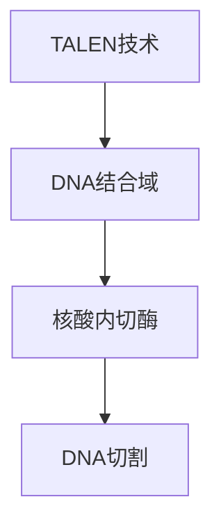

3. **ZFN（锌指核酸酶）技术**

ZFN（Zinc Finger Nucleases）技术是另一种基因编辑工具，它利用锌指蛋白的DNA结合能力来定位特定的DNA序列，并通过内置的核酸内切酶在该序列上切割DNA。

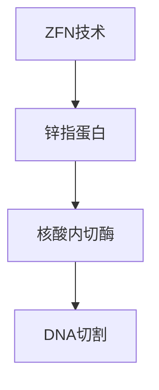

#### 2.2 基因组合技术

基因组合技术是合成生物学中的另一个重要领域，它通过组合不同的基因片段来创建新的基因序列。基因组合技术不仅能够用于构建新的生物系统，还可以用于改进现有生物系统的功能。

1. **基因打靶技术**

基因打靶技术是一种常用的基因组合方法，它通过将目标基因插入到生物体的基因组中，从而实现对特定基因的修改。基因打靶技术通常涉及以下步骤：

- **设计定向整合载体**：设计一个载体，使其在特定位置整合到基因组中。
- **基因替换**：使用CRISPR-Cas9或其他基因编辑技术，将目标基因插入到定向整合载体中。
- **基因插入**：通过整合载体将目标基因插入到生物体的基因组中。

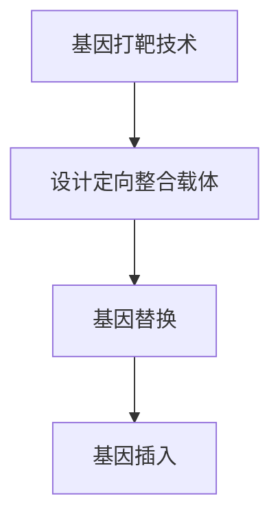

2. **基因调控技术**

基因调控技术用于调节基因表达，从而实现对生物系统功能的控制。这种技术可以通过改变DNA序列中的启动子、增强子或抑制子来实现。基因调控技术包括以下几种方法：

- **CRISPR-dCas9系统**：使用CRISPR-dCas9系统，通过改变dCas9的DNA结合域，实现对基因表达的调控。
- **启动子替换**：通过替换基因启动子，改变基因的表达水平。
- **RNA干扰**：利用RNA干扰（RNAi）技术，通过引入特定的RNA分子来抑制目标基因的表达。

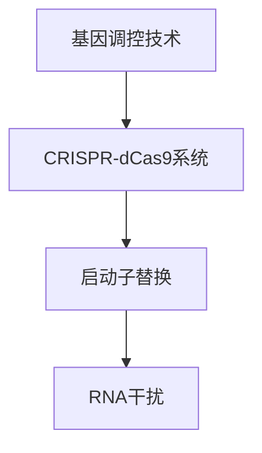

#### 2.3 生物信息学工具

生物信息学工具在合成生物学中起着至关重要的作用。这些工具能够处理和分析大量的生物数据，为合成生物学的设计和构建提供重要的支持。

1. **基因序列分析**

基因序列分析是合成生物学中的基础步骤。通过生物信息学工具，可以快速准确地分析基因序列，识别基因的功能、结构特征和突变。

2. **蛋白质结构预测**

蛋白质结构预测是合成生物学中的重要任务。通过生物信息学工具，可以预测蛋白质的三维结构，从而了解其功能和作用机制。

3. **代谢途径分析**

代谢途径分析是合成生物学中的关键步骤。通过生物信息学工具，可以分析生物体内的代谢途径，优化生物系统的功能。

4. **系统建模与仿真**

系统建模与仿真通过生物信息学工具，可以对生物系统进行建模和仿真，从而预测其在不同条件下的行为和响应。

通过这些工具和技术，合成生物学能够设计和构建新的生物系统，为多个领域带来革命性的变化。未来，随着生物信息学工具的不断发展和完善，合成生物学将在更多领域发挥其巨大的潜力。

### 第3章：合成生物学与生物医药

合成生物学在生物医药领域中的应用正在迅速扩展，通过基因编辑、生物合成和细胞工程等技术创新，为药物研发、基因治疗和疫苗开发提供了全新的解决方案。

#### 3.1 合成生物学在药物研发中的应用

合成生物学在药物研发中发挥着重要作用，特别是在新药发现、药物合成和药物递送方面。以下是一些具体的应用：

1. **新药发现**

通过合成生物学技术，科学家可以设计和合成新的药物分子。利用基因编辑技术，可以在微生物体内引入新的代谢途径，从而产生新的生物活性物质。例如，通过引入特定的基因序列，大肠杆菌可以合成抗生素或抗癌药物。

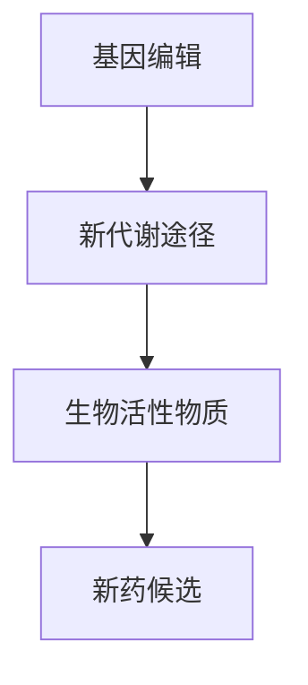

2. **药物合成**

合成生物学技术可以用于药物分子的合成，特别是复杂分子的合成。通过基因工程，可以构建能够生产特定药物分子的微生物细胞工厂。这些细胞工厂能够高效、连续地生产药物，降低生产成本。

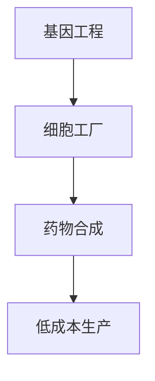

3. **药物递送**

合成生物学还可以用于开发新的药物递送系统。通过基因工程，可以将药物递送系统（如纳米颗粒、病毒载体等）集成到生物体内，实现对药物的精确递送和释放。

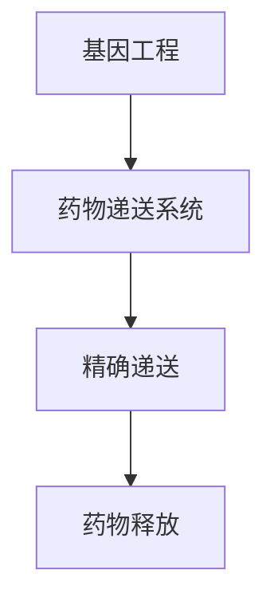

#### 3.2 合成生物学在基因治疗中的应用

基因治疗是一种通过修复或替换有缺陷的基因来治疗遗传性疾病的方法。合成生物学技术为基因治疗提供了新的工具和策略。

1. **基因编辑**

CRISPR-Cas9等基因编辑技术可以精确地修改患者的基因组，修复基因突变。通过基因编辑，可以纠正导致遗传性疾病的基因缺陷，从而实现疾病的治愈。

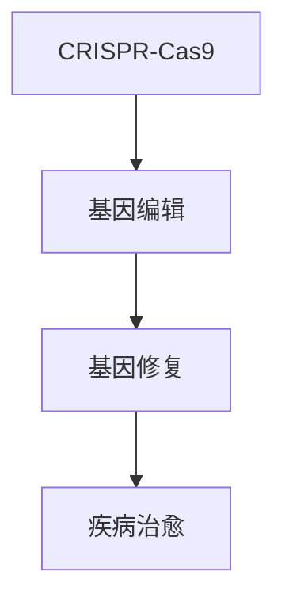

2. **基因替换**

通过基因替换，可以将功能正常的基因引入到患者体内，替换掉有缺陷的基因。这种方法可以用于治疗一些单基因遗传性疾病。

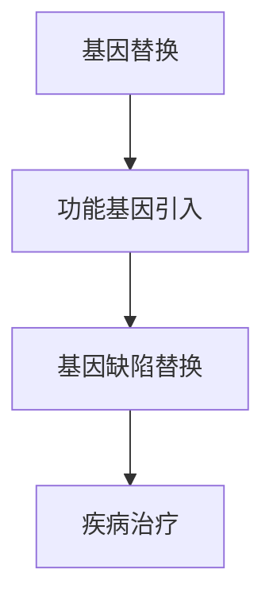

3. **基因调控**

合成生物学技术还可以用于基因调控，通过调节基因表达来治疗疾病。例如，通过调控肿瘤抑制基因的表达，可以抑制肿瘤的生长。

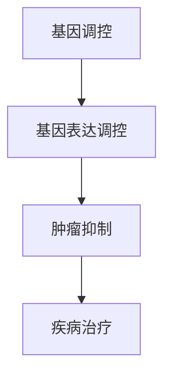

#### 3.3 合成生物学在疫苗研发中的应用

疫苗是预防疾病的重要手段，合成生物学技术在疫苗研发中发挥着关键作用。

1. **基因工程疫苗**

基因工程疫苗利用合成生物学技术，将病原体的关键抗原基因插入到载体中，然后通过基因修饰使载体在体内表达这些抗原。这种方法可以制备出高效的疫苗，如腺病毒载体疫苗和DNA疫苗。

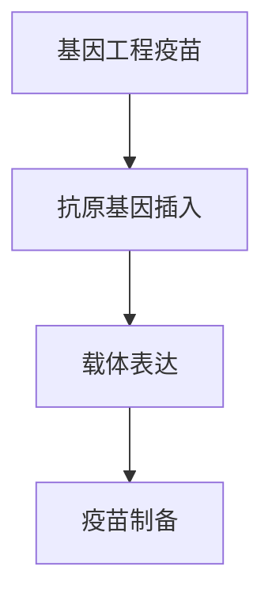

2. **合成疫苗**

通过合成生物学技术，可以设计和合成新的疫苗分子。这种方法能够快速开发出针对新型病原体的疫苗，如合成肽疫苗和合成RNA疫苗。

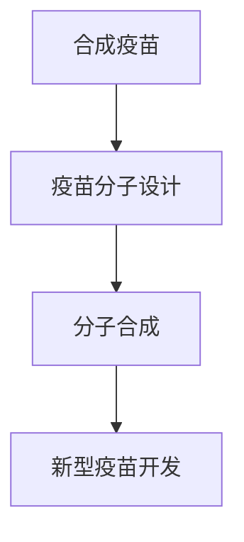

3. **疫苗递送**

合成生物学还可以用于疫苗递送系统的开发，通过基因工程将疫苗集成到生物体内，实现对疫苗的精确递送和释放。

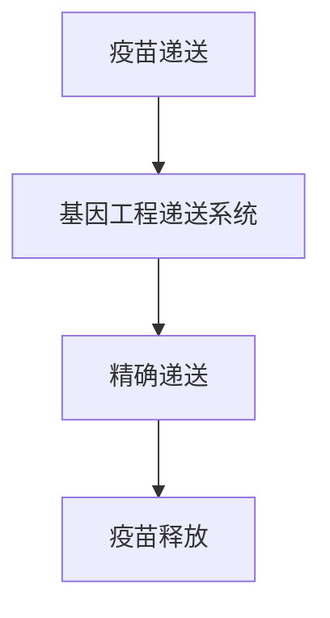

通过这些技术的应用，合成生物学为生物医药领域带来了巨大的变革，使得药物研发、基因治疗和疫苗开发更加高效和精确。随着合成生物学技术的不断进步，未来其在生物医药领域的应用将更加广泛，为人类健康带来更多福祉。

### 第4章：合成生物学与农业

合成生物学在农业领域的应用正逐渐显现其巨大的潜力，通过基因编辑、生物合成和生物制造技术，为作物育种、农业产量提升和环境保护提供了创新的解决方案。

#### 4.1 合成生物学在农业育种中的应用

合成生物学技术为农业育种带来了革命性的变革，通过基因编辑和基因组合技术，可以快速培育出高产、抗病、耐逆性强的作物品种。

1. **基因编辑**

基因编辑技术，如CRISPR-Cas9，使得科学家能够精确地修改植物基因，以增强其抗病性和耐逆性。例如，通过编辑植物抗病基因，可以使得作物对病原体具有更强的抵抗力，从而减少农药的使用。

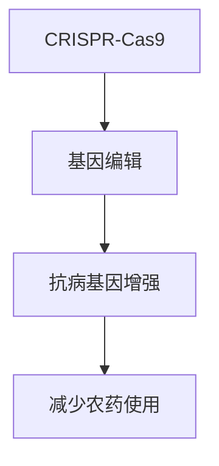

2. **基因组合**

基因组合技术通过将不同作物的优良基因组合在一起，创造出新的杂交品种。这种方法可以结合不同作物的优点，提高作物的产量和品质。例如，将水稻的高产基因和抗病基因组合在一起，可以培育出既高产又抗病的杂交水稻。

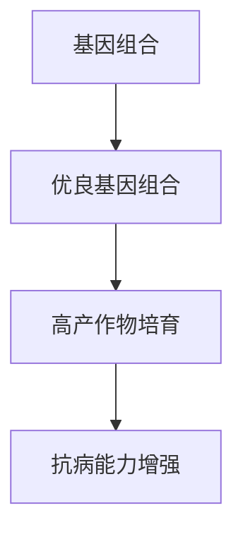

3. **基因调控**

通过基因调控技术，可以调节植物基因的表达，从而优化作物的生长和发育。例如，通过调控植物生长激素的基因表达，可以使得作物在较短的时间内达到成熟，从而提高产量。

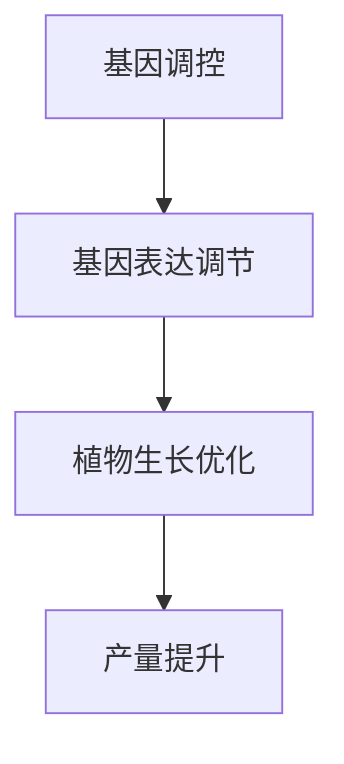

#### 4.2 合成生物学在农业生产的优化中的应用

合成生物学技术不仅能够用于作物育种，还可以通过生物合成和生物制造技术，优化农业生产过程，提高产量和质量。

1. **生物合成**

通过生物合成技术，可以利用微生物或其他生物体生产高附加值的农业产品，如植物生长激素、抗生素和营养补充剂。这些产品可以通过基因工程被集成到农业生产中，提高作物的生长速度和产量。

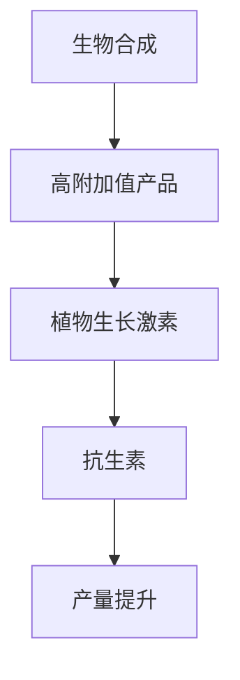

2. **生物制造**

生物制造技术通过基因工程构建生物反应器，使得微生物能够高效生产农业所需的化学品。例如，通过基因工程，可以将特定的微生物改造为能够生产农药或肥料的生物工厂，从而减少对化学农药和化肥的依赖。

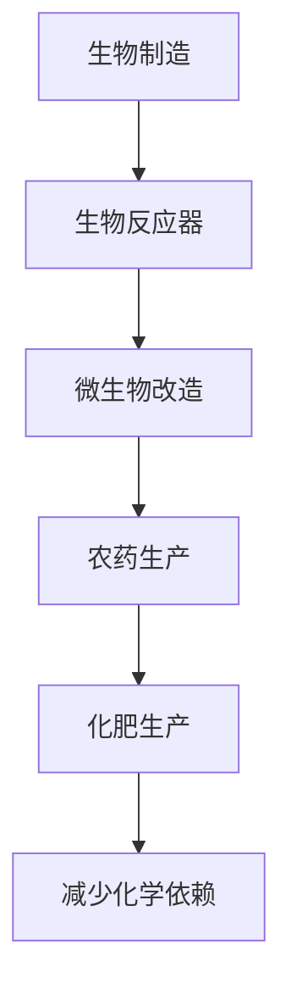

3. **精准农业**

合成生物学技术还可以用于精准农业，通过基因编辑和基因组合技术，培育出具有特定性状的作物品种，以满足不同环境条件下的需求。例如，通过基因编辑，可以培育出能够在盐碱地生长的作物，从而扩大种植范围。

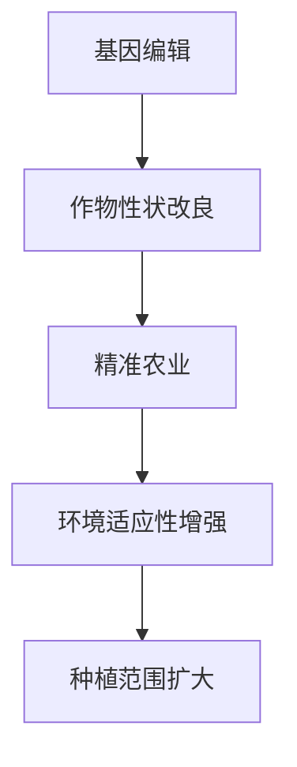

#### 4.3 合成生物学在农药研发中的应用

合成生物学在农药研发中的应用，可以通过基因工程生产生物农药，减少对化学农药的依赖，降低环境污染。

1. **生物农药**

通过基因工程，可以构建能够生产生物农药的微生物，例如利用基因编辑技术，将特定抗虫基因引入到微生物中，使其能够生产对害虫具有毒性的蛋白质。这些生物农药可以替代传统的化学农药，减少害虫对作物的危害。

```mermaid
graph TD
A[基因工程] --> B[生物农药]
B --> C[抗虫基因引入]
C --> D[微生物生产]
D --> E[减少化学农药使用]
```

2. **农药合成**

合成生物学技术还可以用于农药分子的合成，通过基因工程，构建能够生产农药分子的微生物细胞工厂。这些细胞工厂可以高效生产农药，降低生产成本，同时减少对环境的影响。

```mermaid
graph TD
A[基因工程] --> B[农药合成]
B --> C[细胞工厂]
C --> D[高效生产]
D --> E[减少环境影响]
```

通过合成生物学技术的应用，农业领域正在迎来一场革命。从作物育种到农业生产优化，再到农药研发，合成生物学为农业带来了前所未有的变革。未来，随着合成生物学技术的不断进步，农业将变得更加高效、可持续和环保，为全球粮食安全和环境保护做出重要贡献。

### 第5章：合成生物学与工业制造

合成生物学在工业制造中的应用正逐渐成为行业变革的重要驱动力，通过生物制造技术，合成生物学能够生产出传统化学方法难以或无法生产的复杂分子和高价值产品，从而带来显著的商业价值和技术创新。

#### 5.1 合成生物学在生物制造中的应用

生物制造是合成生物学在工业制造中的重要应用领域，通过利用生物体（如微生物、植物和动物细胞）的代谢途径和合成能力，生产出各种化学品和材料。

1. **生物塑料**

生物塑料是一种由可再生资源生产的塑料，具有较低的环境影响。通过基因工程，可以构建能够生产生物塑料的微生物或植物。例如，通过改造大肠杆菌，使其能够生产聚乳酸（PLA），这是一种可降解的生物塑料。

```mermaid
graph TD
A[基因工程] --> B[生物塑料生产]
B --> C[微生物或植物]
C --> D[聚乳酸（PLA）]
D --> E[可降解性]
```

2. **生物燃料**

生物燃料是通过生物制造技术生产的替代传统化石燃料的能源。通过基因工程，可以构建能够高效生产生物燃料的微生物，如利用改造酵母菌生产乙醇。这种方法不仅能够降低碳排放，还能够提高能源的可持续性。

```mermaid
graph TD
A[基因工程] --> B[生物燃料生产]
B --> C[微生物改造]
C --> D[乙醇生产]
D --> E[碳减排]
```

3. **生物酶制剂**

生物酶制剂是一种通过生物制造技术生产的生物催化剂，广泛用于工业生产中，如洗涤剂、食品加工和纺织工业。通过基因工程，可以构建能够生产特定酶的微生物，从而提高生产效率和降低成本。

```mermaid
graph TD
A[基因工程] --> B[生物酶制剂生产]
B --> C[微生物改造]
C --> D[特定酶生产]
D --> E[生产效率提高]
```

#### 5.2 合成生物学在材料科学中的应用

合成生物学在材料科学中的应用，通过基因工程和生物合成技术，能够生产出具有特定结构和功能的新型材料。

1. **生物复合材料**

生物复合材料是通过结合生物基材料和传统材料（如塑料、纤维等）制成的。通过基因工程，可以构建能够生产特定生物基材料的微生物或植物。这些生物基材料具有良好的生物相容性和环境友好性，适用于医疗、建筑和汽车等行业。

```mermaid
graph TD
A[基因工程] --> B[生物复合材料]
B --> C[生物基材料]
B --> D[传统材料]
D --> E[复合结构]
```

2. **智能材料**

智能材料是一种能够对外界刺激（如温度、光照、电场等）做出响应的材料。通过合成生物学技术，可以构建能够产生特定反应的微生物或植物。例如，通过基因工程，可以构建能够产生光敏蛋白的微生物，用于制造智能窗户或传感器。

```mermaid
graph TD
A[基因工程] --> B[智能材料]
B --> C[光敏蛋白]
C --> D[对外界刺激响应]
```

3. **纳米材料**

合成生物学技术在纳米材料的合成和应用中发挥着重要作用。通过生物合成技术，可以构建能够生产纳米粒子的微生物或植物。这些纳米材料具有独特的物理和化学性质，广泛应用于电子、医学和能源等领域。

```mermaid
graph TD
A[生物合成] --> B[纳米材料]
B --> C[微生物或植物]
B --> D[纳米粒子生产]
```

通过这些应用，合成生物学在工业制造和材料科学领域展示了巨大的潜力。未来，随着合成生物学技术的不断进步，我们将看到更多创新的产品和解决方案，为各行各业带来深远的影响。

### 第6章：合成生物学创业机遇与挑战

合成生物学作为一门前沿科学，正在为创业领域带来前所未有的机遇。然而，随着技术的快速发展，创业者在探索合成生物学商业潜力时也面临着一系列挑战。本章节将分析合成生物学创业的机遇和挑战，并提供一些策略和建议。

#### 6.1 合成生物学创业的机遇

1. **市场需求增长**

随着全球人口增长和资源消耗的持续增加，人们对可持续性和高效生产的需求日益增加。合成生物学技术提供了一种新的解决方案，能够生产出更环保、更高效的产品。例如，生物塑料和生物燃料等生物基产品逐渐成为传统石化产品的替代品，市场需求持续增长。

2. **技术创新**

合成生物学领域的技术创新层出不穷，包括基因编辑、生物合成、生物制造等。这些技术创新不仅提高了合成生物学的应用能力，也为创业者提供了丰富的机会。例如，CRISPR-Cas9技术的普及使得基因编辑变得更加便捷和高效，为创业者在生物医药、农业和工业等领域创造了更多可能性。

3. **政策支持**

各国政府日益认识到合成生物学的重要性，并开始出台相关政策支持和鼓励合成生物学的研究和应用。例如，美国和欧盟都在推动合成生物学的研发和应用，并提供资金和税收优惠。这些政策支持为创业者提供了良好的外部环境，有助于降低创业风险和成本。

4. **跨界合作**

合成生物学与多个领域（如生物医药、农业、工业等）有着广泛的交叉应用。这为创业者提供了跨界合作的机会，可以通过整合不同领域的资源和能力，创造出全新的商业模式和产品。例如，生物医药公司可以与农业公司合作，利用合成生物学技术改进农作物抗病性和产量。

#### 6.2 合成生物学创业的挑战

1. **技术风险**

合成生物学技术虽然发展迅速，但仍存在一定的技术风险。例如，基因编辑技术的精确性和安全性尚未完全解决，可能导致意外的基因突变或生态风险。此外，合成生物学在工业制造和农业中的应用仍需进一步验证和优化，技术成熟度有待提高。

2. **法规风险**

合成生物学涉及到生物安全和伦理问题，各国法规和政策尚不完善。创业者需要严格遵守相关法规，以避免法律风险。例如，在美国，合成生物学的监管由FDA（食品药品监督管理局）负责，创业者需要通过严格的审批程序。而在欧盟，则由EC（欧洲化学品管理局）负责监管。这些法规政策的不确定性可能影响创业项目的进展。

3. **社会伦理问题**

合成生物学在应用过程中可能会引发社会伦理问题。例如，基因编辑技术的滥用可能导致基因歧视、生物安全等问题。此外，合成生物学在农业和工业中的应用可能会引发环境保护和生物多样性保护的争议。创业者需要认真考虑这些社会伦理问题，制定相应的伦理规范和应急预案。

4. **市场竞争**

合成生物学领域竞争激烈，创业者需要面对来自传统行业和新兴企业的竞争压力。例如，传统石化行业在应对环保需求时，也在积极研发生物基替代品。此外，新兴的生物技术公司也在不断涌现，通过技术创新抢占市场份额。创业者需要找到独特的市场定位和竞争优势，以在激烈的市场竞争中脱颖而出。

#### 6.3 创业策略与建议

1. **技术研发**

创业者应重点关注技术研发，通过不断探索和创新，提高合成生物学技术的成熟度和应用能力。例如，可以通过合作研究、技术外包等方式，快速获取先进的技术成果，为创业项目提供坚实的技术支撑。

2. **市场调研**

在创业初期，创业者应进行充分的市场调研，了解市场需求和竞争态势。通过市场调研，可以明确目标市场和客户需求，为产品开发和商业模式设计提供依据。

3. **合规经营**

创业者应严格遵守相关法规和政策，确保创业项目的合规性。例如，在涉及生物安全和伦理问题时，应制定相应的应急预案和伦理规范，确保项目在合规范围内进行。

4. **跨界合作**

创业者应积极寻求跨界合作，整合不同领域的资源和能力，发挥协同效应。例如，可以与生物医药公司、农业公司等合作，共同开发合成生物学应用。

5. **风险管理**

创业者应建立完善的风险管理机制，对技术、法规、市场等风险进行识别和评估。通过制定风险应对策略，降低创业风险，保障项目的稳定发展。

6. **社会责任**

创业者应关注社会责任，积极推动合成生物学的可持续发展。例如，可以通过环保实践、社会责任投资等方式，为社会和环境做出积极贡献。

通过以上策略和建议，创业者可以在合成生物学领域抓住机遇，应对挑战，实现创业成功。未来，随着合成生物学技术的不断进步，创业者在这一领域的创新和应用将不断拓展，为人类带来更多福祉。

### 第7章：合成生物学创业案例分析

在合成生物学领域，既有成功的创业案例，也有失败的教训。通过分析这些案例，可以更好地理解合成生物学创业的路径和策略。

#### 7.1 成功案例解析

**案例1：Ginkgo Bioworks**

Ginkgo Bioworks 是一家全球领先的合成生物学公司，专注于生物制造和生物设计。以下是Ginkgo Bioworks的成功因素：

1. **技术创新**

Ginkgo Bioworks 在基因编辑、生物合成和生物制造领域取得了显著的技术突破。例如，该公司开发了名为`Ginkgo OS`的平台，通过自动化和模块化的设计，大大提高了生物合成过程的效率和精度。

2. **商业模式**

Ginkgo Bioworks 的商业模式以合同研发服务（CRS）和自主产品开发（ACD）相结合。通过为多家大型企业提供定制化解决方案，Ginkgo Bioworks 赢得了广泛的客户信任，同时也在自主产品开发方面取得了成功。

3. **跨界合作**

Ginkgo Bioworks 积极寻求与其他行业的合作，例如与时尚品牌合作开发生物基材料，与食品公司合作开发新型食品添加剂。这些跨界合作不仅拓宽了业务范围，也为公司带来了新的市场机遇。

4. **持续创新**

Ginkgo Bioworks 持续投入研发，不断推出新技术和新产品。例如，该公司在生物塑料、生物燃料和生物酶制剂等领域取得了重要进展，为公司的长期发展奠定了基础。

**案例2：Synthacean**

Synthacean 是一家专注于合成生物学的创业公司，通过开发生物制造平台，实现了低成本、高效率的生产。以下是Synthacean的成功因素：

1. **团队组建**

Synthacean 的团队由多位合成生物学和工程学领域的专家组成，具有丰富的研发和创业经验。团队成员在合成生物学、计算生物学和工业工程等方面都有深入的研究，为公司的技术创新提供了强有力的支持。

2. **市场定位**

Synthacean 明确了其在生物制造领域的市场定位，专注于为生物制药和化学品企业提供定制化的生物制造解决方案。通过专注于细分市场，Synthacean 在市场上建立了明确的竞争优势。

3. **技术创新**

Synthacean 在生物制造平台方面取得了重要突破，通过基因编辑和生物合成技术，实现了生产过程的高度自动化和优化。这种技术创新使得Synthacean 能够为客户提供更高效、更低成本的生产方案。

4. **客户关系**

Synthacean 注重与客户的紧密合作，通过提供定制化的解决方案，赢得了客户的信任和长期合作。与客户的良好关系不仅为公司的业务拓展提供了支持，也为技术创新和产品优化提供了宝贵的反馈。

#### 7.2 失败案例解析

**案例1：Solazyme**

Solazyme 是一家曾备受瞩目的生物燃料公司，但最终在2018年申请破产。以下是Solazyme失败的原因：

1. **市场定位模糊**

Solazyme 在成立初期，试图在多个领域同时发力，包括生物燃料、化妆品原料和食品添加剂等。由于市场定位模糊，公司无法在任何一个领域建立起核心竞争力，导致资源分散和市场开拓困难。

2. **技术不成熟**

尽管Solazyme 在生物燃料领域进行了大量投资，但其技术并未达到商业化水平。生产成本高、效率低、产品质量不稳定等问题使得Solazyme 无法在市场上获得竞争优势。

3. **资金链断裂**

由于市场开拓不顺利，Solazyme 的收入未能覆盖持续的高额研发和生产成本。在多次融资失败后，公司资金链断裂，最终导致破产。

4. **管理问题**

Solazyme 的管理团队在战略决策和执行上存在失误，未能及时调整业务方向和市场策略。此外，公司内部沟通不畅、团队合作不佳，也加剧了公司的问题。

**案例2：Amyris**

Amyris 是一家专注于生物制药和生物燃料的创业公司，虽然在早期取得了一定的成功，但最终未能持续发展。以下是Amyris的失败原因：

1. **技术依赖**

Amyris 过度依赖CRISPR-Cas9等基因编辑技术，而在其他技术领域缺乏突破。这种技术依赖使得公司在技术变革面前显得脆弱，难以适应新的技术趋势。

2. **商业模式问题**

Amyris 的商业模式过于复杂，试图通过多个业务板块同时盈利，但缺乏明确的盈利模式和可持续的收入来源。此外，公司在产品定价和销售策略上存在不足，导致市场竞争力下降。

3. **市场竞争激烈**

生物燃料和生物制药市场竞争激烈，Amyris 面临来自传统石化企业和新兴生物技术公司的双重压力。在激烈的市场竞争中，Amyris 的市场份额逐渐萎缩。

4. **资金问题**

Amyris 在多次融资过程中遭遇困难，资金链紧张。公司在研发投入和市场拓展上的资金不足，使得业务发展受阻。

通过以上成功和失败案例的分析，我们可以得出以下启示：

1. **明确市场定位和核心竞争力**：创业者应明确自己的市场定位和核心竞争力，避免盲目多元化。

2. **注重技术创新**：持续的技术创新是创业成功的关键，创业者应聚焦于核心技术领域的突破。

3. **建立稳定的商业模式**：创业者应制定明确的商业模式，确保收入的稳定和可持续发展。

4. **注重团队建设和团队合作**：创业者应注重团队建设和团队合作，确保团队能够高效协同工作。

5. **防范市场风险**：创业者应密切关注市场动态，及时调整业务方向和策略，以应对市场变化。

6. **防范技术风险**：创业者应确保技术成熟度，避免过度依赖单一技术。

通过以上策略和教训，创业者可以在合成生物学领域抓住机遇，避免失败，实现创业成功。

### 第8章：合成生物学创业实战指导

#### 8.1 创业团队组建

一个成功的合成生物学创业项目离不开一支优秀的团队。在组建团队时，创业者需要考虑以下几个方面：

1. **核心成员的选择**

核心成员的选择是团队组建的关键。创业者应优先考虑具备合成生物学、生物工程、生物信息学等领域专业背景的人才。此外，团队成员应具备良好的沟通能力和团队合作精神，以确保团队的高效运作。

2. **团队合作与沟通**

团队合作和沟通对于合成生物学创业至关重要。创业者应建立完善的沟通机制，确保团队成员能够及时交流信息和分享知识。例如，可以定期举行团队会议、研讨会和培训，以提高团队的整体素质和协作能力。

3. **技术背景与互补**

团队成员应具备互补的技术背景，以涵盖合成生物学领域的各个方面。例如，除了合成生物学的科学家，团队中还应包括生物信息学家、工程师和市场营销人员，以确保项目从技术到市场推广的全面覆盖。

#### 8.2 商业计划书撰写

商业计划书是创业项目的核心文档，它详细阐述了项目的目标、市场定位、商业模式、财务预测等关键信息。在撰写商业计划书时，创业者应关注以下几个方面：

1. **市场分析**

市场分析是商业计划书的重要组成部分。创业者应详细分析目标市场的规模、增长趋势、竞争状况等。例如，可以通过市场调研、行业报告和竞争对手分析，了解市场需求和潜在客户。

2. **产品规划**

产品规划应明确项目的具体产品或服务，包括产品功能、技术特点、市场需求和竞争优势。例如，创业者可以列举项目的主要产品或服务，并详细描述其技术实现方式和市场定位。

3. **商业模式**

商业模式应详细阐述项目的盈利模式、收入来源和成本结构。创业者应明确项目的盈利点，例如通过销售产品、提供技术服务、许可专利等方式实现收入。此外，还应考虑项目的可持续性和盈利潜力。

4. **财务预测**

财务预测应包括项目的收入、支出、利润预测等。创业者可以列出详细的三到五年财务预测表，包括收入预测、成本预算、利润预测等，以展示项目的财务健康状况和盈利能力。

#### 8.3 开发环境与资源获取

合成生物学创业项目需要完善的开发环境和充足的资源支持。在开发环境和资源获取方面，创业者应考虑以下几个方面：

1. **实验室搭建**

实验室是合成生物学创业项目的核心基地。创业者应根据项目需求，搭建符合合成生物学实验要求的实验室。实验室应配备必要的仪器设备、试剂耗材等，以满足实验需求。

2. **专利申请**

专利保护对于合成生物学创业至关重要。创业者应关注专利申请，保护自己的技术创新和知识产权。例如，可以聘请专业律师团队，对项目的技术方案进行专利检索和分析，确保专利申请的成功。

3. **政策支持与资源对接**

创业者应积极寻求政策支持和资源对接。例如，可以申请政府的科研资助、创业补贴等政策支持，同时与高校、科研院所和企业建立合作关系，共享资源和信息。

4. **资金筹集**

资金筹集是创业项目成功的关键。创业者可以通过多种方式筹集资金，例如天使投资、风险投资、银行贷款等。在筹集资金时，创业者应准备详细的商业计划书和财务预测，以吸引投资者的关注。

通过以上实战指导，创业者可以更好地组建团队、撰写商业计划书、搭建开发环境并获取所需资源，为合成生物学创业项目的成功奠定坚实基础。

### 第9章：合成生物学创业的未来展望

合成生物学作为一门前沿科技领域，正迅速发展并在多个行业中展现出巨大的潜力。随着技术的不断进步和应用的深入，合成生物学创业的未来充满了无限可能。

#### 9.1 技术发展趋势

1. **基因编辑技术的进步**

基因编辑技术，如CRISPR-Cas9，将继续改进和优化，提高编辑的精度和效率。未来，可能会出现新的基因编辑工具，如CRISPR-Cpf1和Base Editing，这些技术将进一步提升基因编辑的灵活性和实用性。

2. **生物信息学与系统生物学的整合**

生物信息学和系统生物学在合成生物学中的应用将更加紧密。通过整合生物信息学的高通量数据分析和系统生物学的网络建模，科学家能够更准确地预测和设计复杂的生物系统，实现更高的设计效率和精确度。

3. **新工具与技术的出现**

随着合成生物学的发展，将出现更多新的工具和技术，如合成生物传感器、生物计算平台和生物打印技术。这些新技术将拓展合成生物学的应用范围，为创业提供更多可能性。

4. **人工智能与合成生物学的融合**

人工智能（AI）在合成生物学中的应用将越来越普遍。通过AI算法，可以优化合成生物学的设计流程，提高生物系统的性能和稳定性。AI还可以用于大数据分析，帮助科学家更好地理解生物系统的行为和功能。

#### 9.2 商业模式的创新

1. **个性化医疗**

合成生物学在个性化医疗领域的应用将不断拓展。通过基因编辑和生物制造技术，可以为每个患者量身定制个性化的治疗方案，如个性化疫苗和基因疗法。这种个性化医疗模式将带来巨大的市场机会。

2. **生物制造平台**

生物制造平台将成为合成生物学创业的重要方向。通过构建模块化、自动化和高效的生物制造平台，企业可以快速响应市场需求，生产出各种高附加值的产品，如生物塑料、生物燃料和生物药物。

3. **生态农业**

合成生物学在农业中的应用将推动生态农业的发展。通过基因编辑和生物合成技术，可以培育出高产、抗病和环保的农作物，减少农药和化肥的使用，提高农作物的产量和质量。

4. **绿色工业**

合成生物学在绿色工业中的应用将有助于减少环境污染和资源消耗。通过生物制造技术，可以生产出替代传统化学品的环保材料，如生物基塑料和生物酶制剂，推动绿色工业的发展。

#### 9.3 社会责任与可持续发展

合成生物学创业不仅需要关注商业价值，还需要承担社会责任和推动可持续发展。创业者应关注以下几个方面：

1. **生物安全与伦理**

在合成生物学应用中，生物安全和伦理问题至关重要。创业者应严格遵守相关法规和伦理规范，确保技术应用的安全性和伦理性，避免潜在的风险和争议。

2. **环境保护**

合成生物学技术在环境保护中的应用将越来越广泛。例如，通过生物合成技术，可以生产出环保材料，替代传统的石油基材料，减少对环境的影响。此外，合成生物学还可以用于污染物的降解和治理，推动可持续发展。

3. **社会公平**

合成生物学技术应促进社会公平和包容性发展。创业者应关注技术普及和贫困地区的需求，通过技术援助和合作项目，推动合成生物学技术在全社会的应用。

4. **教育与培训**

合成生物学的发展需要大量专业人才。创业者应积极参与教育和培训项目，培养下一代合成生物学家，推动合成生物学知识的普及和应用。

通过技术创新、商业模式创新和社会责任的共同推动，合成生物学创业将在未来带来深远的影响。创业者应抓住这一历史机遇，积极投身于合成生物学的创新和应用，为人类社会的可持续发展做出贡献。

### 附录A：合成生物学相关资源与工具

合成生物学作为一门前沿科学领域，依赖于多种资源与工具的支持。以下列举了一些重要的开源工具、数据库和平台，为合成生物学的研究和应用提供强有力的技术支持。

#### A.1 开源工具

1. **生物信息学工具**

   - [BioPython](https://www.biopython.org/): BioPython是一个强大的生物信息学工具包，提供了一系列用于处理生物序列和注释的模块。
   - [BLAST](https://blast.ncbi.nlm.nih.gov/Blast.cgi): BLAST（Basic Local Alignment Search Tool）是一种广泛使用的生物序列比对工具，可用于识别序列之间的相似性。
   - [CellProfiler](https://cellprofiler.org/): CellProfiler是一个用于细胞图像分析的免费开源软件，能够自动化处理大量图像数据。

2. **基因编辑软件**

   - [GATK](https://gatk.broadinstitute.org/hc/en-us/home): GATK（Genome Analysis Toolkit）是一个用于基因组数据分析的开源软件，提供了一系列基因变异检测的工具。
   - [CRISPResso](http://crispresso.cs.cmu.edu/): CRISPResso是一个用于评估CRISPR-Cas9编辑效率和准确性的工具，可以帮助科学家优化基因编辑实验。

3. **生物计算框架**

   - [SBOL](https://www.synbology.org/): SBOL（Sequence Ontology）是一种用于描述生物序列和基因表达的标准语言，有助于生物信息学的数据共享和互操作性。
   - [Bioconductor](https://www.bioconductor.org/): Bioconductor是一个生物信息学软件包和数据库的集合，提供了大量用于基因组学和生物医学数据处理的工具。

#### A.2 数据库与平台

1. **基因数据库**

   - [Ensembl](https://www.ensembl.org/): Ensembl是一个综合性基因组数据库，提供了多种生物物种的基因序列、注释和基因组信息。
   - [NCBI Gene](https://www.ncbi.nlm.nih.gov/gene/): NCBI Gene是NCBI（美国国家生物技术信息中心）的一个数据库，包含了大量基因的详细信息。

2. **蛋白质数据库**

   - [UniProt](https://www.uniprot.org/): UniProt是一个综合性的蛋白质数据库，提供了详细的蛋白质序列、功能注释和结构信息。
   - [PDB](https://www.rcsb.org/): PDB（蛋白质数据银行）是一个蛋白质三维结构数据库，收录了大量的蛋白质晶体结构。

3. **代谢途径数据库**

   - [KEGG](https://www.genome.jp/kegg/): KEGG（Kyoto Encyclopedia of Genes and Genomes）是一个代谢途径数据库，提供了详细的生物代谢网络信息和基因注释。
   - [BioCyc](https://www.biocyc.org/): BioCyc是一个综合性的生物代谢数据库，包含了多种生物体的代谢网络、基因功能和基因组信息。

通过使用这些开源工具和数据库，合成生物学家可以更好地理解和设计复杂的生物系统，为合成生物学的研究和应用提供坚实的基础。这些资源不仅有助于科学研究，也为合成生物学创业提供了宝贵的工具和参考。

### 附录B：合成生物学创业相关法规与政策

合成生物学作为一项快速发展的前沿科技，其应用涉及到生物安全、伦理和环境保护等多个方面，因此在各国和地区都受到了严格的法规和政策监管。以下将介绍全球和主要国家的合成生物学相关法规与政策，并分析区域性政策差异。

#### B.1 全球政策环境

全球范围内，合成生物学主要受到国际组织和各国政府的监管。国际组织如联合国、世界卫生组织（WHO）和联合国粮食及农业组织（FAO）等，在合成生物学的法规制定和协调方面发挥了重要作用。

1. **联合国**

联合国通过《生物多样性公约》（CBD）和《国际生物技术条约》（IBT）等协议，对合成生物学进行了规范。这些协议强调了对生物安全的关注，并推动国际间的合作与信息交流。

2. **世界卫生组织（WHO）**

WHO设立了合成生物学工作组，负责评估合成生物学对人类健康的影响，并制定相关的政策建议。WHO还与其他国际组织和各国合作，推动全球生物安全框架的实施。

3. **联合国粮食及农业组织（FAO）**

FAO在合成生物学与农业应用方面发挥了重要作用，通过制定《农业生物技术国际规范》等文件，为成员国提供政策指导。

#### B.2 主要国家的法规与政策

全球主要国家对合成生物学的研究和应用制定了相应的法规和政策，以保障生物安全和伦理。以下简要介绍美国、欧盟和中国的主要政策。

1. **美国**

美国对合成生物学的监管主要由食品药品监督管理局（FDA）、环境保护局（EPA）和农业部（USDA）负责。

- **FDA**：FDA负责对合成生物学在生物医药领域的应用进行监管，例如基因治疗、细胞疗法和生物药物等。
- **EPA**：EPA负责对合成生物学在农业和环境保护领域的应用进行监管，如生物农药和生物燃料的生产。
- **USDA**：USDA负责对合成生物学在农业领域的应用进行监管，包括转基因作物的环境评估和食品安全评估。

2. **欧盟**

欧盟对合成生物学的研究和应用实施了严格的法规和政策，主要包括《工业基因编辑法规》（Illuminated Genome Editing）和《工业生物技术法规》（Illuminated Biotechnology）。

- **工业基因编辑法规**：该法规对基因编辑技术的研发和应用进行了规范，要求在研发阶段进行风险评估，并在上市前进行审批。
- **工业生物技术法规**：该法规涉及生物制造、生物农药和生物燃料等领域，强调对环境、人类健康和生物安全的关注。

3. **中国**

中国对合成生物学的研究和应用实施了多层次的法规和政策，由科技部、农业农村部、生态环境部和卫生健康委员会等主管部门负责。

- **科技部**：科技部负责合成生物学的研究项目管理和资金支持，推动合成生物学的研发和应用。
- **农业农村部**：农业农村部负责转基因作物的安全评估和种植管理，确保转基因作物的安全性。
- **生态环境部**：生态环境部负责生物安全的管理，对合成生物学在环境中的应用进行监管。
- **卫生健康委员会**：卫生健康委员会负责对合成生物学在生物医药领域的应用进行监管，确保基因治疗和细胞疗法的安全性。

#### B.3 区域性政策差异

不同国家和地区在合成生物学政策上存在差异，主要表现在以下几个方面：

1. **监管强度**

不同国家的监管强度有所不同，例如欧盟的监管较为严格，对基因编辑技术的研发和应用要求进行详细的评估和审批。而美国和中国的监管则相对灵活，更加注重科学风险分析和利益平衡。

2. **法规框架**

各国和地区的法规框架不同，例如美国和欧盟采取了多层次、多部门的监管模式，而中国则采取了多部门协调、统一监管的模式。

3. **政策导向**

不同国家和地区的政策导向也有所不同，例如欧盟更加注重环境保护和伦理规范，而美国和中国的政策则更加注重技术创新和产业发展。

4. **国际合作与交流**

国际合作与交流在各国的政策中占据重要地位，各国通过参与国际组织和签订协议，推动合成生物学的国际规范和合作。

通过了解全球和主要国家的合成生物学法规与政策，以及分析区域性政策差异，合成生物学的创业者可以更好地把握法规环境，合规经营，推动合成生物学技术的创新和应用。

## 总结

合成生物学作为一门前沿科学，正迅速改变着生物医药、农业、工业等多个领域的格局。通过基因编辑、生物合成和生物制造等技术，合成生物学为创业者提供了丰富的商业机遇。然而，这一领域也面临着技术风险、法规风险和社会伦理问题等挑战。

本文从合成生物学的基础知识、技术工具、商业应用、创业实践和未来展望等方面进行了详细分析。通过成功与失败案例的解析，我们了解了创业团队组建、商业计划书撰写、开发环境搭建和资源获取等关键环节。同时，我们也探讨了合成生物学创业的未来趋势和商业模式创新，以及社会责任与可持续发展的关键议题。

对于希望投身于合成生物学创业的读者，以下几点建议尤为重要：

1. **明确市场定位和核心竞争力**：在创业初期，明确市场定位和核心竞争力是成功的关键。通过深入研究和市场分析，找到细分市场的需求和痛点，从而制定有针对性的商业策略。

2. **持续技术创新**：合成生物学领域的技术进步迅速，创业者应注重技术创新，不断探索新的技术突破和应用。通过持续的技术研发，提高产品的竞争力。

3. **合规经营**：在法规方面，创业者应严格遵守相关法规和伦理规范，确保技术应用的安全性和伦理性。在产品开发和商业推广过程中，充分了解和遵守不同国家和地区的法规政策。

4. **跨界合作**：合成生物学具有广泛的跨界应用，创业者应积极寻求与其他领域的合作，通过跨界合作，实现资源共享和优势互补，拓宽业务范围和市场机会。

5. **注重社会责任**：合成生物学技术的应用应考虑社会和环境的可持续性。创业者应关注社会责任，推动合成生物学技术的可持续发展，为人类社会的福祉做出贡献。

最后，对于有兴趣进一步深入了解合成生物学领域的读者，我们推荐以下拓展阅读资源：

- **书籍**：
  - 《合成生物学：原理与应用》
  - 《Zen And The Art of Computer Programming》
  - 《CRISPR基因编辑技术：原理与应用》

- **在线课程**：
  - Coursera上的“合成生物学基础”
  - edX上的“生物信息学导论”

- **科研期刊**：
  - **Nature Biotechnology**
  - **Science Translational Medicine**
  - **Plant Biotechnology Journal**

通过这些资源，读者可以进一步深入了解合成生物学的理论基础、最新研究进展和应用案例，为自己的学习和研究提供有力支持。

