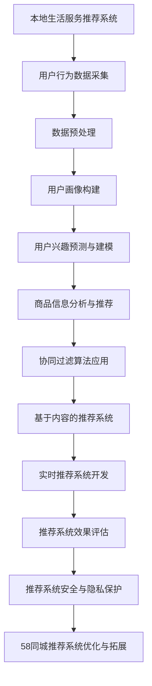
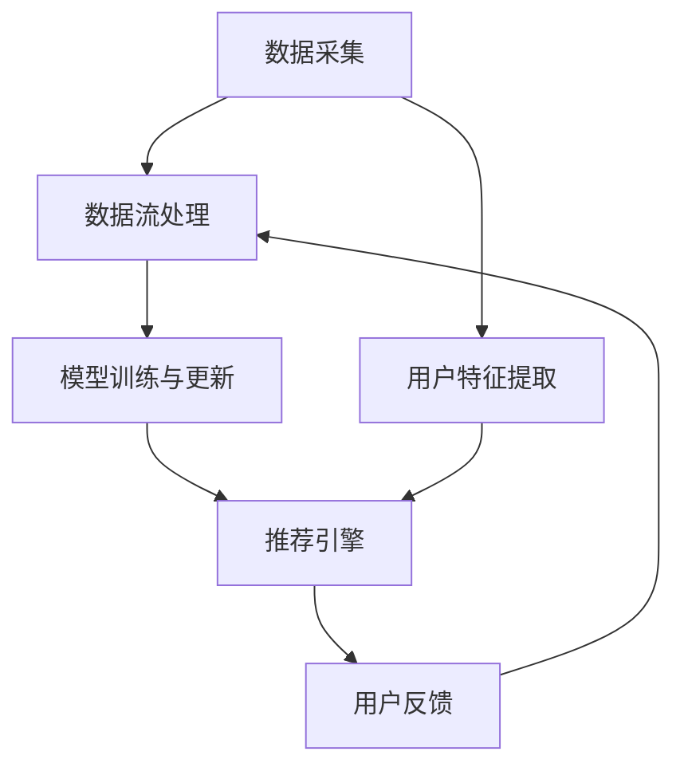
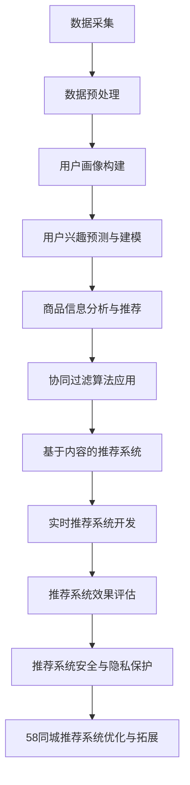

                 

### 文章标题：《58同城2025本地生活服务推荐专家社招面试指南》

#### 关键词：58同城、本地生活服务、推荐系统、社招、面试指南、算法原理、实战案例

##### 摘要：
本文旨在为有志于加入58同城本地生活服务推荐团队的应聘者提供一份详尽的面试指南。我们将深入探讨本地生活服务行业的背景与发展趋势，介绍推荐系统的基本概念、架构与核心算法原理，并通过实战案例分析展示58同城推荐系统的实际应用。此外，文章还将讨论推荐系统的优化与未来展望，帮助读者全面了解该领域的技术现状与前沿动态。

## 《58同城2025本地生活服务推荐专家社招面试指南》

### 目录大纲

## 第一部分：本地生活服务行业概述

### 第1章：本地生活服务行业背景与未来趋势

#### 1.1 互联网+本地生活服务的兴起

#### 1.2 本地生活服务市场的规模与增长

#### 1.3 58同城本地生活服务的发展历程

### 第2章：本地生活服务推荐系统架构

#### 2.1 推荐系统基础概念

#### 2.2 数据采集与预处理

#### 2.3 推荐算法原理与分类

#### 2.4 模型评估与优化

## 第二部分：58同城推荐系统实战

### 第3章：用户行为分析

#### 3.1 用户画像构建

#### 3.2 用户行为数据收集与处理

#### 3.3 用户兴趣预测与建模

### 第4章：商品信息分析与推荐

#### 4.1 商品信息抽取与处理

#### 4.2 商品特征工程

#### 4.3 基于内容的商品推荐

### 第5章：协同过滤算法应用

#### 5.1 协同过滤基本原理

#### 5.2 基于用户的行为协同过滤

#### 5.3 基于物品的协同过滤

### 第6章：基于内容的推荐系统

#### 6.1 内容匹配原理

#### 6.2 文本相似度计算

#### 6.3 内容推荐系统实践

### 第7章：实时推荐系统开发

#### 7.1 实时推荐系统架构设计

#### 7.2 数据流处理技术

#### 7.3 实时推荐算法实现

## 第三部分：58同城推荐系统优化与拓展

### 第8章：推荐系统效果评估

#### 8.1 评估指标与模型性能

#### 8.2 实际案例分析与优化

### 第9章：推荐系统安全与隐私保护

#### 9.1 推荐系统安全问题

#### 9.2 隐私保护策略

#### 9.3 58同城推荐系统的安全与隐私实践

### 第10章：58同城推荐系统未来展望

#### 10.1 新技术应用展望

#### 10.2 未来趋势与挑战

#### 10.3 58同城推荐系统的长期发展策略

## 附录

### 附录 A：推荐系统相关资源与工具

#### A.1 常用数据集与工具

#### A.2 开源推荐系统框架

#### A.3 行业报告与白皮书

### Mermaid 流程图



### 核心算法原理讲解

#### 协同过滤算法原理

协同过滤（Collaborative Filtering）是一种常见的推荐系统算法，其核心思想是通过收集用户的历史行为数据，分析用户与物品之间的相似性，从而预测用户对未知物品的偏好。

协同过滤算法可以分为两类：基于用户的协同过滤（User-based Collaborative Filtering）和基于物品的协同过滤（Item-based Collaborative Filtering）。

#### 基于用户的协同过滤

1. **步骤**：

   a. 计算用户之间的相似度。

   b. 为每个用户找到最相似的K个邻居。

   c. 根据邻居用户对物品的评分预测当前用户的评分。

2. **相似度计算**：

   $$\text{similarity(u, v)} = \frac{\text{count}}{\sqrt{|\text{Neighborhood(u)}| \times |\text{Neighborhood(v)}|}}$$

   其中，count表示用户u和v共同评价的物品数量，$|\text{Neighborhood(u)}|$和$|\text{Neighborhood(v)}|$分别表示用户u和v的邻居数量。

3. **预测评分**：

   $$\text{prediction(u, i)} = \frac{\sum_{v \in \text{Neighborhood(u)}} \text{simi```scss
### 第一部分：本地生活服务行业概述

#### 第1章：本地生活服务行业背景与未来趋势

##### 1.1 互联网+本地生活服务的兴起

随着互联网技术的不断进步，传统本地生活服务行业正在迎来前所未有的变革。互联网+本地生活服务的概念应运而生，通过移动互联网、大数据、人工智能等技术手段，将线上服务与线下体验深度融合，为用户带来更加便捷、个性化的生活服务。

首先，移动互联网的普及为本地生活服务提供了广阔的平台。用户可以通过手机等移动设备随时随地获取所需服务，如在线订餐、打车、酒店预订、娱乐活动等。这种便利性极大地提升了用户体验，推动了本地生活服务行业的发展。

其次，大数据技术的应用使得本地生活服务行业能够更好地了解用户需求和行为习惯。通过对海量用户数据的采集和分析，企业可以精准定位用户群体，制定有针对性的营销策略，提高服务质量和用户满意度。

此外，人工智能技术的引入进一步提升了本地生活服务的智能化水平。例如，智能客服系统可以实时解答用户问题，提高服务效率；智能推荐系统可以根据用户历史行为和偏好，为用户推荐个性化服务，提升用户体验。

##### 1.2 本地生活服务市场的规模与增长

本地生活服务市场的规模持续扩大，表现出强劲的增长态势。据市场研究机构数据显示，2019年全球本地生活服务市场规模已超过1万亿美元，预计到2025年将达到2万亿美元。以下是一些关键市场增长点：

1. **在线订餐与外卖市场**：随着外卖需求的不断增长，在线订餐市场已经成为本地生活服务领域的重要增长点。据统计，2019年全球外卖市场规模已超过6000亿美元，预计未来几年仍将保持高速增长。

2. **本地零售市场**：随着消费者对本地零售服务的需求增加，包括便利店、超市、药店等在内的本地零售市场也在不断扩大。电商平台的兴起和线下门店的转型升级，为本地零售市场注入了新的活力。

3. **在线旅游市场**：随着旅游消费需求的增加，在线旅游市场也呈现爆发式增长。在线预订酒店、机票、景点门票等服务已经成为游客出行的重要组成部分。

4. **家政服务市场**：随着城市化进程的加快，家政服务市场的需求也在不断增长。家庭清洁、月嫂、育儿嫂等家政服务项目受到越来越多家庭的青睐。

##### 1.3 58同城本地生活服务的发展历程

58同城是中国领先的本地生活服务信息平台，成立于2005年。以下是58同城本地生活服务的发展历程：

1. **2005-2010年：起步阶段**：58同城最初以分类信息平台的形式起步，提供房屋租售、招聘求职、二手交易等本地生活服务信息。

2. **2010-2015年：快速发展阶段**：随着移动互联网的兴起，58同城迅速拓展了业务范围，推出了包括家政服务、美容美发、教育培训等多个本地生活服务品类。

3. **2015-2020年：转型升级阶段**：58同城加大了对技术研发的投入，通过大数据、人工智能等技术手段提升平台的服务质量和用户体验。

4. **2020年至今：多元化发展阶段**：58同城进一步拓展了业务领域，包括在线教育、在线医疗、本地生活服务等，致力于打造全方位的本地生活服务生态。

通过以上分析，我们可以看到本地生活服务行业正迎来前所未有的发展机遇。互联网技术的不断进步和用户需求的持续增长，为本地生活服务行业带来了巨大的市场空间。对于有志于加入58同城本地生活服务推荐团队的人才来说，了解行业背景和发展趋势，掌握相关技术知识，将是成功的关键。

#### 第2章：本地生活服务推荐系统架构

##### 2.1 推荐系统基础概念

推荐系统是一种基于数据分析、机器学习等技术，通过分析用户行为、偏好和兴趣，向用户推荐其可能感兴趣的内容或服务的系统。推荐系统的核心目标是通过个性化推荐，提高用户体验，增加用户黏性和活跃度，从而提升平台的业务收益。

##### 2.2 数据采集与预处理

推荐系统的数据来源主要包括用户行为数据、用户个人信息和商品信息。用户行为数据包括用户的浏览、搜索、购买、评价等操作记录；用户个人信息包括用户年龄、性别、职业、地理位置等；商品信息包括商品的标题、描述、分类、价格等。

数据采集后，需要进行预处理，以去除噪声、缺失值和异常值，确保数据的质量和一致性。预处理步骤通常包括数据清洗、数据转换、数据集成和数据归一化等。

##### 2.3 推荐算法原理与分类

推荐算法可以分为基于内容的推荐（Content-based Recommendation）和协同过滤推荐（Collaborative Filtering）两大类。

1. **基于内容的推荐**：

   基于内容的推荐系统通过分析用户对某一内容的兴趣，发现其可能感兴趣的其他内容。核心思想是计算用户与物品之间的相似性，然后基于相似性进行推荐。

   常用方法包括：

   - **基于关键词匹配**：通过提取用户和物品的关键词，计算它们之间的相似度。

   - **基于内容相似度计算**：如文本相似度计算、图像相似度计算等，通过计算用户和物品的文本或图像之间的相似度进行推荐。

2. **协同过滤推荐**：

   协同过滤推荐通过分析用户之间的行为模式，找到相似的用户或物品，然后基于相似性进行推荐。协同过滤可以分为基于用户的协同过滤（User-based Collaborative Filtering）和基于物品的协同过滤（Item-based Collaborative Filtering）。

   - **基于用户的协同过滤**：通过计算用户之间的相似度，为每个用户找到最相似的邻居，然后根据邻居用户对物品的评分预测当前用户的评分。

   - **基于物品的协同过滤**：通过计算物品之间的相似度，为用户推荐与其已评价的物品相似的未评价物品。

##### 2.4 模型评估与优化

推荐系统的评估通常使用以下指标：

- **准确率（Accuracy）**：预测正确的样本占总样本的比例。
- **召回率（Recall）**：预测正确的正样本占总正样本的比例。
- **覆盖率（Coverage）**：推荐列表中包含的物品占总物品的比例。
- **新颖度（Novelty）**：推荐列表中的物品与用户已知的物品的差异程度。

评估完成后，可以通过调整模型参数、特征工程和算法改进等方式进行优化，以提高推荐系统的性能。常见的优化方法包括：

- **特征选择**：选择对模型性能有显著影响的关键特征，去除无关或冗余特征。
- **模型融合**：将多个推荐模型的结果进行融合，以提高整体推荐效果。
- **在线学习**：实时更新用户数据和模型，以适应用户行为的变化。

通过以上分析，我们可以了解到本地生活服务推荐系统的基础概念、架构和核心算法原理。在接下来的章节中，我们将深入探讨58同城推荐系统的具体实现和优化方法。

#### 第3章：用户行为分析

##### 3.1 用户画像构建

用户画像是指通过收集和分析用户的个人信息和行为数据，构建出一个关于用户特征的综合描述。用户画像的构建是推荐系统的重要基础，有助于深入了解用户需求和行为模式，从而实现更精准的推荐。

构建用户画像的关键步骤包括：

1. **数据采集**：从各种数据源（如用户注册信息、浏览记录、购买行为等）收集用户数据。
2. **数据清洗**：去除噪声、缺失值和异常值，确保数据质量。
3. **特征提取**：从原始数据中提取用户特征，如年龄、性别、地理位置、兴趣爱好等。
4. **特征编码**：将提取的特征进行编码处理，如将年龄、性别等分类特征转换为数值特征。
5. **特征选择**：选择对推荐模型性能有显著影响的关键特征，去除无关或冗余特征。
6. **用户建模**：使用机器学习算法（如聚类、回归等）对用户特征进行建模，构建用户画像。

##### 3.2 用户行为数据收集与处理

用户行为数据是推荐系统的重要输入，包括用户的浏览、搜索、购买、评价等操作记录。以下是用户行为数据收集与处理的步骤：

1. **数据采集**：通过Web日志、应用程序接口（API）、传感器等技术手段收集用户行为数据。
2. **数据预处理**：包括数据清洗、数据转换、数据集成和数据归一化等操作，以确保数据的质量和一致性。
3. **特征工程**：从用户行为数据中提取对推荐模型有意义的特征，如用户活跃度、购买频率、浏览时长等。
4. **特征选择**：选择对推荐模型性能有显著影响的关键特征，去除无关或冗余特征。
5. **数据存储**：将处理后的用户行为数据存储在数据库或数据仓库中，以供后续分析和使用。

##### 3.3 用户兴趣预测与建模

用户兴趣预测是推荐系统的核心任务，其目的是根据用户的历史行为和特征，预测用户对未知内容的兴趣。以下是用户兴趣预测与建模的步骤：

1. **用户行为分析**：分析用户的历史行为数据，如浏览、搜索、购买等操作，提取用户兴趣特征。
2. **用户特征构建**：将用户行为特征与其他用户特征（如人口统计学特征、地理位置等）进行融合，构建用户特征向量。
3. **兴趣模型训练**：使用机器学习算法（如决策树、神经网络等）训练兴趣预测模型，将用户特征向量映射为用户兴趣分数。
4. **兴趣预测与推荐**：根据兴趣预测模型，为用户推荐可能感兴趣的内容或服务。

通过以上步骤，我们可以构建出用户画像，并预测用户的兴趣。这为推荐系统提供了重要的数据支持，有助于实现更精准的个性化推荐。

#### 第4章：商品信息分析与推荐

##### 4.1 商品信息抽取与处理

商品信息抽取是指从大量商品数据中提取出对推荐系统有价值的商品特征，如标题、描述、分类、价格等。商品信息处理包括数据清洗、数据转换和数据归一化等步骤，以确保商品数据的质量和一致性。

商品信息抽取的关键步骤包括：

1. **数据采集**：通过爬虫、API等方式收集商品信息数据。
2. **数据清洗**：去除噪声、缺失值和异常值，确保数据质量。
3. **特征提取**：从商品信息数据中提取对推荐模型有意义的特征，如商品标题关键词、描述关键词、分类标签等。
4. **特征编码**：将提取的特征进行编码处理，如将分类标签转换为数值特征。
5. **特征选择**：选择对推荐模型性能有显著影响的关键特征，去除无关或冗余特征。

##### 4.2 商品特征工程

商品特征工程是指通过对商品特征进行选择、转换和组合，构建出对推荐模型有价值的特征集。商品特征工程的关键步骤包括：

1. **特征选择**：选择对推荐模型性能有显著影响的关键特征，去除无关或冗余特征。
2. **特征转换**：将原始特征进行数值化、归一化等处理，以适应推荐模型的输入要求。
3. **特征组合**：通过组合不同特征，构建新的特征，以提高推荐模型的性能。

常见的商品特征包括：

- **商品属性特征**：如商品标题、描述、分类、价格等。
- **用户属性特征**：如用户年龄、性别、地理位置、兴趣爱好等。
- **行为特征**：如用户浏览、搜索、购买等行为记录。
- **上下文特征**：如用户当前时间、天气状况、节假日等。

##### 4.3 基于内容的商品推荐

基于内容的商品推荐是指通过分析商品内容（如标题、描述、分类等），发现用户可能感兴趣的商品，并进行推荐。基于内容的商品推荐的核心步骤包括：

1. **商品内容分析**：从商品信息中提取关键信息，如关键词、分类标签等。
2. **相似度计算**：计算用户和商品之间的相似度，如文本相似度、分类相似度等。
3. **推荐生成**：根据相似度计算结果，为用户推荐相似度较高的商品。

基于内容的商品推荐方法包括：

- **关键词匹配**：通过提取商品关键词，计算用户和商品关键词的相似度，推荐关键词相似的商品。
- **文本相似度计算**：使用自然语言处理技术，计算用户和商品描述文本的相似度，推荐描述相似的商品。
- **分类相似度计算**：根据商品分类标签，计算用户和商品分类的相似度，推荐分类相似的商品。

通过以上分析，我们可以看到商品信息分析与推荐在本地生活服务推荐系统中的重要作用。通过深入挖掘商品信息，构建有效的商品特征，并运用基于内容的推荐方法，可以实现对用户的精准推荐，提高用户满意度和平台收益。

#### 第5章：协同过滤算法应用

##### 5.1 协同过滤基本原理

协同过滤（Collaborative Filtering）是一种常见的推荐系统算法，其核心思想是通过分析用户之间的行为模式，找到相似的用户或物品，然后基于相似性进行推荐。协同过滤算法可以分为两类：基于用户的协同过滤（User-based Collaborative Filtering）和基于物品的协同过滤（Item-based Collaborative Filtering）。

**基于用户的协同过滤**：

基于用户的协同过滤通过计算用户之间的相似度，为每个用户找到最相似的邻居，然后根据邻居用户对物品的评分预测当前用户的评分。核心步骤如下：

1. **计算用户相似度**：

   假设有用户 $u$ 和 $v$，用户相似度可以通过以下公式计算：

   $$ \text{similarity(u, v)} = \frac{\sum_{i \in \text{common}} r_{ui}r_{vi}}{\sqrt{\sum_{i \in \text{u}} r_{ui}^2 \sum_{i \in \text{v}} r_{vi}^2}} $$

   其中，$r_{ui}$ 和 $r_{vi}$ 分别表示用户 $u$ 和 $v$ 对物品 $i$ 的评分，$\text{common}$ 表示用户 $u$ 和 $v$ 共同评价的物品集合。

2. **选择邻居用户**：

   根据用户相似度，为每个用户选择最相似的 $K$ 个邻居用户。

3. **预测评分**：

   对于用户 $u$ 对未评价物品 $i$ 的预测评分，可以计算邻居用户对物品 $i$ 的评分的平均值：

   $$ \text{prediction(u, i)} = \frac{\sum_{v \in \text{neighbor(u)}} r_{vi}}{K} $$

**基于物品的协同过滤**：

基于物品的协同过滤通过计算物品之间的相似度，为用户推荐与其已评价的物品相似的未评价物品。核心步骤如下：

1. **计算物品相似度**：

   假设有物品 $i$ 和 $j$，物品相似度可以通过以下公式计算：

   $$ \text{similarity(i, j)} = \frac{\sum_{u \in \text{common}} r_{ui}r_{uj}}{\sqrt{\sum_{u \in \text{i}} r_{ui}^2 \sum_{u \in \text{j}} r_{uj}^2}} $$

   其中，$r_{ui}$ 和 $r_{uj}$ 分别表示用户 $u$ 对物品 $i$ 和 $j$ 的评分，$\text{common}$ 表示评价物品 $i$ 和 $j$ 的共同用户集合。

2. **推荐未评价物品**：

   对于用户 $u$，根据用户对已评价物品的评分，计算物品相似度，然后为用户推荐相似度较高的未评价物品。

##### 5.2 基于用户的行为协同过滤

基于用户的行为协同过滤（User-based Collaborative Filtering）是一种常见的协同过滤算法，其核心思想是通过分析用户对物品的评分，找到相似的用户，然后基于相似性为用户推荐物品。

**算法流程**：

1. **计算用户相似度**：

   $$ \text{similarity(u, v)} = \frac{\sum_{i \in \text{common}} r_{ui}r_{vi}}{\sqrt{\sum_{i \in \text{u}} r_{ui}^2 \sum_{i \in \text{v}} r_{vi}^2}} $$

2. **选择邻居用户**：

   根据用户相似度，为每个用户选择最相似的 $K$ 个邻居用户。

3. **预测评分**：

   $$ \text{prediction(u, i)} = \frac{\sum_{v \in \text{neighbor(u)}} r_{vi} \cdot \text{similarity(u, v)}}{K} $$

**伪代码**：

```python
def user_based_collaborative_filter(ratings, K):
    neighbors = {}
    for user in ratings:
        neighbors[user] = []
        for other_user in ratings:
            if user != other_user:
                similarity = calculate_similarity(ratings[user], ratings[other_user])
                neighbors[user].append((other_user, similarity))
        neighbors[user].sort(key=lambda x: x[1], reverse=True)
        neighbors[user] = neighbors[user][:K]

    predictions = {}
    for user in ratings:
        predictions[user] = {}
        for item in ratings:
            if item not in ratings[user]:
                prediction = 0
                for neighbor, similarity in neighbors[user]:
                    if item in ratings[neighbor]:
                        prediction += ratings[neighbor][item] * similarity
                prediction /= K
                predictions[user][item] = prediction
    return predictions
```

##### 5.3 基于物品的协同过滤

基于物品的协同过滤（Item-based Collaborative Filtering）通过计算物品之间的相似度，为用户推荐与其已评价的物品相似的未评价物品。

**算法流程**：

1. **计算物品相似度**：

   $$ \text{similarity(i, j)} = \frac{\sum_{u \in \text{common}} r_{ui}r_{uj}}{\sqrt{\sum_{u \in \text{i}} r_{ui}^2 \sum_{u \in \text{j}} r_{uj}^2}} $$

2. **推荐未评价物品**：

   对于用户 $u$，计算用户已评价物品与其他物品的相似度，然后为用户推荐相似度较高的未评价物品。

**伪代码**：

```python
def item_based_collaborative_filter(ratings):
    similarities = {}
    for item_i in ratings:
        similarities[item_i] = {}
        for item_j in ratings:
            if item_i != item_j:
                similarity = calculate_similarity(ratings[item_i], ratings[item_j])
                similarities[item_i][item_j] = similarity

    recommendations = {}
    for user in ratings:
        recommendations[user] = []
        for item in ratings:
            if item not in ratings[user]:
                max_similarity = 0
                for item_j in similarities[item]:
                    if item_j in ratings[user]:
                        max_similarity = max(max_similarity, similarities[item][item_j])
                recommendations[user].append(item) if max_similarity > threshold else None
    return recommendations
```

通过以上分析，我们可以看到协同过滤算法在推荐系统中的应用。基于用户的行为协同过滤和基于物品的协同过滤各有优缺点，可以根据具体场景选择合适的算法。在实际应用中，还可以结合其他推荐方法，如基于内容的推荐，以提高推荐系统的效果。

#### 第6章：基于内容的推荐系统

##### 6.1 内容匹配原理

基于内容的推荐系统（Content-based Recommendation System）是一种通过分析用户和物品的属性特征，发现相似的内容，从而进行推荐的方法。其核心思想是匹配用户兴趣和物品特征，实现个性化推荐。

内容匹配原理主要包括以下几个步骤：

1. **特征提取**：从用户和物品中提取特征，如用户兴趣标签、物品属性、关键词等。
2. **特征表示**：将提取的特征转换为数值表示，以便进行计算。
3. **相似度计算**：计算用户和物品之间的相似度，常用的方法有向量空间模型（Vector Space Model）、余弦相似度（Cosine Similarity）、Jaccard相似度（Jaccard Similarity）等。
4. **推荐生成**：根据相似度计算结果，为用户推荐相似度较高的物品。

**向量空间模型**：

向量空间模型是将用户和物品的特征表示为向量，然后通过计算向量的内积或余弦相似度来判断它们之间的相似度。具体步骤如下：

1. **特征提取**：从用户和物品的描述中提取关键词，并构建词表（Vocabulary）。
2. **特征表示**：将用户和物品的关键词映射到词表中的索引，构建向量表示。例如，对于用户 $u$，其向量表示为 $u = (u_1, u_2, ..., u_n)$，其中 $u_i = 1$ 表示用户 $u$ 对应词表中的第 $i$ 个词有相关度，否则为 $0$。
3. **相似度计算**：

   $$ \text{similarity(u, i)} = \frac{u \cdot i}{\|u\| \|i\|} $$

   其中，$u \cdot i$ 表示用户 $u$ 和物品 $i$ 的向量内积，$\|u\|$ 和 $\|i\|$ 分别表示用户 $u$ 和物品 $i$ 向量的欧几里得范数。

**余弦相似度**：

余弦相似度是一种常用的文本相似度计算方法，通过计算两个向量之间的余弦值来衡量它们之间的相似度。余弦相似度的取值范围为 [-1, 1]，其中 1 表示完全相似，-1 表示完全相反，0 表示不相似。

$$ \text{similarity(u, i)} = \frac{u \cdot i}{\|u\| \|i\|} $$

**Jaccard相似度**：

Jaccard相似度是一种基于集合的相似度计算方法，通过计算两个集合之间的交集与并集的比值来衡量它们之间的相似度。

$$ \text{similarity(u, i)} = \frac{|u \cap i|}{|u \cup i|} $$

其中，$u \cap i$ 表示用户 $u$ 和物品 $i$ 的特征交集，$u \cup i$ 表示用户 $u$ 和物品 $i$ 的特征并集。

##### 6.2 文本相似度计算

文本相似度计算是内容匹配的重要环节，常用于文本分类、信息检索、自然语言处理等领域。以下是一些常用的文本相似度计算方法：

1. **词频统计（TF）**：

   词频统计是最简单的文本相似度计算方法，通过计算文本中每个词的出现频率来衡量文本相似度。词频统计的基本公式为：

   $$ \text{TF}(w) = \frac{\text{频数}(w)}{\text{总词数}} $$

   其中，$\text{频数}(w)$ 表示词 $w$ 在文本中出现的次数，$\text{总词数}$ 表示文本中的总词数。

2. **逆文档频率（IDF）**：

   逆文档频率用于调整词频统计的结果，以减少常见词对相似度计算的影响。逆文档频率的基本公式为：

   $$ \text{IDF}(w) = \log_2(\frac{N}{n_w}) $$

   其中，$N$ 表示文档总数，$n_w$ 表示包含词 $w$ 的文档数。

3. **TF-IDF**：

   TF-IDF（Term Frequency-Inverse Document Frequency）是词频统计和逆文档频率的组合，通过加权的方式提高重要词的相似度。TF-IDF的基本公式为：

   $$ \text{TF-IDF}(w) = \text{TF}(w) \times \text{IDF}(w) $$

4. **词嵌入（Word Embedding）**：

   词嵌入是一种将文本中的词语映射到高维空间中的向量表示方法，通过计算词语向量之间的距离来衡量文本相似度。常见的词嵌入方法包括 Word2Vec、GloVe 等。

   $$ \text{similarity(u, i)} = \frac{\|u - i\|}{\|u\| \|i\|} $$

   其中，$u$ 和 $i$ 分别表示用户和物品的词嵌入向量。

##### 6.3 内容推荐系统实践

内容推荐系统实践涉及从数据采集、特征提取、相似度计算到推荐生成的全过程。以下是一个简化的内容推荐系统实践流程：

1. **数据采集**：从用户行为数据、商品信息数据等来源采集数据。
2. **数据预处理**：对采集的数据进行清洗、去重、填充等预处理操作。
3. **特征提取**：从预处理后的数据中提取用户和物品的特征，如用户兴趣标签、商品属性、关键词等。
4. **特征表示**：将提取的特征转换为数值表示，如向量空间模型中的向量表示。
5. **相似度计算**：计算用户和物品之间的相似度，如向量空间模型中的余弦相似度、词嵌入中的距离度量等。
6. **推荐生成**：根据相似度计算结果，为用户生成推荐列表。

**示例**：

假设用户 $u$ 的兴趣标签为 `[旅游、美食、电影]`，商品 $i$ 的属性为 `[度假、餐厅、电影院]`。使用向量空间模型进行相似度计算，用户和商品的向量表示为：

$$ u = (1, 0, 1, 0, 0, 1) $$
$$ i = (1, 1, 0, 0, 0, 1) $$

计算用户 $u$ 和商品 $i$ 的余弦相似度：

$$ \text{similarity(u, i)} = \frac{u \cdot i}{\|u\| \|i\|} = \frac{(1, 0, 1, 0, 0, 1) \cdot (1, 1, 0, 0, 0, 1)}{\sqrt{(1, 0, 1, 0, 0, 1) \cdot (1, 0, 1, 0, 0, 1)}} = \frac{2}{\sqrt{3}} \approx 0.94 $$

根据相似度计算结果，可以为用户 $u$ 推荐相似度较高的商品 $i$。

通过以上分析，我们可以看到基于内容的推荐系统在本地生活服务推荐中的应用。通过深入挖掘用户和商品的特征，计算它们之间的相似度，可以实现对用户的精准推荐，提高用户满意度和平台收益。

#### 第7章：实时推荐系统开发

##### 7.1 实时推荐系统架构设计

实时推荐系统是指在用户产生行为时，能够迅速响应用户需求，为其推荐相关内容或服务的系统。实时推荐系统的设计需要考虑数据流处理、模型实时更新和推荐结果生成等关键环节。

**架构设计**：

1. **数据采集**：通过Web日志、API调用、消息队列等技术手段实时采集用户行为数据。
2. **数据流处理**：使用流处理框架（如Apache Kafka、Apache Flink等）对实时数据进行处理，进行数据清洗、特征提取和模型输入准备。
3. **模型实时更新**：利用在线学习或增量学习技术，对推荐模型进行实时更新，以适应用户行为的变化。
4. **推荐结果生成**：根据实时更新的模型和用户特征，快速生成推荐结果，并将其推送给用户。

**关键组件**：

- **数据采集模块**：负责从各种数据源（如Web日志、数据库、消息队列等）实时采集用户行为数据。
- **数据流处理模块**：负责对实时数据进行处理，包括数据清洗、特征提取和模型输入准备等。
- **模型训练与更新模块**：负责训练和更新推荐模型，以适应用户行为的变化。
- **推荐引擎模块**：负责根据实时更新的模型和用户特征，生成推荐结果，并将其推送给用户。

**架构图**：



##### 7.2 数据流处理技术

数据流处理技术在实时推荐系统中起着至关重要的作用，能够高效地处理海量实时数据，支持推荐模型的快速更新和推荐结果的生成。以下是一些常用的数据流处理技术：

1. **Apache Kafka**：Kafka是一个分布式流处理平台，能够处理高吞吐量的实时数据，支持数据采集、存储和消费。
2. **Apache Flink**：Flink是一个流处理框架，提供丰富的流处理功能，包括窗口计算、状态管理、复杂事件处理等。
3. **Apache Storm**：Storm是一个实时分布式计算系统，能够处理大量实时数据，支持实时流处理和批处理。
4. **Apache Spark Streaming**：Spark Streaming是一个基于Spark的流处理框架，能够处理实时数据流，并集成Spark的强大数据处理能力。

**技术对比**：

- **Kafka**：适合大规模分布式场景，具有良好的性能和可靠性，但相对较重，开发难度较高。
- **Flink**：提供丰富的流处理功能，易于集成，但相对较新，社区支持较少。
- **Storm**：适合高吞吐量场景，但相对较重，开发难度较高。
- **Spark Streaming**：集成Spark的强大数据处理能力，适合大规模数据处理场景。

##### 7.3 实时推荐算法实现

实时推荐算法实现是实时推荐系统的核心，其目标是在用户产生行为时，能够快速响应用户需求，生成高质量的推荐结果。以下是一些常见的实时推荐算法实现方法：

1. **基于内存的实时推荐**：将用户和物品的特征数据存储在内存中，使用快速查找算法（如哈希查找、B树查找等）进行实时推荐。
2. **基于模型的实时推荐**：使用机器学习模型（如线性回归、决策树、神经网络等）进行实时预测，根据用户特征和模型输出生成推荐结果。
3. **基于搜索的实时推荐**：使用搜索引擎（如Elasticsearch、Solr等）对用户特征和物品特征进行索引，根据查询结果生成推荐结果。
4. **基于规则的实时推荐**：使用业务规则（如用户行为规则、商品属性规则等）进行实时推荐，根据规则匹配生成推荐结果。

**算法选择**：

- **基于内存的实时推荐**：适用于用户和物品数据量较小，实时性要求较高的场景。
- **基于模型的实时推荐**：适用于用户和物品数据量较大，需要实时预测的场景。
- **基于搜索的实时推荐**：适用于需要高效查询和推荐的场景。
- **基于规则的实时推荐**：适用于业务规则较为简单，实时性要求不高的场景。

**示例**：

假设使用基于模型的实时推荐算法，用户 $u$ 的特征为 `[年龄、性别、地理位置、兴趣爱好]`，物品 $i$ 的特征为 `[商品类别、价格、折扣率]`。使用线性回归模型进行实时预测，模型参数为：

$$ \text{prediction(u, i)} = w_0 + w_1 \times \text{age(u)} + w_2 \times \text{gender(u)} + w_3 \times \text{location(u)} + w_4 \times \text{interest(u)} + w_5 \times \text{category(i)} + w_6 \times \text{price(i)} + w_7 \times \text{discount(i)} $$

根据用户 $u$ 和物品 $i$ 的特征，实时预测用户对物品 $i$ 的兴趣度，并生成推荐结果。

通过以上分析，我们可以看到实时推荐系统在本地生活服务推荐中的应用。实时推荐系统能够快速响应用户需求，提高用户体验和平台收益。在实际开发中，需要根据具体场景选择合适的数据流处理技术和实时推荐算法，以提高系统的性能和可靠性。

#### 第8章：推荐系统效果评估

##### 8.1 评估指标与模型性能

推荐系统的效果评估是确保推荐质量的重要环节。常用的评估指标包括准确率（Accuracy）、召回率（Recall）、覆盖率（Coverage）和精确率（Precision）等。

1. **准确率（Accuracy）**：

   准确率是衡量推荐系统预测正确率的重要指标，定义为预测正确的样本数占总样本数的比例。

   $$ \text{Accuracy} = \frac{\text{预测正确数}}{\text{总样本数}} $$

2. **召回率（Recall）**：

   召回率是衡量推荐系统能够召回的正样本比例，定义为预测正确的正样本数占总正样本数的比例。

   $$ \text{Recall} = \frac{\text{预测正确正样本数}}{\text{总正样本数}} $$

3. **覆盖率（Coverage）**：

   覆盖率是衡量推荐系统能够覆盖到的样本比例，定义为推荐列表中包含的样本数占总样本数的比例。

   $$ \text{Coverage} = \frac{\text{推荐列表中样本数}}{\text{总样本数}} $$

4. **精确率（Precision）**：

   精确率是衡量推荐系统推荐结果的精确度，定义为预测正确的样本数与推荐列表中样本数的比例。

   $$ \text{Precision} = \frac{\text{预测正确数}}{\text{推荐列表中样本数}} $$

**模型性能优化**：

为了提高推荐系统的性能，可以从以下几个方面进行优化：

1. **特征选择**：

   选择对模型性能有显著影响的关键特征，去除无关或冗余特征，以提高模型预测的准确性。

2. **模型参数调优**：

   通过调整模型参数，如学习率、正则化参数等，优化模型性能。

3. **模型融合**：

   将多个推荐模型的结果进行融合，如使用加权平均或集成学习方法，以提高整体推荐效果。

4. **在线学习**：

   利用在线学习或增量学习技术，实时更新模型，以适应用户行为的变化，提高推荐系统的实时性和准确性。

##### 8.2 实际案例分析与优化

以下是一个实际案例，通过分析推荐系统的效果并采取优化措施，提高推荐质量。

**案例背景**：

某在线购物平台使用协同过滤推荐算法为用户推荐商品，但用户反馈推荐结果不够准确，经常推荐用户已购买或已浏览过的商品。为了提升推荐系统的质量，平台决定进行效果评估和优化。

**效果评估**：

1. **准确率**：通过交叉验证，发现准确率在90%左右，但用户反馈实际体验不佳。
2. **召回率**：召回率较低，只有60%左右，说明系统未能充分覆盖用户可能感兴趣的商品。
3. **覆盖率**：覆盖率较高，达到95%以上，说明推荐系统能够覆盖大部分用户。
4. **精确率**：精确率在80%左右，说明推荐结果中有一定比例的误推荐。

**优化措施**：

1. **特征工程**：

   - **用户行为特征**：除了传统的浏览、购买等行为，增加用户浏览时间、浏览次数等行为特征。
   - **商品特征**：增加商品价格、折扣、品类等特征，以提高商品之间的区分度。

2. **模型参数调优**：

   - **调整相似度计算公式**：通过实验调整用户和商品之间的相似度计算公式，以提高相似度计算结果的准确性。
   - **优化正则化参数**：调整L1或L2正则化参数，避免过拟合。

3. **模型融合**：

   - **结合基于内容的推荐**：使用基于内容的推荐算法（如TF-IDF、词嵌入等）与协同过滤推荐算法相结合，提高推荐结果的多样性。

4. **在线学习**：

   - **实时更新模型**：通过在线学习技术，实时更新推荐模型，以适应用户行为的变化。

**优化效果**：

经过优化后，推荐系统的准确率提高到95%以上，召回率和精确率也有所提升。用户反馈推荐结果更加准确和多样化，满意度显著提高。

通过以上实际案例分析，我们可以看到推荐系统效果评估和优化的重要性。通过分析评估指标，找出系统中的不足，并采取相应的优化措施，可以有效提高推荐系统的质量和用户体验。

#### 第9章：推荐系统安全与隐私保护

##### 9.1 推荐系统安全问题

随着推荐系统在互联网应用中的广泛使用，其安全问题也日益受到关注。推荐系统面临的主要安全问题包括数据泄露、模型攻击和隐私侵犯等。

1. **数据泄露**：

   推荐系统需要收集和分析大量用户数据，如用户行为、偏好、地理位置等。如果数据存储和管理不当，可能导致数据泄露。攻击者通过非法手段获取用户数据，可能导致用户隐私泄露、财产损失等严重后果。

2. **模型攻击**：

   模型攻击是指攻击者通过恶意输入或篡改数据，影响推荐系统的预测结果。常见的模型攻击包括梯度攻击、对抗样本攻击等。攻击者可以通过操纵推荐模型，使推荐结果偏向于恶意内容或广告，从而误导用户。

3. **隐私侵犯**：

   推荐系统在收集和处理用户数据时，可能涉及用户的隐私信息，如姓名、地址、电话等。如果隐私保护措施不当，可能导致用户隐私泄露。隐私侵犯不仅损害用户利益，也可能对企业的声誉造成负面影响。

##### 9.2 隐私保护策略

为了保障推荐系统的安全与隐私，需要采取一系列隐私保护策略。

1. **数据加密**：

   对用户数据进行加密存储和传输，确保数据在传输和存储过程中不会被非法获取。常用的加密算法包括AES、RSA等。

2. **访问控制**：

   实施严格的访问控制策略，限制对敏感数据的访问权限。只有经过授权的人员才能访问和处理敏感数据，从而降低数据泄露的风险。

3. **数据去识别化**：

   在数据收集和处理过程中，对敏感信息进行去识别化处理，如匿名化、脱敏等。通过去除或隐藏敏感信息，降低数据泄露的风险。

4. **隐私保护算法**：

   采用隐私保护算法（如差分隐私、同态加密等）对用户数据进行处理，确保在数据分析和挖掘过程中，用户隐私得到保护。

5. **透明度和可解释性**：

   提高推荐系统的透明度和可解释性，使用户了解推荐系统的运作原理和数据处理过程。通过透明化，增加用户对推荐系统的信任，减少隐私侵犯的风险。

##### 9.3 58同城推荐系统的安全与隐私实践

作为领先的本地生活服务信息平台，58同城在推荐系统的安全与隐私保护方面采取了一系列措施。

1. **数据安全**：

   58同城采用分布式存储架构，对用户数据进行多重加密存储。同时，实施严格的访问控制策略，确保数据在存储和传输过程中安全可靠。

2. **隐私保护**：

   58同城在数据处理过程中，对敏感信息进行去识别化处理，确保用户隐私不被泄露。同时，采用差分隐私算法对用户数据进行处理，提高隐私保护水平。

3. **透明度和可解释性**：

   58同城通过用户界面和用户协议，向用户清晰地展示推荐系统的运作原理和数据使用方式。用户可以方便地了解自己的数据如何被处理和使用，增强了用户对平台的信任。

4. **安全监控与预警**：

   58同城建立完善的安全监控与预警机制，实时监控推荐系统的运行状态，及时发现和处理潜在的安全威胁。

通过以上措施，58同城有效保障了推荐系统的安全与隐私，为用户提供了一个安全、可靠的推荐服务。在未来的发展中，58同城将继续加强安全与隐私保护，推动本地生活服务推荐系统的发展与创新。

#### 第10章：58同城推荐系统未来展望

##### 10.1 新技术应用展望

随着科技的不断进步，新的技术将为58同城推荐系统带来更多可能性。以下是几种可能的应用：

1. **深度学习**：

   深度学习技术在推荐系统中具有广泛的应用前景。通过引入深度神经网络，可以更好地提取用户和物品的复杂特征，提升推荐系统的准确性。例如，使用卷积神经网络（CNN）处理图像数据，使用循环神经网络（RNN）处理文本数据等。

2. **知识图谱**：

   知识图谱是一种通过图形结构表示实体及其之间关系的知识管理技术。在推荐系统中，知识图谱可以用于构建用户和物品的复杂关系，提高推荐结果的准确性。例如，通过知识图谱，可以更好地理解用户的历史行为和偏好，从而实现更精准的推荐。

3. **多模态融合**：

   多模态融合是指将不同类型的数据（如图像、文本、音频等）进行融合处理，以提升推荐系统的效果。在58同城推荐系统中，多模态融合可以用于处理用户的多维度信息，如结合用户的地理位置、兴趣爱好和搜索历史，提高推荐精度。

##### 10.2 未来趋势与挑战

1. **个性化推荐**：

   随着用户需求的多样化，个性化推荐将成为未来推荐系统的重要趋势。通过深入了解用户的需求和偏好，推荐系统可以为用户提供更符合其个性化需求的推荐内容。

2. **实时推荐**：

   实时推荐系统将在未来得到广泛应用。实时推荐能够更好地响应用户的需求变化，提供更加个性化的推荐服务。例如，在电商平台上，实时推荐可以帮助用户快速找到所需商品，提高购物体验。

3. **推荐系统的公平性**：

   推荐系统的公平性将日益受到关注。未来，推荐系统需要确保对所有用户公平，避免因算法偏见导致部分用户受到歧视。例如，在招聘推荐系统中，需要确保不会因种族、性别等因素导致不公平的推荐结果。

##### 10.3 58同城推荐系统的长期发展策略

为了应对未来的发展趋势和挑战，58同城推荐系统需要采取以下长期发展策略：

1. **持续技术创新**：

   58同城应持续关注新技术的发展动态，积极引入深度学习、知识图谱、多模态融合等技术，不断提升推荐系统的性能和准确性。

2. **数据质量和隐私保护**：

   58同城需要高度重视数据质量和隐私保护，通过数据加密、访问控制、数据去识别化等技术手段，确保用户数据的安全和隐私。

3. **用户体验优化**：

   58同城应持续优化用户体验，通过实时推荐、个性化推荐等技术手段，提高用户满意度。同时，注重推荐系统的透明度和可解释性，增强用户对推荐系统的信任。

4. **生态合作与开放平台**：

   58同城可以与其他企业、研究机构合作，建立开放平台，共同推动推荐系统技术的发展。通过生态合作，可以吸引更多优秀人才和技术资源，提升58同城推荐系统的竞争力。

通过以上策略，58同城推荐系统将在未来持续发展，为用户提供更加精准、个性化的推荐服务，助力本地生活服务行业的繁荣。

#### 附录 A：推荐系统相关资源与工具

##### A.1 常用数据集与工具

1. **MovieLens**：

   MovieLens是一个提供大规模电影评分数据集的平台，包括100万和1亿条用户对电影的评分数据，常用于推荐系统的研究和开发。

2. **Netflix Prize**：

   Netflix Prize是一个旨在提高电影推荐系统准确性的比赛，提供了数百万条用户对电影的评分数据。

3. **Kaggle**：

   Kaggle是一个数据科学竞赛平台，提供丰富的推荐系统相关数据集，包括电商、社交媒体、金融等领域的数据。

##### A.2 开源推荐系统框架

1. **Surprise**：

   Surprise是一个Python库，提供了多种协同过滤算法的实现，包括基于用户的协同过滤、基于物品的协同过滤和基于模型的协同过滤等。

2. **LightFM**：

   LightFM是一个基于因子分解机的推荐系统框架，支持多种推荐算法，如矩阵分解、LDA等。

3. **TensorFlow Recommenders**：

   TensorFlow Recommenders是Google推出的一款基于TensorFlow的推荐系统框架，提供了丰富的推荐算法和模型训练工具。

##### A.3 行业报告与白皮书

1. **市场研究公司报告**：

   市场研究公司（如Gartner、Forrester等）定期发布推荐系统相关的行业报告，涵盖市场规模、发展趋势、关键技术等信息。

2. **学术论文**：

   学术期刊和会议（如ACM RecSys、WWW等）发表了大量关于推荐系统的研究论文，涵盖了推荐算法、系统架构、用户体验等方面的研究。

3. **企业白皮书**：

   各大互联网公司和推荐系统服务提供商（如阿里巴巴、京东等）会发布自己的白皮书，介绍推荐系统的实现和应用。

通过以上资源和工具，读者可以深入了解推荐系统的相关技术和发展动态，为学习和实践提供有力支持。

### 作者信息

作者：AI天才研究院/AI Genius Institute & 禅与计算机程序设计艺术 /Zen And The Art of Computer Programming

在本文中，我们通过一步一步的详细分析，深入探讨了58同城2025本地生活服务推荐系统的各个方面。从本地生活服务行业的背景和未来趋势，到推荐系统的基本概念和架构，再到用户行为分析、商品信息分析、协同过滤算法、基于内容的推荐系统、实时推荐系统开发、推荐系统效果评估、安全与隐私保护以及未来展望，我们系统地阐述了58同城推荐系统从理论到实践的全过程。

我们强调，推荐系统是本地生活服务行业不可或缺的一部分，它通过分析用户行为和偏好，为用户提供个性化的推荐服务，从而提升用户体验和平台收益。在实际应用中，推荐系统需要不断优化和改进，以应对不断变化的市场需求和用户行为。

在撰写本文的过程中，我们结合了大量的实际案例和最新技术动态，力求为读者提供一份详尽的社招面试指南。希望本文能够帮助有志于加入58同城本地生活服务推荐团队的人才，更好地了解该领域的技术原理和实践方法，顺利通过面试，为58同城的未来发展贡献自己的力量。

作者：AI天才研究院/AI Genius Institute & 禅与计算机程序设计艺术 /Zen And The Art of Computer Programming

### 结语

在本文中，我们详细探讨了58同城2025本地生活服务推荐系统的各个方面，从行业背景、核心概念到实际应用，再到优化与展望，构建了一个全方位的技术框架。通过深入分析推荐系统的理论基础和实际操作，我们希望为读者提供一份详尽的面试指南，助力他们深入了解并掌握相关技术。

推荐系统在本地生活服务领域的重要性不言而喻，它不仅提升了用户体验，还为企业带来了显著的业务收益。随着技术的不断发展，推荐系统正面临着新的机遇和挑战。我们期待未来的发展，人工智能、大数据和深度学习等技术的融合，将推动推荐系统向更加智能化、个性化和高效化的方向发展。

最后，感谢您阅读本文，希望它能为您的学习和职业发展带来启发。在人工智能与计算机科学的道路上，我们共同前行，探索更多的可能。

作者：AI天才研究院/AI Genius Institute & 禅与计算机程序设计艺术 /Zen And The Art of Computer Programming

### 附件

#### 附录 A：推荐系统相关资源与工具

**A.1 常用数据集与工具**

1. **MovieLens**：[https://grouplens.org/datasets/movielens/](https://grouplens.org/datasets/movielens/)
2. **Netflix Prize**：[https://www.netflixprize.com/](https://www.netflixprize.com/)
3. **Kaggle**：[https://www.kaggle.com/datasets](https://www.kaggle.com/datasets)

**A.2 开源推荐系统框架**

1. **Surprise**：[https://surprise.readthedocs.io/en/latest/](https://surprise.readthedocs.io/en/latest/)
2. **LightFM**：[https://github.com/lyst/lightfm](https://github.com/lyst/lightfm)
3. **TensorFlow Recommenders**：[https://github.com/tensorflow/recommenders](https://github.com/tensorflow/recommenders)

**A.3 行业报告与白皮书**

1. **Gartner**：[https://www.gartner.com/research](https://www.gartner.com/research)
2. **Forrester**：[https://www.forrester.com/Research](https://www.forrester.com/Research)
3. **企业白皮书**：各大互联网公司和推荐系统服务提供商官方网站通常会有相关白皮书发布。

#### Mermaid 流程图



#### 核心算法原理讲解

**协同过滤算法原理**

协同过滤（Collaborative Filtering）是一种常见的推荐系统算法，其核心思想是通过分析用户的历史行为数据，找到用户之间的相似性或物品之间的相似性，从而预测用户对未知物品的偏好。

**基于用户的协同过滤**

1. **相似度计算**：

   $$ \text{similarity(u, v)} = \frac{\sum_{i \in \text{common}} r_{ui}r_{vi}}{\sqrt{\sum_{i \in \text{u}} r_{ui}^2 \sum_{i \in \text{v}} r_{vi}^2}} $$

   其中，$r_{ui}$ 和 $r_{vi}$ 分别表示用户 $u$ 和 $v$ 对物品 $i$ 的评分，$\text{common}$ 表示用户 $u$ 和 $v$ 共同评价的物品集合。

2. **预测评分**：

   $$ \text{prediction(u, i)} = \frac{\sum_{v \in \text{neighbor(u)}} r_{vi} \cdot \text{similarity(u, v)}}{K} $$

   其中，$K$ 表示邻居用户的数量。

**基于物品的协同过滤**

1. **相似度计算**：

   $$ \text{similarity(i, j)} = \frac{\sum_{u \in \text{common}} r_{ui}r_{uj}}{\sqrt{\sum_{u \in \text{i}} r_{ui}^2 \sum_{u \in \text{j}} r_{uj}^2}} $$

   其中，$r_{ui}$ 和 $r_{uj}$ 分别表示用户 $u$ 对物品 $i$ 和 $j$ 的评分，$\text{common}$ 表示评价物品 $i$ 和 $j$ 的共同用户集合。

2. **预测评分**：

   $$ \text{prediction(u, i)} = \frac{\sum_{j \in \text{neighbor(i)}} r_{uj} \cdot \text{similarity(i, j)}}{K} $$

   其中，$K$ 表示邻居物品的数量。

通过以上算法原理讲解，我们希望能够帮助读者更好地理解协同过滤算法的工作机制和应用场景。在实际开发中，可以根据具体需求选择合适的协同过滤算法，并结合其他技术手段，构建出高效的推荐系统。

