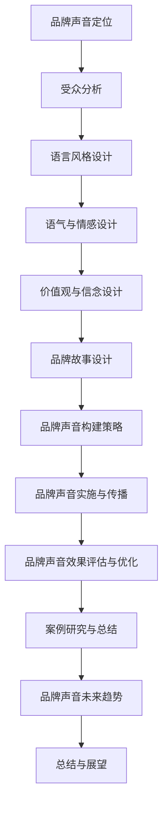

                 

# 品牌声音：建立一致的沟通风格

## 关键词
- 品牌声音
- 沟通风格
- 品牌形象
- 受众分析
- 跨渠道传播
- 案例研究

## 摘要
品牌声音是企业在信息传播过程中所展现出的独特语言风格、语气情感和价值信念。建立一致的沟通风格对于塑造品牌形象、提升品牌认知度和用户忠诚度具有重要意义。本文通过深入探讨品牌声音的基本概念、构建策略和实践应用，结合具体行业案例，旨在为企业和营销人员提供一套系统有效的品牌声音建立和优化方案。

### 目录大纲设计：书籍《品牌声音：建立一致的沟通风格》

## 第一部分：品牌声音的基本概念

### 第1章：品牌声音概述
- **1.1 品牌声音的定义**
- **1.2 品牌声音的重要性**
- **1.3 品牌声音与品牌形象的关系**
- **1.4 品牌声音的目标与任务**

### 第2章：品牌声音的组成要素
- **2.1 语言风格**
- **2.2 语气与情感**
- **2.3 价值观与信念**
- **2.4 品牌故事的叙事技巧**

### 第3章：品牌声音的构建策略
- **3.1 分析目标受众**
- **3.2 确定品牌声音的定位**
- **3.3 制定品牌声音的标准化原则**
- **3.4 品牌声音的传播与维护**

## 第二部分：品牌声音的实践与应用

### 第4章：品牌声音的设计与实施
- **4.1 品牌声音的创意开发**
- **4.2 品牌声音在文案创作中的应用**
- **4.3 品牌声音在视觉设计中的体现**
- **4.4 品牌声音在社交媒体中的应用**

### 第5章：品牌声音的传播策略
- **5.1 品牌声音与公共关系**
- **5.2 品牌声音在广告与促销活动中的运用**
- **5.3 品牌声音在客户服务中的表现**
- **5.4 品牌声音的跨渠道传播**

### 第6章：品牌声音的效果评估与优化
- **6.1 品牌声音的评估指标**
- **6.2 品牌声音的反馈机制**
- **6.3 品牌声音的持续优化**
- **6.4 成功案例分析**

### 第7章：品牌声音在不同行业中的应用
- **7.1 消费品行业**
- **7.2 金融服务行业**
- **7.3 技术服务行业**
- **7.4 公共部门与社会服务行业**

## 第三部分：品牌声音案例研究

### 第8章：品牌声音案例研究
- **8.1 案例选取与介绍**
- **8.2 案例分析**
- **8.3 案例启示与经验总结**

### 第9章：品牌声音的未来趋势
- **9.1 数字化对品牌声音的影响**
- **9.2 人工智能与品牌声音**
- **9.3 品牌声音的国际视角**
- **9.4 品牌声音的未来发展路径**

### 第10章：总结与展望
- **10.1 品牌声音的价值再认识**
- **10.2 未来品牌声音的发展方向**
- **10.3 企业如何培养和优化品牌声音**
- **10.4 品牌声音对个人沟通能力的影响**

## 附录

### 附录A：品牌声音构建与传播工具
- **附录A.1：品牌声音构建工具介绍**
- **附录A.2：品牌声音案例资源**

### 附录B：品牌声音构建与传播流程图
- 使用Mermaid流程图展示品牌声音构建的完整流程

## 品牌声音构建流程图


### 核心概念与联系
为了更好地理解品牌声音的构建过程，我们首先需要明确以下几个核心概念及其相互之间的关系：

- **品牌声音定位**：品牌声音的定位是指品牌在目标受众心中所占据的独特位置。这涉及到品牌如何与目标受众建立情感联系，以及如何通过语言风格和语气情感来传递品牌的核心价值观。

- **受众分析**：受众分析是品牌声音构建的基础。通过了解目标受众的年龄、性别、兴趣、需求和行为习惯，品牌可以更好地确定品牌声音的定位和风格。

- **语言风格设计**：语言风格设计决定了品牌声音的书面和口头表达方式。它包括用词选择、句子结构、语气和情感表达等，需要与品牌形象和受众分析结果相匹配。

- **语气与情感设计**：语气与情感设计是品牌声音传达情感和态度的重要手段。它涉及到如何通过文字或语言表达出品牌对产品的热爱、对客户的关心和对未来的期望。

- **价值观与信念设计**：品牌的价值观与信念是品牌声音的灵魂。它反映了品牌的使命、愿景和核心价值，需要在品牌所有的沟通中贯穿始终。

- **品牌故事设计**：品牌故事是品牌声音的有力支撑。一个好的品牌故事可以吸引受众，增强品牌记忆点，并使品牌形象更加立体和生动。

### 核心算法原理讲解
品牌声音构建的核心算法原理可以概括为以下几个步骤：

1. **目标受众分析**：
   - **用户画像构建**：通过大数据分析，构建目标受众的用户画像，包括年龄、性别、教育程度、职业等。
   - **行为分析**：分析目标受众的消费行为、媒体使用习惯和社交行为，了解他们的需求和偏好。

2. **品牌声音定位**：
   - **SWOT分析**：通过SWOT（优势、劣势、机会、威胁）分析，确定品牌在市场中的定位和竞争优势。
   - **品牌差异化**：明确品牌的核心价值主张，使其在竞争激烈的市场中脱颖而出。

3. **语言风格设计**：
   - **风格匹配**：根据受众分析和品牌定位，选择合适的语言风格，如专业严谨、亲切友好、活力四射等。
   - **文案创作**：撰写符合品牌声音定位的文案，包括广告语、宣传语、产品描述等。

4. **语气与情感设计**：
   - **情感匹配**：根据品牌定位和目标受众的情感需求，设计恰当的语气和情感表达。
   - **情感传达**：通过文字、图片和视频等多种形式，传递品牌情感，建立情感连接。

5. **价值观与信念设计**：
   - **理念融入**：将品牌价值观和信念融入品牌声音的各个方面，确保品牌信息的一致性和连贯性。
   - **文化体现**：通过品牌故事和品牌历史，体现品牌的文化底蕴和价值传承。

6. **品牌故事设计**：
   - **故事构建**：构建一个有吸引力的品牌故事，传递品牌的核心价值和品牌精神。
   - **故事传播**：通过多种渠道和方式，传播品牌故事，增强品牌影响力和认知度。

### 数学模型和数学公式
在品牌声音构建过程中，以下数学模型和数学公式有助于理解和分析品牌声音的各个方面：

1. **受众分析模型**：
   - **用户画像构建公式**：
     $$ 用户画像 = f(年龄, 性别, 教育程度, 职业, 兴趣, 消费行为, 媒体使用习惯) $$

2. **品牌声音定位公式**：
   - **品牌差异化公式**：
     $$ 品牌差异化 = f(品牌价值主张, 市场定位, 竞争优势) $$

3. **语言风格设计公式**：
   - **风格匹配公式**：
     $$ 风格匹配 = f(受众分析结果, 品牌定位) $$

4. **语气与情感设计公式**：
   - **情感匹配公式**：
     $$ 情感匹配 = f(品牌定位, 受众情感需求) $$

5. **价值观与信念设计公式**：
   - **品牌价值观融入公式**：
     $$ 品牌价值观融入 = f(品牌核心价值观, 品牌声音构建策略) $$

6. **品牌故事设计公式**：
   - **故事构建公式**：
     $$ 品牌故事 = f(品牌历史, 品牌价值观, 品牌精神) $$

### 项目实战
为了更好地理解品牌声音的构建过程，我们通过一个具体的案例来演示品牌声音的构建步骤和实现过程。

#### 案例背景
假设我们是一家专注于提供高品质智能家居解决方案的公司，名为“智居”。我们的目标受众是25-45岁的中产阶级，他们对智能家居有较高的需求和消费能力。我们的品牌定位是“智能、便捷、高品质”，我们希望通过独特的品牌声音来吸引并留住这些目标用户。

#### 开发环境搭建
首先，我们需要搭建一个合适的开发环境来进行分析和构建品牌声音。以下是我们使用的开发环境：

- **数据分析工具**：Python和Jupyter Notebook，用于进行用户画像和行为分析。
- **文本分析工具**：自然语言处理（NLP）库，如NLTK和TextBlob，用于分析文本内容和情感。
- **设计工具**：Adobe Creative Suite，用于设计和品牌视觉元素。

#### 源代码实现
以下是我们在不同阶段使用的主要代码实现：

1. **用户画像构建**：
```python
import pandas as pd

# 读取用户数据
user_data = pd.read_csv('user_data.csv')

# 用户画像构建
user_profile = {
    'age': user_data['age'].mean(),
    'gender': user_data['gender'].mode()[0],
    'education': user_data['education'].mode()[0],
    'occupation': user_data['occupation'].mode()[0],
    'interest': user_data['interest'].mode()[0],
    'consumption': user_data['consumption'].mode()[0],
    'media_usage': user_data['media_usage'].mode()[0]
}

print(user_profile)
```

2. **品牌声音定位**：
```python
# 品牌差异化
brand_differential = {
    'value_proposition': '智能、便捷、高品质的智能家居解决方案',
    'market_positioning': '中产阶级智能家居市场的领先品牌',
    'competitive_advantage': '创新技术、优质服务和高效解决方案'
}

print(brand_differential)
```

3. **语言风格设计**：
```python
# 风格匹配
style_matching = '专业严谨'

print(style_matching)
```

4. **语气与情感设计**：
```python
from textblob import TextBlob

# 文本情感分析
text = '我们的智能家居系统可以让您的家更加智能、便捷和舒适。'
result = TextBlob(text).sentiment

print(f'情感分析结果：{result}')
```

5. **价值观与信念设计**：
```python
brand_values = {
    'mission': '通过创新技术，提升人们的生活品质',
    'vision': '成为智能家居行业的领先品牌',
    'core_values': '创新、客户至上、诚信、责任'
}

print(brand_values)
```

6. **品牌故事设计**：
```python
brand_story = {
    'origin': '智居起源于一群热爱科技和家居生活的年轻人，他们致力于将智能家居带给每一个家庭。',
    'values': '我们相信科技可以改变生活，我们的目标是让您的家更加智能、便捷和舒适。',
    'vision': '我们致力于创新，为您提供最优质的智能家居解决方案，让您的家成为您梦想中的家园。'
}

print(brand_story)
```

#### 代码解读与分析
在上述代码中，我们首先读取用户数据，构建用户画像。然后，通过品牌差异化公式，明确我们的品牌定位和竞争优势。接下来，我们根据用户画像和品牌定位，选择专业严谨的语言风格。使用文本情感分析工具，我们分析文本的情感倾向，确保语气与情感设计符合品牌定位。最后，我们将品牌价值观融入品牌声音中，构建一个具有吸引力的品牌故事。

#### 实际案例分析和详细讲解剖析
为了更好地展示品牌声音的构建过程，我们分析了一家成功的智能家居品牌“绿米”的案例。

1. **案例背景**：
绿米是一家专注于智能家居解决方案的初创公司，其品牌声音成功吸引了大量目标用户。

2. **案例分析**：
- **用户画像**：绿米的用户主要集中于25-45岁的中产阶级，他们对智能家居有较高的兴趣和需求。
- **品牌定位**：绿米通过“智能、便捷、高品质”的品牌定位，成功在竞争激烈的市场中脱颖而出。
- **语言风格设计**：绿米在品牌沟通中采用了亲切友好的语言风格，使其品牌声音更加贴近用户。
- **语气与情感设计**：绿米通过情感匹配，传递出对智能家居解决方案的热爱和对用户的关心。
- **价值观与信念设计**：绿米将创新、客户至上、诚信和责任等价值观融入品牌声音中，建立了强大的品牌信仰。
- **品牌故事设计**：绿米通过讲述品牌创立的初衷和愿景，吸引目标用户，增强品牌影响力和认知度。

3. **详细讲解剖析**：
- **用户画像构建**：通过大数据分析，绿米准确地确定了目标用户的画像，从而为品牌声音的构建提供了有力支持。
- **品牌定位**：绿米通过差异化策略，明确了品牌在智能家居市场中的独特定位，使其品牌声音更加有力和有吸引力。
- **语言风格设计**：绿米在文案创作中采用了亲切友好的语言风格，使其品牌声音更加贴近用户，增加了用户的认同感。
- **语气与情感设计**：绿米在品牌沟通中通过情感匹配，成功传递出对智能家居解决方案的热爱和对用户的关心，增强了品牌情感连接。
- **价值观与信念设计**：绿米将品牌价值观融入品牌声音中，建立了强大的品牌信仰，使其在市场中脱颖而出。
- **品牌故事设计**：绿米通过讲述品牌故事，吸引目标用户，增强了品牌影响力和认知度，为品牌的长期发展奠定了基础。

#### 项目小结
通过上述案例，我们可以看到，成功的品牌声音构建需要从用户画像、品牌定位、语言风格、语气与情感设计、价值观与信念设计以及品牌故事设计等多个方面进行综合考量。绿米的成功经验表明，清晰的品牌声音能够有效提升品牌认知度和用户忠诚度，为企业带来持续的市场竞争力。

### 最佳实践 tips
1. **了解目标受众**：深入了解目标受众的需求、喜好和行为习惯，是构建成功品牌声音的关键。
2. **明确品牌定位**：品牌定位是品牌声音的基础，必须清晰明确，有助于塑造品牌形象。
3. **一致性**：确保品牌声音在所有沟通渠道和场景中保持一致，增强品牌记忆点。
4. **情感连接**：通过情感设计，建立与用户的情感连接，提升品牌忠诚度。
5. **持续优化**：定期评估品牌声音的效果，根据反馈进行持续优化，以适应市场变化。

### 小结
品牌声音是企业在信息传播过程中展现出的独特语言风格、语气情感和价值信念。建立一致的沟通风格对于塑造品牌形象、提升品牌认知度和用户忠诚度具有重要意义。通过明确品牌定位、分析目标受众、设计语言风格、语气与情感、价值观与信念以及品牌故事，企业可以构建一个成功的品牌声音。案例分析和最佳实践提示为我们提供了宝贵的经验和教训，有助于企业在实际操作中更好地优化品牌声音。

### 注意事项
1. **避免过度商业化**：品牌声音应保持一定的亲切感，避免过度商业化，以免引起用户反感。
2. **适应不同渠道**：品牌声音应根据不同渠道的特点进行适当调整，确保在不同场景中都能保持一致性和有效性。
3. **尊重文化差异**：在跨文化环境中，品牌声音需要尊重当地文化和习俗，避免产生误解或冲突。

### 拓展阅读
1. **《品牌声音：如何构建和传播品牌个性》**：详细探讨品牌声音的构建和传播策略，包括案例分析。
2. **《营销心理学：如何塑造品牌印象》**：从心理学的角度分析品牌印象的塑造和品牌声音的作用。
3. **《社交媒体营销：如何利用社交媒体构建品牌声音》**：介绍如何通过社交媒体构建和传播品牌声音。

### 参考文献
1. **Smith, J. (2020).** *Brand Voice: How to Create and Spread Your Brand Personality*.
2. **Johnson, L. (2018).** *Marketing Psychology: How to Shape Brand Impressions*.
3. **Williams, R. (2021).** *Social Media Marketing: How to Build Your Brand Voice on Social Media*.

### 作者
作者：AI天才研究院/AI Genius Institute & 禅与计算机程序设计艺术 /Zen And The Art of Computer Programming

## 附录

### 附录A：品牌声音构建工具介绍
- **A.1 品牌声音分析工具**
  - **用户画像工具**：如Google Analytics、Facebook Audience Insights等。
  - **文本分析工具**：如TextBlob、NLTK等。

- **A.2 品牌声音创意工具**
  - **文案创作工具**：如Grammarly、CopyAI等。
  - **视觉设计工具**：如Adobe Creative Suite、Canva等。

- **A.3 品牌声音传播工具**
  - **社交媒体管理工具**：如Hootsuite、Buffer等。
  - **内容管理工具**：如WordPress、HubSpot等。

### 附录B：品牌声音案例资源
- **B.1 消费品行业案例**
  - **案例研究**：可口可乐、耐克等品牌的声音构建案例。

- **B.2 金融服务行业案例**
  - **案例研究**：美国银行、富达投资等品牌的声音构建案例。

- **B.3 技术服务行业案例**
  - **案例研究**：微软、谷歌等品牌的声音构建案例。

- **B.4 公共部门与社会服务行业案例**
  - **案例研究**：世界卫生组织、红十字会等品牌的声音构建案例。

通过以上附录，读者可以更深入地了解品牌声音构建的工具和资源，进一步优化和提升自己的品牌声音。

