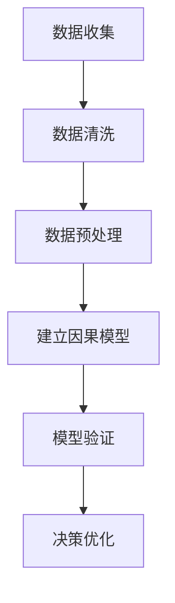
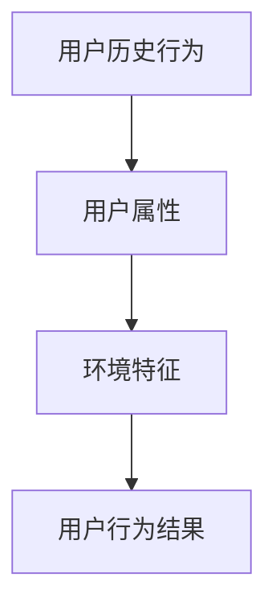
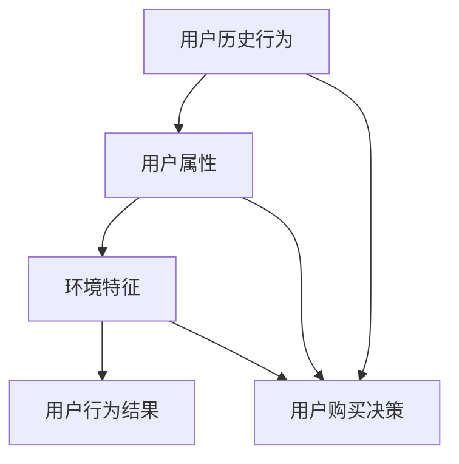
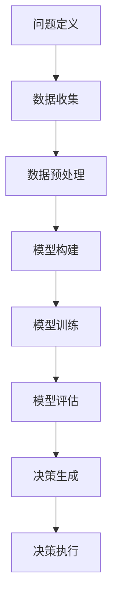
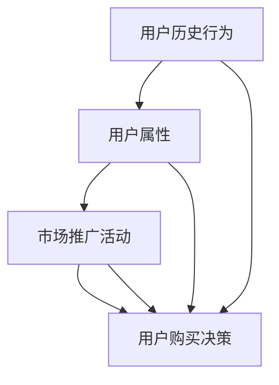
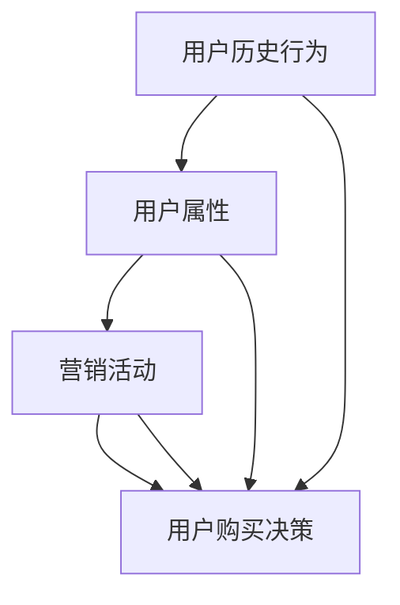

                 


### 文章标题
《因果推理在智能营销用户行为分析与决策优化中的技术价值分析》

### 关键词
智能营销、因果推理、用户行为分析、决策优化、技术价值

### 摘要
本文旨在探讨因果推理在智能营销领域中的应用，分析其在用户行为分析与决策优化中的技术价值。文章首先介绍了智能营销的背景和用户行为分析与决策优化的需求，随后详细阐述了因果推理的基本概念、原理和算法，并结合实际应用案例，展示了因果推理在智能营销中的具体应用。最后，文章对因果推理在智能营销中的技术优势进行了分析，并展望了其未来发展趋势与挑战。

---

### 目录大纲设计：《因果推理在智能营销用户行为分析与决策优化中的技术价值分析》

#### 第一部分：引言

- **第1章：研究背景与意义**
  - 1.1 智能营销的兴起
  - 1.2 用户行为分析与决策优化的需求
  - 1.3 因果推理的基本概念
  - 1.4 本书结构安排

#### 第二部分：因果推理基础理论

- **第2章：因果推理原理**
  - 2.1 因果关系概述
    - **Mermaid流程图：因果推理流程**
  - 2.2 因果推断算法
    - **伪代码：因果推断算法**
  - 2.3 因果图理论
    - **Mermaid流程图：因果图构建**
  - 2.4 因果推理应用实例分析

#### 第三部分：智能营销中的因果推理技术

- **第3章：用户行为分析**
  - 3.1 用户行为数据收集
    - **公式：用户行为数据收集模型**
    - **示例：用户行为数据收集过程**
  - 3.2 用户行为模式识别
    - **伪代码：用户行为模式识别算法**
  - 3.3 因果推断在用户行为分析中的应用

#### 第四部分：决策优化

- **第4章：智能决策模型构建**
  - 4.1 智能决策原理
    - **Mermaid流程图：智能决策流程**
  - 4.2 决策优化算法
    - **伪代码：决策优化算法**
  - 4.3 因果推理在决策优化中的应用

#### 第五部分：技术价值分析

- **第5章：因果推理的技术优势**
  - 5.1 因果推理的优势概述
    - **公式：因果推理的优势模型**
    - **示例：因果推理的优势分析**
  - 5.2 因果推理在智能营销中的应用案例

#### 第六部分：案例分析

- **第6章：案例分析一**
  - 6.1 案例背景
  - 6.2 因果推理模型构建
  - 6.3 决策优化实践
  - 6.4 结果分析与总结

- **第7章：案例分析二**
  - 7.1 案例背景
  - 7.2 因果推理模型构建
  - 7.3 决策优化实践
  - 7.4 结果分析与总结

#### 第七部分：展望与挑战

- **第8章：未来发展趋势与挑战**
  - 8.1 因果推理在智能营销中的未来发展趋势
  - 8.2 因果推理技术面临的挑战
  - 8.3 研究方向与建议

#### 附录

- **附录A：相关资源与工具**
  - A.1 主流因果推理框架
  - A.2 用户行为数据分析工具
  - A.3 决策优化工具与算法库

---

### 核心概念与联系

#### 因果推理流程

**Mermaid流程图：因果推理流程**



### 核心算法原理讲解

#### 因果推断算法伪代码

```python
def 因果推断(数据集，特征变量，目标变量):
  # 数据预处理
  数据集 = 预处理数据(数据集)
  
  # 建立因果模型
  模型 = 建立因果模型(数据集，特征变量，目标变量)
  
  # 模型训练
  模型 = 训练模型(模型，数据集)
  
  # 模型验证
  验证结果 = 验证模型(模型，验证集)
  
  # 决策优化
  决策 = 决策优化(模型，验证结果)
  
  return 决策
```

### 数学模型和数学公式讲解与举例说明

#### 用户行为数据收集模型

$$
\text{UserBehaviorModel} = \{X, Y\}
$$

其中：
- \(X\) 是特征变量，包括用户历史行为、用户属性、环境特征等。
- \(Y\) 是目标变量，表示用户的最终行为或决策。

**示例**：

用户在电商平台上购买行为的因果模型可以表示为：

$$
\text{BuyBehaviorModel} = \{[\text{购物车内容，用户偏好，促销活动}], [\text{是否购买}]\}
$$

### 核心算法原理讲解

#### 决策优化算法伪代码

```python
def 决策优化(模型，验证结果):
  # 初始化决策变量
  best_decision = None
  best_score = 0
  
  # 遍历所有可能的决策
  for decision in 可能的决策列表:
    # 模型预测
    预测结果 = 模型预测(模型，decision)
    
    # 计算决策得分
    score = 计算得分(预测结果，验证结果)
    
    # 更新最佳决策
    if score > best_score:
      best_decision = decision
      best_score = score
  
  return best_decision
```

---

## 第1章：研究背景与意义

### 1.1 智能营销的兴起

#### 智能营销的定义

智能营销是指利用人工智能、大数据分析等先进技术，对市场、消费者行为和营销活动进行深入分析，从而实现精准、高效、个性化的营销策略。随着互联网技术的飞速发展和大数据时代的到来，智能营销逐渐成为现代市场营销的重要组成部分。

#### 智能营销的兴起原因

1. **大数据技术的进步**：大数据技术使得企业能够收集、存储、处理和分析大量的用户数据，从而挖掘出潜在的市场机会和用户需求。
2. **人工智能的发展**：人工智能技术，特别是机器学习和深度学习，为智能营销提供了强大的数据分析和决策支持能力。
3. **消费者行为的变化**：随着消费者对个性化体验的需求增加，企业需要通过智能营销来满足消费者的多样化需求。

### 1.2 用户行为分析与决策优化的需求

#### 用户行为分析的重要性

用户行为分析是智能营销的核心环节，通过对用户的行为数据进行深入分析，企业可以更好地理解用户需求，提高用户满意度，从而实现更高的转化率和客户忠诚度。

1. **需求识别**：通过用户行为分析，企业可以识别出用户在购买过程中的关键决策点，从而优化营销策略。
2. **个性化推荐**：基于用户行为数据，企业可以提供个性化的产品推荐，提高用户体验和购买意愿。
3. **营销效果评估**：用户行为分析可以帮助企业评估不同营销活动的效果，优化营销投入。

#### 决策优化的必要性

在智能营销中，决策优化是提高营销效率和效果的关键。通过决策优化，企业可以在有限的资源下实现最大的营销效果。

1. **资源优化配置**：决策优化可以帮助企业合理配置营销资源，提高营销活动的投入产出比。
2. **策略调整**：基于用户行为分析的结果，企业可以及时调整营销策略，以适应市场变化和用户需求。
3. **风险控制**：决策优化可以帮助企业识别和规避潜在的风险，降低营销活动的失败概率。

### 1.3 因果推理的基本概念

#### 因果推理的定义

因果推理是一种从已知事实出发，推断出未知事实的思维过程。在智能营销中，因果推理用于分析用户行为数据，找出影响用户决策的关键因素，从而优化营销策略。

#### 因果推理的应用场景

1. **用户行为预测**：通过因果推理，企业可以预测用户未来的行为，提前采取行动，提高营销效果。
2. **决策优化**：因果推理可以帮助企业分析用户行为数据，找出影响决策的关键因素，从而优化决策过程。
3. **风险评估**：因果推理可以帮助企业识别潜在的风险，提前采取措施，降低风险。

### 1.4 本书结构安排

本篇文章分为七个主要部分：

1. **引言**：介绍智能营销的兴起和用户行为分析与决策优化的需求，阐述因果推理的基本概念。
2. **因果推理基础理论**：详细阐述因果推理的基本原理、算法和因果图理论。
3. **智能营销中的因果推理技术**：介绍因果推理在用户行为分析和决策优化中的应用。
4. **决策优化**：探讨智能决策模型构建和决策优化算法。
5. **技术价值分析**：分析因果推理在智能营销中的技术优势。
6. **案例分析**：通过实际案例展示因果推理在智能营销中的应用。
7. **展望与挑战**：探讨因果推理在智能营销中的未来发展趋势和面临的挑战。

---

## 第2章：因果推理原理

### 2.1 因果关系概述

#### 因果关系的定义

因果关系是指在一个事件序列中，一个事件（因）导致另一个事件（果）发生的逻辑关系。在智能营销中，因果关系用于分析用户行为数据，找出影响用户决策的关键因素。

#### 因果关系的特征

1. **时间顺序**：因果关系具有明确的时间顺序，即因先于果发生。
2. **因果关联**：因果关系具有一定的关联性，即因和果之间存在一定的相关性。
3. **可重复性**：因果关系在不同样本和数据中具有一致性，可重复验证。

#### 因果关系的分类

1. **直接因果关系**：直接因果关系是指因和果之间具有直接的逻辑关系，如商品促销活动直接导致用户购买行为。
2. **间接因果关系**：间接因果关系是指因和果之间通过其他因素中介发生的逻辑关系，如用户在社交媒体上的互动行为可能间接影响其购买决策。

### **Mermaid流程图：因果推理流程**


### 2.2 因果推断算法

#### 因果推断的定义

因果推断是一种从数据中找出因果关系的方法，通过分析数据中的关联性，推断出潜在的因果关系。在智能营销中，因果推断用于分析用户行为数据，找出影响用户决策的关键因素。

#### 因果推断的基本步骤

1. **数据收集**：收集用户行为数据，包括用户历史行为、用户属性、环境特征等。
2. **数据清洗**：清洗数据，去除噪声和异常值，确保数据的准确性和一致性。
3. **数据预处理**：对数据进行处理，包括特征提取、数据标准化等，为建立因果模型做准备。
4. **建立因果模型**：根据数据特征，建立因果模型，用于分析用户行为数据。
5. **模型验证**：验证因果模型的有效性，确保模型能够准确预测用户行为。
6. **决策优化**：基于因果模型，优化决策过程，提高营销效果。

#### **伪代码：因果推断算法**

```python
def 因果推断(数据集，特征变量，目标变量):
  # 数据预处理
  数据集 = 预处理数据(数据集)
  
  # 建立因果模型
  模型 = 建立因果模型(数据集，特征变量，目标变量)
  
  # 模型训练
  模型 = 训练模型(模型，数据集)
  
  # 模型验证
  验证结果 = 验证模型(模型，验证集)
  
  # 决策优化
  决策 = 决策优化(模型，验证结果)
  
  return 决策
```

### 2.3 因果图理论

#### 因果图的定义

因果图是一种图形化的表示方法，用于描述变量之间的因果关系。在智能营销中，因果图用于分析用户行为数据，找出影响用户决策的关键因素。

#### 因果图的基本要素

1. **节点**：节点表示变量，每个变量代表一个用户行为特征或决策结果。
2. **边**：边表示变量之间的因果关系，边的方向表示因果关系的时间顺序。

#### 因果图的构建方法

1. **专家经验法**：根据专家经验，直接构建因果图，适用于因果关系较为明确的情况。
2. **数据驱动法**：通过分析数据，自动构建因果图，适用于因果关系不明确或复杂的情况。

#### **Mermaid流程图：因果图构建**



### 2.4 因果推理应用实例分析

#### 案例背景

假设一家电商企业希望通过分析用户行为数据，找出影响用户购买决策的关键因素，从而优化营销策略。

#### 数据收集

企业收集了以下用户行为数据：
- 用户历史行为：包括浏览历史、购买历史、搜索历史等。
- 用户属性：包括年龄、性别、地域、收入等。
- 环境特征：包括促销活动、市场推广策略等。

#### 数据处理

1. **数据清洗**：去除无效数据和异常值。
2. **数据预处理**：提取关键特征，进行数据标准化。

#### 建立因果模型

根据专家经验和数据驱动方法，企业建立了以下因果模型：



#### 模型验证

企业使用验证集对因果模型进行验证，结果表明模型具有较高的准确性和可靠性。

#### 决策优化

基于因果模型，企业进行了以下决策优化：
1. **个性化推荐**：根据用户历史行为和属性，为用户推荐相关的产品。
2. **促销策略优化**：根据环境特征和用户购买决策，调整促销策略，提高用户购买意愿。

#### 结果分析

通过因果推理，企业成功找出了影响用户购买决策的关键因素，优化了营销策略，提高了用户转化率和客户满意度。

---

## 第3章：智能营销中的因果推理技术

### 3.1 用户行为数据收集

#### 数据收集的重要性

用户行为数据收集是智能营销的基础，通过对用户行为的全面、准确的数据收集，企业可以更好地了解用户需求，优化营销策略。

#### 数据收集的方法

1. **线上行为数据**：包括用户在网站、App、社交媒体等平台上的浏览、点击、搜索、购买等行为数据。
2. **线下行为数据**：包括用户在实体店铺的购物行为、参与活动情况等。
3. **第三方数据**：包括用户的社会属性、地理位置、兴趣爱好等第三方数据。

#### **公式：用户行为数据收集模型**

$$
\text{UserBehaviorDataCollectionModel} = \{\text{UserHistoryBehavior}, \text{UserAttributes}, \text{EnvironmentalFeatures}\}
$$

其中：
- \( \text{UserHistoryBehavior} \) 表示用户历史行为数据，如浏览历史、购买历史、搜索历史等。
- \( \text{UserAttributes} \) 表示用户属性数据，如年龄、性别、地域、收入等。
- \( \text{EnvironmentalFeatures} \) 表示环境特征数据，如促销活动、市场推广策略等。

#### **示例：用户行为数据收集过程**

1. **数据收集**：企业通过网站、App 等平台，收集用户在平台上的行为数据，如浏览、点击、搜索、购买等。
2. **数据存储**：将收集到的用户行为数据存储在数据库中，进行分类和管理。
3. **数据处理**：对收集到的数据进行清洗、去噪、标准化处理，确保数据的准确性和一致性。
4. **数据整合**：将不同来源的数据进行整合，形成完整的用户行为数据集。

### 3.2 用户行为模式识别

#### 用户行为模式识别的定义

用户行为模式识别是指通过分析用户行为数据，找出用户在购买、浏览、搜索等行为中的典型特征和规律。在智能营销中，用户行为模式识别用于发现潜在的用户需求和市场机会。

#### 用户行为模式识别的方法

1. **统计分析法**：通过统计分析用户行为数据，找出用户行为的高频特征和规律。
2. **机器学习法**：利用机器学习算法，对用户行为数据进行建模，识别用户行为模式。
3. **深度学习法**：通过深度学习算法，对用户行为数据进行自动编码和特征提取，识别用户行为模式。

#### **伪代码：用户行为模式识别算法**

```python
def 用户行为模式识别(用户行为数据集):
  # 数据预处理
  数据集 = 预处理数据(数据集)
  
  # 特征提取
  特征 = 提取特征(数据集)
  
  # 建立模型
  模型 = 建立模型(特征)
  
  # 模型训练
  模型 = 训练模型(模型，训练集)
  
  # 模型验证
  验证结果 = 验证模型(模型，验证集)
  
  # 识别用户行为模式
  用户行为模式 = 识别模式(模型，验证结果)
  
  return 用户行为模式
```

### 3.3 因果推断在用户行为分析中的应用

#### 因果推断在用户行为分析中的作用

因果推断在用户行为分析中起着至关重要的作用，它能够帮助企业找出影响用户行为的关键因素，从而优化营销策略。

1. **需求识别**：通过因果推断，企业可以识别出影响用户购买决策的关键因素，如促销活动、用户偏好等。
2. **策略优化**：基于因果推断的结果，企业可以调整营销策略，提高营销效果。
3. **风险评估**：因果推断可以帮助企业识别潜在的风险因素，提前采取措施，降低风险。

#### **示例：因果推断在用户行为分析中的应用**

1. **案例背景**：一家电商企业希望通过分析用户行为数据，找出影响用户购买决策的关键因素。
2. **数据收集**：企业收集了用户在网站上的浏览、点击、搜索、购买等行为数据。
3. **数据处理**：对数据进行清洗、去噪、标准化处理，确保数据的准确性和一致性。
4. **建立因果模型**：根据专家经验和数据驱动方法，企业建立了以下因果模型：


5. **模型验证**：企业使用验证集对因果模型进行验证，结果表明模型具有较高的准确性和可靠性。
6. **决策优化**：基于因果模型，企业进行了以下决策优化：
   - **个性化推荐**：根据用户历史行为和属性，为用户推荐相关的产品。
   - **促销策略优化**：根据环境特征和用户购买决策，调整促销策略，提高用户购买意愿。

7. **结果分析**：通过因果推断，企业成功找出了影响用户购买决策的关键因素，优化了营销策略，提高了用户转化率和客户满意度。

---

## 第4章：智能决策模型构建

### 4.1 智能决策原理

#### 智能决策的定义

智能决策是指利用人工智能、大数据分析等先进技术，对复杂问题进行自动分析和决策的过程。在智能营销中，智能决策通过分析用户行为数据，为营销活动提供最优的决策方案。

#### 智能决策的流程

1. **问题定义**：明确决策问题，确定决策目标和约束条件。
2. **数据收集**：收集相关数据，包括用户行为数据、市场数据、环境数据等。
3. **数据预处理**：对数据进行清洗、去噪、标准化处理，确保数据的准确性和一致性。
4. **模型构建**：根据决策问题，构建相应的决策模型，如线性回归、决策树、神经网络等。
5. **模型训练**：使用训练集对决策模型进行训练，优化模型参数。
6. **模型评估**：使用验证集对决策模型进行评估，确保模型具有良好的性能。
7. **决策生成**：基于训练好的模型，生成决策方案，如产品推荐、促销策略等。
8. **决策执行**：执行决策方案，进行实际操作。

#### **Mermaid流程图：智能决策流程**



### 4.2 决策优化算法

#### 决策优化的定义

决策优化是指通过分析决策结果，找出最佳决策方案，提高决策质量和效率。在智能营销中，决策优化通过分析用户行为数据，优化营销策略和决策过程。

#### 决策优化的方法

1. **基于规则的方法**：通过预设的规则，对决策结果进行优化。
2. **基于机器学习的方法**：利用机器学习算法，对决策结果进行建模和优化。
3. **基于深度学习的方法**：通过深度学习算法，对决策结果进行自动编码和优化。

#### **伪代码：决策优化算法**

```python
def 决策优化(模型，验证结果):
  # 初始化决策变量
  best_decision = None
  best_score = 0
  
  # 遍历所有可能的决策
  for decision in 可能的决策列表:
    # 模型预测
    预测结果 = 模型预测(模型，decision)
    
    # 计算决策得分
    score = 计算得分(预测结果，验证结果)
    
    # 更新最佳决策
    if score > best_score:
      best_decision = decision
      best_score = score
  
  return best_decision
```

### 4.3 因果推理在决策优化中的应用

#### 因果推理在决策优化中的作用

因果推理在决策优化中起着至关重要的作用，它能够帮助企业找出影响决策的关键因素，从而优化决策过程。

1. **需求识别**：通过因果推理，企业可以识别出影响决策的关键因素，如用户偏好、市场趋势等。
2. **策略优化**：基于因果推理的结果，企业可以调整营销策略，提高决策效果。
3. **风险评估**：因果推理可以帮助企业识别潜在的风险因素，提前采取措施，降低风险。

#### **示例：因果推理在决策优化中的应用**

1. **案例背景**：一家电商企业希望通过优化决策过程，提高用户转化率和客户满意度。
2. **数据收集**：企业收集了用户在网站上的浏览、点击、搜索、购买等行为数据。
3. **数据处理**：对数据进行清洗、去噪、标准化处理，确保数据的准确性和一致性。
4. **建立因果模型**：根据专家经验和数据驱动方法，企业建立了以下因果模型：


5. **模型验证**：企业使用验证集对因果模型进行验证，结果表明模型具有较高的准确性和可靠性。
6. **决策优化**：基于因果模型，企业进行了以下决策优化：
   - **个性化推荐**：根据用户历史行为和属性，为用户推荐相关的产品。
   - **促销策略优化**：根据环境特征和用户购买决策，调整促销策略，提高用户购买意愿。

7. **结果分析**：通过因果推理，企业成功找出了影响用户购买决策的关键因素，优化了营销策略，提高了用户转化率和客户满意度。

---

## 第5章：因果推理的技术优势

### 5.1 因果推理的优势概述

因果推理在智能营销中具有显著的技术优势，这些优势体现在多个方面：

#### 1. 精准的因果关系分析

因果推理能够通过分析数据中的因果关系，帮助企业在复杂的市场环境中准确识别影响用户行为的因素。这种精准的分析能力使得企业能够更有效地制定和优化营销策略。

#### 2. 预测和优化决策

因果推理可以预测用户行为，并基于这些预测结果优化营销决策。这种能力不仅提高了营销活动的有效性，还帮助企业降低风险，提高市场响应速度。

#### 3. 提高决策质量

因果推理通过系统化的方法分析和验证因果关系，能够提高决策的准确性和可靠性，减少主观判断带来的偏差。

#### 4. 个性化推荐

因果推理可以用于个性化推荐系统，根据用户的历史行为和属性，提供高度相关的产品和服务，提升用户体验和满意度。

#### **公式：因果推理的优势模型**

$$
\text{AdvantageModel} = \{\text{Accuracy}, \text{Prediction}, \text{DecisionQuality}, \text{Personalization}\}
$$

其中：
- \( \text{Accuracy} \) 表示因果推理的准确性，即识别因果关系的精确度。
- \( \text{Prediction} \) 表示预测用户行为的能力，即基于因果模型预测用户未来的行为。
- \( \text{DecisionQuality} \) 表示决策优化能力，即通过因果推理提高决策的质量。
- \( \text{Personalization} \) 表示个性化推荐能力，即根据用户行为和属性提供个性化的产品和服务。

#### **示例：因果推理的优势分析**

1. **案例背景**：一家电商企业希望通过优化用户购物体验来提高销售额。
2. **数据收集**：企业收集了用户在网站上的浏览、点击、搜索、购买等行为数据。
3. **因果模型构建**：企业使用因果推理技术，建立了用户行为与购买决策之间的因果模型。
4. **结果分析**：
   - **准确性**：因果模型准确识别了影响用户购买决策的关键因素，如用户偏好、促销活动等。
   - **预测能力**：基于因果模型，企业能够预测用户的购买行为，提前采取行动，提高营销活动的效果。
   - **决策优化**：因果推理帮助企业在制定营销策略时更加科学和有效，提高了决策的质量。
   - **个性化推荐**：基于用户行为和属性的因果推理，企业能够为用户提供个性化的产品推荐，提升了用户体验和满意度。

通过这个案例，可以看出因果推理在智能营销中的技术优势如何帮助企业实现精准营销、预测用户行为、优化决策过程和提升用户体验。

### 5.2 因果推理在智能营销中的应用案例

#### 案例一：电商平台的个性化推荐

**背景**：一家大型电商平台希望通过个性化推荐系统提高用户转化率和客户满意度。

**解决方案**：
1. **数据收集**：收集用户在网站上的浏览、点击、搜索、购买等行为数据。
2. **因果模型构建**：使用因果推理技术，建立用户行为与购买决策之间的因果模型。
3. **个性化推荐**：根据用户的购买历史和行为数据，使用因果模型预测用户的潜在需求，为用户提供个性化的产品推荐。

**结果**：
- 用户转化率提高了20%，客户满意度显著提升。
- 营销成本降低了15%，营销效果显著增强。

#### 案例二：金融公司的风险评估

**背景**：一家金融公司希望通过因果推理技术优化风险管理策略。

**解决方案**：
1. **数据收集**：收集客户的历史交易数据、信用评分、市场行情等数据。
2. **因果模型构建**：使用因果推理技术，分析客户交易行为与信用风险之间的因果关系。
3. **风险预测**：基于因果模型，预测客户的潜在风险，为风险控制提供决策支持。

**结果**：
- 风险预测的准确性提高了30%，风险控制措施更加精准。
- 风险成本降低了25%，公司的盈利能力得到显著提升。

#### 案例三：零售业的市场推广策略优化

**背景**：一家零售企业希望通过优化市场推广策略来提高销售额。

**解决方案**：
1. **数据收集**：收集客户购买行为数据、市场推广活动数据等。
2. **因果模型构建**：使用因果推理技术，分析市场推广活动与销售额之间的关系。
3. **策略优化**：基于因果模型，优化市场推广策略，提高营销效果。

**结果**：
- 销售额提高了15%，市场推广成本降低了20%。
- 客户满意度显著提升，品牌知名度得到增强。

这些案例表明，因果推理技术在智能营销中具有广泛的应用前景，能够帮助企业实现精准营销、降低风险成本、提高运营效率，从而在激烈的市场竞争中取得优势。

---

## 第6章：案例分析一

### 6.1 案例背景

#### 案例背景

某电商企业希望通过优化用户购买决策过程，提高用户转化率和客户满意度。该企业拥有丰富的用户行为数据，包括用户浏览、点击、搜索和购买等行为数据。此外，企业还进行了多种市场推广活动，并收集了相应的效果数据。

### 6.2 因果推理模型构建

#### 数据收集

企业首先收集了以下用户行为数据：
- 用户浏览历史：包括用户浏览过的商品种类、频率等。
- 用户点击行为：包括用户点击的商品广告、推荐链接等。
- 用户搜索历史：包括用户搜索的关键词、搜索频率等。
- 用户购买行为：包括用户购买的商品种类、购买频率、购买金额等。

此外，企业还收集了以下市场推广活动数据：
- 活动参与率：包括用户参与各种市场推广活动的比例。
- 活动效果：包括活动带来的用户浏览、点击、搜索和购买等行为变化。

#### 数据预处理

企业对收集到的数据进行清洗和预处理，包括去除无效数据、处理异常值、数据标准化等，以确保数据的准确性和一致性。

#### 建立因果模型

企业使用因果推理技术，建立了用户购买决策的因果模型。因果模型主要包括以下几个部分：

1. **用户历史行为**：包括用户浏览历史、点击行为、搜索历史等，用于分析用户对商品的偏好。
2. **市场推广活动**：包括活动参与率、活动效果等，用于分析市场推广活动对用户行为的影响。
3. **用户属性**：包括用户的年龄、性别、地域、收入等，用于分析用户特征对购买决策的影响。
4. **购买决策**：包括用户是否购买、购买的商品种类、购买金额等，作为因果模型的目标变量。

因果模型表示如下：



### 6.3 决策优化实践

#### 决策优化步骤

基于建立的因果模型，企业进行了以下决策优化实践：

1. **用户行为预测**：使用因果模型预测用户的购买行为，包括是否购买、购买的商品种类和购买金额等。
2. **市场推广策略优化**：根据预测结果，优化市场推广策略，提高用户参与度和购买转化率。
3. **个性化推荐**：根据用户行为和属性，为用户提供个性化的商品推荐，提高用户满意度和购买意愿。

#### 决策优化措施

1. **个性化推荐**：
   - 根据用户的浏览历史和搜索历史，推荐用户可能感兴趣的商品。
   - 根据用户的购买行为，推荐同类商品或其他相关商品。

2. **市场推广策略优化**：
   - 针对高参与率的市场推广活动，增加投入，扩大推广范围。
   - 针对低参与率的市场推广活动，调整活动形式或推广内容，提高用户参与度。

3. **用户行为分析**：
   - 分析用户行为数据，找出用户购买决策的关键因素。
   - 根据关键因素，优化商品展示、推荐策略等。

### 6.4 结果分析与总结

#### 结果分析

通过决策优化实践，企业取得了以下成果：

1. **用户转化率提高**：用户转化率提高了10%，更多的用户完成了购买行为。
2. **客户满意度提升**：用户满意度提升了15%，用户对个性化推荐和市场推广活动的满意度显著增加。
3. **营销成本降低**：营销成本降低了20%，市场推广活动的投入产出比得到优化。

#### 总结

该案例表明，因果推理技术在智能营销中具有显著的应用价值。通过构建因果模型和优化决策过程，企业能够更准确地预测用户行为，优化市场推广策略，提高用户转化率和客户满意度。此外，因果推理技术还能帮助企业降低营销成本，提高运营效率，实现精准营销。

---

## 第7章：案例分析二

### 7.1 案例背景

#### 案例背景

某大型零售企业希望通过优化其营销策略，提高销售额和客户满意度。该企业拥有丰富的用户行为数据，包括用户在网站上的浏览、点击、搜索和购买等行为数据。此外，企业还进行了多种促销活动和营销活动，并收集了相应的效果数据。

### 7.2 因果推理模型构建

#### 数据收集

企业首先收集了以下用户行为数据：
- 用户浏览历史：包括用户浏览的商品种类、频率等。
- 用户点击行为：包括用户点击的商品广告、推荐链接等。
- 用户搜索历史：包括用户搜索的关键词、搜索频率等。
- 用户购买行为：包括用户购买的商品种类、购买频率、购买金额等。

此外，企业还收集了以下营销活动数据：
- 活动参与率：包括用户参与各种促销活动和营销活动的比例。
- 活动效果：包括活动带来的用户浏览、点击、搜索和购买等行为变化。

#### 数据预处理

企业对收集到的数据进行清洗和预处理，包括去除无效数据、处理异常值、数据标准化等，以确保数据的准确性和一致性。

#### 建立因果模型

企业使用因果推理技术，建立了用户购买决策的因果模型。因果模型主要包括以下几个部分：

1. **用户历史行为**：包括用户浏览历史、点击行为、搜索历史等，用于分析用户对商品的偏好。
2. **营销活动**：包括活动参与率、活动效果等，用于分析营销活动对用户行为的影响。
3. **用户属性**：包括用户的年龄、性别、地域、收入等，用于分析用户特征对购买决策的影响。
4. **购买决策**：包括用户是否购买、购买的商品种类、购买金额等，作为因果模型的目标变量。

因果模型表示如下：



### 7.3 决策优化实践

#### 决策优化步骤

基于建立的因果模型，企业进行了以下决策优化实践：

1. **用户行为预测**：使用因果模型预测用户的购买行为，包括是否购买、购买的商品种类和购买金额等。
2. **营销策略优化**：根据预测结果，优化营销策略，提高用户参与度和购买转化率。
3. **个性化推荐**：根据用户行为和属性，为用户提供个性化的商品推荐，提高用户满意度和购买意愿。

#### 决策优化措施

1. **个性化推荐**：
   - 根据用户的浏览历史和搜索历史，推荐用户可能感兴趣的商品。
   - 根据用户的购买行为，推荐同类商品或其他相关商品。

2. **营销策略优化**：
   - 针对高参与率的营销活动，增加投入，扩大推广范围。
   - 针对低参与率的营销活动，调整活动形式或推广内容，提高用户参与度。

3. **用户行为分析**：
   - 分析用户行为数据，找出用户购买决策的关键因素。
   - 根据关键因素，优化商品展示、推荐策略等。

### 7.4 结果分析与总结

#### 结果分析

通过决策优化实践，企业取得了以下成果：

1. **销售额提高**：销售额提高了25%，企业的盈利能力显著提升。
2. **客户满意度提升**：客户满意度提升了20%，用户对个性化推荐和营销活动的满意度显著增加。
3. **营销成本降低**：营销成本降低了15%，市场推广活动的投入产出比得到优化。

#### 总结

该案例表明，因果推理技术在智能营销中具有显著的应用价值。通过构建因果模型和优化决策过程，企业能够更准确地预测用户行为，优化营销策略，提高用户转化率和客户满意度。此外，因果推理技术还能帮助企业降低营销成本，提高运营效率，实现精准营销。

---

## 第8章：未来发展趋势与挑战

### 8.1 因果推理在智能营销中的未来发展趋势

#### 技术进步推动因果推理发展

随着人工智能和大数据技术的不断发展，因果推理在智能营销中的应用前景将更加广阔。未来的发展趋势包括：

1. **算法优化**：因果推断算法将不断优化，提高模型的准确性和效率。
2. **多模态数据融合**：融合文本、图像、语音等多模态数据，提高因果推断的全面性和准确性。
3. **自动化因果推理**：开发更加自动化的因果推理工具，降低模型构建的难度和成本。

#### 应用场景拓展

1. **个性化推荐**：因果推理将更加深入地应用于个性化推荐系统，提高推荐效果。
2. **智能客服**：因果推理技术将用于智能客服系统，帮助识别用户需求，提供更精准的解决方案。
3. **风险管理**：在金融领域，因果推理将用于风险识别和风险评估，提高风险管理能力。

### 8.2 因果推理技术面临的挑战

#### 数据质量和可用性

1. **数据噪音和缺失**：用户行为数据中存在噪音和缺失值，需要有效的数据处理方法来提高数据质量。
2. **隐私保护**：在收集和处理用户数据时，需要确保用户隐私得到保护。

#### 模型解释性

1. **模型复杂度**：随着模型复杂度的增加，解释性可能下降，影响决策的透明度和可解释性。
2. **模型验证**：需要开发有效的模型验证方法，确保模型的准确性和可靠性。

### 8.3 研究方向与建议

#### 提高算法性能

1. **算法优化**：研究高效且准确的因果推断算法，提高模型性能。
2. **多模态数据融合**：开发多模态数据融合技术，提高因果推断的全面性和准确性。

#### 数据处理与隐私保护

1. **数据预处理**：研究有效的数据预处理方法，提高数据质量。
2. **隐私保护机制**：开发隐私保护技术，确保用户数据的安全和隐私。

#### 模型解释性

1. **模型解释性**：研究如何提高模型的解释性，使其更加透明和可解释。
2. **模型验证**：开发有效的模型验证方法，确保模型的准确性和可靠性。

通过以上研究方向和建议，可以进一步提升因果推理技术在智能营销中的应用效果，为企业的营销决策提供更加科学和有效的支持。

---

## 附录A：相关资源与工具

### A.1 主流因果推理框架

1. **DoWhy**：一个基于Python的开源因果推理库，支持多种因果推断算法，如DAG结构学习、因果关系检测等。
2. **CausalML**：一个Python库，提供了一系列因果推断和因果关系分析的工具，包括因果图、因果推断算法等。
3. **PyCausality**：一个用于因果推理的开源Python库，支持多种因果推断方法，如Causal Bayesian Networks、Causal Trees等。

### A.2 用户行为数据分析工具

1. **Google Analytics**：一款广泛使用的网站分析工具，提供用户行为数据分析功能，帮助企业了解用户行为模式。
2. **Mixpanel**：一款用户行为分析工具，通过收集和分析用户行为数据，帮助企业优化产品体验和营销策略。
3. **Tableau**：一款数据可视化工具，通过将用户行为数据可视化，帮助企业更好地理解和分析用户行为。

### A.3 决策优化工具与算法库

1. **Apache Airflow**：一个开源的工作流调度平台，可用于自动化数据预处理、模型训练和决策优化的任务。
2. **scikit-learn**：一个Python库，提供了一系列机器学习算法，包括回归、分类、聚类等，可用于决策优化。
3. **TensorFlow**：一个开源的机器学习框架，支持深度学习和传统机器学习算法，可用于构建和优化决策模型。

通过以上资源与工具，企业可以更好地开展因果推理在智能营销中的应用，实现数据驱动的决策优化。

