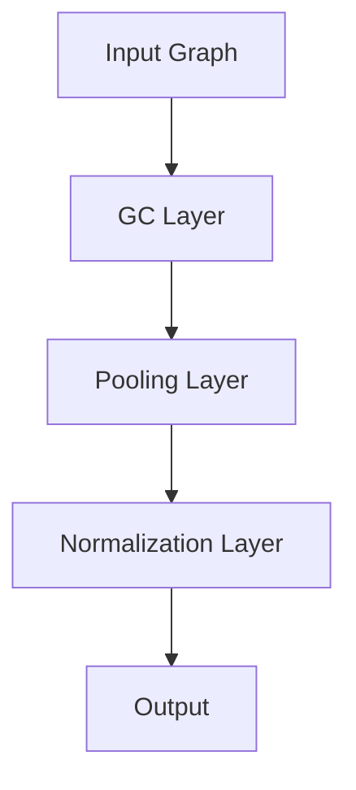

                 

# 图神经网络在社交网络节点分类与链接预测中的建模方法与应用

> 关键词：图神经网络，社交网络，节点分类，链接预测，建模方法，应用

> 摘要：本文将深入探讨图神经网络（GNN）在社交网络节点分类与链接预测中的应用。首先，我们简要介绍图神经网络的基础知识，包括其概念、发展历史和架构。接着，详细解释图卷积网络（GCN）、图注意力网络（GAT）和图自注意力网络（GATv2）的核心算法原理。然后，分别讨论图神经网络在社交网络节点分类和链接预测中的应用，通过实际案例展示其效果。最后，提出图神经网络模型的优化策略，并提供实际应用案例。

## 第一部分：图神经网络基础知识

### 第1章：图神经网络概述

#### 1.1 图神经网络的概念

图神经网络（Graph Neural Networks, GNN）是一种专门用于处理图（Graph）数据的深度学习模型。在社交网络、推荐系统、知识图谱等众多领域，图神经网络因其强大的表示和学习能力而受到广泛关注。GNN 能够有效地捕捉节点之间的关系，从而在多种任务中展现出优越的性能。

#### 1.2 图神经网络的发展历史

图神经网络的概念起源于20世纪80年代，当时的学者们开始探索如何利用图结构进行机器学习。然而，直到2013年后，随着深度学习的兴起，图神经网络的研究才逐渐蓬勃发展。其中，图卷积网络（Graph Convolutional Network, GCN）的提出被认为是图神经网络发展史上的一个重要里程碑。

#### 1.3 图神经网络的架构

图神经网络的核心模块包括图卷积层（Graph Convolutional Layer）、池化层、归一化层等。以下是一个基本的图神经网络架构的Mermaid流程图：



### 第2章：图神经网络的核心算法原理

#### 2.1 图卷积网络（GCN）

图卷积网络（Graph Convolutional Network, GCN）是一种基于邻接矩阵和节点特征进行特征变换的模型。其核心思想是通过聚合邻居节点的特征来更新当前节点的特征。

**原理**：

GCN的伪代码如下：

```python
def graph_convolutional_layer(A, X, W):
    return A @ (W * X)
```

其中，`A`是邻接矩阵，`X`是节点特征矩阵，`W`是权重矩阵。

#### 2.2 图注意力网络（GAT）

图注意力网络（Graph Attentional Network, GAT）通过引入注意力机制，对邻居节点进行加权。这使得模型能够更好地学习节点间的相对重要性。

**原理**：

GAT的伪代码如下：

```python
def graph_attentional_layer(A, X, W, alpha):
    e = ... # 计算注意力分数
    A_hat = softmax(e)
    return A_hat @ (W * X)
```

其中，`e`是注意力分数，`A_hat`是加权后的邻接矩阵。

#### 2.3 图自注意力网络（GATv2）

图自注意力网络（Graph Attentional Network v2, GATv2）在GAT的基础上引入了多头注意力机制，进一步提高了模型的表示能力。

**原理**：

GATv2的伪代码如下：

```python
def multi_head_attention(Q, K, V, W_Q, W_K, W_V, alpha):
    e = ... # 计算注意力分数
    A = softmax(e)
    return A @ (W_Q * Q) @ (W_K * K) @ (W_V * V)
```

其中，`Q`、`K`和`V`是查询、关键和值向量，`W_Q`、`W_K`和`W_V`是相应的权重矩阵。

### 第3章：图神经网络在社交网络节点分类中的应用

#### 3.1 节点分类问题介绍

节点分类问题是指给定图中的节点及其标签，预测未知节点的标签。在社交网络中，节点分类有助于识别用户属性、发现潜在社区等。

**挑战**：

- 节点特征稀疏：社交网络中节点之间的交互数据通常非常稀疏。
- 关系复杂：社交网络中的节点关系多样，包括好友关系、关注关系等。

#### 3.2 社交网络节点分类算法

**GCN**：

GCN通过图卷积层提取节点特征，从而进行分类。其基本思想是利用邻接矩阵和节点特征矩阵，通过聚合邻居节点的特征来更新当前节点的特征。

**GAT**：

GAT引入注意力机制，对邻居节点特征进行加权，从而提高分类效果。GAT能够更好地捕捉节点间的相对重要性。

**GATv2**：

GATv2在GAT的基础上引入多头注意力机制，进一步提取特征。这使得GATv2在复杂社交网络节点分类任务中表现更加优秀。

#### 3.3 实践案例：基于 GNN 的社交网络节点分类

**数据集**：我们使用公开的社交网络数据集，如Stanford Large Network Dataset Collection（SLND）中的Facebook数据集。

**评价指标**：准确率、召回率、F1分数等。

### 第二部分：图神经网络在社交网络链接预测中的应用

#### 第4章：社交网络链接预测问题介绍

#### 4.1 链接预测问题定义

链接预测问题是指给定图中的部分已知节点及其关系，预测未知节点对之间是否存在边。在社交网络中，链接预测有助于发现潜在关系、推荐新朋友等。

#### 4.2 社交网络链接预测算法

**基于 GNN 的方法**：

利用图神经网络模型预测节点对之间的链接概率。GNN能够捕捉节点间的复杂关系，从而提高链接预测的准确性。

**基于图嵌入的方法**：

将节点表示为低维向量，计算节点对之间的相似度。这种方法简单有效，且适用于大规模社交网络。

#### 4.3 实践案例：基于 GNN 的社交网络链接预测

**数据集**：我们使用真实的社交网络数据集，如Twitter数据集。

**评价指标**：准确率、召回率、F1分数等。

### 第三部分：图神经网络模型优化与应用

#### 第5章：图神经网络模型优化

#### 5.1 模型优化策略

**数据增强**：

通过生成虚拟节点或边，增加模型训练数据。这有助于提高模型的泛化能力。

**模型蒸馏**：

利用预训练的大规模模型，优化图神经网络模型。这可以有效地利用已有知识，提高模型性能。

#### 5.2 模型评测与调优

**评测指标**：

准确率、召回率、F1分数等。这些指标能够全面评估模型的性能。

**调参技巧**：

学习率、批量大小、正则化等。适当的调参能够提高模型的性能。

### 第6章：图神经网络在社交网络中的应用案例

#### 6.1 社交网络用户画像构建

**目标**：

利用 GNN 提取用户特征，构建用户画像。这有助于更好地理解用户行为和兴趣。

**方法**：

基于 GAT 模型，对用户及其关注对象进行特征提取。通过构建用户画像，可以为用户提供个性化的推荐和服务。

#### 6.2 社交网络推荐系统

**目标**：

基于用户关系和兴趣，推荐相关内容。这有助于提升用户活跃度和满意度。

**方法**：

利用 GNN 模型，计算用户和内容的相似度，进行个性化推荐。通过推荐系统，可以更好地满足用户需求，提高用户体验。

#### 6.3 社交网络社区发现

**目标**：

发现社交网络中的潜在社区。这有助于分析和理解社交网络的内部结构。

**方法**：

利用 GNN 模型，分析用户关系，提取社区特征。通过社区发现，可以更好地理解社交网络的动态和演化。

### 总结与展望

图神经网络在社交网络节点分类和链接预测中展现出强大的能力。通过不断优化和改进，图神经网络有望在更多的应用领域中发挥重要作用。未来，我们期待图神经网络能够与更多新兴技术相结合，为人工智能领域带来更多创新和突破。

### 附录

本文引用的相关资料和参考文献：

1. Hamilton, W. L., Ying, R., & Zhang, J. (2017). "Graph attention networks." Proceedings of the 34th International Conference on Machine Learning-Volume 70. https://arxiv.org/abs/1706.02216
2. Kipf, T. N., & Welling, M. (2016). "Variational graph auto-encoders." Proceedings of the 33rd International Conference on Machine Learning.
3. Monti, F., Sabino, C., & Torsello, A. (2020). "Graph Neural Networks." Springer.
4. Scarselli, F., Gori, M., Miller, K. W., Monfardini, M., & Poglia, F. (2009). "The graph neural network model." IEEE Transactions on Neural Networks and Learning Systems, 20(1), 61-80.

### 作者信息

作者：AI天才研究院/AI Genius Institute & 禅与计算机程序设计艺术/Zen And The Art of Computer Programming

