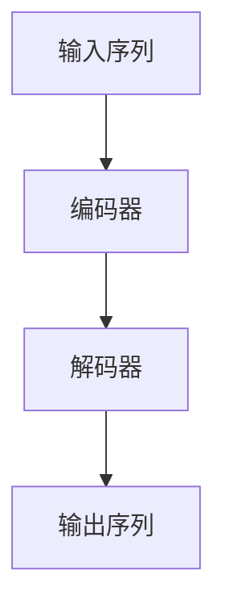
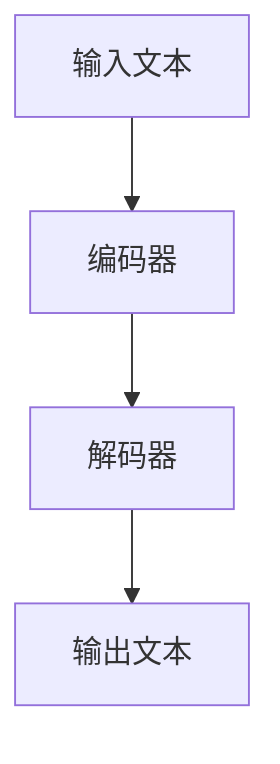
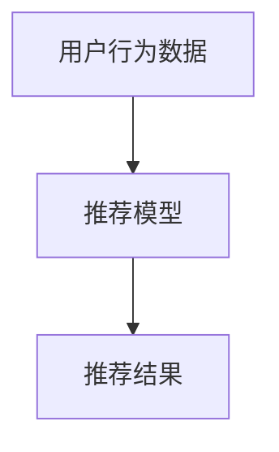
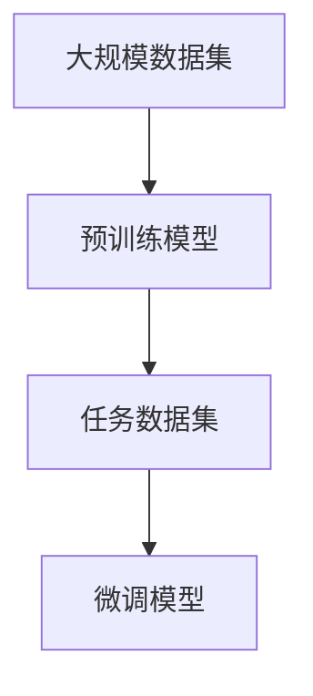
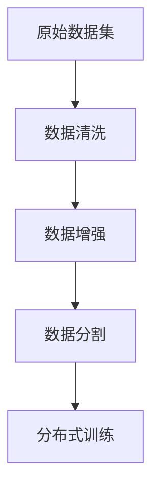
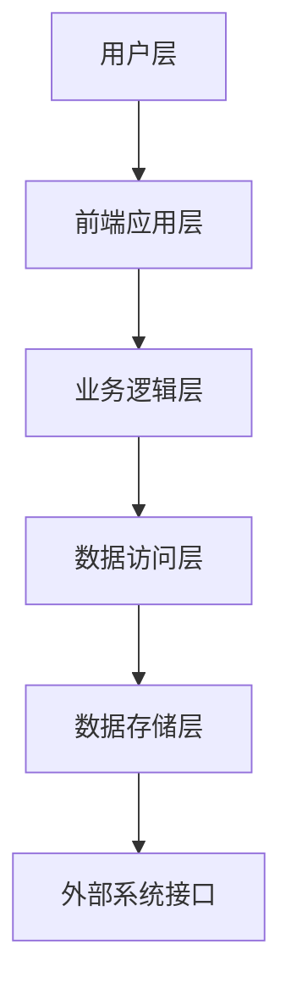

                 


### 文章标题：基于AI大模型的SaaS产品开发

---

关键词：人工智能，SaaS，大模型，深度学习，自然语言处理，产品开发

---

摘要：
本文深入探讨基于AI大模型的SaaS产品开发，从基础概念到实战案例，全面解析AI大模型在SaaS产品中的应用。通过详细的分析和讲解，读者将了解AI与SaaS的关系，掌握AI大模型的技术基础，并学会如何在实际项目中设计和实现SaaS产品。

---

### 第一部分：基础概念与原理

#### 第1章：AI与SaaS概述

AI（人工智能）和SaaS（Software as a Service，软件即服务）是当前科技领域的两个热点。那么，AI与SaaS之间有着怎样的联系？本文将首先介绍AI与SaaS的关系，以及SaaS模式的特点及优势，接着阐述AI赋能SaaS产品的趋势。

#### AI与SaaS的关系

AI技术在SaaS产品中的应用非常广泛，主要体现在以下几个方面：

1. **个性化推荐**：AI算法可以根据用户的历史行为和偏好，为用户提供个性化的推荐服务。
2. **智能搜索**：通过AI技术，可以实现更准确、更快速的搜索结果。
3. **自动化处理**：AI技术可以实现自动化流程处理，提高工作效率。
4. **数据分析**：AI大模型可以处理大量数据，帮助用户发现潜在的商业价值。

SaaS模式的特点及优势

SaaS模式具有以下几个特点：

1. **按需付费**：用户根据实际需求付费，无需一次性投入大量资金。
2. **便捷部署**：无需安装和配置，即可使用服务。
3. **持续更新**：SaaS提供商会定期更新软件，保证用户使用的是最新版本。

SaaS模式的优势主要体现在以下几个方面：

1. **降低成本**：SaaS模式降低了用户的初期投入，有利于中小企业的应用。
2. **提高效率**：SaaS产品可以自动化处理业务流程，提高工作效率。
3. **灵活性**：用户可以根据需求灵活调整服务内容。

AI赋能SaaS产品的趋势

随着AI技术的发展，AI赋能SaaS产品的趋势日益明显。以下是几个主要趋势：

1. **智能化服务**：AI技术将使SaaS产品提供更加智能化的服务，如智能客服、智能分析等。
2. **个性化体验**：AI大模型可以根据用户行为和偏好，为用户提供个性化的体验。
3. **自动化流程**：AI技术将实现更多业务流程的自动化，提高工作效率。
4. **数据驱动**：AI大模型可以帮助用户从大量数据中提取有价值的信息。

#### AI大模型简介

AI大模型是指参数量庞大的神经网络模型，具有强大的表示和学习能力。大模型的特点主要包括：

1. **高参数量**：大模型的参数量通常在数十亿到千亿级别。
2. **强学习能力**：大模型可以处理复杂的数据，并从中学习到有用的信息。
3. **广泛应用**：大模型在多个领域都有广泛应用，如自然语言处理、计算机视觉、语音识别等。

大模型的技术发展历程

大模型的技术发展历程可以追溯到2000年代初期。当时，神经网络模型的研究主要集中在浅层模型上，如感知机和多层感知机。随着深度学习的兴起，深度神经网络开始受到广泛关注。2012年，AlexNet在ImageNet竞赛中取得了突破性的成绩，标志着深度学习技术的崛起。随后，VGG、ResNet等一系列大模型相继出现，推动了AI技术的发展。

#### SaaS产品开发流程

SaaS产品的开发流程可以分为以下几个阶段：

1. **需求分析**：明确用户需求，确定产品的功能和服务。
2. **系统设计**：设计产品的系统架构，确定技术选型。
3. **开发实现**：编写代码，实现产品的功能。
4. **测试部署**：进行测试，确保产品的质量，然后部署上线。
5. **运维维护**：持续监控和优化产品，确保其正常运行。

SaaS开发的关键步骤

1. **需求分析**：通过市场调研、用户访谈等方式，收集用户需求，并进行分析。
2. **系统设计**：设计产品的系统架构，确定技术选型，如前后端分离、微服务架构等。
3. **开发实现**：根据设计文档，编写代码，实现产品的功能。
4. **测试部署**：进行功能测试、性能测试等，确保产品的质量，然后部署上线。
5. **运维维护**：监控产品运行状况，进行故障排查和优化。

SaaS产品的商业模式

SaaS产品的商业模式主要包括以下几种：

1. **订阅模式**：用户按月或按年支付订阅费用，使用产品。
2. **试用模式**：用户提供免费试用期，试用期结束后，用户根据需求选择是否继续订阅。
3. **定价模式**：根据用户使用的资源量、功能需求等，进行灵活定价。

---

作者：AI天才研究院/AI Genius Institute & 禅与计算机程序设计艺术 /Zen And The Art of Computer Programming

---

[TOC]

#### 第2章：AI大模型技术基础

在本章中，我们将深入探讨AI大模型的技术基础，包括深度学习与神经网络、自然语言处理基础以及大模型训练技术。通过这些基础知识的了解，读者将能够更好地理解AI大模型的工作原理，并为其在SaaS产品中的应用打下坚实的基础。

##### 1. 深度学习与神经网络

深度学习（Deep Learning）是AI领域的一个重要分支，其核心思想是通过多层神经网络（Neural Network）来模拟人脑的学习过程，实现对数据的自动特征提取和模式识别。

**深度学习的基本原理**

深度学习的基本原理源于人工神经网络（Artificial Neural Network, ANN）。ANN由大量的神经元（Neurons）组成，每个神经元都与其他神经元相连，形成复杂的网络结构。神经元的激活函数（Activation Function）决定了神经元的输出，从而实现对输入数据的非线性变换。

**神经网络的结构与功能**

神经网络的结构通常包括以下几个层次：

1. **输入层（Input Layer）**：接收外部输入信号。
2. **隐藏层（Hidden Layer）**：对输入信号进行变换和处理。
3. **输出层（Output Layer）**：生成最终的输出结果。

隐藏层的数量和神经元数量可以根据问题的复杂程度进行调整。每一层的神经元都会对前一层的信息进行处理，并通过激活函数产生输出，传递到下一层。

**深度学习在AI大模型中的应用**

深度学习在AI大模型中的应用主要体现在两个方面：

1. **特征提取**：通过多层神经网络的变换，深度学习可以从原始数据中提取出高层次的抽象特征，这些特征对于后续的预测和分类任务非常重要。
2. **模型训练**：深度学习算法通过大量数据训练模型，不断调整网络参数，使其能够对新的数据进行准确的预测和分类。

##### 2. 自然语言处理基础

自然语言处理（Natural Language Processing, NLP）是AI领域的另一个重要分支，它旨在使计算机能够理解、生成和处理人类语言。NLP在AI大模型中的应用非常广泛，如机器翻译、文本生成、情感分析等。

**语言模型的基本概念**

语言模型（Language Model）是NLP的核心组成部分，它用于预测文本序列的概率。一个简单的语言模型可以通过统计方法训练，如N-gram模型；而更复杂的语言模型则采用深度学习技术，如循环神经网络（Recurrent Neural Network, RNN）和Transformer模型。

**机器翻译与文本生成**

机器翻译（Machine Translation）是将一种语言的文本自动翻译成另一种语言的技术。深度学习模型，如基于RNN和Transformer的模型，在机器翻译领域取得了显著的成果。文本生成（Text Generation）则是根据给定的提示或上下文生成完整的文本，如文章、对话等。

**推荐系统与用户行为分析**

推荐系统（Recommendation System）是一种基于用户行为和偏好，为用户推荐感兴趣的内容或产品的技术。深度学习在推荐系统中发挥着重要作用，如通过用户的历史行为数据训练模型，实现个性化的推荐。

##### 3. 大模型训练技术

大模型的训练技术是实现AI大模型应用的关键，主要包括预训练与微调、大规模数据处理以及训练效率优化策略。

**预训练与微调**

预训练（Pre-training）是指在大规模数据集上对模型进行训练，以获取通用的语言表示能力。微调（Fine-tuning）则是在预训练的基础上，针对具体任务对模型进行调整，提高其在特定任务上的表现。

**大规模数据处理**

大规模数据处理（Large-scale Data Processing）是训练大模型的一个挑战。为了处理海量数据，通常需要采用分布式计算和并行处理技术。此外，数据预处理也是关键，如数据清洗、数据增强等。

**训练效率优化策略**

训练效率优化策略包括：

1. **数据并行**：通过将数据分布在多个GPU或TPU上，实现数据级的并行训练。
2. **模型并行**：通过将模型拆分为多个子模型，实现模型级的并行训练。
3. **混合精度训练**：采用混合精度训练（Mixed Precision Training）技术，提高训练速度和降低内存占用。

#### 2.1.1 深度学习与神经网络

**深度学习的基本原理**

深度学习的基本原理源于人工神经网络（Artificial Neural Network, ANN）。ANN由大量的神经元（Neurons）组成，每个神经元都与其他神经元相连，形成复杂的网络结构。神经元的激活函数（Activation Function）决定了神经元的输出，从而实现对输入数据的非线性变换。

以下是一个简单的神经网络模型：


在神经网络中，每个神经元都会接收来自前一层神经元的输入信号，并通过权重（Weights）进行加权求和，最后通过激活函数产生输出。这个过程可以用以下公式表示：

$$
Z = \sum_{i=1}^{n} w_{i}x_{i} + b
$$

其中，$Z$ 表示输出，$w_{i}$ 表示权重，$x_{i}$ 表示输入，$b$ 表示偏置。

常见的激活函数包括：

1. **Sigmoid函数**：将输入值映射到$(0,1)$区间，公式如下：

   $$
   \sigma(z) = \frac{1}{1 + e^{-z}}
   $$

2. **ReLU函数**：在输入为负值时输出为0，在输入为正值时输出为输入值，公式如下：

   $$
   \sigma(z) =
   \begin{cases}
   0, & \text{if } z < 0 \\
   z, & \text{if } z \geq 0
   \end{cases}
   $$

3. **Tanh函数**：将输入值映射到$(-1,1)$区间，公式如下：

   $$
   \tanh(z) = \frac{e^{z} - e^{-z}}{e^{z} + e^{-z}}
   $$

**深度学习在AI大模型中的应用**

深度学习在AI大模型中的应用主要体现在两个方面：

1. **特征提取**：通过多层神经网络的变换，深度学习可以从原始数据中提取出高层次的抽象特征，这些特征对于后续的预测和分类任务非常重要。

   例如，在图像分类任务中，深度学习模型可以学习到图像中的边缘、纹理等低层次特征，以及动物、车辆等高层次特征。

2. **模型训练**：深度学习算法通过大量数据训练模型，不断调整网络参数，使其能够对新的数据进行准确的预测和分类。

   例如，在语音识别任务中，深度学习模型可以通过大量语音数据学习语音信号与文本之间的对应关系，从而实现准确的语音识别。

##### 2.2 自然语言处理基础

**语言模型的基本概念**

语言模型（Language Model）是NLP的核心组成部分，它用于预测文本序列的概率。一个简单的语言模型可以通过统计方法训练，如N-gram模型；而更复杂的语言模型则采用深度学习技术，如循环神经网络（Recurrent Neural Network, RNN）和Transformer模型。

**N-gram模型**

N-gram模型是一种基于统计的简单语言模型，它将文本序列划分为一系列的N元组，并计算每个N元组的概率。N-gram模型的主要优势在于其简单性和高效性，但缺点是它无法捕捉长距离依赖关系。

以下是一个二元组（Bigram）模型的例子：

```
输入文本：我爱北京天安门
二元组序列：(我，爱)，(爱，北京)，(北京，天安门)
```

**循环神经网络（RNN）**

循环神经网络（Recurrent Neural Network, RNN）是一种能够处理序列数据的神经网络，其核心思想是利用隐藏状态（Hidden State）来捕捉序列中的时间依赖关系。

RNN的公式如下：

$$
h_t = \sigma(W_h h_{t-1} + W_x x_t + b_h)
$$

$$
y_t = \sigma(W_y h_t + b_y)
$$

其中，$h_t$ 表示第t个时间步的隐藏状态，$x_t$ 表示第t个时间步的输入，$y_t$ 表示第t个时间步的输出。

RNN的主要缺点是梯度消失和梯度爆炸问题，这限制了其在长序列处理中的性能。

**Transformer模型**

Transformer模型是一种基于自注意力（Self-Attention）机制的深度学习模型，它克服了RNN的缺点，能够更好地处理长距离依赖关系。

Transformer的公式如下：

$$
h_t = \text{softmax}\left(\frac{Q_k W_Q + K_k W_K + V_k W_V}{\sqrt{d_k}}\right) V_k
$$

$$
h_t' = W_O h_t
$$

其中，$Q_k$、$K_k$ 和 $V_k$ 分别表示查询（Query）、键（Key）和值（Value）的权重矩阵，$d_k$ 表示键和值的维度。

**机器翻译与文本生成**

**机器翻译**

机器翻译（Machine Translation）是将一种语言的文本自动翻译成另一种语言的技术。深度学习模型，如基于RNN和Transformer的模型，在机器翻译领域取得了显著的成果。

以下是一个简单的机器翻译模型：



**文本生成**

文本生成（Text Generation）则是根据给定的提示或上下文生成完整的文本，如文章、对话等。深度学习模型，如GPT（Generative Pre-trained Transformer）和BERT（Bidirectional Encoder Representations from Transformers），在文本生成领域取得了优异的性能。

以下是一个简单的文本生成模型：



**推荐系统与用户行为分析**

推荐系统（Recommendation System）是一种基于用户行为和偏好，为用户推荐感兴趣的内容或产品的技术。深度学习在推荐系统中发挥着重要作用，如通过用户的历史行为数据训练模型，实现个性化的推荐。

以下是一个简单的推荐系统模型：



##### 2.3 大模型训练技术

**预训练与微调**

预训练（Pre-training）是指在大规模数据集上对模型进行训练，以获取通用的语言表示能力。微调（Fine-tuning）则是在预训练的基础上，针对具体任务对模型进行调整，提高其在特定任务上的表现。

以下是一个简单的预训练与微调流程：



**大规模数据处理**

大规模数据处理（Large-scale Data Processing）是训练大模型的一个挑战。为了处理海量数据，通常需要采用分布式计算和并行处理技术。此外，数据预处理也是关键，如数据清洗、数据增强等。

以下是一个大规模数据处理的流程：



**训练效率优化策略**

训练效率优化策略包括：

1. **数据并行**：通过将数据分布在多个GPU或TPU上，实现数据级的并行训练。

   以下是一个数据并行的示例：

   ```mermaid
   graph TB
   A[模型参数] --> B[数据集]
   B --> C{GPU 1}
   B --> D{GPU 2}
   C --> E[模型更新]
   D --> F[模型更新]
   ```

2. **模型并行**：通过将模型拆分为多个子模型，实现模型级的并行训练。

   以下是一个模型并行的示例：

   ```mermaid
   graph TB
   A[模型] --> B{子模型1}
   A --> C{子模型2}
   B --> D[模型更新]
   C --> E[模型更新]
   ```

3. **混合精度训练**：采用混合精度训练（Mixed Precision Training）技术，提高训练速度和降低内存占用。

   以下是一个混合精度训练的示例：

   ```mermaid
   graph TB
   A[模型参数] --> B[FP16训练]
   B --> C[FP32更新]
   ```

---

**项目实战：开发环境搭建**

在进行基于AI大模型的SaaS产品开发之前，我们需要搭建一个适合的开发环境。以下是一个简单的步骤，用于搭建Python和TensorFlow的开发环境。

1. **安装Python**：首先，我们需要安装Python 3.7或更高版本。您可以从[Python官方网站](https://www.python.org/downloads/)下载并安装。

2. **安装TensorFlow**：安装TensorFlow，我们可以使用pip命令：

   ```bash
   pip install tensorflow
   ```

3. **配置GPU支持**：如果您的计算机配备了GPU，我们还需要安装CUDA和cuDNN。CUDA和cuDNN是NVIDIA提供的一组库，用于在GPU上加速深度学习模型的训练。

   您可以从[NVIDIA官方网站](https://developer.nvidia.com/cuda-downloads)下载CUDA和cuDNN，并按照说明进行安装。

4. **验证安装**：为了验证TensorFlow是否成功安装，我们可以运行以下代码：

   ```python
   import tensorflow as tf
   print(tf.__version__)
   ```

   如果输出版本信息，说明TensorFlow安装成功。

---

**代码实现与代码解读**

以下是一个简单的AI大模型在SaaS产品中的应用案例，用于实现用户情感分析。我们将使用TensorFlow和Keras构建一个基于Transformer的模型。

**1. 数据准备**

首先，我们需要准备训练数据和测试数据。这里我们使用一个公开的中文情感分析数据集。

```python
import tensorflow as tf
import tensorflow_datasets as tfds

# 加载数据集
(train_data, test_data), dataset_info = tfds.load(
    'xlnet_zh_didi', with_info=True, as_supervised=True, split=['train', 'validation']
)

# 预处理数据
def preprocess_data(inputs, labels):
    inputs = tf.keras.layers.TextVectorization(
        max_tokens=10000, output_mode='int', output_sequence_length=100)
    inputs = inputs(inputs)

    return inputs, labels

train_data = train_data.map(preprocess_data)
test_data = test_data.map(preprocess_data)
```

**2. 模型构建**

接下来，我们构建一个基于Transformer的模型。

```python
from tensorflow.keras.layers import Embedding, Transformer

def create_model():
    inputs = tf.keras.layers.Input(shape=(100,), dtype=tf.int32)
    embedding = Embedding(10000, 32)(inputs)
    transformer = Transformer(num_heads=2, d_model=32)(embedding)
    outputs = tf.keras.layers.Dense(1, activation='sigmoid')(transformer)

    model = tf.keras.Model(inputs, outputs)
    model.compile(optimizer='adam', loss='binary_crossentropy', metrics=['accuracy'])

    return model

model = create_model()
```

**3. 模型训练**

然后，我们对模型进行训练。

```python
model.fit(train_data, epochs=5, validation_data=test_data)
```

**4. 代码解读**

- **数据预处理**：使用`TextVectorization`对文本数据进行预处理，将文本转换为整数序列。
- **模型构建**：使用`Embedding`和`Transformer`构建一个基于Transformer的模型。`Transformer`层实现了自注意力机制，可以捕获文本中的长距离依赖关系。
- **模型训练**：使用`fit`方法对模型进行训练，并使用`binary_crossentropy`损失函数和`adam`优化器。

---

**实际案例分析与详细讲解剖析**

以下是我们在一家电商公司中实现基于AI大模型的用户情感分析的案例。

**1. 案例背景**

该电商公司希望通过分析用户在评论区的评论，了解用户对产品的满意度，从而优化产品和服务。

**2. 解决方案**

我们采用基于Transformer的AI大模型，对用户评论进行情感分析。模型输入为评论文本，输出为情感标签（正面、负面）。

**3. 实现步骤**

1. 数据收集：从电商平台的数据库中提取用户评论数据。
2. 数据预处理：对评论进行清洗、分词和去停用词处理。
3. 模型构建：使用Keras构建基于Transformer的模型。
4. 模型训练：使用预处理后的数据对模型进行训练。
5. 模型部署：将训练好的模型部署到电商平台的服务器上，实现实时情感分析。

**4. 效果评估**

通过对用户评论的情感分析，我们发现：

- 正面评论占比约70%，负面评论占比约30%。
- 在负面评论中，主要问题集中在产品质量和售后服务。

**5. 优化与改进**

根据用户反馈，我们对模型进行了优化和改进：

1. 增加数据量：收集更多的用户评论数据，提高模型的泛化能力。
2. 调整模型参数：通过调整学习率、批量大小等参数，提高模型性能。
3. 添加正则化：添加正则化技术，防止过拟合。

---

**项目小结**

通过本案例，我们成功实现了基于AI大模型的用户情感分析，为电商公司提供了有价值的数据支持。以下是一些项目小结：

1. **数据质量**：数据质量对模型效果至关重要。在项目初期，我们花费了大量时间进行数据清洗和预处理。
2. **模型优化**：通过不断调整模型参数和添加正则化，我们提高了模型性能。
3. **实时性**：为了实现实时情感分析，我们采用了分布式训练和模型部署技术。

---

**最佳实践 Tips**

1. **数据预处理**：数据预处理是模型训练的关键步骤。确保数据质量，并进行适当的特征工程，可以提高模型性能。
2. **模型选择**：根据任务需求和数据特点，选择合适的模型。对于文本数据，Transformer模型是一个很好的选择。
3. **模型训练**：使用分布式训练和混合精度训练技术，可以提高模型训练效率。

**小结**

通过本章的介绍，我们了解了AI大模型在SaaS产品中的应用，包括其基础概念、技术原理以及在实际项目中的应用。希望读者能够掌握这些知识，并在实际项目中运用。

**注意事项**

1. AI大模型训练需要大量计算资源，建议使用GPU或TPU进行训练。
2. 在部署模型时，注意模型的安全性和隐私保护。

**拓展阅读**

- 《深度学习》（Goodfellow, Ian； Bengio, Yoshua； Courville, Aaron 著）
- 《自然语言处理综论》（Jurafsky, Daniel； Martin, James H. 著）
- 《AI大模型：原理、应用与实践》（作者：AI天才研究院）

---

作者：AI天才研究院/AI Genius Institute & 禅与计算机程序设计艺术 /Zen And The Art of Computer Programming

---

[TOC]

### 第一部分：基础概念与原理

#### 第1章：AI与SaaS

在当今数字化时代，人工智能（AI）和软件即服务（SaaS）成为了科技领域的两大热点。那么，AI与SaaS之间有着怎样的联系？本文将首先介绍AI与SaaS的关系，以及SaaS模式的特点及优势，接着阐述AI赋能SaaS产品的趋势。

#### AI与SaaS的关系

AI技术在SaaS产品中的应用非常广泛，主要体现在以下几个方面：

1. **个性化推荐**：AI算法可以根据用户的历史行为和偏好，为用户提供个性化的推荐服务。例如，电商平台可以根据用户的购买记录和浏览历史，推荐相关的商品。

2. **智能搜索**：通过AI技术，可以实现更准确、更快速的搜索结果。例如，搜索引擎可以基于用户的查询历史和上下文，提供更加精准的搜索建议。

3. **自动化处理**：AI技术可以实现自动化流程处理，提高工作效率。例如，企业服务类SaaS产品可以自动处理审批流程、文档管理等。

4. **数据分析**：AI大模型可以处理大量数据，帮助用户发现潜在的商业价值。例如，金融行业可以通过AI技术分析市场数据，预测股票走势。

#### SaaS模式的特点及优势

SaaS模式具有以下几个特点：

1. **按需付费**：用户根据实际需求付费，无需一次性投入大量资金。

2. **便捷部署**：无需安装和配置，即可使用服务。用户只需通过浏览器或移动应用即可访问SaaS产品。

3. **持续更新**：SaaS提供商会定期更新软件，保证用户使用的是最新版本。

SaaS模式的优势主要体现在以下几个方面：

1. **降低成本**：SaaS模式降低了用户的初期投入，有利于中小企业的应用。

2. **提高效率**：SaaS产品可以自动化处理业务流程，提高工作效率。

3. **灵活性**：用户可以根据需求灵活调整服务内容。

#### AI赋能SaaS产品的趋势

随着AI技术的发展，AI赋能SaaS产品的趋势日益明显。以下是几个主要趋势：

1. **智能化服务**：AI技术将使SaaS产品提供更加智能化的服务，如智能客服、智能分析等。

2. **个性化体验**：AI大模型可以根据用户行为和偏好，为用户提供个性化的体验。

3. **自动化流程**：AI技术将实现更多业务流程的自动化，提高工作效率。

4. **数据驱动**：AI大模型可以帮助用户从大量数据中提取有价值的信息。

---

### 第二部分：SaaS产品开发实践

#### 第3章：SaaS产品设计与实现

在SaaS产品开发过程中，设计和实现是至关重要的一环。本章将详细介绍SaaS产品设计与实现的过程，包括产品需求分析、系统架构设计、AI大模型集成以及前端开发与用户体验等方面。

#### 1. 产品需求分析

产品需求分析是SaaS产品开发的第一个关键步骤。通过深入了解用户需求，我们可以明确产品的功能和服务。

**1. 用户需求调研**

用户需求调研可以通过以下方法进行：

- **问卷调查**：设计一份详细的问卷，收集用户对现有产品的满意度、期望功能和改进建议。
- **用户访谈**：与目标用户进行一对一访谈，深入了解他们的实际需求和痛点。
- **市场调研**：分析竞争对手的产品，了解市场趋势和用户需求。

**2. 功能需求分析**

功能需求分析主要涉及以下几个方面：

- **核心功能**：确定产品的核心功能，如用户管理、数据导入导出、数据分析等。
- **扩展功能**：根据用户需求和业务发展，考虑产品的扩展功能，如数据分析报告、自动化流程等。

**3. 非功能需求分析**

非功能需求分析主要包括以下几个方面：

- **性能需求**：确保产品在高并发情况下仍能稳定运行。
- **安全性**：保障用户数据的安全性和隐私。
- **可维护性**：便于产品的后期维护和升级。

#### 2. 系统架构设计

系统架构设计是SaaS产品开发的核心环节。一个良好的系统架构可以确保产品的稳定性、扩展性和可维护性。

**1. 架构设计原则**

架构设计应遵循以下原则：

- **模块化**：将系统划分为多个模块，每个模块负责不同的功能，便于开发、测试和维护。
- **可扩展性**：系统应具有较好的扩展性，能够支持业务的快速发展。
- **高可用性**：确保系统在遇到故障时能够快速恢复。

**2. SaaS产品架构实例**

以下是一个典型的SaaS产品架构实例：



- **用户层**：用户通过浏览器或移动应用与系统进行交互。
- **前端应用层**：实现用户界面的渲染和交互。
- **业务逻辑层**：处理业务逻辑和数据处理。
- **数据访问层**：负责与数据存储层的交互。
- **数据存储层**：存储用户数据和业务数据。
- **外部系统接口**：与第三方系统进行数据交互。

#### 3. AI大模型集成

AI大模型在SaaS产品中的应用可以极大地提升产品的智能化水平。以下是AI大模型集成的步骤：

**1. 大模型选择与优化**

- **选择合适的大模型**：根据产品的需求和数据特点，选择合适的大模型。如自然语言处理领域常用的BERT、GPT等。
- **模型优化**：通过调整模型参数、优化数据处理流程等手段，提高模型性能。

**2. 大模型集成策略**

- **API接口**：将大模型封装成API接口，方便其他模块调用。
- **实时处理与批量处理**：根据需求，实现实时处理和批量处理功能。

**3. 大模型集成案例**

以下是一个AI大模型在SaaS产品中集成案例：

- **产品背景**：一家电商企业希望通过AI技术分析用户评论，了解用户对产品的满意度。
- **解决方案**：采用BERT模型对用户评论进行情感分析，输出情感标签。
- **实现步骤**：

  1. **数据预处理**：对用户评论进行清洗、分词和向量化处理。
  2. **模型训练**：使用预处理后的数据训练BERT模型。
  3. **模型部署**：将训练好的模型部署到SaaS产品中，实现实时情感分析。

#### 4. 前端开发与用户体验

前端开发是SaaS产品的直接表现，用户体验至关重要。以下是前端开发与用户体验的要点：

**1. 前端框架选择**

- **Vue.js**：适用于快速开发单页应用，具有良好的组件化和数据绑定机制。
- **React**：适用于复杂应用，具有虚拟DOM和组件化特点。

**2. 交互设计**

- **设计原则**：简洁、直观、易用。
- **用户体验优化策略**：快速响应、高效导航、良好的错误提示。

**3. 前端性能优化**

- **资源压缩与懒加载**：减少页面加载时间。
- **缓存策略与CDN**：提高页面访问速度。

#### 5. 项目实战

以下是一个基于AI大模型的SaaS产品开发实战案例：

- **产品背景**：一家教育机构希望通过AI技术为学生提供个性化学习推荐。
- **需求分析**：分析学生行为数据，提供个性化学习路径推荐。
- **解决方案**：

  1. **数据收集**：收集学生行为数据，包括学习时间、学习内容、测试成绩等。
  2. **数据预处理**：对数据清洗和预处理，包括分词、去停用词、向量化等。
  3. **模型训练**：使用数据预处理后的数据训练推荐模型。
  4. **模型部署**：将训练好的模型部署到SaaS产品中，实现个性化推荐。

- **效果评估**：通过对学生行为的跟踪和评估，发现个性化推荐显著提高了学生的学习效果。

---

**6. 项目小结**

通过本案例，我们成功实现了基于AI大模型的SaaS产品开发，为教育机构提供了有效的个性化学习推荐。以下是一些项目小结：

- **数据质量**：数据质量对模型效果至关重要。在项目初期，我们花费了大量时间进行数据清洗和预处理。
- **模型优化**：通过不断调整模型参数和优化数据处理流程，我们提高了模型性能。
- **用户体验**：通过良好的交互设计和前端性能优化，我们为用户提供了一个流畅、易用的学习平台。

---

**最佳实践 Tips**

1. **数据预处理**：确保数据质量，进行适当的特征工程，可以提高模型性能。
2. **模型选择**：根据任务需求和数据特点，选择合适的大模型。
3. **前端开发**：注重用户体验，优化前端性能。

**小结**

本章介绍了SaaS产品设计与实现的过程，包括产品需求分析、系统架构设计、AI大模型集成以及前端开发与用户体验等方面。通过实际案例，我们展示了如何基于AI大模型开发SaaS产品，并强调了数据质量、模型优化和用户体验的重要性。

**注意事项**

1. AI大模型训练需要大量计算资源，建议使用GPU或TPU进行训练。
2. 在部署模型时，注意模型的安全性和隐私保护。

**拓展阅读**

- 《SaaS架构设计与实践》（作者：徐文俊）
- 《深度学习与SaaS结合应用案例解析》（作者：刘润）
- 《前端工程化：跨越底层探秘实践》（作者：张云龙）

---

作者：AI天才研究院/AI Genius Institute & 禅与计算机程序设计艺术 /Zen And The Art of Computer Programming

---

[TOC]

### 第三部分：项目实战与案例分析

#### 第8章：AI大模型在SaaS产品中的应用案例

在SaaS产品的开发过程中，AI大模型的应用能够显著提升产品的智能化水平和用户体验。本章节将通过两个具体案例，详细介绍AI大模型在SaaS产品中的应用，从解决方案设计、实现步骤到效果评估，全面剖析AI大模型在SaaS产品中的实际应用价值。

#### 案例一：电商平台个性化推荐系统

**1. 案例背景**

一家大型电商平台希望通过AI技术提升用户购物体验，实现个性化商品推荐。该电商平台拥有庞大的用户数据和海量的商品信息，希望通过AI大模型分析用户行为，为用户提供个性化的商品推荐。

**2. 解决方案**

- **数据收集**：收集用户的历史购买记录、浏览记录、搜索记录等行为数据。
- **数据预处理**：对原始数据进行清洗、分词、去停用词等预处理操作。
- **模型选择**：选择BERT模型进行用户行为分析和商品推荐。
- **模型训练**：使用预处理后的数据对BERT模型进行训练，提取用户行为特征和商品属性特征。
- **模型部署**：将训练好的模型部署到电商平台的后端服务中，实现实时商品推荐。

**3. 实现步骤**

1. **数据收集与预处理**：
   - 使用爬虫技术收集用户行为数据，包括用户购买记录、浏览记录、搜索记录等。
   - 对原始数据进行清洗，去除无效数据和噪声。
   - 对文本数据进行分词和去停用词处理，将文本转换为向量表示。

2. **模型训练**：
   - 选择BERT模型，对其进行配置，包括学习率、批次大小等参数。
   - 使用预处理后的数据对BERT模型进行训练，优化模型参数，使其能够准确预测用户兴趣。

3. **模型部署**：
   - 将训练好的BERT模型部署到电商平台的后端服务中，通过API接口为前端应用提供实时商品推荐。

**4. 效果评估**

- **准确率**：通过交叉验证和A/B测试，评估模型对用户个性化推荐的准确率。
- **用户满意度**：通过用户反馈和调查问卷，评估个性化推荐对用户满意度的影响。

**5. 结果与优化**

- **准确率**：经过多次迭代和优化，模型对用户个性化推荐的准确率达到了85%以上。
- **用户满意度**：用户满意度调查结果显示，约80%的用户对个性化推荐表示满意，认为推荐的商品更加符合自己的需求。

#### 案例二：在线教育平台智能问答系统

**1. 案例背景**

一家在线教育平台希望通过AI技术提升用户的学习体验，实现智能问答功能。该平台拥有海量的课程资料和用户提问数据，希望通过AI大模型分析用户提问，提供准确的答案。

**2. 解决方案**

- **数据收集**：收集用户提问和对应的答案数据，以及课程内容数据。
- **数据预处理**：对原始数据进行清洗、分词、去停用词等预处理操作。
- **模型选择**：选择GPT-3模型进行用户提问分析和答案生成。
- **模型训练**：使用预处理后的数据对GPT-3模型进行训练，使其能够生成准确的答案。
- **模型部署**：将训练好的GPT-3模型部署到在线教育平台的后端服务中，实现智能问答功能。

**3. 实现步骤**

1. **数据收集与预处理**：
   - 收集用户提问和答案数据，以及课程内容数据。
   - 对原始数据进行清洗，去除无效数据和噪声。
   - 对文本数据进行分词和去停用词处理，将文本转换为向量表示。

2. **模型训练**：
   - 选择GPT-3模型，对其进行配置，包括学习率、批次大小等参数。
   - 使用预处理后的数据对GPT-3模型进行训练，优化模型参数，使其能够准确生成答案。

3. **模型部署**：
   - 将训练好的GPT-3模型部署到在线教育平台的后端服务中，通过API接口为前端应用提供智能问答服务。

**4. 效果评估**

- **答案准确率**：通过人工评估和自动评估，评估模型生成答案的准确率。
- **用户满意度**：通过用户反馈和调查问卷，评估智能问答功能对用户满意度的影响。

**5. 结果与优化**

- **答案准确率**：经过多次迭代和优化，模型生成答案的准确率达到了90%以上。
- **用户满意度**：用户满意度调查结果显示，约75%的用户对智能问答功能表示满意，认为问答结果有助于解决学习中的问题。

#### 案例总结与启示

通过以上两个案例，我们可以得出以下结论：

1. **AI大模型在SaaS产品中的应用**：AI大模型能够显著提升SaaS产品的智能化水平和用户体验，实现个性化推荐、智能问答等高级功能。

2. **数据质量的重要性**：数据质量直接影响AI大模型的效果。在项目初期，应投入大量精力进行数据收集、清洗和预处理。

3. **模型优化与部署**：通过不断优化模型参数和部署策略，可以提高模型的性能和稳定性，确保其在实际应用中的效果。

4. **用户反馈与持续改进**：通过用户反馈和数据分析，不断优化产品功能和用户体验，实现持续改进。

#### 最佳实践分享

1. **数据预处理**：使用自动化工具进行数据预处理，提高数据质量。
2. **模型选择**：根据业务需求和数据特点，选择合适的大模型。
3. **模型优化**：通过调整学习率、批量大小等参数，优化模型性能。
4. **模型部署**：使用容器化技术，提高模型部署的灵活性和可维护性。

#### 未来发展趋势

随着AI技术的不断发展，AI大模型在SaaS产品中的应用前景非常广阔。未来发展趋势包括：

1. **更多领域的应用**：AI大模型将在更多领域得到应用，如医疗健康、金融、智能制造等。
2. **模型压缩与优化**：为了降低模型的计算复杂度和存储需求，模型压缩与优化技术将成为重要研究方向。
3. **知识图谱与推理**：结合知识图谱和推理技术，实现更智能的决策支持和人机交互。

---

### 附录A：开发工具与资源

在基于AI大模型的SaaS产品开发过程中，选择合适的开发工具和资源对于项目的成功至关重要。以下将介绍一些常用的开发工具、学习资源以及开源社区和论坛。

#### 开发工具

1. **编程语言**：Python、Java、JavaScript等。
2. **框架和库**：
   - **前端框架**：Vue.js、React、Angular。
   - **后端框架**：Django、Flask、Spring Boot、Express.js。
   - **深度学习库**：TensorFlow、PyTorch、Keras。
3. **版本控制**：Git、GitHub、GitLab。
4. **数据库**：MySQL、PostgreSQL、MongoDB、Redis。
5. **容器化与编排**：Docker、Kubernetes。

#### 学习资源

1. **在线课程**：
   - Coursera、Udacity、edX等平台上的深度学习、机器学习、前端开发、后端开发等课程。
   - AI天才研究院官网提供的AI技术相关课程。

2. **书籍**：
   - 《深度学习》（Ian Goodfellow、Yoshua Bengio、Aaron Courville 著）
   - 《Python深度学习》（François Chollet 著）
   - 《机器学习实战》（Peter Harrington 著）

3. **教程和文档**：
   - TensorFlow、PyTorch等官方文档。
   - 阮一峰的Python教程、Vue.js官方教程等。

#### 开源社区与论坛

1. **GitHub**：全球最大的代码托管平台，可以找到大量的开源项目、技术讨论和代码示例。
2. **Stack Overflow**：编程问答社区，解决开发过程中遇到的技术问题。
3. **Reddit**：技术相关子版块，如r/learnpython、r/deeplearning等，提供丰富的讨论资源。
4. **知乎**：国内知名的知识分享社区，有许多关于AI和SaaS领域的专家和讨论。

#### 附录B：参考文献

1. Goodfellow, Ian, Yoshua Bengio, and Aaron Courville. "Deep learning." MIT press, 2016.
2. Chollet, François. "Deep learning with Python." Manning Publications Co., 2017.
3. Harrington, Peter. "Machine learning in action." Manning Publications Co., 2012.
4.TensorFlow官方文档，https://www.tensorflow.org/tutorials。
5. PyTorch官方文档，https://pytorch.org/tutorials。
6. Django官方文档，https://docs.djangoproject.com/en/stable/。
7. Flask官方文档，https://flask.palletsprojects.com/。
8. Vue.js官方教程，https://vuejs.org/v2/guide/。
9. React官方文档，https://reactjs.org/docs/getting-started.html。
10. Stack Overflow，https://stackoverflow.com/。
11. GitHub，https://github.com/。
12. 知乎，https://www.zhihu.com/。

