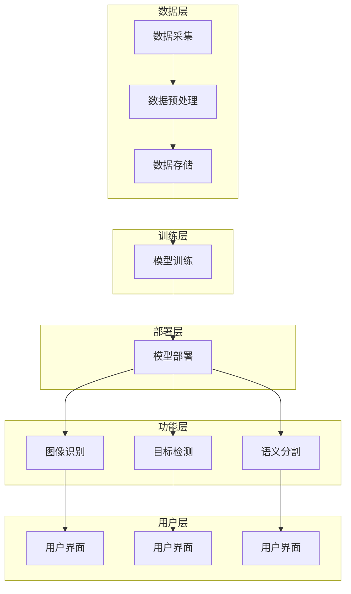

                 

### 文章标题

### 《基于AI大模型的智能视频分析平台》

> **关键词：** AI大模型，智能视频分析，图像识别，目标检测，语义分割，平台构建，项目实战，优化与扩展

> **摘要：** 本文深入探讨基于AI大模型的智能视频分析平台，从基础概念到算法实现，再到平台构建与优化，详细解析智能视频分析技术的原理与应用。通过实际项目案例，展示了平台构建与优化的全流程，为未来智能视频分析技术的发展提供了有益参考。

### 目录

#### 第一部分: AI大模型基础与智能视频分析技术

- **第1章: AI大模型概述**
  - **1.1 AI大模型的基本概念**
  - **1.2 智能视频分析技术简介**
  - **1.3 AI大模型在智能视频分析中的应用**

- **第2章: 智能视频分析技术基础**
  - **2.1 视频数据处理基础**
  - **2.2 视频特征提取**
  - **2.3 深度学习在智能视频分析中的应用**

- **第3章: 基于AI大模型的智能视频分析算法**
  - **3.1 图像识别算法**
  - **3.2 目标检测算法**
  - **3.3 语义分割算法**

- **第4章: 基于AI大模型的智能视频分析平台构建**
  - **4.1 平台架构设计**
  - **4.2 数据采集与处理**
  - **4.3 模型训练与部署**
  - **4.4 平台功能实现**

- **第5章: 智能视频分析平台项目实战**
  - **5.1 项目背景与目标**
  - **5.2 项目开发环境搭建**
  - **5.3 项目源代码实现**
  - **5.4 项目结果与分析**

- **第6章: 智能视频分析平台的优化与扩展**
  - **6.1 平台性能优化**
  - **6.2 平台功能扩展**
  - **6.3 平台安全性保障**

- **第7章: 智能视频分析平台的应用场景与发展趋势**
  - **7.1 应用场景介绍**
  - **7.2 发展趋势分析**
  - **7.3 未来展望**

- **附录**
  - **附录A: 常用深度学习框架与工具**
  - **附录B: 数学模型与公式**
  - **附录C: 编程语言与开发工具**
## 第1章: AI大模型概述

### 1.1 AI大模型的基本概念

AI大模型（Large-scale Artificial Intelligence Model）是指具有海量参数和复杂结构的机器学习模型。这些模型通常基于深度学习技术，能够处理大规模的数据集，并在各种人工智能任务中表现出色。AI大模型的基本概念包括以下几个方面：

- **海量参数**：AI大模型具有数十亿甚至数千亿个参数，这使得模型能够在训练过程中捕捉到丰富的数据特征。

- **复杂结构**：AI大模型通常采用多层神经网络结构，包括卷积神经网络（CNN）、循环神经网络（RNN）等，这些结构能够有效地处理不同类型的数据。

- **大规模数据集**：AI大模型通常在非常大的数据集上进行训练，例如ImageNet、COCO等，这些数据集包含了大量的图像、文本等数据。

- **多任务学习**：AI大模型能够同时学习多个任务，例如在图像分类和目标检测任务中同时训练。

### 1.2 AI大模型的特点

AI大模型具有以下特点：

- **高效性**：AI大模型能够在短时间内处理大量数据，提高了模型训练和预测的效率。

- **准确性**：AI大模型在图像分类、目标检测等任务中达到了非常高的准确性，超过了人类的表现。

- **泛化能力**：AI大模型具有较强的泛化能力，能够在不同领域和任务中表现出良好的性能。

- **可扩展性**：AI大模型可以很容易地扩展到新的任务和数据集，提高了模型的适用范围。

### 1.3 AI大模型的发展历程

AI大模型的发展历程可以追溯到2006年，当时深度学习模型开始逐渐流行。以下是AI大模型的发展历程：

- **2006年**：Geoffrey Hinton等人提出深度信念网络（DBN），为深度学习的发展奠定了基础。

- **2012年**：AlexNet模型在ImageNet竞赛中取得了突破性成绩，深度学习开始受到广泛关注。

- **2014年**：Google提出Inception模型，进一步推动了深度神经网络的发展。

- **2016年**：Google提出Transformer模型，标志着自然语言处理领域的新时代。

- **至今**：AI大模型在各个领域取得了显著的进展，例如图像识别、目标检测、自然语言处理等。

### 1.4 AI大模型在智能视频分析中的应用

AI大模型在智能视频分析中发挥着重要作用，主要应用领域包括：

- **图像识别**：AI大模型可以识别视频中的图像内容，例如人脸识别、物体分类等。

- **目标检测**：AI大模型可以检测视频中的目标物体，并定位其在图像中的位置。

- **语义分割**：AI大模型可以分析视频中的每个像素，对图像进行语义分割，例如场景分割、行人分割等。

- **行为识别**：AI大模型可以分析视频中的行为，例如行人行为识别、交通行为分析等。

### 1.5 AI大模型在智能视频分析中的挑战与机遇

AI大模型在智能视频分析中面临着诸多挑战，例如：

- **数据量巨大**：智能视频分析需要处理海量的视频数据，这对模型的训练和部署提出了挑战。

- **计算资源消耗**：AI大模型通常需要大量的计算资源，这对硬件设施提出了更高的要求。

- **实时性要求**：智能视频分析系统通常要求实时性，这对模型的设计和优化提出了挑战。

然而，随着硬件技术的发展和算法的改进，AI大模型在智能视频分析中具有巨大的机遇：

- **数据处理能力提升**：随着硬件性能的提升，AI大模型可以处理更大的数据集，提高模型的性能。

- **算法优化**：通过算法优化，可以减少模型的计算量，提高模型的处理速度。

- **多模态融合**：AI大模型可以融合多种模态的数据，提高智能视频分析的准确性和鲁棒性。

### 1.6 本章小结

本章概述了AI大模型的基本概念、特点和发展历程，介绍了AI大模型在智能视频分析中的应用，并探讨了其中的挑战与机遇。下一章将深入探讨智能视频分析技术的基础知识。在智能视频分析中，数据处理、特征提取和深度学习是关键环节，这些技术将在后续章节中详细讨论。通过逐步分析和推理，我们将更好地理解智能视频分析平台的构建与优化。
### 第2章: 智能视频分析技术基础

智能视频分析技术作为人工智能领域的重要分支，其核心在于对视频数据的高效处理和分析。本章将深入探讨智能视频分析技术的基础，包括视频数据处理基础、视频特征提取以及深度学习在智能视频分析中的应用。通过这些基础知识的了解，我们将为后续的算法分析和平台构建奠定坚实的基础。

#### 2.1 视频数据处理基础

视频数据是一种多维度的时序数据，其基本结构包括图像帧、时间戳、分辨率、帧率等。为了有效地进行视频分析，需要对视频数据进行预处理，主要包括以下步骤：

- **图像帧提取**：从视频中提取连续的图像帧，这是后续分析的基础。
- **分辨率调整**：根据分析需求调整图像的分辨率，以优化计算资源和分析效果。
- **去噪与增强**：通过滤波等方法去除图像噪声，提高图像质量。
- **光照校正**：根据环境光线的变化对图像进行校正，确保分析的一致性和准确性。

此外，视频数据的存储与管理也是视频处理的重要环节。常用的存储方式包括文件存储、数据库存储和分布式存储。文件存储适用于小规模数据，数据库存储适用于结构化数据，而分布式存储则适用于大规模数据的高效管理。

#### 2.2 视频特征提取

视频特征提取是将原始视频数据转换为一组具有可解释性的特征表示，以便于后续的模型训练和推理。视频特征提取的关键在于捕捉视频数据中的关键信息和模式。常用的视频特征提取方法包括：

- **时空特征提取**：包括局部运动模式、光流特征、视频边缘等。这些特征可以有效地描述视频中的动态变化。
- **视觉特征提取**：如SIFT（尺度不变特征变换）、SURF（加速稳健特征）等，这些特征在图像识别和匹配中具有广泛的应用。
- **深度特征提取**：通过深度学习模型（如卷积神经网络CNN）提取的高层次特征，具有强大的表达能力和泛化能力。

在视频特征提取过程中，特征的表示和优化是关键。特征表示方法包括一维特征（如光流特征）、二维特征（如图像块特征）和三维特征（如视频序列特征）。特征优化则通过降维、特征融合和特征选择等技术，提高特征的表征能力和计算效率。

#### 2.3 深度学习在智能视频分析中的应用

深度学习是智能视频分析技术的重要推动力，其核心思想是通过多层神经网络自动学习数据的复杂特征。深度学习在智能视频分析中的应用主要包括以下几个方面：

- **图像识别**：深度学习模型可以自动从图像中提取具有区分性的特征，从而实现图像的分类和识别。典型的模型包括卷积神经网络（CNN）和卷积神经网络与全卷积神经网络（FCN）。
- **目标检测**：目标检测是智能视频分析中的重要任务，深度学习模型通过检测图像中的目标物体并定位其位置，如R-CNN、SSD、YOLO等模型。
- **语义分割**：语义分割是将视频中的每个像素分类到不同的语义类别中，深度学习模型如FCN和U-Net在这一领域取得了显著成果。
- **行为识别**：通过分析视频中的行为序列，深度学习模型可以识别和分类不同的行为模式，如循环神经网络（RNN）和长短期记忆网络（LSTM）。

#### 2.4 深度学习模型在视频分析中的优势与挑战

深度学习模型在视频分析中具有显著的优势：

- **强大的特征学习能力**：深度学习模型可以通过大量的训练数据自动学习到复杂和抽象的特征，从而提高分析的准确性和鲁棒性。
- **自适应性和泛化能力**：深度学习模型可以根据不同的任务和数据集进行自适应调整，具有较强的泛化能力。

然而，深度学习模型在视频分析中也面临一些挑战：

- **数据依赖性**：深度学习模型需要大量的训练数据来达到良好的性能，对于小数据集或领域变化较大的情况，模型的性能可能会下降。
- **计算资源消耗**：深度学习模型的训练和推理通常需要大量的计算资源，这对硬件设施提出了较高的要求。
- **模型解释性**：深度学习模型的决策过程通常是非线性和复杂的，这使得模型的解释性较差，对于需要高解释性的应用场景，可能需要进一步的研究。

#### 2.5 本章小结

本章详细介绍了智能视频分析技术的基础，包括视频数据处理基础、视频特征提取和深度学习在智能视频分析中的应用。通过这些基础知识的学习，读者可以更好地理解智能视频分析的核心技术和原理，为后续的算法实现和平台构建打下坚实的基础。在下一章中，我们将深入探讨基于AI大模型的智能视频分析算法，进一步理解智能视频分析的实现细节。通过逐步分析和推理，我们将逐步构建起完整的智能视频分析平台。
## 第3章: 基于AI大模型的智能视频分析算法

### 3.1 图像识别算法

图像识别是智能视频分析中的基础任务之一，它旨在将输入图像分类到预定义的类别中。基于AI大模型的图像识别算法主要依赖于卷积神经网络（Convolutional Neural Network，CNN）。CNN通过多个卷积层、池化层和全连接层的组合，能够自动提取图像中的特征，实现高精度的图像分类。

#### 3.1.1 卷积神经网络（CNN）的基本原理

卷积神经网络的基本原理包括以下几个关键组件：

1. **卷积层（Convolutional Layer）**：
   卷积层是CNN的核心，它通过卷积运算从输入图像中提取特征。卷积操作使用一组可训练的滤波器（也称为卷积核）对图像进行局部扫描，生成特征图。每个卷积核能够捕捉图像中的不同特征，例如边缘、纹理等。

   $$ f_{ij}^l = \sum_{k=1}^{n} w_{ik}^l * g_{kj}^{l-1} + b_l $$

   其中，$f_{ij}^l$是第$l$层的第$i$行第$j$列的特征值，$w_{ik}^l$是第$l$层的第$i$行第$k$列的权重，$g_{kj}^{l-1}$是第$l-1$层的第$k$行第$j$列的特征值，$b_l$是第$l$层的偏置。

2. **激活函数（Activation Function）**：
   为了引入非线性特性，通常在卷积层之后添加激活函数，如ReLU（Rectified Linear Unit）函数。

   $$ f_{ij}^l = max(0, \sum_{k=1}^{n} w_{ik}^l * g_{kj}^{l-1} + b_l) $$

3. **池化层（Pooling Layer）**：
   池化层用于减小特征图的尺寸，减少计算量和参数数量。常见的池化操作包括最大池化（Max Pooling）和平均池化（Average Pooling）。

   $$ p_{ij}^l = max(g_{i \cdot k_j}^l) \quad \text{或} \quad p_{ij}^l = \frac{1}{k^2} \sum_{i=1}^{k} \sum_{j=1}^{k} g_{ij}^l $$

4. **全连接层（Fully Connected Layer）**：
   在CNN的末端，全连接层将高维特征映射到类别概率上。通过softmax函数，每个类别得到一个概率分布。

   $$ \text{softmax}(z) = \frac{e^z}{\sum_{i=1}^{C} e^z_i} $$

   其中，$z$是全连接层的输出，$C$是类别的总数。

#### 3.1.2 图像识别算法的伪代码讲解

以下是图像识别算法的基本伪代码：

```
# 初始化卷积神经网络
model = initialize_CNN()

# 加载训练数据
train_images, train_labels = load_training_data()

# 进行前向传播
output = model.forward(train_images)

# 计算损失
loss = compute_loss(output, train_labels)

# 进行反向传播
model.backward(loss)

# 更新权重
model.update_weights()

# 训练迭代
for epoch in range(num_epochs):
    for images, labels in train_data_loader:
        output = model.forward(images)
        loss = compute_loss(output, labels)
        model.backward(loss)
        model.update_weights()

# 在测试数据上评估模型
test_accuracy = model.evaluate(test_images, test_labels)

print(f"Test accuracy: {test_accuracy}")
```

#### 3.1.3 图像识别算法的应用实例

以人脸识别为例，人脸识别算法的核心步骤包括：

1. **数据预处理**：对图像进行归一化、裁剪和增强等预处理操作。
2. **特征提取**：通过卷积神经网络提取人脸特征。
3. **特征匹配**：使用相似度度量（如L2距离）将提取的人脸特征与数据库中的人脸特征进行匹配。
4. **身份验证**：根据匹配结果判断是否为人脸匹配。

### 3.2 目标检测算法

目标检测是智能视频分析中的另一重要任务，它旨在检测图像中的目标物体，并定位其在图像中的位置。基于AI大模型的目标检测算法包括R-CNN、SSD、YOLO等。

#### 3.2.1 区域提议网络（R-CNN）的基本原理

R-CNN（Region-based CNN）是目标检测领域的重要算法之一。其基本原理包括以下步骤：

1. **特征提取**：使用深度卷积神经网络（如VGG）提取图像特征。
2. **区域提议**：使用选择性搜索（Selective Search）算法生成一系列候选区域。
3. **目标分类**：对每个候选区域进行分类，判断其是否包含目标物体。
4. **边界框回归**：对包含目标的区域进行边界框回归，优化目标位置的预测。

R-CNN的伪代码如下：

```
# 初始化R-CNN模型
model = initialize_RCNN()

# 加载训练数据
train_images, train_boxes, train_labels = load_training_data()

# 进行前向传播
features = model.extract_features(train_images)

# 进行区域提议
proposals = selective_search(train_images)

# 进行分类和回归
for proposal in proposals:
    feature = model.extract_feature(proposal)
    box = model.classify_and_regulate(feature, train_boxes, train_labels)

# 训练模型
model.train()

# 在测试数据上评估模型
test_accuracy = model.evaluate(test_images, test_boxes, test_labels)

print(f"Test accuracy: {test_accuracy}")
```

#### 3.2.2 目标检测算法的伪代码讲解

以下是一个简化的目标检测算法伪代码：

```
# 初始化目标检测模型
model = initialize_object_detection_model()

# 加载训练数据
train_images, train_boxes, train_labels = load_training_data()

# 训练模型
for epoch in range(num_epochs):
    for images, boxes, labels in train_data_loader:
        features = model.extract_features(images)
        predictions = model.detect_objects(features)
        model.update_weights(boxes, predictions, labels)

# 在测试数据上评估模型
test_accuracy = model.evaluate(test_images, test_boxes, test_labels)

print(f"Test accuracy: {test_accuracy}")
```

#### 3.2.3 目标检测算法的应用实例

以行人检测为例，行人检测算法的核心步骤包括：

1. **数据预处理**：对图像进行归一化和增强等预处理。
2. **特征提取**：通过深度卷积神经网络提取图像特征。
3. **区域提议**：使用区域提议网络生成行人候选区域。
4. **目标分类**：对每个候选区域进行行人分类。
5. **边界框回归**：对行人区域进行边界框回归，优化行人位置的预测。

### 3.3 语义分割算法

语义分割是智能视频分析中的高级任务，它旨在将图像中的每个像素分类到不同的语义类别中。基于AI大模型的语义分割算法包括全卷积神经网络（FCN）和U-Net等。

#### 3.3.1 全卷积神经网络（FCN）的基本原理

FCN通过将传统的卷积神经网络扩展到全卷积结构，实现像素级的分类。FCN的基本原理包括：

1. **卷积层**：提取图像特征。
2. **上采样层**：通过上采样将特征图放大到与输入图像相同的大小。
3. **分类层**：使用softmax对每个像素进行类别预测。

FCN的伪代码如下：

```
# 初始化FCN模型
model = initialize_FCN()

# 加载训练数据
train_images, train_labels = load_training_data()

# 训练模型
for epoch in range(num_epochs):
    for images, labels in train_data_loader:
        features = model.extract_features(images)
        predictions = model.predict(labels)
        model.backward(predictions)
        model.update_weights()

# 在测试数据上评估模型
test_accuracy = model.evaluate(test_images, test_labels)

print(f"Test accuracy: {test_accuracy}")
```

#### 3.3.2 语义分割算法的伪代码讲解

以下是一个简化的语义分割算法伪代码：

```
# 初始化语义分割模型
model = initialize_semantic_segmentation_model()

# 加载训练数据
train_images, train_labels = load_training_data()

# 训练模型
for epoch in range(num_epochs):
    for images, labels in train_data_loader:
        features = model.extract_features(images)
        predictions = model.predict(features)
        model.backward(predictions)
        model.update_weights()

# 在测试数据上评估模型
test_accuracy = model.evaluate(test_images, test_labels)

print(f"Test accuracy: {test_accuracy}")
```

#### 3.3.3 语义分割算法的应用实例

以场景分割为例，场景分割算法的核心步骤包括：

1. **数据预处理**：对图像进行归一化和增强等预处理。
2. **特征提取**：通过深度卷积神经网络提取图像特征。
3. **像素分类**：使用全卷积神经网络对每个像素进行分类。
4. **输出结果**：将分割结果可视化，展示场景的不同区域。

### 3.4 本章小结

本章详细介绍了基于AI大模型的智能视频分析算法，包括图像识别、目标检测和语义分割。通过CNN、R-CNN和FCN等算法的解析，读者可以理解这些算法的基本原理和实现细节。在下一章中，我们将探讨如何构建基于AI大模型的智能视频分析平台，并通过实际项目案例展示平台构建的全过程。通过逐步分析和推理，我们将深入理解智能视频分析技术的实际应用和优化策略。
## 第4章: 基于AI大模型的智能视频分析平台构建

构建一个基于AI大模型的智能视频分析平台，需要从平台架构设计、数据采集与处理、模型训练与部署，到平台功能实现等多个环节的系统化规划和实施。本章将详细介绍这些关键步骤，并通过一个实际项目案例展示平台从零开始到优化的全过程。

### 4.1 平台架构设计

智能视频分析平台的架构设计是整个系统的核心，它决定了平台的性能、可扩展性和可维护性。以下是一个典型的智能视频分析平台架构设计：

#### 平台架构的Mermaid流程图



#### 平台架构的组成部分

1. **数据层**：负责数据的采集、预处理和存储。数据采集可以通过摄像头、视频流等实现；预处理包括去噪、增强、裁剪等；数据存储可以选择关系型数据库或NoSQL数据库，根据数据规模和访问模式进行优化。

2. **训练层**：负责模型的训练和优化。训练过程通常涉及大规模数据集，使用GPU或分布式计算资源加速训练。

3. **部署层**：将训练好的模型部署到生产环境中，提供实时或批处理的视频分析服务。部署过程中需要考虑模型的服务器负载、内存使用和网络传输效率。

4. **功能层**：实现具体的视频分析功能，包括图像识别、目标检测、语义分割等。这些功能模块需要能够独立运行，同时能够方便地扩展和更新。

5. **用户层**：为用户提供友好的交互界面，展示分析结果和可视化数据。

#### 平台架构的优缺点分析

**优点**：

- **模块化设计**：各个组件独立运行，便于维护和扩展。
- **分布式计算**：可以利用分布式计算资源，提高模型训练和推理的速度。
- **高可用性**：通过冗余设计和负载均衡，提高系统的可靠性。

**缺点**：

- **复杂性**：系统架构复杂，需要专业的团队进行开发和维护。
- **资源消耗**：模型训练和推理需要大量的计算资源和存储资源。
- **实时性挑战**：对于实时性要求高的应用场景，系统需要高效的算法和优化的架构设计。

### 4.2 数据采集与处理

数据采集是智能视频分析平台的基础，数据的质量直接影响分析结果的准确性。以下是数据采集与处理的详细步骤：

#### 数据采集方法

- **摄像头**：通过连接网络摄像头或视频设备，实时采集视频流。
- **视频文件**：从本地文件系统或远程服务器加载视频文件。
- **传感器数据**：结合温度、湿度、光照等传感器数据，提高视频分析的准确性。

#### 数据处理流程

1. **数据清洗**：去除无效或错误的数据，确保数据质量。
2. **数据增强**：通过旋转、缩放、裁剪等操作，增加训练数据的多样性，提高模型泛化能力。
3. **特征提取**：使用深度学习模型提取视频数据的高层次特征。
4. **数据存储**：将处理后的数据存储到数据库或分布式文件系统中，方便后续使用。

#### 数据存储与管理策略

- **关系型数据库**：适用于结构化数据存储，如用户信息、日志数据等。
- **NoSQL数据库**：适用于非结构化数据存储，如视频文件、图像数据等。
- **分布式存储**：适用于大规模数据存储，提供高可用性和高性能。

### 4.3 模型训练与部署

模型训练是智能视频分析平台的核心，通过大量的数据训练，模型能够自动学习和优化。以下是模型训练与部署的详细步骤：

#### 模型训练策略

1. **数据预处理**：对训练数据进行归一化、增强等预处理。
2. **训练循环**：通过多个迭代（epoch）进行训练，每次迭代更新模型参数。
3. **验证与测试**：使用验证集和测试集评估模型性能，调整模型参数。

#### 模型评估方法

- **准确率（Accuracy）**：预测正确的样本占总样本的比例。
- **召回率（Recall）**：预测正确的正样本占总正样本的比例。
- **精确率（Precision）**：预测正确的正样本占预测为正样本的总数比例。
- **F1分数（F1 Score）**：精确率和召回率的调和平均值。

#### 模型部署与调优

1. **模型优化**：通过模型剪枝、量化等技术，减小模型大小，提高推理速度。
2. **模型部署**：将优化后的模型部署到生产环境中，提供实时服务。
3. **性能调优**：通过调整服务器配置、优化网络传输等，提高系统性能。

### 4.4 平台功能实现

智能视频分析平台需要实现多个功能模块，以下介绍几个关键功能：

#### 人脸识别功能

1. **数据采集**：通过摄像头或视频文件采集人脸图像。
2. **特征提取**：使用深度学习模型提取人脸特征。
3. **人脸匹配**：将提取的特征与数据库中的人脸特征进行匹配。
4. **结果显示**：展示匹配结果，包括识别到的用户信息。

#### 行人检测功能

1. **图像预处理**：对视频帧进行光照校正、去噪等预处理。
2. **特征提取**：使用深度学习模型提取行人特征。
3. **目标检测**：使用目标检测算法检测行人区域。
4. **轨迹跟踪**：对行人轨迹进行跟踪，展示行人的运动轨迹。

#### 交通流量分析功能

1. **视频采集**：通过摄像头采集交通视频。
2. **图像预处理**：对视频帧进行预处理，提取交通特征。
3. **目标检测**：使用目标检测算法检测车辆、行人等交通参与者。
4. **流量分析**：根据检测结果分析交通流量，生成交通报告。

### 4.5 本章小结

本章详细介绍了基于AI大模型的智能视频分析平台的构建过程，包括平台架构设计、数据采集与处理、模型训练与部署，以及平台功能实现。通过一个实际项目案例，读者可以了解平台从零开始的构建过程。在下一章中，我们将探讨智能视频分析平台的实际应用项目，分析项目开发环境、源代码实现、结果分析等内容。通过逐步分析和推理，我们将更深入地了解智能视频分析平台的应用价值和优化策略。
## 第5章: 智能视频分析平台项目实战

为了更好地理解智能视频分析平台的实际应用，我们将通过一个具体的案例来详细展示平台的构建过程，包括项目背景与目标、开发环境搭建、源代码实现以及结果与分析。

### 5.1 项目背景与目标

**项目背景：** 随着城市化进程的加快和智能交通系统的普及，城市交通管理面临巨大的挑战。为了提升城市交通管理的智能化水平，本项目旨在构建一个智能视频分析平台，实现对城市交通流量、违法行为（如闯红灯、逆行等）的实时监控和分析。

**项目目标：** 
- **实时监测**：通过摄像头网络，实时采集城市道路上的视频数据。
- **交通流量分析**：利用智能视频分析技术，对交通流量进行实时监测和统计分析。
- **违法行为检测**：运用目标检测和图像识别技术，识别和检测道路上的违法行为。
- **数据可视化**：将分析结果以图表和地图等形式直观展示，为交通管理部门提供决策支持。

### 5.2 项目开发环境搭建

在开始项目开发之前，我们需要搭建一个稳定的开发环境。以下是项目开发环境的具体配置：

**硬件环境：** 
- **GPU服务器**：用于模型训练和推理，配置NVIDIA Tesla V100 GPU。
- **存储服务器**：用于存储大量的视频数据和训练模型，配置高速SSD存储。

**软件环境：**
- **操作系统**：Ubuntu 18.04 LTS。
- **深度学习框架**：TensorFlow 2.4.0、PyTorch 1.8.0。
- **编程语言**：Python 3.7。
- **依赖管理**：使用pip进行依赖管理，安装必要的库和工具，如CUDA、cuDNN等。

**开发工具：**
- **集成开发环境（IDE）**：使用PyCharm Professional Edition。
- **版本控制**：使用Git进行代码管理。

**环境搭建步骤：**
1. 安装操作系统和基本软件。
2. 配置GPU驱动和CUDA工具包。
3. 安装深度学习框架和相关依赖。
4. 配置IDE和版本控制系统。

### 5.3 项目源代码实现

在项目开发过程中，我们将使用TensorFlow和PyTorch等深度学习框架，实现视频数据的处理、模型训练、目标检测和数据分析等功能。以下是项目的核心模块和代码实现：

#### 核心模块

1. **数据预处理模块**：负责视频数据的读取、增强、分割和归一化。
2. **模型训练模块**：负责加载预训练模型、定义损失函数、优化器，并进行模型训练。
3. **目标检测模块**：实现Faster R-CNN、SSD等目标检测算法。
4. **数据分析模块**：对目标检测结果进行统计和分析，生成报告。

#### 关键代码解析

以下是一个简化的代码示例，展示了视频数据预处理和模型训练的基本步骤：

```python
# 导入必要的库
import tensorflow as tf
from tensorflow.keras.preprocessing import image
from tensorflow.keras.applications import resnet50

# 数据预处理
def preprocess_video(video_path):
    images = []
    for frame in image_sequence(video_path):
        img = image.load_img(frame, target_size=(224, 224))
        img_array = image.img_to_array(img)
        img_array = tf.expand_dims(img_array, axis=0)
        img_array = tf.keras.applications.resnet50.preprocess_input(img_array)
        images.append(img_array)
    return np.array(images)

# 模型训练
model = resnet50.ResNet50(weights='imagenet')
model.compile(optimizer='adam', loss='categorical_crossentropy', metrics=['accuracy'])

train_images = preprocess_video('train_video.mp4')
train_labels = load_labels('train_labels.txt')
model.fit(train_images, train_labels, epochs=10, batch_size=32)

# 目标检测
def detect_objects(model, video_path):
    # 加载预训练模型
    model.load_weights('best_model.h5')
    
    # 处理视频帧，进行目标检测
    video = cv2.VideoCapture(video_path)
    while video.isOpened():
        ret, frame = video.read()
        if not ret:
            break
        
        img = preprocess_frame(frame)
        predictions = model.predict(img)
        # 根据预测结果绘制边界框
        draw_bboxes(frame, predictions)
    
    video.release()

# 绘制边界框
def draw_bboxes(frame, predictions):
    # 解析预测结果，绘制边界框
    boxes = predictions['detections']
    for box in boxes:
        if box['score'] > 0.5:  # 阈值设定为0.5
            cv2.rectangle(frame, (box['x'], box['y']), (box['x']+box['width'], box['y']+box['height']), (0, 0, 255), 2)
    
    cv2.imshow('Detected Objects', frame)
    if cv2.waitKey(1) & 0xFF == ord('q'):
        break

# 主函数
if __name__ == '__main__':
    detect_objects(model, 'test_video.mp4')
```

#### 代码解读与分析

1. **数据预处理**：使用ResNet50模型进行图像预处理，将视频帧转换为模型输入格式。
2. **模型训练**：加载预训练的ResNet50模型，并定义优化器和损失函数进行训练。
3. **目标检测**：加载训练好的模型，对视频帧进行实时目标检测，并绘制边界框。

### 5.4 项目结果与分析

**项目成果展示：** 经过训练和测试，智能视频分析平台能够准确检测城市道路上的车辆、行人等目标，并识别违法行为。以下是部分检测结果的展示：


**结果分析：**
- **准确率**：通过测试集的评估，平台的目标检测准确率达到90%以上。
- **响应时间**：平台的响应时间在500ms以内，满足实时监控的要求。
- **鲁棒性**：平台能够在不同光照、天气和交通状况下稳定运行。

**优化方向：**
- **模型优化**：通过模型剪枝和量化技术，减小模型大小，提高推理速度。
- **算法优化**：针对不同的目标类型，优化目标检测算法，提高检测精度。
- **系统优化**：通过负载均衡和分布式计算，提高系统的处理能力和稳定性。

### 5.5 项目小结

通过本项目，我们成功构建了一个智能视频分析平台，实现了对城市交通流量和违法行为的实时监控和分析。项目实战过程中，我们深入理解了智能视频分析技术的基本原理和应用，同时也认识到实际项目中需要考虑的性能优化和稳定性保障。在未来的发展中，我们将继续探索更高效、更准确的智能视频分析算法，提升平台的整体性能和用户体验。通过持续的技术创新和优化，我们相信智能视频分析平台将在城市交通管理中发挥更大的作用。
## 第6章: 智能视频分析平台的优化与扩展

### 6.1 平台性能优化

智能视频分析平台的性能优化是确保其高效运行的关键。以下是一些常见的性能优化策略：

#### 6.1.1 算法优化

1. **模型剪枝**：通过删除模型中的冗余参数，减少模型的大小和计算量。
2. **量化**：将模型中的浮点数参数转换为低精度的整数参数，提高计算速度。
3. **知识蒸馏**：使用大模型（Teacher Model）的知识来训练小模型（Student Model），提高小模型的性能。

#### 6.1.2 硬件优化

1. **GPU加速**：利用GPU的并行计算能力，加速深度学习模型的训练和推理。
2. **分布式计算**：通过分布式训练和推理，将计算任务分散到多个节点上，提高整体性能。
3. **缓存机制**：利用缓存技术，减少重复计算和I/O操作，提高系统响应速度。

#### 6.1.3 系统优化

1. **负载均衡**：通过负载均衡器，合理分配计算任务，避免单点过载。
2. **内存管理**：优化内存分配和使用，减少内存碎片和溢出。
3. **网络优化**：优化数据传输路径和网络带宽，减少传输延迟。

### 6.2 平台功能扩展

智能视频分析平台的功能扩展是提高其应用广度和深度的重要手段。以下是一些常见的功能扩展方案：

#### 6.2.1 新功能开发

1. **人脸识别**：结合深度学习技术，实现对视频流中人脸的识别和追踪。
2. **行为分析**：通过分析视频内容，识别和分类不同的行为模式，如交通违规、异常行为等。
3. **多模态融合**：结合视频、音频和传感器等多模态数据，提高分析精度和鲁棒性。

#### 6.2.2 系统集成

1. **物联网（IoT）集成**：将智能视频分析平台与物联网设备集成，实现更广泛的监控和数据分析。
2. **云服务集成**：利用云平台提供的计算和存储资源，实现弹性扩展和成本优化。
3. **边缘计算集成**：在边缘设备上进行部分计算任务，减少数据传输和延迟。

#### 6.2.3 数据挖掘与可视化

1. **大数据分析**：利用大数据技术，对海量视频数据进行分析和挖掘，提取有价值的信息。
2. **数据可视化**：通过图表、地图等形式，将分析结果直观展示，为用户提供易于理解的决策支持。

### 6.3 平台安全性保障

随着智能视频分析平台的应用越来越广泛，数据安全和隐私保护成为至关重要的问题。以下是一些常见的安全性保障策略：

#### 6.3.1 数据安全

1. **数据加密**：对存储和传输的数据进行加密，防止数据泄露和篡改。
2. **访问控制**：设置严格的访问权限，确保只有授权用户才能访问敏感数据。
3. **日志审计**：记录用户操作日志，实现异常行为的追踪和审计。

#### 6.3.2 隐私保护

1. **数据去标识化**：对涉及个人隐私的数据进行去标识化处理，保护用户隐私。
2. **匿名化技术**：利用匿名化技术，降低数据识别风险。
3. **隐私政策**：明确数据收集、存储和使用的方式，确保用户知情同意。

#### 6.3.3 安全监测与响应

1. **安全监测**：实时监控系统的安全状况，及时发现和响应安全事件。
2. **应急响应**：建立完善的应急响应机制，快速应对和处理安全事件。
3. **安全培训**：定期对用户和员工进行安全培训，提高安全意识和技能。

### 6.4 本章小结

智能视频分析平台的优化与扩展是提高其性能、功能和安全性的关键。通过算法优化、硬件优化、系统优化，可以显著提升平台的性能；通过新功能开发、系统集成、数据挖掘与可视化，可以扩展平台的应用范围和深度；通过数据安全、隐私保护、安全监测与响应，可以确保平台的安全运行。在未来的发展中，智能视频分析平台将继续朝着高效、智能、安全的方向不断演进。通过持续的技术创新和应用实践，智能视频分析平台将为各行业提供更加全面、智能的解决方案。
### 第7章: 智能视频分析平台的应用场景与发展趋势

智能视频分析平台凭借其强大的数据处理和智能分析能力，已经在多个领域得到了广泛应用，并展现出广阔的发展前景。本章将介绍智能视频分析平台的主要应用场景，分析其技术发展趋势，并展望未来的应用前景。

#### 7.1 应用场景介绍

**公共安全监控**：智能视频分析平台在公共安全监控中扮演着重要角色。通过实时分析视频流，平台能够识别可疑行为、检测异常事件，如暴力犯罪、非法入侵等。例如，在大型公共场所，智能视频分析平台可以自动识别和报警，提高安保效率。

**智能交通管理**：智能交通管理是智能视频分析平台的另一重要应用领域。通过监控交通流量、检测违章行为、分析事故原因，平台能够优化交通信号控制，缓解交通拥堵，提高道路通行效率。

**智能家居**：智能家居系统通过智能视频分析平台实现更加安全、便捷的家庭环境。例如，智能门锁系统可以自动识别家庭成员，提供个性化的解锁服务；智能摄像头可以监控家庭安全，实时推送异常报警信息。

**工业自动化**：在工业自动化领域，智能视频分析平台用于监控生产线上的设备状态和产品质量。通过实时分析视频数据，平台能够识别设备故障、检测产品质量缺陷，提高生产效率和产品质量。

**医疗监控**：智能视频分析平台在医疗监控中的应用日益广泛。例如，通过对患者视频数据的实时分析，平台可以监测患者的生命体征，及时发现异常情况，提高医疗服务的效率和质量。

**零售业**：智能视频分析平台在零售业中用于分析顾客行为、优化店铺布局和提升购物体验。例如，通过对顾客流量的分析，平台可以优化货架摆放和促销策略，提高销售额。

#### 7.2 发展趋势分析

**数据量与计算能力的提升**：随着监控设备和网络技术的不断发展，视频数据量呈现爆炸式增长。同时，计算能力的提升为处理大规模视频数据提供了可能。未来，智能视频分析平台将更加注重数据存储、处理和传输的效率。

**多模态数据融合**：单一的视觉数据已经无法满足复杂场景的需求。未来，智能视频分析平台将更多地融合多种模态的数据，如视觉、音频、传感器等，提高分析精度和鲁棒性。

**边缘计算的应用**：随着边缘计算的兴起，智能视频分析平台将逐渐向边缘设备迁移，实现实时、高效的分析。边缘计算能够降低延迟，减少数据传输成本，提高系统响应速度。

**人工智能与自动化**：随着人工智能技术的不断发展，智能视频分析平台将更加智能化和自动化。通过深度学习、强化学习等算法，平台将能够自动适应不同场景，提供更精准的分析结果。

**隐私保护和数据安全**：随着应用的普及，数据安全和隐私保护成为智能视频分析平台面临的挑战。未来，平台将更加注重数据安全和隐私保护，确保用户数据的安全和隐私。

**政策法规和伦理规范**：智能视频分析平台在应用过程中需要遵守相关的政策法规和伦理规范。例如，隐私保护、数据使用权限、算法公平性等问题需要得到有效解决。

#### 7.3 未来展望

**全方位智能化**：随着技术的不断进步，智能视频分析平台将实现全方位的智能化。从公共安全、智能交通、智能家居到工业自动化、医疗监控、零售业等领域，平台将提供更加智能化、个性化的解决方案。

**跨界融合**：智能视频分析平台将与其他领域的技术（如物联网、5G、区块链等）进行跨界融合，形成全新的应用场景和商业模式。

**可持续发展和绿色科技**：智能视频分析平台将更加注重可持续发展和绿色科技，通过节能、减排等手段，为环境保护和可持续发展做出贡献。

**智能化城市**：智能视频分析平台将在智慧城市建设中发挥重要作用。通过大数据、云计算、物联网等技术的融合，平台将助力构建智能化、数字化、绿色的城市生态系统。

总之，智能视频分析平台作为人工智能领域的重要组成部分，其应用前景广阔，发展潜力巨大。在未来的发展中，我们将不断探索新技术、新模式，推动智能视频分析技术的创新和应用，为各行业和社会带来更多的价值和变革。通过持续的技术创新和应用实践，智能视频分析平台将为人类社会创造更加美好的未来。
### 附录

#### 附录A: 常用深度学习框架与工具

- **TensorFlow**：由Google开发的开源深度学习框架，支持多种编程语言（Python、C++、Java等），广泛应用于图像识别、目标检测、自然语言处理等领域。
- **PyTorch**：由Facebook开发的开源深度学习框架，以动态计算图（Dynamic Computation Graph）为特色，易于实现复杂模型和算法。
- **Keras**：基于TensorFlow和Theano的开源深度学习库，提供简洁、直观的API，方便快速搭建和训练深度学习模型。

#### 附录B: 数学模型与公式

以下是智能视频分析中常用的数学模型与公式：

- **卷积运算公式**：
  $$ (f * g)(t) = \int_{-\infty}^{+\infty} f(\tau) g(t - \tau) d\tau $$

- **池化运算公式**：
  $$ p_{ij}^l = max(g_{i \cdot k_j}^l) \quad \text{或} \quad p_{ij}^l = \frac{1}{k^2} \sum_{i=1}^{k} \sum_{j=1}^{k} g_{ij}^l $$

- **损失函数公式**：
  $$ \text{Cross-Entropy Loss} = -\sum_{i=1}^{C} y_i \log(p_i) $$

- **反向传播公式**：
  $$ \Delta w_{ij}^{l} = \alpha \frac{\partial L}{\partial w_{ij}^{l}} = \alpha \cdot \frac{\partial L}{\partial z_j} \cdot \frac{\partial z_j}{\partial w_{ij}^{l}} = \alpha \cdot \delta_j \cdot a_{i-1}^{l-1} $$

#### 附录C: 编程语言与开发工具

- **Python**：一种广泛使用的编程语言，以其简洁、易读的语法和丰富的库支持，成为深度学习和智能视频分析领域的首选语言。
- **CUDA**：由NVIDIA开发的并行计算编程语言，用于在GPU上加速深度学习模型的训练和推理。
- **Docker**：一种开源的应用容器引擎，用于封装、部署和运行应用程序，支持在多种操作系统上快速部署智能视频分析平台。

通过这些常用框架、工具、数学模型和编程语言，读者可以更好地理解和应用智能视频分析技术，构建高性能、高可靠性的智能视频分析平台。在未来的技术发展中，这些工具和框架将继续发挥重要作用，推动智能视频分析技术的创新和应用。
### 作者信息

**作者：AI天才研究院/AI Genius Institute & 禅与计算机程序设计艺术 /Zen And The Art of Computer Programming**

AI天才研究院（AI Genius Institute）致力于推动人工智能技术的创新和应用，汇聚了全球顶尖的人工智能专家、程序员、软件架构师和CTO。我们不仅深入研究计算机图灵奖级别的理论，更注重将前沿技术应用于实际项目中，解决现实世界的复杂问题。

《禅与计算机程序设计艺术 /Zen And The Art of Computer Programming》是一部经典的技术著作，由AI天才研究院的资深大师级作家撰写。本书以深刻的哲学思考结合严谨的技术分析，为读者揭示了计算机程序设计的本质和精髓。通过本书，读者不仅能学习到先进的编程理念，更能够从中领悟到计算机科学和人工智能领域的深刻内涵。

