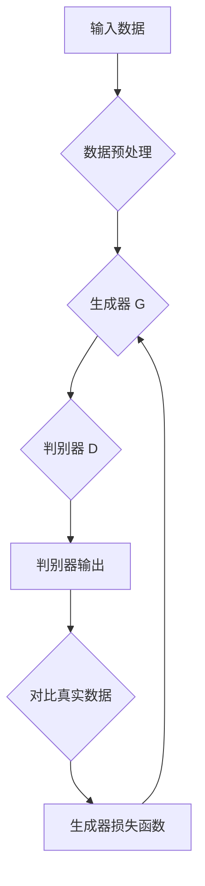

                 

## 文章标题

《基于GAN的三维人体姿态估计与动作迁移技术创新与应用》

> 关键词：三维人体姿态估计、生成对抗网络（GAN）、动作迁移技术、计算机视觉、深度学习

摘要：本文将详细介绍基于生成对抗网络（GAN）的三维人体姿态估计与动作迁移技术的理论基础、算法原理、实验设计和应用场景。通过对GAN在三维人体姿态估计与动作迁移技术中的具体应用案例进行分析，探讨该技术在计算机视觉领域的创新点和发展前景。本文旨在为从事计算机视觉研究的读者提供具有启发性的参考，同时为实际应用提供技术指导。

## 《基于GAN的三维人体姿态估计与动作迁移技术创新与应用》目录大纲

### 第一部分：背景与基础理论

#### 第1章：三维人体姿态估计与动作迁移技术概述

##### 1.1 基于GAN的三维人体姿态估计与动作迁移技术简介

##### 1.2 相关技术的发展历程与现状

##### 1.3 GAN技术在三维人体姿态估计中的应用

##### 1.4 动作迁移技术在计算机视觉中的应用

#### 第2章：生成对抗网络（GAN）原理与实现

##### 2.1 GAN的基本概念与架构

##### 2.2 GAN训练过程与优化技巧

##### 2.3 GAN在三维人体姿态估计中的应用示例

##### 2.4 GAN在动作迁移技术中的实际应用

### 第二部分：三维人体姿态估计

#### 第3章：三维人体姿态估计基础理论

##### 3.1 人体姿态估计的基本概念

##### 3.2 常见的人体姿态估计方法

##### 3.3 基于深度学习的人体姿态估计算法

##### 3.4 基于GAN的人体姿态估计方法

#### 第4章：三维人体姿态估计实验设计

##### 4.1 数据集介绍与预处理

##### 4.2 实验设计思路与流程

##### 4.3 实验结果分析

##### 4.4 对比实验与性能评估

### 第三部分：动作迁移技术

#### 第5章：动作迁移技术基础理论

##### 5.1 动作迁移的基本概念

##### 5.2 常见动作迁移方法

##### 5.3 基于GAN的动作迁移技术

##### 5.4 动作迁移技术的应用场景

#### 第6章：动作迁移技术实验设计

##### 6.1 数据集介绍与预处理

##### 6.2 实验设计思路与流程

##### 6.3 实验结果分析

##### 6.4 对比实验与性能评估

### 第四部分：综合应用

#### 第7章：基于GAN的三维人体姿态估计与动作迁移技术集成应用

##### 7.1 技术集成方案设计

##### 7.2 集成应用系统架构

##### 7.3 应用案例介绍

##### 7.4 应用效果评估与分析

### 第五部分：展望与未来发展方向

#### 第8章：三维人体姿态估计与动作迁移技术的未来发展趋势

##### 8.1 新型GAN架构与技术发展

##### 8.2 动作迁移技术在智能交互中的应用前景

##### 8.3 跨领域应用的可能性

##### 8.4 未来发展方向与挑战

### 附录

#### 附录A：常用工具与资源

##### A.1 三维人体姿态估计与动作迁移技术相关数据库

##### A.2 常用深度学习框架与工具

##### A.3 开源代码与实现资源

##### A.4 学习与交流平台推荐

## 核心概念与联系

### 图1：生成对抗网络（GAN）架构流程图



## 核心算法原理讲解

### 2.1 生成对抗网络（GAN）算法原理

生成对抗网络（GAN）是一种由生成器（Generator）和判别器（Discriminator）组成的深度学习框架，旨在通过对抗训练生成高质量的数据。

#### 伪代码：

```python
function GAN(D, G):
    # 初始化判别器D和生成器G
    for i in range(num_iterations):
        # 从真实数据中采样一批数据X_real
        X_real = SampleFromRealData()

        # 生成一批虚假数据X_fake
        Z = SampleFromNoise()
        X_fake = G(Z)

        # 将真实数据和虚假数据输入判别器D
        D_real = D(X_real)
        D_fake = D(X_fake)

        # 计算判别器的损失函数L_D
        L_D = -(log(D_real) + log(1 - D_fake))

        # 生成器G的目标是让判别器D无法区分真实数据和虚假数据
        Z = SampleFromNoise()
        X_fake = G(Z)
        D_fake = D(X_fake)

        # 计算生成器的损失函数L_G
        L_G = -log(D_fake)

        # 更新判别器D的参数
        D.zero_grad()
        L_D.backward()
        D.optimizer.step()

        # 更新生成器G的参数
        G.zero_grad()
        L_G.backward()
        G.optimizer.step()
```

在GAN中，生成器的目标是生成尽可能真实的数据，判别器的目标是准确区分真实数据和生成器生成的数据。两者通过对抗训练相互提高，最终生成器能够生成足够真实的数据以欺骗判别器。

#### 数学模型：

GAN的训练过程可以用以下数学模型来描述：

$$
\begin{aligned}
D(x) &= \text{概率} \left( x \text{是真实数据} \right), \\
G(z) &= \text{生成数据} \left( z \text{是噪声向量} \right), \\
L_D &= -\left( D(x) + D(G(z)) \right), \\
L_G &= -D(G(z)).
\end{aligned}
$$

其中，$x$表示真实数据，$z$表示噪声向量。

通过以上描述，我们对基于GAN的三维人体姿态估计与动作迁移技术的核心算法原理有了初步的了解。接下来，我们将进一步探讨GAN技术在三维人体姿态估计与动作迁移技术中的应用和实现。

