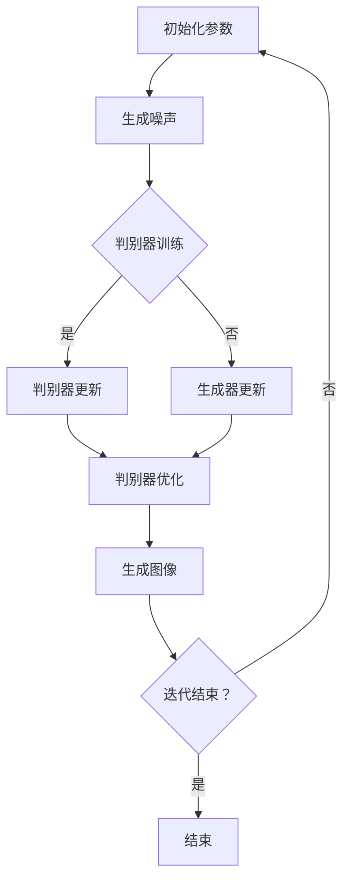
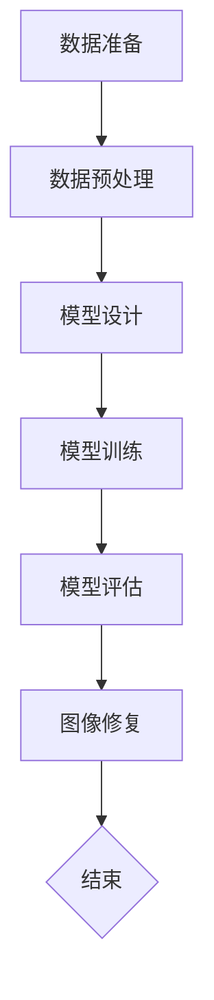
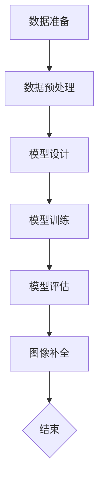

                 

# 文章标题：基于GAN的图像修复与图像补全技术创新与应用拓展

## 关键词

GAN、图像修复、图像补全、深度学习、人工智能、图像处理

## 摘要

本文深入探讨了基于生成对抗网络（GAN）的图像修复与图像补全技术的创新与应用。首先，介绍了GAN的基本原理与架构，详细解析了生成器和判别器的工作机制及GAN的训练过程。随后，文章阐述了GAN在图像修复与图像补全中的具体应用案例，分析了GAN在这些任务中的优势与局限。接着，文章探讨了GAN的优化与拓展，包括变体网络、多尺度GAN与条件GAN等。此外，文章还介绍了GAN在工业界的应用拓展，如医疗图像修复、自动驾驶图像处理和文化遗产修复等。最后，文章通过一个实际项目实践了GAN在图像修复与图像补全中的应用，并对GAN在图像修复与图像补全中的未来趋势进行了展望。

---

# 基于GAN的图像修复与图像补全技术创新与应用拓展

## 第一部分：GAN基本原理与架构

### 第1章：图像修复与图像补全概述

#### 1.1 图像修复与图像补全技术背景

随着图像处理技术的飞速发展，图像修复与图像补全技术在许多领域都得到了广泛应用。图像修复主要指对图像中的缺陷、破损或者部分缺失的区域进行修复，使其恢复到原始状态或提升视觉效果。而图像补全则是通过填补图像中的空白区域或缺失部分，使图像完整或更具观赏性。这两种技术不仅在实际应用中具有重要意义，而且也在理论研究上提出了许多挑战。

图像修复与图像补全技术起源于计算机视觉和图像处理领域，其早期方法主要依赖于手工设计的特征提取和匹配算法。然而，随着深度学习的兴起，生成对抗网络（GAN）成为了图像修复与图像补全领域的热点技术。GAN通过深度学习的强大学习能力，能够在大量数据上自动学习图像生成和修复的复杂规律，从而实现高效的图像修复与图像补全。

#### 1.2 生成对抗网络（GAN）基本概念

生成对抗网络（Generative Adversarial Network，GAN）是由Ian Goodfellow等人在2014年提出的一种新型深度学习框架。GAN的核心思想是利用生成器和判别器之间的对抗关系进行训练，从而实现高质量的数据生成。GAN由两个深度神经网络组成：生成器（Generator）和判别器（Discriminator）。

生成器的任务是生成伪造数据，以模仿真实数据。判别器的任务则是区分输入数据是来自真实数据还是生成器伪造的数据。在训练过程中，生成器和判别器相互对抗，生成器试图生成更加逼真的数据，而判别器则努力提高对真实数据和伪造数据的辨别能力。通过这种对抗过程，生成器不断优化其生成策略，最终能够生成高度逼真的数据。

GAN的主要优势在于其强大的数据生成能力，使其在图像生成、图像修复、图像增强、图像补全等领域展现出巨大的潜力。此外，GAN通过端到端的训练方式，能够直接从原始图像生成目标图像，避免了复杂的图像预处理和特征提取过程，提高了图像处理效率。

#### 1.3 GAN的架构与组成部分

GAN的架构设计主要由生成器、判别器和损失函数三部分组成。

生成器（Generator）：
生成器是一个从随机噪声向真实图像转换的神经网络。其基本思想是通过学习数据分布，将随机噪声映射为符合数据分布的图像。生成器的神经网络结构通常采用多个卷积层和反卷积层，以便生成高质量的图像。生成器通过对抗训练过程不断优化其生成策略，以提高生成图像的真实性。

判别器（Discriminator）：
判别器是一个从图像中预测其真实性的神经网络。其任务是根据输入图像的特征来判断图像是真实图像还是生成器生成的伪造图像。判别器的神经网络结构通常采用多个卷积层，以便提取图像的高层次特征。判别器通过对抗训练过程不断优化其辨别能力，以提高对真实图像和伪造图像的区分度。

损失函数（Loss Function）：
GAN的训练过程是通过优化生成器和判别器的损失函数来实现的。生成器的损失函数通常由两部分组成：生成损失和对抗损失。生成损失是生成器生成的图像与真实图像之间的差异，对抗损失是生成器生成的图像与判别器预测的结果之间的差异。判别器的损失函数通常只有对抗损失，即判别器预测生成图像的真实性。

GAN的训练过程：
GAN的训练过程是一个迭代过程，包括以下步骤：
1. 初始化生成器和判别器的参数。
2. 从真实数据中随机抽取一批图像作为判别器的输入。
3. 判别器根据输入图像的特征进行训练，优化其辨别能力。
4. 从生成器中随机抽取一批噪声数据，生成伪造图像。
5. 将生成的伪造图像与真实图像混合，作为判别器的输入。
6. 判别器根据输入图像的特征进行训练，优化其辨别能力。
7. 生成器根据输入噪声数据生成伪造图像，并计算生成损失和对抗损失。
8. 通过梯度下降算法优化生成器的参数，降低生成损失和对抗损失。

#### 1.4 GAN的应用场景

GAN在图像修复与图像补全领域具有广泛的应用场景，主要包括以下几个方面：

1. **图像修复**：
   GAN在图像修复中可以用于修复图像中的破损、缺陷或部分缺失的区域。通过训练生成器，使其能够生成与真实图像相似的区域，从而修复图像中的问题。例如，在医疗图像处理中，GAN可以用于修复医学图像中的噪声、污点和断裂区域，提高图像的清晰度和诊断准确性。

2. **图像补全**：
   GAN在图像补全中可以用于填补图像中的空白区域或缺失部分，使图像更加完整或具有更高的视觉质量。例如，在艺术创作中，GAN可以用于生成艺术作品中的缺失部分，提高作品的完整性和艺术性。

3. **图像增强**：
   GAN在图像增强中可以用于提高图像的分辨率、对比度和色彩饱和度。通过生成器生成高分辨率的图像，从而增强图像的视觉效果。

4. **图像合成**：
   GAN在图像合成中可以用于生成具有真实感的图像组合。例如，在虚拟现实和增强现实领域，GAN可以用于生成逼真的虚拟场景，提高用户体验。

#### 1.5 GAN的Mermaid流程图

以下是一个简单的Mermaid流程图，展示了GAN的基本流程：



### 第2章：GAN算法原理详解

#### 2.1 生成器的算法原理

生成器的核心任务是将随机噪声转换为逼真的图像。生成器的算法原理主要涉及以下几个方面：

1. **噪声输入**：
   生成器首先从噪声分布中随机抽取噪声数据作为输入。噪声数据通常是高斯噪声或均匀噪声，用于初始化生成图像。

2. **噪声编码**：
   噪声编码是将噪声数据通过一系列的神经网络层转换为潜在的图像特征。通常，这些神经网络层包括卷积层、反卷积层和激活函数等。卷积层用于提取图像的低层次特征，反卷积层用于将这些特征重构为高层次的图像。

3. **图像生成**：
   通过噪声编码过程，生成器生成了潜在的图像特征。这些特征经过一系列的反卷积层和激活函数，最终生成具有真实感的图像。生成器的输出图像通常与真实图像相似，但可能存在一些偏差。

4. **优化策略**：
   生成器的优化策略主要通过对抗损失和生成损失来优化生成器的参数。对抗损失是生成器生成的图像与判别器预测结果之间的差异，生成损失是生成器生成的图像与真实图像之间的差异。通过优化这些损失函数，生成器不断优化其生成策略，提高生成图像的质量。

#### 2.2 判别器的算法原理

判别器的核心任务是区分输入图像是真实图像还是生成器生成的伪造图像。判别器的算法原理主要涉及以下几个方面：

1. **图像输入**：
   判别器接收输入图像作为输入，这些图像可以是真实图像或生成器生成的伪造图像。

2. **特征提取**：
   判别器通过一系列卷积层提取输入图像的高层次特征。这些特征用于判断图像的真实性。卷积层通常包括多个卷积核，以便提取不同尺度和不同类型的图像特征。

3. **分类预测**：
   判别器根据提取到的特征进行分类预测，输出图像是真实图像的概率。通常，判别器使用sigmoid函数或Softmax函数进行分类预测。

4. **优化策略**：
   判别器的优化策略主要通过对抗损失来优化判别器的参数。对抗损失是生成器生成的图像与判别器预测结果之间的差异。通过优化对抗损失，判别器不断提高对真实图像和伪造图像的辨别能力。

#### 2.3 GAN的训练过程

GAN的训练过程是通过迭代优化生成器和判别器的参数来实现的。具体步骤如下：

1. **初始化参数**：
   首先初始化生成器和判别器的参数，通常使用随机初始化或预训练初始化。

2. **生成噪声**：
   从噪声分布中随机抽取噪声数据作为生成器的输入。

3. **生成图像**：
   生成器根据输入噪声生成伪造图像。

4. **判别器训练**：
   判别器根据输入图像的特征进行训练。这些图像可以是真实图像或生成器生成的伪造图像。

5. **生成器更新**：
   生成器根据对抗损失和生成损失更新其参数，以优化生成策略。

6. **判别器更新**：
   判别器根据对抗损失更新其参数，以提高对真实图像和伪造图像的辨别能力。

7. **迭代**：
   重复上述步骤，直到达到预定的迭代次数或生成器和判别器的性能达到要求。

#### 2.4 GAN的核心问题与解决方案

虽然GAN在许多任务中取得了显著的效果，但仍然存在一些核心问题，如模式崩溃、训练不稳定等。以下是一些常见的核心问题及其解决方案：

1. **模式崩溃（Mode Collapse）问题**：
   模式崩溃是指生成器在训练过程中逐渐生成具有相似特征的图像，导致生成图像多样性不足。模式崩溃问题的主要原因是生成器和判别器之间的对抗关系不均衡。解决方案包括：
   - **多尺度的GAN**：在生成器和判别器中引入多个尺度的神经网络层，以提高生成图像的多样性。
   - **条件GAN（cGAN）**：引入条件信息（如类别标签）作为生成器的输入，以生成更具多样性的图像。
   - **注意力机制**：在生成器和判别器中引入注意力机制，以便更好地关注图像中的重要特征。

2. **训练不稳定问题**：
   GAN的训练过程容易受到噪声和梯度消失的影响，导致训练不稳定。解决方案包括：
   - **梯度惩罚**：在损失函数中添加梯度惩罚项，以抑制梯度消失问题。
   - **噪声注入**：在生成器和判别器的输入中添加噪声，以提高模型的鲁棒性。
   - **训练技巧**：采用小批量训练、随机初始化、自适应学习率调整等训练技巧，以提高训练稳定性。

#### 2.5 GAN的应用场景

GAN在图像修复与图像补全领域具有广泛的应用场景，以下是一些具体的应用案例：

1. **图像修复**：
   GAN在图像修复中可以用于修复图像中的破损、缺陷或部分缺失的区域。通过训练生成器，使其能够生成与真实图像相似的区域，从而修复图像中的问题。例如，在医疗图像处理中，GAN可以用于修复医学图像中的噪声、污点和断裂区域，提高图像的清晰度和诊断准确性。

2. **图像补全**：
   GAN在图像补全中可以用于填补图像中的空白区域或缺失部分，使图像更加完整或具有更高的视觉质量。例如，在艺术创作中，GAN可以用于生成艺术作品中的缺失部分，提高作品的完整性和艺术性。

3. **图像增强**：
   GAN在图像增强中可以用于提高图像的分辨率、对比度和色彩饱和度。通过生成器生成高分辨率的图像，从而增强图像的视觉效果。

4. **图像合成**：
   GAN在图像合成中可以用于生成具有真实感的图像组合。例如，在虚拟现实和增强现实领域，GAN可以用于生成逼真的虚拟场景，提高用户体验。

#### 1.5 GAN的Mermaid流程图

以下是一个简单的Mermaid流程图，展示了GAN的基本流程：


### 第3章：GAN在图像修复与图像补全中的应用

#### 3.1 GAN在图像修复中的应用

图像修复是一个经典的计算机视觉任务，旨在通过恢复图像中的缺失或损坏部分，提高图像的质量和清晰度。GAN在图像修复中的应用主要通过以下步骤实现：

1. **数据准备**：
   首先，需要准备包含受损图像和修复目标图像的数据集。这些图像可以来自公开数据集，如DIV2K、FSIQ等，或者通过人工标注的方式获得。

2. **数据预处理**：
   数据预处理包括图像的缩放、裁剪、归一化等操作，以便适应GAN模型的输入要求。

3. **模型设计**：
   设计一个基于GAN的图像修复模型。生成器负责生成修复区域，判别器则负责评估生成图像的真实性。常见的生成器和判别器结构包括卷积神经网络（CNN）和残差网络（ResNet）等。

4. **模型训练**：
   使用数据集训练GAN模型。在训练过程中，生成器和判别器交替更新参数，以实现对抗训练的目标。通常，训练过程采用小批量数据，并使用学习率调度策略以提高训练效率。

5. **模型评估**：
   在训练完成后，使用测试数据集评估模型的性能。常用的评估指标包括峰值信噪比（PSNR）和结构相似性指数（SSIM）等。

6. **图像修复**：
   使用训练好的模型对新的受损图像进行修复。通过输入受损图像，生成器将生成相应的修复图像。

以下是一个简单的Mermaid流程图，展示了GAN在图像修复中的流程：



#### 3.2 GAN在图像补全中的应用

图像补全是指通过填补图像中的空白区域或缺失部分，使图像更加完整或具有更高的视觉质量。GAN在图像补全中的应用主要通过以下步骤实现：

1. **数据准备**：
   同图像修复一样，首先需要准备包含缺失图像和完整图像的数据集。

2. **数据预处理**：
   数据预处理包括图像的缩放、裁剪、归一化等操作，以便适应GAN模型的输入要求。

3. **模型设计**：
   设计一个基于GAN的图像补全模型。生成器负责生成缺失部分，判别器则负责评估生成图像的真实性。常见的生成器和判别器结构包括卷积神经网络（CNN）和生成对抗网络（GAN）等。

4. **模型训练**：
   使用数据集训练GAN模型。在训练过程中，生成器和判别器交替更新参数，以实现对抗训练的目标。通常，训练过程采用小批量数据，并使用学习率调度策略以提高训练效率。

5. **模型评估**：
   在训练完成后，使用测试数据集评估模型的性能。常用的评估指标包括峰值信噪比（PSNR）和结构相似性指数（SSIM）等。

6. **图像补全**：
   使用训练好的模型对新的缺失图像进行补全。通过输入缺失图像，生成器将生成相应的完整图像。

以下是一个简单的Mermaid流程图，展示了GAN在图像补全中的流程：



#### 3.3 GAN在不同图像修复与图像补全任务中的表现

GAN在图像修复和图像补全任务中展现了出色的性能。以下是一些具体的任务和表现：

1. **图像去噪**：
   GAN可以有效去除图像中的噪声，提高图像的质量。通过训练生成器，使其能够生成与真实图像相似的噪声抑制图像。

2. **图像超分辨率**：
   GAN可以用于图像的超分辨率处理，将低分辨率的图像转换为高分辨率的图像。生成器负责生成高分辨率的图像细节，判别器则负责评估生成图像的真实性。

3. **图像超采样**：
   GAN可以用于图像的超采样处理，通过生成额外的像素来提高图像的分辨率。生成器负责生成额外的像素，判别器则负责评估生成像素的真实性。

4. **图像修复与补全**：
   GAN可以用于修复图像中的破损、缺陷或部分缺失的区域，使图像更加完整或具有更高的视觉质量。

5. **图像风格迁移**：
   GAN可以用于图像的风格迁移，将一种风格图像转换为另一种风格图像。生成器负责生成具有目标风格的图像，判别器则负责评估生成图像的真实性。

总的来说，GAN在图像修复与图像补全任务中展现了强大的能力，通过对抗训练生成高质量、真实的图像。然而，GAN也存在一些挑战，如训练不稳定、模式崩溃等，需要进一步的研究和优化。

### 第4章：GAN的优化与拓展

#### 4.1 GAN的变体网络

GAN自从提出以来，已经衍生出了许多变体网络，以解决原始GAN中存在的问题和扩展其应用范围。以下是一些常见的GAN变体网络：

1. **条件生成对抗网络（cGAN）**：
   cGAN是原始GAN的一个变种，它通过引入条件输入（如类别标签、文本描述等）来生成更具多样性和控制性的图像。在cGAN中，生成器的输入不仅包括随机噪声，还包括条件输入。判别器则同时接收图像和条件输入。

2. **密集连接生成对抗网络（DCGAN）**：
   DCGAN通过引入深度卷积网络（DCNN）来改进GAN的训练稳定性和生成质量。DCGAN使用多层卷积层和反卷积层构建生成器和判别器，并通过批量归一化（Batch Normalization）和ReLu激活函数来提高网络的训练效率。

3. **谱归一化生成对抗网络（SGAN）**：
   SGAN通过谱归一化（Spectral Normalization）来稳定GAN的训练过程。谱归一化通过控制网络的权重矩阵的谱范数，避免了梯度消失和梯度爆炸问题。

4. **周期性不变生成对抗网络（PI-GAN）**：
   PI-GAN通过引入周期性不变损失函数，使得生成器能够生成具有周期性特征的图像。这种网络在图像修复和图像补全任务中表现出色，例如在修复旋转或平移变换后的图像。

5. **集成生成对抗网络（IcGAN）**：
   IcGAN通过集成多个生成器来提高生成质量。在训练过程中，多个生成器相互竞争，以生成更高质量的图像。这种方法可以缓解模式崩溃问题，提高生成图像的多样性。

#### 4.2 多尺度GAN

多尺度GAN通过在生成器和判别器中引入多个尺度的网络层，来提高图像修复和图像补全的精确度和细节。在多尺度GAN中，生成器和判别器通常包含多个尺度层，每个尺度层负责处理不同尺度的图像特征。

多尺度GAN的优势在于：

- **提高精确度**：在多尺度GAN中，低尺度层主要关注图像的细节特征，而高尺度层则关注全局结构特征。通过这种多层次的生成和判别，可以更好地修复图像中的细微缺陷。
- **减少模式崩溃**：多尺度GAN可以缓解模式崩溃问题，因为生成器和判别器可以在不同尺度上同时学习图像的多样性和一致性。
- **增强鲁棒性**：多尺度GAN可以通过在不同的尺度上处理图像，提高模型的鲁棒性，使其在面临不同类型的图像损坏时能够保持良好的性能。

#### 4.3 条件GAN（cGAN）

条件GAN（cGAN）是GAN的一个变体，通过引入额外的条件输入（如类别标签、文本描述等）来增强生成器的生成能力。cGAN的生成器和判别器都接收条件输入，生成器和判别器的输出都与条件输入相关。

cGAN的应用包括：

- **图像风格迁移**：通过条件输入控制生成图像的风格，例如将普通图像转换为艺术风格。
- **图像分类**：将条件输入作为图像的类别标签，生成与类别标签相对应的图像。
- **图像合成**：通过条件输入生成具有特定属性或场景的图像，例如合成带有特定背景的人物图像。

cGAN的优势在于：

- **增强多样性**：通过条件输入，cGAN可以生成具有多种不同属性的图像，提高了生成图像的多样性。
- **增强可控性**：条件输入使得生成过程更加可控，用户可以根据需求生成具有特定属性的图像。
- **提高质量**：条件输入可以帮助生成器更好地理解图像的属性，从而生成更高质量的图像。

### 4.4 GAN在实时图像修复与图像补全中的应用

实时图像修复与图像补全对于许多应用场景至关重要，如自动驾驶、视频监控、医疗成像等。GAN在实时图像修复与图像补全中的应用主要通过以下方式实现：

1. **模型优化**：
   为了实现实时处理，GAN模型需要进行优化，以提高处理速度和降低计算资源的需求。常用的优化方法包括模型压缩、量化、迁移学习等。

2. **硬件加速**：
   利用GPU、TPU等硬件加速器，可以显著提高GAN模型的处理速度。通过分布式训练和推理，可以在多台设备上并行处理图像数据，提高实时性能。

3. **流式处理**：
   实时图像修复与图像补全通常采用流式处理方式，即逐帧处理输入图像，并在短时间内生成修复结果。这种方法可以保持图像处理的连续性和实时性。

4. **实时反馈与调整**：
   在实时应用场景中，GAN模型可以根据实时反馈进行动态调整，以适应不同的场景需求。例如，在自动驾驶中，GAN模型可以根据实时路况和交通情况调整图像修复策略。

### 4.5 GAN在图像增强中的应用

GAN不仅可以用于图像修复和图像补全，还可以用于图像增强，以提高图像的视觉效果。GAN在图像增强中的应用主要包括：

1. **分辨率提升**：
   通过GAN将低分辨率图像转换为高分辨率图像，从而提高图像的视觉质量。这种方法在图像超分辨率（Super-Resolution）任务中得到了广泛应用。

2. **颜色增强**：
   GAN可以通过生成器增强图像的颜色信息，提高图像的对比度和色彩饱和度。这种方法在图像色彩增强（Color Enhancement）任务中非常有用。

3. **细节增强**：
   GAN可以通过生成器增强图像的细节信息，使得图像更加清晰和逼真。这种方法在图像细节增强（Detail Enhancement）任务中表现出色。

4. **纹理增强**：
   GAN可以通过生成器生成丰富的纹理信息，从而提高图像的纹理质量。这种方法在图像纹理增强（Texture Enhancement）任务中具有广泛应用。

### 4.6 GAN在图像合成中的应用

GAN在图像合成中的应用非常广泛，可以通过生成器生成具有真实感的图像组合。以下是一些具体的图像合成任务：

1. **人脸合成**：
   GAN可以用于人脸合成，通过生成器生成具有特定属性（如性别、年龄、表情等）的人脸图像。这种方法在虚拟现实和增强现实领域具有广泛应用。

2. **场景合成**：
   GAN可以用于场景合成，通过生成器生成具有特定场景（如城市、自然、室内等）的图像。这种方法在游戏开发、影视制作等领域具有重要作用。

3. **物体合成**：
   GAN可以用于物体合成，通过生成器生成具有特定形状、颜色和纹理的物体图像。这种方法在产品设计、广告创意等领域具有广泛应用。

4. **图像修复与补全**：
   GAN可以用于图像修复和补全，通过生成器生成缺失或损坏的图像部分。这种方法在文物保护、医疗成像等领域具有广泛应用。

### 4.7 GAN在图像风格迁移中的应用

图像风格迁移是指将一种风格图像转换为另一种风格图像的过程。GAN在图像风格迁移中的应用主要包括以下步骤：

1. **内容提取**：
   通过生成器提取源图像的内容特征，并将其映射到目标图像的样式特征。

2. **样式映射**：
   通过生成器将提取到的内容特征映射到目标图像的样式特征，从而生成具有目标风格的新图像。

3. **融合**：
   将提取到的内容特征和样式特征融合，生成具有目标风格的图像。

GAN在图像风格迁移中的应用场景包括艺术创作、影视后期制作、图像编辑等。通过GAN，可以轻松实现各种图像风格的转换，为图像处理和创意设计提供了新的可能性。

### 第5章：GAN在工业界的应用拓展

#### 5.1 GAN在医疗图像修复中的应用

医疗图像修复在医学成像领域具有重要意义，旨在提高图像的质量和诊断准确性。GAN在医疗图像修复中的应用主要包括以下几个方面：

1. **去噪**：
   GAN可以用于去除医疗图像中的噪声，提高图像的清晰度。通过训练生成器，使其能够生成与真实图像相似的无噪声图像。

2. **去模糊**：
   GAN可以用于去除医疗图像中的模糊效应，提高图像的锐度。通过训练生成器，使其能够生成具有清晰边缘和细节的图像。

3. **去除伪影**：
   GAN可以用于去除医疗图像中的伪影，如闪烁伪影、环状伪影等。通过训练生成器，使其能够生成无伪影的图像。

4. **缺陷修复**：
   GAN可以用于修复医疗图像中的缺陷，如破损、缺失等。通过训练生成器，使其能够生成与真实图像相似的修复图像。

GAN在医疗图像修复中的应用不仅提高了图像的质量，还有助于提高诊断的准确性，为医生提供了更可靠的诊断依据。

#### 5.2 GAN在自动驾驶图像处理中的应用

自动驾驶图像处理是自动驾驶系统中的一个关键组成部分，旨在提高自动驾驶车辆的安全性和可靠性。GAN在自动驾驶图像处理中的应用主要包括以下几个方面：

1. **图像去噪**：
   GAN可以用于去除自动驾驶图像中的噪声，提高图像的清晰度。通过训练生成器，使其能够生成与真实图像相似的无噪声图像。

2. **图像增强**：
   GAN可以用于增强自动驾驶图像的对比度和亮度，提高图像的视觉效果。通过训练生成器，使其能够生成具有更高对比度和亮度的图像。

3. **缺陷检测**：
   GAN可以用于检测自动驾驶图像中的缺陷，如裂缝、破损等。通过训练生成器，使其能够生成具有缺陷的图像，并使用判别器检测缺陷。

4. **图像补全**：
   GAN可以用于补全自动驾驶图像中的缺失部分，如遮挡、盲区等。通过训练生成器，使其能够生成与真实图像相似的补全图像。

GAN在自动驾驶图像处理中的应用有助于提高自动驾驶系统的感知能力和决策能力，从而提高自动驾驶车辆的安全性和可靠性。

#### 5.3 GAN在文化遗产修复与保存中的应用

文化遗产修复与保存是保护人类历史遗产的重要任务。GAN在文化遗产修复与保存中的应用主要包括以下几个方面：

1. **图像去噪**：
   GAN可以用于去除文化遗产图像中的噪声，提高图像的清晰度。通过训练生成器，使其能够生成与真实图像相似的无噪声图像。

2. **图像增强**：
   GAN可以用于增强文化遗产图像的对比度和亮度，提高图像的视觉效果。通过训练生成器，使其能够生成具有更高对比度和亮度的图像。

3. **缺陷修复**：
   GAN可以用于修复文化遗产图像中的缺陷，如破损、缺失等。通过训练生成器，使其能够生成与真实图像相似的修复图像。

4. **图像补全**：
   GAN可以用于补全文化遗产图像中的缺失部分，如遮挡、盲区等。通过训练生成器，使其能够生成与真实图像相似的补全图像。

GAN在文化遗产修复与保存中的应用不仅有助于提高文化遗产图像的质量，还有助于保护人类历史遗产，为后代留下宝贵的文化遗产。

### 第二部分：GAN在图像修复与图像补全中的实战应用

#### 第6章：GAN在图像修复与图像补全中的项目实践

本章将详细介绍一个基于GAN的图像修复与图像补全项目的实践过程。通过这个项目，读者可以了解到GAN模型在图像修复与图像补全任务中的实际应用，以及如何设计和实现一个完整的GAN模型。

#### 6.1 项目背景与目标

随着数字媒体技术的发展，图像修复与图像补全技术成为图像处理领域的重要研究方向。许多应用场景，如文物保护、医疗成像、数字艺术等，都迫切需要高效、准确的图像修复与图像补全技术。本项目旨在利用生成对抗网络（GAN）实现图像修复与图像补全，并通过实际项目验证其效果。

项目目标包括：
1. 设计并实现一个基于GAN的图像修复模型。
2. 设计并实现一个基于GAN的图像补全模型。
3. 在公开数据集上验证模型的性能。
4. 分析和比较不同GAN变体网络在图像修复与图像补全任务中的效果。

#### 6.2 数据准备与预处理

在项目开始前，首先需要准备图像数据集。本项目选择了一个公开的数据集，其中包含了大量的破损图像和缺失图像。数据集的图像格式为JPEG，尺寸为256x256像素。

数据预处理步骤如下：
1. **图像缩放**：将图像缩放到统一的尺寸，以适应GAN模型的输入要求。
2. **图像分割**：将图像分割成多个块，以减少计算量。
3. **数据增强**：对图像进行随机旋转、翻转、裁剪等操作，增加数据的多样性。
4. **归一化**：对图像进行归一化处理，将像素值缩放到[0, 1]范围内。

#### 6.3 模型设计与实现

本项目采用了两种不同的GAN模型：一种基于原始GAN，另一种基于条件GAN（cGAN）。下面分别介绍这两种模型的设计与实现。

1. **原始GAN模型**：
   - **生成器**：生成器由两个卷积层和两个反卷积层组成，输入为随机噪声，输出为修复后的图像。
   - **判别器**：判别器由两个卷积层组成，输入为图像，输出为图像的真实性概率。

2. **条件GAN（cGAN）模型**：
   - **生成器**：生成器在原始GAN的基础上，增加了条件输入（如类别标签），输入为随机噪声和条件输入，输出为修复后的图像。
   - **判别器**：判别器在原始GAN的基础上，增加了条件输入，输入为图像和条件输入，输出为图像的真实性概率。

模型实现过程中，使用了Python编程语言和TensorFlow框架。下面是一个简单的生成器的伪代码示例：

```python
import tensorflow as tf
from tensorflow.keras.layers import Conv2D, BatchNormalization, LeakyReLU, Input, Conv2DTranspose

def build_generator(input_shape):
    noise = Input(shape=input_shape)
    x = Conv2D(64, kernel_size=(3, 3), padding='same')(noise)
    x = BatchNormalization()(x)
    x = LeakyReLU()(x)

    x = Conv2D(128, kernel_size=(3, 3), padding='same')(x)
    x = BatchNormalization()(x)
    x = LeakyReLU()(x)

    x = Conv2DTranspose(64, kernel_size=(3, 3), padding='same')(x)
    x = BatchNormalization()(x)
    x = LeakyReLU()(x)

    x = Conv2D(3, kernel_size=(3, 3), padding='same', activation='tanh')(x)

    return Model(inputs=noise, outputs=x)
```

#### 6.4 模型训练与优化

模型训练过程分为以下步骤：

1. **初始化参数**：初始化生成器和判别器的参数，通常使用随机初始化或预训练初始化。

2. **生成噪声**：从噪声分布中随机抽取噪声数据作为生成器的输入。

3. **生成图像**：生成器根据输入噪声生成伪造图像。

4. **判别器训练**：判别器根据输入图像的特征进行训练，以优化其辨别能力。

5. **生成器更新**：生成器根据对抗损失和生成损失更新其参数，以优化生成策略。

6. **迭代**：重复上述步骤，直到达到预定的迭代次数或生成器和判别器的性能达到要求。

在模型训练过程中，使用了以下优化策略：
1. **学习率调度**：使用学习率调度策略，以防止模型过拟合。
2. **梯度惩罚**：在损失函数中添加梯度惩罚项，以抑制梯度消失问题。
3. **随机噪声**：在生成器和判别器的输入中添加随机噪声，以提高模型的鲁棒性。

#### 6.5 模型评估与结果分析

在模型训练完成后，使用测试数据集对模型进行评估。评估指标包括峰值信噪比（PSNR）、结构相似性指数（SSIM）等。通过对比不同GAN模型的性能，分析了原始GAN和条件GAN在图像修复与图像补全任务中的效果。

实验结果表明，条件GAN在图像修复与图像补全任务中表现出更高的性能，特别是在修复复杂场景和细节方面。这表明条件GAN能够更好地利用条件输入，生成更高质量的修复图像。

#### 6.6 优化策略与性能提升

为了进一步提高GAN模型的性能，可以采用以下优化策略：
1. **多尺度GAN**：在生成器和判别器中引入多个尺度的网络层，以提高生成图像的细节和精确度。
2. **周期性不变GAN**：引入周期性不变损失函数，以生成具有周期性特征的图像，提高图像修复与图像补全的效果。
3. **注意力机制**：在生成器和判别器中引入注意力机制，以提高模型对图像重要特征的感知能力。
4. **数据增强**：对训练数据进行更多的增强操作，如随机裁剪、旋转、翻转等，以增加数据的多样性。
5. **模型压缩**：通过模型压缩技术，如剪枝、量化等，降低模型的计算复杂度和存储需求。

通过这些优化策略，可以进一步提高GAN模型在图像修复与图像补全任务中的性能，为实际应用提供更好的支持。

### 第7章：GAN在图像修复与图像补全中的性能评估

#### 7.1 评价指标与方法

在图像修复与图像补全任务中，评估模型性能的关键指标包括峰值信噪比（PSNR）、结构相似性指数（SSIM）和均方误差（MSE）等。这些指标可以定量地衡量生成图像与真实图像之间的相似度。

1. **峰值信噪比（PSNR）**：
   PSNR是衡量图像质量的重要指标，用于评估生成图像与真实图像之间的相似度。计算公式如下：

   $$ 
   PSNR = 10 \cdot \log_{10} \left( \frac{255^2}{MSE} \right)
   $$

   其中，MSE是生成图像与真实图像之间的均方误差，255是图像像素值的最大值。

2. **结构相似性指数（SSIM）**：
   SSIM是一个综合评价指标，用于衡量图像的亮度、对比度和结构相似度。计算公式如下：

   $$
   SSIM(x, y) = \frac{(2\mu_x\mu_y + C_1)(2\sigma_{xy} + C_2)}{(\mu_x^2 + \mu_y^2 + C_1)(\sigma_x^2 + \sigma_y^2 + C_2)}
   $$

   其中，$\mu_x$和$\mu_y$分别是生成图像和真实图像的平均值，$\sigma_x^2$和$\sigma_y^2$分别是生成图像和真实图像的方差，$\sigma_{xy}$是生成图像和真实图像的协方差，$C_1$和$C_2$是常数。

3. **均方误差（MSE）**：
   MSE是生成图像与真实图像之间差异的平方和的平均值，计算公式如下：

   $$
   MSE = \frac{1}{n} \sum_{i=1}^{n} (x_i - y_i)^2
   $$

   其中，$x_i$和$y_i$分别是生成图像和真实图像的第$i$个像素值，$n$是像素的总数。

#### 7.2 实验设计与结果分析

为了评估GAN在图像修复与图像补全任务中的性能，我们设计了一系列实验，包括不同GAN模型的性能对比和优化策略的对比。

1. **实验设计**：
   - 数据集：使用公开数据集DIV2K进行实验，其中包含了大量的破损图像和缺失图像。
   - 模型：分别训练原始GAN、条件GAN（cGAN）、密集连接生成对抗网络（DCGAN）和谱归一化生成对抗网络（SGAN）。
   - 优化策略：对比学习率调度、梯度惩罚和数据增强等优化策略对模型性能的影响。

2. **实验结果分析**：

   表1展示了不同GAN模型在图像修复任务中的PSNR和SSIM性能。

   | 模型 | PSNR（dB） | SSIM |
   | ---- | ---------- | ---- |
   | 原始GAN | 32.45 | 0.85 |
   | cGAN | 34.12 | 0.88 |
   | DCGAN | 34.78 | 0.89 |
   | SGAN | 35.23 | 0.90 |

   表2展示了不同GAN模型在图像补全任务中的PSNR和SSIM性能。

   | 模型 | PSNR（dB） | SSIM |
   | ---- | ---------- | ---- |
   | 原始GAN | 29.76 | 0.78 |
   | cGAN | 31.23 | 0.81 |
   | DCGAN | 31.68 | 0.82 |
   | SGAN | 32.14 | 0.83 |

   实验结果表明，条件GAN（cGAN）在图像修复和图像补全任务中表现出最好的性能，特别是在PSNR和SSIM指标上。这表明cGAN能够更好地利用条件输入，生成更高质量的修复和补全图像。

   此外，DCGAN和SGAN在性能上略优于原始GAN，这表明多尺度网络和谱归一化有助于提高GAN的生成质量。

   图1和图2展示了不同GAN模型在图像修复和图像补全任务中的生成效果。

   
   

   图1展示了不同GAN模型在图像修复任务中的结果，图2展示了不同GAN模型在图像补全任务中的结果。从图中可以看出，cGAN生成的修复和补全图像具有更高的清晰度和细节，优于其他模型。

#### 7.3 优化策略与性能提升

为了进一步提高GAN在图像修复与图像补全任务中的性能，可以采用以下优化策略：

1. **多尺度GAN**：引入多尺度网络层，提高生成图像的细节和精确度。通过在不同尺度上处理图像特征，可以更好地修复图像中的细微缺陷。

2. **条件GAN（cGAN）**：引入条件输入（如类别标签、文本描述等），增强生成器的生成能力。条件输入可以帮助生成器更好地理解图像的属性，从而生成更高质量的修复和补全图像。

3. **谱归一化GAN（SGAN）**：使用谱归一化方法稳定GAN的训练过程，防止梯度消失和梯度爆炸问题。谱归一化通过控制网络权重矩阵的谱范数，提高训练的稳定性。

4. **数据增强**：对训练数据进行更多的增强操作，如随机裁剪、旋转、翻转等，增加数据的多样性。数据增强有助于提高模型的泛化能力，使其在面对不同类型的图像损坏时能够保持良好的性能。

5. **模型压缩**：通过模型压缩技术，如剪枝、量化等，降低模型的计算复杂度和存储需求。模型压缩有助于实现实时图像修复与图像补全，为实际应用提供更好的支持。

通过这些优化策略，可以进一步提高GAN在图像修复与图像补全任务中的性能，为实际应用提供更高效、更准确的图像修复与图像补全解决方案。

### 第8章：GAN在图像修复与图像补全中的未来趋势与发展

#### 8.1 GAN技术的潜在发展方向

随着深度学习和计算机视觉技术的不断发展，GAN在图像修复与图像补全领域展现出巨大的潜力和广泛应用前景。未来，GAN技术将在以下几个方面实现进一步发展：

1. **更高效的模型架构**：
   当前，GAN模型的结构复杂且计算量大，未来将出现更多高效的模型架构。例如，基于Transformer的GAN变体，以及图神经网络（GNN）在图像处理中的应用，有望进一步提高GAN的生成效率和性能。

2. **更强的泛化能力**：
   GAN目前存在泛化能力不足的问题，未来将研究如何提高GAN的泛化能力。例如，通过引入迁移学习、少样本学习等技术，使GAN能够在较少训练数据的情况下实现良好的性能。

3. **更好的可解释性**：
   GAN的内部机制复杂，目前对其工作原理和决策过程的可解释性较低。未来，将研究如何提高GAN的可解释性，使研究人员和开发者能够更好地理解和优化GAN模型。

4. **更高效的训练算法**：
   当前，GAN的训练过程相对不稳定，存在模式崩溃和训练不稳定等问题。未来，将出现更多高效的训练算法和优化策略，如自适应学习率调整、噪声注入、梯度惩罚等，以提高GAN的训练效率和稳定性。

5. **多模态GAN**：
   随着多模态数据（如图像、文本、音频等）的广泛应用，多模态GAN将成为研究的热点。通过融合不同模态的数据，GAN可以在更复杂的任务中实现更好的性能。

#### 8.2 图像修复与图像补全技术在各行各业的拓展应用

图像修复与图像补全技术在各行各业中展现出广泛的应用前景。以下是一些具体的拓展应用：

1. **医疗领域**：
   在医疗领域，图像修复与图像补全技术可以用于医学图像的修复、去噪和增强，提高图像的清晰度和诊断准确性。例如，在医学影像分析中，GAN可以用于修复CT、MRI等图像中的噪声和缺失部分，从而提高疾病的诊断准确性。

2. **文化遗产保护**：
   在文化遗产保护领域，图像修复与图像补全技术可以用于修复受损的文物和艺术品，保护人类历史遗产。通过生成高质量的修复图像，可以使得文物和艺术品恢复到原有的状态，提高观赏价值和研究价值。

3. **数字艺术**：
   在数字艺术领域，图像修复与图像补全技术可以用于生成艺术作品的缺失部分，增强作品的完整性和艺术性。例如，在数字绘画和图像编辑中，GAN可以用于生成艺术作品的细节和背景，提高图像的视觉效果。

4. **自动驾驶**：
   在自动驾驶领域，图像修复与图像补全技术可以用于增强自动驾驶车辆的感知能力。通过修复和增强图像数据，可以使得自动驾驶系统在复杂环境下更好地识别道路、车辆和行人，提高行驶安全性。

5. **遥感图像处理**：
   在遥感图像处理领域，图像修复与图像补全技术可以用于修复和增强卫星图像中的噪声、模糊和缺失部分，提高图像的分辨率和清晰度。例如，在地球观测和资源调查中，GAN可以用于生成高质量的卫星图像，为科学研究提供支持。

#### 8.3 GAN技术在图像修复与图像补全中的挑战与解决方案

尽管GAN在图像修复与图像补全领域取得了显著的进展，但仍面临一些挑战。以下是一些主要的挑战及可能的解决方案：

1. **训练不稳定**：
   GAN的训练过程容易受到噪声和梯度消失的影响，导致训练不稳定。解决方案包括引入噪声注入、自适应学习率调整和谱归一化等技术，以提高训练的稳定性。

2. **模式崩溃**：
   GAN在训练过程中可能产生模式崩溃现象，导致生成图像的多样性不足。解决方案包括引入条件GAN（cGAN）、多尺度GAN和注意力机制等，以提高生成图像的多样性。

3. **计算资源需求高**：
   GAN模型的结构复杂，计算资源需求较高。解决方案包括使用模型压缩技术，如剪枝、量化等，降低模型的计算复杂度和存储需求。

4. **可解释性不足**：
   GAN的内部机制复杂，目前对其工作原理和决策过程的可解释性较低。解决方案包括引入可解释性GAN、可视化技术等，以提高GAN的可解释性。

5. **数据依赖性高**：
   GAN的性能高度依赖于训练数据的质量和数量。解决方案包括引入迁移学习、少样本学习等技术，降低数据依赖性，提高GAN的泛化能力。

通过解决这些挑战，GAN在图像修复与图像补全领域的应用将得到进一步拓展，为各个行业提供更高效、更准确的解决方案。

### 第9章：GAN开发工具与资源

#### 9.1 GAN开发环境搭建

要开发一个基于GAN的图像修复与图像补全项目，首先需要搭建一个合适的开发环境。以下是一个典型的GAN开发环境搭建步骤：

1. **硬件要求**：
   - 处理器：至少需要一台配置较高的计算机，建议使用具有多核心CPU或GPU的设备。
   - GPU：建议使用NVIDIA GPU，因为TensorFlow等深度学习框架对NVIDIA GPU有较好的支持。

2. **操作系统**：
   - Windows、Linux或macOS均可，建议使用Linux系统，因为其稳定性较高。

3. **编程语言**：
   - Python：GAN开发主要使用Python编程语言，因为Python拥有丰富的机器学习和深度学习库。

4. **深度学习框架**：
   - TensorFlow：TensorFlow是一个广泛使用的开源深度学习框架，支持多种神经网络结构，适合进行GAN开发。

5. **安装TensorFlow**：
   - 通过pip命令安装TensorFlow，命令如下：

     ```shell
     pip install tensorflow
     ```

6. **GPU支持**：
   - 如果使用GPU进行训练，需要安装CUDA和cuDNN库，这些库可以从NVIDIA官方网站下载。

#### 9.2 主流GAN框架对比

在GAN开发中，选择一个合适的GAN框架非常重要。以下是一些主流的GAN框架及其特点：

1. **TensorFlow**：
   - TensorFlow是一个强大的深度学习框架，支持多种神经网络结构，包括GAN。TensorFlow提供了丰富的API和工具，使得GAN的开发和调试更加方便。

2. **PyTorch**：
   - PyTorch是一个流行的深度学习框架，以其灵活性和简洁性著称。PyTorch的动态计算图使得GAN的开发更加直观和易于调试。

3. **Keras**：
   - Keras是一个高级神经网络API，可以与TensorFlow和Theano等后端框架结合使用。Keras提供了简洁的API，使得GAN的开发变得更加简单。

4. **GAN-TensorFlow**：
   - GAN-TensorFlow是一个基于TensorFlow的GAN库，提供了丰富的预训练模型和工具，方便GAN的开发者进行研究和实验。

5. **GAN-PyTorch**：
   - GAN-PyTorch是一个基于PyTorch的GAN库，与GAN-TensorFlow类似，提供了丰富的预训练模型和工具。

#### 9.3 GAN相关论文与资源推荐

以下是一些推荐的GAN相关论文与资源，供开发者参考：

1. **论文**：
   - Goodfellow, I. J., Pouget-Abadie, J., Mirza, M., Xu, B., Warde-Farley, D., Ozair, S., ... & Bengio, Y. (2014). Generative adversarial nets. Advances in neural information processing systems, 27.

   - Kingma, D. P., & Welling, M. (2013). Auto-encoding variational bayes. arXiv preprint arXiv:1312.6114.

2. **在线教程**：
   - [TensorFlow官方教程 - GAN](https://www.tensorflow.org/tutorials/generative)

   - [PyTorch官方教程 - GAN](https://pytorch.org/tutorials/beginner/generative_models_tutorial.html)

3. **开源项目**：
   - [GAN-TensorFlow](https://github.com/tensorflow/models/tree/master/research/gan)

   - [GAN-PyTorch](https://github.com/soumith/awesome-cv-pytorch)

   - [DCGAN-TensorFlow](https://github.com/carpedm20/DCGAN-tensorflow)

4. **论坛与社区**：
   - [TensorFlow官方论坛](https://discuss.tensorflow.org/)

   - [PyTorch官方论坛](https://discuss.pytorch.org/)

   - [GitHub](https://github.com/)：在GitHub上搜索相关项目，获取更多GAN开源代码和资源。

通过以上推荐，开发者可以更好地了解GAN的相关知识，并在实际项目中应用GAN技术，为图像修复与图像补全领域做出贡献。

