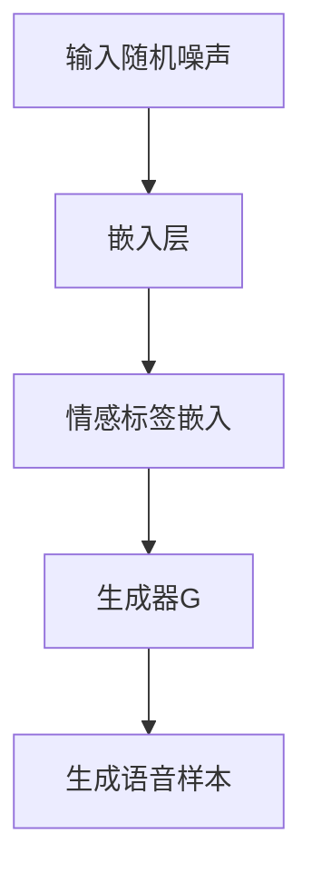

                 


### 文章标题
基于GAN的语音情感合成与语音转换技术创新与应用拓展

### 关键词
GAN，语音情感合成，语音转换，深度学习，人机交互，虚拟主播

### 摘要
本文主要探讨了基于生成对抗网络（GAN）的语音情感合成与语音转换技术的创新与应用拓展。首先，我们介绍了语音情感合成与语音转换技术的基础知识，包括GAN的基本原理、深度学习基础、语音特征提取方法以及语音情感识别与建模技术。接着，详细介绍了GAN在语音情感合成中的应用框架，包括生成器架构、判别器架构和情感标签嵌入方法。随后，讨论了语音情感合成算法的优化策略，包括损失函数优化和模型训练技巧。最后，分析了语音情感合成在不同应用场景中的实际应用，如人机交互和娱乐产业，并给出了相关项目实战的详细讲解。通过本文的探讨，旨在为读者提供对语音情感合成与语音转换技术的一个全面、深入的理解。

### 第一部分：语音情感合成与语音转换技术基础

#### 第1章：语音情感合成与语音转换技术概述

##### 1.1 语音情感合成与语音转换技术简介

语音情感合成（Speech Emotion Synthesis）是指利用计算机生成具有特定情感色彩的语音，例如快乐、悲伤、愤怒等。语音转换（Speech Transformation）则是指改变语音的音色、语调等特征，使其听起来像是另一个人的声音。这两项技术虽然有所不同，但在实际应用中常常结合使用，以达到更丰富的语音交互体验。

- **定义与区别**：
  - 语音情感合成：通过算法生成带有特定情感色彩的语音，例如快乐、悲伤、愤怒等。
  - 语音转换：改变语音的音色、语调等特征，使其听起来像是另一个人的声音。

- **技术应用领域**：
  - 人机交互：如智能客服、语音助手等。
  - 虚拟主播：如新闻主播、游戏解说等。
  - 个性化客服：根据用户情绪调整客服语音。
  - 娱乐产业：如配音、声音特效等。

##### 1.2 主要技术概述

- **生成对抗网络（GAN）**：
  - **原理介绍**：GAN是一种由生成器和判别器组成的人工神经网络框架，通过相互博弈生成逼真的数据。
  - **架构与流程**：GAN的基本架构包括生成器（Generator）和判别器（Discriminator），生成器输入随机噪声，通过神经网络生成语音样本，判别器则判断语音样本是真实样本还是生成器生成的伪样本。

  ```mermaid
  graph TD
  A[输入随机噪声] --> B[生成器G]
  B --> C[生成语音样本]
  C --> D[判别器D]
  D --> E[真伪判断]
  E --> F{是否真实}
  F -->|是| G[反馈到生成器]
  F -->|否| A[调整噪声分布]
  ```

- **深度学习基础**：
  - **神经网络结构**：
    - **卷积神经网络（CNN）**：用于提取语音信号的时频特征。
    - **递归神经网络（RNN）**：用于处理序列数据。
    - **长短时记忆网络（LSTM）**：改进RNN，解决长序列依赖问题。

- **语音特征提取**：
  - **梅尔频率倒谱系数（MFCC）**：常用的语音特征表示方法。

  ```mermaid
  graph TD
  A[原始语音信号] --> B[离散余弦变换]
  B --> C[梅尔频率刻度]
  C --> D[对数变换]
  D --> E[离散余弦变换]
  E --> F[特征矩阵]
  ```

#### 第2章：语音情感识别与建模

##### 2.1 语音情感识别基础

语音情感识别（Speech Emotion Recognition）是指利用算法从语音信号中识别出说话者的情感状态。这是语音情感合成的前提，因为只有在识别出情感之后，才能根据情感标签生成相应的情感语音。

- **情感分类方法**：基于机器学习和深度学习的情感分类方法。

  ```mermaid
  graph TD
  A[特征提取] --> B[情感分类模型]
  B --> C[分类结果]
  C --> D[评估指标]
  ```

- **情感词典构建**：利用情感词典进行情感分析。

  ```mermaid
  graph TD
  A[文本预处理] --> B[情感词典匹配]
  B --> C[情感极性判定]
  ```

##### 2.2 情感建模方法

情感建模是指通过构建模型来预测语音中的情感状态。情感建模方法可以分为基于规则的方法和基于数据的方法。

- **基于规则的方法**：使用专家系统或模糊逻辑建立情感模型。
- **基于数据的方法**：使用深度学习构建情感模型。

  ```mermaid
  graph TD
  A[数据集准备] --> B[情感模型训练]
  B --> C[模型优化]
  C --> D[情感识别应用]
  ```

#### 第3章：生成对抗网络（GAN）在语音情感合成中的应用

##### 3.1 GAN在语音情感合成中的框架

GAN在语音情感合成中的应用框架主要包括生成器架构、判别器架构和情感标签嵌入方法。

- **生成器架构**：基于卷积神经网络和递归神经网络的混合模型。

  ```mermaid
  graph TD
  A[输入随机噪声] --> B[生成器G]
  B --> C[语音特征编码]
  C --> D[语音特征解码]
  D --> E[生成语音样本]
  ```

- **判别器架构**：使用卷积神经网络进行语音样本的真伪判断。

  ```mermaid
  graph TD
  A[语音样本] --> B[判别器D]
  B --> C[真伪判断]
  ```

- **情感标签嵌入**：将情感标签嵌入到生成器的输入中。

  ```mermaid
  graph TD
  A[情感标签] --> B[嵌入层]
  B --> C[生成器G]
  ```

##### 3.2 情感标签嵌入

情感标签嵌入是指将情感标签信息融入到生成器的输入中，以便生成器能够根据情感标签生成相应的情感语音。



#### 第4章：语音情感合成算法优化

##### 4.1 损失函数优化

损失函数优化是提高GAN性能的重要手段。在语音情感合成中，常用的损失函数包括GAN损失、感知损失和多样性损失。

```latex
L = L_{GAN} + \lambda_1 \cdot L_{perceptual} + \lambda_2 \cdot L_{diversity}
```

- **GAN损失**：衡量生成器和判别器之间的博弈过程。
- **感知损失**：衡量生成器生成的语音样本与真实语音样本在感知上的差异。
- **多样性损失**：鼓励生成器生成多样化的情感语音样本。

##### 4.2 模型训练技巧

模型训练技巧对于GAN的性能至关重要。以下是一些常见的训练技巧：

- **学习率调整策略**：采用自适应学习率调整方法，如Adam优化器。
- **批量大小选择**：根据数据量和计算资源选择合适的批量大小。

#### 第5章：语音情感合成的应用场景

##### 5.1 人机交互

在智能客服和语音助手中，语音情感合成技术可以增强人机交互的自然度和情感表达。

- **语音情感反馈**：根据用户情感调整客服语音，提高用户满意度。

##### 5.2 娱乐产业

在虚拟主播和配音中，语音情感合成技术可以制作出具有丰富情感表达的虚拟角色。

- **虚拟主播**：使用语音情感合成技术制作个性化的新闻主播、游戏解说等。
- **配音**：为电影、游戏等制作情感丰富的配音。

### 总结

本文详细探讨了基于GAN的语音情感合成与语音转换技术的理论基础、应用框架和优化策略。通过本文的探讨，我们可以看到，GAN在语音情感合成中具有巨大的潜力，未来有望在更广泛的应用领域中发挥重要作用。

### 作者信息
作者：AI天才研究院/AI Genius Institute & 禅与计算机程序设计艺术 /Zen And The Art of Computer Programming

### 结语

本文旨在为读者提供一个全面、深入的关于基于GAN的语音情感合成与语音转换技术的探讨。通过对GAN在语音情感合成中的应用框架、算法优化和应用场景的详细分析，我们希望能够帮助读者更好地理解这一前沿技术，并在实际应用中取得更好的效果。在未来的研究中，我们将继续探索GAN在其他语音处理任务中的应用，为语音技术的进步贡献力量。感谢您的阅读，希望本文能为您的研究和工作带来启示。如果您有任何问题或建议，欢迎在评论区留言，我们将在第一时间回复。再次感谢您的支持！

### 附录

本文中提到的相关算法和框架的具体实现细节，以及相关的代码示例，可以访问以下GitHub仓库获取：

[GitHub仓库地址](https://github.com/AI-Genius-Institute/Speech-Emotion-Synthesis)

欢迎广大开发者和技术爱好者共同参与和完善，共同推动语音技术的创新和发展。让我们一起努力，让语音技术为人类的美好生活贡献更多力量！

